# gVisor — ユーザー空間カーネルによるコンテナ隔離

## 1. コンテナのセキュリティ課題

### 1.1 カーネル共有という根本的リスク

コンテナ技術は、ホストOSのカーネルを全コンテナで共有するという設計上の特性を持つ。Linux Namespace と cgroups によってプロセスの可視性とリソース使用量は制限されるが、すべてのコンテナは同一のカーネルコードパスを通じてシステムコールを発行する。Linux カーネルは約 300 以上のシステムコールを提供しており、そのコードベースは数千万行に及ぶ。この広大なコード表面積が、そのまま攻撃面（attack surface）となる。

```
従来のコンテナアーキテクチャ:

+-------------+  +-------------+  +-------------+
| Container A |  | Container B |  | Container C |
|  (App + Lib)|  |  (App + Lib)|  |  (App + Lib)|
+-------------+  +-------------+  +-------------+
|          共有カーネル (Linux)                    |
|  ~300+ システムコール = 巨大な攻撃面             |
+-------------------------------------------------+
|          ホストハードウェア                       |
+-------------------------------------------------+
```

カーネルの脆弱性が一つでも発見されれば、任意のコンテナからホスト全体への権限昇格（privilege escalation）が可能になり得る。実際に以下のような重大な脆弱性が過去に報告されている。

- **CVE-2016-5195（Dirty COW）**: Copy-on-Write の競合状態を悪用し、読み取り専用メモリへの書き込みが可能になる脆弱性。コンテナ内からホストのファイルシステムを改ざんできた。
- **CVE-2019-5736**: runc の脆弱性。コンテナ内からホストの runc バイナリを上書きし、後続のコンテナ作成時にホスト上で任意のコードを実行できた。
- **CVE-2020-14386**: Linux カーネルの AF_PACKET ソケットにおけるメモリ破壊の脆弱性。コンテナからの権限昇格に利用された。
- **CVE-2022-0185**: ファイルシステムコンテキストのヒープオーバーフロー。User Namespace が有効な環境でコンテナからの脱出が可能だった。

これらの事例が示すのは、Namespace や cgroups、seccomp、AppArmor/SELinux といった防御層を重ねても、カーネルそのものの脆弱性は防ぎようがないという構造的な問題である。

### 1.2 セキュリティ強化の既存アプローチとその限界

コンテナのセキュリティを高めるために、いくつかのアプローチが存在する。

**seccomp-bpf**: システムコールフィルタリングにより、コンテナが発行できるシステムコールを制限する。Docker のデフォルトプロファイルでは約 44 のシステムコールがブロックされる。しかし、許可されたシステムコールの中にも脆弱性が存在し得るため、根本的な解決にはならない。また、アプリケーションの動作に必要なシステムコールを正確に特定することは困難であり、プロファイルの設計には専門知識が要る。

**AppArmor / SELinux**: 強制アクセス制御（MAC）により、ファイルやネットワークへのアクセスを細かく制御できる。しかし、ポリシーの記述は複雑であり、カーネル自体の脆弱性を悪用する攻撃に対しては無力である。

**User Namespace**: コンテナ内の root ユーザーをホスト上の非特権ユーザーにマッピングする。権限昇格のリスクを低減するが、カーネルの脆弱性そのものを防ぐわけではない。

**read-only rootfs / capability の制限**: 攻撃の影響を限定する効果はあるが、やはりカーネルレベルの脆弱性に対する根本的な防御ではない。

これらの多層防御は重要だが、すべてに共通する限界がある。**ホストカーネルとの直接的なインターフェースが残り続ける**という点だ。この問題に対する根本的な解決策として、二つの方向性が提案された。

1. **マイクロVM方式**: 軽量な仮想マシンでコンテナを包み、ハードウェアレベルの隔離を提供する（Kata Containers、Firecracker など）
2. **ユーザー空間カーネル方式**: ホストカーネルの代わりに、ユーザー空間で動作するカーネルを挟むことでシステムコールを仲介する（gVisor）

gVisor は後者のアプローチを採り、独自の設計思想で従来にない隔離モデルを実現している。

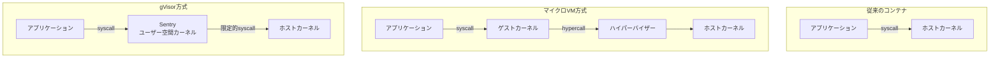

## 2. gVisor の設計思想

### 2.1 プロジェクトの誕生と背景

gVisor は Google が 2018 年にオープンソースとして公開したコンテナランタイムサンドボックスである。しかし、その技術的ルーツは Google 社内でのコンテナセキュリティの取り組みに遡る。Google は 2004 年頃からプロダクション環境でコンテナ（Borg）を運用しており、カーネル共有のリスクに早くから直面していた。社内で培われた知見をもとに、**ホストカーネルへの直接アクセスを遮断しつつ、VMのオーバーヘッドを回避する**という新しいアプローチが模索された。

gVisor は OCI（Open Container Initiative）互換のランタイムとして実装されており、`runsc`（"run sandboxed container"の略）というコマンドラインツールを通じて Docker や Kubernetes と統合できる。既存のコンテナエコシステムとの互換性を保ちつつ、セキュリティの大幅な向上を目指す。

### 2.2 根本的な設計原則

gVisor の設計は以下の原則に基づいている。

**原則1: 攻撃面の最小化（Attack Surface Reduction）**

Linux カーネルが提供する 300 以上のシステムコールのうち、gVisor のサンドボックスプロセス（Sentry）がホストカーネルに発行するシステムコールはわずか約 70 程度に限定される。アプリケーションが発行するシステムコールは Sentry によって解釈・処理され、必要最小限のホストシステムコールに変換される。これにより、ホストカーネルの攻撃面を劇的に縮小する。

**原則2: 防御の深さ（Defense in Depth）**

gVisor 自体がメモリ安全な言語（Go）で実装されている点も重要な設計判断である。C で書かれた Linux カーネルにはバッファオーバーフローや use-after-free といったメモリ安全性に起因する脆弱性が多数存在する。Go で書かれた gVisor のカーネル実装は、これらのクラスの脆弱性を構造的に排除する。

**原則3: 互換性の維持（Compatibility）**

gVisor は Linux カーネルの ABI（Application Binary Interface）を忠実に再実装することを目指している。アプリケーションはカーネルが変わったことを意識せず、そのまま動作する。既存のバイナリをリコンパイルなしで実行できることが設計目標である。

**原則4: プロセスレベルの柔軟性**

VMベースの隔離は「マシン全体」を隔離単位とするが、gVisor はプロセスレベルで動作する。これにより、個々のコンテナ単位で柔軟にサンドボックスを適用でき、リソースのオーバーヘッドもコンテナ単位で管理できる。

### 2.3 アーキテクチャ全体像

gVisor のアーキテクチャは、大きく3つのコンポーネントで構成される。

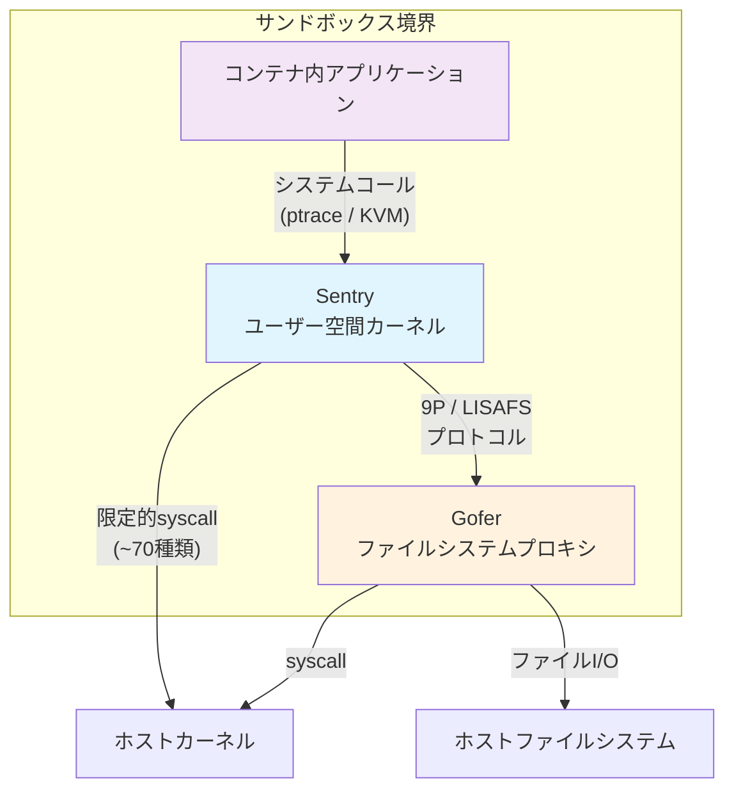

1. **Sentry**: ユーザー空間で動作するカーネル。アプリケーションのシステムコールをインターセプトし、Linux カーネルの機能をユーザー空間で再実装する。
2. **Gofer**: ファイルシステムへのアクセスを仲介するプロキシプロセス。Sentry とは独立したプロセスとして動作し、ホストファイルシステムへのアクセスを制御する。
3. **runsc**: OCI ランタイム仕様に準拠したフロントエンド。Docker や containerd と統合するためのインターフェースを提供する。

この分離アーキテクチャにより、仮に Sentry に脆弱性が発見されたとしても、ファイルシステムへの直接アクセスは Gofer を経由しなければならず、多層的な防御が実現される。

## 3. Sentry — ユーザー空間カーネル

### 3.1 Sentry の役割と位置づけ

Sentry は gVisor の中核をなすコンポーネントであり、「ユーザー空間で動作する Linux カーネル」として機能する。アプリケーションが発行するシステムコールを受け取り、その大部分をユーザー空間内で処理する。ホストカーネルに転送されるのは、メモリ確保やスレッド管理など、ユーザー空間では代替できない最小限の操作に限られる。

Sentry が実装するカーネルサブシステムは多岐にわたる。

- **プロセス管理**: fork、exec、wait、signal など
- **メモリ管理**: mmap、mprotect、brk など
- **ファイルシステム**: VFS（仮想ファイルシステム）レイヤー、tmpfs、procfs、sysfs、devfs など
- **ネットワーキング**: TCP/IP スタック（netstack）の完全な再実装
- **パイプとソケット**: Unix ドメインソケット、名前付きパイプなど
- **時間管理**: clock_gettime、timer_create など
- **epoll / poll / select**: I/O 多重化
- **futex**: ユーザー空間同期プリミティブ

### 3.2 システムコールの実装

Sentry は Linux のシステムコールを Go で再実装している。以下は、その概念を示す擬似的なコードである。

```go
// Simplified conceptual representation of syscall dispatch in Sentry
func (t *Task) executeSyscall(sysno uintptr, args SyscallArgs) (uintptr, error) {
    switch sysno {
    case syscall.SYS_READ:
        return t.sysRead(args)
    case syscall.SYS_WRITE:
        return t.sysWrite(args)
    case syscall.SYS_OPEN:
        return t.sysOpen(args)
    case syscall.SYS_MMAP:
        return t.sysMmap(args)
    case syscall.SYS_CLONE:
        return t.sysClone(args)
    // ... hundreds of syscall implementations
    default:
        return 0, syserror.ENOSYS
    }
}
```

重要なのは、各システムコールの実装がホストカーネルのシステムコールを直接呼ぶのではなく、Sentry 内部のデータ構造とロジックで処理を完結させるという点である。例えば `read(2)` の場合：

1. アプリケーションが `read(fd, buf, count)` を発行
2. Sentry がこのシステムコールをインターセプト
3. Sentry 内部のファイルディスクリプタテーブルから対象のファイルオブジェクトを検索
4. ファイルオブジェクトの種類に応じた処理を実行
   - tmpfs の場合: Sentry のメモリ内で完結
   - ホストファイルの場合: Gofer を経由してホストファイルシステムから読み取り
   - ソケットの場合: netstack で処理
5. 結果をアプリケーションのアドレス空間にコピーして返却

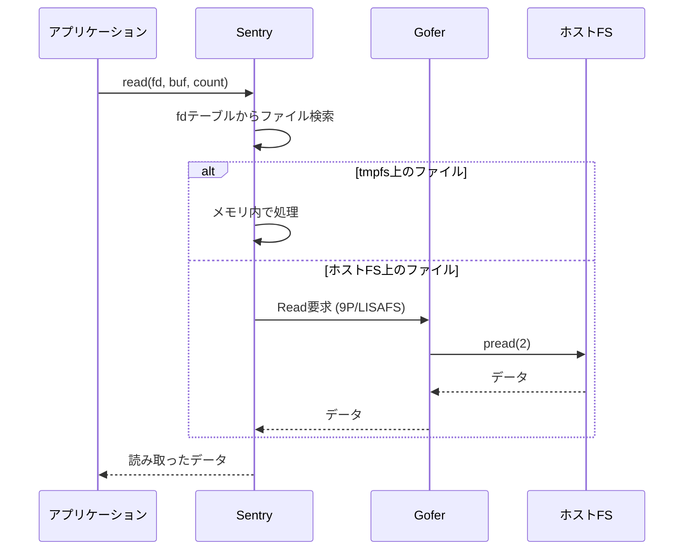

### 3.3 ネットワークスタック — netstack

gVisor の最も技術的に野心的な部分の一つが、TCP/IP スタックの完全な再実装である。**netstack** と呼ばれるこのコンポーネントは、Go で一から実装された TCP/IP スタックであり、ホストカーネルのネットワーキングコードに一切依存しない。

netstack は以下のプロトコルレイヤーを実装する。

- **リンク層**: Ethernet フレームの処理、ARP
- **ネットワーク層**: IPv4、IPv6、ICMP
- **トランスポート層**: TCP（輻輳制御含む）、UDP
- **アプリケーション層のサポート**: DNS 解決のためのスタブ

TCP の実装には輻輳制御アルゴリズム（Reno、CUBIC、SACK）も含まれており、RFC に準拠した動作を目指している。

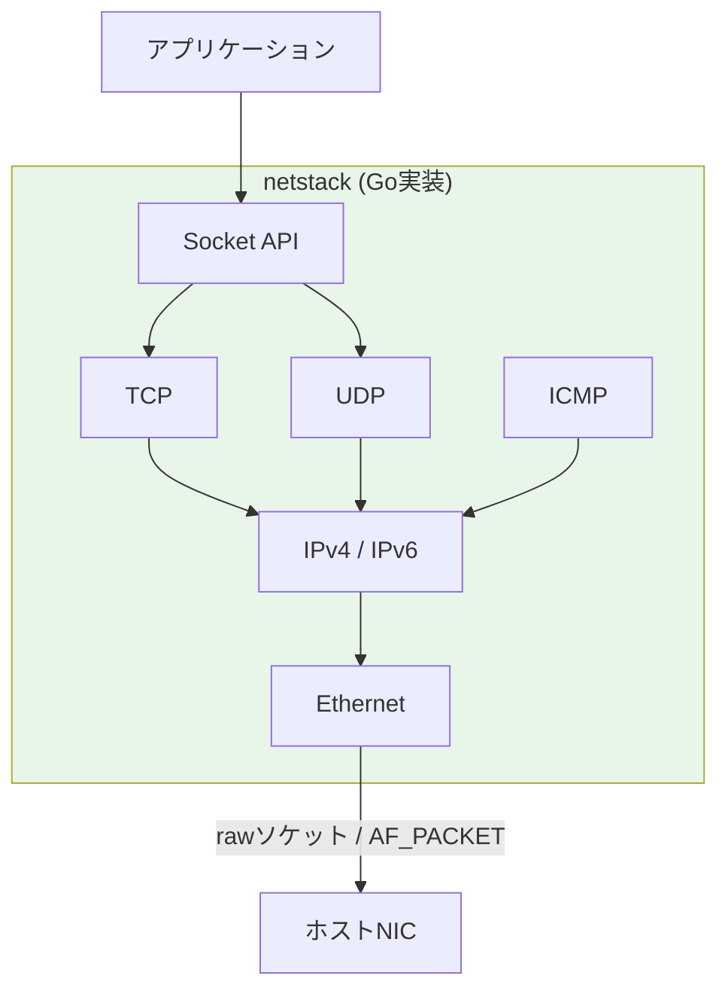

netstack をユーザー空間で再実装するメリットは明確である。

- ホストカーネルのネットワーキングコードという巨大な攻撃面を排除
- ネットワーク関連のカーネル脆弱性（CVE-2021-22555 など）の影響を受けない
- メモリ安全な Go で実装されているため、バッファオーバーフロー系の脆弱性が構造的に発生しない

一方で、パフォーマンス面ではホストカーネルのネットワークスタックに比べてオーバーヘッドがある。この点については後のセクションで詳述する。

### 3.4 メモリ管理

Sentry は独自のメモリ管理サブシステムを持つ。アプリケーションの `mmap` や `brk` といったシステムコールを処理し、仮想アドレス空間のレイアウトを管理する。実際の物理メモリの割り当てはホストカーネルに委譲するが、アドレス空間の論理的な管理は Sentry が行う。

Sentry のメモリ管理で特筆すべき点は、**メモリマッピングの遅延評価**と**Copy-on-Write のユーザー空間実装**である。これにより、fork 時のメモリ効率を従来のカーネル実装と同等に保つことができる。

### 3.5 Go による実装のトレードオフ

Sentry を Go で実装するという選択には、明確なトレードオフが存在する。

**メリット:**

| 側面 | 説明 |
|---|---|
| メモリ安全性 | バッファオーバーフロー、use-after-free、ダングリングポインタ等の脆弱性クラスを構造的に排除 |
| 並行処理 | goroutine による効率的な並行処理モデル。大量のコンテナを効率的に管理 |
| 開発生産性 | C に比べて高い生産性。カーネル規模のコードベースの保守が容易 |
| ガベージコレクション | 手動メモリ管理に伴うバグを排除 |

**デメリット:**

| 側面 | 説明 |
|---|---|
| GC のレイテンシ | ガベージコレクションによる予測困難な一時停止（pause）が発生し得る |
| ランタイムオーバーヘッド | Go のランタイム自体のメモリ消費とCPU使用 |
| 低レベル操作の制約 | インラインアセンブリやメモリレイアウトの完全な制御が難しい |
| 起動時間 | Go バイナリの起動はネイティブバイナリに比べてやや遅い |

Google のエンジニアは、セキュリティ上の利点が性能上のデメリットを上回ると判断した。カーネル脆弱性の多くがメモリ安全性に起因することを考えれば、この判断には合理性がある。

## 4. Gofer — ファイルシステムプロキシ

### 4.1 Gofer の設計目的

Gofer は、Sentry からホストファイルシステムへのアクセスを仲介する独立したプロセスである。Sentry がホストファイルシステムに直接アクセスできないようにすることで、Sentry が侵害された場合でもホストファイルシステムへの被害を限定する。

このアーキテクチャは、**最小権限の原則（Principle of Least Privilege）**を体現している。Sentry は計算処理に必要な権限のみを持ち、ファイルシステムへのアクセス権は Gofer に分離される。

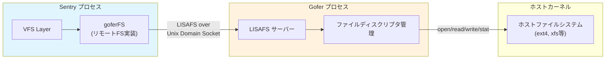

### 4.2 通信プロトコル: 9P から LISAFS へ

初期の gVisor では、Sentry と Gofer 間の通信に **9P プロトコル**が使われていた。9P は Plan 9 オペレーティングシステムに由来するファイルシステムプロトコルで、シンプルかつ汎用的な設計を持つ。しかし、gVisor のユースケースでは 9P のプロトコルオーバーヘッドが無視できないものとなった。

そこで gVisor チームは **LISAFS**（Linux Sandboxing File System）という独自プロトコルを開発した。LISAFS は gVisor のファイルシステムアクセスパターンに最適化されており、以下の改善を実現した。

- **ラウンドトリップの削減**: 複数の操作をバッチ処理できるメッセージ設計
- **メモリコピーの最小化**: 共有メモリを利用したゼロコピー転送
- **メタデータキャッシュ**: ファイル属性のキャッシュによる stat 呼び出しの削減

この最適化により、ファイルI/Oのパフォーマンスは大幅に改善された。

### 4.3 セキュリティ境界としての Gofer

Gofer の存在意義はパフォーマンス面だけではない。セキュリティアーキテクチャの観点から、以下の重要な役割を果たす。

**権限の分離**: Gofer は Sentry とは異なるプロセスとして動作する。Sentry が侵害されても、Gofer を経由しなければホストファイルシステムにアクセスできない。Gofer 自体も seccomp フィルタで利用可能なシステムコールが制限されており、万が一 Gofer が侵害されても被害は限定的である。

**アクセス制御の強制**: Gofer はコンテナに対してマウントされたパス以外へのアクセスを拒否する。path traversal 攻撃（`../../etc/shadow` のようなパス操作）は Gofer レベルでブロックされる。

**監査ポイント**: Sentry とGofer 間の通信はすべて定義されたプロトコルを通じて行われるため、ファイルアクセスの監査が容易である。

## 5. システムコールインターセプトの仕組み

### 5.1 プラットフォームの抽象化

gVisor は、アプリケーションのシステムコールをインターセプトするために**プラットフォーム**と呼ばれる抽象レイヤーを持つ。現在、二つのプラットフォームが実装されている。

1. **ptrace プラットフォーム**
2. **KVM プラットフォーム**

いずれのプラットフォームも、アプリケーションが `syscall` 命令（x86_64 では `SYSCALL`、ARM64 では `SVC`）を実行した際に制御を Sentry に移すという同じ目的を達成するが、そのメカニズムは大きく異なる。

### 5.2 ptrace プラットフォーム

ptrace プラットフォームは、Linux の `ptrace(2)` システムコールを利用してシステムコールをインターセプトする。`ptrace` は本来デバッガがプロセスの実行を監視・制御するための仕組みであり、gVisor はこれをシステムコールの横取りに転用する。

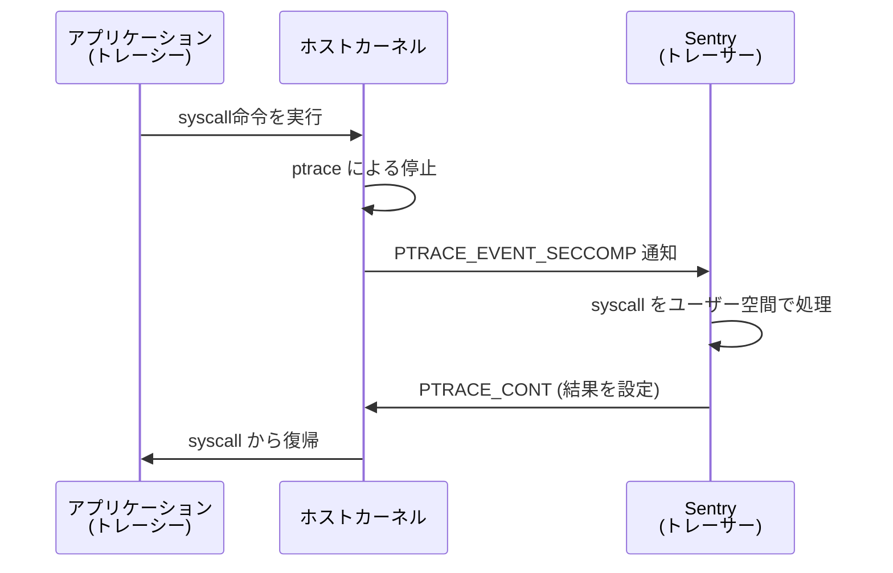

ptrace プラットフォームの動作フロー:

1. Sentry が `ptrace(PTRACE_ATTACH)` でアプリケーションプロセスにアタッチ
2. アプリケーションがシステムコールを発行
3. ホストカーネルが seccomp-bpf + ptrace の仕組みでアプリケーションを停止
4. Sentry に通知が到達
5. Sentry がシステムコール番号と引数を読み取り、ユーザー空間で処理
6. 結果をアプリケーションのレジスタに書き込み、実行を再開

**ptrace の利点**: 特別なハードウェアサポートや権限が不要。ほぼすべての Linux 環境で動作する。

**ptrace の欠点**: コンテキストスイッチのオーバーヘッドが大きい。一回のシステムコールインターセプトに対して、アプリケーション → カーネル → Sentry → カーネル → アプリケーションという複数のコンテキストスイッチが発生する。

### 5.3 KVM プラットフォーム

KVM プラットフォームは、Linux の KVM（Kernel-based Virtual Machine）インフラストラクチャを利用する。ただし、gVisor は KVM を「仮想マシンを動かすため」ではなく、「システムコールのトラップ機構」として使う点がユニークである。

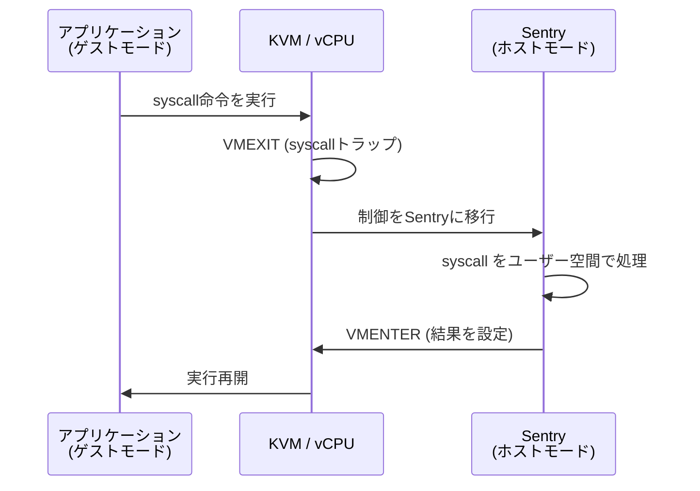

KVM プラットフォームでは、Sentry が KVM の仮想 CPU（vCPU）を作成し、アプリケーションをゲストモードで実行する。アプリケーションがシステムコールを発行すると VMEXIT が発生し、制御が Sentry（ホストモード）に戻る。

**KVM の利点**: ptrace に比べてコンテキストスイッチのオーバーヘッドが小さい。VMEXIT/VMENTER はハードウェアで最適化されており、ptrace の複数回のカーネル遷移よりも効率的。

**KVM の欠点**: `/dev/kvm` へのアクセスが必要。ネストされた仮想化環境や一部のクラウド環境では利用できない場合がある。

### 5.4 systrap プラットフォーム

近年、gVisor には **systrap** と呼ばれる新しいプラットフォームも追加された。systrap は `SIGSYS` シグナルを利用したシステムコールインターセプトを行う。seccomp-bpf フィルタでシステムコールをトラップし、`SIGSYS` シグナルハンドラ内で処理する。ptrace に比べてコンテキストスイッチのコストが低く、KVM のような特別なデバイスアクセスも不要という利点がある。

```
プラットフォーム比較:

+----------+------------+----------+--------------+
| 方式     | 速度       | 要件     | 環境互換性   |
+----------+------------+----------+--------------+
| ptrace   | 遅い       | なし     | 最も広い     |
| KVM      | 速い       | /dev/kvm | 限定的       |
| systrap  | 中程度     | なし     | 広い         |
+----------+------------+----------+--------------+
```

## 6. Kata Containers との比較

### 6.1 Kata Containers のアーキテクチャ

gVisor と同じ「コンテナセキュリティの強化」という目標を持つプロジェクトとして、**Kata Containers** がある。Kata Containers は軽量な仮想マシン（microVM）を使ってコンテナを隔離するアプローチを採る。

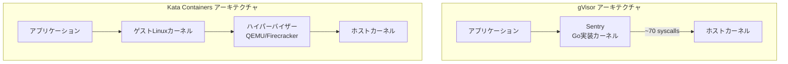

Kata Containers は各コンテナ（または Pod）を専用の軽量VMで包む。QEMU/KVM や Cloud Hypervisor、Firecracker といったハイパーバイザーを利用し、ゲストLinuxカーネルを起動する。アプリケーションはゲストカーネル上で動作し、ホストカーネルとはハイパーバイザーを介してのみ通信する。

### 6.2 比較表

| 観点 | gVisor | Kata Containers |
|---|---|---|
| **隔離メカニズム** | ユーザー空間カーネル（Sentry） | ハードウェア仮想化（VMX/SVM） |
| **カーネル** | Go で再実装（部分的） | 標準 Linux カーネル |
| **ホストカーネルの攻撃面** | ~70 syscalls | ハイパーバイザーの VMEXIT ハンドラ |
| **メモリオーバーヘッド** | 数十MB | 数百MB（ゲストOS分） |
| **起動時間** | 数百ミリ秒 | 数秒（カーネル起動含む） |
| **Linux 互換性** | 高い（ただし完全ではない） | ほぼ完全（本物のLinuxカーネル） |
| **ネットワーク性能** | オーバーヘッドあり（netstack） | ネイティブに近い（virtio-net） |
| **ファイルI/O性能** | オーバーヘッドあり（Gofer経由） | 準ネイティブ（virtio-fs） |
| **CPU性能** | ほぼネイティブ | ほぼネイティブ |
| **ハードウェア要件** | 特になし（ptraceの場合） | VT-x/AMD-V 必須 |
| **ネストされた仮想化** | 対応可能 | 環境依存 |

### 6.3 設計哲学の違い

gVisor と Kata Containers は、同じ問題に対して根本的に異なるアプローチを採っている。

**Kata Containers** は「既存の信頼された隔離技術（ハードウェア仮想化）をコンテナに適用する」という保守的なアプローチである。ハイパーバイザーの隔離は数十年にわたって検証されており、その信頼性は高い。また、ゲストカーネルが標準の Linux であるため、Linux 互換性の問題がほとんど発生しない。

**gVisor** は「新しい隔離レイヤーを設計し、攻撃面そのものを削減する」という革新的なアプローチである。メモリ安全な言語で書かれたカーネル実装により、脆弱性のクラス全体を排除する。一方で、Linux カーネルの完全な互換性を達成することは困難であり、一部のアプリケーションでは互換性の問題が発生する。

### 6.4 選択の指針

- **Linux 互換性が最優先**: Kata Containers が適している。特に、カーネルモジュールのロードやカーネル固有の機能に依存するアプリケーションの場合。
- **リソース効率が重要**: gVisor が適している。メモリオーバーヘッドが小さく、起動も速い。大量のコンテナを同時に実行する環境で有利。
- **ネストされた仮想化環境**: gVisor（ptrace/systrap）が適している。多くのクラウド VM ではネストされた仮想化がサポートされていないか、性能が低下する。
- **ネットワーク集約型ワークロード**: Kata Containers が適している。gVisor の netstack はパフォーマンスのオーバーヘッドが顕著。

## 7. パフォーマンス特性

### 7.1 オーバーヘッドの構造

gVisor のパフォーマンスオーバーヘッドは、主に以下の3つの要因から生じる。

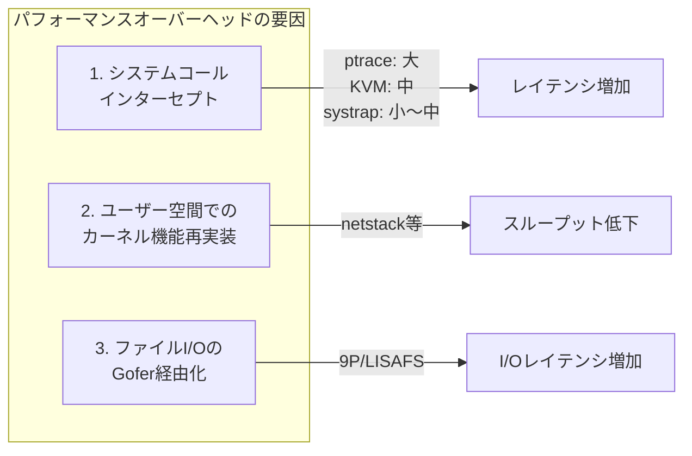

**1. システムコールインターセプトのコスト**

各システムコールの発行時に、プラットフォーム固有のトラップ機構が介入する。ネイティブのシステムコールが数百ナノ秒で完了するのに対し、gVisor では数マイクロ秒のオーバーヘッドが加わる。システムコールを高頻度で発行するワークロードほど影響が大きい。

**2. ユーザー空間カーネルの処理コスト**

Go のガベージコレクターや goroutine スケジューラなど、Go ランタイムの動作が付加的なコストをもたらす。特にメモリ割り当てが頻繁なワークロードでは、GC の一時停止が目立つ場合がある。

**3. ファイルI/Oの間接化**

Gofer を経由するファイルI/Oは、プロセス間通信（Unix ドメインソケット経由の LISAFS）のオーバーヘッドが加わる。メタデータ操作（stat、readdir など）が多いワークロードでは影響が顕著になる。

### 7.2 ワークロード別のパフォーマンス特性

gVisor のパフォーマンスはワークロードの特性によって大きく異なる。以下に典型的なワークロードカテゴリごとの傾向を示す。

**CPU 集約型ワークロード（数値計算、画像処理など）**

CPU バウンドな処理は、システムコールの頻度が低いため、gVisor のオーバーヘッドは最小限にとどまる。計算処理自体はアプリケーションのユーザー空間で実行されるため、gVisor の介入がほとんど発生しない。一般に 5% 未満のオーバーヘッドに収まることが多い。

**ネットワーク集約型ワークロード（Web サーバー、API ゲートウェイなど）**

netstack による TCP/IP 処理のオーバーヘッドが顕著になる。特に以下の面で影響が出る。

- TCP のスループット: ホストカーネルの TCP スタックに比べて低下
- レイテンシ: パケット処理のユーザー空間化によるレイテンシ増加
- コネクション確立: TCP ハンドシェイクの処理コスト

ネットワーク性能のオーバーヘッドは 20〜50% 程度になることがある。ただし、gVisor は **HostNetwork モード**（ホストカーネルのネットワークスタックを使用するモード）も提供しており、セキュリティとパフォーマンスのトレードオフを選択できる。

**ファイルI/O 集約型ワークロード（ビルド、ログ処理など）**

Gofer 経由のファイルアクセスが律速となる。特にメタデータ操作が多い場合（大量のファイルの stat、ディレクトリの再帰的な走査など）にオーバーヘッドが大きい。一方で、大きなファイルのシーケンシャルリードは比較的影響が小さい。

> [!TIP]
> gVisor は tmpfs の利用を推奨している。tmpfs は Sentry 内部のメモリで処理されるため、Gofer を経由せず高速に動作する。一時ファイルやキャッシュには tmpfs を活用することで、ファイルI/Oのオーバーヘッドを回避できる。

**起動時間**

gVisor のコンテナ起動時間は、通常のコンテナ（runc）に比べて多少のオーバーヘッドがあるが、Kata Containers のようにゲストカーネルのブートを伴わないため、数百ミリ秒程度で完了する。短命なコンテナ（サーバーレス関数など）にも適用可能な起動速度である。

### 7.3 最適化の取り組み

gVisor チームは継続的にパフォーマンスの改善に取り組んでおり、以下のような最適化が行われている。

- **LISAFS プロトコルの導入**: 9P から LISAFS への移行により、ファイルI/O のオーバーヘッドを大幅に削減
- **VFS2 の実装**: 仮想ファイルシステムレイヤーの再設計により、ファイル操作の効率を向上
- **systrap プラットフォーム**: ptrace に代わる軽量なシステムコールインターセプト方式
- **FUSE（directfs）**: Gofer を経由せずにホストファイルシステムに直接アクセスする実験的モード。セキュリティと性能のバランスを調整可能
- **GSO（Generic Segmentation Offload）のサポート**: netstack のネットワーク性能向上

## 8. GKE Sandbox での採用

### 8.1 GKE Sandbox とは

Google Kubernetes Engine（GKE）は、gVisor を **GKE Sandbox** という名称でマネージドサービスとして提供している。GKE Sandbox は、gVisor の `runsc` ランタイムを GKE クラスタに統合し、特定の Pod に対してサンドボックス化されたランタイムを適用できる機能である。

```yaml
# GKE Sandbox を使用する Pod の例
apiVersion: v1
kind: Pod
metadata:
  name: sandboxed-app
spec:
  runtimeClassName: gvisor  # gVisor ランタイムを指定
  containers:
  - name: app
    image: nginx:latest
    ports:
    - containerPort: 80
```

GKE Sandbox は `RuntimeClass` リソースを通じて有効化される。ノードプールの作成時にサンドボックスを有効化すると、そのノードプール上の Pod は gVisor ランタイムで実行される。

### 8.2 GKE Sandbox のアーキテクチャ

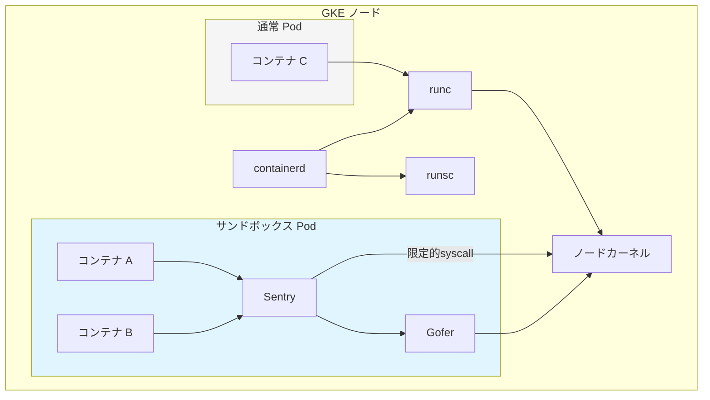

GKE Sandbox では、Pod 単位で gVisor の適用を選択できる。同一クラスタ内でサンドボックス化された Pod と通常の Pod を共存させることが可能である。これにより、セキュリティが特に重要なワークロード（信頼できないコードの実行、マルチテナント環境など）にのみ gVisor を適用し、パフォーマンスが重視されるワークロードには通常のランタイムを使うという柔軟な運用ができる。

### 8.3 GKE Sandbox のユースケース

Google が GKE Sandbox の適用を推奨する典型的なユースケースは以下の通りである。

**マルチテナント環境**: 複数のテナントが同一クラスタを共有する場合、テナント間の隔離を強化する。あるテナントのワークロードが侵害されても、他のテナントやホストノードへの影響を防ぐ。

**信頼できないコードの実行**: CI/CD パイプラインでのビルド実行、ユーザー提供のコードの実行（オンラインジャッジ、FaaS など）。信頼できないコードがホストに影響を与えるリスクを最小化する。

**セキュリティコンプライアンス**: 金融、医療などの規制業種で求められる追加的な隔離レイヤーの提供。

### 8.4 GKE Sandbox の制約

GKE Sandbox を使用する際には、以下の制約に注意が必要である。

- **GPU アクセス不可**: サンドボックス化された Pod から GPU を直接利用できない
- **ホストネットワーク不可**: `hostNetwork: true` が使用できない
- **特権コンテナ不可**: `privileged: true` が使用できない
- **一部のシステムコール非対応**: gVisor が実装していないシステムコールに依存するアプリケーションは動作しない
- **パフォーマンスオーバーヘッド**: 前述のパフォーマンス特性に基づくオーバーヘッドが存在する

## 9. ユースケースと制約

### 9.1 gVisor が適するユースケース

**信頼できないコードの実行**

最も典型的なユースケースである。オンラインプログラミング環境、CI/CD パイプラインのビルドステップ、サーバーレスプラットフォームなど、ユーザーが提供するコードを実行する環境では、コードの信頼性を前提にできない。gVisor は、たとえアプリケーションがカーネルの脆弱性を悪用しようとしても、ホストカーネルへの攻撃面を最小化する。

**マルチテナントコンテナプラットフォーム**

SaaS プラットフォームや PaaS プラットフォームでは、異なる顧客のワークロードが同一のインフラストラクチャ上で実行される。gVisor による追加の隔離レイヤーは、テナント間のセキュリティ境界を強化する。

**Web アプリケーションのフロントエンド**

インターネットに直接公開される Web アプリケーションは攻撃面が広い。gVisor でサンドボックス化することで、仮にアプリケーションが侵害されても、ホストシステムへの影響を抑制できる。

**コンテナ化されたマイクロサービス**

多数のマイクロサービスが動作する環境では、一つのサービスの侵害が他のサービスやインフラに波及するリスクがある。gVisor はサービスごとの隔離を強化し、**blast radius（被害範囲）**を最小化する。

### 9.2 gVisor が適さないケース

**高性能ネットワーキングが必要なワークロード**

データベースプロキシ、リアルタイムストリーミング、高スループットのメッセージブローカーなど、ネットワーク性能がクリティカルなワークロードでは、netstack のオーバーヘッドが許容できない場合がある。

**カーネルモジュールに依存するアプリケーション**

gVisor はユーザー空間でカーネル機能を再実装するため、カーネルモジュールのロード（`insmod` など）はサポートされない。eBPF プログラムのロードも制限される。

**特殊なシステムコールに依存するアプリケーション**

gVisor は Linux の全システムコールを実装しているわけではない。`io_uring`、`perf_event_open`、一部の `ioctl` など、未実装のシステムコールに依存するアプリケーションは動作しない可能性がある。

**リアルタイム性が要求されるワークロード**

Go のガベージコレクターによる一時停止は、厳密なリアルタイム要件を持つワークロードには不適切である。産業用制御システムや高頻度取引システムなどには向かない。

### 9.3 互換性の現状

gVisor の Linux 互換性は年々向上している。2026 年現在、主要なプログラミング言語のランタイム（Python、Node.js、Java、Go、Ruby、Rust など）や多くの一般的なソフトウェア（Nginx、Redis、PostgreSQL、MySQL など）が gVisor 上で動作する。

しかし、100% の互換性は設計上の目標ではあるものの、まだ達成されていない。以下のような領域で互換性の問題が報告されている。

- **/proc、/sys の一部エントリ**: gVisor の procfs/sysfs は Linux カーネルのすべてのエントリを実装しているわけではない。特定のエントリに依存するモニタリングツールが動作しない場合がある。
- **高度なネットワーク機能**: raw ソケット、netfilter（iptables/nftables）の一部機能、一部のソケットオプションが未サポート。
- **ファイルシステムの高度な機能**: inotify の一部イベント、xattr の制限、ファイルロックの一部挙動の差異。

> [!WARNING]
> gVisor 上でアプリケーションを実行する際は、事前にテスト環境で動作確認を行うことを強く推奨する。特に、低レベルのシステム操作やカーネル固有の機能に依存するアプリケーションでは互換性の問題が発生しやすい。

### 9.4 gVisor のセキュリティモデルの限界

gVisor は強力なセキュリティツールであるが、万能ではない。以下の限界を理解しておく必要がある。

**Sentry 自体の脆弱性**: Sentry は Go で書かれているためメモリ安全性の問題は少ないが、ロジックバグやシステムコール実装の不備が脆弱性となる可能性はある。Sentry が侵害された場合、そこからホストカーネルへの限定的なシステムコール（~70種類）を介した攻撃が理論上は可能である。

**サイドチャネル攻撃**: gVisor は Spectre や Meltdown のような CPU レベルのサイドチャネル攻撃に対しては追加の防御を提供しない。これらの攻撃に対してはハードウェアレベルの対策（マイクロコードアップデートなど）が必要である。

**リソース消費型攻撃**: gVisor はリソースの隔離を cgroups に委ねている。CPU やメモリの大量消費による DoS 攻撃に対しては、cgroups の設定が適切でなければ影響を受ける。

## 10. まとめと今後の展望

### 10.1 gVisor の位置づけ

gVisor は、コンテナセキュリティの課題に対して独自のアプローチで挑む技術である。ハードウェア仮想化（VM）ほどのオーバーヘッドなく、通常のコンテナよりも大幅に高いセキュリティを提供する。特に以下の点で画期的である。

1. **攻撃面の劇的な削減**: ホストカーネルへのシステムコールを ~70 に限定
2. **メモリ安全な実装**: Go による実装でメモリ脆弱性のクラスを排除
3. **プロセスレベルの柔軟性**: VM に比べて軽量で起動も速い
4. **既存エコシステムとの統合**: OCI 互換で Docker/Kubernetes とシームレスに連携

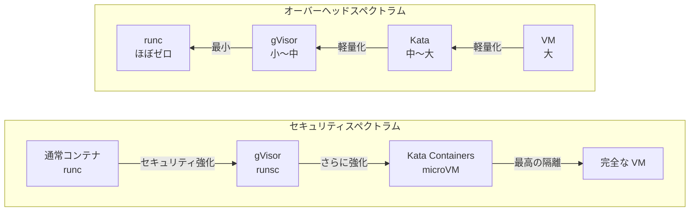

### 10.2 今後の展望

gVisor は活発に開発が続けられており、以下の方向性で進化が期待される。

**互換性の向上**: Linux カーネルのシステムコール互換性は継続的に改善されている。`io_uring` のサポートなど、モダンなカーネル機能への対応も進んでいる。

**パフォーマンスの最適化**: systrap プラットフォームの成熟、LISAFS の改善、directfs モードの安定化など、パフォーマンスの課題に対する取り組みが続いている。

**ARM64 対応の成熟**: ARM アーキテクチャへの対応が進んでおり、AWS Graviton などの ARM ベースのクラウドインスタンスでの利用が現実的になりつつある。

**エコシステムの拡大**: GKE Sandbox 以外にも、各種クラウドプロバイダーやコンテナプラットフォームでの採用が広がる可能性がある。

コンテナ技術がソフトウェアインフラストラクチャの基盤として定着した現在、カーネル共有のリスクをどう管理するかは本質的な課題であり続ける。gVisor は「ユーザー空間カーネル」という斬新なアプローチでこの課題に正面から挑み、セキュリティとパフォーマンスの新しい均衡点を提示している。完全な解決策は存在しないが、脅威モデルとワークロード特性に応じて gVisor を適切に活用することで、コンテナ環境のセキュリティを大幅に向上させることができる。
