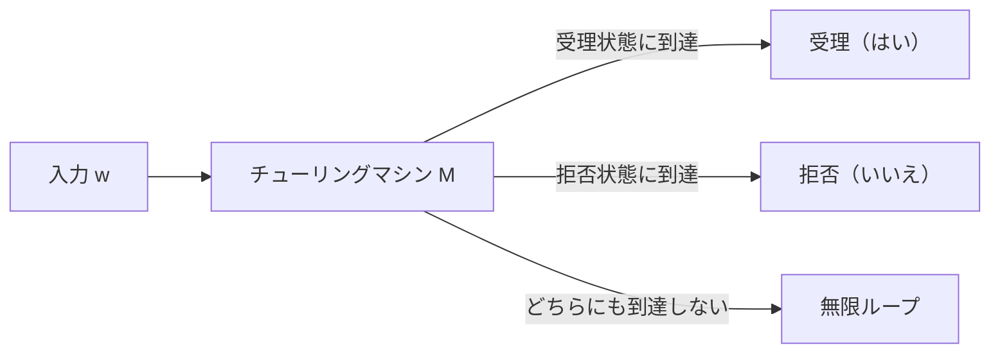
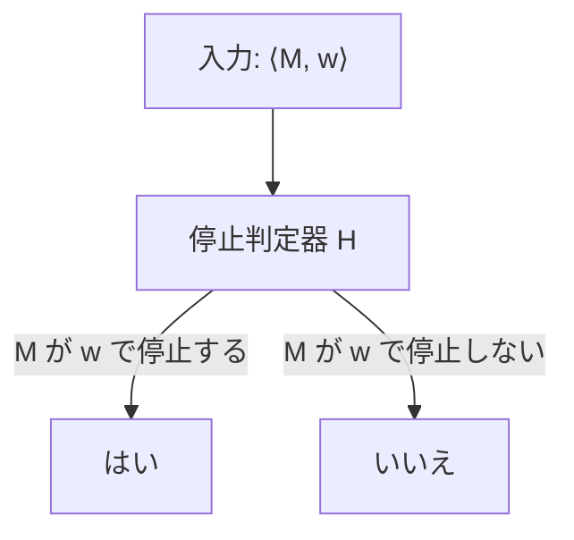
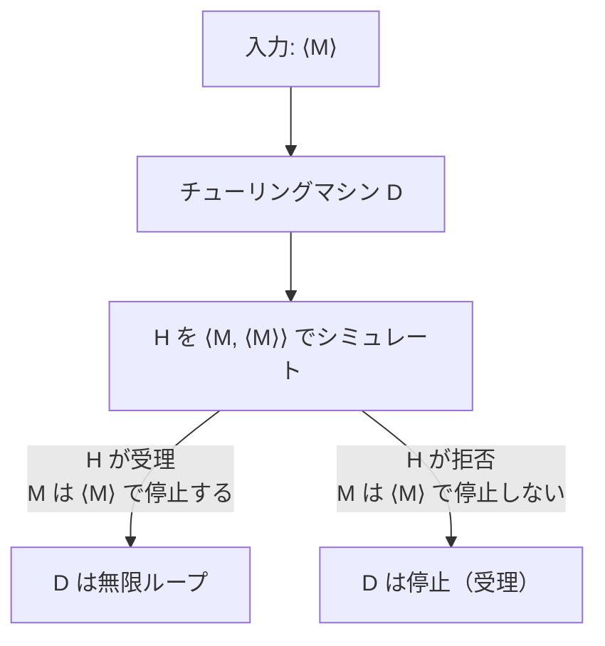
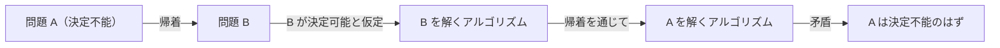
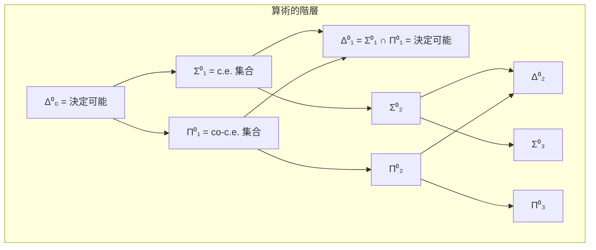
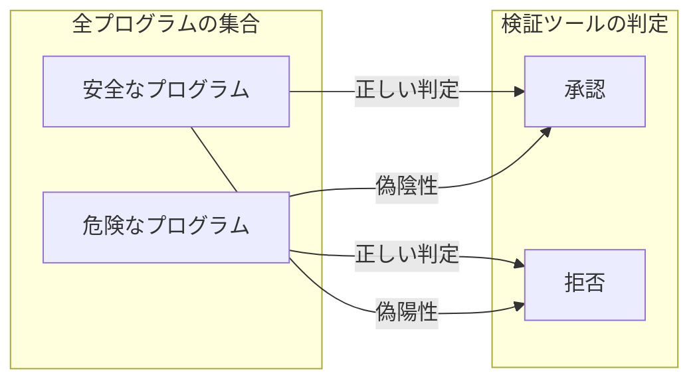
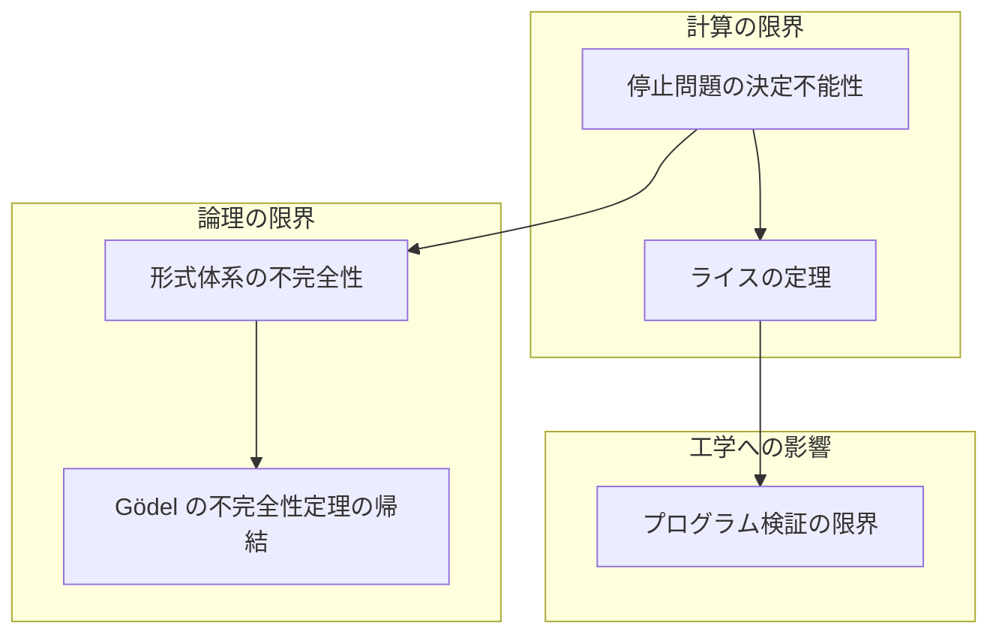

# 停止問題と決定不能性

## 1. 決定問題とは

### 1.1 計算可能性理論の出発点

コンピューターサイエンスの根底には、ある素朴で深い問いがある。**「コンピューターにはどこまでのことができるのか？」**——この問いに対して、理論的な枠組みを与えるのが**計算可能性理論（computability theory）**であり、その中心的な概念が**決定問題（decision problem）**である。

決定問題とは、ある入力が与えられたとき、それに対して「はい」か「いいえ」を返す問題のことである。形式的に述べると、アルファベット $\Sigma$ 上の言語 $L \subseteq \Sigma^*$ に対して、「与えられた文字列 $w$ が $L$ に属するか否か」を判定する問題が決定問題である。

$$
\text{決定問題 } L: \quad w \in L \text{ ？}
$$

たとえば以下はすべて決定問題である。

- 与えられた自然数 $n$ は素数か？
- 与えられたグラフ $G$ はハミルトン閉路を持つか？
- 与えられたプログラム $P$ は入力 $x$ に対して停止するか？

決定問題が**決定可能（decidable）**であるとは、その問題を解くアルゴリズム——つまり、任意の入力に対して有限時間で正しい答えを返すチューリングマシン——が存在することをいう。素数判定問題は決定可能である（AKS素数判定法など）。一方、上に挙げた3番目の問題——これが本記事の主題である**停止問題（halting problem）**——は決定不能であることが証明されている。

### 1.2 チューリングマシンの形式的定義

決定問題を厳密に議論するためには、「アルゴリズム」の形式的モデルが必要である。最も広く用いられるモデルが**チューリングマシン（Turing machine, TM）**である。

::: details チューリングマシンの形式的定義
チューリングマシン $M$ は7つ組 $(Q, \Sigma, \Gamma, \delta, q_0, q_{\text{accept}}, q_{\text{reject}})$ で定義される。

- $Q$：状態の有限集合
- $\Sigma$：入力アルファベット（空白記号 $\sqcup$ を含まない）
- $\Gamma$：テープアルファベット（$\Sigma \subseteq \Gamma$, $\sqcup \in \Gamma$）
- $\delta: Q \times \Gamma \to Q \times \Gamma \times \{L, R\}$：遷移関数
- $q_0 \in Q$：開始状態
- $q_{\text{accept}} \in Q$：受理状態
- $q_{\text{reject}} \in Q$：拒否状態（$q_{\text{accept}} \neq q_{\text{reject}}$）
:::

チューリングマシンの計算過程は次のように進む。

1. 入力文字列がテープ上に書かれ、ヘッドは先頭を指す
2. 現在の状態とヘッドが読んでいる記号に基づき、遷移関数 $\delta$ に従って次の状態に遷移し、記号を書き換え、ヘッドを左右に動かす
3. 受理状態 $q_{\text{accept}}$ に到達すれば「受理」、拒否状態 $q_{\text{reject}}$ に到達すれば「拒否」
4. どちらにも到達しなければ、マシンは**永遠に動き続ける（ループする）**



この最後のケース——無限ループ——が、停止問題の本質と深く関わっている。

### 1.3 決定可能性と認識可能性

チューリングマシンと言語の関係において、2つの重要な概念を区別する必要がある。

**決定可能（decidable）**：言語 $L$ が決定可能であるとは、あるチューリングマシン $M$ が存在して、任意の入力 $w$ に対して：
- $w \in L$ ならば $M$ は受理する
- $w \notin L$ ならば $M$ は拒否する

つまり、$M$ は**必ず停止する**。このような $M$ を**判定器（decider）**という。

**認識可能（recognizable）**：言語 $L$ が認識可能（あるいは**再帰的可算（recursively enumerable, r.e.）**）であるとは、あるチューリングマシン $M$ が存在して、任意の入力 $w$ に対して：
- $w \in L$ ならば $M$ は受理する
- $w \notin L$ ならば $M$ は拒否するか、**永遠にループする**

認識可能性は決定可能性よりも弱い条件である。決定可能な言語は必ず認識可能だが、逆は成り立たない。停止問題は認識可能だが決定可能ではない——これが本記事で証明する中心的な定理である。

## 2. 停止問題の形式的定義

### 2.1 プログラムの符号化

停止問題を形式的に定義するためには、まず「プログラム」をチューリングマシンの入力として表現する必要がある。任意のチューリングマシン $M$ はその遷移関数や状態の情報によって有限の文字列で記述できる。この文字列を $\langle M \rangle$ と書き、$M$ の**符号化（encoding）**あるいは**記述（description）**と呼ぶ。

同様に、チューリングマシン $M$ と入力 $w$ の組を $\langle M, w \rangle$ と書く。この符号化は具体的にどう行うかはいくつかの方法があるが、合理的な符号化はすべて同等であるため、具体的な方式は問題ではない。

重要なのは、**チューリングマシンそのものがチューリングマシンの入力になりうる**という点である。これはプログラムがデータとして扱えるという、現代のコンピューターにおいて当然のことでもある。インタプリタやコンパイラは、プログラムを入力として受け取り処理するプログラムである。

### 2.2 停止問題の定義

**停止問題（halting problem）**は次の言語として定義される。

$$
\text{HALT} = \{ \langle M, w \rangle \mid M \text{ はチューリングマシンであり、} M \text{ は入力 } w \text{ で停止する} \}
$$

すなわち、「チューリングマシン $M$ と入力 $w$ が与えられたとき、$M$ は $w$ に対して停止するか（受理または拒否するか）？」という問題である。



直感的には、この問題は「プログラムが無限ループに陥るかどうかを事前に判定できるか」という問題に対応する。もし停止問題を解くアルゴリズムが存在すれば、任意のプログラムのバグ（無限ループ）を自動検出できることになる。

### 2.3 なぜ停止問題は重要か

停止問題が計算可能性理論において中心的な位置を占める理由はいくつかある。

**理論的意義**：停止問題は、形式的に定義可能な最も自然な決定不能問題の一つである。その証明は対角線論法というシンプルだが強力な技法を用いており、計算の限界を理解するうえでの出発点となる。

**実践的意義**：停止問題の決定不能性は、プログラムの性質を完全に自動検証することが原理的に不可能であることを意味する。コンパイラの最適化、バグ検出ツール、形式検証——これらすべてが停止問題の壁に直面する。

**歴史的意義**：Alan Turing が1936年の論文 *"On Computable Numbers, with an Application to the Entscheidungsproblem"* で停止問題の決定不能性（ただし当時はこの名称ではなかった）を証明したことは、Hilbert の決定問題に対する否定的回答の一部であり、理論計算機科学の誕生を告げるものであった。

## 3. 停止問題の決定不能性の証明

### 3.1 証明の概要

停止問題が決定不能であることの証明は、**背理法（proof by contradiction）**と**対角線論法（diagonalization）**を組み合わせたものである。証明の構造は以下のとおりである。

1. 停止問題を解くチューリングマシン $H$ が存在すると仮定する
2. $H$ を用いて、矛盾を引き起こすチューリングマシン $D$ を構成する
3. $D$ の振る舞いを分析すると、どちらの場合も矛盾が生じることを示す
4. したがって、$H$ は存在しない

### 3.2 詳細な証明

**定理**：停止問題 $\text{HALT}$ は決定不能である。

**証明**：

背理法で証明する。停止問題を決定するチューリングマシン $H$ が存在すると仮定する。すなわち、$H$ は入力 $\langle M, w \rangle$ に対して：

- $M$ が $w$ で停止するならば、$H$ は受理する
- $M$ が $w$ で停止しないならば、$H$ は拒否する

そして $H$ 自身は必ず停止する。

この $H$ を使って、新しいチューリングマシン $D$ を次のように構成する。

$D$ は入力 $\langle M \rangle$（チューリングマシン $M$ の記述）を受け取り、以下を実行する：

1. $H$ を $\langle M, \langle M \rangle \rangle$ に対してシミュレートする（つまり、$M$ が自分自身の記述を入力として受け取ったとき停止するかを判定する）
2. $H$ が受理したならば（$M$ が $\langle M \rangle$ で停止するならば）、$D$ は**無限ループ**に入る
3. $H$ が拒否したならば（$M$ が $\langle M \rangle$ で停止しないならば）、$D$ は**停止する**（受理する）



ここで、$D$ 自身もチューリングマシンであるから、$D$ に自分自身の記述 $\langle D \rangle$ を入力として与えることができる。$D$ に $\langle D \rangle$ を入力したとき、何が起こるかを考える。

**場合1**：$D$ が $\langle D \rangle$ で**停止する**と仮定する。
- このとき、$H(\langle D, \langle D \rangle \rangle)$ は受理する（$D$ は $\langle D \rangle$ で停止するから）
- $D$ の定義により、$H$ が受理したならば $D$ は無限ループに入る
- したがって $D$ は $\langle D \rangle$ で**停止しない** ——矛盾

**場合2**：$D$ が $\langle D \rangle$ で**停止しない**と仮定する。
- このとき、$H(\langle D, \langle D \rangle \rangle)$ は拒否する（$D$ は $\langle D \rangle$ で停止しないから）
- $D$ の定義により、$H$ が拒否したならば $D$ は停止する
- したがって $D$ は $\langle D \rangle$ で**停止する** ——矛盾

どちらの場合も矛盾が生じる。これは $H$ の存在を仮定したことが誤りであったことを意味する。したがって、停止問題を決定するチューリングマシンは存在しない。$\square$

### 3.3 対角線論法との関係

この証明が「対角線論法」と呼ばれるのは、Georg Cantor が実数の非可算性を証明した際に用いた手法と本質的に同じ構造を持つからである。

Cantor の対角線論法では、実数を列挙できると仮定し、列挙された実数の $n$ 番目の小数第 $n$ 位の数字を変えることで、列挙に含まれない新しい実数を構成して矛盾を導いた。

停止問題の証明でも同様の構造がある。チューリングマシンを $M_1, M_2, M_3, \ldots$ と列挙し、チューリングマシン $M_i$ が入力 $\langle M_j \rangle$ で停止するかどうかを表す無限の表を考える。

$$
\begin{array}{c|cccc}
 & \langle M_1 \rangle & \langle M_2 \rangle & \langle M_3 \rangle & \cdots \\
\hline
M_1 & \text{停止} & \text{ループ} & \text{停止} & \cdots \\
M_2 & \text{ループ} & \text{停止} & \text{ループ} & \cdots \\
M_3 & \text{停止} & \text{停止} & \text{停止} & \cdots \\
\vdots & \vdots & \vdots & \vdots & \ddots
\end{array}
$$

チューリングマシン $D$ は、この表の**対角線**（$M_i$ が $\langle M_i \rangle$ に対してどう振る舞うか）を反転させることで構成されている。$D$ は対角線上で「停止」なら「ループ」、「ループ」なら「停止」とするため、表のどの行とも一致しない。したがって $D$ はどのチューリングマシン $M_i$ とも異なる振る舞いを示すが、$D$ 自身もチューリングマシンであるから矛盾が生じる——これが停止問題の決定不能性の本質である。

### 3.4 証明の直感的理解

この証明を日常的な言葉で表現してみよう。

想像してほしい。「任意のプログラムが無限ループするかどうかを判定できる万能ツール」が存在すると主張する人がいるとする。そのツールを $H$ としよう。

あなたは $H$ を使って、次のような意地悪なプログラム $D$ を書く。

```
function D(program):
    if H(program, program) == "halts":
        while true:  // infinite loop
            pass
    else:
        return  // halt
```

そして $D$ に自分自身を入力として渡す。`D(D)` を実行すると何が起こるか？

- もし $H$ が「$D(D)$ は停止する」と判定するならば、$D$ は無限ループに入るので、$H$ の判定は間違い
- もし $H$ が「$D(D)$ は停止しない」と判定するならば、$D$ は停止するので、$H$ の判定は間違い

どちらにしても $H$ は間違える。つまり、そのような万能ツールは原理的に存在しえない。

::: warning 重要な注意
停止問題の決定不能性は「現在の技術では解けない」ということではない。**原理的に、どのようなアルゴリズムであっても解けない**ということである。計算機の速度やメモリがいかに向上しても、量子コンピューターを使っても、この限界は変わらない（量子チューリングマシンの計算可能性は古典チューリングマシンと同等であることが知られている）。
:::

### 3.5 停止問題の認識可能性

停止問題は決定不能だが、**認識可能（再帰的可算）**である。すなわち、$\langle M, w \rangle \in \text{HALT}$ であるものを（時間さえかければ）正しく識別するチューリングマシンは構成できる。

そのチューリングマシン $U$（**万能チューリングマシン（universal Turing machine）**）は、入力 $\langle M, w \rangle$ を受け取り、$M$ を $w$ 上でシミュレートする。$M$ が停止すれば $U$ も停止して受理する。$M$ が停止しなければ $U$ も永遠に動き続ける。

一方、$\text{HALT}$ の補集合 $\overline{\text{HALT}} = \{ \langle M, w \rangle \mid M \text{ は } w \text{ で停止しない} \}$ は認識可能ですらない。もし $\overline{\text{HALT}}$ が認識可能ならば、$\text{HALT}$ と $\overline{\text{HALT}}$ の両方が認識可能となり、よく知られた定理により $\text{HALT}$ は決定可能になってしまう。これは先ほど証明した決定不能性に矛盾する。

**定理**：言語 $L$ が決定可能であることと、$L$ と $\overline{L}$ がともに認識可能であることは同値である。

この定理の証明は直感的である。$L$ を認識するチューリングマシン $M_1$ と $\overline{L}$ を認識するチューリングマシン $M_2$ が存在するとき、入力 $w$ に対して $M_1$ と $M_2$ を並行してシミュレートする。$M_1$ が受理すれば受理、$M_2$ が受理すれば拒否する。$w \in L$ ならいずれ $M_1$ が受理し、$w \notin L$ ならいずれ $M_2$ が受理するから、このプロセスは必ず停止する。

## 4. ライスの定理

### 4.1 定理の内容

停止問題の決定不能性は、実は氷山の一角に過ぎない。**ライスの定理（Rice's theorem）**は、チューリングマシンが計算する関数の**非自明な性質**は**すべて決定不能**であることを示す、驚くべき一般化である。

まず用語を定義する。チューリングマシン $M$ が計算する**部分関数（partial function）**を $f_M$ と書く。$f_M(w)$ は、$M$ が入力 $w$ で停止して出力するなら出力値、停止しないなら未定義とする。

再帰的可算関数（チューリングマシンで計算可能な部分関数）全体の集合を $\mathcal{P}$ とする。$\mathcal{P}$ の部分集合 $S \subseteq \mathcal{P}$ が**非自明（nontrivial）**であるとは、$S \neq \emptyset$ かつ $S \neq \mathcal{P}$ であること、つまり $S$ に属する関数と属さない関数の両方が存在することをいう。

**ライスの定理**：$S \subseteq \mathcal{P}$ が非自明な性質であるとき、言語

$$
L_S = \{ \langle M \rangle \mid f_M \in S \}
$$

は決定不能である。

### 4.2 定理の意味

ライスの定理は、チューリングマシンの**振る舞い**に関するいかなる非自明な性質も、そのチューリングマシンの記述から決定することはできないということを述べている。

具体的な例を挙げる。以下はすべてライスの定理により決定不能である。

| 性質 | 形式的表現 |
|---|---|
| $M$ は何らかの入力で停止するか？ | $f_M \neq \text{（完全に未定義な関数）}$ |
| $M$ は恒等関数を計算するか？ | $f_M(w) = w \text{ for all } w$ |
| $M$ は定数関数を計算するか？ | $\exists c. \forall w. f_M(w) = c$ |
| $M$ が計算する関数は全域的か？ | $f_M$ は全域関数（すべての入力で定義） |
| $M$ が計算する言語は有限か？ | $L(M)$ は有限集合 |
| $M$ が計算する言語は正規言語か？ | $L(M)$ は正規言語 |

::: tip ライスの定理が述べないこと
ライスの定理は、チューリングマシンの**計算する関数の性質**（意味的性質、semantic property）についての定理である。チューリングマシンの**構造的性質**（syntactic property）——たとえば「$M$ の状態数は100以下か？」「$M$ は特定の遷移を含むか？」——には適用されない。構造的性質はチューリングマシンの記述を直接調べれば判定できるため、決定可能である。
:::

### 4.3 証明の概略

ライスの定理の証明は停止問題からの帰着を用いる。

$S \subseteq \mathcal{P}$ を非自明な性質とする。簡単のため、完全に未定義な関数（どの入力でも停止しない関数）$f_\bot \notin S$ と仮定する（$f_\bot \in S$ の場合は $S$ の代わりに $\overline{S}$ を考えればよい）。

$S$ が非自明なので、$f_M \in S$ を満たすチューリングマシン $M_S$ が存在する。

$L_S$ を決定するチューリングマシン $R$ が存在すると仮定する。$R$ を使って停止問題を解くチューリングマシンを構成する。

入力 $\langle M, w \rangle$ に対して、新しいチューリングマシン $M'$ を次のように構成する：

- $M'$ は入力 $x$ を受け取る
- まず $M$ を $w$ でシミュレートする
- $M$ が停止したら、$M_S$ を $x$ でシミュレートしてその結果を返す
- $M$ が停止しなければ、$M'$ も停止しない

この構成により：
- $M$ が $w$ で停止する場合：$f_{M'} = f_{M_S} \in S$ → $R$ は $\langle M' \rangle$ を受理
- $M$ が $w$ で停止しない場合：$f_{M'} = f_\bot \notin S$ → $R$ は $\langle M' \rangle$ を拒否

したがって $R(\langle M' \rangle)$ の結果から $M$ が $w$ で停止するかを判定できる。これは停止問題の決定可能性を意味し、矛盾。$\square$

## 5. 他の決定不能問題

停止問題は決定不能問題の最も有名な例であるが、計算可能性理論には多数の決定不能問題が知られている。いくつかの重要な例を紹介する。

### 5.1 ポスト対応問題（Post Correspondence Problem）

**ポスト対応問題（Post Correspondence Problem, PCP）**は、1946年に Emil Post が提案した決定不能問題である。停止問題とは異なり、一見すると計算やチューリングマシンとは無関係な、純粋に組み合わせ的な問題であるところが注目に値する。

**定義**：アルファベット $\Sigma$ 上のドミノの有限集合

$$
P = \left\{ \left[ \frac{u_1}{v_1} \right], \left[ \frac{u_2}{v_2} \right], \ldots, \left[ \frac{u_n}{v_n} \right] \right\}
$$

が与えられたとき、インデックスの列 $i_1, i_2, \ldots, i_k$（$k \geq 1$, 繰り返し可）で

$$
u_{i_1} u_{i_2} \cdots u_{i_k} = v_{i_1} v_{i_2} \cdots v_{i_k}
$$

を満たすものが存在するかを判定する問題。

**例**：$\Sigma = \{a, b\}$ として

$$
P = \left\{ \left[ \frac{a}{ab} \right], \left[ \frac{b}{a} \right], \left[ \frac{ab}{b} \right] \right\}
$$

ドミノ 1, 3, 1, 2 の順に並べると：

$$
\text{上: } a \cdot ab \cdot a \cdot b = aabab
$$
$$
\text{下: } ab \cdot b \cdot ab \cdot a = aabab
$$

上下が一致するので、この PCP インスタンスには解が存在する。

PCP は形式言語理論やコンパイラ理論と深い関わりを持つ。たとえば、文脈自由文法の曖昧性判定問題が決定不能であることは、PCP からの帰着によって証明される。

### 5.2 Hilbert の第10問題

**Hilbert の第10問題**は、1900年に David Hilbert が提出した23の問題の一つであり、次のように述べられる。

> 整数係数の多変数ディオファントス方程式 $p(x_1, x_2, \ldots, x_n) = 0$ が与えられたとき、整数解が存在するかを判定する一般的な手続きを見つけよ。

1970年、Yuri Matiyasevich は（Martin Davis、Hilary Putnam、Julia Robinson の先行研究に基づき）この問題が決定不能であることを証明した。これは**MRDP の定理（MRDP theorem）**として知られ、再帰的可算集合がちょうどディオファントス集合（ディオファントス方程式の解の集合として定義可能な集合）に一致することを示す。

### 5.3 Wang タイリング問題

**Wang タイリング問題**は、Hao Wang が1961年に提案した問題である。与えられた有限個のタイルの種類（各辺に色が付けられた正方形のタイル）を使って、平面全体をタイルで覆えるか（隣接する辺の色が一致するように）を判定する問題である。

この問題は1966年に Robert Berger によって決定不能であることが証明された。興味深いことに、Berger はこの証明の過程で**非周期的タイリング（aperiodic tiling）**——平面を覆えるが周期的なパターンでは覆えないタイルの集合——の存在を示した。

### 5.4 その他の決定不能問題

以下は計算可能性理論やその隣接分野における代表的な決定不能問題の一覧である。

| 問題 | 概要 |
|---|---|
| 全域性問題 | チューリングマシン $M$ はすべての入力で停止するか |
| 等価性問題 | 2つのチューリングマシン $M_1, M_2$ は同じ関数を計算するか |
| 空虚性問題 | チューリングマシン $M$ が受理する言語は空か |
| 正規性問題 | チューリングマシン $M$ が受理する言語は正規言語か |
| 文脈自由文法の曖昧性 | 与えられた CFG は曖昧か |
| 死んだコードの除去 | プログラム中のある文が到達不能か |

これらの問題はいずれも、停止問題からの帰着（直接的または間接的）によって決定不能であることが証明される。

## 6. 帰着と還元可能性

### 6.1 帰着の概念

**帰着（reduction）**は、ある問題を別の問題に変換する技法であり、決定不能性の証明において中心的な役割を果たす。直感的には、「問題 $A$ を問題 $B$ に帰着する」とは、$B$ を解くアルゴリズムがあれば $A$ も解けることを示すことである。

$A$ が $B$ に帰着可能であり、かつ $A$ が決定不能であることがわかっていれば、$B$ も決定不能であると結論できる。なぜなら、もし $B$ が決定可能ならば帰着を通じて $A$ も決定可能になるが、$A$ は決定不能であるから矛盾するためである。



### 6.2 写像帰着（多対一帰着）

最も基本的な帰着の形式が**写像帰着（mapping reduction）**、あるいは**多対一帰着（many-one reduction）**である。

**定義**：言語 $A$ が言語 $B$ に**写像帰着可能（mapping reducible）**であるとは、計算可能関数 $f: \Sigma^* \to \Sigma^*$ が存在して、任意の $w$ に対して

$$
w \in A \iff f(w) \in B
$$

が成り立つことをいう。このとき $A \leq_m B$ と書く。

写像帰着の重要な性質：

- **推移性**：$A \leq_m B$ かつ $B \leq_m C$ ならば $A \leq_m C$
- **決定不能性の伝播**：$A \leq_m B$ かつ $A$ が決定不能ならば $B$ も決定不能
- **決定可能性の伝播**：$A \leq_m B$ かつ $B$ が決定可能ならば $A$ も決定可能

### 6.3 チューリング帰着

写像帰着よりも強力な帰着の形式が**チューリング帰着（Turing reduction）**である。

**定義**：言語 $A$ が言語 $B$ に**チューリング帰着可能**であるとは、$B$ に対する**オラクル（oracle）**——$B$ の判定問題を即座に解く仮想的な装置——を備えたチューリングマシン（**オラクルチューリングマシン**）で $A$ を決定できることをいう。このとき $A \leq_T B$ と書く。

チューリング帰着は写像帰着よりも一般的である。写像帰着が $f(w) \in B$ を一度だけ問い合わせるのに対し、チューリング帰着では計算の途中で $B$ のオラクルを何度でも呼び出せる。

$$
A \leq_m B \implies A \leq_T B
$$

だが、逆は一般に成り立たない。

### 6.4 帰着の具体例

停止問題から他の問題への帰着の具体例を示す。

**例：全域性問題の決定不能性**

全域性問題 $\text{TOTAL} = \{ \langle M \rangle \mid M \text{ はすべての入力で停止する} \}$ が決定不能であることを示す。

$\overline{\text{HALT}}$（停止問題の補問題）を $\text{TOTAL}$ にチューリング帰着する。$\text{TOTAL}$ のオラクルがあると仮定する。

入力 $\langle M, w \rangle$ に対して、チューリングマシン $M'$ を次のように構成する。$M'$ は任意の入力 $x$ に対して $M$ を $w$ でシミュレートし、$M$ が停止すれば $M'$ も停止する。

- $M$ が $w$ で停止する場合：$M'$ はすべての入力で停止 → $\langle M' \rangle \in \text{TOTAL}$
- $M$ が $w$ で停止しない場合：$M'$ はどの入力でも停止しない → $\langle M' \rangle \notin \text{TOTAL}$

$\text{TOTAL}$ のオラクルに $\langle M' \rangle$ を問い合わせることで、$M$ が $w$ で停止するかを判定できる。これは停止問題の決定可能性を意味し矛盾するため、$\text{TOTAL}$ は決定不能である。

実はこの例はさらに強い結果を示している。$\text{TOTAL}$ は認識可能ですらない。なぜなら $\overline{\text{HALT}}$（これは認識不能）が $\text{TOTAL}$ に帰着されたからである。このことは次の節で扱う算術的階層の文脈でより明確になる。

## 7. 計算可能列挙可能集合と算術的階層

### 7.1 計算可能列挙可能集合

**計算可能列挙可能集合（computably enumerable set, c.e. set）**は、**再帰的可算集合（recursively enumerable set, r.e. set）**とも呼ばれ、計算可能性理論の基本的な概念である。

言語 $L$ が計算可能列挙可能であるとは、以下のいずれか（すべて同値）が成り立つことである。

1. $L$ を認識するチューリングマシンが存在する
2. $L$ の要素を（重複を許して）すべて列挙する計算可能な手続きが存在する
3. $L = \emptyset$ であるか、$L$ の全域計算可能関数による像である（$L = \{ f(0), f(1), f(2), \ldots \}$）
4. ある決定可能な関係 $R(x, y)$ が存在して、$x \in L \iff \exists y.\, R(x, y)$

4番目の特徴付けは、c.e. 集合が存在量化子一つで定義可能な集合であることを示している。この視点が算術的階層へと繋がる。

### 7.2 算術的階層

**算術的階層（arithmetical hierarchy）**は、決定不能性の「程度」を測る尺度であり、決定不能問題をその複雑さによって分類する枠組みである。

算術的階層は、集合を定義するのに必要な量化子の交代回数によって分類する。

**定義**：

- $\Sigma^0_0 = \Pi^0_0 = \Delta^0_0$：決定可能な集合
- $\Sigma^0_1$：$\exists y.\, R(x, y)$ の形で定義できる集合（$R$ は決定可能）= c.e. 集合
- $\Pi^0_1$：$\forall y.\, R(x, y)$ の形で定義できる集合 = c.e. 集合の補集合（co-c.e. 集合）
- $\Sigma^0_2$：$\exists y.\, \forall z.\, R(x, y, z)$ の形で定義できる集合
- $\Pi^0_2$：$\forall y.\, \exists z.\, R(x, y, z)$ の形で定義できる集合
- 一般に $\Sigma^0_{n+1}$：$\exists y.\, Q(x, y)$ の形（$Q$ は $\Pi^0_n$）
- 一般に $\Pi^0_{n+1}$：$\forall y.\, Q(x, y)$ の形（$Q$ は $\Sigma^0_n$）
- $\Delta^0_n = \Sigma^0_n \cap \Pi^0_n$



> [!NOTE]
> 上の図で $\Delta^0_0 = \Delta^0_1$ という一見奇妙な等式が成り立つ。これは、$\Sigma^0_1 \cap \Pi^0_1$（c.e. かつ co-c.e.）が決定可能な集合とちょうど一致するという先述の定理の帰結である。

### 7.3 代表的な問題の分類

先に挙げた問題を算術的階層で分類する。

| 問題 | 階層上の位置 | 説明 |
|---|---|---|
| 停止問題 $\text{HALT}$ | $\Sigma^0_1$-完全 | c.e. だが決定不能 |
| $\overline{\text{HALT}}$ | $\Pi^0_1$-完全 | co-c.e. だが認識不能 |
| 全域性問題 $\text{TOTAL}$ | $\Pi^0_2$-完全 | $\forall w.\, \exists t.\, (M \text{ は } w \text{ で } t \text{ ステップ以内に停止})$ |
| $\text{FIN}$ ($L(M)$ は有限か) | $\Sigma^0_2$-完全 | $\exists n.\, \forall w.\, (|w| > n \implies w \notin L(M))$ |
| $\text{COF}$ ($L(M)$ は補有限か) | $\Sigma^0_3$-完全 | より複雑な量化子構造 |

この分類は、決定不能問題にも「難しさの段階」があることを示している。停止問題は決定不能問題の中では最も「簡単な」部類に属し、全域性問題はそれよりもさらに困難な問題である。

### 7.4 停止問題のオラクルと Turing jump

算術的階層の各レベルは、**Turing jump** という操作によっても特徴付けられる。

集合 $A$ に対して、$A$ の Turing jump $A'$ は次のように定義される。

$$
A' = \{ e \mid \text{第 } e \text{ 番目のオラクル付きチューリングマシンが } A \text{ のオラクルの下で入力 } e \text{ で停止する} \}
$$

空集合 $\emptyset$ の Turing jump $\emptyset'$ はまさに停止問題（の符号化）に対応する。そして：

- $\emptyset' \equiv_T \text{HALT}$（停止問題と Turing 同値）
- $\emptyset'' \equiv_T \text{TOTAL}$ の判定に必要なオラクルに対応
- 一般に $\emptyset^{(n)}$ は $\Sigma^0_n$-完全集合

この構造は、決定不能性が一つのレベルで終わるのではなく、**無限に続く階層構造**を持っていることを示している。

## 8. 実務への影響：プログラム検証の限界

### 8.1 停止問題と静的解析

停止問題の決定不能性は、ソフトウェア工学の実践に根本的な影響を与えている。プログラムの性質を自動的に検証するツール——静的解析器（static analyzer）、型チェッカー（type checker）、モデル検査器（model checker）——はすべて、停止問題の壁に直面する。

ライスの定理が示すように、プログラムの振る舞いに関するいかなる非自明な性質も完全に（すなわち、あらゆるプログラムに対して正しく）判定することはできない。しかし、実用上は**近似的な解法**が大いに役立つ。

### 8.2 健全性と完全性のトレードオフ

プログラム検証ツールが直面する根本的なジレンマは、**健全性（soundness）**と**完全性（completeness）**のトレードオフである。



ある性質（たとえば「プログラムは null pointer dereference を起こさない」）を検証するツールについて考える。

- **健全なツール**：ツールが「安全」と判定したプログラムは本当に安全（偽陰性がない）。ただし、実際には安全なプログラムでも「危険かもしれない」と誤判定する場合がある（偽陽性が発生する）。
- **完全なツール**：安全なプログラムはすべて「安全」と判定される（偽陽性がない）。ただし、危険なプログラムを見逃す場合がある（偽陰性が発生する）。

ライスの定理により、**健全かつ完全なツールは存在しない**（停止するツールであれば）。実用的なツールは、どちらかを犠牲にして設計される。

| アプローチ | 健全性 | 完全性 | 例 |
|---|---|---|---|
| 抽象解釈 | 健全（通常） | 不完全 | Astrée, Infer |
| 型システム | 健全 | 不完全 | Rust の borrow checker, TypeScript の strict mode |
| テスト・ファジング | 不健全 | 不完全 | AFL, libFuzzer |
| 限定的モデル検査 | 不健全（有界） | 不完全 | CBMC |
| 対話的定理証明 | 健全 | 不完全（人間の介入が必要） | Coq, Isabelle |

### 8.3 抽象解釈

**抽象解釈（abstract interpretation）**は、Patrick Cousot と Radhia Cousot が1977年に提唱した、プログラムの性質を安全に近似するための理論的枠組みである。

抽象解釈の核心は、プログラムの実行状態を**抽象領域（abstract domain）**で近似することにある。たとえば、整数変数の正確な値を追跡する代わりに、「正」「負」「零」「不明」という4つの抽象値で近似する。

$$
\text{具体領域（concrete domain）} \xrightarrow{\alpha \text{ (抽象化)}} \text{抽象領域（abstract domain）}
$$

$$
\text{抽象領域（abstract domain）} \xrightarrow{\gamma \text{ (具体化)}} \text{具体領域（concrete domain）}
$$

抽象化によって情報は失われるが、**健全性**は保たれる。つまり、抽象解釈で「安全」と判定されたプログラムは確かに安全である。ただし、安全なプログラムを「危険かもしれない」と過剰に報告する（偽陽性を生む）可能性がある。

これは停止問題の制約の中で可能な、実用的な妥協である。完全な正確さは諦めるが、見逃し（偽陰性）がないことは保証する。

### 8.4 型システムと決定可能性

プログラミング言語の型システムは、停止問題の制約の中で実用的な検証を実現する最も成功した例の一つである。

型システムは、プログラムの実行を**型（type）**という抽象的な情報で近似する。型チェックが通ったプログラムは特定のクラスのエラー（型エラー）を起こさないことが保証される。これは健全性の保証である。

しかし、型システムが健全であるためには、実際には正しく動作するプログラムを型エラーとして拒否する場合がある。たとえば、以下のようなプログラムは多くの型システムで拒否されるが、実行時にはエラーを起こさない。

```python
def f(x):
    if True:
        return x + 1  # always executed
    else:
        return "hello" + 1  # dead code, never executed
```

型システムの設計は、**表現力**と**決定可能性**のトレードオフでもある。型チェックが決定可能でありながら、できるだけ多くの正しいプログラムを受理できるよう、言語設計者は型システムを慎重に設計する。

一部の高度な型システム（依存型など）では、型チェック自体が決定不能になりうる。これは利用者に型チェックの証拠（proof term）を書かせることで対処される場合が多い。

### 8.5 停止問題を回避する実務的戦略

停止問題が示す限界は絶対的だが、実務では以下のような戦略でこの限界をうまく回避している。

**1. 問題の制限**：一般的なプログラムではなく、特定のクラスのプログラム（たとえば、全域的であることが構文的に保証されるプログラム）に限定して検証する。Coq や Agda の停止性検査はこのアプローチに基づく。

**2. 近似による安全な判定**：抽象解釈のように、正確な判定の代わりに安全な近似を行う。偽陽性は許容するが、偽陰性は排除する。

**3. 対話的証明**：人間がヒント（不変量、ループ変種関数など）を与え、ツールがその検証を行う。完全な自動化は諦めるが、人間と機械の協調により正しさの保証を得る。

**4. 有界検証**：無限の実行空間を有限に制限して検証する。たとえば、有界モデル検査はループの反復回数に上限を設けて探索する。完全性は失われるが、実用的なバグの多くを検出できる。

**5. テストとランタイム検査**：静的解析の代わりに、実行時に性質を検査する。すべてのパスを網羅はできないが、実際に実行されるパスでの正しさは確認できる。

::: tip 停止問題の教訓
停止問題の決定不能性は「プログラム検証は不可能である」ということを意味しない。「**完全に自動的な、あらゆるプログラムに適用可能な、正確な**検証は不可能である」ということを意味する。条件のどれかを緩和すれば——自動化を諦める、適用範囲を限定する、正確さを近似にする——実用的な検証は十分に可能である。
:::

## 9. 決定不能性を超えて

### 9.1 超計算と Church-Turing テーゼ

停止問題の決定不能性は、**Church-Turing テーゼ**——「直感的に計算可能な関数はチューリングマシンで計算可能な関数と一致する」——を前提としている。このテーゼは数学的な定理ではなく、自然界における計算の本質に関する仮説である。

もし Church-Turing テーゼを超える計算モデル（**超計算（hypercomputation）**）が物理的に実現可能であれば、停止問題が解ける可能性はある。超計算の候補として以下が提案されている。

- **オラクルマシン**：特定の決定不能問題のオラクルを持つチューリングマシン
- **無限時間チューリングマシン**：超限順序数のステップ数で動作するチューリングマシン
- **加速チューリングマシン**：各ステップの実行時間が半減するチューリングマシン（$1 + 1/2 + 1/4 + \cdots = 2$ 秒で無限ステップを実行）

しかし、これらが物理的に実現可能であるかは極めて疑わしいとされている。現時点では、Church-Turing テーゼは物理学的な観点からも支持されており、停止問題の決定不能性は我々の宇宙における計算の根本的な限界であると考えられている。

### 9.2 Godel の不完全性定理との関係

停止問題の決定不能性と、Kurt Godel の**不完全性定理（incompleteness theorems）**には深い関係がある。

**Godel の第一不完全性定理（1931年）**：ペアノ算術を含む無矛盾な再帰的公理化可能な形式体系には、その体系の中で証明も反証もできない文（**決定不能文（undecidable sentence）**）が存在する。

停止問題の決定不能性から Godel の不完全性定理を導くことができる。概略は以下の通りである。

十分に強い形式体系 $T$（ペアノ算術を含む無矛盾な体系）において、もし $T$ がすべての停止に関する真なる文を証明できるならば、$T$ の証明を列挙することで停止問題を決定できてしまう。$T$ は再帰的公理化可能なので、$T$ の証明は計算可能に列挙できる。入力 $\langle M, w \rangle$ に対して、「$M$ は $w$ で停止する」の証明と「$M$ は $w$ で停止しない」の証明を並行して探索すれば、いずれ一方が見つかるはずである。しかし停止問題は決定不能だから、$T$ には停止に関する真だが証明できない文が存在する。



この関係は、**計算の限界と論理の限界が表裏一体**であることを示している。チューリングの停止問題と Godel の不完全性定理は、異なる文脈で発見された同じ根本的現象の二つの顔である。

### 9.3 決定可能性の島

停止問題が決定不能であることは、計算に関するすべての問題が決定不能であることを意味しない。計算可能性理論の大きなテーマの一つは、**決定可能な問題と決定不能な問題の境界**を明らかにすることである。

たとえば、形式言語の包含問題を考える。

| 言語クラス | 包含問題（$L_1 \subseteq L_2$ か？） |
|---|---|
| 正規言語 | 決定可能 |
| 決定性文脈自由言語 | 決定可能 |
| 一般の文脈自由言語 | 決定不能 |
| 文脈依存言語 | 決定不能 |

この表が示すように、問題のパラメータを制限することで、決定不能な問題が決定可能になることがある。これは実務上も重要な知見であり、検証ツールが対象とするプログラムや性質のクラスを適切に制限することで、完全な（健全かつ完全な）検証が可能になる場合がある。

## 10. まとめ

### 10.1 停止問題が教えること

停止問題の決定不能性は、1936年にAlan Turing によって証明された、計算可能性理論の最も重要な結果の一つである。この結果は、以下のことを我々に教えている。

**計算には根本的な限界がある**。どれほど強力なコンピューターを用いても、どれほど巧妙なアルゴリズムを設計しても、「任意のプログラムが停止するか」を判定することはできない。この限界はハードウェアの制約ではなく、計算そのものの数学的構造に由来する。

**決定不能性は伝播する**。停止問題からの帰着を通じて、プログラムの振る舞いに関する事実上あらゆる非自明な性質（ライスの定理）が決定不能であることが示される。

**限界の理解が創造を可能にする**。停止問題の決定不能性を理解することで、実務においてどのような近似や制限が有効かを判断できるようになる。抽象解釈、型システム、有界検証といった手法は、不可能性の中でこそ生まれた知恵である。

### 10.2 年表

| 年 | 出来事 |
|---|---|
| 1874 | Cantor、対角線論法を用いた非可算性の証明 |
| 1900 | Hilbert、23の問題を提出（第10問題を含む） |
| 1928 | Hilbert・Ackermann、決定問題（Entscheidungsproblem）を定式化 |
| 1931 | Godel、不完全性定理 |
| 1936 | Church、ラムダ計算による決定問題の否定的解決 |
| 1936 | Turing、チューリングマシンの提案と停止問題の決定不能性 |
| 1944 | Post、計算可能列挙可能集合の構造に関する研究 |
| 1946 | Post、ポスト対応問題の提案 |
| 1953 | Rice、ライスの定理 |
| 1970 | Matiyasevich、Hilbert の第10問題の否定的解決（MRDP の定理） |
| 1977 | Cousot & Cousot、抽象解釈の理論 |

### 10.3 さらなる学習のために

停止問題と決定不能性の理解を深めるためには、以下の方向に進むことが考えられる。

- **計算量理論（computational complexity theory）**：決定可能な問題の中での「難しさ」を研究する分野。P vs NP 問題はその中心的な未解決問題である。
- **再帰関数論（recursive function theory）**：帰着の構造、c.e. 集合の格子構造、Turing 次数の理論など、計算可能性理論の深い構造を探る。
- **記述集合論（descriptive set theory）**：算術的階層のさらなる一般化であり、実数上の集合の分類を扱う。
- **逆数学（reverse mathematics）**：数学の定理を証明するのに必要な公理の強さを研究する分野であり、計算可能性理論と密接に関連する。

停止問題は、コンピューターサイエンスにおいて最も美しく、最も深遠な結果の一つである。その証明のわずか数行が、計算の本質に対する我々の理解を根底から変え、理論と実践の両面において永続的な影響を与え続けている。
