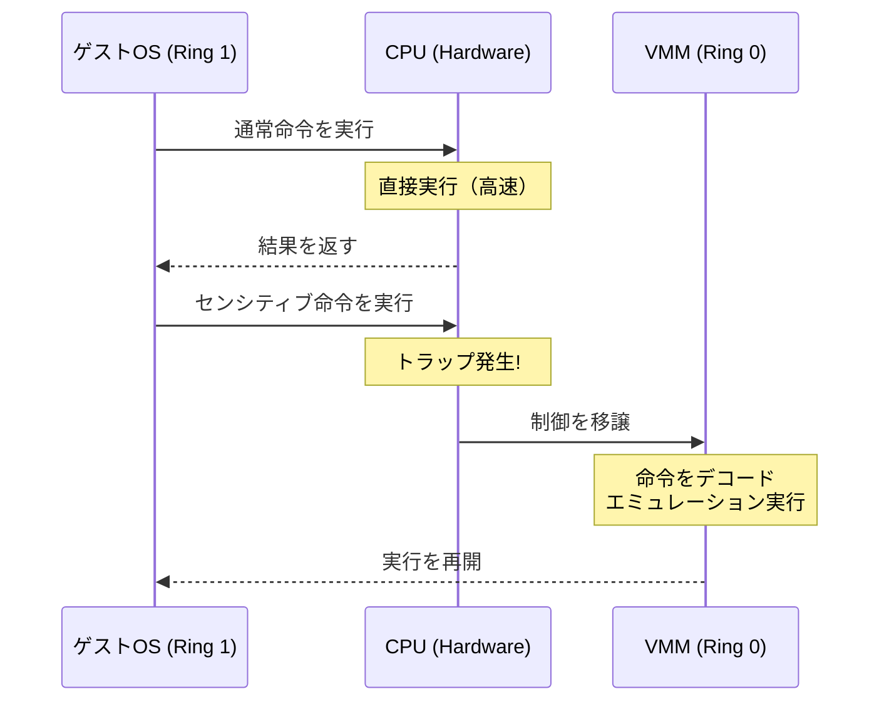
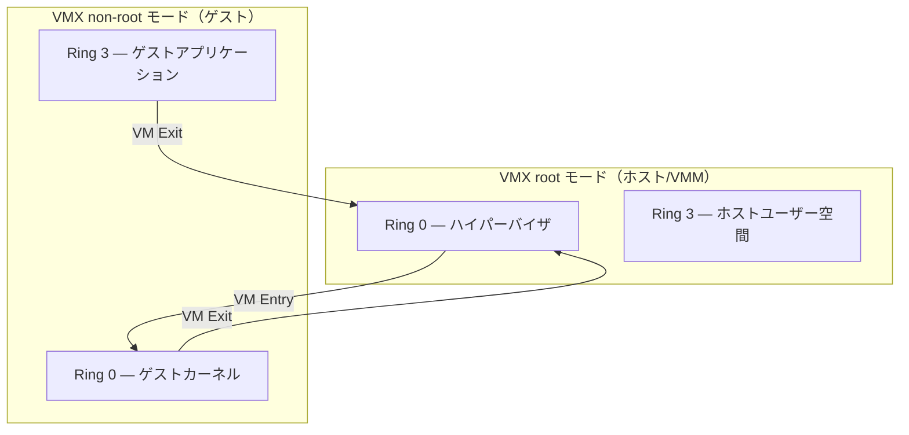
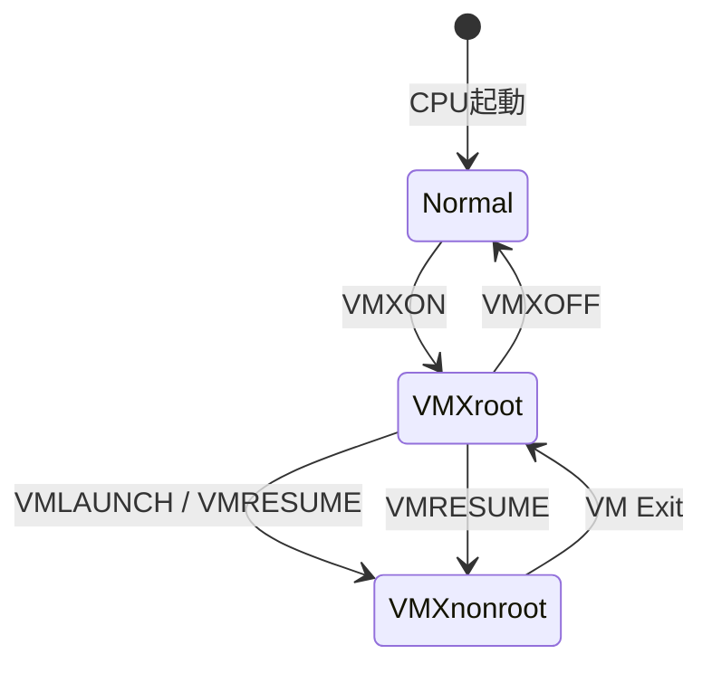
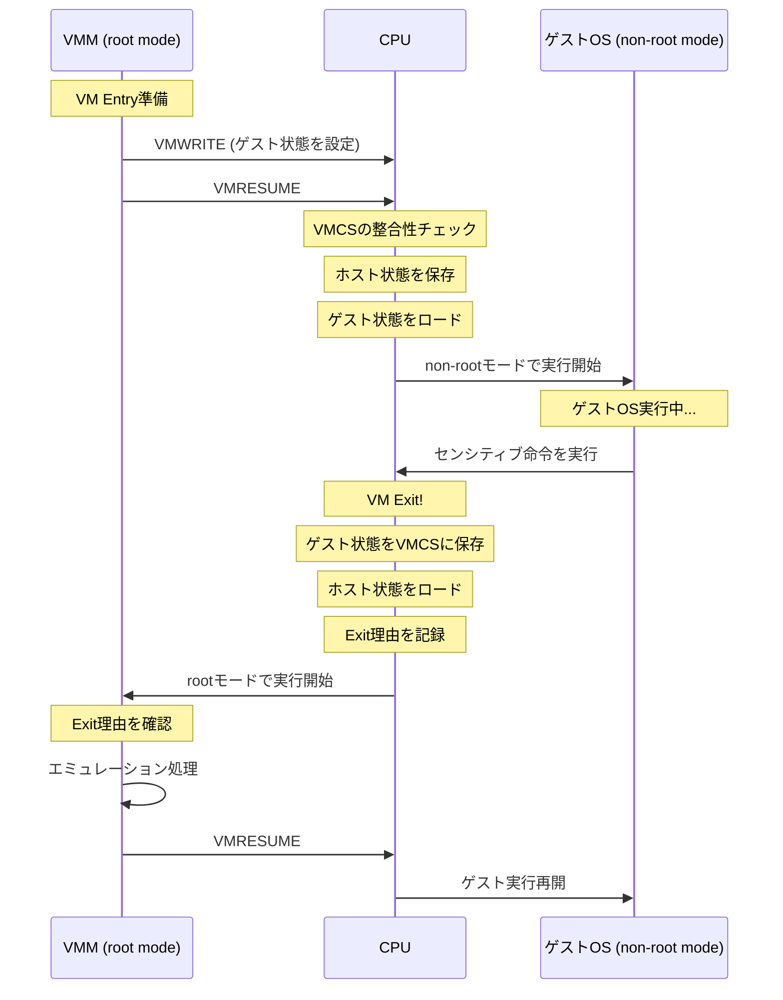
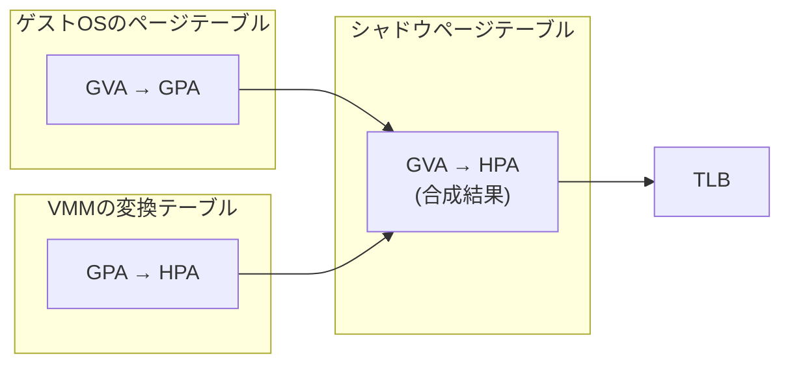
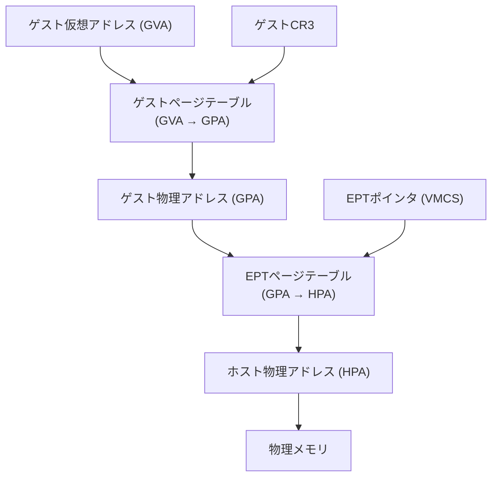
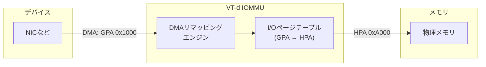

# ハードウェア支援仮想化（VT-x, AMD-V）

## 1. 仮想化の歴史的背景 — PopekとGoldbergの要件

### 1.1 仮想化の形式的定義

1974年、Gerald PopekとRobert Goldbergは、効率的な仮想マシンモニタ（VMM）を構築するための形式的な条件を定義した。彼らの論文 "Formal Requirements for Virtualizable Third Generation Architectures" は、仮想化理論の基礎となる古典的な文献である。

Popek-Goldbergの定理によれば、VMMは以下の3つの性質を満たさなければならない。

- **等価性（Equivalence）**: VMM上で実行されるプログラムは、物理マシン上で直接実行される場合と本質的に同一の振る舞いを示す。タイミングの差異やリソース量の違いは許容されるが、論理的な動作は一致しなければならない
- **資源管理（Resource Control）**: VMMは物理リソースの完全な制御権を持つ。ゲストOSが直接ハードウェアリソースを占有・変更することはできず、すべてのリソースアクセスはVMMの監督下に置かれる
- **効率性（Efficiency）**: ゲストOSの命令の大部分は、VMMの介入なしにCPU上で直接実行される。すべての命令をエミュレーションしていては、実用的な性能は得られない

この定理を満たすための鍵は、プロセッサの命令分類にある。Popek-Goldbergは命令を次のように分類した。

```
命令の分類（Popek-Goldberg）:

+---------------------------------------------+
|           すべての命令                       |
|  +---------------------------------------+  |
|  |      センシティブ命令                  |  |
|  |  +-------------+ +------------------+ |  |
|  |  | 制御依存命令 | | 動作依存命令     | |  |
|  |  | (Control     | | (Behavior        | |  |
|  |  |  Sensitive)  | |  Sensitive)      | |  |
|  |  +-------------+ +------------------+ |  |
|  +---------------------------------------+  |
|  +---------------------------------------+  |
|  |      特権命令 (Privileged)             |  |
|  +---------------------------------------+  |
+---------------------------------------------+

仮想化可能な条件:
  センシティブ命令 ⊆ 特権命令
```

- **特権命令（Privileged Instructions）**: ユーザーモード（Ring 3）で実行すると例外（トラップ）が発生する命令。カーネルモード（Ring 0）でのみ正常に実行できる
- **センシティブ命令（Sensitive Instructions）**: システムのグローバル状態に影響を与える、またはシステム状態に依存して動作が変わる命令

仮想化定理の核心は、「すべてのセンシティブ命令が特権命令でもあるならば、Trap-and-Emulateアプローチによって効率的なVMMを構築できる」という点にある。ゲストOSがセンシティブ命令を実行すると自動的にトラップが発生し、VMMに制御が移るため、VMMはその命令を適切にエミュレーションできるのである。

### 1.2 Trap-and-Emulateモデル

Popek-Goldbergの条件を満たすアーキテクチャでは、Trap-and-Emulateという単純かつ効率的な仮想化手法が利用できる。



ゲストOSはRing 0よりも低い特権レベル（例えばRing 1）で動作する。通常の命令はハードウェア上で直接実行されるため高速であり、センシティブ命令を実行した場合のみVMMにトラップが発生してエミュレーションが行われる。IBM System/370はまさにこの条件を満たしており、効率的な仮想化を実現していた。

### 1.3 なぜこの定理が重要なのか

Popek-Goldbergの定理は、あるアーキテクチャが「仮想化に適しているかどうか」を判定する明確な基準を提供する。この基準を満たさないアーキテクチャでは、Trap-and-Emulateだけでは仮想化を実現できず、何らかの追加的な工夫が必要になる。

まさにx86アーキテクチャがその問題に直面したのであり、その解決策として生まれたのが本稿の主題であるハードウェア支援仮想化（VT-x, AMD-V）である。

## 2. x86のアーキテクチャ的課題 — センシティブ命令問題

### 2.1 x86の特権リング構造

x86アーキテクチャは4つの特権レベル（Ring 0〜Ring 3）を持つ。実際のOSでは通常Ring 0（カーネル）とRing 3（ユーザー空間）のみが使用される。

```
x86 特権リング:

     Ring 3 (ユーザーアプリケーション) — 最低特権
    +-------------------------------------------+
    |                                           |
    |  Ring 2 (ほぼ未使用)                      |
    |  +-------------------------------------+  |
    |  |                                     |  |
    |  |  Ring 1 (ほぼ未使用)                |  |
    |  |  +-------------------------------+  |  |
    |  |  |                               |  |  |
    |  |  |  Ring 0 (カーネル) — 最高特権  |  |  |
    |  |  |                               |  |  |
    |  |  +-------------------------------+  |  |
    |  |                                     |  |
    |  +-------------------------------------+  |
    |                                           |
    +-------------------------------------------+
```

OSカーネルはRing 0で動作し、すべてのハードウェアリソースにアクセスできる。ゲストOSもRing 0で動作することを想定して設計されているため、仮想化にあたってはゲストOSをRing 0以外で動作させなければならない（Ring 0はVMMが占有する）。

### 2.2 問題のある命令群 — センシティブだが特権的でない命令

x86アーキテクチャの根本的な問題は、センシティブ命令であるにもかかわらず特権命令ではない命令が17個程度存在したことである。これらの命令はユーザーモード（Ring 3やRing 1）で実行してもトラップが発生せず、黙って異なる動作をするか、あるいは本来あるべき動作を行わない。

代表的な問題命令を以下に示す。

| 命令 | 本来の動作 | Ring 0以外での問題 |
|------|------------|-------------------|
| `POPF` / `PUSHF` | EFLAGSレジスタのプッシュ/ポップ。IFビット（割り込みフラグ）を含む | Ring 0以外ではIFビットの変更が黙って無視される。トラップは発生しない |
| `SGDT` / `SIDT` / `SLDT` | GDT/IDT/LDTのベースアドレスとリミットを取得 | 任意のリングで実行可能で、物理マシンのGDT/IDTアドレスをそのまま返してしまう |
| `SMSW` | マシンステータスワード（CR0の下位16ビット）を取得 | 特権チェックなしに実行でき、ホストの実際のCR0値が見えてしまう |
| `LAR` / `LSL` | セグメントのアクセス権やリミットを取得 | GDTの生のエントリをそのまま参照してしまう |
| `VERR` / `VERW` | セグメントの読み書き可否を検証 | 仮想化されたセグメント情報ではなく、実際のGDTを参照する |
| `MOV` to/from `CS` | コードセグメントの現在の特権レベル（CPL）を参照 | ゲストOSがRing 0だと思っていても、実際のCPL（Ring 1やRing 3）が見えてしまう |

### 2.3 POPF/PUSHF問題の具体例

最も有名な問題はPOPF/PUSHF命令である。この問題を具体的に見てみよう。

OSカーネルは割り込みの有効/無効を制御するために、EFLAGSレジスタのIF（Interrupt Flag）ビットを頻繁に操作する。例えばクリティカルセクションに入る際、OSは割り込みを無効化する。

```nasm
; OS kernel code: disable interrupts
pushf           ; Save EFLAGS to stack
cli             ; Clear IF (disable interrupts)
; ... critical section ...
popf            ; Restore EFLAGS (re-enable IF if it was set)
```

Ring 0で実行した場合、`popf`はIFビットを正しく復元する。しかし、ゲストOSがRing 1やRing 3で動作している場合、`popf`命令はIFビットの変更を**黙って無視**する。トラップは発生せず、ゲストOSは割り込みが再有効化されたと誤認する。これはOSの動作を根本的に破壊しうる極めて深刻な問題である。

```
POPF命令の動作の違い:

Ring 0で実行:                     Ring 1/3で実行:
+---------------------------+     +---------------------------+
| EFLAGS = スタックの値     |     | EFLAGS = スタックの値     |
| IF ビット → 変更される ✓  |     | IF ビット → 変更されない! |
| IOPL → 変更される ✓       |     | IOPL → 変更されない!      |
| トラップ → 発生しない     |     | トラップ → 発生しない!    |
+---------------------------+     +---------------------------+
                                  ※ エラーも例外も出ず、静かに
                                    一部のフラグ変更が無視される
```

### 2.4 SGDT/SIDT問題

SGDT（Store Global Descriptor Table）とSIDT（Store Interrupt Descriptor Table）も深刻な問題を引き起こす。これらの命令は任意の特権レベルで実行可能であり、現在のGDT/IDTのベースアドレスとリミットをメモリに格納する。

VMMは通常、ゲストOS用のGDT/IDTとは別に自身のGDT/IDTを管理している。ゲストOSがSGDT命令を実行すると、VMMのGDTアドレスがそのまま返されてしまい、ゲストOSが自身のGDTと異なるアドレスを発見してしまう。これによりゲストOSは自分が仮想環境上で動作していることを検知できるだけでなく、VMMの内部構造に関する情報を得ることになり、セキュリティ上の問題にもなりうる。

### 2.5 ソフトウェアによる回避策

ハードウェア支援仮想化が登場する以前、これらの問題は以下のようなソフトウェア技法で回避されていた。

**バイナリトランスレーション（Binary Translation）** — VMware方式

VMwareは1999年、ゲストOSのカーネルコードを動的にスキャンし、問題のある命令を安全なコードシーケンスに書き換える手法を実用化した。

```
バイナリトランスレーションの概要:

  ゲストOSのコード（Ring 0を想定）:
  +----------------------------------+
  | pushf                            |
  | cli                              |
  | ... (処理) ...                   |
  | popf                             |
  +----------------------------------+
           ↓ VMM がコードをスキャン・変換
  変換後のコード（Ring 1/3で実行）:
  +----------------------------------+
  | call vmm_save_eflags             |
  | call vmm_cli_emulate             |
  | ... (処理 — 変更不要の命令はそのまま) |
  | call vmm_restore_eflags          |
  +----------------------------------+
```

この手法は既存のゲストOSを無修正で動作させることができたが、以下の欠点があった。

- 変換によるオーバーヘッド（特にカーネルコードの実行時）
- 自己書き換えコードへの対処の困難さ
- 変換キャッシュの管理の複雑さ
- 実装の高度な複雑さとバグのリスク

**準仮想化（Paravirtualization）** — Xen方式

2003年にケンブリッジ大学で開発されたXenは、ゲストOSのソースコードを修正して問題命令をハイパーコール（hypercall）に置き換えるアプローチを採用した。

```
準仮想化（Paravirtualization）:

  通常のOS:                     準仮想化されたOS:
  +---------------------+      +---------------------+
  | cli                 |      | hypercall(CLI)      |
  | hlt                 |      | hypercall(HLT)      |
  | mov cr3, eax        |      | hypercall(SET_CR3)  |
  +---------------------+      +---------------------+
                                        |
                                        v
                                +-----------------+
                                | ハイパーバイザ   |
                                | (Ring 0)        |
                                +-----------------+
```

準仮想化はバイナリトランスレーションよりも効率的であったが、ゲストOSのカーネルソースコードの修正が必要であり、特にWindowsのようなプロプライエタリなOSでは適用が困難であった。

これらのソフトウェア回避策の限界を根本的に解決するために登場したのが、IntelのVT-xとAMDのAMD-Vによるハードウェア支援仮想化である。

## 3. Intel VT-x — VMX root/non-root、VMCS、VMEntry/VMExit

### 3.1 VT-xの概要

Intel VT-x（Virtualization Technology for x86）は、2005年にIntel Pentium 4 662/672プロセッサで初めて導入されたハードウェア仮想化拡張である。VT-xはVMX（Virtual Machine Extensions）とも呼ばれ、x86アーキテクチャにおけるセンシティブ命令問題をハードウェアレベルで解決する。

VT-xの核心的なアイデアは、プロセッサに**新しい動作モード**を追加することである。従来のRing 0〜3の特権レベル構造に加え、VMX root/non-rootという2つのモードを導入し、VMMとゲストOSを明確に分離する。

### 3.2 VMX root モードとnon-root モード

VT-xでは、CPUは2つの動作モードのいずれかで命令を実行する。



- **VMX root モード**: VMMが動作するモード。従来のx86と同様にすべての命令を実行でき、さらにVMX固有の命令（VMLAUNCH, VMRESUMEなど）も利用可能。VMMはRing 0で動作する
- **VMX non-root モード**: ゲストOSが動作するモード。ゲストOSはRing 0〜3の全レベルをそのまま使用できる。ただし、特定の操作を実行するとCPUが自動的にVM Exitを発生させてVMMに制御を移す

これにより、**ゲストOSはRing 0でそのまま動作できる**。従来の仮想化ではゲストOSをRing 1やRing 3に「降格」させる必要があったが（Ring Deprivileging）、VT-xではゲストOSはnon-rootモードのRing 0で動作するため、OSのコードを一切修正する必要がない。

### 3.3 VMXライフサイクル

VMX操作の全体的なライフサイクルは以下のようになる。



1. **VMXON**: VMX操作を有効化する。CR4レジスタのVMXEビットをセットし、VMXON命令を実行する。これ以降、CPUはVMX rootモードに入る
2. **VMLAUNCH**: 新しい仮想マシンを初めて起動する。VMCSの情報に基づいてゲスト状態をCPUにロードし、non-rootモードに遷移する
3. **VM Exit**: ゲストの実行中に特定のイベントが発生すると、CPUは自動的にrootモードに戻る
4. **VMRESUME**: VM Exit後にゲストの実行を再開する。VMLAUNCHと異なり、初期化チェックの一部がスキップされるため高速
5. **VMXOFF**: VMX操作を無効化し、通常のx86動作に戻る

### 3.4 VMCS（Virtual Machine Control Structure）

VMCS（Virtual Machine Control Structure）は、VT-xにおけるもっとも重要なデータ構造である。VMCSはCPUが直接アクセスする4KBのメモリ領域であり、ゲストVMの実行に必要なすべての制御情報を格納する。

VMCSには以下の主要なフィールド群がある。

```
VMCS の構造:

+---------------------------------------------------+
|                    VMCS (4KB)                      |
+---------------------------------------------------+
|                                                   |
| 1. ゲスト状態領域 (Guest-State Area)               |
|    - CR0, CR3, CR4                                |
|    - RSP, RIP, RFLAGS                             |
|    - CS, SS, DS, ES, FS, GS セグメントレジスタ     |
|    - GDTR, IDTR, LDTR, TR                         |
|    - MSRs (IA32_EFER, IA32_PAT, etc.)             |
|                                                   |
| 2. ホスト状態領域 (Host-State Area)                |
|    - CR0, CR3, CR4                                |
|    - RSP, RIP                                     |
|    - CS, SS, DS, ES, FS, GS セグメントレジスタ     |
|    - MSRs                                         |
|                                                   |
| 3. VM実行制御フィールド (VM-Execution Controls)     |
|    - ピンベース制御 (Pin-Based Controls)            |
|    - プロセッサベース制御 (Processor-Based Controls) |
|    - 例外ビットマップ (Exception Bitmap)            |
|    - I/Oビットマップアドレス                        |
|    - MSRビットマップアドレス                        |
|    - EPTポインタ (EPTP)                            |
|                                                   |
| 4. VM Exit制御フィールド (VM-Exit Controls)         |
|    - VM Exit時のMSR保存/ロード制御                  |
|                                                   |
| 5. VM Entry制御フィールド (VM-Entry Controls)       |
|    - VM Entry時のMSR保存/ロード制御                 |
|    - イベント注入フィールド                         |
|                                                   |
| 6. VM Exit情報フィールド (VM-Exit Information)      |
|    - Exit理由 (Exit Reason)                        |
|    - Exit修飾情報 (Exit Qualification)              |
|    - ゲストのRIP, 命令長                           |
|                                                   |
+---------------------------------------------------+
```

VMCSへのアクセスは、通常のメモリ読み書きではなく、専用のVMREAD/VMWRITE命令を通じて行う。これはCPUがVMCSの一部をプロセッサ内部のキャッシュに保持している可能性があるためであり、直接メモリアクセスではデータの整合性が保証されない。

```c
// Example: reading and writing VMCS fields
uint64_t guest_rip;

// Read guest RIP from VMCS
vmread(VMCS_GUEST_RIP, &guest_rip);

// Write new guest RIP to VMCS
vmwrite(VMCS_GUEST_RIP, new_rip);
```

### 3.5 VM Exit — ゲストからVMMへの遷移

VM Exitは、ゲストの実行中にVMMの介入が必要なイベントが発生した際にトリガーされる。VM Exitが発生すると、CPUは以下の処理を原子的に実行する。

1. ゲストの現在のCPU状態をVMCSのゲスト状態領域に保存
2. VMCSのホスト状態領域からVMMのCPU状態をロード
3. VM Exit理由と関連情報をVMCSのExit情報フィールドに格納
4. VMMのエントリポイント（ホスト状態領域のRIP）に制御を移す

VM Exitが発生する主な原因は以下のとおりである。

| カテゴリ | 具体的な原因 | 説明 |
|---------|-------------|------|
| 命令の実行 | CPUID, HLT, INVD, MOV to CR3 | ゲストがこれらの命令を実行すると無条件にExitが発生 |
| 条件付き命令 | MOV to/from CRn, MOV to/from DRn | VM実行制御フィールドの設定に応じてExitが発生 |
| I/O操作 | IN, OUT, INS, OUTS | I/Oビットマップの設定に応じてExitが発生 |
| MSRアクセス | RDMSR, WRMSR | MSRビットマップの設定に応じてExitが発生 |
| 割り込み | 外部割り込み、NMI | ピンベース制御の設定に応じてExitが発生 |
| 例外 | ページフォールト、デバッグ例外 | 例外ビットマップの設定に応じてExitが発生 |
| タイマー | VMXプリエンプションタイマー | 設定した時間が経過するとExitが発生 |

### 3.6 VM Entry — VMMからゲストへの遷移

VM Entry（VMLAUNCHまたはVMRESUME）は、VMMからゲストへ制御を移す操作である。VM Entry時にCPUが実行する処理は以下のとおりである。

1. VMCSの各フィールドの整合性チェック（ゲスト状態、ホスト状態、制御フィールド）
2. VMMの現在のCPU状態をVMCSのホスト状態領域に保存（一部のフィールド）
3. VMCSのゲスト状態領域からゲストのCPU状態をロード
4. イベント注入フィールドに設定されたイベントがあれば、ゲストへ注入
5. ゲストのRIPから実行を再開

イベント注入は、VMMがゲストに対して割り込みや例外を配送するための仕組みである。例えば、VMMがゲストに対してタイマー割り込みを配送する場合、VM Entry前にVMCSのイベント注入フィールドに割り込み情報を設定する。



### 3.7 VM Exitの制御 — 粒度の調整

VT-xの重要な特徴は、どのイベントでVM Exitを発生させるかをVMMが細かく制御できる点である。すべてのセンシティブ操作でExitを発生させるとパフォーマンスが低下するため、安全な範囲でExitを削減することが最適化の鍵となる。

例えば、CR0レジスタの書き込みに関しては、CR0のすべてのビットに対してExitを発生させる必要はなく、VMMが関心を持つ特定のビット（PE, PG, NE等）の変更時のみExitを発生させることができる。これはVM実行制御フィールドの「CR0 guest/host mask」と「CR0 read shadow」によって制御される。

```
CR0 Guest/Host Mask の動作:

CR0 Guest/Host Mask:    1 1 0 0 0 0 0 0 ...
CR0 Read Shadow:        1 1 0 0 0 0 0 0 ...

ゲストがCR0を読み込む場合:
  - mask=1 のビット → Read Shadow の値を返す
  - mask=0 のビット → 実際のCR0の値を返す

ゲストがCR0を書き込む場合:
  - mask=1 のビット → 変更しようとするとVM Exit発生
  - mask=0 のビット → 直接変更が許可される
```

## 4. AMD-V（SVM、VMCB）

### 4.1 AMD-Vの概要

AMD-V（AMD Virtualization）は、2006年にAMD Athlon 64プロセッサで導入されたハードウェア仮想化拡張であり、内部ではSVM（Secure Virtual Machine）とも呼ばれる。Intel VT-xと同様に、x86のセンシティブ命令問題をハードウェアレベルで解決するが、アーキテクチャの設計哲学やデータ構造にいくつかの違いがある。

### 4.2 AMD-Vの基本アーキテクチャ

AMD-Vもまた、ホストモードとゲストモードという2つの動作モードを導入する。概念的にはVT-xのVMX root/non-rootに対応するが、用語や制御機構にいくつかの違いがある。

| Intel VT-x | AMD-V (SVM) | 説明 |
|------------|-------------|------|
| VMX root mode | Host mode | VMMが動作するモード |
| VMX non-root mode | Guest mode | ゲストOSが動作するモード |
| VMCS | VMCB | 仮想マシン制御データ構造 |
| VMLAUNCH / VMRESUME | VMRUN | ゲストの実行を開始 |
| VM Exit | #VMEXIT | ゲストからホストへの遷移 |
| VMXON / VMXOFF | EFER.SVME | VMX/SVM操作の有効化/無効化 |
| VMREAD / VMWRITE | 通常のメモリアクセス | 制御構造へのアクセス方法 |

### 4.3 VMCB（Virtual Machine Control Block）

VMCBはAMD-Vにおける仮想マシン制御構造であり、VT-xのVMCSに相当する。VMCBは4KBのページ2つ（合計8KB）で構成される。

```
VMCB の構造:

ページ1: 制御領域 (Control Area, offset 0x000〜0x3FF)
+---------------------------------------------------+
| Intercept制御フィールド                             |
|   - CR読み書きインターセプト (16ビットマスク)        |
|   - DR読み書きインターセプト (16ビットマスク)        |
|   - 例外インターセプト (32ビットマスク)              |
|   - 命令インターセプト (VMRUN, CPUID, HLT等)       |
| IOPM_BASE_PA (I/O許可マップ物理アドレス)            |
| MSRPM_BASE_PA (MSR許可マップ物理アドレス)           |
| Guest ASID                                         |
| TLB制御                                            |
| 仮想割り込み制御 (V_IRQ, V_TPR等)                  |
| イベント注入 (EVENTINJ)                            |
| Nested Page Table CR3 (nCR3)                       |
| LBR仮想化制御                                      |
| VMCB Clean Bits                                    |
| #VMEXIT情報 (Exit Code, Exit Info1/2)              |
+---------------------------------------------------+

ページ2: 状態保存領域 (State Save Area, offset 0x400〜0x7FF)
+---------------------------------------------------+
| セグメントレジスタ (ES, CS, SS, DS, FS, GS)        |
| GDTR, LDTR, IDTR, TR                              |
| CPL                                                |
| EFER                                               |
| CR4, CR3, CR0, CR2                                 |
| DR7, DR6                                           |
| RFLAGS, RIP, RSP, RAX                              |
| STAR, LSTAR, CSTAR, SFMASK                        |
| KernelGSBase                                       |
| SYSENTER_CS, SYSENTER_ESP, SYSENTER_EIP           |
| PAT                                                |
+---------------------------------------------------+
```

VMCBとVMCSの重要な設計上の違いの一つは、VMCBは通常のメモリ読み書き命令でアクセスできるという点である。VT-xのVMCSはVMREAD/VMWRITE命令を必要とするが、AMD-VのVMCBは通常のMOV命令でフィールドにアクセスできる。これはソフトウェアの実装を簡素化する一方で、CPUのキャッシュ管理においてVMCBの変更を検出する追加メカニズム（VMCB Clean Bits）が必要になる。

### 4.4 VMCB Clean Bits

VMCB Clean Bitsは、AMD-Vが導入したパフォーマンス最適化の仕組みである。VMCBは通常のメモリとしてアクセスされるため、CPUはどのフィールドが変更されたかを自動的には把握できない。VMRUN命令を実行するたびにVMCB全体を再読み込みすることは非効率であるため、VMMがVMCB Clean Bitsを使って「どのフィールドグループが変更されたか」をCPUに通知する。

```
VMCB Clean Bits (例):

Bit 0: Intercepts — インターセプト制御が変更された
Bit 1: IOPM/MSRPM — I/O/MSR許可マップが変更された
Bit 2: ASID — ASIDが変更された
Bit 3: TPR — V_TPRが変更された
Bit 4: NP — ネストされたページテーブルCR3が変更された
Bit 5: CRx — CR0, CR3, CR4が変更された
Bit 6: DRx — DR6, DR7が変更された
Bit 7: DT — GDT/IDTが変更された
Bit 8: SEG — セグメントレジスタが変更された
Bit 9: CR2 — CR2が変更された
...

Clean Bit = 1: そのフィールドグループは変更されていない
               → CPUはキャッシュされた値を再利用できる
Clean Bit = 0: そのフィールドグループが変更された可能性がある
               → CPUはVMCBから再読み込みする
```

### 4.5 VMRUN命令と#VMEXIT

AMD-Vでは、VMRUN命令でゲストの実行を開始する。VT-xのVMLAUNCH/VMRESUMEのような区別はなく、単一のVMRUN命令で初回起動も再開も処理される。

VMRUN命令の実行シーケンスは以下のとおりである。

1. ホスト状態をHSAVE_PA（Host Save Area）が指す物理メモリ領域に保存
2. VMCBの制御領域からインターセプト設定等をロード
3. VMCBの状態保存領域からゲストのCPU状態をロード
4. ゲストモードに遷移し、ゲストのRIPから実行を開始

ゲストの実行中にインターセプト対象のイベントが発生すると、#VMEXITが発生する。

1. ゲストのCPU状態をVMCBの状態保存領域に保存
2. #VMEXITの原因をVMCBの制御領域（EXITCODE, EXITINFO1, EXITINFO2）に記録
3. HSAVE_PAからホスト状態を復元
4. ホストのRIPから実行を再開

### 4.6 仮想割り込み

AMD-Vは、仮想割り込みのハードウェア支援機能を早期から提供してきた。VMCBには仮想割り込み関連のフィールド（V_IRQ, V_INTR_PRIO, V_INTR_VECTOR, V_TPR等）があり、VMMはこれらを設定することで、ゲストに対して効率的に割り込みを注入できる。

特に重要なのはV_TPR（Virtual Task Priority Register）のサポートであり、ゲストOSがTPRを読み書きする際にVM Exitを発生させずにハードウェアが直接処理できる。APICのTPRアクセスはOS内部で非常に頻繁に発生するため、この最適化はパフォーマンスに大きく寄与する。

## 5. メモリ仮想化 — EPT/NPT、TLBタグ付け

### 5.1 メモリ仮想化の課題

仮想化環境では、メモリアドレスの変換が2段階になる。通常の（非仮想化）環境では、仮想アドレス（VA）を物理アドレス（PA）に変換するだけでよい。しかし仮想化環境では、ゲストOSが認識する「物理アドレス」は実際にはゲスト物理アドレス（GPA: Guest Physical Address）であり、これをさらにホスト物理アドレス（HPA: Host Physical Address）に変換する必要がある。

```
アドレス変換の2段階:

非仮想化環境:
  VA → PA (1段階のみ)
  ゲストOS のページテーブルが変換を担当

仮想化環境:
  GVA → GPA → HPA (2段階)
  │       │       │
  │       │       └── 実際の物理メモリアドレス
  │       └────────── ゲストOSが認識する「物理アドレス」
  └────────────────── ゲストOS内のプロセスの仮想アドレス

  GVA → GPA: ゲストOSのページテーブルが変換
  GPA → HPA: VMMが管理する変換
```

### 5.2 シャドウページテーブル — ソフトウェア方式

ハードウェア支援メモリ仮想化が登場する前は、シャドウページテーブル（Shadow Page Table）というソフトウェア手法が使われていた。

シャドウページテーブルは、VMMがゲストのページテーブルとGPA→HPA変換テーブルを合成して作成する「GVA→HPA」の直接変換テーブルである。CPUのCR3レジスタにはシャドウページテーブルの物理アドレスがセットされ、TLBにはGVA→HPAのマッピングがキャッシュされる。



しかし、シャドウページテーブルには深刻なパフォーマンス問題がある。

- **ページテーブル変更の追跡**: ゲストOSがページテーブルを変更するたびに、VMMはシャドウページテーブルを更新しなければならない。ゲストのページテーブル書き込みを検出するために、ゲストのページテーブルページを書き込み禁止にマークし、書き込み時のページフォールトをVM Exitでトラップする必要がある
- **コンテキストスイッチ時のコスト**: ゲストOS内でプロセスが切り替わり、CR3が変更されるたびにVM Exitが発生し、新しいシャドウページテーブルの構築が必要になる
- **メモリ消費**: 各ゲストプロセスのページテーブルに対してシャドウページテーブルを保持する必要がある

### 5.3 EPT（Extended Page Tables） — Intel方式

EPT（Extended Page Tables）は、Intel VT-xの拡張機能として2008年のNehalem世代で導入された。EPTは、GPA→HPAの変換をハードウェアが自動的に行う仕組みであり、シャドウページテーブルの複雑さとオーバーヘッドを大幅に解消する。

EPTが有効な場合、メモリアクセスのアドレス変換は以下の2段階をハードウェアが連動して実行する。



EPTのページテーブル構造は、通常のx86ページテーブルと同様の4レベル階層構造を持つ。

```
EPT ページテーブルの階層構造（4レベル）:

EPTP (VMCSフィールド)
  │
  └─→ EPT PML4 Table (512エントリ)
       │
       ├─→ EPT Page Directory Pointer Table (512エントリ)
       │    │
       │    ├─→ EPT Page Directory (512エントリ)
       │    │    │
       │    │    ├─→ EPT Page Table (512エントリ)
       │    │    │    │
       │    │    │    └─→ 4KB ページフレーム (HPA)
       │    │    │
       │    │    └─→ 2MB ラージページ (HPA)
       │    │
       │    └─→ 1GB ヒュージページ (HPA)
       │
       └─→ ...
```

各EPTエントリには以下のフィールドがある。

- **Read/Write/Execute権限ビット**: ゲストからのメモリアクセスに対するアクセス制御
- **メモリタイプ**: そのページのキャッシュ属性（Uncacheable, Write-Back等）
- **アクセスビット（A）**: ページがアクセスされたかどうか
- **ダーティビット（D）**: ページが書き込まれたかどうか

#### EPTの2段階ウォーク

EPTを使用する場合、TLBミス時のページテーブルウォークは複雑になる。ゲストのページテーブルウォークにおいて、ページテーブルの各レベルのエントリを読み込むためにGPAが必要になり、そのGPAをHPAに変換するためにEPTウォークが必要になるためである。

```
2段階ページテーブルウォーク（最悪ケース）:

ゲストの4レベルページテーブルウォーク:
  各レベルでEPTの4レベルウォークが必要

  GVA → [ゲストPML4参照]  → EPT 4レベルウォーク → HPA
       → [ゲストPDPT参照] → EPT 4レベルウォーク → HPA
       → [ゲストPD参照]   → EPT 4レベルウォーク → HPA
       → [ゲストPT参照]   → EPT 4レベルウォーク → HPA
       → [最終GPA]        → EPT 4レベルウォーク → HPA

  合計メモリアクセス数: 5段階 × 4レベル = 最大24回
  (通常のページテーブルウォークは4回)
```

この最大24回のメモリアクセスは非常に高コストに見えるが、実際にはTLBと各レベルのページウォーキャャッシュ（Page Walk Cache）が効果的に機能するため、平均的なオーバーヘッドは限定的である。加えて、EPTの2MBまたは1GBラージページを活用することでEPT側のレベル数を削減でき、ウォークの回数をさらに削減できる。

### 5.4 NPT（Nested Page Tables） — AMD方式

NPT（Nested Page Tables）は、AMD-Vの拡張機能として導入されたメモリ仮想化支援であり、概念的にはIntelのEPTとほぼ同等である。AMD Barcelonaプロセッサ（2007年）で初めて搭載された。

NPTとEPTの主要な違いは以下のとおりである。

| 特性 | Intel EPT | AMD NPT |
|------|----------|---------|
| 名称 | Extended Page Tables | Nested Page Tables |
| 制御構造 | VMCSのEPTPフィールド | VMCBのnCR3フィールド |
| ページサイズ | 4KB, 2MB, 1GB | 4KB, 2MB, 1GB |
| アクセスビット | EPT A/D ビット（後から追加） | NPT A/D ビット |
| メモリタイプ制御 | EPTエントリ内のメモリタイプフィールド | PAT/MTRRとの組み合わせ |

基本的な仕組みは同一であり、GPA→HPAの第2段階変換をハードウェアが自動的に行う。VMMはNPTのページテーブルを構築してVMCBのnCR3にセットするだけでよく、ゲストOSのページテーブル変更を逐一追跡する必要はない。

### 5.5 VPID/ASID — TLBタグ付け

仮想化環境では、VM EntryやVM ExitのたびにTLBをフラッシュする必要がある。ゲストとホスト、あるいは異なるゲスト間で同じ仮想アドレスが異なる物理アドレスにマッピングされるためである。しかし、TLBフラッシュはパフォーマンスに大きな影響を与える。

この問題を解決するのが、TLBエントリにVM識別子をタグ付けする技術である。

- **Intel VPID（Virtual Processor Identifier）**: 各仮想CPUに16ビットの識別子を割り当て、TLBエントリにこの識別子を付加する。VM EntryやVM Exitの際にTLBをフラッシュする必要がなくなり、異なるVMのTLBエントリが混在しても正しいエントリのみが使用される
- **AMD ASID（Address Space Identifier）**: AMD-Vにおける同等の機能。VMCBのGuestASIDフィールドに設定する

```
VPID/ASID によるTLBタグ付け:

TLBフラッシュなしの場合（従来）:
  VM Exit時: TLB全フラッシュ必要 → VM再開時に大量のTLBミス

VPID/ASIDありの場合:
  TLBエントリ:
  +------+----------+--------+
  | VPID | 仮想アドレス | 物理アドレス |
  +------+----------+--------+
  |  01  | 0x1000   | 0xA000 |  ← VM1のエントリ
  |  02  | 0x1000   | 0xB000 |  ← VM2のエントリ
  |  00  | 0x1000   | 0xC000 |  ← ホストのエントリ
  +------+----------+--------+
  → VM切り替え時もTLBフラッシュ不要
  → CPUがVPIDに基づいて正しいエントリを自動選択
```

VPIDの導入により、VM Entry/VM Exitに伴うTLBフラッシュのオーバーヘッドは劇的に削減された。あるベンチマークでは、VPIDの有効化により仮想マシンのコンテキストスイッチ性能が40%以上向上したと報告されている。

## 6. I/O仮想化 — VT-d/AMD-Vi、SR-IOV

### 6.1 I/O仮想化の課題

I/Oデバイスの仮想化は、CPU仮想化やメモリ仮想化と比較してより困難な課題である。物理I/Oデバイスは通常1つしか存在しないにもかかわらず、複数のゲストVMがそれぞれ独立したI/Oデバイスを持っているかのように見せなければならない。

I/O仮想化には主に3つのアプローチがある。

```
I/O仮想化の3つのアプローチ:

1. エミュレーション方式:
+--------+  +--------+
| Guest1 |  | Guest2 |
| (仮想  |  | (仮想  |
|  NIC)  |  |  NIC)  |
+---+----+  +---+----+
    |            |
    v            v
+-------------------------+
| VMM — ソフトウェアで    |
| デバイスを完全エミュレート|
+-------------------------+
    |
    v
+-------------------------+
| 物理NIC                 |
+-------------------------+

2. 準仮想化方式 (virtio):
+--------+  +--------+
| Guest1 |  | Guest2 |
| (virtio|  | (virtio|
|  drv)  |  |  drv)  |
+---+----+  +---+----+
    |            |
    v            v
+-------------------------+
| VMM — virtioバックエンド |
+-------------------------+
    |
    v
+-------------------------+
| 物理NIC                 |
+-------------------------+

3. デバイスパススルー:
+--------+           +--------+
| Guest1 |           | Guest2 |
| (物理  |           | (物理  |
|  drv)  |           |  drv)  |
+---+----+           +---+----+
    |                     |
    v                     v
+----------+       +----------+
| VF1      |       | VF2      |
+----------+       +----------+
| 物理NIC (SR-IOV対応)        |
+------------------------------+
```

### 6.2 VT-d（Intel Virtualization Technology for Directed I/O）

VT-dは、IntelがI/O仮想化を支援するために開発したハードウェア技術であり、IOMMU（I/O Memory Management Unit）としてチップセット（現在ではCPU内蔵）に実装されている。VT-dの主要な機能は以下のとおりである。

**DMAリマッピング（DMA Remapping）**

DMA（Direct Memory Access）は、デバイスがCPUの介入なしにメモリに直接データを転送する仕組みである。仮想化環境では、ゲストVMに割り当てたデバイスがDMAを行う際、ゲスト物理アドレス（GPA）宛てにDMAリクエストを発行する。しかし、実際のメモリはホスト物理アドレス（HPA）で管理されているため、GPAをHPAに変換する必要がある。

VT-dは、デバイスからのDMAリクエストに対してアドレス変換を行うIOMMU機能を提供する。



**割り込みリマッピング（Interrupt Remapping）**

割り込みリマッピングは、デバイスからの割り込み（MSI/MSI-X）を安全にルーティングするための機能である。悪意のあるデバイスや不正なゲストが任意のCPUに対して割り込みを発行することを防ぎ、VMMが設定した割り込みリマッピングテーブルに基づいて、正しい仮想CPUに割り込みを配送する。

**DMA保護**

VT-dは、デバイスのDMAアクセスを制限するメモリ保護機能も提供する。各デバイスに対してI/Oページテーブルが設定され、デバイスがアクセスできるメモリ範囲が厳密に制限される。これにより、あるゲストVMに割り当てたデバイスが、他のVMのメモリ領域にDMAでアクセスすることを防止できる。

### 6.3 AMD-Vi（AMD I/O Virtualization Technology）

AMD-ViはAMDが提供するI/O仮想化技術であり、Intel VT-dと同等の機能を持つ。主要な機能として、DMAリマッピング、デバイス隔離、割り込みリマッピングを提供する。

AMD-Viの特徴的な機能として、IOMMUのページテーブルウォークにおいてNested Page Tables（NPT）と同じ形式のページテーブルを再利用できる点がある。これにより、VMMはCPUのメモリ仮想化とI/Oのメモリ仮想化で同じページテーブル構造を共有でき、メモリ消費と管理の複雑さを削減できる。

### 6.4 SR-IOV（Single Root I/O Virtualization）

SR-IOVは、PCI-SIG（PCI Special Interest Group）が策定した仕様であり、単一の物理デバイスを複数の仮想デバイスに分割することを可能にする。SR-IOVにより、VMMの介入なしにゲストVMがI/Oデバイスに直接アクセスでき、ネイティブに近いI/O性能を実現する。

```
SR-IOVの構造:

  物理デバイス（Physical Function: PF）
  +------------------------------------------+
  |                                          |
  |  PF — 物理機能（デバイス全体の管理）      |
  |  ├── VF0 — 仮想機能（VM1に割り当て）     |
  |  ├── VF1 — 仮想機能（VM2に割り当て）     |
  |  ├── VF2 — 仮想機能（VM3に割り当て）     |
  |  └── VF3 — 仮想機能（VM4に割り当て）     |
  |                                          |
  +------------------------------------------+

  PF (Physical Function):
    - デバイスの完全な管理機能を持つ
    - VFの作成・設定・削除を行う
    - ホスト/VMMが使用

  VF (Virtual Function):
    - 軽量なPCIe機能
    - データプレーン（送受信）の機能のみ
    - 各VMに直接割り当て可能
    - VT-d/AMD-Viと組み合わせてDMA保護を実現
```

SR-IOVの利点は以下のとおりである。

- **高性能**: ゲストVMがVFに直接アクセスするため、VMMの介入によるオーバーヘッドがない。ネットワークI/Oのレイテンシは準仮想化方式（virtio）と比較して30〜50%削減され、スループットはネイティブの90%以上に達する
- **CPU負荷の削減**: I/O処理にVMMのCPU時間が不要になる
- **隔離**: VT-d/AMD-Viと組み合わせることで、VF間のDMAアクセスが確実に隔離される

一方で、SR-IOVには以下の制限もある。

- **ライブマイグレーションの困難さ**: VFはハードウェアに直接紐付いているため、VMのライブマイグレーション時にVFの状態を透過的に移行することが難しい
- **VF数の制限**: デバイスごとにサポートされるVF数に上限がある（例: Intel X710 NICでは最大128 VF）
- **デバイス依存**: SR-IOVをサポートするデバイスが必要

### 6.5 ATS（Address Translation Services）とPRIRC

SR-IOVと組み合わせて使用される追加技術として、ATS（Address Translation Services）とPRI（Page Request Interface）がある。

ATSは、PCIeデバイスがIOMMUに対してアドレス変換をリクエストし、変換結果をデバイス側のATC（Address Translation Cache）にキャッシュする仕組みである。これにより、デバイスの後続のDMAリクエストはATCヒットにより直接HPAを使用でき、IOMMUのページテーブルウォークを省略できる。

PRIは、デバイスのDMAリクエストがIOMMUのページテーブルでマッピングされていないアドレスに到達した場合に、ページフォールト的な仕組みでVMMにページの割り当てを要求する機能である。これにより、VMMはすべてのDMAバッファを事前にピン留め（pin）する必要がなくなり、メモリ効率が向上する。

## 7. ネストされた仮想化

### 7.1 ネストされた仮想化とは

ネストされた仮想化（Nested Virtualization）とは、仮想マシン内でさらにハイパーバイザを動作させ、その上で仮想マシンを実行する技術である。これは「VMの中でVMを動かす」ことに相当する。

```
ネストされた仮想化の層構造:

+----------------------------------------+
| L2ゲスト（ネストされたVM内のOS）        |
+----------------------------------------+
| L1ハイパーバイザ（VM内のハイパーバイザ） |
+----------------------------------------+
| L0ハイパーバイザ（物理マシンのハイパーバイザ）|
+----------------------------------------+
| 物理ハードウェア                        |
+----------------------------------------+

L0: ベアメタルハイパーバイザ（KVM, Xen等）
L1: VM内で動作するハイパーバイザ（例: クラウドVM内のKVM）
L2: L1ハイパーバイザ上で動作するゲストOS
```

### 7.2 ネストされた仮想化の需要

ネストされた仮想化は以下のようなユースケースで必要とされる。

- **クラウド上での仮想化**: IaaSクラウド上のVM内でハイパーバイザやコンテナランタイム（KVMベースのFirecracker等）を実行したい場合
- **開発・テスト**: ハイパーバイザの開発やテストを仮想マシン上で行いたい場合。物理マシンを専有する必要がなくなる
- **マルチテナント仮想化**: テナントが自身のVM内で独自のVMを管理したい場合
- **教育**: 仮想化技術の教育において、学生が安全な環境でハイパーバイザを実験できる

### 7.3 実装の課題

ネストされた仮想化の実装は技術的に非常に複雑である。主な課題を以下に示す。

**VMCS/VMCBのシャドウイング**

L1ハイパーバイザはVMCSやVMCBを操作してL2ゲストを管理しようとするが、L1自身がVMX non-rootモードで動作しているため、VMREAD/VMWRITE/VMLAUNCH/VMRESUME等のVMX命令はL0にVM Exitを発生させる。L0は、L1のVMCS操作を仲介し、実際にハードウェアが使用するVMCS（L0がL2を直接実行するためのVMCS02）を管理する必要がある。

```
VMCSのシャドウイング:

L1が管理していると思っているVMCS: VMCS12
  (L1がVMWRITEで設定する仮想的なVMCS)

L0が実際にハードウェアに設定するVMCS: VMCS02
  (L2を直接実行するための合成VMCS)

VMCS01: L0がL1を実行するためのVMCS

L1がVMCS12にVMWRITE → L0にVM Exit →
  L0がVMCS12の内容とVMCS01の内容を合成 →
    VMCS02を構築してハードウェアにセット
```

**メモリ仮想化の3段階変換**

ネストされた仮想化では、メモリのアドレス変換が3段階になる。

```
ネストされた仮想化のアドレス変換:

L2のプロセスの仮想アドレス (GVA)
  → L2のゲスト物理アドレス (GPA_L2)    ... L2のページテーブルで変換
    → L1のゲスト物理アドレス (GPA_L1)  ... L1のEPT/NPTで変換
      → ホスト物理アドレス (HPA)        ... L0のEPT/NPTで変換

実装方式:
  L0は、L1のEPTとL0のEPTを合成した「シャドウEPT」を構築
  → ハードウェアは2段階のみで変換可能
```

### 7.4 VMCS Shadowingハードウェア支援

Intel Haswell（第4世代Core）以降では、VMCS Shadowingというハードウェア機能が導入された。この機能により、L1がVMREAD/VMWRITE命令を実行した際に、特定のフィールドに対してはVM Exitを発生させずにハードウェアがシャドウVMCSに直接読み書きする。

```
VMCS Shadowing:

VMREAD/VMWRITE ビットマップ:
  各VMCSフィールドに対して、VM Exitの要否を指定

  ビット = 0: VM Exitなしでシャドウ VMCSに直接アクセス
  ビット = 1: VM Exitが発生し、L0が処理

→ 頻繁にアクセスされるフィールドはVM Exit不要にできる
→ ネストされた仮想化のパフォーマンスが大幅に向上
```

この最適化により、ネストされた仮想化のオーバーヘッドは初期の実装と比較して大幅に改善されている。

## 8. パフォーマンスへの影響と最適化

### 8.1 VM Exitのコスト

ハードウェア支援仮想化におけるもっとも重要なパフォーマンス要因は、VM Exitのコストである。VM Exitが発生すると、CPUは以下の処理を行う必要がある。

1. ゲストのCPU状態の保存
2. ホストのCPU状態の復元
3. VMMのハンドラ実行
4. ゲストのCPU状態の復元
5. VM Entryによるゲスト実行の再開

この一連の処理にかかる時間はCPUの世代によって異なるが、概算を以下に示す。

```
VM Exit/Entry のレイテンシ推移:

Pentium 4 (2005, 初期VT-x):     ~1500 サイクル以上
Core 2 (2006):                   ~1000 サイクル
Nehalem (2008):                  ~600-800 サイクル
Sandy Bridge (2011):             ~500-600 サイクル
Haswell (2013):                  ~400-500 サイクル
Skylake (2015):                  ~300-400 サイクル
Ice Lake (2019):                 ~250-350 サイクル
Sapphire Rapids (2023):          ~200-300 サイクル

比較: 通常の関数呼び出し:        ~5-10 サイクル
      システムコール:             ~100-200 サイクル
```

VM Exitが頻発するワークロードでは、このオーバーヘッドが累積して無視できない性能低下をもたらす。

### 8.2 Exit回数の削減テクニック

VM Exitの回数を削減することは、仮想化パフォーマンス最適化の最重要テーマである。

**APIC仮想化**

APIC（Advanced Programmable Interrupt Controller）はOS内で非常に頻繁にアクセスされるデバイスである。VT-xの「APIC virtualization」と「virtual-interrupt delivery」機能により、ゲストのAPICアクセスの多くをVM Exitなしにハードウェアが直接処理できる。

- **TPRアクセスの仮想化**: ゲストがAPICのTPR（Task Priority Register）を読み書きする際にVM Exitが不要になる
- **Posted Interrupts**: ゲストへの割り込み配送をVM Exitなしに行える。VMMは「posted interrupt descriptor」にペンディングの割り込みを書き込み、Posted Interrupt Notification（IPI）を送信するだけでよい

**PAUSE Loop Exiting / PAUSE Filtering**

スピンロックの待機ループで使用されるPAUSE命令は、仮想化環境では問題を引き起こす。ゲストVMのvCPUがスピンロックを待っている間、物理CPUの時間を浪費する（Lock Holder Preemption問題）。

IntelのPLE（PAUSE Loop Exiting）とAMDのPause Filter機能は、PAUSE命令が短時間に繰り返し実行された場合にのみVM Exitを発生させ、VMMにCPUスケジューリングの機会を与える。

**MSRビットマップとI/Oビットマップ**

MSRビットマップとI/Oビットマップを適切に設定することで、安全なMSRアクセスやI/Oポートアクセスに対してはVM Exitを発生させずに直接実行を許可できる。例えば、ゲスト内のTSC（Time Stamp Counter）読み取りはパフォーマンスカウンタやタイミング計測で頻繁に行われるため、TSC offsetを設定した上でRDTSC命令をVM Exitなしに実行させることが有効である。

### 8.3 EPT/NPTの最適化

**ラージページの活用**

EPT/NPTでは、4KBページだけでなく2MBや1GBのラージページを使用できる。ラージページを使用することで、ページテーブルのレベル数が減り、TLBミス時のページウォークのコストが削減される。

```
ラージページによるEPTウォーク削減:

4KBページ (4レベル):
  GPA → PML4 → PDPT → PD → PT → HPA
  最大メモリアクセス: 4回

2MBラージページ (3レベル):
  GPA → PML4 → PDPT → PD → HPA
  最大メモリアクセス: 3回 (25%削減)

1GBヒュージページ (2レベル):
  GPA → PML4 → PDPT → HPA
  最大メモリアクセス: 2回 (50%削減)
```

クラウド環境では、VMに割り当てるメモリに対してホスト側で1GBヒュージページを使用することが一般的であり、これによりEPTウォークのオーバーヘッドを大幅に削減している。

**EPT/NPTのA/Dビット**

EPTのアクセスビット（A）とダーティビット（D）は、ハードウェアがページのアクセス状況を追跡する仕組みである。これらはVMMにとって以下の場面で重要である。

- **ライブマイグレーション**: ダーティビットを参照することで、どのページが変更されたかを効率的に追跡し、反復的に転送すべきページを特定できる
- **メモリバルーニング**: アクセスビットを参照することで、長期間アクセスされていないページを特定し、ホストOSに返却できる
- **ページスワップ**: VMMがゲストのメモリをスワップアウトする際の判断材料になる

### 8.4 パフォーマンス比較

現代のハードウェア支援仮想化のパフォーマンスを、各種ワークロードについて概観する。

```
仮想化のパフォーマンスオーバーヘッド（概算）:

CPU集約型ワークロード:
  ├── ユーザー空間の計算:      < 1% オーバーヘッド
  └── カーネル集約型:          2-5% オーバーヘッド

メモリ集約型ワークロード:
  ├── TLBキャッシュヒット:     < 1% オーバーヘッド
  └── TLBミス頻発:            5-10% オーバーヘッド (EPTウォーク)

I/O集約型ワークロード:
  ├── SR-IOV:                  < 5% オーバーヘッド
  ├── virtio:                  5-15% オーバーヘッド
  └── エミュレーション:         20-50% オーバーヘッド

ネットワーク集約型ワークロード:
  ├── SR-IOV + VT-d:           スループットはネイティブの 90-98%
  └── virtio-net:              スループットはネイティブの 70-85%
```

### 8.5 KVMにおける実装例

LinuxカーネルのKVMは、VT-xとAMD-Vの両方をサポートする代表的なハイパーバイザである。KVMの基本的なVM実行ループは以下のようになる。

```c
// Simplified KVM VCPU run loop (conceptual)
int kvm_vcpu_run(struct kvm_vcpu *vcpu) {
    for (;;) {
        // Prepare for VM entry
        kvm_load_guest_state(vcpu);

        // Enter guest mode (VMLAUNCH/VMRESUME or VMRUN)
        vmx_vcpu_enter_guest(vcpu);  // or svm_vcpu_enter_guest(vcpu)

        // VM exit occurred - handle it
        int exit_reason = vcpu->exit_reason;

        switch (exit_reason) {
        case EXIT_REASON_IO_INSTRUCTION:
            // Emulate I/O instruction
            handle_io(vcpu);
            break;
        case EXIT_REASON_CPUID:
            // Emulate CPUID
            handle_cpuid(vcpu);
            break;
        case EXIT_REASON_MSR_READ:
        case EXIT_REASON_MSR_WRITE:
            // Emulate MSR access
            handle_msr(vcpu);
            break;
        case EXIT_REASON_EPT_VIOLATION:
            // Handle EPT/NPT page fault
            handle_ept_violation(vcpu);
            break;
        case EXIT_REASON_EXTERNAL_INTERRUPT:
            // Return to host to handle interrupt
            return -EINTR;
        case EXIT_REASON_HLT:
            // Guest executed HLT - schedule out
            kvm_vcpu_halt(vcpu);
            break;
        default:
            // Unknown or unhandled exit
            handle_unexpected_exit(vcpu);
            break;
        }

        // Check for pending signals or need to return to userspace
        if (signal_pending(current) || need_resched())
            return -EINTR;
    }
}
```

KVMでは、QEMU（ユーザー空間プロセス）がVM Exitのうちカーネル空間だけでは処理できないもの（例: 複雑なデバイスエミュレーション）を処理する。KVMカーネルモジュールで処理可能なExit（例: CR0アクセス、CPUID、単純なMSRアクセス）はカーネル空間で高速に処理され、ユーザー空間への遷移コストを回避する。

## 9. まとめと将来展望

### 9.1 ハードウェア支援仮想化の意義

ハードウェア支援仮想化（VT-x, AMD-V）は、x86アーキテクチャにおけるセンシティブ命令問題という根本的な課題を解決し、仮想化技術の適用範囲と性能を劇的に改善した。

その意義を振り返ると以下のとおりである。

- **未修正ゲストOSのサポート**: バイナリトランスレーションや準仮想化のような複雑なソフトウェア技法が不要になり、Windowsを含むあらゆるOSをそのまま仮想化できるようになった
- **パフォーマンスの向上**: 世代を重ねるごとにVM Exit/Entryのレイテンシが削減され、EPT/NPT、VPID/ASID、APIC仮想化等の追加機能により、仮想化のオーバーヘッドはほとんどのワークロードで1桁パーセントに抑えられている
- **I/O仮想化の発展**: VT-d/AMD-ViとSR-IOVにより、I/O性能もネイティブに迫るレベルに達している
- **クラウドコンピューティングの基盤**: AWS、Google Cloud、Microsoft Azureを含むすべてのメジャーなクラウドプロバイダは、ハードウェア支援仮想化を基盤技術として活用している

### 9.2 現在の技術動向

ハードウェア支援仮想化は現在も進化を続けている。

**セキュリティの強化**

- **Intel TDX（Trust Domain Extensions）**: ゲストVMのメモリをハイパーバイザからも暗号化で保護する技術。クラウド環境において、ハイパーバイザを信頼境界の外に置くことが可能になる
- **AMD SEV/SEV-ES/SEV-SNP（Secure Encrypted Virtualization）**: ゲストVMのメモリを暗号化し、ハイパーバイザやホストOSからのメモリアクセスを防止する。SEV-SNPはさらにメモリの完全性保護を追加
- **ARM CCA（Confidential Compute Architecture）**: ARMアーキテクチャにおけるConfidential Computing技術

これらの技術は「Confidential Computing」と総称され、クラウドプロバイダを含む誰もゲストVMのデータにアクセスできない環境を実現する。

**パフォーマンスの継続的改善**

- VM Exit/Entryレイテンシの継続的な削減
- IPI仮想化（Intelの新世代プロセッサ）：VM間のIPI（Inter-Processor Interrupt）をVM Exitなしに処理
- ネストされた仮想化のハードウェア支援の強化

**マイクロVM/軽量仮想化との融合**

AWS FirecrackerやCloud HypervisorのようなマイクロVMMは、ハードウェア支援仮想化を基盤としつつ、デバイスモデルを最小限に絞ることでVM起動時間を100ミリ秒以下に短縮している。これはサーバーレスコンピューティングやFaaS（Function as a Service）の基盤技術として活用されている。

### 9.3 ARM仮想化との比較

x86以外のアーキテクチャとしてARMも仮想化支援を提供している。ARMv8.1以降のVHE（Virtualization Host Extensions）は、EL2（Exception Level 2、ハイパーバイザ用）でホストOSのカーネルを直接実行可能にし、KVMのようなType 2ハイパーバイザの性能を向上させている。

```
ARM仮想化の特権レベル:

  EL0: ユーザー空間アプリケーション
  EL1: ゲストOSカーネル
  EL2: ハイパーバイザ（VHEではホストOSカーネルも実行可能）
  EL3: セキュアモニタ（ARM TrustZone）

  vs. x86 + VT-x:
  Ring 3: ユーザー空間アプリケーション
  Ring 0: カーネル
  VMX root/non-root: ホスト/ゲストの分離
```

ARMは設計段階から仮想化を考慮しているため、x86のようなセンシティブ命令問題は存在しない。しかし、x86のVT-x/AMD-Vは長年の改良によって非常に成熟しており、サーバーワークロードにおける仮想化性能では依然として高い水準を維持している。

### 9.4 今後の展望

ハードウェア支援仮想化は、以下の方向に進化していくと考えられる。

1. **Confidential Computingの普及**: TDXやSEV-SNPにより、クラウド上でのデータ保護がハードウェアレベルで保証される世界が現実になりつつある。将来的にはすべてのVMがデフォルトでConfidentialに実行される可能性がある

2. **仮想化オーバーヘッドのさらなる削減**: VM Exit/Entryのレイテンシ削減、EPTウォークの最適化、より多くの操作のハードウェアオフロードにより、仮想化のオーバーヘッドは限りなくゼロに近づいていくだろう

3. **ヘテロジニアスコンピューティングとの統合**: GPUやFPGAなどのアクセラレータの仮想化支援が強化され、仮想マシンがこれらのデバイスを効率的に利用できるようになる

4. **CXLとメモリプーリング**: CXL（Compute Express Link）によるメモリプーリングとハードウェア仮想化の統合が進み、物理メモリの柔軟な共有と分離が実現される

ハードウェア支援仮想化は、現代のクラウドコンピューティング、コンテナ技術、セキュリティ技術の基盤であり続ける。CPUベンダーが仮想化支援をプロセッサの最優先機能の一つと位置づけていることからも、この技術の重要性は今後さらに高まっていくだろう。
