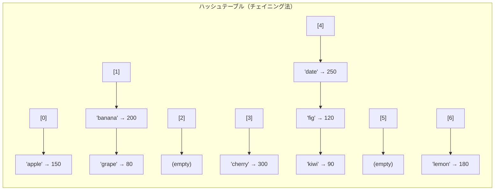
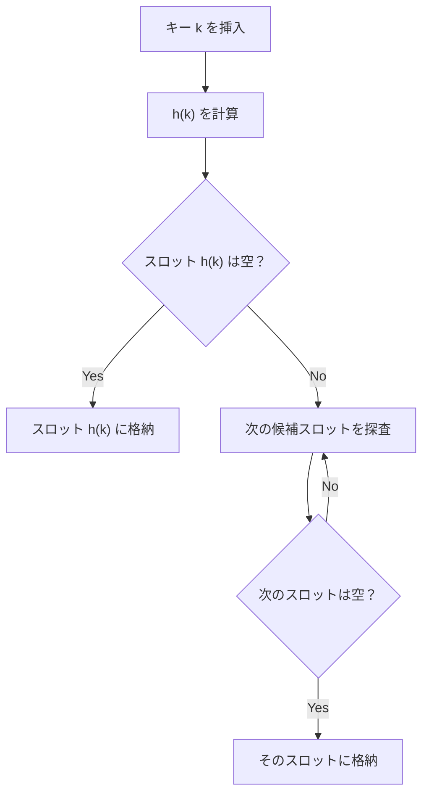
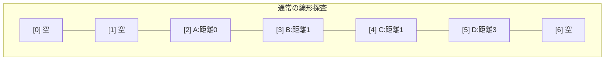
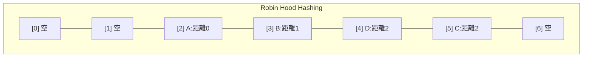
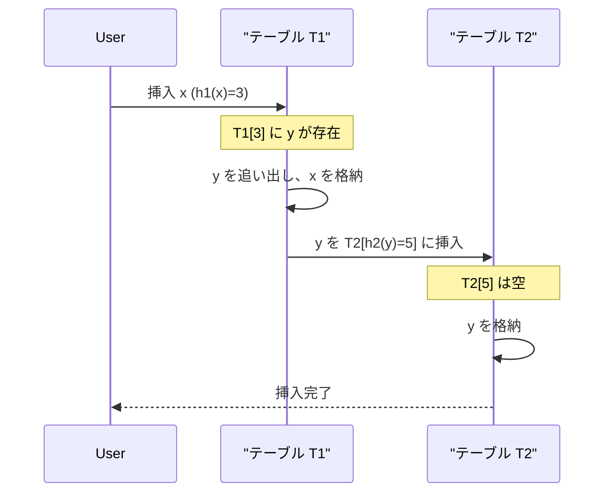
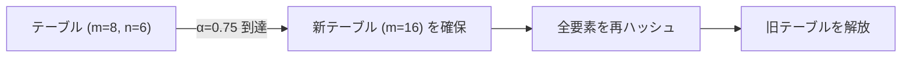
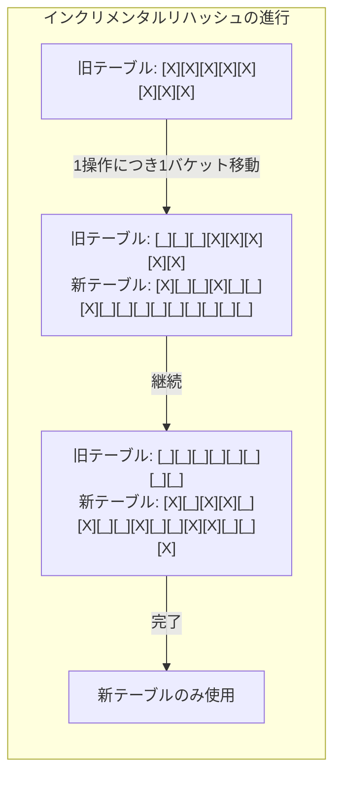
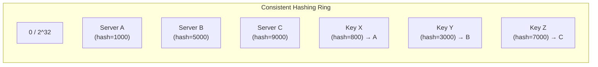

# ハッシュテーブル — 衝突解決とリサイズ戦略

## 1. はじめに：O(1) アクセスへの希求

プログラミングにおいて最も頻繁に行われる操作の一つは、「キーに対応する値を取得する」ことである。ユーザーIDからプロフィールを取得する、URLからキャッシュを引く、変数名からメモリアドレスを解決する――これらは本質的にすべて同じ問題、すなわち**連想配列**（associative array）の問題に帰着する。

配列であれば、インデックスによる $O(1)$ アクセスが可能である。しかし、キーが整数の連続した範囲でない場合、配列をそのまま使うことはできない。平衡二分探索木（赤黒木やAVL木）を使えば $O(\log n)$ でアクセスできるが、大規模データでは対数的なコストでも無視できない。

ハッシュテーブルは、**ハッシュ関数**を用いて任意のキーを配列のインデックスに変換することで、平均 $O(1)$ のアクセスを実現するデータ構造である。その発想は驚くほどシンプルだが、現実の実装には多くの工夫が必要である。

```
キー "alice" → ハッシュ関数 → 整数 2847193 → 配列インデックス 5 → 値を取得
```

この単純な仕組みの裏には、いくつかの本質的な問題が潜んでいる。

1. **衝突**（collision）：異なるキーが同じインデックスに写像される問題
2. **リサイズ**（resizing）：データ量の増加に伴い配列を拡張する必要性
3. **ハッシュ関数の品質**：均一な分散を実現するための設計
4. **セキュリティ**：意図的な衝突を引き起こす攻撃への耐性

本記事では、これらの問題を一つずつ掘り下げ、主要なプログラミング言語がどのようにハッシュテーブルを実装しているかを解説する。

## 2. ハッシュ関数の設計

ハッシュテーブルの性能は、ハッシュ関数の品質にほぼ完全に依存する。理想的なハッシュ関数は、入力の集合をテーブルの各スロットに**均一に分散**させる。偏りがあると、特定のスロットに衝突が集中し、 $O(1)$ の性能が崩壊する。

### 2.1 ハッシュ関数に求められる性質

ハッシュテーブル用のハッシュ関数には、暗号学的ハッシュ関数（SHA-256など）とは異なる要件がある。

| 性質 | ハッシュテーブル用 | 暗号学的 |
|---|---|---|
| 高速な計算 | 必須 | 重要だが二次的 |
| 均一な分散 | 必須 | 必須 |
| 衝突耐性 | 不要（衝突は許容） | 必須 |
| 一方向性 | 不要 | 必須 |
| 雪崩効果 | あると望ましい | 必須 |

**雪崩効果**（avalanche effect）とは、入力が1ビット変化したとき、出力のビットの約半分が反転する性質である。この性質がないと、類似したキー（"user001", "user002"など）が近いハッシュ値に写像され、衝突が増加する。

### 2.2 除算法（Division Method）

最も単純なハッシュ関数は、キーのハッシュ値をテーブルサイズ $m$ で割った余りをインデックスとするものである。

$$h(k) = k \bmod m$$

この方法は実装が容易だが、テーブルサイズ $m$ の選び方に注意が必要である。

- **2の冪を避ける**：$m = 2^p$ のとき、$h(k)$ はキーの下位 $p$ ビットのみで決まる。キーの上位ビットが無視されるため、分散が悪化する。
- **素数を選ぶ**：$m$ が素数であれば、キーの特定のパターンによる偏りが緩和される。たとえば、キーが一定の間隔で並んでいても、素数の剰余は周期的なパターンを作りにくい。

```python
# Division method example
def hash_division(key: int, table_size: int) -> int:
    return key % table_size

# Bad: table_size = 256 (power of 2) - only uses lower 8 bits
# Good: table_size = 257 (prime) - uses all bits
```

### 2.3 乗算法（Multiplication Method）

Donald Knuth が提唱した方法で、テーブルサイズの選び方に制約がない利点がある。

$$h(k) = \lfloor m \cdot (k \cdot A \bmod 1) \rfloor$$

ここで $A$ は $0 < A < 1$ の定数であり、$k \cdot A \bmod 1$ は $k \cdot A$ の小数部分を意味する。Knuth は $A \approx \frac{\sqrt{5} - 1}{2} \approx 0.6180339887$ （黄金比の逆数）を推奨している。この値は**数論的に最も均一な分散をもたらす**ことが知られている。

```python
import math

# Multiplication method (Knuth's suggestion)
A = (math.sqrt(5) - 1) / 2  # golden ratio conjugate

def hash_multiply(key: int, table_size: int) -> int:
    return int(table_size * ((key * A) % 1))
```

乗算法は除算法よりも分散が均一になりやすいが、浮動小数点演算を伴うため、整数演算のみの方法と比べてわずかに遅い。

### 2.4 Fibonacci Hashing

乗算法を整数演算で効率的に実装したものが Fibonacci Hashing である。テーブルサイズを $2^p$ とし、黄金比の逆数に相当する整数定数を使う。

$$h(k) = (k \cdot 2654435769) \gg (32 - p)$$

定数 $2654435769$ は $\lfloor 2^{32} \cdot \frac{\sqrt{5} - 1}{2} \rfloor$ であり、32ビット整数の乗算とビットシフトのみで計算できる。この方法は2の冪のテーブルサイズと組み合わせて使え、除算法の「2の冪だと分散が悪い」という問題を解決する。

### 2.5 MurmurHash

Austin Appleby が2008年に開発した非暗号学的ハッシュ関数で、**高速かつ均一な分散**を実現する。名前は、核となる操作が multiply（MU）と rotate（R）であることに由来する。

MurmurHash3 の主要な操作は以下の通りである。

```c
// Core mixing operations of MurmurHash3
uint32_t murmur3_mix(uint32_t h) {
    h ^= h >> 16;
    h *= 0x85ebca6b;
    h ^= h >> 13;
    h *= 0xc2b2ae35;
    h ^= h >> 16;
    return h;
}
```

MurmurHash は以下のような用途で広く使われている。

- Java の `HashMap` のハッシュ撹拌（hash spreading）
- Redis の内部ハッシュ
- Apache Hadoop のパーティショニング
- Google の各種分散システム

### 2.6 SipHash

Jean-Philippe Aumasson と Daniel J. Bernstein が2012年に設計したハッシュ関数で、**HashDoS攻撃への耐性**を主目的としている（セキュリティについては後述）。

SipHash は擬似ランダムな秘密鍵を用いる**キー付きハッシュ関数**（keyed hash function）であり、攻撃者がハッシュ値を予測することを困難にする。MurmurHash ほどの速度はないが、短い入力（キー長が数十バイト以下）に対しては十分に高速である。

```
SipHash-2-4:
- 2 rounds per message block
- 4 rounds for finalization
- 128-bit key
- 64-bit output
```

Rust の `HashMap`、Python 3.4以降の `dict`、Perl 5.18以降のハッシュテーブルがデフォルトで SipHash を採用している。

### 2.7 wyhash

Wang Yi が開発した超高速ハッシュ関数で、近年注目を集めている。64ビットの乗算と XOR のみで構成され、MurmurHash3 よりも高速でありながら、優れた分散特性を持つ。Go 1.17以降の `map` の内部ハッシュ関数として採用されている。

## 3. 衝突解決：チェイニング法（Separate Chaining）

### 3.1 基本的な仕組み

チェイニング法は、各スロットに**連結リスト**（またはそれに類するコンテナ）を持たせ、同じインデックスに写像されたキーをすべてそのリストに格納する方法である。



基本操作は以下のように実装される。

```python
class ChainingHashTable:
    def __init__(self, capacity: int = 16):
        self.capacity = capacity
        self.size = 0
        self.buckets: list[list[tuple]] = [[] for _ in range(capacity)]

    def _index(self, key) -> int:
        return hash(key) % self.capacity

    def put(self, key, value):
        idx = self._index(key)
        # Check if key already exists
        for i, (k, v) in enumerate(self.buckets[idx]):
            if k == key:
                self.buckets[idx][i] = (key, value)
                return
        self.buckets[idx].append((key, value))
        self.size += 1

    def get(self, key):
        idx = self._index(key)
        for k, v in self.buckets[idx]:
            if k == key:
                return v
        raise KeyError(key)

    def delete(self, key):
        idx = self._index(key)
        for i, (k, v) in enumerate(self.buckets[idx]):
            if k == key:
                self.buckets[idx].pop(i)
                self.size -= 1
                return
        raise KeyError(key)
```

### 3.2 計算量の分析

負荷率 $\alpha = n / m$（$n$ は要素数、$m$ はテーブルサイズ）とする。

| 操作 | 平均計算量 | 最悪計算量 |
|---|---|---|
| 検索（成功） | $O(1 + \alpha/2)$ | $O(n)$ |
| 検索（失敗） | $O(1 + \alpha)$ | $O(n)$ |
| 挿入 | $O(1)$ | $O(n)$ |
| 削除 | $O(1 + \alpha/2)$ | $O(n)$ |

$\alpha$ を定数以下に保てば（例えば $\alpha \leq 0.75$）、すべての操作が期待 $O(1)$ で実行される。ただし最悪の場合、すべてのキーが同じスロットに衝突すると $O(n)$ に退化する。

### 3.3 チェインのデータ構造の選択

連結リストの代わりに、より効率的なデータ構造を使うことで最悪計算量を改善できる。

**Java 8 の HashMap: Treeification**

Java の `HashMap` は、一つのバケット内の要素数が閾値（デフォルト8）を超えると、連結リストを**赤黒木に変換**する（treeify）。これにより、最悪計算量が $O(n)$ から $O(\log n)$ に改善される。

```
チェインの長さ ≤ 8  → 連結リスト（O(n) だが実際は短い）
チェインの長さ > 8   → 赤黒木（O(log n)）
チェインの長さ ≤ 6   → 赤黒木から連結リストに戻す（untreeify）
```

この二段階のしきい値（treeify: 8, untreeify: 6）はヒステリシスを形成し、境界付近での不要な構造変換を防いでいる。

### 3.4 チェイニング法の長所と短所

**長所**

- 実装がシンプル
- 負荷率が1を超えても動作可能（$\alpha > 1$）
- 削除が容易
- ハッシュ関数の品質にある程度寛容

**短所**

- ポインタによるメモリオーバーヘッド（次のノードへの参照）
- キャッシュ効率が悪い（メモリ上に散在するノードを辿る）
- メモリアロケーションが頻繁に発生する

特にキャッシュ効率の問題は重要である。現代のCPUでは、L1キャッシュのレイテンシは約1ns、メインメモリへのアクセスは約100nsであり、**100倍の速度差**がある。連結リストのノードがメモリ上に散在すると、ほぼ毎回キャッシュミスが発生し、理論上の $O(1)$ が実質的に大きな定数係数を持つことになる。

## 4. 衝突解決：オープンアドレス法

### 4.1 基本概念

オープンアドレス法（open addressing）は、すべてのエントリをハッシュテーブルの配列自体に格納する方法である。衝突が発生した場合、別のスロットを**探査**（probing）して空きを見つける。

チェイニング法との本質的な違いは、**外部のデータ構造（連結リストなど）を一切使わない**ことにある。すべてのデータが一つの連続した配列に格納されるため、キャッシュ効率が高い。



探査の方法によって、いくつかのバリエーションがある。

### 4.2 線形探査（Linear Probing）

最もシンプルな方法で、衝突時にスロットを1つずつ順に調べる。

$$h(k, i) = (h(k) + i) \bmod m \quad (i = 0, 1, 2, \ldots)$$

```python
class LinearProbingHashTable:
    EMPTY = object()
    DELETED = object()  # tombstone marker

    def __init__(self, capacity: int = 16):
        self.capacity = capacity
        self.size = 0
        self.keys = [self.EMPTY] * capacity
        self.values = [None] * capacity

    def _index(self, key) -> int:
        return hash(key) % self.capacity

    def put(self, key, value):
        if self.size >= self.capacity * 0.7:
            self._resize(self.capacity * 2)

        idx = self._index(key)
        while True:
            if self.keys[idx] is self.EMPTY or self.keys[idx] is self.DELETED:
                self.keys[idx] = key
                self.values[idx] = value
                self.size += 1
                return
            if self.keys[idx] == key:
                self.values[idx] = value  # update existing
                return
            idx = (idx + 1) % self.capacity

    def get(self, key):
        idx = self._index(key)
        while self.keys[idx] is not self.EMPTY:
            if self.keys[idx] == key:
                return self.values[idx]
            idx = (idx + 1) % self.capacity
        raise KeyError(key)

    def delete(self, key):
        idx = self._index(key)
        while self.keys[idx] is not self.EMPTY:
            if self.keys[idx] == key:
                self.keys[idx] = self.DELETED  # tombstone
                self.values[idx] = None
                self.size -= 1
                return
            idx = (idx + 1) % self.capacity
        raise KeyError(key)

    def _resize(self, new_capacity: int):
        old_keys = self.keys
        old_values = self.values
        self.capacity = new_capacity
        self.keys = [self.EMPTY] * new_capacity
        self.values = [None] * new_capacity
        self.size = 0
        for i in range(len(old_keys)):
            if old_keys[i] is not self.EMPTY and old_keys[i] is not self.DELETED:
                self.put(old_keys[i], old_values[i])
```

**線形探査の最大の長所はキャッシュ効率**である。連続したメモリ領域を順にアクセスするため、CPUのプリフェッチ機構が効果的に働き、キャッシュラインに載ったデータを一度に読み込める。

しかし、線形探査には**一次クラスタリング**（primary clustering）という深刻な問題がある。一度衝突が発生してクラスタ（連続した使用済みスロットの塊）が形成されると、そのクラスタに新しいキーが衝突する確率が高くなり、クラスタがさらに成長する。

```
クラスタリングの可視化:

挿入前: [_][_][X][X][X][_][_][X][_][_]
                ^^^^^^^^^^^
                クラスタ (長さ3)

このクラスタにハッシュされる確率: (3+1)/10 = 40%
（クラスタの先頭に衝突するケースを含む）

クラスタ成長後: [_][_][X][X][X][X][X][X][_][_]
                    ^^^^^^^^^^^^^^^^^^^^^^^
                    クラスタ (長さ6)

このクラスタにハッシュされる確率: (6+1)/10 = 70%
→ 正のフィードバックループでクラスタが加速度的に成長する
```

### 4.3 二次探査（Quadratic Probing）

一次クラスタリングを緩和するため、探査の間隔を二次関数的に増やす方法である。

$$h(k, i) = (h(k) + c_1 i + c_2 i^2) \bmod m$$

典型的な実装では $c_1 = 0, c_2 = 1$ として以下のようにする。

$$h(k, i) = (h(k) + i^2) \bmod m \quad (i = 0, 1, 2, \ldots)$$

二次探査は一次クラスタリングを解消するが、**二次クラスタリング**（secondary clustering）が発生する。同じハッシュ値を持つキーは同じ探査列を辿るため、初期ハッシュ値が同じキー同士の衝突は改善されない。

また、テーブルサイズの選び方に制約がある。$m$ が素数で $\alpha < 0.5$ であれば、すべてのスロットを探査できることが保証される。$m$ が $4k + 3$ の形の素数であれば、$\alpha < 1$ でも全スロットの探査が保証される。

### 4.4 二重ハッシュ法（Double Hashing）

二次クラスタリングを解消するため、探査の間隔を**第二のハッシュ関数**で決定する方法である。

$$h(k, i) = (h_1(k) + i \cdot h_2(k)) \bmod m$$

$h_2(k)$ は $h_2(k) \neq 0$ かつ $m$ と互いに素である必要がある。$m$ を素数にし、$h_2(k) = 1 + (k \bmod (m - 1))$ とするのが一般的である。

```python
def double_hash(key, i, table_size):
    h1 = hash(key) % table_size
    h2 = 1 + (hash(key) % (table_size - 1))
    return (h1 + i * h2) % table_size
```

二重ハッシュ法は理論的に最も均一な探査列を生成するが、ハッシュ関数を2回計算する必要があるため、1回の探査あたりのコストが線形探査よりも高い。また、探査がメモリ上で不連続なアクセスパターンになるため、キャッシュ効率は線形探査に劣る。

### 4.5 オープンアドレス法における削除：Tombstone

オープンアドレス法の削除は、チェイニング法ほど単純ではない。スロットを単純に空にすると、探査の途中で検索が途切れてしまい、そのスロットより先に格納されたキーが見つからなくなる。

この問題を解決するため、**Tombstone**（墓標）と呼ばれる特殊なマーカーを使う。削除されたスロットには Tombstone を置き、検索時は Tombstone を「使用中」として扱って探査を継続する。挿入時は Tombstone を「空き」として再利用できる。

```
操作例:

初期状態:    [A][B][C][_][_]   (A, B, C は同じハッシュ値)
C を削除:    [A][B][†][_][_]   († = Tombstone)
D を検索:    [A] → [B] → [†] → [_] → 見つからない
                                  ↑ EMPTY で検索終了

もし † が EMPTY だったら:
             [A] → [B] → [_] → 検索終了（Cの先にある要素が見つからない）
```

Tombstone の欠点は、大量の削除が行われるとテーブルが Tombstone で埋まり、探査の効率が悪化することである。これを防ぐため、定期的にリハッシュ（全要素を新しいテーブルに再挿入）を行う必要がある。

### 4.6 探査方法の比較

| 方式 | 一次クラスタリング | 二次クラスタリング | キャッシュ効率 | テーブルサイズ制約 |
|---|---|---|---|---|
| 線形探査 | あり | あり | 最高 | なし |
| 二次探査 | なし | あり | 中程度 | 素数が望ましい |
| 二重ハッシュ | なし | なし | 低い | 素数が必要 |

現代の実装では、キャッシュ効率の高さから**線形探査が最も広く使われている**。クラスタリング問題は、良質なハッシュ関数と適切な負荷率の維持によって十分に緩和できるためである。

## 5. 発展的な衝突解決手法

### 5.1 Robin Hood Hashing

Robin Hood Hashing は、Pedro Celis が1986年に提案した線形探査の改良版である。基本的なアイデアは「**裕福な者から奪い、貧しい者に与える**」というロビン・フッドの精神にある。

各要素の**探査距離**（probe distance）――本来のハッシュ位置からの距離――を記録し、挿入時に以下のルールを適用する。

> 挿入しようとしている要素の探査距離が、現在のスロットにある要素の探査距離よりも大きい場合、両者を**入れ替える**。

```
Robin Hood Hashing の挿入例:

要素 A: hash=2, 現在位置=2, 探査距離=0
要素 B: hash=2, 現在位置=3, 探査距離=1
要素 C: hash=3, 現在位置=4, 探査距離=1

新要素 D (hash=2) を挿入:
  位置2: A(距離0) vs D(距離0) → 同じ、次へ
  位置3: B(距離1) vs D(距離1) → 同じ、次へ
  位置4: C(距離1) vs D(距離2) → D の方が大きい → C と D を交換
  位置5: 空き → C を格納

結果:
  [2]=A(0), [3]=B(1), [4]=D(2), [5]=C(2)
  → 最大探査距離が均一化される
```





Robin Hood Hashing の利点は以下の通りである。

1. **最大探査距離の短縮**：探査距離の分散が小さくなり、最悪ケースが改善される
2. **検索の早期終了**：検索中に、現在のスロットの探査距離が検索対象の探査距離より大きければ、その時点で「見つからない」と確定できる
3. **Tombstone が不要**：削除時にバックシフト（後続要素を前方に移動）を行える。探査距離が均一化されているため、バックシフトのコストが限定的

Rust の標準ライブラリの `HashMap` は、かつて Robin Hood Hashing を採用していた（現在は Swiss Table ベースの hashbrown に移行）。

### 5.2 Cuckoo Hashing

Rasmus Pagh と Flemming Friche Rodler が2001年に提案した手法で、**最悪 $O(1)$ の検索**を保証する点が画期的である。

Cuckoo Hashing では、**2つのハッシュ関数** $h_1, h_2$ と**2つのテーブル** $T_1, T_2$ を用いる（変形として1つのテーブルで実装することもある）。各キーは $T_1[h_1(k)]$ または $T_2[h_2(k)]$ のいずれか一方に格納される。

**検索**は2箇所を調べるだけでよく、常に $O(1)$ で完了する。

**挿入**のプロセスがこの手法の名前の由来である。カッコウ（cuckoo, 郭公）が他の鳥の巣に卵を置いて元の卵を追い出すように、新しいキーは既存のキーを「追い出す」。

```
Cuckoo Hashing の挿入アルゴリズム:

1. x を T1[h1(x)] に挿入を試みる
2. もし T1[h1(x)] が空なら、そこに格納して終了
3. もし T1[h1(x)] に y が格納されていたら:
   a. y を追い出して x をそこに格納
   b. y を T2[h2(y)] に挿入を試みる
   c. もし T2[h2(y)] に z が格納されていたら:
      z を追い出して y をそこに格納
      z を T1[h1(z)] に挿入を試みる...
4. ループが検出されたら（最大試行回数を超えたら）:
   テーブルをリサイズして、新しいハッシュ関数でリハッシュ
```



Cuckoo Hashing の計算量は以下の通りである。

| 操作 | 計算量 |
|---|---|
| 検索 | 最悪 $O(1)$ |
| 削除 | 最悪 $O(1)$ |
| 挿入 | 期待 $O(1)$, 最悪 $O(n)$（リハッシュ時） |

ただし、負荷率を $\alpha < 0.5$ に保つ必要があるため、メモリ効率は他の方式よりも劣る。2つのハッシュ関数を3つ以上に拡張すると（$d$-ary Cuckoo Hashing）、負荷率をさらに上げることができ、$d = 3$ で約91%、$d = 4$ で約97%の負荷率が達成可能である。

### 5.3 Swiss Table (Abseil / hashbrown)

Google が2017年に開発した手法で、**SIMD命令を活用した高速な探査**が特徴である。Go の `map`（runtime 内部）や Rust の `HashMap`（hashbrown クレート）はこの系統の実装を採用している。

Swiss Table の核心は、各スロットに対応する**1バイトのメタデータ**（control byte）を持つことである。

```
Control byte の構成:
  0b1111_1111 = EMPTY   (空きスロット)
  0b1000_0000 = DELETED (Tombstone)
  0b0XXX_XXXX = FULL    (下位7ビットはハッシュ値の上位7ビット = H2)
```

検索時は、まず control byte の配列に対して**SIMD 命令（SSE2 / AVX2 / NEON）を使って16個のスロットを一度に比較**する。これにより、大部分のスロットを一度のCPU命令でフィルタリングでき、実際のキー比較はハッシュ値の H2 が一致したスロットにのみ行われる。

```
Swiss Table の検索フロー:

1. H1 = hash(key) の上位ビット → グループのインデックスを決定
2. H2 = hash(key) の下位7ビット → control byte との比較用

3. グループ内の16個の control byte を SIMD レジスタにロード
4. H2 と全16バイトを1命令で比較 → ビットマスクを得る
5. ビットマスクが立っているスロットのみ、実際のキーを比較
6. 見つからなければ次のグループへ（線形探査）
```

Swiss Table は、低い負荷率でも高い負荷率（87.5%程度まで）でも安定した性能を発揮する。これは SIMD によるバッチ処理がメモリアクセスパターンのペナルティを吸収するためである。

## 6. 負荷率とリサイズ戦略

### 6.1 負荷率（Load Factor）

負荷率 $\alpha = n / m$ は、ハッシュテーブルの性能を決定する最も重要なパラメータである。$\alpha$ が大きくなるほど衝突確率が増加し、操作の実行時間が悪化する。

**誕生日のパラドックス**との関連を考えると、衝突の発生しやすさが直感的に理解できる。$m$ 個のスロットに $n$ 個のキーをランダムに配置したとき、少なくとも1組の衝突が発生する確率は、$n \approx 1.2 \sqrt{m}$ で50%を超える。たとえば $m = 365$ なら $n \approx 23$ で衝突確率50%（これが「誕生日のパラドックス」そのものである）。

各方式における負荷率と平均探査回数の関係を以下に示す。

**チェイニング法の探査回数**（検索失敗時）:

$$E[\text{probes}] = 1 + \alpha$$

**線形探査の探査回数**（Knuth の解析、検索失敗時）:

$$E[\text{probes}] \approx \frac{1}{2}\left(1 + \frac{1}{(1-\alpha)^2}\right)$$

**二重ハッシュの探査回数**（検索失敗時）:

$$E[\text{probes}] = \frac{1}{1 - \alpha}$$

| $\alpha$ | チェイニング | 線形探査 | 二重ハッシュ |
|---|---|---|---|
| 0.50 | 1.50 | 2.50 | 2.00 |
| 0.75 | 1.75 | 8.50 | 4.00 |
| 0.90 | 1.90 | 50.50 | 10.00 |
| 0.95 | 1.95 | 200.50 | 20.00 |

この表から明らかなように、線形探査は高い負荷率で急激に性能が劣化する。各言語の実装では、以下のような負荷率の閾値が設定されている。

| 実装 | 方式 | 最大負荷率 |
|---|---|---|
| Java HashMap | チェイニング | 0.75 |
| Python dict | オープンアドレス | 2/3 ≈ 0.67 |
| Go map | チェイニング（バケット方式） | 6.5（バケットあたり） |
| Rust HashMap | Swiss Table | 7/8 = 0.875 |
| C++ unordered_map | チェイニング | 1.0 |

### 6.2 全体リハッシュ（Full Rehash）

最も単純なリサイズ戦略は、負荷率が閾値を超えたとき、新しいサイズのテーブルを確保し、すべての要素を再挿入するものである。



テーブルサイズは通常2倍に拡張する。これにより、挿入 $n$ 回のうちリハッシュは $O(\log n)$ 回しか発生せず、**ならし計算量**（amortized complexity）は $O(1)$ となる。

$$\text{ならしコスト} = \frac{\sum_{i=0}^{\log n} 2^i}{n} = \frac{2n - 1}{n} \approx 2 = O(1)$$

ただし、リハッシュが発生する瞬間は $O(n)$ の時間がかかるため、レイテンシに厳しい要件があるシステムでは問題となる。

### 6.3 インクリメンタルリハッシュ

全体リハッシュの「一時的な $O(n)$ のスパイク」を避けるため、リハッシュを**少しずつ分割して実行**する手法がインクリメンタルリハッシュ（incremental rehashing）である。

Redis はこの方式を採用しており、具体的には以下のように動作する。

```
Redis のインクリメンタルリハッシュ:

1. 新旧2つのハッシュテーブルを同時に保持
2. リハッシュ中の各操作（GET, SET, DELETE）ごとに、
   旧テーブルから1バケット分の要素を新テーブルに移動
3. 検索は新旧両方のテーブルを調べる
4. 挿入は常に新テーブルに対して行う
5. すべてのバケットが移動し終わったら旧テーブルを解放
```



インクリメンタルリハッシュの利点はレイテンシの安定化であるが、以下の代償を伴う。

- **メモリ消費の増加**：旧テーブルと新テーブルの両方を保持する必要がある
- **検索コストの増加**：リハッシュ中は両方のテーブルを調べる必要がある
- **実装の複雑化**：すべての操作で「リハッシュ中か否か」を判定する必要がある

### 6.4 リサイズの方向：縮小

ほとんどの実装では、要素数が減少した場合にテーブルを縮小する機能も持つ。Go の `map` は例外で、一度確保されたバケット配列は縮小されない（メモリが解放されない）。これは、縮小のコストとメモリ効率のトレードオフとして意図的に選択されている。

Python の `dict` は、要素数がテーブルサイズの 1/4 以下に減少したときにテーブルを縮小する（ただし、最小サイズの8を下回ることはない）。

### 6.5 サイズの選択：2の冪 vs 素数

テーブルサイズの選び方にはいくつかの流派がある。

**2の冪（power of two）**

- 利点：`h % m` を `h & (m - 1)` のビット演算に置き換えられるため高速
- 欠点：下位ビットのみが使われるため、ハッシュ関数の品質に大きく依存
- 採用：Java `HashMap`, Python `dict`, Rust `HashMap`, Go `map`

**素数**

- 利点：ハッシュ関数の分散が不完全でも、素数の剰余が偏りを緩和する
- 欠点：除算が必要で、ビット演算より遅い
- 採用：C++ `unordered_map`（GCC libstdc++の実装）

2の冪を使う場合、ハッシュ値の上位ビットも活用するための**撹拌**（perturbation）が不可欠である。Java の `HashMap` は以下のような処理を行う。

```java
// Java HashMap: hash spreading
static final int hash(Object key) {
    int h;
    return (key == null) ? 0 : (h = key.hashCode()) ^ (h >>> 16);
}
// Upper 16 bits are XORed into lower 16 bits
// This ensures upper bits participate in index calculation
```

## 7. 実装例の比較

### 7.1 Java HashMap

Java の `HashMap` は、**チェイニング法 + 赤黒木への昇格**という二段構えの設計を持つ。

```
Java HashMap の内部構造:

- 初期容量: 16（2の冪）
- 負荷率: 0.75
- バケット数 = 容量
- チェイン長 > 8 → 赤黒木に変換（treeify）
- チェイン長 < 6 → 連結リストに復帰（untreeify）
- リサイズ: 容量を2倍に
```

Java 8 における重要な最適化は、リサイズ時のキーの再配置である。テーブルサイズが2の冪であるため、サイズが $m$ から $2m$ に拡張されたとき、各キーの新しいインデックスは「元のインデックス」か「元のインデックス + $m$」のどちらかになる。これにより、再ハッシュの計算が不要になる。

```java
// Java 8 HashMap resize optimization
// For each key, check if the new high bit is 0 or 1
// if (hash & oldCapacity) == 0: stay in same index
// if (hash & oldCapacity) != 0: move to index + oldCapacity
```

### 7.2 Python dict

Python の `dict` は**オープンアドレス法**を採用しており、CPython の実装では独自の探査方式を使う。

```python
# CPython dict probing (simplified pseudocode)
# Uses a perturbation-based scheme:
# j = ((5 * j) + 1 + perturb) % size
# perturb >>= 5
# This generates a pseudo-random probe sequence
# that eventually visits all slots
```

Python 3.6以降の `dict` は**挿入順序を保持**する。これは、キーと値を格納する**密な配列**（compact array）と、ハッシュインデックスから密な配列の位置を指す**インデックステーブル**（sparse index table）を分離する設計により実現されている。

```
Python 3.6+ dict のメモリレイアウト:

インデックステーブル (sparse):
  [_, 1, _, 0, _, _, 2, _]

エントリ配列 (dense, 挿入順):
  [0: (hash_a, 'a', val_a),
   1: (hash_b, 'b', val_b),
   2: (hash_c, 'c', val_c)]

検索: hash('b') → インデックステーブル[1] → エントリ[1] → ('b', val_b)
反復: エントリ配列を先頭から順に → 挿入順を保持
```

この設計により、従来の `dict` よりもメモリ効率が20-25%改善された。インデックステーブルのエントリは小さな整数（エントリ数が256以下なら1バイト）で済むためである。

### 7.3 Go map

Go の `map` は**バケット方式のチェイニング法**を採用している。各バケットは8個のキーバリューペアを格納でき、オーバーフロー時はオーバーフローバケットを連結する。

```
Go map のバケット構造:

┌─────────────────────────────────────┐
│ tophash[8]  (各1バイト = ハッシュ上位8ビット) │
│ keys[8]     (8個のキー)                      │
│ values[8]   (8個の値)                        │
│ overflow    (オーバーフローバケットへのポインタ)  │
└─────────────────────────────────────┘

検索:
1. hash(key) の下位ビットでバケットを選択
2. hash(key) の上位8ビット (tophash) で8エントリを高速スキャン
3. tophash が一致したエントリのみ、キーを完全比較
```

Go の設計で注目すべき点は以下の通りである。

- **キーと値が別の配列に格納される**：`[k0,k1,...,k7][v0,v1,...,v7]` の順に配置。これはパディングによる無駄を防ぐためである（例：`[k0,v0,k1,v1,...]` だとアライメントのパディングが各ペア間に入る）
- **負荷率は6.5**：バケットあたり平均6.5要素に達するとリサイズ。スロットベースの負荷率に換算すると $6.5/8 = 0.8125$
- **等量拡張**（same-size grow）：バケット数を増やさず、オーバーフローバケットを解消するだけのリハッシュを行う場合がある。これは、大量の削除によって sparse になったテーブルを整理するために使われる
- **インクリメンタルリハッシュ**：各操作時に旧バケットから新バケットへの移動を1-2バケットずつ行う

### 7.4 Rust HashMap (hashbrown / Swiss Table)

Rust の標準ライブラリの `HashMap` は、Google の Swiss Table にインスパイアされた **hashbrown** クレートに基づいている。

```
Rust HashMap (hashbrown) の構造:

Control bytes:  [H2|H2|H2|EMPTY|H2|H2|DELETED|EMPTY|...]
                 ↓  ↓  ↓        ↓  ↓
Data slots:     [KV|KV|KV|  _  |KV|KV|   _   |  _  |...]

- Control byte グループ (16バイト) を SSE2 で並列比較
- H2: ハッシュ値の上位7ビット
- 負荷率上限: 7/8 = 87.5%
- SipHash 1-3 をデフォルトのハッシュ関数として使用
```

以前の Rust `HashMap` は Robin Hood Hashing を使っていたが、2019年に hashbrown に移行した。主な理由は以下の通りである。

1. **SIMD の活用**: Swiss Table は SIMD で16スロットを同時に比較でき、Robin Hood の逐次比較より高速
2. **高い負荷率**: Swiss Table は87.5%の負荷率でも性能が安定するが、Robin Hood は70%程度が限界
3. **削除の効率**: Swiss Table の Tombstone 処理は Robin Hood のバックシフトより単純

### 7.5 各実装の比較まとめ

| 特性 | Java HashMap | Python dict | Go map | Rust HashMap |
|---|---|---|---|---|
| 衝突解決 | チェイニング+赤黒木 | オープンアドレス | バケットチェイニング | Swiss Table |
| ハッシュ関数 | Object.hashCode() + 撹拌 | SipHash | wyhash系 | SipHash 1-3 |
| テーブルサイズ | 2の冪 | 2の冪 | 2の冪 | 2の冪 |
| 最大負荷率 | 0.75 | 0.67 | ~0.81 | 0.875 |
| 順序保持 | なし（LinkedHashMap で可） | あり（3.7+） | なし | なし |
| インクリメンタルリハッシュ | なし | なし | あり | なし |
| スレッドセーフ | なし（ConcurrentHashMap あり） | GILで部分的 | なし（sync.Map あり） | なし（DashMap 等あり） |

## 8. パフォーマンス特性と実際の計算量

### 8.1 理論と現実のギャップ

ハッシュテーブルの理論的な計算量は「期待 $O(1)$」であるが、現実の性能は定数係数によって大きく左右される。以下の要因が実行時間に影響を与える。

**ハッシュ関数の計算コスト**

文字列のハッシュ計算は文字列長に比例する $O(L)$ であるため、長い文字列キーでは無視できないコストとなる。

**キャッシュの効果**

```
メモリアクセスのコスト比較:
  L1 キャッシュヒット:    ~1 ns
  L2 キャッシュヒット:    ~4 ns
  L3 キャッシュヒット:    ~12 ns
  メインメモリ:           ~100 ns

チェイニング法（連結リスト）:
  → ほぼ毎回メインメモリアクセス（ポインタ追跡）
  → 1探査 ≈ 100 ns

オープンアドレス法（連続配列）:
  → 近傍スロットはキャッシュラインに載る
  → 1探査 ≈ 1-12 ns（キャッシュヒット時）
```

この差は**10倍から100倍**にもなり、理論的な探査回数の差よりもはるかに大きい。

**メモリアロケーションのコスト**

チェイニング法は、要素の挿入ごとにリストノードのメモリを動的に確保する必要がある。メモリアロケータの呼び出しは数十nsから数百nsのコストがかかり、ヒープのフラグメンテーションも引き起こす。オープンアドレス法ではリサイズ時を除いてメモリアロケーションが発生しないため、この点で有利である。

### 8.2 ベンチマークの一般的傾向

さまざまなベンチマークから得られる一般的な傾向を以下にまとめる。

1. **小規模テーブル（数十〜数百要素）**: ほぼすべてがキャッシュに載るため、方式による差は小さい
2. **中規模テーブル（数千〜数万要素）**: オープンアドレス法がチェイニング法を上回り始める
3. **大規模テーブル（数百万要素以上）**: キャッシュ効率の差が顕著になり、Swiss Table のような SIMD 活用型が最も高速
4. **文字列キー**: ハッシュ計算のコストが支配的になり、衝突解決方式の差が相対的に小さくなる
5. **整数キー**: ハッシュ計算が瞬時に終わるため、探査の効率が直接性能に反映される

### 8.3 最悪計算量の現実性

ハッシュテーブルの最悪計算量 $O(n)$ は、以下の状況で現実に発生する。

1. **質の低いハッシュ関数**: すべてのキーが同じインデックスに写像される
2. **意図的な攻撃**: HashDoS（後述）
3. **パターン化された入力**: 連番のID、特定の規則性を持つ文字列

Java の `HashMap` が赤黒木への昇格を導入した背景には、こうした最悪ケースを $O(\log n)$ に抑える意図がある。

## 9. Consistent Hashing との関連

ハッシュテーブルの文脈で「衝突」と「リサイズ」の問題を拡張したものが **Consistent Hashing** である。分散システムにおいて、データを複数のサーバー（ノード）に分散させる場面で使われる。

### 9.1 通常のハッシュによるシャーディングの問題

$N$ 台のサーバーにデータを分散するとき、最もシンプルな方法は `server = hash(key) % N` である。しかし、サーバーの追加・削除（$N$ の変更）が発生すると、ほぼすべてのキーの割り当てが変わってしまう。

```
例: 3台 → 4台に増設
  hash("user_A") % 3 = 2  →  hash("user_A") % 4 = 1  (移動)
  hash("user_B") % 3 = 0  →  hash("user_B") % 4 = 3  (移動)
  hash("user_C") % 3 = 1  →  hash("user_C") % 4 = 2  (移動)
  → ほぼ全データが再配置される
```

### 9.2 Consistent Hashing のアイデア

Consistent Hashing は、ハッシュ値の空間を円環（ring）として扱い、キーとサーバーの両方をこの円環上に配置する。キーは、円環上で時計回りに最も近いサーバーに割り当てられる。



サーバーが追加・削除されても、影響を受けるキーは追加・削除されたサーバーの近傍のキーのみであり、大部分のキーの割り当ては変わらない。$N$ 台のサーバーのうち1台が変更されたとき、影響を受けるキーは全体の約 $1/N$ のみである。

これは本記事で議論した「リサイズ」の問題――テーブルサイズが変わると全要素の再配置が必要――に対する分散システムスケールの解決策と見なすことができる。

## 10. セキュリティ：HashDoS 攻撃とその対策

### 10.1 HashDoS 攻撃とは

2003年に Scott Crosby と Dan Wallach が論文 "*Denial of Service via Algorithmic Complexity Attacks*" で報告した攻撃手法で、**意図的にハッシュ衝突を引き起こす入力を送り込み、ハッシュテーブルの操作を $O(n)$ に退化させる**ことでサービスを停止に追い込む。

2011年には、Alexander Klink と Julian Walde が PHP, Python, Java, Ruby など主要な言語のWebフレームワークに対する実際の攻撃を実証し、大きな反響を呼んだ（**28C3 での発表**）。HTTPリクエストのパラメータ解析に使われるハッシュテーブルが標的となった。

```
HashDoS の攻撃シナリオ:

1. 攻撃者はハッシュ関数の実装を解析
   (多くの言語でハッシュ関数は公開されている)

2. すべて同じハッシュ値を持つ文字列のセットを生成
   例: MurmurHash2 で衝突する文字列ペア (multi-collision)

3. HTTP POST リクエストのパラメータとしてこれらの文字列を送信
   Content-Type: application/x-www-form-urlencoded
   aaa=1&bbb=1&ccc=1&...  (すべてのキーが衝突)

4. Webサーバーがパラメータを解析する際、ハッシュテーブルへの
   挿入が O(n) × n回 = O(n²) に退化

5. 数千個のパラメータで CPU を数十秒占有 → サービス停止
```

### 10.2 対策

**対策1: ランダム化ハッシュ（Hash Randomization）**

プロセス起動時にランダムなシード（秘密鍵）を生成し、ハッシュ関数に組み込む。攻撃者はハッシュ値を予測できなくなるため、意図的な衝突を生成できない。

- **Python 3.3+**: `PYTHONHASHSEED` 環境変数（デフォルトでランダム化）
- **Ruby 1.9+**: ハッシュのランダム化
- **Perl 5.18+**: ハッシュのランダム化

**対策2: 暗号学的に安全なハッシュ関数（SipHash）**

SipHash は PRF（疑似ランダム関数）としての安全性を持つキー付きハッシュ関数であり、攻撃者がキーを知らない限り、出力を予測することは計算量的に不可能である。

- **Rust**: SipHash 1-3 がデフォルト
- **Python 3.4+**: SipHash-2-4（後に SipHash-1-3 に変更）
- **Perl 5.18+**: SipHash-2-4

**対策3: 入力サイズの制限**

HTTPパラメータの最大数を制限することで、攻撃の影響を緩和する。

- **PHP**: `max_input_vars` パラメータ（デフォルト1000）
- **Tomcat**: `maxParameterCount` 設定

**対策4: 最悪計算量の改善**

- **Java 8 HashMap**: 赤黒木への昇格（Treeification）により、最悪でも $O(\log n)$

### 10.3 SipHash の設計思想

SipHash が HashDoS 対策として最も根本的な解決策である理由を理解するには、ハッシュ関数に対する攻撃モデルを整理する必要がある。

```
攻撃モデル:

1. 攻撃者はハッシュ関数のアルゴリズムを知っている
   → オープンソースの言語ランタイムでは必然
2. 攻撃者はシードを知らない
   → プロセス起動時にランダム生成

SipHash の安全性:
- PRF (Pseudorandom Function) としての安全性
- シードを知らない攻撃者にとって、出力はランダムと区別不能
- 2^(n/2) 回のクエリでも衝突を予測不能 (n = 出力ビット数)
```

ただし、SipHash は MurmurHash や wyhash と比較してやや遅い。このため、セキュリティが不要な場面（信頼できる入力のみを扱う内部データ構造など）では、より高速なハッシュ関数を使うことが推奨される。Rust では `HashMap` のハッシュ関数をジェネリックに差し替え可能であり、パフォーマンスクリティカルな場面では `FxHashMap`（Firefoxで使われる高速ハッシュ）や `AHashMap`（AES-NI を利用する高速かつ安全なハッシュ）が使われる。

## 11. 設計上のトレードオフと選択指針

ハッシュテーブルの設計は、以下のトレードオフの組み合わせである。

### 11.1 チェイニング vs オープンアドレス

| 観点 | チェイニング | オープンアドレス |
|---|---|---|
| メモリ効率 | ポインタのオーバーヘッド | 空きスロットのオーバーヘッド |
| キャッシュ効率 | 低い | 高い |
| 削除の容易さ | 容易 | Tombstone が必要 |
| 最大負荷率 | $\alpha > 1$ も可能 | $\alpha < 1$ が必須 |
| 実装の複雑さ | シンプル | やや複雑 |
| 並行性 | ロック粒度を細かくできる | テーブル全体のロックが必要になりがち |

### 11.2 選択の指針

1. **汎用ライブラリ**: セキュリティと安定性を重視 → SipHash + Swiss Table（Rust, Go のアプローチ）
2. **内部データ構造**: 速度を最重視 → wyhash / FxHash + 線形探査
3. **データベースの内部**: 最悪計算量の保証 → Cuckoo Hashing
4. **組み込みシステム**: メモリが限られる → オープンアドレス法（外部メモリ確保不要）
5. **並行ハッシュテーブル**: ロックの粒度 → ストライプロック + チェイニング（Java ConcurrentHashMap）

## 12. まとめ

ハッシュテーブルは、一見するとシンプルな「配列 + ハッシュ関数」の構造だが、その内部には計算機科学の多くの重要な概念が凝縮されている。

**衝突解決**の設計は、「メモリのランダムアクセスは高い」という物理的制約と密接に関連している。チェイニング法の連結リストはポインタ追跡によるキャッシュミスを引き起こし、オープンアドレス法はキャッシュラインを活用する。Swiss Table に至っては、SIMD 命令というCPUのハードウェア機能を直接利用して探査を並列化する。ソフトウェアのデータ構造設計が、ハードウェアの進化と不可分であることを示す好例である。

**リサイズ**の問題は、ならし計算量（amortized analysis）の実践的な応用である。全体リハッシュは $O(n)$ の瞬間的コストを伴うが、ならせば $O(1)$ である。しかし、レイテンシの安定性が求められるシステム（Redis など）では、インクリメンタルリハッシュによってこのスパイクを分散させる。理論上の計算量が同じでも、実用上の要件によって適切な実装が異なるという教訓がここにある。

**HashDoS 攻撃**は、アルゴリズムの最悪計算量が現実のセキュリティ脅威となりうることを示した。この問題は、SipHash のような暗号学的に安全なハッシュ関数の採用によって解決され、セキュリティとパフォーマンスのトレードオフという新たな設計軸を生み出した。

ハッシュテーブルは、データ構造としての基本的な概念でありながら、キャッシュ階層、SIMD、暗号理論、分散システム（Consistent Hashing）にまで射程が広がる。その設計選択を深く理解することは、コンピューターサイエンスの広範な領域を横断する視点を養うことに他ならない。
