# Hazard Pointer と EBR

## 1. 背景 — ロックフリーデータ構造におけるメモリ回収問題

### 1.1 なぜメモリ回収が難しいのか

ロックフリーデータ構造は、ロックを使わずに複数のスレッドが並行してデータを読み書きできる仕組みである。CAS（Compare-And-Swap）などのアトミック命令を駆使して、高いスループットと進行保証を実現する。しかし、ロックフリーの世界には、ロックベースの設計では起こり得ない根本的な難題が存在する。それが**メモリ回収問題（safe memory reclamation, SMR）** である。

ロックベースのデータ構造では話は単純だ。ミューテックスを獲得してからノードを削除し、その場で `free` する。ロックが他のスレッドのアクセスを排除しているため、解放されたメモリを他のスレッドが参照することはない。

ロックフリーの場合、事情は根本的に異なる。あるスレッドがノードをリストから論理的に切り離した（unlink した）瞬間、別のスレッドがまだそのノードへのポインタを保持してアクセス中かもしれない。ここで即座に `free` すると、読み取り側は解放済みメモリにアクセスすることになり、**use-after-free** という未定義動作に陥る。

```c
// Thread A: remove node from lock-free linked list
Node *curr = atomic_load(&head);
if (atomic_compare_exchange(&head, &curr, curr->next)) {
    free(curr);  // DANGER: Thread B may still be reading curr
}
```

```c
// Thread B: traversing the list (concurrently)
Node *p = atomic_load(&head);  // p may point to the node Thread A just freed
int val = p->value;            // use-after-free: undefined behavior
```

この問題の本質は、**「いつ安全にメモリを解放できるか」を知ることが極めて困難** であるという点にある。ロックがなければ、どのスレッドがどのメモリ領域を参照中かを把握する手段がない。

### 1.2 ABA問題との関係

メモリ回収問題は、ロックフリープログラミングで有名な **ABA問題** と密接に関係している。ABA問題とは、CAS操作の対象値がA→B→Aと変化した場合に、CASが「変化なし」と誤判定してしまう問題である。

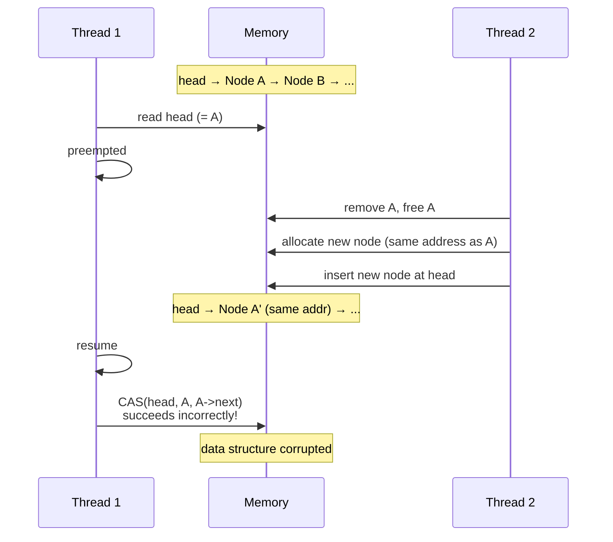

ABA問題の根本原因は、解放されたメモリが再利用される（アロケータが同じアドレスを返す）ことにある。もし削除済みノードのメモリが安全に回収されるまで再利用されないことを保証できれば、ABA問題は自然に解消される。つまり、安全なメモリ回収の仕組みは、ABA問題への本質的な解決策でもある。

### 1.3 ガベージコレクタがあれば解決するのでは？

JavaやGoのようにGC（ガベージコレクタ）を持つ言語であれば、参照されなくなったオブジェクトはGCが自動的に回収するため、use-after-freeは原理的に発生しない。しかし以下の理由から、GCに頼れない場面は多い。

- **CやC++** にはGCがない。カーネル、データベースエンジン、ネットワークスタックなど、システムプログラミングの多くはこれらの言語で書かれる
- **Rust** は所有権システムによりメモリ安全性を保証するが、ロックフリーデータ構造の「複数スレッドが同時にポインタを保持する」パターンは所有権モデルとの相性が悪い
- **リアルタイム性** が求められる場面では、GCの停止時間（stop-the-world pause）が許容できない
- **カーネル空間** ではユーザー空間のGCは利用できない

こうした場面で必要になるのが、アプリケーションレベルで実装する**安全なメモリ回収（Safe Memory Reclamation）** の手法である。本記事では、その代表的な手法である **Hazard Pointer**、**EBR（Epoch-Based Reclamation）**、**QSBR（Quiescent State Based Reclamation）** を詳しく解説する。

## 2. Hazard Pointer の原理

### 2.1 基本アイデア

Hazard Pointer は、2004年に Maged M. Michael が提案した手法である（論文: "Hazard Pointers: Safe Memory Reclamation for Lock-Free Objects"）。基本的なアイデアは極めて直感的だ。

> **「自分が今アクセスしているポインタを、グローバルに公開する。他のスレッドはそのポインタを見て、対応するメモリを解放しない。」**

各スレッドは、少数の **Hazard Pointer**（危険ポインタ）を持つ。これは特殊なグローバル変数であり、あるスレッドが「このポインタが指すメモリ領域にアクセス中だ」と宣言するために使う。メモリを解放しようとするスレッドは、全スレッドの Hazard Pointer を確認し、どれにも一致しないノードだけを安全に解放する。

### 2.2 データ構造

Hazard Pointer の仕組みを構成する主要なデータ構造は以下のとおりである。

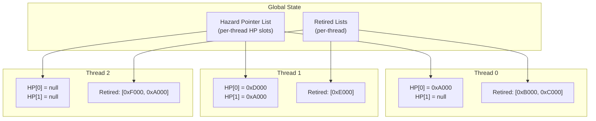

- **Hazard Pointer スロット**: 各スレッドに K 個（通常 1〜2 個）割り当てられるポインタ変数。アトミックに読み書きできる
- **Retired リスト**: 各スレッドがローカルに保持する「論理的に削除されたがまだ解放されていないノード」のリスト

### 2.3 プロトコル

Hazard Pointer のプロトコルは、**読み取り側**と**回収側**の2つの操作で構成される。

#### 読み取り側（Protect）

共有データ構造のノードにアクセスする際、以下の手順を踏む。

```
1. 対象ポインタの値をローカル変数に読み込む
2. その値を自スレッドの Hazard Pointer スロットに書き込む（store with release semantics）
3. 対象ポインタの値を再度読み込み、1. と一致するか確認する
4. 一致すれば安全にアクセスできる。不一致なら 1. に戻る
5. アクセス終了後、Hazard Pointer スロットを null にクリアする
```

ステップ3の再検証が必要な理由は、ステップ1と2の間にノードが削除・解放される可能性があるためだ。ステップ2で Hazard Pointer に登録した時点で既にノードが解放済みであれば、Hazard Pointer の保護は意味をなさない。再検証によって、Hazard Pointer への登録がノードの削除より前であったことを確認する。

```c
// Protect: safely acquire a reference to a shared node
void *protect(HazardPointer *hp, atomic_ptr *source) {
    void *ptr;
    do {
        ptr = atomic_load(source);           // step 1
        atomic_store(&hp->pointer, ptr);     // step 2 (release)
        atomic_thread_fence(memory_order_seq_cst);
    } while (ptr != atomic_load(source));    // step 3: re-validate
    return ptr;                              // step 4: safe to use
}

// After use:
// atomic_store(&hp->pointer, NULL);         // step 5: clear
```

#### 回収側（Retire & Reclaim）

ノードをデータ構造から論理的に切り離した後、以下の手順で回収を試みる。

```
1. 切り離したノードを自スレッドの Retired リストに追加する
2. Retired リストが一定数（閾値 R）に達したら、回収を開始する
3. 全スレッドの Hazard Pointer を収集し、集合 P を作る
4. Retired リストの各ノードについて、P に含まれなければ安全に free する
5. P に含まれるノードは Retired リストに残す
```

```c
void retire(void *ptr) {
    // step 1: add to thread-local retired list
    retired_list_push(my_retired, ptr);

    // step 2: trigger scan if threshold exceeded
    if (retired_list_size(my_retired) >= R) {
        scan();
    }
}

void scan() {
    // step 3: collect all hazard pointers into a set
    Set *protected = set_new();
    for (int t = 0; t < num_threads; t++) {
        for (int k = 0; k < K; k++) {
            void *hp = atomic_load(&hazard_pointers[t][k]);
            if (hp != NULL) {
                set_insert(protected, hp);
            }
        }
    }

    // step 4 & 5: reclaim or keep
    List *new_retired = list_new();
    for (Node *n = retired_list_begin(my_retired); n; n = n->next) {
        if (set_contains(protected, n->ptr)) {
            list_push(new_retired, n->ptr);  // still protected, keep
        } else {
            free(n->ptr);                     // safe to reclaim
        }
    }
    my_retired = new_retired;
}
```

### 2.4 正当性の直感的な証明

Hazard Pointer が安全である理由を直感的に説明する。

あるスレッド B がノード X を読み取っているとする。B は X の値を Hazard Pointer に登録し、再検証に成功している。これは、B が Hazard Pointer を設定した時点で X がまだデータ構造内に存在していたことを意味する。

別のスレッド A が X を削除して Retired リストに入れたとする。A が scan を実行する際、B の Hazard Pointer には X が登録されている。したがって A は X を free しない。

B が X へのアクセスを終えて Hazard Pointer をクリアした後、次の scan で X は保護されていないことが確認され、安全に free される。

### 2.5 進行保証

Hazard Pointer は**ロックフリー**の進行保証を提供する。各スレッドの protect 操作は、他のスレッドの動作に依存するループ（再検証）を含むが、このループは「他のスレッドが対象ポインタを変更し続ける限り」繰り返される。現実的には、対象ポインタが安定すれば必ずループを抜ける。scan 操作は他のスレッドの Hazard Pointer を読み取るだけであり、待機（blocking）は発生しない。

### 2.6 メモリ使用量の上限

Hazard Pointer の重要な特性として、未回収ノード数に**上限**があることが挙げられる。

- N: スレッド数
- K: 各スレッドの Hazard Pointer スロット数
- R: scan を開始する Retired リストの閾値

未回収ノードの最大数は $O(N \times (R + N \times K))$ である。各スレッドの Retired リストには最大 R 個のノードがあり、scan 時に Hazard Pointer で保護されているノード（最大 $N \times K$ 個）は解放できない。

通常 K は 1〜2、R は $N \times K$ 程度に設定されるため、未回収ノード数は $O(N^2 \times K)$ 程度となる。

## 3. EBR（Epoch-Based Reclamation）の仕組み

### 3.1 Hazard Pointer の課題

Hazard Pointer は理論的に美しく、強い保証を持つ手法だが、実用上いくつかの課題がある。

- **オーバーヘッド**: protect 操作のたびにアトミック書き込みと再検証が必要。ポインタを辿るたびにこのコストが発生するため、連結リストのトラバーサルなど、多数のノードにアクセスする操作では顕著なオーバーヘッドになる
- **Hazard Pointer スロットの管理**: 操作中に同時に保護すべきノード数が変動する場合（例: ツリーの探索中に親ノードと子ノードの両方を保護する）、必要なスロット数の見積もりが複雑になる
- **scan のコスト**: 全スレッドの Hazard Pointer を走査する必要があり、スレッド数が多いとコストが増加する

これらの課題を解決するために提案されたのが **EBR（Epoch-Based Reclamation）** である。

### 3.2 基本アイデア

EBR は、Keir Fraser が2004年の博士論文 "Practical lock-freedom" で体系化した手法である。基本的な発想は以下のとおりだ。

> **「全スレッドが現在のエポック（世代）を通過したことが確認できれば、古いエポックで退避されたノードは安全に解放できる。」**

Hazard Pointer がノード単位で保護を宣言するのに対し、EBR はスレッドの**活動期間**を単位として保護を行う。これにより、個々のポインタにアトミック操作を行うコストを回避できる。

### 3.3 データ構造

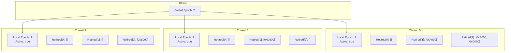

- **グローバルエポック**: 全スレッドで共有されるカウンタ。値は 0, 1, 2 の3つを巡回する
- **ローカルエポック**: 各スレッドが保持するエポック値。クリティカルセクション開始時にグローバルエポックの値をコピーする
- **Active フラグ**: 各スレッドがクリティカルセクション内（共有データ構造にアクセス中）かどうかを示すフラグ
- **Retired リスト**: 各スレッドがエポックごとに保持する、退避済みノードのリスト。3つのエポック分（現在、1つ前、2つ前）を保持する

### 3.4 プロトコル

#### クリティカルセクションの開始と終了

```c
void pin() {
    // Enter critical section
    atomic_store(&my_active, true);
    atomic_thread_fence(memory_order_seq_cst);
    int ge = atomic_load(&global_epoch);
    atomic_store(&my_epoch, ge);
}

void unpin() {
    // Leave critical section
    atomic_thread_fence(memory_order_release);
    atomic_store(&my_active, false);
}
```

`pin()` と `unpin()` はそれぞれクリティカルセクションの開始と終了を示す。`pin()` 内で自スレッドのローカルエポックをグローバルエポックに合わせる。Hazard Pointer と異なり、個々のポインタにアトミック操作を行う必要がないため、クリティカルセクション内でのポインタ操作は通常の読み取りで十分である。

#### 退避（Retire）

```c
void retire(void *ptr) {
    int e = atomic_load(&my_epoch);
    retired[e].push(ptr);
    try_advance();
}
```

ノードを退避する際、現在のローカルエポックに対応する Retired リストに追加する。

#### エポック進行と回収

```c
void try_advance() {
    int ge = atomic_load(&global_epoch);

    // Check if all threads have caught up to the current global epoch
    for (int t = 0; t < num_threads; t++) {
        if (atomic_load(&threads[t].active)) {
            if (atomic_load(&threads[t].epoch) != ge) {
                return;  // thread t is still in an older epoch
            }
        }
    }

    // All active threads are in the current epoch; advance
    int new_epoch = (ge + 1) % 3;
    if (atomic_compare_exchange(&global_epoch, &ge, new_epoch)) {
        // Reclaim nodes from two epochs ago
        int old_epoch = (new_epoch + 1) % 3;  // = ge - 1
        for (Node *n : retired[old_epoch]) {
            free(n);
        }
        retired[old_epoch].clear();
    }
}
```

エポック進行の仕組みを図で示す。

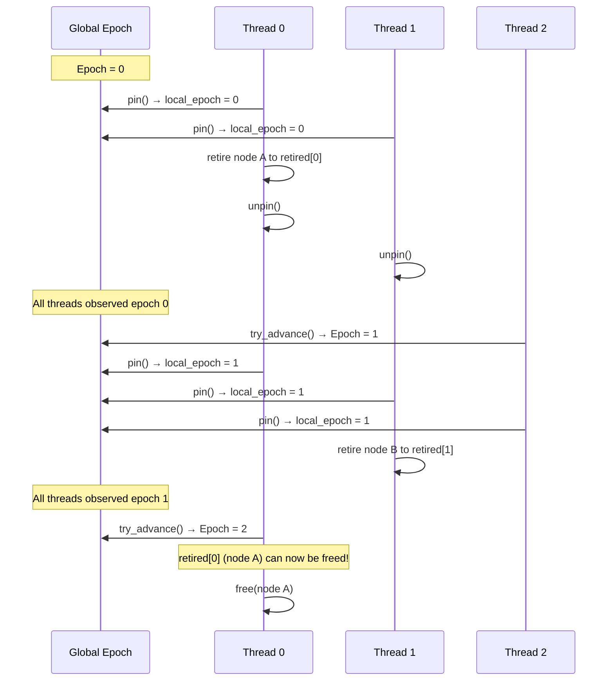

3つのエポックを巡回する理由は、「2エポック前に退避されたノードは、現在のエポックに到達した全スレッドからは参照されない」ことを保証するためである。具体的には：

1. エポック e で退避されたノード X は、エポック e の時点でデータ構造から切り離されている
2. グローバルエポックが e+1 に進行するためには、全アクティブスレッドがエポック e を観測している必要がある
3. グローバルエポックが e+2 に進行するためには、全アクティブスレッドがエポック e+1 を観測している必要がある
4. エポック e+1 以降に `pin()` したスレッドは、X がデータ構造から切り離された後に開始したため、X を参照する可能性がない
5. したがって、エポック e+2 に到達した時点で、X を安全に解放できる

### 3.5 EBR の利点と欠点

**利点:**

- **低オーバーヘッド**: クリティカルセクションの開始・終了時にアトミック操作を数回行うだけ。セクション内でのポインタアクセスには追加コストがない
- **バッチ回収**: エポック単位でまとめて解放するため、個別のノードに対する判定が不要
- **実装の簡潔さ**: Hazard Pointer と比べてコードが単純になる傾向がある

**欠点:**

- **ロックフリーではない**: 1つのスレッドがクリティカルセクション内で停止（プリエンプション、ページフォールト、長時間の処理など）すると、エポックが進行できなくなり、メモリが一切回収されない。最悪の場合、メモリが際限なく増大する
- **メモリ使用量に上限がない**: 上記の理由から、理論的にはメモリ使用量が無限に増大する可能性がある
- **遅延スレッド問題**: I/O待ちやスケジューラの判断により長時間停止するスレッドがあると、システム全体のメモリ回収が滞る

## 4. QSBR（Quiescent State Based Reclamation）

### 4.1 基本概念

QSBR は EBR の変種であり、さらに低いオーバーヘッドを実現する手法である。「静止状態（quiescent state）」の概念を用いて、スレッドが共有データ構造にアクセスしていないことを推測する。

> **「スレッドが静止状態（共有データ構造にアクセスしていないことが明白な状態）を通過すれば、それ以前に退避されたノードはそのスレッドからは参照されない。」**

EBR では `pin()` / `unpin()` でクリティカルセクションを明示的に囲む必要があったが、QSBR ではスレッドが**静止状態を報告するだけ** でよい。

### 4.2 静止状態とは

静止状態（quiescent state）とは、スレッドが共有データ構造への参照を一切保持していないことが保証される状態のことである。例えば：

- **カーネル空間**: システムコールの境界。ユーザー空間に戻る時点で、カーネル内のRCU保護データへの参照は保持されていない
- **イベントループ**: イベント処理の合間。次のイベントを取得する前に、前のイベントで参照していたデータは解放可能
- **ワーカースレッド**: ジョブの処理完了後、次のジョブを取得するまでの間

### 4.3 プロトコル

```c
// Thread reports it has passed through a quiescent state
void quiescent() {
    atomic_thread_fence(memory_order_release);
    int ge = atomic_load(&global_epoch);
    if (my_epoch != ge) {
        atomic_store(&my_epoch, ge);
        // Check if epoch can advance
        try_advance_epoch();
    }
}
```

QSBR と EBR の関係を次の表にまとめる。

| 特性 | EBR | QSBR |
|------|-----|------|
| 保護の宣言 | `pin()` / `unpin()` | `quiescent()` |
| 読み取り側のコスト | 低い（pin/unpin 時のみ） | 極めて低い（報告時のみ） |
| プログラマの負担 | クリティカルセクションを囲む | 静止状態を正しく報告する |
| 適用条件 | 汎用的 | 静止状態が自然に存在する場合 |
| カーネルでの利用 | 可能だが pin/unpin が煩雑 | 自然にフィットする |

QSBR の最大の利点は、**読み取りパス上にアトミック操作が一切不要** であることだ。共有データ構造へのアクセスは通常のメモリ読み取りだけで行え、静止状態の報告は読み取りパスの外で行われる。このため、Linux カーネルの RCU（後述）では QSBR の考え方が中核的に採用されている。

## 5. 各手法の比較

### 5.1 特性比較表

| 特性 | Hazard Pointer | EBR | QSBR |
|------|---------------|-----|------|
| 提案年 | 2004 (Michael) | 2004 (Fraser) | 1998 (McKenney) |
| 読み取り側コスト | 高い（HP設定+再検証） | 低い（pin/unpin） | 極めて低い（quiescent） |
| 書き込み側コスト | 中程度 | 低い | 低い |
| 進行保証 | ロックフリー | ロックフリーではない | ロックフリーではない |
| メモリ使用量上限 | $O(N^2 K)$ | 上限なし | 上限なし |
| 停止スレッドへの耐性 | あり | なし | なし |
| 実装の複雑さ | 中程度 | 低い | 低い（適用条件次第） |
| 代表的な利用例 | Facebook Folly, libcds | crossbeam-epoch (Rust) | Linux RCU |

### 5.2 読み取り側のコスト詳細

各手法の読み取り側の操作を、連結リストのトラバーサルを例に比較する。

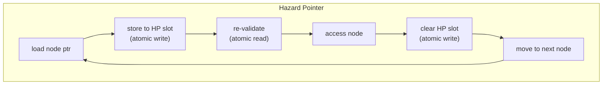

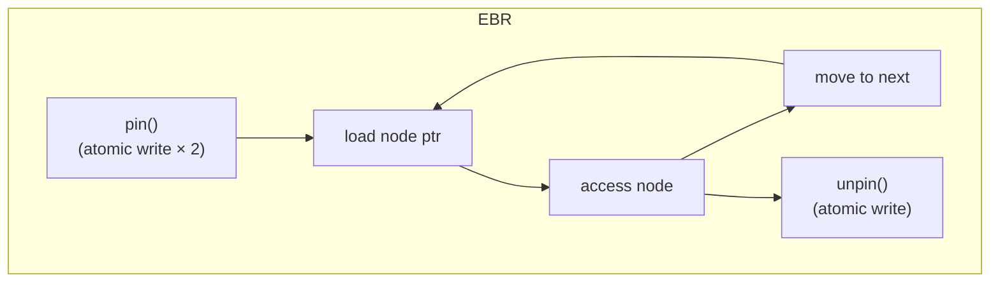

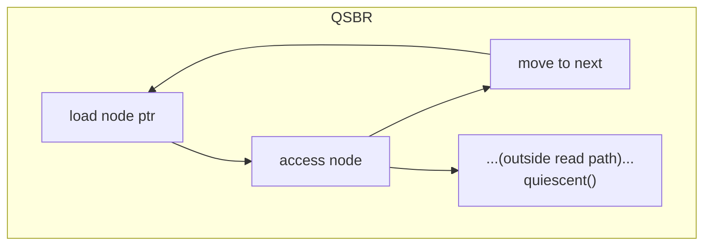

Hazard Pointer では、ノードを1つ辿るたびにアトミック操作が必要になる。N 個のノードを走査する場合、約 3N 回のアトミック操作が発生する。一方、EBR では pin/unpin の2回（計約3回のアトミック操作）で済み、QSBR では読み取りパス上にアトミック操作が一切ない。

### 5.3 トレードオフの本質

各手法のトレードオフを一言で表すと：

- **Hazard Pointer**: 高コストだが**強い保証**（メモリ上限あり、停止スレッド耐性あり）
- **EBR**: 低コストだが**弱い保証**（停止スレッドで全体が滞る）
- **QSBR**: 最低コストだが**適用範囲が限定**（静止状態が自然に存在する場合のみ）

この根本的なトレードオフは、「保護の粒度」に由来する。Hazard Pointer はポインタ単位、EBR はクリティカルセクション単位、QSBR はスレッドの活動期間単位で保護を行う。粒度が粗いほどオーバーヘッドは小さいが、回収の遅延が大きくなる。

## 6. crossbeam-epoch（Rust）

### 6.1 Rust とメモリ回収

Rust はコンパイル時に所有権と借用のルールを強制し、メモリ安全性を保証する言語である。しかし、ロックフリーデータ構造では「複数のスレッドが同じノードへのポインタを同時に保持する」状況が不可避であり、Rust の借用チェッカーだけでは安全性を保証できない。

`crossbeam-epoch` は、Rust のロックフリーデータ構造ライブラリ `crossbeam` の一部として提供される EBR の実装である。Rust の型システムと組み合わせることで、EBR の使い方を誤りにくくする API を提供している。

### 6.2 API の概要

```rust
use crossbeam_epoch::{self as epoch, Atomic, Owned, Shared};
use std::sync::atomic::Ordering;

struct Node {
    value: i32,
    next: Atomic<Node>,
}

// Entering a critical section (pinning)
let guard = epoch::pin();

// Loading a shared pointer (no per-pointer atomic overhead)
let head: Shared<Node> = self.head.load(Ordering::Acquire, &guard);

// Accessing the node
if let Some(node) = unsafe { head.as_ref() } {
    println!("{}", node.value);
}

// Retiring a node (deferred reclamation)
unsafe {
    guard.defer_destroy(head);
}

// guard is dropped here → unpin()
```

### 6.3 主要な型

`crossbeam-epoch` は、EBR のセマンティクスを Rust の型システムで表現するために、いくつかの重要な型を導入している。

- **`Guard`**: `pin()` が返すガード値。クリティカルセクションの有効期間を表す。`Guard` が生存している間、参照しているノードは回収されない。`Drop` トレイトにより、スコープを抜ける際に自動的に `unpin()` される
- **`Atomic<T>`**: `AtomicPtr<T>` に相当するが、`Guard` を要求する API を持つ。`load()` は `Shared<'g, T>` を返す
- **`Shared<'g, T>`**: ライフタイム `'g` が `Guard` に紐づいた参照。`Guard` が有効な間のみ有効であることを型レベルで保証する
- **`Owned<T>`**: ヒープ上のオブジェクトの一意な所有権を表す。`Atomic<T>` に格納する際に使用する

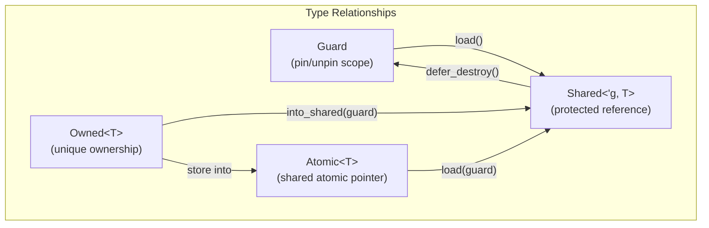

### 6.4 ライフタイムによる安全性

`crossbeam-epoch` の設計で最も重要な点は、`Shared<'g, T>` のライフタイム `'g` が `Guard` の参照に紐づいていることだ。これにより、以下の誤用がコンパイル時に検出される。

```rust
// COMPILE ERROR: shared outlives guard
let shared = {
    let guard = epoch::pin();
    self.head.load(Ordering::Acquire, &guard)
    // guard is dropped here
};
// shared is no longer valid — compiler rejects this
```

`Guard` がドロップされると `unpin()` が呼ばれ、エポックが進行して参照先が解放される可能性がある。`Shared` のライフタイムが `Guard` に束縛されていることで、解放後のアクセスを型レベルで防止できる。

ただし、`Shared` から実際の参照（`&T`）を取得する操作は `unsafe` である。これは、他のスレッドがデータを変更する可能性があるため、Rust の借用ルール（排他的借用の一意性）を静的に検証できないからだ。

### 6.5 内部実装の概要

`crossbeam-epoch` の内部実装は、前述の基本的な EBR に加えて、以下の最適化が施されている。

- **スレッドローカルなピンカウンタ**: 毎回グローバルエポックにアクセスするのではなく、一定回数の pin ごとにグローバルエポックを確認する。これにより、頻繁な pin/unpin のコストを軽減する
- **バッグ（Bag）ベースの退避管理**: Retired リストの代わりに、固定サイズのバッグを使用する。バッグが満杯になるとグローバルキューに移される
- **クロスクリーニング**: 他のスレッドの退避ノードも回収できる仕組み。特定のスレッドに退避が偏った場合のバランスを取る

## 7. RCU（Read-Copy-Update）との関係

### 7.1 RCUの概要

RCU（Read-Copy-Update）は、Linux カーネルで広く使用される同期機構であり、Paul McKenney を中心に発展してきた。RCU は単なるメモリ回収手法ではなく、**読み取り側ロックフリーの同期プリミティブ** として位置づけられる。

RCU の基本的な動作原理は以下のとおりである。

1. **Read**: 読み取り側は`rcu_read_lock()` / `rcu_read_unlock()` で読み取りクリティカルセクションを囲む。この操作はプリエンプション禁止（non-preemptible RCU の場合）程度のコストしかない
2. **Copy-Update**: 書き込み側は既存のデータ構造のコピーを作成し、コピー上で変更を行い、ポインタのアトミック更新で切り替える
3. **Reclaim**: 古いデータ構造は `synchronize_rcu()` または `call_rcu()` で、全 CPU が静止状態を通過した後に解放される

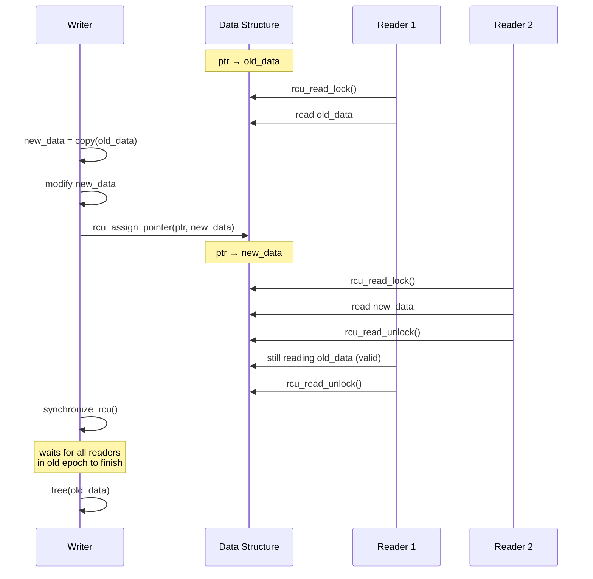

### 7.2 RCU と QSBR/EBR の関係

RCU の回収メカニズムは、本質的に QSBR の実装である。Linux カーネルの RCU 実装では、コンテキストスイッチやアイドルループの入り口が静止状態として扱われる。カーネルは「全 CPU が少なくとも1回のコンテキストスイッチを経験した」ことを検出してグレースピリオド（grace period）の完了を判定し、古いデータを回収する。

| RCU の用語 | QSBR/EBR の用語 |
|-----------|----------------|
| Grace period | エポックの完全な巡回 |
| Quiescent state | 静止状態 |
| `rcu_read_lock()` | `pin()` |
| `rcu_read_unlock()` | `unpin()` |
| `synchronize_rcu()` | グレースピリオドの待機 |
| `call_rcu()` | `retire()` + 非同期回収 |

### 7.3 RCU の種類

Linux カーネルには複数の RCU 実装が存在する。

- **Classic RCU（Tree RCU）**: 最も基本的な実装。読み取りクリティカルセクション内ではプリエンプションが禁止される。これにより、コンテキストスイッチの発生が静止状態の通過と等価になる
- **Preemptible RCU**: リアルタイムカーネル向け。読み取りクリティカルセクション内でのプリエンプションを許可するが、そのためにカウンタベースの追跡が必要になる。QSBR ではなく EBR に近い設計
- **SRCU（Sleepable RCU）**: 読み取りクリティカルセクション内でスリープを許可する特殊な変種
- **Tasks RCU**: タスク（プロセス）単位の静止状態を追跡する

### 7.4 ユーザー空間 RCU

`liburcu`（Userspace RCU）は、RCU のセマンティクスをユーザー空間で利用するためのライブラリである。複数の実装フレーバーを提供する。

- **QSBR**: 最高速だが、アプリケーションが明示的に静止状態を報告する必要がある
- **Memory-barrier-based**: メモリバリアを用いた EBR 風の実装
- **Signal-based**: シグナルを使って他のスレッドに静止状態のチェックを強制する。停止スレッド問題を軽減する

## 8. 実装上の注意点

### 8.1 メモリオーダリング

安全なメモリ回収の実装では、メモリオーダリング（メモリ順序）が極めて重要である。不適切なメモリオーダリングは、コンパイラやCPUの最適化により命令が並べ替えられ、保護メカニズムが機能しなくなる原因となる。

**Hazard Pointer の場合:**

```c
// CRITICAL: the store to HP must be visible before the re-validation load
atomic_store_explicit(&hp->pointer, ptr, memory_order_release);  // (1)
atomic_thread_fence(memory_order_seq_cst);                       // (2)
void *current = atomic_load_explicit(source, memory_order_acquire);  // (3)
```

(1) の Hazard Pointer への書き込みが (3) の再検証より前にグローバルに可視になることを保証しなければならない。もしこの順序が保証されないと、他のスレッドが scan を実行した際に Hazard Pointer の設定を見逃し、保護中のノードを解放してしまう可能性がある。

**EBR の場合:**

```c
// pin(): local epoch update must be visible before any data access
atomic_store_explicit(&my_active, true, memory_order_relaxed);
atomic_thread_fence(memory_order_seq_cst);       // full fence
int ge = atomic_load_explicit(&global_epoch, memory_order_relaxed);
atomic_store_explicit(&my_epoch, ge, memory_order_relaxed);
atomic_thread_fence(memory_order_acquire);        // ensure epoch is set before data reads
```

### 8.2 スレッド登録と登録解除

マルチスレッド環境では、スレッドの動的な生成と破棄に対応する必要がある。特に以下の問題に注意が必要だ。

- **スレッド終了時の Retired リスト**: スレッドが終了する際、そのスレッドの Retired リストに残っているノードを他のスレッドに引き継ぐか、最終的なクリーンアップで回収する必要がある
- **Hazard Pointer スロットの再利用**: 終了したスレッドの HP スロットをクリアし、新しいスレッドに再利用できるようにする
- **エポック進行のブロック**: EBR/QSBR では、登録済みだが終了したスレッドが Active のまま残ると、エポックが永久に進行しなくなる。`unpin()` やスレッド登録解除を確実に行う必要がある

### 8.3 キャッシュライン競合

Hazard Pointer のスロットや EBR のエポック変数は、複数のスレッドから頻繁にアクセスされる。これらの変数が同じキャッシュラインに配置されると、**偽共有（false sharing）** によりキャッシュの無効化が頻発し、パフォーマンスが大幅に低下する。

```c
// BAD: hazard pointers may share a cache line
struct HazardPointer {
    atomic_ptr pointer;  // 8 bytes
};
HazardPointer hp_array[MAX_THREADS];  // tightly packed

// GOOD: pad to avoid false sharing
struct HazardPointer {
    atomic_ptr pointer;
    char padding[CACHE_LINE_SIZE - sizeof(atomic_ptr)];
};
```

`crossbeam-epoch` では、`CachePadded<T>` ラッパー型を提供してこの問題に対処している。

### 8.4 ネストされたクリティカルセクション

EBR のクリティカルセクションがネストされる場合（関数 A が `pin()` を呼び、その内部で関数 B も `pin()` を呼ぶ）、内側の `unpin()` でクリティカルセクションが終了してはならない。`crossbeam-epoch` では、スレッドローカルなカウンタでネストの深さを追跡し、最外のスコープを抜ける時だけ実際に `unpin()` を実行する。

### 8.5 停止スレッド問題への対策

EBR/QSBR で最も深刻な問題は、停止スレッドによるメモリ回収の滞りである。実用的なシステムでは、以下のような対策が講じられる。

- **タイムアウトベースの回避**: 一定時間エポックが進行しない場合、停止しているスレッドを登録解除する
- **ハイブリッドアプローチ**: 通常時は EBR を使い、メモリ使用量が閾値を超えた場合に Hazard Pointer にフォールバックする
- **クロススレッド回収**: 停止スレッドの Retired リストを他のスレッドが回収する仕組み
- **シグナルベースの介入**: `liburcu` の signal-based フレーバーのように、シグナルを送って停止スレッドに静止状態を通過させる

## 9. パフォーマンス特性

### 9.1 マイクロベンチマーク

各手法のパフォーマンス特性は、ワークロードの種類によって大きく異なる。以下は典型的なベンチマーク結果の傾向を示す。

**読み取り主体のワークロード（95% read, 5% write）:**

```
スループット (ops/sec, 相対値)
              1 thread    4 threads   16 threads   64 threads
Lock-based:     1.0×        2.5×        4.0×         3.5×
Hazard Ptr:     0.9×        3.2×        10.0×        25.0×
EBR:            1.0×        3.5×        12.0×        35.0×
QSBR:           1.0×        3.6×        13.0×        38.0×
```

読み取り主体のワークロードでは、EBR と QSBR が Hazard Pointer を大きく上回る。これは、Hazard Pointer の per-access アトミック操作のコストが累積するためである。

**書き込み主体のワークロード（50% read, 50% write）:**

```
スループット (ops/sec, 相対値)
              1 thread    4 threads   16 threads   64 threads
Lock-based:     1.0×        1.8×        2.0×         1.5×
Hazard Ptr:     0.8×        2.5×        6.0×         12.0×
EBR:            0.9×        2.8×        7.0×         14.0×
QSBR:           0.9×        2.9×        7.5×         15.0×
```

書き込みが多いワークロードでは、各手法の差は縮まる。書き込み操作自体のCAS競合がボトルネックになるためだ。

### 9.2 メモリ使用量

メモリ使用量の観点では、Hazard Pointer と EBR/QSBR の間に本質的な違いがある。

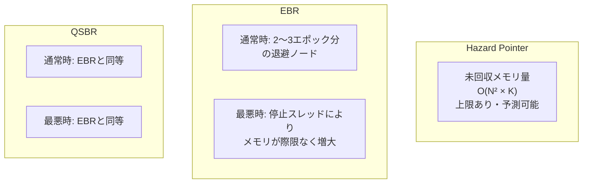

Hazard Pointer はメモリ使用量が予測可能であるため、メモリが制約されたシステム（組み込み、カーネルの一部）では有利になる場合がある。

### 9.3 レイテンシ分布

スループットだけでなく、レイテンシ分布（特にテールレイテンシ）も重要な指標である。

- **Hazard Pointer**: scan 操作がトリガーされた際にレイテンシのスパイクが発生するが、scan のコストは Retired リストのサイズと Hazard Pointer の数に比例するため、予測可能
- **EBR**: 通常のレイテンシは極めて低いが、エポック進行の遅れによりバッチ解放のサイズが大きくなると、解放コストによるスパイクが発生する可能性がある
- **QSBR**: 読み取りパスのレイテンシは最も安定している。ただし、静止状態の報告間隔がグレースピリオドの長さを決定するため、報告が疎だと回収が遅れる

### 9.4 NUMA 環境での考慮

NUMA（Non-Uniform Memory Access）アーキテクチャでは、異なる NUMA ノードのメモリへのアクセスにはローカルメモリの数倍のレイテンシがかかる。

- **Hazard Pointer**: scan 時に全スレッドの HP スロットを走査するため、NUMA 越えのメモリアクセスが頻発する。NUMA ノードごとに HP リストを分割するなどの最適化が必要
- **EBR**: pin/unpin はスレッドローカル操作が主であり、NUMA の影響は比較的小さい。ただし、グローバルエポックのアトミック更新は全ノードから見えるため、キャッシュコヒーレンスのコストが発生する
- **QSBR / RCU**: Linux の Tree RCU は NUMA を意識した階層的な設計を持ち、各ノードの状態を段階的に集約する。これにより、NUMA 越えのアクセスを最小限に抑えている

## 10. 近年の発展と今後の展望

### 10.1 ハイブリッド手法

近年、各手法の利点を組み合わせたハイブリッドアプローチが研究されている。

- **Hyaline（2020）**: 参照カウントとエポックを組み合わせた手法。EBR のような低コストで、Hazard Pointer のようなメモリ上限保証を提供する
- **NBR（Neutralization-Based Reclamation, 2021）**: 停止スレッドの操作を無効化（neutralize）することで、EBR の停止スレッド問題を解決する手法
- **VBR（Version-Based Reclamation）**: バージョンカウンタを利用してノードの有効性を検証する手法

### 10.2 ハードウェアサポート

一部のプロセッサには、メモリ回収を支援するハードウェア機構が存在する。

- **Intel TSX（Transactional Synchronization Extensions）**: ハードウェアトランザクショナルメモリを利用して、読み取り側を完全にオーバーヘッドフリーにする試み
- **ARM MTE（Memory Tagging Extension）**: メモリにタグを付与し、use-after-free を検出する。直接的なメモリ回収手法ではないが、安全性の補助として利用できる
- **CHERI（Capability Hardware Enhanced RISC Instructions）**: ケーパビリティベースのポインタモデルにより、解放済みメモリへのアクセスをハードウェアレベルで防止する

### 10.3 言語レベルのサポート

C++ では、Hazard Pointer と RCU の標準化が進められている。

- **P2530**: `std::hazard_pointer` の提案。C++26 で採用される見込み
- **P2545**: `std::rcu_domain` の提案。ユーザー空間 RCU の標準 API

これらが標準化されれば、ロックフリーデータ構造のメモリ回収が、言語の標準ライブラリとして利用可能になる。

### 10.4 実践的な選択指針

最後に、実際のシステムでどの手法を選ぶべきかの指針を示す。

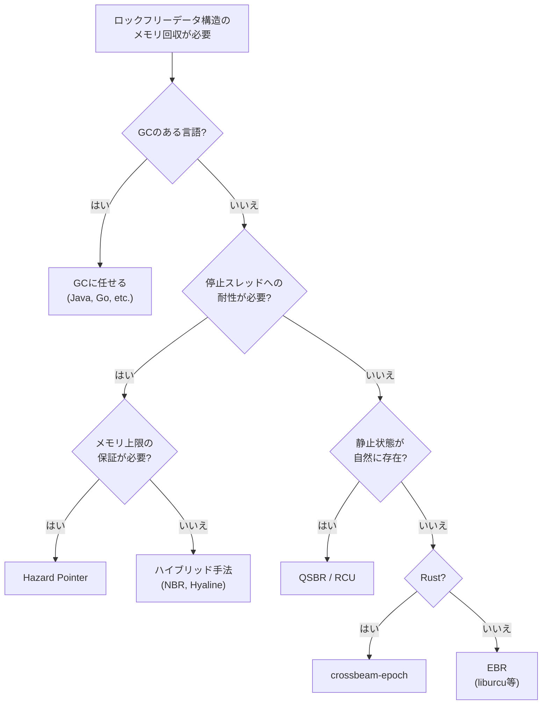

## まとめ

ロックフリーデータ構造におけるメモリ回収は、並行プログラミングの中でも最も困難な問題の一つである。本記事で解説した Hazard Pointer、EBR、QSBR はそれぞれ異なるトレードオフを持ち、適材適所の使い分けが求められる。

Hazard Pointer はポインタ単位の精密な保護を提供し、メモリ使用量の上限と停止スレッドへの耐性を保証する。その代償として、読み取り操作に per-access のアトミックコストが発生する。

EBR はエポック単位の保護により読み取りコストを大幅に削減するが、停止スレッドによるメモリ回収の滞りというアキレス腱を持つ。crossbeam-epoch は Rust の型システムと組み合わせることで、EBR の安全な利用を支援する優れた実装である。

QSBR は静止状態の概念を利用して最小のオーバーヘッドを実現し、Linux カーネルの RCU として大規模なプロダクション環境で実績を積んでいる。

近年のハイブリッド手法やハードウェアサポートの進展、そして C++ 標準への組み込みの動きは、この分野が今なお活発に発展していることを示している。ロックフリープログラミングに取り組むエンジニアにとって、これらの手法の理解は不可欠な基礎知識である。

## 参考文献

- Maged M. Michael. "Hazard Pointers: Safe Memory Reclamation for Lock-Free Objects." IEEE Transactions on Parallel and Distributed Systems, 2004.
- Keir Fraser. "Practical Lock-Freedom." PhD thesis, University of Cambridge, 2004.
- Paul E. McKenney and John D. Slingwine. "Read-Copy Update: Using Execution History to Solve Concurrency Problems." Parallel and Distributed Computing and Systems, 1998.
- Paul E. McKenney. "Is Parallel Programming Hard, And, If So, What Can You Do About It?" kernel.org, 2023.
- crossbeam-epoch documentation. https://docs.rs/crossbeam-epoch/
- Ajay Singh, Trevor Brown, and Ali Mashtizadeh. "NBR: Neutralization Based Reclamation." PPoPP 2021.
- Ruslan Nikolaev and Binoy Ravindran. "Hyaline: Fast and Transparent Lock-Free Memory Reclamation." PPoPP 2020.
