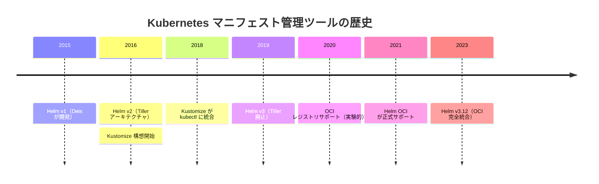
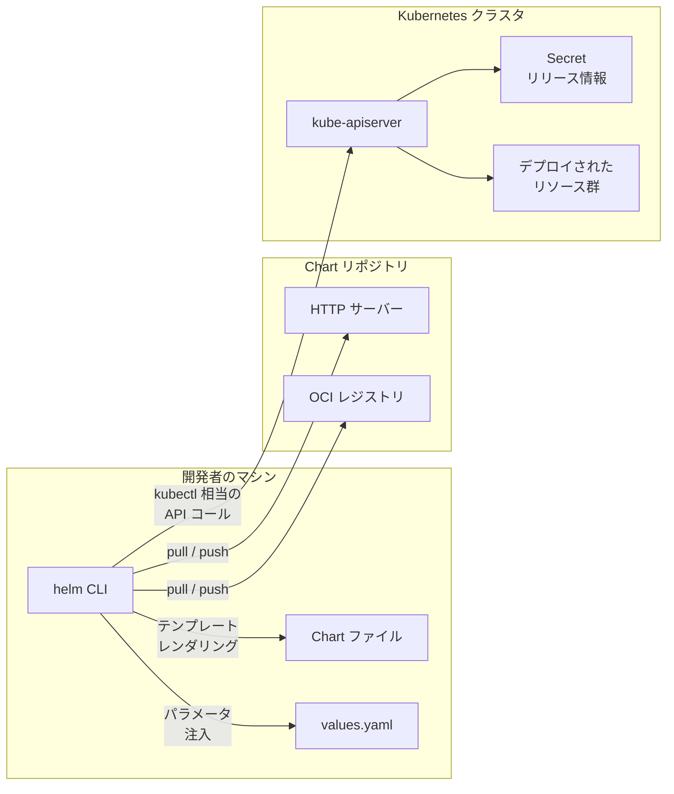
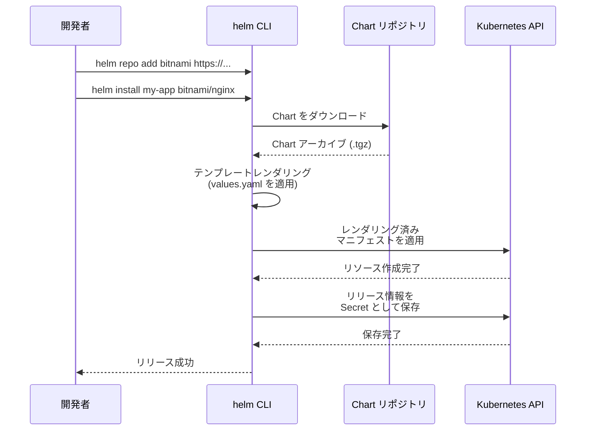
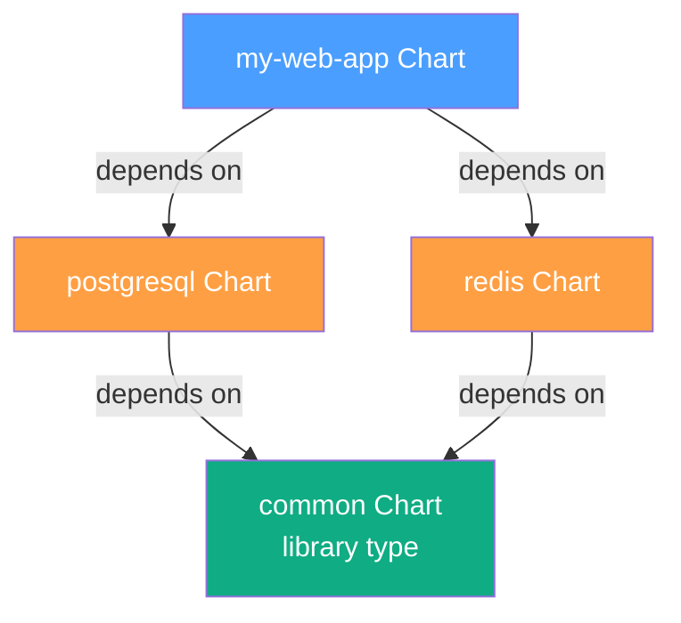
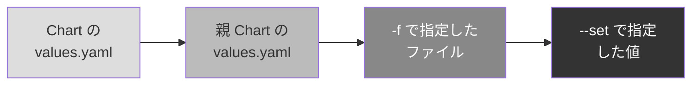
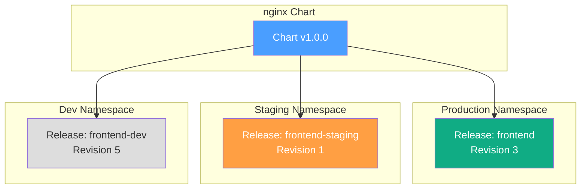
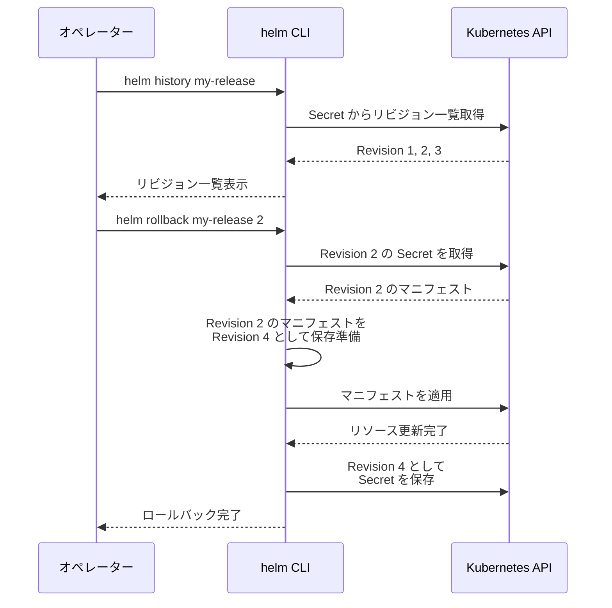
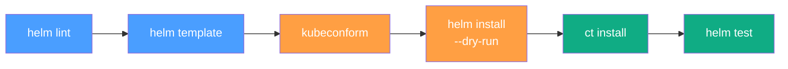
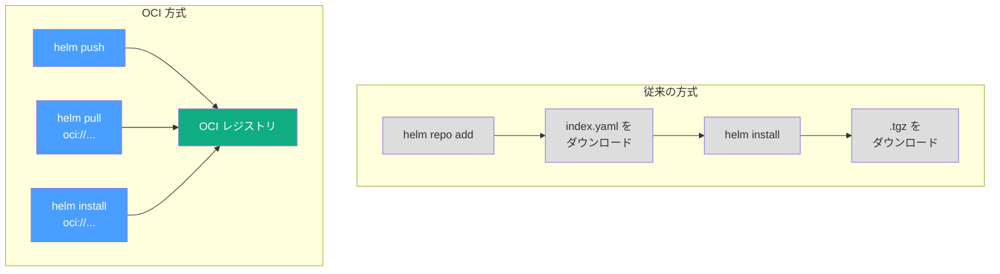

# Helm とマニフェスト管理

## 1. Kubernetes マニフェスト管理の課題

Kubernetes を本番運用する際、最初に直面する問題は「大量の YAML マニフェストをどう管理するか」だ。小規模なアプリケーションであっても、Deployment、Service、ConfigMap、Secret、Ingress、ServiceAccount、RBAC リソースなど、10 個以上のマニフェストファイルが必要になることは珍しくない。マイクロサービスアーキテクチャでは、この数が数百から数千に膨れ上がる。

### 1.1 生の YAML がもたらす問題

Kubernetes マニフェストを `kubectl apply -f` で直接適用する運用は、以下の本質的な課題を抱えている。

**重複と一貫性の欠如**: 同じアプリケーションを staging 環境と production 環境にデプロイする場合、レプリカ数、リソースリミット、環境変数、イメージタグなどが異なるだけで、構造の大部分は共通している。環境ごとに YAML ファイルをコピーして修正する方法は、差分管理が困難であり、一方の環境への修正を他方に反映し忘れるリスクが常に存在する。

**バージョン管理の不在**: `kubectl apply` はマニフェストを適用するだけで、「いつ、誰が、どのバージョンのマニフェストを適用したか」という履歴を保持しない。ロールバックしたい場合、以前のマニフェストを Git 履歴から探し出して再適用する必要がある。

**依存関係の管理**: アプリケーションが Redis や PostgreSQL などの外部コンポーネントに依存する場合、それらのマニフェストも含めて一貫してデプロイする仕組みが必要になる。生の YAML にはそのようなパッケージングの概念がない。

**テンプレート化の欠如**: YAML はデータ記述フォーマットであり、条件分岐やループといったロジックを記述する機能を持たない。特定の環境でだけ Ingress を作成したい、ノードのラベルに応じて tolerations を動的に生成したいといった要求に対して、生の YAML は無力だ。

### 1.2 マニフェスト管理ツールの登場

これらの課題に対して、Kubernetes エコシステムではさまざまなアプローチが提案されてきた。



Helm はこの中で最も広く採用されているツールであり、CNCF の Graduated プロジェクトとしてエコシステムの中核的な位置を占めている。しかし、Helm が唯一の解ではなく、Kustomize のようにまったく異なる哲学に基づくツールも広く利用されている。この記事では Helm を中心に据えつつ、代替アプローチとの比較も行う。

---

## 2. Helm の概要

### 2.1 Helm とは何か

Helm は「Kubernetes のパッケージマネージャ」と呼ばれる。Linux における apt や yum、プログラミング言語における npm や pip に相当する位置づけだ。しかし、この比喩は半分正しく半分ミスリーディングでもある。

apt や npm がバイナリやライブラリをダウンロードしてインストールするのに対し、Helm がインストールするのは **Kubernetes マニフェストの束** である。Helm は以下の 3 つの中核的な機能を提供する。

1. **テンプレートエンジン**: Go テンプレートを使って YAML マニフェストをパラメータ化する
2. **パッケージング**: 関連するマニフェスト群を「Chart」という単位にまとめて配布する
3. **リリース管理**: インストール、アップグレード、ロールバックの履歴を Kubernetes 内に保存する

### 2.2 Helm のアーキテクチャ（v3）

Helm v2 では **Tiller** というサーバーサイドコンポーネントが Kubernetes クラスタ内で動作していた。Tiller は cluster-admin 相当の権限を持ち、クラスタ全体に対してマニフェストを適用する役割を担っていた。しかし、このアーキテクチャにはセキュリティ上の重大な問題があった。Tiller にアクセスできる任意のユーザーが、事実上クラスタの完全な管理権限を持つことになるためだ。

Helm v3 では Tiller が完全に廃止され、**クライアントサイドのみ** のアーキテクチャに移行した。



Helm v3 のアーキテクチャでは、`helm` CLI が直接 Kubernetes API サーバーと通信する。リリースの状態は Kubernetes クラスタ内の **Secret**（デフォルト）または ConfigMap として保存される。これにより、Helm のリリース情報は Kubernetes の RBAC で保護され、Namespace ごとのアクセス制御が可能になった。

### 2.3 Helm の基本的なワークフロー

Helm を使ったデプロイの基本的な流れは次のようになる。



このように、Helm は「Chart のダウンロード」「テンプレートのレンダリング」「Kubernetes への適用」「リリース情報の保存」という一連の流れをひとつのコマンドで実行する。

---

## 3. Chart の構造

### 3.1 Chart のディレクトリレイアウト

Helm Chart はファイルシステム上のディレクトリとして表現される。典型的な Chart のディレクトリ構造は以下のとおりだ。

```
mychart/
├── Chart.yaml          # Chart のメタデータ
├── Chart.lock          # 依存関係のロックファイル
├── values.yaml         # デフォルトの設定値
├── values.schema.json  # values のバリデーションスキーマ (任意)
├── charts/             # 依存 Chart のアーカイブ
├── crds/               # Custom Resource Definitions (任意)
├── templates/          # マニフェストテンプレート
│   ├── _helpers.tpl    # テンプレートヘルパー関数
│   ├── deployment.yaml
│   ├── service.yaml
│   ├── ingress.yaml
│   ├── configmap.yaml
│   ├── hpa.yaml
│   ├── serviceaccount.yaml
│   ├── NOTES.txt       # インストール後のメッセージ
│   └── tests/          # Chart テスト
│       └── test-connection.yaml
└── README.md           # Chart のドキュメント (任意)
```

### 3.2 Chart.yaml — メタデータの定義

`Chart.yaml` は Chart の名前、バージョン、依存関係などのメタデータを定義するファイルだ。

```yaml
# Chart metadata
apiVersion: v2
name: my-web-app
description: A web application chart for Kubernetes
type: application
version: 1.2.0        # Chart version (follows SemVer)
appVersion: "3.4.1"   # Application version being deployed

# Keywords for search
keywords:
  - web
  - application

# Maintainer information
maintainers:
  - name: team-platform
    email: platform@example.com

# Dependencies
dependencies:
  - name: postgresql
    version: "12.x.x"
    repository: "https://charts.bitnami.com/bitnami"
    condition: postgresql.enabled
  - name: redis
    version: "17.x.x"
    repository: "https://charts.bitnami.com/bitnami"
    condition: redis.enabled
```

ここで重要な概念が 2 つある。

**`version` と `appVersion` の区別**: `version` は Chart 自体のバージョンであり、SemVer に従う。テンプレートや values のスキーマが変わったときに更新する。`appVersion` はその Chart がデプロイするアプリケーションのバージョンだ。例えば、nginx のイメージタグを変更しただけなら `appVersion` を更新し、テンプレートの構造を変更したら `version` を上げる。

**`apiVersion: v2`**: Helm v3 では `apiVersion: v2` を使用する。v1 は Helm v2 用の形式であり、`type` フィールドや `dependencies` の直接記述がサポートされていなかった。

### 3.3 Chart の種類 — application と library

Helm v3 では `type` フィールドにより、Chart を 2 種類に分類できる。

- **application**: 通常の Chart で、Kubernetes リソースをデプロイする。デフォルト値。
- **library**: マニフェストを直接デプロイせず、他の Chart から利用される共通テンプレートやヘルパー関数を提供する。`templates/` ディレクトリ内のファイルはレンダリングされない。

library Chart は大規模な組織でテンプレートの標準化を行う際に有効だ。例えば、全サービスに共通するラベル体系や Deployment のベーステンプレートを library Chart として提供し、個別のアプリケーション Chart がそれを依存関係として利用するといった使い方ができる。

### 3.4 依存関係管理

Chart の依存関係は `Chart.yaml` の `dependencies` セクションで宣言する。`helm dependency update` コマンドを実行すると、指定されたリポジトリから依存 Chart がダウンロードされ、`charts/` ディレクトリに配置される。同時に `Chart.lock` ファイルが生成され、依存関係のバージョンが固定される。



依存関係には **条件付き有効化** という仕組みがある。`condition` フィールドに values のパスを指定すると、その値が `true` のときだけ依存 Chart がインストールされる。これにより、PostgreSQL を外部サービスとして利用する環境では内蔵の PostgreSQL Chart を無効化するといった制御が可能になる。

---

## 4. テンプレートエンジン

### 4.1 Go テンプレートの基本

Helm のテンプレートエンジンは Go の `text/template` パッケージをベースにしている。加えて、**Sprig** ライブラリが提供する 70 以上のユーティリティ関数が利用可能だ。テンプレートの基本的な構文を以下に示す。

```yaml
# templates/deployment.yaml
apiVersion: apps/v1
kind: Deployment
metadata:
  name: {{ include "mychart.fullname" . }}
  labels:
    {{- include "mychart.labels" . | nindent 4 }}
spec:
  {{- if not .Values.autoscaling.enabled }}
  replicas: {{ .Values.replicaCount }}
  {{- end }}
  selector:
    matchLabels:
      {{- include "mychart.selectorLabels" . | nindent 6 }}
  template:
    metadata:
      annotations:
        # Force redeployment when ConfigMap changes
        checksum/config: {{ include (print $.Template.BasePath "/configmap.yaml") . | sha256sum }}
      labels:
        {{- include "mychart.selectorLabels" . | nindent 8 }}
    spec:
      {{- with .Values.imagePullSecrets }}
      imagePullSecrets:
        {{- toYaml . | nindent 8 }}
      {{- end }}
      containers:
        - name: {{ .Chart.Name }}
          image: "{{ .Values.image.repository }}:{{ .Values.image.tag | default .Chart.AppVersion }}"
          imagePullPolicy: {{ .Values.image.pullPolicy }}
          ports:
            - name: http
              containerPort: {{ .Values.service.port }}
              protocol: TCP
          {{- if .Values.resources }}
          resources:
            {{- toYaml .Values.resources | nindent 12 }}
          {{- end }}
```

テンプレート内で利用できる主要なオブジェクトは以下のとおりだ。

| オブジェクト | 説明 |
|---|---|
| `.Values` | `values.yaml` とユーザー指定の値がマージされたもの |
| `.Chart` | `Chart.yaml` の内容 |
| `.Release` | リリースの情報（名前、Namespace、リビジョン番号など） |
| `.Template` | 現在のテンプレートファイルの情報 |
| `.Capabilities` | クラスタの API バージョン情報 |
| `.Files` | Chart 内のファイルにアクセスするためのオブジェクト |

### 4.2 ヘルパーテンプレート（_helpers.tpl）

`_helpers.tpl` は命名規約に過ぎず、ファイル名の先頭が `_` であるファイルは Kubernetes マニフェストとしてレンダリングされない。ここに共通のテンプレートスニペットを定義する。

```yaml
# templates/_helpers.tpl

{{/*
Expand the name of the chart.
*/}}
{{- define "mychart.name" -}}
{{- default .Chart.Name .Values.nameOverride | trunc 63 | trimSuffix "-" }}
{{- end }}

{{/*
Create a default fully qualified app name.
Truncate at 63 chars because some Kubernetes name fields are limited.
*/}}
{{- define "mychart.fullname" -}}
{{- if .Values.fullnameOverride }}
{{- .Values.fullnameOverride | trunc 63 | trimSuffix "-" }}
{{- else }}
{{- $name := default .Chart.Name .Values.nameOverride }}
{{- if contains $name .Release.Name }}
{{- .Release.Name | trunc 63 | trimSuffix "-" }}
{{- else }}
{{- printf "%s-%s" .Release.Name $name | trunc 63 | trimSuffix "-" }}
{{- end }}
{{- end }}
{{- end }}

{{/*
Common labels
*/}}
{{- define "mychart.labels" -}}
helm.sh/chart: {{ include "mychart.chart" . }}
{{ include "mychart.selectorLabels" . }}
{{- if .Chart.AppVersion }}
app.kubernetes.io/version: {{ .Chart.AppVersion | quote }}
{{- end }}
app.kubernetes.io/managed-by: {{ .Release.Service }}
{{- end }}

{{/*
Selector labels
*/}}
{{- define "mychart.selectorLabels" -}}
app.kubernetes.io/name: {{ include "mychart.name" . }}
app.kubernetes.io/instance: {{ .Release.Name }}
{{- end }}
```

`helm create` コマンドで生成されるスキャフォールドには、これらのヘルパーが自動的に含まれる。`mychart.fullname` のようなヘルパーが `trunc 63` を行っているのは、Kubernetes のリソース名が RFC 1123 に基づき 63 文字に制限されているためだ。

### 4.3 制御構造

Go テンプレートは、条件分岐、ループ、スコープ制御といった制御構造を提供する。

**条件分岐（if / else）**:

```yaml
{{- if .Values.ingress.enabled }}
apiVersion: networking.k8s.io/v1
kind: Ingress
metadata:
  name: {{ include "mychart.fullname" . }}
  {{- with .Values.ingress.annotations }}
  annotations:
    {{- toYaml . | nindent 4 }}
  {{- end }}
spec:
  {{- if .Values.ingress.tls }}
  tls:
    {{- range .Values.ingress.tls }}
    - hosts:
        {{- range .hosts }}
        - {{ . | quote }}
        {{- end }}
      secretName: {{ .secretName }}
    {{- end }}
  {{- end }}
  rules:
    {{- range .Values.ingress.hosts }}
    - host: {{ .host | quote }}
      http:
        paths:
          {{- range .paths }}
          - path: {{ .path }}
            pathType: {{ .pathType }}
            backend:
              service:
                name: {{ include "mychart.fullname" $ }}
                port:
                  number: {{ .port | default 80 }}
          {{- end }}
    {{- end }}
{{- end }}
```

**ループ（range）**: `range` は配列やマップに対してイテレーションを行う。上の例では `.Values.ingress.hosts` と `.paths` に対して二重ループが使われている。`range` のブロック内ではコンテキスト `.` がイテレーション中の要素を指すため、Chart レベルの値にアクセスするには `$`（ルートコンテキスト）を使う必要がある。

**スコープ制御（with）**: `with` は `.` のスコープを指定したオブジェクトに変更する。値が空でないときだけブロックを実行するという条件分岐の役割も兼ねる。

### 4.4 空白制御と nindent

YAML はインデントに敏感なフォーマットであるため、テンプレートの空白制御は極めて重要だ。Helm テンプレートでは以下のテクニックが頻用される。

- **`{{-` と `-}}`**: ハイフン付きのデリミタで前後の空白を除去する。`{{-` は前方の空白を、`-}}` は後方の空白を削除する。
- **`nindent N`**: 改行を挿入した後、N 文字分のインデントを付与する。`indent` は改行なしのインデントだ。
- **パイプライン**: `|` でテンプレート関数をチェーンする。`{{ .Values.config | toYaml | nindent 4 }}` のように、値を YAML 文字列に変換してからインデントを適用するパターンが頻出する。

空白制御のミスは、有効な YAML を生成できず `helm template` やインストール時にエラーとなる最も一般的な原因だ。テンプレートを書いたら `helm template` でレンダリング結果を確認する習慣が不可欠である。

### 4.5 lookup 関数とクラスタの状態参照

Helm v3 では `lookup` 関数を使って、テンプレートレンダリング時にクラスタ内の既存リソースを参照できる。

```yaml
{{- $secret := lookup "v1" "Secret" .Release.Namespace "my-existing-secret" }}
{{- if $secret }}
# Use existing secret
secretName: my-existing-secret
{{- else }}
# Create new secret
secretName: {{ include "mychart.fullname" . }}-secret
{{- end }}
```

ただし、`helm template` コマンド（ローカルレンダリング）では `lookup` は常に空のオブジェクトを返す。CI/CD パイプラインで `helm template` を使う場合はこの挙動に注意が必要だ。

---

## 5. values.yaml の設計

### 5.1 values.yaml の役割

`values.yaml` は Chart のパラメータを定義するファイルだ。Chart 開発者はここにデフォルト値を設定し、Chart 利用者はインストール時に `--set` フラグや `-f` オプションで値をオーバーライドする。

values の優先順位は以下のとおりだ（後のものが優先）。



複数の `-f` ファイルが指定された場合は、後に指定されたファイルが優先される。`--set` は最も高い優先度を持つが、複雑なデータ構造の表現には不向きなため、環境固有の values ファイルを使うのが一般的だ。

### 5.2 values 設計のベストプラクティス

良い values.yaml の設計は、Chart の使いやすさを大きく左右する。以下の原則に従うことが推奨される。

**フラットすぎず深すぎない階層構造**: リソースの種類や機能ごとに適度にグループ化する。

```yaml
# Good: logically grouped
image:
  repository: nginx
  tag: "1.25"
  pullPolicy: IfNotPresent

service:
  type: ClusterIP
  port: 80

ingress:
  enabled: false
  className: ""
  annotations: {}
  hosts:
    - host: chart-example.local
      paths:
        - path: /
          pathType: ImplementationSpecific
  tls: []

resources:
  limits:
    cpu: 500m
    memory: 256Mi
  requests:
    cpu: 100m
    memory: 128Mi

autoscaling:
  enabled: false
  minReplicas: 1
  maxReplicas: 10
  targetCPUUtilizationPercentage: 80
```

**enabled パターン**: オプショナルなリソース（Ingress、HPA、PDB など）は `enabled: false` をデフォルトにし、明示的に有効化する方式が標準的だ。

**空オブジェクトのデフォルト**: annotations や labels のようなマップ型のフィールドは、空マップ `{}` をデフォルトにする。テンプレート側で `{{- with .Values.podAnnotations }}` を使えば、空のときはブロックごとスキップされる。

**コメントによるドキュメント化**: values.yaml 内の各パラメータにはコメントで説明を記述する。`helm-docs` のようなツールを使うと、コメントから自動的にドキュメントを生成できる。

### 5.3 values.schema.json によるバリデーション

Chart 利用者が不正な values を指定した場合、テンプレートレンダリング時に不正な YAML が生成されたり、Kubernetes が意図しない挙動を示したりする可能性がある。`values.schema.json` を Chart に含めることで、`helm install` や `helm upgrade` の実行前に values のバリデーションを行える。

```json
{
  "$schema": "https://json-schema.org/draft-07/schema#",
  "type": "object",
  "required": ["image"],
  "properties": {
    "replicaCount": {
      "type": "integer",
      "minimum": 1
    },
    "image": {
      "type": "object",
      "required": ["repository"],
      "properties": {
        "repository": {
          "type": "string"
        },
        "tag": {
          "type": "string"
        },
        "pullPolicy": {
          "type": "string",
          "enum": ["Always", "IfNotPresent", "Never"]
        }
      }
    },
    "service": {
      "type": "object",
      "properties": {
        "type": {
          "type": "string",
          "enum": ["ClusterIP", "NodePort", "LoadBalancer"]
        },
        "port": {
          "type": "integer",
          "minimum": 1,
          "maximum": 65535
        }
      }
    }
  }
}
```

JSON Schema によるバリデーションは、特にパブリックに配布する Chart において重要だ。ユーザーが設定ミスに早期に気づけるようになり、サポートの負担も軽減される。

### 5.4 環境別の values 管理

実運用では、環境ごとに異なる values ファイルを用意するのが一般的だ。

```
mychart/
├── values.yaml              # Base defaults
├── values-dev.yaml          # Development overrides
├── values-staging.yaml      # Staging overrides
└── values-production.yaml   # Production overrides
```

```bash
# Deploy to staging
helm upgrade --install my-app ./mychart \
  -f values.yaml \
  -f values-staging.yaml \
  -n staging

# Deploy to production
helm upgrade --install my-app ./mychart \
  -f values.yaml \
  -f values-production.yaml \
  -n production
```

この方式では、`values.yaml` に全環境で共通のデフォルト値を定義し、環境固有のファイルで差分だけをオーバーライドする。これにより、環境間の差分が明確になり、レビューも容易になる。

---

## 6. リリース管理（install, upgrade, rollback）

### 6.1 リリースの概念

Helm における「リリース」とは、特定の Chart を特定の values で Kubernetes クラスタにデプロイしたインスタンスのことだ。同じ Chart から複数のリリースを作成でき、それぞれが独立したライフサイクルを持つ。



各リリースは **リビジョン** を持ち、`helm upgrade` のたびにリビジョン番号がインクリメントされる。リビジョンの情報はクラスタ内の Secret（デフォルト）に保存される。

### 6.2 install と upgrade

**`helm install`** は新しいリリースを作成する。

```bash
# Install from a repository
helm install my-release bitnami/nginx --version 15.0.0

# Install from local chart
helm install my-release ./mychart -f values-production.yaml

# Install with inline value overrides
helm install my-release ./mychart --set image.tag=v2.0.0
```

**`helm upgrade`** は既存のリリースを新しい Chart バージョンや values で更新する。

```bash
# Upgrade to a new chart version
helm upgrade my-release bitnami/nginx --version 16.0.0

# Upgrade with new values
helm upgrade my-release ./mychart -f values-production.yaml
```

実運用では **`helm upgrade --install`** を使うのが一般的だ。このコマンドはリリースが存在しなければ `install` を、存在すれば `upgrade` を実行する。CI/CD パイプラインをべき等にするために不可欠なオプションである。

### 6.3 ロールバック

`helm rollback` は指定したリビジョンにリリースを巻き戻す。

```bash
# List release history
helm history my-release

# Rollback to revision 2
helm rollback my-release 2

# Rollback to previous revision
helm rollback my-release
```



重要なのは、ロールバックが「以前のリビジョンを復元した新しいリビジョンを作成する」という動作をすることだ。Revision 3 から Revision 2 にロールバックすると、Revision 2 と同じ内容を持つ **Revision 4** が作成される。これにより、ロールバック自体も履歴として追跡可能になる。

### 6.4 リリース管理のオプション

Helm にはリリース管理をより安全にするためのオプションが用意されている。

**`--atomic`**: インストールやアップグレードが失敗した場合、自動的にロールバックする。CI/CD パイプラインでの利用に適している。

**`--wait`**: すべてのリソースが Ready 状態になるまで待機する。`--timeout` と組み合わせて使用する。

**`--dry-run`**: 実際にはリソースを作成せず、レンダリング結果を表示する。サーバーサイドのバリデーションも行われる。

**`--max-history`**: 保持するリビジョン数を制限する。デフォルトは 10。古いリビジョンの Secret が蓄積すると etcd のストレージを圧迫するため、適切に設定することが重要だ。

```bash
# Safe production deployment
helm upgrade --install my-release ./mychart \
  -f values-production.yaml \
  --namespace production \
  --atomic \
  --timeout 5m \
  --max-history 5
```

### 6.5 フック

Helm はリリースのライフサイクルにフックを挿入する仕組みを提供する。フックは annotation で定義された通常の Kubernetes リソース（主に Job や Pod）だ。

```yaml
# templates/post-upgrade-job.yaml
apiVersion: batch/v1
kind: Job
metadata:
  name: {{ include "mychart.fullname" . }}-db-migrate
  annotations:
    "helm.sh/hook": post-upgrade
    "helm.sh/hook-weight": "1"
    "helm.sh/hook-delete-policy": hook-succeeded
spec:
  template:
    spec:
      restartPolicy: Never
      containers:
        - name: migrate
          image: "{{ .Values.image.repository }}:{{ .Values.image.tag }}"
          command: ["./migrate", "up"]
```

利用可能なフックポイントは以下のとおりだ。

| フック | タイミング |
|---|---|
| `pre-install` | リソース作成前 |
| `post-install` | リソース作成後 |
| `pre-delete` | リソース削除前 |
| `post-delete` | リソース削除後 |
| `pre-upgrade` | リソース更新前 |
| `post-upgrade` | リソース更新後 |
| `pre-rollback` | ロールバック前 |
| `post-rollback` | ロールバック後 |
| `test` | `helm test` 実行時 |

フックはデータベースマイグレーション、設定の事前バリデーション、外部システムへの通知などに利用される。ただし、フックの過度な使用はリリースプロセスを複雑にし、障害時のデバッグを困難にするため、必要最小限にとどめるべきだ。

---

## 7. Kustomize との比較

### 7.1 Kustomize のアプローチ

Kustomize は Helm とはまったく異なる哲学に基づくマニフェスト管理ツールだ。Helm が「テンプレートを使ってマニフェストを生成する」のに対し、Kustomize は「ベースとなるプレーンな YAML にパッチを当てて変換する」というアプローチを取る。

Kustomize の基本的な考え方は以下のとおりだ。

- **テンプレートを使わない**: マニフェストは常に有効な YAML のまま保持される
- **ベースとオーバーレイ**: 共通のベースマニフェストに対して、環境固有のオーバーレイ（パッチ）を重ね合わせる
- **kubectl に統合**: `kubectl apply -k` で直接使用可能

```
base/
├── kustomization.yaml
├── deployment.yaml
├── service.yaml
└── configmap.yaml

overlays/
├── staging/
│   ├── kustomization.yaml
│   └── replica-patch.yaml
└── production/
    ├── kustomization.yaml
    ├── replica-patch.yaml
    └── resource-patch.yaml
```

```yaml
# base/kustomization.yaml
apiVersion: kustomize.config.k8s.io/v1beta1
kind: Kustomization
resources:
  - deployment.yaml
  - service.yaml
  - configmap.yaml

# overlays/production/kustomization.yaml
apiVersion: kustomize.config.k8s.io/v1beta1
kind: Kustomization
resources:
  - ../../base
patches:
  - path: replica-patch.yaml
  - path: resource-patch.yaml
namePrefix: prod-
commonLabels:
  env: production
```

### 7.2 比較表

| 観点 | Helm | Kustomize |
|---|---|---|
| 基本思想 | テンプレートエンジン | パッチベースのオーバーレイ |
| テンプレート | Go テンプレート | なし（プレーン YAML） |
| パッケージング | Chart としてアーカイブ・配布 | ディレクトリ構造のみ |
| リリース管理 | あり（履歴・ロールバック） | なし |
| 依存関係管理 | あり（Chart 依存） | リモートリソース参照のみ |
| 学習コスト | 高い（Go テンプレート構文） | 低い（YAML の知識で十分） |
| 柔軟性 | 高い（条件分岐・ループ） | 中程度（パッチの表現力に依存） |
| バリデーション | values.schema.json | Kustomize 自体にはなし |
| エコシステム | 巨大（Artifact Hub） | 限定的 |
| デバッグ容易性 | 難しい（テンプレート展開の追跡） | 容易（YAML がそのまま） |

### 7.3 使い分けの指針

どちらが優れているかという議論には明確な答えがない。プロジェクトの特性に応じた使い分けが重要だ。

**Helm が適しているケース**:
- サードパーティのアプリケーション（MySQL、Redis、Prometheus など）をデプロイする場合。公式 Chart が提供されており、values.yaml で柔軟にカスタマイズできる。
- 複雑なパラメータ化が必要な場合。条件分岐やループを多用するテンプレートは Helm の得意領域だ。
- パッケージとしての配布が必要な場合。組織内の共通基盤を Chart として公開する用途では Helm が適している。
- リリース管理（ロールバック、履歴追跡）が必要な場合。

**Kustomize が適しているケース**:
- 自社開発アプリケーションの環境別デプロイ。ベースマニフェストと環境差分が明確で、テンプレートの柔軟性よりも「何が変わったか」の透明性を重視する場合。
- GitOps ツール（Argo CD、Flux）との連携。Kustomize はディレクトリ構造がそのまま成果物であるため、GitOps との相性が良い。
- テンプレートの学習コストを避けたい場合。

**組み合わせて使う**: Helm と Kustomize は排他的ではない。`helm template` でマニフェストを生成し、その出力に Kustomize でパッチを当てるという組み合わせも実用的だ。Argo CD はこの組み合わせをネイティブにサポートしている。

---

## 8. Helm チャートのベストプラクティス

### 8.1 リソース命名規約

Helm の公式ドキュメントでは、リソース名に `{{ include "mychart.fullname" . }}` を使うことが推奨されている。この名前はリリース名と Chart 名の組み合わせから生成され、同一 Namespace 内で複数のリリースが衝突しない命名を保証する。

```yaml
# Good: uses fullname helper
metadata:
  name: {{ include "mychart.fullname" . }}

# Bad: hardcoded name (will conflict with multiple releases)
metadata:
  name: my-app
```

### 8.2 ラベル体系

Kubernetes の推奨ラベル体系に従い、すべてのリソースに一貫したラベルを付与する。

```yaml
# Recommended labels
labels:
  app.kubernetes.io/name: {{ include "mychart.name" . }}
  app.kubernetes.io/instance: {{ .Release.Name }}
  app.kubernetes.io/version: {{ .Chart.AppVersion | quote }}
  app.kubernetes.io/component: frontend
  app.kubernetes.io/part-of: my-platform
  app.kubernetes.io/managed-by: {{ .Release.Service }}
  helm.sh/chart: {{ include "mychart.chart" . }}
```

`app.kubernetes.io/name` と `app.kubernetes.io/instance` は **セレクターラベル** として使い、これらは Deployment 作成後に変更できない。その他のラベルはメタデータラベルとして、リソースの識別やフィルタリングに使用する。

### 8.3 セキュリティのデフォルト

Chart はセキュアなデフォルトを提供すべきだ。

```yaml
# templates/deployment.yaml (security defaults)
spec:
  template:
    spec:
      securityContext:
        runAsNonRoot: true
        seccompProfile:
          type: RuntimeDefault
      containers:
        - name: {{ .Chart.Name }}
          securityContext:
            allowPrivilegeEscalation: false
            readOnlyRootFilesystem: true
            capabilities:
              drop:
                - ALL
          resources:
            {{- toYaml .Values.resources | nindent 12 }}
```

- **`runAsNonRoot: true`**: root ユーザーでのコンテナ実行を禁止する
- **`readOnlyRootFilesystem: true`**: コンテナのルートファイルシステムを読み取り専用にする
- **`allowPrivilegeEscalation: false`**: 権限昇格を禁止する
- **`capabilities.drop: ALL`**: Linux capabilities をすべて削除する
- **リソースリミット**: 必ず設定する。OOM Kill や CPU スロットリングの原因になるが、設定しないとノード全体に影響を与えるリスクがある

### 8.4 テスト

Helm Chart にはテストを含めることができる。テストは `templates/tests/` ディレクトリに配置し、`helm.sh/hook: test` アノテーションを持つ Pod として定義する。

```yaml
# templates/tests/test-connection.yaml
apiVersion: v1
kind: Pod
metadata:
  name: "{{ include "mychart.fullname" . }}-test-connection"
  labels:
    {{- include "mychart.labels" . | nindent 4 }}
  annotations:
    "helm.sh/hook": test
spec:
  containers:
    - name: wget
      image: busybox:1.36
      command: ['wget']
      args: ['{{ include "mychart.fullname" . }}:{{ .Values.service.port }}']
  restartPolicy: Never
```

```bash
# Run tests after deployment
helm test my-release
```

加えて、CI パイプラインでは以下のようなテストも実施すべきだ。

- **`helm lint`**: Chart の構文チェック
- **`helm template`**: テンプレートレンダリングの検証
- **`helm template | kubeval`** または **`kubeconform`**: 生成されたマニフェストの Kubernetes スキーマバリデーション
- **Chart Testing（`ct`）**: Helm の公式テストツールで、Chart のインストール・アップグレードをクラスタ上で自動テスト



### 8.5 Chart のバージョニング

Chart のバージョンは **Semantic Versioning (SemVer)** に従う。

- **MAJOR**: 後方互換性のない変更（values の構造変更、削除されたパラメータ）
- **MINOR**: 後方互換性のある機能追加（新しいオプショナルパラメータ）
- **PATCH**: バグ修正、ドキュメント改善

`appVersion` は Chart がデプロイするアプリケーションのバージョンであり、Chart の `version` とは独立して管理する。例えば、nginx Chart の `version` が 1.5.0 でも、`appVersion` は nginx のバージョン 1.25.3 を指すことがある。

### 8.6 NOTES.txt

`templates/NOTES.txt` はインストール後にユーザーに表示されるメッセージを定義する。アプリケーションへのアクセス方法、初期設定の手順、注意事項などを記載する。

```
{{- if .Values.ingress.enabled }}
Application is available at:
{{- range .Values.ingress.hosts }}
  http{{ if $.Values.ingress.tls }}s{{ end }}://{{ .host }}
{{- end }}
{{- else if contains "NodePort" .Values.service.type }}
Get the application URL by running:
  export NODE_PORT=$(kubectl get --namespace {{ .Release.Namespace }} -o jsonpath="{.spec.ports[0].nodePort}" services {{ include "mychart.fullname" . }})
  export NODE_IP=$(kubectl get nodes --namespace {{ .Release.Namespace }} -o jsonpath="{.items[0].status.addresses[0].address}")
  echo http://$NODE_IP:$NODE_PORT
{{- else if contains "ClusterIP" .Values.service.type }}
Get the application URL by running:
  kubectl --namespace {{ .Release.Namespace }} port-forward svc/{{ include "mychart.fullname" . }} 8080:{{ .Values.service.port }}
  echo "Visit http://127.0.0.1:8080"
{{- end }}
```

---

## 9. OCI レジストリと Chart の配布

### 9.1 従来の Chart リポジトリ

Helm v2 以来の伝統的な Chart 配布方法は、HTTP サーバーベースの **Chart リポジトリ** だ。Chart リポジトリは以下の構成を持つ。

```
https://charts.example.com/
├── index.yaml          # Chart のメタデータインデックス
├── mychart-1.0.0.tgz   # Chart アーカイブ
├── mychart-1.1.0.tgz
└── another-chart-2.0.0.tgz
```

`index.yaml` には、リポジトリ内のすべての Chart とそのバージョン、依存関係、ダイジェストなどのメタデータが含まれる。`helm repo update` コマンドはこの `index.yaml` をダウンロードしてローカルキャッシュを更新する。

この方式にはいくつかの制約がある。

- **スケーラビリティ**: Chart の数が増えると `index.yaml` が巨大になり、`helm repo update` が遅くなる
- **認証・認可**: HTTP サーバーの認証機構に依存し、Chart 単位のアクセス制御が困難
- **署名と検証**: Chart Provenance（`.prov` ファイル）による署名検証はサポートされているが、実際にはあまり普及していない

### 9.2 OCI レジストリへの移行

Helm v3.8 以降、OCI（Open Container Initiative）レジストリを使った Chart の配布が正式にサポートされた。コンテナイメージと同じレジストリ（Docker Hub、GitHub Container Registry、Amazon ECR、Google Artifact Registry など）に Chart を保存・配布できる。



### 9.3 OCI レジストリの操作

OCI レジストリへの Chart の操作は以下のコマンドで行う。

```bash
# Login to OCI registry
helm registry login ghcr.io -u username

# Package the chart
helm package ./mychart
# Output: mychart-1.0.0.tgz

# Push to OCI registry
helm push mychart-1.0.0.tgz oci://ghcr.io/myorg/charts

# Pull from OCI registry
helm pull oci://ghcr.io/myorg/charts/mychart --version 1.0.0

# Install directly from OCI registry
helm install my-release oci://ghcr.io/myorg/charts/mychart --version 1.0.0

# Show chart info
helm show chart oci://ghcr.io/myorg/charts/mychart --version 1.0.0
```

OCI 方式では `helm repo add` が不要であり、`index.yaml` の管理も不要だ。レジストリの認証・認可機構がそのまま利用でき、コンテナイメージと同じワークフローで Chart を管理できる。

### 9.4 OCI レジストリの利点

OCI レジストリを使うことには以下の利点がある。

**統一されたインフラ**: コンテナイメージと Chart を同一のレジストリで管理できるため、インフラの管理コストが削減される。認証情報も共有でき、CI/CD パイプラインの設定がシンプルになる。

**きめ細かいアクセス制御**: OCI レジストリは通常、リポジトリ単位のアクセス制御をサポートしている。Chart ごとに読み取り・書き込み権限を設定できる。

**イミュータビリティ**: 多くの OCI レジストリはイミュータブルタグをサポートしており、一度プッシュした Chart バージョンが上書きされることを防げる。本番環境の再現性を保証する上で重要な特性だ。

**コンテンツアドレッサブル**: OCI アーティファクトはダイジェスト（SHA256 ハッシュ）で一意に識別される。タグは可変だが、ダイジェストを指定することで完全な再現性を得られる。

### 9.5 Artifact Hub

[Artifact Hub](https://artifacthub.io/) は CNCF が運営する Helm Chart の検索・発見プラットフォームだ。公開 Chart リポジトリや OCI レジストリに保存された Chart を横断的に検索できる。Chart の README、values のドキュメント、セキュリティレポート、変更履歴などを一元的に確認できるため、サードパーティ Chart を選定する際の重要な情報源となっている。

---

## 10. 実運用における考慮事項

### 10.1 GitOps との統合

Helm を GitOps ワークフローと組み合わせる場合、Argo CD や Flux といった GitOps ツールが Helm Chart のデプロイを管理する。

**Argo CD + Helm**: Argo CD は Helm Chart をネイティブにサポートしている。Git リポジトリに Chart と values ファイルを配置し、Argo CD の Application リソースで参照する。Argo CD が差分を検出して自動的に同期（デプロイ）する。

```yaml
# Argo CD Application example
apiVersion: argoproj.io/v1alpha1
kind: Application
metadata:
  name: my-app
  namespace: argocd
spec:
  source:
    repoURL: https://github.com/myorg/k8s-manifests
    targetRevision: main
    path: charts/my-app
    helm:
      valueFiles:
        - values-production.yaml
  destination:
    server: https://kubernetes.default.svc
    namespace: production
  syncPolicy:
    automated:
      prune: true
      selfHeal: true
```

この構成では、Helm のリリース管理（Secret に保存されるリビジョン）は Argo CD が管理するため、`helm` CLI で直接操作することは避けるべきだ。

### 10.2 Secret の管理

Helm Chart で Secret を管理する場合、values.yaml に平文の機密情報を含めてしまうリスクがある。以下のアプローチが実用的だ。

- **外部 Secret 管理**: Kubernetes External Secrets Operator や Sealed Secrets を使い、Chart 外で Secret を管理する
- **helm-secrets プラグイン**: SOPS や age で values ファイルを暗号化し、デプロイ時に復号する
- **CSI Secret Store Driver**: クラウドプロバイダの Secret Manager（AWS Secrets Manager、HashiCorp Vault など）から直接マウントする

いずれの方法を採用するにしても、**Git リポジトリに平文の Secret をコミットしない** という原則を厳守することが最も重要だ。

### 10.3 大規模組織での Chart 管理

大規模な組織では、数十から数百の Chart を管理する必要がある。この規模では以下の戦略が有効だ。

**共通 library Chart**: 組織全体で使う Deployment、Service、Ingress のベーステンプレートを library Chart として提供する。各チームは自分の application Chart でこの library Chart を依存関係として取り込み、`include` で共通テンプレートを利用する。これにより、ラベル体系やセキュリティデフォルトの統一が容易になる。

**Chart のモノレポ**: 関連する Chart を単一のリポジトリで管理する方式。Chart Testing（`ct`）ツールが変更された Chart だけを検出してテスト・リリースできるため、CI の効率が良い。

**Chart のバージョンポリシー**: SemVer の MAJOR バージョンアップには十分なリードタイムと移行ドキュメントを提供する。依存先の Chart のバージョン範囲は `12.x.x` のようにワイルドカードを使い、PATCH や MINOR の更新を自動的に取り込めるようにする。

### 10.4 パフォーマンスとトラブルシューティング

Helm のトラブルシューティングでよく遭遇する問題と対処法をまとめる。

**テンプレートレンダリングの問題**: `helm template --debug` でレンダリング結果とエラーの詳細を確認する。空白制御のミスによる不正な YAML が最も多い原因だ。

**リリースの stuck**: `helm upgrade` が失敗してリリースが `pending-install` や `pending-upgrade` 状態になることがある。`helm history` でステータスを確認し、必要に応じて `helm rollback` する。それでも解決しない場合は、リリースの Secret を直接削除する最終手段がある。

**etcd のストレージ圧迫**: リビジョン数が多いと Secret の数が増え、etcd のストレージを圧迫する。`--max-history` を適切に設定し、不要なリリースは `helm uninstall` で削除する。

**大きな Chart のレンダリング遅延**: 依存 Chart が多い大規模な Chart はレンダリングに時間がかかる。依存関係を見直し、不要なサブチャートを削除する。

---

## まとめ

Helm は Kubernetes マニフェスト管理における最も成熟したツールの一つであり、テンプレートエンジン、パッケージング、リリース管理という 3 つの柱を通じて、マニフェスト管理の複雑さに対処する。

しかし、Helm が万能ではないことも認識しておくべきだ。Go テンプレートの学習曲線は急であり、複雑なテンプレートは保守性を損なう。Kustomize のようにテンプレートを使わないアプローチが適切な場面もあるし、両者を組み合わせることも実用的な選択肢だ。

OCI レジストリのサポートにより Chart の配布方法が近代化され、コンテナイメージと統一されたワークフローで管理できるようになったことも、Helm エコシステムの重要な進化だ。

最終的に重要なのは、ツールの選択ではなく「マニフェストの変更が追跡可能であり、再現可能であり、安全にロールバックできること」という原則だ。Helm はその原則を実現するための強力な手段の一つであり、プロジェクトの特性に応じて適切に活用することが求められる。
