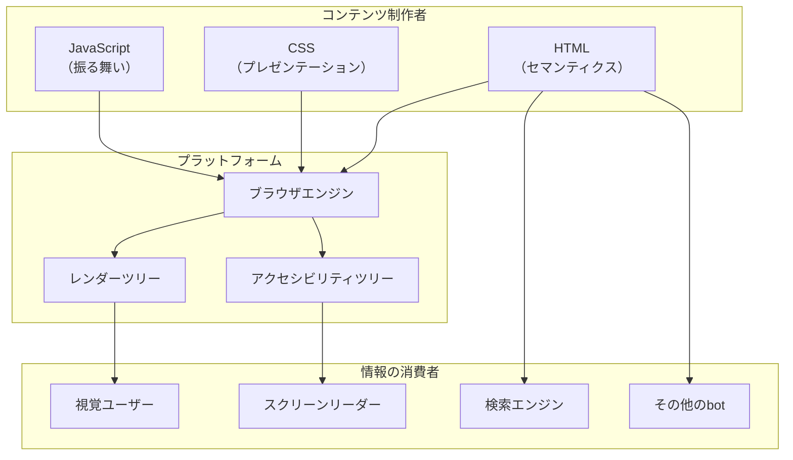
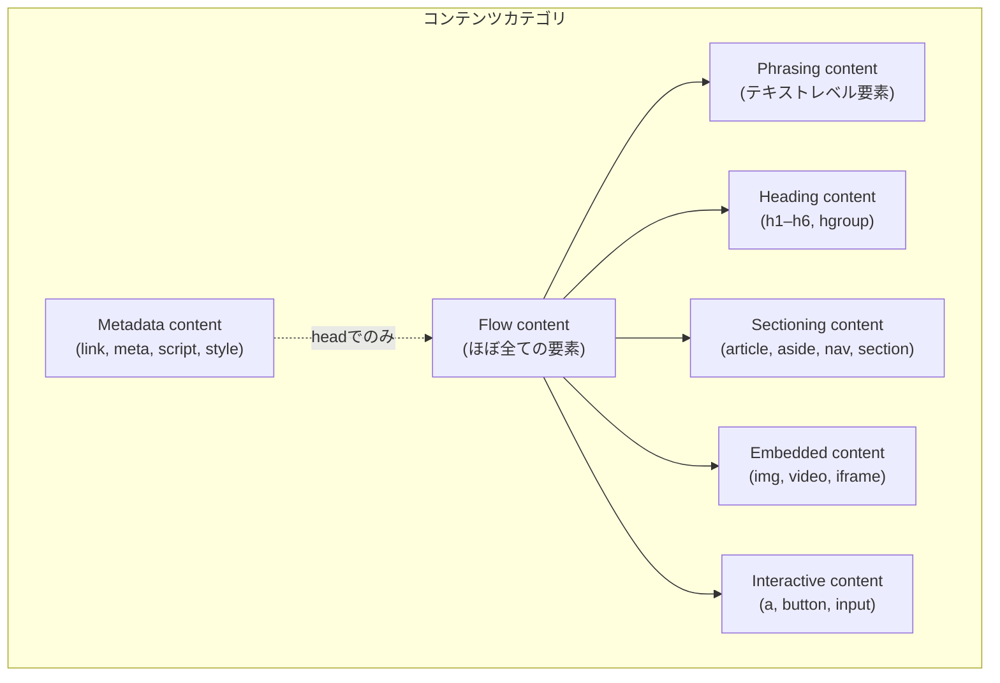
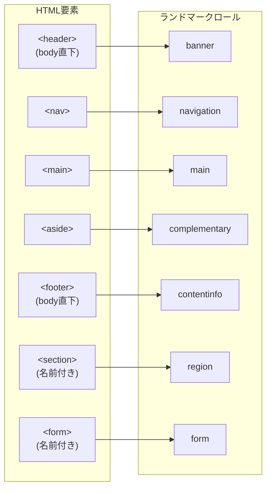
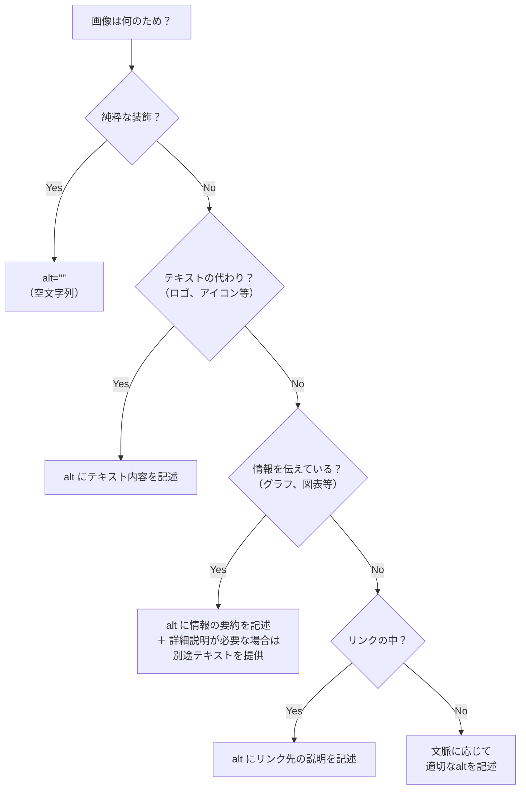
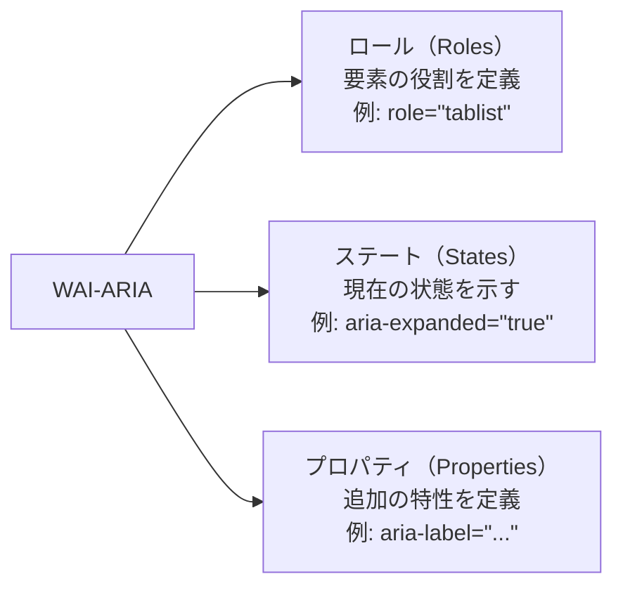
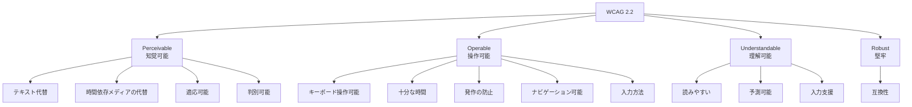
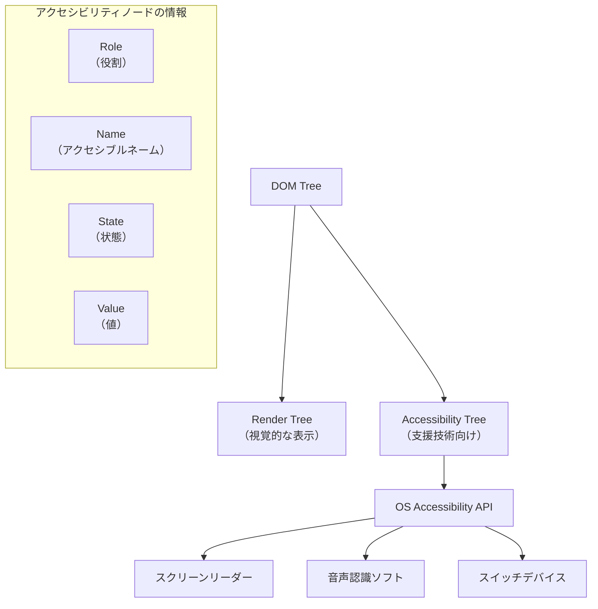
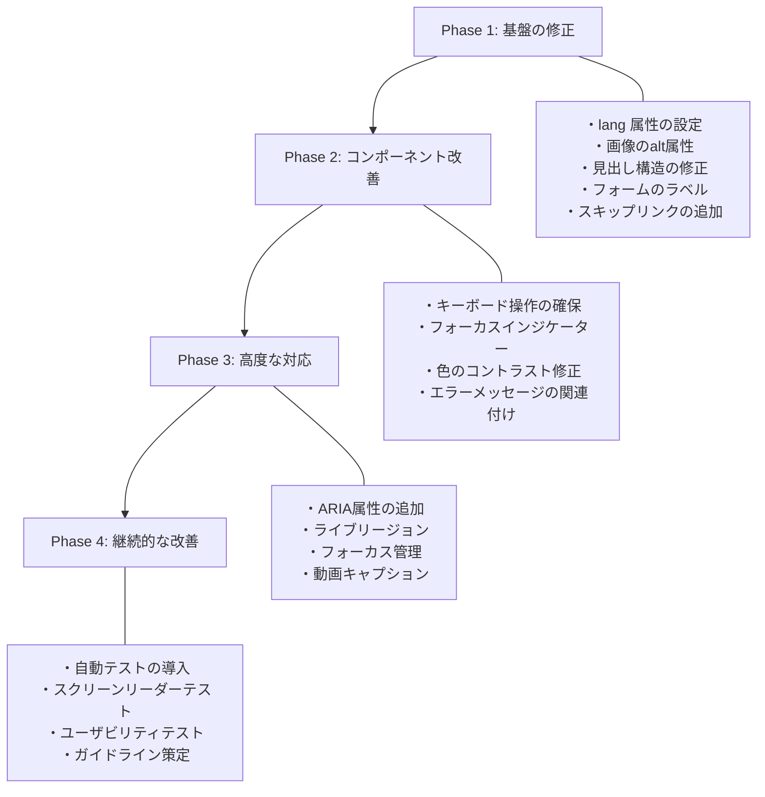

# HTMLのセマンティクスとアクセシビリティ

## 1. 背景：なぜHTMLの「意味」が重要なのか

### 1.1 Webの本質は構造化された情報である

HTMLはHyperText Markup Languageの略称であり、その名が示す通り「マークアップ」言語である。マークアップとは、テキストに対して構造的な意味（セマンティクス）を付与する行為を指す。HTMLの役割は、見た目を制御することではなく、コンテンツの論理構造を機械可読な形で記述することにある。

Tim Berners-Leeが1989年にHTMLを設計した際の根本的なビジョンは、「世界中の情報を構造化し、リンクで結びつけ、誰もがアクセスできるようにする」というものだった。ここで「誰もが」という言葉には、視覚障害者、聴覚障害者、運動障害のある人々、さらには検索エンジンやスクリーンリーダーといった非人間のユーザーエージェントも含まれる。

この理念を実現するための鍵が、**セマンティクス（意味論）** と **アクセシビリティ（a11y: accessibility）** である。

### 1.2 セマンティクスとアクセシビリティの関係

セマンティクスとアクセシビリティは表裏一体の関係にある。HTMLのセマンティクスが正しく記述されていれば、支援技術（Assistive Technology）はその構造を解釈してユーザーに適切な形で情報を伝えることができる。逆に、セマンティクスが不適切なHTMLは、たとえ視覚的には問題なく表示されていても、支援技術を使うユーザーにとっては理解不能なコンテンツとなる。



この図が示すように、HTMLの意味構造はレンダリングだけでなく、アクセシビリティツリーの構築、検索エンジンのクロール、各種botの情報取得など、多様な経路で消費される。セマンティックなHTMLを書くことは、これらすべての消費者に対して情報を正しく届けるための基盤なのである。

### 1.3 本記事の範囲と対象読者

本記事では、HTMLのセマンティクスの設計思想と具体的な要素の使い分け、アクセシビリティの基本原則、WAI-ARIAの役割と正しい使い方、そして実務における判断基準について、体系的に解説する。対象読者は、HTMLの基本構文を理解している中級以上のWeb開発者である。

## 2. HTMLセマンティクスの基礎

### 2.1 セマンティクスとは何か

HTMLにおけるセマンティクスとは、要素が持つ「意味」のことである。たとえば `<h1>` は「最上位の見出し」を意味し、`<nav>` は「ナビゲーション領域」を意味する。これらの要素を使うことで、コンテンツの構造的な役割が機械的に判別可能になる。

セマンティクスには以下の3つのレイヤーがある。

| レイヤー | 説明 | 例 |
|---|---|---|
| **要素レベル** | 個々のHTML要素が持つ固有の意味 | `<article>`, `<aside>`, `<time>` |
| **属性レベル** | 属性によって付加される意味情報 | `lang`, `datetime`, `alt` |
| **関係レベル** | 要素間の親子関係やリンクが示す構造的意味 | `<label for="...">`, `<fieldset>` + `<legend>` |

### 2.2 セマンティックHTMLと非セマンティックHTML

「非セマンティック」なHTML（div soup）と「セマンティック」なHTMLの対比は、セマンティクスの重要性を理解するための最も直感的な方法である。

::: code-group

```html [非セマンティック（div soup）]
<div class="header">
  <div class="nav">
    <div class="nav-item"><a href="/">Home</a></div>
    <div class="nav-item"><a href="/about">About</a></div>
  </div>
</div>
<div class="main">
  <div class="article">
    <div class="title">Article Title</div>
    <div class="content">
      <div class="paragraph">Some text here...</div>
    </div>
  </div>
  <div class="sidebar">
    <div class="widget">Related Links</div>
  </div>
</div>
<div class="footer">
  <div class="copyright">© 2026</div>
</div>
```

```html [セマンティック]
<header>
  <nav aria-label="Main navigation">
    <ul>
      <li><a href="/">Home</a></li>
      <li><a href="/about">About</a></li>
    </ul>
  </nav>
</header>
<main>
  <article>
    <h1>Article Title</h1>
    <p>Some text here...</p>
  </article>
  <aside aria-label="Related links">
    <h2>Related Links</h2>
  </aside>
</main>
<footer>
  <p><small>© 2026</small></p>
</footer>
```

:::

両者は視覚的にはCSSで同じ見た目にできる。しかし、セマンティック版には以下の決定的な優位性がある。

1. **スクリーンリーダー** がナビゲーション、メイン領域、サイドバー、フッターを識別できる
2. **検索エンジン** がメインコンテンツとサイドバーを区別し、記事の本文を正しく認識できる
3. **ブラウザ** が「リーダーモード」で記事本文を抽出できる
4. **開発者** がコードの構造を一目で理解できる

### 2.3 コンテンツモデル

HTML5以降、各要素には**コンテンツモデル（Content Model）** が定義されている。コンテンツモデルは、要素がどのようなコンテンツを内包できるか、またどのような文脈で使用できるかを規定する。



主要なコンテンツカテゴリを理解することは、要素の正しいネスト（入れ子構造）を判断するための前提条件である。たとえば、`<p>` 要素のコンテンツモデルは「Phrasing content」であるため、`<p>` の中に `<div>`（Flow content）を入れることはできない。

## 3. セクショニング要素とドキュメントアウトライン

### 3.1 セクショニング要素

HTML5で導入されたセクショニング要素は、文書のアウトライン（大綱）を明示的に定義するための仕組みである。

| 要素 | 意味 | 使用場面 |
|---|---|---|
| `<article>` | 自己完結したコンテンツ | ブログ記事、ニュース記事、コメント |
| `<section>` | テーマ的にまとまった区画 | 章、タブパネル、テーマ別セクション |
| `<nav>` | ナビゲーションリンクの集合 | グローバルナビ、パンくず、目次 |
| `<aside>` | 主要コンテンツと間接的に関連する補足情報 | サイドバー、用語解説、広告 |
| `<header>` | 導入部やナビゲーション支援 | ページヘッダー、セクションの冒頭 |
| `<footer>` | セクションやページの末尾情報 | 著作権表示、関連リンク |
| `<main>` | ドキュメントの主要コンテンツ | ページに1つだけ存在すべき |

> [!WARNING]
> `<header>` と `<footer>` はセクショニング要素ではない点に注意が必要である。これらはセクショニングルート（`<body>`）またはセクショニング要素の直接の子として使われるが、自身が新しいアウトラインセクションを生成するわけではない。

### 3.2 見出しレベルとアウトライン

見出し要素（`<h1>` から `<h6>`）は、ドキュメントの階層構造を表現する最も基本的な手段である。正しい見出し階層を維持することは、アクセシビリティにおいて特に重要である。スクリーンリーダーのユーザーは、見出し間をジャンプすることで文書をナビゲートすることが極めて多いためである。

::: tip 見出しの鉄則
- 見出しレベルを飛ばさない（`<h1>` の直後に `<h3>` を使わない）
- `<main>` 内の最上位見出しは `<h1>` とし、ページ内に `<h1>` は原則1つ
- 見出しを「文字を大きくするため」に使わない。見た目はCSSで制御する
:::

以下に、正しい見出し構造の例を示す。

```html
<body>
  <header>
    <nav aria-label="Main">...</nav>
  </header>
  <main>
    <h1>Web Accessibility Guide</h1>        <!-- level 1 -->
    <section>
      <h2>Perceivable</h2>                  <!-- level 2 -->
      <section>
        <h3>Text Alternatives</h3>          <!-- level 3 -->
        <p>...</p>
      </section>
      <section>
        <h3>Adaptable</h3>                  <!-- level 3 -->
        <p>...</p>
      </section>
    </section>
    <section>
      <h2>Operable</h2>                     <!-- level 2 -->
      <p>...</p>
    </section>
  </main>
</body>
```

> [!NOTE]
> HTML5の仕様にはかつて「アウトラインアルゴリズム」が提案されており、セクショニング要素ごとに見出しレベルがリセットされる設計が意図されていた。しかし、このアルゴリズムを実装したブラウザや支援技術は実質的に存在しない。そのため、実務では従来通りドキュメント全体で一貫した見出し階層を維持することが推奨される。

### 3.3 ランドマークロール

セクショニング要素と `<main>` には、暗黙的な**ランドマークロール（Landmark Role）** が対応付けられている。ランドマークロールは、スクリーンリーダーがページの構造を把握し、目的の領域に素早くジャンプするための仕組みである。



この対応関係は重要である。ネイティブのHTML要素を正しく使えば、`role` 属性を明示的に指定することなく、支援技術はページの構造を理解できる。これが「ARIAの第一ルール」の根拠となる（詳細は後述）。

## 4. テキストレベルセマンティクス

### 4.1 意味を持つインライン要素

HTML5には、テキストに対して特定の意味を付与するインライン要素が多数存在する。これらは見た目が似ていても、意味が異なる点に注意が必要である。

| 要素 | 意味 | 視覚的なデフォルト |
|---|---|---|
| `<strong>` | 重要性（importance） | 太字 |
| `<b>` | 注意を引くテキスト（意味的な重要性なし） | 太字 |
| `<em>` | 強調（stress emphasis） | 斜体 |
| `<i>` | 通常のテキストとは異なる声やムードのテキスト | 斜体 |
| `<mark>` | ハイライト（参照目的） | 黄色背景 |
| `<small>` | 補足コメント（免責事項、著作権表示など） | 小さい文字 |
| `<del>` | 削除されたテキスト | 取り消し線 |
| `<ins>` | 追加されたテキスト | 下線 |
| `<abbr>` | 略語 | 下線点線（ブラウザ依存） |
| `<cite>` | 作品のタイトル | 斜体 |
| `<code>` | コードフラグメント | 等幅フォント |
| `<time>` | 日付・時刻 | なし |
| `<data>` | 機械可読な値と対応するコンテンツ | なし |

### 4.2 `<strong>` vs `<b>`、`<em>` vs `<i>` の違い

`<strong>` と `<b>` は視覚的にはどちらも太字で表示されるが、セマンティクスが根本的に異なる。

- `<strong>`: コンテンツが**重要**であることを示す。スクリーンリーダーはこの要素を検出すると、声のトーンを変えたり、「強調」と読み上げたりすることがある。
- `<b>`: 視覚的に注意を引くためのテキストであるが、追加の重要性は持たない。製品名やキーワードなど、「太字にしたいが重要というわけではない」場合に使う。

同様に `<em>` と `<i>` も異なる。

- `<em>`: テキストの**強調**を示す。ネストすると強調の度合いが増す。
- `<i>`: 技術用語、外国語のフレーズ、思考内容など、通常の散文とは異なる性質のテキストを示す。

```html
<!-- strong: This is important -->
<p><strong>Warning:</strong> Do not proceed without backup.</p>

<!-- b: Draw attention, but not important -->
<p>The <b>Acme Widget</b> is our flagship product.</p>

<!-- em: Stress emphasis (changes meaning) -->
<p>I <em>never</em> said he stole the money.</p>
<p>I never said <em>he</em> stole the money.</p>

<!-- i: Alternate voice -->
<p>The term <i lang="la">ad hoc</i> means "for this purpose."</p>
```

### 4.3 `<time>` 要素と機械可読な日付

`<time>` 要素は、日付や時刻を人間が読める形式と機械が解釈できる形式の両方で提供するための要素である。

```html
<!-- datetime attribute provides machine-readable format -->
<p>Published on <time datetime="2026-03-01">2026年3月1日</time></p>

<!-- Duration -->
<p>Cooking time: <time datetime="PT1H30M">1 hour 30 minutes</time></p>

<!-- If content itself is machine-readable, datetime can be omitted -->
<p>Last updated: <time>2026-03-01T09:00:00+09:00</time></p>
```

`datetime` 属性にISO 8601形式の値を記述することで、検索エンジンやカレンダーアプリケーションがこの情報を正確に解釈できるようになる。

## 5. フォームのセマンティクスとアクセシビリティ

### 5.1 ラベルとフォームコントロールの関連付け

フォームのアクセシビリティにおいて最も基本的かつ重要なのは、すべてのフォームコントロールに適切なラベルを関連付けることである。

```html
<!-- Explicit labeling with for/id -->
<label for="email">Email address</label>
<input type="email" id="email" name="email" />

<!-- Implicit labeling by nesting -->
<label>
  Email address
  <input type="email" name="email" />
</label>
```

`<label>` と入力要素が正しく関連付けられていると、以下の恩恵がある。

1. スクリーンリーダーが入力フィールドにフォーカスした際にラベルのテキストを読み上げる
2. ラベルのテキストをクリック/タップすると、関連するフォームコントロールにフォーカスが移動する（クリック可能領域の拡大）
3. 音声入力ユーザーがラベルのテキストでフォームコントロールを指定できる

> [!CAUTION]
> `placeholder` 属性は `<label>` の代替にはならない。`placeholder` はフォーカス時またはテキスト入力後に消えるため、ユーザーが何を入力すべきだったか分からなくなる。常に `<label>` を使用し、`placeholder` は入力例の提示など補助的な用途にとどめるべきである。

### 5.2 フィールドセットとレジェンド

関連するフォームコントロールをグループ化するには `<fieldset>` と `<legend>` を使用する。特にラジオボタンやチェックボックスのグループでは、この構造が不可欠である。

```html
<fieldset>
  <legend>Preferred contact method</legend>
  <label>
    <input type="radio" name="contact" value="email" />
    Email
  </label>
  <label>
    <input type="radio" name="contact" value="phone" />
    Phone
  </label>
  <label>
    <input type="radio" name="contact" value="sms" />
    SMS
  </label>
</fieldset>
```

スクリーンリーダーは、個々のラジオボタンにフォーカスした際に `<legend>` のテキストも合わせて読み上げる。たとえば「Preferred contact method, Email, radio button, 1 of 3」のように。`<legend>` がなければ、ユーザーは個々のラジオボタンの文脈を理解できない。

### 5.3 エラーメッセージとバリデーション

フォームのバリデーションエラーを支援技術に適切に伝えるためには、エラーメッセージとフォームコントロールの関連付けが必要である。

```html
<div>
  <label for="username">Username</label>
  <input
    type="text"
    id="username"
    name="username"
    aria-describedby="username-error"
    aria-invalid="true"
  />
  <p id="username-error" role="alert">
    Username must be at least 3 characters long.
  </p>
</div>
```

ここでのポイントは以下の通りである。

- `aria-describedby` がエラーメッセージ要素のIDを指すことで、スクリーンリーダーがフォーカス時にエラーメッセージを読み上げる
- `aria-invalid="true"` がフィールドがエラー状態であることを示す
- `role="alert"` がエラーメッセージの動的な出現をライブリージョンとして通知する

## 6. 画像とメディアのアクセシビリティ

### 6.1 代替テキスト（alt属性）の設計

`` 要素の `alt` 属性は、アクセシビリティにおける最も重要な属性の一つである。しかし、「良い代替テキスト」を書くことは見かけ以上に難しい。

代替テキストの設計指針は、画像の**機能的な役割**によって異なる。



::: details 代替テキストの具体例

```html
<!-- Decorative: empty alt -->


<!-- Informative: describe the content -->


<!-- Functional (link): describe the destination -->
<a href="/">
  
</a>

<!-- Text image: provide the text -->


<!-- Complex image: brief alt + detailed description -->
<figure>
  
  <figcaption id="network-desc">
    The network consists of three zones: DMZ with web servers,
    internal network with application servers, and a secure zone
    with database servers. Each zone is separated by firewalls.
  </figcaption>
</figure>
```

:::

> [!WARNING]
> `alt` 属性を省略することと `alt=""` と指定することは全く異なる。`alt` を省略するとスクリーンリーダーはファイル名を読み上げることがあり、「image dash 2024 dash 03 dash 01 underscore final underscore v2 dot jpg」のような無意味な情報をユーザーに伝えてしまう。装飾的な画像には必ず `alt=""` を指定する。

### 6.2 `<figure>` と `<figcaption>`

画像やコードブロックなど、本文から参照されるが独立して理解可能なコンテンツには `<figure>` と `<figcaption>` を使う。

```html
<figure>
  
  <figcaption>
    図1: メッセージキューを介した5つのサービスの通信アーキテクチャ
  </figcaption>
</figure>
```

`<figcaption>` はキャプション（説明文）であり、`alt` 属性とは役割が異なる。`alt` は画像が表示できない場合の代替であり、`<figcaption>` は画像が表示されていても付加的に表示される説明文である。両方を適切に提供することが望ましい。

### 6.3 動画と音声のアクセシビリティ

動画 (`<video>`) と音声 (`<audio>`) コンテンツのアクセシビリティには、以下の対応が必要である。

| メディア | 必要な対応 | HTML要素/属性 |
|---|---|---|
| 動画（音声あり） | キャプション（字幕） | `<track kind="captions">` |
| 動画（音声あり） | 音声解説（視覚情報のナレーション） | `<track kind="descriptions">` |
| 動画（音声なし） | 代替テキストまたはキャプション | `<track>` または周囲のテキスト |
| 音声のみ | トランスクリプト（文字起こし） | 周囲のHTML内にテキストとして提供 |

```html
<video controls>
  <source src="tutorial.mp4" type="video/mp4" />
  <track
    kind="captions"
    src="tutorial-ja.vtt"
    srclang="ja"
    label="Japanese"
    default
  />
  <track
    kind="captions"
    src="tutorial-en.vtt"
    srclang="en"
    label="English"
  />
  <!-- Fallback for browsers that don't support video -->
  <p>Your browser does not support the video element.
     <a href="tutorial.mp4">Download the video</a>.</p>
</video>
```

## 7. WAI-ARIAの役割と正しい使い方

### 7.1 ARIAとは何か

WAI-ARIA（Web Accessibility Initiative – Accessible Rich Internet Applications）は、W3Cが策定した仕様であり、HTMLのネイティブなセマンティクスだけでは表現しきれないインタラクティブなUIコンポーネントのアクセシビリティ情報を補完するために設計された。

ARIAは3つの主要な概念で構成される。



### 7.2 ARIAの5つのルール

ARIAの使用にはW3Cが定めた明確なルールがある。これらを理解することが、ARIAの誤用を防ぐ鍵となる。

**第1ルール: ネイティブHTML要素を優先する**

> If you can use a native HTML element or attribute with the semantics and behavior you require already built in, instead of re-purposing an element and adding an ARIA role, state or property to make it accessible, then do so.

すなわち、ARIAは「最後の手段」である。ネイティブのHTML要素で表現できるものにARIAを付けるのは冗長であり、場合によっては有害ですらある。

::: code-group

```html [悪い例: ARIAで車輪の再発明]
<!-- Don't do this -->
<div role="button" tabindex="0"
     aria-pressed="false"
     onclick="handleClick()"
     onkeydown="handleKeydown(event)">
  Click me
</div>
```

```html [良い例: ネイティブ要素を使用]
<!-- Do this instead -->
<button type="button">Click me</button>
```

:::

`<button>` を使えば、クリック、キーボード操作（Enter/Space）、フォーカス管理、ロール通知がすべて自動的に行われる。`<div>` にARIAを付けた場合、これらの振る舞いをすべてJavaScriptで再実装しなければならない。

**第2ルール: ネイティブセマンティクスを変更しない**

```html
<!-- Don't do this: heading should not be a button -->
<h2 role="button">Collapse section</h2>

<!-- Do this instead -->
<h2>
  <button aria-expanded="true">Collapse section</button>
</h2>
```

**第3ルール: すべてのインタラクティブなARIAコントロールはキーボードで操作可能でなければならない**

`role="button"` を持つ要素は、Enter キーと Space キーで操作可能でなければならない。`role="slider"` を持つ要素は、矢印キーで値を変更できなければならない。

**第4ルール: フォーカス可能な要素に `role="presentation"` や `aria-hidden="true"` を使わない**

```html
<!-- Don't do this: focusable but hidden from a11y tree -->
<button aria-hidden="true">Submit</button>
```

**第5ルール: すべてのインタラクティブ要素にはアクセシブルな名前（Accessible Name）が必要**

```html
<!-- Icon-only button NEEDS an accessible name -->
<button aria-label="Close dialog">
  <svg aria-hidden="true"><!-- close icon --></svg>
</button>
```

### 7.3 ロールの分類

ARIAのロールは大きく以下のカテゴリに分類される。

| カテゴリ | 説明 | 例 |
|---|---|---|
| **ランドマークロール** | ページの主要な領域 | `banner`, `navigation`, `main`, `complementary` |
| **ウィジェットロール** | インタラクティブなUIコンポーネント | `tab`, `tabpanel`, `dialog`, `menu`, `slider` |
| **ドキュメント構造ロール** | 文書の構造的な要素 | `heading`, `list`, `listitem`, `table`, `row`, `cell` |
| **ライブリージョンロール** | 動的に更新される領域 | `alert`, `log`, `status`, `timer` |

### 7.4 頻出ARIAパターンの実装例

#### タブインターフェース

```html
<div role="tablist" aria-label="Settings">
  <button role="tab"
          id="tab-general"
          aria-selected="true"
          aria-controls="panel-general">
    General
  </button>
  <button role="tab"
          id="tab-security"
          aria-selected="false"
          aria-controls="panel-security"
          tabindex="-1">
    Security
  </button>
</div>
<div role="tabpanel"
     id="panel-general"
     aria-labelledby="tab-general">
  <!-- General settings content -->
</div>
<div role="tabpanel"
     id="panel-security"
     aria-labelledby="tab-security"
     hidden>
  <!-- Security settings content -->
</div>
```

```javascript
// Keyboard interaction for tabs
// Arrow keys to navigate between tabs
// Tab key to move focus to the tab panel
tablist.addEventListener('keydown', (e) => {
  const tabs = [...tablist.querySelectorAll('[role="tab"]')];
  const currentIndex = tabs.indexOf(document.activeElement);

  let newIndex;
  if (e.key === 'ArrowRight') {
    newIndex = (currentIndex + 1) % tabs.length;
  } else if (e.key === 'ArrowLeft') {
    newIndex = (currentIndex - 1 + tabs.length) % tabs.length;
  } else {
    return;
  }

  // Move focus and activate tab
  tabs[newIndex].focus();
  activateTab(tabs[newIndex]);
});
```

タブインターフェースのキーボードインタラクションでは、WAI-ARIA Authoring Practices（APG）に従い、左右矢印キーでタブを切り替え、Tab キーでタブパネル内にフォーカスを移すパターンが推奨される。

#### モーダルダイアログ

```html
<div role="dialog"
     aria-modal="true"
     aria-labelledby="dialog-title"
     aria-describedby="dialog-desc">
  <h2 id="dialog-title">Confirm Deletion</h2>
  <p id="dialog-desc">
    Are you sure you want to delete this item?
    This action cannot be undone.
  </p>
  <div>
    <button type="button">Cancel</button>
    <button type="button">Delete</button>
  </div>
</div>
```

モーダルダイアログの実装では、以下のキーボード管理が必須である。

1. **フォーカストラップ**: Tab キーによるフォーカスがダイアログの外に出ないようにする
2. **初期フォーカス**: ダイアログが開いた際に、適切な要素（通常は最初のフォーカス可能な要素、または最も安全な選択肢）にフォーカスを移動する
3. **Escapeキー**: ダイアログを閉じ、ダイアログを開いたトリガー要素にフォーカスを戻す
4. **背景の不活性化**: ダイアログ外の要素を `inert` 属性または `aria-hidden="true"` で非活性にする

> [!TIP]
> 2024年以降、HTML標準の `<dialog>` 要素と `inert` 属性のブラウザサポートが十分に広がっている。新規実装では `<dialog>` 要素の `showModal()` メソッドを使うことで、フォーカストラップと背景の不活性化がブラウザにより自動的に処理される。

```html
<!-- Modern approach using native dialog -->
<dialog id="confirm-dialog">
  <h2>Confirm Deletion</h2>
  <p>Are you sure you want to delete this item?</p>
  <form method="dialog">
    <button value="cancel">Cancel</button>
    <button value="confirm">Delete</button>
  </form>
</dialog>
```

```javascript
// Open the dialog
const dialog = document.getElementById('confirm-dialog');
dialog.showModal(); // Focus trap and backdrop are automatic

// Handle close
dialog.addEventListener('close', () => {
  if (dialog.returnValue === 'confirm') {
    deleteItem();
  }
});
```

### 7.5 ライブリージョン

動的にコンテンツが更新される領域をスクリーンリーダーに通知するための仕組みが**ライブリージョン（Live Region）** である。

```html
<!-- Polite: announced after current speech -->
<div aria-live="polite" aria-atomic="true">
  Search results: 42 items found.
</div>

<!-- Assertive: interrupts current speech -->
<div role="alert">
  Session will expire in 2 minutes.
</div>

<!-- Status: polite live region for status messages -->
<div role="status">
  File upload: 75% complete.
</div>
```

| 属性/ロール | 割り込み | 用途 |
|---|---|---|
| `aria-live="polite"` | しない | 検索結果の件数更新など |
| `aria-live="assertive"` | する | 緊急性の高い通知 |
| `role="alert"` | する（暗黙的にassertive） | エラー通知、重要な警告 |
| `role="status"` | しない（暗黙的にpolite） | ステータス更新、進捗表示 |

> [!WARNING]
> ライブリージョンの過剰な使用はユーザー体験を著しく損なう。画面の更新のたびにスクリーンリーダーが発話を中断すると、ユーザーはページの内容を把握できなくなる。`assertive` は本当に緊急の場合のみ使用し、通常は `polite` を選択すべきである。

## 8. キーボードアクセシビリティ

### 8.1 フォーカス管理の原則

キーボードアクセシビリティは、アクセシビリティの最も根本的な要件の一つである。マウスやタッチスクリーンを使えないユーザーにとって、キーボードはWebを操作するための唯一の手段となる。

フォーカス管理の基本原則は以下の通りである。

1. **すべてのインタラクティブ要素はキーボードでフォーカス可能でなければならない**
2. **フォーカスの順序は論理的でなければならない**（通常はDOMの順序に従う）
3. **フォーカスインジケーターは常に視覚的に見えなければならない**
4. **フォーカストラップは意図的な場合のみ使用する**（モーダルダイアログ等）

### 8.2 tabindexの使い方

`tabindex` 属性は、要素のフォーカス可能性とTab順序を制御する。

| 値 | 意味 |
|---|---|
| `tabindex="0"` | 通常のフォーカス順序に追加する（`<div>` 等の非インタラクティブ要素をフォーカス可能にする） |
| `tabindex="-1"` | プログラム的にフォーカス可能だが、Tab順序には含めない |
| `tabindex="1"` 以上 | Tab順序を明示的に指定する（**非推奨**: DOM順序を乱す） |

```html
<!-- Make a custom element focusable in tab order -->
<div role="button" tabindex="0">Custom Button</div>

<!-- Focusable via JS only (e.g., for skip-to-content target) -->
<main id="main-content" tabindex="-1">
  <!-- Main content -->
</main>
```

::: danger tabindex の正の値は使ってはならない
`tabindex` に正の値を使うと、Tab順序がDOMの順序と一致しなくなり、キーボードユーザーにとって予測不能なナビゲーション体験を引き起こす。これはWCAG 2.2の達成基準2.4.3（フォーカス順序）に違反する可能性がある。
:::

### 8.3 スキップリンク

長いナビゲーションメニューがページの冒頭にある場合、キーボードユーザーは本文にたどり着くまでに大量のTabキー操作を強いられる。これを解決するのが**スキップリンク（Skip Link）** である。

```html
<body>
  <!-- Skip link: first focusable element in the page -->
  <a href="#main-content" class="skip-link">
    Skip to main content
  </a>
  <header>
    <nav>
      <!-- Navigation with many links -->
    </nav>
  </header>
  <main id="main-content">
    <!-- Main content -->
  </main>
</body>
```

```css
/* Visually hidden until focused */
.skip-link {
  position: absolute;
  top: -100%;
  left: 0;
  z-index: 100;
  padding: 0.5rem 1rem;
  background: #000;
  color: #fff;
}

.skip-link:focus {
  top: 0;
}
```

スキップリンクは通常は視覚的に隠されているが、Tab キーでフォーカスすると表示される。これはWCAG 2.2の達成基準2.4.1（ブロックスキップ）を満たすための標準的な手法である。

### 8.4 フォーカスインジケーター

ブラウザはデフォルトでフォーカスリング（outline）を表示するが、デザイン上の理由から `outline: none` で消してしまうケースが見られる。これは深刻なアクセシビリティの問題を引き起こす。

```css
/* NEVER do this without providing an alternative */
*:focus {
  outline: none; /* Keyboard users can no longer see focus */
}

/* Better: use :focus-visible for mouse/keyboard differentiation */
button:focus-visible {
  outline: 3px solid #4A90D9;
  outline-offset: 2px;
}

/* Custom focus styles for links */
a:focus-visible {
  outline: 2px solid currentColor;
  outline-offset: 4px;
  border-radius: 2px;
}
```

`:focus-visible` 擬似クラスは、キーボードによるフォーカスの場合にのみスタイルを適用する。マウスクリックではフォーカスリングを表示せず、Tab キーによるナビゲーションではフォーカスリングを表示するという、デザインとアクセシビリティの両立が可能になる。

## 9. WCAGとアクセシビリティの基準

### 9.1 WCAGの概要

WCAG（Web Content Accessibility Guidelines）は、W3CのWAI（Web Accessibility Initiative）が策定するWebアクセシビリティの国際標準ガイドラインである。現在の最新版はWCAG 2.2（2023年10月勧告）である。

WCAGは4つの原則（POUR）に基づいている。



### 9.2 適合レベル

WCAGの達成基準には3つの適合レベルがある。

| レベル | 意味 | 概要 |
|---|---|---|
| **A** | 最低限 | これを満たさないと、特定のユーザーがWebコンテンツを利用できない |
| **AA** | 標準 | 多くの法規制が求めるレベル。アクセシビリティの実質的な基準 |
| **AAA** | 最高 | すべてのコンテンツに適用することは現実的でない場合がある |

法規制において最も広く要求されるのは**レベルAA**である。以下に、各レベルの主要な達成基準をいくつか示す。

**レベルA（最低限）の例:**
- 1.1.1 非テキストコンテンツ: すべての非テキストコンテンツにテキスト代替を提供する
- 2.1.1 キーボード: すべての機能がキーボードで操作可能である
- 4.1.2 名前・役割・値: UIコンポーネントの名前と役割がプログラムで判別可能である

**レベルAA（標準）の例:**
- 1.4.3 コントラスト（最低限）: テキストのコントラスト比が4.5:1以上
- 1.4.4 テキストのリサイズ: テキストを200%にリサイズしてもコンテンツが利用可能
- 2.4.7 フォーカスの可視化: キーボードフォーカスのインジケーターが視覚的に見える

**レベルAAA（最高）の例:**
- 1.4.6 コントラスト（強化）: テキストのコントラスト比が7:1以上
- 2.4.10 セクション見出し: コンテンツがセクション見出しで整理されている

### 9.3 色とコントラスト

色のアクセシビリティに関する要件は以下の通りである。

1. **コントラスト比の確保**: 通常テキストで4.5:1以上（WCAG AA）、大きなテキスト（18pt以上、または14pt太字以上）で3:1以上
2. **色だけに依存しない情報伝達**: エラー表示を赤色だけで示すのではなく、アイコンやテキストも併用する

```html
<!-- Bad: color is the only way to distinguish error -->
<input type="text" style="border-color: red;" />

<!-- Good: color + icon + text -->
<div>
  <input type="text"
         style="border-color: red;"
         aria-invalid="true"
         aria-describedby="name-error" />
  <p id="name-error" style="color: red;">
    <svg aria-hidden="true"><!-- error icon --></svg>
    Name is required.
  </p>
</div>
```

## 10. アクセシビリティツリー

### 10.1 ブラウザがアクセシビリティ情報を処理する仕組み

ブラウザはDOMを解析する際に、レンダーツリーとは別に**アクセシビリティツリー（Accessibility Tree）** を構築する。アクセシビリティツリーは、DOMツリーの簡略化されたバージョンであり、支援技術に公開される情報を含む。



アクセシビリティツリーの各ノードは、以下の4つの主要な属性を持つ。

| 属性 | 説明 | 例 |
|---|---|---|
| **Role** | 要素の役割 | `button`, `heading`, `link`, `textbox` |
| **Name** | アクセシブルネーム（要素を識別するテキスト） | ラベルテキスト、alt属性の値 |
| **State** | 現在の状態 | `expanded`, `checked`, `disabled` |
| **Value** | 現在の値 | スライダーの値、テキストフィールドの入力内容 |

### 10.2 アクセシブルネームの計算

アクセシブルネーム（Accessible Name）は、支援技術が要素を識別するために使用するテキストである。ブラウザは以下の優先順位でアクセシブルネームを計算する（Accessible Name and Description Computation仕様に基づく）。

1. `aria-labelledby` が指す要素のテキスト
2. `aria-label` 属性の値
3. ネイティブのラベル関連付け（`<label>` の `for` 属性など）
4. 要素のテキストコンテンツ（ボタン等）
5. `title` 属性の値（最後の手段）
6. `placeholder` 属性の値（フォームコントロール、最後の手段）

```html
<!-- aria-labelledby takes highest priority -->
<button aria-labelledby="custom-label">
  Click
</button>
<span id="custom-label">Submit Form</span>
<!-- Accessible name: "Submit Form" (not "Click") -->

<!-- aria-label overrides text content -->
<button aria-label="Close dialog">X</button>
<!-- Accessible name: "Close dialog" (not "X") -->

<!-- Text content as accessible name -->
<button>Save Changes</button>
<!-- Accessible name: "Save Changes" -->
```

### 10.3 Chrome DevToolsでのアクセシビリティツリーの確認

Chrome DevToolsのAccessibilityペインでは、各要素のアクセシビリティ情報を確認できる。開発中にアクセシビリティツリーを確認することで、スクリーンリーダーユーザーにどのような情報が伝わるかを把握できる。

確認すべき主要な項目は以下の通りである。

- **Computed Role**: 要素の計算されたロール
- **Computed Name**: 計算されたアクセシブルネーム
- **ARIA attributes**: 適用されているARIA属性
- **Keyboard focusable**: キーボードでフォーカス可能かどうか

## 11. テーブルのセマンティクス

### 11.1 データテーブルの正しいマークアップ

テーブルは、二次元のデータを表現するためのHTML要素である。レイアウト目的でテーブルを使用してはならない。データテーブルには適切なヘッダーとキャプションを提供する必要がある。

```html
<table>
  <caption>2025年度四半期売上（単位: 百万円）</caption>
  <thead>
    <tr>
      <th scope="col">部門</th>
      <th scope="col">Q1</th>
      <th scope="col">Q2</th>
      <th scope="col">Q3</th>
      <th scope="col">Q4</th>
    </tr>
  </thead>
  <tbody>
    <tr>
      <th scope="row">営業部</th>
      <td>120</td>
      <td>135</td>
      <td>142</td>
      <td>168</td>
    </tr>
    <tr>
      <th scope="row">技術部</th>
      <td>80</td>
      <td>92</td>
      <td>88</td>
      <td>95</td>
    </tr>
  </tbody>
</table>
```

重要なポイントは以下の通りである。

- `<caption>` がテーブルの説明を提供する。これはスクリーンリーダーがテーブルに到達した際に最初に読み上げるテキストとなる
- `<th>` の `scope` 属性が、ヘッダーセルがどの方向のデータに対応するかを明示する
- `<thead>` と `<tbody>` がテーブルの構造を論理的に分割する

### 11.2 複雑なテーブル

ヘッダーが複数行にまたがる複雑なテーブルでは、`scope` だけでは不十分な場合がある。そのような場合は `headers` 属性を使用する。

```html
<table>
  <caption>Schedule for the first half of the year</caption>
  <thead>
    <tr>
      <td rowspan="2"></td>
      <th id="h-q1" colspan="2" scope="colgroup">Q1</th>
      <th id="h-q2" colspan="2" scope="colgroup">Q2</th>
    </tr>
    <tr>
      <th id="h-jan" scope="col">Jan</th>
      <th id="h-feb" scope="col">Feb</th>
      <th id="h-mar" scope="col">Mar</th>
      <th id="h-apr" scope="col">Apr</th>
    </tr>
  </thead>
  <tbody>
    <tr>
      <th id="h-sales" scope="row">Sales</th>
      <td headers="h-q1 h-jan h-sales">100</td>
      <td headers="h-q1 h-feb h-sales">110</td>
      <td headers="h-q2 h-mar h-sales">120</td>
      <td headers="h-q2 h-apr h-sales">115</td>
    </tr>
  </tbody>
</table>
```

> [!TIP]
> 複雑なテーブルのマークアップは困難であり、支援技術による解釈も完全とは言えない。可能であれば、複雑なテーブルをシンプルな複数のテーブルに分割することを検討すべきである。

## 12. 言語とテキスト方向

### 12.1 `lang` 属性

`lang` 属性は、コンテンツの言語をブラウザと支援技術に伝える。この属性がなければ、スクリーンリーダーは正しい発音規則を適用できない。

```html
<!-- Document language -->
<html lang="ja">

<!-- Inline language change -->
<p>
  この設計手法は英語で
  <span lang="en">Dependency Injection</span>
  と呼ばれている。
</p>
```

`lang` 属性の効果は以下の通りである。

- スクリーンリーダーが適切な音声合成エンジン（言語）を選択する
- ブラウザがハイフネーション（単語の分割）を正しく処理する
- 検索エンジンがコンテンツの言語を判定する
- CSSの `:lang()` セレクタが使用可能になる

### 12.2 テキスト方向（`dir` 属性）

アラビア語やヘブライ語のような右から左（RTL: Right-to-Left）に記述する言語のコンテンツを含む場合、`dir` 属性が必要である。

```html
<!-- RTL content -->
<p dir="rtl" lang="ar">مرحبا بالعالم</p>

<!-- Bidirectional text -->
<p>
  The Arabic word for "welcome" is
  <span dir="rtl" lang="ar">مرحبا</span>.
</p>

<!-- Auto-detection for user-generated content -->
<input type="text" dir="auto" />
```

`dir="auto"` は、ユーザー入力コンテンツなど、テキスト方向が事前に分からない場合に使用する。ブラウザがUnicodeの双方向アルゴリズムに基づいてテキスト方向を自動判定する。

## 13. レスポンシブデザインとアクセシビリティ

### 13.1 ビューポートとズーム

WCAG 2.2の達成基準1.4.4（テキストのリサイズ）は、テキストを200%まで拡大しても機能が損なわれないことを要求する。また、達成基準1.4.10（リフロー）は、320px幅の画面でも水平スクロールなしでコンテンツが利用可能であることを要求する。

```html
<!-- Allow user scaling -->
<meta name="viewport"
      content="width=device-width, initial-scale=1.0" />
```

::: danger ズームを無効化してはならない
以下のようなビューポート設定は、ユーザーのズーム操作を妨げるためアクセシビリティ上の問題となる。

```html
<!-- NEVER do this -->
<meta name="viewport"
      content="width=device-width, initial-scale=1.0,
               maximum-scale=1.0, user-scalable=no" />
```
:::

### 13.2 レスポンシブなセマンティクス

レスポンシブデザインにおいて、ビューポートサイズに応じてHTMLの構造自体を変えることは推奨されない。CSSで視覚的な配置を変えることは問題ないが、DOMの順序は論理的な読み取り順序と一致すべきである。

```css
/* CSS Grid can change visual order without changing DOM */
.layout {
  display: grid;
  grid-template-areas:
    "header"
    "nav"
    "main"
    "aside"
    "footer";
}

/* On large screens, rearrange visually */
@media (min-width: 768px) {
  .layout {
    grid-template-areas:
      "header header"
      "nav    nav"
      "main   aside"
      "footer footer";
  }
}
```

> [!WARNING]
> CSS Gridの `order` プロパティやFlexboxの `order` を多用すると、視覚的な順序とDOMの順序が乖離し、キーボードナビゲーションの順序が直感に反するものになる。WCAG 2.2の達成基準1.3.2（意味のあるシーケンス）と2.4.3（フォーカス順序）に注意が必要である。

## 14. セマンティクスとSEOの関係

### 14.1 検索エンジンとセマンティクス

検索エンジンはHTMLのセマンティクスを積極的に利用してコンテンツの構造と意味を理解する。以下の要素は検索エンジンにとって特に重要である。

| 要素 | SEOへの影響 |
|---|---|
| `<title>` | 検索結果のタイトルとして使用される |
| `<meta name="description">` | 検索結果のスニペットに影響する |
| `<h1>` - `<h6>` | コンテンツの階層構造を示す |
| `<main>` | 主要コンテンツの識別 |
| `<article>` | 自己完結した記事コンテンツの識別 |
| `<nav>` | ナビゲーション領域の識別 |
| `<time datetime="...">` | 日付情報の機械的な解釈 |
| `<a href="...">` | リンク関係の構築 |

### 14.2 構造化データ

HTML5のセマンティクスに加えて、構造化データ（Structured Data）を使うことで、検索エンジンにさらに詳細な情報を伝えることができる。最も広く使用されている形式はJSON-LDである。

```html
<script type="application/ld+json">
{
  "@context": "https://schema.org",
  "@type": "Article",
  "headline": "HTMLのセマンティクスとアクセシビリティ",
  "author": {
    "@type": "Person",
    "name": "Author Name"
  },
  "datePublished": "2026-03-01",
  "description": "HTMLのセマンティクスとアクセシビリティについての技術解説"
}
</script>
```

構造化データはHTMLのセマンティクスを補完するものであり、代替するものではない。まずHTMLのセマンティクスを正しく記述し、その上で必要に応じて構造化データを追加するのが正しいアプローチである。

## 15. 実務における判断基準とテスト

### 15.1 アクセシビリティテストの自動化と限界

アクセシビリティの問題のうち、自動テストで検出できるのは約30〜40%程度と言われている。残りの60〜70%は人間による判断が必要な問題（代替テキストの品質、論理的な読み取り順序、キーボード操作の使いやすさなど）である。

代表的な自動テストツールには以下のものがある。

| ツール | 種類 | 特徴 |
|---|---|---|
| **axe-core** | ライブラリ | Dequeが開発。CI/CDパイプラインに組み込み可能 |
| **Lighthouse** | ブラウザ内蔵 | Chrome DevToolsから実行。パフォーマンスとa11yを同時に監査 |
| **pa11y** | CLIツール | CIでのバッチ実行に適する |
| **eslint-plugin-jsx-a11y** | Linterプラグイン | Reactのコード記述時に静的にa11y問題を検出 |

```javascript
// Example: axe-core integration with testing framework
import { axe, toHaveNoViolations } from 'jest-axe';

expect.extend(toHaveNoViolations);

test('page has no accessibility violations', async () => {
  const { container } = render(<MyComponent />);
  const results = await axe(container);
  expect(results).toHaveNoViolations();
});
```

### 15.2 手動テストのチェックリスト

自動テストを補完するために、以下の手動テストを定期的に実施することが推奨される。

1. **キーボードのみで操作**: Tab、Shift+Tab、Enter、Space、矢印キーですべての機能にアクセスできるか
2. **スクリーンリーダーでの確認**: VoiceOver（macOS/iOS）、NVDA（Windows）、TalkBack（Android）で主要なフローを確認
3. **200%ズーム**: ブラウザのズームを200%にしてレイアウトが崩れないか
4. **モーション無効化**: `prefers-reduced-motion` の設定を有効にしてアニメーションが制御されるか
5. **ハイコントラストモード**: Windows High Contrastモードで情報が失われないか

```css
/* Respect user's motion preferences */
@media (prefers-reduced-motion: reduce) {
  *,
  *::before,
  *::after {
    animation-duration: 0.01ms !important;
    animation-iteration-count: 1 !important;
    transition-duration: 0.01ms !important;
    scroll-behavior: auto !important;
  }
}
```

### 15.3 段階的な導入戦略

既存のプロジェクトにアクセシビリティを導入する場合、すべてを一度に修正するのは現実的でない。以下の優先順位で段階的に対応するのが実務的である。



## 16. よくあるアンチパターン

### 16.1 div soup

すべてを `<div>` と `<span>` で構築し、クラス名で「意味」を持たせるパターン。CSSフレームワークの普及により広まったが、アクセシビリティの観点から最も問題のある慣行の一つである。

### 16.2 ARIA過剰

ネイティブHTML要素で十分なのにARIA属性を大量に付与するパターン。ARIAの「第1ルール」に違反するだけでなく、ARIAの値の更新忘れによりかえって不正確な情報を支援技術に伝えてしまうリスクがある。

### 16.3 視覚的にのみ隠す際の不適切な手法

コンテンツをスクリーンリーダーに公開したまま視覚的に隠す場合、`display: none` や `visibility: hidden` を使ってはならない。これらはアクセシビリティツリーからも要素を除外する。

```css
/* Visually hidden but accessible to screen readers */
.sr-only {
  position: absolute;
  width: 1px;
  height: 1px;
  padding: 0;
  margin: -1px;
  overflow: hidden;
  clip: rect(0, 0, 0, 0);
  white-space: nowrap;
  border-width: 0;
}
```

一方、視覚的にも支援技術からも隠す場合は、以下を使う。

```css
/* Hidden from everyone (visual + a11y tree) */
.hidden {
  display: none;
}

/* OR */
.hidden {
  visibility: hidden;
}
```

```html
<!-- Hidden from a11y tree only (visual still shown) -->
<div aria-hidden="true">Decorative content</div>
```

### 16.4 クリック可能な`<div>`

`<div onclick="...">` でインタラクティブな要素を実装するパターン。キーボード操作、フォーカス管理、ロールの通知をすべて手動で実装しなければならず、ほぼ確実にアクセシビリティの欠陥を生む。

## 17. 今後の展望

### 17.1 HTML仕様の進化

HTMLの仕様は継続的に進化しており、アクセシビリティに関連する新機能も追加されている。

- **`<dialog>` 要素**: モーダルダイアログのネイティブサポート。フォーカストラップとEscapeキーによるクローズが自動的に処理される。
- **`inert` 属性**: 要素とその子孫をすべて非活性にする属性。モーダルダイアログ外のコンテンツの無効化に使用できる。
- **`popover` 属性**: ポップオーバーUIのネイティブサポート。ライトディスミス（外部クリックによる閉じる動作）が自動的に処理される。
- **Customized Built-in Elements**: `is` 属性による既存要素の拡張。ネイティブのセマンティクスとアクセシビリティ機能を継承しつつカスタマイズが可能。

### 17.2 アクセシビリティの法的要件の強化

世界各国でWebアクセシビリティに関する法規制が強化されている。

- **EU**: 欧州アクセシビリティ法（European Accessibility Act）が2025年6月に施行された
- **米国**: ADA（Americans with Disabilities Act）に基づくWebアクセシビリティ訴訟が増加
- **日本**: 障害者差別解消法の改正により、2024年4月から民間事業者にも合理的配慮の提供が義務化

これらの法規制は、Webアクセシビリティが「あると望ましい」ものから「法的に必要な」ものへと変化していることを示している。

### 17.3 AIとアクセシビリティ

AIの進化は、アクセシビリティの分野にも大きな影響を与えつつある。

- **自動代替テキスト生成**: 画像認識AIによるalt属性の自動生成。ただし、現時点ではコンテキストを理解した適切なaltの生成は困難であり、人間によるレビューが不可欠である。
- **自動キャプション生成**: 音声認識AIによる動画キャプションの自動生成の精度が向上している。
- **アクセシビリティ監査の自動化**: AIによるより高度なアクセシビリティ問題の検出が期待される。

しかし、AIは人間の判断を完全に代替するものではない。特に、「この画像のaltとして何が適切か」「この操作フローはキーボードユーザーにとって使いやすいか」といった判断には、コンテキストの理解と人間の共感が不可欠である。

## 18. まとめ

HTMLのセマンティクスとアクセシビリティは、Web開発における基礎的かつ不可欠な要素である。本記事で解説した内容を以下にまとめる。

1. **セマンティクスは見た目のためではなく、意味のためにある**: HTMLの要素は、コンテンツの論理的な役割を記述するために存在する。CSSとの役割分担を正しく理解することが出発点である。

2. **ネイティブHTML要素を最大限に活用する**: `<button>`, `<nav>`, `<main>`, `<article>`, `<label>` などのネイティブ要素は、アクセシビリティ情報を無料で提供する。ARIAは最後の手段として使う。

3. **アクセシビリティは特別な対応ではなく設計の品質**: アクセシブルなWebサイトは、すべてのユーザーにとって使いやすいサイトである。キーボード操作の確保、適切なコントラスト、論理的な構造は、障害の有無に関わらず価値がある。

4. **自動テストと手動テストの両方が必要**: 自動テストは基本的な問題を効率的に検出するが、真のアクセシビリティの品質は人間によるテストでのみ確認できる。

5. **段階的な改善が現実的**: すべてを一度に完璧にする必要はない。基盤の修正から始め、継続的に改善していくアプローチが実務的である。

Webの創設者Tim Berners-Leeの言葉を借りれば、「The power of the Web is in its universality. Access by everyone regardless of disability is an essential aspect.」（Webの力はその普遍性にある。障害に関わらず誰もがアクセスできることは不可欠な側面である。）セマンティックなHTMLとアクセシビリティへの配慮は、このビジョンを実現するための具体的な実践なのである。
