# HTTP/1.1 から HTTP/2 への進化

## 1. 歴史的背景——HTTPの誕生と成長

### 1.1 World Wide Webの黎明期とHTTP/0.9

1989年、CERNのTim Berners-Leeは「情報管理システム」と題した提案書を書き上げた。この提案がWorld Wide Webの原型となり、1991年にHTTPの最初の実装が公開された。今日では「HTTP/0.9」と呼ばれるこのプロトコルは、驚くほど単純だった。

HTTP/0.9では、クライアントは一行のリクエストを送るだけだった。

```
GET /index.html
```

サーバーはHTMLドキュメントをそのまま返し、接続を閉じる。ステータスコードもなく、ヘッダもなく、クライアントが受け取れるのはHTMLのみだった。エラーが発生した場合は、エラーの説明を含むHTMLが返されることもあったが、プログラムが解析できる形式の情報ではなかった。

このシンプルさは当時の用途には十分だった。Webが単純な学術文書の共有システムとして機能していた時代には、テキストを送受信できればよかったのである。

### 1.2 HTTP/1.0——ヘッダと多様なコンテンツへの対応

1996年にRFC 1945として仕様化されたHTTP/1.0は、HTTP/0.9の単純さを維持しながら重要な拡張を加えた。

最も重要な追加点はHTTPヘッダである。リクエストとレスポンスの双方にヘッダを付加できるようになり、メタ情報を伝達できるようになった。

```
GET /image.jpg HTTP/1.0
Host: www.example.com
User-Agent: NCSA_Mosaic/2.0

HTTP/1.0 200 OK
Content-Type: image/jpeg
Content-Length: 12345
```

`Content-Type` ヘッダにより、HTML以外のコンテンツ——画像、動画、バイナリファイル——も転送できるようになった。また、`HTTP/1.0` というバージョン番号がリクエストに含まれ、ステータスコード（200、404、500など）がレスポンスに追加された。

しかし、HTTP/1.0には重大な制約があった。**各リクエストごとにTCPコネクションを新たに確立し、レスポンス受信後に接続を閉じる**という動作だ。TCPのスリーウェイハンドシェイク（SYN、SYN-ACK、ACK）には往復遅延時間（RTT）が必要であり、TLSを使う場合はさらに追加のハンドシェイクが発生する。1990年代前半のWebサイトが数枚の画像しか含まない時代はこれで十分だったが、Webページが複雑化するにつれて深刻な問題となった。

### 1.3 HTTP/1.1——持続的接続と精緻な仕様

1997年にRFC 2068として、1999年にRFC 2616として仕様化されたHTTP/1.1は、1.0の課題を解決するために多くの改善を盛り込んだ。

**持続的接続（Persistent Connections）** が最大の改善点だ。HTTP/1.1ではデフォルトでTCPコネクションを維持し続け、複数のリクエスト/レスポンスで再利用できるようにした。

```
# HTTP/1.0: リクエストごとに接続を確立・切断
TCP接続 → GET /index.html → TCP切断
TCP接続 → GET /style.css → TCP切断
TCP接続 → GET /image.jpg → TCP切断

# HTTP/1.1: 接続を維持して再利用
TCP接続 → GET /index.html → GET /style.css → GET /image.jpg → TCP切断
```

さらにHTTP/1.1は以下の機能も追加した。

- **チャンク転送エンコーディング（Chunked Transfer Encoding）**: 動的に生成されるコンテンツをリアルタイムに送信
- **バイトレンジリクエスト**: `Range` ヘッダによりファイルの一部のみを取得（ダウンロード再開に活用）
- **キャッシュ制御の精緻化**: `Cache-Control`、`ETag`、`If-None-Match` などの詳細なキャッシュ機構
- **仮想ホスティング**: `Host` ヘッダが必須となり、一つのIPアドレスで複数ドメインを運用可能に
- **コンテンツネゴシエーション**: `Accept`、`Accept-Language` などにより、クライアントとサーバーが適切な形式を交渉

HTTP/1.1は1999年に標準化されて以来、2015年まで約16年間にわたってWebの主要プロトコルとして機能し続けた。しかし、Webの急激な進化の中で、その限界が次第に明らかになっていった。

## 2. HTTP/1.1の仕組みと課題

### 2.1 持続的接続とパイプライニング

HTTP/1.1の持続的接続はパフォーマンスを改善したが、根本的な問題は残った。**1つのTCPコネクション上では、リクエストとレスポンスを逐次的に処理するしかない**のだ。

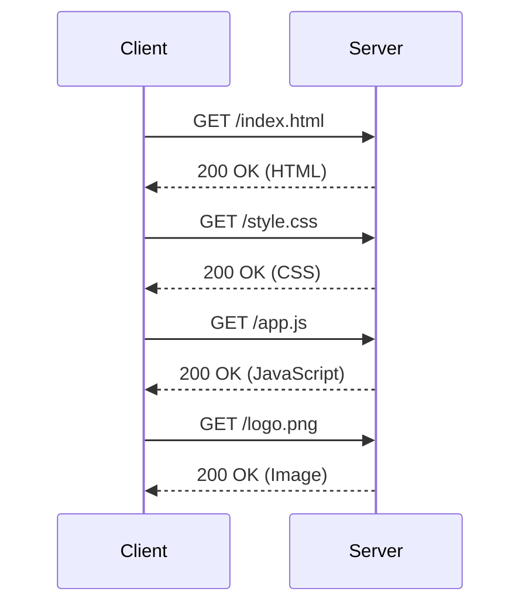

この問題を部分的に解決するために、**パイプライニング（Pipelining）** が導入された。パイプライニングでは、前のレスポンスを待たずに複数のリクエストをまとめて送信できる。

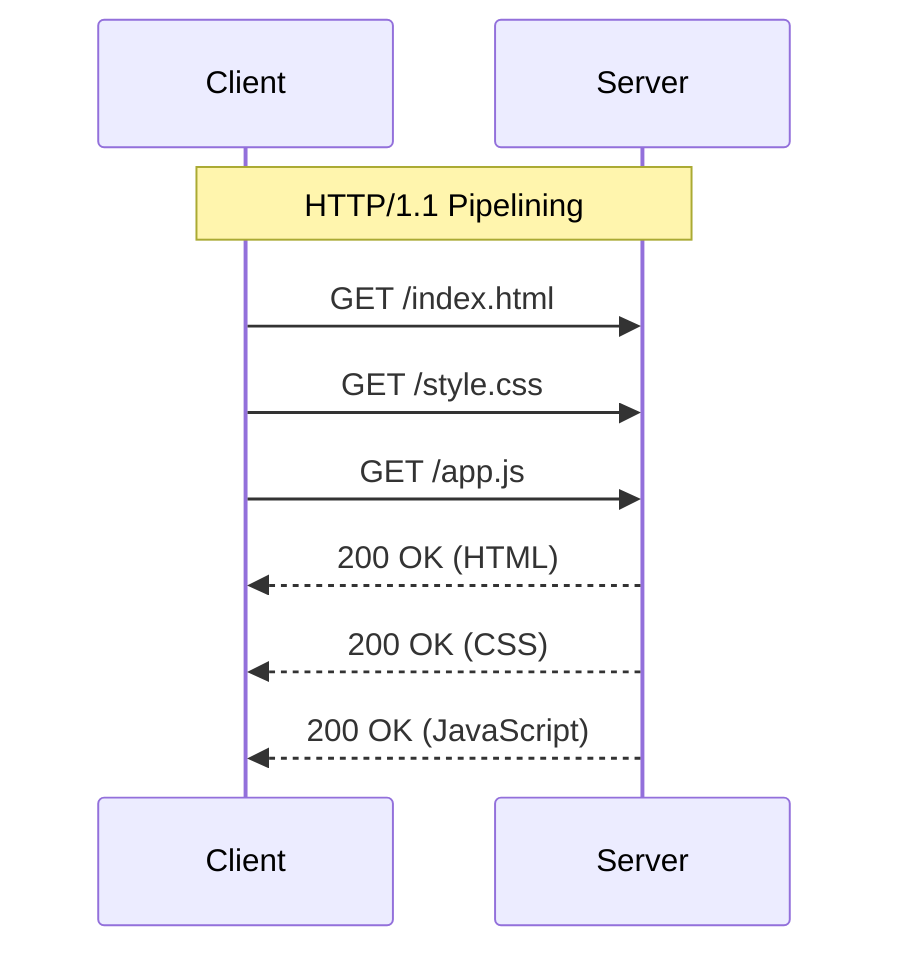

しかし、パイプライニングには致命的な欠陥があった。サーバーは**リクエストを受信した順番通りにレスポンスを返さなければならない**という制約（HOL Blocking、後述）と、プロキシサーバーとの非互換性、エラー時の回復の困難さなどにより、実際にはほとんどのブラウザがパイプライニングをデフォルトで無効にしていた。

### 2.2 Head-of-Line Blocking（HOL Blocking）

HTTP/1.1における最も深刻な問題が **Head-of-Line Blocking（HOL Blocking）** である。

パイプライニングを使う場合、サーバーはリクエストを受け取った順序でレスポンスを返さなければならない。もし最初のリクエストの処理に時間がかかると、後続のリクエストのレスポンスが完成していても、クライアントには送信できない。

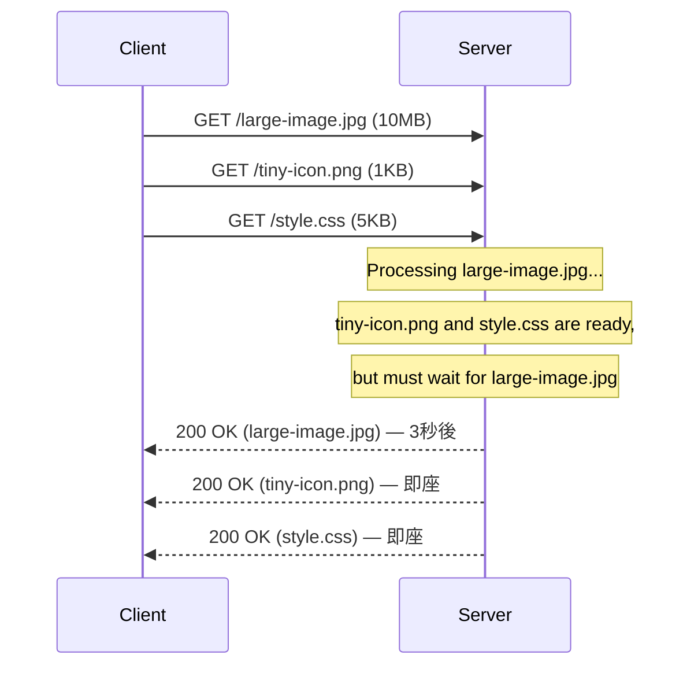

この問題の回避策として、ブラウザは複数のTCPコネクションを同時に張ることで並列リクエストを実現した。HTTP/1.1仕様ではサーバーあたり2接続を推奨していたが、実際のブラウザは6〜8接続を使うようになった。

### 2.3 多数の並列接続による副作用

複数のTCPコネクションによる回避策は、新たな問題を生み出した。

**サーバー側の負荷増大**: 各クライアントが6〜8の接続を張るため、サーバーが維持すべき同時接続数が増大した。1万のユーザーが同時アクセスすると、6〜8万のTCP接続が必要になる。

**TCP輻輳制御の非効率性**: TCPはスロースタートアルゴリズムにより、新しい接続では最初から大きな帯域幅を使えない。接続ごとにスロースタートが発生するため、帯域幅の効率的な活用が妨げられる。

**リソース分断**: 本来1本の接続で共有できるはずのTCPの輻輳ウィンドウが、複数の接続に分散される。

### 2.4 ヘッダの冗長性

HTTP/1.1のもう一つの問題は、ヘッダの冗長性だ。Cookieが普及した現代のWebでは、同一のCookieヘッダが何百ものリクエストに繰り返し送信される。

```
# Every request includes these headers repeatedly:
Cookie: session_id=abc123; user_pref=en; tracking_id=xyz789...
User-Agent: Mozilla/5.0 (Windows NT 10.0; Win64; x64) AppleWebKit/537.36...
Accept: text/html,application/xhtml+xml,application/xml;q=0.9,*/*;q=0.8
Accept-Language: ja,en-US;q=0.7,en;q=0.3
Accept-Encoding: gzip, deflate, br
```

これらのヘッダは変化しないにもかかわらず、すべてのリクエストに付加されてネットワーク帯域を消費する。大規模なWebサービスでは、ヘッダが全トラフィックの相当な割合を占めることもある。

### 2.5 テキストベースプロトコルの非効率性

HTTP/1.1はテキストベースのプロトコルであり、人間が読みやすい反面、機械処理には非効率だ。ステータス行、ヘッダフィールド、コンテンツの境界を判断するためにパーサーが必要であり、バグが入り込みやすい。

```
HTTP/1.1 200 OK\r\n
Content-Type: text/html; charset=utf-8\r\n
Content-Length: 1234\r\n
\r\n
<html>...</html>
```

改行コードや空白の扱いが曖昧で、様々な実装間で解釈の違いが生じることもあった。

## 3. SPDYからHTTP/2へ——Googleの実験と標準化

### 3.1 GoogleによるSPDYの開発

2009年、GoogleはWebのパフォーマンス改善を目指す実験的プロトコル「SPDY」（「スピーディー」と読む）を発表した。Googleは自社サービスの膨大なトラフィックデータを分析し、HTTP/1.1のボトルネックを実証的に特定していた。

SPDYの主要な革新は以下の通りだ。

**多重化（Multiplexing）**: 単一のTCPコネクション上で複数のリクエスト/レスポンスを同時に処理できるようにした。各リクエストは「ストリーム」として識別され、HOL Blockingを解消した。

**ヘッダ圧縮**: リクエストとレスポンスのヘッダをzlib圧縮することで、ヘッダのオーバーヘッドを大幅に削減した（後にSPDY3では圧縮の脆弱性が発見された）。

**優先度制御**: クライアントがリクエストに優先度を付けられるようにし、重要なリソースを先に取得できるようにした。

**サーバープッシュ**: サーバーがクライアントのリクエストを待たずに、関連するリソースをプッシュできるようにした。

**強制TLS**: SPDYはTLSの使用を前提としており、セキュリティを担保した。

Googleは2010年にChromeとGoogleのサーバーでSPDYを有効化し、実際のパフォーマンスデータを収集した。実験結果は良好で、HTTP/1.1と比較して最大64%のページロード時間の短縮が確認された。

### 3.2 SPDYの普及と標準化への道

SPDYの有効性が実証されると、他のブラウザベンダーとサーバーソフトウェアも追随した。Firefox、Opera、そしてInternet Explorerもサポートを追加した。Apache、nginx、IISなどのサーバーソフトウェアもSPDYモジュールを提供するようになった。

2012年、IETFは新しいHTTPバージョンの開発を開始するワーキンググループ（httpbis）を設立した。SPDYはHTTP/2の主要な出発点となり、その設計の多くがHTTP/2に取り込まれた。

標準化プロセスでは、いくつかの重要な議論が行われた。

**ヘッダ圧縮の安全性**: SPDYのzlib圧縮はCRIME攻撃（Compression Ratio Info-leak Made Easy）に対して脆弱であることが2012年に発見された。HTTP/2では、この問題を解決するために専用のヘッダ圧縮アルゴリズム「HPACK」が設計された。

**TLSの必須化**: セキュリティ上の観点からTLSを必須にすべきか否かで議論があった。仕様上は平文のHTTP/2（h2c）も定義されたが、主要ブラウザは実際にはTLSを前提とするHTTP/2（h2）のみをサポートした。

**バイナリフレーム**: テキストベースのプロトコルからバイナリプロトコルへの移行について、デバッグの困難さを懸念する声もあったが、パフォーマンスと実装の正確さの観点からバイナリ化が採用された。

2015年5月、RFC 7540としてHTTP/2が正式に標準化された。同時に、HTTP/2のヘッダ圧縮仕様はRFC 7541として独立して公開された。

## 4. HTTP/2の核心技術

### 4.1 バイナリフレーミング層

HTTP/2の最も根本的な変更は、**バイナリフレーミング層**の導入だ。HTTP/1.1のテキストベースのメッセージ形式を廃し、すべての通信をバイナリの「フレーム」単位で行う。

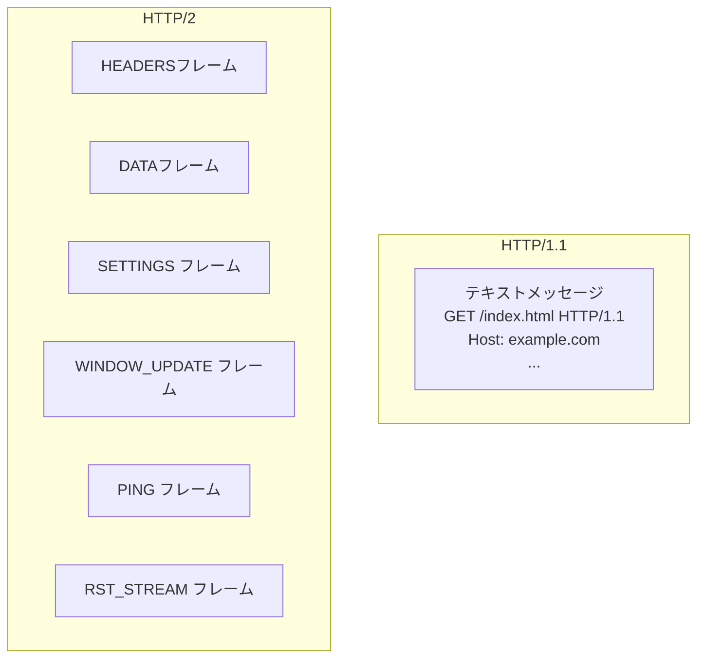

フレームの構造は以下の通りだ。

```
+-----------------------------------------------+
|                 Length (24)                   |
+---------------+---------------+---------------+
|   Type (8)    |   Flags (8)   |
+-+-------------+---------------+-------------------------------+
|R|                 Stream Identifier (31)                      |
+=+=============================================================+
|                   Frame Payload (0...)                      ...
+---------------------------------------------------------------+
```

- **Length（24ビット）**: ペイロードのバイト長（最大16MB）
- **Type（8ビット）**: フレームの種類（DATA、HEADERS、PRIORITY、RST_STREAM、SETTINGSなど）
- **Flags（8ビット）**: フレームタイプ固有のフラグ
- **R（1ビット）**: 予約済みビット
- **Stream Identifier（31ビット）**: ストリームの識別子
- **Frame Payload**: フレームの種類に応じたデータ

このバイナリ形式により、パースが高速かつ正確になり、テキストプロトコルに起因する実装の差異が排除される。

### 4.2 ストリーム多重化

HTTP/2の中核的な革新が**ストリーム多重化**だ。単一のTCPコネクション上で、複数のリクエスト/レスポンスを並列かつ双方向に処理できる。

HTTP/1.1とHTTP/2の通信フローを比較してみよう。

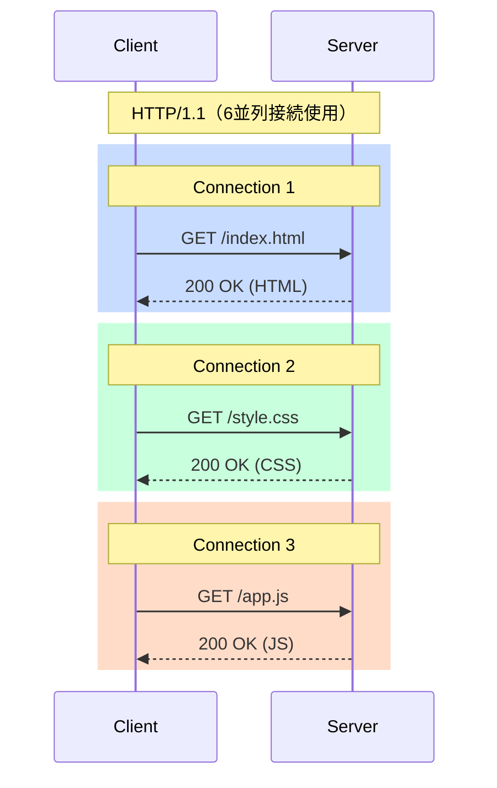

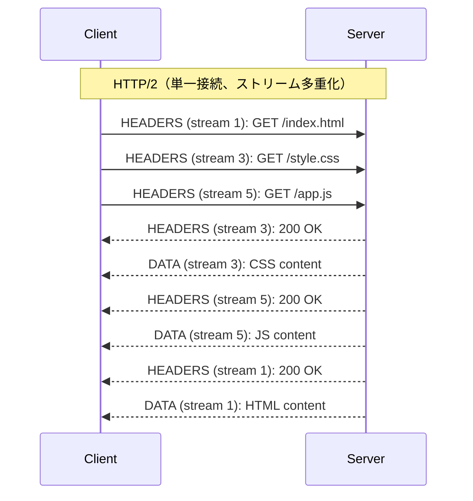

HTTP/2では、ストリームは奇数番号（クライアント起点）または偶数番号（サーバー起点）が割り当てられる。ストリームは以下の状態遷移をたどる。

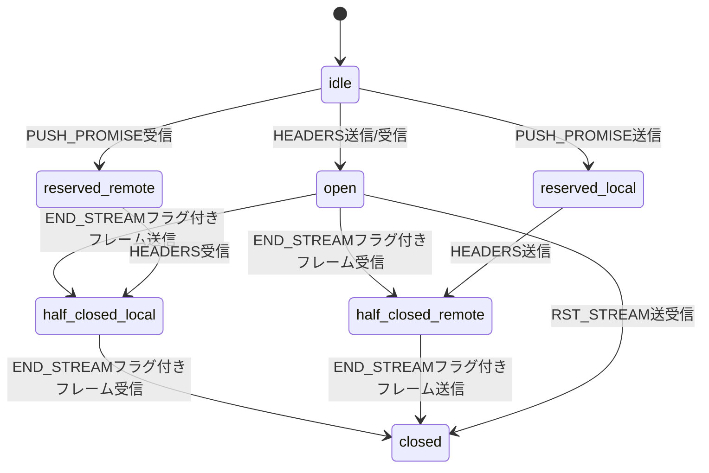

多重化により、以下の恩恵が得られる。

- **接続数の削減**: 6〜8接続から1接続へ。サーバーのリソース消費が大幅に減少
- **スロースタートの回避**: 既存の確立済み接続を使い続けるため、TCPスロースタートの影響を受けない
- **HOL Blockingの解消**: ストリームは独立しているため、1つのストリームの遅延が他に影響しない（ただしTCPレイヤのHOL Blockingは残る）

### 4.3 ヘッダ圧縮——HPACK

HTTP/2のヘッダ圧縮アルゴリズム「HPACK」（RFC 7541）は、SPDYのzlib圧縮の脆弱性（CRIME攻撃）を解決するために設計された。HPACKは二つの主要な手法を組み合わせる。

**ハフマン符号化**: 個々のヘッダ値をハフマン符号で圧縮する。ハフマン符号は頻出する文字に短いビット列を割り当てることでデータ量を削減する。

**ヘッダテーブル（差分圧縮）**: これがHPACKの核心だ。クライアントとサーバーは同期した「ヘッダテーブル」を維持する。テーブルには「静的テーブル」と「動的テーブル」がある。

静的テーブルは、HTTPヘッダで頻繁に使われるヘッダ名と値の組を61エントリ事前定義している。

```
インデックス | ヘッダ名              | ヘッダ値
1          | :authority            |
2          | :method               | GET
3          | :method               | POST
4          | :path                 | /
5          | :path                 | /index.html
...
8          | :status               | 200
...
15         | accept-encoding       | gzip, deflate
16         | accept-language       |
...
61         | www-authenticate      |
```

動的テーブルには、実際の通信で登場したヘッダが追加されていく。

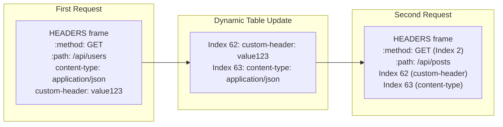

2回目以降のリクエストでは、変化しないヘッダをインデックス番号1〜2バイトで表現できる。大量のリクエストを行う実際のWebアプリケーションでは、HPACKによりヘッダのオーバーヘッドを85〜88%削減できる。

### 4.4 サーバープッシュ

**サーバープッシュ**は、サーバーがクライアントのリクエストを待たずにリソースをプッシュする機能だ。

典型的な使用例として、HTMLを返す際に関連するCSSやJavaScriptを同時にプッシュするケースがある。

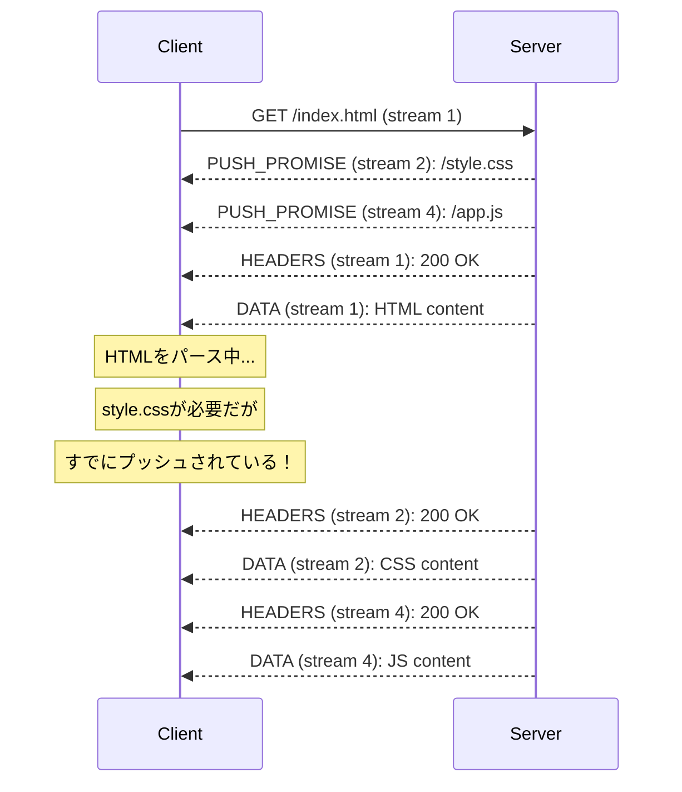

`PUSH_PROMISE` フレームでサーバーはプッシュ予定のリソースを事前予告し、クライアントが不要なリソースを `RST_STREAM` で拒否する機会を与える。

ただし、実際の運用ではサーバープッシュの効果は期待より低いことが多い。後述する課題で詳しく説明する。

### 4.5 フロー制御

HTTP/2ではストリームレベルとコネクションレベルの2段階の**フロー制御**を持つ。`WINDOW_UPDATE` フレームで受信側がバッファの残量を送信側に伝える。

```
送信側                      受信側
  |                           |
  |--- SETTINGS ------------->|  (initial window size = 65535)
  |                           |
  |--- DATA (stream 1) ------>|  (消費: 16384バイト)
  |--- DATA (stream 1) ------>|  (消費: 32768バイト)
  |                           |
  |<-- WINDOW_UPDATE ---------|  (追加: 49152バイト)
  |                           |
  |--- DATA (stream 1) ------>|  (継続送信可能)
```

これにより、受信バッファが溢れないように送信速度を調整できる。

## 5. HTTP/2の実装と運用

### 5.1 TLS要件とALPN

仕様上、HTTP/2は平文（h2c）とTLS（h2）の両方をサポートするが、Chrome、Firefox、Safari、Edgeなどの主要ブラウザはすべてTLS前提のh2のみをサポートする。事実上、HTTP/2を使うにはTLSが必須だ。

HTTP/2のネゴシエーションには **ALPN（Application-Layer Protocol Negotiation）** TLS拡張を使用する。TLSハンドシェイク中に、クライアントはサポートするプロトコルの一覧を送り、サーバーが選択する。

```
TLSハンドシェイク Client Hello:
  Extensions:
    application_layer_protocol_negotiation:
      h2
      http/1.1

TLSハンドシェイク Server Hello:
  Extensions:
    application_layer_protocol_negotiation:
      h2  ← サーバーがHTTP/2を選択
```

これにより、TLSハンドシェイクと同時にHTTPバージョンのネゴシエーションが完了し、余計なラウンドトリップが不要になる。

### 5.2 コネクションプリファレス

HTTP/2のコネクションが確立されると、クライアントはまず以下の「コネクションプリフェース」を送信する。

```
PRI * HTTP/2.0\r\n\r\nSM\r\n\r\n
```

この後に `SETTINGS` フレームが続く。これにより、誤ってHTTP/2コネクションにHTTP/1.1クライアントが接続しようとした場合を区別できる。

### 5.3 サーバー設定

主要なWebサーバーのHTTP/2設定例を示す。

```nginx
# nginx configuration for HTTP/2
server {
    listen 443 ssl http2;  # Enable HTTP/2

    ssl_certificate     /etc/ssl/certs/example.crt;
    ssl_certificate_key /etc/ssl/private/example.key;

    # TLS settings for HTTP/2 compatibility
    ssl_protocols TLSv1.2 TLSv1.3;
    ssl_ciphers ECDHE-ECDSA-AES128-GCM-SHA256:ECDHE-RSA-AES128-GCM-SHA256;

    # Server push example
    location / {
        root /var/www/html;
        http2_push /style.css;
        http2_push /app.js;
    }
}
```

```apache
# Apache configuration for HTTP/2
LoadModule http2_module modules/mod_http2.so

<VirtualHost *:443>
    Protocols h2 http/1.1  # Prefer HTTP/2, fall back to HTTP/1.1

    SSLEngine on
    SSLCertificateFile    /etc/ssl/certs/example.crt
    SSLCertificateKeyFile /etc/ssl/private/example.key

    # Server push using Link header
    Header add Link "</style.css>; rel=preload; as=style"
    Header add Link "</app.js>; rel=preload; as=script"
</VirtualHost>
```

### 5.4 優先度制御

HTTP/2では、クライアントが各ストリームに優先度を指定できる。優先度は**依存関係ツリー**と**重み**で表現される。

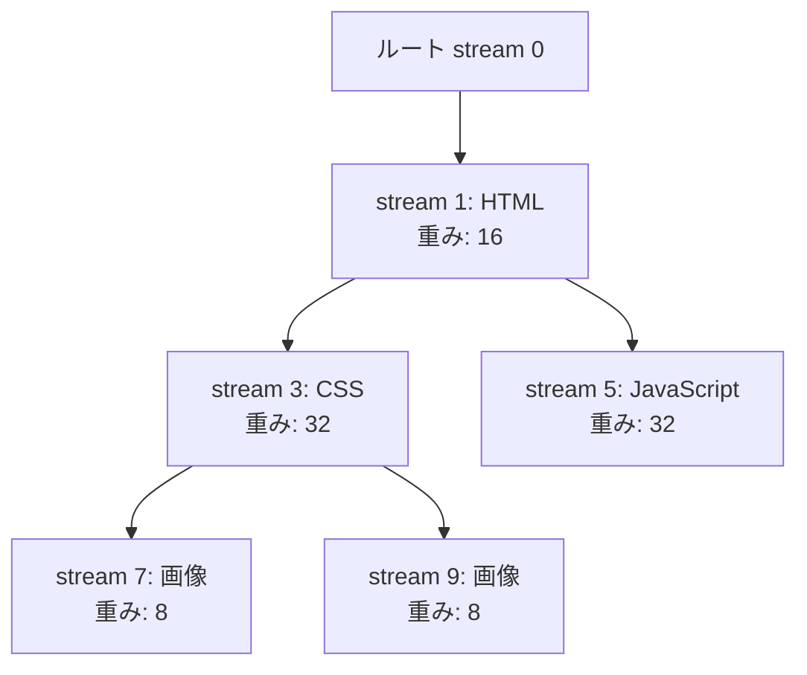

重みは1〜256の整数で、同一親ストリームを持つストリーム間でリソースを比例配分するためのヒントとなる。上記の例では、CSSとJavaScriptが同じ重み（32）で、HTMLの処理が終わった後に均等にリソースが配分される。

ただし、優先度制御は実装が難しく、サーバー実装によって挙動が大きく異なることが判明している。2019年以降、多くの実装ではシンプルな処理を好む傾向にあり、HTTP/3では優先度制御の仕様が大幅に簡素化された（RFC 9218）。

### 5.5 HTTP/1.1との後方互換性

HTTP/2は既存のHTTP/1.1インフラとの後方互換性を持つように設計されている。

- **同じURIスキーム**: `http://` と `https://` をそのまま使用できる
- **同じセマンティクス**: GETやPOSTなどのメソッド、ステータスコード、ヘッダのセマンティクスは変わらない
- **メソッド・ステータスコード**: 既存のHTTPメソッドとステータスコードをすべてサポート

アプリケーション層からは、HTTP/2はほぼ透過的だ。WebアプリケーションはHTTP/2の存在を意識せずに動作し、パフォーマンスの恩恵だけを受けられる。

## 6. HTTP/2の効果と課題

### 6.1 パフォーマンス改善の実績

HTTP/2の採用により、実際に観測されたパフォーマンス改善を示す。

**ページロード時間の短縮**: 多重化とヘッダ圧縮により、リソースの多いページでは大幅な改善が見られる。特にモバイル回線など高レイテンシな環境では効果が大きい。

**接続数の削減**: HTTPアーカイブの調査によれば、HTTP/2採用後のサービスでは平均接続数が75〜90%削減されている。

**ヘッダのオーバーヘッド削減**: HPACKにより、典型的なWebアプリケーションではヘッダデータ量が70〜90%削減される。

ただし、HTTP/2の効果は一様ではない。小規模なページや、もともとリソース数が少ないページでは改善が限定的なことも多い。また、HTTP/1.1向けに最適化されたテクニック（ドメインシャーディング、スプライト画像、コンカテネーション）がHTTP/2環境では逆効果になる場合がある。

### 6.2 TCP上のHead-of-Line Blocking

HTTP/2の多重化はHTTPレイヤのHOL Blockingを解消したが、**TCPレイヤのHOL Blocking**は依然として存在する。

TCPはバイトストリームの順序を保証するプロトコルだ。パケットロスが発生すると、TCPはロストパケットを再送し、後続のパケットが届いていても順序が揃うまでアプリケーションに渡さない。

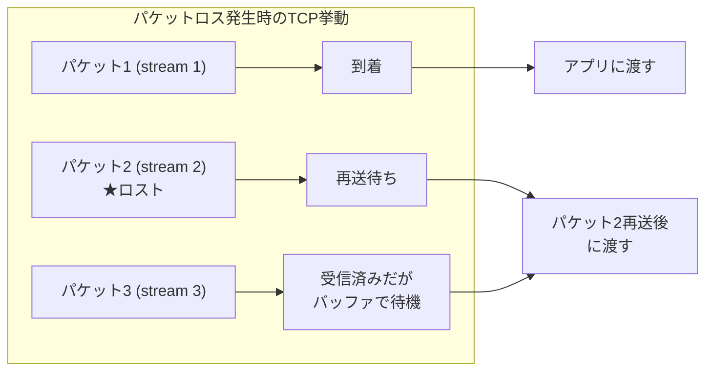

HTTP/2では1本のTCPコネクションに複数のストリームが多重化されているため、パケットロスが発生するとすべてのストリームがブロックされる。HTTP/1.1が複数のTCPコネクションを使う場合、ロスが発生するのは1本の接続だけで、他の接続は影響を受けない。

逆説的だが、帯域幅が安定している理想的な環境ではHTTP/2が有利だが、パケットロス率が高い不安定な回線ではHTTP/1.1の複数接続アプローチの方が良い結果を示す場合がある。Googleの調査では、パケットロス率が2%を超えるとHTTP/2はHTTP/1.1より遅くなる可能性があることが示されている。

### 6.3 サーバープッシュの限界

理論的には魅力的なサーバープッシュだが、実際の運用では多くの課題がある。

**キャッシュの問題**: サーバーはクライアントが対象リソースをキャッシュ済みかを知る方法がない。結果として、クライアントがすでに持っているリソースをプッシュして帯域を無駄にする可能性がある。

**優先度との競合**: プッシュされたリソースが重要なリソースの帯域を圧迫することがある。

**複雑な管理**: いつ何をプッシュするかの判断は難しく、誤った設定は逆効果になる。

こうした課題から、Chromeは2022年にサーバープッシュのサポートを削除した。HTTP/3でもサーバープッシュの仕様は残っているが、実際の利用は縮小傾向にある。代替として、`<link rel="preload">` や `<link rel="103 Early Hints>` の方が実用的と見なされている。

### 6.4 HTTP/2の普及状況

2025年時点では、HTTP/2はWebのデファクトスタンダードとなっている。

- W3Techsの調査では、全Webサイトの約60%がHTTP/2以上をサポート
- Chrome、Firefox、Safari、Edgeなど主要ブラウザはすべてHTTP/2をサポート
- CloudFlare、Fastly、AkamaiなどのCDNはHTTP/2をデフォルトで有効化
- nginx、Apache、Caddyなどの主要サーバーソフトウェアもデフォルトでHTTP/2サポート

HTTP/1.1向けの最適化手法（ドメインシャーディング、CSSスプライト、JavaScriptバンドル）の一部はHTTP/2環境では不要または逆効果だが、バンドルによる合計リクエスト数削減の効果は依然として有効な場合がある。

## 7. HTTP/3への展望——QUICによるTCPの置き換え

### 7.1 QUICプロトコルの誕生

HTTP/2のTCPレイヤのHOL Blockingを根本的に解決するため、GoogleはQUICプロトコルを開発した。QUICは当初「Quick UDP Internet Connections」の略称だったが、今は単にQUICとして扱われる。

QUICはUDP上に実装された新しいトランスポートプロトコルで、TCPとTLSの機能をユーザースペースで再実装したものだ。

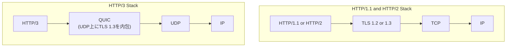

### 7.2 QUICの革新

**ストリームレベルのHOL Blocking解消**: QUICはパケットロスの回復をストリーム単位で行う。あるストリームでパケットロスが発生しても、他のストリームはブロックされない。

**0-RTTハンドシェイク**: 以前に接続したことがあるサーバーには、TLSセッション再開情報を活用して0RTTで接続でき、最初のリクエストの遅延を大幅に削減できる。

**コネクションマイグレーション**: スマートフォンがWi-FiからモバイルデータへIPアドレスが変わっても、コネクションIDによって接続を維持できる（TCPは4タプル（src/dst IP・ポート）でコネクションを識別するため、IP変更でコネクションが切れる）。

**改善された輻輳制御**: QUIC自体に輻輳制御が組み込まれており、TCPより柔軟に改良できる。

### 7.3 HTTP/3の標準化

2022年6月、RFC 9114としてHTTP/3が正式に標準化された。HTTP/3はHTTP/2のセマンティクスを維持しながら、トランスポート層をTCPからQUICに置き換えたものだ。

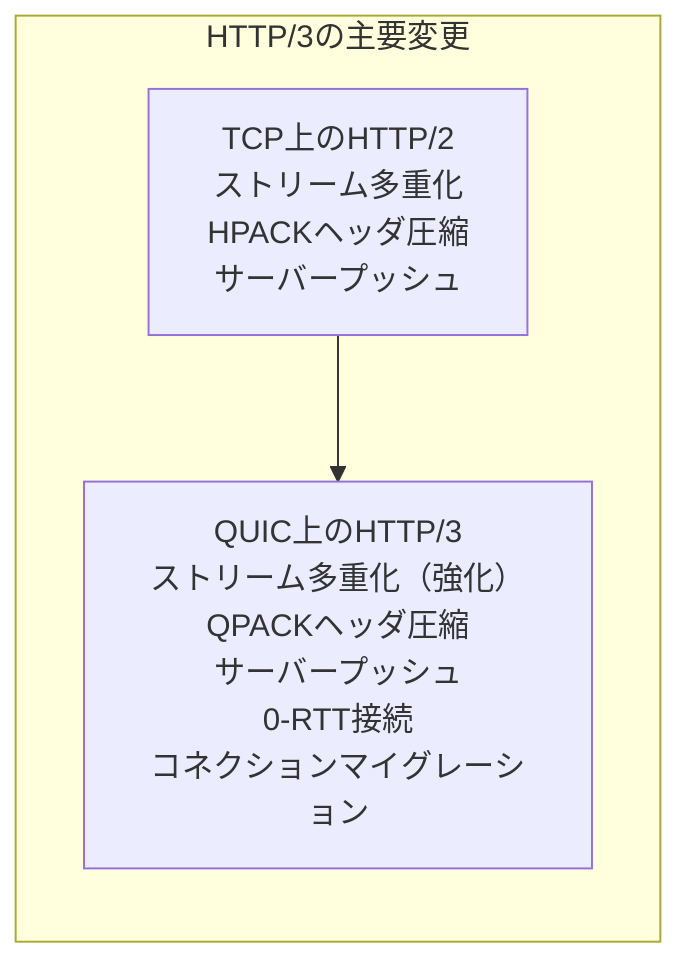

**QPACK**: HTTP/3ではHPACKの代わりにQPACKがヘッダ圧縮に使われる。HPACKはTCPの順序保証を前提としていたが、QUICではパケットの順序が保証されない場合があるため、QPACKはこの状況に対応できるよう設計されている。

HTTP/3の普及も急速に進んでおり、2024年時点でW3Techsの調査では約30%のWebサイトがHTTP/3をサポートしている。Chrome、Firefox、Safari、EdgeはすべてデフォルトでHTTP/3をサポートする。

### 7.4 HTTPの進化の軌跡まとめ

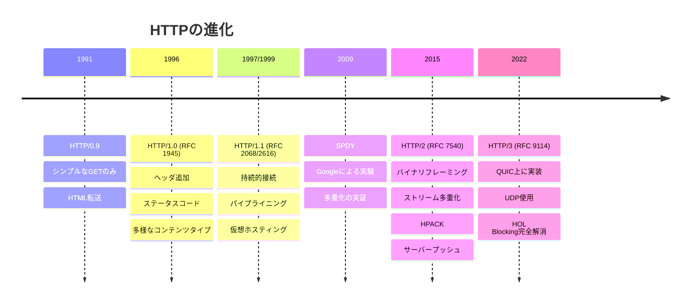

## 8. 実践的な考察——HTTP/2移行の教訓

### 8.1 HTTP/1.1向け最適化の見直し

HTTP/1.1時代に広く使われた最適化手法が、HTTP/2環境では不要または逆効果になる場合がある。

**ドメインシャーディング**: HTTP/1.1では、複数のサブドメイン（`cdn1.example.com`、`cdn2.example.com`）に分散させることで並列接続数を増やすテクニックが使われた。HTTP/2では単一コネクションで多重化できるため、ドメインシャーディングは逆効果だ（接続が分散されてTCPの最適化が働かなくなる）。

**CSSスプライト**: 複数の小さな画像を1枚にまとめることでリクエスト数を削減する手法。HTTP/2では多重化によりリクエストのオーバーヘッドが小さくなるため、スプライトの必要性が低下した。ただし、画像数が非常に多い場合はまだ有効なこともある。

**インライン化**: 小さなCSSやJavaScriptをHTMLに埋め込む手法。HTTP/2のサーバープッシュが代替手段になり得るが、前述の通りサーバープッシュ自体も非推奨になっている。

**JavaScriptバンドル**: 多数のJSファイルを1つにまとめることでリクエスト数を削減する手法。HTTP/2では粒度の細かいモジュールを別々に配信することも可能になるが、キャッシュ効率やHTTPオーバーヘッドのトレードオフは依然として存在する。ツールチェーン（Webpack、Vite等）のバンドル機能はHTTP/2環境でも合理的な選択であることが多い。

### 8.2 デバッグとモニタリング

HTTP/2はバイナリプロトコルであるため、直接テキストで読むことはできない。デバッグツールの活用が重要だ。

```bash
# curl でHTTP/2接続を確認
curl -I --http2 https://www.example.com

# HTTP/2ネゴシエーションの詳細を表示
curl -v --http2 https://www.example.com 2>&1 | grep -E "^(\*|>|<)"

# h2loadによるHTTP/2負荷テスト（nghttp2パッケージに含まれる）
h2load -n 1000 -c 10 https://www.example.com
```

Chromeのdevtoolsではネットワークタブでプロトコルの確認ができ、`Protocol` 列に `h2` と表示されればHTTP/2通信だ。Wiresharkは `ssl.app_data` フィルターでQUICやTLSトラフィックを解析できる。

### 8.3 セキュリティ上の考慮事項

HTTP/2の導入にあたっては、TLSが事実上必須となるため、TLS設定の重要性が増す。HTTP/2ではTLS 1.2以上が必要であり、特定の脆弱な暗号スイートは禁止されている（RFC 7540 付録A）。

また、HTTP/2特有の攻撃も存在する。

**HPACK爆弾**: 悪意あるクライアントが大量のヘッダエントリを動的テーブルに追加しようとする攻撃。実装は動的テーブルのサイズに上限を設けて対策する。

**ストリームフラッディング**: 大量のストリームを一度に開くことでサーバーリソースを枯渇させる攻撃。`SETTINGS_MAX_CONCURRENT_STREAMS` で同時ストリーム数を制限する。

**Rapid Reset攻撃（CVE-2023-44487）**: 2023年に発見された攻撃手法で、大量のHTTP/2ストリームをすぐにリセットし続けることでCPU使用率を高騰させる。主要な実装とCDNは対策を施している。

## まとめ

HTTP/0.9から始まった単純なテキスト転送プロトコルは、30年以上の進化を経てHTTP/2という洗練されたバイナリプロトコルへと変貌を遂げた。

HTTP/1.1が抱えていたHOL Blocking、ヘッダの冗長性、多数の並列接続という課題に対し、HTTP/2はバイナリフレーミング、ストリーム多重化、HPACK圧縮という核心技術で応えた。この進化はGoogleのSPDYという実験的プロトコルによって先導され、IETFでの国際的な標準化プロセスを経て実現した。

しかし、HTTP/2はすべての問題を解決したわけではない。TCPというトランスポート層の制約から来るHOL Blockingは依然として存在し、サーバープッシュの運用上の困難さも明らかになった。これらの教訓は、UDPとQUICを基盤とするHTTP/3の設計に活かされた。

Webの進化は止まらない。HTTP/3の普及が進む中、それぞれのHTTPバージョンがなぜ設計されたのか、どんな問題を解決し、どんな問題を残したのかを理解することは、現代のWebシステムを構築・運用するエンジニアにとって不可欠な知識だ。

## 参考資料

- RFC 7540: Hypertext Transfer Protocol Version 2 (HTTP/2)
- RFC 7541: HPACK: Header Compression for HTTP/2
- RFC 9114: HTTP/3
- RFC 9218: Extensible Prioritization Scheme for HTTP
- Ilya Grigorik, "High Performance Browser Networking" (O'Reilly)
- Google Research, "SPDY: An Experimental Protocol for a Faster Web"
- HTTPArchive: State of the Web Reports
