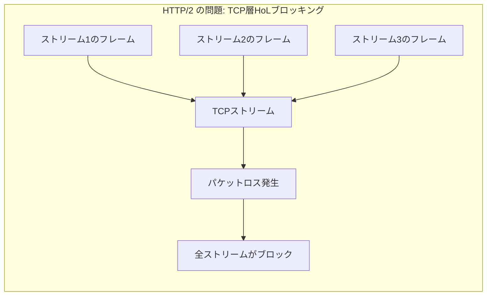
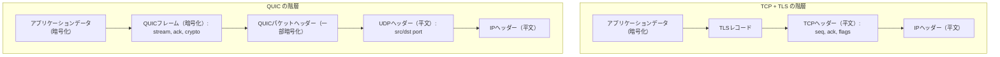
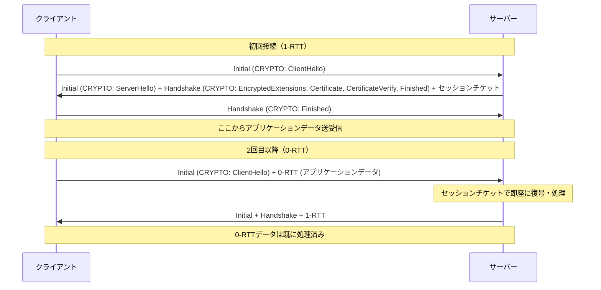
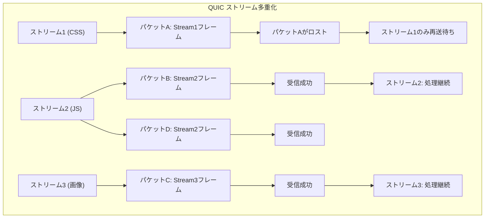
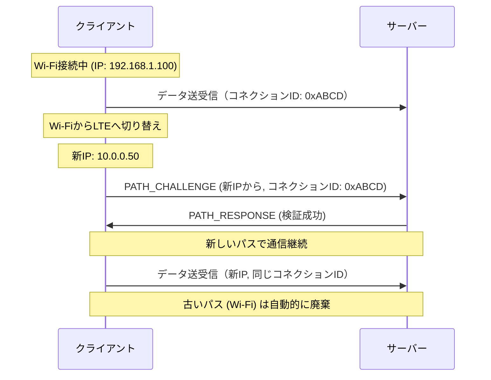
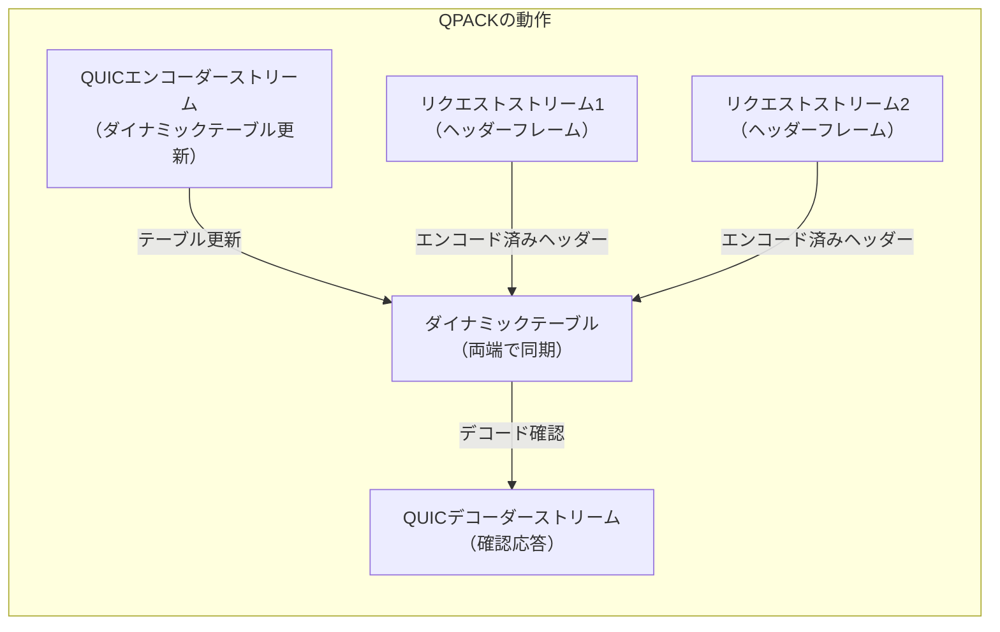
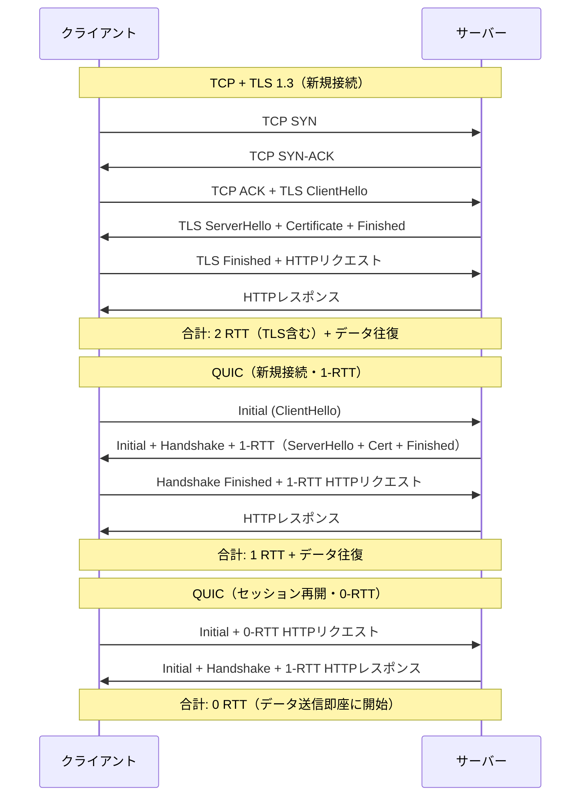

# HTTP/3 と QUIC

## 1. 歴史的背景：TCPの限界と新プロトコルの必要性

### 1.1 TCPは「信頼性」に最適化されすぎた

インターネットの黎明期、TCP（Transmission Control Protocol）は「確実にデータを届ける」という目標を達成するために設計された。3ウェイハンドシェイクによる接続確立、シーケンス番号による順序保証、ACKによる再送制御——これらの仕組みはインターネットの基盤として30年以上機能し続けた。

しかし、Webの進化とともにTCPの設計思想が足かせになり始めた。現代のWebページは数百のリソース（HTML、CSS、JavaScript、画像）を並列で読み込む。TCPは「1本の接続でシーケンシャルにデータを転送する」という前提で設計されており、この並列性の需要に構造的に対応できなかった。

### 1.2 HTTP/1.1の時代：Keep-AliveとPipelining

HTTP/1.0では1リクエストごとにTCP接続を確立・切断していた。これが非効率であることは明白で、HTTP/1.1では**Keep-Alive**（持続的接続）と**パイプライン処理**が導入された。

パイプライン処理により、前のレスポンスを待たずに複数のリクエストを送信できるようになった。しかし、**Head-of-Line（HoL）ブロッキング**という根本的な問題が残った。TCPストリームは順序を保証するため、先行するレスポンスの処理が完了しなければ後続のレスポンスを処理できない。

```
HTTP/1.1 パイプライン処理のHoLブロッキング:

クライアント      サーバー
    |                |
    |-- req A ------>|
    |-- req B ------>|
    |-- req C ------>|
    |                |
    |<-- res A ------| (大きいレスポンス、遅延)
    |                |
    |                | (B, Cはブロック待ち)
    |                |
    |<-- res B ------|
    |<-- res C ------|
```

実際には多くのブラウザがパイプライン処理を無効化し、代わりにドメインごとに6本の並列TCP接続を張ることで回避策とした。これはサーバーリソースの無駄遣いでもあった。

### 1.3 HTTP/2：多重化の導入

2015年に標準化されたHTTP/2は、**バイナリフレーミング**と**ストリーム多重化**により、HoLブロッキング問題をアプリケーション層で解決した。1本のTCP接続上で複数のストリームが独立して動作し、各ストリームにフレームを分割して送信することで、実質的な並列転送を実現した。

しかし、HTTP/2は**TCP層のHoLブロッキング**を解消できなかった。TCPはパケットロスが発生すると、ロストしたパケットが再送されるまで後続のすべてのデータの配信をブロックする。HTTP/2のストリームAのフレームが混在するTCPストリームで1パケットが失われると、ストリームBのフレームも含めて配信が止まる。



モバイル回線やWi-Fi環境ではパケットロスが頻発するため、HTTP/2のメリットがTCPの限界によって相殺されるケースが多かった。Googleの実測によれば、パケットロス率が2%を超えると、HTTP/2の性能はHTTP/1.1を下回ることもある。

### 1.4 TLSハンドシェイクのオーバーヘッド

現代のWebではHTTPSが標準であり、TCP接続の上にTLS（Transport Layer Security）を重ねる必要がある。

- **TCP 3ウェイハンドシェイク**: 1.5 RTT（往復遅延時間）
- **TLS 1.2ハンドシェイク**: 2 RTT
- **合計**: 3.5 RTT必要（初回接続時）

TLS 1.3ではハンドシェイクが1 RTTに短縮され、セッション再開時は0-RTTも可能になった。しかし、TCPハンドシェイク自体が1 RTTを必要とする制約は変わらない。

### 1.5 gQUIC：Googleの実験的アプローチ

2013年、Googleはこれらすべての問題を解決するために**gQUIC**（Google QUIC）を独自に開発し、ChromeとGoogleのサービス（YouTube、Gmail等）に展開した。

gQUICの革新的なアイデアは「TCPを諦め、UDPの上に新しいトランスポート層を構築する」ことだった。OSカーネルのTCPスタックは変更が難しく、新しいアイデアの実験が困難である。UDPはほぼ何もしない素朴なプロトコルであり、その上にアプリケーション層でカスタムのトランスポート機能を実装できる。

Googleの社内データでは、gQUICによりYouTubeのバッファリング回数が30%削減、Google検索のページロード時間が8%改善したと報告されている。

### 1.6 IETF標準化：QUICとHTTP/3

Googleの成功を受け、IETFはgQUICをベースに標準化作業を開始した。しかしIETF QUICはgQUICとは大きく異なる仕様になった。暗号化の方式、フレーム構造、ストリーム管理など、ほぼすべての要素が再設計された。

2021年5月、以下の仕様がRFCとして公開された：

- **RFC 9000**: QUIC: A UDP-Based Multiplexed and Secure Transport
- **RFC 9001**: Using TLS 1.3 with QUIC
- **RFC 9002**: QUIC Loss Detection and Congestion Control
- **RFC 9114**: HTTP/3

## 2. QUICプロトコルの設計思想

### 2.1 なぜUDPなのか

UDPは「コネクションレス、順序保証なし、再送なし」という最小限のプロトコルだ。ポート番号でアプリケーションを識別し、チェックサムで基本的な破損検出を行うだけである。

QUICがUDPを選んだ理由は、**ミドルボックスの問題**にある。インターネット上には無数のファイアウォール、NAT、ロードバランサー、プロキシが存在する。これらの機器はTCPのヘッダーを解析してネットワーク制御を行っている。

新しいトランスポートプロトコルをTCPと同じレイヤー（IP上）で実装しようとしても、これらのミドルボックスが認識できないプロトコルをブロックしてしまう。UDPはほとんどのミドルボックスで通過でき、さらに「UDP上の独自プロトコル」という形でアプリケーション層の変更として扱えるため、OSカーネルの更新なしにユーザー空間で実装できる。

### 2.2 暗号化のファーストクラスサポート

QUICの最大の特徴の一つは、**暗号化をプロトコルの根幹に組み込んだ**ことだ。

従来のTCP+TLSでは、TCPは平文でヘッダー（シーケンス番号、フラグ等）を送信し、TLSがその上でデータを暗号化していた。つまり、TCPのヘッダーはネットワーク上でむき出しになっており、ミドルボックスはこれを読み取って様々な処理を行っていた。

QUICでは、**UDPヘッダーとQUICのロングヘッダーを除き、ほぼすべての情報が暗号化される**。パケット番号、ストリームID、フレーム内容のすべてが暗号化対象だ。



この設計には二つの利点がある。第一に、ネットワーク上の盗聴者がメタデータすら読み取れないためプライバシーが向上する。第二に、ミドルボックスがQUICの内部構造を解析して「最適化」（実際には妨害）できなくなり、プロトコルの進化を阻害しにくくなる。

### 2.3 コネクションIDによる接続の抽象化

TCPの接続は「送信元IP:ポート、宛先IP:ポート」という4タプルで識別される。これは問題を引き起こす：

- モバイルデバイスがWi-FiからLTEに切り替えるとIPアドレスが変わり、TCP接続が切断される
- NAT再マッピングでポートが変わっても接続が切断される

QUICは**コネクションID（Connection ID）**という概念を導入した。コネクションIDはクライアントとサーバーが合意した任意のバイト列で、4タプルとは独立して接続を識別する。

```
QUIC コネクションIDの構造:

[UDP ヘッダー][QUIC ヘッダー: コネクションID=0xABCDEF][暗号化フレーム...]

ネットワーク切り替え後:
[UDP ヘッダー（新IP）][QUIC ヘッダー: コネクションID=0xABCDEF][暗号化フレーム...]
                                              ↑ 同じIDで継続
```

コネクションIDはプライバシー保護のため定期的に更新される（接続追跡を防ぐため）。複数のコネクションIDを同時に有効化し、パスマイグレーション時に切り替える。

### 2.4 パケット番号空間の分離

QUICはハンドシェイクのフェーズごとに独立したパケット番号空間を持つ：

1. **Initial**: 接続確立の初期フェーズ
2. **Handshake**: TLSハンドシェイクフェーズ
3. **1-RTT**: アプリケーションデータフェーズ（0-RTTも含む）

各空間でパケット番号は独立してカウントアップされる。これにより、再送パケットは元のパケットと異なる番号を持つ。TCPでは再送時に同じシーケンス番号を使うため、ACKが「元のパケット」への応答か「再送パケット」への応答か区別できない（再送曖昧性問題）。QUICはこの問題を根本的に解消し、RTT計測の精度を向上させた。

## 3. QUICの核心機能

### 3.1 0-RTTハンドシェイク

QUICの最も注目される機能の一つが**0-RTT（ゼロラウンドトリップタイム）接続確立**だ。

初回接続時はTLS 1.3の1-RTTハンドシェイクを行う。この際、サーバーは**セッションチケット**（クライアントが次回接続で利用できる暗号化された状態情報）を送付する。

2回目以降の接続では、クライアントはセッションチケットを使い、最初のパケットにアプリケーションデータを含めて送信できる。サーバーはハンドシェイクを完了する前にこのデータを処理できる（Early Data）。



**0-RTTのセキュリティ上の注意点**：

0-RTTには**リプレイ攻撃**のリスクがある。攻撃者が0-RTTデータを傍受して再送した場合、サーバーが同じリクエストを2回処理してしまう可能性がある。そのため、0-RTTで送信できるリクエストは**冪等性（idempotent）のある操作**（GETリクエストなど）に限定するべきである。

QUICのRFC 9001では、0-RTTデータの保護に使用するキーのローテーションと、サーバー側でのリプレイ保護機構の実装を推奨している。

### 3.2 ストリーム多重化とHoLブロッキングの解消

QUICの**ストリーム多重化**はHTTP/2のそれと概念的に似ているが、決定的な違いがある。

HTTP/2はTCPの上でストリームを多重化するため、1つのパケットロスが**すべてのストリームをブロック**する（TCP層のHoLブロッキング）。

QUICのストリームは**UDP上で独立して管理**される。パケットロスが発生しても、そのパケットに含まれていたフレームに関連するストリームのみが影響を受け、他のストリームは引き続きデータを受信・処理できる。



QUICのストリームには4種類ある：

| ストリームID | 開始者 | 方向 |
|------------|--------|------|
| 0x...00 | クライアント | 双方向 |
| 0x...01 | サーバー | 双方向 |
| 0x...10 | クライアント | 単方向 |
| 0x...11 | サーバー | 単方向 |

ストリームIDの下位2ビットがタイプを示す。新しいストリームを開始するには、新しいストリームIDのフレームを送信するだけでよい（TCPの3ウェイハンドシェイクのような追加オーバーヘッドはない）。

### 3.3 フロー制御

QUICのフロー制御は2レベルで動作する：

1. **ストリームレベルのフロー制御**: 個々のストリームのバッファサイズを制限
2. **コネクションレベルのフロー制御**: 全ストリームの合計バッファサイズを制限

`MAX_STREAM_DATA`フレームと`MAX_DATA`フレームで受信ウィンドウを通知する。送信側はウィンドウを超えたデータを送信できない。

これはTCPのウィンドウ制御と類似しているが、ストリームごとに独立して制御できる点が異なる。

### 3.4 コネクションマイグレーション

**コネクションマイグレーション**は、ネットワーク経路が変わっても接続を維持する機能だ。

モバイルデバイスがWi-FiからLTEに切り替えると：
1. クライアントのIPアドレスが変化する
2. 新しいネットワーク経路上でサーバーに`PATH_CHALLENGE`フレームを送信
3. サーバーは`PATH_RESPONSE`で応答し、新しいパスを検証
4. 検証成功後、新しいパスに切り替える



プライバシー保護のため、マイグレーション時にコネクションIDを新しいものに更新することが推奨される。これにより、ネットワーク上の観察者が古いパスと新しいパスの通信を紐付けることが難しくなる。

### 3.5 損失検出と輻輳制御

QUICはTCPと同等以上の輻輳制御を実装している（RFC 9002）。

**損失検出の改善**：
- パケット番号が単調増加するため、再送曖昧性がない
- ACKフレームには受信したパケット番号のリストが含まれ、TCPより詳細な損失情報が得られる
- `ACK_ECN`フレームでExplicit Congestion Notification（ECN）もサポート

**輻輳制御**：
QUICはプラガブルな輻輳制御アーキテクチャを持ち、実装者はアルゴリズムを選択できる。標準的な実装として以下が使われる：

- **Cubic**: Linuxのデフォルトと同等のアルゴリズム
- **BBR（Bottleneck Bandwidth and Round-trip propagation time）**: Googleが開発した帯域幅・RTTベースの制御
- **QUIC-Recovery**: RFC 9002で定義された基本的な損失回復

**スピン・ビット**：
QUICパケットヘッダーには**スピンビット**という1ビットのフィールドがある。クライアントとサーバーがこのビットを反転させながら送り合うことで、ネットワーク観察者がRTTを計測できるようにしている（暗号化されたQUICでもネットワーク監視を可能にする配慮）。

## 4. HTTP/3のアーキテクチャ

### 4.1 HTTP/3とHTTP/2の関係

HTTP/3（RFC 9114）は、QUICを前提として設計されたHTTPバージョンである。HTTP/2のセマンティクス（メソッド、ステータスコード、ヘッダー、ボディ）は引き継ぎつつ、フレーム層とヘッダー圧縮を全面的に再設計した。

HTTP/3のストリームマッピング：

- **双方向ストリーム（クライアント開始）**: 各HTTPリクエスト/レスポンスペア
- **単方向ストリーム（クライアント→サーバー）**: QUICストリームID=2 (QPACK Encoder), ID=6 (コントロール)
- **単方向ストリーム（サーバー→クライアント）**: QUICストリームID=3 (QPACK Decoder), ID=7 (コントロール)

### 4.2 QPACK：ヘッダー圧縮

HTTP/2では**HPACK**というヘッダー圧縮方式を使っていた。HPACKはダイナミックテーブルを使ってヘッダーを効率的に圧縮するが、**順序依存性**がある。テーブルの更新が順番に処理されなければならないため、HTTP/2のストリーム間でヘッダー圧縮のHoLブロッキングが発生した。

HTTP/3では**QPACK**（RFC 9204）を採用した。QPACKはHPACKの問題を解決しつつ効率的な圧縮を実現する。



QPACKの特徴：

1. **必須参照エントリ（Required Insert Count）**: ヘッダーブロックが参照するダイナミックテーブルエントリを明示的に指定し、デコーダーがテーブルが最新かを確認できる
2. **ブロッキングなし静的エンコード**: 動的テーブルを使わずに（0-RTTで安全に）ヘッダーをエンコードできる
3. **ブロッキングあり動的エンコード**: 圧縮率向上のためダイナミックテーブルを使うが、テーブルが同期されていない場合は明示的にブロック

### 4.3 HTTP/3フレーム構造

HTTP/3のフレームはQUICのストリーム上で送受信される。主要なフレームタイプ：

| フレームタイプ | 説明 |
|-------------|------|
| DATA (0x0) | リクエスト/レスポンスボディ |
| HEADERS (0x1) | QPACK圧縮されたヘッダー |
| CANCEL_PUSH (0x3) | サーバープッシュのキャンセル |
| SETTINGS (0x4) | コネクション設定 |
| PUSH_PROMISE (0x5) | サーバープッシュ予告 |
| GOAWAY (0x7) | 接続のグレースフルシャットダウン |

注目すべき点として、HTTP/2に存在した**PRIORITY**フレームはHTTP/3では削除された（代わりにHTTP/3 Extensible Prioritization、RFC 9218として別途標準化）。

### 4.4 サーバープッシュ

HTTP/2のサーバープッシュはHTTP/3でも概念的には継承されているが、実装の現実は異なる。HTTP/3のサーバープッシュはQUICの単方向ストリームを使って実装される。

しかし実際には、主要ブラウザ（Chrome、Firefox）はHTTP/3のサーバープッシュをデフォルトで無効化している。サーバープッシュはキャッシュとの相互作用が複雑で、誤った実装がパフォーマンスを悪化させるリスクがあるためだ。代替として**Early Hints（103）**レスポンスが推奨されている。

### 4.5 ALTSVCとHTTP/3のネゴシエーション

クライアントはHTTP/3が利用可能かを事前に知ることができない。そのため、最初はHTTP/2またはHTTP/1.1でHTTPS接続し、サーバーからのレスポンスヘッダーで通知を受ける：

```
Alt-Svc: h3=":443"; ma=86400
```

`h3`はHTTP/3を意味し、`:443`は同じポートをUDPで使用することを示す。`ma=86400`は24時間このアドバイスをキャッシュしてよいことを意味する。

次回以降、クライアントは最初からHTTP/3（QUIC）での接続を試みることができる。多くのブラウザは安全のためHTTP/2との並走（Racing）を行い、先に確立された接続を使う。

## 5. TCP+TLSとの詳細比較

### 5.1 接続確立のレイテンシ比較



数値で見ると、RTTが50msの環境で：

| プロトコル | 接続確立 + 最初のデータ受信まで |
|-----------|--------------------------------|
| TCP + TLS 1.2 | 150ms（3 RTT）|
| TCP + TLS 1.3 | 100ms（2 RTT）|
| QUIC 1-RTT | 50ms（1 RTT）|
| QUIC 0-RTT | 約0ms（データ送信は即座）|

### 5.2 パケットロス環境でのパフォーマンス

実測データに基づく比較（パケットロス率別）：

| パケットロス率 | HTTP/2 vs HTTP/3の優位性 |
|-------------|--------------------------|
| 0% | HTTP/2がわずかに有利（CPUオーバーヘッドが少ない）|
| 0.1% | ほぼ同等 |
| 1% | HTTP/3が明確に有利（10-20%高速）|
| 2% | HTTP/3が大幅に有利（30%以上高速）|
| 5% | HTTP/3が決定的に有利（HoLブロッキング回避が効く）|

モバイル回線では1-2%のパケットロスは珍しくなく、これがQUICの実際の普及を後押しした大きな要因だ。

### 5.3 ヘッドオブラインブロッキングの比較

```
                  パケットロス発生時の影響範囲

HTTP/1.1:   ストリームA ←→ [TCPブロック] ストリームBは別接続なので無関係
HTTP/2:     ストリームA, B, C ←→ [TCPブロック：全ストリームがブロック]
HTTP/3:     ストリームA ←→ [QUICブロック：A のみ] ストリームB, Cは継続
```

### 5.4 セキュリティ比較

**QUICの優位点**：
1. **暗号化のデフォルト化**: QUICは暗号化なしで動作できない（TLS 1.3が必須）
2. **メタデータの保護**: パケット番号やストリーム情報も暗号化される
3. **バージョン交渉の保護**: 下位プロトコルへのダウングレード攻撃を防ぐ仕組みがある
4. **コネクションマイグレーション時のパス検証**: `PATH_CHALLENGE/PATH_RESPONSE`で新しいパスを認証

**QUICの課題**：
1. **UDP増幅攻撃**: QUICはInitialパケット（クライアントから）よりも大きなServerHello（サーバーから）を返す。攻撃者がソースIPを詐称して増幅攻撃に悪用できる。QUICはこれを緩和するため、InitialパケットのサイズをHTTP/2の最小MTUに合わせ、サーバーの応答量を制限する。
2. **0-RTTのリプレイリスク**: 前述の通り、0-RTTデータは冪等なリクエストのみに限定すべき。

### 5.5 CPU・メモリオーバーヘッド

QUICはユーザー空間で実装されるため、カーネルのTCPスタックと比べてCPUオーバーヘッドが高い。初期の実装では以下の課題があった：

- **カーネルバイパスができない**: sendmsg/recvmsgシステムコールのオーバーヘッド
- **GSO/GROの未活用**: Generic Segmentation Offload等のカーネル最適化を使いにくい
- **パケット処理の最適化不足**: 初期実装は1パケットずつ処理

しかし近年のLinuxカーネル（5.x以降）では`SO_TXTIME`、`sendmmsg`、eBPFを活用したQUIC最適化が進み、CPUオーバーヘッドは大幅に削減されている。

## 6. 実装と運用

### 6.1 主要なQUIC実装

QUICのRFC公開後、多数の実装が登場した：

**サーバー・ライブラリ実装**：

| 実装 | 言語 | 用途 |
|------|------|------|
| quiche (Cloudflare) | Rust | nginx, curl, ChromiumのQUICライブラリ |
| ngtcp2 | C | 汎用QUICライブラリ |
| MsQuic (Microsoft) | C | Windows, .NETのQUIC実装 |
| Quinn | Rust | Rustエコシステム向け |
| quic-go | Go | Go言語向け、caddy等で使用 |
| aioquic | Python | 実験・教育目的 |
| mvfst (Meta) | C++ | Facebookの本番実装 |
| s2n-quic (AWS) | Rust | AWSサービス向け |

**Webサーバー**：

- **nginx** + quiche: Cloudflareが提供するパッチ
- **Caddy**: quic-goを使用、HTTP/3をネイティブサポート
- **LiteSpeed/OpenLiteSpeed**: 早期からHTTP/3をサポート
- **nginx-quic**: nginx公式のQUICブランチ（メインラインにマージ済み）

**CDN・クラウドサービス**：

- **Cloudflare**: 全エッジサーバーでHTTP/3対応
- **Google**: 自社サービスへのgQUIC→QUIC移行完了
- **Fastly**: HTTP/3対応
- **AWS CloudFront**: HTTP/3対応

### 6.2 Nginxでの設定例

```nginx
# HTTP/3 and QUIC configuration for nginx
server {
    listen 443 quic reuseport;  # QUIC (UDP)
    listen 443 ssl;             # TLS (TCP)

    http2 on;

    ssl_certificate /path/to/cert.pem;
    ssl_certificate_key /path/to/key.pem;

    # Enable 0-RTT (use carefully due to replay attack risks)
    ssl_early_data on;
    proxy_set_header Early-Data $ssl_early_data;

    # Advertise HTTP/3 support to clients
    add_header Alt-Svc 'h3=":443"; ma=86400';

    location / {
        proxy_pass http://backend;
    }
}
```

### 6.3 UDPブロッキング問題

QUICの普及における最大の障壁の一つが**UDPのブロッキング**だ。

企業のファイアウォールや一部のISPは、セキュリティ上の理由からUDPポート443を明示的にブロックしている場合がある。また、一部のミドルボックスはUDPを誤って扱い、接続が正常に機能しないケースがある。

調査（2021年時点）によると：
- 約3-7%のクライアントでUDP 443へのアクセスがブロックされている
- モバイルネットワークでは特にUDPが制限されるケースが多い

この問題への対策として：

1. **フォールバック機構**: ブラウザはHTTP/3接続に失敗した場合、自動的にHTTP/2にフォールバックする。Happy Eyeballs的なアプローチで並走させる実装もある。
2. **QUIC over TCP（MASQUE）**: UDPが使えない環境でQUICをTCPトンネル上で動作させる提案（RFC 9484等）。
3. **443/UDP以外のポート使用**: Alt-Svcでポートを指定可能だが、ファイアウォールの制約がある。

### 6.4 ロードバランシングの課題

TCPではソースIP:ポートで接続をロードバランサーが識別できる。QUICではコネクションIDで識別する必要があるが、コネクションIDはサーバーが任意に設定できる。

解決策として、**QUIC Load Balancing仕様（RFC 9484ドラフト）**では、コネクションIDの一部にサーバーIDをエンコードする手法を標準化している。ロードバランサーはコネクションIDを解析してルーティングできる。

また、QUICのコネクションマイグレーション時に接続が別のバックエンドサーバーに振られないよう、コネクションIDベースのスティッキーセッションが必要だ。

### 6.5 デバッグと可観測性

QUICは暗号化されているため、従来のTCPデバッグツール（Wireshark等）では内容を読み取れない。

**qlog**形式（RFC 9473）はQUICとHTTP/3の標準ログ形式で、接続の内部状態をJSONで記録する。実装がqlogs出力に対応していれば、qvisという可視化ツールで接続の詳細を分析できる。

TLSのセッション鍵をWiresharkに渡す方法（SSLKEYLOGFILE）も有効で、開発環境では平文に復号して内容を確認できる：

```bash
# Set the key log file environment variable
export SSLKEYLOGFILE=/tmp/quic_keys.log

# Run the application (e.g., curl with HTTP/3)
curl --http3 https://example.com

# Open Wireshark and load the key file
# (Edit -> Preferences -> Protocols -> TLS -> (Pre)-Master-Secret log filename)
```

## 7. 将来の展望

### 7.1 普及状況（2024-2025年時点）

HTTP/3の普及は急速に進んでいる：

- **ブラウザサポート**: Chrome、Firefox、Safari、Edge、すべてのモダンブラウザがHTTP/3をサポート
- **Webサービス**: Google、Meta、Cloudflare、AWS等の大手が本番運用中
- **Webサイトの対応率**: W3TechsのデータではHTTP/3対応サイトは30%以上（2024年時点）

ChromeのUMAデータによると、Chromeからのリクエストの約20-25%がHTTP/3で行われている。これはHTTP/2（約50%）に次ぐシェアで、HTTPの歴史において最も急速な普及を見せている。

### 7.2 WebTransport

**WebTransport**（W3C/IETF共同仕様）は、Webブラウザから任意のサーバーとQUICベースの双方向通信を行うための新しいAPIだ。

従来のWebSocketはTCPベースの双方向通信を提供していたが、以下の制約があった：
- HTTPテキストプロトコル（バイナリは非効率）
- 接続ごとに単一のストリーム
- HoLブロッキング

WebTransportは以下を提供する：

```
WebTransport API の概念:

const transport = new WebTransport("https://example.com:4433/wt");
await transport.ready;

// Create a bidirectional stream
const stream = await transport.createBidirectionalStream();
const writer = stream.writable.getWriter();
const reader = stream.readable.getReader();

// Or use datagrams (unreliable, like UDP)
const writer = transport.datagrams.writable.getWriter();
```

WebTransportのユースケース：
- **リアルタイムゲーム**: 低レイテンシの状態同期
- **ビデオ会議**: 音声・映像ストリームの独立管理
- **メディアストリーミング**: DASH/HLSに代わる低レイテンシ配信
- **ライブコラボレーション**: リアルタイム共同編集

Chrome/Firefoxはすでに実験的サポートを提供しており、2024年からの本格普及が期待されている。

### 7.3 QUIC v2（RFC 9369）

QUIC v2（RFC 9369、2023年5月公開）はQUICのマイナーアップデートで、以下を変更した：

- バージョン番号の変更（0x00000001 → 0x6b3343cf）
- Retry・Initial・Stateless Resetトークンの生成方法の変更
- バージョン交渉の最適化

主要な変更はOSIFication（OSにとって透過的）で、QUIC v1との後方互換性を持ちながらバージョン交渉メカニズムのテストを可能にする。

### 7.4 QUIC for non-HTTP use cases

QUICはHTTP/3のためだけに設計されていない。以下のプロトコルのQUIC移植が進んでいる：

- **DNS over QUIC（DoQ）**: RFC 9250。DNS-over-TCPよりも低レイテンシ
- **SSH over QUIC**: 研究段階、低レイテンシSSHの可能性
- **SMB over QUIC**: MicrosoftがWindows Server 2022で実装
- **MASQUE**: QUIC上でのHTTPプロキシトンネリング（RFC 9298）

### 7.5 カーネルQUIC（kQUIC）

QUICがユーザー空間実装であることの性能上の制約を克服するため、**LinuxカーネルへのQUIC実装**が議論されている。

2023年にHuaweiがLinuxカーネルへのQUICドライバーの提案を行った。カーネルTCPと同等の最適化（GSO、GRO、XDP等）が適用できれば、UDP+ユーザー空間実装の性能ギャップを埋められる。ただし、RFC審査を通じてQUICの仕様が変更されることへの対応コストが課題として残る。

### 7.6 MASQUE（Multiplexed Application Substrate over QUIC Encryption）

**MASQUE**はQUICの上で任意のUDPやIPトラフィックをプロキシするためのフレームワークだ（RFC 9298、RFC 9484）。VPNの後継技術として注目されている。

```
クライアント → MASQUE Proxy → ターゲットサーバー
      QUIC+HTTP/3   UDP/TCP トンネル
```

Connect-UDPメソッドを使ってUDPパケットをトンネリングし、Connect-IPを使ってIPパケットを転送できる。Appleは**iCloud Private Relay**でMASQUEを使用している。

## まとめ

HTTP/3とQUICは、インターネットプロトコルスタックにおける30年ぶりの大規模な刷新だ。TCPとTLSが別々に進化してきた歴史に終止符を打ち、トランスポート層に暗号化とマルチプレキシングを統合した新しいアーキテクチャを確立した。

核心的な技術的貢献をまとめると：

| 問題 | 解決策 |
|------|--------|
| TCP HoLブロッキング | QUICストリーム独立性（UDPベース） |
| 接続確立レイテンシ | 0-RTT/1-RTTハンドシェイク（TLS 1.3統合） |
| ネットワーク切り替え | コネクションIDによるマイグレーション |
| 平文メタデータ | パケットヘッダーの暗号化 |
| ヘッダー圧縮の順序依存性 | QPACKの設計 |

QUICは「ユーザー空間での実装」という設計選択により、OSカーネルの制約から解放され、RFC 9000として標準化された後も急速に実装が進んだ。モバイル通信の普及、より高品質な動画ストリーミングへの需要、グローバルな分散サービスの拡大——これらすべてがQUICの開発を後押しし、またQUICがそれらを可能にする。

HTTP/3の普及がさらに進む中で、WebTransport、MASQUE、DNS-over-QUICなどの派生技術も成熟し、「QUICエコシステム」として次世代インターネットの基盤を形成していくだろう。

## 参考文献・関連RFC

- **RFC 9000**: QUIC: A UDP-Based Multiplexed and Secure Transport (2021)
- **RFC 9001**: Using TLS to Secure QUIC (2021)
- **RFC 9002**: QUIC Loss Detection and Congestion Control (2021)
- **RFC 9114**: HTTP/3 (2022)
- **RFC 9204**: QPACK: Field Compression for HTTP/3 (2022)
- **RFC 9218**: Extensible Prioritization Scheme for HTTP (2022)
- **RFC 9250**: DNS over Dedicated QUIC Connections (2022)
- **RFC 9298**: Proxying UDP in HTTP (2022)
- **RFC 9369**: QUIC Version 2 (2023)
- **RFC 9473**: A Vocabulary of Path Properties (2023)
