# Hydration とその課題（Partial Hydration, Resumability）

## 1. 背景 — Hydration が必要になった理由

### 1.1 SSR と CSR の交差点

前の記事「SSR, SSG, ISR, Streaming SSR」で述べたとおり、Webアプリケーションのレンダリングは大きく2つの方向から進化してきた。一方はサーバーサイドでHTMLを生成する伝統的なMPAの手法、もう一方はブラウザ上でJavaScriptがDOMを構築するSPA/CSRの手法である。

SSR（Server-Side Rendering）はこの2つを融合する試みだ。サーバーでHTMLを生成して高速な初期表示を実現しつつ、ブラウザ到着後はSPAと同様のインタラクティブな操作を可能にする。しかし、サーバーが生成したHTMLは「ただの静的な文字列」に過ぎない。ボタンをクリックしても何も起きず、フォームに入力しても状態は管理されない。この静的なHTMLに「命を吹き込む」プロセスこそが**Hydration**である。

### 1.2 Hydration の本質的な役割

Hydration とは、サーバーが生成した静的HTMLに対して、クライアントサイドのJavaScriptがイベントハンドラのアタッチ、状態の復元、コンポーネントツリーの再構築を行い、完全にインタラクティブなアプリケーションとして動作可能な状態にするプロセスを指す。

このプロセスは以下の意味で重要だ。

- **初期表示の高速化**: サーバーが完全なHTMLを返すことで、JavaScriptのダウンロード・実行を待たずにコンテンツが表示される（FCP/LCPの改善）
- **SEOの確保**: クローラーはJavaScriptを実行せずともHTMLの内容をインデックスできる
- **インタラクティビティの確保**: Hydration完了後は、CSR同様のリッチなユーザーインタラクションが可能になる

しかし、この「いいとこ取り」のアプローチには、重大なコストが隠されている。

## 2. 従来の Hydration の仕組み

### 2.1 Full Hydration のプロセス

React を例に、従来の Hydration（Full Hydration）がどのように動作するかを詳しく見ていく。

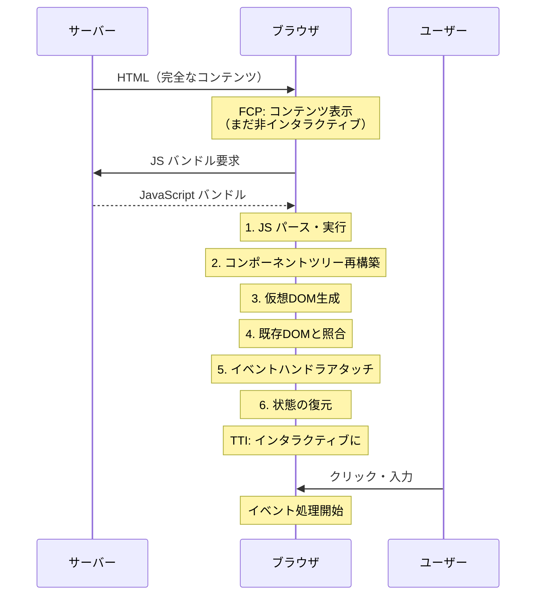

Full Hydration では、以下のステップが順番に実行される。

**ステップ1: HTMLのパースと表示**

ブラウザはサーバーから受け取ったHTMLをパースし、DOMツリーを構築して画面に表示する。この時点でユーザーはコンテンツを「見る」ことができるが、ボタンを押しても何も起こらない。

**ステップ2: JavaScriptバンドルのダウンロード・パース・実行**

`<script>` タグで参照されたJavaScriptバンドルをダウンロードし、ブラウザのJavaScriptエンジンがパース・コンパイル・実行する。

**ステップ3: コンポーネントツリーの再構築**

ReactやVueなどのフレームワークが、アプリケーション全体のコンポーネントツリーをクライアント側で再構築する。これは事実上、サーバーで行ったレンダリングと同じ処理をもう一度クライアントで繰り返すことを意味する。

**ステップ4: 仮想DOMとの照合（Reconciliation）**

クライアント側で生成した仮想DOMと、すでにブラウザに存在する実際のDOMを照合し、一致していることを確認する。不一致がある場合は警告を出すか、クライアント側の結果で上書きする。

**ステップ5: イベントハンドラのアタッチ**

各DOM要素に対して、`onClick`、`onChange`、`onSubmit` などのイベントリスナーを登録する。

**ステップ6: 状態の復元**

サーバーでレンダリング時に使用した状態（`useState` の初期値、データフェッチの結果など）をクライアント側に復元する。通常、サーバーはシリアライズされた状態データをHTMLに埋め込み（`<script>` タグ内のJSONなど）、クライアント側でこれを読み取って再利用する。

### 2.2 React における Hydration API

React では、`hydrateRoot` APIを使って Hydration を実行する。

::: code-group

```tsx [Server (Node.js)]
import { renderToString } from "react-dom/server";
import App from "./App";

function handleRequest(req, res) {
  // Render the component tree to an HTML string on the server
  const html = renderToString(<App />);

  // Serialize application state for client-side rehydration
  const initialState = { user: { name: "Alice" }, items: [1, 2, 3] };

  res.send(`
    <!DOCTYPE html>
    <html>
      <head><title>My App</title></head>
      <body>
        <div id="root">${html}</div>
        <script>
          // Embed serialized state for client-side restoration
          window.__INITIAL_STATE__ = ${JSON.stringify(initialState)};
        </script>
        <script src="/bundle.js"></script>
      </body>
    </html>
  `);
}
```

```tsx [Client (Browser)]
import { hydrateRoot } from "react-dom/client";
import App from "./App";

// Read the server-serialized state
const initialState = window.__INITIAL_STATE__;

// Hydrate: attach event handlers and restore state
// to the server-rendered DOM
hydrateRoot(
  document.getElementById("root"),
  <App initialState={initialState} />
);
```

:::

`hydrateRoot` は `createRoot` とは異なり、既存のDOMノードを破棄せずに再利用する。内部的には仮想DOMツリーを構築し、既存のDOMノードと照合しながらイベントリスナーをアタッチしていく。

### 2.3 Hydration Mismatch

サーバーとクライアントで生成されるDOMが一致しない場合、**Hydration Mismatch** が発生する。

```tsx
function CurrentTime() {
  // Server and client will render different values
  // because they execute at different times
  return <p>{new Date().toISOString()}</p>;
}
```

上記のようなコンポーネントは、サーバーとクライアントで異なるタイムスタンプを生成するため、Hydration Mismatch が発生する。React 18 では、Mismatch を検出すると開発モードで警告を出し、可能な場合はクライアント側の値で上書きする。ただし、この上書き処理自体にもコストがかかる。

::: warning Hydration Mismatch の典型的な原因
- `Date.now()` や `Math.random()` など、サーバーとクライアントで異なる値を返す関数
- ブラウザ固有のAPI（`window.innerWidth` など）をレンダリングに使用
- HTMLの文法違反（`<p>` の中に `<div>` を入れるなど）によるブラウザの自動補正
- 拡張機能やブラウザの自動翻訳によるDOM改変
:::

## 3. Full Hydration の課題

### 3.1 「二重レンダリング」のコスト

Full Hydration の最も根本的な問題は、**アプリケーション全体を事実上2回レンダリングしている**ことだ。サーバー側で一度レンダリングした内容を、クライアント側でもう一度「再現」する必要がある。

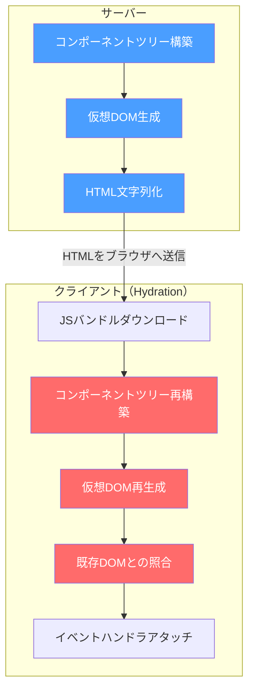

赤色で示した部分が、クライアント側で「やり直している」処理である。サーバーで一度行った計算を、クライアントでもう一度行うのは本質的に無駄だ。

### 3.2 TTI（Time to Interactive）の悪化

ユーザーにとってもっとも深刻な問題は、**コンテンツは見えているのに操作できない時間帯**が生じることだ。この現象は「Uncanny Valley（不気味の谷）」と呼ばれることがある。

```mermaid
gantt
    title SSR + Full Hydration のタイムライン
    dateFormat X
    axisFormat %s

    section ネットワーク
    HTML ダウンロード          :done, html, 0, 1
    JS バンドルダウンロード     :active, js, 1, 4

    section ブラウザ処理
    HTML パース・表示          :done, parse, 1, 2
    JS パース                 :crit, jsparse, 4, 5
    Hydration 実行            :crit, hydrate, 5, 8

    section ユーザー体験
    コンテンツ表示（FCP）      :milestone, fcp, 2, 2
    インタラクティブ（TTI）    :milestone, tti, 8, 8
```

上の図で示されるように、FCPとTTIの間に大きなギャップが生じる。コンテンツは2秒目に表示されるが、ユーザーが実際にインタラクションできるようになるのは8秒後だ。この間にユーザーがボタンをクリックしても何も反応しない。

> [!CAUTION]
> SSRを導入するとFCPは改善されるが、TTIは改善されないどころか悪化することすらある。Hydration 処理自体がメインスレッドを占有し、ユーザー入力の処理がブロックされるためだ。特にモバイルデバイスでは、JavaScriptの実行速度がデスクトップの3〜5倍遅いため、この問題は深刻化する。

### 3.3 JavaScriptバンドルサイズの問題

Full Hydration では、すべてのコンポーネントのJavaScriptコードをクライアントに送信する必要がある。仮にページ全体の90%が静的なコンテンツ（見出し、段落、画像など）で、インタラクティブな要素が10%しかなくても、100%のコンポーネントコードがバンドルに含まれる。

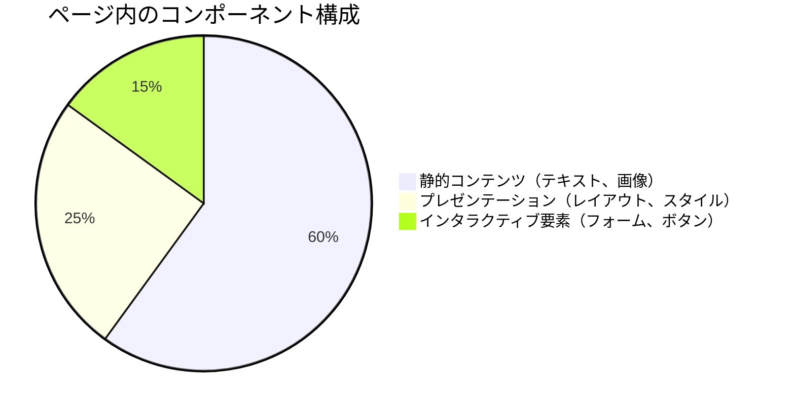

Full Hydration では、この円グラフの全領域に対応するJavaScriptが必要だ。しかし実際にイベントハンドラが必要なのは15%だけである。残りの85%のコードは、「Hydration のために一度実行するだけ」で、その後は使われない。

### 3.4 メモリ使用量

Hydration プロセスでは、コンポーネントツリー全体の仮想DOMが一時的にメモリ上に展開される。大規模なアプリケーションでは、これが数十MBに達することもある。モバイルデバイスのメモリ制約を考えると、この問題は無視できない。

## 4. Hydration 課題への段階的な改善

### 4.1 Progressive Hydration

Full Hydration の課題に対する最初のアプローチが **Progressive Hydration**（段階的 Hydration）だ。ページ全体を一度に Hydrate するのではなく、コンポーネントごとに段階的に Hydration を実行する。

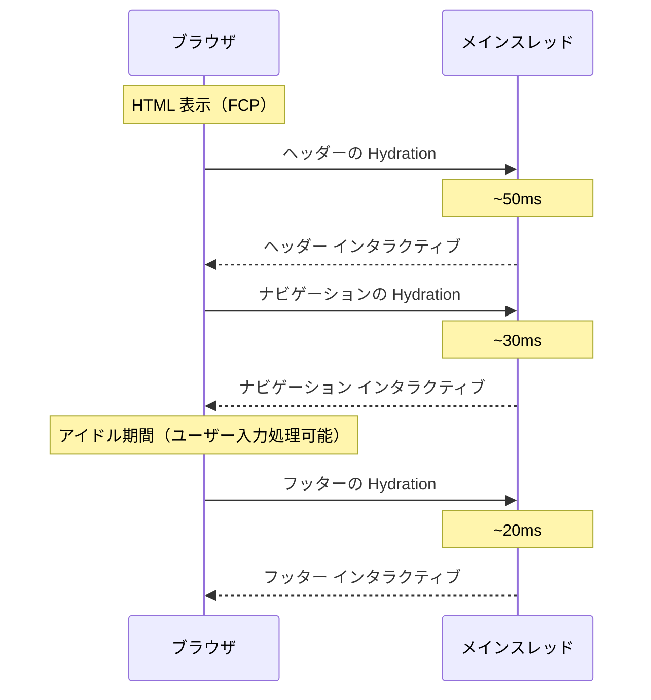

Progressive Hydration の利点は、メインスレッドを長時間ブロックしないことだ。各コンポーネントの Hydration を小さなタスクに分割し、ブラウザが合間にユーザー入力を処理できるようにする。ただし、最終的にはすべてのコンポーネントを Hydrate する必要があるため、全体のJavaScript量は削減されない。

### 4.2 Lazy Hydration（遅延 Hydration）

Lazy Hydration は、Progressive Hydration をさらに発展させたアプローチだ。ビューポートに表示されていないコンポーネントや、ユーザーがインタラクションするまで必要ないコンポーネントの Hydration を遅延させる。

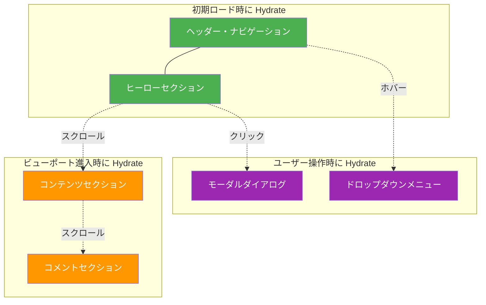

Lazy Hydration のトリガーには以下のような戦略がある。

| トリガー | 説明 | 適用例 |
|---------|------|--------|
| Viewport（Intersection Observer） | 要素がビューポートに入ったとき | 画面下部のコンテンツ |
| Interaction（クリック/ホバー） | ユーザーが操作したとき | モーダル、ドロップダウン |
| Idle（requestIdleCallback） | ブラウザがアイドル状態のとき | 優先度の低いウィジェット |
| Media Query | 特定の画面サイズのとき | レスポンシブ要素 |
| Never | Hydrate しない | 完全に静的なコンテンツ |

## 5. Partial Hydration（部分的 Hydration）

### 5.1 Islands Architecture の登場

Lazy Hydration は「いつ Hydrate するか」を制御するが、最終的にはすべてのコンポーネントを Hydrate する。これに対して **Partial Hydration** は、「何を Hydrate するか」を根本的に再考するアプローチだ。

Partial Hydration の代表的な実装パターンが **Islands Architecture**（アイランドアーキテクチャ）である。ページの大部分を静的なHTMLとし、インタラクティブな部分だけを「島（Island）」として独立させ、その島だけを Hydrate する。

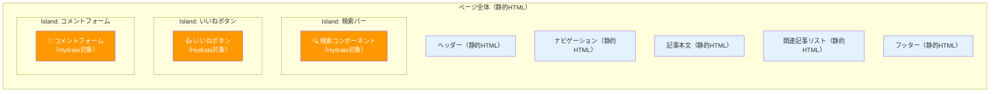

上の図で、水色の部分は純粋な静的HTMLであり、JavaScriptを一切必要としない。オレンジ色の「Island」だけがJavaScriptを必要とし、それぞれ独立して Hydrate される。

### 5.2 Islands Architecture のメリット

**JavaScriptの大幅な削減**: ページ全体のうち、インタラクティブな Island のコードだけをクライアントに送信すればよい。典型的なコンテンツサイトでは、ページのJavaScript量が80〜90%削減されることもある。

**独立した Hydration**: 各 Island は独立して Hydrate されるため、1つの Island のエラーが他の Island に波及しない。また、各 Island の優先度を個別に制御できる。

**パフォーマンスの予測可能性**: Island 単位でJavaScriptの量が決まるため、ページにコンテンツを追加してもJavaScript量が比例して増加しない。静的コンテンツをいくら追加しても、JavaScriptのコストは変わらない。

### 5.3 Astro の実装

Islands Architecture を最も積極的に推進しているフレームワークが **Astro** だ。Astro はデフォルトでゼロJavaScriptのHTMLを生成し、明示的に指定したコンポーネントだけを Island として Hydrate する。

```astro
---
// This runs only on the server at build time
import Header from './Header.astro';        // Static: no JS shipped
import SearchBar from './SearchBar.tsx';      // Interactive island
import ArticleBody from './ArticleBody.astro'; // Static: no JS shipped
import LikeButton from './LikeButton.tsx';    // Interactive island
import Footer from './Footer.astro';          // Static: no JS shipped
---

<html>
  <body>
    <!-- Static: rendered as plain HTML, zero JS -->
    <Header />

    <!-- Island: hydrated on page load -->
    <SearchBar client:load />

    <!-- Static: no JS needed -->
    <ArticleBody />

    <!-- Island: hydrated when visible in viewport -->
    <LikeButton client:visible />

    <!-- Static -->
    <Footer />
  </body>
</html>
```

Astro の `client:*` ディレクティブは、各 Island の Hydration 戦略を宣言的に指定する。

| ディレクティブ | 動作 |
|--------------|------|
| `client:load` | ページロード時に即座に Hydrate |
| `client:idle` | ブラウザがアイドル状態になったら Hydrate |
| `client:visible` | ビューポートに表示されたら Hydrate |
| `client:media="(query)"` | メディアクエリに一致したら Hydrate |
| `client:only="react"` | SSRせず、クライアントのみでレンダリング |
| （指定なし） | Hydrate しない（HTMLのみ出力） |

> [!TIP]
> Astro は「マルチフレームワーク」に対応しており、同一ページ内で React、Vue、Svelte、Solid などの異なるフレームワークで書かれた Island を混在させることができる。各 Island は独立しているため、フレームワーク間の干渉は起きない。

### 5.4 Islands Architecture の制約

Islands Architecture は強力なアプローチだが、いくつかの制約がある。

**Island 間の状態共有が困難**: 各 Island は独立しているため、Island 間で状態を共有するにはグローバルストア（nanostores など）やDOM属性を介する必要がある。Reactの Context API のようなコンポーネントツリーに依存する仕組みは使えない。

**コンポーネントの境界設計が重要**: どこを Island にするかの判断はアーキテクチャ設計の問題であり、後から変更するのが難しい場合がある。

**フレームワークのランタイムは Island ごとに必要**: React を使った Island が3つあれば、React ランタイム自体は1つだが、各 Island のためのコンポーネントコードはそれぞれ必要になる。

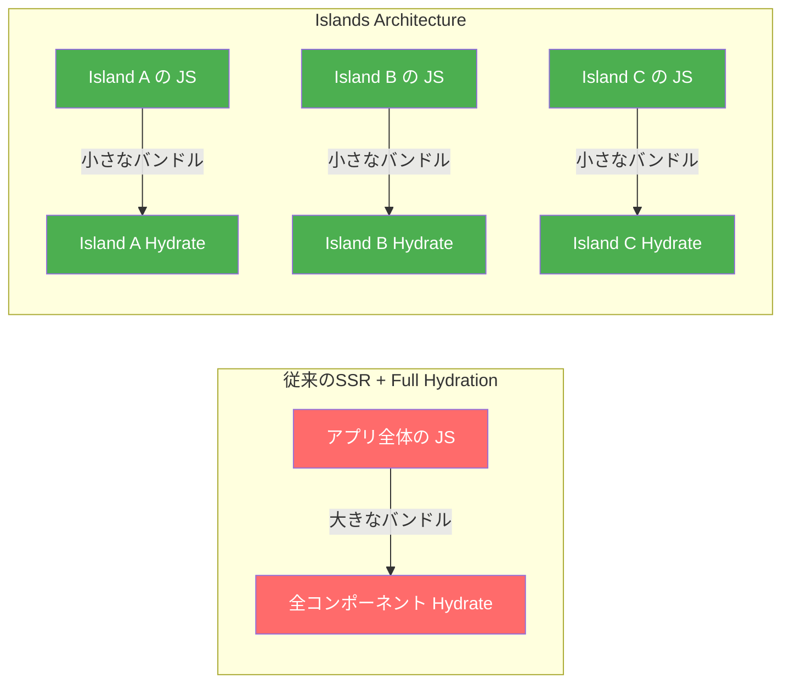

## 6. React Server Components（RSC）による Hydration の部分化

### 6.1 RSC の基本概念

React Server Components（RSC）は、Partial Hydration を React のコンポーネントモデルの中に組み込んだ仕組みだ。Islands Architecture がページレベルで「静的かインタラクティブか」を分けるのに対し、RSC はコンポーネントレベルで「サーバーコンポーネントかクライアントコンポーネントか」を分ける。

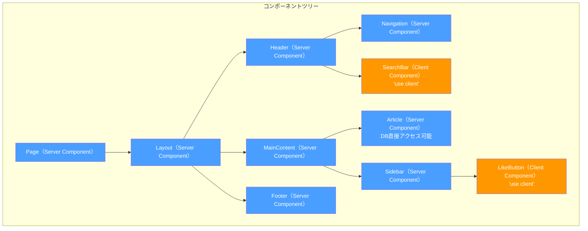

Server Component（青）はサーバーでのみ実行され、そのJavaScriptコードはクライアントに送信されない。Client Component（オレンジ）だけがバンドルに含まれ、Hydration の対象となる。

### 6.2 Server Component と Client Component の違い

::: code-group

```tsx [Server Component]
// No 'use client' directive — this is a Server Component
// Runs only on the server, JS is NOT shipped to the client

import { db } from "./database";

async function ArticlePage({ id }: { id: string }) {
  // Can directly access databases, file system, etc.
  const article = await db.articles.findUnique({ where: { id } });

  // Can use server-only libraries (no bundle size impact)
  const rendered = markdownToHtml(article.content);

  return (
    <article>
      <h1>{article.title}</h1>
      <div dangerouslySetInnerHTML={{ __html: rendered }} />
      {/* Client Component embedded within Server Component */}
      <LikeButton articleId={id} initialCount={article.likes} />
    </article>
  );
}
```

```tsx [Client Component]
"use client";
// This directive marks the component as a Client Component
// Its JS IS shipped to the client and hydrated

import { useState } from "react";

function LikeButton({
  articleId,
  initialCount,
}: {
  articleId: string;
  initialCount: number;
}) {
  // Can use hooks, event handlers, browser APIs
  const [count, setCount] = useState(initialCount);
  const [liked, setLiked] = useState(false);

  async function handleLike() {
    setLiked(true);
    setCount((c) => c + 1);
    await fetch(`/api/articles/${articleId}/like`, { method: "POST" });
  }

  return (
    <button onClick={handleLike} disabled={liked}>
      {liked ? "Liked" : "Like"} ({count})
    </button>
  );
}
```

:::

### 6.3 RSC と Islands Architecture の比較

RSC と Islands Architecture はどちらも「必要な部分だけを Hydrate する」という目標を共有しているが、アプローチが異なる。

| 特性 | Islands Architecture | React Server Components |
|------|---------------------|------------------------|
| 粒度 | ページ内の明示的な Island | コンポーネント単位 |
| ツリー構造 | Island は独立（フラット） | Server/Client がネスト可能 |
| 状態共有 | グローバルストア経由 | props を通じた自然な共有 |
| フレームワーク | Astro、Fresh など | React（Next.js App Router） |
| 学習コスト | 比較的低い | 中〜高（メンタルモデルの転換） |
| データフェッチ | 各 Island が独立して取得 | Server Component で直接アクセス |

RSC の重要な特徴は、Server Component と Client Component がツリー内でネストできることだ。Server Component の子として Client Component を配置でき、さらにその Client Component の children として Server Component の出力を渡すこともできる（ただし Client Component 内で Server Component を import することはできない）。

## 7. Resumability — Hydration を根本からなくす

### 7.1 Hydration の本質的な非効率性

ここまで見てきた改善アプローチ（Progressive、Lazy、Partial、Islands、RSC）は、Hydration のコストを「削減」するものだった。しかし、**Qwik** フレームワークの作者である Misko Hevery は、より根本的な問いを投げかけた。

> 「そもそも Hydration は必要なのか？サーバーが行った作業を、なぜクライアントでやり直す必要があるのか？」

Hydration のプロセスを注意深く分析すると、その本質は「サーバーで得られた情報の再発見」であることがわかる。

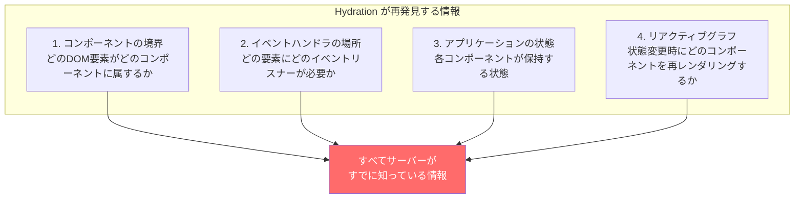

これらの情報はすべて、サーバーがHTMLを生成する過程で「すでに計算済み」だ。Hydration はこの情報を「捨てて、再計算する」プロセスに他ならない。

### 7.2 Resumability の概念

**Resumability**（再開可能性）は、サーバーでの実行を「一時停止」し、クライアントで「再開」するというパラダイムだ。Hydration が「やり直し（Replay）」であるのに対し、Resumability は「続き（Resume）」である。

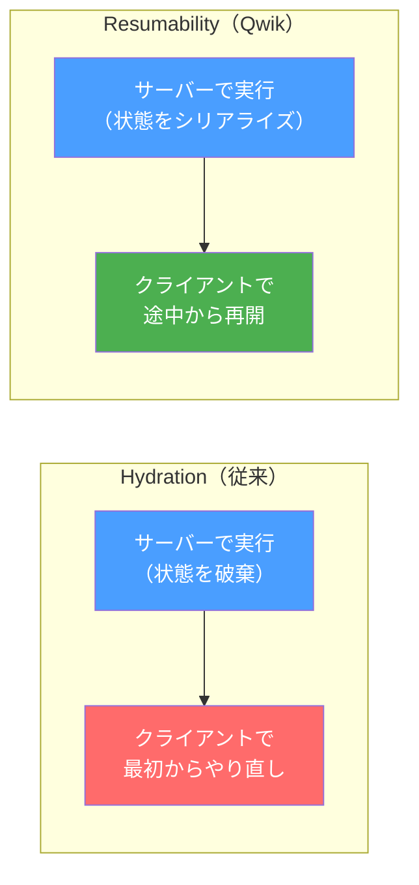

Resumability を実現するために、Qwik は以下の3つの情報をHTMLにシリアライズして埋め込む。

1. **リスナー情報**: どのDOM要素にどのイベントハンドラが必要か
2. **コンポーネント境界**: コンポーネントツリーの構造
3. **アプリケーション状態**: 各コンポーネントの状態とリアクティブグラフ

### 7.3 Qwik のアーキテクチャ

Qwik は Resumability を実現するために、従来のフレームワークとは根本的に異なるアーキテクチャを採用している。

**`$` による遅延ロード境界**

Qwik では、`$` サフィックスを持つ関数がコードの「分割ポイント」を示す。ビルド時にオプティマイザがこれらの境界でコードを自動的に分割し、必要になるまでロードしない。

```tsx
import { component$, useSignal } from "@builder.io/qwik";

// component$ marks a lazy-loadable component boundary
export const Counter = component$(() => {
  const count = useSignal(0);

  return (
    <div>
      <p>Count: {count.value}</p>
      {/* Event handler is lazy-loaded only when the button is clicked */}
      <button onClick$={() => count.value++}>
        Increment
      </button>
    </div>
  );
});
```

上記のコードでは、`onClick$` のハンドラ関数はクリックされるまでブラウザにダウンロードすらされない。

**サーバー出力のHTML**

Qwik のサーバーが生成するHTMLは、通常のフレームワークとは大きく異なる。

```html
<!-- Qwik server output (simplified) -->
<div q:container="paused" q:version="1.x">
  <div>
    <p>Count: 0</p>
    <!--
      on:click attribute contains a reference to the handler code chunk.
      The actual JS is NOT loaded until the button is clicked.
    -->
    <button on:click="chunk-abc.js#s_onClick">
      Increment
    </button>
  </div>
  <!-- Serialized application state -->
  <script type="qwik/json">
    {"refs":{"0":"0"},"objs":["0"],"subs":[]}
  </script>
  <!-- Global event listener that intercepts all events -->
  <script>
    /* Qwikloader: ~1KB inline script that sets up global event delegation */
  </script>
</div>
```

ここで注目すべき点がいくつかある。

- `q:container="paused"`: コンテナが「一時停止」状態であることを示す
- `on:click="chunk-abc.js#s_onClick"`: イベントハンドラの参照をHTML属性として埋め込んでいる。実際のコードはまだロードされていない
- `<script type="qwik/json">`: アプリケーション状態がシリアライズされてHTMLに埋め込まれている
- Qwikloader（約1KB）: すべてのイベントをインターセプトするグローバルリスナー

### 7.4 Qwik のイベント処理フロー

ユーザーがボタンをクリックしたときの処理フローを詳しく見てみる。

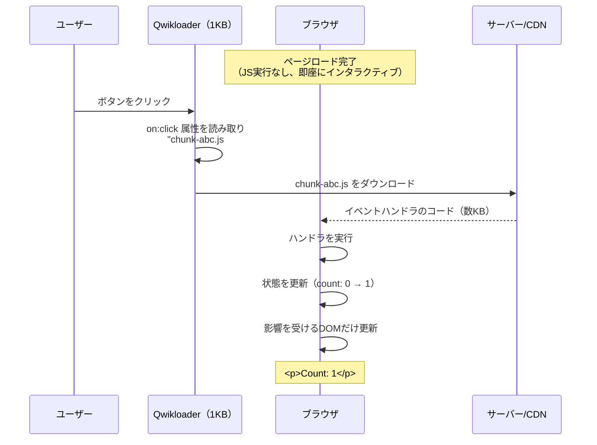

重要なのは、**ユーザーが操作するまでJavaScriptが一切実行されない**ことだ。ページロード時のJavaScript実行量は事実上ゼロ（Qwikloader の約1KBのみ）である。

### 7.5 Fine-Grained Lazy Loading

従来のフレームワークでは、コード分割は「ルート単位」や「コンポーネント単位」で行われる。React.lazy() やルートベースの動的 import がその例だ。しかし Qwik は、これをさらに細かい粒度で行う。

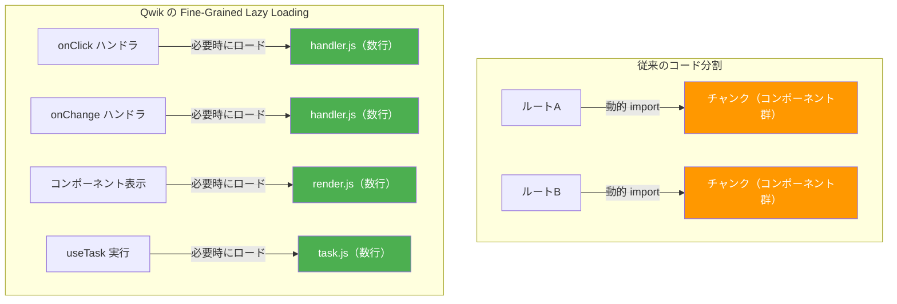

Qwik のオプティマイザは、`$` サフィックスの位置でコードを自動的に分割し、個別のチャンクとして出力する。イベントハンドラ、コンポーネントのレンダリング関数、副作用（useTask）がそれぞれ独立したチャンクになる。

### 7.6 Hydration vs Resumability の本質的な違い

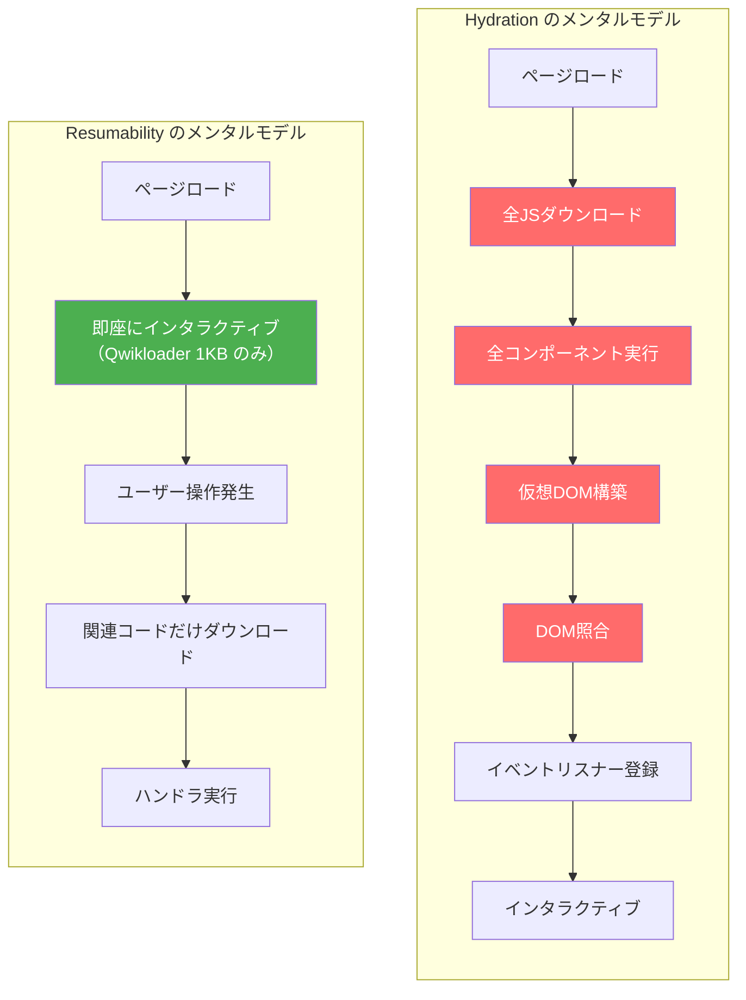

| 特性 | Hydration | Resumability |
|------|-----------|-------------|
| ページロード時のJS実行 | コンポーネント全体を再実行 | ほぼゼロ（Qwikloader のみ） |
| TTI | JSバンドルサイズに比例して遅延 | ほぼ即座 |
| 初回インタラクションの遅延 | なし（Hydration完了後） | ハンドラのダウンロード分の遅延 |
| JSバンドルの配信 | 一括または数チャンク | 必要な関数単位で細分化 |
| アプリケーションサイズへの依存 | 大きい（O(n)で増加） | 小さい（O(1)に近い） |

> [!NOTE]
> Resumability の「初回インタラクションの遅延」は、ネットワークレイテンシとハンドラコードのダウンロード時間に依存する。しかし、個々のチャンクは非常に小さい（数KB程度）ため、実際には人間が知覚できないほど短い遅延で済むことが多い。また、Qwik はユーザーの行動を予測してプリフェッチする仕組みも備えている。

## 8. Streaming SSR と Selective Hydration

### 8.1 React 18 の Streaming SSR

Hydration の課題に対するもう1つの重要なアプローチが、React 18 で導入された **Streaming SSR** と **Selective Hydration** の組み合わせだ。

従来のSSRでは、サーバーはページ全体のHTMLを生成してから一括で送信していた。Streaming SSR では、HTMLを生成しながら段階的にブラウザへストリームする。

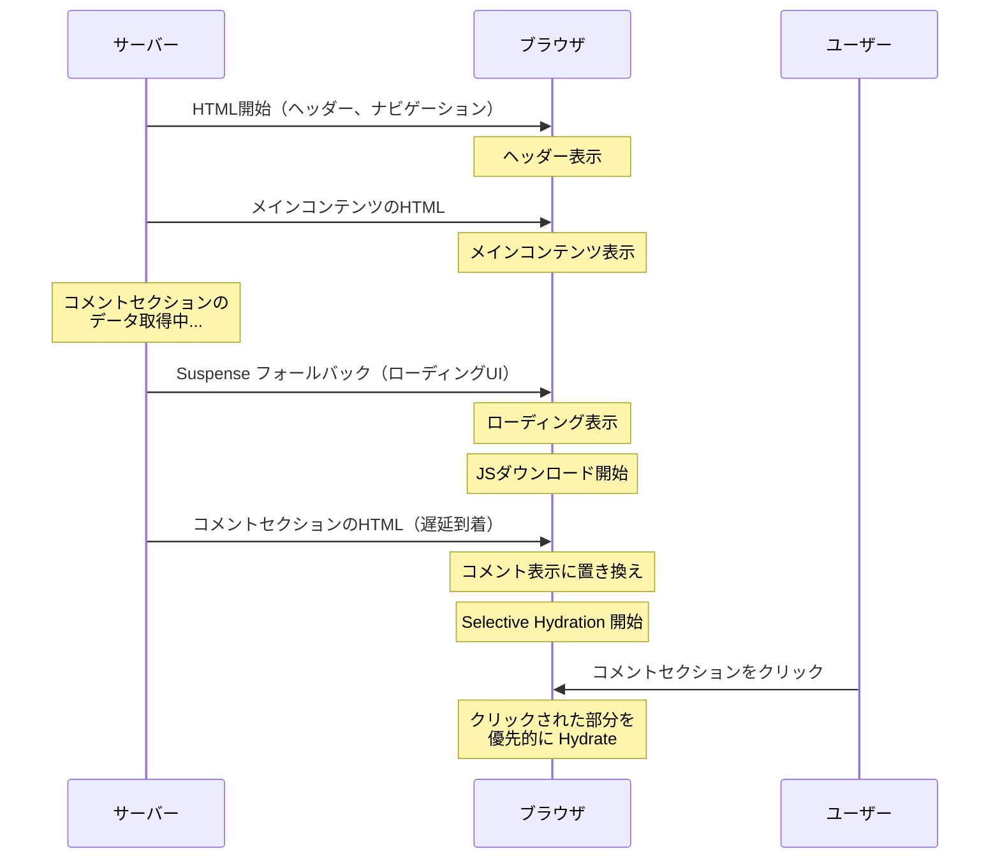

### 8.2 Suspense と Selective Hydration

React 18 の `<Suspense>` は、SSRとHydrationの両方で重要な役割を果たす。

```tsx
import { Suspense } from "react";

function Page() {
  return (
    <div>
      {/* This part is rendered and hydrated immediately */}
      <Header />
      <MainContent />

      {/* This part can be streamed later and hydrated independently */}
      <Suspense fallback={<CommentsSkeleton />}>
        <Comments />
      </Suspense>

      {/* Another independent hydration boundary */}
      <Suspense fallback={<SidebarSkeleton />}>
        <Sidebar />
      </Suspense>
    </div>
  );
}
```

**Selective Hydration** のポイントは以下のとおりだ。

1. `<Suspense>` 境界で囲まれた各セクションは、独立して Hydrate できる
2. ユーザーがまだ Hydrate されていない部分をクリックすると、React はその部分の Hydration を最優先で実行する
3. 複数の Suspense 境界がある場合、React はユーザーが操作した箇所を優先する

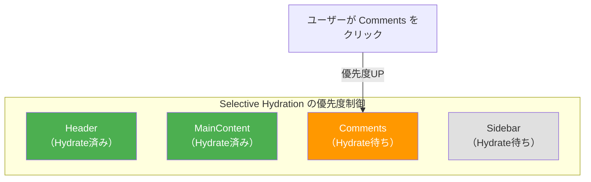

Selective Hydration は Full Hydration の改善であり、最終的にはすべてのコンポーネントが Hydrate される。しかし、ユーザーが実際に操作しようとしている部分を優先することで、体感的なインタラクティビティを大幅に向上させる。

## 9. 各アプローチの比較と選択指針

### 9.1 総合比較

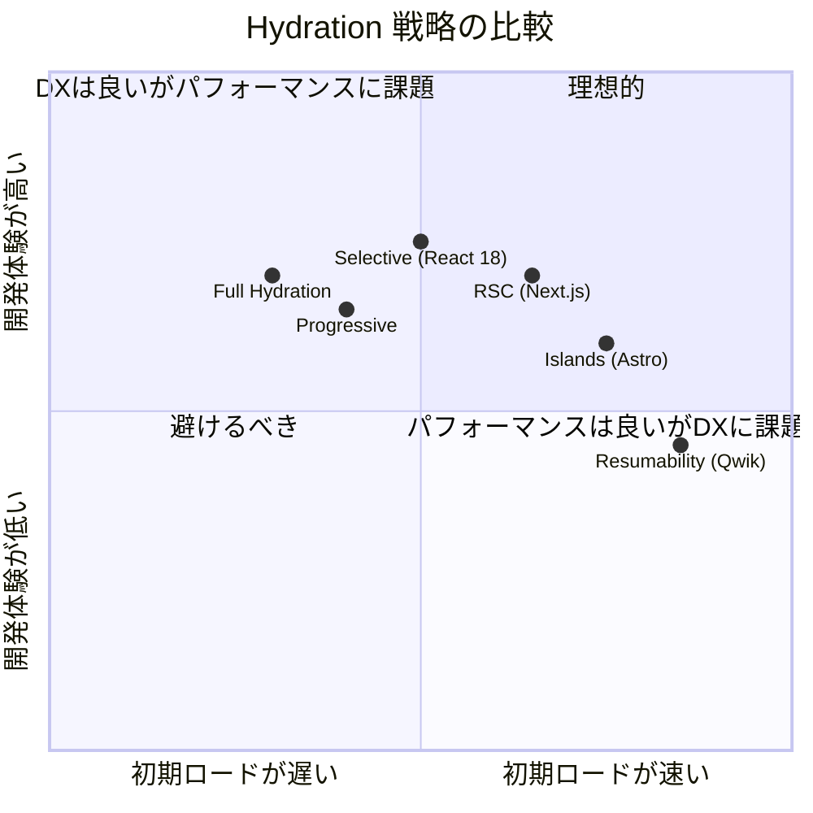

| 特性 | Full Hydration | Islands | RSC | Resumability |
|------|---------------|---------|-----|-------------|
| 代表的な実装 | React + Next.js (Pages Router) | Astro, Fresh | Next.js (App Router) | Qwik |
| ページロード時のJS | 全コンポーネント | Island分のみ | Client Component分のみ | ほぼゼロ |
| TTI | 遅い | 速い | 中程度 | 非常に速い |
| コンポーネント間の状態共有 | 容易 | 困難 | 容易 | 容易 |
| エコシステム | 非常に充実 | 成長中 | 充実 | 発展途上 |
| 適用範囲 | 汎用 | コンテンツ中心 | 汎用 | 汎用 |
| 学習コスト | 低い | 低い | 中程度 | 高い |

### 9.2 アプリケーション特性に応じた選択

**コンテンツサイト（ブログ、ドキュメント、ニュース）**

インタラクティブな要素が少なく、コンテンツの表示が主目的の場合は、**Islands Architecture（Astro）** が最適だ。ページの大部分が静的HTMLとなり、JavaScriptの配信量を最小限に抑えられる。

**Eコマースサイト**

商品一覧は静的に近いが、カート操作やフィルタリングなどのインタラクションが必要な場合は、**RSC（Next.js App Router）** や **Qwik** が適している。商品表示はServer Componentで、カートや検索はClient Componentで実装できる。

**ダッシュボード・管理画面**

ページ全体が高度にインタラクティブな場合、Partial Hydrationのメリットは限定的だ。**Full Hydration + コード分割**や**RSC**が実用的な選択肢となる。

**大規模Eコマース・メディアサイト**

パフォーマンスが直接的にビジネスメトリクス（コンバージョン率、直帰率）に影響する場合、**Resumability（Qwik）** の「ページロード時のJS実行ゼロ」は非常に魅力的だ。ただし、エコシステムの成熟度を考慮する必要がある。

### 9.3 実際のパフォーマンス影響

Hydration 戦略の選択がパフォーマンスに与える影響を、典型的なシナリオで概算する。

::: details パフォーマンス概算シナリオ

**前提条件**:
- ページ全体で100個のコンポーネント
- うちインタラクティブなコンポーネント: 10個
- 全JSバンドルサイズ: 300KB（gzip後）
- モバイルデバイスでのJS実行速度: デスクトップの1/3

| メトリクス | Full Hydration | Islands | Resumability |
|-----------|---------------|---------|-------------|
| ダウンロードJS | 300KB | 50KB | ~1KB（初期） |
| Hydration時のJS実行時間（モバイル） | ~3秒 | ~0.5秒 | ~0秒 |
| FCP → TTI のギャップ | ~4秒 | ~1秒 | ~0秒 |
| 初回インタラクション応答 | 即座 | 即座 | ~100ms（コード取得） |

:::

## 10. 今後の展望

### 10.1 Partial Prerendering（PPR）

Next.js 14 で実験的に導入された **Partial Prerendering（PPR）** は、SSGの高速性とSSRの動的性を1つのHTTPレスポンスで両立させる試みだ。ページの静的な「シェル」をビルド時に生成してCDNにキャッシュしつつ、動的な部分（Suspense境界の中身）をリクエスト時にストリーミングする。

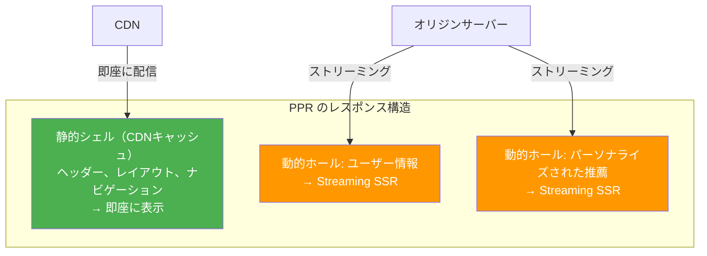

PPR は Hydration の問題を直接解決するものではないが、静的部分を可能な限り増やすことで、Hydration が必要な範囲を狭める効果がある。

### 10.2 Resumability の進化

Qwik の Resumability は、Hydration に対する最も根本的な挑戦だが、まだ発展途上にある。現在の課題として、以下のようなものがある。

- **エコシステムの成熟度**: React/Vue/Svelteと比較してライブラリやツールが少ない
- **開発者の学習曲線**: `$` によるコード分割境界の概念は直感的でない場合がある
- **プリフェッチ戦略の最適化**: ユーザーの行動を予測してコードを先読みする仕組みの精度向上

しかし、Resumability の根本的なアイデア -- 「サーバーで得た知識をクライアントに引き継ぐ」 -- は今後のフレームワーク設計に大きな影響を与えるだろう。実際に、他のフレームワークも部分的に Resumability の概念を取り入れ始めている。

### 10.3 Server Actions と Server Functions

React の Server Actions や Qwik の server$ のように、サーバーとクライアントの境界をより透過的に扱う仕組みが広がっている。これらはクライアント側のJavaScriptの量を削減し、Hydration のコストを下げる方向に寄与する。

```tsx
// React Server Action example
async function addToCart(formData: FormData) {
  "use server";
  // This function runs on the server
  // even though it's called from a client component
  const productId = formData.get("productId");
  await db.cart.add({ productId, userId: getCurrentUser() });
  revalidatePath("/cart");
}

function AddToCartButton({ productId }: { productId: string }) {
  return (
    <form action={addToCart}>
      <input type="hidden" name="productId" value={productId} />
      <button type="submit">Add to Cart</button>
    </form>
  );
}
```

Server Actions を活用すると、フォーム送信のような処理でクライアントサイドのJavaScriptが不要になるケースが増える。これは Progressive Enhancement の現代的な実装とも言える。

### 10.4 Web 標準への回帰

興味深いトレンドとして、Hydration の課題に対処するために Web 標準の機能を再評価する動きがある。HTML のネイティブな `<form>` 要素、`<dialog>` 要素、CSS の `:has()` セレクタ、View Transitions API などを活用することで、JavaScript なしで実現できるインタラクションが増えている。

これは「JavaScriptで何もかも実装する」SPAの時代からの揺り戻しとも言える。サーバーサイドのHTMLレンダリングとブラウザのネイティブ機能を最大限に活用し、本当に必要な箇所にだけJavaScriptを使うという設計思想は、Islands Architecture や Resumability と共鳴する。

## 11. まとめ

Hydration は、SSRの恩恵（高速な初期表示、SEO）とSPAの恩恵（リッチなインタラクション）を両立させるために生まれた技術だ。しかし、Full Hydration は「サーバーで行った作業をクライアントでやり直す」という本質的な非効率を抱えている。

この課題に対して、以下のようなアプローチが提案されてきた。

1. **Progressive / Lazy Hydration**: Hydration のタイミングを制御し、メインスレッドのブロックを軽減する
2. **Islands Architecture（Partial Hydration）**: インタラクティブな「島」だけを Hydrate し、JavaScriptの量を大幅に削減する
3. **React Server Components**: コンポーネントレベルでサーバー/クライアントを分離し、柔軟にJavaScriptを削減する
4. **Selective Hydration**: ユーザーが操作しようとしている部分を優先的に Hydrate する
5. **Resumability**: Hydration を根本からなくし、サーバーの作業をクライアントで「再開」する

これらのアプローチは排他的ではなく、組み合わせて使用されることも多い。たとえば、Next.js の App Router は RSC と Selective Hydration を組み合わせている。

重要なのは、アプリケーションの特性（コンテンツ中心かインタラクション中心か、パフォーマンス要件、チームの技術スタック）に応じて適切なアプローチを選択することだ。万能な解決策は存在しないが、「ページロード時に本当に必要なJavaScriptだけをクライアントに送る」という原則は、どのアプローチにも共通する指導原理である。
