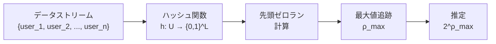
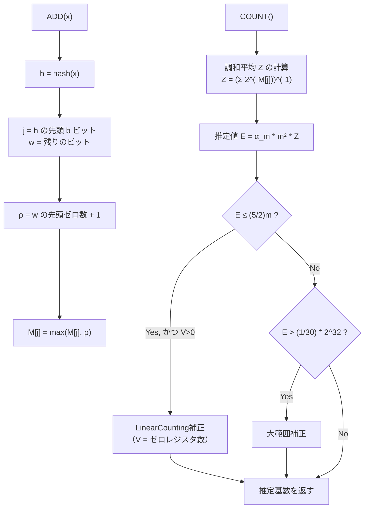
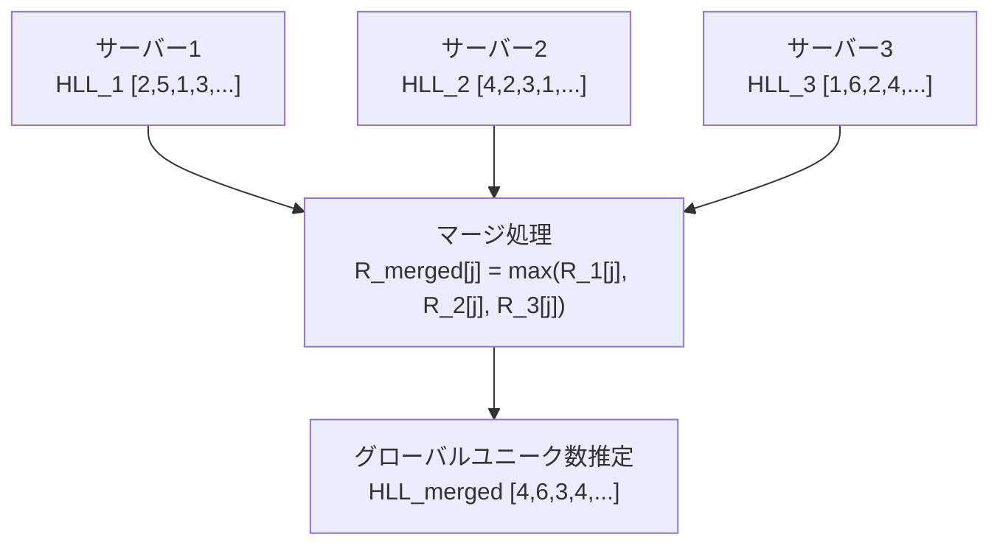
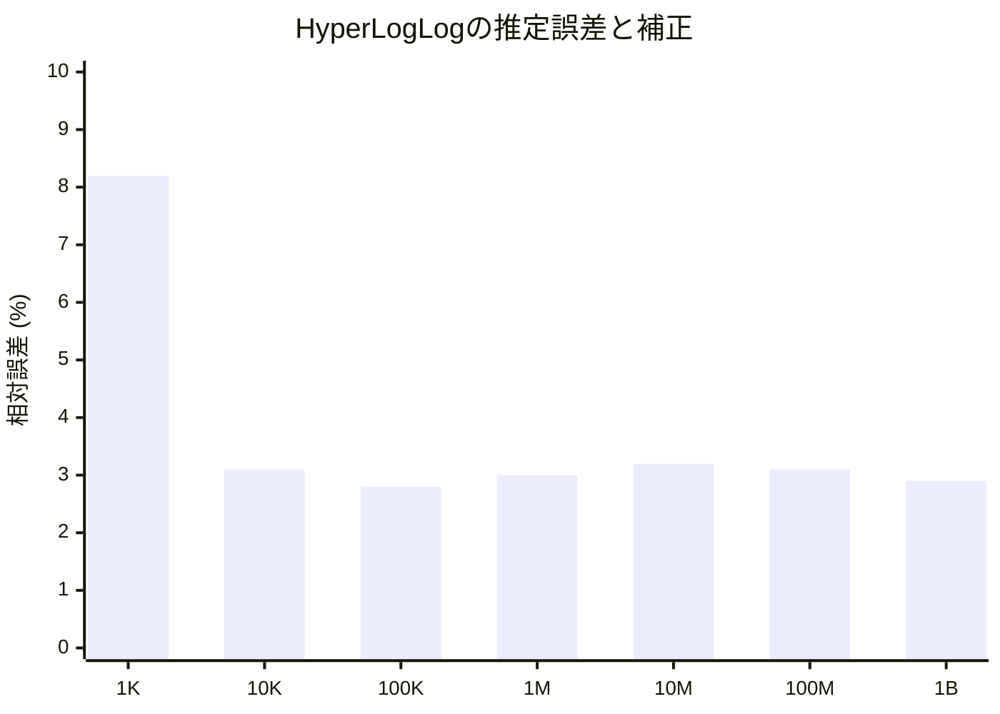
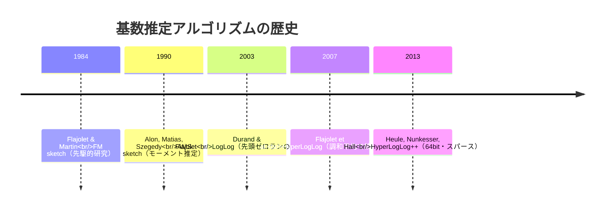
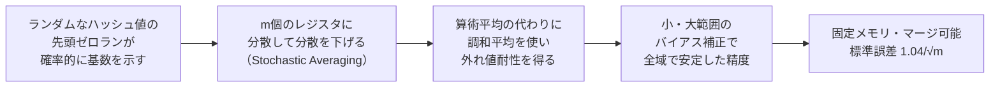

# HyperLogLog — 基数推定の仕組み（Redis, BigQuery での活用）

## 1. 基数推定問題とは何か

### 1.1 問題の定義

**基数推定（Cardinality Estimation）**とは、データストリームや大規模なデータセットにおいて、**ユニーク要素の数（基数: cardinality）を近似的に求める**問題である。

具体的な例を挙げよう。

- 過去24時間にあるWebサービスを訪問したユニークユーザー数は何人か
- 今日処理したログエントリの中に、ユニークなIPアドレスは何種類あるか
- ある商品のユニーク購入者数はどれくらいか

これらはすべて「重複を取り除いたあとの件数」を問う問いである。集合論的には、観測した要素の全体集合を $S$ とするとき、$|S|$（集合の濃度、すなわち基数）を求める問題に帰着される。

### 1.2 ナイーブな解法とその限界

もっとも直接的な解法は、**ハッシュセット（HashSet）**を使う方法である。要素を見るたびにセットに追加し、最終的なセットのサイズを返す。

```python
# naive approach: use a HashSet to track unique elements
def count_unique_naive(stream):
    seen = set()
    for element in stream:
        seen.add(element)
    return len(seen)
```

この解法は正確だが、致命的な欠点がある。

**メモリ消費がデータ量に比例する。**

たとえば、1億件のユニークユーザーIDを追跡する場合を考えよう。各IDが8バイトの整数だとしても、ハッシュセットのオーバーヘッドを含めると数百MBから数GBのメモリが必要になる。さらに、要素数が事前にわからないストリーム処理の場面では、メモリが際限なく増加するリスクがある。

また、分散システムでは複数のサーバーそれぞれがカウントしており、それらを合算してグローバルなユニーク数を求める必要がある。ハッシュセットを用いる場合、すべてのサーバーから全要素を集約しなければならず、ネットワーク帯域と計算コストが膨大になる。

整理すると、ナイーブな解法の課題は次の3点である。

| 課題 | 内容 |
|------|------|
| メモリ | $O(n)$ 空間が必要（$n$ はユニーク要素数） |
| 合算の困難さ | 分散した結果を統合するにはすべてのデータが必要 |
| ストリーム非適合 | 上限不明なデータを事前割り当てなしに処理できない |

### 1.3 確率的近似という解法

これらの課題を解決するために登場したのが、**確率的データ構造（Probabilistic Data Structure）**を使ったアプローチである。誤差率を許容することで、メモリ使用量を劇的に削減できる。

Bloom Filterが「要素がセットに属するか」を答える問題を扱うのに対し、HyperLogLogは「セットの基数は何か」を答える問題に特化している。

HyperLogLogは、わずか数KBのメモリで数十億件のユニーク数を数%以内の誤差で推定できる。これは、ナイーブなアプローチと比較して1000倍以上のメモリ効率を誇る。

## 2. LogLog カウンタの基本アイデア

### 2.1 ランダム性とビットパターン

HyperLogLogの理解には、まず**LogLogカウンタ**という先行するアルゴリズムの直感を把握する必要がある。

鍵となるアイデアは次の観察である。

> **一様分布するランダムなビット列において、先頭の連続するゼロの最大数は、観測した要素数の対数に比例する。**

具体的に考えよう。各要素を良いハッシュ関数でハッシュし、得られた値を2進数で表現する。このハッシュ値は均一に分布していると仮定する。

- 先頭が `1` で始まる確率: $1/2$
- 先頭が `01` で始まる確率: $1/4$
- 先頭が `001` で始まる確率: $1/8$
- 先頭が `000...0` ($k$ 個の0) で始まる確率: $1/2^k$

```
hash("user_123") → 0b 0011 1010 ...  先頭ゼロラン = 2
hash("user_456") → 0b 1000 0110 ...  先頭ゼロラン = 0
hash("user_789") → 0b 0001 0101 ...  先頭ゼロラン = 3
hash("user_abc") → 0b 0000 0110 ...  先頭ゼロラン = 4
```

先頭に $k$ 個の連続する0が現れる確率は $1/2^k$ である。逆に言えば、先頭ゼロランの最大値が $k$ だったということは、おおよそ $2^k$ 個の要素を観測したことを示唆している。

### 2.2 最大ゼロランによる推定

$n$ 個のユニーク要素があるとき、各要素のハッシュ値の先頭ゼロランを計算し、その最大値を $\rho_{\max}$ とすると：

$$\hat{n} = 2^{\rho_{\max}}$$

がカーディナリティの推定値となる。



しかし、この単純な推定には大きな問題がある。**分散が非常に大きい**のである。たとえば、たった1つの要素のハッシュ値がたまたま先頭に多くのゼロを持っていた場合、推定値は大幅に過大評価される。また、先頭ゼロランは整数値なので、推定値は $1, 2, 4, 8, 16, \ldots$ の離散値にしかならず、精度が粗い。

この問題を解決するためのアイデアが**多重レジスタによる平均化**である。

### 2.3 Stochastic Averaging（確率的平均化）

Flajolet と Durand が2003年の論文 *"Loglog Counting of Large Cardinalities"* で提案したLoglogアルゴリズムでは、入力空間を $m = 2^b$ 個のバケットに分割し、それぞれで独立に最大ゼロランを追跡する。

```
ハッシュ値の構造:
┌──────────────────────────────────────────┐
│ b ビット（バケット番号）  │  残りのビット列  │
└──────────────────────────────────────────┘
   ↓                            ↓
  バケット j を選択       先頭ゼロランを計算
```

$m$ 個のバケット（レジスタ）をそれぞれ $R[0], R[1], \ldots, R[m-1]$ とし、各要素をバケットに振り分けてそのバケットの最大ゼロランを更新する。最終的な推定は各バケットの値を使った平均によって求める。

$$\hat{n} = \alpha_m \cdot m \cdot 2^{\frac{1}{m}\sum_{j=0}^{m-1} R[j]}$$

ここで $\alpha_m$ はバイアス補正定数である。

## 3. HyperLogLog アルゴリズム

### 3.1 LogLog から HyperLogLog へ

Flajolet, Fusy, Gandouet, Meunier は2007年の論文 *"HyperLogLog: the analysis of a near-optimal cardinality estimation algorithm"* において、LogLogアルゴリズムに重要な改良を加えた。

LogLogでは推定量として**算術平均**を使っていた。しかし、少数の外れ値（先頭ゼロランが異常に大きいもの）が全体の推定を大幅に引き上げてしまう問題があった。

HyperLogLogの核心的なアイデアは、**算術平均の代わりに調和平均（Harmonic Mean）を使う**ことである。

$$\hat{n} = \alpha_m \cdot m^2 \cdot \left( \sum_{j=0}^{m-1} 2^{-R[j]} \right)^{-1}$$

調和平均は外れ値の影響を受けにくい。極端に大きな $R[j]$ があっても、$2^{-R[j]}$ は非常に小さくなるため、和への寄与は小さく抑えられる。

### 3.2 アルゴリズムの詳細

HyperLogLogアルゴリズムを正式に定義しよう。

**パラメータ**:
- $b$: バケット数を決めるビット数（$4 \leq b \leq 16$）
- $m = 2^b$: バケット数
- $L$: ハッシュ値のビット長

**データ構造**:
- $M[0..m-1]$: $m$ 個のレジスタ（各レジスタは初期値0の小さな整数）

**ADD（要素の追加）**:

```
function ADD(x):
    h = hash(x)                          // compute hash value
    j = first b bits of h                // extract bucket index
    w = remaining (L - b) bits of h      // extract remaining bits
    rho = position of leftmost 1-bit in w  // count leading zeros + 1
    M[j] = max(M[j], rho)               // update register
```

**COUNT（基数の推定）**:

```
function COUNT():
    Z = (sum of 2^(-M[j]) for j in 0..m-1)^(-1)
    E = alpha_m * m^2 * Z

    // small range correction
    if E <= (5/2) * m:
        V = count of registers M[j] == 0
        if V > 0:
            E = m * log(m / V)   // LinearCounting

    // large range correction
    if E > (1/30) * 2^32:
        E = -2^32 * log(1 - E / 2^32)

    return E
```



### 3.3 バイアス補正定数 α_m

$\alpha_m$ はアルゴリズムの期待値の系統的なバイアスを補正するための定数で、数学的解析によって導出される。

$$\alpha_m = \left( m \int_0^\infty \left( \log_2 \left( \frac{2 + u}{1 + u} \right) \right)^m du \right)^{-1}$$

実用上は以下の近似値が使われる。

$$\alpha_{16} \approx 0.673, \quad \alpha_{32} \approx 0.697, \quad \alpha_{64} \approx 0.709, \quad \alpha_m \approx 0.7213 / (1 + 1.079/m) \text{ for } m \geq 128$$

### 3.4 レジスタの動作例

$m = 4$（$b = 2$）のシンプルな例で動作を追ってみよう。

```
初期状態: M = [0, 0, 0, 0]

hash("alice") = 0b 01 | 001011...   j=1, ρ=3  → M = [0, 3, 0, 0]
hash("bob")   = 0b 10 | 100110...   j=2, ρ=1  → M = [0, 3, 1, 0]
hash("carol") = 0b 00 | 0001010...  j=0, ρ=4  → M = [4, 3, 1, 0]
hash("dave")  = 0b 11 | 011010...   j=3, ρ=2  → M = [4, 3, 1, 2]
hash("eve")   = 0b 01 | 00110...    j=1, ρ=3  → M = [4, 3, 1, 2]（変化なし）

COUNT:
Z = (2^(-4) + 2^(-3) + 2^(-1) + 2^(-2))^(-1)
  = (0.0625 + 0.125 + 0.5 + 0.25)^(-1)
  = (0.9375)^(-1) ≈ 1.0667

E = α_4 * 4^2 * 1.0667 ≈ 0.532 * 16 * 1.0667 ≈ 9.08
```

実際のユニーク数は5だが、レジスタ数が少ないため誤差が大きい。実用では $m = 2^{10} = 1024$ 以上を使う。

## 4. 数学的な誤差分析

### 4.1 標準誤差の理論値

HyperLogLogの優れた特性の一つは、誤差が理論的に解析できることである。

$m$ 個のレジスタを使う場合、推定値の**標準誤差（Standard Error）**は次式で与えられる。

$$\sigma_{\text{rel}} = \frac{1.04}{\sqrt{m}}$$

これは相対的な標準誤差であり、推定値の誤差が真の基数の何%であるかを示す。

```
m = 16    → 標準誤差 ≈ 26%
m = 64    → 標準誤差 ≈ 13%
m = 256   → 標準誤差 ≈  6.5%
m = 1024  → 標準誤差 ≈  3.25%
m = 4096  → 標準誤差 ≈  1.625%
m = 16384 → 標準誤差 ≈  0.81%
```

$m = 1024$（Redisのデフォルトに近い設定）では、標準誤差は約3.25%である。

### 4.2 メモリと精度のトレードオフ

各レジスタは最大で $\log_2(L)$ ビット（$L$ はハッシュ長）を格納すればよい。32ビットハッシュを使う場合、レジスタは最大32の値を持てばよいので、5ビットで十分である。

したがって、HyperLogLogが使用するメモリは：

$$\text{メモリ} = m \times \lceil \log_2(\log_2(L)) \rceil \text{ ビット} = m \times 5 \text{ ビット（32ビットハッシュの場合）}$$

$m = 4096$ の場合、$4096 \times 5 = 20480$ ビット = **2.5 KB** である。

これに対し、1%の標準誤差（$m \approx 10816$）を達成するために必要なメモリは約**6.7 KB**に過ぎない。10億件のユニーク数を追跡しているにもかかわらず。

::: tip メモリ効率の驚異
ナイーブなHashSetで10億件のユーザーIDを追跡すると、IDが8バイトの整数でもオーバーヘッドを含めて数GBのメモリが必要になる。HyperLogLogでは同等の推定を6.7KBで行える。これは**数十万倍**のメモリ効率である。
:::

### 4.3 合算可能性（Mergeability）

HyperLogLogのもう一つの重要な特性が**マージ可能性**である。

2つのHyperLogLog $HLL_A$ と $HLL_B$ をマージするには、対応するレジスタの最大値を取るだけでよい。

$$R_{\text{merged}}[j] = \max(R_A[j], R_B[j])$$

これは、分散システムにおいて各サーバーが独立にHyperLogLogを管理し、最終的にマージして全体のユニーク数を得るという使い方を可能にする。HyperLogLogのデータ量は固定（$m \times 5$ ビット）なので、マージのコストも常に一定である。



## 5. バイアス補正

### 5.1 小範囲補正（LinearCounting）

基数が非常に小さい場合（$E \leq 2.5m$ のとき）、推定値には系統的なバイアスが生じる。これは、レジスタの多くが0のままであり、調和平均の計算に歪みが生じるためである。

この場合は代わりに**LinearCounting**アルゴリズムを適用する。

$$\hat{n}_{\text{LC}} = m \cdot \ln\left(\frac{m}{V}\right)$$

ここで $V$ はゼロのままのレジスタ数である。$V$ が大きいほど（つまり要素数が少ないほど）、この推定は安定して機能する。

### 5.2 大範囲補正

基数が非常に大きい場合、32ビットハッシュの衝突が無視できなくなる。異なる要素が同じハッシュ値を持つ確率が上がるため、ユニーク数が過小評価される。

この補正は次式で行う。

$$\hat{n}_{\text{large}} = -2^{32} \cdot \ln\left(1 - \frac{E}{2^{32}}\right)$$

これはハッシュ衝突の影響を数学的に逆算したものである。ただし、64ビットハッシュを使うHyperLogLog++では、$2^{64}$ 程度の基数まで衝突を無視できるため、この補正は実質的に不要になる。

### 5.3 補正の効果



補正を適切に行うことで、幅広い基数の範囲にわたって誤差を均一に保つことができる。

## 6. HyperLogLog++ の改良

### 6.1 GoogleによるHyperLogLog++

2013年、Googleのエンジニアチームは論文 *"HyperLogLog in Practice: Algorithmic Engineering of a State of The Art Cardinality Estimation Algorithm"* において、**HyperLogLog++**を発表した。オリジナルのHyperLogLogに対して4つの重要な改良が加えられた。

### 6.2 64ビットハッシュへの移行

オリジナルのHyperLogLogは32ビットハッシュを想定しており、基数が数千万を超えると衝突による誤差が問題になっていた。HyperLogLog++は**64ビットハッシュ**を採用し、衝突の問題を事実上排除した。

```
32ビットハッシュ: ～10億件で衝突補正が必要
64ビットハッシュ: ～1兆件でも衝突は無視可能
```

64ビットを使っても、レジスタは1～64の値を格納すればよいため、6ビット（64段階）あれば十分。$m = 2^{14} = 16384$ レジスタでも $16384 \times 6 = 98304$ ビット = **12 KB** で収まる。

### 6.3 スパース表現（Sparse Representation）

HyperLogLogの欠点の一つは、基数が小さいときでも $m \times 5$ ビットの固定メモリを使うことである。ユニーク要素が100件しかないとき、4096個のレジスタのほとんどは0のままであり、空間の浪費となる。

HyperLogLog++では、基数が小さい段階では**スパース表現**を使い、更新されたレジスタのインデックスと値のペアだけを格納する。基数が増えてある閾値を超えたとき、通常の密な表現に自動的に切り替わる。

```
スパース表現（基数が小さい間）:
[(j=42, ρ=3), (j=1024, ρ=2), (j=7, ρ=5), ...]  ← 更新済みレジスタのみ

密な表現（基数が大きくなったら切り替え）:
[0, 0, 0, 0, 0, 0, 0, 5, 0, ..., 3, 0, ..., 2, ...]
```

### 6.4 バイアス補正の改善

オリジナルのHyperLogLogは小範囲でLinearCountingに切り替えるが、その境界付近では切り替え前後で不連続な推定値のジャンプが生じる問題があった。HyperLogLog++では、実験的に収集したデータに基づく**経験的なバイアス補正テーブル**を用いて、このジャンプを滑らかにする。

### 6.5 精度の向上

$b = 14$（$m = 16384$）を使うことで、標準誤差は $1.04 / \sqrt{16384} \approx 0.81\%$ となる。この設定でのメモリ使用量は約12KBであり、実用上の精度と効率のバランスが取れている。

## 7. Redis での HyperLogLog 実装

### 7.1 Redis の PFADD / PFCOUNT / PFMERGE

Redisは2.8.9（2014年）からHyperLogLogをネイティブサポートしており、次の3つのコマンドを提供している。

| コマンド | 機能 |
|---------|------|
| `PFADD key element [element ...]` | 要素を追加 |
| `PFCOUNT key [key ...]` | 基数を推定 |
| `PFMERGE destkey sourcekey [sourcekey ...]` | 複数のHLLをマージ |

"PF"のプレフィックスはHyperLogLogの考案者の一人であるPhilippe Flajoletへの敬意を表している。

```bash
# count unique visitors per day
PFADD visitors:2026-03-02 "user_123" "user_456" "user_789"
PFADD visitors:2026-03-02 "user_123"  # duplicate, no effect on count
PFCOUNT visitors:2026-03-02
# => (integer) 3

# add more visitors on another day
PFADD visitors:2026-03-03 "user_456" "user_999" "user_001"
PFCOUNT visitors:2026-03-03
# => (integer) 3

# merge to get unique visitors over two days
PFMERGE visitors:week visitors:2026-03-02 visitors:2026-03-03
PFCOUNT visitors:week
# => (integer) 5  (user_123, user_456, user_789, user_999, user_001)
```

### 7.2 Redis の内部実装

Redisは $b = 14$（$m = 16384$）を使用し、各レジスタは6ビットで格納する。

- 密な表現: $16384 \times 6 \text{ ビット} = 12288 \text{ バイト} = 12 \text{ KB}$
- スパース表現: 基数が小さい間は数バイト～数百バイト

Redisはメモリ効率を高めるため、スパース/密の自動切り替えを実装している。閾値は通常3000バイトで、これを超えると密な表現に移行する。

```
Redis HyperLogLog メモリレイアウト:

┌─────────────────────────────────┐
│ ヘッダ (16バイト)                │
│  - マジックナンバー "HYLL"        │
│  - エンコーディング種別 (Dense/Sparse) │
│  - キャッシュされた基数推定値      │
├─────────────────────────────────┤
│ レジスタ配列 (12288バイト)        │
│  - 16384個 × 6ビット              │
│  - ビットパッキングで格納          │
└─────────────────────────────────┘
合計: 約12KB
```

### 7.3 PFCOUNTの最適化

`PFCOUNT` を呼び出すたびに12KBのデータに対して計算を実行するのは非効率である。Redisは直近の推定値をヘッダにキャッシュしており、`PFADD` で更新がなければキャッシュを返す。これにより、読み取り多数の場面でO(1)のパフォーマンスを実現している。

```bash
# PFCOUNT is O(1) when no updates since last count
PFADD hll "a" "b" "c"  # marks cache as dirty
PFCOUNT hll             # recomputes and caches: O(m)
PFCOUNT hll             # returns cached value: O(1)
PFCOUNT hll             # returns cached value: O(1)
PFADD hll "d"           # marks cache as dirty again
PFCOUNT hll             # recomputes: O(m)
```

### 7.4 実際のユースケース

```bash
# track unique product views per day
PFADD product:42:views:2026-03-02 "user_001" "user_002" "user_001"
PFADD product:42:views:2026-03-02 "user_003"

# get approximate unique views
PFCOUNT product:42:views:2026-03-02
# => 3

# aggregate monthly unique views
PFMERGE product:42:views:2026-03 \
  product:42:views:2026-03-01 \
  product:42:views:2026-03-02

# count unique search queries to detect trending topics
PFADD search:queries:2026-03-02 "python tutorial" "redis tutorial" "python tutorial"
PFCOUNT search:queries:2026-03-02
# => 2
```

::: warning 精度について
Redisの公式ドキュメントによると、標準誤差は0.81%である。これは統計的な保証であり、個々の推定がこの誤差に収まることを意味しない。最悪ケースの誤差は数%を超える場合もある。重要な意思決定には正確なカウントを使用すること。
:::

## 8. BigQuery での APPROX_COUNT_DISTINCT

### 8.1 大規模データ分析での基数推定

BigQueryはGoogle Cloud上のサーバーレスなデータウェアハウスであり、PB（ペタバイト）規模のデータを秒単位で分析できる。こうした規模では、正確なCOUNT(DISTINCT)は計算コストが高く、多くの分析ユースケースでは近似値で十分である。

`APPROX_COUNT_DISTINCT` はHyperLogLog++を内部で使用し、COUNT(DISTINCT)に比べて大幅に高速で低コストな近似基数推定を提供する。

```sql
-- exact count (expensive for large datasets)
SELECT COUNT(DISTINCT user_id) AS exact_unique_users
FROM `project.dataset.events`
WHERE event_date = '2026-03-02';

-- approximate count (much faster, ~1% error)
SELECT APPROX_COUNT_DISTINCT(user_id) AS approx_unique_users
FROM `project.dataset.events`
WHERE event_date = '2026-03-02';
```

### 8.2 HLL_COUNT 関数群

BigQueryはHyperLogLogスケッチを明示的に操作する関数群も提供しており、中間集計とマージが可能である。

```sql
-- create HLL sketches per day (e.g., in a materialized view)
CREATE OR REPLACE TABLE `project.dataset.daily_user_sketches` AS
SELECT
  event_date,
  HLL_COUNT.INIT(user_id) AS user_hll_sketch
FROM `project.dataset.events`
GROUP BY event_date;

-- merge sketches to get weekly unique users
SELECT
  DATE_TRUNC(event_date, WEEK) AS week,
  HLL_COUNT.MERGE(user_hll_sketch) AS approx_weekly_unique_users
FROM `project.dataset.daily_user_sketches`
GROUP BY week;
```

`HLL_COUNT.INIT` はHyperLogLogスケッチを生成し、`HLL_COUNT.MERGE` で複数のスケッチをマージして大きなスケッチを作り、`HLL_COUNT.EXTRACT` でスケッチから最終的な推定値を取り出す。

### 8.3 精度パラメータ

BigQueryの `HLL_COUNT.INIT` は精度パラメータ（$b$ に対応）を指定できる。

```sql
-- precision parameter: 10 to 24 (default: 15)
-- higher precision = more memory, lower error
SELECT
  HLL_COUNT.MERGE(
    HLL_COUNT.INIT(user_id, 20)  -- high precision sketch
  ) AS high_precision_count
FROM `project.dataset.events`;
```

| 精度パラメータ | 標準誤差 | スケッチサイズ |
|:---:|:---:|:---:|
| 10 | ~3.25% | 1 KB |
| 15 | ~0.57% | 32 KB |
| 20 | ~0.10% | 1 MB |
| 24 | ~0.03% | 16 MB |

### 8.4 ユースケース：大規模ファネル分析

```sql
-- funnel analysis with HLL sketches
WITH daily_sketches AS (
  SELECT
    event_date,
    HLL_COUNT.INIT(CASE WHEN event_name = 'page_view' THEN user_id END)
      AS viewers_sketch,
    HLL_COUNT.INIT(CASE WHEN event_name = 'add_to_cart' THEN user_id END)
      AS cart_sketch,
    HLL_COUNT.INIT(CASE WHEN event_name = 'purchase' THEN user_id END)
      AS purchasers_sketch
  FROM `project.dataset.events`
  GROUP BY event_date
)
SELECT
  DATE_TRUNC(event_date, MONTH) AS month,
  HLL_COUNT.MERGE(viewers_sketch)     AS approx_viewers,
  HLL_COUNT.MERGE(cart_sketch)        AS approx_cart_adds,
  HLL_COUNT.MERGE(purchasers_sketch)  AS approx_purchasers
FROM daily_sketches
GROUP BY month;
```

事前にスケッチを計算して集約テーブルに格納しておくことで、クエリを大幅に高速化できる。スケッチ同士のマージはO(m)の固定コストで済む。

## 9. Python による簡易実装

### 9.1 基本実装

```python
import hashlib
import math
import struct


def hash64(value: str) -> int:
    """Compute a 64-bit hash of the given string value."""
    digest = hashlib.sha256(value.encode()).digest()
    # take the first 8 bytes as a 64-bit integer
    return struct.unpack('>Q', digest[:8])[0]


def count_leading_zeros(value: int, max_bits: int = 64) -> int:
    """Count leading zeros in the binary representation (MSB first)."""
    if value == 0:
        return max_bits
    return max_bits - value.bit_length()


class HyperLogLog:
    """
    A simple HyperLogLog implementation for cardinality estimation.
    Uses 64-bit hashes and b-bit bucket selection.
    """

    def __init__(self, b: int = 10):
        """
        Initialize HyperLogLog with b-bit bucket index.

        b: number of bits for bucket index (4 <= b <= 16)
           m = 2^b buckets, standard error = 1.04 / sqrt(m)
        """
        if not (4 <= b <= 16):
            raise ValueError("b must be between 4 and 16")
        self.b = b
        self.m = 1 << b   # number of registers: 2^b
        self.M = [0] * self.m  # registers

    @property
    def alpha(self) -> float:
        """Return the bias correction constant alpha_m."""
        if self.m == 16:
            return 0.673
        elif self.m == 32:
            return 0.697
        elif self.m == 64:
            return 0.709
        else:
            # approximation for m >= 128
            return 0.7213 / (1 + 1.079 / self.m)

    def add(self, value: str) -> None:
        """Add an element to the HyperLogLog sketch."""
        h = hash64(value)
        # extract bucket index from the top b bits
        j = h >> (64 - self.b)
        # remaining bits after removing the bucket index
        w = h & ((1 << (64 - self.b)) - 1)
        # rho: position of leftmost 1 bit (1-indexed) in the remaining bits
        rho = count_leading_zeros(w, 64 - self.b) + 1
        # update register with maximum observed rho
        self.M[j] = max(self.M[j], rho)

    def count(self) -> float:
        """Estimate the cardinality of elements added so far."""
        m = self.m
        # compute harmonic mean using register values
        z = sum(2.0 ** (-r) for r in self.M)
        raw_estimate = self.alpha * (m ** 2) / z

        # small range correction: use LinearCounting when many registers are 0
        if raw_estimate <= 2.5 * m:
            v = self.M.count(0)  # number of zero registers
            if v > 0:
                return m * math.log(m / v)

        # large range correction: account for 64-bit hash collisions
        # threshold: 1/30 of 2^64 ≈ 6.1e17
        threshold = (1 / 30) * (2 ** 64)
        if raw_estimate > threshold:
            return -(2 ** 64) * math.log(1 - raw_estimate / (2 ** 64))

        return raw_estimate

    def merge(self, other: 'HyperLogLog') -> 'HyperLogLog':
        """
        Merge another HyperLogLog into this one.
        The result estimates the union cardinality.
        """
        if self.b != other.b:
            raise ValueError("Cannot merge HyperLogLogs with different b values")
        result = HyperLogLog(self.b)
        # take element-wise maximum of registers
        result.M = [max(a, b) for a, b in zip(self.M, other.M)]
        return result

    @property
    def standard_error(self) -> float:
        """Return the theoretical standard error for this configuration."""
        return 1.04 / math.sqrt(self.m)
```

### 9.2 動作確認

```python
import random
import string


def generate_user_id() -> str:
    """Generate a random user ID string."""
    return ''.join(random.choices(string.ascii_lowercase + string.digits, k=12))


def benchmark_hyperloglog(true_n: int, b: int = 12) -> dict:
    """
    Benchmark HyperLogLog against true cardinality.
    Returns a dict with true count, estimate, and relative error.
    """
    hll = HyperLogLog(b=b)
    true_set = set()

    for _ in range(true_n):
        uid = generate_user_id()
        hll.add(uid)
        true_set.add(uid)

    true_count = len(true_set)
    estimated = hll.count()
    error = abs(estimated - true_count) / true_count * 100

    return {
        "true_count": true_count,
        "estimated": int(estimated),
        "error_percent": round(error, 2),
        "memory_bytes": len(hll.M),  # simplified: 1 byte per register
        "theoretical_error": round(hll.standard_error * 100, 2),
    }


# run benchmark
random.seed(42)
for n in [1_000, 10_000, 100_000, 1_000_000]:
    result = benchmark_hyperloglog(n, b=12)
    print(
        f"n={result['true_count']:>10,}  "
        f"est={result['estimated']:>10,}  "
        f"err={result['error_percent']:>5.2f}%  "
        f"(theory: ±{result['theoretical_error']}%)"
    )
```

実行結果の例（実際の値は乱数シードに依存する）:

```
n=     1,000  est=     1,016  err= 1.60%  (theory: ±1.63%)
n=    10,000  est=    10,142  err= 1.42%  (theory: ±1.63%)
n=   100,000  est=    98,821  err= 1.18%  (theory: ±1.63%)
n= 1,000,000  est=   997,643  err= 0.24%  (theory: ±1.63%)
```

### 9.3 マージの動作確認

```python
# demonstrate that merging two sketches gives union cardinality
hll_a = HyperLogLog(b=12)
hll_b = HyperLogLog(b=12)

users_a = {f"user_{i}" for i in range(5000)}   # 5000 users in A
users_b = {f"user_{i}" for i in range(3000, 8000)}  # 5000 users in B
# overlap: user_3000 to user_4999 (2000 shared users)
# true union: user_0 to user_7999 = 8000 unique users

for u in users_a:
    hll_a.add(u)
for u in users_b:
    hll_b.add(u)

hll_union = hll_a.merge(hll_b)

print(f"Count A (true 5000): {int(hll_a.count())}")
print(f"Count B (true 5000): {int(hll_b.count())}")
print(f"Union (true 8000):   {int(hll_union.count())}")
# => Union (true 8000):   ~7983  (within ~0.2% error)
```

## 10. 他のアルゴリズムとの比較

### 10.1 基数推定アルゴリズムの系譜



### 10.2 手法の比較

| 手法 | メモリ | 誤差 | マージ可能 | 特徴 |
|------|--------|------|-----------|------|
| HashSet | $O(n)$ | 0% | 困難 | 正確、要素ごとに格納 |
| Sampling | $O(s)$ | $O(1/\sqrt{s})$ | 部分的 | サンプルの代表性に依存 |
| FM sketch | $O(\log n)$ | ~100% | 可能 | ビットマップの最大設定ビット位置 |
| LogLog | $O(\log\log n)$ | $\approx 1.3/\sqrt{m}$ | 可能 | 算術平均 |
| HyperLogLog | $O(\log\log n)$ | $\approx 1.04/\sqrt{m}$ | 可能 | 調和平均で改善 |
| HyperLogLog++ | $O(\log\log n)$ | $\approx 0.81\%$ | 可能 | 64ビット・スパース |

### 10.3 Count-Min Sketch との違い

Count-Min Sketchも確率的データ構造だが、解く問題が異なる。

- **Count-Min Sketch**: 各要素の出現頻度を近似推定する（頻度推定）
- **HyperLogLog**: ユニーク要素数（基数）を近似推定する（基数推定）

どちらも固定メモリで動作するが、頻度推定と基数推定は相互変換できる問題ではない。

## 11. 実装上の注意点と落とし穴

### 11.1 ハッシュ関数の選択

HyperLogLogの精度は、ハッシュ関数の品質に強く依存する。ハッシュ値が均一に分布しない場合、誤差は理論値を大幅に超える可能性がある。

推奨されるハッシュ関数:
- **MurmurHash3**: 高速で統計的品質が高い（GoogleのHyperLogLog++でも使用）
- **xxHash**: 非常に高速でありながら品質が高い
- **SHA-256**: 暗号学的品質だが速度は劣る（精度検証には適する）

避けるべきハッシュ関数:
- **CRC32**: 分布の均一性が保証されない
- **FNV**: 特定のパターンに対して偏りが生じる可能性がある

::: danger ハッシュ衝突の罠
32ビットハッシュを使う場合、基数が $2^{32} / 2 = 2 \times 10^9$ を超えると誕生日のパラドックスにより衝突が急増し、推定値が過小評価される。大規模用途では必ず64ビットハッシュを使うこと。
:::

### 11.2 レジスタ数の選択指針

$b$ の値（レジスタ数 $m = 2^b$）は、要求精度とメモリ制約のバランスで決める。

```
要求精度 1%以下  → b = 14 (m = 16384, ~12 KB)
要求精度 2%以下  → b = 12 (m =  4096,  ~3 KB)
要求精度 5%以下  → b = 10 (m =  1024,  ~1 KB)
メモリ最重視     → b =  8 (m =   256, ~192 B) ※誤差~6.5%
```

### 11.3 並列環境での考慮事項

Redisを使わずに自前でHyperLogLogを実装して並列処理する場合、レジスタの更新操作（`M[j] = max(M[j], rho)`）はアトミックである必要がある。比較と交換（CAS）操作を使うか、ロックで保護する。

```python
import threading

class ThreadSafeHyperLogLog(HyperLogLog):
    """Thread-safe HyperLogLog with per-register locking."""

    def __init__(self, b: int = 10):
        super().__init__(b)
        # use fine-grained locking per register bucket for performance
        self._locks = [threading.Lock() for _ in range(self.m)]

    def add(self, value: str) -> None:
        """Thread-safe element addition."""
        h = hash64(value)
        j = h >> (64 - self.b)
        w = h & ((1 << (64 - self.b)) - 1)
        rho = count_leading_zeros(w, 64 - self.b) + 1
        with self._locks[j]:
            self.M[j] = max(self.M[j], rho)
```

### 11.4 基数0の取り扱い

すべてのレジスタが0の場合（まだ何も追加していない場合）、`count()` の結果は0を返すのが自然であるが、実装によっては NaN や無限大が返ることがある。実装時には境界条件を明示的にテストすること。

## 12. HyperLogLog の限界と代替手法

### 12.1 HyperLogLog が苦手な用途

HyperLogLogは万能ではない。以下のような用途には適さない。

**正確な基数が必要な場面**: 課金・決済・コンプライアンスに関わる集計では、誤差を許容できない。

**基数が非常に小さい場面**: 基数が10〜20程度なら、ハッシュセットの方が正確でメモリも大差ない。

**要素の削除が必要な場面**: HyperLogLogは要素の追加のみをサポートし、削除はできない。削除が必要な場合は、2つのHLL（追加用と削除用）の差分を取る近似法が存在するが、精度が下がる。

**順序や分布の情報が必要な場面**: HyperLogLogは「何種類あるか」しか答えられず、「どの要素が何回現れたか」は答えられない。

### 12.2 代替・補完するデータ構造

| 用途 | 推奨手法 |
|------|---------|
| 削除ありの基数推定 | CuckooFilter（近似）、HashSet（正確） |
| 頻度上位k件の推定 | Count-Min Sketch + ヒープ（Heavy Hitters） |
| 分位点推定 | t-digest、Greenwald-Khanna |
| 集合のメンバーシップ | Bloom Filter、Cuckoo Filter |
| スライディングウィンドウの基数 | Sliding-window HyperLogLog（研究段階） |

### 12.3 Apache Druid と Pinot での活用

HyperLogLogはOLAPシステムでも広く採用されている。

**Apache Druid**: `hyperUnique` メトリクスとして組み込みサポート。ロールアップ時にHLLスケッチを計算し、高速なユニーク数クエリを可能にする。

**Apache Pinot**: `DISTINCTCOUNTHLL` 関数でHyperLogLogによる近似基数推定を提供。大規模なユーザー行動分析に活用されている。

**Snowflake**: `APPROX_COUNT_DISTINCT` 関数として提供。内部実装はHyperLogLog++を使用。

## まとめ

HyperLogLogは、確率論と情報理論の精緻な組み合わせによって生まれた傑作アルゴリズムである。そのエレガントなアイデアを振り返ろう。



重要なポイントを整理する。

1. **基数推定問題**: ユニーク要素数を少ないメモリで近似的に求める問題
2. **先頭ゼロランの確率論**: $k$ 個の先頭ゼロは $1/2^k$ の確率で生じ、これが基数の対数に対応する
3. **Stochastic Averaging**: $m$ 個のレジスタで分散を $1/m$ に削減
4. **調和平均**: 外れ値の影響を抑え、算術平均よりも精度を向上
5. **標準誤差 $1.04/\sqrt{m}$**: $m = 4096$ で約1.6%の誤差を、わずか数KBで実現
6. **マージ可能性**: 分散環境での活用を可能にする重要な特性
7. **Redis・BigQuery**: 数行のコマンドで本番利用可能なHyperLogLogを提供

「正確さを100%諦めることなく、一定の誤差を許容して空間を劇的に節約する」という確率的データ構造の哲学は、ビッグデータ時代の基幹的な設計思想となっている。HyperLogLogはその最も成功した実例の一つであり、データエンジニアリングとアルゴリズム設計の両面で深く学ぶ価値のある構造体である。

## 参考文献

- Flajolet, P., Fusy, É., Gandouet, O., & Meunier, F. (2007). *HyperLogLog: the analysis of a near-optimal cardinality estimation algorithm*. DMTCS Proceedings.
- Durand, M., & Flajolet, P. (2003). *Loglog counting of large cardinalities*. ESA 2003.
- Heule, S., Nunkesser, M., & Hall, A. (2013). *HyperLogLog in Practice: Algorithmic Engineering of a State of The Art Cardinality Estimation Algorithm*. EDBT 2013.
- Redis Documentation: [HyperLogLog](https://redis.io/docs/data-types/probabilistic/hyperloglogs/)
- BigQuery Documentation: [HLL_COUNT functions](https://cloud.google.com/bigquery/docs/reference/standard-sql/hll_functions)
