# ハイパーバイザ — Type 1/Type 2, KVM, Xenの仕組み

## 1. 背景と動機 — なぜ仮想化が必要になったのか

### 1.1 サーバー統合という課題

2000年代初頭、企業のデータセンターには深刻な問題が存在していた。物理サーバー1台あたりのCPU利用率が平均で10〜15%程度にとどまり、大量の計算資源が無駄になっていたのである。原因は単純で、アプリケーション間の干渉を避けるために「1アプリケーション=1物理サーバー」という運用が主流だったことにある。あるWebアプリケーション用のサーバーが夜間はほとんどアイドル状態でも、そのCPUやメモリを他の用途に転用することは容易ではなかった。

この「サーバースプロール」と呼ばれる現象は、ハードウェアコスト、電力消費、冷却コスト、データセンターの床面積といった物理的制約を悪化させた。さらに、サーバーの台数が増えれば増えるほど、OS のパッチ適用やハードウェア障害への対応といった運用負荷も比例して増大する。

```
サーバースプロールの問題:

  物理サーバー1       物理サーバー2       物理サーバー3
+----------------+  +----------------+  +----------------+
| App A          |  | App B          |  | App C          |
| CPU利用率: 8%  |  | CPU利用率: 12% |  | CPU利用率: 5%  |
| メモリ: 2/16GB |  | メモリ: 4/32GB |  | メモリ: 1/8GB  |
+----------------+  +----------------+  +----------------+
     ↓                    ↓                    ↓
  電力消費: 100%       電力消費: 100%       電力消費: 100%
  (利用率に関係なく固定的な電力が必要)
```

### 1.2 仮想化がもたらした解決策

仮想化技術は、1台の物理サーバー上で複数の仮想マシン（VM）を同時に稼働させることで、この問題を根本的に解決した。各VMは独自のOSとアプリケーションを持ちつつ、ハードウェアリソースは動的に共有される。

```
仮想化によるサーバー統合:

        統合後の物理サーバー
+----------------------------------+
| +--------+ +--------+ +--------+ |
| | App A  | | App B  | | App C  | |
| | OS A   | | OS B   | | OS C   | |
| +--------+ +--------+ +--------+ |
|        ハイパーバイザ              |
+----------------------------------+
|        ハードウェア                |
+----------------------------------+
  CPU利用率: 60%  メモリ: 7/32GB
  電力消費: 1台分
```

サーバー統合比率は一般に4:1から20:1程度に達し、ハードウェアコスト、電力消費、運用負荷のいずれも劇的に削減された。加えて、仮想化は以下のような副次的なメリットももたらした。

- **ライブマイグレーション**: VMを稼働させたまま別の物理サーバーに移動できるため、ハードウェアのメンテナンスをダウンタイムなしで実施できる
- **スナップショット**: VMの状態を任意の時点で保存・復元でき、テストやデバッグが容易になる
- **迅速なプロビジョニング**: 物理サーバーの調達に数週間かかるところ、VMは数分で起動できる
- **隔離**: あるVMの障害やセキュリティ侵害が他のVMに波及しにくい

この仮想化を実現する中核的なソフトウェアが「ハイパーバイザ」（hypervisor）である。ハイパーバイザは、仮想マシンモニタ（VMM: Virtual Machine Monitor）とも呼ばれ、物理ハードウェアの上で複数のゲストOSを安全かつ効率的に同時実行する役割を担う。

### 1.3 仮想化の歴史

仮想化の概念は意外にも古い。1960年代、IBMはメインフレームCP-40上で仮想マシンの概念を実装した。1972年にはIBM VM/370がリリースされ、タイムシェアリングシステムにおいて各ユーザーに独立した仮想マシン環境を提供した。この時代の仮想化は、特権命令がハードウェアによって確実にトラップされるアーキテクチャ上で実現されていたため、効率的かつ安全であった。

x86アーキテクチャにおける仮想化は、長らく困難とされてきた。x86にはPopek-Goldbergの定理が要求する特性が欠けていたためである。それでも1999年にVMwareが Binary Translation 技術を用いてx86上での実用的な仮想化を実現し、その後2003年にXen、2006年にIntel VT-x/AMD-Vによるハードウェア支援仮想化、2007年にKVMと、技術は急速に発展した。

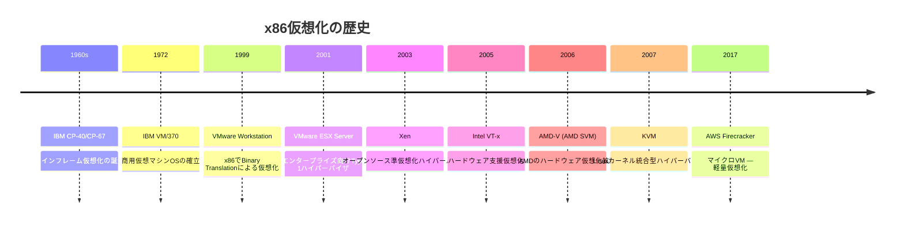

## 2. 仮想化の基本概念 — Popek-Goldberg定理

### 2.1 Popek-Goldberg定理

1974年、Gerald PopekとRobert Goldbergは、効率的な仮想化を実現するために命令セットアーキテクチャ（ISA）が満たすべき条件を形式的に定義した論文を発表した。この論文は仮想化理論の金字塔であり、現在でもハイパーバイザ設計の理論的基盤となっている。

彼らはまず、プロセッサの命令を以下の3つに分類した。

- **特権命令（Privileged Instructions）**: ユーザーモードで実行するとトラップ（例外）が発生し、カーネルモードに制御が移る命令。例えば、割り込みフラグの変更やI/Oポートへの直接アクセスなど
- **制御依存命令（Control Sensitive Instructions）**: システムの資源配分や構成に影響を与える命令。例えば、ページテーブルベースレジスタの設定
- **動作依存命令（Behavior Sensitive Instructions）**: 実行結果がプロセッサの状態（特権レベルなど）に依存する命令

Popek-Goldbergの定理は、次のように述べている。

> **すべての制御依存命令と動作依存命令が特権命令のサブセットであるならば、そのアーキテクチャは効率的に仮想化可能である。**

直感的には、ゲストOSがハードウェアに影響を与える操作を行おうとしたとき、それが必ずトラップとしてハイパーバイザに捕捉されることが保証されていれば、ハイパーバイザはその操作をエミュレートして仮想化を実現できるということである。

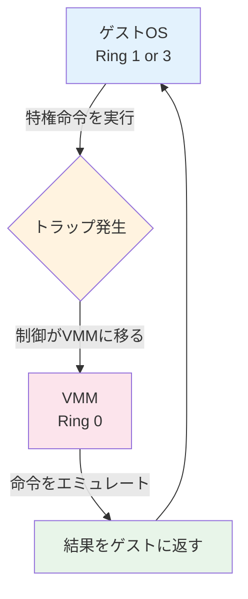

この「Trap-and-Emulate」モデルが効率的なのは、ゲストOSの命令のほとんど（算術演算、メモリアクセスなど）はそのまま物理CPUで直接実行され、VMM の介入はセンシティブな命令のときだけ必要になるためである。

### 2.2 x86アーキテクチャの問題

古典的なx86アーキテクチャは、Popek-Goldbergの定理の条件を満たしていなかった。x86には、センシティブでありながら特権命令ではない命令が17個ほど存在していた。これらの命令はユーザーモードで実行してもトラップを発生させず、黙って異なる結果を返すか、単に無視される。

代表的な例を挙げる。

- **`POPF`（Pop Flags）**: ユーザーモードで実行すると、割り込みフラグ（IF）の変更が黙って無視される。ゲストOSが割り込みを禁止したつもりでも、実際には禁止されない
- **`SGDT`/`SIDT`（Store GDT/IDT Register）**: これらの命令はGDT/IDTレジスタの内容を読み取る。ユーザーモードでもトラップなしに実行でき、ホストのGDT/IDTアドレスが漏洩する
- **`SMSW`（Store Machine Status Word）**: CR0レジスタの下位16ビットを読み取る。仮想化環境かどうかを検出される可能性がある
- **`PUSHF`（Push Flags）**: EFLAGS レジスタをスタックにプッシュする。IOPLフィールドの値から特権レベルの情報が漏れる

これらの命令は「仮想化の穴（Virtualization Holes）」と呼ばれ、純粋なTrap-and-Emulate方式でのx86仮想化を不可能にしていた。

### 2.3 x86仮想化の3つのアプローチ

x86の仮想化の穴を克服するために、3つの主要なアプローチが開発された。

| アプローチ | 概要 | 代表例 |
|:---|:---|:---|
| Binary Translation | ゲストOSのコードを実行前に書き換え、問題のある命令を安全なコードに置換する | VMware（初期） |
| 準仮想化（Paravirtualization） | ゲストOSのソースコードを修正し、問題のある命令の代わりにハイパーコールを使用する | Xen（初期） |
| ハードウェア支援仮想化 | CPUに新しい実行モードを追加し、ゲストOSの命令を安全にトラップする | Intel VT-x, AMD-V |

これらのアプローチについては、後のセクションで詳しく解説する。

## 3. Type 1ハイパーバイザ — ベアメタル型

### 3.1 アーキテクチャ

Type 1ハイパーバイザは、物理ハードウェアの上に直接インストールされる。ホストOSを必要とせず、ハイパーバイザ自体がハードウェアの制御権を握る。このため「ベアメタル型」と呼ばれる。

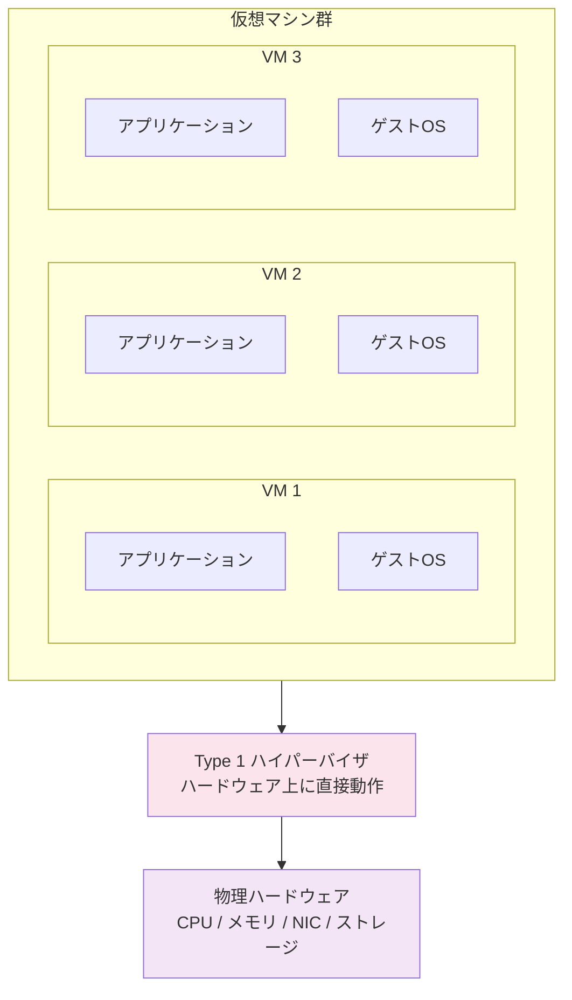

Type 1ハイパーバイザの特徴は以下の通りである。

- **パフォーマンス**: ホストOSのオーバーヘッドがないため、ゲストOSはハードウェアに近い性能で動作する
- **セキュリティ**: ハイパーバイザのコードベースは小さく、攻撃対象領域（アタックサーフェス）が狭い
- **信頼性**: 汎用OSの複雑さ（ファイルシステム、ネットワークスタック、各種デーモン）に起因する障害リスクが低い
- **用途**: データセンター、クラウドプロバイダ、エンタープライズ環境で広く使用される

### 3.2 VMware ESXi

VMware ESXiは、商用Type 1ハイパーバイザの事実上の標準である。2001年にESX Serverとしてリリースされ、その後ESXiへと進化した。

ESXiのアーキテクチャには、いくつかの注目すべき設計判断がある。

**VMkernelの設計**: ESXiは独自のマイクロカーネル「VMkernel」を持つ。VMkernelはCPUスケジューリング、メモリ管理、I/Oスタックを直接制御する。汎用OSカーネルと比較して、仮想化に特化した設計になっている。

**Console OS の排除**: 初期のESX ServerにはLinuxベースのConsole OS（Service Console）が存在していたが、ESXiではこれを排除し、管理用の極小のユーザー空間のみを持つ構成に改められた。これによりフットプリントが約150MBにまで縮小され、セキュリティプロファイルが大幅に改善された。

**vSphereエコシステム**: ESXi単体ではなく、vCenter Server、vMotion（ライブマイグレーション）、DRS（Distributed Resource Scheduler）、HA（High Availability）などの管理ツール群と組み合わせることで、大規模なデータセンターの自動化と高可用性を実現する。

```
VMware ESXiのアーキテクチャ:

+--------+ +--------+ +--------+
| VM 1   | | VM 2   | | VM 3   |
| Win    | | Linux  | | Linux  |
+--------+ +--------+ +--------+
|         VMkernel               |
|  +----------+ +-------------+ |
|  | CPU      | | メモリ       | |
|  | スケジューラ| | マネージャ   | |
|  +----------+ +-------------+ |
|  +----------+ +-------------+ |
|  | I/Oスタック| | ネットワーク  | |
|  | (VMFS)   | | (vSwitch)   | |
|  +----------+ +-------------+ |
+-+----------------------------+-+
| NIC    | HBA    | CPU  | RAM  |
+--------+--------+------+------+
```

### 3.3 Microsoft Hyper-V

Microsoft Hyper-Vは、Windows Server 2008で初めて登場したType 1ハイパーバイザである。Hyper-Vの興味深い点は、一見するとWindows上で動作するType 2ハイパーバイザに見えるが、実際にはType 1であるという点にある。

Hyper-Vが有効化されると、Hyper-Vハイパーバイザが最初にロードされ、従来のWindows OS自体が「ルートパーティション」（親パーティション）と呼ばれる特権的なVMとして動作するようになる。つまり、Windowsが下にいるように見えるが、実はWindowsも仮想化されている。

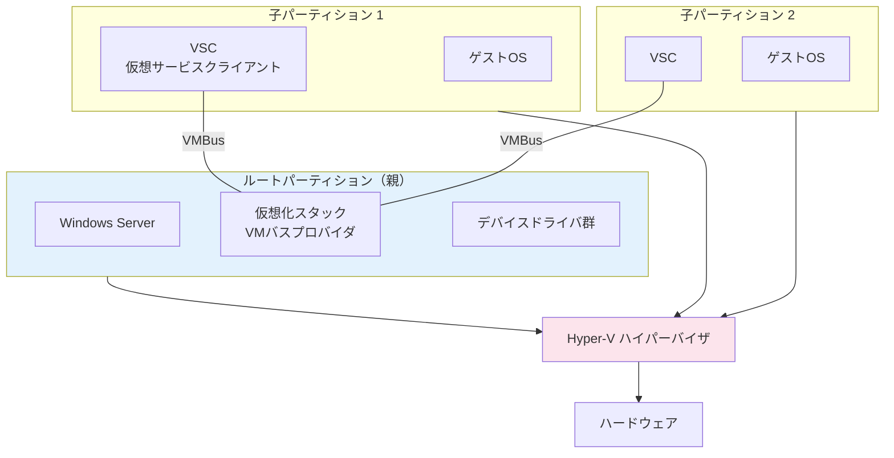

Hyper-Vのアーキテクチャでは、I/Oの処理がユニークである。子パーティション（ゲストVM）のI/O要求は、VMBusという高速な通信チャネルを通じてルートパーティションのデバイスドライバに転送される。これにより、Hyper-Vハイパーバイザ自体はデバイスドライバを含まず、既存のWindowsデバイスドライバエコシステムをそのまま活用できる。

## 4. Type 2ハイパーバイザ — ホスト型

### 4.1 アーキテクチャ

Type 2ハイパーバイザは、既存のホストOS上でアプリケーションとして動作する。ホストOSのカーネルを介してハードウェアにアクセスするため、Type 1と比較してオーバーヘッドが大きいが、導入が容易であるという利点がある。

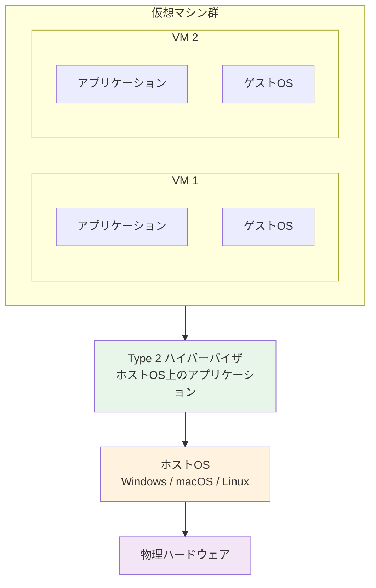

### 4.2 代表的な製品

**Oracle VirtualBox**: オープンソースのType 2ハイパーバイザ。Windows、macOS、Linux、Solarisの各プラットフォームで動作し、開発・テスト用途やデスクトップ仮想化に広く使われている。GUIベースの管理インターフェースを備え、VBoxManage CLIによるスクリプト操作も可能である。

**VMware Workstation / Fusion**: VMwareの有料デスクトップ仮想化製品。Workstation（Windows/Linux向け）とFusion（macOS向け）があり、高度なネスト仮想化、スナップショット管理、Unity モード（ゲストOSのウィンドウをホストのデスクトップに統合）などの機能を持つ。

**Parallels Desktop**: macOS専用のType 2ハイパーバイザで、Apple Silicon（ARM）とIntel の両方に対応。macOS上でWindowsを高速に動作させることに特化しており、Coherenceモード（VirtualBoxのシームレスモードに相当）で、WindowsアプリケーションをmacOSのアプリケーションのように扱える。

### 4.3 Type 1 vs Type 2 の比較

| 特性 | Type 1（ベアメタル） | Type 2（ホスト型） |
|:---|:---|:---|
| ハードウェアアクセス | 直接 | ホストOS経由 |
| パフォーマンス | 高い | やや低い（ホストOSのオーバーヘッド） |
| セキュリティ | 小さいTCB | ホストOSがTCBに含まれる |
| 導入の容易さ | 専用インストールが必要 | アプリケーションとして簡単に導入 |
| 主な用途 | データセンター、クラウド | 開発、テスト、デスクトップ |
| 代表例 | ESXi, Hyper-V, Xen | VirtualBox, VMware Workstation |

> [!NOTE]
> TCB（Trusted Computing Base）とは、システムのセキュリティを保証するために信頼しなければならないソフトウェアとハードウェアの総体を指す。TCBが小さいほど、検証すべき範囲が狭くなり、セキュリティの確保が容易になる。

## 5. KVMの仕組み — Linuxカーネル統合型ハイパーバイザ

### 5.1 KVMとは何か

KVM（Kernel-based Virtual Machine）は、Linuxカーネルに組み込まれたハイパーバイザモジュールである。2007年にAvi Kivity（当時Qumranet社）によって開発され、Linux 2.6.20でカーネルのメインラインにマージされた。

KVMの革新的なアイデアは、「Linuxカーネル自体をハイパーバイザに変える」というものであった。KVMはカーネルモジュール（`kvm.ko`, `kvm-intel.ko` or `kvm-amd.ko`）として実装され、ロードするとLinuxカーネルがType 1ハイパーバイザとして機能するようになる。

この設計には深い洞察がある。ハイパーバイザが必要とする機能 --- プロセススケジューリング、メモリ管理、デバイスドライバ、ネットワークスタック --- はすべて、成熟したOSカーネルがすでに持っているものである。それを一から書き直すのではなく、Linuxカーネルの既存の機能を活用し、足りない部分（CPU仮想化の制御）だけを追加するアプローチは、開発効率と品質の両面で優れている。

### 5.2 KVMの分類 — Type 1 か Type 2 か

KVMの分類については議論がある。KVMはLinux上のカーネルモジュールとして動作するため、一見するとType 2のように見える。しかし、KVMがロードされると、Linuxカーネル自体がハイパーバイザの役割を果たし、ホストOSのユーザー空間プロセスも含めてすべてが「VMM の制御下」に置かれる。この意味でKVMはType 1に分類されることが多い。

Red HatやLinux Foundationの公式見解では、KVMはType 1ハイパーバイザとして位置付けられている。

### 5.3 アーキテクチャ

KVM の動作は、Linux カーネル空間、QEMU ユーザー空間プロセス、ゲストOS の3者の協調によって実現される。

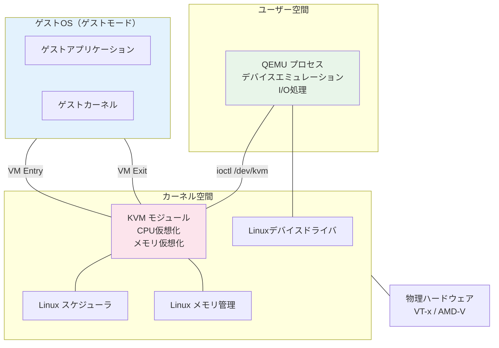

KVMはCPUに3つの実行モードを導入する。

1. **ゲストモード（Guest Mode）**: ゲストOSのコードがVT-x/AMD-V のノンルートモードで直接実行される。特権命令やI/Oアクセスが発生すると VM Exit が起きる
2. **カーネルモード（Kernel Mode）**: VM Exit を受けてKVMモジュールが処理する。多くの Exit 理由（CR レジスタアクセス、MSR操作、例外処理など）はカーネル空間で高速に処理される
3. **ユーザーモード（User Mode）**: I/Oエミュレーションなど、カーネルで処理しきれない操作はQEMU プロセスに委譲される

### 5.4 QEMU/KVM の連携

QEMU（Quick Emulator）は、Fabrice Bellardによって2003年に開発された汎用のマシンエミュレータである。QEMU単体でもソフトウェアエミュレーションにより異なるアーキテクチャのCPUをエミュレートできるが、KVMと組み合わせることで、ホストと同じアーキテクチャのゲストをネイティブに近い速度で実行できる。

QEMU/KVM の連携は、`/dev/kvm` デバイスファイルを介した `ioctl` システムコールによって行われる。

```c
// KVM API usage example (simplified)
int kvm_fd = open("/dev/kvm", O_RDWR);

// Create a VM
int vm_fd = ioctl(kvm_fd, KVM_CREATE_VM, 0);

// Allocate and map guest memory
void *mem = mmap(NULL, MEM_SIZE, PROT_READ | PROT_WRITE,
                 MAP_SHARED | MAP_ANONYMOUS, -1, 0);
struct kvm_userspace_memory_region region = {
    .slot = 0,
    .guest_phys_addr = 0,
    .memory_size = MEM_SIZE,
    .userspace_addr = (uint64_t)mem,
};
ioctl(vm_fd, KVM_SET_USER_MEMORY_REGION, &region);

// Create a vCPU
int vcpu_fd = ioctl(vm_fd, KVM_CREATE_VCPU, 0);

// Run the vCPU
struct kvm_run *run = mmap(NULL, run_size, PROT_READ | PROT_WRITE,
                           MAP_SHARED, vcpu_fd, 0);
while (1) {
    ioctl(vcpu_fd, KVM_RUN, NULL);
    switch (run->exit_reason) {
        case KVM_EXIT_IO:
            // Handle I/O in userspace (QEMU)
            handle_io(run);
            break;
        case KVM_EXIT_MMIO:
            // Handle memory-mapped I/O
            handle_mmio(run);
            break;
        case KVM_EXIT_HLT:
            // Guest executed HLT instruction
            return 0;
    }
}
```

QEMUはゲストに対して、以下のような仮想ハードウェアをエミュレートする。

- **仮想CPU**: vCPUスレッドとして実装。各vCPUはホストの1つのスレッドに対応
- **仮想メモリ**: ゲストの物理メモリをホストのプロセスメモリ空間にマッピング
- **仮想デバイス**: ネットワークカード（e1000, virtio-net）、ディスクコントローラ（virtio-blk, IDE）、USB、ディスプレイ、シリアルポートなど
- **ファームウェア**: SeaBIOS（BIOS互換）またはOVMF/UEFI

### 5.5 vCPU のスケジューリング

KVM では、各 vCPU が Linux のスレッドとして表現される。これは非常にエレガントな設計で、Linux の CFS（Completely Fair Scheduler）がそのまま vCPU のスケジューリングに使われる。

```
KVM vCPU とLinuxスレッドの対応:

ゲストVM 1 (2 vCPU)          ゲストVM 2 (4 vCPU)
  vCPU-0    vCPU-1             vCPU-0  vCPU-1  vCPU-2  vCPU-3
    |         |                  |       |       |       |
    v         v                  v       v       v       v
 Thread-A  Thread-B           Thread-C  -D      -E      -F
    \         |                  |       |       /       /
     \        |                  |       |      /       /
      +-------+------------------+-------+-----+-------+
      |         Linux CFS スケジューラ                   |
      +-------+------------------+-------+-----+-------+
              |                  |       |
           pCPU-0            pCPU-1   pCPU-2
           (物理コア)         (物理コア)  (物理コア)
```

この設計により、KVM は Linux の成熟したスケジューリング機構 --- cgroups によるCPU割り当て、NUMA対応、リアルタイムスケジューリングクラス、CPU ピンニング --- をそのまま活用できる。

## 6. Xenの仕組み — 準仮想化の先駆者

### 6.1 Xenの誕生

Xen は、2003年にケンブリッジ大学のIan Prattらによって開発されたオープンソースのType 1ハイパーバイザである。Xenの登場は、x86仮想化の歴史において画期的であった。当時、Intel VT-xもAMD-Vも存在せず、VMwareはBinary Translation（後述）で仮想化を実現していたが、そのコードはプロプライエタリであった。Xenは「準仮想化（Paravirtualization）」という異なるアプローチでこの問題を解決した。

### 6.2 準仮想化（Paravirtualization）

準仮想化のアイデアは、ゲストOSに「自分が仮想化環境で動いている」ことを自覚させ、ハードウェアに直接アクセスする代わりにハイパーバイザのAPIを呼び出させるというものである。

具体的には、ゲストOSのカーネルソースコードを修正し、仮想化の穴となるセンシティブ命令をすべて「ハイパーコール（Hypercall）」に置き換える。ハイパーコールは、OSのシステムコールに相当するもので、ゲストOSからハイパーバイザに対するサービス要求である。

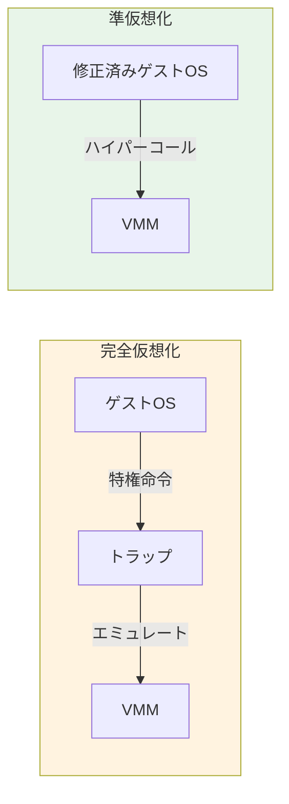

準仮想化の利点は、トラップのオーバーヘッドを回避できることである。完全仮想化ではセンシティブ命令のたびにトラップが発生してVMMに制御が移るが、準仮想化ではゲストOSが最初からVMMを直接呼び出すため、トラップのコンテキストスイッチが不要になる。初期のベンチマークでは、準仮想化はネイティブ性能の95〜98%に達した。

一方、欠点も明確である。ゲストOSのカーネルを修正する必要があるため、ソースコードが公開されていないOS（特にWindows）は準仮想化ゲストとして動作させることが困難であった。

### 6.3 Dom0 / DomUアーキテクチャ

Xenのアーキテクチャは、「ドメイン」と呼ばれる仮想マシンの概念を中心に構成される。

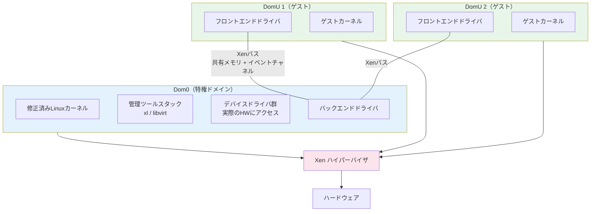

- **Dom0（Domain 0）**: 最初に起動される特権ドメイン。ハードウェアデバイスに直接アクセスでき、他のドメインの作成・管理・破棄を行う。通常は修正済みのLinuxカーネルが動作する。Dom0は、Xenアーキテクチャにおける「管理プレーン」の役割を担う
- **DomU（Domain U）**: 非特権のゲストドメイン。ハードウェアに直接アクセスすることはできず、I/Oはフロントエンド/バックエンドドライバモデルを通じてDom0に中継される
- **Xenハイパーバイザ**: CPUスケジューリングとメモリ管理のみを担当し、デバイスドライバは一切含まない。起動時に最初にロードされ、Ring 0（x86）またはRoot Mode（VT-x）で動作する

### 6.4 Split Driver Model

Xenの I/O アーキテクチャは「Split Driver Model（分離ドライバモデル）」と呼ばれる設計を採用している。

```
Split Driver Model:

DomU (ゲスト)                  Dom0 (特権ドメイン)
+------------------+          +------------------+
| アプリケーション   |          | デバイスドライバ   |
+------------------+          | (実際のHW制御)    |
| フロントエンド     |          +------------------+
| ドライバ          |          | バックエンド       |
| (netfront,       |    ←→    | ドライバ          |
|  blkfront)       |    共有   | (netback,        |
+------------------+  メモリ   |  blkback)        |
                     +イベント  +------------------+
                     チャネル
```

フロントエンドドライバはゲストカーネル内で動作し、標準的なブロックデバイスやネットワークデバイスのインターフェースをゲストOS内のアプリケーションに提供する。実際のI/O操作は、Xenが提供する共有メモリリング（Grant Table）とイベントチャネルを通じて、Dom0内のバックエンドドライバに転送される。バックエンドドライバは、Dom0が持つ実際のデバイスドライバを使ってハードウェアにアクセスする。

このモデルの利点は、ハイパーバイザ自体にデバイスドライバを組み込む必要がなく、Dom0のLinuxカーネルが持つ膨大なデバイスドライバエコシステムを活用できる点にある。

### 6.5 Xenの現在 — HVM と PVH

ハードウェア支援仮想化（VT-x/AMD-V）の普及に伴い、Xenも進化した。

- **PV（Paravirtualization）**: 初期の準仮想化モード。ゲストOSの修正が必要
- **HVM（Hardware Virtual Machine）**: VT-x/AMD-Vを利用した完全仮想化モード。ゲストOSの修正は不要。QEMUによるデバイスエミュレーションを使用。未修正のWindowsも動作する
- **PVHVM**: HVMをベースとしつつ、I/Oに準仮想化ドライバを使用するハイブリッドモード。パフォーマンスが良い
- **PVH（PV in HVM）**: Xenの最新のモード。HVMコンテナ内でPV的な軽量な仕組みを使う。PVの軽量さとHVMのハードウェア支援を組み合わせたアプローチ

XenはAmazon Web Servicesの初期のクラウド基盤として採用され、EC2の第1世代〜第4世代のインスタンスはXenベースで動作していた。その後、AWSは独自のハイパーバイザ Nitro（KVMベース）に移行しているが、Xenの貢献はクラウドコンピューティングの歴史において非常に大きい。

## 7. CPU仮想化

CPU仮想化は、ハイパーバイザの最も核心的な技術である。ゲストOSのカーネルは自分がRing 0（最高特権レベル）で動作していると考えているが、実際にはハイパーバイザがRing 0を占有しており、ゲストOSをどう安全に実行するかという問題を解決する必要がある。

### 7.1 Binary Translation（VMwareのアプローチ）

VMwareが1999年に商用化したBinary Translation（BT）は、x86の仮想化の穴を創造的に解決した技術である。

BTのアイデアは、ゲストOSのカーネルコードをそのまま実行するのではなく、実行前に「翻訳」して問題のある命令を安全なコードに置き換えるというものである。

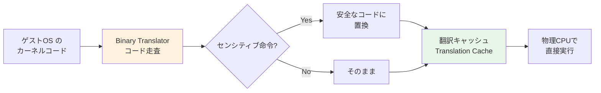

具体的な動作は以下の通りである。

1. ゲストOSのカーネルコードを基本ブロック（分岐命令で区切られるコード列）単位で走査する
2. センシティブ命令を発見したら、VMM内のエミュレーションコードへの呼び出しに置き換える
3. 翻訳結果を Translation Cache に格納し、同じコードブロックが再び実行される際にはキャッシュから再利用する
4. ゲストのユーザーモードコードは翻訳の必要がないため、Ring 1やRing 3でそのまま直接実行される

BTの巧みな点は、ゲストOSのバイナリを修正せずに仮想化を実現できることである。Windowsのような非オープンソースOSでも仮想化できた。一方、翻訳のオーバーヘッドが存在するため、カーネルコードの実行は10〜30%程度の性能低下が見られた。

### 7.2 Intel VT-x / AMD-V（ハードウェア支援仮想化）

2005年にIntel VT-x（Vanderpool）、2006年にAMD-V（Pacifica/SVM）がリリースされ、x86プロセッサにハードウェアレベルでの仮想化支援が組み込まれた。これにより、Binary Translationも準仮想化も不要になった。

VT-x は、CPUに2つの新しい動作モードを追加する。

- **VMX Root Mode**: ハイパーバイザが動作するモード。従来の Ring 0 に相当するが、追加の制御機構を持つ
- **VMX Non-Root Mode**: ゲストOSが動作するモード。ゲストは Ring 0 を含むすべてのリングを使用できるが、特定の操作は自動的にトラップされる

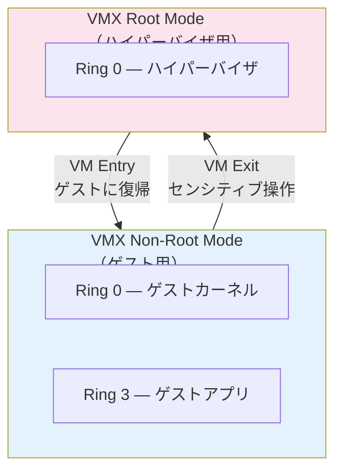

中核的なデータ構造は **VMCS（Virtual Machine Control Structure）** である。VMCSは各vCPUに1つずつ存在し、以下の情報を保持する。

- **Guest State Area**: ゲストのレジスタ（汎用レジスタ、CR、DR、セグメントレジスタ、MSR等）の保存領域
- **Host State Area**: VM Exit 時にロードされるホスト側のレジスタ値
- **VM Execution Control Fields**: どの操作でVM Exitを発生させるかの設定。例えば、特定のCR書き込み、I/Oポートアクセス、MSRアクセスなど
- **VM Exit Information Fields**: VM Exitの理由や関連情報

```
VMCS の構造（概略）:

+----------------------------------+
| Guest State Area                 |
|   - RIP, RSP, RFLAGS            |
|   - CR0, CR3, CR4               |
|   - CS, DS, SS, ES, ...         |
|   - GDTR, LDTR, IDTR, TR       |
|   - 各種MSR                      |
+----------------------------------+
| Host State Area                  |
|   - RIP, RSP                    |
|   - CR0, CR3, CR4               |
|   - CS, DS, SS, ES, ...         |
+----------------------------------+
| VM Execution Control             |
|   - Pin-based controls          |
|   - Processor-based controls    |
|   - Exception bitmap            |
|   - I/O bitmap                  |
|   - MSR bitmap                  |
+----------------------------------+
| VM Exit Information              |
|   - Exit reason                 |
|   - Exit qualification          |
|   - Guest-linear address        |
+----------------------------------+
```

VM Entry と VM Exit のサイクルは以下のように進む。

1. ハイパーバイザが `VMLAUNCH`（初回）または `VMRESUME`（2回目以降）を実行
2. CPUがVMCSからゲスト状態をロードし、VMX Non-Root Modeに遷移（VM Entry）
3. ゲストのコードが直接CPUで実行される。通常の命令はオーバーヘッドなしに動作
4. VMCS で設定された条件に該当する操作が発生すると、CPUが自動的にVM Exit を発生
5. CPUがゲスト状態をVMCSに保存し、ホスト状態をロードしてVMX Root Modeに復帰
6. ハイパーバイザがVM Exit の理由を確認し、適切な処理（エミュレーション等）を行う
7. ステップ1に戻る

ハードウェア支援仮想化の性能は世代を重ねるごとに向上している。初期のVT-xはVM Entry/ExitのレイテンシがBinary Translationよりも大きいケースがあったが、現在では大幅に最適化されている。

## 8. メモリ仮想化

### 8.1 メモリ仮想化の課題

仮想化環境では、メモリのアドレス変換が2段階になる。

1. **ゲスト仮想アドレス（GVA）→ ゲスト物理アドレス（GPA）**: ゲストOSのページテーブルが管理
2. **ゲスト物理アドレス（GPA）→ ホスト物理アドレス（HPA）**: ハイパーバイザが管理

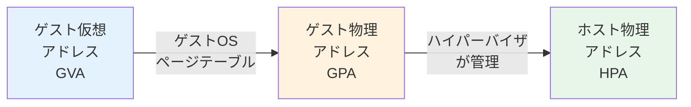

通常のOS環境では、CPUの MMU（Memory Management Unit）がページテーブルを参照して仮想アドレスを物理アドレスに変換する（1段階）。仮想化環境では、ゲストOSが「自分の物理メモリ」だと思っているアドレスは、実際にはハイパーバイザが割り当てたゲスト物理アドレスであり、真のホスト物理アドレスとは異なる。この2段階の変換をどう効率的に行うかが、メモリ仮想化の核心的な課題である。

### 8.2 Shadow Page Table（影ページテーブル）

Shadow Page Table は、ハードウェア支援のない環境で使われた初期のメモリ仮想化技術である。

ハイパーバイザがGVA → HPA の直接変換を行う「影のページテーブル」を構築し、CPUの CR3 レジスタにはこのShadow Page Table を設定する。

```
Shadow Page Table の仕組み:

ゲストOS のページテーブル        Shadow Page Table
(GVA → GPA)                     (GVA → HPA)
+--------+--------+             +--------+--------+
| GVA    | GPA    |             | GVA    | HPA    |
+--------+--------+             +--------+--------+
| 0x1000 | 0x5000 | ──合成──→  | 0x1000 | 0xA000 |
| 0x2000 | 0x6000 |             | 0x2000 | 0xB000 |
| 0x3000 | 0x7000 |             | 0x3000 | 0xC000 |
+--------+--------+             +--------+--------+
                                       ↑
                                  CR3が指す

GPA→HPA のマッピング:
  0x5000 → 0xA000
  0x6000 → 0xB000
  0x7000 → 0xC000
  （ハイパーバイザが管理）
```

Shadow Page Table の問題点は、ゲストOSがページテーブルを更新するたびにハイパーバイザが Shadow Page Table を同期しなければならない点である。ゲストOSがCR3を書き換えた場合（プロセスのコンテキストスイッチ時）は、Shadow Page Table 全体を再構築する必要がある。この同期のオーバーヘッドは、メモリアクセスの多いワークロードで顕著な性能低下を引き起こす。

### 8.3 EPT / NPT（ハードウェア支援によるメモリ仮想化）

Intel EPT（Extended Page Tables）とAMD NPT（Nested Page Tables）は、2段階のアドレス変換をハードウェアで直接サポートする技術である。2008年頃から導入された。

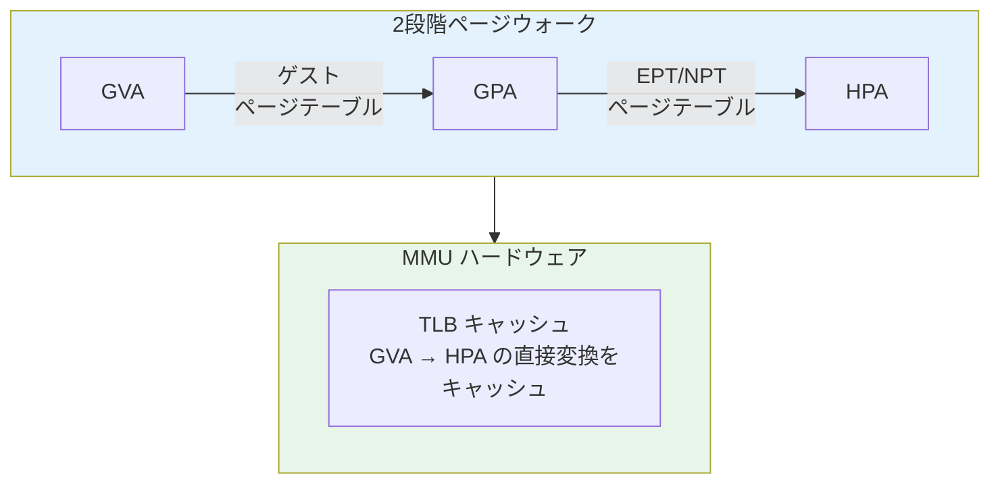

EPT/NPT の仕組みは以下の通りである。

- ゲストOSは通常通り自身のページテーブル（GVA → GPA）を管理する。ハイパーバイザはこれに干渉しない
- ハイパーバイザはEPT/NPTテーブル（GPA → HPA）を管理する。VMCSのEPTPフィールドにEPTテーブルの物理アドレスを設定する
- CPUのMMUは、メモリアクセスのたびに2段階のページテーブルウォークを実行する。最悪の場合、4段階のゲストページテーブルウォーク × 4段階のEPTウォーク = 最大24回のメモリアクセスが必要になる（4段階のゲストPTウォークの各段階でEPTの4段階ウォークが発生し、加えて最終的なGPAに対するEPTウォークも必要）
- TLBがGVA → HPA の変換結果をキャッシュするため、ページウォークの頻度は実際にはそれほど高くない

EPT/NPTの最大の利点は、ゲストOSのページテーブル操作がVM Exitを引き起こさない点である。Shadow Page Tableでは、ゲストがページテーブルを更新するたびにトラップが発生していたが、EPT/NPTでは完全に不要になった。これにより、メモリアクセスが頻繁なワークロードで大幅な性能向上が実現された。

EPT違反（EPT Violation）は、ゲストがマッピングされていないGPAにアクセスした場合に発生するVM Exitである。ハイパーバイザはこれを利用して、ゲストメモリの遅延割り当て（Lazy Allocation）、メモリバルーニング、メモリのコピーオンライト（KSM: Kernel Same-page Merging）などの高度なメモリ管理を実現する。

### 8.4 メモリ最適化技術

ハイパーバイザは、物理メモリの効率的な利用のためにいくつかの高度な技術を採用している。

**メモリバルーニング（Memory Ballooning）**: ゲストOS内にインストールされたバルーンドライバが、ハイパーバイザの指示に従ってゲスト内でメモリを「膨らませる」（確保する）。ゲストOSはそのメモリを使えなくなり、ハイパーバイザはバルーン内の物理ページを回収して他のVMに再配分できる。ゲストOSの側から見ると、メモリ使用量が増えてスワップが始まるが、システム全体としてはメモリのオーバーコミットが可能になる。

**KSM（Kernel Same-page Merging）**: KVM で使われる技術で、複数のVMが同一内容のメモリページを持っている場合、1つの物理ページを共有させる（コピーオンライト付き）。同じOSを動かす複数のVMでは、カーネルコードやライブラリの多くのページが同一内容になるため、大幅なメモリ節約が可能になる。

**メモリオーバーコミット**: 物理メモリの総量よりも多くのメモリをVMに割り当てる技術。バルーニングとKSMを組み合わせることで、実際の物理メモリ使用量を抑えつつ、各VMには十分なメモリがあるように見せかける。

## 9. I/O仮想化

### 9.1 I/O仮想化の課題

I/O仮想化は、ハイパーバイザの設計において最も複雑な領域の一つである。物理デバイス（NIC、ディスクコントローラ、GPU等）は1つしかないが、複数のVMがそれぞれ独立したデバイスを持っているかのように見せる必要がある。

I/O仮想化には、主に3つのアプローチがある。

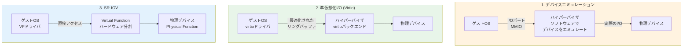

### 9.2 デバイスエミュレーション

最も基本的なアプローチは、ソフトウェアで物理デバイスを完全にエミュレートすることである。QEMUが代表例で、Intel e1000ネットワークカードやIDE/SATAコントローラなどの既存のハードウェアをソフトウェアで再現する。

ゲストOSがI/Oポートアクセスまたはメモリマップドの I/O（MMIO）を行うと、VM Exitが発生してハイパーバイザに制御が移る。ハイパーバイザ（またはQEMU）はそのI/O操作を解釈し、対応する物理デバイスの操作に変換して実行する。

```
デバイスエミュレーションの流れ（ネットワーク送信の例）:

ゲストOS                    QEMU / ハイパーバイザ          物理NIC
   |                              |                        |
   | 1. e1000レジスタに            |                        |
   |    パケットデータを書き込み    |                        |
   |---VM Exit--->                |                        |
   |                 2. I/Oを解釈  |                        |
   |                 3. パケットを  |                        |
   |                    組み立て   |                        |
   |                              |--- 4. 実パケット送信 --->|
   |                              |                        |
   |                              |<-- 5. 送信完了 ---------|
   |                 6. ゲストに   |                        |
   |<--VM Entry--     仮想割込みを |                        |
   |  + 割り込み     注入          |                        |
```

デバイスエミュレーションの利点は、ゲストOSの修正が不要であり、既存のOSがそのまま動作する点にある。しかし、I/O操作のたびにVM Exitが発生するため、I/O負荷の高いワークロードでは性能が大幅に低下する。特にネットワークI/Oでは、パケットの送受信ごとにコンテキストスイッチが発生するため、高スループットの通信が困難になる。

### 9.3 Virtio（準仮想化I/O）

Virtio は、Rusty Russellによって2008年に提案された、仮想環境に最適化されたI/Oフレームワークである。デバイスエミュレーションの性能問題を解決するために設計された。

Virtioの核心は、ゲストOSとハイパーバイザの間に「本物のハードウェアを模倣する」のではなく、仮想化に最適化された効率的な通信プロトコルを定義するというアプローチである。

```
Virtio のアーキテクチャ:

ゲストOS
+------------------------------------+
| ブロックデバイス層 / ネットワーク層   |
+------------------------------------+
| virtio-blk / virtio-net ドライバ    |
+------------------------------------+
| virtio トランスポート層              |
| (Virtqueue: リングバッファ)          |
+========= 共有メモリ ================+
| virtio バックエンド                  |
| (QEMU / vhost-net / vhost-user)    |
+------------------------------------+
ハイパーバイザ / ホスト
```

Virtioの中心的なデータ構造は **Virtqueue** である。Virtqueueは、ゲストとホストの間で共有されるリングバッファで、3つのリングで構成される。

- **Descriptor Table**: データバッファの物理アドレスとサイズを記述する
- **Available Ring**: ゲストがホストに処理を依頼するディスクリプタのインデックスを格納する
- **Used Ring**: ホストが処理完了を通知するためのリングバッファ

この設計により、複数のI/O要求をバッチ的に処理でき、VM Exit の回数を大幅に削減できる。

```
Virtqueue の構造:

Descriptor Table (共有メモリ)
+-------+----------+------+-------+
| Index | Addr     | Len  | Flags |
+-------+----------+------+-------+
|   0   | 0x1000   | 4096 | NEXT  |
|   1   | 0x2000   | 256  | WRITE |
|   2   | 0x3000   | 1500 | ---   |
+-------+----------+------+-------+

Available Ring                Used Ring
(ゲスト → ホスト)             (ホスト → ゲスト)
+-------+                    +-------+------+
| idx=2 |                    | idx=1 |      |
+-------+                    +-------+------+
| [0]   | → desc 0           | [0]   | desc 2, len=1500 |
| [1]   | → desc 2           +-------+------+
+-------+
```

**vhost** は、Virtioのバックエンド処理をカーネル空間で実行する最適化である。QEMUのユーザー空間でバックエンドを処理する場合、カーネル/ユーザー空間のコンテキストスイッチが発生するが、vhost-netはネットワークI/Oの処理をカーネル内で完結させるため、レイテンシとスループットの両方が改善される。さらに **vhost-user** は、DPDK（Data Plane Development Kit）などのユーザー空間のネットワークスタックとVirtioを接続する仕組みで、特に高性能ネットワーキングで使用される。

### 9.4 SR-IOV（Single Root I/O Virtualization）

SR-IOV は、PCI-SIG（PCI Special Interest Group）によって標準化されたハードウェアレベルのI/O仮想化技術である。物理デバイス（主にNIC）をハードウェアレベルで複数の仮想デバイスに分割し、各VMに直接割り当てることができる。

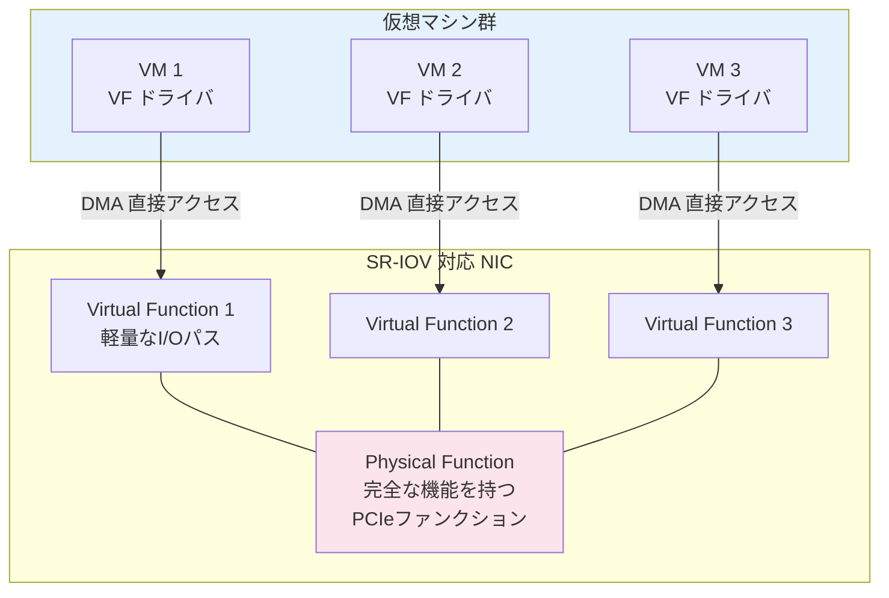

SR-IOVの概念は以下の2つに集約される。

- **Physical Function（PF）**: 物理デバイスの完全な機能を持つPCIeファンクション。デバイスの設定・管理を行い、VFを作成する能力を持つ。通常はホスト側のドライバが制御する
- **Virtual Function（VF）**: PFから派生した軽量なPCIeファンクション。I/Oに必要な最小限のリソース（キューペア、割り込み）だけを持ち、VMに直接パススルーされる

VFがVMに割り当てられると、ゲストOSはVFを通常のPCIeデバイスとして認識し、VF用のドライバで直接制御する。データの送受信はDMA（Direct Memory Access）を通じてVMのメモリとデバイスの間で直接行われ、ハイパーバイザを経由しない。このため、ネイティブに極めて近い性能が得られる。

SR-IOVの利点と制約は以下の通りである。

| 側面 | 説明 |
|:---|:---|
| 性能 | ネイティブに近いI/O性能。レイテンシが極めて低い |
| CPU負荷 | I/Oがハイパーバイザをバイパスするため、ホストのCPU負荷が低い |
| スケーラビリティ | VFの数はデバイスに依存（一般的に64〜256個） |
| ライブマイグレーション | VFが物理デバイスに紐づくため、ライブマイグレーションが複雑になる |
| 柔軟性 | VFの動的な追加・削除は制約がある |

SR-IOVを安全に使うためには、**IOMMU**（Intel VT-d / AMD-Vi）が必要である。IOMMUは、デバイスからのDMAアクセスを仮想アドレス空間に閉じ込め、あるVMのVFが他のVMのメモリにDMAでアクセスすることを防ぐ。IOMMUがなければ、悪意のあるゲストが任意の物理メモリにアクセスできてしまう。

### 9.5 I/O仮想化手法の比較

| 手法 | 性能 | ゲストOS修正 | ライブマイグレーション | 柔軟性 |
|:---|:---|:---|:---|:---|
| デバイスエミュレーション | 低い | 不要 | 容易 | 高い |
| Virtio | 中〜高 | ドライバが必要 | 容易 | 高い |
| SR-IOV | 極めて高い | VFドライバが必要 | 複雑 | 低い |

実際のクラウド環境では、これらを組み合わせて使用することが多い。例えば、AWSのENA（Elastic Network Adapter）はVirtioベースの最適化ドライバであり、一部のインスタンスタイプではSR-IOVのEFA（Elastic Fabric Adapter）も利用可能である。

## 10. 現代のクラウドにおけるハイパーバイザの役割

### 10.1 クラウドプロバイダとハイパーバイザ

現代の主要なクラウドプロバイダは、それぞれ異なるハイパーバイザ戦略を採用している。

**Amazon Web Services（AWS）**: 初期はXenベースであったが、2017年に独自のNitro Systemに移行した。NitroはKVMベースの軽量ハイパーバイザと、専用のNitroカード（ASICベースのオフロードハードウェア）で構成される。ネットワーク、ストレージ、セキュリティ処理をNitroカードにオフロードすることで、ハイパーバイザのCPUオーバーヘッドをほぼゼロにし、ゲストにほぼ全てのCPU性能を提供する。AWS Firecrackerも Nitroの一部であり、KVMの上にマイクロVMを実現する軽量VMMで、AWS LambdaとFargateの基盤となっている。

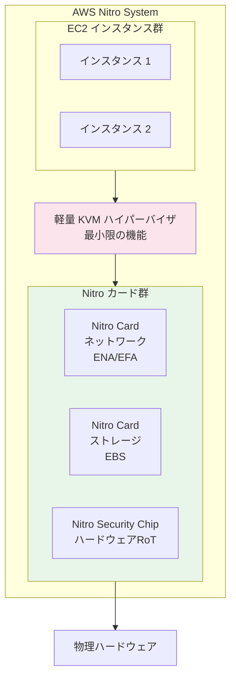

**Google Cloud Platform（GCP）**: KVMベースの仮想化を採用。独自の最適化を施したKVMを使用し、ライブマイグレーションを透過的に実行する点が特徴的である。GCPではホストのメンテナンス時に、ユーザーが意識することなくVMが別のホストにライブマイグレーションされる。

**Microsoft Azure**: Hyper-Vベースの仮想化を採用。Azure独自のホストOS「Azure Host OS」上でHyper-Vが動作する。

### 10.2 ハイパーバイザの軽量化トレンド

クラウドネイティブの時代において、ハイパーバイザには新たな要求が生まれている。サーバーレスコンピューティングやコンテナの普及により、「VMの起動を数十ミリ秒で完了させたい」「メモリフットプリントを極限まで小さくしたい」という要求が生まれた。

**Firecracker**: AWSが開発したオープンソースのマイクロVMモニタ。KVMの上で動作し、以下の特徴を持つ。

- 起動時間: 125ミリ秒以下
- メモリフットプリント: 5MB未満/VM
- 最小限のデバイスモデル: virtio-net, virtio-blk, シリアルコンソール, 部分的なi8042のみ
- セキュリティ: jailer（seccomp + cgroups + namespace）による多重防御

Firecrackerの設計思想は、QEMUの汎用性を捨て、クラウドワークロードに必要な機能だけを提供するというものである。QEMUは数十万行のコードベースを持つが、Firecrackerは数万行に収まっている。

**Cloud Hypervisor**: Intel（のちLinux Foundation傘下）が開発したRust製のVMM。Firecrackerと同様にKVMベースだが、より汎用的なワークロード（デスクトップVMやGPUパススルーなど）も対象としている。

```
マイクロVMの位置付け:

従来のVM                       マイクロVM                    コンテナ
+------------------+          +------------------+          +----------+
| 完全なゲストOS    |          | 軽量カーネル      |          | アプリ    |
| (数GB)           |          | (数MB〜数十MB)    |          | (数MB)   |
+------------------+          +------------------+          +----------+
| QEMU (汎用VMM)   |          | Firecracker等    |          | runc     |
| (数十万行)        |          | (軽量VMM)         |          |          |
+------------------+          +------------------+          +----------+
| KVM / ESXi       |          | KVM              |          | カーネル  |
+------------------+          +------------------+          +----------+

起動: 数秒〜数分             起動: 100ms以下               起動: 数十ms
隔離: 強い                   隔離: 強い                    隔離: 中程度
オーバーヘッド: 大            オーバーヘッド: 極小            オーバーヘッド: 極小
```

### 10.3 コンテナとハイパーバイザの共存

コンテナ技術の普及により「ハイパーバイザは不要になるのか」という議論がしばしば起きるが、実際には両者は補完的な関係にある。

コンテナはLinuxカーネルのNamespaceとcgroupsによってプロセスを隔離するが、カーネルは共有している。カーネルの脆弱性が突かれると、コンテナの隔離境界を突破される可能性がある。一方、VMはカーネルごと分離されているため、より強固な隔離が実現される。

実際のクラウド環境では、ハイパーバイザの上にコンテナを動かすというアーキテクチャが主流である。

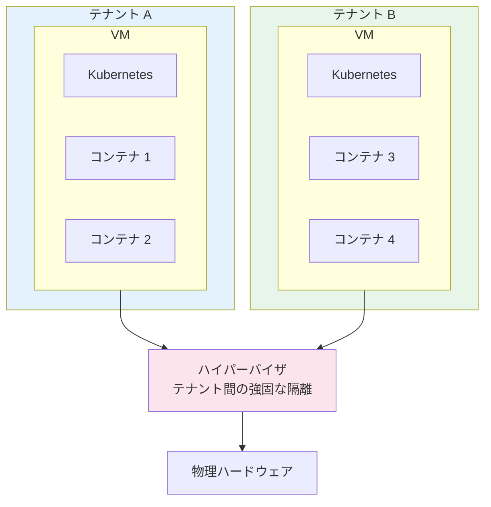

さらに、Kata ContainersやgVisorのような技術は、コンテナインターフェースを維持しつつVM レベルの隔離を提供する「ハイブリッド」アプローチを採用している。Kata Containersは各コンテナ（またはPod）を軽量VMの中で実行し、gVisorはユーザー空間でLinuxカーネルのシステムコールインターフェースを再実装したサンドボックスカーネルを提供する。

### 10.4 Confidential Computing

最新のハイパーバイザ技術の方向性として、**Confidential Computing**（機密コンピューティング）がある。これは、VMのメモリをハイパーバイザ自体からも保護する技術である。

従来のハイパーバイザは、ゲストVMのメモリに自由にアクセスできた。これは管理上は便利だが、クラウドプロバイダを完全に信頼しなければならないことを意味する。Confidential Computingは、ハードウェアレベルでVMのメモリを暗号化し、ハイパーバイザを含む外部のソフトウェアからアクセスできないようにする。

- **AMD SEV（Secure Encrypted Virtualization）**: ゲストVMのメモリをAES暗号で暗号化。SEV-SNP（Secure Nested Paging）では、メモリの整合性も保証
- **Intel TDX（Trust Domain Extensions）**: VMを「Trust Domain」として隔離し、ハイパーバイザからのメモリアクセスを防止
- **ARM CCA（Confidential Compute Architecture）**: ARMプロセッサ向けの機密コンピューティング技術

これらの技術は「クラウドプロバイダを信頼しなくても安全にワークロードを実行できる」という新しいセキュリティモデルを実現し、規制の厳しい業界（金融、医療、政府機関）でのクラウド採用を加速させている。

## まとめ

ハイパーバイザは、現代のクラウドコンピューティングを支える基盤技術である。1960年代のIBMメインフレームから始まり、x86の仮想化の壁を Binary Translation、準仮想化、ハードウェア支援仮想化という3つのアプローチで克服してきた。

KVMは「Linuxカーネル自体をハイパーバイザにする」という洞察で開発効率と品質を両立し、Xenは準仮想化とDom0アーキテクチャで先駆的な役割を果たした。CPU仮想化（VT-x/AMD-V）、メモリ仮想化（EPT/NPT）、I/O仮想化（Virtio, SR-IOV）という3つの柱が揃ったことで、仮想化のオーバーヘッドはネイティブ性能の数%以内にまで縮小された。

現代のクラウドでは、Firecrackerのようなマイクロ VMが数百ミリ秒でVMを起動し、Confidential Computingがハイパーバイザすらも信頼しないセキュリティモデルを実現しつつある。ハイパーバイザの技術は、コンテナやサーバーレスと共存しながら、今後も進化を続けていくだろう。
