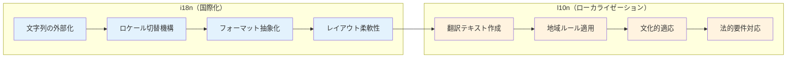
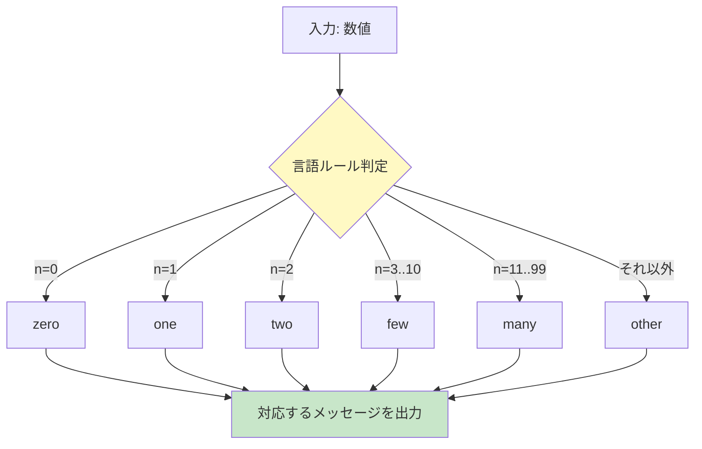
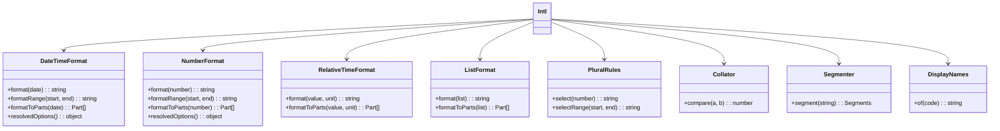
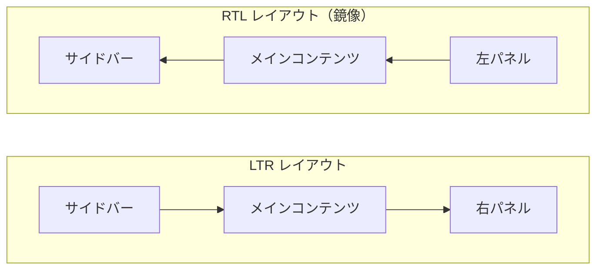
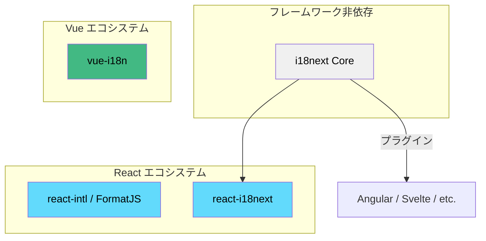
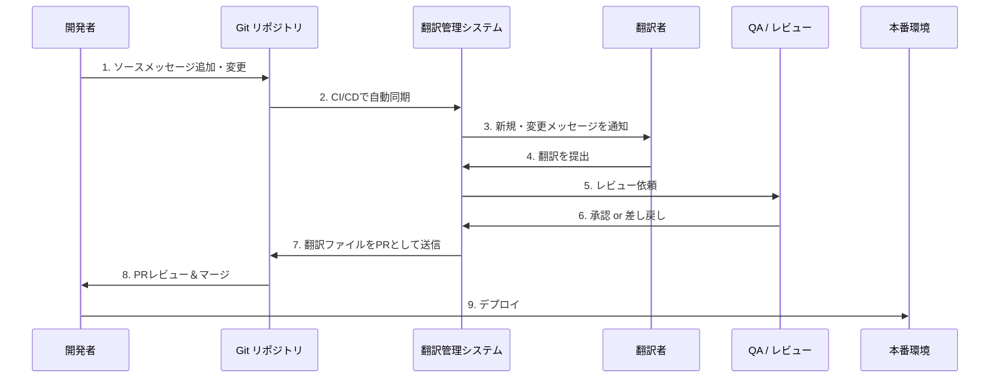

# 国際化（i18n）とローカライゼーション（l10n）の設計

## 1. i18n と l10n の違い

### 1.1 用語の起源と定義

ソフトウェアを世界中のユーザーに届けるためには、言語・文化・地域の違いに対応する仕組みが必要になる。この文脈で頻繁に登場する2つの用語が internationalization（i18n）と localization（l10n）である。数字の18と10は、それぞれ先頭文字と末尾文字の間にある文字数を示す略記法だ。

**国際化（i18n）** とは、ソフトウェアを特定の言語や地域に依存しない形で設計・実装するプロセスを指す。i18n はアプリケーションの「土台作り」であり、後から任意のロケールに対応できるようにコードの構造を整える作業である。具体的には、UI に表示する文字列をソースコードから分離する、日付や数値の表示をロケール依存にする、テキストの方向（LTR / RTL）を切り替え可能にする、といった設計上の判断が含まれる。

**ローカライゼーション（l10n）** とは、i18n で整備された土台の上に、特定の言語・地域向けのコンテンツや設定を適用するプロセスを指す。翻訳テキストの作成、日付フォーマットの地域ルール適用、通貨記号の設定、文化的に適切な画像やアイコンの選定などがこれに該当する。

この2つは本質的に異なるフェーズの作業であり、混同すると設計上の問題を引き起こす。



### 1.2 なぜ区別が重要か

i18n と l10n を区別する最大の理由は、作業の担当者とタイミングが異なるからだ。i18n はエンジニアが設計・開発フェーズで行う作業であり、l10n は翻訳者やローカライゼーションスペシャリストが行う作業である。

i18n を後回しにした場合、コードベース全体にハードコードされた文字列が散在し、後からの対応コストが指数関数的に増大する。筆者の経験則では、プロジェクト開始時に i18n を設計に組み込むコストを1とすると、リリース後に i18n を追加するコストは10〜50倍に膨らむ。これは単なる文字列置換の問題ではなく、レイアウト、入力バリデーション、エラーメッセージ、通知、メール本文など、テキストが関与するあらゆるレイヤーに変更が波及するためだ。

### 1.3 ロケールの概念

ロケールとは、言語・地域・その他の文化的設定を一意に特定する識別子である。BCP 47（IETF のベストカレントプラクティス）に準拠した形式が広く使われている。

| 形式 | 例 | 意味 |
|------|-----|------|
| 言語 | `ja` | 日本語 |
| 言語-地域 | `en-US` | アメリカ英語 |
| 言語-地域 | `en-GB` | イギリス英語 |
| 言語-文字体系 | `zh-Hans` | 簡体字中国語 |
| 言語-文字体系-地域 | `zh-Hant-TW` | 台湾の繁体字中国語 |

同じ言語でも地域によって表記が異なるケースは多い。英語だけでも、アメリカ英語（`en-US`）とイギリス英語（`en-GB`）では綴りが異なり（color / colour）、日付フォーマットも異なる（MM/DD/YYYY と DD/MM/YYYY）。ポルトガル語はブラジル（`pt-BR`）とポルトガル（`pt-PT`）で語彙レベルの違いがある。ロケールを適切に設計することは、ユーザーに自然な体験を届けるための基盤となる。

## 2. メッセージカタログとキー設計

### 2.1 メッセージカタログとは

メッセージカタログは、アプリケーションで使用するすべての翻訳対象文字列を管理するデータ構造である。一般的には JSON、YAML、またはプロパティファイルの形式で管理される。

```json
// en-US.json
{
  "common": {
    "save": "Save",
    "cancel": "Cancel",
    "delete": "Delete"
  },
  "user": {
    "profile": {
      "title": "User Profile",
      "name": "Name",
      "email": "Email Address"
    },
    "settings": {
      "title": "Settings",
      "language": "Language",
      "timezone": "Timezone"
    }
  }
}
```

```json
// ja.json
{
  "common": {
    "save": "保存",
    "cancel": "キャンセル",
    "delete": "削除"
  },
  "user": {
    "profile": {
      "title": "ユーザープロフィール",
      "name": "名前",
      "email": "メールアドレス"
    },
    "settings": {
      "title": "設定",
      "language": "言語",
      "timezone": "タイムゾーン"
    }
  }
}
```

### 2.2 キー設計の原則

メッセージキーの設計は、i18n アーキテクチャの品質を左右する重要な設計判断である。悪いキー設計は翻訳者の混乱を招き、保守コストを増大させる。

**原則1: 構造化された名前空間を使う**

フラットなキー構造ではなく、階層的な名前空間を導入することで、コンテキストを明確にし、名前の衝突を防ぐ。

```
// Bad: flat keys without context
"title"
"save"
"error"

// Good: hierarchical namespace
"user.profile.title"
"common.actions.save"
"checkout.payment.error.invalid_card"
```

**原則2: コンテンツではなく目的をキー名に反映する**

キー名には翻訳テキストの内容ではなく、その文字列が使われるコンテキストや目的を反映させるべきだ。

```
// Bad: key derived from English content
"click_here": "Click here"
"hello_world": "Hello, World!"

// Good: key reflects purpose
"navigation.cta_link": "Click here"
"dashboard.greeting": "Hello, World!"
```

この原則に従う理由は明快だ。英語では "Submit" だったボタンが、UX 改善で "Place Order" に変わった場合、コンテンツベースのキー `submit` は意味をなさなくなる。目的ベースのキー `checkout.place_order_button` であれば、テキストの変更に影響されない。

**原則3: 再利用に慎重になる**

同じ英語テキストを異なるコンテキストで再利用するのは危険だ。英語で同じ単語でも、他言語では文脈によって訳し分けが必要な場合がある。

```
// Dangerous: reusing "Post" across contexts
"common.post": "Post"  // blog post? social media post? mail post? verb "to post"?

// Safe: separate keys for each context
"blog.article_label": "Post"
"social.publish_action": "Post"
```

例えば英語の "Post" は名詞としても動詞としても使えるが、日本語では「投稿」（名詞）と「投稿する」（動詞）で異なる。ドイツ語やフランス語では性別によって冠詞が変わるため、さらに複雑になる。

**原則4: ページ・コンポーネント単位でスコープを切る**

大規模アプリケーションでは、ページやコンポーネント単位でメッセージファイルを分割するアプローチが有効である。

```
// File structure
locales/
├── en/
│   ├── common.json
│   ├── auth.json
│   ├── dashboard.json
│   ├── settings.json
│   └── checkout.json
├── ja/
│   ├── common.json
│   ├── auth.json
│   ├── dashboard.json
│   ├── settings.json
│   └── checkout.json
└── ...
```

この分割戦略は後述するパフォーマンス最適化（遅延読み込み）にも直結する。

### 2.3 翻訳の品質を支える仕組み

メッセージカタログには翻訳者向けのコンテキスト情報を付与することが望ましい。翻訳者はエンジニアではないため、キー名だけでは文脈を判断できないことが多い。

```json
{
  "checkout.item_count": {
    "message": "{count, plural, one {# item} other {# items}}",
    "description": "Displayed in the shopping cart summary, showing the total number of items",
    "maxLength": 30
  }
}
```

`description` フィールドは翻訳者に文脈を伝え、`maxLength` は UI の制約を伝える。これらのメタデータは翻訳品質を大きく左右する。

## 3. ICU MessageFormat

### 3.1 ICU MessageFormat とは

ICU（International Components for Unicode）MessageFormat は、IBM が開発した Unicode 関連ライブラリ群 ICU に含まれるメッセージフォーマット仕様である。単純な文字列置換を超えて、複数形、性別、選択分岐などの言語的な複雑さを宣言的に表現できる。

多くの i18n ライブラリ（react-intl、FormatJS、i18next の ICU プラグインなど）がこの仕様をサポートしており、事実上の業界標準となっている。

### 3.2 基本構文

ICU MessageFormat の基本的な構文要素を見ていこう。

**単純な変数補間**

```
Hello, {name}!
```

これは最もシンプルな形式で、`{name}` がランタイムの値で置換される。

**数値フォーマット**

```
Your balance is {amount, number, currency}.
```

`number` 型を指定することで、ロケールに応じた数値フォーマットが適用される。

**日付フォーマット**

```
Last login: {lastLogin, date, medium}
```

`date` 型では `short`、`medium`、`long`、`full` のスタイルを選択できる。

**選択分岐（select）**

```
{gender, select,
  male {He likes this.}
  female {She likes this.}
  other {They like this.}
}
```

`select` は列挙値に基づいて出力を切り替える。`other` は必須のフォールバックである。

**複数形（plural）**

```
{count, plural,
  =0 {No items in your cart.}
  one {One item in your cart.}
  other {# items in your cart.}
}
```

`#` は `count` の値で置換される特殊記号だ。`plural` の詳細は次節で解説する。

### 3.3 ネストされたメッセージ

ICU MessageFormat の強力な機能の一つは、構文をネストできることだ。

```
{gender, select,
  male {He has {count, plural,
    =0 {no new messages}
    one {one new message}
    other {# new messages}
  }.}
  female {She has {count, plural,
    =0 {no new messages}
    one {one new message}
    other {# new messages}
  }.}
  other {They have {count, plural,
    =0 {no new messages}
    one {one new message}
    other {# new messages}
  }.}
}
```

この例では性別と複数形が組み合わされている。ネストは強力だが、深くなると翻訳者にとって読みにくくなるため、3段階以上のネストは避けるべきだ。

### 3.4 ICU MessageFormat 2.0

ICU MessageFormat 2.0（MF2）は、従来の MessageFormat の設計上の課題を解決するために策定が進められている次世代仕様である。主な改善点は以下の通りだ。

- **構文の明確化**: 旧仕様の曖昧な部分を排除し、パーサの実装差異を減らす
- **カスタム関数のサポート**: `:number`、`:datetime` などの組み込み関数に加え、ユーザー定義関数を利用できる
- **宣言的変数バインディング**: `.local` や `.input` でメッセージ内に変数を定義可能

```
// MF2 syntax example
.local $count = {$itemCount :number}
.match $count
  0   {{Your cart is empty.}}
  one {{You have {$count} item.}}
  *   {{You have {$count} items.}}
```

MF2 は Unicode の技術標準 UTS #35 の一部として策定されており、今後ブラウザの `Intl.MessageFormat` API として標準化される可能性がある。

## 4. 複数形・性別対応

### 4.1 複数形の複雑さ

英語の複数形は比較的単純で、singular（1）と plural（それ以外）の2形態しかない。しかし、多くの言語では複数形のルールがはるかに複雑だ。

| 言語 | 複数形の数 | カテゴリ |
|------|-----------|----------|
| 日本語 | 1 | other のみ |
| 英語 | 2 | one, other |
| フランス語 | 3 | one, many, other |
| アラビア語 | 6 | zero, one, two, few, many, other |
| ポーランド語 | 4 | one, few, many, other |
| ロシア語 | 4 | one, few, many, other |

CLDR（Unicode Common Locale Data Repository）は、各言語の複数形ルールを体系的に定義している。ICU MessageFormat の `plural` はこの CLDR ルールに基づいて動作する。



### 4.2 ポーランド語の例で理解する複雑さ

ポーランド語の複数形ルールを具体的に見てみよう。「ファイル」を表す `plik` の変化形は以下の通りだ。

- 1 → `1 plik`（one）
- 2, 3, 4 → `2 pliki`（few）
- 5〜21 → `5 plików`（many）
- 22, 23, 24 → `22 pliki`（few）
- 25〜31 → `25 plików`（many）
- 32, 33, 34 → `32 pliki`（few）

このパターンは下一桁が2〜4（ただし12〜14を除く）のとき `few`、それ以外のとき `many` という規則に従う。このような複雑なルールを開発者がハードコードするのは非現実的であり、CLDR データと ICU の仕組みに委ねるべきだ。

```
// Polish plural example in ICU MessageFormat
{count, plural,
  one {Masz # plik}
  few {Masz # pliki}
  many {Masz # plików}
  other {Masz # pliku}
}
```

### 4.3 序数表現（ordinal）

複数形に似た仕組みとして、序数表現がある。英語では 1st、2nd、3rd、4th... と接尾辞が変化する。

```
{position, selectordinal,
  one {#st}
  two {#nd}
  few {#rd}
  other {#th}
}
```

`selectordinal` は `plural` と同様に CLDR のルールに基づくが、序数専用のカテゴリマッピングを使用する。

### 4.4 性別対応

多くのヨーロッパ言語では、名詞に文法上の性（gender）があり、それに応じて冠詞、形容詞、動詞の活用が変化する。

```
// French example
{gender, select,
  male {Il est allé au magasin.}
  female {Elle est allée au magasin.}
  other {Cette personne est allée au magasin.}
}
```

フランス語では、主語の性別によって「行った」の過去分詞が `allé`（男性）/ `allée`（女性）と変化する。このような文法規則はソースコード内で条件分岐として書くのではなく、メッセージカタログの ICU MessageFormat で表現するのが正しいアプローチだ。

### 4.5 性別とインクルーシブデザイン

近年、ノンバイナリーやジェンダーニュートラルな表現への対応が重要になっている。ICU MessageFormat の `select` における `other` カテゴリは、この要件に対応するためのフォールバックとして機能する。

英語では "they/them" を単数代名詞として使う用法が一般化しており、ドイツ語やフランス語でもジェンダーニュートラルな表現方法が模索されている。i18n の設計では、`male` / `female` の2値に限定せず、`other` または `nonbinary` カテゴリを含めることが推奨される。

## 5. 日付・数値・通貨のフォーマット（Intl API）

### 5.1 ECMAScript Internationalization API の概要

ブラウザと Node.js に組み込まれた `Intl` オブジェクトは、ロケール依存のフォーマット処理を行うための標準 API である。外部ライブラリに頼らずとも、日付、数値、通貨、リスト、相対時間などのフォーマットをネイティブに処理できる。

`Intl` API は ICU ライブラリのデータに基づいており、CLDR の膨大なロケールデータを活用している。主要なクラスは以下の通りだ。



### 5.2 日付と時刻のフォーマット

`Intl.DateTimeFormat` は日付と時刻のロケール依存フォーマットを提供する。

```javascript
const date = new Date("2026-03-02T14:30:00Z");

// Japanese
new Intl.DateTimeFormat("ja-JP", {
  year: "numeric",
  month: "long",
  day: "numeric",
  weekday: "long",
}).format(date);
// => "2026年3月2日月曜日"

// American English
new Intl.DateTimeFormat("en-US", {
  year: "numeric",
  month: "long",
  day: "numeric",
  weekday: "long",
}).format(date);
// => "Monday, March 2, 2026"

// German
new Intl.DateTimeFormat("de-DE", {
  year: "numeric",
  month: "long",
  day: "numeric",
  weekday: "long",
}).format(date);
// => "Montag, 2. März 2026"

// Arabic (Egypt)
new Intl.DateTimeFormat("ar-EG", {
  year: "numeric",
  month: "long",
  day: "numeric",
}).format(date);
// => "٢ مارس ٢٠٢٦"
```

`formatToParts` メソッドを使うと、フォーマット結果を構成要素に分解できる。これは独自のスタイリングを適用したい場合に便利だ。

```javascript
new Intl.DateTimeFormat("ja-JP", {
  year: "numeric",
  month: "long",
  day: "numeric",
}).formatToParts(date);
// => [
//   { type: "year", value: "2026" },
//   { type: "literal", value: "年" },
//   { type: "month", value: "3" },
//   { type: "literal", value: "月" },
//   { type: "day", value: "2" },
//   { type: "literal", value: "日" },
// ]
```

### 5.3 数値のフォーマット

`Intl.NumberFormat` は、数値を各ロケールの慣習に従ってフォーマットする。小数点記号、桁区切り文字、数字体系はロケールによって異なる。

```javascript
const num = 1234567.89;

// Japanese
new Intl.NumberFormat("ja-JP").format(num);
// => "1,234,567.89"

// German (uses period for thousands, comma for decimal)
new Intl.NumberFormat("de-DE").format(num);
// => "1.234.567,89"

// Indian (uses lakh/crore grouping)
new Intl.NumberFormat("en-IN").format(num);
// => "12,34,567.89"

// Arabic (Eastern Arabic numerals)
new Intl.NumberFormat("ar-EG").format(num);
// => "١٬٢٣٤٬٥٦٧٫٨٩"
```

注目すべきはインドの数値フォーマットだ。インドでは千の位の後は2桁ずつ区切るため（lakh = 100,000、crore = 10,000,000）、単純な正規表現では対応できない。`Intl.NumberFormat` はこのような地域特有のルールを正確に処理する。

### 5.4 通貨のフォーマット

通貨表示はさらに複雑だ。通貨記号の位置（前置 / 後置）、記号の種類（$、¥、€、kr）、小数点以下の桁数（JPY は0桁、USD は2桁、BHD は3桁）がロケールと通貨の組み合わせで決まる。

```javascript
const amount = 1234.5;

// Japanese Yen (no decimal places)
new Intl.NumberFormat("ja-JP", {
  style: "currency",
  currency: "JPY",
}).format(amount);
// => "￥1,235"

// US Dollar
new Intl.NumberFormat("en-US", {
  style: "currency",
  currency: "USD",
}).format(amount);
// => "$1,234.50"

// Euro in German locale (symbol after number)
new Intl.NumberFormat("de-DE", {
  style: "currency",
  currency: "EUR",
}).format(amount);
// => "1.234,50 €"

// Bahraini Dinar (3 decimal places)
new Intl.NumberFormat("ar-BH", {
  style: "currency",
  currency: "BHD",
}).format(amount);
// => "١٬٢٣٤٫٥٠٠ د.ب.‏"
```

::: warning 通貨の表示ロケールと通貨コードは独立
`Intl.NumberFormat` のコンストラクタに渡すロケールは「表示形式のルール」を決定し、`currency` オプションは「どの通貨を表示するか」を指定する。日本語ロケールでも米ドルを表示可能であり、この2つを混同してはならない。
:::

### 5.5 相対時間のフォーマット

`Intl.RelativeTimeFormat` は「3日前」「2時間後」のような相対時間表現をロケールに応じてフォーマットする。

```javascript
const rtf = new Intl.RelativeTimeFormat("ja", { numeric: "auto" });

rtf.format(-1, "day");    // => "昨日"
rtf.format(0, "day");     // => "今日"
rtf.format(1, "day");     // => "明日"
rtf.format(-3, "hour");   // => "3 時間前"
rtf.format(2, "month");   // => "2 か月後"
```

`numeric: "auto"` を指定すると、「1日前」ではなく「昨日」のような自然な表現が使われる。

### 5.6 リストのフォーマット

`Intl.ListFormat` は配列の要素をロケールの慣習に従って連結する。

```javascript
const items = ["React", "Vue", "Angular"];

// English (Oxford comma)
new Intl.ListFormat("en", { type: "conjunction" }).format(items);
// => "React, Vue, and Angular"

// Japanese
new Intl.ListFormat("ja", { type: "conjunction" }).format(items);
// => "React、Vue、Angular"

// Chinese
new Intl.ListFormat("zh", { type: "conjunction" }).format(items);
// => "React、Vue和Angular"
```

`type` は `conjunction`（AとBとC）、`disjunction`（AまたはBまたはC）、`unit`（A、B、C）の3種類から選択できる。

### 5.7 タイムゾーンの扱い

日時の i18n でタイムゾーンは最も厄介な問題の一つだ。`Intl.DateTimeFormat` は `timeZone` オプションで IANA タイムゾーン名を指定できる。

```javascript
const date = new Date("2026-03-02T12:00:00Z");

// Display in multiple time zones
["America/New_York", "Europe/London", "Asia/Tokyo"].forEach((tz) => {
  const formatted = new Intl.DateTimeFormat("en-US", {
    timeZone: tz,
    hour: "numeric",
    minute: "numeric",
    timeZoneName: "short",
  }).format(date);
  console.log(`${tz}: ${formatted}`);
});
// America/New_York: 7:00 AM EST
// Europe/London: 12:00 PM GMT
// Asia/Tokyo: 9:00 PM JST
```

::: tip サーバーとクライアントの時刻表現
日時データはサーバーサイドでは常に UTC で保存し、クライアントサイドでユーザーのタイムゾーンに変換して表示するのがベストプラクティスだ。ISO 8601 形式（`2026-03-02T12:00:00Z`）でのデータ交換を徹底すれば、タイムゾーン関連のバグを大幅に減らせる。
:::

## 6. RTL（Right-to-Left）対応

### 6.1 RTL 言語の概要

世界の言語の大多数は左から右（LTR: Left-to-Right）に書かれるが、アラビア語、ヘブライ語、ペルシア語、ウルドゥー語などは右から左（RTL: Right-to-Left）に書かれる。これらの言語を使う人口は世界で約5億人に達する。

RTL 対応はテキストの方向を反転させるだけではなく、レイアウト全体の「鏡像化」を必要とする。ナビゲーションバー、サイドバー、アイコンの方向、スクロールバーの位置、プログレスバーの進行方向など、UI のあらゆる要素に影響が及ぶ。



### 6.2 HTML と CSS による RTL 対応

HTML の `dir` 属性と CSS の論理的プロパティを組み合わせることで、RTL 対応を効率的に行える。

```html
<!-- Setting document direction -->
<html lang="ar" dir="rtl">
  <body>
    <p>مرحبا بالعالم</p>
  </body>
</html>
```

CSS では、物理的プロパティ（`left` / `right`、`margin-left` / `margin-right`）ではなく、論理的プロパティを使うことが重要だ。

```css
/* Bad: physical properties require separate RTL overrides */
.sidebar {
  margin-left: 20px;
  padding-left: 16px;
  border-left: 1px solid #ccc;
  text-align: left;
}

[dir="rtl"] .sidebar {
  margin-left: 0;
  margin-right: 20px;
  padding-left: 0;
  padding-right: 16px;
  border-left: none;
  border-right: 1px solid #ccc;
  text-align: right;
}

/* Good: logical properties automatically adapt to text direction */
.sidebar {
  margin-inline-start: 20px;
  padding-inline-start: 16px;
  border-inline-start: 1px solid #ccc;
  text-align: start;
}
```

論理的プロパティの対応表を以下に示す。

| 物理的プロパティ | 論理的プロパティ |
|----------------|----------------|
| `margin-left` / `margin-right` | `margin-inline-start` / `margin-inline-end` |
| `padding-left` / `padding-right` | `padding-inline-start` / `padding-inline-end` |
| `border-left` / `border-right` | `border-inline-start` / `border-inline-end` |
| `left` / `right` | `inset-inline-start` / `inset-inline-end` |
| `text-align: left` / `right` | `text-align: start` / `end` |
| `width` / `height` | `inline-size` / `block-size` |
| `margin-top` / `margin-bottom` | `margin-block-start` / `margin-block-end` |

### 6.3 双方向テキスト（Bidi）の取り扱い

現実のアプリケーションでは、RTL テキストの中に LTR テキスト（英語のブランド名、URL、数値など）が混在するケースが頻繁に発生する。Unicode Bidirectional Algorithm（UBA）がこの処理を自動的に行うが、意図通りに表示されない場合は Unicode 制御文字を明示的に使う必要がある。

```html
<!-- Embedding LTR text within RTL context -->
<p dir="rtl">
  تم الإرسال بواسطة
  <bdo dir="ltr">user@example.com</bdo>
</p>

<!-- Isolating bidirectional text -->
<p dir="rtl">
  اسم المستخدم: <bdi>John Smith</bdi>
</p>
```

`<bdi>`（Bi-Directional Isolation）要素は、囲まれたテキストの方向を周囲のコンテキストから隔離する。ユーザー入力のように方向が不明なテキストを埋め込む際に必須である。

### 6.4 RTL 対応で注意すべきアイコンと画像

すべてのアイコンをミラーリングすべきではない。方向性を持つアイコン（矢印、「戻る」ボタンなど）はミラーリングが必要だが、方向に依存しないアイコン（ゴミ箱、星マーク、検索虫眼鏡など）はそのままにすべきだ。

```css
/* Icons that should be mirrored in RTL */
[dir="rtl"] .icon-arrow-forward,
[dir="rtl"] .icon-chevron-right,
[dir="rtl"] .icon-reply {
  transform: scaleX(-1);
}

/* Icons that should NOT be mirrored */
/* Checkmarks, stars, search icons, media controls (play/pause) */
```

Material Design のガイドラインでは、以下の基準を示している。

- **ミラーリングする**: 方向を示すアイコン（矢印、進む/戻る、チャットの吹き出し、テキスト整列）
- **ミラーリングしない**: 普遍的なシンボル（チェックマーク、音楽の再生/停止、時計）、ロゴや固有名詞に関連するもの

## 7. ライブラリ比較（react-intl / i18next / vue-i18n）

### 7.1 概要

フロントエンドの i18n ライブラリは多数存在するが、ここでは最も広く使われている3つのライブラリを比較する。



### 7.2 react-intl（FormatJS）

react-intl は FormatJS プロジェクトの React バインディングであり、Yahoo（現 Meta の一部）が中心となって開発している。ICU MessageFormat をネイティブにサポートしており、`Intl` API との統合が深い。

```tsx
import { IntlProvider, FormattedMessage, useIntl } from "react-intl";

// Messages definition
const messages = {
  en: {
    "greeting": "Hello, {name}!",
    "item.count": "{count, plural, one {# item} other {# items}} in cart",
    "last.login": "Last login: {date, date, medium}",
  },
  ja: {
    "greeting": "こんにちは、{name}さん！",
    "item.count": "カート内: {count}個",
    "last.login": "最終ログイン: {date, date, medium}",
  },
};

// Provider setup
function App() {
  const locale = "ja";
  return (
    <IntlProvider locale={locale} messages={messages[locale]}>
      <Dashboard />
    </IntlProvider>
  );
}

// Component usage
function Dashboard() {
  const intl = useIntl();

  return (
    <div>
      {/* Declarative API */}
      <h1>
        <FormattedMessage id="greeting" values={{ name: "田中" }} />
      </h1>

      {/* Imperative API */}
      <p>
        {intl.formatMessage(
          { id: "item.count" },
          { count: 5 }
        )}
      </p>

      {/* Built-in formatters */}
      <p>
        {intl.formatDate(new Date(), { dateStyle: "long" })}
      </p>
      <p>
        {intl.formatNumber(1234.5, { style: "currency", currency: "JPY" })}
      </p>
    </div>
  );
}
```

**特徴**:
- ICU MessageFormat をネイティブサポート
- `Intl` API との緊密な統合
- コンパイル時のメッセージ抽出・検証ツール（`@formatjs/cli`）
- TypeScript の型安全性が高い
- メッセージの AST への事前コンパイルによる実行時パフォーマンス最適化

**注意点**:
- React 専用（他のフレームワークでは使えない）
- ICU MessageFormat の学習コストがある
- バンドルサイズがやや大きい（ポリフィル含む場合）

### 7.3 i18next

i18next はフレームワーク非依存の i18n ライブラリであり、プラグインアーキテクチャによって高い拡張性を持つ。React（react-i18next）、Vue、Angular、Svelte、Node.js など、あらゆる環境で利用できる。

```tsx
import i18n from "i18next";
import { initReactI18next, useTranslation, Trans } from "react-i18next";
import Backend from "i18next-http-backend";
import LanguageDetector from "i18next-browser-languagedetector";

// Initialization
i18n
  .use(Backend) // load translations from server
  .use(LanguageDetector) // detect user language
  .use(initReactI18next) // bind to React
  .init({
    fallbackLng: "en",
    ns: ["common", "dashboard", "settings"], // namespaces
    defaultNS: "common",
    interpolation: {
      escapeValue: false, // React already escapes
    },
    backend: {
      loadPath: "/locales/{{lng}}/{{ns}}.json",
    },
  });

// Translation files: /locales/en/common.json
// {
//   "greeting": "Hello, {{name}}!",
//   "item_count": "{{count}} item",
//   "item_count_plural": "{{count}} items"
// }

// Component usage
function Dashboard() {
  const { t, i18n } = useTranslation("dashboard");

  return (
    <div>
      {/* Simple translation */}
      <h1>{t("greeting", { name: "Tanaka" })}</h1>

      {/* Pluralization */}
      <p>{t("item_count", { count: 5 })}</p>

      {/* Nested interpolation with React components */}
      <p>
        <Trans i18nKey="welcome_message">
          Welcome to <strong>our app</strong>. Click <a href="/docs">here</a>.
        </Trans>
      </p>

      {/* Language switching */}
      <button onClick={() => i18n.changeLanguage("ja")}>
        日本語
      </button>
    </div>
  );
}
```

**特徴**:
- フレームワーク非依存（React、Vue、Angular、Svelte、Node.js で共通の知識が使える）
- 豊富なプラグインエコシステム（バックエンド、言語検出、キャッシュ、後処理など）
- 名前空間による翻訳ファイルの分割
- 遅延読み込みのネイティブサポート
- ICU MessageFormat はプラグイン（`i18next-icu`）で対応
- Locize などの翻訳管理プラットフォームとの統合

**注意点**:
- 独自の複数形構文（`_plural` サフィックス）がデフォルト
- ICU MessageFormat は追加プラグインが必要
- 設定の柔軟性が高い分、初期設定がやや複雑

### 7.4 vue-i18n

vue-i18n は Vue.js 専用の i18n ライブラリであり、Vue のリアクティブシステムと深く統合されている。Vue 3 では Composition API に対応した v9 が使われる。

```vue
<script setup>
import { useI18n } from "vue-i18n";

const { t, n, d, locale } = useI18n();
</script>

<template>
  <div>
    <!-- Simple translation -->
    <h1>{{ t("greeting", { name: "田中" }) }}</h1>

    <!-- Pluralization -->
    <p>{{ t("item_count", { count: 5 }) }}</p>

    <!-- Number formatting -->
    <p>{{ n(1234.5, "currency") }}</p>

    <!-- Date formatting -->
    <p>{{ d(new Date(), "long") }}</p>

    <!-- Component interpolation -->
    <i18n-t keypath="welcome" tag="p">
      <template #link>
        <a href="/docs">{{ t("docs_link") }}</a>
      </template>
    </i18n-t>

    <!-- Language switching -->
    <select v-model="locale">
      <option value="en">English</option>
      <option value="ja">日本語</option>
    </select>
  </div>
</template>
```

```javascript
import { createI18n } from "vue-i18n";

const i18n = createI18n({
  legacy: false, // use Composition API mode
  locale: "ja",
  fallbackLocale: "en",
  messages: {
    en: {
      greeting: "Hello, {name}!",
      item_count: "No items | One item | {count} items",
    },
    ja: {
      greeting: "こんにちは、{name}さん！",
      item_count: "{count}個のアイテム",
    },
  },
  numberFormats: {
    en: {
      currency: { style: "currency", currency: "USD" },
    },
    ja: {
      currency: { style: "currency", currency: "JPY" },
    },
  },
  datetimeFormats: {
    en: {
      long: { year: "numeric", month: "long", day: "numeric" },
    },
    ja: {
      long: { year: "numeric", month: "long", day: "numeric" },
    },
  },
});
```

**特徴**:
- Vue のリアクティブシステムと完全統合（ロケール変更時に自動的に再レンダリング）
- SFC（Single File Component）内での `<i18n>` カスタムブロックサポート
- 独自の複数形構文（パイプ `|` 区切り）
- `v-t` ディレクティブによるテンプレート内翻訳
- 日付・数値フォーマットの設定を一元管理

**注意点**:
- Vue.js 専用
- ICU MessageFormat は追加プラグインが必要
- 独自の複数形構文は言語による複雑な複数形ルールに対応しにくい

### 7.5 比較表

| 観点 | react-intl | i18next | vue-i18n |
|------|-----------|---------|----------|
| フレームワーク | React 専用 | 非依存 | Vue 専用 |
| ICU MessageFormat | ネイティブ | プラグイン | プラグイン |
| 複数形 | CLDR ベース | 独自 / ICU | パイプ構文 / CLDR |
| 遅延読み込み | 手動実装 | ネイティブ | プラグイン |
| TypeScript | 良好 | 良好 | 良好 |
| バンドルサイズ (core) | ~40KB | ~25KB | ~35KB |
| 翻訳管理ツール連携 | Crowdin, Phrase | Locize, Crowdin | Crowdin, Lokalise |
| 学習曲線 | ICU 構文の理解が必要 | 低い | Vue 知識前提 |
| SSR サポート | Next.js 対応 | Next.js / Nuxt 対応 | Nuxt 対応 |

## 8. 翻訳ワークフロー

### 8.1 翻訳ワークフローの全体像

i18n を実運用に乗せるには、エンジニアリングだけでなく翻訳プロセス全体の設計が必要だ。



### 8.2 翻訳管理システム（TMS）

翻訳管理システムは、翻訳ワークフローを支えるプラットフォームである。主要な TMS を以下に紹介する。

**Crowdin**: GitHub / GitLab との統合が強力で、ソースファイルの変更を自動検出して翻訳タスクを生成する。翻訳メモリ、用語集管理、機械翻訳との統合（DeepL、Google Translate）を備える。オープンソースプロジェクトには無料プランがある。

**Phrase（旧 Memsource + PhraseApp）**: エンタープライズ向けの高機能 TMS。翻訳メモリの共有、品質保証チェック、ワークフローの自動化が充実している。

**Locize**: i18next の開発チームが提供するクラウドサービスで、i18next とのシームレスな統合が特徴。CDN からの翻訳配信、A/B テスト、リアルタイムのインコンテキスト翻訳編集をサポートする。

**Lokalise**: 開発者体験を重視した TMS で、豊富な API と SDK を提供する。Figma プラグインによるデザイン段階での翻訳対応が特徴的だ。

### 8.3 メッセージの抽出と同期

ソースコードからメッセージキーを自動抽出する仕組みは、翻訳ワークフローの効率化に不可欠だ。

```bash
# FormatJS: extract messages from source code
npx @formatjs/cli extract 'src/**/*.tsx' \
  --out-file lang/en.json \
  --id-interpolation-pattern '[sha512:contenthash:base64:6]'

# i18next: extract keys using i18next-parser
npx i18next-parser 'src/**/*.{ts,tsx}'
```

FormatJS の `@formatjs/cli` は、React コンポーネントから `<FormattedMessage>` や `intl.formatMessage` の呼び出しを静的解析し、メッセージカタログを自動生成する。これにより、ソースコードとメッセージカタログの同期が保証される。

### 8.4 翻訳品質の担保

翻訳品質を担保するために、以下の自動チェックを CI パイプラインに組み込むことが推奨される。

```typescript
// Example: CI check for missing translations
import en from "./locales/en.json";
import ja from "./locales/ja.json";
import de from "./locales/de.json";

function findMissingKeys(
  source: Record<string, string>,
  target: Record<string, string>,
  locale: string
): string[] {
  const missing: string[] = [];
  for (const key of Object.keys(source)) {
    if (!(key in target)) {
      missing.push(key);
    }
  }
  if (missing.length > 0) {
    console.error(
      `[${locale}] Missing ${missing.length} translations:`,
      missing
    );
  }
  return missing;
}

// Check all target locales against source (English)
const locales = { ja, de };
let hasErrors = false;
for (const [locale, messages] of Object.entries(locales)) {
  const missing = findMissingKeys(en, messages, locale);
  if (missing.length > 0) hasErrors = true;
}
if (hasErrors) process.exit(1);
```

さらに、ICU MessageFormat のメッセージについては、構文の妥当性チェックやプレースホルダーの一致確認も重要だ。

```typescript
// Check ICU message syntax validity
import { parse } from "@formatjs/icu-messageformat-parser";

function validateICUMessage(key: string, message: string): boolean {
  try {
    parse(message);
    return true;
  } catch (error) {
    console.error(`Invalid ICU message for key "${key}":`, error.message);
    return false;
  }
}
```

### 8.5 擬似ロケールによるテスト

実際の翻訳がなくても i18n の実装を検証する手法として、擬似ロケール（pseudo-locale）がある。

```
// Original English
"Save Changes"

// Pseudo-locale: accented (tests character rendering)
"[Šàvé Çhàñgéš]"

// Pseudo-locale: elongated (tests text expansion)
"[Saaavvveee Chaaannngggeesss !!!!!]"

// Pseudo-locale: bidi (tests RTL layout)
"[‮Save Changes‬]"
```

擬似ロケールは以下の目的で使われる。

- **アクセント付き文字テスト**: 文字エンコーディングの問題を早期発見
- **テキスト伸張テスト**: ドイツ語やフィンランド語のように、英語より30〜50%長くなる翻訳でもレイアウトが崩れないか確認
- **RTL テスト**: アラビア語やヘブライ語のレイアウトが正常に動作するか確認
- **未翻訳検出**: すべての UI テキストが翻訳パイプラインを通過しているか可視化

FormatJS は `@formatjs/cli` の `compile` コマンドで擬似ロケールを生成する機能を提供している。

## 9. パフォーマンスとバンドルサイズ

### 9.1 i18n のパフォーマンス課題

i18n は正しく実装しないとパフォーマンスの足かせになる。主な課題は以下の3つだ。

1. **バンドルサイズの増大**: すべてのロケールの翻訳データを初期バンドルに含めると、サイズが膨大になる
2. **実行時のフォーマットコスト**: ICU MessageFormat のパース、複数形判定、日付/数値フォーマットは計算コストがかかる
3. **レンダリングのオーバーヘッド**: ロケール変更時のアプリケーション全体の再レンダリング

### 9.2 遅延読み込み（Lazy Loading）

最も効果的な最適化は、翻訳データの遅延読み込みだ。ユーザーが使用するロケールの翻訳だけを、必要なタイミングで読み込む。

```typescript
// Dynamic import for locale data
async function loadLocale(locale: string): Promise<Record<string, string>> {
  // Webpack/Vite dynamic import with code splitting
  const messages = await import(`./locales/${locale}.json`);
  return messages.default;
}

// Page-level lazy loading
async function loadPageMessages(
  locale: string,
  page: string
): Promise<Record<string, string>> {
  const [common, pageMessages] = await Promise.all([
    import(`./locales/${locale}/common.json`),
    import(`./locales/${locale}/${page}.json`),
  ]);
  return { ...common.default, ...pageMessages.default };
}
```

i18next ではバックエンドプラグインによるネイティブな遅延読み込みがサポートされている。

```typescript
import i18n from "i18next";
import Backend from "i18next-http-backend";

i18n.use(Backend).init({
  backend: {
    // Load translations from CDN or API
    loadPath: "https://cdn.example.com/locales/{{lng}}/{{ns}}.json",
  },
  ns: ["common"], // load common namespace initially
  partialBundledLanguages: true,
});

// Lazy load additional namespaces when needed
async function onNavigateToSettings() {
  await i18n.loadNamespaces("settings");
  // Now "settings" namespace is available
}
```

### 9.3 メッセージのコンパイル

ICU MessageFormat のメッセージをビルド時に AST にコンパイルしておくことで、実行時のパースコストを排除できる。

```bash
# FormatJS: compile messages to AST at build time
npx @formatjs/cli compile lang/en.json \
  --out-file compiled/en.json \
  --ast
```

コンパイル前:
```json
{
  "greeting": "Hello, {name}! You have {count, plural, one {# message} other {# messages}}."
}
```

コンパイル後（AST 形式）:
```json
{
  "greeting": [
    { "type": 0, "value": "Hello, " },
    { "type": 1, "value": "name" },
    { "type": 0, "value": "! You have " },
    {
      "type": 6,
      "value": "count",
      "options": {
        "one": { "value": [{ "type": 0, "value": "" }, { "type": 7 }, { "type": 0, "value": " message" }] },
        "other": { "value": [{ "type": 0, "value": "" }, { "type": 7 }, { "type": 0, "value": " messages" }] }
      },
      "offset": 0,
      "pluralType": "cardinal"
    },
    { "type": 0, "value": "." }
  ]
}
```

この事前コンパイルにより、実行時のメッセージパース処理が不要になり、初回レンダリングが高速化される。FormatJS の公式ドキュメントによれば、コンパイル済み AST を使用することで ICU MessageFormat のランタイムパースを完全にスキップでき、特にメッセージ数が多いアプリケーションで顕著なパフォーマンス改善が見られる。

### 9.4 バンドルサイズの最適化

`Intl` API のポリフィルはバンドルサイズに大きな影響を与える。最新のブラウザでは多くの `Intl` API がネイティブサポートされているため、ポリフィルの必要性を慎重に評価すべきだ。

```typescript
// Conditional polyfill loading
async function loadIntlPolyfills(locale: string) {
  // Only load if not natively supported
  if (!Intl.PluralRules) {
    await import("@formatjs/intl-pluralrules/polyfill");
    await import(`@formatjs/intl-pluralrules/locale-data/${locale}`);
  }

  if (!Intl.RelativeTimeFormat) {
    await import("@formatjs/intl-relativetimeformat/polyfill");
    await import(
      `@formatjs/intl-relativetimeformat/locale-data/${locale}`
    );
  }
}
```

また、ロケールデータの読み込みにおいても、必要なロケールのデータのみを含める最適化が重要だ。

```javascript
// vite.config.ts - limit included locales
export default defineConfig({
  plugins: [
    // Only include locale data for supported languages
    {
      name: "limit-intl-locales",
      resolveId(source) {
        // Redirect unsupported locale data to empty module
        if (
          source.includes("locale-data/") &&
          !["en", "ja", "de", "fr", "ar"].some((l) =>
            source.includes(`/${l}`)
          )
        ) {
          return { id: "virtual:empty-module", external: false };
        }
      },
    },
  ],
});
```

### 9.5 レンダリング最適化

React アプリケーションでロケールが変更されると、Context の更新によりコンポーネントツリー全体が再レンダリングされる可能性がある。これを軽減するために、メモ化とコンポーネント分割が有効だ。

```tsx
import { memo, useMemo } from "react";
import { useIntl } from "react-intl";

// Memoize components that use translations
const PriceDisplay = memo(function PriceDisplay({
  amount,
  currency,
}: {
  amount: number;
  currency: string;
}) {
  const intl = useIntl();
  const formatted = useMemo(
    () =>
      intl.formatNumber(amount, { style: "currency", currency }),
    [intl, amount, currency]
  );
  return <span>{formatted}</span>;
});

// Cache formatter instances
function useCachedFormatter() {
  const intl = useIntl();

  // Intl.NumberFormat instances are expensive to create
  // Cache them for reuse
  const currencyFormatter = useMemo(
    () =>
      new Intl.NumberFormat(intl.locale, {
        style: "currency",
        currency: "JPY",
      }),
    [intl.locale]
  );

  return { currencyFormatter };
}
```

`Intl.NumberFormat` や `Intl.DateTimeFormat` のインスタンスは生成コストが高いため、同じオプションで繰り返し使う場合はインスタンスをキャッシュすべきだ。

### 9.6 SSR / SSG における考慮事項

サーバーサイドレンダリング（SSR）や静的サイト生成（SSG）では、i18n に関する追加の考慮が必要だ。

```typescript
// Next.js App Router: per-request locale
// app/[locale]/layout.tsx
import { IntlProvider } from "next-intl";

export default async function LocaleLayout({
  children,
  params,
}: {
  children: React.ReactNode;
  params: { locale: string };
}) {
  const { locale } = await params;
  const messages = (await import(`../../messages/${locale}.json`))
    .default;

  return (
    <html lang={locale} dir={locale === "ar" ? "rtl" : "ltr"}>
      <body>
        <IntlProvider locale={locale} messages={messages}>
          {children}
        </IntlProvider>
      </body>
    </html>
  );
}
```

SSR では以下の点に注意が必要だ。

- **ハイドレーションの不一致**: サーバーとクライアントで異なるタイムゾーンやロケールが使われると、HTML の不一致が発生する。サーバー側でクライアントのロケール情報（`Accept-Language` ヘッダ、Cookie など）を正確に取得することが重要だ
- **URL 戦略**: ロケールを URL にどう反映するかの設計判断が必要。サブパス（`/ja/about`）、サブドメイン（`ja.example.com`）、クエリパラメータ（`?locale=ja`）のいずれかを選択する。SEO の観点からはサブパスかサブドメインが推奨される
- **`hreflang` タグ**: 検索エンジンに多言語ページの存在を伝えるため、各ページに `hreflang` タグを設定する

```html
<link rel="alternate" hreflang="en" href="https://example.com/en/about" />
<link rel="alternate" hreflang="ja" href="https://example.com/ja/about" />
<link rel="alternate" hreflang="x-default" href="https://example.com/about" />
```

## 10. まとめと設計指針

### 10.1 i18n 設計のチェックリスト

i18n を成功させるために、プロジェクト開始時に以下のチェックリストを確認することを推奨する。

**アーキテクチャ設計**:
- すべての UI テキストがメッセージカタログに外部化されているか
- キー設計は目的ベース・階層的名前空間に従っているか
- 翻訳ファイルの分割戦略（ページ / コンポーネント単位）が定義されているか
- 遅延読み込みの仕組みが設計されているか

**テキスト処理**:
- ICU MessageFormat（または同等の仕組み）で複数形・性別・選択が処理できるか
- 日付・数値・通貨のフォーマットに `Intl` API を使用しているか
- テキストの伸張（英語比30〜50%増）を許容するレイアウト設計になっているか

**レイアウトと表示**:
- CSS 論理的プロパティを使用し、RTL 対応が可能か
- フォントの選定で CJK 文字やアラビア文字に対応しているか
- アイコンのミラーリングルールが定義されているか

**ワークフロー**:
- 翻訳管理システム（TMS）と Git リポジトリの同期が自動化されているか
- 翻訳の欠落・構文エラーを検出する CI チェックが導入されているか
- 擬似ロケールによるテストが実施されているか

### 10.2 よくある失敗パターン

**文字列結合による翻訳不能メッセージ**:

```typescript
// Bad: impossible to translate correctly
const message =
  "You have " + count + " new " + (count === 1 ? "message" : "messages");

// Good: use ICU MessageFormat
const message = intl.formatMessage(
  { id: "inbox.new_messages" },
  { count }
);
// ICU: "{count, plural, one {You have # new message} other {You have # new messages}}"
```

文字列結合は語順が固定されるため、語順が異なる言語（日本語、ドイツ語、韓国語など）で正しく翻訳できない。ICU MessageFormat を使えば、翻訳者が各言語の自然な語順で全体のメッセージを構成できる。

**日付・数値の手動フォーマット**:

```typescript
// Bad: hardcoded format
const dateStr = `${date.getMonth() + 1}/${date.getDate()}/${date.getFullYear()}`;

// Good: use Intl API
const dateStr = new Intl.DateTimeFormat(locale).format(date);
```

**画像内テキストの翻訳忘れ**:

バナー画像やインフォグラフィックにテキストが含まれている場合、画像自体もロケールごとに用意する必要がある。可能であれば、テキストは画像から分離し、HTML/CSS でオーバーレイする設計が望ましい。

### 10.3 i18n の将来展望

Web 標準としての i18n サポートは着実に進化している。`Intl` API は新しいコンストラクタ（`Intl.DurationFormat`、`Intl.Segmenter` など）が継続的に追加されており、外部ライブラリへの依存を減らす方向に進んでいる。

MessageFormat 2.0（MF2）の標準化が進めば、ブラウザネイティブの `Intl.MessageFormat` API が利用可能になる可能性がある。これが実現すれば、現在の FormatJS や i18next のランタイムライブラリの多くが不要になり、バンドルサイズの大幅な削減が期待できる。

一方で、大規模言語モデル（LLM）の進化により、翻訳ワークフロー自体も変革の途上にある。機械翻訳の品質向上により、人手翻訳のレビューコストが削減される一方、文化的なニュアンスや法的要件への適合は引き続き人間の判断が必要な領域だ。i18n エンジニアの役割は、翻訳そのものよりも、翻訳可能な設計と自動化パイプラインの構築にシフトしていくだろう。
