# IaaSコンピュートの設計（EC2, GCE — インスタンスタイプ, Spot/Preemptible）

## 1. 歴史的背景：物理サーバーからクラウドコンピュートへ

### 1.1 物理サーバー調達の時代

クラウドコンピューティングが登場する以前、企業がコンピューティングリソースを利用するためには、物理サーバーを自前で調達し、データセンターに設置する必要があった。このプロセスには以下のような本質的な課題が存在した。

**調達リードタイム**：サーバーの発注から設置・稼働までに数週間から数か月を要した。新規サービスの立ち上げやトラフィック急増への対応において、この遅延は致命的であった。

**キャパシティプランニングの困難**：将来のピーク需要を正確に予測することは極めて難しい。過小見積もりはサービス障害を引き起こし、過大見積もりは遊休リソースへの無駄な投資となる。多くの企業では「ピーク時に備えて余裕を持たせる」戦略を採るが、これは平均利用率が低下することを意味する。一般的に、オンプレミスのサーバー利用率は平均で10〜20%程度にとどまるとされていた。

**運用負荷**：ハードウェアの保守・交換、電力・空調の管理、ネットワーク配線、物理セキュリティなど、本来のソフトウェア開発とは無関係な作業に多大な人的リソースを割く必要があった。

### 1.2 仮想化技術の成熟

物理サーバーの課題を解決する布石となったのが仮想化技術である。VMware（1998年設立）やXen（2003年公開）、KVM（2007年にLinuxカーネルに統合）といったハイパーバイザ技術の成熟により、1台の物理サーバー上で複数の仮想マシン（VM）を動作させることが実用化された。

仮想化は以下の利点をもたらした：

- **リソースの多重化**：物理サーバーのCPU・メモリを複数のVMで共有し、利用率を向上させる
- **隔離**：VM間が互いに独立しており、セキュリティと障害の分離が確保される
- **迅速なプロビジョニング**：物理的な配線やOS インストールを待つことなく、数分でVMを起動できる

しかし、仮想化だけでは「インフラの調達・管理を誰がやるか」という問題は解決しない。依然として物理サーバーの購入、データセンターの運営、仮想化基盤の管理は利用者自身が行う必要があった。

### 1.3 クラウドコンピューティングの誕生

2006年、Amazon Web Services（AWS）がElastic Compute Cloud（EC2）のベータサービスを公開した。EC2はクラウドコンピュートにおける最初の大規模な商用サービスであり、「仮想マシンをAPIで数分以内に起動・停止でき、使った分だけ課金される」というモデルを実現した。

::: tip EC2誕生の背景
AWSの誕生にはAmazon社内の事情が深く関わっている。Amazon.comのeコマースプラットフォームは年末商戦（ブラックフライデーやサイバーマンデー）のピークに耐えるために大量のインフラを保有していたが、それ以外の時期は大半が遊休状態であった。この余剰キャパシティを外部に提供するという発想が、AWSの原点の一つとされている。ただし、AWSの元CEOアンディ・ジャシーは、この「余剰容量の転売」説は神話であり、実際にはAmazon社内のインフラをサービスとして体系化するという戦略的決定であったと述べている。
:::

EC2の登場以降、主要クラウドプロバイダが次々とIaaSコンピュートサービスを展開した：

| サービス | プロバイダ | 一般提供開始 |
|---|---|---|
| EC2 | AWS | 2006年（ベータ）、2008年（GA） |
| Google Compute Engine (GCE) | GCP | 2013年（GA） |
| Azure Virtual Machines | Microsoft Azure | 2010年（GA） |

IaaS（Infrastructure as a Service）の本質は、**コンピューティングリソースの「所有」から「利用」への転換**である。利用者はハードウェアの調達・保守から解放され、APIを通じて必要なときに必要な量のリソースを即座に確保できる。この弾力性（Elasticity）こそが、クラウドコンピュートの根本的な価値提案である。

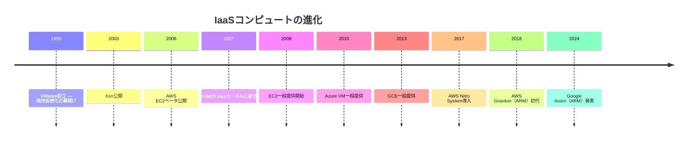

## 2. アーキテクチャ：インスタンスタイプの設計思想

### 2.1 インスタンスタイプとは何か

クラウドコンピュートにおけるインスタンスタイプとは、VMに割り当てるCPU・メモリ・ストレージ・ネットワーク帯域の組み合わせを定義した**テンプレート**である。利用者はワークロードの特性に応じて適切なインスタンスタイプを選択する。

なぜインスタンスタイプが存在するのか。その理由は「すべてのワークロードに最適な単一のハードウェア構成は存在しない」からである。Webサーバーはリクエスト処理のためにCPUとメモリをバランスよく必要とする。一方、機械学習の訓練はGPUの演算性能が支配的であり、インメモリデータベースは大容量メモリが不可欠である。クラウドプロバイダはこの多様なニーズに応えるために、用途別に最適化されたインスタンスファミリーを提供する。

### 2.2 インスタンスファミリーの分類

主要クラウドプロバイダのインスタンスファミリーは、以下のように大別できる。

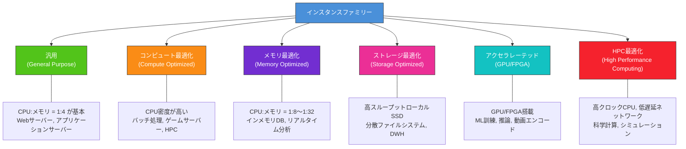

#### 汎用（General Purpose）

CPU とメモリのバランスが取れたインスタンスで、最も幅広いワークロードに適する。典型的なvCPU:メモリ比は1:4（1 vCPUあたり4 GBメモリ）である。

| プロバイダ | ファミリー | 特徴 |
|---|---|---|
| AWS | M系（m7g, m7i, m7a） | 汎用の中核。Graviton/Intel/AMDから選択可能 |
| GCP | E2, N2, N2D, C3 | E2はコスト重視、N2/C3は性能重視 |
| Azure | D系（Dv5, Dpsv5） | Arm版（Dpsv5）も提供 |

#### コンピュート最適化（Compute Optimized）

高いCPUクロック周波数や高いvCPU:メモリ比を持ち、CPU律速のワークロードに特化する。vCPU:メモリ比は1:2が典型的である。

| プロバイダ | ファミリー | 特徴 |
|---|---|---|
| AWS | C系（c7g, c7i, c7a） | 最新世代はGraviton4（c8g）も提供 |
| GCP | C2, C2D, H3 | C2は高周波数Intel、H3はHPC向け |
| Azure | F系（Fv2, Fasv6） | ハイクロックのIntel/AMD |

#### メモリ最適化（Memory Optimized）

大容量メモリを搭載し、インメモリデータベースやリアルタイム分析エンジンなどの用途に最適化される。vCPU:メモリ比は1:8以上で、最大1:32にも達する。

| プロバイダ | ファミリー | 特徴 |
|---|---|---|
| AWS | R系（r7g, r7i）、X系（x2idn）、u系 | u系は最大24 TiBのメモリ |
| GCP | M2, M3 | 最大12 TiBメモリのウルトラメモリ |
| Azure | E系（Ev5）、M系 | M系は大規模SAPワークロード向け |

#### アクセラレーテッド（GPU/FPGA搭載）

機械学習の訓練・推論、動画トランスコーディング、科学計算など、専用ハードウェアアクセラレータを必要とするワークロード向けである。

| プロバイダ | ファミリー | 特徴 |
|---|---|---|
| AWS | P系（p5, p4d）、G系、Inf系、Trn系 | P5はNVIDIA H100搭載。Trn系はTrainium（AWS独自チップ） |
| GCP | A2, A3, G2 | A3はNVIDIA H100/H200搭載 |
| Azure | NC系、ND系 | NDv5はNVIDIA H100搭載 |

::: details インスタンスタイプの命名規則（AWS EC2の例）
AWS EC2のインスタンスタイプは、体系的な命名規則に従っている。たとえば `m7g.2xlarge` は以下のように分解される：

- **m**: ファミリー（汎用）
- **7**: 世代
- **g**: プロセッサ属性（Graviton = ARM）
- **2xlarge**: サイズ

プロセッサ属性の主な例：
- `g` = Graviton（ARM）
- `i` = Intel
- `a` = AMD
- `d` = ローカルNVMe SSD付き
- `n` = ネットワーク強化

サイズは `nano`, `micro`, `small`, `medium`, `large`, `xlarge`, `2xlarge`, ..., `24xlarge`, `metal` と展開され、リソース量が概ね2倍ずつ増える。
:::

### 2.3 仮想化基盤のアーキテクチャ

IaaSコンピュートの性能と効率は、背後の仮想化基盤に大きく依存する。主要クラウドプロバイダは、独自のハードウェア・ソフトウェアスタックを構築して仮想化のオーバーヘッドを最小化している。

#### AWS Nitro System

AWSは従来、Xenベースのハイパーバイザを使用していたが、2017年頃からNitro Systemへの移行を進めた。Nitro Systemの核心は、**仮想化に伴う付随処理（ネットワーク、ストレージ、セキュリティ）をホストCPUから専用ハードウェア（Nitroカード）にオフロードする**ことである。

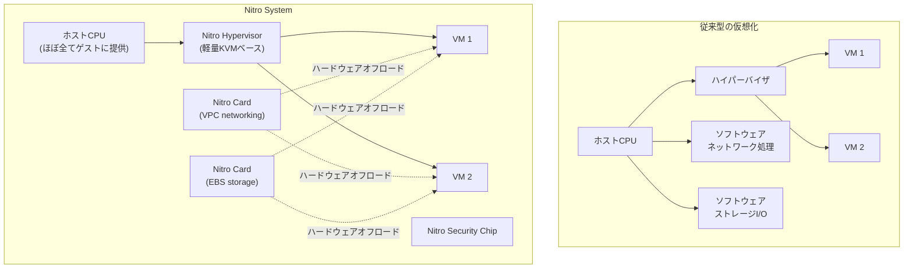

Nitro Systemの構成要素は以下の通りである：

- **Nitro Hypervisor**：KVMをベースとした極めて軽量なハイパーバイザ。従来のXenと比較してオーバーヘッドが大幅に削減された
- **Nitro Cards**：ネットワーク（VPC）処理とストレージ（EBS）I/OをPCIeカード上の専用ASICで実行する。これにより、ホストCPUのサイクルをほぼ100%ゲストVMに提供できる
- **Nitro Security Chip**：マザーボード上に配置され、ファームウェアの整合性検証やハードウェアの信頼性を担保する
- **Nitro Enclaves**：隔離されたコンピュート環境を提供し、機密データの処理に使用される

Nitroアーキテクチャの最も重要な帰結は、**ベアメタルインスタンス（metal）**の実現である。仮想化に必要な処理がすべて専用ハードウェアにオフロードされているため、ゲストVMにハイパーバイザを介さず直接物理CPUを割り当てることが可能になった。これは従来型のハイパーバイザでは原理的に不可能であった。

#### Google Titanium

GCPもAWSと同様の戦略を採用しており、2023年にTitaniumと呼ばれるカスタムオフロードインフラストラクチャを発表した。Titaniumは、ネットワーク処理、ストレージI/O、セキュリティ機能をホストCPUから専用プロセッサにオフロードする。GCPはこれにより、C4やZ3といった新世代インスタンスで性能向上を実現している。

#### Azure Boost

Microsoftも同様に、Azure Boostと呼ばれるオフロードプラットフォームを2023年に一般提供開始した。ネットワークとストレージの処理をFPGAと専用SoCにオフロードし、ホストCPUの利用効率を向上させるアプローチを取っている。

> [!NOTE]
> 三大クラウドプロバイダすべてが「仮想化処理のハードウェアオフロード」という同一の方向に収束していることは注目に値する。これは、ソフトウェアベースの仮想化ではCPUオーバーヘッドの削減に限界があり、ハードウェア支援による根本的な解決が必要であるという業界共通の認識を示している。

### 2.4 vCPUの実体

クラウドのインスタンスタイプにおける「vCPU」の定義はプロバイダや世代によって異なるため、注意が必要である。

- **AWS EC2**：ほとんどのインスタンスでは1 vCPU = 物理CPUの1スレッド（ハイパースレッディング有効時）である。ただし、一部のインスタンスタイプではハイパースレッディングを無効化して1 vCPU = 1物理コアとすることも可能
- **GCP GCE**：1 vCPU = 物理CPUの1ハイパースレッドが基本。ただしTau T2Dなどの一部インスタンスでは、SMT（Simultaneous Multithreading）をオフにして1 vCPU = 1物理コアとしている
- **Azure**：1 vCPU = 1ハイパースレッドが標準

::: warning vCPU比較の落とし穴
異なるプロバイダ間で「4 vCPU」のインスタンスを比較する際、CPUの世代、クロック周波数、キャッシュサイズ、メモリ帯域が異なるため、単純なvCPU数の比較は意味をなさない。正確な性能比較には、実際のワークロードでのベンチマークが不可欠である。
:::

## 3. 実装手法：価格モデルとリソース管理

### 3.1 価格モデルの全体像

IaaSコンピュートの価格モデルは、クラウドプロバイダの収益戦略とリソース管理の最適化を反映したものである。大きく分けて3つのモデルが存在する。

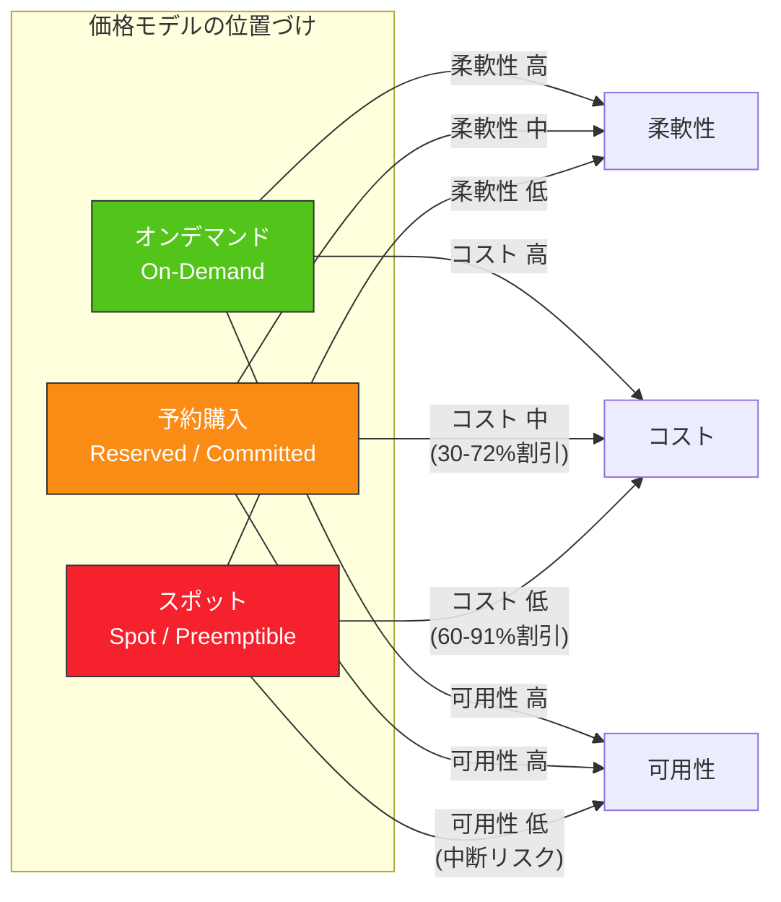

### 3.2 オンデマンドインスタンス

オンデマンドインスタンスは、利用者が必要なときにいつでも起動でき、秒単位または時間単位で課金されるモデルである。事前のコミットメントは不要で、いつでも停止・終了できる。

**課金モデルの比較：**

| プロバイダ | 最小課金単位 | 備考 |
|---|---|---|
| AWS EC2 | 秒単位（最低60秒） | Linux/Ubuntuの場合。一部OSは時間単位 |
| GCP GCE | 秒単位（最低60秒） | Sustained Use Discount（後述）が自動適用 |
| Azure VM | 秒単位（最低60秒） | — |

オンデマンドインスタンスは最も柔軟だが、最も高価でもある。長期的に安定して利用するワークロードでは、後述の予約購入やスポットインスタンスの活用がコスト最適化の鍵となる。

### 3.3 Spot/Preemptible/Spot VMの仕組み

#### 概念と背景

クラウドプロバイダのデータセンターには、常に一定量の未使用キャパシティが存在する。この余剰リソースを大幅な割引価格で提供するのがスポットインスタンスのモデルである。ただし、プロバイダはオンデマンドやリザーブドの需要を優先するため、**余剰キャパシティが不足した場合にはスポットインスタンスを中断（回収）する権利を持つ**。

::: danger スポットインスタンスの最も重要な制約
スポットインスタンスは、プロバイダによっていつでも中断される可能性がある。この制約を受け入れられないワークロードには使用してはならない。
:::

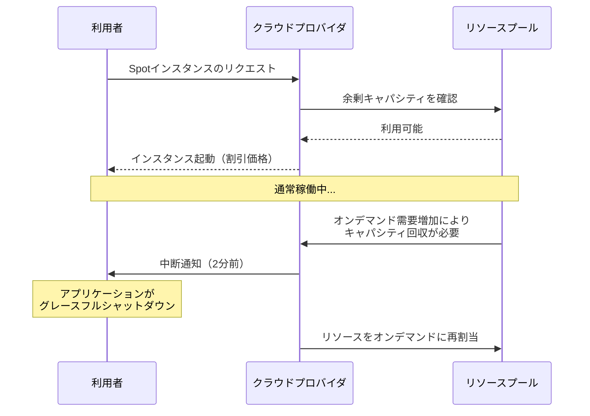

#### 各プロバイダの実装比較

| 特性 | AWS Spot | GCP Spot VM | Azure Spot VM |
|---|---|---|---|
| 最大割引率 | 最大90% | 最大91% | 最大90% |
| 中断通知 | 2分前 | 30秒前 | 30秒前（Scheduled Eventsで確認） |
| 最大稼働時間 | 制限なし | 制限なし（旧Preemptibleは24時間） | 制限なし |
| 価格モデル | 需給に基づく変動価格 | オンデマンドの固定割引 | 最大価格を設定可能 |
| 中断頻度の可視性 | Spot Placement Score | — | — |

> [!NOTE]
> GCPでは2022年に旧来の「Preemptible VM」が「Spot VM」に置き換えられた。旧Preemptible VMは最大稼働時間が24時間に制限されていたが、Spot VMではこの制限が撤廃された。ただし、中断通知時間が30秒と短いため、AWS Spotの2分間と比較すると迅速なシャットダウン処理が求められる。

#### AWS Spotの価格決定メカニズム

AWSのSpotインスタンスの価格は、以下の要素によって決定される：

1. **インスタンスタイプ・アベイラビリティゾーン（AZ）ごとの余剰キャパシティ**
2. **Spotインスタンスへの需要**

利用者は「最大価格」を設定でき、Spot価格がこれを超えた場合にインスタンスが中断される。ただし、2017年以降のアップデートにより、Spot価格の変動は以前よりも緩やかになっており、突発的な価格スパイクは減少している。

#### Spotの実践的な利用パターン

Spotインスタンスに適したワークロードには共通の特性がある：**中断耐性があること**（フォールトトレラント）、**ステートレスであること**、または**チェックポイント機構を持つこと**である。

代表的な利用パターンは以下の通りである。

**バッチ処理・データ分析**：Apache Sparkなどの分散処理フレームワークでは、ワーカーノードの一部が失われてもタスクを別のノードで再実行できる。Spotインスタンスの中断はタスクの遅延を引き起こすが、ジョブ全体の失敗にはならない。

**CI/CDパイプライン**：ビルドやテストの実行は本質的に冪等で短時間の処理である。中断されたら単にリトライすればよい。Jenkins、GitHub Actions、GitLab CIなどのCI/CDシステムでSpotインスタンスをビルドランナーとして活用するケースは多い。

**コンテナワークロード**：KubernetesのPodはノードの喪失に対してリスケジュールが可能である。KarpenterやCluster Autoscalerと組み合わせることで、Spotインスタンスの中断時に自動的に代替ノードを確保できる。

**機械学習の訓練**：チェックポイント機構を持つ訓練ジョブでは、定期的にモデルの状態を保存し、中断後に別のインスタンスで訓練を再開できる。

### 3.4 リザーブドインスタンスとSavings Plans

長期的に安定して利用するワークロードに対しては、1年または3年の利用をコミットすることで大幅な割引を受けられるモデルが用意されている。

#### AWS

AWSでは2つの割引モデルが併存している。

**Reserved Instances（RI）**：特定のインスタンスタイプ・リージョン・テナンシーに対する1年または3年のコミットメント。割引率は最大72%に達する。支払い方法は全額前払い、一部前払い、前払いなしの3種類がある。

**Savings Plans**：2019年に導入されたより柔軟なモデル。特定のインスタンスタイプではなく、「1時間あたりの利用額」をコミットする。Compute Savings Plansはインスタンスファミリー・リージョン・OS・テナンシーを問わず適用されるため、RIより柔軟性が高い。

::: details RIとSavings Plansの使い分け
**Savings Plansを推奨するケース：**
- 将来のインスタンスタイプ変更が想定される場合
- 複数リージョンで利用する場合
- EC2以外のコンピュート（Fargate, Lambda）にもコミットメントを適用したい場合

**RIが有利なケース：**
- インスタンスタイプが確定しており変更予定がない場合
- キャパシティ予約が必要な場合（Capacity Reservationと併用）
:::

#### GCP

**Committed Use Discounts（CUD）**：特定のマシンタイプまたはリソース量（vCPU/メモリ）に対する1年または3年のコミットメント。割引率は1年で最大37%、3年で最大55%。

**Sustained Use Discounts（SUD）**：月間利用量に応じて自動的に適用される段階的割引。事前のコミットメント不要で、月あたりのvCPU・メモリ使用量が一定の閾値を超えると割引が段階的に適用される。最大約30%の割引となる。SUDはN1/N2ファミリーで利用可能だが、C3やE2では適用されないため注意が必要である。

#### Azure

**Azure Reservations**：1年または3年のコミットメントで最大72%の割引。基本的にはAWSのRIと同様の仕組みである。

**Azure Savings Plans for Compute**：AWSのSavings Plansと同様に、1時間あたりの利用額をコミットするモデル。

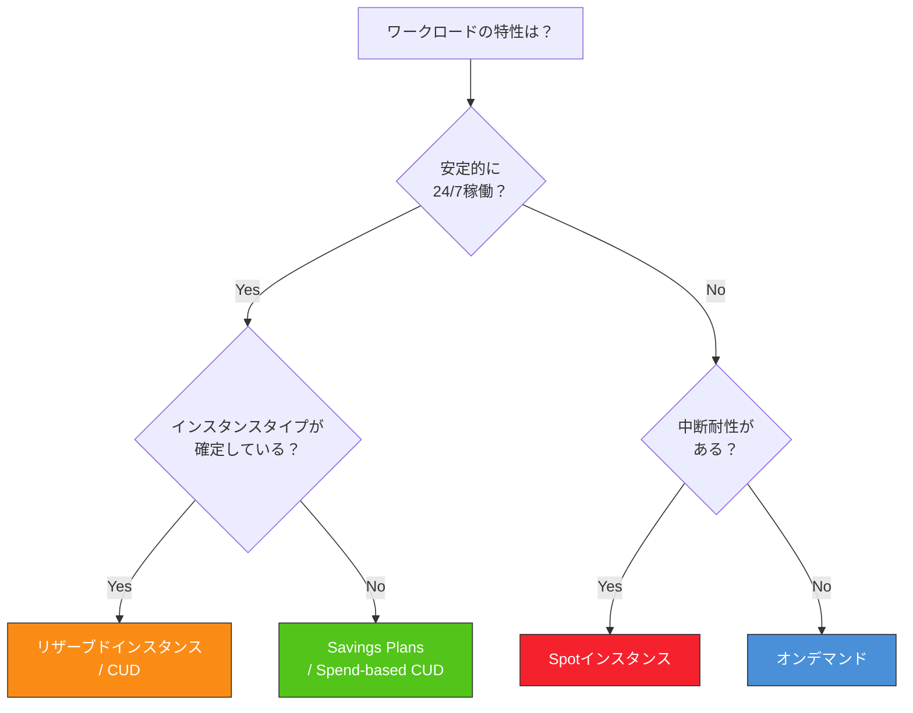

### 3.5 オートスケーリングとの連携

IaaSコンピュートの真価は、需要の変動に応じてリソースを自動的に伸縮させるオートスケーリングとの組み合わせで発揮される。

#### AWS Auto Scaling Groups（ASG）

AWS ASGは、EC2インスタンスの自動スケーリングを管理するサービスである。以下の主要機能を持つ：

- **動的スケーリング**：CloudWatch メトリクス（CPU使用率、リクエスト数、カスタムメトリクスなど）に基づいてインスタンス数を増減
- **予測スケーリング**：機械学習を用いて過去のトラフィックパターンから将来の需要を予測し、事前にスケールアウト
- **混合インスタンスポリシー**：オンデマンドとSpotインスタンスを混在させ、コスト最適化と可用性のバランスを取る

混合インスタンスポリシーは特に重要である。たとえば「ベースラインの70%をオンデマンドで確保し、残り30%をSpotで補完する」という構成が可能である。Spotインスタンスが中断された場合、ASGは自動的に代替のSpotインスタンスまたはオンデマンドインスタンスを起動する。

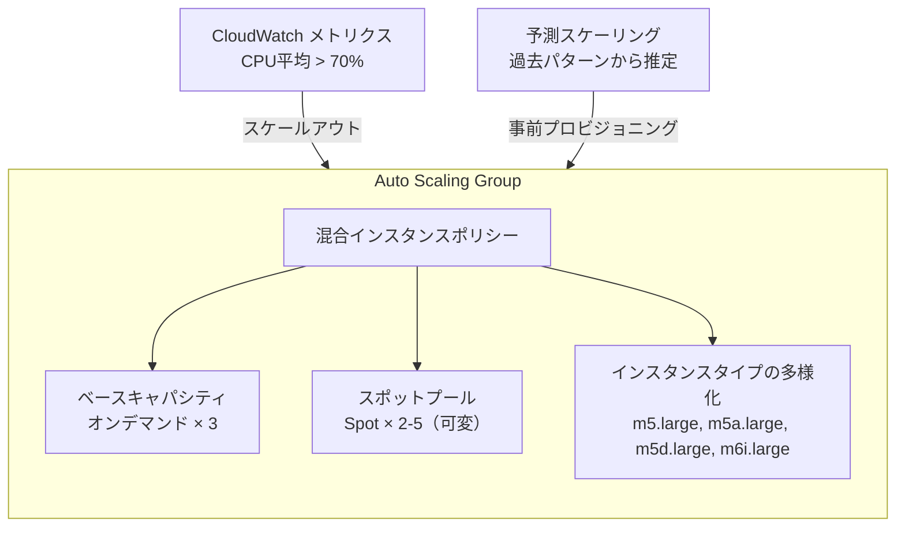

#### GCP Managed Instance Groups（MIG）

GCPのManaged Instance Groups（MIG）は、AWS ASGに相当する機能を提供する。オートスケーラは CPU使用率、HTTPロードバランシングのリクエスト数、Pub/Subのキュー長などに基づいてスケーリングを行う。

GCP MIGの特徴的な機能として、**ステートフルMIG**がある。これは、各インスタンスに永続ディスクやメタデータを紐づけた状態でスケーリングを管理する仕組みで、データベースやストレージノードなどのステートフルなワークロードに対応する。

### 3.6 配置グループ（Placement Group）

配置グループは、インスタンスの物理的な配置戦略を制御する機能である。ワークロードの特性に応じて、インスタンスの物理的な近接性や分散性を最適化できる。

#### AWS EC2の配置グループ

| 種別 | 配置戦略 | 用途 |
|---|---|---|
| Cluster | 単一AZ内の近接ラック配置 | HPCやノード間通信が多い分散処理。低レイテンシ・高帯域 |
| Spread | 異なるラックに分散配置（AZあたり最大7インスタンス） | 個々のインスタンスの障害分離が重要なワークロード |
| Partition | AZ内でパーティション（ラックグループ）単位に分散 | HDFS、Cassandraなどの大規模分散システム |

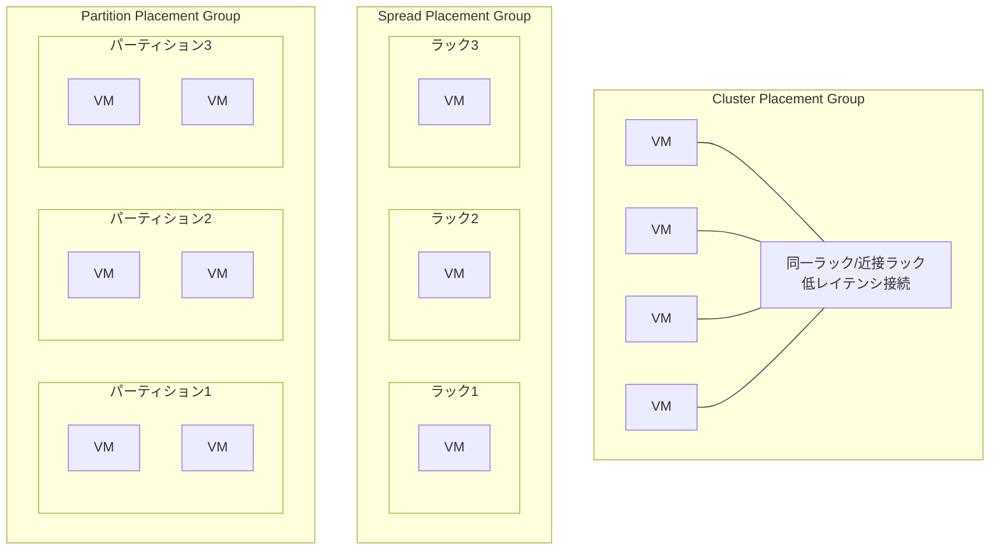

Cluster Placement Groupにおいてインスタンス間のネットワーク帯域は最大100 Gbps（Elastic Fabric Adapter対応インスタンスの場合）に達する。HPCや機械学習の分散訓練において、この低レイテンシ・高帯域接続は不可欠である。

#### GCP

GCPでは、Compact Placement Policy（コンパクト配置ポリシー）が同様の機能を提供する。特にHPC向けのC2やH3インスタンスで使用され、インスタンス間のネットワークレイテンシを最小化する。

## 4. 運用の実際：インスタンス選定とコスト最適化

### 4.1 インスタンスタイプ選定の体系的アプローチ

インスタンスタイプの選定は、多くのエンジニアが感覚や過去の慣習に基づいて行いがちだが、体系的なアプローチが存在する。

#### ステップ1：ワークロードのプロファイリング

まず、ワークロードのリソース消費パターンを把握する必要がある。主な指標は以下の通りである：

- **CPU使用率**：平均値だけでなく、P95/P99のピーク値も重要
- **メモリ使用量**：ワーキングセットサイズとキャッシュのヒット率
- **ネットワークI/O**：スループットとパケット数
- **ストレージI/O**：IOPS、スループット、レイテンシ
- **GPU使用率**：GPU計算の占有率とGPUメモリ使用量

AWSではCloudWatch、GCPではCloud Monitoring、AzureではAzure Monitorを使ってこれらのメトリクスを収集する。さらにAWSではCompute Optimizerが過去のメトリクスデータを分析し、最適なインスタンスタイプを推奨する機能を提供している。

#### ステップ2：リソース比率の確認

CPU使用率とメモリ使用率のバランスを確認し、適切なファミリーを選択する。

| CPU使用率 | メモリ使用率 | 推奨ファミリー |
|---|---|---|
| 高い | 低い | Compute Optimized（C系） |
| 中程度 | 中程度 | General Purpose（M系） |
| 低い | 高い | Memory Optimized（R系） |
| GPU必須 | 用途による | Accelerated（P/G系） |

#### ステップ3：ベンチマークによる検証

理論的な選定の後は、実際のワークロードでベンチマークを実行し、性能とコストのバランスを検証する。ここでは、同一世代の異なるプロセッサ間（Intel vs AMD vs Graviton）の比較も重要である。

::: tip Graviton/ARMインスタンスの検討
AWS Graviton（ARM）インスタンスは、同等のx86インスタンスと比較して約20%安価でありながら、多くのワークロードで同等以上の性能を発揮する。GCPのTau T2A、AzureのAmpere Altra搭載インスタンスも同様のコストパフォーマンスを提供する。アプリケーションがARM64に対応している（コンパイル済みバイナリやJVMベースの場合は概ね問題なし）のであれば、まずARMインスタンスを検討することを推奨する。
:::

### 4.2 コスト最適化戦略

クラウドコンピュートのコスト最適化は、以下の4つの柱から構成される。

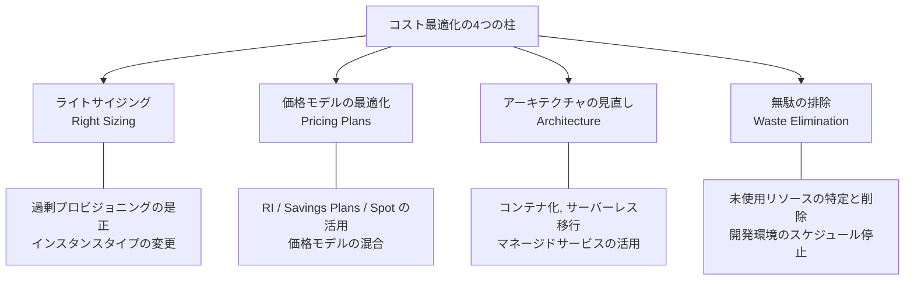

#### ライトサイジング（Right Sizing）

ライトサイジングとは、実際のリソース使用量に基づいてインスタンスタイプを適切なサイズに調整することである。多くの組織では、初期構築時に「念のため大きめのインスタンス」を選択する傾向があり、これが慢性的な過剰プロビジョニングにつながっている。

AWS Compute Optimizer や GCPのRecommender Hub は、過去14日間のメトリクスデータを分析し、ダウンサイジングやアップサイジングの推奨事項を提供する。典型的な例として、CPU使用率が常に10%未満のインスタンスは1つ下のサイズに変更すべきである。

#### 価格モデルの組み合わせ

実際の環境では、単一の価格モデルですべてのワークロードをカバーするのではなく、複数のモデルを戦略的に組み合わせることが重要である。

一般的な指針は以下の通りである：

1. **ベースライン負荷**（常時稼働のコアサービス）→ Reserved Instances / Savings Plans
2. **可変負荷**（日中のトラフィック増加など）→ オンデマンド + オートスケーリング
3. **バースト負荷**（バッチ処理、CI/CDなど）→ Spotインスタンス

理想的な割合は組織やワークロードによって異なるが、成熟したクラウド運用では「全体の60-70%をコミットメント、20-30%をオンデマンド、5-10%をSpot」という配分が一つの目安となる。

#### 無駄の排除

コスト最適化において最も即効性が高いのが、無駄なリソースの特定と削除である。

- **未アタッチのEBSボリューム/永続ディスク**：インスタンス削除後も残存しているストレージ
- **未使用のElastic IP / 静的IP**：割り当てられているが使われていないIPアドレス
- **開発・ステージング環境の常時稼働**：業務時間外に停止するだけで50%以上のコスト削減が可能
- **古い世代のインスタンスタイプ**：新世代は同一コストで性能が向上している場合が多い

### 4.3 Spot中断への対処戦略

Spotインスタンスを本番環境で安全に活用するためには、中断への対処が体系的に設計されている必要がある。

#### 中断通知の取得

AWSでは、Spotインスタンスの中断2分前にインスタンスメタデータサービス（IMDS）を通じて通知が行われる。アプリケーションはこの通知をポーリングし、グレースフルシャットダウンを開始する。

```python
import requests
import time

METADATA_URL = "http://169.254.169.254/latest/meta-data/spot/instance-action"

def check_spot_interruption():
    """Check for Spot interruption notice via IMDS"""
    try:
        response = requests.get(METADATA_URL, timeout=2)
        if response.status_code == 200:
            action = response.json()
            # action contains: {"action": "terminate", "time": "2024-01-01T12:00:00Z"}
            return action
    except requests.exceptions.RequestException:
        pass
    return None

def graceful_shutdown():
    """Perform cleanup before termination"""
    # Save checkpoint, drain connections, deregister from load balancer
    pass

while True:
    interruption = check_spot_interruption()
    if interruption:
        graceful_shutdown()
        break
    time.sleep(5)
```

GCPのSpot VMでは、インスタンスメタデータの `preempted` 属性を監視するか、シャットダウンスクリプトを登録して中断時のクリーンアップを実行する。中断通知は30秒前であるため、より迅速な対応が求められる。

#### インスタンスの多様化（Diversification）

Spotインスタンスの中断リスクを軽減するための最も効果的な戦略は、**インスタンスタイプの多様化**である。単一のインスタンスタイプに依存すると、そのタイプの余剰キャパシティが枯渇した場合に全滅するリスクがある。

AWS ASGの混合インスタンスポリシーでは、複数のインスタンスタイプを指定でき、プロバイダはその中から利用可能なものを自動選択する。たとえば以下のように設定する：

- `m5.xlarge`, `m5a.xlarge`, `m5d.xlarge`, `m6i.xlarge`, `m6a.xlarge`

これにより、特定のインスタンスタイプの在庫が枯渇しても、他のタイプで代替できる可能性が高まる。

#### Kubernetesとの連携

KubernetesクラスタでSpotインスタンスを活用する場合、以下のコンポーネントが重要な役割を果たす。

**Karpenter（AWS）/ Cluster Autoscaler**：ノードのプロビジョニングとスケーリングを自動化する。Karpenterは特にSpotインスタンスとの親和性が高く、中断時の自動リプレースメントを効率的に行う。

**Node Affinity / Taint / Toleration**：中断耐性のあるワークロードのみをSpotノードにスケジュールし、ステートフルなワークロードはオンデマンドノードに配置する。

```yaml
# Kubernetes example: Spot-tolerant workload
apiVersion: apps/v1
kind: Deployment
metadata:
  name: batch-processor
spec:
  replicas: 10
  template:
    spec:
      tolerations:
        - key: "cloud.google.com/gke-spot"
          operator: "Equal"
          value: "true"
          effect: "NoSchedule"
      nodeSelector:
        cloud.google.com/gke-spot: "true"
      terminationGracePeriodSeconds: 25
      containers:
        - name: processor
          image: batch-processor:latest
          lifecycle:
            preStop:
              exec:
                command: ["/bin/sh", "-c", "save-checkpoint && drain-queue"]
```

**Pod Disruption Budget（PDB）**：Spotノードの中断時にも最低限のレプリカ数が維持されるよう制約を設ける。

### 4.4 実世界での事例

#### Netflix

Netflixはクラウドネイティブ企業の代表例であり、AWSを大規模に活用している。同社はエンコーディングパイプラインにSpotインスタンスを大規模に活用しており、コスト効率の高い動画トランスコーディングを実現している。中断時にはジョブを別のインスタンスに自動的に再スケジュールする仕組みを構築している。

#### Lyft

配車サービスのLyftは、機械学習の訓練ワークロードにSpotインスタンスを活用している。チェックポイント機構と自動リスタート機能を組み合わせることで、Spotの中断を透過的に処理している。

#### Spotifyの事例

SpotifyはGCPを主要なクラウドプロバイダとして使用しており、Preemptible VM（現Spot VM）を活用したデータパイプライン処理を行っている。Apache BeamとDataflowを用いたストリーム処理においてSpotリソースを活用することで、大幅なコスト削減を実現している。

## 5. 将来展望：カスタムシリコンとコンピュートの境界

### 5.1 ARMプロセッサの台頭

IaaSコンピュートにおける最も大きなトレンドの一つが、ARM アーキテクチャの浸透である。

#### AWS Graviton

AWSは独自のARMプロセッサ「Graviton」シリーズを開発・展開している。2018年の初代Gravitonから始まり、2023年にはGraviton4を発表した。

| 世代 | 発表年 | 主な特徴 |
|---|---|---|
| Graviton | 2018 | 初代ARM。A1インスタンスに搭載 |
| Graviton2 | 2019 | 64コアのNeoverse N1ベース。x86比で40%のコスト性能向上 |
| Graviton3 | 2021 | Graviton2比で25%の性能向上。DDR5対応 |
| Graviton4 | 2023 | Graviton3比で30%以上の性能向上。最大96 vCPU |

Gravitonの重要な意味は、クラウドプロバイダが**自社のシリコンを設計することでIntel/AMDへの依存を減らし、価格性能比を自律的に改善できるようになった**ことである。これはクラウドの価格競争の構造自体を変える戦略的な動きである。

#### Google Axion

Googleも2024年にArmベースの独自プロセッサ「Axion」を発表した。AxionはArm Neoverseベースで設計されており、GCPの汎用インスタンスに搭載される。Googleは、同等のx86インスタンスと比較して大幅な性能向上とエネルギー効率の改善を見込んでいる。

#### Microsoft Cobalt

Microsoftも2023年にArmベースのカスタムプロセッサ「Cobalt 100」を発表した。Azure上での汎用ワークロード向けに設計されている。

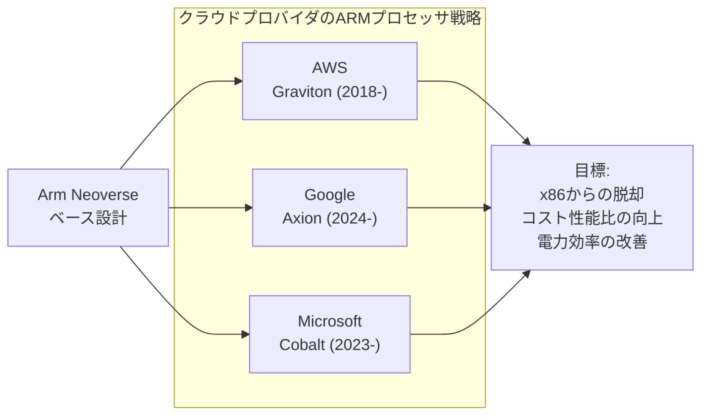

> [!TIP]
> ARMへの移行はソフトウェアの互換性を前提とする。JVM（Java, Kotlin, Scala）、Go、Python、Node.jsなどのランタイム上で動作するアプリケーションは概ね問題なく移行できる。一方、x86固有の命令セット（SSE/AVX）に依存するネイティブコードや、x86向けにのみビルドされたサードパーティライブラリがある場合は、ARM64対応のビルドやエミュレーションが必要となる。

### 5.2 カスタムシリコンの広がり

ARMプロセッサに限らず、クラウドプロバイダは特定のワークロードに特化したカスタムチップを次々と開発している。

#### AWS

- **Trainium**：機械学習の訓練に特化したカスタムチップ。GPU（NVIDIA）の代替として、コスト効率の高い訓練環境を提供する
- **Inferentia**：機械学習の推論に特化。低レイテンシ・高スループットの推論を低コストで実現する
- **Nitro Cards/DPU**：前述のとおり、ネットワーク・ストレージ処理のオフロード用

#### Google

- **TPU（Tensor Processing Unit）**：2016年に初代を公開。機械学習の訓練・推論に特化した独自設計のASIC。第6世代のTPU v6e（Trillium）まで進化している
- **VCU（Video Coding Unit）**：動画トランスコーディング専用のカスタムチップ

#### Microsoft

- **Maia 100**：AI向けカスタムチップ。2023年発表

この「カスタムシリコン」のトレンドは、IaaSコンピュートの将来像に重要な示唆を与える。汎用CPUですべてのワークロードを処理するのではなく、ワークロードの特性に応じた専用ハードウェアを利用する方向に進んでいる。これにより、GPUやカスタムアクセラレータがIaaSインスタンスの重要な構成要素となりつつある。

### 5.3 サーバーレスとIaaSの境界

IaaSコンピュートとサーバーレスコンピュートの境界は、徐々に曖昧になりつつある。

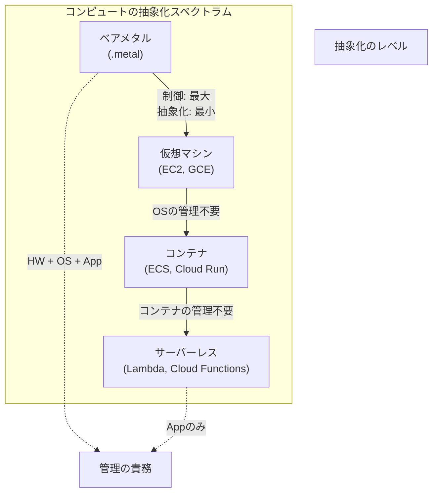

従来、IaaS（VM管理あり）とサーバーレス（VM管理なし）は明確に区分されていたが、近年は以下のような中間形態が増えている：

- **AWS Fargate / Google Cloud Run**：コンテナの実行環境を提供するが、VMの管理は不要。「サーバーレスコンテナ」とも呼ばれる
- **AWS Lambda SnapStart / GCP Cloud Functions min instances**：コールドスタートを回避するためにインスタンスを事前に確保する。実質的にはIaaSに近い動作
- **Firecracker microVM**：Lambda の裏側で使われているマイクロVM。VMレベルの隔離をミリ秒単位で起動する

利用者にとっての選択基準は以下のように整理できる：

| 判断軸 | IaaS（VM）を選ぶべき場面 | サーバーレスを選ぶべき場面 |
|---|---|---|
| 実行時間 | 長時間（数時間〜常時） | 短時間（秒〜分） |
| リソース要件 | 大量のCPU/メモリ/GPU | 小規模で断続的 |
| カスタマイズ | OS・カーネルレベルの制御が必要 | ランタイムの制約内で十分 |
| コスト構造 | 予測可能な定常負荷 | 変動が大きくアイドル時間が長い |
| コールドスタート | 許容できない | 許容できる |

### 5.4 持続可能性（サステナビリティ）

クラウドコンピュートにおける消費電力と炭素排出量は、今後ますます重要なテーマとなる。ARMプロセッサへの移行は、性能あたりの消費電力を削減するという点でサステナビリティの観点からも意義がある。AWSはGraviton3がGraviton2比で60%のエネルギー効率向上を実現したと主張している。

主要プロバイダはいずれもカーボンフットプリントの可視化ツールを提供している：

- **AWS**: Customer Carbon Footprint Tool
- **GCP**: Carbon Footprint Dashboard
- **Azure**: Emissions Impact Dashboard

今後、インスタンスタイプの選定において「コスト」と「性能」に加えて「炭素排出量」が第3の基準として重視されるようになる可能性がある。

### 5.5 Confidential Computing

Confidential Computing（機密コンピューティング）は、データを**使用中（in use）**の状態でも暗号化・保護する技術である。従来のセキュリティモデルでは、データの保存時（at rest）と転送時（in transit）の暗号化は標準的であったが、処理中のデータはメモリ上に平文で存在するため、特権的なアクセス（ハイパーバイザの管理者など）からの保護が課題であった。

| プロバイダ | サービス名 | 技術基盤 |
|---|---|---|
| AWS | Nitro Enclaves | AWS Nitro独自の隔離技術 |
| GCP | Confidential VMs | AMD SEV-SNP / Intel TDX |
| Azure | Confidential VMs | AMD SEV-SNP / Intel TDX / Intel SGX |

Confidential Computingは、規制産業（金融、医療）やマルチテナント環境において、クラウドプロバイダ自身からもデータを保護したいという需要に応えるものである。今後、IaaSインスタンスの標準機能として普及が進むと見込まれる。

## 6. まとめ

IaaSコンピュートは、物理サーバーの調達という旧来の課題を「コンピューティングリソースのAPI化」によって根本的に解決したサービスモデルである。本記事で解説した内容を振り返ると、以下のポイントが重要である。

**インスタンスタイプの多様化**：ワークロードの特性（CPU律速、メモリ律速、GPU依存など）に応じた最適なインスタンスファミリーを選択することが、コストと性能の両面で重要である。「とりあえず汎用」ではなく、プロファイリングに基づいた選定が求められる。

**仮想化基盤の進化**：Nitro System、Titanium、Azure Boostに見られるように、仮想化処理のハードウェアオフロードが業界標準となった。これにより、仮想化のオーバーヘッドは実質的にゼロに近づいている。

**価格モデルの戦略的活用**：オンデマンド、リザーブド/Savings Plans、Spotの3つのモデルを組み合わせることで、大幅なコスト削減が可能である。特にSpotインスタンスは中断耐性のあるワークロードにおいて60-91%のコスト削減を実現する。

**ARMとカスタムシリコン**：Graviton、Axion、Cobaltに代表されるクラウドプロバイダ独自のARMプロセッサは、コスト性能比と電力効率の両面で優位性を持つ。カスタムアクセラレータ（TPU、Trainium）の登場により、特定ワークロードに対する専用ハードウェアの選択肢も広がっている。

**抽象化のスペクトラム**：IaaSはコンピュートモデルの全体像の中で「制御の最大化」に位置する。サーバーレスやマネージドコンテナとの境界が曖昧になる中で、各モデルの特性を理解した上で適切な選択を行うことが、現代のクラウドアーキテクチャにおける重要なスキルとなっている。

IaaSコンピュートは一見すると「VMを借りるだけ」のシンプルなサービスに見えるが、その裏側には仮想化技術、ハードウェア設計、リソーススケジューリング、経済的な価格モデルなど、コンピュータサイエンスの多岐にわたる知見が凝縮されている。クラウドネイティブな開発が当たり前となった現在、これらの仕組みを本質的に理解することが、信頼性の高い・コスト効率の良いシステムを構築するための基盤となる。
