# Infrastructure as Code（Terraform, Pulumi）

## 1. Infrastructure as Code とは何か

### インフラ管理の歴史的変遷

かつてインフラストラクチャの構築と管理は、完全に手作業で行われていた。サーバーをラックに搭載し、ケーブルを配線し、OSをインストールし、設定ファイルを手動で書き換える。この時代のインフラは物理的な存在であり、変更には時間と物理的な作業が必要だった。

クラウドコンピューティングの登場により、インフラの抽象度は劇的に上がった。AWS が 2006 年に EC2 を公開して以降、仮想マシンは API 一つで起動できるようになった。しかし、API が存在するだけでは問題は解決しない。Web コンソールを使った手動操作や、場当たり的なスクリプトによる構築は、以下のような問題を引き起こす。

- **再現性の欠如**: 同じ環境を別のリージョンやアカウントに作ろうとしても、手順の抜け漏れが発生する
- **変更の追跡困難**: 誰が、いつ、何を変更したのかが記録されない
- **レビュー不能**: インフラ変更に対してコードレビューのような品質保証プロセスを適用できない
- **構成ドリフト**: 時間の経過とともに、意図した状態と実際の状態が乖離する

Infrastructure as Code（IaC）は、これらの問題に対する根本的な回答である。インフラの望ましい状態をコードとして記述し、そのコードをバージョン管理し、自動化されたプロセスで適用するというアプローチだ。

### IaC の基本原則

IaC が依拠する基本原則は、以下のように整理できる。

1. **コードとしての記述**: インフラの構成をテキストファイル（コード）として記述する。これにより、Git などのバージョン管理システムで変更履歴を管理できる。
2. **冪等性（Idempotency）**: 同じコードを何度適用しても、結果が同じになる。これにより、「もう一度実行しても大丈夫か」という不安から解放される。
3. **宣言的記述**: 「何が欲しいか」を記述し、「どう作るか」はツールに委ねる。ただし、命令的なアプローチも存在し、それぞれに利点がある（後述）。
4. **自動化**: コードの適用は手動操作ではなく、自動化されたパイプラインで行う。

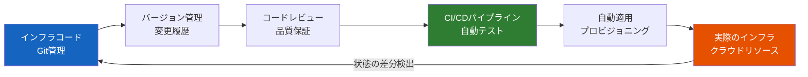

### IaC ツールの分類

IaC ツールは、その役割と抽象度によっていくつかのカテゴリに分類できる。

| カテゴリ | 代表的なツール | 主な対象 |
|---------|-------------|---------|
| プロビジョニング | Terraform, Pulumi, CloudFormation | クラウドリソースの作成・管理 |
| 構成管理 | Ansible, Chef, Puppet | OS・ミドルウェアの設定 |
| コンテナオーケストレーション | Kubernetes, Docker Compose | コンテナの配置・管理 |
| イメージビルド | Packer, Docker | マシンイメージ・コンテナイメージの構築 |

本記事では、プロビジョニングツールの中でも特に広く使われている Terraform と Pulumi に焦点を当て、その設計思想、アーキテクチャ、実践的な使い方を深く掘り下げる。

---

## 2. 宣言的アプローチ vs 命令的アプローチ

IaC ツールを理解する上で最も重要な軸の一つが、宣言的（Declarative）と命令的（Imperative）の区別である。

### 宣言的アプローチ

宣言的アプローチでは、インフラの「望ましい最終状態」を記述する。ツールは現在の状態と望ましい状態を比較し、差分を埋めるために必要な操作を自動的に決定・実行する。

```hcl
# Declarative: describe "what" you want
resource "aws_instance" "web" {
  ami           = "ami-0c55b159cbfafe1f0"
  instance_type = "t3.micro"
  tags = {
    Name = "web-server"
  }
}
```

このコードは「t3.micro の EC2 インスタンスが存在してほしい」という意図を表明しているだけであり、「EC2 インスタンスを作成する API を呼べ」という命令ではない。もしすでにこのインスタンスが存在していれば、Terraform は何もしない。タグだけが変更されていれば、タグの更新だけを行う。

**宣言的アプローチの利点:**

- 冪等性が自然に実現される
- 差分の可視化（Plan）が容易
- 最終状態が明確に読み取れる

**宣言的アプローチの課題:**

- 条件分岐やループなど、手続き的な制御が必要な場合に表現力が制限される
- DSL（Domain Specific Language）の学習が必要

### 命令的アプローチ

命令的アプローチでは、インフラを構築するための「手順」を記述する。汎用プログラミング言語の制御構文をそのまま使えるため、複雑なロジックの表現が容易である。

```python
# Imperative: describe "how" to create
import pulumi_aws as aws

for i in range(3):
    aws.ec2.Instance(
        f"web-{i}",
        ami="ami-0c55b159cbfafe1f0",
        instance_type="t3.micro",
        tags={"Name": f"web-server-{i}"},
    )
```

ただし注意すべきは、Pulumi は命令的な言語を使いながらも、内部的には宣言的なエンジンを持つという点である。ユーザーがプログラムを通じてリソースの望ましい状態を「構築」し、エンジンがそれを現在の状態と比較して差分を適用する。純粋な命令的スクリプト（例: AWS CLI を羅列したシェルスクリプト）とは根本的に異なる。

### 二つのアプローチの比較

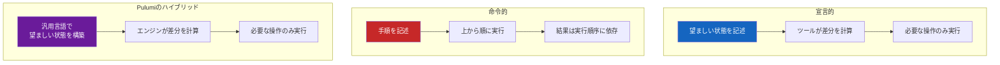

| 特性 | 宣言的（Terraform） | 命令的 + 宣言的エンジン（Pulumi） |
|------|---------------------|--------------------------------|
| 記述言語 | HCL（DSL） | Python, TypeScript, Go, C# など |
| 学習曲線 | 新しい言語の学習が必要 | 既存のスキルを活用できる |
| 表現力 | 制限あり（ただし十分な場合が多い） | 汎用言語の全機能を利用可能 |
| エコシステム | 非常に大きい | 成長中 |
| IDE サポート | 限定的 | 既存の IDE 機能をフル活用 |
| テスタビリティ | 専用ツールが必要 | 言語標準のテストフレームワーク |

---

## 3. Terraform のアーキテクチャ

### Terraform の全体像

Terraform は HashiCorp が開発した IaC ツールであり、2014 年に最初のリリースが行われた。Go 言語で実装されており、単一のバイナリとして配布される。マルチクラウド対応を最大の特徴とし、AWS、Azure、GCP はもちろん、Kubernetes、Datadog、GitHub など 4,000 以上のプロバイダーが存在する。

Terraform のアーキテクチャは、以下のコンポーネントで構成されている。

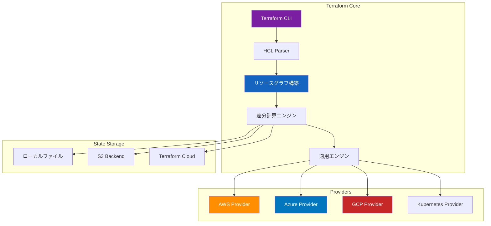

### Terraform のワークフロー

Terraform の基本的なワークフローは、`init` → `plan` → `apply` の三段階で構成される。

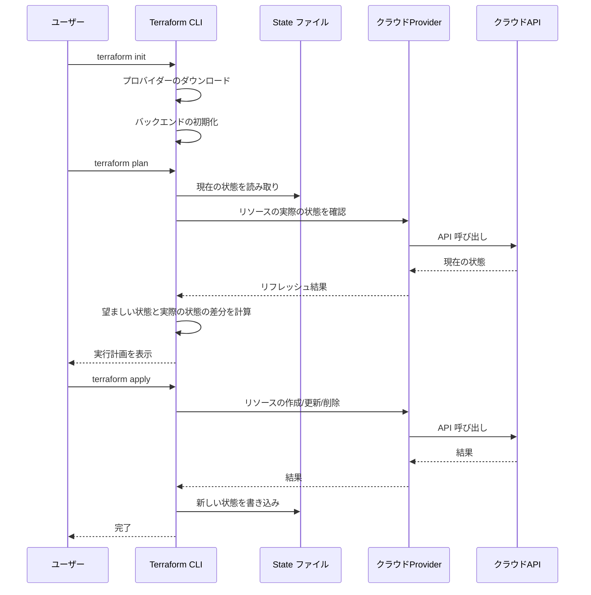

#### terraform init

`terraform init` は、プロジェクトの初期化を行うコマンドである。以下の処理が実行される。

- `.terraform` ディレクトリの作成
- 指定されたプロバイダーのダウンロードとインストール
- バックエンド（State の保存先）の初期化
- モジュールのダウンロード

#### terraform plan

`terraform plan` は、Terraform の最も重要な機能の一つである。このコマンドは、コードで記述された望ましい状態と、State ファイルに記録された現在の状態を比較し、差分を計算する。そしてその差分を「実行計画」として人間が読める形式で出力する。

```
Terraform will perform the following actions:

  # aws_instance.web will be created
  + resource "aws_instance" "web" {
      + ami                          = "ami-0c55b159cbfafe1f0"
      + instance_type                = "t3.micro"
      + tags                         = {
          + "Name" = "web-server"
        }
      ...
    }

Plan: 1 to add, 0 to change, 0 to destroy.
```

この `plan` の存在が Terraform の安全性を大きく支えている。実際にインフラを変更する前に、何が起きるかを確認できるため、想定外の破壊的変更を防ぐことができる。

#### terraform apply

`plan` で確認した変更を実際に適用するコマンドである。Terraform は依存関係グラフに基づいてリソースを並列に作成・更新・削除する。

### リソースグラフ

Terraform の内部では、定義されたリソース間の依存関係を有向非巡回グラフ（DAG: Directed Acyclic Graph）として管理している。このグラフに基づいて、並列実行可能なリソースは同時に処理し、依存関係があるリソースは順序を守って処理する。

```hcl
# VPC must be created first
resource "aws_vpc" "main" {
  cidr_block = "10.0.0.0/16"
}

# Subnet depends on VPC
resource "aws_subnet" "web" {
  vpc_id     = aws_vpc.main.id
  cidr_block = "10.0.1.0/24"
}

# Security Group depends on VPC
resource "aws_security_group" "web" {
  vpc_id = aws_vpc.main.id

  ingress {
    from_port   = 80
    to_port     = 80
    protocol    = "tcp"
    cidr_blocks = ["0.0.0.0/0"]
  }
}

# EC2 depends on Subnet and Security Group
resource "aws_instance" "web" {
  ami                    = "ami-0c55b159cbfafe1f0"
  instance_type          = "t3.micro"
  subnet_id              = aws_subnet.web.id
  vpc_security_group_ids = [aws_security_group.web.id]
}
```

この例では、以下のような依存関係グラフが生成される。

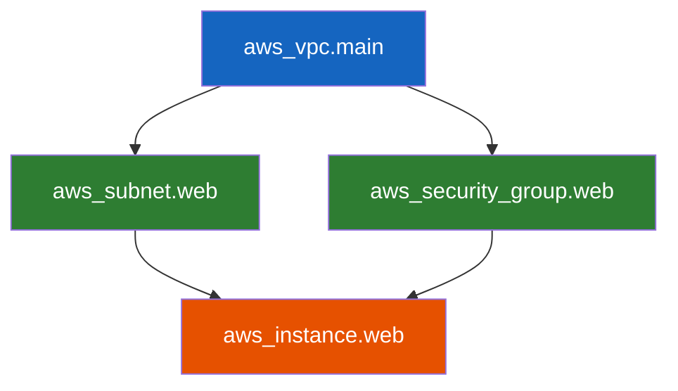

VPC が最初に作成され、Subnet と Security Group は並列に作成でき、EC2 インスタンスは両方が完了した後に作成される。このグラフベースの依存関係解決が、Terraform の効率的なリソース管理を支えている。

---

## 4. HCL と State 管理

### HCL（HashiCorp Configuration Language）

HCL は HashiCorp が Terraform のために設計した構成言語である。JSON の可読性の低さと、YAML のインデント依存の問題を回避しつつ、人間にとって読みやすく、かつ機械的に解析しやすい言語を目指して作られた。

#### 基本構文

```hcl
# Variable definition
variable "instance_count" {
  description = "Number of instances to create"
  type        = number
  default     = 2
}

variable "environment" {
  description = "Deployment environment"
  type        = string
  validation {
    condition     = contains(["dev", "staging", "prod"], var.environment)
    error_message = "Environment must be dev, staging, or prod."
  }
}

# Local values for computed expressions
locals {
  common_tags = {
    Environment = var.environment
    ManagedBy   = "terraform"
    Project     = "web-platform"
  }
}

# Resource definition with dynamic blocks
resource "aws_instance" "web" {
  count         = var.instance_count
  ami           = data.aws_ami.ubuntu.id
  instance_type = "t3.micro"

  tags = merge(local.common_tags, {
    Name = "web-${count.index + 1}"
  })
}

# Data source: read existing resources
data "aws_ami" "ubuntu" {
  most_recent = true
  owners      = ["099720109477"]

  filter {
    name   = "name"
    values = ["ubuntu/images/hvm-ssd/ubuntu-jammy-22.04-amd64-server-*"]
  }
}

# Output values
output "instance_ips" {
  description = "Public IPs of web instances"
  value       = aws_instance.web[*].public_ip
}
```

#### HCL の制御構文

HCL は宣言的言語であるが、限定的な制御構文を持つ。

**`count` と `for_each`**: リソースの複製を制御する。

```hcl
# count: index-based replication
resource "aws_instance" "web" {
  count         = 3
  instance_type = "t3.micro"
  tags = {
    Name = "web-${count.index}"
  }
}

# for_each: map/set-based replication (preferred)
resource "aws_s3_bucket" "logs" {
  for_each = toset(["app-logs", "access-logs", "error-logs"])
  bucket   = "${each.key}-${var.environment}"
}
```

`for_each` が `count` より推奨される理由は、リソースの識別がインデックス（数値）ではなくキー（文字列）で行われるためである。`count` を使った場合、リスト中間の要素を削除すると、それ以降のインデックスがずれてリソースの再作成が発生する。`for_each` ではこの問題が起きない。

**`dynamic` ブロック**: ネストされたブロックを動的に生成する。

```hcl
variable "ingress_rules" {
  default = [
    { port = 80, description = "HTTP" },
    { port = 443, description = "HTTPS" },
    { port = 22, description = "SSH" },
  ]
}

resource "aws_security_group" "web" {
  name   = "web-sg"
  vpc_id = aws_vpc.main.id

  dynamic "ingress" {
    for_each = var.ingress_rules
    content {
      from_port   = ingress.value.port
      to_port     = ingress.value.port
      protocol    = "tcp"
      cidr_blocks = ["0.0.0.0/0"]
      description = ingress.value.description
    }
  }
}
```

### State 管理——Terraform の心臓部

Terraform の State（状態ファイル）は、コードで定義されたリソースと実際のクラウドリソースの対応関係を記録するファイルである。デフォルトでは `terraform.tfstate` というローカルファイルとして保存される。

#### State が必要な理由

なぜ Terraform は、毎回クラウド API に問い合わせて現在の状態を取得するのではなく、State ファイルを保持するのか。その理由は複数ある。

1. **パフォーマンス**: 数百のリソースの状態を毎回 API で取得すると、時間がかかりすぎる。State ファイルがあれば、差分計算を高速に行える。
2. **マッピング**: HCL コード内のリソース名（例: `aws_instance.web`）と実際のクラウドリソース ID（例: `i-0abc123def456`）の対応関係は、コードだけからは導出できない。State がこのマッピングを保持する。
3. **メタデータ**: リソース間の依存関係や、リソースの属性値（API で取得した結果）を State に保持することで、`plan` 時の計算が効率化される。
4. **リファクタリング**: コード上でリソースの名前を変更したとき（例: `aws_instance.web` → `aws_instance.web_server`）、State があるから「同じリソースの名前が変わった」と認識できる。State がなければ、古いリソースを削除して新しいリソースを作成してしまう。

#### リモート State

チーム開発では、State ファイルをローカルに保持することは危険である。複数人が同時に `terraform apply` を実行すると、State の競合が発生し、インフラが壊れる可能性がある。

```hcl
# Remote state configuration with S3 backend
terraform {
  backend "s3" {
    bucket         = "my-terraform-state"
    key            = "prod/network/terraform.tfstate"
    region         = "ap-northeast-1"
    encrypt        = true
    dynamodb_table = "terraform-lock"
  }
}
```

この設定により、以下が実現される。

- **State の集中管理**: S3 バケットに State ファイルが保存され、チーム全員が同じ State を参照する
- **暗号化**: S3 のサーバーサイド暗号化により、State ファイル内の機密情報（パスワード、API キーなど）が保護される
- **ロック機構**: DynamoDB テーブルを使ったロックにより、同時実行を防ぐ

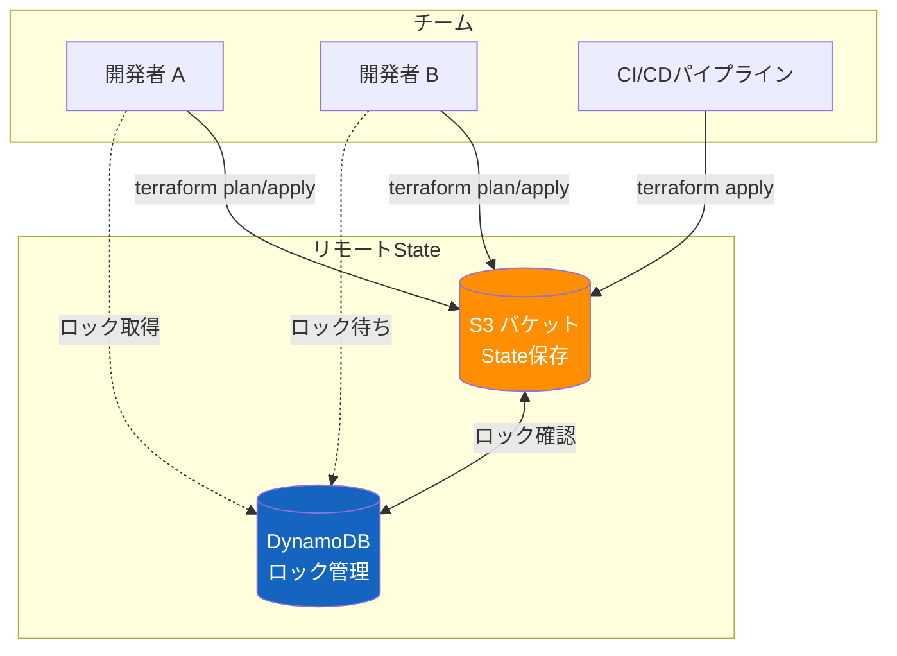

#### State の分割戦略

大規模なインフラでは、すべてのリソースを一つの State で管理することは現実的ではない。以下の理由から、State を適切に分割する必要がある。

- **blast radius（影響範囲）の最小化**: 一つの `apply` で変更されるリソースの範囲を限定する
- **実行速度**: State が大きくなると `plan` の実行に時間がかかる
- **権限分離**: ネットワーク層とアプリケーション層で異なるチームが管理する場合

一般的な分割パターンとして、以下のようなレイヤー分けが採用される。

```
infrastructure/
  ├── network/          # VPC, Subnet, Route Table
  │   ├── main.tf
  │   ├── variables.tf
  │   └── outputs.tf
  ├── database/         # RDS, ElastiCache
  │   ├── main.tf
  │   └── data.tf      # network state reference
  ├── application/      # ECS, ALB, Auto Scaling
  │   ├── main.tf
  │   └── data.tf      # network + database state reference
  └── monitoring/       # CloudWatch, SNS
      └── main.tf
```

レイヤー間の依存関係は `terraform_remote_state` データソースまたは `data` リソースで解決する。

```hcl
# In application layer: reference network layer outputs
data "terraform_remote_state" "network" {
  backend = "s3"
  config = {
    bucket = "my-terraform-state"
    key    = "prod/network/terraform.tfstate"
    region = "ap-northeast-1"
  }
}

resource "aws_instance" "app" {
  subnet_id = data.terraform_remote_state.network.outputs.private_subnet_id
  # ...
}
```

---

## 5. Pulumi のアプローチ

### Pulumi の設計哲学

Pulumi は 2018 年にリリースされた IaC ツールで、「既存のプログラミング言語でインフラを定義する」という根本的に異なるアプローチを取っている。Terraform が独自の DSL（HCL）を採用しているのに対し、Pulumi は TypeScript、Python、Go、C#、Java といった汎用プログラミング言語をそのまま使う。

この設計決定の背後にある考え方は明確である。インフラエンジニアの多くはすでにプログラミング言語を使いこなしており、新しい DSL を学ぶ必要はない。IDE の自動補完、型チェック、リファクタリング支援、テストフレームワークなど、成熟した開発ツールチェーンをそのまま活用できるべきだ——というものである。

### Pulumi のアーキテクチャ

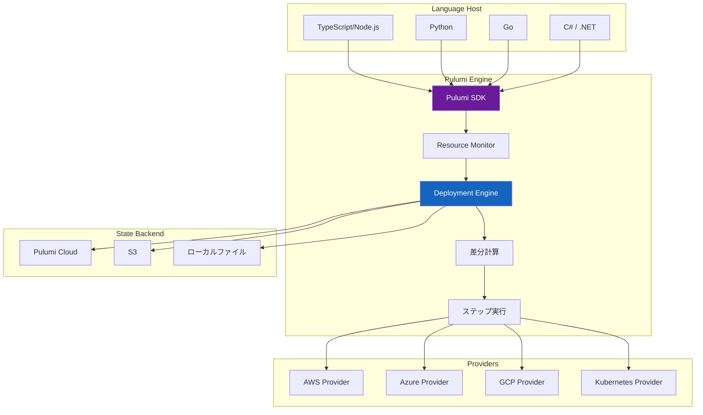

Pulumi の動作原理を理解するには、以下のプロセスを把握する必要がある。

1. ユーザーが書いたプログラム（例: TypeScript）が実行される
2. プログラム内で `new aws.ec2.Instance(...)` のようなリソース定義が呼び出されると、Pulumi SDK がそのリソース定義を **Resource Monitor** に登録する
3. プログラムの実行が完了すると、すべてのリソース定義が揃う
4. **Deployment Engine** が、現在の State と望ましい状態を比較し、差分を計算する
5. 差分に基づいて、Provider を通じてクラウド API を呼び出す

つまり、ユーザーのプログラムは「インフラの望ましい状態を構築するプログラム」であり、「インフラを直接操作するスクリプト」ではない。この点が、シェルスクリプトで AWS CLI を呼び出す命令的なアプローチと本質的に異なる。

### Pulumi のコード例

TypeScript を使った VPC + EC2 インスタンスの定義例を示す。

```typescript
import * as pulumi from "@pulumi/pulumi";
import * as aws from "@pulumi/aws";

// Configuration management
const config = new pulumi.Config();
const instanceCount = config.getNumber("instanceCount") || 2;
const environment = config.require("environment");

// VPC
const vpc = new aws.ec2.Vpc("main-vpc", {
  cidrBlock: "10.0.0.0/16",
  enableDnsHostnames: true,
  tags: {
    Name: `${environment}-vpc`,
    Environment: environment,
  },
});

// Subnets with loop
const azs = ["ap-northeast-1a", "ap-northeast-1c"];
const subnets = azs.map(
  (az, index) =>
    new aws.ec2.Subnet(`web-subnet-${index}`, {
      vpcId: vpc.id,
      cidrBlock: `10.0.${index + 1}.0/24`,
      availabilityZone: az,
      tags: { Name: `${environment}-web-${az}` },
    })
);

// Security Group with typed rules
interface IngressRule {
  port: number;
  description: string;
  cidrBlocks?: string[];
}

const ingressRules: IngressRule[] = [
  { port: 80, description: "HTTP" },
  { port: 443, description: "HTTPS" },
];

const webSg = new aws.ec2.SecurityGroup("web-sg", {
  vpcId: vpc.id,
  ingress: ingressRules.map((rule) => ({
    fromPort: rule.port,
    toPort: rule.port,
    protocol: "tcp",
    cidrBlocks: rule.cidrBlocks ?? ["0.0.0.0/0"],
    description: rule.description,
  })),
  egress: [
    {
      fromPort: 0,
      toPort: 0,
      protocol: "-1",
      cidrBlocks: ["0.0.0.0/0"],
    },
  ],
});

// EC2 Instances
const instances = Array.from({ length: instanceCount }, (_, i) =>
  new aws.ec2.Instance(`web-${i}`, {
    ami: "ami-0c55b159cbfafe1f0",
    instanceType: "t3.micro",
    subnetId: subnets[i % subnets.length].id,
    vpcSecurityGroupIds: [webSg.id],
    tags: {
      Name: `${environment}-web-${i}`,
      Environment: environment,
    },
  })
);

// Exports
export const vpcId = vpc.id;
export const instanceIps = instances.map((inst) => inst.publicIp);
```

このコード例では、HCL ではやや煩雑になる以下の操作が自然に記述できている。

- 配列の `map` によるサブネットの動的生成
- TypeScript の `interface` による型安全なルール定義
- テンプレートリテラルによる文字列補間
- `Array.from` によるインスタンスの動的生成

### Pulumi の State 管理

Pulumi も Terraform と同様に State を管理するが、デフォルトの State バックエンドが異なる。

| バックエンド | Pulumi | Terraform |
|-----------|--------|-----------|
| デフォルト | Pulumi Cloud（SaaS） | ローカルファイル |
| クラウドストレージ | S3, Azure Blob, GCS | S3, Azure Blob, GCS, Consul |
| マネージドサービス | Pulumi Cloud | Terraform Cloud / HCP Terraform |
| ローカル | `pulumi login --local` | デフォルト |

Pulumi Cloud をデフォルトにしている設計思想は、チーム開発を最初から前提としたものであり、State の管理、暗号化、アクセス制御、変更履歴の可視化を SaaS として提供する。

---

## 6. AWS CDK と CDKTF

### AWS CDK（Cloud Development Kit）

AWS CDK は、AWS が開発した IaC フレームワークであり、Pulumi と同様に汎用プログラミング言語でインフラを定義する。ただし、最終的な出力は CloudFormation テンプレート（JSON/YAML）であるという点が Pulumi と異なる。

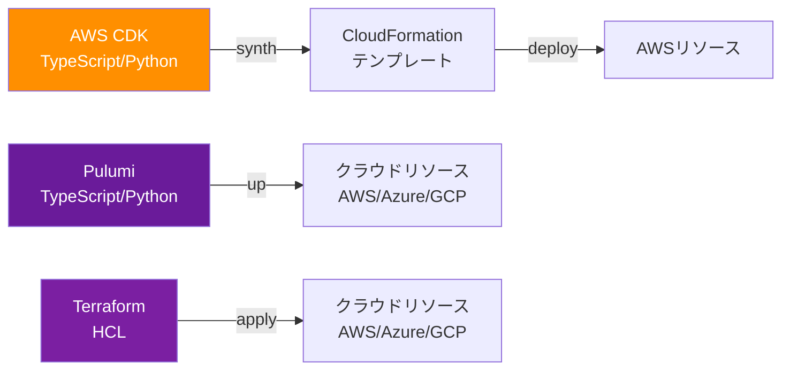

CDK の特徴は「Construct」と呼ばれる抽象化レイヤーにある。

```typescript
import * as cdk from "aws-cdk-lib";
import * as ec2 from "aws-cdk-lib/aws-ec2";
import * as ecs from "aws-cdk-lib/aws-ecs";
import * as ecs_patterns from "aws-cdk-lib/aws-ecs-patterns";

const app = new cdk.App();
const stack = new cdk.Stack(app, "WebStack");

// L2 Construct: VPC with sensible defaults
const vpc = new ec2.Vpc(stack, "WebVpc", {
  maxAzs: 2,
  // Automatically creates public/private subnets, NAT gateways, etc.
});

// L3 Construct (Pattern): complete Fargate service with ALB
new ecs_patterns.ApplicationLoadBalancedFargateService(
  stack,
  "WebService",
  {
    vpc,
    desiredCount: 2,
    taskImageOptions: {
      image: ecs.ContainerImage.fromRegistry("nginx:latest"),
    },
  }
);
```

Construct には 3 つのレベルがある。

- **L1 (CFn Resources)**: CloudFormation リソースの 1:1 マッピング。`CfnVPC` など
- **L2 (AWS Constructs)**: AWS のベストプラクティスに基づくデフォルト値を持つ高レベル抽象化。`Vpc`, `Bucket` など
- **L3 (Patterns)**: 複数のリソースを組み合わせた、よくあるアーキテクチャパターン。`ApplicationLoadBalancedFargateService` など

### CDKTF（CDK for Terraform）

CDKTF は、CDK の Construct モデルを Terraform に適用したものである。CDK と同様に汎用プログラミング言語でインフラを定義するが、出力は CloudFormation ではなく Terraform の JSON 設定ファイルとなる。

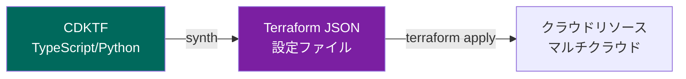

```typescript
import { Construct } from "constructs";
import { App, TerraformStack } from "cdktf";
import { AwsProvider } from "@cdktf/provider-aws/lib/provider";
import { Instance } from "@cdktf/provider-aws/lib/instance";
import { Vpc } from "@cdktf/provider-aws/lib/vpc";

class WebStack extends TerraformStack {
  constructor(scope: Construct, name: string) {
    super(scope, name);

    new AwsProvider(this, "aws", { region: "ap-northeast-1" });

    const vpc = new Vpc(this, "main-vpc", {
      cidrBlock: "10.0.0.0/16",
      enableDnsHostnames: true,
    });

    new Instance(this, "web", {
      ami: "ami-0c55b159cbfafe1f0",
      instanceType: "t3.micro",
      subnetId: vpc.id,
    });
  }
}

const app = new App();
new WebStack(app, "web-stack");
app.synth();
```

CDKTF の位置づけは、「Terraform のエコシステム（4,000+ プロバイダー）を活用しつつ、HCL ではなく汎用プログラミング言語で書きたい」というニーズに応えるものである。

### ツール比較まとめ

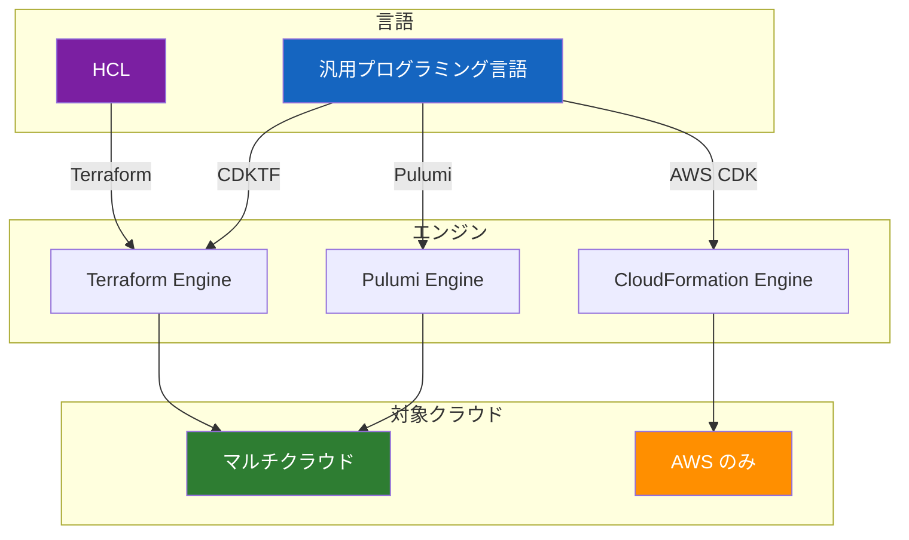

| 特性 | Terraform | Pulumi | AWS CDK | CDKTF |
|------|-----------|--------|---------|-------|
| 言語 | HCL | 汎用言語 | 汎用言語 | 汎用言語 |
| エンジン | Terraform | Pulumi | CloudFormation | Terraform |
| マルチクラウド | 対応 | 対応 | AWS のみ | 対応 |
| エコシステム | 最大 | 成長中 | AWS に特化 | Terraform 互換 |
| 成熟度 | 高い | 中程度 | 高い（AWS内） | 発展途上 |

---

## 7. モジュール設計

### モジュールの必要性

IaC のコードベースが大きくなると、同じパターンの繰り返しが増えてくる。例えば、複数の環境（dev, staging, prod）で同じ構成のリソースを作成する場合、コピー＆ペーストでは管理が破綻する。モジュールは、再利用可能な単位としてインフラコードをパッケージ化する仕組みである。

### Terraform のモジュール

Terraform のモジュールは、実質的には「変数を受け取り、リソースを定義し、出力値を返す」ディレクトリである。

```
modules/
  └── web-server/
      ├── main.tf        # Resource definitions
      ├── variables.tf   # Input variables
      ├── outputs.tf     # Output values
      └── versions.tf    # Provider version constraints
```

::: code-group

```hcl [modules/web-server/variables.tf]
variable "environment" {
  description = "Deployment environment"
  type        = string
}

variable "instance_count" {
  description = "Number of instances"
  type        = number
  default     = 2
}

variable "instance_type" {
  description = "EC2 instance type"
  type        = string
  default     = "t3.micro"
}

variable "vpc_id" {
  description = "VPC ID to deploy into"
  type        = string
}

variable "subnet_ids" {
  description = "Subnet IDs for instances"
  type        = list(string)
}
```

```hcl [modules/web-server/main.tf]
resource "aws_security_group" "web" {
  name_prefix = "${var.environment}-web-"
  vpc_id      = var.vpc_id

  ingress {
    from_port   = 80
    to_port     = 80
    protocol    = "tcp"
    cidr_blocks = ["0.0.0.0/0"]
  }

  lifecycle {
    create_before_destroy = true
  }
}

resource "aws_instance" "web" {
  count                  = var.instance_count
  ami                    = data.aws_ami.ubuntu.id
  instance_type          = var.instance_type
  subnet_id              = var.subnet_ids[count.index % length(var.subnet_ids)]
  vpc_security_group_ids = [aws_security_group.web.id]

  tags = {
    Name        = "${var.environment}-web-${count.index}"
    Environment = var.environment
  }
}

data "aws_ami" "ubuntu" {
  most_recent = true
  owners      = ["099720109477"]

  filter {
    name   = "name"
    values = ["ubuntu/images/hvm-ssd/ubuntu-jammy-22.04-amd64-server-*"]
  }
}
```

```hcl [modules/web-server/outputs.tf]
output "instance_ids" {
  description = "IDs of created instances"
  value       = aws_instance.web[*].id
}

output "security_group_id" {
  description = "ID of the web security group"
  value       = aws_security_group.web.id
}
```

:::

モジュールの呼び出し側では、以下のように使用する。

```hcl
# environments/prod/main.tf
module "web" {
  source = "../../modules/web-server"

  environment    = "prod"
  instance_count = 4
  instance_type  = "t3.large"
  vpc_id         = module.network.vpc_id
  subnet_ids     = module.network.private_subnet_ids
}
```

### Pulumi のモジュール（Component Resource）

Pulumi ではモジュールに相当する概念として **Component Resource** がある。これは通常のクラスとして実装されるため、オブジェクト指向プログラミングの恩恵をそのまま受けられる。

```typescript
import * as pulumi from "@pulumi/pulumi";
import * as aws from "@pulumi/aws";

// Component Resource definition
interface WebServerArgs {
  environment: string;
  instanceCount: number;
  instanceType: string;
  vpcId: pulumi.Input<string>;
  subnetIds: pulumi.Input<string>[];
}

class WebServer extends pulumi.ComponentResource {
  public readonly instanceIds: pulumi.Output<string>[];
  public readonly securityGroupId: pulumi.Output<string>;

  constructor(
    name: string,
    args: WebServerArgs,
    opts?: pulumi.ComponentResourceOptions
  ) {
    super("custom:infrastructure:WebServer", name, {}, opts);

    const sg = new aws.ec2.SecurityGroup(
      `${name}-sg`,
      {
        vpcId: args.vpcId,
        ingress: [
          {
            fromPort: 80,
            toPort: 80,
            protocol: "tcp",
            cidrBlocks: ["0.0.0.0/0"],
          },
        ],
      },
      { parent: this }
    );

    const instances = Array.from(
      { length: args.instanceCount },
      (_, i) =>
        new aws.ec2.Instance(
          `${name}-instance-${i}`,
          {
            ami: "ami-0c55b159cbfafe1f0",
            instanceType: args.instanceType,
            subnetId: args.subnetIds[i % args.subnetIds.length],
            vpcSecurityGroupIds: [sg.id],
            tags: {
              Name: `${args.environment}-${name}-${i}`,
              Environment: args.environment,
            },
          },
          { parent: this }
        )
    );

    this.instanceIds = instances.map((inst) => inst.id);
    this.securityGroupId = sg.id;

    this.registerOutputs({
      instanceIds: this.instanceIds,
      securityGroupId: this.securityGroupId,
    });
  }
}

// Usage
const webServer = new WebServer("web", {
  environment: "prod",
  instanceCount: 4,
  instanceType: "t3.large",
  vpcId: vpc.id,
  subnetIds: subnets.map((s) => s.id),
});
```

### モジュール設計のベストプラクティス

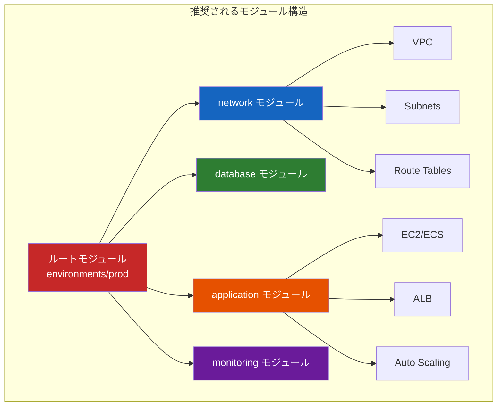

モジュール設計で守るべき原則を以下にまとめる。

1. **単一責任**: 一つのモジュールは一つの論理的な関心事を扱う。ネットワーク、データベース、アプリケーションを一つのモジュールに詰め込まない。
2. **適切な入出力**: 必要最小限の変数を受け取り、他のモジュールが必要とする値を出力する。内部の実装詳細は隠蔽する。
3. **バージョニング**: モジュールにセマンティックバージョニングを適用し、破壊的変更を管理する。Terraform Registry や Git タグを活用する。
4. **合成可能性**: モジュールは他のモジュールと組み合わせて使えるように設計する。ハードコードされた値を避け、変数で注入可能にする。
5. **テスト可能性**: モジュール単体でテストできるように設計する。外部依存は変数として注入する。

---

## 8. テストと CI/CD 統合

### IaC のテスト戦略

インフラコードもアプリケーションコードと同様にテストが必要である。しかし、インフラコードのテストにはいくつかの固有の課題がある。

- 実際のクラウドリソースを作成するため、テストに時間とコストがかかる
- テスト環境の分離が必要
- 非決定的な要素（API のレート制限、リソースの可用性）が存在する

IaC のテストは以下のピラミッド構造で整理できる。

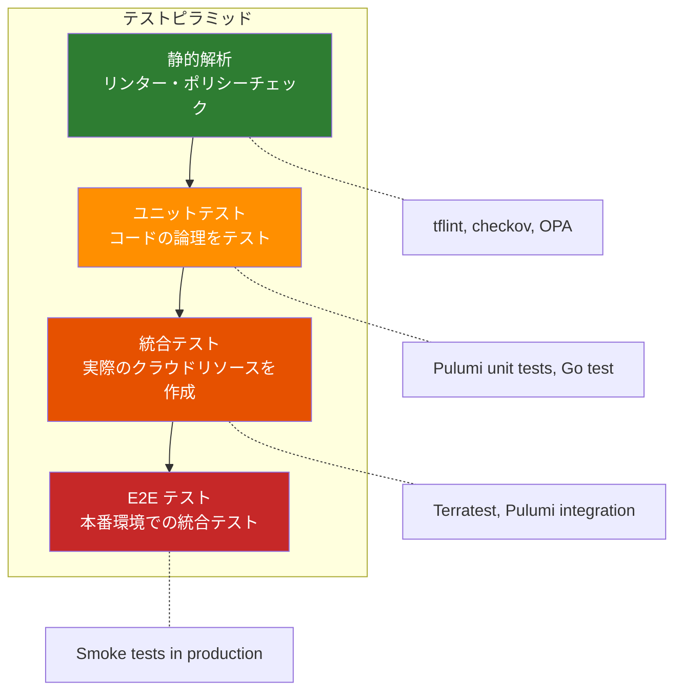

### 静的解析

静的解析は、実際にリソースを作成することなくコードの品質をチェックする。最もコストが低く、最も頻繁に実行すべきテストである。

**tflint**: Terraform の構文チェックとベストプラクティスの検証を行う。

```hcl
# .tflint.hcl
plugin "aws" {
  enabled = true
  version = "0.30.0"
  source  = "github.com/terraform-linters/tflint-ruleset-aws"
}

rule "aws_instance_invalid_type" {
  enabled = true
}

rule "terraform_naming_convention" {
  enabled = true
  format  = "snake_case"
}
```

**Checkov / tfsec**: セキュリティのベストプラクティスを検証する。例えば、S3 バケットの暗号化が有効になっているか、セキュリティグループが 0.0.0.0/0 からの SSH を許可していないか、などをチェックする。

**OPA（Open Policy Agent）**: カスタムポリシーをRego言語で定義し、IaC コードに対して評価する。

```rego
# policy/terraform.rego
package terraform

# Deny instances without required tags
deny[msg] {
    resource := input.resource.aws_instance[name]
    not resource.tags.Environment
    msg := sprintf("Instance '%s' must have an 'Environment' tag", [name])
}

# Deny overly permissive security groups
deny[msg] {
    resource := input.resource.aws_security_group[name]
    ingress := resource.ingress[_]
    ingress.cidr_blocks[_] == "0.0.0.0/0"
    ingress.from_port == 22
    msg := sprintf("Security group '%s' allows SSH from 0.0.0.0/0", [name])
}
```

### ユニットテスト

Pulumi では、言語標準のテストフレームワークを使ってユニットテストを書ける。モック機能により、実際のクラウド API を呼び出すことなくリソースの定義を検証できる。

```typescript
import * as pulumi from "@pulumi/pulumi";
import { expect } from "chai";

// Mock Pulumi runtime
pulumi.runtime.setMocks({
  newResource: (args: pulumi.runtime.MockResourceArgs) => {
    return { id: `${args.name}-id`, state: args.inputs };
  },
  call: (args: pulumi.runtime.MockCallArgs) => {
    return args.inputs;
  },
});

describe("WebServer", () => {
  let infra: typeof import("./index");

  before(async () => {
    infra = await import("./index");
  });

  it("should create instances with correct tags", (done) => {
    pulumi
      .all(infra.instanceTags)
      .apply(([tags]) => {
        expect(tags).to.have.property("Environment", "prod");
        expect(tags).to.have.property("ManagedBy", "pulumi");
        done();
      });
  });

  it("should not use overly large instance types in dev", (done) => {
    pulumi
      .all([infra.instanceType])
      .apply(([instanceType]) => {
        const largeTypes = ["m5.xlarge", "m5.2xlarge", "c5.xlarge"];
        expect(largeTypes).to.not.include(instanceType);
        done();
      });
  });
});
```

### 統合テスト

統合テストでは、実際にクラウドリソースを作成し、その動作を検証した後、リソースをクリーンアップする。Go 言語で書かれた **Terratest** が代表的なツールである。

```go
package test

import (
	"testing"
	"time"
	"fmt"

	"github.com/gruntwork-io/terratest/modules/terraform"
	"github.com/gruntwork-io/terratest/modules/http-helper"
	"github.com/stretchr/testify/assert"
)

func TestWebServer(t *testing.T) {
	t.Parallel()

	opts := &terraform.Options{
		// Path to the Terraform code
		TerraformDir: "../modules/web-server",
		Vars: map[string]interface{}{
			"environment":    "test",
			"instance_count": 1,
			"instance_type":  "t3.micro",
		},
	}

	// Clean up resources after test
	defer terraform.Destroy(t, opts)

	// Deploy infrastructure
	terraform.InitAndApply(t, opts)

	// Validate outputs
	instanceId := terraform.Output(t, opts, "instance_ids")
	assert.NotEmpty(t, instanceId)

	// Test HTTP endpoint
	url := fmt.Sprintf("http://%s", terraform.Output(t, opts, "public_ip"))
	http_helper.HttpGetWithRetry(
		t, url, nil, 200, "OK",
		30, 10*time.Second,
	)
}
```

### CI/CD パイプラインの構築

IaC を CI/CD パイプラインに統合することで、インフラ変更のレビューと適用を自動化できる。

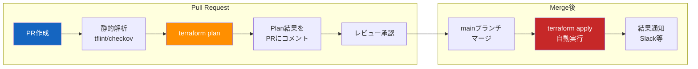

GitHub Actions を使った CI/CD パイプラインの例を示す。

```yaml
# .github/workflows/terraform.yml
name: Terraform CI/CD

on:
  pull_request:
    paths: ["infrastructure/**"]
  push:
    branches: [main]
    paths: ["infrastructure/**"]

permissions:
  contents: read
  pull-requests: write
  id-token: write

jobs:
  plan:
    if: github.event_name == 'pull_request'
    runs-on: ubuntu-latest
    steps:
      - uses: actions/checkout@v4

      - uses: hashicorp/setup-terraform@v3
        with:
          terraform_version: 1.7.0

      # OIDC authentication (no static credentials)
      - uses: aws-actions/configure-aws-credentials@v4
        with:
          role-to-assume: arn:aws:iam::role/terraform-ci
          aws-region: ap-northeast-1

      - name: Terraform Init
        run: terraform init
        working-directory: infrastructure/

      - name: Terraform Format Check
        run: terraform fmt -check -recursive
        working-directory: infrastructure/

      - name: Run tflint
        uses: terraform-linters/setup-tflint@v4
      - run: tflint --init && tflint
        working-directory: infrastructure/

      - name: Run Checkov
        uses: bridgecrewio/checkov-action@v12
        with:
          directory: infrastructure/

      - name: Terraform Plan
        id: plan
        run: terraform plan -no-color -out=tfplan
        working-directory: infrastructure/

      - name: Comment Plan on PR
        uses: actions/github-script@v7
        with:
          script: |
            const plan = `${{ steps.plan.outputs.stdout }}`;
            github.rest.issues.createComment({
              issue_number: context.issue.number,
              owner: context.repo.owner,
              repo: context.repo.repo,
              body: `## Terraform Plan\n\`\`\`\n${plan}\n\`\`\``
            });

  apply:
    if: github.ref == 'refs/heads/main' && github.event_name == 'push'
    runs-on: ubuntu-latest
    environment: production
    steps:
      - uses: actions/checkout@v4

      - uses: hashicorp/setup-terraform@v3
        with:
          terraform_version: 1.7.0

      - uses: aws-actions/configure-aws-credentials@v4
        with:
          role-to-assume: arn:aws:iam::role/terraform-cd
          aws-region: ap-northeast-1

      - name: Terraform Init
        run: terraform init
        working-directory: infrastructure/

      - name: Terraform Apply
        run: terraform apply -auto-approve
        working-directory: infrastructure/
```

この例では以下のポイントを押さえている。

- **OIDC 認証**: 静的な AWS 認証情報（アクセスキー）を使わず、GitHub の OIDC トークンで一時的な認証を行う
- **PR 時は Plan のみ**: `plan` の結果を PR にコメントし、レビューを容易にする
- **マージ後に Apply**: `main` ブランチへのマージをトリガーに `apply` を実行する
- **environment 保護**: GitHub の Environment Protection Rules を使い、本番環境への適用に承認プロセスを設ける

---

## 9. IaC のベストプラクティス

### State の安全管理

State ファイルにはクラウドリソースの情報が含まれ、場合によってはデータベースのパスワードや API キーなどの機密情報も含まれる。

::: warning State ファイルの機密性
Terraform の State ファイルは平文で機密情報を保持する場合がある。State ファイルを Git にコミットしてはならない。必ずリモートバックエンドを使い、暗号化とアクセス制御を適用すること。
:::

- **リモートバックエンドの使用**: S3 + DynamoDB、Terraform Cloud、Pulumi Cloud などを使い、State を安全に管理する
- **暗号化の有効化**: S3 バックエンドでは `encrypt = true` を必ず指定する
- **アクセス制御**: State にアクセスできる IAM ロール/ユーザーを最小限にする
- **`.gitignore` の設定**: `terraform.tfstate`、`terraform.tfstate.backup`、`.terraform/` を必ず除外する

### 秘密情報の管理

IaC コードに直接パスワードや API キーを記述してはならない。以下のツールや仕組みを活用する。

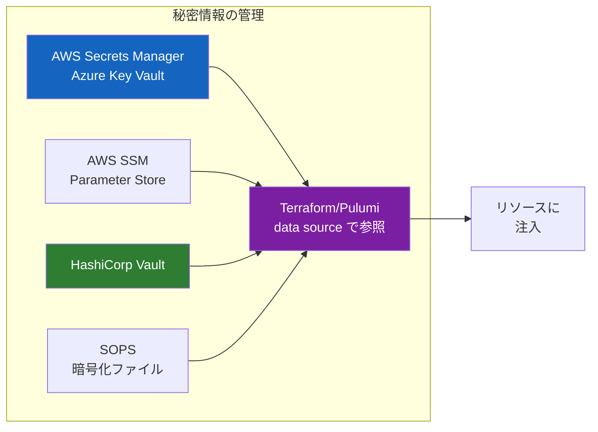

```hcl
# Reference secrets from AWS Secrets Manager
data "aws_secretsmanager_secret_version" "db_password" {
  secret_id = "prod/database/password"
}

resource "aws_db_instance" "main" {
  engine               = "postgres"
  instance_class       = "db.t3.medium"
  username             = "admin"
  password             = data.aws_secretsmanager_secret_version.db_password.secret_string
  skip_final_snapshot  = false
}
```

### Drift Detection（ドリフト検出）

IaC を導入しても、手動でクラウドリソースを変更してしまうケースは発生する。コードと実際のインフラの乖離（ドリフト）を検出し、対処する仕組みが必要である。

- **定期的な `terraform plan`**: CI/CD パイプラインで定期的に `plan` を実行し、差分がある場合は通知する
- **AWS Config / Azure Policy**: クラウドプロバイダー側のサービスでコンプライアンスを監視する
- **ドリフト修正ポリシー**: ドリフトが検出された場合の対応手順を事前に定めておく（コードを修正して追従するか、`apply` で上書きするか）

### 環境管理のパターン

複数環境（dev, staging, prod）の管理には、いくつかのパターンが存在する。

**パターン 1: ディレクトリ分離（Workspace 不使用）**

```
infrastructure/
  ├── modules/
  │   ├── network/
  │   └── application/
  ├── environments/
  │   ├── dev/
  │   │   ├── main.tf
  │   │   ├── terraform.tfvars
  │   │   └── backend.hcl
  │   ├── staging/
  │   │   ├── main.tf
  │   │   ├── terraform.tfvars
  │   │   └── backend.hcl
  │   └── prod/
  │       ├── main.tf
  │       ├── terraform.tfvars
  │       └── backend.hcl
  └── global/
      └── iam/
```

この方式では、各環境が独立した State を持ち、独立した `terraform apply` で管理される。環境間の差異は `terraform.tfvars` で表現する。

**パターン 2: Terraform Workspaces**

```hcl
# Single configuration with workspace-based switching
resource "aws_instance" "web" {
  instance_type = terraform.workspace == "prod" ? "t3.large" : "t3.micro"

  tags = {
    Environment = terraform.workspace
  }
}
```

Workspaces は同一コードを複数の State で管理する仕組みだが、環境間の差異が大きい場合には適さない。公式ドキュメントでも、本番環境の分離には Workspaces よりもディレクトリ分離が推奨されている。

### 命名規則とタグ付け

一貫した命名規則とタグ付けは、リソースの管理とコスト追跡に不可欠である。

```hcl
# Consistent naming and tagging strategy
locals {
  name_prefix = "${var.project}-${var.environment}"

  common_tags = {
    Project     = var.project
    Environment = var.environment
    ManagedBy   = "terraform"
    Team        = var.team
    CostCenter  = var.cost_center
  }
}

resource "aws_instance" "web" {
  tags = merge(local.common_tags, {
    Name = "${local.name_prefix}-web"
    Role = "web-server"
  })
}
```

### import と既存リソースの取り込み

既存のインフラを IaC 管理下に置くケースは多い。Terraform 1.5 以降では、`import` ブロックによる宣言的なインポートがサポートされている。

```hcl
# Declarative import (Terraform 1.5+)
import {
  to = aws_instance.legacy_web
  id = "i-0abc123def456789"
}

resource "aws_instance" "legacy_web" {
  ami           = "ami-0c55b159cbfafe1f0"
  instance_type = "t3.micro"
  # ... match current configuration
}
```

従来のコマンドラインベースのインポート（`terraform import aws_instance.legacy_web i-0abc123def456789`）に比べ、インポート操作自体がコードとしてレビュー可能になった点が大きな改善である。

### バージョン管理とピン留め

プロバイダーや Terraform 本体のバージョンは明示的にピン留めする。予期しないバージョンアップによる破壊的変更を防ぐためである。

```hcl
terraform {
  required_version = ">= 1.7.0, < 2.0.0"

  required_providers {
    aws = {
      source  = "hashicorp/aws"
      version = "~> 5.30"
    }
  }
}
```

`~>` 演算子は、パッチバージョンの更新のみを許可する（例: `5.30.x` は許可するが `5.31.0` 以上は許可しない）。これにより、セキュリティパッチは自動的に取り込みつつ、破壊的変更のリスクを抑えられる。

---

## まとめ

Infrastructure as Code は、インフラ管理の再現性、追跡可能性、品質保証を根本的に改善するアプローチである。本記事で取り上げた主要なツールは、それぞれ異なる設計思想を持つ。

- **Terraform** は、HCL という専用 DSL と巨大なプロバイダーエコシステムにより、マルチクラウド環境での IaC の事実上の標準となっている。Plan → Apply のワークフローと明示的な State 管理が、安全なインフラ変更を支えている。
- **Pulumi** は、汎用プログラミング言語を活用することで、既存の開発スキルとツールチェーンを IaC に持ち込む。型安全性、テスタビリティ、IDE サポートの面で優位性がある。
- **AWS CDK / CDKTF** は、それぞれ CloudFormation と Terraform をバックエンドとしつつ、高レベルな抽象化（Construct）を提供する。

どのツールを選択するかは、チームのスキルセット、マルチクラウドの必要性、既存のエコシステムとの整合性によって決まる。しかし、どのツールを選んでも、以下の原則は共通して重要である。

1. すべてのインフラ変更をコードで管理し、バージョン管理する
2. State を安全に管理し、チームで共有する
3. CI/CD パイプラインで自動テストと自動適用を行う
4. モジュール化により再利用性と保守性を高める
5. セキュリティポリシーを静的解析で強制する

IaC は単なるツールの導入ではなく、インフラ管理の文化そのものの変革を意味する。「インフラはコードである」という原則を組織全体で共有し、継続的に改善していくことが成功の鍵である。
