# 冪等性の設計

## はじめに

分散システムにおいて、ネットワークは本質的に信頼できない。リクエストは途中で消失し、レスポンスはクライアントに届かず、タイムアウトは操作が成功したのか失敗したのかを曖昧にする。このような環境で安全にリトライを行い、システム全体の整合性を保つために不可欠な概念が**冪等性（Idempotency）**である。

冪等性は単なる API 設計のベストプラクティスではなく、分散システムの信頼性を支える根幹的な設計原則である。決済処理で同じ注文が二重に課金されれば事業上の損害になり、メッセージキューで同じメッセージが二重に処理されればデータの不整合が生じる。冪等性の適切な設計は、こうした障害シナリオにおいて「最低でも一度は実行され、何度実行されても結果が同じ」という保証を提供する。

本記事では、冪等性の数学的定義から出発し、HTTP メソッドとの関係、冪等性キーを用いた実装パターン、データベース操作やメッセージキューにおける冪等性の確保、そして決済処理を含む実世界での適用事例まで、体系的に解説する。

## 冪等性とは何か

### 数学的定義

冪等性（idempotency）は元来、数学における概念である。関数 $f$ が冪等であるとは、次の条件を満たすことをいう。

$$
f(f(x)) = f(x) \quad \forall x
$$

すなわち、関数を一度適用した結果に再び同じ関数を適用しても、結果が変わらないことを意味する。具体例を挙げると、絶対値関数 $|x|$ は冪等である。$||x|| = |x|$ が常に成り立つからである。同様に、集合論における和集合演算 $A \cup A = A$ も冪等性の一例である。

代数学では、元 $e$ が $e \cdot e = e$ を満たすとき、$e$ を冪等元（idempotent element）と呼ぶ。この概念はコンピュータサイエンスにおける冪等性の理解に直結する。

### コンピュータサイエンスにおける冪等性

ソフトウェアの文脈では、冪等性は次のように再定義される。

> **ある操作を 1 回実行した場合と、同じ操作を複数回実行した場合で、システムの状態（および返却される結果）が同一であること。**

ここで重要なのは「同じ操作」の定義である。同じリクエストパラメータ、同じリソース識別子、同じ意図を持つ操作が繰り返された場合に、結果が変わらないことが冪等性の核心である。

冪等性と混同されやすい概念を整理しておく。

| 概念 | 定義 | 例 |
|------|------|------|
| **冪等性（Idempotency）** | 同じ操作を何回実行しても結果が同じ | `PUT /users/123 {"name": "Alice"}` |
| **安全性（Safety）** | 操作がサーバーの状態を変更しない | `GET /users/123` |
| **べき等 + 安全** | 状態を変えず、何回実行しても同じ | `GET /users/123` |
| **べき等 + 非安全** | 状態を変えるが、何回実行しても同じ結果 | `PUT /users/123 {"name": "Alice"}` |

安全な操作は必ず冪等であるが、冪等な操作が必ずしも安全とは限らない点に注意が必要である。

### 副作用と冪等性

冪等性を考える際、副作用（side effect）の区別が重要になる。

- **システム状態に対する冪等性**: データベースの状態が同じになること
- **レスポンスに対する冪等性**: 返却される値が同じであること
- **外部副作用に対する冪等性**: メール送信やWebhook呼び出しなどの外部影響が重複しないこと

厳密な冪等性設計では、これら全てを考慮する必要がある。例えば、ユーザー作成 API が冪等であるとき、同じリクエストの二回目では新しいユーザーを作成せず、最初に作成したユーザーの情報を返却し、さらにウェルカムメールも再送しないことが理想的である。

## なぜ分散システムで冪等性が重要か

### ネットワーク障害の現実

分散システムにおいて、クライアントとサーバー間の通信は以下の障害に常にさらされている。

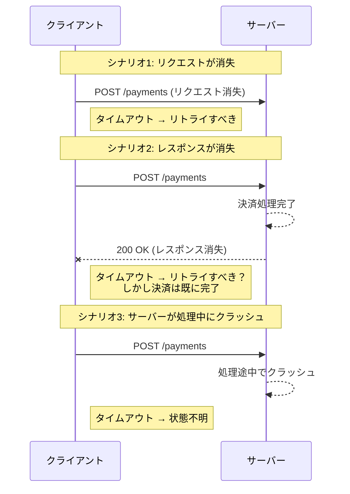

上図のシナリオ 2 が最も危険である。クライアントにはタイムアウトしか見えないが、サーバー側では処理が完了している。この状態でリトライすると二重処理が発生する。冪等性が確保されていれば、クライアントは安全にリトライでき、サーバーは重複リクエストを検出して同じ結果を返却できる。

### At-Least-Once と Exactly-Once

分散システムにおけるメッセージ配信のセマンティクスは3つに分類される。

| セマンティクス | 説明 | 実現難易度 |
|---|---|---|
| **At-Most-Once** | 最大1回配信。失敗しても再送しない | 容易 |
| **At-Least-Once** | 最低1回配信。成功するまで再送する | 中程度 |
| **Exactly-Once** | 正確に1回だけ処理される | 非常に困難 |

純粋な Exactly-Once セマンティクスは、FLP不可能性定理が示すように、非同期分散システムにおいて一般には実現不可能である。しかし、**At-Least-Once 配信 + 冪等な処理** を組み合わせることで、**効果的な Exactly-Once**（Effectively Once）を実現できる。これが冪等性が分散システムの設計において決定的に重要な理由である。

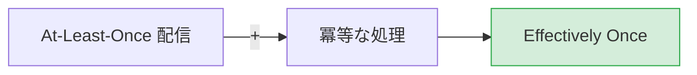

### リトライの安全性

クライアントサイドのリトライ戦略は、ネットワーク障害に対する基本的な防御手段である。しかし、リトライが安全であるためには、対象の操作が冪等でなければならない。

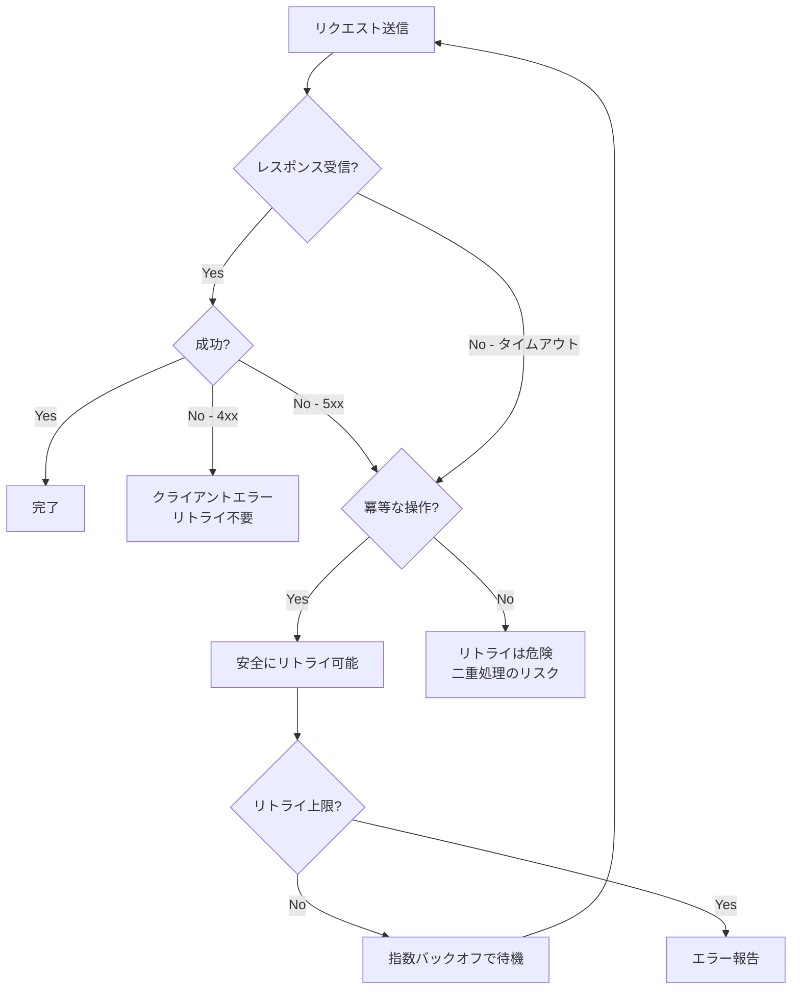

指数バックオフ（Exponential Backoff）とジッター（Jitter）を組み合わせたリトライ戦略は、冪等な操作に対してのみ安全に適用できる。

## HTTP メソッドと冪等性

### HTTP 仕様における冪等性の定義

RFC 9110（HTTP Semantics）は、HTTP メソッドの冪等性を次のように定義している。

> A request method is considered "idempotent" if the intended effect on the server of multiple identical requests with that method is the same as the effect for a single such request.

各 HTTP メソッドの冪等性と安全性を整理すると以下のようになる。

| メソッド | 安全 | 冪等 | 説明 |
|----------|------|------|------|
| GET | Yes | Yes | リソースの取得。状態を変更しない |
| HEAD | Yes | Yes | GET と同じだがボディなし |
| OPTIONS | Yes | Yes | 対応メソッドの問い合わせ |
| PUT | No | Yes | リソースの完全置換 |
| DELETE | No | Yes | リソースの削除 |
| POST | No | No | リソースの作成や任意の処理 |
| PATCH | No | No | リソースの部分更新 |

### GET — 安全かつ冪等

GET は最も基本的な冪等操作である。何度呼び出してもサーバーの状態は変化せず、同じレスポンスが返される（キャッシュの有無やデータの変更を除く）。

```http
GET /api/orders/12345 HTTP/1.1
Host: example.com
```

ただし、GET リクエストに副作用を持たせる設計（例: アクセスカウンタの増加）は、冪等性に関する期待を裏切るアンチパターンである。

### PUT — 冪等な更新

PUT はリソースの完全置換であり、仕様上冪等であることが要求される。同じ PUT リクエストを 10 回送信しても、リソースの状態は 1 回送信した場合と同じでなければならない。

```http
PUT /api/users/456 HTTP/1.1
Content-Type: application/json

{
  "name": "Alice",
  "email": "alice@example.com",
  "role": "admin"
}
```

PUT が冪等である理由は、リクエストボディにリソースの完全な表現が含まれているためである。サーバーは単にリソースを指定された状態に上書きするだけであり、既に同じ状態であれば結果は変わらない。

### DELETE — 冪等な削除

DELETE も冪等である。リソースを削除するリクエストを複数回送信した場合、最初のリクエストでリソースが削除され、以降のリクエストではリソースが既に存在しないが、サーバーの最終状態は同じ（リソースが存在しない）である。

```http
DELETE /api/users/456 HTTP/1.1
Host: example.com
```

ここで議論になるのはレスポンスコードである。最初の DELETE は `200 OK` または `204 No Content` を返し、二回目以降は `404 Not Found` を返す実装が一般的である。レスポンスは異なるが、サーバーの状態は冪等である。これは「状態の冪等性」と「レスポンスの冪等性」の区別を示す好例である。

### POST — 本質的に非冪等

POST はリソースの作成や任意の処理に使用され、仕様上は冪等性が保証されない。同じ POST リクエストを 2 回送信すれば、通常は 2 つのリソースが作成される。

```http
POST /api/orders HTTP/1.1
Content-Type: application/json

{
  "product_id": "prod_789",
  "quantity": 1
}
```

しかし、多くのシステムでは POST 操作にも冪等性が必要である。注文作成や決済処理は POST で行われるが、二重実行は許容できない。これを解決するのが**冪等性キー（Idempotency Key）**パターンである。

### PATCH — 冪等性の条件付き確保

PATCH はリソースの部分更新であり、仕様上は冪等とは定義されていない。しかし、PATCH の冪等性は操作の内容に依存する。

```json
// Idempotent PATCH: set absolute value
{"op": "replace", "path": "/name", "value": "Alice"}

// Non-idempotent PATCH: relative operation
{"op": "increment", "path": "/balance", "value": 100}
```

絶対値の設定（`name` を `"Alice"` にする）は冪等であるが、相対的な操作（`balance` を 100 増やす）は冪等ではない。PATCH を冪等にするためには、操作を絶対値の設定として表現するか、後述する冪等性キーを使用する必要がある。

## 冪等性キー（Idempotency Key）パターン

### 基本概念

冪等性キーは、本質的に非冪等な操作（特に POST）に冪等性を付与するための設計パターンである。クライアントがリクエストごとに一意の識別子（冪等性キー）を生成し、サーバーはこのキーを用いて重複リクエストを検出する。

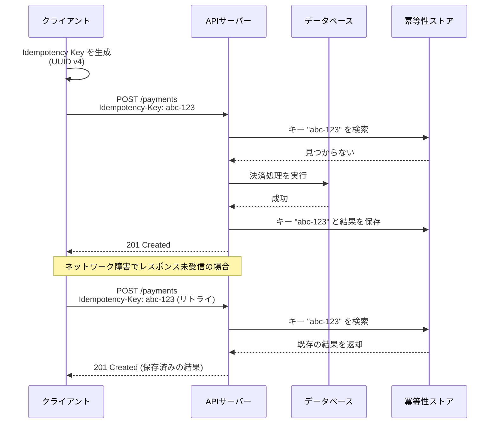

### Stripe の Idempotency Key 実装

決済プラットフォーム Stripe は、冪等性キーの実装で最もよく知られた事例の一つである。Stripe API では `Idempotency-Key` ヘッダーを通じて冪等性を実現している。

```http
POST /v1/charges HTTP/1.1
Host: api.stripe.com
Authorization: Bearer sk_test_xxx
Idempotency-Key: xJ3kf9dL2mN7pQ8r
Content-Type: application/x-www-form-urlencoded

amount=2000&currency=jpy&source=tok_visa
```

Stripe の実装における重要な設計判断を以下に示す。

1. **キーの有効期限**: 24 時間で失効する。永続的に保持するとストレージコストが増大するため
2. **キーのスコープ**: API キー単位でスコープされる。異なるアカウントの同一キーは衝突しない
3. **パラメータの検証**: 同じキーで異なるパラメータが送信された場合、`409 Conflict` を返却する
4. **レスポンスのリプレイ**: 初回リクエストのレスポンス（ステータスコード含む）をそのまま返却する

### 冪等性キーの生成戦略

冪等性キーの生成方法は、ユースケースによって使い分ける。

| 戦略 | 特徴 | 適用場面 |
|------|------|----------|
| **UUID v4** | ランダム生成。衝突確率は極めて低い | 汎用的な冪等性確保 |
| **UUID v7** | タイムスタンプベース。ソート可能 | 時系列での管理が必要な場合 |
| **ビジネスキー** | 注文ID + 操作種別 など | ビジネスロジックに基づく重複排除 |
| **ハッシュベース** | リクエストパラメータのハッシュ | パラメータが同一なら同じ操作とみなす場合 |

UUID v4 は最も単純で広く使われるが、ビジネスキーベースのアプローチはより意味的に正確な重複排除を可能にする。

```python
import uuid
import hashlib
import json

# Strategy 1: UUID v4
idempotency_key = str(uuid.uuid4())

# Strategy 2: Business key
idempotency_key = f"order:{order_id}:charge"

# Strategy 3: Hash-based
request_body = {"product_id": "prod_789", "quantity": 1, "user_id": "user_123"}
idempotency_key = hashlib.sha256(
    json.dumps(request_body, sort_keys=True).encode()
).hexdigest()
```

### サーバーサイドの実装

サーバーサイドでの冪等性キー処理は、以下のフローで実装される。

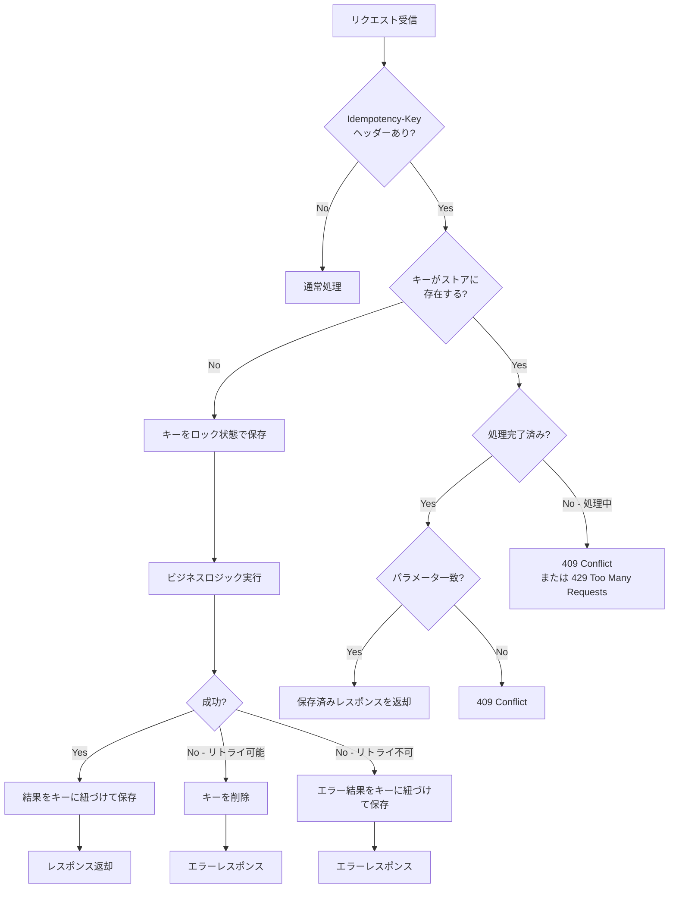

```python
from datetime import datetime, timedelta
from typing import Optional
import json

class IdempotencyStore:
    """Idempotency key management with Redis backend."""

    def __init__(self, redis_client, ttl_hours: int = 24):
        self.redis = redis_client
        self.ttl = timedelta(hours=ttl_hours)

    def check_and_lock(self, key: str, request_hash: str) -> Optional[dict]:
        """
        Check if the key exists. If not, acquire a lock.
        Returns cached response if exists, None if lock acquired.
        """
        lock_key = f"idempotency:{key}:lock"
        data_key = f"idempotency:{key}:data"

        # Try to acquire lock (atomic operation)
        if self.redis.set(lock_key, "locked", nx=True, ex=60):
            return None  # Lock acquired, proceed with processing

        # Key exists, check for completed result
        cached = self.redis.get(data_key)
        if cached:
            result = json.loads(cached)
            if result["request_hash"] != request_hash:
                raise ConflictError(
                    "Idempotency key reused with different parameters"
                )
            return result["response"]

        # Still processing
        raise ProcessingError("Request is still being processed")

    def save_result(self, key: str, request_hash: str, response: dict):
        """Save the result associated with the idempotency key."""
        data_key = f"idempotency:{key}:data"
        lock_key = f"idempotency:{key}:lock"

        data = {
            "request_hash": request_hash,
            "response": response,
            "created_at": datetime.utcnow().isoformat(),
        }
        ttl_seconds = int(self.ttl.total_seconds())
        self.redis.set(data_key, json.dumps(data), ex=ttl_seconds)
        self.redis.delete(lock_key)

    def remove_key(self, key: str):
        """Remove key on retryable failure."""
        self.redis.delete(
            f"idempotency:{key}:lock",
            f"idempotency:{key}:data",
        )
```

### 競合状態への対処

冪等性キーの実装では、以下の競合状態に注意が必要である。

1. **同時リトライ**: 同じキーで 2 つのリクエストがほぼ同時に到着した場合、一方だけが処理を実行し、他方は待機またはエラーを返す必要がある。これにはアトミックなロック取得（Redis の `SET NX` や データベースの `INSERT ... ON CONFLICT DO NOTHING`）が不可欠である。

2. **処理中のリトライ**: 最初のリクエストがまだ処理中にリトライが到着した場合、`409 Conflict` または `429 Too Many Requests` を返してクライアントに再試行を促す。

3. **クラッシュリカバリ**: サーバーがロック取得後、結果保存前にクラッシュした場合、ロックの TTL（タイムアウト）によりロックが自動解放され、リトライが可能になる。

## データベース操作と冪等性

### UPSERT パターン

UPSERT（`INSERT ... ON CONFLICT UPDATE`）は、データベースレベルで冪等性を実現する最も基本的な手法である。

```sql
-- PostgreSQL: UPSERT with ON CONFLICT
INSERT INTO users (id, name, email, updated_at)
VALUES ('user_123', 'Alice', 'alice@example.com', NOW())
ON CONFLICT (id) DO UPDATE SET
    name = EXCLUDED.name,
    email = EXCLUDED.email,
    updated_at = EXCLUDED.updated_at;

-- MySQL: UPSERT with ON DUPLICATE KEY UPDATE
INSERT INTO users (id, name, email, updated_at)
VALUES ('user_123', 'Alice', 'alice@example.com', NOW())
ON DUPLICATE KEY UPDATE
    name = VALUES(name),
    email = VALUES(email),
    updated_at = VALUES(updated_at);
```

この操作は何度実行しても結果が同じであり、データベースレベルで冪等性が保証される。

### 条件付き書き込み（Conditional Writes）

楽観的ロックを用いた条件付き書き込みは、冪等性とデータ整合性を同時に確保する手法である。

```sql
-- Conditional update with version check
UPDATE accounts
SET balance = balance - 1000,
    version = version + 1
WHERE id = 'acc_456'
  AND version = 5;

-- Check affected rows: 0 means conflict
```

バージョン番号（またはタイムスタンプ）による条件付き更新は、同じ更新を複数回実行しても、最初の一回だけが成功し、以降は条件不一致で更新が行われない。

### トランザクションと冪等性テーブル

冪等性キーをデータベーステーブルとして管理し、ビジネスロジックと同一トランザクション内で処理する方法は、強い整合性を必要とする場面で有効である。

```sql
BEGIN;

-- Check and insert idempotency key (atomic)
INSERT INTO idempotency_keys (key, request_hash, status, created_at)
VALUES ('abc-123', 'sha256:...', 'processing', NOW())
ON CONFLICT (key) DO NOTHING;

-- If no row was inserted, the key already exists
-- Check the existing result and return it

-- Execute business logic
INSERT INTO payments (id, amount, currency, status)
VALUES ('pay_001', 2000, 'JPY', 'completed');

-- Update idempotency key with result
UPDATE idempotency_keys
SET status = 'completed',
    response_body = '{"id": "pay_001", "status": "completed"}',
    completed_at = NOW()
WHERE key = 'abc-123';

COMMIT;
```

この方法の利点は、冪等性キーの管理とビジネスロジックが同一トランザクション内で実行されるため、部分的な障害が発生しても整合性が保たれることである。Redis を使う場合と異なり、ビジネスロジックの結果と冪等性キーの状態が常に一致する。

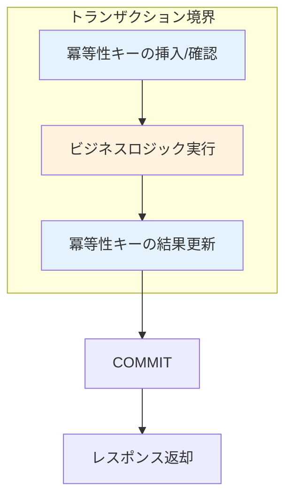

### 冪等でないデータベース操作

以下の操作は本質的に冪等ではなく、特別な対策が必要である。

```sql
-- Non-idempotent: relative update
UPDATE accounts SET balance = balance + 1000 WHERE id = 'acc_123';

-- Non-idempotent: auto-increment insert
INSERT INTO orders (product_id, quantity) VALUES ('prod_789', 1);

-- Non-idempotent: sequence-dependent
UPDATE counters SET value = value + 1 WHERE name = 'page_views';
```

これらを冪等にするための主な方法は以下の通りである。

1. **絶対値の設定に変換**: `balance = balance + 1000` を `balance = 5000`（計算済みの値）に変換する
2. **一意制約の活用**: 自然キーまたはクライアント生成のIDを用いて重複挿入を防止する
3. **処理済みフラグの活用**: 処理済みのトランザクションIDを記録し、重複処理を防止する

## メッセージキューと冪等消費

### At-Least-Once 配信と重複

メッセージキュー（Apache Kafka, RabbitMQ, Amazon SQS など）は、信頼性の観点から At-Least-Once 配信を基本とするものが多い。これは、メッセージの消失を防ぐためにブローカーが消費確認（acknowledge）を受信するまでメッセージを保持し、確認がなければ再配信を行うためである。

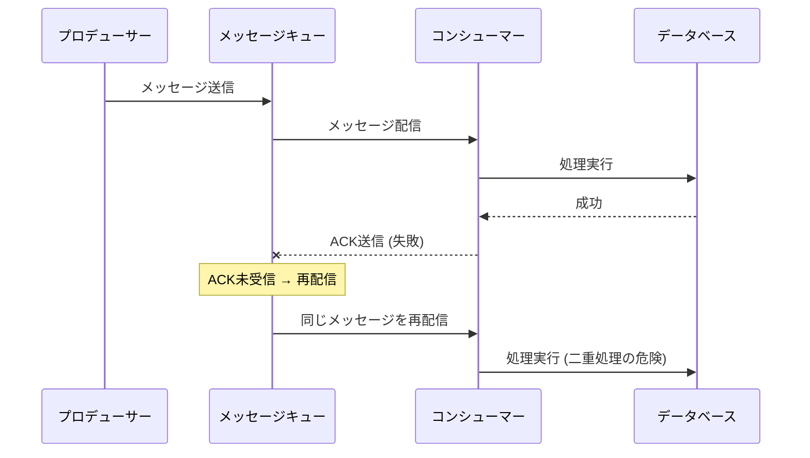

この問題を解決するために、コンシューマー側で冪等性を確保する必要がある。

### 冪等なコンシューマーの実装パターン

#### パターン1: メッセージIDによる重複排除

```python
class IdempotentConsumer:
    """Idempotent message consumer using message ID deduplication."""

    def __init__(self, db, processed_table="processed_messages"):
        self.db = db
        self.table = processed_table

    def handle_message(self, message):
        message_id = message.id

        with self.db.transaction() as tx:
            # Check if already processed (using unique constraint)
            try:
                tx.execute(
                    f"INSERT INTO {self.table} (message_id, processed_at) "
                    f"VALUES (%s, NOW())",
                    (message_id,),
                )
            except UniqueViolation:
                # Already processed, skip
                return

            # Execute business logic within the same transaction
            self.process(message, tx)

    def process(self, message, tx):
        # Business logic here
        pass
```

#### パターン2: 自然キーによる重複排除

メッセージのペイロードに含まれるビジネスキー（注文ID、取引IDなど）を利用して冪等性を確保する方法である。

```python
class OrderProcessor:
    """Process orders idempotently using natural business keys."""

    def handle_order_event(self, event):
        order_id = event["order_id"]
        event_type = event["type"]  # e.g., "order.created"

        with self.db.transaction() as tx:
            # Use natural key for deduplication
            existing = tx.query(
                "SELECT status FROM orders WHERE id = %s", (order_id,)
            )

            if existing and self.is_already_processed(existing, event_type):
                return  # Idempotent: skip duplicate

            self.apply_order_event(event, tx)
```

#### パターン3: Kafka のトランザクション機能

Apache Kafka は、プロデューサーのトランザクション機能を通じて Exactly-Once セマンティクスを提供する。これは、メッセージの送信とオフセットのコミットをアトミックに行うことで実現される。

```java
// Kafka transactional producer configuration
Properties props = new Properties();
props.put("transactional.id", "payment-processor-1");
props.put("enable.idempotence", true);

KafkaProducer<String, String> producer = new KafkaProducer<>(props);
producer.initTransactions();

try {
    producer.beginTransaction();

    // Consume from input topic
    ConsumerRecords<String, String> records = consumer.poll(Duration.ofMillis(100));

    for (ConsumerRecord<String, String> record : records) {
        // Process and produce to output topic
        producer.send(new ProducerRecord<>("output-topic", record.key(), processedValue));
    }

    // Commit offsets and produced messages atomically
    producer.sendOffsetsToTransaction(offsets, consumerGroupId);
    producer.commitTransaction();
} catch (Exception e) {
    producer.abortTransaction();
}
```

Kafka の冪等プロデューサー（`enable.idempotence=true`）は、プロデューサーID とシーケンス番号を用いてブローカー側で重複メッセージを排除する。これにより、ネットワーク障害によるプロデューサーのリトライが安全になる。

### 処理済みメッセージの管理

冪等消費において、処理済みメッセージIDの管理は重要な設計課題である。

| アプローチ | 利点 | 欠点 |
|---|---|---|
| **RDBMSテーブル** | トランザクション整合性が高い | スケーラビリティに制約 |
| **Bloom Filter** | メモリ効率が良い | 偽陽性がある（安全側に倒れる） |
| **Redis SET** | 高速な検索 | メモリ消費が大きい |
| **時間ウィンドウ付きクリーンアップ** | ストレージ効率が良い | ウィンドウ外の重複を検出できない |

実務では、処理済みメッセージIDを一定期間（例: 7 日間）保持し、期限切れのものを定期的にクリーンアップする方法が一般的である。重複排除のウィンドウサイズは、メッセージキューの再配信ポリシー（visibility timeout, redelivery delay）に基づいて設定する。

## 支払い処理における冪等性

### 決済フローの冪等性設計

決済処理は冪等性が最も重要視されるドメインの一つである。二重課金は顧客の信頼を損ない、法的リスクも伴う。

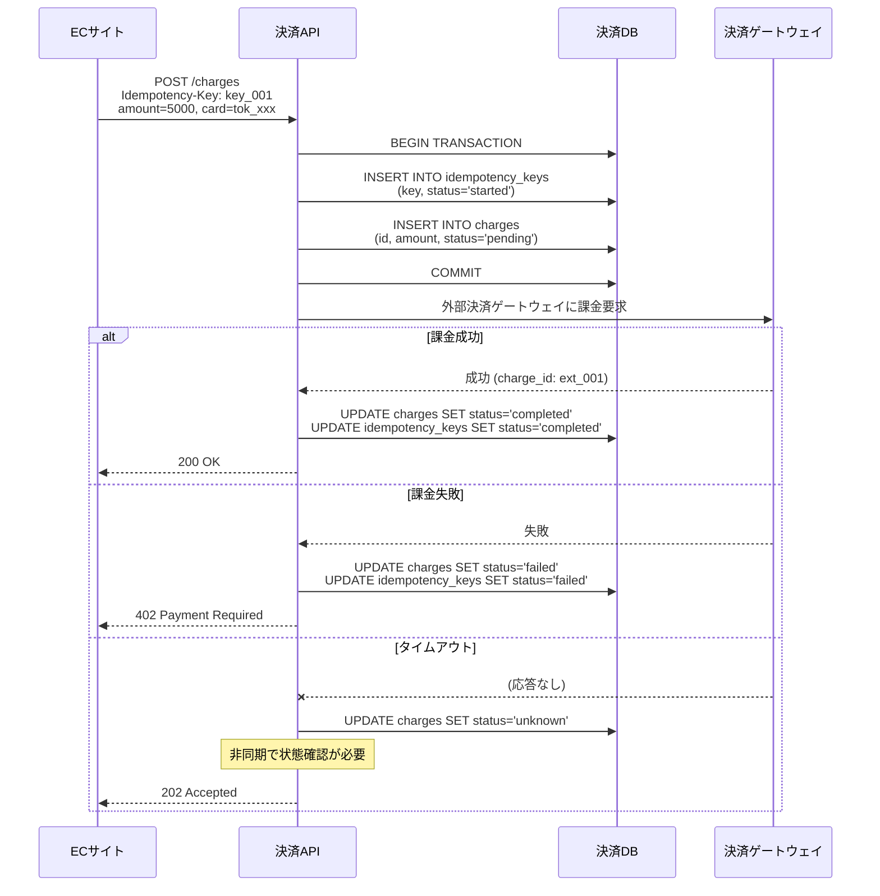

### 外部システムとの冪等性

決済ゲートウェイなどの外部システムとの連携では、ローカルな冪等性だけでは不十分であり、外部システム側の冪等性も考慮する必要がある。

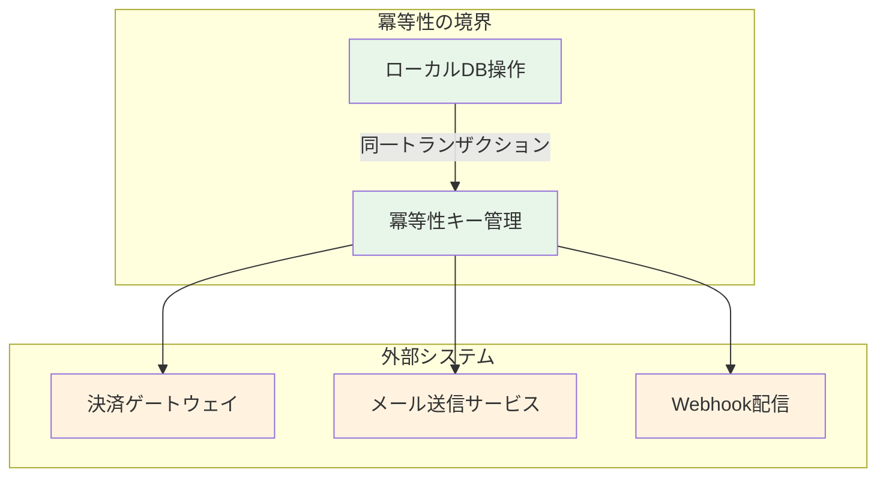

外部システムとの冪等性を確保するための戦略は以下の通りである。

1. **外部システムの冪等性API を利用**: 多くの決済ゲートウェイは独自の冪等性キーをサポートしている（例: Stripe の `Idempotency-Key`）。自システムの冪等性キーを外部にも伝播させることで、エンドツーエンドの冪等性を確保する。

2. **ステートマシンの活用**: 処理の各段階を明示的な状態として管理し、どの段階まで完了したかを追跡する。

```python
class PaymentStateMachine:
    """
    Payment processing state machine for idempotent charge flow.

    States: created -> authorized -> captured -> completed
                    -> declined
                    -> unknown -> (resolved to captured or failed)
    """

    VALID_TRANSITIONS = {
        "created": ["authorized", "declined", "unknown"],
        "authorized": ["captured", "voided"],
        "captured": ["completed", "refunded"],
        "unknown": ["captured", "failed"],
    }

    def transition(self, payment_id: str, new_status: str):
        with self.db.transaction() as tx:
            current = tx.query(
                "SELECT status FROM payments WHERE id = %s FOR UPDATE",
                (payment_id,),
            )

            if new_status not in self.VALID_TRANSITIONS.get(current.status, []):
                if current.status == new_status:
                    return  # Idempotent: already in target state
                raise InvalidTransitionError(
                    f"Cannot transition from {current.status} to {new_status}"
                )

            tx.execute(
                "UPDATE payments SET status = %s, updated_at = NOW() "
                "WHERE id = %s",
                (new_status, payment_id),
            )
```

3. **非同期リコンシリエーション**: 外部システムとの状態の不一致を定期的に検出し、修正するバックグラウンドプロセスを実装する。

```python
class PaymentReconciler:
    """Reconcile local payment state with external gateway."""

    def reconcile_unknown_payments(self):
        """Check payments in 'unknown' state against the gateway."""
        unknown_payments = self.db.query(
            "SELECT id, external_ref FROM payments "
            "WHERE status = 'unknown' AND created_at < NOW() - INTERVAL '5 minutes'"
        )

        for payment in unknown_payments:
            gateway_status = self.gateway.check_status(payment.external_ref)

            if gateway_status == "succeeded":
                self.state_machine.transition(payment.id, "captured")
            elif gateway_status == "failed":
                self.state_machine.transition(payment.id, "failed")
            # else: still unknown, will retry later
```

## 冪等性の実装パターン

### パターン1: クライアント生成ID

最も単純な冪等性パターンは、クライアント側でリソースのIDを生成し、サーバーは同じIDの重複挿入を拒否する方法である。

```http
PUT /api/orders/ord_xJ3kf9dL HTTP/1.1
Content-Type: application/json

{
  "product_id": "prod_789",
  "quantity": 1
}
```

POST ではなく PUT を使い、クライアントがID（`ord_xJ3kf9dL`）を生成することで、リクエスト自体が冪等になる。サーバーは `INSERT ... ON CONFLICT DO NOTHING` で重複を処理する。

**利点**: サーバーサイドの追加実装が最小限で済む。
**欠点**: クライアントにID生成の責任を負わせる。ID の衝突リスクを管理する必要がある。

### パターン2: 条件付きリクエスト（ETag / If-Match）

HTTP の条件付きリクエストメカニズムを利用して冪等性を確保する方法である。

```http
# Step 1: Get current state with ETag
GET /api/accounts/acc_123 HTTP/1.1

# Response
HTTP/1.1 200 OK
ETag: "v5"

{"balance": 10000}

# Step 2: Conditional update
PATCH /api/accounts/acc_123 HTTP/1.1
If-Match: "v5"
Content-Type: application/json

{"balance": 9000}

# If state changed, server responds:
HTTP/1.1 412 Precondition Failed
```

このパターンは楽観的ロックと同等であり、同時更新の競合を安全に処理できる。ただし、クライアントが `412` を受信した場合は最新の状態を再取得して操作をやり直す必要がある。

### パターン3: トークンベースの冪等性

二段階の操作でトークンを事前に取得し、操作時にトークンを提示する方法である。

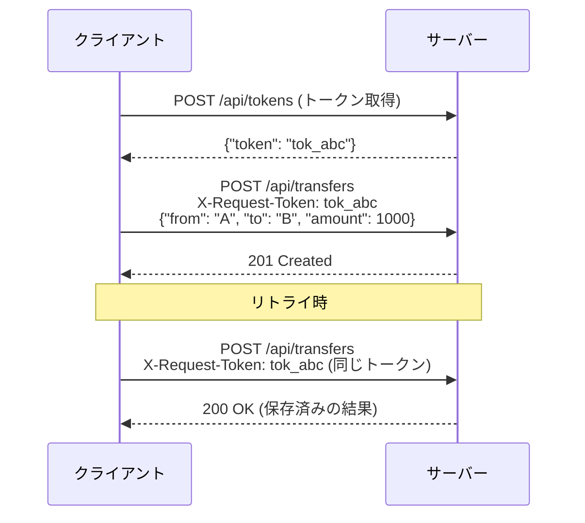

このパターンはサーバーがトークンを発行するため、クライアントの負担が軽い。また、トークンの有効期限や使用回数をサーバーが制御できる利点がある。

### パターン4: Outbox パターン

データベースへの書き込みと外部イベント（メッセージ送信、Webhook 呼び出し）の両方を確実に、かつ冪等に行うためのパターンである。

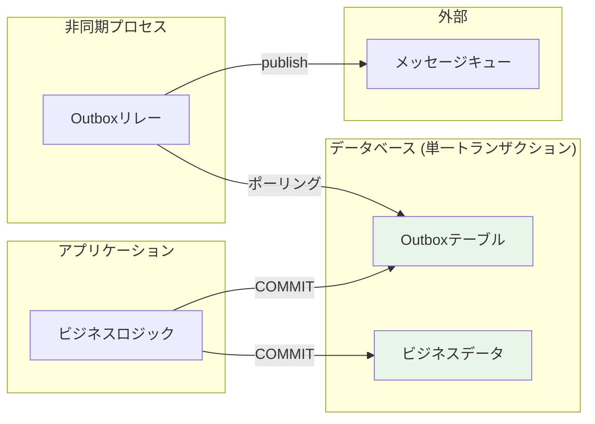

```sql
-- Within the same transaction
BEGIN;

-- Business logic
INSERT INTO orders (id, product_id, status)
VALUES ('ord_001', 'prod_789', 'created');

-- Outbox entry
INSERT INTO outbox (id, aggregate_type, aggregate_id, event_type, payload, created_at)
VALUES (
    'evt_001',
    'order',
    'ord_001',
    'order.created',
    '{"order_id": "ord_001", "product_id": "prod_789"}',
    NOW()
);

COMMIT;
```

Outbox リレープロセスがこのテーブルをポーリングし、未送信のイベントをメッセージキューに発行する。イベントのIDによって重複発行を防ぎ、コンシューマー側でも冪等消費を行うことで、エンドツーエンドの冪等性を実現する。

## アンチパターン

### アンチパターン1: GETリクエストの副作用

```http
# Bad: GET with side effects
GET /api/emails/123/mark-as-read HTTP/1.1
```

GET リクエストに状態変更を含める設計は、ブラウザのプリフェッチ、クローラー、キャッシュプロキシなどが意図せず副作用を引き起こす原因となる。状態変更は必ず POST/PUT/PATCH/DELETE で行うべきである。

### アンチパターン2: 冪等性キーなしの POST リトライ

```python
# Bad: retry POST without idempotency key
def create_payment(amount):
    for attempt in range(3):
        try:
            response = http.post("/payments", json={"amount": amount})
            return response
        except TimeoutError:
            continue  # Dangerous: may cause duplicate payments
```

冪等性キーを付与せずに POST をリトライすることは、二重処理の最も一般的な原因である。

### アンチパターン3: 冪等性キーの再利用

```python
# Bad: reusing idempotency key for different operations
key = "static-key-123"
http.post("/payments", json={"amount": 1000}, headers={"Idempotency-Key": key})
http.post("/payments", json={"amount": 2000}, headers={"Idempotency-Key": key})
# Second request returns the result of the first!
```

冪等性キーは操作ごとに一意でなければならない。異なる操作に同じキーを再利用すると、意図しない結果が返却される。

### アンチパターン4: 冪等性ストアとビジネスロジックの不整合

```python
# Bad: idempotency check and business logic in different transactions
def handle_request(idempotency_key, data):
    # Check idempotency key (Redis)
    if redis.exists(idempotency_key):
        return cached_response

    # Execute business logic (database)
    result = db.execute(business_logic, data)  # May fail after Redis write

    # Save to idempotency store (Redis)
    redis.set(idempotency_key, result)  # What if this fails?

    return result
```

冪等性キーの管理とビジネスロジックが異なるトランザクション境界にある場合、部分的な障害によってキーだけが保存され、ビジネスロジックが実行されない（またはその逆の）状態が発生しうる。冪等性キーとビジネスデータは可能な限り同一トランザクション内で管理すべきである。

### アンチパターン5: 冪等性キーの無期限保持

冪等性キーを永続的に保持すると、ストレージが際限なく増大する。適切な TTL（Stripe は 24 時間）を設定し、期限切れのキーを定期的にクリーンアップすることが重要である。

## 実装上の考慮事項

### 冪等性の粒度

冪等性をどの粒度で適用するかは設計上の重要な判断である。

| 粒度 | 例 | トレードオフ |
|------|------|------|
| **API エンドポイント単位** | POST /payments にのみ適用 | 実装が簡潔。必要な箇所に限定 |
| **サービス全体** | 全 POST/PATCH リクエストに適用 | 統一的だが過剰な場合がある |
| **ビジネス操作単位** | 「注文完了」フロー全体に適用 | 複雑だが最も正確 |

一般的には、状態変更を伴い金銭的影響がある操作に重点的に適用し、読み取り専用の操作には不要である。

### パフォーマンスへの影響

冪等性の実装はリクエストのレイテンシに影響を与える。冪等性キーの検索と保存のオーバーヘッドを最小化するために、以下の工夫が有効である。

1. **キャッシュ層の活用**: Redis や Memcached など、低レイテンシのストアを冪等性キーの管理に使用する
2. **インデックスの最適化**: データベーステーブルで管理する場合、冪等性キーカラムに適切なインデックスを設定する
3. **非同期クリーンアップ**: 期限切れキーの削除はバックグラウンドジョブで行い、リクエスト処理に影響を与えない

### テスト戦略

冪等性の実装をテストする際は、以下のシナリオを網羅する必要がある。

```python
class TestIdempotency:
    def test_first_request_succeeds(self):
        """First request with a new key should succeed normally."""
        response = client.post(
            "/payments",
            json={"amount": 1000},
            headers={"Idempotency-Key": "key_001"},
        )
        assert response.status_code == 201

    def test_duplicate_request_returns_same_result(self):
        """Duplicate request with the same key should return cached result."""
        key = "key_002"
        first = client.post(
            "/payments",
            json={"amount": 1000},
            headers={"Idempotency-Key": key},
        )
        second = client.post(
            "/payments",
            json={"amount": 1000},
            headers={"Idempotency-Key": key},
        )
        assert first.json() == second.json()
        assert count_payments() == 1  # Only one payment created

    def test_different_params_same_key_returns_conflict(self):
        """Same key with different parameters should return 409."""
        key = "key_003"
        client.post(
            "/payments",
            json={"amount": 1000},
            headers={"Idempotency-Key": key},
        )
        response = client.post(
            "/payments",
            json={"amount": 2000},  # Different amount
            headers={"Idempotency-Key": key},
        )
        assert response.status_code == 409

    def test_concurrent_requests_only_one_processed(self):
        """Concurrent requests with the same key should process only once."""
        import concurrent.futures

        key = "key_004"
        results = []
        with concurrent.futures.ThreadPoolExecutor(max_workers=10) as executor:
            futures = [
                executor.submit(
                    client.post,
                    "/payments",
                    json={"amount": 1000},
                    headers={"Idempotency-Key": key},
                )
                for _ in range(10)
            ]
            results = [f.result() for f in futures]

        success_count = sum(1 for r in results if r.status_code == 201)
        assert success_count == 1
        assert count_payments() == 1
```

### 分散環境での冪等性キー管理

マイクロサービスアーキテクチャでは、冪等性キーの管理が複数のサービスにまたがる場合がある。

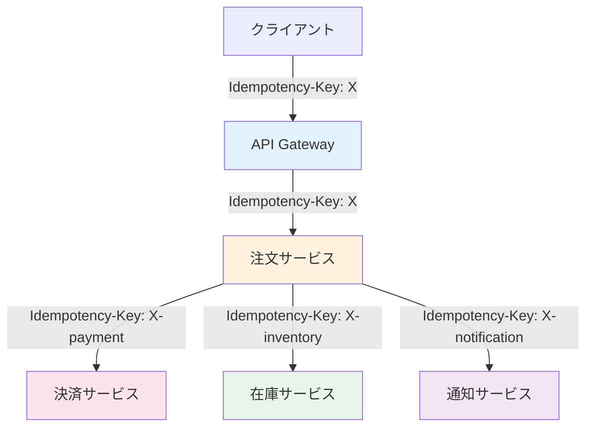

この場合、上流サービスの冪等性キーから下流サービス用のキーを派生させる（例: `X-payment`, `X-inventory`）ことで、エンドツーエンドの冪等性を実現できる。各サービスは独立して冪等性を管理しつつ、キーの派生規則によって全体の整合性を保つ。

## 主要クラウドサービスとフレームワークにおける冪等性サポート

### AWS

- **SQS**: `MessageDeduplicationId` による重複排除（FIFO キューで利用可能、5 分間のウィンドウ）
- **Lambda**: イベントソースマッピングでの重複呼び出しに対して、冪等な処理の実装が推奨される。AWS Lambda Powertools は冪等性デコレータを提供している
- **DynamoDB**: 条件付き書き込み（`ConditionExpression`）による冪等な更新

### Stripe

前述の通り、`Idempotency-Key` ヘッダーによる冪等性を全面的にサポートしている。24 時間の TTL、パラメータ不一致の検出、レスポンスのリプレイを提供する。

### gRPC

gRPC 自体は冪等性の仕組みを内蔵していないが、メソッドレベルでリトライポリシーを設定できる。冪等なメソッドに対してのみ自動リトライを有効にする設計が推奨される。

## まとめ

冪等性は、分散システムにおける信頼性を支える基本的な設計原則である。ネットワーク障害が避けられない環境において、「同じ操作を何度実行しても結果が変わらない」という保証は、安全なリトライとデータ整合性の基盤となる。

本記事で解説した内容を要約すると、以下の通りである。

1. **冪等性の本質**: 数学的には $f(f(x)) = f(x)$ であり、ソフトウェアでは「同一操作の繰り返しが同一の結果を生む」ことを意味する
2. **分散システムでの重要性**: At-Least-Once 配信と冪等処理の組み合わせにより、効果的な Exactly-Once セマンティクスを実現できる
3. **HTTP メソッドとの関係**: GET、PUT、DELETE は仕様上冪等であり、POST は冪等性キーによって冪等性を付与する
4. **冪等性キーパターン**: クライアント生成のキーをサーバーが管理し、重複リクエストを検出・排除する
5. **データベースレベルの冪等性**: UPSERT、条件付き書き込み、冪等性テーブルの活用
6. **メッセージキューの冪等消費**: メッセージIDによる重複排除とトランザクショナルな処理
7. **実装上の注意**: 冪等性ストアとビジネスロジックの整合性、競合状態への対処、パフォーマンスとストレージのトレードオフ

冪等性の設計は、単一の技術的解決策ではなく、システム全体を貫く設計思想である。API の設計段階から冪等性を意識し、データベース操作、メッセージ処理、外部システム連携のそれぞれにおいて適切なパターンを選択することで、分散システムの信頼性を大幅に向上させることができる。
