# 画像・ファイル配信の最適化（CDN, 画像変換, Lazy Load, WebP/AVIF）

## 1. 画像・ファイル配信の課題

### 1.1 Webにおける画像の支配的なウェイト

HTTP Archiveの調査によれば、Webページの総転送量のうち画像が占める割合は平均して約50%に達する。2024年時点でのモバイルページの中央値は約2.2MBであり、そのうち約1MBが画像である。ECサイトやメディアサイトではこの比率がさらに高くなり、1ページあたり数十枚の画像を含むことも珍しくない。

この事実は、Webパフォーマンスの最適化において画像配信の改善が最もインパクトの大きい施策の一つであることを意味する。ページの読み込み速度はユーザー体験に直結し、Googleの調査ではページ読み込み時間が1秒から3秒に増加するとバウンス率が32%上昇すると報告されている。

### 1.2 帯域幅の制約

画像配信における最も基本的な課題は帯域幅である。高解像度のデジタルカメラで撮影された画像は、無圧縮では数十MBに達する。JPEG圧縮をかけても、4K解像度の画像は1〜5MB程度のサイズになる。

ユーザーのネットワーク環境は均一ではない。光回線で100Mbps以上の帯域を持つデスクトップユーザーがいる一方で、モバイルネットワークでは実効帯域が数Mbps程度にとどまることもある。新興国ではさらに低帯域の環境が一般的であり、1MBの画像をダウンロードするのに数秒を要する場合がある。

```
帯域幅と画像ダウンロード時間の関係:

画像サイズ: 500KB

100Mbps (光回線)     : ~0.04秒
10Mbps  (Wi-Fi)      : ~0.4秒
3Mbps   (3G/低速4G)  : ~1.3秒
1Mbps   (低速環境)   : ~4.0秒
```

### 1.3 レイテンシの影響

帯域幅だけでなく、レイテンシ（RTT: Round-Trip Time）も配信速度に大きく影響する。オリジンサーバが米国にあり、ユーザーが日本にいる場合、1回のRTTだけで約150msを要する。HTTPSでは TLS ハンドシェイクに1〜2回のRTTが追加で必要となるため、最初のバイトが届くまでに300〜500ms以上かかることがある。

画像が多いページでは、ブラウザの同時接続数制限（HTTP/1.1では通常6本）も問題となる。20枚の画像を6本の並列接続で取得する場合、少なくとも4ラウンドの取得が必要になる。HTTP/2のストリーム多重化により状況は改善されたが、個々の画像サイズが大きければ帯域幅がボトルネックになる点は変わらない。

### 1.4 フォーマット互換性の複雑さ

画像フォーマットの選択は一見単純に思えるが、実際にはブラウザの対応状況が複雑に絡み合う。WebPは2010年にGoogleが発表し、現在ではほぼすべてのモダンブラウザで対応しているが、メール本文やRSSリーダーなど、ブラウザ外の環境では依然としてJPEG/PNGが必要となる場合がある。AVIFはさらに高い圧縮効率を持つが、2024年時点でもSafariの対応が遅れた経緯があり、Edge Casesに注意が必要である。JPEG XLは技術的に優れているものの、Chromeが対応を取りやめた経緯もあり、採用の判断が難しい。

このように、単一のフォーマットですべての環境をカバーすることは現実的に困難であり、コンテンツネゴシエーションに基づく動的なフォーマット選択が求められる。

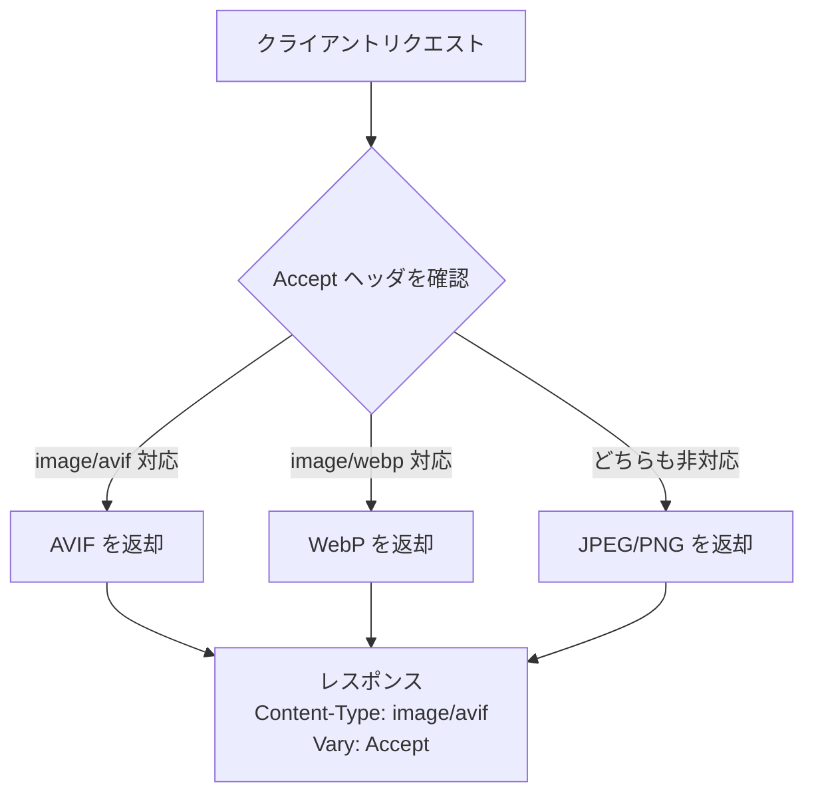

---

## 2. CDNの仕組みと配信最適化

### 2.1 CDNが画像配信に不可欠な理由

CDN（Content Delivery Network）は、世界各地に分散配置されたエッジサーバのネットワークである。画像配信においてCDNが不可欠な理由は、前述のレイテンシと帯域幅の課題を同時に解決できるからである。

ユーザーに地理的に最も近いエッジサーバからコンテンツを配信することで、RTTを大幅に短縮できる。たとえば、オリジンサーバが米国東海岸にあるWebサービスに日本のユーザーがアクセスする場合、CDNを利用しなければ約150msのRTTが発生するが、日本国内のエッジサーバにキャッシュされていれば10〜20ms程度に短縮される。

さらに、CDNはオリジンサーバへのリクエストを大幅に削減する。キャッシュヒット率が90%であれば、オリジンサーバが処理するリクエスト量は全体の10%で済む。これによりオリジンサーバの負荷が軽減され、インフラコストの削減にもつながる。

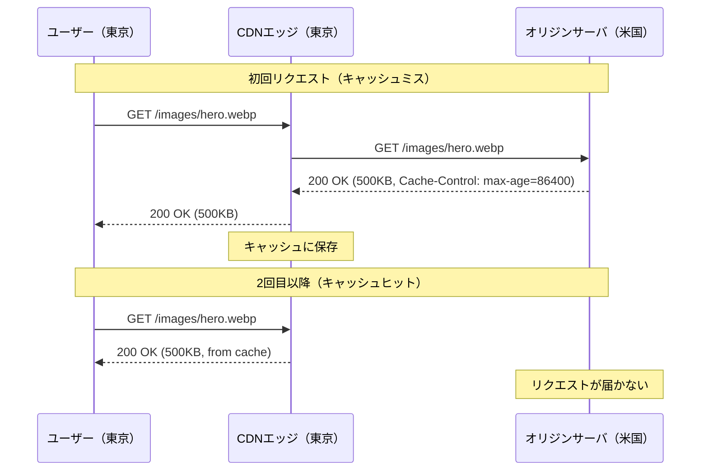

### 2.2 画像配信に特化したCDN機能

現代のCDNは単純なキャッシュプロキシにとどまらず、画像配信に特化した機能を提供している。

**画像変換（Image Transformation）**: Cloudflare Images、AWS CloudFront + Lambda@Edge、Fastly Image Optimizer などは、エッジサーバ上でリアルタイムに画像のリサイズ、フォーマット変換、品質調整を行う機能を持つ。これにより、オリジンには高解像度の原画像のみを保管し、各デバイス・フォーマットへの変換はエッジで行うというアーキテクチャが可能になる。

**自動フォーマットネゴシエーション**: クライアントの `Accept` ヘッダを解析し、最適なフォーマットを自動選択する。WebP対応ブラウザにはWebPを、AVIF対応ブラウザにはAVIFを、それ以外にはJPEGを返すといった処理をCDNレベルで透過的に行える。

**レスポンシブ画像の動的生成**: URLパラメータやClient Hints（`Sec-CH-DPR`、`Sec-CH-Width`）に基づいて、最適なサイズの画像を動的に生成する。

::: tip CDNの選択基準
画像配信を最適化する観点からCDNを選ぶ際は、以下の点を評価するとよい。
- エッジでの画像変換機能の有無と対応フォーマット
- キャッシュキーのカスタマイズ柔軟性（Varyヘッダのハンドリング）
- Client Hintsのサポート状況
- エッジコンピューティング機能（Lambda@Edge, Cloudflare Workers等）
- 従量課金の体系（変換リクエスト数、転送量、キャッシュストレージ）
:::

### 2.3 Varyヘッダとキャッシュキーの設計

画像のコンテンツネゴシエーションを行う場合、CDNのキャッシュキー設計が極めて重要になる。同一URLに対して異なるフォーマットの画像を返す場合、`Vary: Accept` ヘッダを設定してCDNに対し `Accept` ヘッダの値ごとに別々のキャッシュエントリを保持するよう指示する必要がある。

しかし、`Accept` ヘッダの値はブラウザによって微妙に異なるため、そのまま `Vary` ヘッダに使うとキャッシュヒット率が著しく低下する問題がある。

```
Chrome:  Accept: image/avif,image/webp,image/apng,image/svg+xml,image/*,*/*;q=0.8
Firefox: Accept: image/avif,image/webp,*/*
Safari:  Accept: image/webp,image/png,image/svg+xml,image/*;q=0.8,*/*;q=0.5
```

これを解決するため、多くのCDNではキャッシュキーを正規化する。`Accept` ヘッダの生の値ではなく、「avif対応/webp対応/非対応」の3パターンに分類し、それぞれに対応するキャッシュエントリを管理する。Cloudflareやfastlyではこの正規化がビルトインで提供されている。

---

## 3. 画像変換パイプライン

### 3.1 変換パイプラインの全体像

画像変換パイプラインとは、アップロードされた原画像を最終的にユーザーに配信する最適な形式に加工する一連の処理フローである。典型的なパイプラインは以下のステップで構成される。

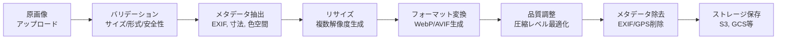

### 3.2 リサイズ戦略

画像のリサイズは単純に見えるが、考慮すべき点が多い。

**アスペクト比の保持**: 幅だけを指定してリサイズする場合、アスペクト比を保持して高さを自動計算するのが基本である。しかし、サムネイル生成のように固定サイズの矩形に収める必要がある場合は、クロッピング（切り抜き）かフィッティング（余白付きの収容）のどちらかを選択しなければならない。

**ブレークポイントの設計**: レスポンシブ画像のために複数の解像度を生成する場合、どのサイズを生成するかを決定する必要がある。単純に等間隔（例: 320px, 640px, 960px, 1280px, 1920px）で生成する方法もあるが、ファイルサイズの変化に基づくブレークポイント設計がより効率的である。

Jason Grigsby が提唱した手法では、ファイルサイズが約20KB変化するごとにブレークポイントを設定する。これにより、低解像度では少ないバリエーション、高解像度では多いバリエーションが自然に生成される。

```javascript
// Example: generate responsive image breakpoints
function generateBreakpoints(originalWidth, targetSizeStep = 20 * 1024) {
  const breakpoints = [];
  let currentWidth = 320;
  const step = 160;

  while (currentWidth <= originalWidth) {
    breakpoints.push(currentWidth);
    currentWidth += step;
  }

  // Always include the original width
  if (breakpoints[breakpoints.length - 1] !== originalWidth) {
    breakpoints.push(originalWidth);
  }

  return breakpoints;
}
```

**リサンプリングアルゴリズム**: ダウンスケーリングには Lanczos フィルタが広く使われる。計算コストはバイリニア補間より高いが、シャープネスが維持されるため画像品質が優れている。sharp（Node.js）や Pillow（Python）などのライブラリではデフォルトで Lanczos が採用されている。

### 3.3 フォーマット変換

フォーマット変換は、原画像（通常はJPEGまたはPNG）から配信用のフォーマット（WebP, AVIF等）を生成する処理である。

::: code-group

```javascript [Node.js (sharp)]
const sharp = require('sharp');

async function convertImage(inputPath, outputDir) {
  const image = sharp(inputPath);
  const metadata = await image.metadata();

  // Generate WebP
  await image
    .webp({ quality: 80, effort: 4 })
    .toFile(`${outputDir}/image.webp`);

  // Generate AVIF
  await image
    .avif({ quality: 50, effort: 4 })
    .toFile(`${outputDir}/image.avif`);

  // Generate optimized JPEG as fallback
  await image
    .jpeg({ quality: 85, progressive: true, mozjpeg: true })
    .toFile(`${outputDir}/image.jpg`);
}
```

```python [Python (Pillow + pillow-avif)]
from PIL import Image
import pillow_avif

def convert_image(input_path: str, output_dir: str):
    img = Image.open(input_path)

    # Generate WebP
    img.save(f"{output_dir}/image.webp", "WEBP", quality=80)

    # Generate AVIF
    img.save(f"{output_dir}/image.avif", "AVIF", quality=50)

    # Generate optimized JPEG as fallback
    img.save(
        f"{output_dir}/image.jpg",
        "JPEG",
        quality=85,
        progressive=True,
        optimize=True,
    )
```

:::

### 3.4 品質パラメータの最適化

画像圧縮における品質パラメータの選択は、ファイルサイズと視覚品質のトレードオフである。JPEG の品質パラメータ（1〜100）は線形ではなく、品質85と品質90ではファイルサイズが大きく異なるが、人間の目には差がほとんどわからない場合が多い。

品質の評価には**SSIM**（Structural Similarity Index）や**DSSIM**（Structural Dissimilarity）といった客観的指標が用いられる。Butteraugliは人間の視覚特性をモデル化したGoogleの画質評価ツールであり、圧縮品質の最適化に広く活用されている。

一般的なガイドラインとして、以下の品質設定がバランスが良いとされている。

| フォーマット | 品質パラメータ | 備考 |
|---|---|---|
| JPEG (mozjpeg) | 75〜85 | progressive: true 推奨 |
| WebP | 75〜85 | effort: 4〜6 |
| AVIF | 40〜60 | JPEGの品質値より低い値で同等の視覚品質 |

::: warning 品質パラメータの罠
AVIFの品質パラメータとJPEGの品質パラメータは直接比較できない。AVIFの品質50はJPEGの品質80〜85相当の視覚品質を持つことが多い。フォーマットを変更する際に品質パラメータをそのまま引き継ぐと、不必要にファイルサイズが大きくなるか、品質が劣化する。
:::

### 3.5 メタデータの取り扱い

デジタルカメラやスマートフォンで撮影された画像には、EXIF（Exchangeable Image File Format）データが含まれている。EXIFにはカメラの機種、撮影設定（シャッタースピード、絞り、ISO感度）、撮影日時、そして**GPS座標**が含まれる場合がある。

配信用画像からは、プライバシー保護のためにEXIFデータを除去するのが基本である。特にGPS座標は、ユーザーがアップロードした画像から自宅の位置が特定されるリスクがある。ただし、画像の回転情報（Orientation タグ）は除去前に画像に反映しておく必要がある。反映せずに除去すると、画像が意図しない方向で表示される。

```javascript
const sharp = require('sharp');

async function processUploadedImage(inputBuffer) {
  return sharp(inputBuffer)
    .rotate()           // Apply EXIF orientation before stripping
    .withMetadata({
      // Keep ICC color profile, strip everything else
      icc: true,
    })
    .jpeg({ quality: 85 })
    .toBuffer();
}
```

---

## 4. 次世代画像フォーマット

### 4.1 フォーマットの系譜と進化

画像フォーマットの歴史は圧縮効率の進化の歴史でもある。JPEGは1992年に標準化され、30年以上にわたってWebの画像フォーマットの主役であり続けてきた。PNGは1996年に登場し、可逆圧縮とアルファチャンネルの必要性を満たした。GIFはアニメーション用途で使われ続けたが、256色の制限が大きなハンデとなっていた。

2010年以降、動画コーデック技術をベースとした次世代フォーマットが相次いで登場した。これらはフレーム内圧縮（イントラフレーム符号化）技術を静止画に応用することで、JPEGを大きく上回る圧縮効率を実現している。

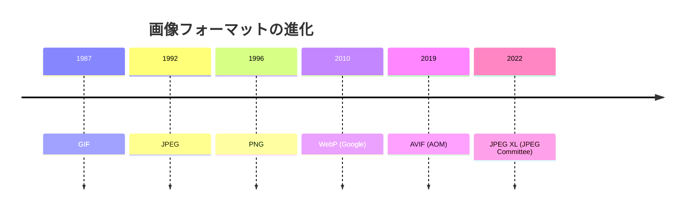

### 4.2 WebP

WebPはGoogleが2010年に発表した画像フォーマットで、VP8動画コーデックのイントラフレーム符号化をベースとしている。後にVP9ベースのWebP 2の開発も検討されたが、最終的にはAVIFにその役割を譲る形となった。

**特徴**:
- 非可逆圧縮ではJPEGと比較して25〜35%小さいファイルサイズ
- 可逆圧縮ではPNGと比較して26%小さいファイルサイズ
- アルファチャンネル（透過）対応
- アニメーション対応（GIFの代替）
- 2024年時点で主要ブラウザすべてで対応済み（IE11を除く）

WebPは「JPEGの置き換え」として最も成功したフォーマットであり、2024年時点でのブラウザ対応率は97%以上に達している。ほとんどのプロダクションシステムで安全に採用できるフォーマットである。

### 4.3 AVIF

AVIF（AV1 Image File Format）は、Alliance for Open Media（AOM）が開発したAV1動画コーデックをベースとした画像フォーマットである。2019年に仕様が策定され、Netflix、Google、Appleなどの主要テクノロジー企業が開発に参加している。

**特徴**:
- 非可逆圧縮ではJPEGと比較して50%以上のファイルサイズ削減が可能
- WebPと比較しても20%程度のファイルサイズ削減
- 高ダイナミックレンジ（HDR）対応
- 広色域（Wide Color Gamut）対応
- 12ビット色深度対応
- ロイヤリティフリー

AVIFの最大の欠点はエンコード速度の遅さである。libaomでのエンコードはJPEGの10倍以上の時間を要する場合があり、リアルタイム変換には不向きである。ただし、rav1eやSVT-AV1といった高速エンコーダの開発が進んでおり、速度は着実に改善されている。

```
同一画像の圧縮比較（視覚品質をSSIM=0.95に統一）:

JPEG (mozjpeg)  : 120KB (基準)
WebP            :  85KB (-29%)
AVIF (libaom)   :  60KB (-50%)
AVIF (SVT-AV1)  :  65KB (-46%)
```

### 4.4 JPEG XL

JPEG XL は JPEG Committee が2022年に標準化した次世代フォーマットである。技術的にはWebPやAVIFと同等以上の圧縮効率を持ち、さらに以下の特徴を備えている。

- 既存のJPEGファイルからの可逆変換（ロスレス・トランスコーディング）が可能
- プログレッシブデコーディングに対応
- 非常に高い色深度と色空間のサポート

しかし、2022年にChrome/ChromiumがJPEG XLのサポートを削除する決定を下した。Firefoxも実装を見送っている。Apple SafariとKDE環境では対応が進んでいるが、ChromeとFirefoxが非対応である以上、Webでの広範な採用は現実的に困難な状況にある。

::: warning JPEG XLの採用について
2026年時点で、JPEG XLはWeb配信での採用を推奨しにくい。Chromeの対応が得られていない以上、WebPまたはAVIFをプライマリフォーマットとし、JPEGをフォールバックとする戦略が現実的である。ただし、写真のアーカイブ用途やプロフェッショナルなワークフローでは、JPEG XLの可逆変換能力が活きる場面がある。
:::

### 4.5 フォーマット選択のフローチャート

配信する画像の特性に応じて最適なフォーマットを選択する必要がある。

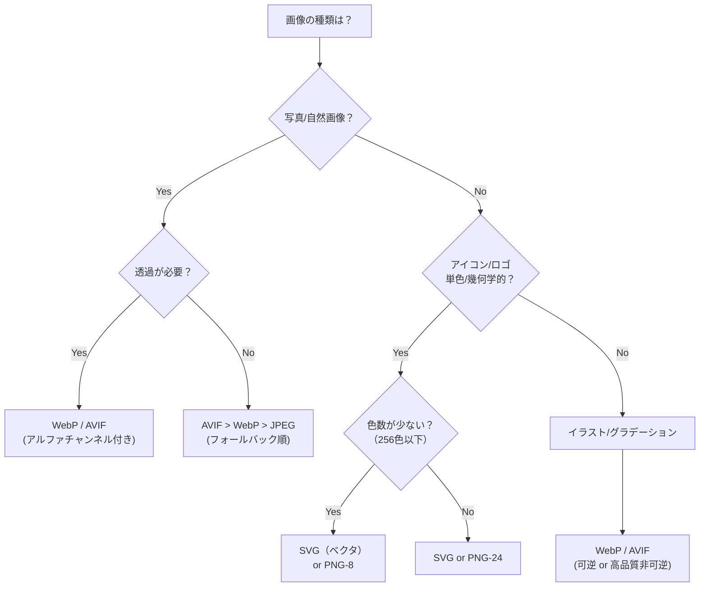

---

## 5. レスポンシブ画像

### 5.1 なぜレスポンシブ画像が必要か

デバイスの多様化により、同一の画像コンテンツであっても、配信すべき解像度はデバイスごとに大きく異なる。スマートフォンの画面幅は320〜430px程度であるのに対し、4Kディスプレイは3840pxの解像度を持つ。さらに、高DPI（Retina）ディスプレイでは、CSSピクセルの2倍〜3倍の物理ピクセルが使われるため、表示サイズの2〜3倍の解像度を持つ画像が必要になる。

幅360pxのスマートフォンに1920pxの画像を配信することは、帯域幅の約80%を無駄に消費していることに等しい。逆に、4Kディスプレイに低解像度の画像を配信すると、ぼやけた表示になりユーザー体験が損なわれる。

### 5.2 srcset と sizes 属性

HTML の `` 要素の `srcset` 属性と `sizes` 属性は、ブラウザに複数の画像候補を提示し、デバイスの条件に応じた最適な画像を選択させる仕組みである。

```html

```

`srcset` は画像の候補リストを指定する。各候補は画像のURLと幅記述子（`w` 単位）のペアである。`sizes` はメディアクエリとそのときの画像表示幅を指定する。ブラウザはこの2つの情報とデバイスのDPRを組み合わせて、最適な画像を自動選択する。

たとえば、幅360pxの2xディスプレイで、`sizes` が `100vw` の場合、ブラウザは `360 × 2 = 720px` に最も近い候補（`hero-800.jpg`）を選択する。

### 5.3 picture 要素によるアートディレクション

`<picture>` 要素は、フォーマットの出し分けとアートディレクション（デバイスに応じた構図の変更）を可能にする。

```html
<picture>
  <!-- AVIF format -->
  <source
    type="image/avif"
    srcset="
      /images/hero-400.avif   400w,
      /images/hero-800.avif   800w,
      /images/hero-1200.avif 1200w
    "
    sizes="(max-width: 640px) 100vw, 50vw"
  />
  <!-- WebP format -->
  <source
    type="image/webp"
    srcset="
      /images/hero-400.webp   400w,
      /images/hero-800.webp   800w,
      /images/hero-1200.webp 1200w
    "
    sizes="(max-width: 640px) 100vw, 50vw"
  />
  <!-- JPEG fallback -->
  
</picture>
```

ブラウザは `<source>` 要素を上から順に評価し、`type` 属性で指定されたフォーマットに対応している最初の `<source>` を採用する。AVIF対応ブラウザではAVIFが、WebPのみ対応のブラウザではWebPが、どちらにも非対応のブラウザでは `` 要素のJPEGが使用される。

### 5.4 Client Hints

Client Hints は、ブラウザがリクエストヘッダを通じてデバイスの特性をサーバーに伝える仕組みである。サーバーはこの情報を基に、最適な画像をレスポンスとして返すことができる。

```
リクエストヘッダ:
  Sec-CH-DPR: 2
  Sec-CH-Width: 640
  Sec-CH-Viewport-Width: 360

レスポンスヘッダ:
  Content-DPR: 2
  Vary: Sec-CH-DPR, Sec-CH-Width
```

Client Hints を使用するには、サーバーが最初のレスポンスで `Accept-CH` ヘッダを返す必要がある。

```
Accept-CH: DPR, Width, Viewport-Width
```

Client Hints の利点は、HTMLの `srcset` / `sizes` 属性の複雑な記述を省略できることである。サーバー（またはCDN）がデバイスの情報に基づいて最適な画像を動的に選択するため、HTMLはシンプルな `` タグだけで済む。ただし、対応状況はChromiumベースのブラウザに限定されており、Firefox や Safari ではサポートされていない点に注意が必要である。

---

## 6. Lazy Loading

### 6.1 なぜ Lazy Loading が必要か

Webページにはファーストビュー（初期表示領域）に含まれない画像が多数存在する。ECサイトの商品一覧ページでは50枚以上の画像が含まれることがあるが、初期表示時にユーザーに見えるのは5〜10枚程度である。残りの40枚以上の画像を初期ロードで取得することは、帯域幅の無駄であり、ページの読み込み完了を遅らせる原因となる。

Lazy Loading は、画像がビューポート（表示領域）に近づいたときに初めて読み込みを開始する手法である。これにより、初期ロード時の転送量を大幅に削減し、LCP（Largest Contentful Paint）の改善にも寄与する。

### 6.2 ネイティブ Lazy Loading

HTML の `loading` 属性を使った Lazy Loading は、最もシンプルな実装方法である。

```html
<!-- Lazy load: viewport outside -->


<!-- Eager load: above the fold -->

```

`loading="lazy"` を指定すると、ブラウザは画像がビューポートから一定距離以内に入ったときに読み込みを開始する。この「距離」はブラウザの実装によって異なり、Chromeでは接続速度に応じて動的に調整される（高速回線では1250px、低速回線では2500px程度）。

::: warning ファーストビューの画像に loading="lazy" を使わない
LCPの対象となるファーストビューの画像に `loading="lazy"` を設定すると、読み込みが遅延してLCPスコアが悪化する。ヒーロー画像やファーストビューの主要画像には `loading="eager"`（または属性を省略、デフォルトが eager）を使用すること。また、LCP画像には `fetchpriority="high"` を追加して、ブラウザに優先的に取得させるとよい。
:::

### 6.3 Intersection Observer による高度な制御

ネイティブ Lazy Loading では制御しきれないケースでは、Intersection Observer API を使用する。これにより、以下のような高度な制御が可能になる。

- プレースホルダー画像（ぼかし画像やLQIP）からの段階的な読み込み
- カスタムのスクロール距離でのトリガー
- 画像以外のリソース（iframe、動画）のLazy Loading
- アニメーションとの連携

```javascript
class LazyImageLoader {
  constructor(options = {}) {
    this.rootMargin = options.rootMargin || '200px 0px';
    this.threshold = options.threshold || 0.01;

    this.observer = new IntersectionObserver(
      this.handleIntersection.bind(this),
      {
        rootMargin: this.rootMargin,
        threshold: this.threshold,
      }
    );
  }

  observe(selector = '[data-lazy-src]') {
    const images = document.querySelectorAll(selector);
    images.forEach((img) => this.observer.observe(img));
  }

  handleIntersection(entries) {
    entries.forEach((entry) => {
      if (!entry.isIntersecting) return;

      const img = entry.target;
      this.loadImage(img);
      this.observer.unobserve(img);
    });
  }

  loadImage(img) {
    const src = img.dataset.lazySrc;
    const srcset = img.dataset.lazySrcset;

    if (srcset) {
      img.srcset = srcset;
    }
    if (src) {
      img.src = src;
    }

    img.removeAttribute('data-lazy-src');
    img.removeAttribute('data-lazy-srcset');
    img.classList.add('loaded');
  }

  disconnect() {
    this.observer.disconnect();
  }
}

// Usage
const loader = new LazyImageLoader({ rootMargin: '300px 0px' });
loader.observe();
```

### 6.4 LQIP（Low Quality Image Placeholder）

LQIP は、本来の画像が読み込まれるまでの間、極小サイズのぼかし画像を表示する手法である。Mediumが2015年頃に採用して広まった技法であり、ユーザーにコンテンツの「存在感」を伝えることで、体感的な読み込み速度を改善する。

LQIP の実装パターンは主に以下の3つがある。

**1. Base64インライン埋め込み**: 20〜40バイトの超低解像度画像をBase64エンコードしてHTMLに直接埋め込む。追加のHTTPリクエストが不要なため、最も高速に表示される。

```html

```

**2. CSS background-colorプレースホルダー**: 画像の支配的な色を1ピクセルの背景色として設定する。データ量は最小だが、画像の内容を伝える力は弱い。

**3. BlurHash / ThumbHash**: 画像のぼかし表現を20〜30文字程度の文字列にエンコードするアルゴリズム。Base64画像よりもさらにコンパクトでありながら、色の分布やグラデーションを表現できる。

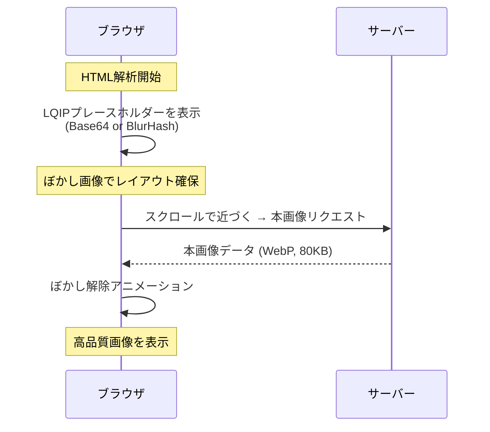

---

## 7. キャッシュ戦略

### 7.1 画像キャッシュの重要性

画像は一度作成されると変更されることが少ないため、キャッシュの恩恵を最も受けやすいリソースの一つである。適切なキャッシュ戦略を設計することで、CDNのキャッシュヒット率を95%以上に高め、オリジンへのリクエストを大幅に削減できる。

HTTPのキャッシュ制御には、主に `Cache-Control` ヘッダ、`ETag` ヘッダ、`Last-Modified` ヘッダが使用される。これらを組み合わせて、画像の特性に応じた最適なキャッシュ戦略を構築する。

### 7.2 Cache-Control ヘッダ

`Cache-Control` ヘッダは、キャッシュの動作を制御する最も重要なヘッダである。

```
Cache-Control: public, max-age=31536000, immutable
```

**主要なディレクティブ**:

| ディレクティブ | 意味 |
|---|---|
| `public` | CDNやプロキシでもキャッシュ可能 |
| `private` | ブラウザキャッシュのみ（CDN不可） |
| `max-age=N` | N秒間キャッシュが有効 |
| `s-maxage=N` | CDN/プロキシ向けのmax-age（ブラウザには適用されない） |
| `no-cache` | キャッシュは保持するが、使用前にオリジンで検証が必要 |
| `no-store` | キャッシュを一切保持しない |
| `immutable` | max-age期間中はリバリデーションしない |
| `stale-while-revalidate=N` | 期限切れ後もN秒間は古いキャッシュを返しつつバックグラウンドで更新 |

### 7.3 コンテンツハッシュ戦略

画像のURLにコンテンツハッシュを含めることで、`immutable` キャッシュと安全なキャッシュ無効化を両立できる。画像の内容が変われば URL が変わるため、キャッシュの不整合が発生しない。

```
URLパターン:
/images/hero-a1b2c3d4.webp  → Cache-Control: public, max-age=31536000, immutable
/images/hero-e5f6g7h8.webp  → 画像更新時の新URL

HTMLの参照:

  ↓ 画像更新後

```

この戦略では、max-age を1年（31536000秒）に設定し、`immutable` を付与する。画像を更新する際はファイル名のハッシュ部分が変わるため、ブラウザやCDNは必ず新しいURLとして取得する。古いURLのキャッシュは自然に期限切れで消える。

### 7.4 ETag と条件付きリクエスト

URLにハッシュを含められないケース（CMSの管理画面からアップロードされた画像など）では、`ETag` ヘッダと条件付きリクエストによるキャッシュ検証が有効である。

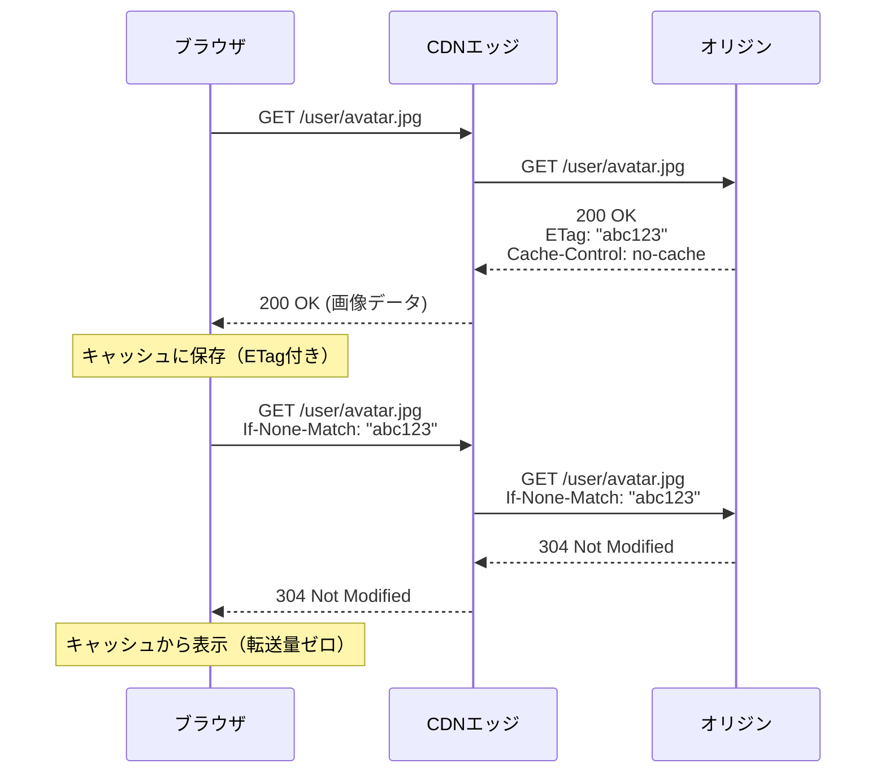

304レスポンスは画像データを含まないため、転送量はほぼゼロである。ただし、RTTは発生するため、`immutable` キャッシュと比べるとレイテンシは劣る。

### 7.5 stale-while-revalidate パターン

`stale-while-revalidate` ディレクティブは、キャッシュの鮮度とレスポンス速度を両立する強力なパターンである。

```
Cache-Control: public, max-age=3600, stale-while-revalidate=86400
```

この設定では、最初の1時間（3600秒）はキャッシュをそのまま使用する。1時間経過後〜25時間（3600 + 86400秒）以内のリクエストに対しては、古いキャッシュをまず返しつつ、バックグラウンドでオリジンに更新を確認する。ユーザーは常に即座にレスポンスを受け取れるため、体感速度が向上する。

::: tip stale-while-revalidate の活用場面
ユーザーアバターやプロフィール画像など、「多少古くても許容されるが、いずれ更新される」タイプの画像に最適である。ニュース記事のサムネイル画像やSNSのフィード画像にも適している。
:::

---

## 8. オンデマンド変換 vs プリ生成

### 8.1 二つのアプローチ

画像変換のアーキテクチャには、大きく分けて二つのアプローチがある。

**プリ生成（Pre-generation）**: 画像のアップロード時に、必要なすべてのバリエーション（サイズ × フォーマット）をあらかじめ生成してストレージに保存する。

**オンデマンド変換（On-demand Transformation）**: 画像がリクエストされた時点で初めて変換を実行し、結果をキャッシュする。

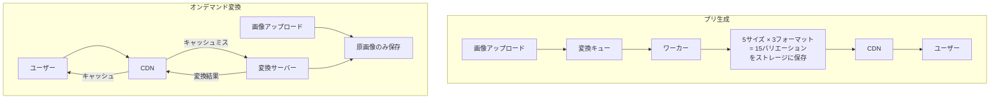

### 8.2 プリ生成の利点と欠点

**利点**:
- リクエスト時のレイテンシが最小（すでに変換済みの画像を返すだけ）
- 変換サーバーの負荷がリクエスト量に依存しない
- 変換の失敗をアップロード時に検知できる

**欠点**:
- ストレージコストが大きい（バリエーション数 × 画像数）
- 新しいサイズやフォーマットを追加するとき、全画像の再変換が必要
- アップロードからコンテンツが利用可能になるまでのレイテンシがある
- 使用されないバリエーションも生成される（ストレージの無駄）

### 8.3 オンデマンド変換の利点と欠点

**利点**:
- ストレージコストが最小（原画像 + キャッシュのみ）
- 新しいサイズやフォーマットを即座に追加可能
- 実際にリクエストされるバリエーションのみが生成される
- アップロード後すぐにコンテンツが利用可能

**欠点**:
- 初回リクエスト時のレイテンシが大きい（変換処理 + 配信）
- 変換サーバーへの負荷がリクエストパターンに依存する
- 急激なトラフィック増加時に変換サーバーが過負荷になるリスク（Thundering Herd問題）

### 8.4 ハイブリッドアプローチ

実務では、両者の利点を組み合わせたハイブリッドアプローチが採用されることが多い。

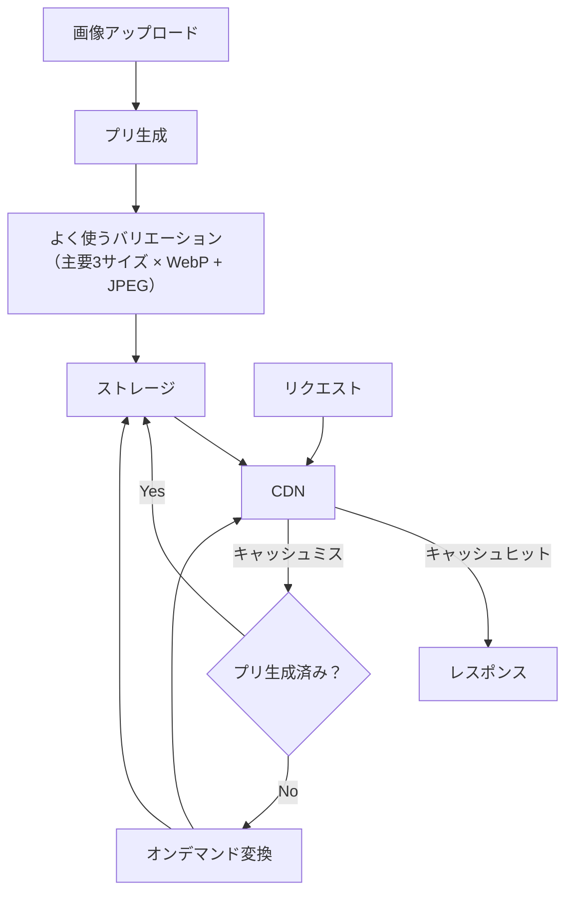

この方式では、最も使用頻度の高いバリエーション（例: モバイル向けWebP、デスクトップ向けWebP、フォールバック用JPEG）はアップロード時にプリ生成し、それ以外のバリエーション（AVIF、特殊なサイズ）はオンデマンドで生成する。

### 8.5 Thundering Herd 対策

オンデマンド変換で特に注意すべきは、同一画像に対する同時リクエストが集中した際の Thundering Herd 問題である。新着記事のサムネイルが公開直後に多数のユーザーからリクエストされるケースなどで発生する。

対策として、**Request Coalescing**（リクエストの合体）が有効である。同一画像の変換リクエストが複数到着した場合、最初のリクエストのみが実際に変換を実行し、後続のリクエストはその完了を待って同じ結果を受け取る。

```javascript
const inflight = new Map();

async function getOrTransformImage(key, transformFn) {
  // If a transformation is already in progress for this key, wait for it
  if (inflight.has(key)) {
    return inflight.get(key);
  }

  const promise = transformFn()
    .finally(() => {
      inflight.delete(key);
    });

  inflight.set(key, promise);
  return promise;
}

// Usage
app.get('/images/:id/:params', async (req, res) => {
  const cacheKey = `${req.params.id}-${req.params.params}`;

  const result = await getOrTransformImage(cacheKey, () =>
    transformImage(req.params.id, parseParams(req.params.params))
  );

  res.set('Cache-Control', 'public, max-age=86400');
  res.send(result);
});
```

Nginx では `proxy_cache_lock on;` ディレクティブにより、同一キャッシュキーへの同時リクエストを1つに集約する機能がビルトインで提供されている。

---

## 9. 実務でのアーキテクチャパターン

### 9.1 パターン1: CDN画像変換サービス活用型

最もシンプルかつ運用負荷の低いパターンである。Cloudflare Images、Imgix、Cloudinaryといったマネージド画像変換サービスを利用する。

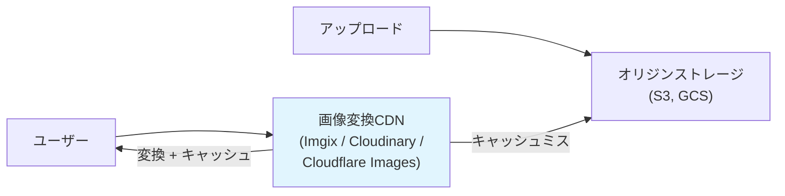

**URLベースの変換指示**:
```
# Imgix
https://example.imgix.net/photo.jpg?w=800&h=600&fit=crop&auto=format,compress

# Cloudinary
https://res.cloudinary.com/demo/image/upload/w_800,h_600,c_fill,f_auto,q_auto/photo.jpg

# Cloudflare Images
https://example.com/cdn-cgi/image/width=800,height=600,fit=crop,format=auto/photo.jpg
```

`auto=format`（Imgix）や `f_auto`（Cloudinary）を指定することで、クライアントの `Accept` ヘッダに基づく自動フォーマットネゴシエーションが行われる。

**適するケース**: 画像枚数が中規模（数十万枚以下）、運用チームが小規模、迅速な立ち上げが必要な場合。

**コスト考慮**: 変換リクエスト数と転送量に基づく従量課金が一般的。大量の画像を扱う場合はコストが急増する可能性があるため、キャッシュヒット率の最適化が重要になる。

### 9.2 パターン2: セルフホスト変換サーバー型

自前の画像変換サーバーを構築するパターンである。thumbor、imgproxy といったオープンソースの画像変換サーバーを利用することが多い。

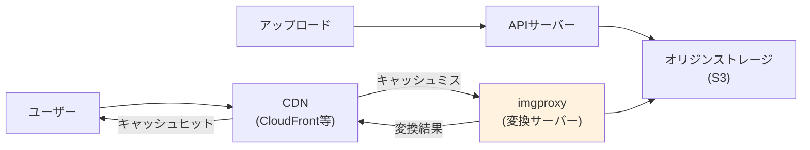

**imgproxy の構成例**:

```yaml
# docker-compose.yml
services:
  imgproxy:
    image: darthsim/imgproxy:latest
    environment:
      # Security: URL signing key
      IMGPROXY_KEY: ${IMGPROXY_KEY}
      IMGPROXY_SALT: ${IMGPROXY_SALT}
      # Performance tuning
      IMGPROXY_CONCURRENCY: 16
      IMGPROXY_MAX_SRC_FILE_SIZE: 20971520  # 20MB
      # Format support
      IMGPROXY_ENABLE_WEBP_DETECTION: "true"
      IMGPROXY_ENABLE_AVIF_DETECTION: "true"
      IMGPROXY_PREFERRED_FORMATS: "avif,webp,jpeg"
      # Source storage
      IMGPROXY_USE_S3: "true"
      IMGPROXY_S3_REGION: ap-northeast-1
    ports:
      - "8080:8080"
    deploy:
      resources:
        limits:
          memory: 2G
          cpus: '2.0'
```

**URLの署名**: セルフホスト型では、任意のURLパラメータでの変換を外部から実行されないよう、URLの署名が必須である。署名なしでは、攻撃者が極端に大きな画像や複雑な変換パラメータを指定して変換サーバーに負荷をかける攻撃（DDoS）が可能になる。

```python
import hmac
import hashlib
import base64

def sign_imgproxy_url(key: bytes, salt: bytes, path: str) -> str:
    """Generate signed imgproxy URL."""
    msg = salt + path.encode()
    signature = hmac.new(key, msg, hashlib.sha256).digest()
    encoded_sig = base64.urlsafe_b64encode(signature).rstrip(b'=').decode()
    return f"/{encoded_sig}{path}"
```

**適するケース**: 画像枚数が大規模（数百万枚以上）、変換ロジックのカスタマイズが必要、外部サービスへの依存を最小化したい場合。

### 9.3 パターン3: エッジコンピューティング型

CDNのエッジコンピューティング機能（Cloudflare Workers、AWS Lambda@Edge、Vercel Edge Functions）を活用し、エッジサーバー上で画像変換のルーティングやフォーマットネゴシエーションを行うパターンである。

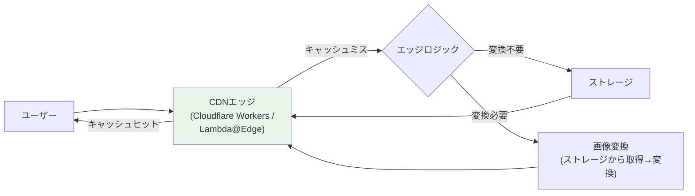

```javascript
// Cloudflare Workers example: image optimization routing
export default {
  async fetch(request, env) {
    const url = new URL(request.url);

    // Only process image paths
    if (!url.pathname.startsWith('/images/')) {
      return fetch(request);
    }

    const accept = request.headers.get('Accept') || '';
    const userAgent = request.headers.get('User-Agent') || '';

    // Determine optimal format
    let format = 'jpeg';
    if (accept.includes('image/avif')) {
      format = 'avif';
    } else if (accept.includes('image/webp')) {
      format = 'webp';
    }

    // Determine optimal width from Client Hints or viewport estimation
    const dpr = parseFloat(request.headers.get('Sec-CH-DPR') || '1');
    const width = parseInt(request.headers.get('Sec-CH-Width') || '0');

    // Build Cloudflare Image Resizing options
    const imageOptions = {
      cf: {
        image: {
          format: format,
          quality: format === 'avif' ? 50 : 80,
          fit: 'scale-down',
          ...(width > 0 && { width: Math.min(width * dpr, 2000) }),
        },
      },
    };

    // Fetch and transform
    const response = await fetch(
      `${env.ORIGIN_URL}${url.pathname}`,
      imageOptions
    );

    // Add cache headers
    const headers = new Headers(response.headers);
    headers.set('Cache-Control', 'public, max-age=86400, stale-while-revalidate=604800');
    headers.set('Vary', 'Accept');

    return new Response(response.body, {
      status: response.status,
      headers,
    });
  },
};
```

**適するケース**: CDNのエッジコンピューティング機能をすでに活用している場合、きめ細かなルーティングロジックが必要な場合、グローバルに分散した低レイテンシの変換が必要な場合。

### 9.4 パターン4: ビルドタイム最適化型

静的サイトジェネレーター（Next.js、Astro、Gatsby等）やフロントエンドのビルドプロセスに画像最適化を組み込むパターンである。

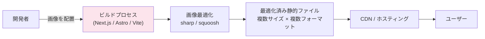

Next.js の `next/image` コンポーネントはこのパターンの代表例であり、ビルドタイム最適化とオンデマンド変換のハイブリッドを実現している。

```jsx
import Image from 'next/image';

export default function ProductCard({ product }) {
  return (
    <Image
      src={product.imageUrl}
      alt={product.name}
      width={800}
      height={600}
      sizes="(max-width: 768px) 100vw, 50vw"
      placeholder="blur"
      blurDataURL={product.blurHash}
      priority={false} // Set to true for above-the-fold images
    />
  );
}
```

Next.js の `<Image>` コンポーネントは内部で以下の処理を自動的に行う。
- `srcset` の生成（デバイスに応じた複数サイズ）
- WebP/AVIFへの自動変換（`Accept` ヘッダに基づく）
- Lazy Loading（`priority={false}` 時）
- `sizes` 属性の適用
- キャッシュ制御

**適するケース**: 静的コンテンツが中心のサイト、ビルドパイプラインが確立している場合、画像の総数が管理可能な規模の場合。

### 9.5 アーキテクチャ選択の判断基準

| 基準 | CDNサービス型 | セルフホスト型 | エッジ型 | ビルドタイム型 |
|---|---|---|---|---|
| 初期構築コスト | 低 | 高 | 中 | 低〜中 |
| 運用コスト | 中〜高（従量課金） | 中（インフラ管理） | 中 | 低 |
| カスタマイズ性 | 低〜中 | 高 | 高 | 中 |
| レイテンシ | 低 | 中 | 低 | 最低 |
| スケーラビリティ | 高（CDN依存） | 自前で対応 | 高（CDN依存） | N/A（静的） |
| 適する画像規模 | 〜数十万枚 | 数百万枚〜 | 制限なし | 〜数万枚 |

---

## 10. 統合的な最適化チェックリスト

ここまで説明した各要素を統合し、画像配信を最適化するための実践的なチェックリストを示す。

### 10.1 フォーマットと圧縮

- WebPをプライマリフォーマットとして採用しているか
- AVIF対応ブラウザにはAVIFを配信しているか
- `<picture>` 要素または `Accept` ヘッダベースのコンテンツネゴシエーションを実装しているか
- 品質パラメータを適切に調整しているか（WebP: 75-85, AVIF: 40-60）
- EXIF/メタデータを除去しているか（特にGPS座標）

### 10.2 サイズとレスポンシブ対応

- レスポンシブ画像（`srcset` / `sizes`）を実装しているか
- 不必要に大きな画像を配信していないか
- 画像の `width` / `height` 属性を明示してレイアウトシフト（CLS）を防いでいるか

### 10.3 読み込み戦略

- ファーストビュー外の画像に `loading="lazy"` を設定しているか
- LCP画像に `fetchpriority="high"` を設定しているか
- LCP画像に `loading="lazy"` を誤って設定していないか
- LQIPやプレースホルダーで体感速度を改善しているか

### 10.4 キャッシュ

- 静的画像に長期間の `Cache-Control` と `immutable` を設定しているか
- コンテンツハッシュをURLに含めてキャッシュバスティングを実現しているか
- `Vary: Accept` を設定してフォーマット別のキャッシュを分離しているか
- `stale-while-revalidate` を活用しているか

### 10.5 インフラ

- CDNを使用して地理的に分散した配信を行っているか
- HTTP/2またはHTTP/3を有効にしているか
- オンデマンド変換の場合、Request Coalescing を実装しているか

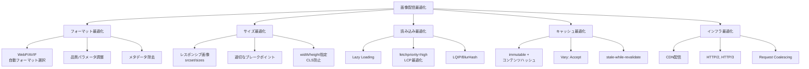

---

## 11. まとめ

画像・ファイル配信の最適化は、単一の技術で解決できる課題ではない。フォーマット、サイズ、読み込み戦略、キャッシュ、インフラの各レイヤーを横断的に最適化することで初めて、ユーザーに高速で高品質な画像体験を提供できる。

重要なのは、すべてを一度に実装しようとしないことである。一般に、以下の優先順位で取り組むのが効果的である。

1. **CDNの導入**（まだ使っていない場合）: 最も基本的かつ効果の大きい施策
2. **次世代フォーマットの採用**: WebPへの変換だけで平均30%のファイルサイズ削減
3. **レスポンシブ画像の実装**: モバイルユーザーへの過剰な画像配信を排除
4. **Lazy Loading**: ファーストビュー外の画像の遅延読み込み
5. **キャッシュ戦略の精緻化**: コンテンツハッシュ + immutable キャッシュ
6. **AVIF対応**: さらなる圧縮率の向上

これらの施策を順に実装していくことで、画像配信のパフォーマンスは段階的に、しかし着実に改善される。Core Web Vitals（LCP, CLS）のスコア改善にも直結するため、SEOの観点からも投資対効果の高い取り組みである。
