# Immutable Infrastructure

## 1. インフラストラクチャの「壊れ方」——なぜ変更可能な環境は問題なのか

### スノーフレークサーバーの誕生

2006年頃、Flickrのエンジニアであった John Allspaw と Paul Hammond は、「1日に10回のデプロイ」という当時では非常識に聞こえた発表を行った。彼らの取り組みは、インフラと開発の関係を根本から問い直すきっかけとなった。しかし、当時の多くの企業では、サーバーは「長く生き続けるもの」として扱われていた。

典型的なシナリオを考えよう。あるWebサーバーが本番環境で稼働し始めた日から、以下のような変更が積み重なっていく。

- セキュリティパッチの適用（OS レベル）
- アプリケーションの依存ライブラリのアップデート
- ログローテーションの設定変更
- パフォーマンス問題への対処としての一時的なカーネルパラメータ調整
- 運用担当者が手動で追加したデバッグツール
- 設定ファイルへの「ちょっとした」修正

これらの変更は、その時々に正当な理由があって行われる。しかし時間が経つにつれ、サーバーはインフラチームが最初に意図した状態から大きく乖離する。この状態を指して、Martin Fowler は「スノーフレークサーバー（Snowflake Server）」と呼んだ。雪の結晶のように、まったく同じものが二つとない——管理しようにも一つひとつの事情が異なるサーバー群の比喩である。

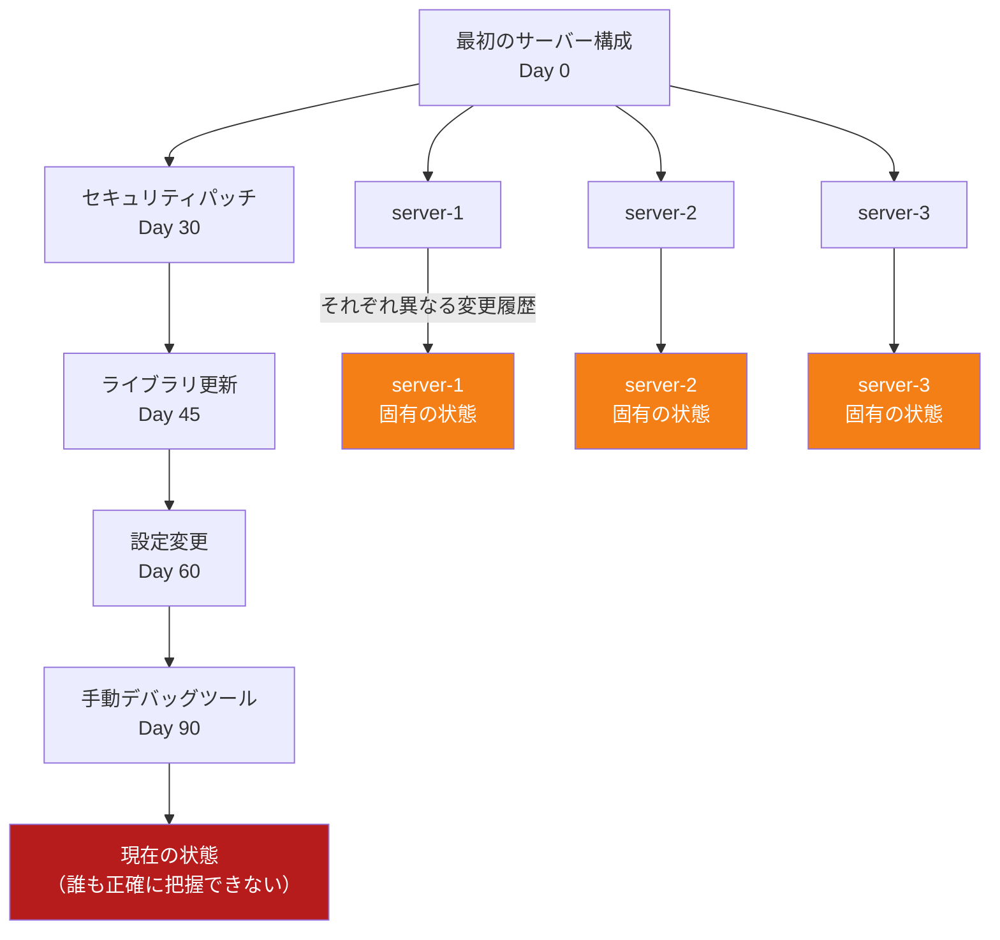

### 構成ドリフトという病

複数のサーバーが本来同じ役割を担うにもかかわらず、実際の状態が徐々にずれていく現象を「構成ドリフト（Configuration Drift）」という。この現象はいくつかの深刻な問題を引き起こす。

**再現性の喪失**: 「あのサーバーでは動くのに、このサーバーでは動かない」という状況が生まれる。問題の原因追及に何時間もかかり、最終的に「このサーバーだけで発生する何らかの固有の状態」が原因だと判明する——しかしその状態がいつどのように形成されたかは誰も知らない。

**デプロイの不安定性**: 新しいバージョンをデプロイする際、一部のサーバーでは成功し一部では失敗する。失敗するサーバーには「何かが違う」はずだが、その違いを特定するのが困難である。

**スケーリングの複雑さ**: 負荷増大に対応して新しいサーバーを追加しようとすると、現在稼働中のサーバー群と「同じ状態」を再現するのが難しい。Chef や Puppet などの構成管理ツールが普及したのは、まさにこの問題に対処するためだった。

**障害時のパニック**: サーバーが障害を起こして交換が必要になったとき、「同じサーバーを再現できるか」という問いに答えられない場合がある。運用チームは往々にして、障害中のサーバーを何とか修復しようとする（新しいサーバーを一から構築するよりも、既存のサーバーを直すほうが早いと考えるため）。この判断が、さらなる構成の歪みを生む。

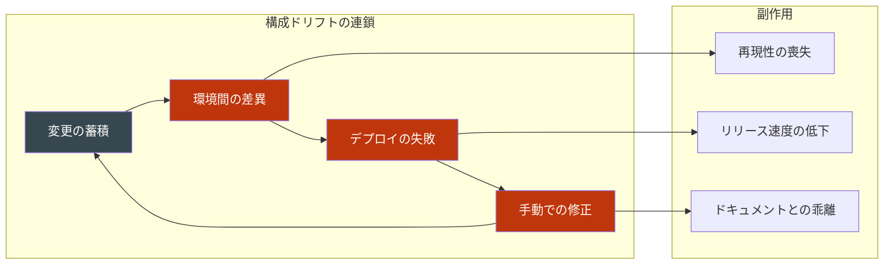

## 2. Immutable Infrastructure の思想

### 「変更する」から「作り直す」へ

Immutable Infrastructure（イミュータブルインフラストラクチャ）の中心的な考え方はシンプルである。

> **インフラストラクチャのコンポーネントは、一度デプロイされたら変更しない。変更が必要な場合は、新しいコンポーネントを作り直してそれに置き換える。**

この思想は、関数型プログラミングにおける不変性（Immutability）の概念に触発されている。関数型プログラミングでは、値は一度生成されたら変更されない。状態を変えたいときは、既存の値から新しい値を生成する。この原則によって、プログラムの状態が予測可能になり、副作用が排除される。

Immutable Infrastructure は同じ原則をインフラストラクチャに適用する。

| アプローチ | Mutable Infrastructure | Immutable Infrastructure |
|-----------|----------------------|------------------------|
| 変更の方法 | 稼働中のサーバーを直接更新 | 新しいサーバーイメージを作成して置き換え |
| サーバーの寿命 | 年単位（長寿命） | 時間〜日単位（短命） |
| 設定管理 | Chef, Puppet でサーバーを継続的に管理 | Packer でイメージをビルド時に構成 |
| 問題発生時 | SSH してデバッグ・修正 | 新しいイメージに置き換え、旧環境でオフラインデバッグ |
| トレーサビリティ | 変更履歴が散在・不明瞭 | すべての変更はイメージビルドパイプラインに記録 |

### Phoenix Server パターン

Martin Fowler と Chad Fowler が提唱した「Phoenix Server」パターンは、Immutable Infrastructure の概念を明確に表現している。

フェニックス（不死鳥）は灰から蘇る。Phoenix Server は、定期的にサーバーを「焼き払って」（削除して）、新鮮な状態から再構築する。この考え方には二つの重要な意味がある。

1. **常に再構築可能**: サーバーが何らかの理由で失われても、いつでも同じ状態を再構築できる。
2. **定期的な再構築による健全性維持**: 長期間稼働したサーバーには様々な「汚れ」が蓄積する。定期的な再構築で、その汚れをリセットする。

これとは対照的に、長期間稼働を続けるサーバーは「ペットサーバー（Pet Server）」と呼ばれる。ペットには名前があり（server-01、db-master など）、一頭ずつ丁寧に世話をする。一方、Phoenix Server は牧場の「家畜（Cattle）」のように扱われる——個体識別なく、問題があれば交換する。

> [!TIP]
> 「Pet vs Cattle」というメタファーは、Randy Bias が 2012年に広めた概念である。クラウドネイティブな考え方を象徴する言葉として、DevOps コミュニティで広く使われている。

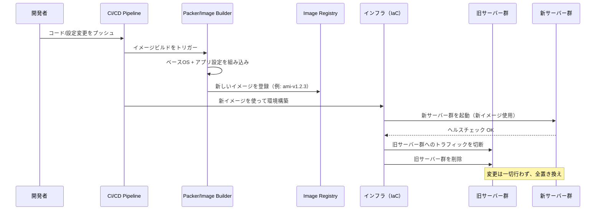

## 3. マシンイメージの構築：Packer

### Packer とは何か

HashiCorp Packer は、Immutable Infrastructure を実現するためのツールの中心に位置する。Packer は、さまざまなプラットフォーム向けの**マシンイメージ**（仮想マシンやコンテナのスナップショット）を、コードとして定義し自動的にビルドするツールである。

Packer が支持されている理由は以下の通りである。

- **マルチプラットフォーム対応**: AWS AMI、Google Cloud Machine Image、Azure Managed Image、VMware VMDK、VirtualBox OVF など、一つの定義から複数の形式のイメージを生成できる
- **コードによる宣言**: イメージの構成をコード（HCL または JSON）で表現し、バージョン管理できる
- **冪等性の保証**: 同じ定義からは常に同じイメージが生成される（ビルド時間は異なる可能性があるが、構成は同一）

### Packer テンプレートの基本構造

以下は AWS AMI を作成する Packer テンプレートの例である。

```hcl
# packer.pkr.hcl

packer {
  required_plugins {
    amazon = {
      version = ">= 1.0.0"
      source  = "github.com/hashicorp/amazon"
    }
  }
}

# Variable definitions
variable "app_version" {
  type    = string
  default = "1.2.3"
}

variable "base_ami" {
  type    = string
  default = "ami-0abcdef1234567890" # Ubuntu 22.04 LTS base image
}

# Source block: defines what kind of image to build
source "amazon-ebs" "web_server" {
  ami_name      = "myapp-web-${var.app_version}-{{timestamp}}"
  instance_type = "t3.medium"
  region        = "ap-northeast-1"
  source_ami    = var.base_ami

  # Temporary instance settings for building
  ssh_username = "ubuntu"

  # Tagging the resulting AMI
  tags = {
    Name        = "myapp-web-${var.app_version}"
    Version     = var.app_version
    Environment = "production"
    BuildDate   = "{{isotime}}"
    ManagedBy   = "packer"
  }
}

# Build block: defines what to do with the source
build {
  sources = ["source.amazon-ebs.web_server"]

  # Step 1: Wait for the instance to be ready
  provisioner "shell" {
    inline = [
      "echo 'Waiting for cloud-init...'",
      "cloud-init status --wait",
    ]
  }

  # Step 2: Update OS packages
  provisioner "shell" {
    inline = [
      "sudo apt-get update -y",
      "sudo apt-get upgrade -y",
      "sudo apt-get install -y nginx",
    ]
  }

  # Step 3: Upload application files
  provisioner "file" {
    source      = "dist/app-${var.app_version}.tar.gz"
    destination = "/tmp/app.tar.gz"
  }

  # Step 4: Configure the application
  provisioner "shell" {
    scripts = [
      "scripts/install_app.sh",
      "scripts/configure_nginx.sh",
      "scripts/setup_logging.sh",
    ]
  }

  # Step 5: Cleanup temporary files and package manager cache
  provisioner "shell" {
    inline = [
      "sudo apt-get clean",
      "sudo rm -rf /tmp/*",
      "sudo rm -rf /var/lib/apt/lists/*",
    ]
  }
}
```

このテンプレートが実行されると、Packer は以下の手順を自動的に行う。

1. 指定したベース AMI から一時的な EC2 インスタンスを起動する
2. そのインスタンスに対して、`provisioner` で定義したスクリプトや操作を順次実行する
3. インスタンスをシャットダウンし、EBS ボリュームのスナップショットを取得する
4. そのスナップショットから新しい AMI を作成する
5. 一時的なインスタンスを削除する

### Ansible との組み合わせ

複雑な構成管理には、Packer の `ansible` provisioner を利用して Ansible Playbook を実行する方法が効果的である。

```hcl
# Using Ansible as a provisioner within Packer
provisioner "ansible" {
  playbook_file = "playbooks/web_server.yml"
  extra_arguments = [
    "--extra-vars", "app_version=${var.app_version}",
    "--tags", "install,configure",
  ]
}
```

```yaml
# playbooks/web_server.yml
---
- name: Configure web server
  hosts: all
  become: yes

  tasks:
    - name: Install required packages
      apt:
        name:
          - nginx
          - nodejs
          - npm
        state: present
        update_cache: yes

    - name: Deploy application
      unarchive:
        src: "/tmp/app-{{ app_version }}.tar.gz"
        dest: /var/www/
        remote_src: yes

    - name: Configure nginx
      template:
        src: templates/nginx.conf.j2
        dest: /etc/nginx/sites-available/app
      notify: reload nginx

  handlers:
    - name: reload nginx
      service:
        name: nginx
        state: reloaded
```

::: tip Mutable と Immutable の使い分け
Packer + Ansible の組み合わせは非常に強力だが、注意が必要である。Ansible は本来 Mutable Infrastructure のために設計されたツールであり（稼働中のサーバーに対して設定を適用する）、Packer のイメージビルドに使う場合は「ビルド時に一度だけ実行される」という点を常に意識しなければならない。べき等性（何度実行しても同じ結果になること）の確保は引き続き重要だが、動的な状態の取得や条件分岐は最小限に抑えるべきである。
:::

### イメージのバージョン管理戦略

イミュータブルなイメージを有効に管理するには、適切なバージョン管理戦略が必要である。

```
# Naming convention for AMIs
{app_name}-{component}-{app_version}-{build_number}-{timestamp}

# Examples:
myapp-web-1.2.3-456-20260301120000
myapp-api-2.0.0-789-20260301150000
myapp-worker-1.5.1-321-20260228090000
```

古いイメージの管理には、以下のような戦略がある。

- **世代管理**: 最新の N 世代のイメージを保持し、それ以前のものは削除する（例: 最新5世代を保持）
- **タグによる管理**: `stable`、`latest`、`deprecated` などのタグでイメージのライフサイクルを管理する
- **自動削除**: CI/CD パイプラインに組み込み、古いイメージを自動的にデコミッションする

## 4. コンテナイメージとの関係

### Docker と Immutable Infrastructure の親和性

コンテナ技術（特に Docker）と Immutable Infrastructure は非常に相性が良い。Docker イメージ自体がイミュータブルであり、コンテナという実行単位で「使い捨て・置き換え」を当然の前提としている。

Dockerfile はマシンイメージの定義に相当する。

```dockerfile
# Dockerfile for a Node.js web application

# Use a specific version tag, never 'latest' for production
FROM node:20.11-alpine3.19

# Set working directory
WORKDIR /app

# Install dependencies first (better layer caching)
COPY package*.json ./
RUN npm ci --only=production

# Copy application source
COPY dist/ ./dist/
COPY config/ ./config/

# Create a non-root user for security
RUN addgroup -S appgroup && adduser -S appuser -G appgroup
USER appuser

# Expose port and define entrypoint
EXPOSE 3000
CMD ["node", "dist/server.js"]
```

Docker イメージのビルドは Packer と本質的に同じ考え方に基づいている。

| 概念 | VM イメージ（Packer） | コンテナイメージ（Docker） |
|-----|---------------------|------------------------|
| 基本単位 | AMI / VMDK / OVF | Docker Image |
| 定義ファイル | Packer テンプレート（HCL） | Dockerfile |
| 状態 | イミュータブル | イミュータブル |
| 実行単位 | EC2 インスタンス / VM | コンテナ |
| レジストリ | AWS ECR / AMI | Docker Hub / ECR |
| 構成の層 | レイヤー（EBS スナップショット） | レイヤー（Union FS） |

### コンテナのイミュータビリティを守る実践

コンテナ技術はイミュータブルな性質を持つが、実際の運用では無意識のうちにその原則を破ることがある。

```yaml
# BAD: Running a container and modifying it
# docker exec mycontainer apt-get install -y some-tool  ← This violates immutability

# GOOD: Build a new image with the needed tool
# Dockerfile.debug
FROM myapp:1.2.3
RUN apt-get update && apt-get install -y some-debug-tool
```

Kubernetes では、コンテナのイミュータビリティを強制するためのセキュリティ設定がある。

```yaml
# kubernetes/deployment.yaml
apiVersion: apps/v1
kind: Deployment
metadata:
  name: myapp-web
spec:
  replicas: 3
  template:
    spec:
      containers:
      - name: web
        image: myapp-web:1.2.3  # Use specific version tag, not 'latest'
        securityContext:
          # Prevent writing to the container filesystem
          readOnlyRootFilesystem: true
          # Run as non-root
          runAsNonRoot: true
          runAsUser: 1000
        volumeMounts:
        # Allow writing only to specific directories
        - name: tmp-volume
          mountPath: /tmp
        - name: logs-volume
          mountPath: /var/log/app
      volumes:
      - name: tmp-volume
        emptyDir: {}
      - name: logs-volume
        emptyDir: {}
```

`readOnlyRootFilesystem: true` を設定することで、コンテナのファイルシステムへの書き込みを物理的に防ぎ、イミュータビリティを強制できる。

### VM イメージとコンテナイメージの使い分け

両者は相互排他ではなく、多くの場合補完的に使われる。

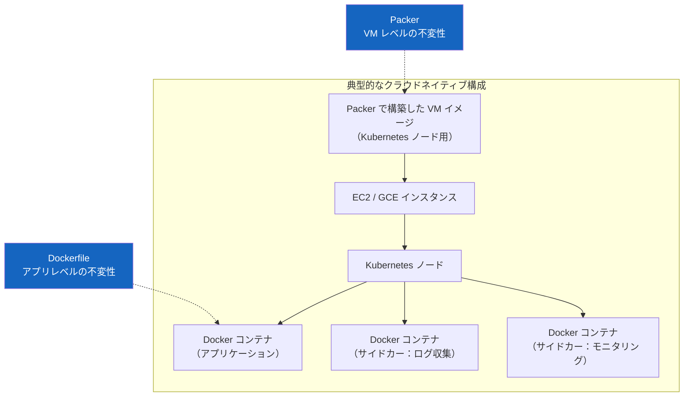

- **VM イメージ（Packer）**: Kubernetes ノード、データベースサーバー、専用ハードウェアを必要とするワークロードに適している
- **コンテナイメージ（Docker）**: アプリケーションレベルのパッケージング、マイクロサービス、高密度な実行環境に適している

## 5. Blue-Green デプロイメントおよび Canary リリースとの統合

### Blue-Green デプロイメントとの自然な融合

Immutable Infrastructure と Blue-Green デプロイメントは、設計思想として自然に一致する。Blue-Green デプロイメントでは、本番環境（Blue）とそのミラー環境（Green）を常に用意し、デプロイ時には Green 環境に新バージョンをデプロイして、トラフィックを一括で切り替える。

Immutable Infrastructure の文脈では、「新バージョンのデプロイ」とは「新しいマシンイメージから Green 環境を構築する」ことを意味する。

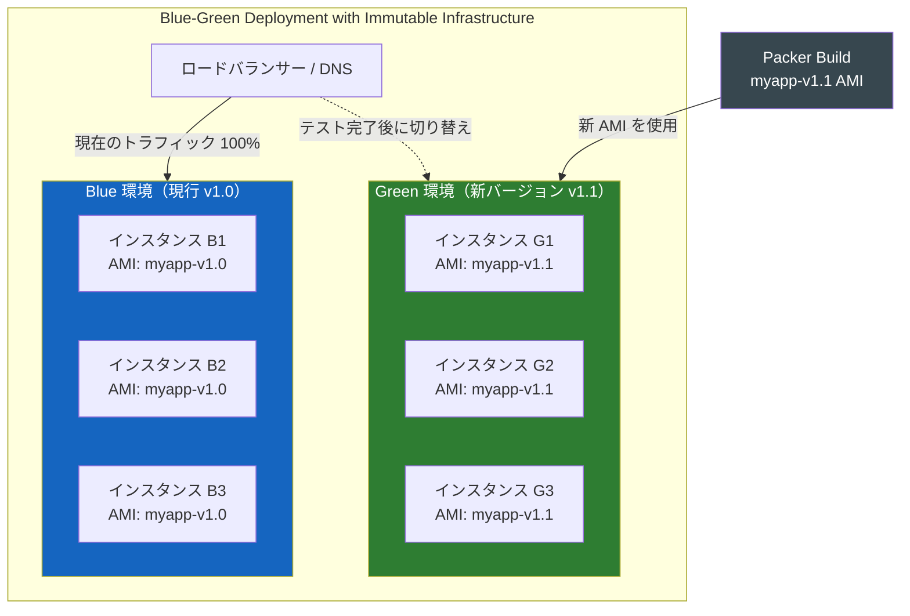

AWS での実装例として、Terraform と Auto Scaling Group を使った Blue-Green 切り替えを示す。

```hcl
# terraform/blue_green.tf

# Current (Blue) launch template using old AMI
resource "aws_launch_template" "blue" {
  name_prefix   = "myapp-blue-"
  image_id      = var.blue_ami_id  # e.g., myapp-web-1.0.0-xxx
  instance_type = "t3.medium"

  tag_specifications {
    resource_type = "instance"
    tags = {
      Environment = "production"
      Color       = "blue"
    }
  }
}

# New (Green) launch template using new AMI
resource "aws_launch_template" "green" {
  name_prefix   = "myapp-green-"
  image_id      = var.green_ami_id  # e.g., myapp-web-1.1.0-xxx
  instance_type = "t3.medium"

  tag_specifications {
    resource_type = "instance"
    tags = {
      Environment = "production"
      Color       = "green"
    }
  }
}

# Target groups for the load balancer
resource "aws_lb_target_group" "blue" {
  name     = "myapp-blue-tg"
  port     = 80
  protocol = "HTTP"
  vpc_id   = var.vpc_id

  health_check {
    path                = "/health"
    healthy_threshold   = 2
    unhealthy_threshold = 5
    interval            = 10
  }
}

resource "aws_lb_target_group" "green" {
  name     = "myapp-green-tg"
  port     = 80
  protocol = "HTTP"
  vpc_id   = var.vpc_id

  health_check {
    path                = "/health"
    healthy_threshold   = 2
    unhealthy_threshold = 5
    interval            = 10
  }
}

# Listener rule: control traffic split between blue and green
resource "aws_lb_listener_rule" "weighted" {
  listener_arn = aws_lb_listener.main.arn

  action {
    type = "forward"

    # Weighted target group for canary-style traffic splitting
    forward {
      target_group {
        arn    = aws_lb_target_group.blue.arn
        weight = var.blue_weight  # e.g., 100 initially, then 0
      }
      target_group {
        arn    = aws_lb_target_group.green.arn
        weight = var.green_weight  # e.g., 0 initially, then 100
      }
    }
  }

  condition {
    path_pattern {
      values = ["/*"]
    }
  }
}
```

### Canary リリースとの統合

Canary リリースでは、新バージョンを少数のユーザーにのみ公開し、問題がなければ段階的に展開を広げる。Immutable Infrastructure と組み合わせることで、各段階のインフラが独立したイメージに基づいており、ロールバックが確実に行える。

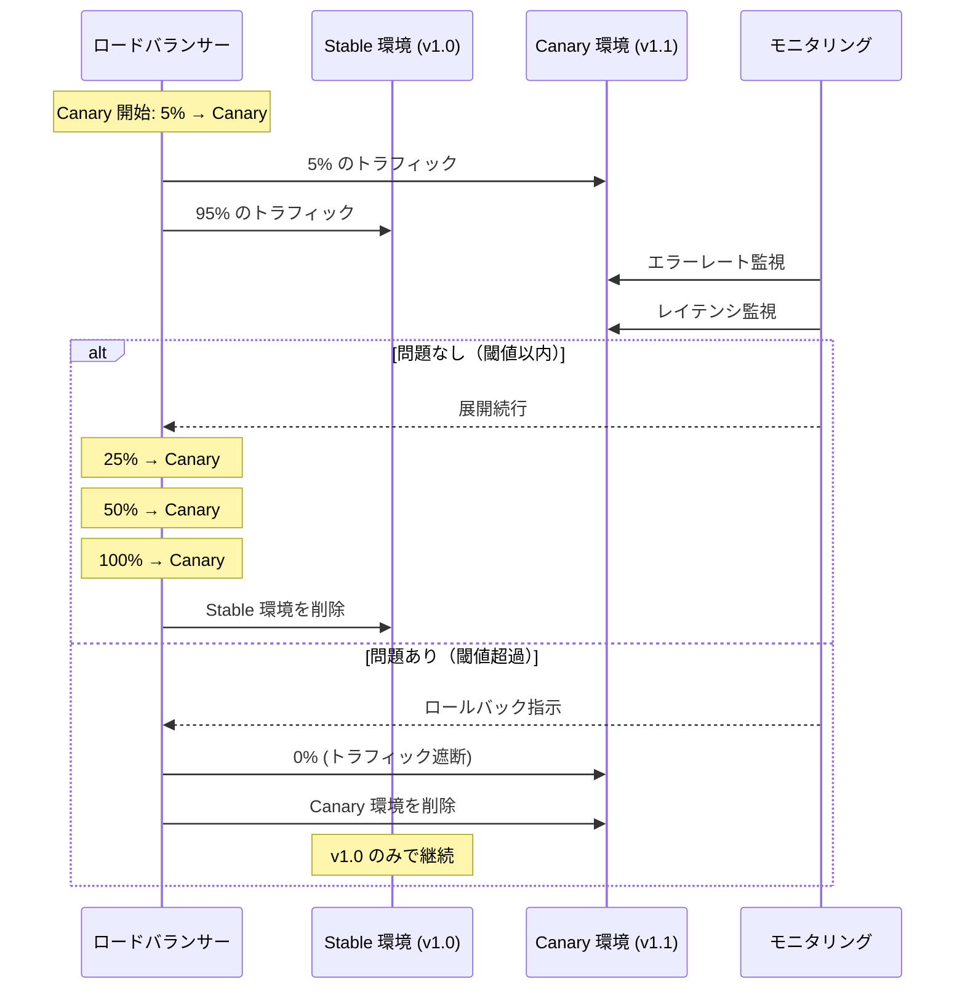

::: warning Canary での注意点
Canary リリースと Immutable Infrastructure を組み合わせる場合、データベーススキーマの変更には特に注意が必要である。v1.0 と v1.1 が同時に稼働する期間があるため、データベースは両バージョンのスキーマに対して互換性を持つ必要がある（Expand-Contract パターンの適用が推奨される）。
:::

## 6. ステートフルサービスの扱い

### Immutable Infrastructure の「例外」

Immutable Infrastructure のアプローチは、ステートレスなアプリケーションサーバーには完璧に適合する。しかし、データを永続化するステートフルなサービス（データベース、キャッシュ、メッセージブローカーなど）は、単純に「置き換える」ことができない。

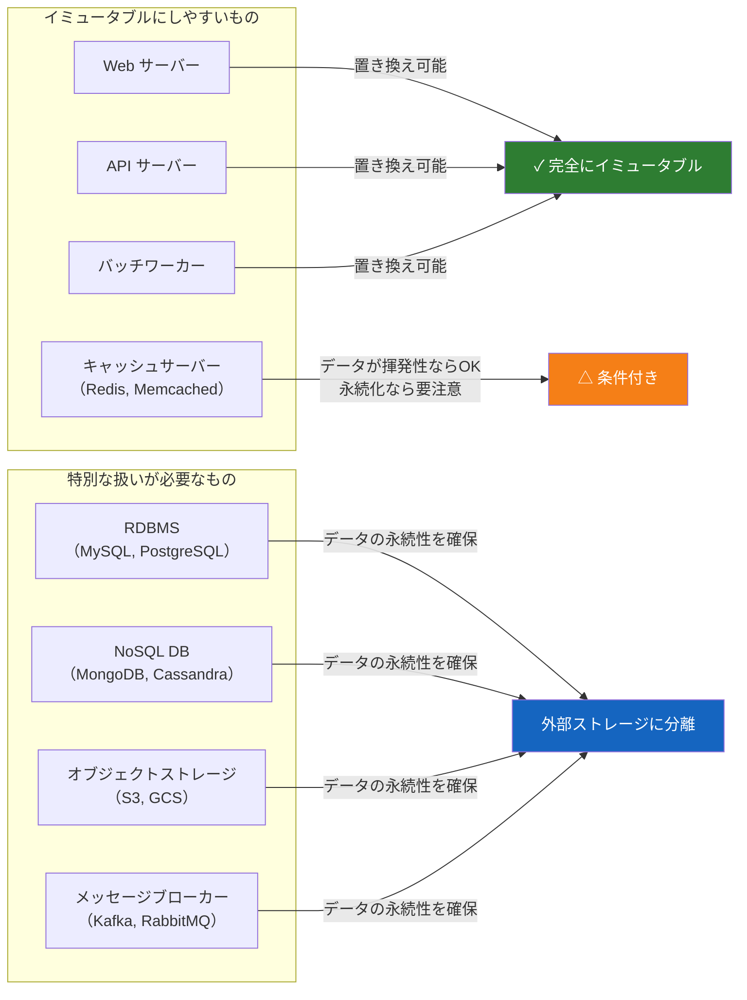

### データボリュームの分離

コンテナ環境では、データボリュームとコンテナイメージを明確に分離することがベストプラクティスである。

```yaml
# docker-compose.yml for a database with persistent storage
version: '3.8'

services:
  postgres:
    image: postgres:16.1-alpine  # Specific version, immutable
    environment:
      POSTGRES_DB: myapp
      POSTGRES_USER: appuser
      POSTGRES_PASSWORD_FILE: /run/secrets/db_password
    volumes:
      # Data volume: persistent, lives outside the container
      - postgres_data:/var/lib/postgresql/data
      # Config: can also be external
      - ./config/postgresql.conf:/etc/postgresql/postgresql.conf:ro
    secrets:
      - db_password

secrets:
  db_password:
    file: ./secrets/db_password.txt

volumes:
  # Named volume: persists across container replacements
  postgres_data:
    driver: local
```

Kubernetes では、PersistentVolume（PV）と PersistentVolumeClaim（PVC）によってデータの永続化を実現する。

```yaml
# kubernetes/postgres-statefulset.yaml
apiVersion: apps/v1
kind: StatefulSet
metadata:
  name: postgres
spec:
  serviceName: postgres
  replicas: 1
  template:
    spec:
      containers:
      - name: postgres
        image: postgres:16.1-alpine  # Immutable image
        env:
        - name: PGDATA
          value: /var/lib/postgresql/data/pgdata
        volumeMounts:
        - name: postgres-data
          mountPath: /var/lib/postgresql/data
  # VolumeClaimTemplate: creates a PVC for each pod
  volumeClaimTemplates:
  - metadata:
      name: postgres-data
    spec:
      accessModes: ["ReadWriteOnce"]
      storageClassName: gp3
      resources:
        requests:
          storage: 100Gi
```

StatefulSet を使用することで、Kubernetes は Pod が再起動・置き換えされても同じ PVC を再マウントすることを保証する。

### 外部マネージドサービスへの委譲

最もシンプルで推奨されるアプローチは、ステートフルなサービスをクラウドプロバイダーのマネージドサービスに委譲することである。

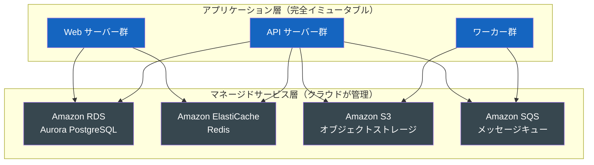

マネージドサービスを利用することで、以下のメリットが得られる。

- **データの永続性**: データはサービス側で管理され、アプリケーションのデプロイサイクルから独立する
- **高可用性**: Multi-AZ 構成など、クラウドプロバイダーが可用性を保証する
- **バックアップ・リストア**: 定期的なスナップショットや PITR（Point-in-Time Recovery）が利用できる
- **スケーリング**: Read Replica の追加など、アプリ側の変更なしにスケールできる

### スナップショットとデータボリュームのイミュータビリティ

データボリューム自体にも、イミュータビリティの考え方を部分的に適用できる。

```bash
# AWS EBS snapshot-based approach
# Before major schema migration, create a point-in-time snapshot
aws ec2 create-snapshot \
  --volume-id vol-0abcdef1234567890 \
  --description "Pre-migration snapshot for v1.1 deployment" \
  --tag-specifications 'ResourceType=snapshot,Tags=[{Key=Name,Value=pre-v1.1-migration},{Key=Version,Value=v1.0}]'

# If migration fails, restore from snapshot
aws ec2 create-volume \
  --snapshot-id snap-0abcdef1234567890 \
  --availability-zone ap-northeast-1a \
  --volume-type gp3
```

これにより、データベースの状態を「ある時点のスナップショット」として保存し、問題が発生した場合にその時点に戻ることができる。

## 7. IaC（Infrastructure as Code）との組み合わせ

### Immutable Infrastructure を支える IaC

Immutable Infrastructure は、IaC（Infrastructure as Code）なしには成立しない。サーバーを手動で構築・設定する組織が「イミュータブル」を実現しようとしても、毎回手作業で環境を再構築するのは現実的ではないからである。

IaC とは、インフラストラクチャの構成（ネットワーク、サーバー、データベースなど）をコードで記述し、バージョン管理・自動実行する手法である。主要なツールには Terraform、AWS CloudFormation、Pulumi などがある。

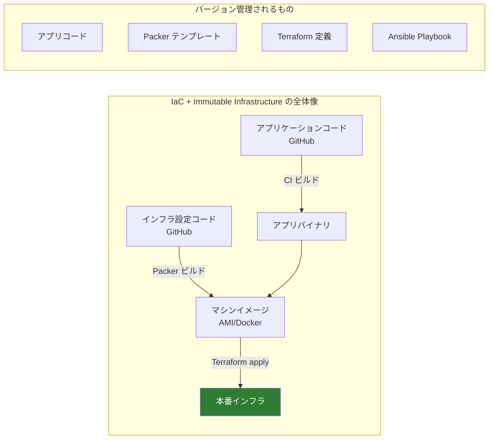

### Terraform を使ったイミュータブルな EC2 環境

```hcl
# terraform/main.tf

# Data source: look up the latest AMI built by Packer
data "aws_ami" "app_ami" {
  most_recent = true
  owners      = ["self"]

  filter {
    name   = "name"
    values = ["myapp-web-${var.app_version}-*"]
  }

  filter {
    name   = "tag:Environment"
    values = ["production"]
  }
}

# Auto Scaling Group using the immutable AMI
resource "aws_autoscaling_group" "web" {
  name                = "myapp-web-asg-${var.app_version}"
  desired_capacity    = var.desired_capacity
  min_size            = var.min_size
  max_size            = var.max_size
  vpc_zone_identifier = var.subnet_ids
  target_group_arns   = [aws_lb_target_group.web.arn]

  launch_template {
    id      = aws_launch_template.web.id
    version = "$Latest"
  }

  # Instance refresh: rolling replacement when launch template changes
  instance_refresh {
    strategy = "Rolling"
    preferences {
      min_healthy_percentage = 50
      instance_warmup        = 300
    }
  }

  # Force new instances to use the latest AMI when the ASG is updated
  lifecycle {
    create_before_destroy = true
  }

  tag {
    key                 = "Name"
    value               = "myapp-web-${var.app_version}"
    propagate_at_launch = true
  }
}

resource "aws_launch_template" "web" {
  name_prefix   = "myapp-web-${var.app_version}-"
  image_id      = data.aws_ami.app_ami.id
  instance_type = var.instance_type

  # No SSH access in production (immutable infrastructure principle)
  # Use AWS Systems Manager Session Manager instead
  iam_instance_profile {
    name = aws_iam_instance_profile.ssm_profile.name
  }

  network_interfaces {
    associate_public_ip_address = false
    security_groups             = [aws_security_group.web.id]
  }

  # User data is minimal: just start the pre-configured service
  user_data = base64encode(<<-EOF
    #!/bin/bash
    # Service should already be configured in the AMI
    systemctl start myapp
    systemctl enable myapp
  EOF
  )
}
```

### GitOps との統合

GitOps は IaC をさらに一歩進め、Git リポジトリを「唯一の正しい状態」として扱う運用モデルである。Immutable Infrastructure と GitOps を組み合わせると、インフラの変更はすべて Git へのプッシュを通じて行われる。

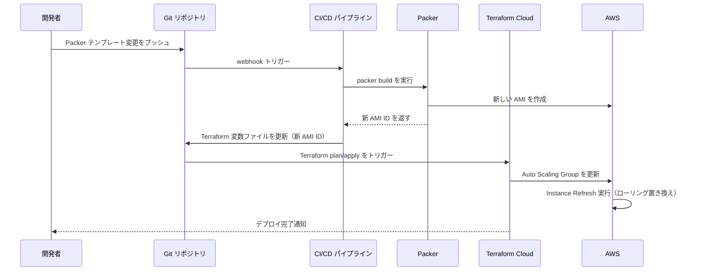

::: details 完全な CI/CD パイプラインの例（GitHub Actions）
```yaml
# .github/workflows/deploy.yml
name: Build and Deploy

on:
  push:
    branches: [main]

jobs:
  build-image:
    runs-on: ubuntu-latest
    outputs:
      ami_id: ${{ steps.packer.outputs.ami_id }}

    steps:
    - uses: actions/checkout@v4

    - name: Configure AWS credentials
      uses: aws-actions/configure-aws-credentials@v4
      with:
        role-to-assume: arn:aws:iam::123456789012:role/packer-role
        aws-region: ap-northeast-1

    - name: Setup Packer
      uses: hashicorp/setup-packer@main
      with:
        version: "1.10.0"

    - name: Build application
      run: |
        npm ci
        npm run build

    - name: Build AMI with Packer
      id: packer
      run: |
        packer init .
        # Capture the AMI ID from Packer output
        AMI_ID=$(packer build \
          -var "app_version=${{ github.sha }}" \
          -machine-readable \
          packer.pkr.hcl | \
          grep 'artifact,0,id' | \
          cut -d: -f2)
        echo "ami_id=$AMI_ID" >> $GITHUB_OUTPUT

  deploy:
    needs: build-image
    runs-on: ubuntu-latest

    steps:
    - uses: actions/checkout@v4

    - name: Configure AWS credentials
      uses: aws-actions/configure-aws-credentials@v4
      with:
        role-to-assume: arn:aws:iam::123456789012:role/terraform-role
        aws-region: ap-northeast-1

    - name: Setup Terraform
      uses: hashicorp/setup-terraform@v3

    - name: Terraform Init
      run: terraform -chdir=terraform/ init

    - name: Terraform Apply
      run: |
        terraform -chdir=terraform/ apply -auto-approve \
          -var "ami_id=${{ needs.build-image.outputs.ami_id }}"
```
:::

## 8. AMI / VM Image 管理のベストプラクティス

### ゴールデンイメージ戦略

実際の組織では、「ゴールデンイメージ（Golden Image）」と呼ばれる、組織標準の設定が適用された基盤イメージを作成し、その上に各アプリケーションのイメージを構築するアプローチが効果的である。

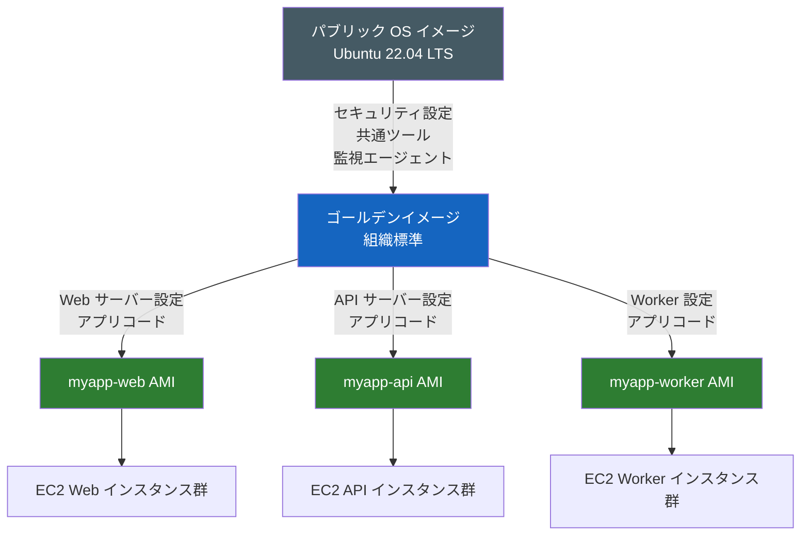

ゴールデンイメージには以下が含まれることが多い。

- **セキュリティ強化**: CIS Benchmark に基づく OS ハードニング、不要なサービスの無効化
- **共通エージェント**: CloudWatch Agent、Datadog Agent、Falco などの監視・セキュリティツール
- **組織標準設定**: タイムゾーン、NTP サーバー、ログ設定、sudo ルール
- **コンプライアンス**: 証明書のインストール、暗号化設定

### AMI のライフサイクル管理

```bash
# Automated AMI cleanup script
#!/bin/bash

# Keep only the N most recent AMIs for each application
MAX_KEEP=5
APP_NAME=$1

# Get list of AMIs sorted by creation date, skip the latest MAX_KEEP
OLD_AMIS=$(aws ec2 describe-images \
  --owners self \
  --filters "Name=name,Values=${APP_NAME}-*" \
  --query "sort_by(Images, &CreationDate)[:-${MAX_KEEP}][].ImageId" \
  --output text)

for AMI_ID in $OLD_AMIS; do
  echo "Deregistering AMI: $AMI_ID"

  # Get associated snapshots before deregistering
  SNAPSHOT_IDS=$(aws ec2 describe-images \
    --image-ids $AMI_ID \
    --query "Images[0].BlockDeviceMappings[].Ebs.SnapshotId" \
    --output text)

  # Deregister the AMI
  aws ec2 deregister-image --image-id $AMI_ID

  # Delete associated snapshots
  for SNAPSHOT_ID in $SNAPSHOT_IDS; do
    echo "Deleting snapshot: $SNAPSHOT_ID"
    aws ec2 delete-snapshot --snapshot-id $SNAPSHOT_ID
  done
done
```

### セキュリティパッチの適用

Immutable Infrastructure において、セキュリティパッチの適用は「サーバーを更新する」ではなく「新しいイメージをビルドして置き換える」という形になる。


この仕組みにより、緊急セキュリティパッチの適用が「イメージビルドパイプラインを実行してデプロイする」というプロセスで統一される。手動での作業が排除され、パッチ適用状況のトレーサビリティが向上する。

> [!WARNING]
> パッチ適用のためにイメージを再ビルドしてデプロイするまでの時間（MTTR: Mean Time To Remediate）を把握・最小化することが重要である。緊急性の高い CVE に対応するためのファストパスをパイプラインに設けることを検討すること。

## 9. Immutable Infrastructure の現実的な課題と対処法

### デバッグの難しさ

Immutable Infrastructure の原則に従えば、本番環境で稼働中のインスタンスに SSH でログインして問題を調査することは原則禁止となる（そもそも SSH ポートを開けない設計にすることが推奨される）。しかし、これはデバッグを困難にする。

対処法として以下のアプローチが有効である。

**1. 充実したログとメトリクスの整備**

問題が起きた後ではなく、起きる前から十分なオブザーバビリティ（可観測性）を確保しておく。

```yaml
# Structured logging configuration in the application
# All logs should go to stdout/stderr for centralized collection
logging:
  format: json
  level: info
  fields:
    - timestamp
    - level
    - message
    - request_id
    - user_id
    - latency_ms
    - status_code
```

**2. AWS Systems Manager Session Manager の活用**

どうしても本番インスタンスへのアクセスが必要な場合は、SSH ではなく AWS SSM Session Manager を使用する。これにより、SSH ポートを開かずにセキュアなシェルアクセスが可能になり、全操作が CloudTrail に記録される。

**3. 同一イメージを使ったローカル再現**

本番で問題が発生したインスタンスと同じ AMI から一時的なインスタンスを起動し、本番と同じトラフィックパターンや設定を再現してデバッグする。

### イメージビルド時間の最適化

イメージのビルドに時間がかかると、デプロイサイクルが遅くなる。以下の戦略でビルド時間を短縮できる。

```hcl
# Optimizing Packer builds with base image layers

# Step 1: Build a base image with slow-changing dependencies
source "amazon-ebs" "base" {
  ami_name      = "myapp-base-${var.base_version}"
  # ... base configuration
}

build {
  sources = ["source.amazon-ebs.base"]

  provisioner "shell" {
    # Install heavy dependencies that rarely change
    inline = [
      "sudo apt-get install -y nodejs npm python3 ...",
      "npm install -g some-global-tool",
    ]
  }
}
```

```hcl
# Step 2: Build application image from the base image (much faster)
data "aws_ami" "base" {
  most_recent = true
  owners      = ["self"]
  filter {
    name   = "name"
    values = ["myapp-base-*"]
  }
}

source "amazon-ebs" "app" {
  ami_name   = "myapp-web-${var.app_version}"
  source_ami = data.aws_ami.base.id  # Start from pre-built base
  # ... app configuration
}
```

このように依存関係の変化頻度に応じてイメージを分層することで、頻繁に変更されるアプリケーションコードのビルドは高速化される。

### コスト管理

Immutable Infrastructure では、Blue-Green 切り替え中に一時的に通常の2倍のリソースが稼働する。コストを最適化するために以下を考慮する。

- **Spot Instance の活用**: ステートレスなワーカーやバッチ処理は Spot Instance を使用してコスト削減
- **デプロイ後の旧環境の迅速な削除**: 切り替え後、旧環境を長時間保持しない（必要に応じて短時間のみ保持）
- **スケジュールベースのスケーリング**: トラフィックが少ない時間帯にデプロイを行い、ピーク時のリソース消費を避ける

## 10. まとめ：Immutable Infrastructure が実現するもの

Immutable Infrastructure は単なる技術的なトレンドではなく、インフラ運用における根本的な考え方のシフトを表している。

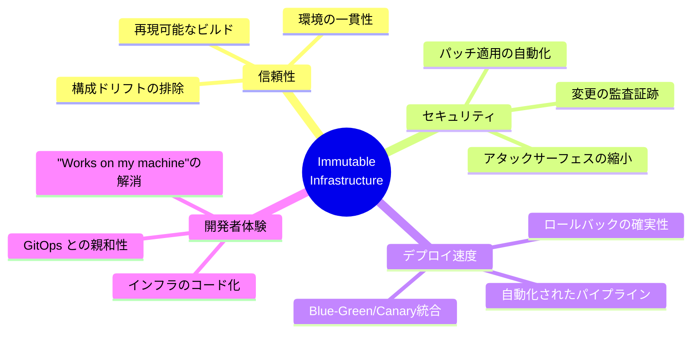

Immutable Infrastructure が解決する本質的な問題は、「**インフラストラクチャの状態が時間とともに不確定になる**」という問題である。変更可能なサーバーを長期間運用すると、その状態は誰も正確に把握できなくなる。Immutable Infrastructure はこの問題を「変更しない」という選択によって根本的に解決する。

実践においては以下の組み合わせが効果的である。

1. **Packer + Ansible**: マシンイメージのコードによる定義と自動ビルド
2. **Terraform / CloudFormation**: インフラのコードによる宣言と管理
3. **Blue-Green / Canary Deployment**: リスクを最小化した安全なリリース
4. **マネージドサービスの活用**: ステートフルな懸念をクラウドプロバイダーに委譲
5. **GitOps**: Git を唯一の信頼源とした変更管理

これらの実践はそれぞれが独立したベストプラクティスであると同時に、組み合わせることで相乗効果を発揮する。Immutable Infrastructure は、現代のクラウドネイティブなシステム運用における重要な柱の一つである。
