# インシデント管理とポストモーテム

## 1. インシデント管理の重要性

### なぜインシデント管理が必要か

ソフトウェアシステムは壊れる。どれほど優れたエンジニアリングを投入しても、複雑さが増すほどに障害は不可避となる。ハードウェアは故障し、ネットワークは不安定になり、デプロイは失敗し、依存サービスは想定外の挙動を示す。この前提に立つとき、重要なのは「障害をゼロにすること」ではなく、「障害が発生したときに、いかに迅速かつ体系的に対応し、学びを得るか」である。

インシデント管理（Incident Management）とは、サービスの品質低下や停止といったインシデントを検知し、対応し、復旧させ、そこから教訓を抽出する一連のプロセスを指す。このプロセスが体系化されていない組織では、以下のような問題が繰り返し発生する。

- **対応の属人化**: 特定のエンジニアだけが障害対応できる状態。その人物が不在のときに大規模障害が起きると、復旧が大幅に遅れる
- **コミュニケーションの混乱**: 誰が何をしているか分からず、同じ調査を複数人が重複して行う。経営層やカスタマーサポートへの情報共有が遅れ、顧客対応が後手に回る
- **同じ障害の再発**: 根本原因を分析せず、場当たり的な対処で済ませるため、同種の障害が繰り返される
- **エンジニアの疲弊**: オンコール対応が特定の個人に集中し、バーンアウトにつながる

### インシデント管理の歴史的背景

インシデント管理の概念は、ソフトウェア業界だけのものではない。その起源は、消防、軍事、航空、医療といった分野における危機管理手法に遡る。特に重要なのが、米国の緊急事態管理で使われる **ICS（Incident Command System）** である。

ICSは1970年代にカリフォルニア州の大規模山火事への対応から生まれた。複数の機関が協力して緊急事態に対応する際、指揮系統の混乱が被害を拡大させたことへの反省から、統一的な指揮構造が策定された。この仕組みは、明確な役割分担、スパン・オブ・コントロール（一人の管理者が直接指揮する人数の制限）、標準化されたコミュニケーション手順を特徴とする。

Googleは2000年代にこのICSの概念をソフトウェアインシデント管理に適用し、SRE（Site Reliability Engineering）の実践の一部として体系化した。2016年に出版された『Site Reliability Engineering』（通称「SRE本」）で公開されたこの手法は、その後PagerDuty、Atlassian、GitLabなど多くの企業に影響を与え、現在の業界標準となっている。

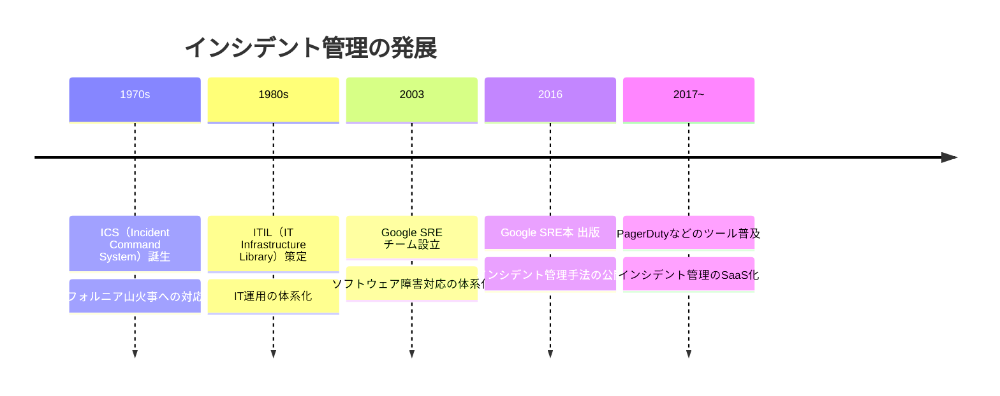

### ビジネスインパクト

インシデント管理が重要な理由は、技術的な側面だけではない。障害はビジネスに直接的な損害を与える。

大手ECサイトでは、1分間のダウンタイムが数百万ドルの売上損失につながることが知られている。金融サービスでは、システム障害が規制当局への報告義務を発生させ、コンプライアンス上のリスクとなる。SaaSビジネスでは、SLA（Service Level Agreement）違反がクレジットの返還やブランド毀損につながる。

しかし、より深刻なのは目に見えない損害である。頻繁な障害は顧客の信頼を蝕み、解約率を押し上げる。障害対応に追われるエンジニアは新機能の開発に時間を使えず、プロダクトの競争力が低下する。こうした間接的な影響は定量化しにくいが、長期的にはダウンタイムの直接コスト以上のダメージを組織に与える。

::: tip 核心的な洞察
インシデント管理の目標は「障害を起こさないこと」ではなく、「障害から最大限の学びを得て、復旧時間を最小化し、同じ障害を二度と起こさないこと」である。障害は避けられない現実であり、それを前提としたシステムと文化を構築することが重要である。
:::

## 2. インシデント対応プロセス

インシデント対応は、明確に定義されたフェーズに沿って進行する。各フェーズには固有の目的と活動があり、これを事前に定義しておくことで、混乱の中でも体系的な対応が可能になる。

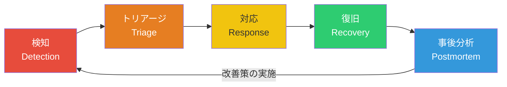

### 2.1 検知（Detection）

インシデント対応の品質は、検知の速さに大きく依存する。ユーザーから報告を受けて初めて障害に気付くようでは、対応は常に後手に回る。

#### 検知の手段

検知手段は大きく3つのカテゴリに分けられる。

**自動モニタリング**: 最も信頼性が高く、最も速い検知手段。SLI（Service Level Indicator）に基づくアラートが理想的である。例えば「過去5分間の成功リクエスト率が99.5%を下回った」「p99レイテンシが500msを超えた」といった条件でアラートを発火させる。

```yaml
# Example: Prometheus alerting rule
groups:
  - name: sli-alerts
    rules:
      - alert: HighErrorRate
        # Fire when error rate exceeds 0.5% over 5 minutes
        expr: |
          (
            sum(rate(http_requests_total{status=~"5.."}[5m]))
            /
            sum(rate(http_requests_total[5m]))
          ) > 0.005
        for: 5m
        labels:
          severity: critical
        annotations:
          summary: "High error rate detected"
          description: "Error rate is above 0.5% for the last 5 minutes."
```

**合成監視（Synthetic Monitoring）**: 定期的にAPIやWebページにリクエストを送り、正常に応答するかを確認する。ユーザーの視点からシステムの健全性を確認できるため、内部メトリクスだけでは検知できない問題（DNS障害、CDNの問題など）も捕捉できる。

**人間による報告**: カスタマーサポートへの問い合わせ、ソーシャルメディアでの言及、社内のエンジニアによる発見など。自動モニタリングの盲点を補完するが、検知までの時間は長くなる。

::: warning 注意: アラート疲れ
アラートの閾値が厳しすぎると、大量の誤報（false positive）が発生し、エンジニアがアラートを無視するようになる。これを「アラート疲れ（Alert Fatigue）」と呼ぶ。本当に重要なアラートが埋もれてしまうため、MTTR（Mean Time to Recovery）が逆に悪化する。アラートは「人間が今すぐ行動を起こす必要がある」ときにのみ発火すべきである。
:::

#### 検知の指標

検知の品質を測る代表的な指標は以下の通りである。

| 指標 | 説明 |
|------|------|
| **MTTD**（Mean Time to Detect） | 障害発生から検知までの平均時間 |
| **False Positive Rate** | 実際には障害ではないのにアラートが発火した割合 |
| **False Negative Rate** | 障害が発生したのにアラートが発火しなかった割合 |
| **Detection Coverage** | 自動モニタリングで検知できた障害の割合 |

### 2.2 トリアージ（Triage）

トリアージとは、インシデントの影響範囲と重要度を迅速に評価し、適切な対応体制を組むプロセスである。医療のトリアージと同様、限られたリソースを最も効果的に配分するための意思決定プロセスである。

トリアージで判断すべきことは以下の3点に集約される。

1. **影響範囲**: どのサービス、どのユーザーセグメント、どの地域が影響を受けているか
2. **重要度**: ビジネスへのインパクトはどの程度か（後述のインシデント分類を参照）
3. **対応体制**: 誰を巻き込む必要があるか。エスカレーションは必要か

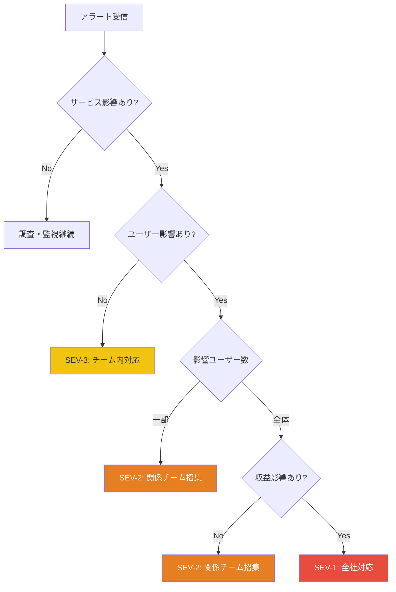

#### トリアージの原則

トリアージにおいて最も重要な原則は、**「診断よりも緩和を優先する」** ということである。

根本原因の特定には時間がかかる場合がある。しかし、サービスが停止している間もユーザーへの影響は増大し続ける。したがって、まず影響を緩和する手段（ロールバック、トラフィックの迂回、機能の無効化など）を検討し、そのあとで根本原因の調査を行うべきである。

### 2.3 対応（Response）

インシデント対応のフェーズでは、Incident Commanderを中心とした対応チームが編成され、問題の特定と緩和に取り組む。詳細な役割定義については次節で述べるが、ここでは対応フェーズ全体の流れを概観する。

#### 対応の基本プロセス

1. **Warroom（対応チャンネル）の設立**: 専用のSlackチャンネルやビデオ会議を開設し、関係者を集める
2. **状況の共有**: 現時点で分かっていること、分かっていないことを明確にする
3. **仮説の策定と検証**: 考えられる原因を列挙し、優先度の高いものから検証する
4. **緩和策の実施**: 原因が特定できなくても、影響を最小化する手段を講じる
5. **状況のエスカレーション**: 必要に応じて、より上位の意思決定者や専門家を巻き込む
6. **定期的なステータス更新**: 社内外のステークホルダーに進捗を共有する

```python
# Example: Automated incident channel creation (Slack API)
import slack_sdk
import datetime

def create_incident_channel(severity: str, summary: str) -> dict:
    """Create a dedicated Slack channel for incident response."""
    client = slack_sdk.WebClient(token=SLACK_BOT_TOKEN)

    # Generate channel name with timestamp
    timestamp = datetime.datetime.now().strftime("%Y%m%d-%H%M")
    channel_name = f"inc-{severity}-{timestamp}"

    # Create channel
    response = client.conversations_create(
        name=channel_name,
        is_private=False,
    )
    channel_id = response["channel"]["id"]

    # Post initial incident summary
    client.chat_postMessage(
        channel=channel_id,
        text=(
            f"*Incident Declared*\n"
            f"*Severity*: {severity}\n"
            f"*Summary*: {summary}\n"
            f"*Status*: Investigating\n"
            f"*Incident Commander*: TBD\n"
            f"---\n"
            f"Please use this channel for all incident-related communication."
        ),
    )

    return {"channel_id": channel_id, "channel_name": channel_name}
```

#### コミュニケーションの原則

インシデント対応におけるコミュニケーションは、技術的な調査と同等以上に重要である。

- **一箇所に集約する**: 情報がDM、メール、複数のチャンネルに分散すると、全体像の把握が困難になる
- **事実と仮説を明確に区別する**: 「DBサーバーのCPU使用率が100%です」（事実）と「おそらくスロークエリが原因です」（仮説）を混同しない
- **定期的にサマリーを更新する**: 途中から参加した人がキャッチアップできるよう、ピン留めメッセージで最新の状況をまとめる
- **外部コミュニケーション**: ユーザーへのステータスページの更新、カスタマーサポートへの情報提供を忘れない

### 2.4 復旧（Recovery）

復旧フェーズでは、サービスを正常な状態に戻すことが目標となる。緩和策による暫定的な復旧（ロールバックなど）と、恒久的な修正は区別して管理する。

#### 復旧の確認

復旧を宣言するためには、以下の条件を確認する必要がある。

- SLI（Service Level Indicator）が正常範囲に回復していること
- エラー率が通常の水準に戻っていること
- ユーザーからの障害報告が停止していること
- 暫定対応の副作用が発生していないこと

::: danger 重要
復旧を急ぐあまり、不十分な検証で「復旧完了」を宣言してはならない。見かけ上は回復していても、一部のユーザーやリージョンで問題が継続している場合がある。メトリクスだけでなく、合成監視やユーザー視点での確認も行うべきである。
:::

#### 復旧後のアクション

- インシデントのタイムラインを記録する（記憶が新鮮なうちに）
- ポストモーテムの日程を設定する（理想的には24〜48時間以内）
- 暫定対応の状態を文書化する（ロールバックしたバージョン、無効化した機能など）
- 関係者への最終報告を行う

### 2.5 事後分析（Postmortem）

事後分析（ポストモーテム）は、インシデント対応プロセスの最終フェーズであり、最も重要なフェーズでもある。ポストモーテムの目的は、インシデントから組織として学び、同種の問題の再発を防ぐことである。詳細は第4節で述べる。

## 3. 役割の定義

インシデント対応において、明確な役割分担は不可欠である。カオスの中で「誰が何をするか」が曖昧な状態は、対応の遅延と混乱を招く。ICSの考え方をソフトウェアインシデントに適用した役割体系が、多くの組織で採用されている。

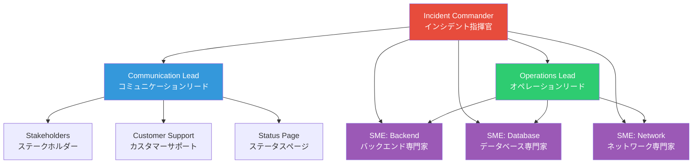

### 3.1 Incident Commander（インシデント指揮官）

Incident Commander（IC）は、インシデント対応全体を指揮する役割である。消防や軍事のICSにおける「現場指揮官」に相当する。

#### ICの責務

- **全体調整**: 対応チームの編成、タスクの割り振り、優先度の判断
- **意思決定**: 緩和策の選択、エスカレーションの判断、復旧宣言
- **状況把握**: 常に全体像を把握し、各チームの作業状況をモニタリングする
- **リソース管理**: 追加の専門家の招集、交代要員の手配

#### ICに求められるスキル

ICに最も重要なスキルは、技術的な深い専門知識ではなく、**調整力とコミュニケーション能力**である。ICは自ら手を動かしてデバッグするのではなく、適切な人物に適切なタスクを割り当て、情報の流れを管理する。

::: tip ベストプラクティス
ICは自分自身で技術的な調査を行うべきではない。調査に集中すると視野が狭くなり、全体の調整が疎かになる。「指揮と実行の分離」はICSの基本原則であり、ソフトウェアインシデントでも同様に重要である。
:::

#### ICの判断フレームワーク

ICが迅速に意思決定を行うために、以下のようなフレームワークが役立つ。

```
判断基準:
1. 安全性: この対応はシステムやデータの安全性を損なわないか?
2. 可逆性: この対応は簡単にロールバックできるか?
3. 影響範囲: この対応が失敗した場合の影響はどの程度か?
4. 時間: この対応にどの程度の時間がかかるか?
```

可逆性が高く、影響範囲が限定的な対応を優先する。不可逆的な変更（データ移行、スキーマ変更など）は、十分な確認なしに実施すべきではない。

### 3.2 Communication Lead（コミュニケーションリード）

Communication Lead（CL）は、インシデントに関するすべてのコミュニケーションを管理する役割である。技術チームが問題の解決に集中できるよう、ステークホルダーとのコミュニケーションを引き受ける。

#### CLの責務

- **社内コミュニケーション**: 経営層、プロダクトマネージャー、カスタマーサポートチームへの定期的な状況報告
- **社外コミュニケーション**: ステータスページの更新、ソーシャルメディアでの対応
- **タイムラインの記録**: インシデントの経過を時系列で記録する（ポストモーテムの基礎資料となる）
- **問い合わせの管理**: 経営層やステークホルダーからの質問を集約し、技術チームの作業を中断させない

#### ステータスページの更新例

ステータスページの更新は、以下のようなテンプレートに沿って行うとよい。

```markdown
## [Investigating] API応答遅延の調査中

**日時**: 2026-03-02 14:30 JST
**影響範囲**: API v2エンドポイント
**影響**: 一部のAPIリクエストでタイムアウトが発生しています

現在、原因の調査を行っています。
次回更新は30分以内に行います。

---

## [Identified] 原因を特定しました

**日時**: 2026-03-02 15:00 JST

データベースの接続プール枯渇が原因と特定しました。
復旧作業を進めています。

---

## [Resolved] 復旧完了

**日時**: 2026-03-02 15:45 JST

接続プールの設定を調整し、正常な応答を確認しました。
引き続きモニタリングを継続します。
```

### 3.3 Subject Matter Expert（SME: 専門技術者）

Subject Matter Expert（SME）は、特定の技術領域に関する深い専門知識を持つエンジニアである。データベース、ネットワーク、特定のマイクロサービスなど、問題が発生している領域の専門家がICの指示のもとで調査と対応を行う。

#### SMEの責務

- **技術的調査**: ログの分析、メトリクスの確認、仮説の検証
- **緩和策の実施**: ロールバック、設定変更、トラフィック制御など
- **技術的な知見の共有**: 自分が発見した情報を対応チーム全体に共有する
- **リスク評価**: 提案された緩和策の技術的リスクをICに報告する

### 3.4 役割のローテーションと訓練

インシデント対応の役割は、特定の個人に固定すべきではない。以下の理由から、ローテーションと訓練が重要である。

- **単一障害点の排除**: ICやCLが一人しかいなければ、その人物が不在のときに対応品質が著しく低下する
- **スキルの底上げ**: 多くのエンジニアがIC経験を積むことで、組織全体の対応能力が向上する
- **心理的負担の分散**: オンコールの負担を分散させることで、バーンアウトを防ぐ

訓練方法としては、以下のようなものがある。

- **ゲームデー（Game Day）**: 意図的に障害を注入し、実際のインシデント対応プロセスを演習する
- **テーブルトップエクササイズ**: 仮想的なシナリオを設定し、ホワイトボード上で対応手順を議論する
- **シャドーイング**: 実際のインシデント対応でベテランICの横について学ぶ

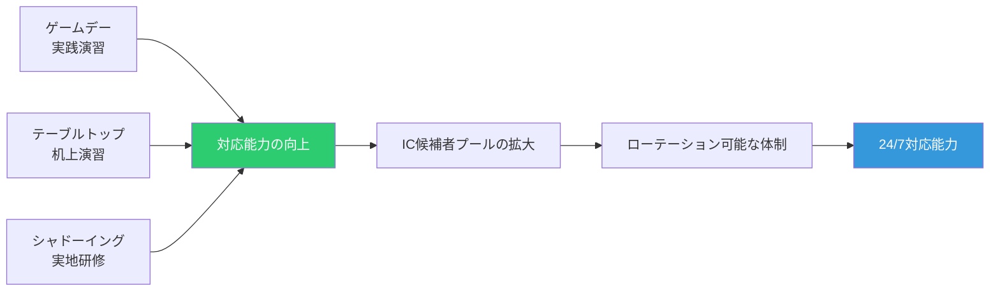

## 4. ポストモーテムの書き方

ポストモーテム（Postmortem）は、インシデントから組織として学びを得るための構造化された文書である。「ポストモーテム」という言葉は医学における「死後検査」に由来するが、ソフトウェアの文脈では「インシデントの事後分析」を意味する。

### 4.1 ポストモーテムの目的

ポストモーテムの目的は、以下の3点に集約される。

1. **何が起きたかを正確に記録する**: 組織の知識として、インシデントの詳細を残す
2. **なぜ起きたかを分析する**: 表面的な原因だけでなく、根本原因（Root Cause）を特定する
3. **再発を防止する**: 具体的かつ追跡可能なアクションアイテムを策定する

::: warning 注意: ポストモーテムの目的は「犯人探し」ではない
ポストモーテムは、誰かの責任を追及するための文書ではない。これについては第5節「非難なき文化」で詳しく述べる。
:::

### 4.2 ポストモーテムのテンプレート

以下は、広く使われているポストモーテムのテンプレートである。Googleの SRE 本やPagerDutyのインシデントレスポンスドキュメントを参考にしている。

```markdown
# ポストモーテム: [インシデントのタイトル]

## 概要
- **日時**: YYYY-MM-DD HH:MM ~ HH:MM (JST)
- **重要度**: SEV-1 / SEV-2 / SEV-3
- **影響**: [影響を受けたサービス、ユーザー数、期間]
- **Incident Commander**: [名前]
- **作成者**: [名前]
- **ステータス**: Draft / Under Review / Approved

## サマリー
[2-3文でインシデントの概要を説明]

## 影響
- ユーザー影響: [具体的な数値]
- 売上影響: [推定値]
- SLA影響: [エラーバジェットの消費量]

## タイムライン
| 時刻 (JST) | イベント |
|-------------|----------|
| 14:00 | デプロイ実施 |
| 14:15 | エラー率の上昇をモニタリングが検知 |
| 14:20 | オンコールエンジニアに通知 |
| 14:25 | Incident Commander任命、対応開始 |
| ...   | ... |
| 15:45 | 復旧確認、インシデントクローズ |

## 根本原因分析
[根本原因の詳細な分析]

## 5 Whys 分析
[後述]

## うまくいったこと
- [対応プロセスで効果的だったこと]

## うまくいかなかったこと
- [改善すべき点]

## 幸運だったこと
- [たまたま被害が軽減された要因]

## アクションアイテム
| # | アクション | 担当 | 期限 | チケット |
|---|-----------|------|------|---------|
| 1 | [具体的なアクション] | [名前] | YYYY-MM-DD | JIRA-XXX |
```

### 4.3 タイムラインの記録

タイムラインは、ポストモーテムの中で最も客観的かつ重要な部分である。「何が」「いつ」起きたかを正確に記録することで、対応プロセスの改善点を特定できる。

#### タイムラインの記録のポイント

- **正確な時刻**: 曖昧な「その後」ではなく、分単位の正確な時刻を記録する
- **自動収集**: チャットのログ、アラートの発火時刻、デプロイの履歴など、自動的に記録されるデータを最大限活用する
- **主観を排除**: 「おそらくこの時点で気付いていた」ではなく、実際にアクションを起こした時刻を記録する
- **検知のギャップに注目**: 障害発生時刻と検知時刻の差、検知から対応開始までの差は、改善の重要なヒントとなる

```mermaid
gantt
    title インシデントタイムライン例
    dateFormat HH:mm
    axisFormat %H:%M

    section 障害
    障害発生          :crit, fault, 14:00, 15min
    影響拡大          :crit, spread, 14:15, 30min

    section 検知
    アラート発火       :active, alert, 14:15, 5min
    オンコール通知     :active, notify, 14:20, 5min

    section 対応
    IC任命・調査開始   :ic, 14:25, 20min
    原因特定          :identify, 14:45, 15min
    緩和策実施         :mitigate, 15:00, 30min

    section 復旧
    復旧確認          :done, recover, 15:30, 15min
```

### 4.4 根本原因分析

根本原因分析（Root Cause Analysis, RCA）は、インシデントの表面的な原因の背後にある、より深い構造的原因を特定するプロセスである。

#### 5 Whys（5回のなぜ）

5 Whysは、トヨタ生産方式に由来するシンプルだが強力な分析手法である。問題に対して「なぜ?」を繰り返すことで、表面的な原因から根本原因に到達する。

以下に、具体的な5 Whys分析の例を示す。

```
インシデント: 本番データベースが過負荷となり、サービスが30分間停止した

Why 1: なぜデータベースが過負荷になったのか?
→ 特定のクエリが全テーブルスキャンを行い、CPUとI/Oを消費した

Why 2: なぜ全テーブルスキャンが発生したのか?
→ 新しくデプロイされた機能で、インデックスが存在しないカラムに対して
  WHERE句を使ったクエリが実行された

Why 3: なぜインデックスの不足に気付かなかったのか?
→ コードレビューでクエリのパフォーマンスが確認されなかった。
  また、ステージング環境のデータ量が少なく、全テーブルスキャンでも
  高速に完了したため、問題が顕在化しなかった

Why 4: なぜステージング環境のデータ量が本番と乖離していたのか?
→ ステージング環境にテストデータを投入する仕組みがなく、
  数十件程度のデータしか存在しなかった

Why 5: なぜテストデータ投入の仕組みが整備されていなかったのか?
→ 環境整備のタスクが優先度低として積み残されていた。
  パフォーマンステストの重要性が組織として認識されていなかった

根本原因: ステージング環境と本番環境のデータ量の乖離を解消する仕組みがなく、
パフォーマンスに関する問題がデプロイ前に検出できない構造になっていた。
```

::: details 5 Whysの注意点
5 Whysは便利なツールだが、いくつかの限界がある。

- **「5回」は目安であり規則ではない**: 3回で根本原因に到達することもあれば、7回必要なこともある
- **単一の根本原因に固執しない**: 多くのインシデントには複数の寄与要因がある。5 Whysを複数の分岐で行うことで、複数の根本原因を特定できる
- **人的ミスを根本原因としない**: 「エンジニアが間違えた」で分析を止めてはならない。なぜ間違いやすい状況だったのか、なぜ間違いを防ぐ仕組みがなかったのかを問うべきである
:::

#### 寄与要因（Contributing Factors）

現実のインシデントは、単一の原因で発生することは稀である。複数の要因が組み合わさることで、インシデントに至る。これらを「寄与要因」として整理することが重要である。

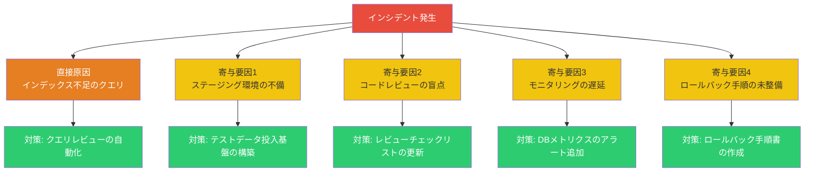

### 4.5 アクションアイテムの策定

ポストモーテムの価値は、最終的にはアクションアイテムが実行されるかどうかで決まる。分析がいかに優れていても、具体的な改善が実施されなければ、ポストモーテムは単なる文書で終わる。

#### 良いアクションアイテムの条件

- **具体的である**: 「モニタリングを改善する」ではなく、「DBの接続プール使用率が80%を超えた場合にアラートを発火するよう設定する」
- **担当者が明確である**: 「チームで対応」ではなく、具体的な個人名
- **期限がある**: 「なるべく早く」ではなく、具体的な日付
- **追跡可能である**: JIRAやLinearなどのプロジェクト管理ツールにチケットが作成されている
- **検証可能である**: 完了したかどうかを客観的に判断できる

#### アクションアイテムの分類

アクションアイテムは以下の3カテゴリに分類すると管理しやすい。

| カテゴリ | 説明 | 例 |
|---------|------|-----|
| **検知の改善** | 同種のインシデントをより早く検知するための施策 | アラートの追加、ダッシュボードの作成 |
| **予防の強化** | 同種のインシデントの再発を防ぐための施策 | コードの修正、テストの追加、設計の改善 |
| **対応の効率化** | インシデント対応プロセス自体の改善 | ランブックの作成、ロールバック手順の整備 |

## 5. 非難なき文化（Blameless Culture）

### 5.1 なぜ「非難なき文化」が重要なのか

インシデント管理における最も重要な文化的基盤が、**非難なき文化（Blameless Culture）** である。これは、インシデントの原因を個人の過失に帰属させるのではなく、システムやプロセスの問題として捉える組織文化を指す。

非難なき文化が重要な理由は、人間の心理とシステムの複雑性に根ざしている。

**心理的安全性の確保**: エンジニアが「自分の操作がインシデントの引き金になった」と報告したとき、それが処罰につながるなら、人は問題を隠すようになる。問題が隠蔽されれば、組織は学ぶ機会を失い、同じ障害が繰り返される。

**複雑系における因果関係**: 現代のソフトウェアシステムは極めて複雑であり、一つの操作がインシデントの「原因」であるように見えても、実際には多くのシステム的な要因が重なっている。デプロイ操作がインシデントの引き金になったとしても、問うべきは「なぜその操作が安全にできない状態だったのか」である。

**ヒューマンファクターの理解**: 人間はミスをする。これは個人の能力の問題ではなく、人間という存在の本質的な特性である。優秀なエンジニアでもミスをするし、むしろ積極的に変更を行う優秀なエンジニアほど、インシデントの引き金を引く確率は高い。システム設計は、人間のミスを前提として、ミスが致命的な結果に至らないように構築されるべきである。

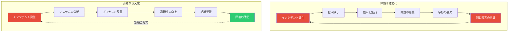

### 5.2 非難なき文化の実践

非難なき文化は、スローガンだけでは実現できない。具体的な制度と行動様式として組み込む必要がある。

#### ポストモーテムでの言語規範

- **使うべき表現**: 「システムがこの状態を許容した」「プロセスがこのエラーを防がなかった」
- **避けるべき表現**: 「Aさんがミスをした」「Bさんの確認が不十分だった」

これは責任を曖昧にすることではない。事実として誰がどの操作を行ったかはタイムラインに記録される。しかし、分析の焦点は「なぜシステムやプロセスがそのミスを防げなかったか」に置かれるべきである。

#### Just Culture（公正な文化）

非難なき文化は「何をしても許される」という意味ではない。Sidney Dekkerの提唱する「Just Culture」の概念では、以下のように区別する。

- **人間のエラー**: 意図せず起こしたミス → システムの改善で対応
- **リスクのある行動**: 近道や手順の省略を意識的に行った → なぜそのような行動が合理的だったかを分析
- **意図的な逸脱**: 悪意を持って規則に違反した → 懲戒の対象

ほとんどのインシデントは最初の2つに分類され、3つ目は極めて稀である。重要なのは、2つ目の「リスクのある行動」に対しても、まずは「なぜそうせざるを得なかったのか」を問うことである。

### 5.3 非難なき文化を支える具体的な仕組み

- **ポストモーテムの公開**: ポストモーテムを組織全体に公開することで、透明性を確保する。Googleやetc.dでは、全社員がすべてのポストモーテムを閲覧できる
- **ポストモーテムの読書会**: 定期的にポストモーテムを読み合い、学びを共有する場を設ける
- **ポストモーテムの品質レビュー**: ポストモーテムが「非難なき」原則に則っているかをレビューするプロセスを設ける
- **経営層のコミットメント**: リーダーが率先して非難なき文化を実践し、インシデントを「学びの機会」として位置づける姿勢を示す

::: tip 重要な洞察
航空業界のインシデント報告制度（Aviation Safety Reporting System）が長年成功しているのは、報告者が処罰されないという明確な保証があるからである。これにより、パイロットは自らのミスやニアミスを積極的に報告し、業界全体の安全性向上に貢献している。ソフトウェア業界も同じ原則から学ぶべきである。
:::

## 6. インシデント管理ツール

インシデント管理プロセスを支えるツールは、大きく以下のカテゴリに分類できる。

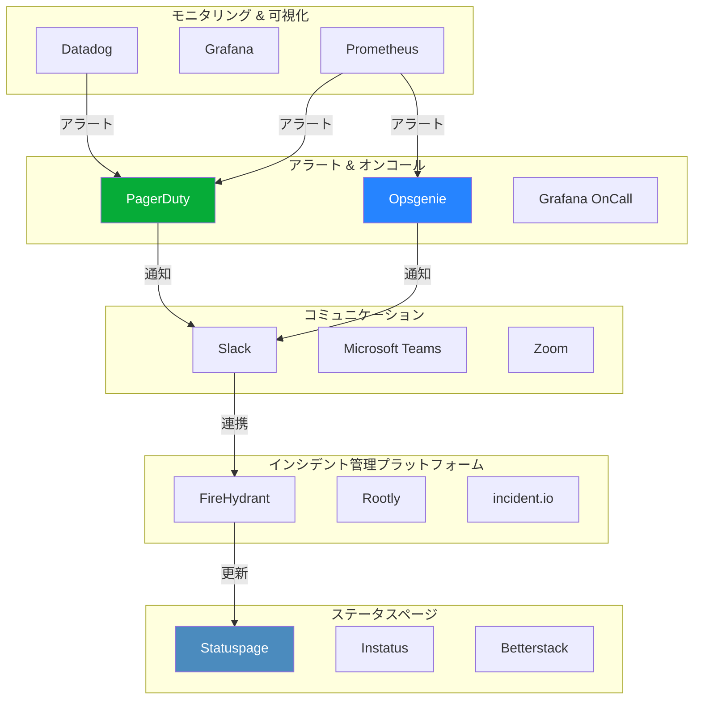

### 6.1 PagerDuty

PagerDutyは、インシデント管理の分野で最も広く使われているプラットフォームの一つである。2009年に設立され、アラートのルーティング、オンコールスケジュール管理、エスカレーションポリシーを中心とした機能を提供する。

#### 主要機能

- **オンコールスケジュール**: 誰がいつオンコール担当かを管理し、アラートを適切な人物にルーティングする
- **エスカレーションポリシー**: 一定時間内に応答がない場合、次のレベルの担当者に自動エスカレーションする
- **イベントインテリジェンス**: 大量のアラートをグルーピングし、ノイズを削減する（AIOpsの一種）
- **インシデントワークフロー**: インシデントの宣言からポストモーテムまでの一連のプロセスを管理する

```yaml
# Example: PagerDuty escalation policy (conceptual)
escalation_policy:
  name: "Backend Service"
  rules:
    - escalation_delay_in_minutes: 5
      targets:
        - type: "schedule_reference"
          id: "primary-oncall"    # Primary on-call engineer
    - escalation_delay_in_minutes: 15
      targets:
        - type: "schedule_reference"
          id: "secondary-oncall"  # Secondary on-call engineer
    - escalation_delay_in_minutes: 30
      targets:
        - type: "user_reference"
          id: "engineering-manager"  # Engineering manager
```

### 6.2 Opsgenie

Opsgenieは、Atlassian（Jira、Confluenceの開発元）が提供するアラート管理・オンコール管理ツールである。Atlassianエコシステムとの統合が強みであり、Jiraとの連携によるインシデントチケットの自動生成などが可能である。

#### PagerDutyとの比較

| 機能 | PagerDuty | Opsgenie |
|------|-----------|----------|
| オンコール管理 | 非常に充実 | 充実 |
| エスカレーション | 柔軟 | 柔軟 |
| Atlassian連携 | サードパーティ | ネイティブ |
| AIOps機能 | 充実（Event Intelligence） | 基本的 |
| 価格帯 | 高め | 中程度 |
| 独立性 | スタンドアロン | Atlassianエコシステム前提 |

### 6.3 Statuspage

Statuspage（Atlassian提供）は、サービスの稼働状況をユーザーに公開するためのツールである。インシデント発生時に、ユーザーが自ら状況を確認できる場を提供することで、カスタマーサポートへの問い合わせを削減し、ユーザーの信頼を維持する。

#### ステータスページの重要性

ステータスページは、インシデント対応においてしばしば見過ごされるが、ユーザー体験の観点からは非常に重要なコンポーネントである。

- **透明性**: ユーザーに対して障害の存在を隠さず、進捗を共有する
- **信頼の構築**: 正直な情報公開は、長期的にはユーザーの信頼を高める
- **サポート負荷の軽減**: ユーザーが自ら状況を確認できることで、問い合わせが減少する

### 6.4 統合インシデント管理プラットフォーム

近年では、アラート管理、コミュニケーション、ステータスページ、ポストモーテムを統合的に管理するプラットフォームが登場している。

- **FireHydrant**: Slackをベースとしたインシデント管理。インシデントの宣言から対応、ポストモーテムまでをSlack上で完結できる
- **Rootly**: 同様にSlackベースのインシデント管理だが、自動化ワークフローが充実している
- **incident.io**: インシデントの宣言、役割のアサイン、ステータス更新、ポストモーテムの作成をSlack内で行える

これらのツールに共通する設計思想は、**「エンジニアが普段使っているコミュニケーションツール（Slack）から離れずにインシデント管理を行う」** ということである。専用のダッシュボードに移動する手間を省くことで、対応速度を向上させる。

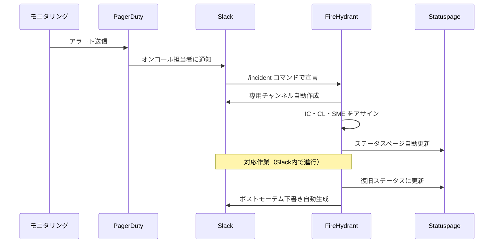

## 7. インシデントの分類と重要度設定

### 7.1 なぜ分類が必要か

すべてのインシデントに同じレベルの対応体制を敷くことは、リソースの浪費である。軽微なバグと全面的なサービス停止では、必要な対応の規模も速度も異なる。インシデントの重要度を事前に定義し、それぞれに対応するプロセスを決めておくことで、適切なリソース配分が可能になる。

### 7.2 重要度レベルの定義

多くの組織では、3〜5段階の重要度レベル（Severity Level）を定義している。以下は一般的な4段階の定義例である。

| レベル | 名称 | 定義 | 対応体制 | 目標応答時間 |
|--------|------|------|----------|-------------|
| **SEV-1** | Critical | サービス全面停止。全ユーザーに影響。収益損失が発生 | 全社対応。経営層にエスカレーション | 15分以内 |
| **SEV-2** | Major | サービスの主要機能に障害。多数のユーザーに影響 | 関係チーム招集。IC任命 | 30分以内 |
| **SEV-3** | Minor | サービスの一部機能に障害。限定的なユーザー影響 | 担当チーム内で対応 | 4時間以内 |
| **SEV-4** | Low | 軽微な問題。ユーザー影響はほぼなし | 通常の業務時間内に対応 | 1営業日以内 |

### 7.3 分類の判断基準

重要度の判断は、以下の軸で行う。

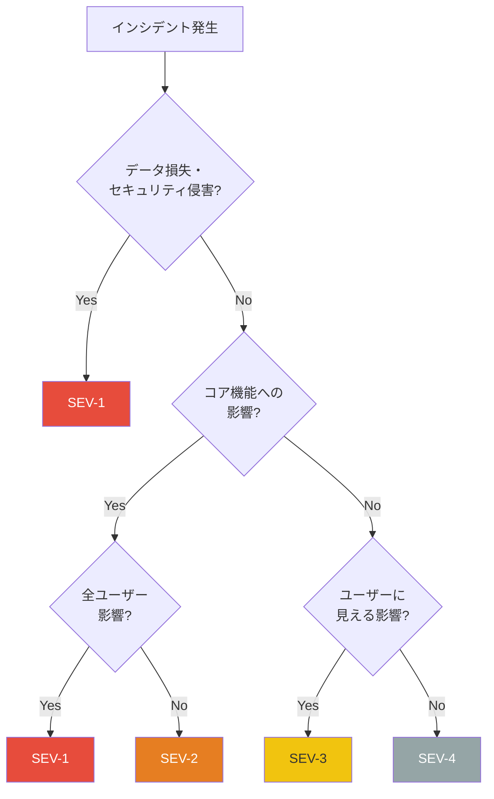

#### 分類のガイドライン

- **過小評価より過大評価を**: 判断に迷ったら、重要度を高く設定する。SEV-3をSEV-2として対応しても、逆よりもはるかに害が少ない
- **エスカレーションは恥ではない**: 重要度の引き上げ（エスカレーション）は正常なプロセスであり、むしろ推奨される
- **デエスカレーションも忘れずに**: 調査の結果、影響が想定より小さかった場合は、速やかに重要度を引き下げる

### 7.4 インシデントの分類タクソノミー

重要度だけでなく、インシデントの種類（カテゴリ）を定義しておくと、パターン分析に役立つ。

| カテゴリ | 説明 | 例 |
|---------|------|-----|
| **インフラ** | ハードウェア、クラウド基盤、ネットワークの問題 | AWSリージョン障害、ディスク故障 |
| **デプロイ** | コードのデプロイに起因する問題 | バグの混入、設定ミス |
| **依存サービス** | 外部サービスの障害に起因する問題 | 決済プロバイダーのダウン |
| **トラフィック** | 予期しない負荷に起因する問題 | バイラルコンテンツ、DDoS |
| **データ** | データの破損、不整合に関する問題 | マイグレーション失敗 |
| **セキュリティ** | セキュリティインシデント | 不正アクセス、データ漏洩 |
| **設定** | 設定変更に起因する問題 | DNS設定ミス、証明書期限切れ |

この分類を蓄積することで、「デプロイに起因するインシデントが全体の40%を占めている」といった傾向分析が可能になり、戦略的な改善投資の判断材料となる。

## 8. 継続的な改善

### 8.1 メトリクスによる改善の追跡

インシデント管理の成熟度を測り、改善の進捗を追跡するためには、定量的なメトリクスが不可欠である。

#### DORA Four Keys との関連

DORA（DevOps Research and Assessment）が提唱する Four Keys メトリクスのうち、インシデント管理に直接関連するのは以下の2つである。

- **MTTR（Mean Time to Recovery / Restore）**: サービス障害からの平均復旧時間。短いほどよい
- **変更障害率（Change Failure Rate）**: デプロイのうち、障害を引き起こした割合。低いほどよい

#### インシデント管理固有のメトリクス

DORA Four Keysに加えて、インシデント管理プロセス自体を評価するメトリクスも重要である。

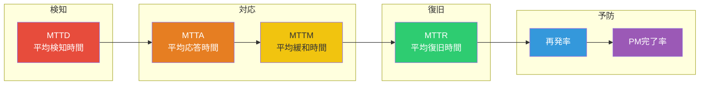

| メトリクス | 説明 | 改善の方向 |
|-----------|------|-----------|
| **MTTD** | 障害発生から検知までの時間 | モニタリングの改善、SLIアラートの最適化 |
| **MTTA** | 検知からオンコール担当者の応答までの時間 | オンコールプロセスの改善、通知手段の最適化 |
| **MTTM** | 応答から影響緩和までの時間 | ランブックの整備、自動緩和策の導入 |
| **MTTR** | 障害発生から完全復旧までの時間 | すべてのフェーズの総合的な改善 |
| **再発率** | 同種のインシデントが再発した割合 | ポストモーテムアクションアイテムの実行率向上 |
| **PM完了率** | ポストモーテムのアクションアイテムが期限内に完了した割合 | アクションアイテムの追跡プロセスの強化 |

### 8.2 ポストモーテムアクションアイテムの追跡

ポストモーテムで策定されたアクションアイテムが実行されなければ、同じインシデントが再発する。多くの組織が陥る罠は、ポストモーテムを書くことが目的化し、アクションアイテムのフォローアップが疎かになることである。

#### 追跡の仕組み

- **プロジェクト管理ツールとの統合**: アクションアイテムをJIRAやLinearのチケットとして自動的に作成する
- **定期レビュー**: 週次または隔週でアクションアイテムの進捗をレビューする会議を設ける
- **期限の厳守**: 期限を過ぎたアクションアイテムは、その理由とともに経営層にエスカレーションする
- **メトリクスの可視化**: アクションアイテムの完了率をダッシュボードで可視化し、組織全体で意識する

```python
# Example: Action item tracking report
from dataclasses import dataclass
from datetime import date, timedelta
from enum import Enum
from typing import List


class ActionStatus(Enum):
    OPEN = "open"
    IN_PROGRESS = "in_progress"
    COMPLETED = "completed"
    OVERDUE = "overdue"


@dataclass
class ActionItem:
    id: str
    description: str
    owner: str
    due_date: date
    status: ActionStatus
    incident_id: str


def generate_tracking_report(items: List[ActionItem]) -> dict:
    """Generate a summary report of postmortem action items."""
    today = date.today()

    # Classify items by status
    total = len(items)
    completed = sum(1 for i in items if i.status == ActionStatus.COMPLETED)
    overdue = sum(
        1
        for i in items
        if i.due_date < today and i.status != ActionStatus.COMPLETED
    )
    in_progress = sum(
        1 for i in items if i.status == ActionStatus.IN_PROGRESS
    )

    return {
        "total": total,
        "completed": completed,
        "completion_rate": completed / total if total > 0 else 0,
        "overdue": overdue,
        "in_progress": in_progress,
        "overdue_items": [
            {"id": i.id, "description": i.description, "owner": i.owner}
            for i in items
            if i.due_date < today and i.status != ActionStatus.COMPLETED
        ],
    }
```

### 8.3 インシデントレビュー会議

多くの成熟した組織では、定期的なインシデントレビュー会議を開催している。

#### 週次インシデントレビュー

- **参加者**: エンジニアリングリーダー、SREチーム、関係するプロダクトマネージャー
- **内容**: 過去1週間のインシデントの概要レビュー、パターンの特定、アクションアイテムの進捗確認
- **所要時間**: 30〜60分

#### 月次インシデントトレンド分析

- **参加者**: エンジニアリング部門全体
- **内容**: インシデントの傾向分析（カテゴリ別、チーム別、重要度別）、メトリクスの推移、長期的な改善施策の議論
- **所要時間**: 60〜90分

### 8.4 ランブック（Runbook）の整備

ランブックとは、特定のインシデントに対する対応手順を文書化したものである。ランブックが整備されていれば、経験の浅いエンジニアでも一定の品質で対応できる。

#### ランブックの構成例

```markdown
# ランブック: データベース接続プール枯渇

## 概要
データベースの接続プールが枯渇し、新しい接続を確立できなくなる障害。
アプリケーションからのリクエストがタイムアウトする。

## 検知
- アラート: `db_connection_pool_exhausted`
- メトリクス: `db_active_connections / db_max_connections > 0.9`

## 初期診断
1. 接続数の確認
   ```sql
   SELECT count(*) FROM pg_stat_activity;
   ```
2. 長時間実行クエリの確認
   ```sql
   SELECT pid, now() - pg_stat_activity.query_start AS duration, query
   FROM pg_stat_activity
   WHERE state != 'idle'
   ORDER BY duration DESC
   LIMIT 10;
   ```

## 緩和策
1. 長時間実行クエリの強制終了
   ```sql
   SELECT pg_terminate_backend(<pid>);
   ```
2. 接続プールサイズの一時的な拡大
3. 問題のあるサービスのトラフィック制限

## エスカレーション
上記で解決しない場合、DBチームのオンコールにエスカレーション。
```

### 8.5 カオスエンジニアリングとの連携

カオスエンジニアリング（Chaos Engineering）は、本番環境に意図的に障害を注入し、システムの耐障害性を検証する手法である。Netflixが開発したChaos Monkeyが有名である。

カオスエンジニアリングは、インシデント管理の改善に以下のように貢献する。

- **検知能力の検証**: 注入した障害をモニタリングが正しく検知できるか
- **対応プロセスの訓練**: 実際の障害に近い状況で、インシデント対応プロセスを演習できる
- **システムの弱点の発見**: 想定外の障害パターンや、カスケード障害の可能性を事前に特定できる

::: tip カオスエンジニアリングの原則
カオスエンジニアリングは「本番環境を壊す」ことではない。制御された実験として計画的に実施し、影響範囲を限定し、いつでも中止できる状態で行う。「定常状態の仮説を立て、実験で検証する」という科学的なアプローチが本質である。
:::

### 8.6 組織の成熟度モデル

インシデント管理の成熟度は、段階的に向上していくものである。以下は、一般的な成熟度モデルである。

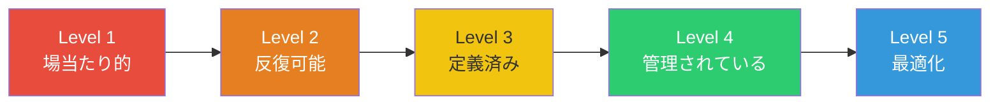

| レベル | 特徴 |
|--------|------|
| **Level 1: 場当たり的** | インシデント対応のプロセスが定義されていない。対応は属人的で、結果は担当者のスキルに依存する |
| **Level 2: 反復可能** | 基本的なオンコール体制とエスカレーションが存在する。ポストモーテムは書かれるが、不定期 |
| **Level 3: 定義済み** | インシデント対応プロセスが文書化されている。役割が定義され、ポストモーテムが定常的に実施される |
| **Level 4: 管理されている** | メトリクスによる定量的な管理が行われている。アクションアイテムの追跡が体系化されている |
| **Level 5: 最適化** | カオスエンジニアリングによる予防的な検証、自動緩和策の導入、組織全体での学習文化が確立されている |

### 8.7 インシデント管理の反パターン

最後に、インシデント管理でよく見られる反パターン（アンチパターン）を整理する。

::: danger 避けるべき反パターン
- **ヒーロー文化**: 特定の「ヒーロー」エンジニアに障害対応を依存する。短期的には機能するが、バーンアウトと単一障害点のリスクを生む
- **ポストモーテムの形骸化**: テンプレートを埋めるだけで、真の分析を行わない。アクションアイテムが策定されても実行されない
- **過剰なプロセス**: あらゆるインシデントに同じ重量級プロセスを適用する。SEV-4のインシデントにSEV-1の対応体制は不要である
- **メトリクスの悪用**: MTTRなどのメトリクスを個人やチームの評価に使う。メトリクスがゲーミングの対象となり、本来の改善目的を失う
- **復旧後の忘却**: インシデントから復旧した安堵感で、ポストモーテムやアクションアイテムの実行が後回しになる
:::

## まとめ

インシデント管理は、現代のソフトウェアエンジニアリングにおいて不可欠なプラクティスである。その本質は、以下の3点に集約される。

1. **障害は不可避であるという前提に立つ**: 完璧なシステムは存在しない。重要なのは、障害が起きたときにいかに迅速かつ体系的に対応し、影響を最小化するかである

2. **プロセスと役割を事前に定義する**: カオスの中で「何をすべきか」を議論している時間はない。検知からポストモーテムまでのプロセスと、IC・CL・SMEの役割を事前に定義し、訓練しておくことが、対応品質を決定する

3. **学びの文化を構築する**: 非難なき文化のもとでポストモーテムを実施し、アクションアイテムを確実に実行することで、組織は障害から学び続ける。この継続的な学習サイクルこそが、長期的な信頼性向上の源泉である

インシデント管理の成熟度は一朝一夕には高まらない。しかし、小さな改善を積み重ねることで、組織はより回復力のある（Resilient）システムと文化を構築できる。最初のステップは、オンコール体制の整備とポストモーテムの習慣化である。完璧を目指すのではなく、今日より明日のインシデント対応を少しでも良くすること——その積み重ねが、信頼性の高いサービスを生み出す。
