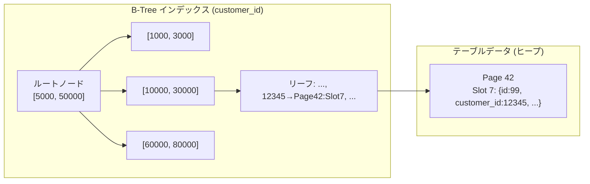
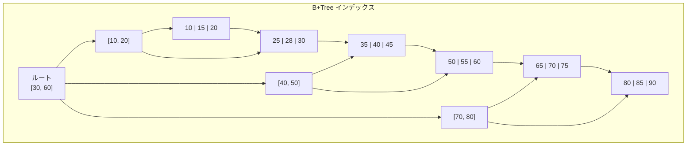
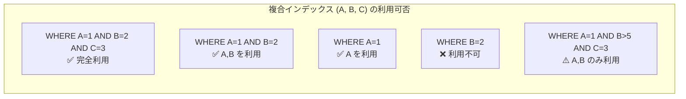
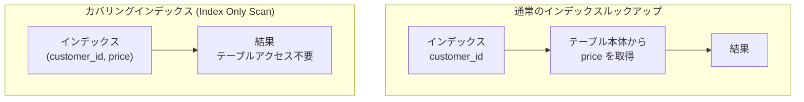
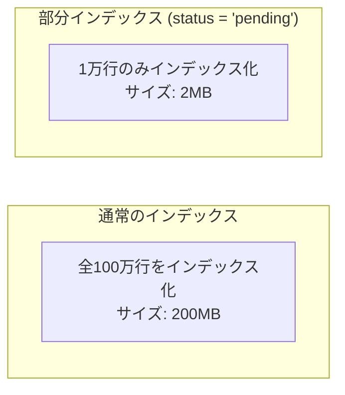
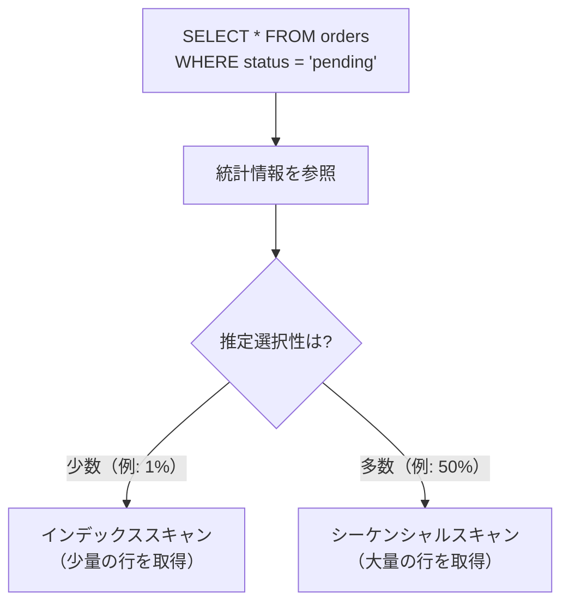
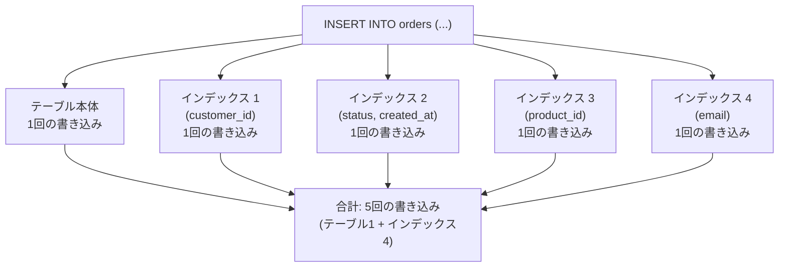
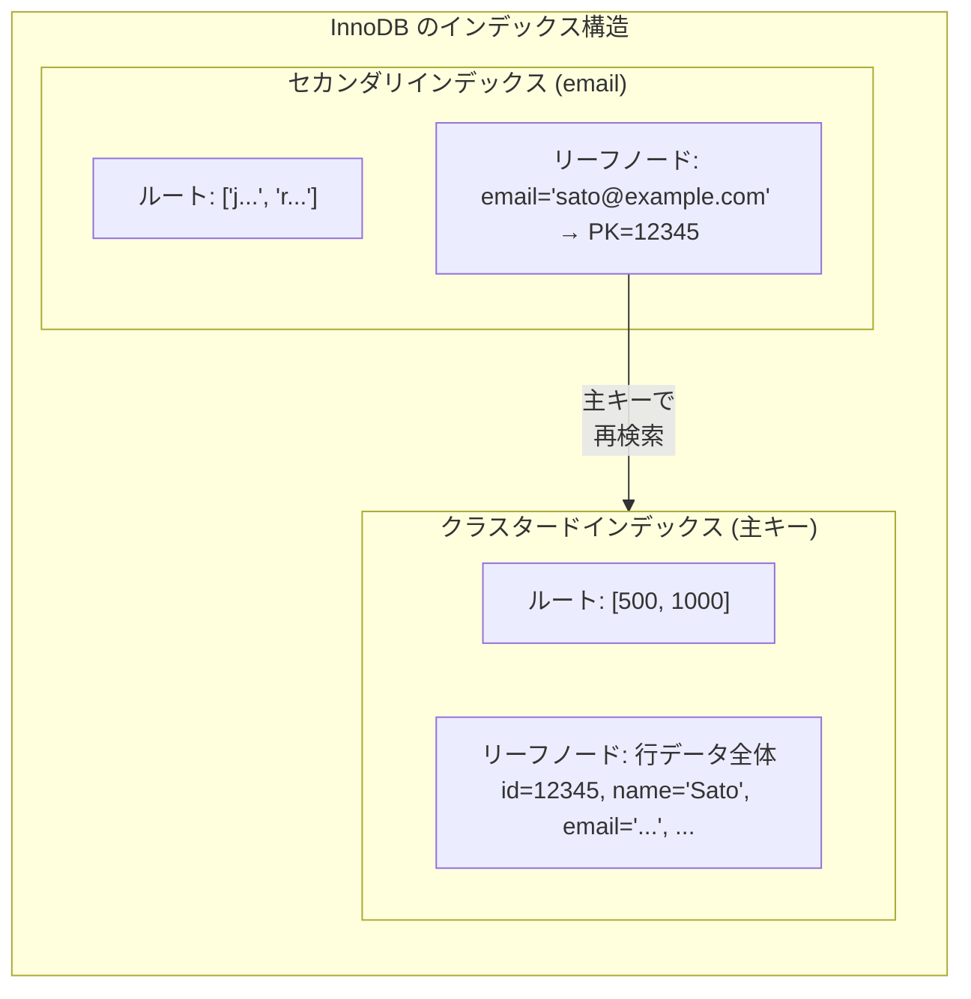
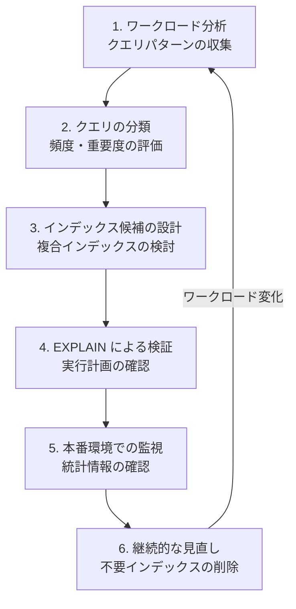

# インデックス設計戦略 — 効率的なデータアクセスを実現する設計指針

## 1. インデックスの基本概念と必要性

### 1.1 なぜインデックスが必要か

リレーショナルデータベースにおいて、テーブルに格納された数百万行、数億行のデータから特定の行を高速に検索することは、アプリケーションの応答性能を左右する根幹的な課題である。インデックスが存在しないテーブルに対するクエリは、テーブル全体を走査する**フルテーブルスキャン（Full Table Scan）**を強いられ、テーブルのサイズに比例して応答時間が劣化する。

たとえば、100万行の `orders` テーブルから特定の顧客の注文を検索するケースを考えよう。

```sql
SELECT * FROM orders WHERE customer_id = 12345;
```

インデックスがなければ、データベースは100万行すべてを読み取って条件に一致する行を探さなければならない。一方、`customer_id` にインデックスが存在すれば、B-Treeの構造を使って $O(\log n)$ の計算量で目的の行に到達できる。100万行のテーブルでは、フルスキャンが数千ページの読み取りを要するのに対し、B-Treeインデックスではわずか3〜4回のディスクI/Oで済む。

```
フルテーブルスキャン: 100万行 → 数千ページのI/O → 数百ms〜数秒
インデックスルックアップ:  B-Tree高さ3〜4 → 3〜4ページのI/O → 数ms以下
```

この桁違いの性能差が、インデックスがデータベースの性能チューニングにおいて最も重要な要素である理由だ。

### 1.2 インデックスの基本的な動作原理

インデックスとは、テーブル本体のデータとは別に作成される**補助的なデータ構造**であり、特定のカラム（または複数のカラムの組み合わせ）の値から、その値を含む行のディスク上の物理位置（ページ番号やオフセット）へのマッピングを提供する。



インデックスは「本の巻末の索引」に相当する。本文を最初から最後まで読む代わりに、索引でキーワードのページ番号を調べ、直接そのページを開く。データベースインデックスもまったく同じ原理で動作する。

### 1.3 インデックスのトレードオフ

インデックスは万能ではない。インデックスを作成するということは、以下のコストを支払うということである。

| 利点 | コスト |
|---|---|
| `SELECT` クエリの高速化 | インデックス自体がディスク容量を消費する |
| ソート処理の回避 | `INSERT` / `UPDATE` / `DELETE` 時にインデックスの更新が必要 |
| 一意性制約の効率的な検証 | インデックスが多すぎるとオプティマイザの判断が複雑化 |
| 結合処理の効率化 | 統計情報の更新・メンテナンスが必要 |

インデックス設計の本質は、**読み取り性能の向上**と**書き込み性能の劣化・ストレージ消費**のトレードオフを、ワークロードの特性に応じて最適化することにある。

## 2. B-Treeインデックスとハッシュインデックス

### 2.1 B-Treeインデックス

B-Tree（特にB+Tree）は、事実上すべての主要なRDBMSでデフォルトのインデックス構造として採用されている。PostgreSQL、MySQL（InnoDB）、SQL Server、Oracleのいずれにおいても、`CREATE INDEX` を実行すればB+Treeインデックスが作成される。

B+Treeインデックスの最大の特徴は、以下のすべての操作を効率的にサポートできる**汎用性**にある。

- **等価検索**: `WHERE col = value`
- **範囲検索**: `WHERE col BETWEEN a AND b`、`WHERE col > a`
- **プレフィックス検索**: `WHERE col LIKE 'abc%'`
- **ORDER BY の最適化**: インデックスのキー順序がソート要件と一致する場合、追加のソート処理が不要
- **MIN / MAX の高速取得**: リーフノードの先頭・末尾を参照するだけで済む



B+Treeの重要な性質として、リーフノードが双方向リンクリストで連結されている点がある。これにより、範囲検索では開始キーのリーフノードを見つけた後、リンクリストをたどるだけで連続するキーを効率的に取得できる。

### 2.2 ハッシュインデックス

ハッシュインデックスは、ハッシュ関数を用いてキー値をバケットにマッピングする構造である。等価検索においては理論上 $O(1)$ の計算量を達成でき、B-Treeの $O(\log n)$ を上回る。


しかし、ハッシュインデックスには致命的な制約がある。

| 操作 | B-Tree | ハッシュ |
|---|---|---|
| 等価検索 `= value` | $O(\log n)$ | $O(1)$ |
| 範囲検索 `BETWEEN a AND b` | $O(\log n + k)$ | 不可能（フルスキャン） |
| 並べ替え `ORDER BY` | インデックス順序で返却可能 | 不可能 |
| プレフィックス検索 `LIKE 'abc%'` | 可能 | 不可能 |
| 部分一致 `LIKE '%abc%'` | 不可能 | 不可能 |

範囲検索やソートが一切不要で、純粋に等価検索のみを行うワークロードではハッシュインデックスが有利だが、実際のアプリケーションでは範囲検索やソートの要件がほぼ必ず存在するため、B-Treeが圧倒的に広く使われている。

各DBMSにおけるハッシュインデックスの状況は以下の通りである。

- **PostgreSQL**: ハッシュインデックスをサポート。PostgreSQL 10以降ではWAL対応となりクラッシュセーフになったが、等価検索のみのサポートという制約は変わらない
- **MySQL（InnoDB）**: B+Treeのみ。ただし**Adaptive Hash Index**という仕組みがあり、頻繁にアクセスされるインデックスページに対してハッシュテーブルを自動的に構築する
- **SQL Server**: B-Treeが標準。In-Memory OLTP（Hekaton）ではハッシュインデックスをサポート

### 2.3 いつハッシュインデックスを選択すべきか

ハッシュインデックスの適用場面は限定的であるが、以下のようなケースでは効果を発揮する。

1. **キャッシュのようなキーバリュー参照**: 主キーによる等価検索が圧倒的に多いテーブル
2. **セッション管理テーブル**: セッションIDによるルックアップが99%のアクセスパターン
3. **メモリ最適化テーブル**: SQL ServerのIn-Memory OLTPなど、メモリ上で動作するテーブル

実際の設計においては、まずB-Treeインデックスで要件を満たせるかを検討し、等価検索のみのワークロードかつ性能要件が極めて厳しい場合にのみハッシュインデックスを検討するのが定石である。

## 3. 複合インデックスとカバリングインデックス

### 3.1 複合インデックス（Composite Index）

複合インデックスは、2つ以上のカラムを組み合わせた単一のインデックスである。複合インデックスの設計はインデックス戦略の中で最も重要かつ最も奥が深いテーマの一つだ。

```sql
-- composite index on (country, city, last_name)
CREATE INDEX idx_address ON customers (country, city, last_name);
```

このインデックスは、キーを `(country, city, last_name)` の順序で連結した値でソートされたB+Treeを構築する。これは電話帳の構造に似ている。電話帳はまず都道府県で分類され、次に市区町村、最後に名前で並んでいる。

```
インデックスのリーフノードの並び順:
('Japan', 'Osaka',  'Tanaka')
('Japan', 'Tokyo',  'Sato')
('Japan', 'Tokyo',  'Suzuki')
('Japan', 'Tokyo',  'Yamada')
('US',    'LA',     'Johnson')
('US',    'LA',     'Smith')
('US',    'NYC',    'Brown')
('US',    'NYC',    'Williams')
```

### 3.2 複合インデックスのプレフィックスルール

複合インデックスが効果を発揮するには、**最左プレフィックスルール（Leftmost Prefix Rule）**を理解することが不可欠である。複合インデックス `(A, B, C)` は、以下のクエリパターンに対して有効に機能する。

| クエリの WHERE 句 | インデックス利用 | 理由 |
|---|---|---|
| `WHERE A = 1` | 利用可能 | プレフィックス (A) に一致 |
| `WHERE A = 1 AND B = 2` | 利用可能 | プレフィックス (A, B) に一致 |
| `WHERE A = 1 AND B = 2 AND C = 3` | 完全利用 | すべてのカラムを使用 |
| `WHERE A = 1 AND C = 3` | A のみ利用 | B をスキップしているため C は利用不可 |
| `WHERE B = 2` | 利用不可 | 先頭カラム A がない |
| `WHERE B = 2 AND C = 3` | 利用不可 | 先頭カラム A がない |
| `WHERE A = 1 AND B > 5 AND C = 3` | A, B のみ利用 | B が範囲条件のため C は利用不可 |

最後の行は特に重要である。範囲条件が指定されたカラムよりも後ろのカラムはインデックスを利用できない。これは、B+Treeの構造上、範囲条件以降のカラムはソート順が保証されないためである。



### 3.3 カラム順序の設計原則

複合インデックスのカラム順序は性能を大きく左右する。順序を決定する際の基本原則は以下の通りである。

**原則 1: 等価条件のカラムを先に、範囲条件のカラムを後に配置する**

```sql
-- クエリ: WHERE status = 'active' AND created_at > '2025-01-01'
-- 良い設計: 等価条件 → 範囲条件
CREATE INDEX idx_good ON orders (status, created_at);

-- 悪い設計: 範囲条件 → 等価条件（created_at の範囲条件で status が使えない）
CREATE INDEX idx_bad ON orders (created_at, status);
```

**原則 2: 選択性（Selectivity）の高いカラムを先に配置する**

この原則は原則1より優先度が低い。等価条件と範囲条件が混在する場合は原則1が優先される。すべてが等価条件の場合に、選択性の高いカラムを先に置くことでスキャン範囲を早期に絞り込める。

**原則 3: クエリパターンを分析して、最も多くのクエリをカバーするカラム順序を選択する**

複合インデックスはプレフィックスルールに従うため、頻出するクエリパターンを分析し、1つのインデックスで多くのクエリをカバーできる順序を選択することが重要だ。

### 3.4 カバリングインデックス（Covering Index）

カバリングインデックスとは、クエリが必要とするすべてのカラムがインデックスに含まれているため、テーブル本体（ヒープページ）にアクセスする必要がないインデックスのことである。これは**Index Only Scan**とも呼ばれる。

```sql
-- orders テーブル: id, customer_id, product_id, quantity, price, created_at, ...

-- このクエリに対して:
SELECT customer_id, SUM(price)
FROM orders
WHERE customer_id BETWEEN 100 AND 200
GROUP BY customer_id;

-- カバリングインデックス:
CREATE INDEX idx_covering ON orders (customer_id, price);
```

このインデックスには `customer_id` と `price` の両方が含まれているため、テーブル本体にアクセスせずにクエリを完結できる。



カバリングインデックスの効果は劇的であり、テーブル本体へのランダムI/Oを完全に排除できる。特にテーブルのカラム数が多い場合（1行のサイズが大きい場合）、通常のインデックスルックアップではテーブルページの読み取りがボトルネックとなるが、カバリングインデックスではこのコストがゼロになる。

### 3.5 PostgreSQL の INCLUDE 句

PostgreSQL 11以降では `INCLUDE` 句を使って、検索キーではないが結果に含めたいカラムをインデックスに追加できる。

```sql
-- customer_id で検索するが、price と quantity も結果に含めたい
CREATE INDEX idx_orders_covering
ON orders (customer_id) INCLUDE (price, quantity);
```

`INCLUDE` されたカラムはB+Treeの非リーフノードには格納されず、リーフノードにのみ追加される。これにより、インデックスの検索効率を維持しつつ、カバリングインデックスの恩恵を受けられる。`INCLUDE` カラムはソートには使われないため、検索条件には使えない点に注意が必要だ。

## 4. 部分インデックスと関数インデックス

### 4.1 部分インデックス（Partial Index）

部分インデックスは、テーブルの一部の行だけをインデックス化するインデックスである。PostgreSQLでは `CREATE INDEX ... WHERE` 構文でサポートされている。

```sql
-- 未処理の注文のみをインデックス化
CREATE INDEX idx_pending_orders ON orders (created_at)
WHERE status = 'pending';

-- 活動中のユーザーのみをインデックス化
CREATE INDEX idx_active_users ON users (email)
WHERE deleted_at IS NULL;
```

部分インデックスの利点は以下の通りである。

1. **インデックスサイズの削減**: テーブル全体ではなく条件に合致する行のみをインデックス化するため、ストレージ消費量が大幅に減少する
2. **更新コストの削減**: インデックスに含まれる行が少ないため、書き込み時のインデックス更新コストも低下する
3. **検索性能の向上**: インデックスが小さいため、キャッシュに乗りやすく検索も高速になる

典型的な適用場面は、テーブルの大部分が「処理済み」「削除済み」などの静的な状態にあり、アクティブなクエリが対象とするのはごく一部の「未処理」「活動中」のレコードのみ、というケースだ。



この例では、`pending` 状態の注文が全体の1%であれば、部分インデックスのサイズは通常のインデックスの1%程度になる。

### 4.2 関数インデックス（Expression Index / Functional Index）

関数インデックスは、カラムの値そのものではなく、カラムに関数や式を適用した結果に対してインデックスを構築する。

```sql
-- メールアドレスの小文字変換に対するインデックス（PostgreSQL）
CREATE INDEX idx_email_lower ON users (LOWER(email));

-- 日付の年月に対するインデックス（PostgreSQL）
CREATE INDEX idx_order_month ON orders (DATE_TRUNC('month', created_at));

-- JSON フィールドの特定キーに対するインデックス（PostgreSQL）
CREATE INDEX idx_metadata_type ON events ((metadata->>'type'));
```

関数インデックスが必要となる典型的な状況は、クエリのWHERE句でカラムに関数が適用されている場合だ。

```sql
-- このクエリは email カラムの通常のインデックスを使えない
SELECT * FROM users WHERE LOWER(email) = 'user@example.com';

-- LOWER(email) に対する関数インデックスがあれば利用可能
```

通常のインデックスは `email` カラムの生の値でソートされているため、`LOWER(email)` という変換後の値では検索できない。関数インデックスは変換後の値でB+Treeを構築するため、関数を適用した条件でも効率的な検索が可能になる。

### 4.3 MySQL における関数インデックス

MySQLでは、バージョン8.0以降で関数インデックス（Functional Key Parts）がサポートされた。

```sql
-- MySQL 8.0+
CREATE INDEX idx_email_lower ON users ((LOWER(email)));

-- 仮想生成カラムを使う方法（MySQL 5.7以降）
ALTER TABLE users ADD email_lower VARCHAR(255)
  GENERATED ALWAYS AS (LOWER(email)) STORED;
CREATE INDEX idx_email_lower ON users (email_lower);
```

MySQL 5.7以前では、生成カラム（Generated Column）を作成し、そのカラムに対して通常のインデックスを作成するという回避策が用いられていた。

## 5. インデックスの選択性（Selectivity）とカーディナリティ

### 5.1 選択性とは

**選択性（Selectivity）**とは、あるカラムのインデックスが検索範囲をどれだけ効率的に絞り込めるかを示す指標である。選択性は以下のように定義される。

$$
\text{Selectivity} = \frac{\text{Distinct Values（異なる値の数）}}{\text{Total Rows（全行数）}}
$$

選択性は0から1の範囲をとり、1に近いほど選択性が高い（絞り込み効果が高い）。

| カラム | 異なる値 | 全行数 | 選択性 | 評価 |
|---|---|---|---|---|
| `user_id` (主キー) | 1,000,000 | 1,000,000 | 1.0 | 極めて高い |
| `email` (一意) | 1,000,000 | 1,000,000 | 1.0 | 極めて高い |
| `created_date` | 3,650 (10年分) | 1,000,000 | 0.00365 | 低い |
| `gender` | 3 | 1,000,000 | 0.000003 | 極めて低い |
| `is_active` | 2 | 1,000,000 | 0.000002 | 極めて低い |

### 5.2 カーディナリティ

**カーディナリティ（Cardinality）**は、カラムが持つ異なる値の数を指す。カーディナリティが高いカラム（主キー、メールアドレスなど）はインデックスに適しており、カーディナリティが低いカラム（性別、真偽値など）は単独でのインデックス化の効果が薄い。

ただし、カーディナリティが低いカラムであっても、以下のケースではインデックスが有効である。

1. **データの偏り（Skew）がある場合**: `status` カラムで99%が `'completed'`、1%が `'pending'` の場合、`pending` の検索にはインデックスが効果的
2. **複合インデックスの一部として**: 単独では効果が薄いカラムも、他のカラムと組み合わせることで効果を発揮
3. **部分インデックスとの組み合わせ**: 特定の値のみをインデックス化する

### 5.3 オプティマイザの選択性見積もり

データベースのクエリオプティマイザは、各インデックスの選択性を**統計情報（Statistics）**に基づいて見積もり、インデックスを使うべきかフルスキャンを行うべきかを判断する。



一般的に、インデックススキャンが有利となるのは、テーブル全体の**5〜15%程度以下**の行を返す場合である。これ以上の行を返す場合、インデックスルックアップに伴うランダムI/Oのコストがフルスキャンの順次I/Oのコストを上回るため、オプティマイザはフルスキャンを選択する。この閾値はストレージの種類（HDD vs SSD）、テーブルのサイズ、メモリの量などによって変動する。

### 5.4 統計情報の更新

オプティマイザが正しい実行計画を選択するためには、統計情報が最新の状態に保たれている必要がある。統計情報が古いと、オプティマイザは実態と乖離した見積もりに基づいて非効率な実行計画を選択してしまう。

```sql
-- PostgreSQL: 手動で統計情報を更新
ANALYZE orders;

-- PostgreSQL: 特定のカラムのみ更新
ANALYZE orders (customer_id, status);

-- MySQL: テーブルの統計情報を更新
ANALYZE TABLE orders;
```

PostgreSQLでは **autovacuum** デーモンが統計情報の自動更新も担当している。デフォルト設定では、テーブルの10%以上の行が変更された場合に自動で `ANALYZE` が実行される。大量のデータ変更後は手動で `ANALYZE` を実行することが推奨される。

## 6. EXPLAIN / 実行計画の読み方

### 6.1 EXPLAINの基本

インデックスが意図通りに使われているかを確認する最も直接的な方法は、`EXPLAIN` コマンドで実行計画を確認することである。

#### PostgreSQL の EXPLAIN

```sql
EXPLAIN (ANALYZE, BUFFERS, FORMAT TEXT)
SELECT * FROM orders
WHERE customer_id = 12345 AND status = 'pending';
```

```
Index Scan using idx_orders_customer_status on orders
  (cost=0.43..8.45 rows=1 width=120)
  (actual time=0.023..0.024 rows=1 loops=1)
  Index Cond: (customer_id = 12345)
  Filter: (status = 'pending')
  Rows Removed by Filter: 0
  Buffers: shared hit=4
Planning Time: 0.102 ms
Execution Time: 0.041 ms
```

この出力から読み取れる情報は以下の通りである。

- **Index Scan using idx_orders_customer_status**: インデックスが使用されている
- **cost=0.43..8.45**: 推定コスト（起動コスト..総コスト）
- **rows=1**: オプティマイザが推定した返却行数
- **actual time=0.023..0.024**: 実際の実行時間（ms）
- **Buffers: shared hit=4**: バッファキャッシュのヒット数（ディスクI/Oは発生していない）

#### MySQL の EXPLAIN

```sql
EXPLAIN SELECT * FROM orders
WHERE customer_id = 12345 AND status = 'pending';
```

```
+----+------+------+---------+------+------+----------+-----------------------+
| id | type | key  | key_len | ref  | rows | filtered | Extra                 |
+----+------+------+---------+------+------+----------+-----------------------+
|  1 | ref  | idx_cust_status | 8 | const | 3 | 33.33 | Using index condition |
+----+------+------+---------+------+------+----------+-----------------------+
```

### 6.2 主要なアクセスパス

`EXPLAIN` の結果で確認すべき主要なアクセスパスは以下の通りである。

| PostgreSQL | MySQL (type) | 説明 | 性能 |
|---|---|---|---|
| Seq Scan | ALL | テーブル全体を順次走査 | 最も遅い |
| Index Scan | ref / range | インデックスを使ってテーブルにアクセス | 良い |
| Index Only Scan | - (Extra: Using index) | インデックスのみで完結（カバリングインデックス） | 最も速い |
| Bitmap Index Scan | - | インデックスからビットマップを構築し一括アクセス | 中〜良い |
| - | index_merge | 複数のインデックスを結合して使用 | 中程度 |

### 6.3 実行計画で注意すべき警告サイン

以下のパターンが実行計画に現れた場合は、インデックスの見直しが必要な可能性がある。

1. **Seq Scan / ALL（大量の行がある場合）**: フルテーブルスキャンが発生している。適切なインデックスが存在するか確認する
2. **推定行数と実際の行数の乖離**: `rows=10000` と推定されたが `actual rows=5` の場合、統計情報が古い可能性がある
3. **Filter による大量の行の除外**: `Rows Removed by Filter: 99000` のように、インデックスで絞り込めなかった行が多い場合、より適切な複合インデックスの設計を検討する
4. **Sort（外部ソート）**: `Sort Method: external merge` はメモリ不足でディスクソートが発生していることを示す。`ORDER BY` に対応するインデックスの追加を検討する
5. **Nested Loop の内側でのSeq Scan**: 結合の内側テーブルでフルスキャンが発生している場合、結合キーにインデックスが必要

```sql
-- 典型的な問題のあるクエリ（PostgreSQLの例）
EXPLAIN ANALYZE
SELECT o.*, c.name
FROM orders o
JOIN customers c ON o.customer_id = c.id
WHERE o.created_at > '2025-01-01'
ORDER BY o.total DESC
LIMIT 20;

-- 確認ポイント:
-- 1. orders テーブルに (created_at) インデックスがあるか
-- 2. 結合に使われる customer_id / id にインデックスがあるか
-- 3. ORDER BY + LIMIT に対するインデックスが有効か
```

## 7. インデックスのメンテナンスコスト（Write Amplification）

### 7.1 Write Amplification とは

インデックスの作成は無料ではない。テーブルにインデックスが存在する場合、データの変更操作（`INSERT`、`UPDATE`、`DELETE`）のたびに、テーブル本体だけでなくすべてのインデックスも更新する必要がある。この追加の書き込みコストを**Write Amplification（書き込み増幅）**と呼ぶ。



テーブルに4つのインデックスがある場合、1回の `INSERT` は最低5回の書き込み操作（テーブル本体 + 4つのインデックス）を引き起こす。`UPDATE` の場合、変更されたカラムに関連するインデックスのみが更新対象となるが、多くのインデックスが存在する場合は依然としてコストが高い。

### 7.2 インデックスの肥大化（Index Bloat）

特にPostgreSQLのMVCC実装において、**インデックスの肥大化（Index Bloat）**は深刻な問題となりうる。PostgreSQLでは `UPDATE` 操作が旧バージョンの行（dead tuple）を即座に物理的に削除せず、後から `VACUUM` によって回収する。この間、インデックスには無効なエントリが残り続け、インデックスサイズが膨張する。

```sql
-- PostgreSQL: インデックスの肥大化を確認
SELECT
    schemaname,
    tablename,
    indexname,
    pg_size_pretty(pg_relation_size(indexrelid)) AS index_size,
    idx_scan AS number_of_scans,
    idx_tup_read AS tuples_read,
    idx_tup_fetch AS tuples_fetched
FROM pg_stat_user_indexes
WHERE tablename = 'orders'
ORDER BY pg_relation_size(indexrelid) DESC;
```

肥大化したインデックスは以下の問題を引き起こす。

1. **ディスク使用量の増加**: 実データ以上のストレージを消費
2. **キャッシュ効率の低下**: バッファプールに不要なインデックスページが乗り、有効なページが追い出される
3. **検索性能の低下**: B-Treeの各ノードに無効エントリが含まれるため、スキャン効率が悪化

対策としては以下がある。

```sql
-- PostgreSQL: VACUUM で dead tuple を回収
VACUUM orders;

-- PostgreSQL: インデックスを再構築（ロックに注意）
REINDEX INDEX idx_orders_customer_id;

-- PostgreSQL: オンラインでインデックスを再構築（PostgreSQL 12+）
REINDEX INDEX CONCURRENTLY idx_orders_customer_id;
```

### 7.3 未使用インデックスの検出と削除

本番環境で長期間使用されていないインデックスは、書き込みコストとストレージを無駄に消費しているだけである。定期的に未使用インデックスを検出し、削除を検討すべきだ。

```sql
-- PostgreSQL: 使用頻度の低いインデックスを検出
SELECT
    schemaname || '.' || indexrelname AS index_name,
    pg_size_pretty(pg_relation_size(i.indexrelid)) AS index_size,
    idx_scan AS times_used,
    idx_tup_read AS tuples_read
FROM pg_stat_user_indexes i
JOIN pg_index USING (indexrelid)
WHERE idx_scan < 50  -- 50回未満しか使われていない
  AND NOT indisunique  -- ユニークインデックスは除外
  AND NOT indisprimary  -- 主キーは除外
ORDER BY pg_relation_size(i.indexrelid) DESC;
```

```sql
-- MySQL: 使用頻度の低いインデックスを検出
SELECT
    object_schema,
    object_name,
    index_name,
    count_star AS times_used
FROM performance_schema.table_io_waits_summary_by_index_usage
WHERE index_name IS NOT NULL
  AND object_schema = 'mydb'
  AND count_star = 0
ORDER BY object_name, index_name;
```

未使用インデックスを削除する際は、以下の点に注意する。

- **統計情報のリセット後の期間を考慮する**: データベースの再起動やフェイルオーバー後に統計がリセットされている場合がある
- **月次・年次のバッチ処理で使用されるインデックスを見落とさない**: 通常は使われないが定期バッチで使用されるインデックスは、日常の観測では「未使用」に見える
- **レプリカで使用されているインデックスを考慮する**: プライマリでは使われていなくてもレプリカの読み取りクエリで使用されている可能性がある

## 8. アンチパターンと落とし穴

### 8.1 アンチパターン 1: すべてのカラムにインデックスを作成する

「検索に使うかもしれないカラムすべてにインデックスを作る」というアプローチは、典型的なアンチパターンである。

```sql
-- アンチパターン: すべてのカラムに個別のインデックス
CREATE INDEX idx_1 ON orders (customer_id);
CREATE INDEX idx_2 ON orders (status);
CREATE INDEX idx_3 ON orders (created_at);
CREATE INDEX idx_4 ON orders (product_id);
CREATE INDEX idx_5 ON orders (total);
CREATE INDEX idx_6 ON orders (shipping_address);
CREATE INDEX idx_7 ON orders (payment_method);
-- ... etc.
```

このアプローチの問題点は以下の通りである。

1. **Write Amplification が深刻化**: 1回のINSERTですべてのインデックスを更新する必要がある
2. **ストレージの無駄**: テーブル本体の何倍ものディスク容量をインデックスが消費する
3. **オプティマイザの混乱**: 選択肢が多すぎてオプティマイザが最適な計画を選びにくくなる
4. **複合条件に対応できない**: 個別のインデックスでは `WHERE A = 1 AND B = 2` のような複合条件を効率的に処理できない

正しいアプローチは、実際のクエリパターンを分析し、必要最小限の複合インデックスを設計することだ。

### 8.2 アンチパターン 2: インデックスカラムに関数を適用する

```sql
-- アンチパターン: インデックスカラムに関数を適用
SELECT * FROM orders WHERE YEAR(created_at) = 2025;
SELECT * FROM users WHERE UPPER(email) = 'USER@EXAMPLE.COM';
SELECT * FROM products WHERE price * 1.1 > 1000;
```

これらのクエリでは、カラムに関数や演算が適用されているため、そのカラムのインデックスが使用されない。オプティマイザはインデックスの値と比較対象の値が同じ形式であることを前提としているため、変換後の値でのルックアップができない。

```sql
-- 修正方法 1: 条件を書き換えてカラムをそのまま使う
SELECT * FROM orders
WHERE created_at >= '2025-01-01' AND created_at < '2026-01-01';

SELECT * FROM products WHERE price > 1000 / 1.1;

-- 修正方法 2: 関数インデックスを作成する（書き換えが困難な場合）
CREATE INDEX idx_email_upper ON users (UPPER(email));
```

### 8.3 アンチパターン 3: 暗黙の型変換を見落とす

```sql
-- phone_number カラムが VARCHAR 型の場合
-- アンチパターン: 数値リテラルで比較
SELECT * FROM users WHERE phone_number = 08012345678;
-- → データベースはphone_numberを数値に変換して比較するため、インデックスが使えない

-- 正しい方法: 文字列リテラルで比較
SELECT * FROM users WHERE phone_number = '08012345678';
```

型の不一致による暗黙の型変換は、インデックスの利用を妨げる最も見落としやすい原因の一つである。特にMySQLではこの問題が顕在化しやすい。

### 8.4 アンチパターン 4: 否定条件・OR条件の多用

```sql
-- アンチパターン: 否定条件はインデックスを効率的に使えない
SELECT * FROM orders WHERE status != 'completed';
SELECT * FROM users WHERE deleted_at IS NOT NULL;

-- アンチパターン: OR条件はインデックスの利用が制限される
SELECT * FROM orders
WHERE customer_id = 100 OR product_id = 200;
-- → customer_id と product_id の両方にインデックスがあっても、
--   効率的な利用が困難（Index Merge が使われる場合もある）
```

否定条件（`!=`、`NOT IN`、`IS NOT NULL`）は、インデックスで直接的に絞り込める条件ではない。これらの条件が結果の大部分を返す場合、オプティマイザはフルスキャンを選択する。

OR条件については、`UNION ALL` に書き換えることで各条件に対して個別のインデックスを使用できる場合がある。

```sql
-- OR を UNION ALL に書き換え
SELECT * FROM orders WHERE customer_id = 100
UNION ALL
SELECT * FROM orders WHERE product_id = 200
  AND customer_id != 100;  -- overlap prevention
```

### 8.5 アンチパターン 5: LIKE の前方ワイルドカード

```sql
-- アンチパターン: 前方ワイルドカード（インデックス利用不可）
SELECT * FROM users WHERE name LIKE '%田中%';
SELECT * FROM products WHERE description LIKE '%wireless%';

-- インデックスが使える形: 後方ワイルドカードのみ
SELECT * FROM users WHERE name LIKE '田中%';
```

`LIKE '%pattern%'` のような前方ワイルドカードを含むパターンでは、B-Treeインデックスを使用できない。電話帳で「名前の中に"田中"を含む人」を探すには全ページをめくる必要があるのと同じ理屈である。

全文検索が必要な場合は、PostgreSQLの `pg_trgm` 拡張や `GIN` インデックス、MySQLの `FULLTEXT` インデックス、あるいはElasticsearchのような外部の全文検索エンジンの導入を検討すべきである。

```sql
-- PostgreSQL: pg_trgm による部分一致検索のインデックス
CREATE EXTENSION IF NOT EXISTS pg_trgm;
CREATE INDEX idx_name_trgm ON users USING GIN (name gin_trgm_ops);
-- これにより LIKE '%田中%' でもインデックスが使用可能になる
```

### 8.6 アンチパターン 6: 低カーディナリティのカラムに単独でインデックスを作成

```sql
-- アンチパターン: 真偽値カラムに単独インデックス
CREATE INDEX idx_is_active ON users (is_active);
-- → 全行の50%程度が該当するため、フルスキャンと大差ない

-- より良い方法: 部分インデックス（少数側のみ）
CREATE INDEX idx_inactive_users ON users (id) WHERE is_active = false;
-- → is_active = false が全体の5%なら効果的
```

## 9. 各DBMSの特徴

### 9.1 PostgreSQL

PostgreSQLは最も豊富なインデックス機能を提供するRDBMSの一つである。

**サポートするインデックスタイプ:**

| タイプ | 用途 | 作成例 |
|---|---|---|
| B-Tree | 汎用（デフォルト） | `CREATE INDEX ... ON t (col)` |
| Hash | 等価検索のみ | `CREATE INDEX ... ON t USING HASH (col)` |
| GiST | 地理データ、範囲型、全文検索 | `CREATE INDEX ... ON t USING GIST (col)` |
| SP-GiST | 空間分割木（四分木など） | `CREATE INDEX ... ON t USING SPGIST (col)` |
| GIN | 全文検索、JSON、配列 | `CREATE INDEX ... ON t USING GIN (col)` |
| BRIN | 大規模テーブルのブロック範囲 | `CREATE INDEX ... ON t USING BRIN (col)` |

**PostgreSQL 特有の機能:**
- **部分インデックス**: `WHERE` 句で条件を指定
- **INCLUDE 句**: カバリングインデックス用の非キーカラム追加
- **CONCURRENTLY オプション**: テーブルをロックせずにインデックスを作成・再構築
- **GIN インデックス**: JSONB データや配列に対する高速検索
- **BRIN インデックス**: 物理的にソートされた大規模テーブルに対する極めて小さなインデックス

```sql
-- PostgreSQL: BRIN インデックスの例
-- ログテーブルのように、挿入順序とcreated_atの順序が概ね一致する場合に有効
CREATE INDEX idx_logs_created_brin ON logs USING BRIN (created_at);
-- B-Tree: 数百MB → BRIN: 数百KB〜数MB
```

**BRINインデックス**は、データの物理的な並び順とインデックスキーの論理的な順序が概ね一致する場合に、B-Treeの数百分の一のサイズで同等以上の性能を発揮する。ログテーブルや時系列データのように、挿入順序が時刻と一致するテーブルでは極めて有効である。

### 9.2 MySQL（InnoDB）

MySQL（InnoDB）は**クラスタードインデックス（Clustered Index）**アーキテクチャを採用しており、これがインデックス設計に大きな影響を与える。

**クラスタードインデックスの仕組み:**

InnoDB では、テーブルデータ自体が主キーのB+Treeとして格納される。これがクラスタードインデックスである。セカンダリインデックス（主キー以外のインデックス）のリーフノードには行データのポインタではなく**主キーの値**が格納される。



この設計の影響は以下の通りである。

1. **主キーによるアクセスが最速**: クラスタードインデックスで行データに直接到達
2. **セカンダリインデックス検索は2段階**: セカンダリインデックスから主キーを取得 → 主キーでクラスタードインデックスを再検索
3. **主キーのサイズが全インデックスに影響**: セカンダリインデックスのリーフに主キー値が含まれるため、主キーが大きい（例: UUID）とすべてのインデックスが膨張する
4. **主キーの挿入順序がパフォーマンスに影響**: ランダムな主キー（UUIDなど）は、B+Treeへのランダム挿入を引き起こし、ページ分割が頻発する

```sql
-- MySQL: 主キーの設計に関する考慮事項

-- 推奨: AUTO_INCREMENT の整数主キー
CREATE TABLE orders (
    id BIGINT AUTO_INCREMENT PRIMARY KEY,  -- sequential, compact
    ...
);

-- 注意が必要: UUID 主キー
CREATE TABLE orders (
    id CHAR(36) PRIMARY KEY,  -- 36 bytes, random insertion
    ...
);
-- → セカンダリインデックスすべてが36バイト大きくなる
-- → ランダム挿入によるページ分割が頻発
```

**InnoDB 特有の機能:**
- **Adaptive Hash Index**: 頻繁にアクセスされるインデックスページに自動的にハッシュテーブルを構築
- **Change Buffer**: セカンダリインデックスの更新をバッファリングし、後でまとめて適用
- **Index Condition Pushdown（ICP）**: インデックスの評価段階でWHERE句の条件を適用し、テーブルアクセスを削減

### 9.3 SQL Server

SQL Serverも InnoDB と同様にクラスタードインデックスの概念を持つが、テーブルをクラスタードインデックスなしのヒープ構造として作成することもできる。

**SQL Server 特有の機能:**

- **Included Columns（付加列インデックス）**: PostgreSQLの `INCLUDE` と同様
- **フィルターインデックス**: PostgreSQLの部分インデックスに相当
- **Columnstore インデックス**: 分析ワークロード向けの列指向インデックス
- **インメモリ最適化テーブル**: Hekaton エンジンによるインメモリテーブルとハッシュインデックス

```sql
-- SQL Server: 付加列インデックス
CREATE NONCLUSTERED INDEX idx_orders_status
ON orders (status)
INCLUDE (customer_id, total, created_at);

-- SQL Server: フィルターインデックス
CREATE NONCLUSTERED INDEX idx_pending_orders
ON orders (created_at)
WHERE status = 'pending';

-- SQL Server: Columnstore インデックス（分析用）
CREATE NONCLUSTERED COLUMNSTORE INDEX idx_orders_analytics
ON orders (customer_id, product_id, total, created_at);
```

### 9.4 DBMSの比較まとめ

| 機能 | PostgreSQL | MySQL (InnoDB) | SQL Server |
|---|---|---|---|
| デフォルトインデックス | B-Tree | B+Tree (Clustered) | B-Tree |
| クラスタードインデックス | なし（ヒープ） | 主キーで自動作成 | 選択可能 |
| 部分インデックス | `WHERE` 句 | 非対応 | フィルターインデックス |
| 関数インデックス | 対応 | 8.0+ 対応 | 計算列 + インデックス |
| INCLUDE 句 | 11+ 対応 | 非対応 | 付加列インデックス |
| GIN/GiST | 対応 | 非対応 | 非対応 |
| BRIN | 対応 | 非対応 | 非対応 |
| 全文検索インデックス | GIN + ts_vector | FULLTEXT | フルテキストインデックス |
| カラムストア | 非対応（外部拡張） | 非対応 | 対応 |
| オンラインインデックス作成 | CONCURRENTLY | ALGORITHM=INPLACE | ONLINE=ON |

## 10. 実践的なインデックス設計プロセス

### 10.1 設計プロセスの全体像

インデックス設計は、理論だけでは完結しない実践的なエンジニアリング活動である。以下のプロセスに従って体系的に設計を進める。



### 10.2 ステップ 1: ワークロード分析

まず、実際にどのようなクエリが実行されているかを把握する。

```sql
-- PostgreSQL: スロークエリの確認
SELECT
    query,
    calls,
    mean_exec_time,
    total_exec_time,
    rows
FROM pg_stat_statements
ORDER BY total_exec_time DESC
LIMIT 20;

-- MySQL: スロークエリログの有効化
SET GLOBAL slow_query_log = 'ON';
SET GLOBAL long_query_time = 1;  -- 1 second threshold
```

分析のポイントは以下の通りである。

- **最も頻繁に実行されるクエリ**: 1回の実行は軽くても、1秒あたり数千回実行されるクエリは最適化の効果が大きい
- **最も遅いクエリ**: 実行時間が長いクエリは直接的なユーザー体験に影響する
- **合計実行時間が長いクエリ**: 頻度 × 平均実行時間の積が大きいクエリが真のボトルネック

### 10.3 ステップ 2: インデックス設計の実践例

以下に、具体的なクエリパターンに対するインデックス設計の例を示す。

**例 1: ECサイトの注文検索**

```sql
-- 頻出クエリ 1: 顧客ごとの最新注文
SELECT * FROM orders
WHERE customer_id = ?
ORDER BY created_at DESC
LIMIT 10;

-- 頻出クエリ 2: ステータス別の注文一覧
SELECT * FROM orders
WHERE status = ? AND created_at > ?
ORDER BY created_at DESC;

-- 頻出クエリ 3: 注文の詳細取得
SELECT * FROM orders WHERE id = ?;
```

```sql
-- 設計したインデックス:

-- クエリ 1 用: customer_id で検索し created_at で降順ソート
CREATE INDEX idx_orders_customer_date
ON orders (customer_id, created_at DESC);

-- クエリ 2 用: status で等価検索し created_at で範囲+ソート
CREATE INDEX idx_orders_status_date
ON orders (status, created_at DESC);

-- クエリ 3 用: 主キーインデックス（自動作成）
-- id は主キーなので追加のインデックスは不要
```

**例 2: 管理画面の検索機能**

```sql
-- 管理画面: 複数条件でのユーザー検索
SELECT id, name, email, status, created_at
FROM users
WHERE status = ?
  AND created_at BETWEEN ? AND ?
  AND country = ?
ORDER BY created_at DESC
LIMIT 50;
```

```sql
-- 等価条件（status, country）を先に、範囲条件（created_at）を後に
-- INCLUDE でカバリングインデックスに
CREATE INDEX idx_users_search
ON users (status, country, created_at DESC)
INCLUDE (name, email);
-- → Index Only Scan が可能になり、テーブルアクセスが不要に
```

### 10.4 ステップ 3: インデックス数の目安

テーブルあたりのインデックス数に厳密なルールはないが、以下が経験則としての目安である。

- **OLTPワークロード**: テーブルあたり3〜5個が目安。Write Amplification を最小限に抑える
- **読み取り中心のワークロード**: より多くのインデックスが許容される。レプリカで読み取りクエリを処理する場合はさらに柔軟
- **分析ワークロード（OLAP）**: カラムストアインデックスやBRINインデックスを優先的に検討

## 11. まとめとベストプラクティス

### 11.1 インデックス設計のチェックリスト

インデックスを設計する際は、以下のチェックリストに沿って検討する。

**設計前:**
- [ ] 対象テーブルのワークロード特性を理解しているか（読み取り中心 or 書き込み中心）
- [ ] 頻出クエリパターンを洗い出したか
- [ ] テーブルのサイズと成長率を把握しているか

**設計時:**
- [ ] 複合インデックスの最左プレフィックスルールを考慮したか
- [ ] 等価条件のカラムを先に、範囲条件のカラムを後に配置したか
- [ ] カバリングインデックスの可能性を検討したか
- [ ] 既存のインデックスとの重複がないか確認したか
- [ ] 部分インデックスで十分なケースを見落としていないか

**検証時:**
- [ ] `EXPLAIN (ANALYZE)` で実行計画を確認したか
- [ ] 推定行数と実際の行数に乖離がないか
- [ ] 統計情報は最新か

**運用時:**
- [ ] 未使用インデックスを定期的に検出しているか
- [ ] インデックスの肥大化を監視しているか
- [ ] 新しいクエリパターンの追加に伴うインデックスの見直しを行っているか

### 11.2 ベストプラクティスまとめ

1. **クエリから設計する**: インデックスはクエリの要件から逆算して設計する。テーブル定義時に「とりあえず」作成するのではなく、実際のクエリパターンを分析してから設計する

2. **複合インデックスを優先する**: 単一カラムインデックスを複数作成するよりも、クエリパターンに合わせた複合インデックスの方がはるかに効果的

3. **カバリングインデックスを活用する**: 頻繁に実行されるクエリに対してIndex Only Scanが可能になるよう、`INCLUDE` 句やカバリングインデックスを検討する

4. **Write Amplification を意識する**: 書き込みの多いテーブルでは、インデックス数を最小限に抑える。読み取り専用のレプリカにのみ追加のインデックスを作成する戦略も有効

5. **部分インデックスを活用する**: データの大部分が検索対象外の場合、部分インデックスでインデックスサイズと更新コストを大幅に削減できる

6. **EXPLAIN を習慣化する**: 本番投入前に必ず `EXPLAIN ANALYZE` で実行計画を確認する。推定と実際の乖離がないかを検証する

7. **統計情報を最新に保つ**: 大量データの変更後は明示的に `ANALYZE` を実行する

8. **主キーの設計を慎重に行う（InnoDB）**: MySQLを使用する場合、主キーのサイズと挿入パターンがすべてのインデックスに影響する。AUTO_INCREMENT の整数型が最も安全な選択肢

9. **不要なインデックスを定期的に削除する**: 使われていないインデックスは書き込みコストとストレージの無駄である。定期的に未使用インデックスを検出し、削除を検討する

10. **DBMSの特性を理解する**: PostgreSQLのBRINインデックスやGINインデックス、InnoDBのAdaptive Hash Index、SQL Serverのカラムストアインデックスなど、各DBMSの特有機能を理解し活用する

インデックス設計は、データベース管理における最も影響力の大きいチューニング手法である。適切なインデックスは桁違いの性能向上をもたらし、不適切なインデックスは書き込み性能を劣化させストレージを浪費する。理論的な理解と実際のワークロード分析を組み合わせ、継続的に最適化を行うことが、健全なデータベース運用の鍵である。
