# LLM推論の最適化 — 量子化, 蒸留, KVキャッシュ

## 1. 推論コストの問題

### なぜ推論最適化が必要なのか

大規模言語モデル（LLM: Large Language Model）は、自然言語処理の能力において革命的な進歩をもたらした。GPT-4、Claude、Llama、Gemini といったモデルは数十億から数兆のパラメータを持ち、人間に匹敵する文章生成や推論を可能にしている。しかし、これらのモデルを実際にサービスとして運用する際には、**推論コスト**という深刻な課題に直面する。

学習（Training）は一度行えば済むが、推論（Inference）はユーザーリクエストのたびに繰り返される。商用サービスでは毎秒数千から数万のリクエストを処理する必要があり、推論にかかる計算コスト、メモリ使用量、レイテンシがサービスの品質とコストを直接的に決定する。

### 推論コストの内訳

LLM の推論コストを理解するために、Transformer ベースのモデルにおける計算量とメモリ使用量を定量的に分析する。

パラメータ数 $P$ のモデルを考える。FP16（16ビット浮動小数点）で格納する場合、モデルの重みだけで $2P$ バイトのメモリが必要である。例えば、700億パラメータのモデルでは約140GBのメモリが必要となり、これは単一のGPU（NVIDIA A100 80GBでさえ）には収まらない。

さらに、自己回帰的な生成では、1トークンを生成するたびにモデル全体の前方パス（Forward Pass）を実行する必要がある。1トークンあたりの浮動小数点演算数（FLOPs）はおおよそ $2P$ であり、700億パラメータのモデルでは約 $1.4 \times 10^{11}$ FLOPs となる。NVIDIA A100 の FP16 ピーク性能が約312 TFLOPS であることを考慮すると、理論上の最小レイテンシでさえ1トークンあたり数百マイクロ秒から数ミリ秒を要する。

$$\text{1トークンあたりの最小レイテンシ} \approx \frac{2P}{\text{GPU FLOPS}} = \frac{2 \times 70 \times 10^9}{312 \times 10^{12}} \approx 0.45 \text{ ms}$$

しかし実際には、メモリ帯域幅がボトルネックとなることが多い。自己回帰生成では、1トークンの生成ごとにモデルの全重みをメモリから読み出す必要がある。これを**メモリ帯域幅律速**（Memory Bandwidth Bound）と呼ぶ。A100 のメモリ帯域幅が2TB/sの場合、140GBの重みを読み出すのに約70ミリ秒を要する。

$$\text{メモリ律速のレイテンシ} \approx \frac{2P \text{ bytes}}{\text{メモリ帯域幅}} = \frac{140 \text{ GB}}{2 \text{ TB/s}} = 70 \text{ ms}$$

この分析から、LLM の推論には以下の2つの主要なボトルネックがあることがわかる。

1. **メモリ容量**: モデルの重みとアクティベーション、KVキャッシュを格納するためのGPUメモリ
2. **メモリ帯域幅**: 生成の各ステップでモデルの重みを読み出す速度

### 推論の2つのフェーズ

LLM の推論は、大きく2つのフェーズに分けられる。

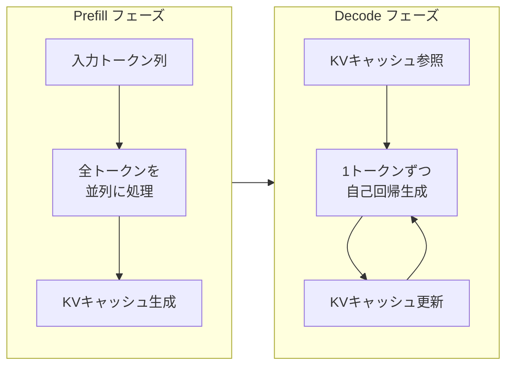

**Prefill フェーズ**（プロンプト処理）では、入力されたプロンプトの全トークンを一括で処理する。このフェーズは**計算律速**（Compute Bound）であり、GPU の演算性能がボトルネックとなる。入力トークンは並列に処理できるため、バッチサイズを大きくすることでGPU の演算能力を効率的に活用できる。

**Decode フェーズ**（トークン生成）では、1トークンずつ自己回帰的に生成する。このフェーズは前述のとおり**メモリ帯域幅律速**であり、各ステップでモデルの重みを読み出すコストが支配的となる。バッチサイズが小さい場合、GPU の演算能力の大部分が遊休状態になる。

この2つのフェーズの特性の違いが、推論最適化の設計において重要な考慮事項となる。

### コストの全体像

推論コストの全体像を以下にまとめる。

| 要素 | 影響 | 主な最適化手法 |
|------|------|---------------|
| モデルサイズ | メモリ容量・帯域幅 | 量子化、蒸留、プルーニング |
| KVキャッシュ | メモリ容量 | PagedAttention、MQA/GQA |
| 自己回帰生成 | レイテンシ | スペキュレーティブデコーディング |
| バッチ効率 | スループット | Continuous Batching |
| 並列化 | スケーラビリティ | テンソル並列、パイプライン並列 |

以降の章では、これらの最適化手法を体系的に解説する。

## 2. 量子化（Quantization）

### 量子化の基本原理

量子化とは、モデルの重みやアクティベーションを、元の高精度な数値表現（FP32やFP16）からより低精度な表現（INT8、INT4など）に変換する手法である。量子化の目的は以下の3つに集約される。

1. **メモリ使用量の削減**: モデルサイズを1/2から1/4に圧縮
2. **メモリ帯域幅の節約**: 読み出すデータ量を削減し、メモリ律速を緩和
3. **計算速度の向上**: 整数演算は浮動小数点演算より高速（専用ハードウェアがある場合）

最も基本的な量子化の数式は、浮動小数点値 $x$ を整数値 $x_q$ に変換する**均一量子化**（Uniform Quantization）である。

$$x_q = \text{round}\left(\frac{x}{s}\right) + z$$

ここで $s$ はスケールファクタ、$z$ はゼロポイント（オフセット）である。逆量子化（Dequantization）は以下で行う。

$$\hat{x} = s \cdot (x_q - z)$$

$b$ ビットの量子化では、量子化後の値は $[0, 2^b - 1]$（符号なし）または $[-2^{b-1}, 2^{b-1} - 1]$（符号あり）の整数値を取る。スケールファクタ $s$ は元の浮動小数点値の範囲をこの整数範囲にマッピングするように設定される。

$$s = \frac{x_{\max} - x_{\min}}{2^b - 1}$$

### 量子化の種類

量子化は、適用するタイミングと方法によって大きく分類される。

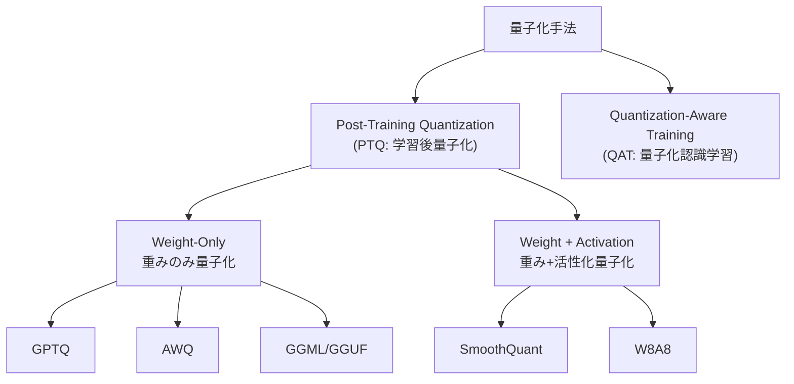

**Post-Training Quantization（PTQ）** は、学習済みモデルに対して追加の学習なしに量子化を適用する手法である。手軽に適用できる一方で、精度劣化が生じる可能性がある。

**Quantization-Aware Training（QAT）** は、学習段階から量子化の影響を考慮する手法である。量子化による丸め誤差を学習時にシミュレーションし、モデルが量子化に対してロバストになるよう最適化する。PTQ より高い精度を維持できるが、追加の学習コストが必要となる。

### INT8 量子化

INT8 量子化は、16ビット浮動小数点を8ビット整数に変換するもので、メモリ使用量を半分に削減する。INT8 量子化は比較的精度劣化が小さく、多くのモデルで実用的に使用されている。

しかし、LLM の活性化値には**外れ値**（Outlier）が存在することが知られている。一部のチャネルで他と桁違いに大きな値が現れ、これが均一量子化のスケールファクタを肥大化させ、他の値の量子化精度を著しく低下させる。

**SmoothQuant** は、この問題に対処するために提案された手法である。活性化値の外れ値チャネルのスケールを重み側に「移行」させることで、活性化値の分布を滑らかにする。具体的には、行列積 $Y = XW$ を以下のように変換する。

$$Y = XW = (X \cdot \text{diag}(s)^{-1}) \cdot (\text{diag}(s) \cdot W) = \hat{X}\hat{W}$$

ここで $s$ は各チャネルのスムージングファクタであり、活性化の外れ値が大きいチャネルでは大きな値を取り、活性化のスケールを縮小する一方で対応する重みのスケールを拡大する。この変換により、$\hat{X}$ と $\hat{W}$ の両方が量子化しやすい分布になる。

### INT4 量子化と GPTQ

INT4 量子化はモデルサイズを元の1/4に圧縮する極めて積極的な手法である。700億パラメータのモデルを約35GBに縮小でき、単一の GPU に収めることが可能になる。

**GPTQ（GPT Quantization）** は、Frantar ら（2022年）が提案した PTQ 手法であり、**OBS（Optimal Brain Surgeon）** の考え方を発展させたものである。GPTQの核心的なアイデアは、重み行列を列ごとに量子化し、各列の量子化誤差を残りの未量子化列で補償するというものである。

重み行列 $W$ の量子化誤差を最小化する問題は、以下のように定式化される。

$$\min_{\hat{W}} \| WX - \hat{W}X \|_2^2$$

ここで $X$ はキャリブレーションデータの活性化値、$\hat{W}$ は量子化後の重み行列である。GPTQ はこの最適化をヘッセ行列（$H = 2XX^T$）の逆行列を用いて効率的に解く。各列 $i$ の量子化後、残りの列を以下のように更新する。

$$\delta_F = -\frac{w_i - \text{quant}(w_i)}{[H^{-1}]_{ii}} \cdot (H^{-1})_{:,i}$$

この手順により、量子化誤差を後続の列に分散させ、全体としての近似精度を維持する。GPTQ は 176B パラメータの BLOOM モデルを約4時間で INT4 に量子化でき、ほぼ FP16 と同等の精度を達成することが報告されている。

### AWQ（Activation-aware Weight Quantization）

**AWQ** は、Lin ら（2024年）が提案した手法であり、「すべての重みが等しく重要ではない」という洞察に基づいている。特に、**活性化値が大きいチャネルに対応する重み**は、出力への寄与が大きいため、量子化誤差に対してより敏感である。

AWQ のアプローチは以下のとおりである。

1. キャリブレーションデータを用いて、各チャネルの活性化値の大きさ（重要度）を推定する
2. 重要なチャネルの重みにはスケールファクタを適用して量子化精度を高める
3. 重要でないチャネルにはより粗い量子化を許容する

具体的には、SmoothQuant と同様のチャネルごとのスケーリングを適用するが、スケールファクタの決定にグリッドサーチを用いる点が異なる。AWQ は GPTQ と比較して量子化速度が速く、かつ精度も同等以上であることが報告されている。

### 量子化手法の比較

| 手法 | ビット数 | 精度維持 | 速度 | 特徴 |
|------|---------|---------|------|------|
| FP16（ベースライン） | 16 bit | 基準 | 基準 | 量子化なし |
| INT8（absmax） | 8 bit | 良好 | 約2倍 | 最も単純な方式 |
| SmoothQuant | 8 bit | 優良 | 約2倍 | 外れ値対応 |
| GPTQ | 4 bit | 良好 | 約3-4倍 | 列単位の誤差補償 |
| AWQ | 4 bit | 優良 | 約3-4倍 | 活性化認識スケーリング |
| GGML/GGUF | 2-8 bit | 可変 | 可変 | CPU推論向け混合精度 |

## 3. 知識蒸留（Knowledge Distillation）

### 蒸留の原理

知識蒸留（Knowledge Distillation）は、大きなモデル（**教師モデル**: Teacher Model）の「知識」を、より小さなモデル（**生徒モデル**: Student Model）に転移させる手法である。Hinton ら（2015年）が提案したこの手法は、モデル圧縮の最も基本的なアプローチのひとつであり、LLM の文脈でもきわめて重要な役割を果たしている。

蒸留の核心的なアイデアは、教師モデルの**ソフトラベル**（Soft Label）に含まれる「暗黙知」（Dark Knowledge）を活用することにある。通常の教師あり学習では、正解ラベル（ハードラベル）のみを使用する。例えば、次のトークンが「猫」であれば、「猫」の確率が1で他はすべて0である。しかし、教師モデルの出力する確率分布には、「犬」が次に高い確率を持つとか、「動物」が一定の確率を持つといった、クラス間の**関係性**に関する豊富な情報が含まれている。

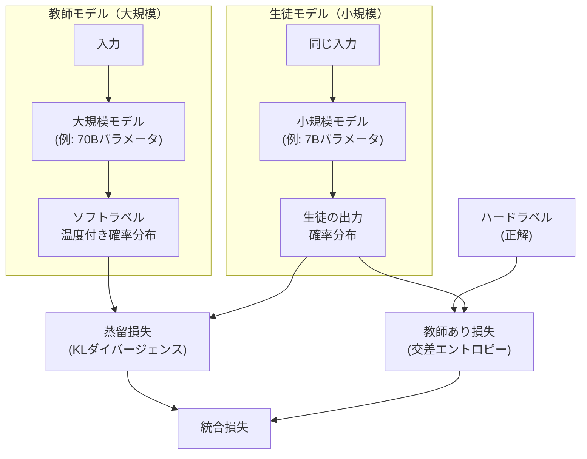

### 蒸留の損失関数

蒸留の損失関数は、以下の2つの項の加重和として定義される。

$$\mathcal{L} = \alpha \cdot \mathcal{L}_{\text{distill}} + (1 - \alpha) \cdot \mathcal{L}_{\text{CE}}$$

ここで $\mathcal{L}_{\text{CE}}$ は通常の交差エントロピー損失（ハードラベルに対する損失）、$\mathcal{L}_{\text{distill}}$ は蒸留損失である。

蒸留損失は、教師と生徒の確率分布間の **KLダイバージェンス**を用いて計算される。

$$\mathcal{L}_{\text{distill}} = T^2 \cdot \text{KL}\left(p_T(x; T) \| p_S(x; T)\right)$$

ここで $T$ は**温度**（Temperature）パラメータであり、ソフトマックス関数に適用される。

$$p(x_i; T) = \frac{\exp(z_i / T)}{\sum_j \exp(z_j / T)}$$

$z_i$ はロジット（ソフトマックス適用前の値）である。温度 $T$ を高くすると、確率分布がより「ソフト」になり、低確率のクラスにも有意な確率が割り当てられる。これにより、教師モデルが学習したクラス間の類似度に関する情報がより豊かに伝達される。$T = 1$ では通常のソフトマックスとなり、$T \to \infty$ では均一分布に近づく。

温度を上げることの効果は、確率分布のエントロピーを高め、勾配のシグナルを強くすることにある。$T^2$ の係数は、温度の上昇に伴い勾配の大きさが $1/T^2$ に縮小することを補正するためのものである。

### LLM における蒸留の実践

LLM の蒸留は、古典的な画像分類タスクでの蒸留と比較して、いくつかの独自の課題と手法がある。

**出力レベルの蒸留（Black-box Distillation）**

教師モデルの内部構造にアクセスできない場合（例えば、API経由でのみ利用可能なプロプライエタリモデル）、教師モデルの生成するテキストそのものを学習データとして使用する。これは**シーケンスレベルの蒸留**とも呼ばれる。

1. 教師モデルにプロンプトを入力し、応答を生成させる
2. 生成された（プロンプト、応答）ペアを学習データとする
3. 生徒モデルを通常の教師あり学習で訓練する

Alpaca、Vicuna といった初期のオープンソース LLM の多くは、GPT-4 などの大規模モデルの出力を用いた蒸留により構築された。

**特徴レベルの蒸留（White-box Distillation）**

教師モデルの内部状態にアクセスできる場合、ロジットだけでなく中間層の表現（Hidden States）やAttentionパターンを蒸留の対象にできる。

$$\mathcal{L}_{\text{hidden}} = \sum_{l \in \mathcal{S}} \| f_l(H_l^S) - H_{\phi(l)}^T \|_2^2$$

ここで $H_l^S$ と $H_{\phi(l)}^T$ はそれぞれ生徒と教師の $l$ 層の隠れ状態、$f_l$ は次元を合わせるための射影関数、$\phi(l)$ は生徒の層 $l$ に対応する教師の層のインデックスである。

**段階的蒸留**

大規模モデルから一度に小さなモデルへ蒸留するよりも、中間サイズのモデルを経由して段階的に蒸留する方が効果的な場合がある。例えば、70B → 13B → 7B のように段階を踏むことで、各段階での知識のギャップを小さくし、蒸留の精度を向上させる。

### 蒸留の限界と考慮事項

蒸留には以下のようなトレードオフと限界がある。

- **能力の上限**: 生徒モデルは教師モデルの能力を超えることはできない（原則として）
- **タスク特化性**: 特定のタスクに特化して蒸留すると、汎用性が低下する可能性がある
- **データの品質**: 蒸留データの質が生徒モデルの性能を大きく左右する
- **ライセンスの問題**: プロプライエタリモデルの出力を用いた蒸留には、利用規約上の制約がある場合がある

## 4. KVキャッシュと PagedAttention

### KVキャッシュの仕組み

Transformer の自己回帰的な生成において、**KVキャッシュ**（Key-Value Cache）は最も基本的かつ重要な最適化手法である。この手法がなければ、LLM の実用的な推論は事実上不可能と言っても過言ではない。

自己回帰生成では、位置 $t$ のトークンを生成する際に、位置 $1$ から $t-1$ までの全トークンに対する Attention を計算する必要がある。KVキャッシュがない場合、各生成ステップで全トークンの Key と Value を再計算しなければならない。$n$ トークンを生成するための総計算量は以下のように二次関数的に増大する。

$$\text{総計算量} \propto \sum_{t=1}^{n} t = \frac{n(n+1)}{2} = O(n^2)$$

KVキャッシュは、過去のトークンに対して計算した Key と Value のベクトルをメモリに保持し、新しいトークンの生成時に再利用する。これにより、各生成ステップでは新しいトークンの Key と Value のみを計算すればよく、計算量は $O(n)$ に削減される。

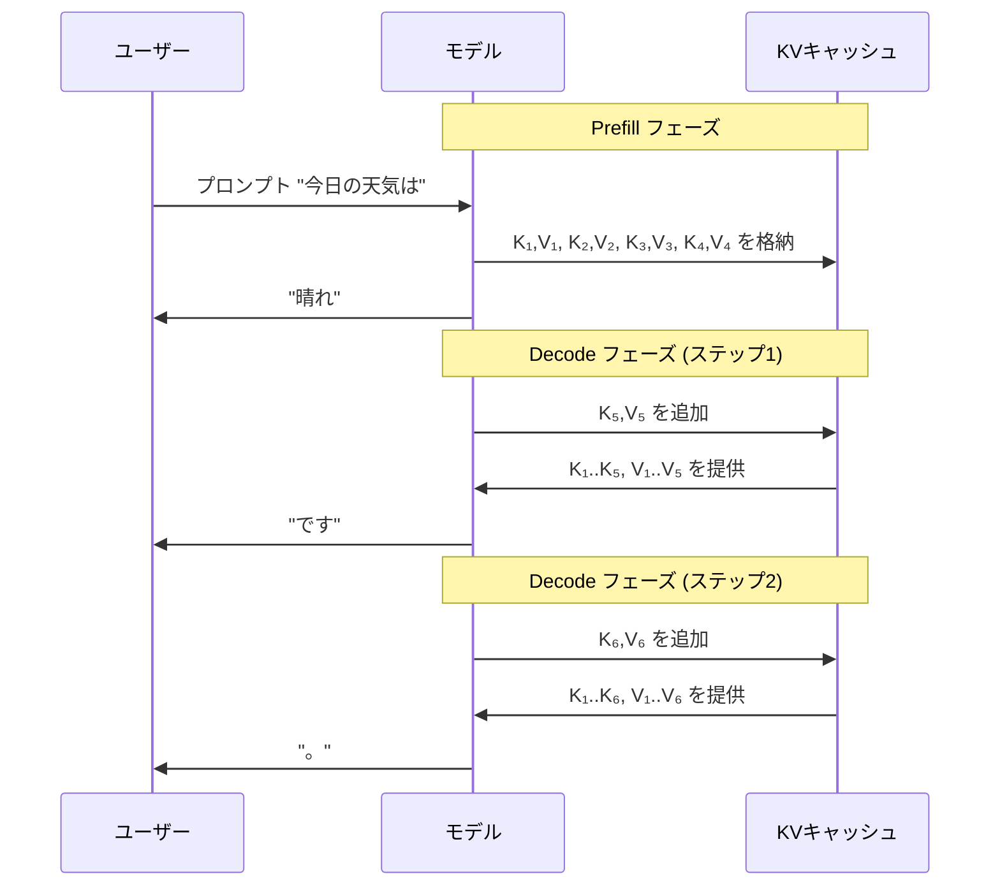

### KVキャッシュのメモリ消費

KVキャッシュのメモリ消費は、モデルのアーキテクチャとシーケンス長に依存する。各層の各 Attention ヘッドについて、Key と Value それぞれのベクトルを保持する必要がある。

$$\text{KVキャッシュサイズ} = 2 \times n_{\text{layers}} \times n_{\text{heads}} \times d_{\text{head}} \times n_{\text{seq}} \times b_{\text{bytes}}$$

ここで、$n_{\text{layers}}$ は層数、$n_{\text{heads}}$ はヘッド数、$d_{\text{head}}$ はヘッドの次元数、$n_{\text{seq}}$ はシーケンス長、$b_{\text{bytes}}$ はデータ型のバイト数（FP16なら2）である。

例えば Llama 2 70B（80層、64ヘッド、ヘッド次元128、FP16）でシーケンス長4096の場合、

$$2 \times 80 \times 64 \times 128 \times 4096 \times 2 = 10.7 \text{ GB}$$

これは**1リクエストあたり**のKVキャッシュサイズである。バッチサイズ32で同時に処理する場合、KVキャッシュだけで約340GBが必要となり、モデルの重み（約140GB）を大きく上回る。

### Multi-Query Attention（MQA）と Grouped-Query Attention（GQA）

KVキャッシュのメモリ消費を削減するアーキテクチャレベルの手法として、**Multi-Query Attention（MQA）** と **Grouped-Query Attention（GQA）** がある。

**Multi-Head Attention（MHA）** では、各ヘッドが独立した Query、Key、Value の射影を持つ。

**Multi-Query Attention（MQA）**（Shazeer, 2019）では、Query は各ヘッドで独立しているが、**Key と Value は全ヘッドで共有**する。これにより、KVキャッシュのサイズは $1/n_{\text{heads}}$ に削減される。

**Grouped-Query Attention（GQA）**（Ainslie ら, 2023）は、MHA と MQA の中間に位置する手法である。ヘッドを複数のグループに分割し、各グループ内でKey と Value を共有する。$g$ グループに分割する場合、KVキャッシュのサイズは $g/n_{\text{heads}}$ に削減される。

```mermaid
graph TB
    subgraph MHA["Multi-Head Attention (MHA)"]
        direction LR
        MHA_H1["Head 1<br/>Q₁ K₁ V₁"] ~~~ MHA_H2["Head 2<br/>Q₂ K₂ V₂"] ~~~ MHA_H3["Head 3<br/>Q₃ K₃ V₃"] ~~~ MHA_H4["Head 4<br/>Q₄ K₄ V₄"]
    end
    subgraph GQA["Grouped-Query Attention (GQA)"]
        direction LR
        GQA_H1["Head 1<br/>Q₁ K₁ V₁"] ~~~ GQA_H2["Head 2<br/>Q₂ K₁ V₁"] ~~~ GQA_H3["Head 3<br/>Q₃ K₂ V₂"] ~~~ GQA_H4["Head 4<br/>Q₄ K₂ V₂"]
    end
    subgraph MQA["Multi-Query Attention (MQA)"]
        direction LR
        MQA_H1["Head 1<br/>Q₁ K₁ V₁"] ~~~ MQA_H2["Head 2<br/>Q₂ K₁ V₁"] ~~~ MQA_H3["Head 3<br/>Q₃ K₁ V₁"] ~~~ MQA_H4["Head 4<br/>Q₄ K₁ V₁"]
    end
```

Llama 2 70B は GQA（8グループ）を採用しており、KVキャッシュサイズを MHA の 1/8 に削減している。これにより、前述の例では 10.7GB が約 1.3GB に縮小される。

### PagedAttention と vLLM

**PagedAttention**（Kwon ら, 2023）は、KVキャッシュのメモリ管理を革新的に改善する手法であり、**vLLM** 推論フレームワークの中核技術である。

従来の KV キャッシュ管理では、各リクエストに対して最大シーケンス長分の連続メモリを事前に確保する必要があった。しかし、実際の生成長は事前に予測できないため、以下の問題が発生する。

1. **内部フラグメンテーション**: 実際の生成長が最大長よりも短い場合、確保したメモリの大部分が無駄になる
2. **外部フラグメンテーション**: リクエストの完了と開始が繰り返されるうちに、メモリ空間に断片化が生じる
3. **メモリの過剰予約**: 最大長を保守的に設定するため、同時処理可能なリクエスト数が制限される

PagedAttention は、OS の**仮想メモリ**とページングの概念を KV キャッシュ管理に適用する。KVキャッシュを固定サイズの**ブロック**（ページ）に分割し、ブロックテーブルで論理アドレスから物理アドレスへのマッピングを管理する。

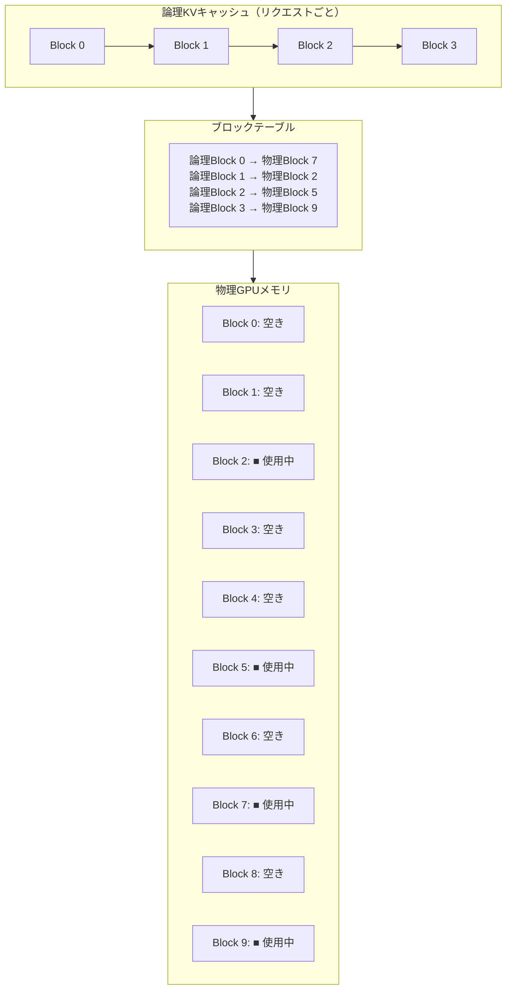

PagedAttention の主な利点は以下のとおりである。

- **メモリ効率の向上**: 内部・外部フラグメンテーションがほぼ解消され、メモリ使用効率が従来比で2-4倍向上する。これにより同時処理可能なリクエスト数が大幅に増加する
- **プレフィックス共有**（Prefix Caching）: システムプロンプトなどの共通プレフィックスのKVキャッシュを、複数のリクエスト間で物理ブロックを共有することで再利用できる。Copy-on-Write の仕組みにより、共有ブロックの変更が必要な場合のみコピーが行われる
- **ビームサーチの効率化**: ビームサーチにおいて、各ビーム候補は KV キャッシュの大部分を共有する。PagedAttention ではこの共有を物理ブロックレベルで実現し、メモリ使用量を大幅に削減する

vLLM の実測結果では、PagedAttention により HuggingFace Transformers に対して2-4倍、HuggingFace Text Generation Inference（TGI）に対して2-3倍のスループット向上が報告されている。

## 5. スペキュレーティブデコーディング（Speculative Decoding）

### 自己回帰生成のボトルネック

前述のとおり、LLM の Decode フェーズは**メモリ帯域幅律速**である。1トークンの生成にモデルの全重みを読み出す必要があり、GPU の演算能力の大部分が遊休状態となる。この問題に対して、**スペキュレーティブデコーディング**（投機的デコーディング）は巧妙なアプローチを提供する。

### 基本的な仕組み

スペキュレーティブデコーディングの着想は、**投機的実行**（Speculative Execution）というCPUのパイプライン最適化技術に由来する。CPUが分岐命令の結果を予測して先行実行するのと同様に、小さな「ドラフトモデル」が次のトークン列を先に予測し、大きな「ターゲットモデル」がそれを一括で検証する。

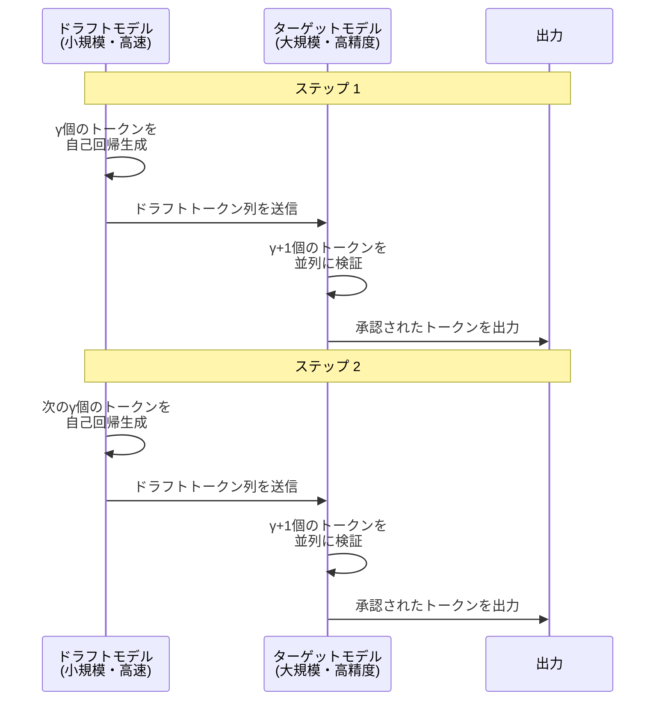

具体的な手順は以下のとおりである。

1. **ドラフト生成**: 小規模な「ドラフトモデル」$M_q$ が $\gamma$ 個のトークン $x_1, x_2, \ldots, x_\gamma$ を自己回帰的に生成する
2. **並列検証**: 大規模な「ターゲットモデル」$M_p$ が、入力コンテキストに $x_1, \ldots, x_\gamma$ を追加した状態で、$\gamma + 1$ 位置すべてのロジットを**1回の前方パス**で並列に計算する
3. **トークンの承認/棄却**: 各位置 $i$ について、ドラフトモデルの確率 $q(x_i)$ とターゲットモデルの確率 $p(x_i)$ を比較し、以下の確率で承認する

$$\text{承認確率} = \min\left(1, \frac{p(x_i)}{q(x_i)}\right)$$

4. **棄却時の処理**: 位置 $i$ のトークンが棄却された場合、位置 $i$ 以降のトークンはすべて破棄し、修正された分布 $p'(x) = \text{norm}(\max(0, p(x) - q(x)))$ からリサンプリングする

この承認基準により、最終的な出力分布は**ターゲットモデルの分布と厳密に一致**する。すなわち、スペキュレーティブデコーディングは出力の品質を一切犠牲にすることなく、推論を高速化する**ロスレスな手法**である。

### 速度向上の分析

1ステップで承認されるトークン数の期待値が $k$ であるとする。ドラフトモデルの $\gamma$ 回の前方パスとターゲットモデルの1回の前方パスで、平均 $k + 1$ 個のトークンが生成される。ドラフトモデルのコストがターゲットモデルに比べて無視できる場合、速度向上率は最大で $k + 1$ 倍となる。

ドラフトモデルがターゲットモデルの出力によく一致する場合（例えば、同じファミリの小さいモデルを使用する場合）、承認率が高くなり、大きな速度向上が期待できる。実際の報告では、2-3倍の速度向上が典型的である。

### ドラフトモデルの選択

ドラフトモデルの選択はスペキュレーティブデコーディングの性能を大きく左右する。主要なアプローチとして以下がある。

- **同一ファミリの小規模モデル**: 例えば Llama 70B をターゲットとして Llama 7B をドラフトとして使用
- **Medusa ヘッド**: ターゲットモデル自体に複数の追加デコーディングヘッドを取り付け、1回の前方パスで複数の将来のトークンを予測する
- **EAGLE（Extrapolation Algorithm for Greater Language-model Efficiency）**: ターゲットモデルの特徴量を入力として、軽量なオートリグレッシブモデルでドラフトを生成する
- **Self-Speculative Decoding**: ターゲットモデル自体の一部の層をスキップしてドラフトを生成する（Early Exit）

## 6. バッチ処理の最適化

### 静的バッチ処理の問題

従来のバッチ処理では、複数のリクエストを固定サイズのバッチにまとめて処理する。しかし、LLM の推論では各リクエストの生成長が異なるため、以下の問題が発生する。

```mermaid
gantt
    title 静的バッチ処理の非効率性
    dateFormat X
    axisFormat %s

    section リクエスト1
    生成（20トークン）: 0, 20
    パディング（待機）: 20, 50

    section リクエスト2
    生成（50トークン）: 0, 50

    section リクエスト3
    生成（10トークン）: 0, 10
    パディング（待機）: 10, 50

    section リクエスト4
    生成（35トークン）: 0, 35
    パディング（待機）: 35, 50
```

静的バッチでは、バッチ内の最も長い生成が完了するまで、他のリクエストのスロットは遊休状態になる。これにより、GPU の利用率が大幅に低下する。

### Continuous Batching（連続バッチ処理）

**Continuous Batching**（Iteration-Level Scheduling とも呼ばれる）は、この問題を解決するスケジューリング手法である。Yu ら（2022年）の ORCA システムで提案され、現在は vLLM、TensorRT-LLM、TGI などの主要な推論フレームワークに採用されている。

Continuous Batching の核心は、**イテレーション（デコードステップ）ごと**にバッチの構成を動的に変更することにある。

```mermaid
gantt
    title Continuous Batching
    dateFormat X
    axisFormat %s

    section スロット1
    Req A（20トークン）: 0, 20
    Req E（15トークン）: 20, 35
    Req G（15トークン）: 35, 50

    section スロット2
    Req B（50トークン）: 0, 50

    section スロット3
    Req C（10トークン）: 0, 10
    Req D（25トークン）: 10, 35
    Req F（15トークン）: 35, 50

    section スロット4
    Req H（35トークン）: 0, 35
    Req I（15トークン）: 35, 50
```

具体的な動作は以下のとおりである。

1. 各デコードステップで、終了したリクエストのスロットを検出する
2. 待機キューから新しいリクエストを取り出し、空いたスロットに挿入する
3. 新しいリクエストの Prefill 処理を行い、既存リクエストの Decode と同時に実行する

これにより、GPU スロットが常に有効なリクエストで埋められ、スループットが大幅に向上する。実測では、静的バッチ処理と比較して2-8倍のスループット向上が報告されている。

### Prefill と Decode の分離

Continuous Batching の高度なバリエーションとして、**Prefill と Decode の分離**（Disaggregated Prefill-Decode）がある。Prefill フェーズは計算律速、Decode フェーズはメモリ帯域幅律速であり、これらを同一の GPU で混在させると、互いのパフォーマンスを低下させる。

**Splitwise** や **DistServe**（Zhong ら, 2024）といったシステムでは、Prefill 専用の GPU と Decode 専用の GPU を分離し、KVキャッシュを GPU 間で転送することで、各フェーズに最適化されたハードウェア構成を実現する。

## 7. テンソル並列とモデル分割

### モデル並列化の必要性

大規模モデルのパラメータが単一 GPU のメモリに収まらない場合、モデルを複数の GPU に分割して配置する必要がある。これを**モデル並列化**（Model Parallelism）と呼ぶ。モデル並列化には主に3つのアプローチがある。

### テンソル並列（Tensor Parallelism）

**テンソル並列**は、個々の演算（行列積など）を複数の GPU に分割する手法である。Megatron-LM（Shoeybi ら, 2019）で体系化された。

Transformer の各層における主要な行列積を考える。MLP 層の計算は以下のとおりである。

$$Y = \text{GeLU}(XA) \cdot B$$

ここで $A$ と $B$ はそれぞれ第1および第2の全結合層の重み行列である。テンソル並列では、$A$ を列方向に分割し、$B$ を行方向に分割する。

$$A = [A_1 | A_2], \quad B = \begin{bmatrix} B_1 \\ B_2 \end{bmatrix}$$

GPU 1 は $Y_1 = \text{GeLU}(XA_1) \cdot B_1$ を計算し、GPU 2 は $Y_2 = \text{GeLU}(XA_2) \cdot B_2$ を計算する。最終出力は $Y = Y_1 + Y_2$ として得られ、All-Reduce 通信で結果を集約する。

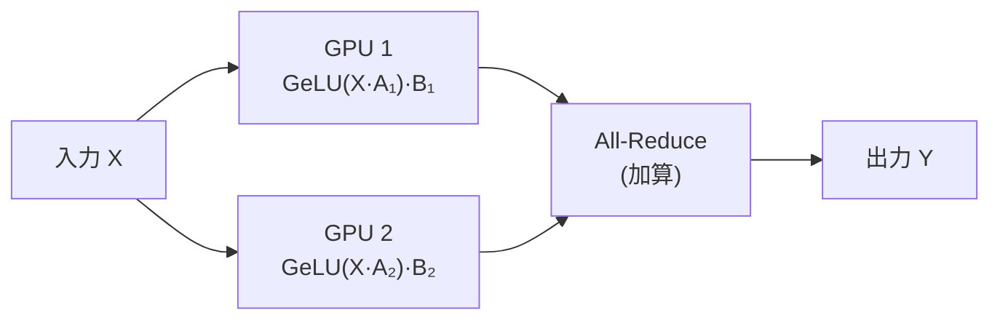

Self-Attention 層では、Attention ヘッドを GPU 間で均等に分割する。各 GPU は割り当てられたヘッドの QKV 計算と Attention を実行し、結果を All-Reduce で集約する。

テンソル並列の利点は、各層の計算を複数の GPU で分担することでレイテンシを削減できる点にある。一方、各層で All-Reduce 通信が必要となるため、**GPU 間の通信帯域幅**が性能のボトルネックとなりやすい。このため、テンソル並列は NVLink などの高速インターコネクトで接続された GPU 間で使用されるのが一般的である。

### パイプライン並列（Pipeline Parallelism）

**パイプライン並列**は、モデルの層を複数の GPU に分割する手法である。例えば、80層のモデルを4つの GPU に分割し、GPU 1 が層1-20、GPU 2 が層21-40、GPU 3 が層41-60、GPU 4 が層61-80を担当する。

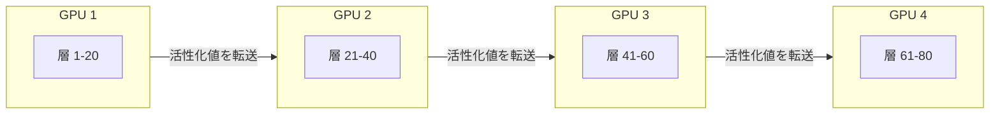

パイプライン並列の利点は、GPU 間の通信が層の境界でのみ発生するため、通信量がテンソル並列より少ない点にある。しかし、単純なパイプライン並列では、ある GPU が計算している間、他の GPU は待機状態になる**バブル**（Bubble）が発生する。

推論時にはマイクロバッチを用いたパイプラインスケジューリングにより、バブルを最小化できる。学習時ほどバブルの問題は深刻ではないが、レイテンシの観点では各リクエストが全 GPU を順番に通過する必要があるため、テンソル並列に比べてレイテンシが増加する。

### 実運用での並列化戦略

実際の大規模モデル推論では、テンソル並列とパイプライン並列を組み合わせる**ハイブリッド並列化**が採用されることが多い。

- **ノード内**（同一サーバー内の GPU 間）: テンソル並列を使用。NVLink の高帯域幅を活用
- **ノード間**（異なるサーバー間）: パイプライン並列を使用。ネットワーク通信量を最小化

例えば、8 GPU × 4 ノードの 32 GPU 構成では、各ノード内で 8-way テンソル並列、ノード間で 4-way パイプライン並列を適用する。

### Expert Parallelism

**Mixture of Experts（MoE）** モデルでは、**Expert Parallelism** という独自の並列化手法が重要となる。MoE モデルは、各層に複数の Expert（FFN サブネットワーク）を持ち、各トークンは一部の Expert のみで処理される。Expert を GPU 間で分散配置し、各トークンを適切な Expert が存在する GPU にルーティングする。

MoE モデルの推論では、全パラメータ数に対して活性化パラメータ数が少ないため、同じ品質のモデルをより少ない計算量で推論できる。例えば、Mixtral 8x7B は47Bの総パラメータを持つが、推論時にはトークンあたり約13B分の計算しか行わない。

## 8. 専用ハードウェアと推論基盤

### GPU アーキテクチャの進化

NVIDIA の GPU アーキテクチャは、LLM 推論のニーズに合わせて急速に進化してきた。

**Tensor Core** は、行列積和演算を効率的に実行する専用ユニットである。世代ごとにサポートする精度が拡張されてきた。

| アーキテクチャ | 世代 | Tensor Core 対応精度 | HBM 容量/帯域幅 |
|--------------|------|---------------------|-----------------|
| Volta (V100) | 2017 | FP16 | 32GB / 900 GB/s |
| Ampere (A100) | 2020 | FP16, BF16, INT8, TF32 | 80GB / 2.0 TB/s |
| Hopper (H100) | 2022 | FP16, BF16, INT8, FP8 | 80GB / 3.35 TB/s |
| Blackwell (B200) | 2024 | FP16, BF16, INT8, FP8, FP4 | 192GB / 8.0 TB/s |

特に注目すべきは、**FP8** と **FP4** のハードウェアサポートである。これにより、量子化モデルの推論がソフトウェアエミュレーションではなくネイティブに実行でき、大幅な性能向上が実現される。

### TPU（Tensor Processing Unit）

Google の **TPU** は、行列演算に特化した ASIC（Application-Specific Integrated Circuit）である。TPU v4 以降では、大規模な systolic array とHBMメモリを搭載し、LLM の学習・推論の両方に使用されている。

TPU の特徴的な点は以下のとおりである。

- **Systolic Array**: 巨大な行列演算ユニットにより、行列積を非常に効率的に実行
- **ICI（Inter-Chip Interconnect）**: TPU チップ間の高帯域幅低遅延インターコネクトで、大規模なテンソル並列を実現
- **大容量 HBM**: TPU v5e では16GBから始まり、TPU v5p では95GBまでのHBMを搭載

### 推論専用チップ

汎用的な学習・推論両用チップとは別に、**推論に特化したチップ**の開発も進んでいる。

**AWS Inferentia / Trainium** は、Amazon が開発した推論・学習用カスタムチップである。Inferentia2 は NeuronCore-v2 と呼ばれる専用コアを搭載し、Transformer モデルの推論に最適化されている。

**Groq LPU（Language Processing Unit）** は、推論に特化した ASIC であり、従来の GPU とは根本的に異なるアーキテクチャを採用している。Groq は SRAM ベースの設計を採用し、HBM のメモリ帯域幅ボトルネックを回避する。これにより、非常に低いレイテンシでの推論を実現するが、モデルサイズがオンチップ SRAM に制約される。

**FPGA** ベースのソリューションも一部のユースケースで採用されている。FPGA は柔軟性が高く、カスタムビット幅の量子化やタスク特化の最適化を実装できるが、ピーク性能では GPU や専用 ASIC に及ばない。

### ソフトウェアスタックの重要性

ハードウェアの性能を引き出すためには、最適化されたソフトウェアスタックが不可欠である。主要な推論フレームワークを紹介する。

**vLLM** は、前述の PagedAttention を中核技術とするオープンソースの推論フレームワークである。Continuous Batching、テンソル並列、各種量子化（AWQ、GPTQ、FP8 など）をサポートし、プロダクション環境で広く使用されている。

**TensorRT-LLM** は、NVIDIA が提供する LLM 推論最適化ライブラリである。NVIDIA GPU に特化した最適化（FP8 量子化、カスタム CUDA カーネル、Flight Recorder など）を実装しており、NVIDIA ハードウェアでの最高性能を実現する。

**llama.cpp** は、CPU および GPU の両方での LLM 推論を可能にする C/C++ ベースのフレームワークである。GGUF 形式の量子化モデルをサポートし、コンシューマ向けハードウェアでの LLM 実行を民主化した。Apple Silicon の Metal API や CUDA にも対応している。

**SGLang** は、LLM プログラムの効率的な実行を目指すフレームワークであり、RadixAttention と呼ばれるプレフィックスキャッシュの自動管理機構を特徴とする。複雑なLLM パイプライン（ツール呼び出し、構造化出力など）の効率的な実行に適している。

## 9. 最適化手法の組み合わせと実践

### 手法の相互作用

ここまで個別に解説してきた最適化手法は、実際には組み合わせて使用される。重要な点は、これらの手法が互いに独立ではなく、相互に作用する場合があることである。

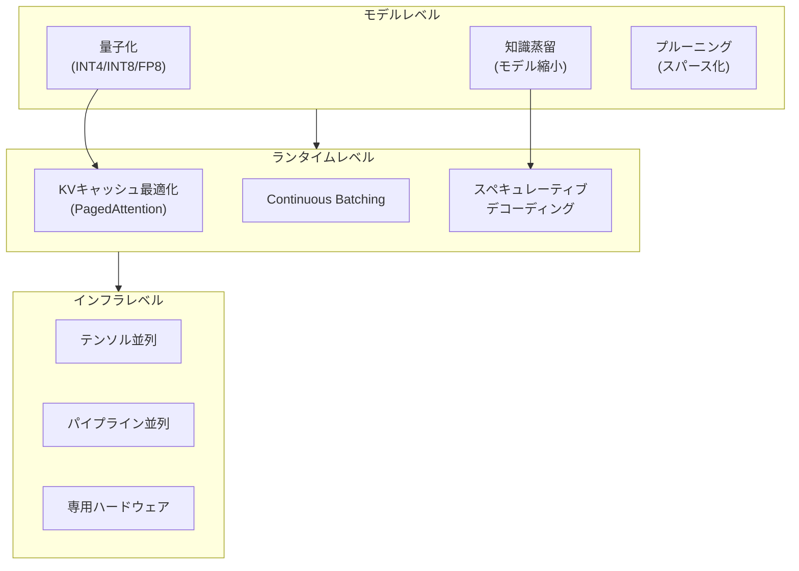

**量子化 + PagedAttention**: 量子化によりモデルの重みサイズが削減されると、同じ GPU メモリ内により多くの KV キャッシュを格納できる。PagedAttention と組み合わせることで、同時処理可能なリクエスト数がさらに増加する。

**蒸留 + スペキュレーティブデコーディング**: 蒸留によって作成された小規模モデルは、スペキュレーティブデコーディングのドラフトモデルとして最適である。教師モデル（ターゲット）と出力分布が類似するため、承認率が高くなる。

**量子化 + テンソル並列**: 量子化により各 GPU に配置するパラメータが小さくなるため、少ない GPU 数でモデルを配置できる。これにより、テンソル並列の通信オーバーヘッドを削減しつつ、残った GPU リソースをバッチ処理に充てることができる。

### サービングスタックの全体設計

プロダクション環境での LLM 推論サービスは、以下のようなアーキテクチャで構成される。

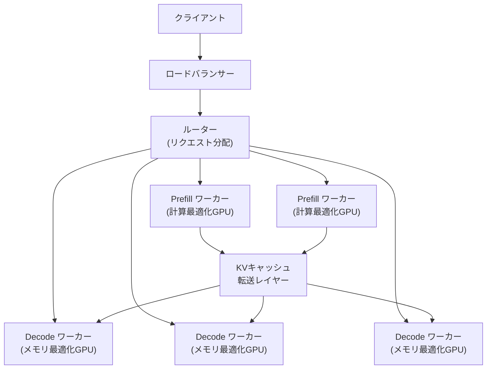

- **ルーター**: リクエストの特性（プロンプト長、予想生成長、優先度）に基づいて、最適なワーカーにルーティングする
- **Prefill ワーカー**: 計算律速の Prefill 処理に特化。高い FLOPS を持つ GPU を使用
- **Decode ワーカー**: メモリ帯域幅律速の Decode 処理に特化。大容量メモリと高帯域幅を持つ GPU を使用
- **KVキャッシュ転送レイヤー**: Prefill ワーカーから Decode ワーカーへ KV キャッシュを転送する RDMA ベースの高速転送層

### コスト最適化の指標

推論サービスの最適化においては、以下の指標が重要である。

- **TTFT（Time to First Token）**: 最初のトークンが出力されるまでの時間。ユーザー体験に直結する
- **TPOT（Time Per Output Token）**: 各出力トークン間の時間。ストリーミング表示の滑らかさに影響する
- **スループット（Tokens/Second）**: 単位時間あたりの総出力トークン数。サービスのコスト効率を決定する
- **コスト効率（Tokens/Dollar）**: 1ドルあたりに生成できるトークン数。ビジネス上の最重要指標

これらの指標はトレードオフの関係にあることが多い。例えば、バッチサイズを大きくするとスループットは向上するが、個々のリクエストの TTFT と TPOT は悪化する。最適なバランスは、サービスのSLA（Service Level Agreement）やユースケースによって異なる。

## 10. 今後の展望

### 現在の課題

LLM 推論の最適化は急速に進展しているが、いくつかの根本的な課題が残されている。

**長いコンテキストへの対応**: コンテキスト長が100K-1Mトークンに拡大するにつれ、KVキャッシュのメモリ消費と Attention の計算量が支配的になる。Ring Attention、Flash Attention の発展系、KVキャッシュの圧縮（例えば、H2O や Scissorhands のような重要なキーのみを保持する手法）が研究されている。

**動的な計算量の割り当て**: すべてのトークンが同じ計算量を必要とするわけではない。「The」のような予測容易なトークンに対しては少ない計算で済むはずである。Early Exit、Mixture of Depths、適応的な計算量配分は、この方向の研究である。

**マルチモーダル推論**: テキストだけでなく画像、音声、動画を扱うマルチモーダルモデルでは、モダリティごとに異なる計算パターンが必要となり、最適化がさらに複雑になる。

### 技術的展望

**ハードウェアとソフトウェアの共進化**: FP4 やさらに低精度の演算のハードウェアサポート、HBM 容量と帯域幅の増大、GPU 間インターコネクトの高速化が続く。これに合わせて、ソフトウェアスタックも進化する必要がある。

**コンパイラベースの最適化**: XLA、Triton、MLIR などのコンパイラ技術により、モデルの計算グラフを自動的に最適化するアプローチが進展している。カーネル融合、メモリレイアウトの最適化、スケジューリングの自動化などが含まれる。

**エッジでの推論**: スマートフォンやIoTデバイスでの LLM 実行に対する需要が高まっている。量子化、蒸留、プルーニングを極限まで適用し、数十億パラメータ規模のモデルを携帯端末で動作させる取り組みが活発である。Apple の Core ML、Google の MediaPipe、Qualcomm の AI Engine がこの分野をリードしている。

### まとめ

LLM の推論最適化は、アルゴリズム、システム、ハードウェアが密接に絡み合う学際的な分野である。量子化はモデルのメモリフットプリントを劇的に削減し、KVキャッシュの最適化はスケーラビリティを向上させ、スペキュレーティブデコーディングはレイテンシを改善し、Continuous Batching はスループットを最大化する。これらの手法を適切に組み合わせ、ハードウェアの特性を最大限に活用することが、実用的な LLM サービスの構築において不可欠である。

推論コストの削減は、LLM の民主化に直結する。より多くの人々がより低コストで高品質な AI サービスにアクセスできるようになることは、技術の社会的価値を最大化する上で極めて重要な課題であり、この分野の今後のさらなる発展が期待される。
