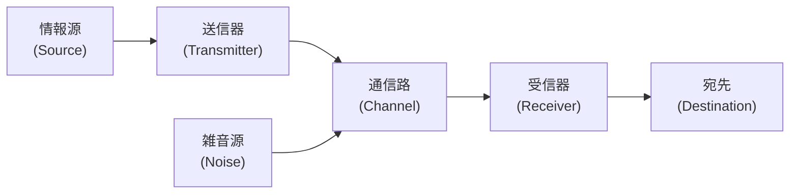
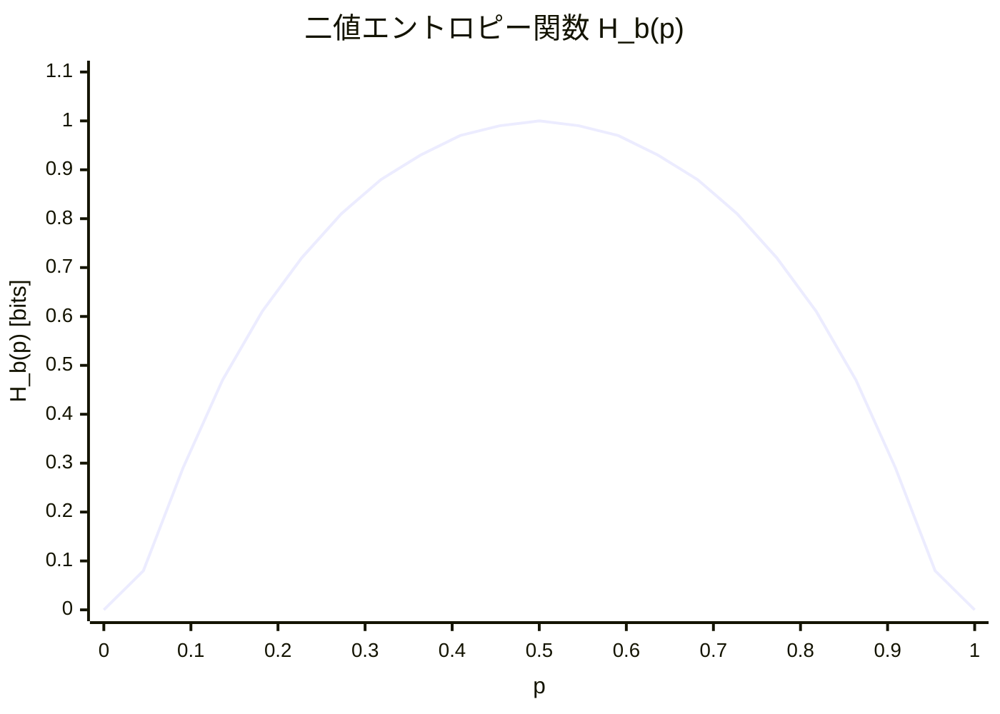
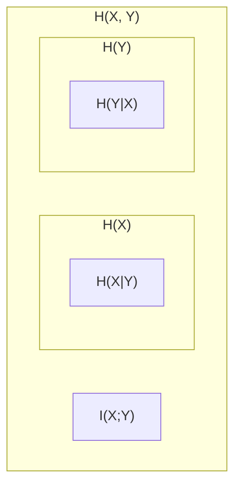
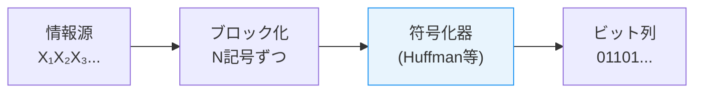
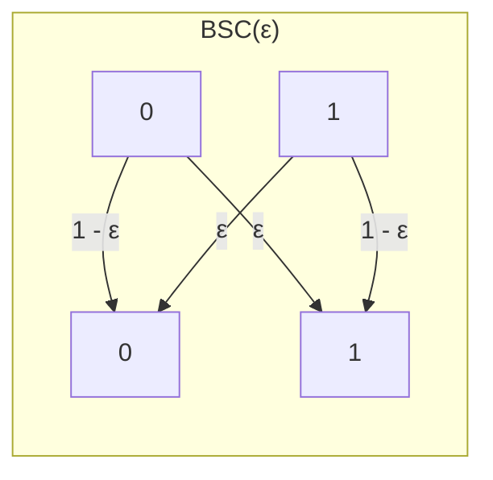
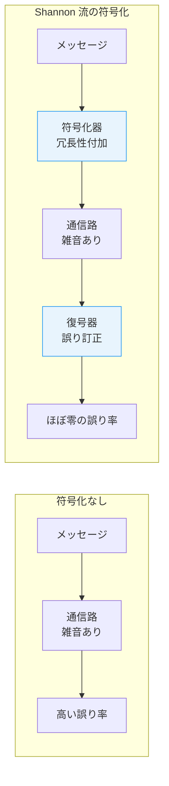

# エントロピーと情報量 — Shannon の情報理論

## 1. 背景と動機：通信の数学的理論

1948年、ベル研究所の数学者 Claude Elwood Shannon は、論文 *"A Mathematical Theory of Communication"* を発表した。この論文は、**情報**という曖昧な概念に対して初めて厳密な数学的基礎を与え、20世紀の科学技術に計り知れない影響をもたらした。現代のデータ圧縮、誤り訂正符号、暗号理論、機械学習、さらには統計力学や量子計算に至るまで、Shannon の理論は根幹をなしている。

### 1.1 Shannon 以前：通信の課題

Shannon 以前の通信工学は、主に信号のアナログ的な伝送品質——振幅、帯域幅、信号対雑音比（SNR）——に焦点を当てていた。しかし、いくつかの根本的な問いには答えがなかった。

- **メッセージをどこまで圧縮できるのか？** 冗長性を取り除いたとき、メッセージの「本質的な量」はどのくらいか。
- **雑音のある通信路でどこまで信頼できる通信が可能か？** 雑音が避けられない環境で、誤りなく情報を伝送できる限界は存在するのか。
- **「情報」とは何か？** そもそも情報を定量的に測る尺度は存在するのか。

これらの問いに対して Shannon は、確率論を武器に統一的な回答を与えた。

### 1.2 Shannon の基本的な洞察

Shannon の着眼点は、**情報の意味（semantics）を捨象し、統計的な構造だけに注目する**ことにあった。Shannon 自身が論文の冒頭で次のように述べている。

> "The fundamental problem of communication is that of reproducing at one point either exactly or approximately a message selected at another point. Frequently the messages have meaning; [...] These semantic aspects of communication are irrelevant to the engineering problem."

つまり、メッセージの「意味」は通信工学の問題にとっては本質的ではない。重要なのは、メッセージが**どの程度予測困難であるか**——すなわち、メッセージの**統計的な不確実性**——である。

### 1.3 通信システムのモデル

Shannon は通信システムを以下の5つの要素で抽象化した。



1. **情報源（Information Source）**：メッセージを生成する。離散的な記号列（テキストなど）または連続的な信号（音声など）を出力する。
2. **送信器（Transmitter）**：メッセージを通信路に適した信号に変換する（符号化）。
3. **通信路（Channel）**：信号を伝送する媒体。雑音によって信号が擾乱される。
4. **受信器（Receiver）**：受信した信号を元のメッセージに復元する（復号）。
5. **宛先（Destination）**：メッセージの最終的な受け手。

この抽象化の力は、具体的な物理的実装から独立して**情報伝送の理論的限界**を論じられる点にある。

::: tip Shannon の情報理論の本質
情報理論は「情報」の意味を問わない。問うのは「不確実性の量」である。コイン投げの結果、サイコロの目、文章の次の文字——いずれも、それがどの程度「驚き」をもたらすかで情報量が測られる。この一見単純な着想が、通信・圧縮・暗号の理論的限界を明らかにした。
:::

## 2. 自己情報量（Surprisal）

エントロピーの定義に入る前に、まず個々の事象が持つ「情報の量」を定式化する。

### 2.1 直感：珍しい事象ほど多くの情報を伝える

日常的な感覚として、**ありふれた出来事は大した情報をもたらさないが、珍しい出来事は大きな情報をもたらす**。たとえば、

- 「明日、太陽が東から昇る」——これはほぼ確実であり、聞いても驚かない。情報量は小さい。
- 「明日、東京に隕石が落ちる」——これはきわめて稀であり、聞けば大いに驚く。情報量は大きい。

この直感を数学的に捉えるために、Shannon は以下の要件を課した。

### 2.2 自己情報量の公理的導出

確率 $p$ の事象が実際に起きたとき、それが伝える「情報の量」を $I(p)$ とする。$I(p)$ は以下の性質を満たすべきである。

1. **単調性**：$p$ が小さいほど $I(p)$ は大きい。確率が低い事象ほど多くの情報を伝える。
2. **非負性**：$I(p) \geq 0$。情報量は負にならない。
3. **確実な事象は情報を持たない**：$I(1) = 0$。確率1の事象が起きても「知っていたこと」なので情報量は0。
4. **独立事象の加法性**：2つの独立な事象が同時に起きたときの情報量は、各事象の情報量の和に等しい。すなわち、$I(p_1 \cdot p_2) = I(p_1) + I(p_2)$。

この4つの条件を同時に満たす関数は、定数倍を除いて対数関数に限られる。

$$
I(p) = -\log p = \log \frac{1}{p}
$$

::: details 公理4から対数関数が導かれる理由
条件4の加法性 $I(p_1 \cdot p_2) = I(p_1) + I(p_2)$ は、関数方程式 $f(xy) = f(x) + f(y)$ の形である。この関数方程式の連続解は $f(x) = c \log x$（$c$ は定数）に限られる。条件1から $c < 0$ であり、条件3から $f(1) = 0$ が自動的に満たされる。慣例として $c = -1$ を選ぶことで $I(p) = -\log p$ を得る。
:::

### 2.3 自己情報量の定義

離散確率変数 $X$ が値 $x$ をとる確率を $P(X = x) = p(x)$ とするとき、事象 $X = x$ の**自己情報量（self-information）**あるいは**驚き度（surprisal）**を次のように定義する。

$$
I(x) = -\log_b p(x) = \log_b \frac{1}{p(x)}
$$

ここで、対数の底 $b$ によって情報量の単位が変わる。

| 底 $b$ | 単位 | 用途 |
|---|---|---|
| $b = 2$ | ビット（bit） | 情報理論、計算機科学 |
| $b = e$ | ナット（nat） | 統計学、物理学 |
| $b = 10$ | ハートレー（hartley） | 通信工学（歴史的） |

以降、特に断りのない限り $\log$ は $\log_2$ を意味し、単位はビットとする。

### 2.4 具体例

**例1：公正なコイン投げ**

表が出る確率 $p = 1/2$ なので、

$$
I(\text{表}) = -\log_2 \frac{1}{2} = \log_2 2 = 1 \text{ bit}
$$

コイン投げの結果は1ビットの情報を伝える。これは直感に合致する。2択の質問に対する回答は、yes/no の1ビットである。

**例2：公正な6面サイコロ**

特定の目（例えば3）が出る確率 $p = 1/6$ なので、

$$
I(3) = -\log_2 \frac{1}{6} = \log_2 6 \approx 2.585 \text{ bits}
$$

サイコロの各目が伝える情報量は約2.585ビットである。

**例3：偏ったコイン**

表が出る確率 $p = 0.99$、裏が出る確率 $q = 0.01$ のコインを考える。

$$
I(\text{表}) = -\log_2 0.99 \approx 0.0145 \text{ bits}
$$

$$
I(\text{裏}) = -\log_2 0.01 \approx 6.644 \text{ bits}
$$

ほぼ必ず表が出るコインにおいて、表が出ても大した情報はない（0.0145ビット）。一方、裏が出れば大きな驚き（6.644ビット）をもたらす。

## 3. エントロピーの定義と直感的理解

### 3.1 Shannon エントロピーの定義

自己情報量は個々の事象に対する量であった。では、確率変数 $X$ が「全体として」どのくらいの不確実性を持つかを測るにはどうすればよいか。自然な答えは、**自己情報量の期待値**をとることである。

離散確率変数 $X$ がアルファベット $\mathcal{X} = \{x_1, x_2, \ldots, x_n\}$ 上の確率分布 $p(x)$ に従うとき、$X$ の **Shannon エントロピー（Shannon entropy）**を次のように定義する。

$$
H(X) = -\sum_{x \in \mathcal{X}} p(x) \log_2 p(x) = \sum_{x \in \mathcal{X}} p(x) \log_2 \frac{1}{p(x)}
$$

ここで、$p(x) = 0$ のときは $0 \cdot \log_2 (1/0) = 0$ と約束する（$\lim_{p \to 0^+} p \log p = 0$ による）。

::: warning エントロピーは確率分布の関数
エントロピー $H(X)$ は確率変数 $X$ の**値**ではなく、その**確率分布**に依存する。同じ確率分布を持つ異なる確率変数は同じエントロピーを持つ。そのため、$H(X)$ を $H(p)$ と書くこともある。
:::

### 3.2 エントロピーの直感的解釈

エントロピーには複数の等価な解釈がある。

**解釈1：平均的な驚き**

$H(X)$ は、$X$ の実現値を観測したときの「平均的な驚きの大きさ」である。エントロピーが高い分布は、観測結果が平均して予測困難である。

**解釈2：不確実性の尺度**

$H(X)$ は、$X$ の値が判明する前に存在する「不確実性の量」である。$X$ の値を知ることで $H(X)$ ビット分の不確実性が解消される。

**解釈3：圧縮の理論的限界**

$H(X)$ は、$X$ を符号化するのに必要な最小の平均ビット数を表す（Shannon の情報源符号化定理、第7節で詳述）。

**解釈4：yes/no 質問の最小回数**

$X$ の値を特定するために必要な、最適な二分質問の平均回数が $H(X)$ である。

### 3.3 具体例

**例1：公正なコイン**

$$
H(X) = -\left(\frac{1}{2}\log_2 \frac{1}{2} + \frac{1}{2}\log_2 \frac{1}{2}\right) = -\left(-\frac{1}{2} - \frac{1}{2}\right) = 1 \text{ bit}
$$

**例2：偏ったコイン**（$p = 0.99, q = 0.01$）

$$
H(X) = -(0.99 \log_2 0.99 + 0.01 \log_2 0.01) \approx 0.0808 \text{ bits}
$$

ほぼ確実に表が出るコインの不確実性は非常に小さい。公正なコイン（1ビット）と比較すると、10分の1以下である。

**例3：公正なサイコロ**

$$
H(X) = -\sum_{i=1}^{6} \frac{1}{6} \log_2 \frac{1}{6} = \log_2 6 \approx 2.585 \text{ bits}
$$

**例4：確定的な事象**（$p(x_1) = 1$）

$$
H(X) = -(1 \cdot \log_2 1) = 0 \text{ bits}
$$

結果が確定しているなら不確実性はゼロである。

### 3.4 二値エントロピー関数

確率変数が2つの値しかとらない場合（ベルヌーイ分布 $p, 1-p$）のエントロピーを**二値エントロピー関数（binary entropy function）** $H_b(p)$ と呼ぶ。

$$
H_b(p) = -p \log_2 p - (1-p) \log_2 (1-p)
$$

この関数のグラフは $p = 0.5$ で最大値1をとり、$p = 0$ と $p = 1$ でゼロになる対称的な凸曲線である。



この曲線は情報理論のあらゆる場面で繰り返し登場する。偏りが大きいほどエントロピーは小さく、完全に均等なときに最大になるという直感を、定量的に表している。

## 4. エントロピーの性質

### 4.1 非負性

エントロピーは常に非負である。

$$
H(X) \geq 0
$$

**証明**：すべての $x$ に対して $0 \leq p(x) \leq 1$ であるから、$\log_2 p(x) \leq 0$ であり、$-p(x) \log_2 p(x) \geq 0$ となる。各項が非負であるから、その和も非負である。

等号が成り立つのは、ある $x_0$ に対して $p(x_0) = 1$（すなわち $X$ が確定的）のときに限る。

### 4.2 最大性

$|\mathcal{X}| = n$ のとき、エントロピーは一様分布で最大化される。

$$
H(X) \leq \log_2 n
$$

等号が成り立つのは、$p(x) = 1/n$（一様分布）のときに限る。

**証明**：Jensen の不等式を用いる。$\log$ は上に凸な関数であるから、

$$
H(X) = \sum_x p(x) \log \frac{1}{p(x)} \leq \log \left(\sum_x p(x) \cdot \frac{1}{p(x)}\right) = \log n
$$

Jensen の不等式で等号が成り立つ条件は $1/p(x)$ がすべて等しいとき、すなわち一様分布のときである。$\square$

この性質は直感にも合致する。すべての結果が等確率であるとき、不確実性は最大になる。

### 4.3 凹性

エントロピーは確率分布の凹関数である。すなわち、2つの確率分布 $p$ と $q$ および $0 \leq \lambda \leq 1$ に対して、

$$
H(\lambda p + (1-\lambda) q) \geq \lambda H(p) + (1-\lambda) H(q)
$$

この性質は、確率分布を「混ぜる」と不確実性が増大する（あるいは減少しない）ことを意味する。

### 4.4 連鎖律（Chain Rule）

2つの確率変数 $X, Y$ の同時エントロピー $H(X, Y)$ は、次の連鎖律を満たす。

$$
H(X, Y) = H(X) + H(Y \mid X)
$$

これは直感的に、「$X$ と $Y$ の不確実性の合計は、まず $X$ の不確実性を測り、次に $X$ がわかった上での $Y$ の残りの不確実性を加えたもの」ということを表す。一般に $n$ 個の確率変数に対しては、

$$
H(X_1, X_2, \ldots, X_n) = \sum_{i=1}^{n} H(X_i \mid X_1, \ldots, X_{i-1})
$$

この連鎖律は、情報理論の多くの定理の証明において中心的な役割を果たす。

### 4.5 加法性と劣加法性

$X$ と $Y$ が**独立**であるとき、

$$
H(X, Y) = H(X) + H(Y)
$$

一般には（独立でない場合）、以下の**劣加法性**が成り立つ。

$$
H(X, Y) \leq H(X) + H(Y)
$$

等号成立条件は $X$ と $Y$ が独立のときに限る。この不等式は、変数間に依存関係があればそのぶん不確実性が減少することを反映している。

## 5. 同時エントロピーと条件付きエントロピー

### 5.1 同時エントロピー（Joint Entropy）

2つの離散確率変数 $X, Y$ が同時確率分布 $p(x, y)$ に従うとき、**同時エントロピー（joint entropy）**は次のように定義される。

$$
H(X, Y) = -\sum_{x \in \mathcal{X}} \sum_{y \in \mathcal{Y}} p(x, y) \log_2 p(x, y)
$$

同時エントロピーは、$(X, Y)$ の組を1つの確率変数とみなしたときのエントロピーに他ならない。

### 5.2 条件付きエントロピー（Conditional Entropy）

$X$ が既知であるときの $Y$ の不確実性を表すのが**条件付きエントロピー（conditional entropy）** $H(Y \mid X)$ である。

$$
H(Y \mid X) = \sum_{x \in \mathcal{X}} p(x) H(Y \mid X = x) = -\sum_{x \in \mathcal{X}} \sum_{y \in \mathcal{Y}} p(x, y) \log_2 p(y \mid x)
$$

条件付きエントロピーの重要な性質を列挙する。

- **非負性**：$H(Y \mid X) \geq 0$
- **条件付けは不確実性を減らす**：$H(Y \mid X) \leq H(Y)$（等号は $X$ と $Y$ が独立のとき）
- **連鎖律の再掲**：$H(X, Y) = H(X) + H(Y \mid X) = H(Y) + H(X \mid Y)$

### 5.3 エントロピーの集合論的表現

エントロピーの各種量の関係を、ベン図の類推で整理できる。これは厳密には集合の議論ではないが、直感を養うのに有用である。



この図では、

- $H(X, Y) = H(X \mid Y) + I(X; Y) + H(Y \mid X)$
- $H(X) = H(X \mid Y) + I(X; Y)$
- $H(Y) = H(Y \mid X) + I(X; Y)$

ここで $I(X; Y)$ は次節で定義する**相互情報量**である。

### 5.4 具体例：天気と傘

ある町では天気 $X$ が晴れ（確率0.7）または雨（確率0.3）であり、住民が傘を持つかどうか $Y$ は天気に依存するとする。

| $X$ | $Y$ | $p(x, y)$ |
|---|---|---|
| 晴れ | 傘なし | 0.63 |
| 晴れ | 傘あり | 0.07 |
| 雨 | 傘なし | 0.03 |
| 雨 | 傘あり | 0.27 |

$$
H(X) = -(0.7 \log_2 0.7 + 0.3 \log_2 0.3) \approx 0.881 \text{ bits}
$$

$$
H(Y) = -(0.66 \log_2 0.66 + 0.34 \log_2 0.34) \approx 0.929 \text{ bits}
$$

$$
H(X, Y) \approx -(0.63 \log_2 0.63 + 0.07 \log_2 0.07 + 0.03 \log_2 0.03 + 0.27 \log_2 0.27) \approx 1.185 \text{ bits}
$$

$$
H(Y \mid X) = H(X, Y) - H(X) \approx 1.185 - 0.881 = 0.304 \text{ bits}
$$

天気がわかると、傘の有無に関する不確実性は $H(Y) \approx 0.929$ から $H(Y \mid X) \approx 0.304$ まで大幅に減少する。この差が相互情報量 $I(X; Y) \approx 0.625$ ビットに対応する。

## 6. 相互情報量と KL ダイバージェンス

### 6.1 相互情報量（Mutual Information）

2つの確率変数 $X, Y$ の**相互情報量（mutual information）** $I(X; Y)$ は、一方を知ることで他方について得られる情報の量を測る。

$$
I(X; Y) = H(X) - H(X \mid Y) = H(Y) - H(Y \mid X) = H(X) + H(Y) - H(X, Y)
$$

あるいは直接的に、

$$
I(X; Y) = \sum_{x \in \mathcal{X}} \sum_{y \in \mathcal{Y}} p(x, y) \log_2 \frac{p(x, y)}{p(x) p(y)}
$$

相互情報量の性質をまとめる。

- **非負性**：$I(X; Y) \geq 0$（等号は $X$ と $Y$ が独立のとき）
- **対称性**：$I(X; Y) = I(X; Y)$
- **自己情報量との関係**：$I(X; X) = H(X)$

$I(X; Y) = 0$ は $X$ と $Y$ が統計的に独立であることの必要十分条件である。これは相関係数がゼロであることよりも強い条件であり、非線形な依存関係も捉えることができる。

### 6.2 KL ダイバージェンス（Kullback-Leibler Divergence）

同じアルファベット $\mathcal{X}$ 上の2つの確率分布 $p$ と $q$ の**KL ダイバージェンス（Kullback-Leibler divergence）**あるいは**相対エントロピー（relative entropy）**を次のように定義する。

$$
D_{\mathrm{KL}}(p \| q) = \sum_{x \in \mathcal{X}} p(x) \log_2 \frac{p(x)}{q(x)}
$$

ここで、$q(x) = 0$ かつ $p(x) > 0$ となる $x$ が存在するときは $D_{\mathrm{KL}}(p \| q) = \infty$ と約束する。

### 6.3 KL ダイバージェンスの性質

**非負性（Gibbs の不等式）**：

$$
D_{\mathrm{KL}}(p \| q) \geq 0
$$

等号は $p = q$ のときに限る。

::: details Gibbs の不等式の証明
Jensen の不等式を $\log$ の凸性に適用する。$-\log$ は下に凸であるから、

$$
D_{\mathrm{KL}}(p \| q) = -\sum_x p(x) \log \frac{q(x)}{p(x)} \geq -\log \left(\sum_x p(x) \cdot \frac{q(x)}{p(x)}\right) = -\log \left(\sum_x q(x)\right) = -\log 1 = 0
$$

等号成立条件は $q(x)/p(x)$ がすべての $x$ で等しいとき、すなわち $p = q$ のときに限る。$\square$
:::

**非対称性**：一般に $D_{\mathrm{KL}}(p \| q) \neq D_{\mathrm{KL}}(q \| p)$ である。したがって、KL ダイバージェンスは距離の公理を満たさない（距離関数ではない）。しかし、分布間の「違い」の尺度として非常に有用である。

### 6.4 KL ダイバージェンスの解釈

KL ダイバージェンスにはいくつかの重要な解釈がある。

**解釈1：符号化の非効率性**

真の分布 $p$ のデータを、分布 $q$ に基づいて設計された符号で符号化するとき、$D_{\mathrm{KL}}(p \| q)$ は最適符号と比べた余分なビット数を表す。すなわち、

$$
\underbrace{H(p)}_{最適な平均ビット数} + \underbrace{D_{\mathrm{KL}}(p \| q)}_{余分なビット数} = \underbrace{H(p, q)}_{\text{交差エントロピー}}
$$

ここで**交差エントロピー（cross entropy）**は、

$$
H(p, q) = -\sum_x p(x) \log_2 q(x)
$$

**解釈2：モデルの適合度**

統計学や機械学習において、$p$ がデータの真の分布、$q$ がモデルによる予測分布であるとき、$D_{\mathrm{KL}}(p \| q)$ はモデルの不適合度を表す。この値を最小化することは、最尤推定と等価である。

### 6.5 相互情報量と KL ダイバージェンスの関係

相互情報量は、同時分布 $p(x, y)$ と周辺分布の積 $p(x) p(y)$ の間の KL ダイバージェンスとして表現できる。

$$
I(X; Y) = D_{\mathrm{KL}}\big(p(x, y) \| p(x) p(y)\big)
$$

この表現は、相互情報量が「$X$ と $Y$ の独立からの逸脱度」を測っていることを明確にする。KL ダイバージェンスの非負性から、$I(X; Y) \geq 0$ が直ちに従う。

### 6.6 情報量のまとめ

ここまでに導入した各種情報量の関係を表にまとめる。

| 量 | 定義 | 意味 |
|---|---|---|
| $I(x)$ | $-\log p(x)$ | 事象 $x$ の驚き度 |
| $H(X)$ | $E[-\log p(X)]$ | $X$ の平均的な不確実性 |
| $H(X, Y)$ | $E[-\log p(X, Y)]$ | $(X, Y)$ の不確実性 |
| $H(Y \mid X)$ | $E[-\log p(Y \mid X)]$ | $X$ を知った後の $Y$ の不確実性 |
| $I(X; Y)$ | $H(X) - H(X \mid Y)$ | $X$ と $Y$ の共有情報量 |
| $D_{\mathrm{KL}}(p \| q)$ | $E_p[\log \frac{p}{q}]$ | 分布 $p$ と $q$ の乖離度 |
| $H(p, q)$ | $E_p[-\log q]$ | 分布 $q$ で $p$ を符号化するコスト |

## 7. Shannon の情報源符号化定理（第一基本定理）

### 7.1 データ圧縮の問題

情報源 $X$ が記号を逐次的に出力するとき、それを二進符号に変換して保存・伝送したい。このとき、**平均符号長を最小化する**のが目標である。

### 7.2 接頭辞符号（Prefix Code）

**接頭辞符号（prefix code、瞬時復号可能符号）**とは、どの符号語も他の符号語の接頭辞にならない符号である。接頭辞符号は一意に復号可能であり、区切り記号なしにビット列から元の記号列を復元できる。

### 7.3 Kraft の不等式

長さ $l_1, l_2, \ldots, l_n$ の符号語を持つ接頭辞符号が存在するための必要十分条件は、

$$
\sum_{i=1}^{n} 2^{-l_i} \leq 1
$$

（**Kraft の不等式**）。

### 7.4 情報源符号化定理（Shannon's Source Coding Theorem）

Shannon の情報源符号化定理（第一基本定理、無雑音符号化定理）は、データ圧縮の理論的限界を示す。

> **定理（Shannon, 1948）**：離散無記憶情報源（DMS）$X$ に対して、任意の一意復号可能符号の平均符号長 $\bar{L}$ は次の下界を持つ。
>
> $$
> \bar{L} \geq H(X)
> $$
>
> さらに、$H(X) \leq \bar{L} < H(X) + 1$ を満たす接頭辞符号が存在する。

::: details 下界の証明の概略
平均符号長は $\bar{L} = \sum_i p_i l_i$ であり、Kraft の不等式の制約のもとでこれを最小化するラグランジュ乗数法を適用すると、最適な符号長は $l_i^* = -\log_2 p_i$ となる。このとき $\bar{L}^* = \sum_i p_i (-\log_2 p_i) = H(X)$ を得る。一般の符号長 $l_i$ がこの最適値から外れた場合、KL ダイバージェンスの非負性（Gibbs の不等式）から $\bar{L} \geq H(X)$ が示される。$\square$
:::

### 7.5 定理の意義

この定理は2つの重要なことを述べている。

1. **エントロピーは圧縮限界である**：どのような巧妙な符号を設計しても、平均符号長をエントロピー未満にすることはできない。
2. **限界は達成可能である**：エントロピーに近い平均符号長を持つ符号が実際に構成できる。

$l_i = \lceil -\log_2 p_i \rceil$（Shannon 符号）を選べば、$H(X) \leq \bar{L} < H(X) + 1$ が満たされる。実用上は、Huffman 符号や算術符号がこの限界により近い性能を達成する。

### 7.6 ブロック符号化による漸近的最適性

情報源記号を $N$ 個ずつまとめてブロック符号化すると、ブロックあたりの平均符号長は

$$
\frac{H(X^N)}{N} \leq \frac{\bar{L}_N}{N} < \frac{H(X^N)}{N} + \frac{1}{N}
$$

DMS の場合 $H(X^N) = N \cdot H(X)$ であるから、$N \to \infty$ で記号あたりの平均符号長はエントロピー $H(X)$ に収束する。



## 8. Shannon の通信路符号化定理（第二基本定理）

### 8.1 通信路容量

Shannon の第二の偉大な成果は、**雑音のある通信路でも誤りなく通信できる限界**を明らかにしたことである。

**離散無記憶通信路（DMC）**は、入力アルファベット $\mathcal{X}$、出力アルファベット $\mathcal{Y}$、および条件付き確率 $p(y \mid x)$（遷移確率）で特徴づけられる。

通信路の**通信路容量（channel capacity）** $C$ は次のように定義される。

$$
C = \max_{p(x)} I(X; Y)
$$

すなわち、入力分布 $p(x)$ を最適に選んだときの、入力と出力の間の相互情報量の最大値である。

### 8.2 二元対称通信路（BSC）

最も基本的な通信路モデルとして、**二元対称通信路（Binary Symmetric Channel, BSC）**がある。入力ビットが確率 $\epsilon$（ビット反転確率）で反転される。



BSC の通信路容量は、

$$
C_{\mathrm{BSC}} = 1 - H_b(\epsilon)
$$

ここで $H_b(\epsilon) = -\epsilon \log_2 \epsilon - (1 - \epsilon) \log_2 (1 - \epsilon)$ は二値エントロピー関数である。

- $\epsilon = 0$（雑音なし）のとき $C = 1$ ビット/使用
- $\epsilon = 0.5$（完全にランダム）のとき $C = 0$ ビット/使用
- $\epsilon = 1$（完全に反転）のとき $C = 1$ ビット/使用（反転を知っていれば復元可能）

### 8.3 通信路符号化定理（Shannon's Channel Coding Theorem）

> **定理（Shannon, 1948）**：通信路容量 $C$ の離散無記憶通信路に対して、
>
> 1. 任意の伝送レート $R < C$ に対して、符号長を十分大きくとれば、**復号誤り確率を任意に小さくできる**符号が存在する。
> 2. $R > C$ のとき、いかなる符号を用いても**復号誤り確率を0に近づけることはできない**。

### 8.4 定理の革命的意義

この定理が発表されたとき、通信工学の常識は覆された。それまで、雑音のある通信路で誤りを減らすには伝送速度を犠牲にするしかないと広く信じられていた。Shannon は、**容量未満のレートであれば、適切な符号化によって誤り確率を任意に小さくできる**ことを証明したのである。

ただし、Shannon の証明は**存在証明**であり、具体的な符号を構成したわけではない。Shannon 容量に近い性能を実際に達成する符号（Turbo符号、LDPC符号、Polar符号など）の発見は、1990年代以降を待つことになった。



### 8.5 Shannon 限界と現代の符号

以下の表に、理論限界に対する主要な符号化技術の性能を示す。

| 符号 | 年代 | Shannon 限界からの差 |
|---|---|---|
| Hamming 符号 | 1950 | 数dB |
| BCH / Reed-Solomon 符号 | 1960年代 | 2-3 dB |
| 畳み込み符号 + Viterbi復号 | 1970年代 | 1-2 dB |
| Turbo 符号 | 1993 | 0.5 dB以下 |
| LDPC 符号 | 1996（再発見） | 0.04 dB以下 |
| Polar 符号 | 2009 | 理論的に達成可能（証明あり） |

Polar 符号は Erdal Arikan が2009年に提案したもので、Shannon 容量を**証明付きで達成する**最初の明示的な符号構成として画期的であった。

## 9. エントロピーの応用

### 9.1 データ圧縮

エントロピーはデータ圧縮の理論的基盤である。実用的な圧縮アルゴリズムの設計は、情報源のエントロピーをいかに効率的に推定し、それに近い符号長を達成するかという問題に帰着される。

**Huffman 符号**は、有限アルファベット上で最適な接頭辞符号を構成する貪欲アルゴリズムである。確率の低い記号に長い符号語を、確率の高い記号に短い符号語を割り当てる。

**算術符号**は、メッセージ全体を $[0, 1)$ 区間の1つの小数として符号化する手法であり、Huffman 符号よりもエントロピーに近い圧縮率を達成できる。

**Lempel-Ziv 系列**（LZ77, LZ78, LZW）は、情報源の統計を事前に知らなくても動作するユニバーサル圧縮アルゴリズムであり、定常エルゴード情報源に対してエントロピーレートに漸近的に到達する。gzip, PNG, GIF などの広く使われるフォーマットの基盤となっている。

```python
import heapq
from collections import Counter

def huffman_codes(freq: dict[str, int]) -> dict[str, str]:
    """Build Huffman codes from character frequencies."""
    # priority queue: (frequency, unique_id, node)
    heap = [(f, i, (ch, "")) for i, (ch, f) in enumerate(freq.items())]
    heapq.heapify(heap)
    uid = len(heap)

    while len(heap) > 1:
        f1, _, left = heapq.heappop(heap)
        f2, _, right = heapq.heappop(heap)
        merged = (f1 + f2, uid, (left, right))
        uid += 1
        heapq.heappush(heap, merged)

    # Extract codes via tree traversal
    codes: dict[str, str] = {}

    def traverse(node, prefix: str) -> None:
        if isinstance(node[0], str):
            codes[node[0]] = prefix or "0"
            return
        traverse(node[0], prefix + "0")
        traverse(node[1], prefix + "1")

    _, _, root = heap[0]
    traverse(root, "")
    return codes
```

### 9.2 暗号理論

Shannon は1949年の論文 *"Communication Theory of Secrecy Systems"* で、暗号理論にも情報理論を応用した。

**完全秘匿暗号（perfect secrecy）**とは、暗号文から平文について一切の情報が漏れない暗号方式である。形式的には、

$$
I(M; C) = 0 \quad \Leftrightarrow \quad H(M \mid C) = H(M)
$$

ここで $M$ は平文、$C$ は暗号文である。Shannon はこの条件を満たすためには**鍵空間が平文空間以上**でなければならないことを示した。これはワンタイムパッド（One-Time Pad）の情報理論的な正当化を与える。

$$
H(K) \geq H(M)
$$

この結果は、計算量に依拠しない**無条件安全性（unconditional security）**の限界を明確にしたものであり、現代暗号が計算量的安全性に移行する理論的動機の一つとなった。

### 9.3 機械学習

情報理論の概念は機械学習の至る所に現れる。

**交差エントロピー損失**：分類問題における最も標準的な損失関数は交差エントロピーである。

$$
\mathcal{L} = -\sum_{i} y_i \log \hat{y}_i
$$

ここで $y_i$ は真のラベル分布、$\hat{y}_i$ はモデルの予測分布である。この損失を最小化することは、$D_{\mathrm{KL}}(y \| \hat{y})$ を最小化することと等価であり、モデルの予測分布を真の分布に近づけることに対応する。

**変分推論**：変分オートエンコーダ（VAE）などでは、KL ダイバージェンスが正則化項として使われる。ELBO（Evidence Lower Bound）は、

$$
\log p(x) \geq E_{q(z|x)}[\log p(x|z)] - D_{\mathrm{KL}}(q(z|x) \| p(z))
$$

**情報ボトルネック理論**：Tishby らが提唱した情報ボトルネック原理は、学習の目的を「入力 $X$ から出力 $Y$ の予測に必要十分な情報だけを抽出すること」として定式化する。

$$
\min_{p(t|x)} \Big[ I(X; T) - \beta \, I(T; Y) \Big]
$$

**決定木の分割基準**：決定木アルゴリズム（ID3, C4.5）は、各ノードでの分割基準として情報利得（information gain）——すなわちエントロピーの減少量——を用いる。

$$
\text{IG}(Y, X) = H(Y) - H(Y \mid X) = I(X; Y)
$$

### 9.4 統計力学との関係

Shannon エントロピーと統計力学の Boltzmann エントロピーの間には深い類似性がある。

Boltzmann エントロピーは、

$$
S = -k_B \sum_i p_i \ln p_i
$$

ここで $k_B$ はボルツマン定数、$p_i$ はミクロ状態 $i$ の確率である。Shannon エントロピーとの違いは、単位系（ジュール毎ケルビン vs ビット）と対数の底（自然対数 vs 2の対数）のみであり、数学的構造は同一である。

Edwin Jaynes は1957年の論文で**最大エントロピー原理（Maximum Entropy Principle）**を提唱した。これは、「既知の制約条件を満たす確率分布のうち、エントロピーを最大化するものを選ぶべきである」という原理であり、統計力学のカノニカル分布やグランドカノニカル分布がこの原理から導出される。

最大エントロピー原理は、制約条件のもとでのラグランジュ乗数法に帰着される。平均エネルギー $\langle E \rangle$ が既知であるという制約のもとでエントロピーを最大化すると、

$$
p_i = \frac{1}{Z} e^{-\beta E_i}, \quad Z = \sum_i e^{-\beta E_i}
$$

というボルツマン分布が得られる。ここで $\beta$ はラグランジュ乗数であり、逆温度 $1/(k_B T)$ に対応する。情報理論と統計力学は、この最大エントロピー原理を通じて深く結びついている。

### 9.5 自然言語処理とエントロピー

Shannon は1951年の論文 *"Prediction and Entropy of Printed English"* で、英語のエントロピーを推定した。英語の各文字が等確率ならばエントロピーは $\log_2 27 \approx 4.76$ ビット/文字（26文字+スペース）だが、文字の出現頻度の偏りや文字間の依存関係を考慮すると、実際のエントロピーは約 1.0〜1.5 ビット/文字と推定される。

この推定は、英語テキストの冗長性が非常に高い（約 70〜80%）ことを意味する。この冗長性があるからこそ、テキストの圧縮が効果的に機能し、また人間が部分的に欠損したテキストを読解できるのである。

現代の大規模言語モデル（LLM）の性能評価にも**パープレキシティ（perplexity）**が広く用いられる。パープレキシティはエントロピーの指数変換であり、

$$
\text{Perplexity} = 2^{H(p, q)}
$$

と定義される。ここで $H(p, q)$ はモデル $q$ の交差エントロピーである。パープレキシティが低いほど、モデルの予測精度が高いことを意味する。

## 10. 最新の展開

### 10.1 Renyi エントロピー

Shannon エントロピーの一般化として、Alfred Renyi が1961年に導入した **Renyi エントロピー（Renyi entropy）**がある。

$$
H_\alpha(X) = \frac{1}{1 - \alpha} \log_2 \left( \sum_{x \in \mathcal{X}} p(x)^\alpha \right), \quad \alpha \geq 0, \; \alpha \neq 1
$$

$\alpha$ の値によって異なるエントロピーが得られる。

| $\alpha$ | 名称 | 定義 |
|---|---|---|
| $\alpha \to 0$ | Hartley エントロピー | $\log_2 \lvert \text{support}(X) \rvert$ |
| $\alpha \to 1$ | Shannon エントロピー | $-\sum p(x) \log_2 p(x)$ |
| $\alpha = 2$ | 衝突エントロピー（collision entropy） | $-\log_2 \sum p(x)^2$ |
| $\alpha \to \infty$ | 最小エントロピー（min-entropy） | $-\log_2 \max_x p(x)$ |

$\alpha \to 1$ の極限で Shannon エントロピーに一致する（L'Hopital の定理による）。

**最小エントロピー（min-entropy）** $H_\infty$ は暗号学で特に重要である。これは分布の「最も予測しやすい部分」に注目し、最悪ケースの不確実性を測る。暗号学的に安全な乱数生成の評価では、Shannon エントロピーではなく最小エントロピーが用いられる。なぜなら、Shannon エントロピーが高くても、一部の事象が非常に高い確率を持つ場合、攻撃者はその事象を狙い撃ちできるからである。

### 10.2 量子情報理論

量子力学と情報理論の融合は、**量子情報理論**という新たな分野を生み出した。

**量子ビット（qubit）**は、古典ビット（0または1）とは異なり、$|0\rangle$ と $|1\rangle$ の重ね合わせ状態 $\alpha|0\rangle + \beta|1\rangle$（$|\alpha|^2 + |\beta|^2 = 1$）をとることができる。

古典的なエントロピーの量子力学への拡張が**von Neumann エントロピー**である。密度行列 $\rho$ に対して、

$$
S(\rho) = -\text{tr}(\rho \log_2 \rho) = -\sum_i \lambda_i \log_2 \lambda_i
$$

ここで $\lambda_i$ は $\rho$ の固有値である。$\rho$ が純粋状態（ランク1）のとき $S(\rho) = 0$ であり、最大混合状態のとき $S(\rho) = \log_2 d$（$d$ は系の次元）となる。

量子情報理論における主要な成果には以下がある。

**Holevo の限界**：$n$ 量子ビットの量子通信路を通じて伝送できる古典情報の上界を与える。

**量子通信路容量**：古典的な通信路容量の量子拡張。量子もつれ（entanglement）を利用することで、古典的な限界を超える通信が可能になる場合がある。

**量子鍵配送（QKD）**：量子力学の不確定性原理に基づく無条件安全な暗号鍵配送プロトコル（BB84など）。盗聴者の存在が物理法則によって検出される。

### 10.3 エントロピーと微分エントロピー

連続確率変数 $X$ に対しては、和を積分に置き換えた**微分エントロピー（differential entropy）**が定義される。

$$
h(X) = -\int_{-\infty}^{\infty} f(x) \log_2 f(x) \, dx
$$

ここで $f(x)$ は確率密度関数である。微分エントロピーには Shannon エントロピーとは異なる性質がある。

- 微分エントロピーは**負になりうる**（例：一様分布 $U(0, a)$ で $a < 1$ のとき）。
- 座標変換に対して不変ではない。

分散 $\sigma^2$ が固定されたとき、微分エントロピーを最大化する分布は正規分布 $\mathcal{N}(\mu, \sigma^2)$ であり、

$$
h(\mathcal{N}(\mu, \sigma^2)) = \frac{1}{2} \log_2 (2\pi e \sigma^2)
$$

この結果は、加法的ガウス雑音通信路（AWGN channel）の通信路容量の導出に不可欠である。

$$
C_{\mathrm{AWGN}} = \frac{1}{2} \log_2 \left(1 + \frac{S}{N}\right) \quad \text{[bits/sample]}
$$

ここで $S/N$ は信号対雑音比（SNR）である。これが有名な **Shannon-Hartley の定理**であり、帯域幅 $W$ の通信路容量は $C = W \log_2(1 + S/N)$ [bits/sec] となる。

### 10.4 情報幾何学

情報幾何学は、確率分布の空間に微分幾何学の手法を適用する分野であり、甘利俊一らによって体系化された。

確率分布の族 $\{p_\theta : \theta \in \Theta\}$ をパラメータ空間 $\Theta$ 上の多様体とみなすとき、Fisher 情報行列

$$
[g(\theta)]_{ij} = E\left[\frac{\partial \log p_\theta(X)}{\partial \theta_i} \cdot \frac{\partial \log p_\theta(X)}{\partial \theta_j}\right]
$$

がリーマン計量を定義する。この計量のもとでの測地距離は、KL ダイバージェンスの局所的な振る舞いと密接に関連する。

$$
D_{\mathrm{KL}}(p_\theta \| p_{\theta + d\theta}) \approx \frac{1}{2} \sum_{i,j} g_{ij}(\theta) \, d\theta_i \, d\theta_j
$$

情報幾何学は、自然勾配法、EM アルゴリズムの解釈、統計的推論の漸近理論など、機械学習と統計学の多くの領域に洞察を与えている。

### 10.5 ネットワーク情報理論

Shannon の理論は点対点通信を対象としていたが、現実の通信システムは多数の送受信者が同一のネットワークを共有する。**ネットワーク情報理論**は、このような多端子通信システムの理論的限界を研究する。

主要な未解決問題として、

- **干渉通信路の容量**：一般的な干渉通信路の容量領域は、60年以上にわたり未解決のままである。
- **ネットワーク符号化**：中継ノードが受信信号を再符号化して転送するネットワーク符号化は、2000年に提案されて以来活発に研究されている。

これらの問題は、Shannon の原論文から70年以上を経た現在でも、情報理論のフロンティアに位置している。

## 11. まとめ

Shannon の情報理論は、「情報」という曖昧な概念に数学的基礎を与え、通信・圧縮・暗号の根本的な限界を明らかにした。そのコアとなるのがエントロピーの概念であり、以下の洞察を凝縮している。

1. **情報は確率で測れる**：事象の確率が低いほど、その実現は多くの情報を伝える。
2. **エントロピーは不確実性の量である**：確率分布のエントロピーは、その分布からのサンプリング結果がどの程度予測困難かを定量化する。
3. **エントロピーは圧縮限界である**：情報源のエントロピーは、ロスレス圧縮の理論的限界を与える。
4. **通信路容量は到達可能な限界である**：雑音のある通信路でも、容量未満のレートであれば信頼できる通信が可能であり、容量を超えると不可能になる。

Shannon の理論の射程は通信工学にとどまらない。機械学習の損失関数設計、統計力学の基礎、暗号理論の安全性評価、量子コンピューティング、さらには生物学や言語学に至るまで、「不確実性を定量的に扱う」ための普遍的な枠組みとして機能している。

情報理論は、20世紀の科学における最も美しく、最も実用的な数学的理論の一つである。Shannon がわずか32歳のときに発表した1本の論文が、デジタル通信の全体像を予見し、その限界を正確に画定したことは、科学史上の驚嘆すべき業績である。
