# 中間表現とSSA形式

## 1. 中間表現（IR）の役割 — なぜソースコードを直接機械語にしないのか

### 1.1 コンパイラの構造的課題

コンパイラの仕事は、人間が書いたソースコードを機械が実行できる命令列に変換することである。素朴に考えれば、ソースコードを直接機械語に翻訳すればよいように思える。しかし、現実のコンパイラ開発においては、この直接変換アプローチは深刻な問題を引き起こす。

仮に $M$ 個のソース言語と $N$ 個のターゲットアーキテクチャをサポートするコンパイラシステムを構築するとしよう。直接変換方式では、$M \times N$ 個の独立した翻訳器が必要になる。C、C++、Fortran、Rust の 4 言語を x86-64、AArch64、RISC-V の 3 アーキテクチャに対応させるだけで 12 個のコンパイラが必要であり、各コンパイラに最適化パスを実装する場合はその工数が 12 倍になる。

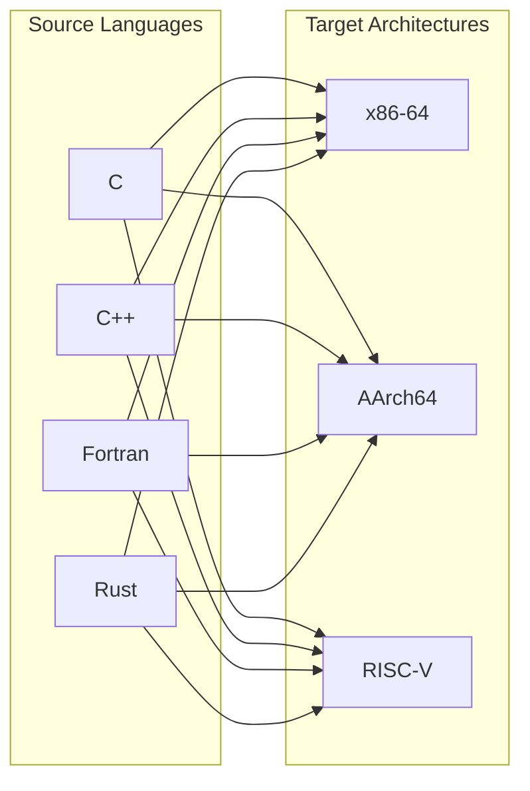

この $M \times N$ 問題を解決するのが**中間表現（Intermediate Representation, IR）** である。各ソース言語のフロントエンドがソースコードを共通の IR に変換し（$M$ 個）、各ターゲット向けのバックエンドが IR から機械語を生成する（$N$ 個）。これにより必要な変換器は $M + N$ 個に削減される。さらに、IR 上で実装された最適化パスはすべての言語・アーキテクチャの組み合わせに対して自動的に適用される。

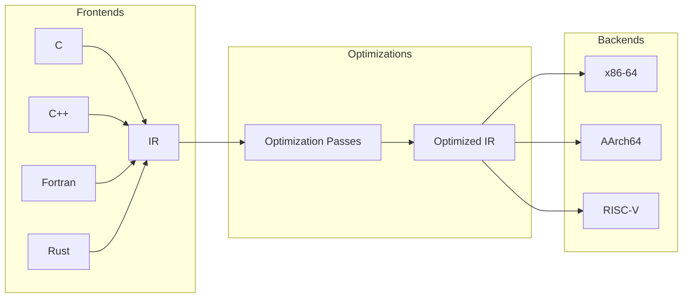

### 1.2 IR設計の要件

優れた IR には以下の性質が求められる。

**表現力（expressiveness）**：ソース言語の意味を欠落なく表現できること。高水準言語が持つ構造化制御フロー、型情報、例外処理などの意味論的情報を適切に保持しなければならない。

**解析容易性（analyzability）**：最適化パスがプログラムの性質を効率的に解析できること。変数の定義と使用の関係、制御フローの構造、データの流れなどを容易に追跡できる形式が望ましい。

**ターゲット独立性（target independence）**：特定のハードウェアの詳細に依存しないこと。ただし、後述するようにIRは必ずしも完全にターゲット独立である必要はなく、低レベル化の過程でターゲット固有の情報を徐々に取り込むことが一般的である。

**変換容易性（transformability）**：最適化変換を安全かつ効率的に適用できること。命令の追加・削除・移動・置換が容易であることが求められる。

### 1.3 IRの分類

IR はその抽象度によって大きく3つのレベルに分類される。

| レベル | 特徴 | 例 |
|--------|------|-----|
| 高水準IR (HIR) | ソース言語の構造を保持。型情報、ループ構造が明示的 | Clang AST, Rust HIR |
| 中水準IR (MIR) | 言語非依存。最適化に適した形式 | LLVM IR, Rust MIR |
| 低水準IR (LIR) | ターゲットに近い。レジスタ・命令選択を意識 | LLVM MachineIR, V8 Lithium |

多くの現代のコンパイラは、これら複数のレベルの IR を段階的に使用する**多段IR（multi-level IR）** アーキテクチャを採用している。ソースコードは最初にHIRに変換され、最適化と低レベル化を繰り返しながらMIR、LIRへと段階的に詳細化されていく。

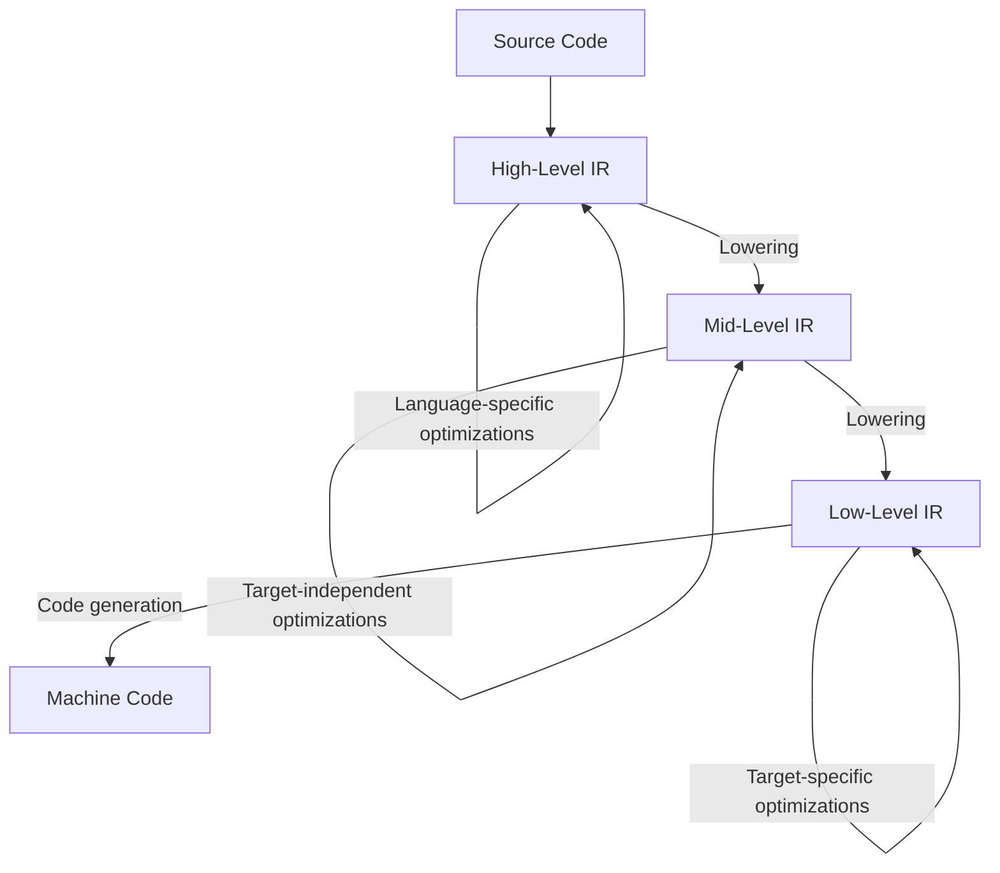

## 2. 三番地コード — 命令型IRの基本形式

### 2.1 三番地コードとは

**三番地コード（Three-Address Code, TAC）** は、最も古典的かつ広く使われるIR形式の一つである。その名の通り、各命令は最大3つのアドレス（オペランド）を持つ。一般的な形式は以下である。

```
x = y op z
```

ここで `x` は結果を格納する変数、`y` と `z` はオペランド、`op` は演算子である。複雑な式は一時変数を導入することで分解される。

たとえば、ソースコードの式 `a = b * c + d * e` は以下の三番地コードに変換される。

```
t1 = b * c
t2 = d * e
a  = t1 + t2
```

### 2.2 三番地コードの命令セット

典型的な三番地コードは以下のような命令を持つ。

| 命令 | 形式 | 説明 |
|------|------|------|
| 代入 | `x = y op z` | 二項演算 |
| 単項演算 | `x = op y` | 否定、ビット反転など |
| コピー | `x = y` | 単純コピー |
| 条件分岐 | `if x relop y goto L` | 条件付きジャンプ |
| 無条件分岐 | `goto L` | 無条件ジャンプ |
| 関数呼び出し | `x = call f(a1, ..., an)` | 関数呼び出し |
| 返却 | `return x` | 関数からの復帰 |
| メモリ操作 | `x = *y` / `*x = y` | ロード/ストア |

### 2.3 具体例：ソースコードからTACへ

以下のCコードを三番地コードに変換してみよう。

```c
int factorial(int n) {
    int result = 1;
    while (n > 1) {
        result = result * n;
        n = n - 1;
    }
    return result;
}
```

対応する三番地コード：

```
factorial:
    result = 1
L1: if n <= 1 goto L2
    t1 = result * n
    result = t1
    t2 = n - 1
    n = t2
    goto L1
L2: return result
```

### 2.4 基本ブロックと制御フローグラフ

三番地コードの列はそのままでは構造が平坦であるが、**基本ブロック（basic block）** と**制御フローグラフ（Control Flow Graph, CFG）** によって構造化される。

**基本ブロック**は、以下の性質を持つ命令の最大列である。

1. 制御フローは先頭の命令からのみ入る
2. 制御フローは末尾の命令からのみ出る（分岐またはフォールスルー）
3. ブロック内の命令は必ず先頭から末尾まで順に実行される

先の階乗のコードは以下のような基本ブロックに分割される。

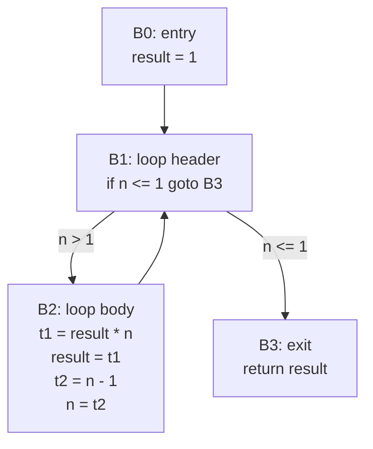

CFGはコンパイラ最適化の基盤となるデータ構造である。支配関係（dominance）、ループ検出、到達可能性解析など、多くの解析がCFG上で定義される。

### 2.5 TACの表現形式

三番地コードの内部表現としては、主に以下の2つが使われる。

**四つ組（quadruple）**：`(op, arg1, arg2, result)` の4要素タプル。

```
(*, b, c, t1)
(*, d, e, t2)
(+, t1, t2, a)
```

**三つ組（triple）**：結果を暗黙的に命令番号で参照する。`(op, arg1, arg2)` の3要素タプルのみを使い、結果は命令のインデックスそのもので表す。

```
(0) (*, b, c)
(1) (*, d, e)
(2) (+, (0), (1))
```

三つ組は一時変数を不要にする代わりに、命令の並び替えが困難という欠点がある。命令を移動するとインデックスが変わり、すべての参照を更新しなければならない。この問題を解決した**間接三つ組（indirect triple）** では、命令への参照をインデックスの間接テーブルを介して行う。

## 3. SSA（Static Single Assignment）形式

### 3.1 従来のIRの問題点

三番地コードでは、同じ変数に対して複数回の代入（定義）が行われる。先の階乗の例では、変数 `result` はブロック B0 で一度、ブロック B2 でもう一度定義されている。

この**複数定義**の存在は最適化の妨げとなる。たとえば、ある命令が変数 `x` を使用するとき、その値がどの定義に由来するかを知るには、**到達定義解析（reaching definitions analysis）** が必要である。この解析はCFG上のデータフロー方程式を反復法で解く必要があり、計算コストがかかるうえ、結果が集合（複数の定義が到達しうる）になるため、最適化の判断が複雑になる。

### 3.2 SSAの基本概念

**SSA（Static Single Assignment）形式**は、1988年にIBM Research のRon Cytron、Jeanne Ferrante、Barry Rosen、Mark Wegman、Kenneth Zadeck らによって提案された、IRの革新的な性質である。SSA形式の核心的な規則は単純である。

> **各変数はプログラム中でただ一度だけ定義される。**

つまり、代入文の左辺に同じ変数名が2回以上現れることを禁止する。同じ概念的な変数に対する複数の代入は、添字付きの異なる変数名に**リネーム（rename）** される。

先の階乗の例をSSA形式に変換してみよう。

```
// Before SSA
result = 1
L1: if n <= 1 goto L2
    t1 = result * n
    result = t1
    t2 = n - 1
    n = t2
    goto L1
L2: return result
```

素朴にリネームすると：

```
result_0 = 1
L1: if n_? <= 1 goto L2     // n_? — which definition?
    t1_0 = result_? * n_?   // result_? — which definition?
    result_1 = t1_0
    t2_0 = n_? - 1
    n_1 = t2_0
    goto L1
L2: return result_?          // result_? — which definition?
```

ループのようにCFG上の合流点（join point）が存在する場合、ある変数の使用に対して複数の定義が到達しうる。ブロック B1 の先頭では、`result` の値は初回のループなら `result_0`、2回目以降のループなら `result_1` である。この「どちらの定義を使うか」を明示するための仕組みが必要である。

### 3.3 SSAの利点

SSA形式がもたらす最大の利点は、**定義-使用関係（def-use chain）の明示化**である。各変数はただ一度しか定義されないため、ある使用箇所からその値の定義箇所への逆追跡が一意に決まる。従来は反復的なデータフロー解析を必要とした問題が、SSA形式ではグラフの辺をたどるだけで解決できる。

具体的な利点をまとめると：

1. **定数伝播（constant propagation）が容易**：変数の定義が一箇所だけなので、その定義が定数であれば、すべての使用箇所を安全に定数に置換できる
2. **冗長計算の検出が効率的**：同じ値を計算する式を検出（Global Value Numbering）しやすい
3. **不要コード除去が簡単**：使用箇所のない定義は安全に削除できる
4. **エイリアス解析が精密**：各名前が一つの値に対応するため、値の追跡が正確

## 4. φ関数 — CFGの合流点の解決

### 4.1 φ関数の導入

SSA形式においてCFGの合流点を処理するために導入されたのが**φ関数（phi function）** である。φ関数は、合流点の先頭に挿入される擬似命令であり、制御フローがどの先行ブロックから来たかに応じて値を選択する。

```
x_3 = φ(x_1, x_2)
```

この命令は「制御フローが左のブロックから来た場合は `x_1` を、右のブロックから来た場合は `x_2` を `x_3` に代入する」という意味である。φ関数は実際のハードウェア命令としては存在せず、SSA形式の概念上の装置である。コード生成時にはφ関数は除去され、コピー命令やレジスタ割り当ての工夫によって実現される。

先の階乗の例をφ関数を用いて完全なSSA形式にすると以下のようになる。

```
B0:
    result_0 = 1
    goto B1

B1:
    result_1 = φ(result_0, result_2)  // from B0: result_0, from B2: result_2
    n_1      = φ(n_0, n_2)            // from B0: n_0 (parameter), from B2: n_2
    if n_1 <= 1 goto B3

B2:
    t1_0     = result_1 * n_1
    result_2 = t1_0
    t2_0     = n_1 - 1
    n_2      = t2_0
    goto B1

B3:
    return result_1
```

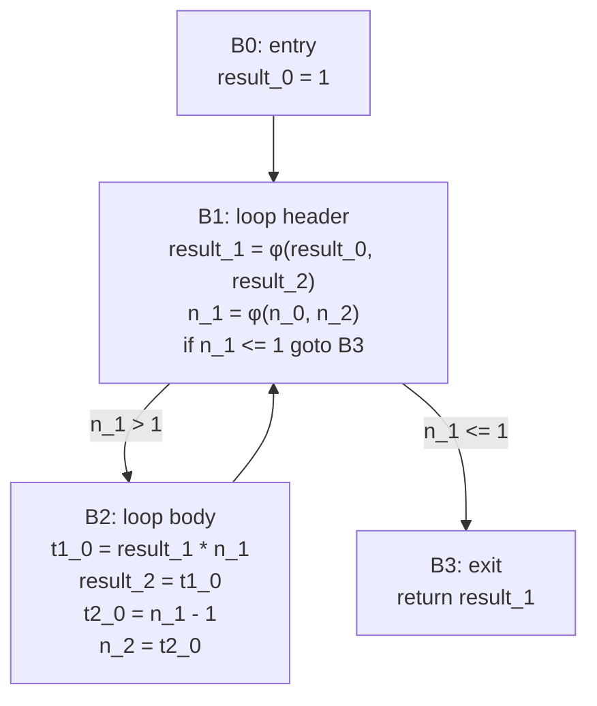

### 4.2 φ関数の意味論的な位置づけ

φ関数はブロックの「先頭」に配置されるが、その実行意味論には注意が必要である。同じブロック内の複数のφ関数は**同時に**（並列に）評価されるとみなす。つまり、あるφ関数の結果が同じブロック内の別のφ関数に影響を与えることはない。

```
// These two phi functions execute "simultaneously"
x_2 = φ(x_0, x_1)
y_2 = φ(y_0, y_1)
```

この並列実行意味論は、φ関数除去（SSA destruction）の際にコピー命令の挿入順序に影響するため、実装上重要な考慮事項である。

### 4.3 φ関数の配置場所

φ関数はCFGのどのブロックに配置すべきだろうか。素朴な方法は、すべての合流点（2つ以上の先行ブロックを持つブロック）のすべての変数に対してφ関数を挿入することだが、これでは不必要に多くのφ関数が生成される。最小限かつ正確なφ関数の配置を行うための概念が**支配辺境（dominance frontier）** である。この詳細は次節で述べる。

## 5. SSA構築アルゴリズム

### 5.1 支配関係

SSA構築を理解するには、まずCFG上の**支配関係（dominance relation）** を把握する必要がある。

**定義**：CFGにおいて、エントリノードからノード $n$ へのすべてのパスがノード $d$ を通る場合、$d$ は $n$ を**支配する（dominate）** といい、$d \text{ dom } n$ と書く。特に、$d \neq n$ の場合を**真に支配する（strictly dominate）** という。

**直接支配者（immediate dominator, idom）**：ノード $n$ を真に支配するノードのうち、$n$ に最も近いもの。エントリノード以外のすべてのノードは一意の直接支配者を持つ。

直接支配関係は**支配木（dominator tree）** を形成する。根はCFGのエントリノードであり、各ノードの親がその直接支配者である。

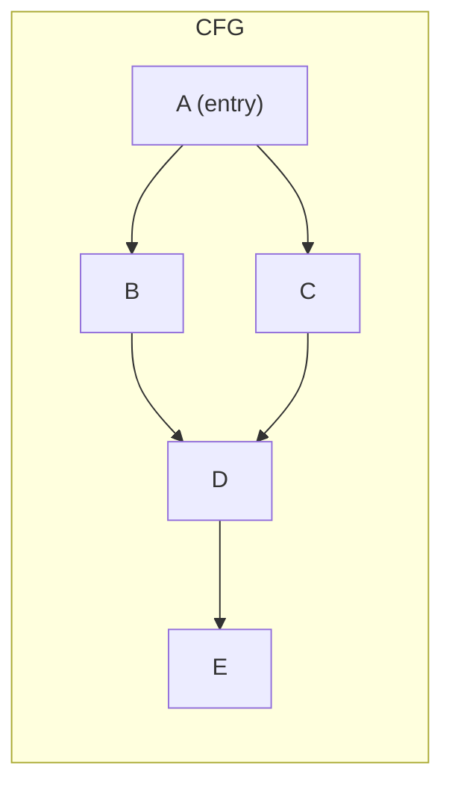

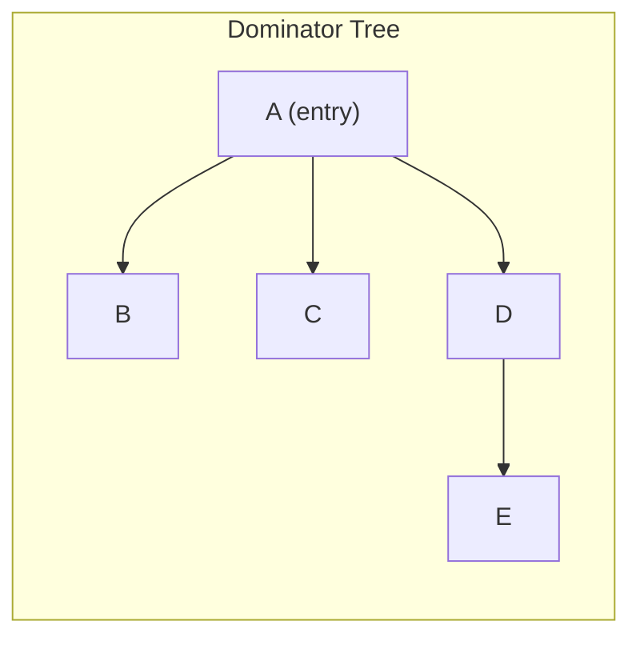

この例では、ノード D はエントリ A からの経路で B を経由する場合と C を経由する場合があるため、B は D を支配しない。A のみが D を支配し、A が D の直接支配者となる。

### 5.2 支配辺境

**支配辺境（Dominance Frontier, DF）** は、SSAにおけるφ関数の配置場所を決定する鍵概念である。

**定義**：ノード $d$ の支配辺境 $DF(d)$ は、以下の条件を満たすノード $n$ の集合である。

$$DF(d) = \{ n \mid d \text{ dom } p \text{ for some predecessor } p \text{ of } n, \text{ but } d \text{ does not strictly dominate } n \}$$

直感的には、$DF(d)$ は「$d$ の支配が及ばなくなる境界」を示す。ノード $d$ で変数に値を代入した場合、$d$ が支配するすべてのブロックではその値が確実に到達するが、$DF(d)$ に属するブロックでは別の経路からの値と合流する可能性がある。したがって、$DF(d)$ のブロックにφ関数を配置する必要がある。

### 5.3 Cytronらのアルゴリズム

1991年にCytronらが発表したSSA構築アルゴリズムは、支配辺境を用いた効率的な手法であり、現代のコンパイラで広く使われている。アルゴリズムは2つのフェーズからなる。

**フェーズ1：φ関数の挿入**

各変数 $v$ について、$v$ が定義されているブロックの支配辺境にφ関数を挿入する。新たに挿入されたφ関数も $v$ の定義とみなし、そのブロックの支配辺境にもφ関数を挿入する。これを反復的に行い、新しいφ関数が挿入されなくなるまで繰り返す。

```
// Phase 1: Phi function insertion (pseudocode)
for each variable v:
    W = set of blocks where v is defined
    while W is not empty:
        remove a block b from W
        for each block d in DF(b):
            if d does not already have a phi for v:
                insert "v = φ(...)" at the start of d
                add d to W  // phi is also a definition
```

**フェーズ2：変数のリネーム**

支配木を深さ優先でたどりながら、各変数に添字を付けてリネームする。各ブロックで新しい定義に遭遇するたびにカウンタを増加させ、使用箇所は現在のスタックトップの添字に置換する。

```
// Phase 2: Renaming (pseudocode)
function rename(block b):
    for each phi function "v = φ(...)" in b:
        replace v with new name v_i (increment counter for v)
        push v_i onto stack[v]
    for each instruction in b:
        for each use of variable v:
            replace with top of stack[v]
        for each definition of variable v:
            replace with new name v_i (increment counter for v)
            push v_i onto stack[v]
    for each successor s of b:
        for each phi function in s:
            set the operand corresponding to b to top of stack[v]
    for each child c of b in dominator tree:
        rename(c)
    pop all names pushed in this call
```

### 5.4 計算量

Cytronらのアルゴリズムの時間計算量は、支配木の構築に $O(|E| \cdot \alpha(|V|))$（Lengauer-Tarjan アルゴリズム使用時）、支配辺境の計算に $O(|V|^2)$（最悪ケース）、φ関数の挿入とリネームに $O(\sum |DF(v)|)$ である。実用的にはほぼ線形時間で完了する。

### 5.5 pruned SSAとsemi-pruned SSA

Cytronらのアルゴリズムは**最小SSA（minimal SSA）** を構築するが、これでも不必要なφ関数が残る場合がある。たとえば、φ関数で定義された変数がどこでも使われない場合、そのφ関数は不要である。

**pruned SSA** は、ライブ変数解析（live variable analysis）を事前に行い、変数が生存していないブロックにはφ関数を挿入しないバージョンである。これによりφ関数の数が大幅に削減されるが、ライブ変数解析のコストがかかる。

**semi-pruned SSA** は、ローカル変数（単一ブロック内でのみ使われる変数）を事前に除外することで、完全なライブ変数解析を行わずにφ関数を削減する妥協的手法である。

## 6. SSAに基づく最適化

SSA形式の真価は、その上で動作する最適化パスの簡潔さと効果にある。ここでは代表的な3つの最適化を詳しく見ていく。

### 6.1 スパース条件付き定数伝播（Sparse Conditional Constant Propagation, SCCP）

**定数伝播（constant propagation）** は、コンパイル時に値が定数と判明する変数を、その定数で置き換える最適化である。SSA形式では、各変数の定義が一箇所のみであるため、定数伝播が劇的に単純化される。

Wegman-Zadeck の**スパース条件付き定数伝播（SCCP）** アルゴリズムは、SSA形式の利点を最大限に活用した手法であり、1991年に発表された。このアルゴリズムは定数伝播と到達不能コード除去を同時に行う。

アルゴリズムは**格子（lattice）** を用いて各SSA変数の状態を管理する。

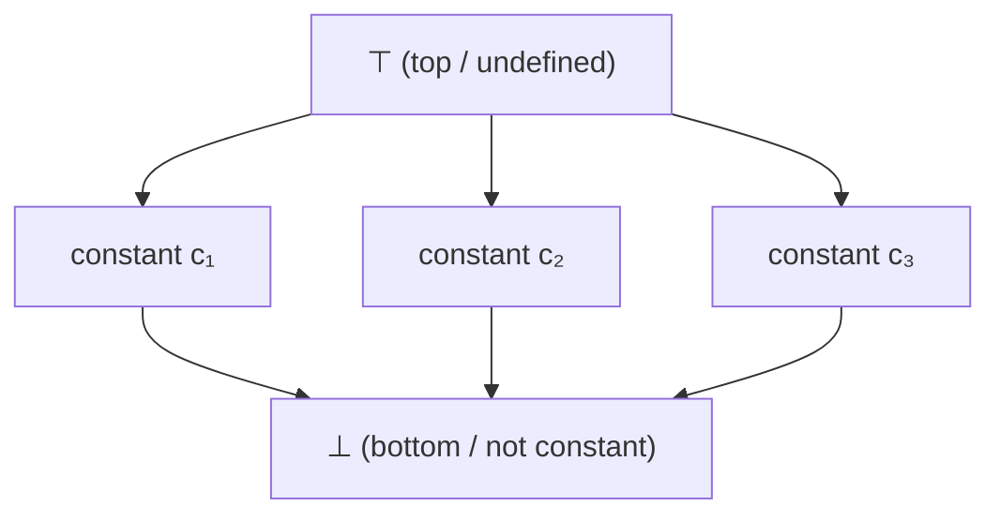

各変数の状態は以下の3種類のいずれかである。

- $\top$（top）：まだ評価されていない（初期状態）
- 定数 $c$：値が定数 $c$ であると判明
- $\bot$（bottom）：定数でない（複数の異なる値をとりうる）

状態は $\top \to c \to \bot$ の方向にのみ遷移し、逆方向には戻らない（単調性）。この単調性がアルゴリズムの停止性を保証する。

SCCPは2つのワークリストを用いる。

1. **CFGワークリスト**：実行可能と判明したCFGの辺を管理
2. **SSAワークリスト**：値が変化したSSA変数の使用箇所を管理

```
// SCCP algorithm (pseudocode)
initialize all variables to ⊤
initialize all CFG edges as not executable
add entry edge to CFG worklist

while CFG worklist or SSA worklist is not empty:
    // Process CFG edges
    if CFG worklist has edge (u, v):
        mark edge as executable
        if v not yet visited:
            evaluate all phi functions and instructions in v
    // Process SSA uses
    if SSA worklist has variable v:
        for each use u of v:
            if u's block is reachable:
                re-evaluate instruction at u
```

条件分岐の条件式が定数に評価される場合、片方の辺だけが実行可能とマークされる。これにより、到達不能なブロック内の定義がφ関数に影響を与えないため、従来の定数伝播では見逃す最適化機会を捉えることができる。

::: details SCCPの具体例

```
B0:
    x_0 = 2
    y_0 = 3
    goto B1

B1:
    z_0 = x_0 + y_0     // z_0 = 2 + 3 = 5
    if z_0 > 4 goto B2  // 5 > 4 is true, only B2 is reachable
    goto B3

B2:
    w_0 = z_0 * 2       // w_0 = 5 * 2 = 10
    goto B4

B3:                      // unreachable!
    w_1 = 0
    goto B4

B4:
    w_2 = φ(w_0, w_1)   // only w_0 reaches here, so w_2 = 10
    return w_2           // return 10
```

SCCPはこのプログラム全体を `return 10` に最適化できる。B3 が到達不能であるため、φ関数は実質的に `w_2 = w_0 = 10` と判定される。

:::

### 6.2 死コード除去（Dead Code Elimination, DCE）

**死コード除去（Dead Code Elimination, DCE）** は、プログラムの結果に影響しない命令を削除する最適化である。SSA形式では、各変数の使用箇所が明確に追跡できるため、DCEは非常に効率的に実装できる。

SSA上のDCEには主に2つのアプローチがある。

**単純DCE**：使用箇所のない定義を削除する。削除によって他の定義の使用箇所がなくなれば、連鎖的に削除する。

```
// Simple DCE on SSA
worklist = all instructions
while worklist is not empty:
    remove instruction i from worklist
    if i has no uses (and no side effects):
        for each operand v of i:
            remove i from the use list of v
            add the definition of v to worklist
        delete i
```

**Aggressive DCE（積極的DCE）**：逆方向に動作する。まず、副作用のある命令（ストア、関数呼び出し、return文）を「必要」とマークし、そこから逆方向にdef-useチェーンをたどって、必要な命令に到達するために必要な命令を再帰的にマークする。マークされなかった命令はすべて削除される。

```
// Aggressive DCE (pseudocode)
mark all instructions as "dead"
worklist = instructions with side effects
for each i in worklist:
    mark i as "live"
while worklist is not empty:
    remove instruction i from worklist
    for each operand v of i:
        let d = definition of v
        if d is not marked "live":
            mark d as "live"
            add d to worklist
delete all instructions still marked "dead"
```

Aggressive DCEは、単純DCEでは除去できない循環依存（例：φ関数同士の相互参照で、どこからも使われないサイクル）も検出して除去できる。

### 6.3 大域的値番号付け（Global Value Numbering, GVN）

**大域的値番号付け（Global Value Numbering, GVN）** は、SSA形式の利点を最大限に活用した冗長計算除去の手法である。GVNは、同じ値を計算するSSA変数に同じ「値番号」を割り当て、冗長な計算を検出・除去する。

GVNの基本的な考え方は、演算 `op(v1, v2)` の値番号を `(op, VN(v1), VN(v2))` のハッシュで決定することである。

```
a_0 = x_0 + y_0   // VN: hash(+, VN(x_0), VN(y_0)) = #1
b_0 = x_0 + y_0   // VN: hash(+, VN(x_0), VN(y_0)) = #1 (same!)
c_0 = a_0 * 2     // VN: hash(*, #1, VN(2))          = #2
d_0 = b_0 * 2     // VN: hash(*, #1, VN(2))          = #2 (same!)
```

`a_0` と `b_0` は同じ値番号 #1 を持つため、`b_0` の計算は冗長であり、`b_0` を `a_0` で置き換えることができる。同様に `d_0` は `c_0` で置き換えられる。

SSA形式がなければ、`x` や `y` が途中で再代入されていないかをデータフロー解析で確認する必要があるが、SSA形式では変数の定義が一度きりであるため、同じSSA変数は常に同じ値を表す。この性質がGVNを効率的にしている。

::: tip GVNと共通部分式除去（CSE）の違い
共通部分式除去（Common Subexpression Elimination, CSE）は構文的に同一の式を検出するが、GVNは意味的に同一の値を検出する。たとえば、`a + b` と `b + a`（加算の交換法則）を同じ値と認識できるのはGVNの強みである。
:::

## 7. LLVM IR — 現代の産業標準IR

### 7.1 LLVMプロジェクトの概要

**LLVM**（元は Low Level Virtual Machine の略であったが、現在は固有名詞として扱われる）は、Chris Lattner が2000年にイリノイ大学で開始したコンパイラ基盤プロジェクトである。LLVMの中核を成す**LLVM IR**は、現代で最も広く使われているコンパイラ中間表現の一つであり、Clang（C/C++/Objective-C）、Rust、Swift、Julia、Kotlin/Native など多くの言語のバックエンドとして採用されている。

### 7.2 LLVM IRの特徴

LLVM IR は以下の特徴を持つ。

**SSA形式**：LLVM IR は設計当初からSSA形式を採用しており、すべてのレジスタ値（仮想レジスタ）は一度だけ定義される。φ関数も明示的に表現される。

**型付き**：すべての値が明示的な型を持つ。整数型（`i1`, `i8`, `i32`, `i64`）、浮動小数点型（`float`, `double`）、ポインタ型（`ptr`）、ベクトル型、構造体型など、豊富な型システムを提供する。

**無限レジスタ**：LLVM IR は無限個の仮想レジスタを想定し、物理レジスタの制約を持たない。レジスタ割り当ては後段のバックエンドが担当する。

**3つの等価な表現形式**：LLVM IR は、テキスト形式（`.ll`ファイル）、バイナリ形式（ビットコード、`.bc`ファイル）、メモリ内表現（C++ オブジェクト）の3つの等価な表現を持つ。

### 7.3 LLVM IRの具体例

先の階乗関数をLLVM IRで表現すると以下のようになる。

```llvm
define i32 @factorial(i32 %n) {
entry:
  br label %loop.header

loop.header:                              ; preds = %loop.body, %entry
  %result = phi i32 [ 1, %entry ], [ %new.result, %loop.body ]
  %n.val  = phi i32 [ %n, %entry ], [ %n.dec, %loop.body ]
  %cond   = icmp sle i32 %n.val, 1       ; signed less-than-or-equal
  br i1 %cond, label %exit, label %loop.body

loop.body:                                ; preds = %loop.header
  %new.result = mul i32 %result, %n.val   ; result * n
  %n.dec      = sub i32 %n.val, 1         ; n - 1
  br label %loop.header

exit:                                     ; preds = %loop.header
  ret i32 %result
}
```

いくつかの注目点を解説する。

- `%result` や `%n.val` は SSA 変数（仮想レジスタ）である。`%` プレフィックスはローカル値を示す
- `phi i32 [ 1, %entry ], [ %new.result, %loop.body ]` はφ関数。各オペランドが `[値, 先行ブロック名]` のペアで明示される
- `icmp sle i32` は符号付き整数の比較命令。結果は `i1`（1ビット整数、すなわちブーリアン）型
- `br i1 %cond, label %exit, label %loop.body` は条件分岐。`i1` 型の値に基づいて分岐先を選択

### 7.4 LLVM IRのメモリモデル

LLVM IR はSSA形式であるが、メモリ操作（`load`/`store`）はSSAの制約から免除されている。スタック上の変数は `alloca` 命令で確保し、`store` で書き込み、`load` で読み出す。

```llvm
define i32 @example(i32 %x) {
entry:
  %ptr = alloca i32              ; allocate stack slot
  store i32 %x, ptr %ptr        ; store x to stack
  store i32 42, ptr %ptr         ; overwrite with 42 (multiple stores OK)
  %val = load i32, ptr %ptr      ; load value
  ret i32 %val
}
```

フロントエンドは最初にすべてのローカル変数を `alloca` で確保した形式のIRを生成することが多い。これは SSA 構築をフロントエンドが行わなくてよいという利点がある。その後、LLVM の **mem2reg** パス（または **sroa** パス）が `alloca`/`load`/`store` をSSA形式のレジスタ操作に昇格（promote）させる。このパスが実質的にSSA構築アルゴリズムを実行する。

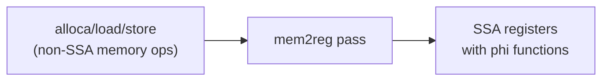

### 7.5 LLVMのパスマネージャ

LLVMの最適化は**パス（pass）** と呼ばれる独立したモジュールとして実装される。各パスはIRを入力として受け取り、変換されたIRを出力する。パスは以下のように分類される。

| パスの種類 | スコープ | 例 |
|-----------|---------|-----|
| Module Pass | モジュール全体 | インライン化、デッドグローバル除去 |
| Function Pass | 単一関数 | mem2reg, SCCP, GVN, DCE |
| Loop Pass | 単一ループ | ループ不変式移動、ループアンローリング |

パスの実行順序は**パスマネージャ（pass manager）** が管理する。パス間の依存関係を解析し、効率的な実行順序を決定する。現代のLLVM（LLVM 17以降）は**新パスマネージャ（New Pass Manager）** を使用しており、パスの依存関係をより精密に管理できる。

## 8. Sea of Nodes — V8 TurboFanのIR

### 8.1 Sea of Nodesの起源

**Sea of Nodes** は、1993年にCliff Click がその博士論文で提案したIR表現である。従来のCFGベースのIRとは根本的に異なるアプローチをとり、命令のスケジューリング（実行順序の決定）をIR構築時ではなく、コード生成時まで遅延させる。

Google V8 JavaScript エンジンの最適化コンパイラ **TurboFan** がSea of Nodesを採用したことで、この手法は広く知られるようになった。また、Java HotSpot VM の C2 コンパイラ（Server Compiler）や、Graal コンパイラも同じ手法を用いている。

### 8.2 従来のCFGベースIRの制約

従来のCFGベースIR（LLVM IRを含む）では、命令はブロック内で線形に順序付けられている。しかし、この順序の多くは実際には不要な制約である。例えば以下のSSAコードを考える。

```
B1:
    a = load [p]
    b = a + 1
    c = load [q]
    d = c * 2
    e = b + d
```

ここで `a = load [p]` と `c = load [q]` の間にデータ依存は存在しない（エイリアスがないと仮定した場合）。しかし、CFGベースIRではこれらの命令にブロック内の順序が付いている。命令スケジューリングパスで順序を変更することは可能だが、IRの表現自体が不必要な順序制約を含んでいることには変わりない。

### 8.3 Sea of Nodesの構造

Sea of Nodesでは、プログラムは**ノードのグラフ**として表現される。CFGのような線形の命令列は存在しない。各ノードは演算を表し、ノード間の辺は依存関係を表す。辺には3種類がある。

1. **データ辺（data edge / value edge）**：値の流れを表す。SSAのdef-use関係に対応
2. **制御辺（control edge）**：実行順序の制約を表す。条件分岐、関数呼び出しなど
3. **エフェクト辺（effect edge）**：副作用の順序を表す。メモリ操作の順序制約

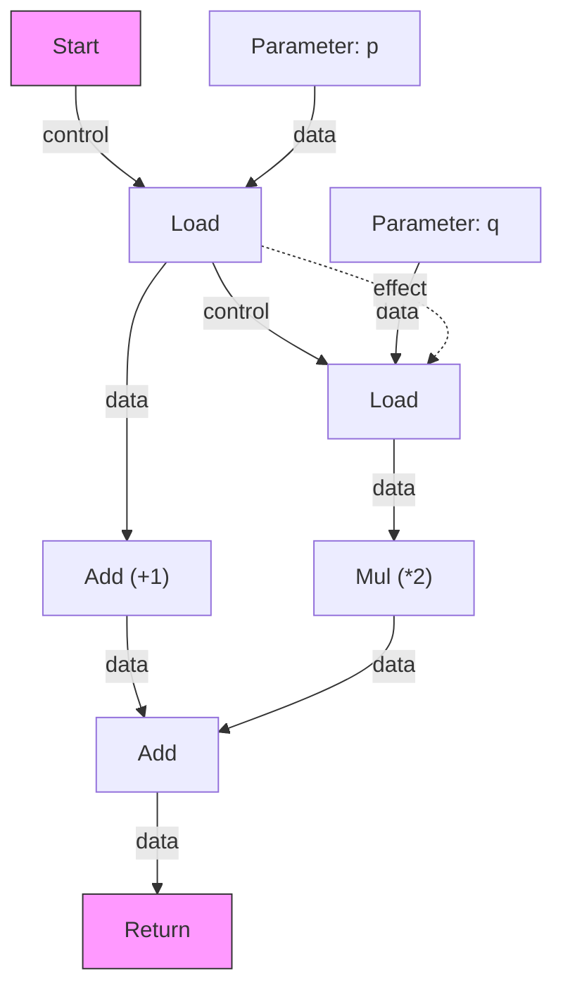

この表現では、`Add (+1)` と `Mul (*2)` の間には依存関係がないため、どちらが先に実行されてもよい。命令のスケジューリングは後段のコード生成で行われ、その時点でターゲットアーキテクチャの特性（パイプラインの深さ、実行ユニットの数など）を考慮した最適な順序が決定される。

### 8.4 Sea of Nodesの利点と課題

**利点**：

- **不必要な順序制約の排除**：純粋にデータ依存と副作用の依存のみが表現されるため、最適化の自由度が高い
- **φ関数の不要化**：Sea of Nodesでは、CFGの合流点は Merge ノードとして表現され、φ関数は Phi ノードとして自然にグラフに統合される。φ関数が「特別な命令」ではなく、通常のノードと同等に扱われる
- **命令移動の容易さ**：ループ不変式の移動（Loop Invariant Code Motion, LICM）のような最適化が、グラフの辺を付け替えるだけで実現できる

**課題**：

- **デバッグの困難さ**：線形の命令列と異なり、グラフ構造のIRはダンプや視覚化が難しい。V8 の TurboFan には Turbolizer という専用の可視化ツールが存在する
- **コンパイル時間**：グラフ操作のオーバーヘッドがCFGベースIRより大きい場合がある
- **スケジューリングの複雑さ**：最終的にはノードを線形の命令列に配置する必要があり、この**グローバルスケジューリング（global scheduling）** は NP困難な問題のインスタンスに近く、ヒューリスティクスに頼ることになる

### 8.5 V8 TurboFanにおける実際

V8 のコンパイルパイプラインでは、JavaScript コードは以下の段階を経て実行される。

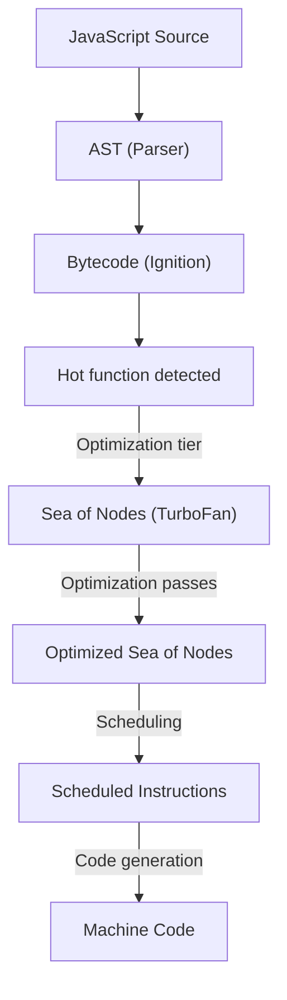

TurboFan では、Sea of Nodes上で型推論、インライン化、冗長チェック除去（bounds check elimination）、エスケープ解析などの最適化が実行される。最適化後、**スケジューリングフェーズ**でノードを基本ブロックに配置し、線形の命令列を生成する。このスケジューリングでは、早期スケジューリング（earliest placement）と遅延スケジューリング（latest placement）の間でバランスを取る。

> [!NOTE]
> V8 は2023年以降、TurboFan に加えて **Maglev** という中間層の最適化コンパイラを導入している。Maglev は CFG ベースの SSA IR を使用しており、TurboFan ほど高度な最適化は行わないが、コンパイル時間が短い。Sea of Nodes のコンパイル時間コストを回避しつつ、一定の最適化効果を得るための設計判断である。

## 9. IRの低レベル化（Lowering）

### 9.1 Loweringとは

**Lowering（低レベル化）** は、高い抽象度のIRをより低い抽象度のIRに段階的に変換するプロセスである。このプロセスは、ソース言語に近い表現からターゲットマシンに近い表現へと、具体的な実装の詳細を一段ずつ確定していく作業である。

Loweringでは主に以下の変換が行われる。

1. **高水準構造の展開**：構造体のコピー、配列のアクセス、仮想関数呼び出しなどを、より基本的な操作に分解する
2. **型の具体化**：抽象的な型を、ターゲットアーキテクチャのサイズとアラインメントに従った具体的な表現に変換する
3. **呼び出し規約の適用**：関数呼び出しを、ターゲットのABI（Application Binary Interface）に従った引数渡し・戻り値の受け渡しに変換する
4. **命令選択（instruction selection）**：IR命令をターゲットアーキテクチャの命令に対応付ける

### 9.2 LLVMにおけるLowering

LLVMのコンパイルパイプラインでは、Loweringは複数の段階を経て行われる。

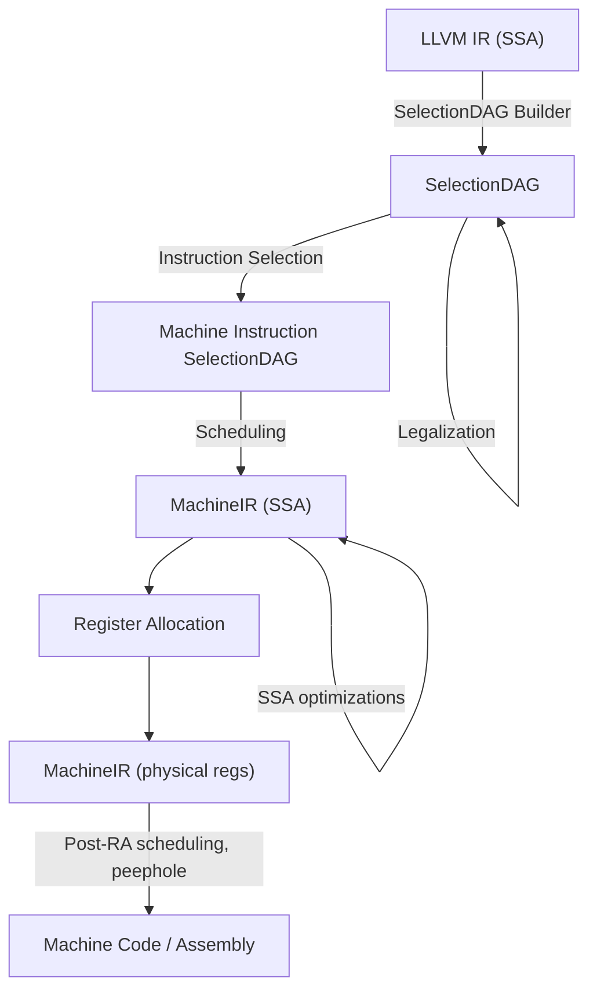

**SelectionDAG**：LLVM IR を DAG（Directed Acyclic Graph）形式に変換し、基本ブロック単位で命令選択を行う。この段階で、LLVM IR の型やオペレーションがターゲットアーキテクチャでサポートされているかを確認し、サポートされていないものは**合法化（legalization）** によって等価な命令列に変換される。

たとえば、32ビットCPUで64ビット整数の加算 `add i64` を行う場合、合法化によって2つの32ビット加算（下位ワードの加算とキャリーを考慮した上位ワードの加算）に分解される。

**MachineIR**：SelectionDAG から生成されるLLVMの低レベルIR。仮想レジスタを使用するSSA形式であり、各命令はターゲット固有のオペコード（例：x86の`MOV`, `ADD`, `IMUL`）を持つ。

**レジスタ割り当て**：仮想レジスタ（無限個）を物理レジスタ（有限個）に割り当てる。レジスタが足りない場合はスピル（メモリへの退避）が発生する。この段階でSSA形式は破壊される。φ関数はコピー命令に変換され、後続のコピー合体（copy coalescing）パスで可能な限り除去される。

### 9.3 SSAの破壊（SSA Destruction）

レジスタ割り当てに先立ち、SSA形式を通常の命令列に戻す**SSA破壊（SSA destruction / SSA elimination）** が必要である。基本的なアプローチは、φ関数を先行ブロックの末尾に挿入するコピー命令に置き換えることである。

```
// SSA form
B1:
    x_1 = ...
    goto B3
B2:
    x_2 = ...
    goto B3
B3:
    x_3 = φ(x_1, x_2)
    use x_3
```

```
// After SSA destruction
B1:
    x_1 = ...
    x_3 = x_1      // copy inserted
    goto B3
B2:
    x_2 = ...
    x_3 = x_2      // copy inserted
    goto B3
B3:
    use x_3
```

しかし、この素朴なアプローチには**スワップ問題（swap problem）** と呼ばれる落とし穴がある。

```
B3:
    a_2 = φ(a_0, a_1)
    b_2 = φ(b_0, b_1)
```

このφ関数群を素朴にコピーに展開すると：

```
B1 (predecessor):
    a_2 = a_0
    b_2 = b_0
```

これは正しく動作する。しかし、もしφ関数が循環的な値の交換を行う場合：

```
B3:
    a_2 = φ(b_0, a_1)
    b_2 = φ(a_0, b_1)
```

素朴なコピー展開：

```
B1 (predecessor):
    a_2 = b_0    // OK
    b_2 = a_0    // but a_0 is already overwritten if a_2 == a_0!
```

この問題を回避するため、実際の実装では一時変数の導入や、コピー命令の並列コピー分解（parallel copy sequentialization）アルゴリズムが使用される。

### 9.4 命令選択のアルゴリズム

命令選択は、IR のパターンをターゲットマシンの命令にマッピングするプロセスである。主要なアプローチとして以下がある。

**マクロ展開（macro expansion）**：各IR命令を対応するマシン命令列に1対1で変換する。最も単純だが、最適化の余地が限られる。

**木パターンマッチング（tree pattern matching）**：式木に対してパターンマッチを行い、最もコストの低いマシン命令の組み合わせを選択する。LLVMのSelectionDAGはこのアプローチを拡張したものである。

たとえば、x86アーキテクチャでは `load` と `add` を融合した `add reg, [mem]` 命令が利用できる。木パターンマッチングでは、以下のようなパターンが定義される。

```
// Pattern: add(reg, load(addr)) → ADD reg, [addr]
// Cost: 1 (fused load-add is cheaper than separate load + add)
```

**GlobalISel**：LLVMで開発が進む新しい命令選択フレームワーク。SelectionDAGの制約（基本ブロック単位の処理、DAGへの変換と再線形化のオーバーヘッド）を克服するため、SSA形式のMachineIR上で直接命令選択を行う。

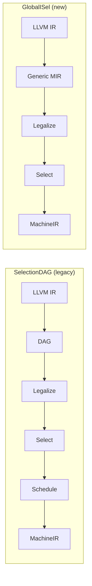

GlobalISelは基本ブロックの境界を越えた最適化が可能であり、コンパイル時間も削減される。ARM64バックエンドなど、一部のターゲットではデフォルトで有効化されている。

### 9.5 レジスタ割り当てとSSA

レジスタ割り当ては、SSA形式と深い関係がある。SSA形式の変数はそれぞれ一度だけ定義されるため、各変数の**生存区間（live range）** は定義点から始まり、最後の使用点で終わる明確な構造を持つ。

従来のレジスタ割り当て（非SSA形式）では、同じ変数が複数回定義されるため、生存区間が分断・重複し、解析が複雑であった。SSA形式では生存区間がシンプルになり、**グラフ彩色（graph coloring）** に基づくレジスタ割り当てが効率化される。

特に注目すべき性質として、SSA形式の干渉グラフ（interference graph）は**弦グラフ（chordal graph）** になることが知られている。弦グラフの彩色問題は多項式時間で最適解が求まるため、SSA形式はレジスタ割り当てに理論的な利点をもたらす。

## 10. 現代のIR設計の潮流

### 10.1 MLIR — 多層IR基盤

**MLIR（Multi-Level Intermediate Representation）** は、2019年にGoogleが発表し、現在はLLVMプロジェクトの一部となっているIRフレームワークである。MLIRの革新的な点は、IR自体を固定するのではなく、**IRを定義するための基盤**を提供することにある。

MLIRでは**ダイアレクト（dialect）** と呼ばれるモジュールが、特定のドメインに適したオペレーションと型を定義する。異なる抽象度のダイアレクトを自由に混在させ、段階的にloweringできる。

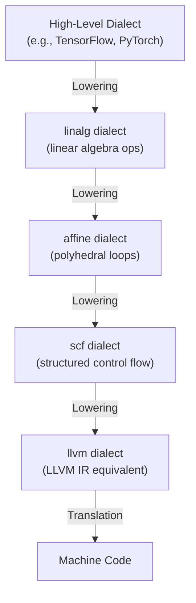

MLIRは特に機械学習コンパイラの領域で威力を発揮している。テンソル演算、行列乗算、畳み込みといったドメイン固有の高水準オペレーションを保持しつつ段階的に最適化・低レベル化することで、XLA、IREE、Triton といったMLコンパイラが効率的なコード生成を実現している。

### 10.2 CraneliftのIR

**Cranelift** は、Mozilla が開発を開始し、現在は Bytecode Alliance が管理するコード生成ライブラリである。RustのWasmtimeランタイムやFirefoxのWebAssembly実行において使用されている。

Craneliftは**e-graph（等価グラフ）** ベースの最適化を採用している点で注目に値する。e-graphは同じ値を表す複数の式を一つのデータ構造に統合し、最適な表現を後から選択する。GVNと命令選択を統一的に扱える可能性があり、研究コミュニティでも注目を集めている。

### 10.3 IRの今後

コンパイラIRの設計は、以下のトレンドに影響を受けて進化を続けている。

**ドメイン特化**：汎用IRだけでなく、機械学習、GPU計算、量子計算など特定ドメインに最適化されたIRの重要性が増している。MLIRのようなフレームワークがこのトレンドを支えている。

**形式的検証**：コンパイラの正当性を数学的に証明する取り組みが進んでいる。CompCert（検証済みCコンパイラ）は、IRの各変換段階の正当性がCoqで証明されている。Alive2プロジェクトは、LLVMの最適化パスの正当性をSMTソルバーで自動検証する。

**JITコンパイルへの適応**：Webブラウザ（V8, SpiderMonkey）やデータベースクエリエンジン（Apache DataFusion）のJITコンパイラでは、コンパイル時間と最適化品質のトレードオフが特に重要である。多段IRアーキテクチャにおいて、どの段階でどの程度の最適化を行うかの判断が、ランタイム性能に直結する。

## まとめ

中間表現は、コンパイラ技術の根幹をなす概念である。ソース言語の意味を保持しながらも、最適化と機械語生成に適した形式を提供することがIRの役割である。

三番地コードは命令型IRの基本形式として、基本ブロックとCFGの概念とともにコンパイラ理論の基盤を築いた。SSA形式はその上に革新をもたらし、各変数が一度だけ定義されるという単純な不変条件によって、定数伝播、死コード除去、大域的値番号付けといった最適化を劇的に効率化した。φ関数は合流点における値の選択を明示し、支配辺境の概念がφ関数の最適な配置場所を数学的に定義する。

LLVM IRは産業界における実質的な標準IRとなり、複数の言語とアーキテクチャを接続するハブとしての役割を果たしている。Sea of Nodesは命令の順序制約を最小化する異なるアプローチを提示し、V8 TurboFanをはじめとするJITコンパイラで採用されている。IRのloweringプロセスは、抽象的な表現からターゲット固有の機械語への橋渡しを段階的に行い、命令選択とレジスタ割り当てがその中核を担う。

MLIRのような多層IRフレームワークの登場は、IRの設計がさらなる進化の途上にあることを示している。コンパイラ技術の進歩は、プログラミング言語の表現力とハードウェアの実行効率の両方を引き上げ続けるだろう。
