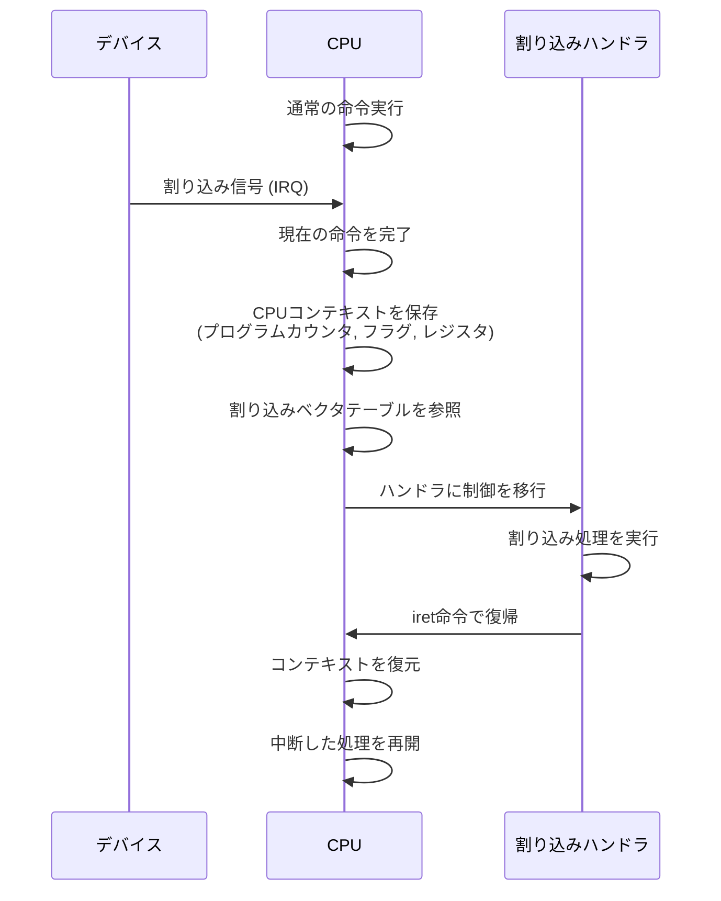
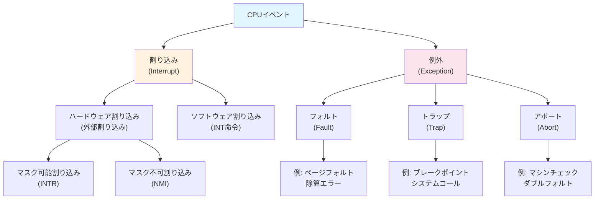
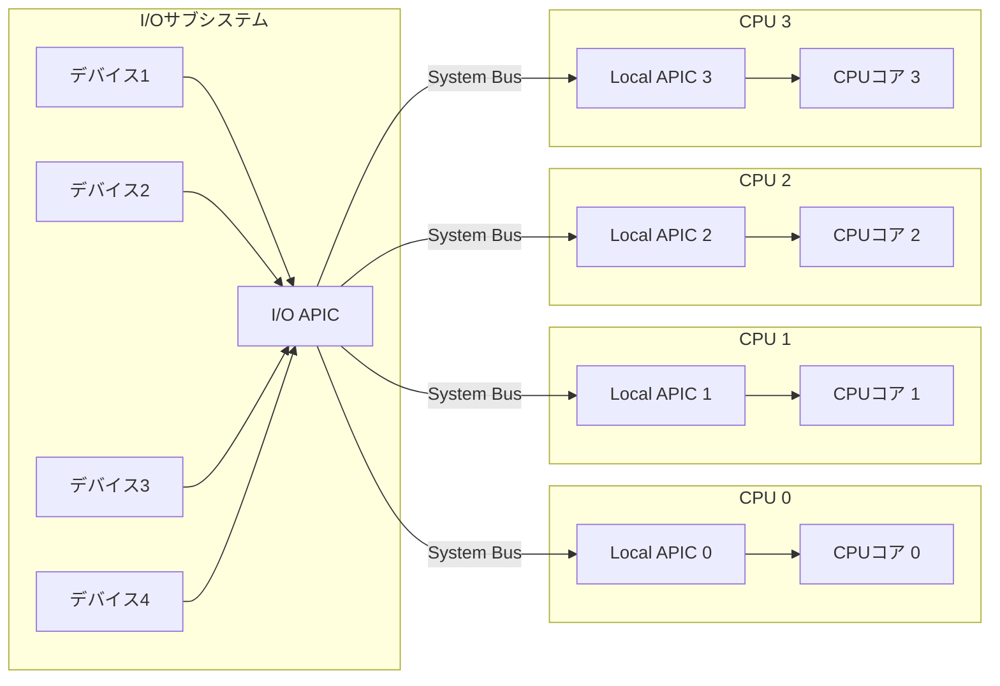
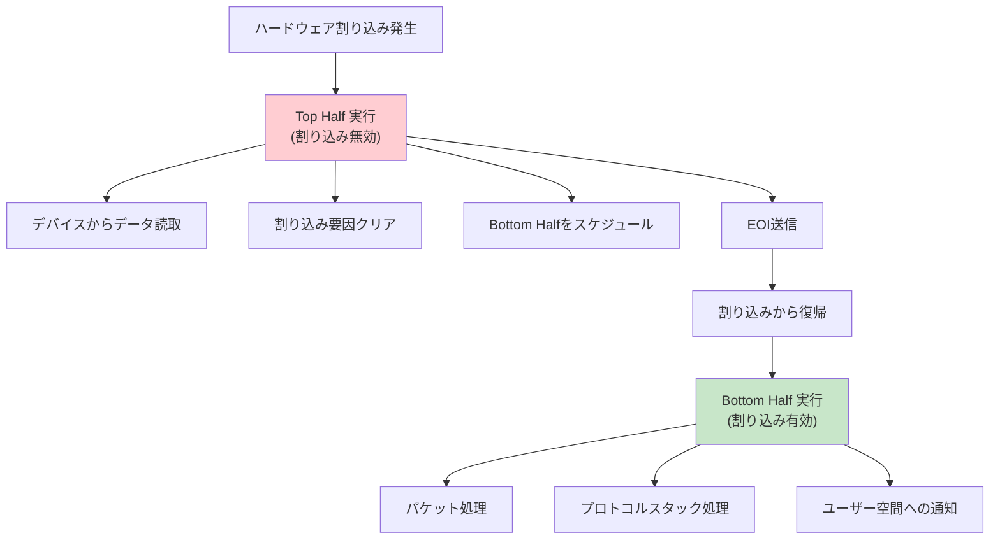
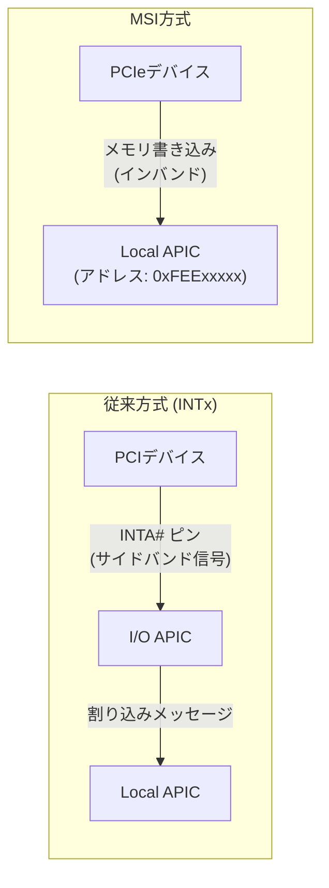
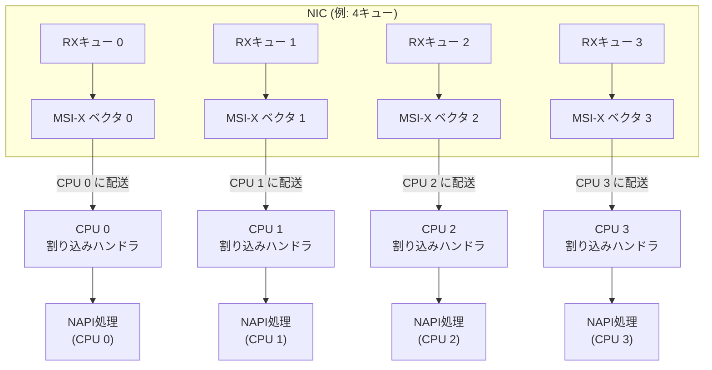
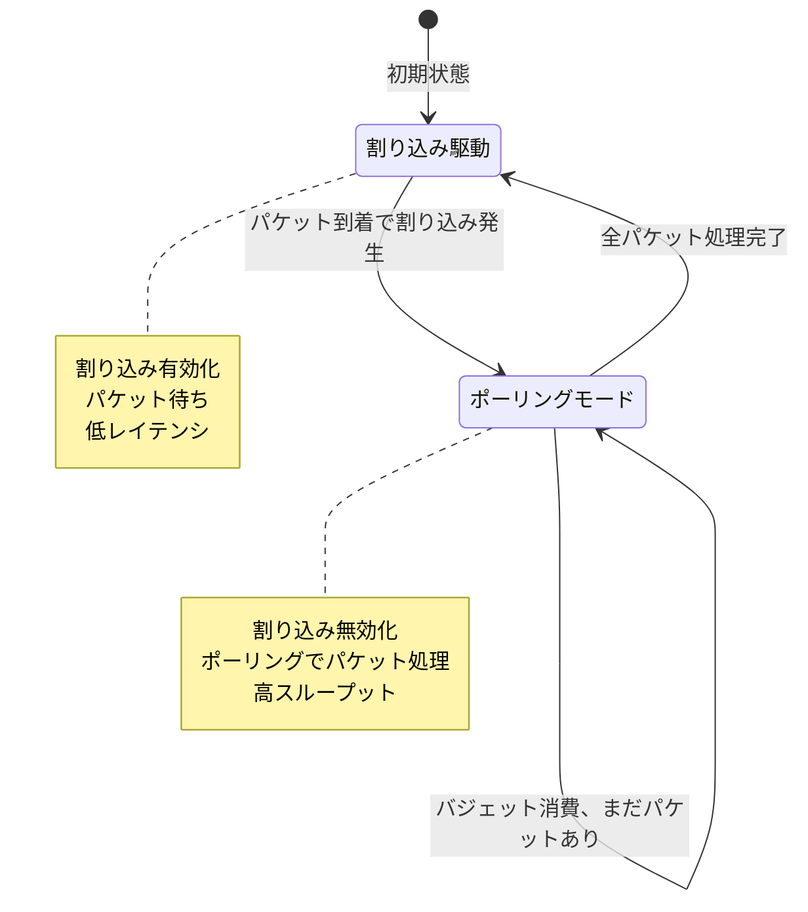

# 割り込みと例外

## 1. 割り込みの基本概念 — CPUの実行フローを制御する根幹メカニズム

### 1.1 なぜ割り込みが必要なのか

コンピュータの動作を根本から考えてみよう。CPUは命令をフェッチし、デコードし、実行するというサイクルを延々と繰り返す。このサイクルだけでは、外部デバイスからの入力（キーボードの打鍵、ネットワークパケットの到着、ディスクI/Oの完了など）にCPUが気づく方法がない。

割り込みが存在しなかった時代、CPUが外部イベントを知る唯一の方法は**ポーリング（polling）** だった。CPUが定期的にデバイスの状態レジスタを読み出し、「何か起きたか？」と確認する方式である。

```
// Polling approach (pseudocode)
while (true) {
    if (keyboard_status_register & DATA_READY) {
        data = keyboard_data_register;
        process_key(data);
    }
    if (disk_status_register & TRANSFER_COMPLETE) {
        handle_disk_completion();
    }
    if (network_status_register & PACKET_ARRIVED) {
        handle_packet();
    }
    // ... check every device ...
    do_useful_work();  // Only if no device needs attention
}
```

この方式には明らかな問題がある。

1. **CPU時間の浪費**: デバイスが実際にデータを持っていなくても、CPUはステータスレジスタの確認に時間を費やす。キーボードのように人間の操作速度で動くデバイスに対して、GHz級のCPUが毎サイクルチェックするのは途方もない無駄である
2. **応答遅延**: ポーリング間隔が長いと、イベント発生から処理開始までの遅延（レイテンシ）が大きくなる
3. **スケーラビリティの欠如**: デバイス数が増えると、ポーリングに費やすCPU時間が線形に増加する

**割り込み（interrupt）** は、この問題を根本的に解決する仕組みである。デバイス側からCPUに対して「処理すべきイベントが発生した」と通知し、CPUは現在の処理を一時中断して割り込みハンドラを実行する。イベントが発生しない限りCPUは本来の処理に集中できるため、効率が劇的に向上する。

### 1.2 割り込みの基本的な動作

割り込みが発生したとき、CPUは以下の一連の動作を実行する。



この動作の重要なポイントは以下の通りである。

- **アトミック性**: 現在実行中の命令は最後まで実行される（命令の途中で割り込まれることはない）
- **透過性**: 割り込みハンドラの実行後、中断されたプログラムは何事もなかったかのように再開できる
- **優先度**: 複数の割り込みが同時に発生した場合、優先度に基づいて処理順序が決定される

### 1.3 割り込みと例外の分類

CPUの実行フローを変更するイベントは、大きく以下のように分類される。



**割り込み（Interrupt）** は、CPU外部で発生した非同期イベントによるものである。現在実行中のプログラムの内容とは無関係に、任意のタイミングで発生する。

**例外（Exception）** は、CPU内部で命令の実行に関連して発生する同期イベントである。特定の命令の実行が直接的な原因となる。

- **フォルト（Fault）**: 回復可能なエラー。例外を発生させた命令の**前**にプログラムカウンタが保存され、ハンドラでの処理後にその命令が再実行される。ページフォルトが代表例で、メモリページをディスクからロードした後に同じメモリアクセス命令を再試行する
- **トラップ（Trap）**: 意図的に発生させる例外。例外を発生させた命令の**次**にプログラムカウンタが保存される。`INT 0x80`（Linux の旧来のシステムコール呼び出し）やデバッガのブレークポイントが該当する
- **アボート（Abort）**: 回復不可能な重大エラー。プログラムカウンタの正確な保存が保証されず、通常はプロセスの強制終了やシステムのリセットにつながる

## 2. ハードウェア割り込みとソフトウェア割り込み

### 2.1 ハードウェア割り込み

ハードウェア割り込みは、CPU外部のデバイスが電気信号を通じてCPUに通知するメカニズムである。キーボード、マウス、ディスクコントローラ、ネットワークカード（NIC）、タイマーなど、あらゆるハードウェアデバイスがこの仕組みを利用する。

ハードウェア割り込みは**非同期（asynchronous）** であり、CPUが実行中のプログラムとは無関係にいつでも発生しうる。CPUは割り込み要求線（IRQ: Interrupt Request Line）を通じてこれらの信号を受け取る。

#### マスク可能割り込み（Maskable Interrupt）

通常のハードウェア割り込みはマスク可能であり、CPUのフラグレジスタ（x86ではEFLAGS/RFLAGSのIFビット）によって一時的に無効化（マスク）できる。

```c
// x86 assembly for interrupt masking
static inline void cli(void) {
    // Clear Interrupt Flag - disable maskable interrupts
    asm volatile("cli");
}

static inline void sti(void) {
    // Set Interrupt Flag - enable maskable interrupts
    asm volatile("sti");
}

void critical_section_example(void) {
    unsigned long flags;
    // Save current flags and disable interrupts
    asm volatile("pushfq; pop %0; cli" : "=r"(flags));

    // Critical section - no interrupts will occur here
    modify_shared_data_structure();

    // Restore previous interrupt state
    asm volatile("push %0; popfq" :: "r"(flags));
}
```

割り込みを無効化するのは、カーネル内で割り込みハンドラと共有されるデータ構造を操作する際に不可欠である。しかし、割り込みを無効にしている時間が長すぎると、デバイスからのイベントを取りこぼす恐れがあるため、クリティカルセクションは可能な限り短くする必要がある。

#### マスク不可割り込み（Non-Maskable Interrupt, NMI）

NMIはCPUの割り込みフラグに関係なく、常にCPUに到達する特別な割り込みである。以下のような致命的なイベントに使用される。

- **メモリパリティエラー**: RAMのハードウェア障害検出
- **ハードウェアウォッチドッグタイマーのタイムアウト**: システムのハングアップ検知
- **電源異常**: 停電時のシャットダウン通知
- **パフォーマンスカウンタオーバーフロー**: プロファイリング用途

NMIはマスクできないため、NMIハンドラの実装には特別な注意が必要である。NMIハンドラ内ではロックの取得を避けるか、NMI-safeなロック機構（trylock等）を使用しなければ、デッドロックの危険がある。

### 2.2 ソフトウェア割り込み

ソフトウェア割り込みは、プログラムが明示的に割り込み命令を実行することで発生する。x86アーキテクチャでは`INT n`命令がこれにあたる。

```nasm
; Traditional Linux system call via INT 0x80
mov eax, 4          ; sys_write system call number
mov ebx, 1          ; file descriptor (stdout)
mov ecx, message    ; pointer to message buffer
mov edx, msg_len    ; message length
int 0x80            ; trigger software interrupt -> kernel entry
```

ソフトウェア割り込みは**同期的（synchronous）** であり、プログラムの意図した位置で確定的に発生する。歴史的にはシステムコールの実装に広く使われていたが、現代のx86プロセッサではより高速な`SYSCALL`/`SYSENTER`命令に置き換えられている。

`INT 0x80`から`SYSCALL`への移行には明確な理由がある。`INT`命令はIDT（後述）の参照、特権レベルの切り替え、スタックの切り替えといった多くの処理をマイクロコードで行うため、オーバーヘッドが大きい。`SYSCALL`はこれらの処理をよりハードウェアに最適化された形で実行し、システムコールのエントリ/イグジットにかかるサイクル数を大幅に削減する。

### 2.3 ハードウェア割り込みとソフトウェア割り込みの比較

| 特性 | ハードウェア割り込み | ソフトウェア割り込み |
|------|---------------------|---------------------|
| 発生源 | 外部デバイス | プログラムのINT命令 |
| タイミング | 非同期（いつでも発生） | 同期（命令実行時に発生） |
| マスク | 可能（マスク可能割り込みの場合） | 不可（命令なので必ず実行される） |
| 用途 | デバイスイベント通知 | システムコール、デバッガ |
| 優先度 | 割り込みコントローラが管理 | なし（即座に処理） |

## 3. 割り込みコントローラ — PICからAPICへの進化

### 3.1 割り込みコントローラの必要性

複数のデバイスがそれぞれ割り込みを発生させる環境では、それらを調停する仕組みが必要になる。**割り込みコントローラ（Interrupt Controller）** は、複数のデバイスからの割り込み要求を集約し、優先度を判断し、適切なタイミングでCPUに割り込みを通知する専用ハードウェアである。

### 3.2 PIC（Programmable Interrupt Controller）

Intel 8259A PICは、IBM PCの時代から使われてきた古典的な割り込みコントローラである。

```
              +------------------+
 IRQ0 ------>|                  |
 IRQ1 ------>|                  |
 IRQ2 ------>|   マスター PIC   |----> CPU INTR
 IRQ3 ------>|   (8259A #1)    |
 IRQ4 ------>|                  |
 IRQ5 ------>|                  |
 IRQ6 ------>|                  |
 IRQ7 ------>|                  |
              +------------------+
                     ^
                     | IRQ2 (cascade)
              +------------------+
 IRQ8 ------>|                  |
 IRQ9 ------>|                  |
 IRQ10 ----->|   スレーブ PIC   |
 IRQ11 ----->|   (8259A #2)    |
 IRQ12 ----->|                  |
 IRQ13 ----->|                  |
 IRQ14 ----->|                  |
 IRQ15 ----->|                  |
              +------------------+
```

PC/ATアーキテクチャでは、マスターPICとスレーブPICをカスケード接続し、合計15本のIRQ（IRQ2はカスケード接続に使用されるため実質15本）をサポートしていた。代表的なIRQ割り当ては以下の通りである。

| IRQ | デバイス |
|-----|---------|
| 0 | システムタイマー（PIT: 8254） |
| 1 | キーボード |
| 2 | スレーブPICへのカスケード |
| 3 | COM2（シリアルポート） |
| 4 | COM1（シリアルポート） |
| 6 | フロッピーディスク |
| 8 | RTCタイマー |
| 12 | PS/2マウス |
| 14 | プライマリIDEチャネル |
| 15 | セカンダリIDEチャネル |

PICの動作は以下の流れで行われる。

1. デバイスがIRQラインをアサートする
2. PICのIRR（Interrupt Request Register）に該当ビットがセットされる
3. PICはIMR（Interrupt Mask Register）を確認し、マスクされていなければ処理を進める
4. ISR（In-Service Register）と優先度を比較し、現在処理中の割り込みより高い優先度であればCPUのINTRピンをアサートする
5. CPUがINTA（Interrupt Acknowledge）信号を返す
6. PICは割り込みベクタ番号をデータバスに出力する
7. CPUはそのベクタ番号を使ってIDTからハンドラアドレスを取得し、実行する

```c
// PIC initialization (ICW1-ICW4 sequence)
void pic_init(void) {
    // ICW1: Begin initialization sequence
    outb(PIC1_COMMAND, ICW1_INIT | ICW1_ICW4);
    outb(PIC2_COMMAND, ICW1_INIT | ICW1_ICW4);

    // ICW2: Set vector offset (remap IRQ 0-7 to vectors 32-39)
    outb(PIC1_DATA, 0x20);   // Master PIC: vector offset 32
    outb(PIC2_DATA, 0x28);   // Slave PIC: vector offset 40

    // ICW3: Configure cascading
    outb(PIC1_DATA, 0x04);   // Master: slave on IRQ2
    outb(PIC2_DATA, 0x02);   // Slave: cascade identity 2

    // ICW4: Set mode
    outb(PIC1_DATA, ICW4_8086);
    outb(PIC2_DATA, ICW4_8086);

    // Mask all interrupts initially
    outb(PIC1_DATA, 0xFF);
    outb(PIC2_DATA, 0xFF);
}
```

PICのベクタオフセットを32以降に設定するのは、x86ではベクタ0〜31がCPU例外に予約されているためである。IRQ0をそのままベクタ0にマッピングすると、除算エラー例外（ベクタ0）とタイマー割り込みの区別がつかなくなる。

#### PICの限界

PICは単純で理解しやすい設計だが、現代のコンピュータには多くの制限がある。

- **IRQ数の不足**: 15本のIRQでは、PCIデバイスの増加に対応できない
- **シングルプロセッサのみ**: マルチプロセッサ環境で割り込みを特定のCPUに配送する機能がない
- **I/Oポートアクセス**: PICの制御はI/Oポート（`in`/`out`命令）を通じて行われ、低速である
- **固定的な優先度**: IRQ番号が小さいほど優先度が高いという固定的なスキーム

### 3.3 APIC（Advanced Programmable Interrupt Controller）

PICの限界を克服するために、Intelは**APIC（Advanced Programmable Interrupt Controller）** を設計した。APICは**マルチプロセッサ環境**を前提とした割り込みコントローラであり、現代のx86システムでは標準的に使用されている。

APICアーキテクチャは、2つのコンポーネントから構成される。



#### Local APIC

各CPUコアに1つずつ内蔵されるLocal APICは、以下の役割を担う。

- **割り込みの受信**: I/O APICやIPIから送られた割り込みメッセージを受け取る
- **優先度管理**: TPR（Task Priority Register）に基づいて割り込みの受け入れを制御する
- **ローカルタイマー**: 各CPUに専用のタイマー割り込みを提供する（スケジューラのtick源）
- **IPI（Inter-Processor Interrupt）**: CPU間の通知に使用される。TLBの無効化、タスクの再スケジュール要求、システム全体の停止（panic時）などに不可欠

Local APICはメモリマップドI/O（MMIO）でアクセスされ、デフォルトでは物理アドレス`0xFEE00000`にマッピングされる。現代のx86プロセッサでは**x2APIC**モードがサポートされ、MSR（Model Specific Register）経由のアクセスにより、さらに高速な操作が可能になっている。

```c
// Local APIC register access via MMIO
#define LAPIC_BASE  0xFEE00000

// Key registers
#define LAPIC_ID        0x020  // Local APIC ID
#define LAPIC_VERSION   0x030  // Version register
#define LAPIC_TPR       0x080  // Task Priority Register
#define LAPIC_EOI       0x0B0  // End of Interrupt
#define LAPIC_SVR       0x0F0  // Spurious Interrupt Vector Register
#define LAPIC_ICR_LOW   0x300  // Interrupt Command Register (low)
#define LAPIC_ICR_HIGH  0x310  // Interrupt Command Register (high)
#define LAPIC_TIMER_LVT 0x320  // Timer LVT entry
#define LAPIC_TIMER_ICR 0x380  // Timer Initial Count Register
#define LAPIC_TIMER_CCR 0x390  // Timer Current Count Register
#define LAPIC_TIMER_DCR 0x3E0  // Timer Divide Configuration Register

static inline void lapic_write(uint32_t reg, uint32_t value) {
    *(volatile uint32_t *)(LAPIC_BASE + reg) = value;
}

static inline uint32_t lapic_read(uint32_t reg) {
    return *(volatile uint32_t *)(LAPIC_BASE + reg);
}

void lapic_eoi(void) {
    // Signal end of interrupt to Local APIC
    lapic_write(LAPIC_EOI, 0);
}

void lapic_send_ipi(uint8_t target_apic_id, uint8_t vector) {
    // Send IPI to specific CPU
    lapic_write(LAPIC_ICR_HIGH, (uint32_t)target_apic_id << 24);
    lapic_write(LAPIC_ICR_LOW, vector | (1 << 14));  // Assert, fixed delivery
}
```

#### I/O APIC

I/O APICは、外部デバイスからの割り込み要求を受け取り、それを適切なLocal APICに転送する。Intel 82093AA I/O APICでは24本の割り込み入力ピンを持ち、各入力に対して**リダイレクションテーブルエントリ（RTE）** が設定される。

各RTEは64ビットのレジスタで、以下の情報を含む。

- **ベクタ番号（Vector）**: CPUが参照するIDTのインデックス（0〜255）
- **配送モード（Delivery Mode）**: Fixed、Lowest Priority、SMI、NMI、INIT、ExtINT
- **デスティネーションモード**: Physical（特定のAPIC ID）またはLogical（論理グループ）
- **トリガモード**: Edge（エッジトリガ）またはLevel（レベルトリガ）
- **マスクビット**: 個別の割り込みの有効/無効

```c
// I/O APIC redirection table entry structure
struct ioapic_rte {
    uint8_t  vector;           // Interrupt vector (0-255)
    uint8_t  delivery_mode:3;  // 000=Fixed, 001=LowestPri, 010=SMI, ...
    uint8_t  dest_mode:1;      // 0=Physical, 1=Logical
    uint8_t  delivery_status:1;// Read-only: 0=Idle, 1=Send Pending
    uint8_t  polarity:1;       // 0=Active High, 1=Active Low
    uint8_t  remote_irr:1;     // Read-only (level-triggered)
    uint8_t  trigger_mode:1;   // 0=Edge, 1=Level
    uint8_t  mask:1;           // 0=Enabled, 1=Masked
    uint8_t  reserved[4];
    uint8_t  destination;      // APIC ID (physical) or logical dest
} __attribute__((packed));
```

I/O APICの**Lowest Priority配送モード**は、TPR（Task Priority Register）の値が最も低いCPUに割り込みを配送する。これにより、負荷の少ないCPUが優先的に割り込みを処理し、負荷分散が実現できる。ただし、実際のハードウェア実装ではこのモードの動作が一貫しないことがあり、Linuxカーネルではソフトウェアベースの割り込みバランシング（irqbalance）が広く使われている。

### 3.4 PICからAPICへの移行

システム起動時、CPUはレガシーPICモードで動作を開始する。OSはAPICを使用するために以下の手順を踏む。

1. **ACPI/MPテーブルの解析**: BIOSが提供するテーブルからI/O APICのアドレスやCPUの構成情報を取得
2. **Local APICの有効化**: MSR `IA32_APIC_BASE` のグローバル有効化ビットをセットし、SVR（Spurious Interrupt Vector Register）の有効化ビットをセット
3. **PICの無効化**: 8259A PICの全割り込みをマスクし、I/O APICにリダイレクト
4. **I/O APICのリダイレクションテーブル設定**: 各デバイスの割り込みを適切なベクタとCPUにマッピング

## 4. 割り込みベクタテーブル（IDT）

### 4.1 IDTの構造

x86アーキテクチャでは、**IDT（Interrupt Descriptor Table）** が割り込みおよび例外のハンドラアドレスを管理する。IDTには最大256個のエントリ（ベクタ0〜255）が格納され、各エントリが対応する割り込みハンドラのアドレスとメタ情報を保持する。

IDTの先頭アドレスとサイズは**IDTR（IDT Register）** に格納され、`LIDT`命令で設定する。

```
IDTR:
+------------------+------------------+
| ベースアドレス    | リミット (サイズ-1)|
| (64ビット)        | (16ビット)        |
+------------------+------------------+

IDT:
+--------+-------------------------------------------+
| ベクタ | ゲートディスクリプタ                        |
+--------+-------------------------------------------+
|   0    | #DE 除算エラー                              |
|   1    | #DB デバッグ例外                            |
|   2    | NMI                                        |
|   3    | #BP ブレークポイント                        |
|   4    | #OF オーバーフロー                           |
|   5    | #BR BOUND範囲超過                           |
|   6    | #UD 無効オペコード                           |
|   7    | #NM デバイス使用不可                         |
|   8    | #DF ダブルフォルト                           |
|  ...   | ...                                        |
|  13    | #GP 一般保護例外                             |
|  14    | #PF ページフォルト                           |
|  ...   | ...                                        |
|  32    | IRQ0（タイマー割り込み）                      |
|  33    | IRQ1（キーボード割り込み）                    |
|  ...   | ...                                        |
| 128    | システムコール (INT 0x80)                    |
|  ...   | ...                                        |
| 255    | Local APIC Spurious Interrupt              |
+--------+-------------------------------------------+
```

### 4.2 ゲートディスクリプタ

64ビットモードのIDTエントリ（ゲートディスクリプタ）は16バイトで構成される。

```
Interrupt/Trap Gate (64-bit mode):
Byte 15                                                  Byte 0
+------+------+------+------+------+------+------+------+
| オフセット [63:32]         | 予約                       |  (Byte 8-15)
+------+------+------+------+------+------+------+------+
| オフセット [31:16]         | P|DPL|0|Type| IST  | セグ  |  (Byte 0-7)
+------+------+------+------+------+------+------+------+

P: Present bit (1=有効)
DPL: Descriptor Privilege Level (0-3)
Type: 0xE=Interrupt Gate, 0xF=Trap Gate
IST: Interrupt Stack Table index (0-7)
セグ: セグメントセレクタ
オフセット: ハンドラの仮想アドレス
```

**Interrupt Gate**と**Trap Gate**の最も重要な違いは、Interrupt GateはハンドラへのジャンプとともにIFフラグ（割り込みフラグ）をクリアして割り込みを自動的に無効化するのに対し、Trap GateはIFフラグを変更しないことである。ハードウェア割り込みのハンドラにはInterrupt Gateを使用し、ソフトウェア例外（ブレークポイントなど）にはTrap Gateを使用するのが一般的である。

### 4.3 IST（Interrupt Stack Table）

64ビットモードでは、**IST（Interrupt Stack Table）** 機構により、特定の割り込みや例外に対して専用のスタックを使用できる。これは特に以下の状況で重要である。

- **ダブルフォルト（#DF）**: カーネルスタックのオーバーフロー時にダブルフォルトが発生した場合、元のスタックは使用不能なため、専用スタックが必要
- **NMI**: NMIはマスクできないため、他の割り込みハンドラが使用中のスタックと干渉する可能性がある
- **マシンチェック例外（#MC）**: ハードウェア障害のため、通常のスタックが信頼できない

TSSの中にIST1〜IST7の7つのスタックポインタが定義されており、ゲートディスクリプタのISTフィールドで使用するISTインデックスを指定する。

```c
// TSS structure with IST entries (64-bit mode)
struct tss {
    uint32_t reserved0;
    uint64_t rsp0;     // Ring 0 stack pointer
    uint64_t rsp1;     // Ring 1 stack pointer
    uint64_t rsp2;     // Ring 2 stack pointer
    uint64_t reserved1;
    uint64_t ist1;     // Interrupt Stack Table entry 1
    uint64_t ist2;     // IST 2 - typically for NMI
    uint64_t ist3;     // IST 3 - typically for Double Fault
    uint64_t ist4;     // IST 4 - typically for Machine Check
    uint64_t ist5;
    uint64_t ist6;
    uint64_t ist7;
    uint64_t reserved2;
    uint16_t reserved3;
    uint16_t iopb_offset;
} __attribute__((packed));
```

### 4.4 LinuxカーネルにおけるIDTの設定

Linuxカーネルでは、IDTの初期化は起動時の早い段階で行われる。以下は概念的な流れを示すものである。

```c
// Simplified IDT setup in Linux kernel
gate_desc idt_table[IDT_ENTRIES] __page_aligned_bss;

void __init idt_setup_early_traps(void) {
    // Set up critical exception handlers first
    set_intr_gate(X86_TRAP_DB, asm_exc_debug);
    set_intr_gate(X86_TRAP_BP, asm_exc_int3);
    load_idt(&idt_descr);
}

void __init idt_setup_traps(void) {
    // Set up all exception handlers
    set_intr_gate(X86_TRAP_DE,  asm_exc_divide_error);
    set_intr_gate(X86_TRAP_NMI, asm_exc_nmi);
    set_intr_gate(X86_TRAP_OF,  asm_exc_overflow);
    set_intr_gate(X86_TRAP_BR,  asm_exc_bounds);
    set_intr_gate(X86_TRAP_UD,  asm_exc_invalid_op);
    set_intr_gate(X86_TRAP_NM,  asm_exc_device_not_available);
    set_intr_gate_ist(X86_TRAP_DF, asm_exc_double_fault, IST_INDEX_DF);
    set_intr_gate(X86_TRAP_GP,  asm_exc_general_protection);
    set_intr_gate(X86_TRAP_PF,  asm_exc_page_fault);
    set_intr_gate(X86_TRAP_MF,  asm_exc_coprocessor_error);
    set_intr_gate(X86_TRAP_AC,  asm_exc_alignment_check);
    set_intr_gate_ist(X86_TRAP_MC, asm_exc_machine_check, IST_INDEX_MCE);
    // ...
}
```

## 5. 割り込みハンドラ — Top Half と Bottom Half

### 5.1 割り込みハンドラの制約

割り込みハンドラ（ISR: Interrupt Service Routine）は、通常のカーネルコードとは異なる厳しい制約のもとで実行される。

1. **割り込みが無効な状態で実行される**: ハードウェア割り込みのハンドラは、同一IRQの再入を防ぐため、少なくともそのIRQラインの割り込みが無効な状態で実行される。さらにInterrupt Gateの場合はローカルCPU上のすべてのマスク可能割り込みが無効になる
2. **スリープ（ブロック）不可**: 割り込みコンテキストではプロセスコンテキストが存在しないため、スケジューラに制御を戻してスリープすることができない。`mutex_lock()`、`kmalloc(GFP_KERNEL)`、`copy_from_user()`などの関数は使用できない
3. **処理時間の厳格な制限**: 割り込みが無効な状態が長引くと、他のデバイスからの割り込みが処理されず、システム全体の応答性が悪化する

これらの制約から、割り込み処理を**Top Half（上半分）** と**Bottom Half（下半分）** に分割する設計パターンが生まれた。

### 5.2 Top Half（ハードウェアIRQハンドラ）

Top Halfは割り込みが発生した直後に実行される部分で、以下の最小限の処理のみを行う。

- デバイスからのデータの読み取り（ハードウェアバッファは有限なので速やかに読む必要がある）
- 割り込み要因のクリア（デバイスに対するACK）
- Bottom Halfの起動をスケジュール
- EOI（End of Interrupt）を割り込みコントローラに送信

```c
// Example: Simplified network driver interrupt handler (top half)
static irqreturn_t my_nic_interrupt(int irq, void *dev_id) {
    struct my_nic_device *dev = dev_id;
    uint32_t status;

    // Read interrupt status from device
    status = ioread32(dev->mmio_base + NIC_INTR_STATUS);
    if (!(status & NIC_INTR_PENDING))
        return IRQ_NONE;  // Not our interrupt (shared IRQ)

    // Acknowledge interrupt on device
    iowrite32(status, dev->mmio_base + NIC_INTR_ACK);

    // Disable further interrupts from this device
    iowrite32(0, dev->mmio_base + NIC_INTR_MASK);

    // Schedule bottom half processing (NAPI in real network drivers)
    napi_schedule(&dev->napi);

    return IRQ_HANDLED;
}
```

### 5.3 Bottom Half（遅延処理）

Bottom Halfは、Top Halfがスケジュールした処理を、割り込みが有効な状態（またはソフト割り込みコンテキスト）で実行する。この分割により、割り込みが無効な時間を最小限に抑えつつ、必要な処理を漏れなく完了できる。



Linuxカーネルには、Bottom Halfを実装するための複数のメカニズムが用意されている。

| メカニズム | コンテキスト | 並行性 | スリープ可否 |
|-----------|-------------|--------|------------|
| softirq | ソフト割り込み | 異なるCPUで同時実行可能 | 不可 |
| tasklet | ソフト割り込み | 同一taskletは同時に1CPUのみ | 不可 |
| workqueue | プロセス | プロセスコンテキスト | 可能 |
| threaded IRQ | プロセス | カーネルスレッド | 可能 |

## 6. softirq と tasklet

### 6.1 softirq（ソフト割り込み）

softirqは、Linuxカーネルにおける最も低レイテンシなBottom Half機構である。静的にコンパイル時に定義され、その数は固定されている（Linux 6.xカーネルでは10個程度）。

```c
// Softirq types defined in include/linux/interrupt.h
enum {
    HI_SOFTIRQ = 0,          // High priority tasklets
    TIMER_SOFTIRQ,            // Timer callbacks
    NET_TX_SOFTIRQ,           // Network transmit
    NET_RX_SOFTIRQ,           // Network receive
    BLOCK_SOFTIRQ,            // Block device completion
    IRQ_POLL_SOFTIRQ,         // IRQ polling
    TASKLET_SOFTIRQ,          // Normal priority tasklets
    SCHED_SOFTIRQ,            // Scheduler load balancing
    HRTIMER_SOFTIRQ,          // High-resolution timers (unused on many archs)
    RCU_SOFTIRQ,              // RCU callbacks
    NR_SOFTIRQS               // Total number of softirqs
};
```

softirqの最大の特徴は、**同一のsoftirqが複数のCPUで同時に実行される可能性がある**ことである。そのため、softirqハンドラはCPUごとのデータ構造を使用するか、適切なロック機構を備える必要がある。この厳しい要件があるため、softirqは主にカーネルのコアサブシステム（ネットワーク、ブロックI/O、タイマー、RCU）でのみ使用される。

#### softirqの実行タイミング

softirqは以下のタイミングで実行される。

1. **ハードウェア割り込みハンドラからの復帰時**: `irq_exit()`の中で、ペンディング中のsoftirqがチェックされ、あれば実行される
2. **ksoftirqdカーネルスレッド**: softirqの処理量が多い場合や、ソフト割り込みの再スケジュールが繰り返される場合、処理はksoftirqdに委譲される
3. **`local_bh_enable()`呼び出し時**: Bottom Halfの再有効化時にペンディングsoftirqが処理される

```c
// Simplified softirq processing flow
void __do_softirq(void) {
    unsigned long pending;
    int max_restart = MAX_SOFTIRQ_RESTART;  // Typically 10

    pending = local_softirq_pending();

    // Process pending softirqs
    while (pending) {
        if (pending & 1) {
            softirq_vec[softirq_nr].action(softirq_nr);
        }
        pending >>= 1;
        softirq_nr++;
    }

    // If more softirqs arrived during processing, retry
    pending = local_softirq_pending();
    if (pending && --max_restart) {
        goto restart;
    }

    // If still pending, wake ksoftirqd to avoid livelock
    if (pending) {
        wakeup_softirqd();
    }
}
```

`max_restart`の制限は非常に重要である。ネットワークトラフィックが非常に多い場合など、softirqがsoftirqを再スケジュールする状況が続くと、割り込み処理がCPUを占有してユーザー空間のプロセスが一切実行されない**ライブロック（livelock）** が発生する。`max_restart`回の再試行後はksoftirqdスレッドに委譲することで、スケジューラが介入し、他のプロセスにも実行機会が与えられる。

### 6.2 tasklet

taskletは、softirq上に構築されたより使いやすいBottom Half機構である。softirqとは異なり、以下の保証がある。

- **同一のtaskletは同時に1つのCPUでのみ実行される**（自動的なシリアライゼーション）
- **動的に作成・破棄できる**（モジュールのロード/アンロードに適している）

```c
// Tasklet usage example
struct my_device {
    struct tasklet_struct my_tasklet;
    unsigned long pending_data;
};

// Tasklet handler function (runs in softirq context)
void my_tasklet_handler(unsigned long data) {
    struct my_device *dev = (struct my_device *)data;
    // Process pending_data - interrupts are enabled here
    process_pending(dev->pending_data);
}

// Device initialization
void my_device_init(struct my_device *dev) {
    tasklet_init(&dev->my_tasklet, my_tasklet_handler,
                 (unsigned long)dev);
}

// In interrupt handler (top half)
irqreturn_t my_irq_handler(int irq, void *data) {
    struct my_device *dev = data;
    dev->pending_data = read_device_register(dev);
    tasklet_schedule(&dev->my_tasklet);  // Schedule bottom half
    return IRQ_HANDLED;
}
```

ただし、taskletには批判もある。シリアライゼーション保証があるとはいえ、スリープはできず、softirqコンテキストで実行されるため、使用できるカーネルAPIに制限がある。近年のLinuxカーネルでは、taskletの代わりにworkqueueやthreaded IRQの使用が推奨される傾向にある。

### 6.3 workqueue

workqueueは、Bottom Halfの処理をカーネルワーカースレッド（kworkerスレッド）で実行するメカニズムである。プロセスコンテキストで動作するため、**スリープが可能**であり、mutex、`kmalloc(GFP_KERNEL)`、ユーザー空間とのやり取りなどが行える。

```c
// Workqueue usage example
struct my_work_data {
    struct work_struct work;
    void *device;
    uint32_t status;
};

// Work handler - runs in process context (can sleep)
void my_work_handler(struct work_struct *work) {
    struct my_work_data *data = container_of(work,
        struct my_work_data, work);

    // Can sleep, take mutexes, allocate memory, etc.
    mutex_lock(&my_mutex);
    process_data(data->device, data->status);
    mutex_unlock(&my_mutex);
}

// In interrupt handler
irqreturn_t my_irq_handler(int irq, void *dev_id) {
    struct my_work_data *work_data;

    work_data = kmalloc(sizeof(*work_data), GFP_ATOMIC);
    INIT_WORK(&work_data->work, my_work_handler);
    work_data->device = dev_id;
    work_data->status = read_device_status(dev_id);

    schedule_work(&work_data->work);
    return IRQ_HANDLED;
}
```

workqueueはsoftirqやtaskletに比べてレイテンシが大きいが、柔軟性と使いやすさでは勝る。性能が最重要でない限り、workqueueが推奨されるBottom Half実装である。

### 6.4 threaded IRQ

Linux 2.6.30以降、**threaded IRQ（スレッド化割り込み）** が導入された。これは`request_threaded_irq()`を使用して登録し、割り込みハンドラの処理の大部分をカーネルスレッド内で実行する方式である。

```c
// Threaded IRQ example
static irqreturn_t my_irq_quick(int irq, void *data) {
    struct my_device *dev = data;
    // Quick check: is this our interrupt?
    if (!device_has_pending_interrupt(dev))
        return IRQ_NONE;

    // Acknowledge HW interrupt, return IRQ_WAKE_THREAD
    device_ack_interrupt(dev);
    return IRQ_WAKE_THREAD;
}

static irqreturn_t my_irq_thread(int irq, void *data) {
    struct my_device *dev = data;
    // Runs in process context (dedicated kernel thread)
    // Can sleep, take mutexes, etc.
    mutex_lock(&dev->lock);
    handle_device_data(dev);
    mutex_unlock(&dev->lock);
    return IRQ_HANDLED;
}

int my_device_probe(struct pci_dev *pdev) {
    // Register threaded IRQ handler
    return request_threaded_irq(pdev->irq,
        my_irq_quick,     // hard IRQ handler (top half)
        my_irq_thread,    // threaded handler (bottom half)
        IRQF_SHARED,
        "my_device",
        my_dev);
}
```

threaded IRQはRT（リアルタイム）Linuxプロジェクト（PREEMPT_RT）の成果であり、割り込み処理の大部分をスケジューラの管理下に置くことで、レイテンシの予測可能性を大幅に改善する。PREEMPT_RTパッチでは、ほぼすべてのハードウェア割り込みハンドラがスレッド化され、リアルタイムタスクが割り込み処理に邪魔されることなく実行できる。

## 7. MSI/MSI-X — PCIデバイスの割り込み革新

### 7.1 従来のINTx割り込みの問題

PCIバスの初期仕様では、**INTx**と呼ばれるサイドバンド信号線（INTA#〜INTD#）を使用して割り込みを通知していた。この方式にはいくつかの根本的な問題があった。

- **物理ピンの共有**: PCI仕様ではINTA#〜INTD#の4本しかピンがなく、複数のデバイスが同じ割り込み線を共有する。割り込みが発生すると、カーネルは共有している全デバイスのハンドラを順に呼び出して発生源を特定しなければならない
- **レベルトリガ方式**: INTxはレベルトリガであり、デバイスが割り込みをデアサートするまでCPUに信号が送られ続ける。ハンドラが割り込み原因を正しくクリアしないと、割り込みストームが発生する
- **帯域外信号**: 割り込み信号は専用のピンで伝送されるため、データ転送とは異なる経路を通り、タイミングの保証が難しい

### 7.2 MSI（Message Signaled Interrupts）

**MSI（Message Signaled Interrupts）** は、PCI 2.2で導入された仕組みで、割り込みを専用のピンではなく**メモリ書き込みトランザクション**で通知する。



MSIの仕組みは以下の通りである。

1. デバイスの初期化時に、OSがデバイスのMSI Capabilityレジスタに**メッセージアドレス**と**メッセージデータ**を書き込む
2. メッセージアドレスはLocal APICのMMIO領域（`0xFEE00000`〜`0xFEEFFFFF`）を指す
3. メッセージデータには割り込みベクタ番号が含まれる
4. デバイスが割り込みを発生させるとき、PCIeバス上でメッセージアドレスへのメモリ書き込みトランザクションを発行する
5. この書き込みがLocal APICに到達し、指定されたベクタの割り込みが発生する

```
MSI Message Address Format (x86):
+-------+-------+-------+-----+---+---+-------+
| 0xFEE | Dest  |  RH   | DM  | 0 | 0 | 0x00  |
|       | APIC  |       |     |   |   |       |
|       |  ID   |       |     |   |   |       |
+-------+-------+-------+-----+---+---+-------+
 31   20 19  12  11      10     9   8  7      0

MSI Message Data Format:
+---+---+---+-----+-------+---+-------+
| 0 | 0 | 0 | TM  |  LVL  | 0 |  DM   | Vector |
+---+---+---+-----+-------+---+-------+
 15  14  13   12     11    10   9     8  7      0

TM: Trigger Mode (0=Edge, 1=Level)
DM: Delivery Mode (000=Fixed, 001=LowestPri, ...)
```

MSIの利点は明確である。

- **I/O APICを介さない**: デバイスからLocal APICに直接割り込みメッセージが送られるため、I/O APICがボトルネックにならない
- **割り込み共有が不要**: デバイスごとに固有のベクタを割り当てられる
- **インバンド通知**: 通常のPCIeトランザクションとして送られるため、データ転送との順序が保証される

### 7.3 MSI-X（Extended MSI）

**MSI-X**はMSIを拡張し、1つのデバイスが最大2048個の割り込みベクタを持てるようにした仕組みである。MSIでは最大32個のベクタしかサポートしなかったが、MSI-Xではデバイスのメモリ空間（BAR: Base Address Register）上にテーブルを配置し、各エントリごとに独立したアドレスとデータを設定できる。

```
MSI-X Table Entry (16 bytes each):
+----------------------------------+
| Message Address (Low 32 bits)    |  Offset +0
+----------------------------------+
| Message Address (High 32 bits)   |  Offset +4
+----------------------------------+
| Message Data (32 bits)           |  Offset +8
+----------------------------------+
| Vector Control (Mask bit)        |  Offset +12
+----------------------------------+
```

MSI-Xが特に威力を発揮するのは、**マルチキューデバイス**との組み合わせである。現代の高性能NIC（ネットワークインターフェースカード）は、ハードウェアレベルで複数の送受信キューを持ち、各キューに専用のMSI-Xベクタを割り当てることで、各CPUコアが独立してパケットを処理できる。



この構成により、キューごとの割り込みが異なるCPUに配送され、ロック競合なしに各CPUが独立してパケットを処理できる。10GbE以上の高速ネットワークでは、この並列処理がスループットの鍵を握る。

```c
// MSI-X setup example (simplified)
int setup_msix(struct pci_dev *pdev, struct my_device *dev) {
    int num_vectors = min(num_online_cpus(), MAX_QUEUES);
    int ret;

    // Allocate MSI-X vectors
    ret = pci_alloc_irq_vectors(pdev, 1, num_vectors,
                                 PCI_IRQ_MSIX | PCI_IRQ_AFFINITY);
    if (ret < 0)
        return ret;

    dev->num_queues = ret;

    // Register handler for each queue
    for (int i = 0; i < dev->num_queues; i++) {
        int irq = pci_irq_vector(pdev, i);
        ret = request_irq(irq, my_queue_irq_handler, 0,
                          dev->queue[i].name, &dev->queue[i]);
        if (ret)
            goto err_free;
    }

    return 0;

err_free:
    // Cleanup on error
    while (--i >= 0)
        free_irq(pci_irq_vector(pdev, i), &dev->queue[i]);
    pci_free_irq_vectors(pdev);
    return ret;
}
```

## 8. 割り込みアフィニティ

### 8.1 割り込みアフィニティとは

**割り込みアフィニティ（Interrupt Affinity）** は、特定の割り込みをどのCPUで処理するかを制御する機能である。デフォルトでは、割り込みはシステムの任意のCPUに配送されるが、アフィニティを設定することで特定のCPUに固定できる。

割り込みアフィニティは`/proc/irq/<IRQ番号>/smp_affinity`を通じて設定できる。この値はCPUのビットマスクであり、16進数で指定する。

```bash
# View current affinity for IRQ 42
cat /proc/irq/42/smp_affinity
# Output: f  (all 4 CPUs: 0b1111)

# Set IRQ 42 to CPU 2 only (bitmask 0x04 = 0b0100)
echo 4 > /proc/irq/42/smp_affinity

# Set IRQ 42 to CPUs 0 and 1 (bitmask 0x03 = 0b0011)
echo 3 > /proc/irq/42/smp_affinity

# CPU list format (more readable)
cat /proc/irq/42/smp_affinity_list
# Output: 0-3
echo 2 > /proc/irq/42/smp_affinity_list
```

### 8.2 アフィニティの設計指針

割り込みアフィニティの設定は、システム全体のパフォーマンスに大きな影響を与える。以下の指針が一般的に推奨される。

**NUMAを考慮した配置**: デバイスが接続されているPCIeバスが属するNUMAノードのCPUに割り込みを配送する。異なるNUMAノードのCPUで割り込みを処理すると、リモートメモリアクセスのオーバーヘッドが発生する。

```bash
# Find the NUMA node for a PCI device
cat /sys/bus/pci/devices/0000:03:00.0/numa_node
# Output: 0

# Find CPUs on NUMA node 0
cat /sys/devices/system/node/node0/cpulist
# Output: 0-7

# Set NIC interrupts to NUMA-local CPUs
for irq in $(grep my_nic /proc/interrupts | awk '{print $1}' | tr -d ':'); do
    echo ff > /proc/irq/$irq/smp_affinity  # CPUs 0-7
done
```

**キューとCPUの1対1マッピング**: マルチキューNICでは、各キューの割り込みを異なるCPUに固定する。これにより、キャッシュラインの競合を避け、各CPUが独立してパケットを処理できる。

**アプリケーションCPUとの分離**: レイテンシが重要なアプリケーション（例：高頻度トレーディングシステム）では、アプリケーションスレッドが動作するCPUと割り込み処理用のCPUを分離する。Linuxでは`isolcpus`カーネルパラメータやcgroupsのcpusetを使用してこの分離を実現できる。

### 8.3 irqbalance

手動でのアフィニティ設定は専門知識を要するため、多くのLinuxディストリビューションでは**irqbalance**デーモンが自動的に割り込みの分散を管理している。

irqbalanceは以下のヒューリスティクスに基づいて動作する。

- NUMA トポロジの考慮
- 割り込み頻度の監視と負荷に応じた再配分
- 省電力を考慮したCPUの集約（`power-save`モード）
- ユーザー定義のポリシーヒント

ただし、高性能環境ではirqbalanceが最適な配置を行えないこともあり、手動設定が優先される場合がある。特にirqbalanceが定期的にアフィニティを変更すると、CPUキャッシュのウォームアップコストが繰り返し発生する問題がある。

## 9. 割り込みの最適化

### 9.1 割り込みコアレシング（Interrupt Coalescing）

高速デバイス（特にNIC）では、パケットが到着するたびに割り込みを発生させると、1秒間に数十万〜数百万回の割り込みが生じる。各割り込みにはコンテキストスイッチのオーバーヘッドがあるため、CPUの大部分の時間が割り込み処理に消費される**割り込みストーム**が発生しうる。

**割り込みコアレシング（Interrupt Coalescing / Interrupt Moderation）** は、複数のイベントをまとめて1回の割り込みで処理する技法である。

```
割り込みコアレシングの概念:

コアレシングなし:
パケット: |--|--|--|--|--|--|--|--|
割り込み: ^  ^  ^  ^  ^  ^  ^  ^  (8回の割り込み)

コアレシングあり (タイマーベース):
パケット: |--|--|--|--|--|--|--|--|
割り込み:             ^           ^  (2回の割り込み)
          <-- 遅延 -->

コアレシングあり (カウントベース):
パケット: |--|--|--|--|--|--|--|--|
割り込み:          ^           ^     (2回の割り込み)
          <-- 4パケット -->
```

多くのNICでは、ハードウェアレベルで以下のコアレシングパラメータを設定できる。

```bash
# View current coalescing settings
ethtool -c eth0

# Set coalescing parameters
ethtool -C eth0 \
    rx-usecs 50 \        # Wait 50us before raising RX interrupt
    rx-frames 64 \       # Or raise after 64 frames received
    tx-usecs 50 \        # Wait 50us before raising TX interrupt
    tx-frames 64 \       # Or raise after 64 frames transmitted
    adaptive-rx on       # Enable adaptive RX coalescing
```

**アダプティブコアレシング**は、トラフィック量に応じて遅延とフレーム数のしきい値を動的に調整する。低負荷時には割り込み遅延を短くしてレイテンシを最小化し、高負荷時には遅延を長くしてスループットを最大化する。

### 9.2 NAPI（New API）

LinuxのネットワークスタックにおけるNAPIは、割り込みとポーリングを動的に切り替えるハイブリッド方式である。



NAPIの動作原理は以下の通りである。

1. **通常時（低負荷）**: 割り込み駆動で動作する。パケットが到着するとNICが割り込みを発生させ、ドライバのISRが実行される
2. **割り込み発生時**: ISRはNICの割り込みを無効化し、`napi_schedule()`でポーリングモードへの移行をスケジュールする
3. **ポーリングモード**: softirqコンテキストでドライバの`poll()`関数が呼ばれ、バジェット（1回のポーリングで処理するパケット数の上限）分のパケットを処理する
4. **パケットが残っている場合**: バジェットを使い切ってもまだパケットがあれば、ポーリングを継続する
5. **パケットが枯渇した場合**: すべてのパケットを処理し終えたら、`napi_complete()`を呼び、NICの割り込みを再有効化して割り込み駆動モードに戻る

```c
// NAPI poll function example
static int my_nic_poll(struct napi_struct *napi, int budget) {
    struct my_nic_device *dev = container_of(napi,
        struct my_nic_device, napi);
    int work_done = 0;

    // Process up to 'budget' packets
    while (work_done < budget) {
        struct sk_buff *skb = my_nic_receive_packet(dev);
        if (!skb)
            break;  // No more packets

        // Pass packet up the network stack
        napi_gro_receive(napi, skb);
        work_done++;
    }

    if (work_done < budget) {
        // All packets processed - switch back to interrupt mode
        napi_complete_done(napi, work_done);
        // Re-enable device interrupts
        my_nic_enable_interrupts(dev);
    }

    return work_done;
}
```

NAPIの利点は、トラフィック量に応じて自動的に最適な動作モードが選択されることである。低負荷時は割り込み駆動でレイテンシを最小化し、高負荷時はポーリングで割り込みオーバーヘッドを排除してスループットを最大化する。

### 9.3 ビジーポーリング（Busy Polling）

NAPIよりもさらにレイテンシを追求する方式として、**ビジーポーリング（busy polling）** がある。これは、アプリケーションのシステムコール（`poll()`、`select()`、`epoll_wait()`）内でカーネルがNICのRXキューを直接ポーリングする技法である。

```bash
# Enable busy polling: poll for up to 50 microseconds
sysctl -w net.core.busy_poll=50

# Per-socket setting
setsockopt(fd, SOL_SOCKET, SO_BUSY_POLL, &timeout, sizeof(timeout));
```

ビジーポーリングはCPUを消費するが、パケットの到着から処理開始までのレイテンシを最小化できる。割り込みの発生、softirqのスケジューリング、コンテキストスイッチといったオーバーヘッドをすべて排除できるため、低レイテンシが要求される用途（金融取引システムなど）で使われることがある。

### 9.4 割り込みレスI/O — io_uring

最新のLinuxカーネルで注目される**io_uring**は、割り込みと直接関係するわけではないが、I/Oの完了通知をポーリングモード（`IORING_SETUP_SQPOLL`）で処理することで、システムコールと割り込みの両方のオーバーヘッドを排除する。カーネル側のポーリングスレッドがsubmission queueを監視し、completion queueに結果を書き込むため、ユーザー空間のアプリケーションはシステムコールなしでI/Oの発行と完了確認ができる。

NVMe SSDのように高速なストレージデバイスでは、デバイス自体のI/Oレイテンシが数マイクロ秒まで短縮されているため、割り込みのオーバーヘッド（数マイクロ秒）がボトルネックとなりうる。このような環境では、NVMeドライバのポーリングモード（`io_poll`）と組み合わせることで、割り込みを完全に排除した超低レイテンシI/Oが実現できる。

## 10. 割り込みの発展と今後

### 10.1 仮想化環境での割り込み

仮想マシン（VM）環境では、割り込みの処理に追加のレイヤーが入る。ハイパーバイザーがゲストOSへの割り込み配送を仲介する必要があり、これがオーバーヘッドの原因となる。

**Posted Interrupts**（Intel VT-x）は、この問題を軽減するハードウェア機能である。ハイパーバイザーの介入なしに、割り込みを直接ゲストOSに配送できるため、仮想化オーバーヘッドが大幅に削減される。

**SR-IOV（Single Root I/O Virtualization）** と組み合わせると、物理デバイスの仮想ファンクション（VF）がゲストOSに直接割り当てられ、MSI-Xを使ってゲストOSのLocal APICに直接割り込みを配送できる。これにより、ベアメタルに近いI/O性能が仮想マシンでも達成可能になる。

### 10.2 ARM GIC（Generic Interrupt Controller）

x86のAPICに相当するものとして、ARMアーキテクチャでは**GIC（Generic Interrupt Controller）** が使用される。GICv3/GICv4は以下の特徴を持つ。

- **LPI（Locality-specific Peripheral Interrupt）**: MSI/MSI-Xに相当する機能で、ITSを通じて効率的な割り込みルーティングを提供
- **仮想化サポート（GICv4）**: ハイパーバイザーの介入なしにゲストへの割り込み配送が可能
- **最大約10億のLPIサポート**: 大規模システム向けのスケーラビリティ

### 10.3 まとめ

割り込みメカニズムは、コンピュータシステムにおいてCPUと外部デバイスを結ぶ最も基本的かつ重要な仕組みである。その設計は、単純なポーリングから始まり、PIC、APIC、MSI/MSI-Xと進化を重ね、ソフトウェア側でもTop Half/Bottom Halfの分離、NAPI、割り込みアフィニティといった最適化技法が発展してきた。

現代のシステムでは、割り込みの「量」と「質」の両面での最適化が求められる。高スループット環境ではコアレシングやNAPIで割り込み数を削減し、低レイテンシ環境ではビジーポーリングやio_uringで割り込み自体を排除するアプローチが採られる。仮想化やコンテナ環境では、Posted InterruptsやSR-IOVによるハードウェア支援が性能の鍵を握る。

割り込みシステムの理解は、OSカーネル開発だけでなく、高性能サーバーの運用チューニング、リアルタイムシステムの設計、ネットワークアプリケーションの最適化など、幅広い場面で実践的な価値を持つ知識である。
