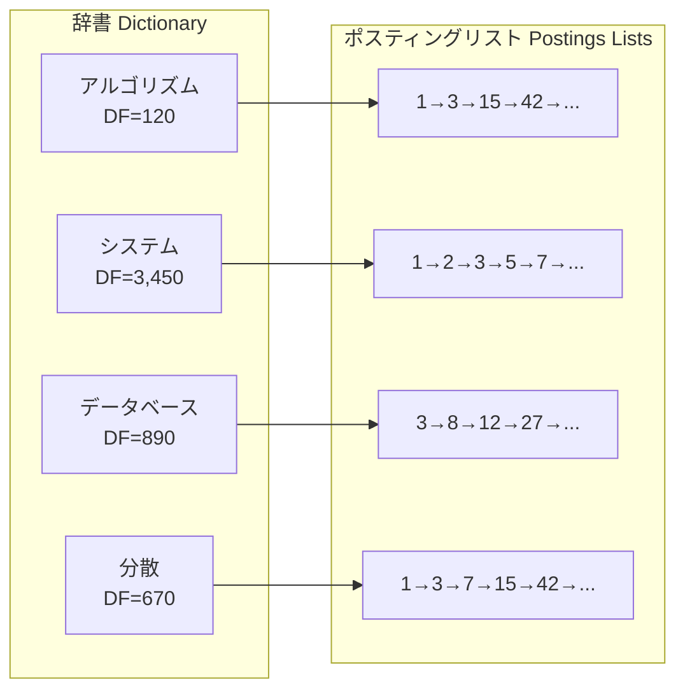
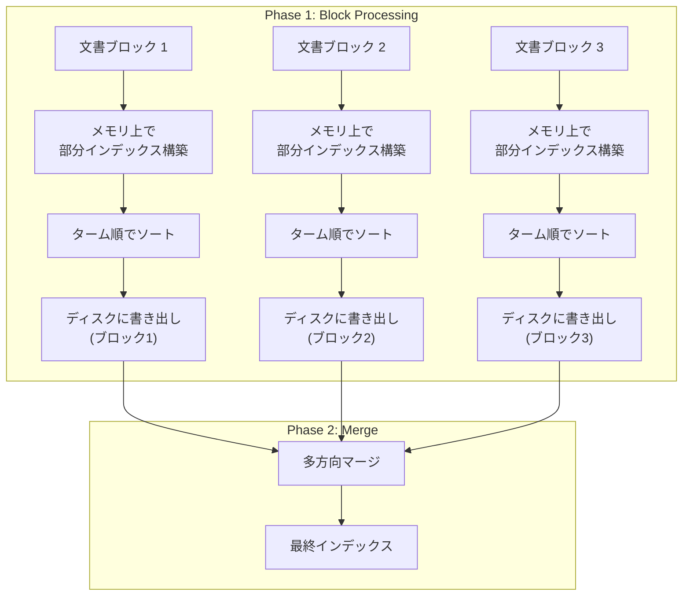
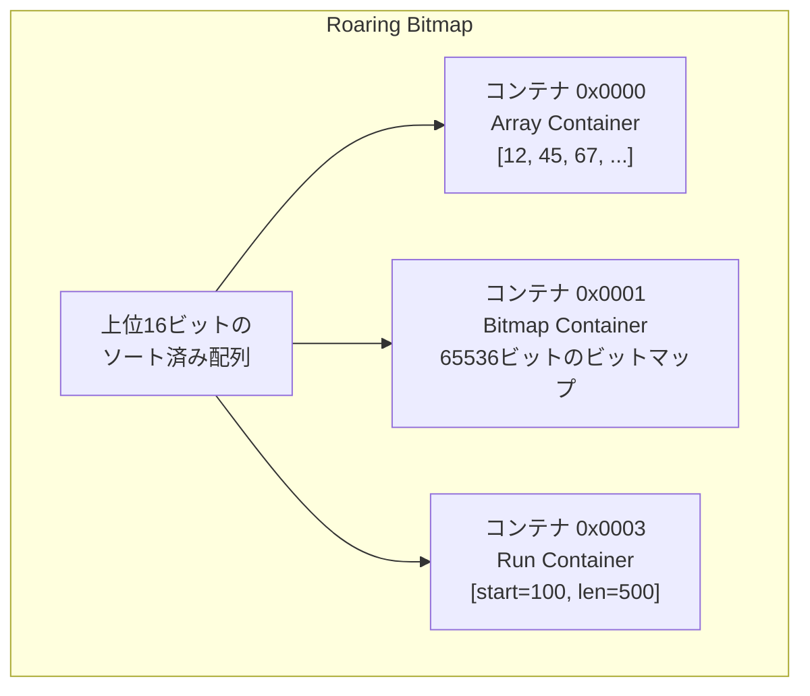
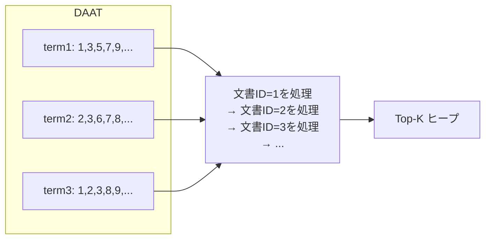
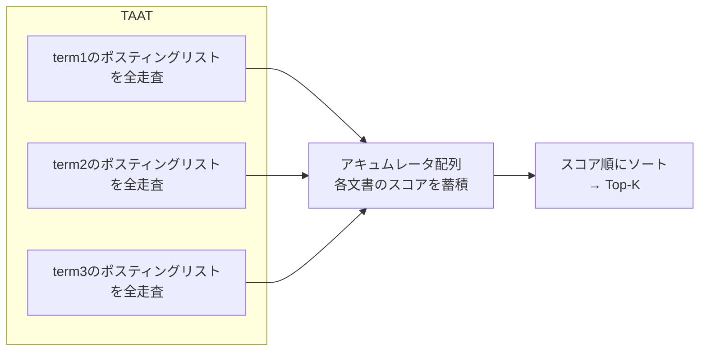
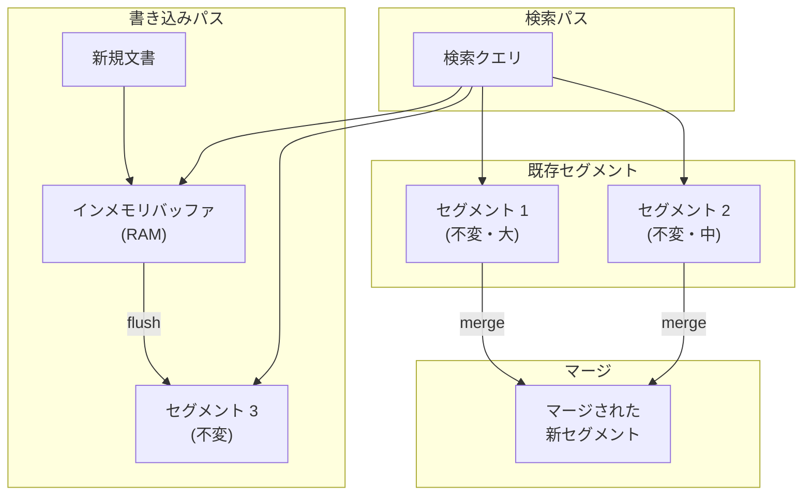
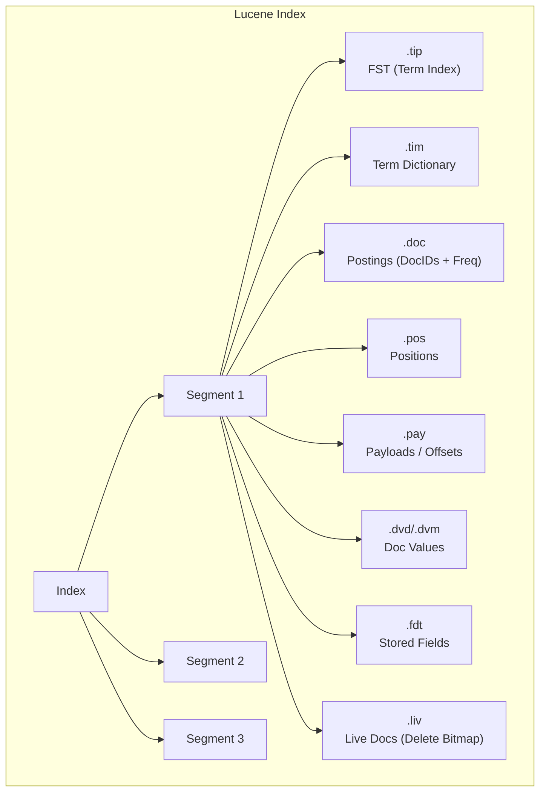
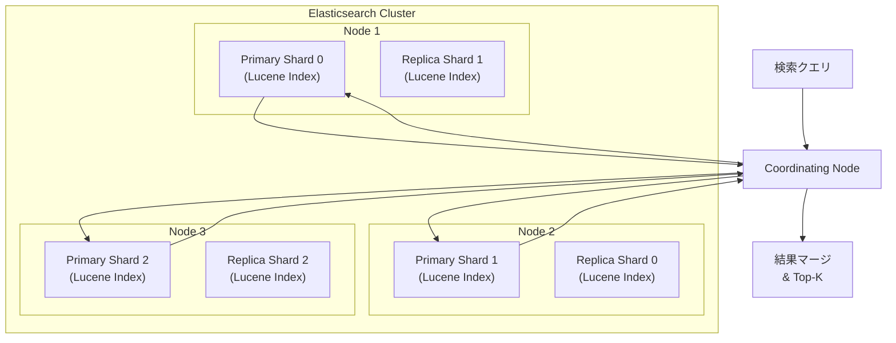
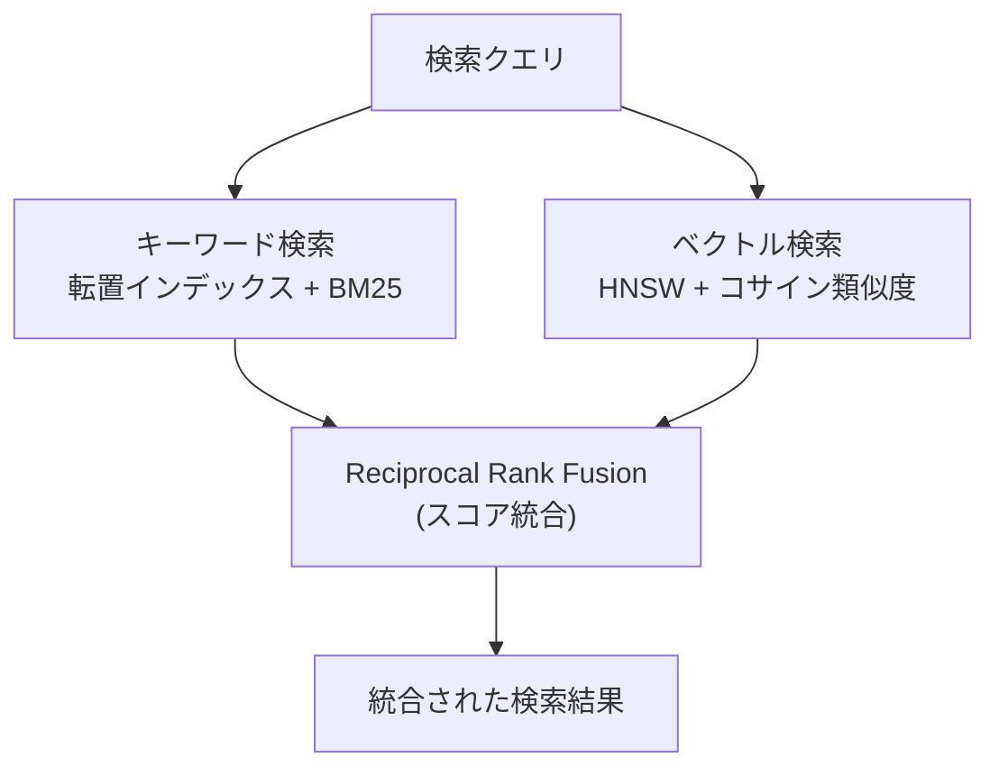

# 転置インデックス — 全文検索を支えるデータ構造

## 1. 背景と動機：全文検索の必要性

現代の情報社会において、膨大なテキストデータから目的の情報を見つけ出す能力はあらゆるシステムの基盤である。Web検索エンジン、メールクライアント、ドキュメント管理システム、ECサイトの商品検索、ログ分析基盤──これらすべてが「テキストの中から特定の単語やフレーズを含む文書を高速に見つける」という共通の課題を抱えている。

### 1.1 線形スキャンの限界

最も素朴な全文検索の方法は、すべての文書を先頭から末尾まで走査し、クエリに含まれる単語が出現するかを一つずつ確認することである。UNIXの`grep`コマンドがまさにこのアプローチを取っている。

```
検索クエリ: "分散システム"

文書1: "分散システムにおける合意アルゴリズム..."  → ヒット
文書2: "オペレーティングシステムの基礎..."        → ミス
文書3: "分散データベースと分散システム..."         → ヒット
...
文書N: "ネットワークプロトコル..."                → ミス
```

この線形スキャン（sequential scan）の計算量は $O(N \times L)$ である。ここで $N$ は文書数、$L$ は文書の平均長を表す。10億のWebページ（各ページ平均10KB）に対してこの方式を適用すると、1回の検索で約10TBのデータを読み込む必要がある。仮にストレージの読み取り帯域が10GB/sであったとしても、1回の検索に約1,000秒──実に16分以上──を要する計算になる。

| 文書数 | 文書サイズ合計 | 線形スキャン所要時間（10GB/s） |
|---|---|---|
| 1万件 | 100 MB | 0.01秒 |
| 100万件 | 10 GB | 1秒 |
| 1億件 | 1 TB | 100秒 |
| 100億件 | 100 TB | 10,000秒（約2.8時間） |

現代のWeb検索エンジンは数百億のWebページをインデックスしており、ユーザーはミリ秒単位の応答を期待する。線形スキャンでは到底この要求を満たせない。

### 1.2 逆転の発想

リレーショナルデータベースにおけるB-Treeインデックスは、「キー → レコードの位置」という順方向のマッピングを提供する。しかし、全文検索では「ある単語を含む文書はどれか」という逆方向の問いに答える必要がある。

ここで登場するのが**転置インデックス（Inverted Index）**である。「転置」という名前は、文書から単語への関係を**逆転（invert）**させることに由来する。通常のインデックスが「文書ID → 文書に含まれる単語のリスト」であるのに対し、転置インデックスは「**単語 → その単語を含む文書IDのリスト**」というマッピングを構築する。

```
通常のインデックス（Forward Index）:
  文書1 → [分散, システム, 合意, アルゴリズム, ...]
  文書2 → [オペレーティング, システム, 基礎, ...]
  文書3 → [分散, データベース, 分散, システム, ...]

転置インデックス（Inverted Index）:
  分散       → [文書1, 文書3]
  システム   → [文書1, 文書2, 文書3]
  合意       → [文書1]
  アルゴリズム → [文書1]
  データベース → [文書3]
  ...
```

この変換により、「"分散"を含む文書を見つけよ」というクエリは、辞書から"分散"を引いてそのリストを返すだけで済む。文書数に依存しない $O(1)$ の辞書検索で目的の文書集合を特定できるのである。

## 2. 転置インデックスの基本構造

転置インデックスは大きく2つの構成要素からなる。**辞書（Dictionary / Lexicon）**と**ポスティングリスト（Postings List）**である。

### 2.1 辞書（Dictionary）

辞書は、コーパス全体に出現するすべての一意な単語（**ターム / term**）を保持するデータ構造である。各タームに対して、そのタームの統計情報（文書頻度など）と、対応するポスティングリストへのポインタを格納する。

辞書の実装にはいくつかの選択肢がある。

| データ構造 | 検索計算量 | 前方一致検索 | メモリ効率 | 主な用途 |
|---|---|---|---|---|
| ハッシュテーブル | $O(1)$ | 不可 | 中 | 完全一致が中心の場合 |
| ソート済み配列 + 二分探索 | $O(\log n)$ | 可能 | 高 | 静的な辞書 |
| B-Tree / B+Tree | $O(\log n)$ | 可能 | 中 | ディスクベースの辞書 |
| Trie / Patricia Trie | $O(k)$（$k$=キー長） | 可能 | 低〜中 | 前方一致・オートコンプリート |
| FST（Finite State Transducer） | $O(k)$ | 可能 | 非常に高 | Lucene等の大規模辞書 |

Lucene（Elasticsearch/Solrの基盤）は**FST（Finite State Transducer）**を採用している。FSTはTrieを圧縮したような構造であり、共通の接頭辞と接尾辞を共有することで、巨大な辞書をメモリ上に極めてコンパクトに保持できる。

### 2.2 ポスティングリスト（Postings List）

ポスティングリストは、あるタームを含むすべての文書の情報を格納するリストである。最も基本的な形式では、文書IDのソート済みリストとなる。

```
ターム "分散" のポスティングリスト:
┌─────────────────────────────────┐
│  docID: 1, 3, 7, 15, 42, 108   │
└─────────────────────────────────┘
```

実際のシステムでは、文書ID以外にもさまざまな付加情報を格納する。

- **ターム頻度（TF: Term Frequency）**: その文書内でタームが何回出現したか
- **位置情報（Position）**: 文書内でのタームの出現位置（フレーズ検索に必要）
- **オフセット情報**: 元テキスト中のバイトオフセット（ハイライト表示に必要）
- **ペイロード**: アプリケーション固有の追加データ

```
ターム "分散" のポスティングリスト（拡張版）:
┌─────────────────────────────────────────────────┐
│ docID=1:  TF=2, positions=[3, 45]               │
│ docID=3:  TF=1, positions=[12]                  │
│ docID=7:  TF=3, positions=[1, 28, 55]           │
│ docID=15: TF=1, positions=[7]                   │
│ ...                                             │
└─────────────────────────────────────────────────┘
```

### 2.3 全体構造の概観

転置インデックスの全体像を図示すると次のようになる。



辞書内のタームは通常アルファベット順（または辞書順）にソートされており、文書頻度（DF: Document Frequency）などの統計情報を併せて保持する。文書頻度は、そのタームが何件の文書に出現するかを示す値であり、TF-IDFやBM25といったランキングアルゴリズムで重要な役割を果たす。

## 3. テキスト前処理

生のテキストをそのまま転置インデックスに投入することはできない。テキストから検索可能なタームを抽出する一連の処理を**テキスト前処理（Text Preprocessing）**あるいは**テキスト解析（Text Analysis）**と呼ぶ。


### 3.1 文字正規化（Character Normalization）

文字正規化は、テキスト内の文字表現を統一する処理である。

- **大文字・小文字の統一**: "Search"と"search"を同一のタームとして扱うために小文字に統一する
- **Unicode正規化**: 「が」（U+304C、1文字）と「か」+「゛」（U+304B + U+3099、2文字）を同一視するためにNFKC正規化を適用する
- **アクセント記号の除去**: "café"を"cafe"に正規化する
- **全角・半角の統一**: 「Ａ」を「A」に、「１」を「1」に変換する

### 3.2 トークナイゼーション（Tokenization）

トークナイゼーションは、連続したテキストを個々のトークン（単語）に分割する処理である。

**英語などの空白区切り言語**では、空白とパンクチュエーション（句読点）を区切り文字として使用すれば基本的なトークン化が可能である。ただし、ハイフンで結ばれた複合語（"state-of-the-art"）やアポストロフィ（"it's"、"O'Brien"）、数値表現（"3.14"、"192.168.1.1"）など、単純な空白分割では対処できないケースが多数存在する。

**日本語や中国語**のように単語間に空白を持たない言語では、トークナイゼーションは特に困難な課題となる。

```
入力: "東京都の天気予報を確認する"

形態素解析器の出力:
  東京都 / の / 天気 / 予報 / を / 確認 / する
```

日本語のトークナイゼーションには主に2つのアプローチがある。

1. **形態素解析（Morphological Analysis）**: MeCab、Kuromoji、Sudachiなどの形態素解析器を使用して、辞書に基づく単語分割を行う。高精度だが、未知語（新語、固有名詞）への対応が辞書の品質に依存する
2. **N-gram**: テキストを固定長の文字列に機械的に分割する。「東京都」を2-gramで分割すると「東京」「京都」「都の」となる。再現率（recall）は高いが、「京都」のように意図しないマッチが発生し適合率（precision）が低下する

実践的なシステムでは、形態素解析をベースにしつつN-gramを補完的に使用するハイブリッドアプローチが採用されることが多い。

### 3.3 ストップワード除去（Stop Word Removal）

ストップワードとは、「の」「は」「を」「が」（日本語）や "the"、"is"、"at"、"and"（英語）のように、出現頻度が極めて高く、検索の識別力にほとんど寄与しない単語である。これらをインデックスから除外することで、インデックスサイズを大幅に削減できる。英語のテキストでは、上位30語のストップワードを除去するだけで全トークンの約30%を削減できるとされる。

ただし、ストップワード除去には注意点がある。フレーズ検索において "to be or not to be" を検索する場合、ストップワードを除去するとこのフレーズを正しく特定できなくなる。現代の検索エンジン（Luceneなど）では、ストップワードをインデックスから完全に除外するのではなく、インデックスには残しつつランキング時に重みを下げるアプローチが一般的になっている。

### 3.4 ステミングとレンマタイゼーション

**ステミング（Stemming）**は、単語の語幹を機械的なルールで抽出する処理である。たとえば英語のPorterステマーは、"running"→"run"、"flies"→"fli"、"organization"→"organ"のように語尾を切り落とす。ルールベースのため高速だが、過剰ステミング（"organization"→"organ"）や不足ステミング（"ran"と"run"を同一視できない）が発生する。

**レンマタイゼーション（Lemmatization）**は、辞書と品詞情報に基づいて単語の原形（レンマ / lemma）を求める処理である。"ran"→"run"、"better"→"good"のように言語学的に正確な変換が可能だが、計算コストが高い。

日本語では、形態素解析器がトークナイゼーションと同時に原形への変換を行う。たとえば「走っている」は「走る」に正規化される。

## 4. インデックス構築アルゴリズム

転置インデックスの構築は、大規模コーパスを扱う場合にメモリとディスクの両面で工夫が必要となる。

### 4.1 ナイーブな構築方法

最も単純なアプローチは、全文書をメモリに読み込み、ハッシュマップ（辞書）を構築する方法である。

```python
def build_index(documents):
    index = {}  # term -> list of (doc_id, positions)
    for doc_id, text in documents:
        tokens = tokenize(text)
        for pos, term in enumerate(tokens):
            if term not in index:
                index[term] = []
            index[term].append((doc_id, pos))
    return index
```

この方法はコーパス全体がメモリに収まる場合には有効だが、数億〜数十億の文書を扱うWeb検索エンジンでは、メモリ容量の制約からこのアプローチは使えない。

### 4.2 BSBI（Blocked Sort-Based Indexing）

BSBIは、メモリに収まるサイズのブロック単位でインデックスを構築し、最後にマージする方式である。



BSBIの手順は以下のとおりである。

1. 文書コーパスをメモリに収まるサイズのブロックに分割する
2. 各ブロックについて、`(termID, docID)` のペアを生成する。ここで `termID` はターム文字列をIDに変換したものである
3. ペアをtermID順、次いでdocID順にソートする
4. ソート済みのペアをディスクに書き出す
5. すべてのブロックを処理した後、多方向マージ（k-way merge）で統合して最終インデックスを得る

BSBIの制約は、ターム文字列からtermIDへのマッピングをメモリ上に保持する必要がある点である。コーパスの語彙が巨大になると、このマッピング自体がメモリに収まらなくなる。

### 4.3 SPIMI（Single-Pass In-Memory Indexing）

SPIMIはBSBIの制約を解消するアルゴリズムである。termIDへの変換を行わず、ターム文字列をそのまま使用してインデックスを構築する。

```python
def spimi_invert(token_stream):
    # Build an in-memory inverted index for one block
    output_file = new_file()
    dictionary = {}  # term_string -> postings_list

    while memory_available():
        token = next(token_stream)
        term = token.term
        doc_id = token.doc_id

        if term not in dictionary:
            # Add term with a new postings list
            dictionary[term] = [doc_id]
        else:
            postings = dictionary[term]
            if postings[-1] != doc_id:
                postings.append(doc_id)

    # Sort terms and write block to disk
    sorted_terms = sorted(dictionary.keys())
    for term in sorted_terms:
        write_to_disk(output_file, term, dictionary[term])
    return output_file
```

SPIMIの特徴は以下の点にある。

1. **termIDマッピングが不要**: ターム文字列をそのまま辞書のキーとして使用する
2. **ポスティングリストを動的に追加**: ソートの代わりに、辞書のエントリに直接文書IDを追加していく
3. **メモリが埋まったらフラッシュ**: メモリが一杯になるとディスクに書き出し、新しいブロックの処理を開始する
4. **最終マージ**: BSBIと同様に、すべてのブロックを多方向マージで統合する

SPIMIはBSBIと比較して、ソートのオーバーヘッドが削減されるため高速であり、語彙サイズに対するメモリ制約も緩和される。現代の多くの検索エンジンはSPIMIの変種を採用している。

### 4.4 分散インデックス構築（MapReduce）

Web規模のインデックス構築では、単一マシンでは処理が追いつかない。GoogleのMapReduceに代表される分散処理フレームワークを用いてインデックスを並列構築する。

```
Map Phase:
  各文書に対して (term, docID) ペアを出力

Shuffle Phase:
  同一 term のペアを同じ Reducer に集約

Reduce Phase:
  各 term について、docID をソートしてポスティングリストを構築
```

分散インデックス構築における分割戦略には2つの方式がある。

- **ターム分割（Term-based partitioning）**: タームの範囲ごとにインデックスを分割する。"a"〜"m"のタームはノード1、"n"〜"z"はノード2という具合である。クエリ処理時に特定ターム（人気ワード）へのアクセスが集中するとホットスポットが生じやすい
- **文書分割（Document-based partitioning）**: 文書IDの範囲ごとにインデックスを分割する。各ノードが担当する文書群に対するローカルな転置インデックスを保持する。クエリ処理時には全ノードに問い合わせて結果をマージする必要があるが、負荷が分散しやすい

実際のWeb検索エンジンは文書分割を基本としつつ、人気タームに対してはさらなる最適化を施すハイブリッド方式を採用している。

## 5. ポスティングリストの圧縮

転置インデックスのサイズの大部分はポスティングリストが占める。Web規模のコーパスでは、元のテキストデータの数十%に相当するサイズになり得る。効率的な圧縮は、ディスク使用量の削減だけでなく、I/O帯域の有効活用による検索速度の向上にも直結する。

### 5.1 差分符号化（Gap Encoding）

ポスティングリストは文書IDの昇順にソートされている。この性質を活かし、文書ID自体ではなく隣接するID間の差分（gap / delta）を格納することで、格納すべき整数の値を劇的に小さくできる。

```
元のポスティングリスト: [3, 7, 12, 15, 42, 108, 215]
差分符号化後:           [3, 4,  5,  3, 27,  66, 107]
```

差分の値は元のIDよりも桁数が小さくなるため、後述する可変長符号との組み合わせで高い圧縮率を達成できる。出現頻度の高いターム（"the"、"is"など）のポスティングリストでは差分がさらに小さくなり、圧縮効果が特に顕著になる。

### 5.2 Variable Byte（VByte）符号

Variable Byte符号は、整数の大きさに応じて使用するバイト数を可変にする方式である。各バイトの最上位ビット（MSB）を継続ビットとして使用し、残りの7ビットでデータを表現する。

```
エンコード規則:
  - 最終バイトのMSBは1
  - それ以外のバイトのMSBは0
  - 下位7ビットでデータを表現

例: 整数 5 → 10000101 （1バイト）
    整数 130 → 00000001 10000010 （2バイト）
      130 = 1 × 128 + 2
      → 1バイト目: 0_0000001 (上位7ビット、MSB=0で「継続」)
      → 2バイト目: 1_0000010 (下位7ビット、MSB=1で「最終」)
```

VByteは実装が単純でデコードが高速であるため、多くの検索エンジンで広く使用されている。ただし、非常に小さな整数（1〜127）でも最低1バイトを使用するため、差分が極めて小さいケースでは最適ではない。

### 5.3 PForDelta（Patched Frame of Reference）

PForDeltaは、ポスティングリストを固定サイズのブロック（通常128個の整数）に分割し、各ブロック内の大部分の値を少ないビット数で表現する方式である。

```
ブロック内の差分値: [2, 3, 1, 4, 2, 3, 1, 250, 2, 3, ...]

ステップ1: 大部分の値（例: 90%以上）を表現できるビット幅 b を決定
  → b = 3 (0〜7の範囲で90%以上の値をカバー)

ステップ2: b ビットに収まらない値（例外 / exception）を別途格納
  → 250 は例外としてパッチリストに格納

結果:
  - 基本部: 各値を3ビットで128個 = 48バイト
  - 例外部: 例外のインデックスと値を別途格納
```

PForDeltaの利点は、SIMD命令を使ったビットパッキングの一括デコードが可能なため、現代のCPUで極めて高速に動作する点である。

### 5.4 Roaring Bitmap

Roaring Bitmapは、整数集合を効率的に表現するためのハイブリッドデータ構造であり、近年のシステムで急速に普及している。

基本的なアイデアは、整数を上位16ビットと下位16ビットに分割し、上位16ビットが同じ整数群を「コンテナ」にまとめて管理するというものである。各コンテナは、格納する整数の密度に応じて最適な表現方法を自動的に選択する。



| コンテナ種別 | 使用条件 | メモリ使用量 |
|---|---|---|
| Array Container | 要素数 < 4,096 | 2バイト × 要素数 |
| Bitmap Container | 要素数 >= 4,096 | 固定8KB |
| Run Container | 連続値が多い場合 | 4バイト × ラン数 |

Roaring Bitmapは集合演算（AND、OR、XOR）が非常に高速であり、Lucene、Apache Spark、Redisなど多数のシステムで採用されている。

### 5.5 圧縮方式の比較

| 方式 | 圧縮率 | デコード速度 | 実装複雑度 | 代表的な採用例 |
|---|---|---|---|---|
| VByte | 中 | 高速 | 低 | Lucene（旧バージョン） |
| PForDelta | 高 | 非常に高速 | 中 | Lucene 9+, PISA |
| Simple-8b | 高 | 高速 | 中 | MongoDB |
| Roaring Bitmap | 状況依存 | 非常に高速 | 中 | Lucene, Pilosa |
| Elias-Fano | 非常に高 | 中 | 高 | 学術研究 |

## 6. クエリ処理

転置インデックスが構築されたら、次はクエリをどのように処理するかが重要になる。

### 6.1 ブーリアン検索（Boolean Retrieval）

最も基本的なクエリモデルは、AND、OR、NOTの論理演算子を使ったブーリアン検索である。

**AND検索**: 2つのポスティングリストの共通要素（交差集合 / intersection）を求める。両リストがソート済みであることを活かし、2つのポインタを同時に走査するマージアルゴリズムで $O(n + m)$ で処理できる。

```python
def intersect(p1, p2):
    # AND operation on two sorted postings lists
    result = []
    i, j = 0, 0
    while i < len(p1) and j < len(p2):
        if p1[i] == p2[j]:
            result.append(p1[i])
            i += 1
            j += 1
        elif p1[i] < p2[j]:
            i += 1
        else:
            j += 1
    return result
```

**OR検索**: 2つのポスティングリストの和集合（union）を求める。同様のマージアルゴリズムで $O(n + m)$ で処理できる。

**NOT検索**: 全文書集合から特定のポスティングリストを除外する差集合（difference）を求める。

複数タームのAND検索では、ポスティングリストの短い順に処理することで中間結果のサイズを最小化し、全体の処理効率を向上させるのが定石である。

```
クエリ: "分散" AND "システム" AND "Raft"

ポスティングリストのサイズ:
  "Raft"    →  50件
  "分散"    → 670件
  "システム" → 3,450件

最適な処理順序:
  1. intersect("Raft", "分散")         → 中間結果: ~30件
  2. intersect(中間結果, "システム")   → 最終結果: ~20件
```

### 6.2 Skip Pointer（スキップポインタ）

ポスティングリストが長い場合、線形走査では効率が悪い。Skip Pointerは、ポスティングリスト内に「飛び石」を設置し、不要な要素を読み飛ばす仕組みである。

```
ポスティングリスト（Skip Pointer付き）:

  Skip: ──────────┐     ┌──────────┐     ┌──────────┐
                   ▼     │          ▼     │          ▼
  [3, 5, 7, 12, │15│, 18, 21, 25,│30│, 33, 38, 42,│50│, ...]
```

例えば、AND検索で一方のリストの現在位置が20であるとき、もう一方のリストでSkip Pointerを使えば、15の次のSkip先が30であることを即座に判定し、15〜29の要素を個別にチェックする必要がなくなる。

Skip Pointerの間隔は $\sqrt{L}$（$L$ はポスティングリストの長さ）に設定するのが一般的に最適とされる。間隔が短すぎるとSkip Pointerの格納コストが増大し、長すぎるとスキップの効果が薄れる。

### 6.3 DAAT と TAAT

ポスティングリストの走査戦略には2つの主要なアプローチがある。

**DAAT（Document-At-A-Time）**は、すべてのポスティングリストを同時に走査し、文書ID順に1文書ずつスコアリングする方式である。



DAATの利点は、一度に1文書分の情報しかメモリに保持しなくてよいため、メモリ消費が少ない点である。また、MaxScoreやWANDといった高度なスコア枝刈り（score pruning）アルゴリズムとの組み合わせが容易である。

**TAAT（Term-At-A-Time）**は、ポスティングリストを1つずつ順に処理し、各文書のスコアをアキュムレータに蓄積する方式である。



TAATはポスティングリストの順次アクセスパターンがキャッシュフレンドリーである一方、全候補文書のスコアをメモリ上に保持する必要があるため、候補数が多い場合にメモリ消費が大きくなる。

現代の検索エンジン（Luceneなど）はDAATを基本としている。

### 6.4 WAND（Weak AND）アルゴリズム

Top-Kランキング検索において、すべての候補文書のスコアを厳密に計算する必要はない。WANDアルゴリズムは、現在のTop-K最低スコアを閾値として、その閾値を超える可能性のない文書を早期にスキップする枝刈り手法である。

各タームに対してそのタームが寄与しうる最大スコア（upper bound）を事前に計算しておき、ポスティングリストの走査時にこの情報を使って不要な文書を飛ばす。WANDにより、ランキング検索の実行時間を2〜10倍程度短縮できることが報告されている。

## 7. 位置情報付きインデックス

### 7.1 フレーズ検索（Phrase Query）

ユーザーが `"distributed systems"` のように引用符で囲んだクエリを入力した場合、"distributed"と"systems"がこの順序で隣接して出現する文書だけを返す必要がある。これを実現するには、各タームの文書内での出現位置を転置インデックスに記録する必要がある。

```
ターム "distributed" のポスティングリスト（位置情報付き）:
  docID=1: positions=[5, 22, 88]
  docID=3: positions=[1, 45]
  docID=7: positions=[12]

ターム "systems" のポスティングリスト（位置情報付き）:
  docID=1: positions=[6, 30, 89]
  docID=3: positions=[2, 15]
  docID=7: positions=[8]
```

フレーズ検索 `"distributed systems"` のアルゴリズムは以下のとおりである。

1. まず通常のAND検索で両タームを含む文書を特定する → `{docID=1, docID=3, docID=7}`
2. 各文書について、"distributed"の位置 $p_1$ と "systems" の位置 $p_2$ の間に $p_2 = p_1 + 1$ の関係を持つペアが存在するかを確認する
3. docID=1: $p_1=5, p_2=6$ → $6 = 5 + 1$ → フレーズマッチ
4. docID=3: $p_1=1, p_2=2$ → $2 = 1 + 1$ → フレーズマッチ
5. docID=7: $p_1=12, p_2=8$ → $8 \neq 12 + 1$ → マッチせず

### 7.2 近接検索（Proximity Query）

近接検索は、2つのタームが一定の距離（ウィンドウ）内に出現する文書を検索する機能である。Luceneの構文では `"distributed systems"~5` のように記述し、この例では2つのタームが5ワード以内に出現する文書をマッチさせる。

```python
def proximity_search(positions1, positions2, max_distance):
    # Find position pairs within max_distance
    results = []
    i, j = 0, 0
    while i < len(positions1) and j < len(positions2):
        diff = positions2[j] - positions1[i]
        if 0 < diff <= max_distance:
            results.append((positions1[i], positions2[j]))
            i += 1
        elif diff <= 0:
            j += 1
        else:
            i += 1
    return results
```

### 7.3 位置情報のコスト

位置情報をインデックスに含めると、ポスティングリストのサイズが大幅に増大する。位置なしのインデックスでは1文書あたり数バイトで済むが、位置情報付きでは出現回数に比例してデータ量が増加する。一般に、位置情報付きインデックスは位置情報なしの場合の2〜4倍のサイズになる。

この問題に対して、いくつかの最適化手法が存在する。

- **位置の差分符号化**: 文書ID同様に、位置も差分符号化して圧縮する
- **二段階インデックス**: 位置なしのインデックスで候補を絞り込んだ後、位置情報付きのインデックスでフレーズマッチを確認する
- **ブロックベースの位置情報**: 正確な位置ではなくブロック（たとえば文単位、段落単位）でのマッチに簡略化する

## 8. インデックスの更新

検索エンジンが扱う文書コレクションは静的ではない。新しい文書の追加、既存文書の更新・削除が絶えず発生する。転置インデックスをどのように動的に更新するかは、実用的な検索システムの設計において極めて重要な課題である。

### 8.1 インプレース更新の困難さ

B-Treeのような構造では、ノードの分割やマージによってインプレース（その場での）更新が可能である。しかし、転置インデックスのポスティングリストは可変長であり、新しい文書IDの挿入によってリストが伸長する。ディスク上の連続領域に格納されたポスティングリストを伸長するには、後続のデータをすべて移動させるか、オーバーフローチェーンを作成する必要があり、いずれもパフォーマンス上の問題を引き起こす。

### 8.2 セグメントベースのアーキテクチャ

現代の検索エンジン（Lucene/Elasticsearch, Solrなど）は、**セグメント（Segment）**ベースのアーキテクチャを採用している。このアプローチはLSM-Tree（Log-Structured Merge-Tree）の考え方に通じるものがある。



セグメントベースアーキテクチャの動作原理は以下のとおりである。

1. **書き込み**: 新規文書はまずインメモリバッファに蓄積される。バッファが一定サイズに達するか、一定時間が経過すると、バッファの内容から新しい**不変（immutable）セグメント**がディスクに書き出される（flush）
2. **検索**: クエリは全セグメント（およびインメモリバッファ）に対して並列に実行され、結果がマージされる
3. **削除**: 文書の削除はセグメント自体を書き換えるのではなく、**削除ビットマップ（delete bitmap / live docs）**に記録する。検索時に削除済み文書をフィルタリングして除外する
4. **更新**: 文書の更新は「旧文書の削除 + 新文書の追加」として処理される

セグメントが不変であることには以下の利点がある。

- **書き込みが高速**: 追記のみで済み、既存データの書き換えが不要
- **キャッシュフレンドリー**: セグメントが変更されないため、OSのページキャッシュを有効に活用できる
- **ロック不要**: 読み取り側はロックを取得する必要がない（不変データへの並行アクセスは安全）
- **クラッシュリカバリが容易**: 部分的に書き込まれたセグメントを破棄するだけでよい

### 8.3 マージポリシー

セグメント数が増加すると検索性能が低下する（全セグメントを走査する必要があるため）。そこで、バックグラウンドで定期的にセグメントを統合する**マージ（merge / compaction）**が行われる。

**階層型マージ（Tiered Merge Policy）**: Lucene（Elasticsearch）で採用されているデフォルトのマージポリシー。セグメントをサイズに基づいて層（tier）に分類し、同じ層に属する一定数のセグメントを1つの大きなセグメントにマージする。

```
Level 0 (小):  [seg1] [seg2] [seg3] [seg4] [seg5]
                  ↓マージ
Level 1 (中):  [seg_merged_1]  [seg_merged_2]
                  ↓マージ
Level 2 (大):  [seg_final]
```

**対数マージ（Logarithmic Merge）**: セグメントのサイズを2の累乗で管理し、同サイズのセグメントが2つ揃ったら上位レベルにマージする方式。書き込みの増幅（write amplification）は $O(\log N)$ に抑えられる。

マージポリシーの選択は、書き込みスループット、検索レイテンシ、ディスク使用量のトレードオフを左右する重要な設計判断である。

### 8.4 Near Real-Time（NRT）検索

Elasticsearchの**refresh**操作は、インメモリバッファからセグメントを作成して検索可能にするプロセスである。デフォルトでは1秒間隔で実行され、文書の追加から検索可能になるまでの遅延（latency）は最大1秒程度となる。これを**Near Real-Time（NRT）検索**と呼ぶ。

refreshの頻度を上げれば遅延は短縮されるが、小さなセグメントが大量に生成されるため検索性能が低下し、マージの頻度も増加する。逆に頻度を下げると遅延は大きくなるが、より大きなセグメントが作成されるため検索効率は向上する。

## 9. 実世界の実装

### 9.1 Apache Lucene / Elasticsearch

Apache Luceneは、Javaで実装されたオープンソースの全文検索ライブラリであり、Elasticsearch、Apache Solr、Amazon OpenSearchの基盤となっている。Luceneの転置インデックス実装は、現代の全文検索技術の事実上のリファレンス実装である。

**Luceneのインデックス構造**:



Luceneの主要な技術的特徴は以下のとおりである。

- **辞書**: FST（Finite State Transducer）を使用してタームの辞書をメモリ上にコンパクトに保持する。FSTはTrieの圧縮版であり、共通の接頭辞・接尾辞を共有することで極めて省メモリである
- **ポスティングリスト**: PForDelta（Packed Integer）で圧縮される。Lucene 9以降ではFOR（Frame of Reference）ベースの圧縮が採用されている
- **Skip List**: ポスティングリスト内にマルチレベルのSkip Listを構築し、DAATでのランダムアクセスを高速化する
- **Doc Values**: ソートやアグリゲーション用の列指向データ構造。転置インデックスとは逆方向の「文書ID → フィールド値」マッピングを提供する
- **ブロック単位のI/O**: ポスティングリストは128文書単位のブロックに分割して圧縮・格納され、ブロック単位でデコードされる

**Elasticsearchのアーキテクチャ**: Elasticsearchは、Luceneインデックスを分散環境で運用するためのオーケストレーション層である。



Elasticsearchのインデックスは複数の**シャード（shard）**に分割される。各シャードは独立したLuceneインデックスであり、異なるノードに配置される。クエリはCoordinating Nodeが全シャードに並列に発行し（scatter phase）、各シャードのローカルTop-K結果を収集・マージして最終結果を生成する（gather phase）。

### 9.2 PostgreSQL GIN（Generalized Inverted Index）

PostgreSQLは、全文検索をサポートするための**GIN（Generalized Inverted Index）**を提供している。GINはその名のとおり「汎用化された転置インデックス」であり、全文検索だけでなく、JSON内の検索（`jsonb`型）、配列要素の検索、三角形検索（`pg_trgm`拡張）などにも使用される。

```sql
-- Full-text search index creation
CREATE INDEX idx_articles_content ON articles
USING gin(to_tsvector('japanese', content));

-- Query execution
SELECT title FROM articles
WHERE to_tsvector('japanese', content) @@ to_tsquery('japanese', '分散 & システム');
```

PostgreSQLの全文検索は、`tsvector`型（文書をトークンのソート済みリストに変換）と`tsquery`型（検索クエリの構造化表現）を基盤としている。

GINインデックスの構造は、B-Treeとポスティングリストのハイブリッドである。辞書部分はB-Treeで管理され、各リーフエントリがポスティングリスト（ソート済み文書IDのリスト）を指す。小さなポスティングリストはB-Treeのリーフページに直接格納され（インライン格納）、大きなポスティングリストは別のデータページに格納される。

```
GIN Index Structure:

B-Tree (Dictionary)
├── "アルゴリズム" → Posting List [1, 5, 12]  (inline)
├── "システム"     → Posting Tree Root Page → [1, 2, 3, 5, 7, ...]
├── "分散"         → Posting List [1, 3, 7, 15]  (inline)
└── ...
```

GINインデックスの更新には**Pending List**（保留リスト）という機構が使われる。新しいエントリはまずPending Listに追記され、バックグラウンドでまとめてGINインデックス本体にマージされる。これにより、書き込み性能を大幅に改善している。

### 9.3 その他のシステム

- **Apache Solr**: Luceneベースの全文検索サーバ。Elasticsearchの登場以前は全文検索の標準的な選択肢であった。SolrCloudによる分散検索をサポートする
- **Tantivy**: Rustで実装されたLucene風の全文検索ライブラリ。メモリ安全性とゼロコスト抽象化によるパフォーマンスが特徴である
- **Meilisearch**: Rustで実装された軽量な全文検索エンジン。タイポ耐性（typo tolerance）やファセット検索を標準でサポートする
- **Bleve**: Go言語で実装された全文検索ライブラリ。Go製アプリケーションへの組み込みに適している
- **SQLite FTS5**: SQLiteの全文検索拡張モジュール。組み込み用途に最適化されている

## 10. 転置インデックスの限界と補完技術

転置インデックスは全文検索の基盤技術として50年以上にわたり発展してきたが、万能ではない。その限界と、それを補完する技術について整理する。

### 10.1 語彙の不一致問題（Vocabulary Mismatch）

転置インデックスは本質的に**完全一致（exact match）**ベースの検索である。ユーザーが「車」と検索しても「自動車」「クルマ」「カー」を含む文書はヒットしない。同義語辞書（synonym dictionary）を用いて語彙を拡張する方法もあるが、同義語辞書の構築と維持は人手がかかり、すべての同義関係を網羅することは不可能である。

この問題に対する根本的な解決策として、近年は**ベクトル検索（Vector Search）**が台頭している。文書とクエリをニューラルネットワーク（BERT, Sentence-BERTなど）で密ベクトル（dense vector）に変換し、ベクトル空間上の近さ（コサイン類似度など）で類似文書を検索する。「車」と「自動車」は意味的に近いベクトルにマッピングされるため、語彙の不一致を克服できる。

### 10.2 ランキングの限界

転置インデックス自体はランキングを行わない。BM25のような統計的ランキングモデルを組み合わせることで文書のスコアリングが可能になるが、BM25はタームの出現頻度と文書頻度に基づく「バッグ・オブ・ワーズ」モデルであり、文脈や意味を考慮しない。「Javaプログラミング」と「Javaコーヒー」を区別できないのがその限界である。

現代の検索システムでは、転置インデックス + BM25で高速に候補を絞り込み（first stage retrieval）、その後にニューラルネットワークベースのランカー（cross-encoder等）で精密なリランキングを行うパイプラインが一般的である。


### 10.3 構造化データとの統合

転置インデックスはテキストの全文検索に特化しているが、実際のアプリケーションでは構造化データ（数値範囲、日時、カテゴリ）との複合クエリが頻繁に発生する。たとえば「"機械学習"を含み、かつ2024年以降に公開された記事」のような検索である。

Elasticsearchはこの問題に対して、転置インデックスとDoc Values（列指向データ）を組み合わせたハイブリッドアプローチを提供している。テキスト部分は転置インデックスで検索し、フィルタ条件はDoc Valuesやポイントインデックス（BKD-Tree）で処理する。

### 10.4 高次元データへの対応

転置インデックスは本質的にテキスト（離散トークンの集合）を対象としている。画像、音声、動画などの非テキストデータや、高次元の埋め込みベクトルに対しては適用できない。これらのデータに対する類似検索には、以下のような専用のインデックス構造が必要となる。

- **HNSW（Hierarchical Navigable Small World）**: 近似最近傍探索のためのグラフベースのインデックス
- **IVF（Inverted File Index）**: ベクトル空間をクラスタに分割し、転置インデックスの考え方をベクトル検索に応用したもの
- **Product Quantization（PQ）**: ベクトルを部分空間に分割して量子化する圧縮手法

### 10.5 ハイブリッド検索の時代

現代の検索システムは、転置インデックスによるキーワード検索とベクトル検索を組み合わせた**ハイブリッド検索**へと進化している。Elasticsearch 8.x、Vespa、Weaviate、Qdrantなどのシステムは、この両方をネイティブにサポートしている。



転置インデックスの「完全一致の確実性」とベクトル検索の「意味的類似性への柔軟性」は相補的な関係にあり、両者を組み合わせることで単独では達成できない検索品質が実現できる。転置インデックスは廃れるどころか、ハイブリッド検索の不可欠な構成要素として、今後もその重要性を保ち続けるだろう。

## まとめ

転置インデックスは、「単語 → その単語を含む文書のリスト」という単純なアイデアに基づきながら、半世紀にわたる工学的な洗練を経て、現代の情報検索の基盤となったデータ構造である。

その本質は以下の3点に集約される。

1. **逆転の発想**: 文書→単語の関係を逆転させることで、検索を辞書引きの問題に帰着させた
2. **工学的洗練**: 圧縮技術（VByte, PForDelta, Roaring Bitmap）、クエリ処理の最適化（Skip Pointer, WAND）、セグメントベースの更新戦略など、50年にわたる改良が現在の性能を支えている
3. **普遍性**: Web検索エンジンからRDBMSの全文検索機能まで、規模を問わずあらゆる検索システムの中核に位置している

転置インデックスを深く理解することは、検索エンジンの設計、データベースのインデックス戦略、大規模テキスト処理システムの構築といった幅広い技術領域の基盤を固めることにつながる。
