# I/O多重化 — epoll, kqueue, io_uringによる高効率I/O

## 1. 背景と動機

### 1.1 ブロッキングI/Oの世界

UNIX系OSにおけるI/Oの基本モデルは**ブロッキングI/O**である。`read()` システムコールを呼ぶと、データが到着するまでプロセスは**スリープ状態**に入り、カーネルがデータをカーネル空間のバッファからユーザー空間にコピーし終えるまで制御を返さない。

```c
// Blocking I/O: the process sleeps until data is available
int n = read(fd, buf, sizeof(buf));
// Execution resumes only after data arrives
```

この素朴なモデルには一つの深刻な制約がある。**1つのスレッドが同時に監視できるファイルディスクリプタ（fd）は1つだけ**という点だ。もし1万個のクライアント接続を処理したいなら、1万個のスレッドが必要になる。

### 1.2 スレッドモデルの限界

古典的なサーバーアーキテクチャでは、クライアントごとにスレッドまたはプロセスを割り当てる**thread-per-connection** モデルが使われていた。Apache HTTP Server（prefork MPM）はまさにこの方式で、接続ごとにプロセスを fork する。

しかし、このモデルは同時接続数が増えると急速に破綻する。

```
┌──────────────────────────────────────────────┐
│           thread-per-connection モデル          │
├──────────────────────────────────────────────┤
│                                              │
│   Client 1 ──→ Thread 1 ──→ read(fd1) [SLEEP]│
│   Client 2 ──→ Thread 2 ──→ read(fd2) [SLEEP]│
│   Client 3 ──→ Thread 3 ──→ read(fd3) [SLEEP]│
│        :            :                        │
│   Client N ──→ Thread N ──→ read(fdN) [SLEEP]│
│                                              │
│   問題:                                       │
│   ・スレッドごとにスタックメモリ（通常1〜8MB）    │
│   ・コンテキストスイッチのオーバーヘッド          │
│   ・スケジューラの負荷増大                      │
│   ・キャッシュ効率の悪化                        │
└──────────────────────────────────────────────┘
```

スレッドのスタックサイズがデフォルトで8MBの場合、1万スレッドだけで約80GBのメモリ空間が必要になる。実際にはオーバーコミットで物理メモリの消費は抑えられるが、カーネルのスケジューラにとっては1万スレッドの管理は大きな負荷である。コンテキストスイッチのたびにTLBフラッシュやキャッシュ汚染が発生し、スレッド数に比例して性能が劣化する。

### 1.3 C10K問題

1999年、Dan Kegel は「**C10K問題**」を提起した。「1台のサーバーで1万の同時接続（**C**oncurrent **10K** connections）を効率的に処理できるか？」という問いである。

当時のハードウェア（500MHzのCPU、1GBのRAM、100Mbpsのネットワーク）でも、理論上は1万接続を処理するのに十分な性能があった。しかしソフトウェアのI/Oモデルがボトルネックとなっていた。thread-per-connectionモデルでは、ほとんどのスレッドはI/O待ちでスリープしているにもかかわらず、カーネルのスケジューラはすべてのスレッドを管理しなければならなかった。

C10K問題の解決策として注目されたのが**I/O多重化**（I/O Multiplexing）である。1つのスレッドで複数のファイルディスクリプタを同時に監視し、いずれかが読み書き可能になったときだけ処理を行う。これにより、スレッド数を同時接続数から切り離すことができる。

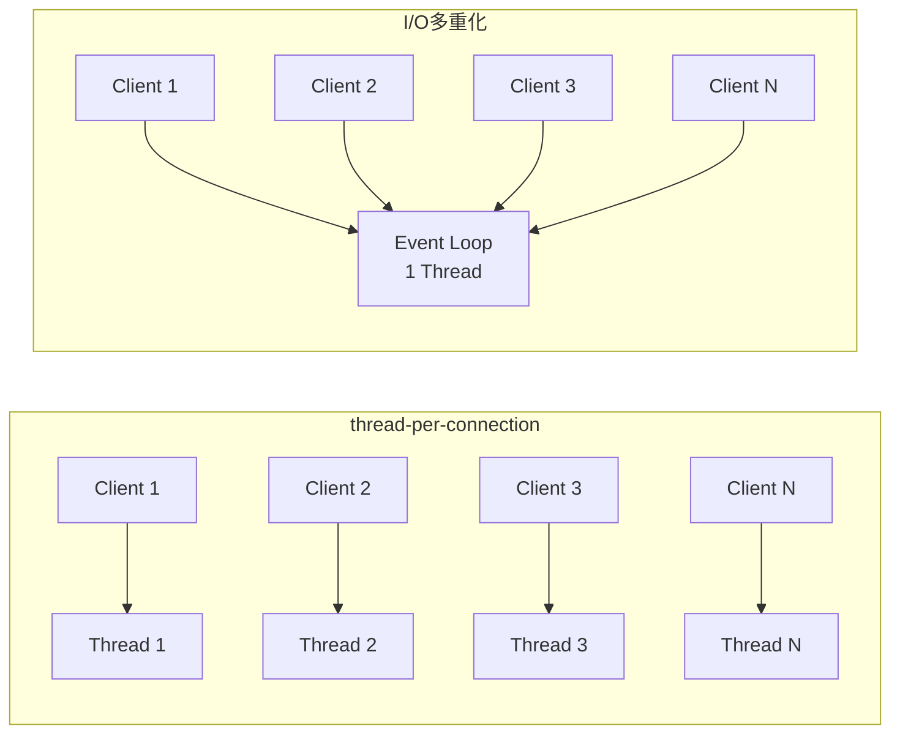

現在では C10K を遥かに超え、C10M（1千万同時接続）すら議論されるようになった。Cloudflare のようなCDNプロバイダは、1台のサーバーで数百万の同時接続を処理している。このスケールを実現する基盤技術が、本記事で解説するI/O多重化メカニズムである。

## 2. I/Oモデルの分類

Richard Stevens の名著『UNIX Network Programming』では、UNIX系OSにおけるI/Oモデルを5つに分類している。それぞれの違いは、「I/Oの準備が整うまでの待機」と「データのコピー」という2つのフェーズにおいてプロセスがブロックされるかどうかで決まる。

### 2.1 ブロッキングI/O（Blocking I/O）

最も単純なモデルである。`read()` を呼ぶと、データが到着してカーネルからユーザー空間にコピーされるまで、プロセスはブロックされる。

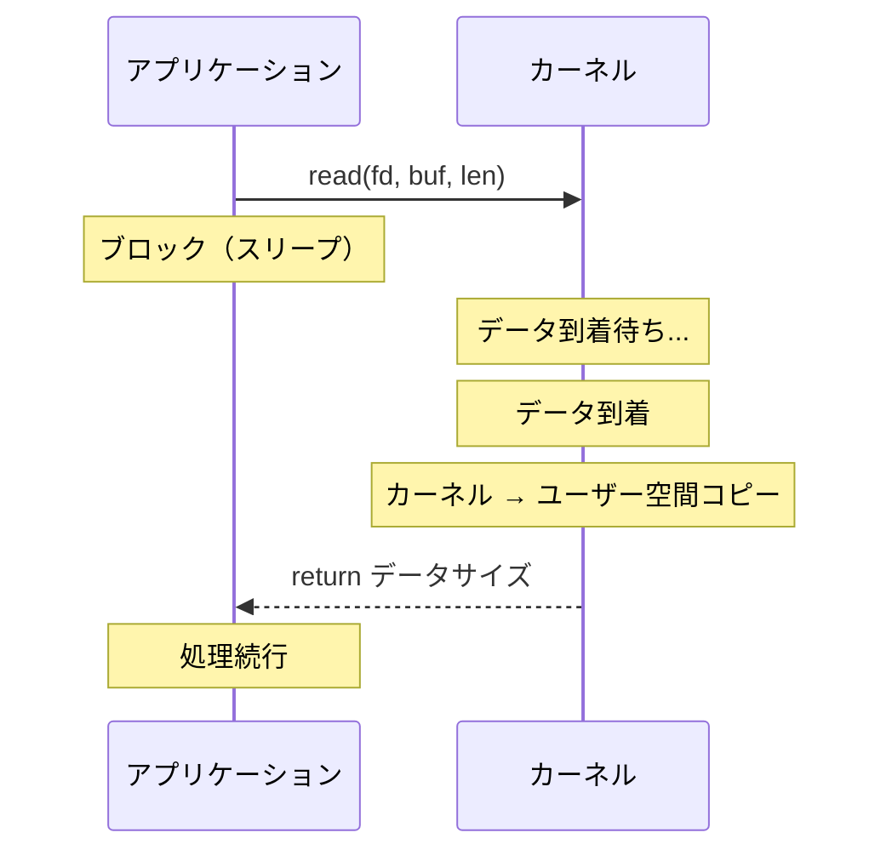

### 2.2 ノンブロッキングI/O（Non-blocking I/O）

ファイルディスクリプタを `O_NONBLOCK` フラグで設定すると、データが無い場合に `read()` は即座に `EAGAIN` エラーを返す。アプリケーションは繰り返しポーリングする必要がある。

```c
// Set file descriptor to non-blocking mode
fcntl(fd, F_SETFL, O_NONBLOCK);

while (1) {
    int n = read(fd, buf, sizeof(buf));
    if (n > 0) {
        // Process data
        break;
    } else if (n == -1 && errno == EAGAIN) {
        // Data not yet available, try again later
        continue;  // Busy-waiting: wastes CPU cycles
    }
}
```

ノンブロッキングI/O単体では、データが到着するまでCPUを浪費する**ビジーウェイト**に陥るため、実用的ではない。通常はI/O多重化と組み合わせて使う。

### 2.3 I/O多重化（I/O Multiplexing）

`select()`, `poll()`, `epoll`, `kqueue` などのシステムコールを使い、**複数のファイルディスクリプタを同時に監視**する。いずれかのfdが読み書き可能になると、アプリケーションに通知される。

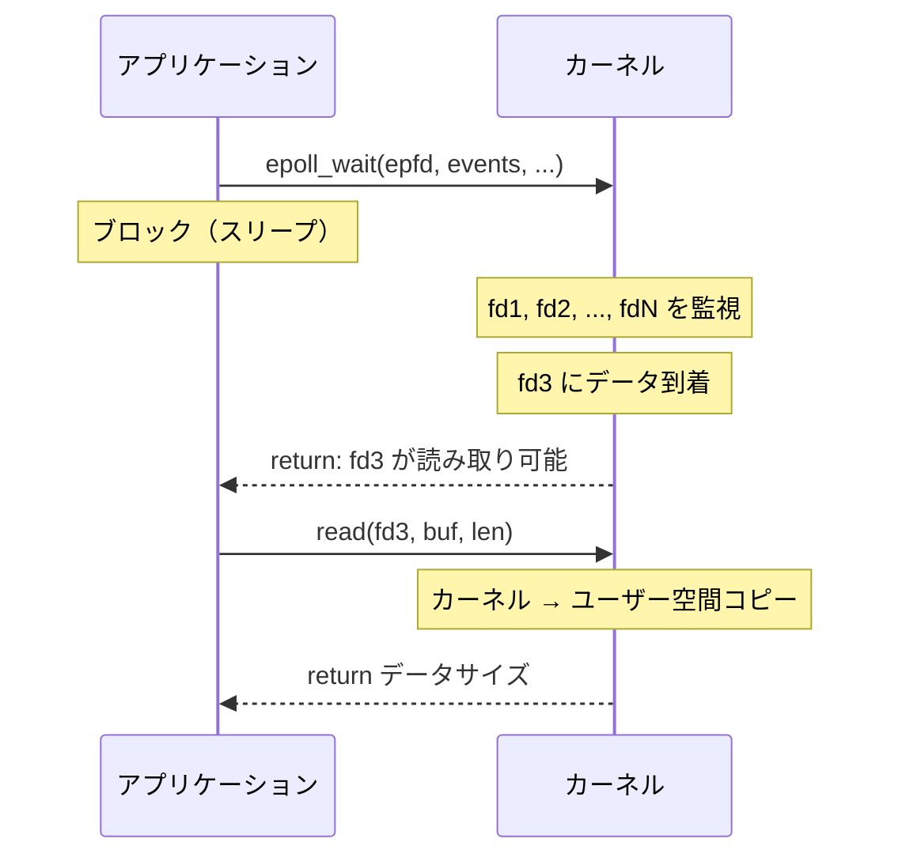

I/O多重化の本質は、**待機のフェーズを統合する**ことにある。N個のfdに対してN個のスレッドで個別に待つのではなく、1つの呼び出しで全fdの状態変化を待つ。

### 2.4 シグナル駆動I/O（Signal-driven I/O）

`SIGIO` シグナルを使い、fdが準備完了になったときにシグナルハンドラを呼び出す。しかし、シグナルはキューイングの制限やハンドラ内での操作の制約があるため、実用では限定的にしか使われない。

### 2.5 非同期I/O（Asynchronous I/O）

POSIX AIO (`aio_read()`) や Linux の `io_uring` が該当する。アプリケーションはI/O操作の開始だけを指示し、**データのコピーまでカーネルが完全に行い**、完了時に通知する。アプリケーションはI/O操作中に一切ブロックされない。

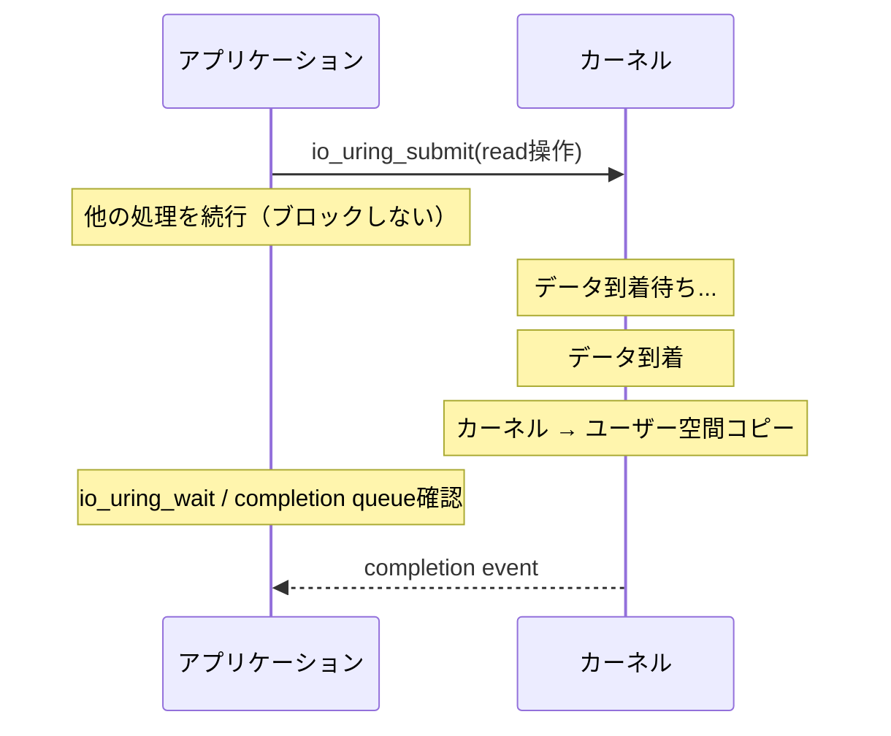

### 2.6 モデルの比較

| モデル | 待機フェーズ | コピーフェーズ | 実用性 |
|--------|-------------|--------------|--------|
| ブロッキングI/O | ブロック | ブロック | 単純だが非効率 |
| ノンブロッキングI/O | ポーリング（CPU浪費） | ブロック | 単体では非実用的 |
| I/O多重化 | ブロック（複数fdを一括） | ブロック | 高効率、広く利用 |
| シグナル駆動I/O | 非ブロック | ブロック | 制約が多い |
| 非同期I/O | 非ブロック | 非ブロック | 最も効率的 |

重要な区別は、I/O多重化は厳密には**同期I/O**であるという点だ。`epoll_wait()` が返った後の `read()` 呼び出しでは、カーネルからユーザー空間へのデータコピーの間、プロセスはブロックされる。一方、`io_uring` のような真の非同期I/Oでは、データコピーまでカーネルが非同期に行う。

## 3. select/poll — 初期のI/O多重化

### 3.1 select(2)

`select()` は1983年に4.2BSDで導入された、最初のI/O多重化システムコールである。POSIX標準に含まれており、事実上すべてのUNIX系OSで利用できる。

```c
#include <sys/select.h>

int select(int nfds, fd_set *readfds, fd_set *writefds,
           fd_set *exceptfds, struct timeval *timeout);
```

`fd_set` はビットマスクであり、監視したいファイルディスクリプタをセットする。`select()` はいずれかのfdが準備完了になるまでブロックし、戻り値としてどのfdが準備完了かをビットマスクに反映する。

```c
fd_set readfds;
FD_ZERO(&readfds);
FD_SET(fd1, &readfds);
FD_SET(fd2, &readfds);
FD_SET(fd3, &readfds);

int maxfd = fd3;  // Must be the highest fd + 1
struct timeval tv = {5, 0};  // 5 seconds timeout

int ready = select(maxfd + 1, &readfds, NULL, NULL, &tv);
if (ready > 0) {
    if (FD_ISSET(fd1, &readfds)) {
        // fd1 is ready for reading
    }
    if (FD_ISSET(fd2, &readfds)) {
        // fd2 is ready for reading
    }
}
```

### 3.2 selectの問題点

`select()` にはいくつかの致命的な設計上の制約がある。

**1. fdの上限制限**：`fd_set` のサイズは `FD_SETSIZE`（通常1024）で固定されている。つまり、ファイルディスクリプタ番号が1024以上のfdを監視できない。この制限はコンパイル時に決定され、変更するにはカーネルの再ビルドが必要な場合がある。

**2. 線形スキャン**：`select()` が返った後、アプリケーションはすべてのfdについて `FD_ISSET()` を呼び出して、どのfdが準備完了かを調べる必要がある。監視しているfdが1万個ある場合、毎回1万個のビットをチェックする O(N) の走査が必要になる。

**3. 毎回のfd_setの再構築**：`select()` は `fd_set` を**破壊的に変更**する（準備完了でないfdのビットをクリアする）。そのため、呼び出しのたびに `fd_set` を初期化し直す必要がある。

**4. カーネル内部でも線形スキャン**：カーネル側でも、渡された全fdに対して線形にポーリングを行う。fdの数に比例してシステムコールのコストが増加する。

### 3.3 poll(2)

`poll()` は `select()` の改良版として登場し、`fd_set` のビットマスクの代わりに `pollfd` 構造体の配列を使う。

```c
#include <poll.h>

struct pollfd {
    int   fd;         // file descriptor
    short events;     // requested events (input)
    short revents;    // returned events (output)
};

int poll(struct pollfd *fds, nfds_t nfds, int timeout);
```

```c
struct pollfd fds[3];
fds[0].fd = fd1;
fds[0].events = POLLIN;
fds[1].fd = fd2;
fds[1].events = POLLIN;
fds[2].fd = fd3;
fds[2].events = POLLIN | POLLOUT;

int ready = poll(fds, 3, 5000);  // 5 seconds timeout
if (ready > 0) {
    for (int i = 0; i < 3; i++) {
        if (fds[i].revents & POLLIN) {
            // fds[i].fd is ready for reading
        }
    }
}
```

`poll()` は `select()` の以下の問題を解消した。

- **fdの上限制限がない**：配列サイズに制限がないため、fdの番号に関係なく監視できる
- **入出力パラメータの分離**：`events`（入力）と `revents`（出力）が分かれているため、毎回の再構築が不要

しかし、以下の問題は依然として残っている。

- **線形スキャン**：準備完了のfdを特定するために、全要素を走査する必要がある
- **呼び出しごとに全fd情報をカーネルにコピー**：監視対象の集合が変わらなくても、毎回 `pollfd` 配列全体をユーザー空間からカーネル空間にコピーする

### 3.4 計算量の問題

`select()` と `poll()` の根本的な問題は、**監視しているfdの総数 N に対して O(N) のコストがかかる**ことである。

| 操作 | select | poll | 理想 |
|------|--------|------|------|
| fdの登録 | O(1) | O(1) | O(1) |
| イベント待ち | O(N) | O(N) | O(1) |
| 準備完了fdの取得 | O(N) | O(N) | O(ready) |

理想的には、監視しているfd数に関係なく、準備完了になったfdの数に比例するコスト（O(ready)）だけで済むべきである。この理想を実現したのが epoll と kqueue である。

## 4. epoll — Linuxの高効率I/O多重化

### 4.1 epollの設計思想

epoll は2002年にLinux 2.5.44で導入された、Linux固有のI/O多重化メカニズムである。`select()`/`poll()` の根本的な設計上の問題を解決するために、**監視対象の管理**と**イベントの取得**を分離した。

epoll の核心的なアイデアは以下の2点である。

1. **ステートフルなイベント監視**：監視対象のfd集合をカーネル内部に保持する。fdの追加・削除は個別に行い、イベント待ちのたびに全fd情報を渡す必要がない
2. **準備完了リストの返却**：イベント待ちの戻り値として、全fdではなく準備完了のfdだけを返す。O(N) ではなく O(ready) のコストで済む

### 4.2 epollのAPI

epoll は3つのシステムコールで構成される。

```c
#include <sys/epoll.h>

// 1. Create an epoll instance
int epoll_create1(int flags);

// 2. Control (add/modify/delete) file descriptors
int epoll_ctl(int epfd, int op, int fd, struct epoll_event *event);

// 3. Wait for events
int epoll_wait(int epfd, struct epoll_event *events,
               int maxevents, int timeout);
```

```c
struct epoll_event {
    uint32_t     events;    // EPOLLIN, EPOLLOUT, EPOLLET, etc.
    epoll_data_t data;      // user data (fd, ptr, etc.)
};
```

基本的な使い方は以下のようになる。

```c
// Create epoll instance
int epfd = epoll_create1(0);

// Add file descriptors to the interest list
struct epoll_event ev;
ev.events = EPOLLIN;
ev.data.fd = listen_fd;
epoll_ctl(epfd, EPOLL_CTL_ADD, listen_fd, &ev);

// Event loop
struct epoll_event events[MAX_EVENTS];
while (1) {
    int nready = epoll_wait(epfd, events, MAX_EVENTS, -1);
    for (int i = 0; i < nready; i++) {
        if (events[i].data.fd == listen_fd) {
            // Accept new connection
            int conn_fd = accept(listen_fd, NULL, NULL);
            ev.events = EPOLLIN | EPOLLET;  // Edge-triggered
            ev.data.fd = conn_fd;
            epoll_ctl(epfd, EPOLL_CTL_ADD, conn_fd, &ev);
        } else {
            // Read data from connected client
            handle_client(events[i].data.fd);
        }
    }
}
```

### 4.3 epollの内部実装

epoll のカーネル内部実装は2つのデータ構造で構成されている。

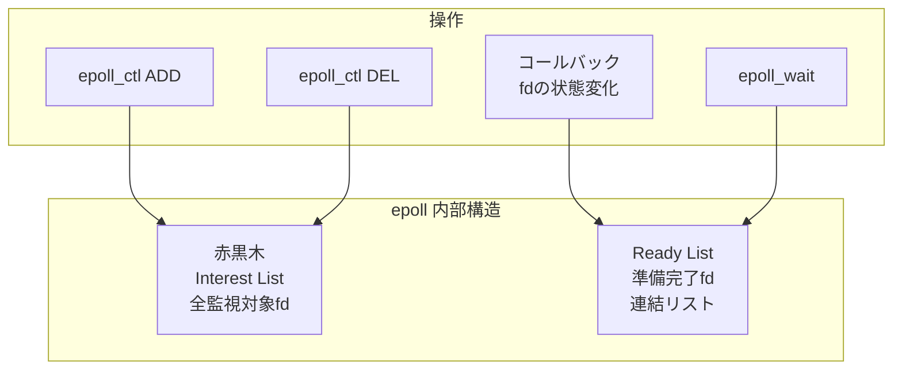

**赤黒木（Red-Black Tree）**：監視対象のfd（interest list）を格納する。`epoll_ctl()` による追加・削除・変更の操作は O(log N) で行われる。この赤黒木により、fdの重複登録の検出も効率的に行える。

**Ready List（準備完了リスト）**：イベントが発生したfdを格納する連結リスト。カーネルのI/Oサブシステムがfdの状態変化を検知すると、**コールバック関数**が呼ばれ、そのfdがready listに追加される。`epoll_wait()` はこのリストからイベントを取得して返すだけなので、O(ready) のコストで済む。

この「コールバック駆動」の設計が epoll の高効率の根幹である。`select()` / `poll()` がイベント待ちのたびに全fdをポーリングするのに対し、epoll ではfdの状態が変化したときにカーネルのコールバックメカニズムによってready listに自動的に追加される。

### 4.4 Level-Triggered vs Edge-Triggered

epoll には2つの通知モードがある。これは電子回路のトリガーモードから名前を借りた概念である。

**Level-Triggered（LT）モード**（デフォルト）：

fdが「読み取り可能」な状態にある限り、`epoll_wait()` は毎回そのfdをイベントとして報告する。`select()` / `poll()` と同じセマンティクスである。

```
データ到着     read()で一部読み取り
    │              │
    ▼              ▼
 ───┐  ┌──────────┐  ┌──────────
    │  │          │  │          ← バッファ内のデータ量
    └──┘          └──┘
 ────────────────────────────── ← "読み取り可能" 閾値
epoll_wait: ✓  ✓  ✓     ✓  ✓   ← 通知（データがある限り毎回）
```

**Edge-Triggered（ET）モード**：

fdの状態が「変化した瞬間」だけ通知する。一度通知を受けたら、次の状態変化（新しいデータの到着）まで再通知されない。

```
データ到着     read()で一部読み取り    新データ到着
    │              │                    │
    ▼              ▼                    ▼
 ───┐  ┌──────────┐  ┌──────────┐  ┌──
    │  │          │  │          │  │
    └──┘          └──┘          └──┘
 ──────────────────────────────────────
epoll_wait: ✓                       ✓  ← 通知（変化時のみ）
```

```c
// Edge-Triggered mode: MUST read all available data
ev.events = EPOLLIN | EPOLLET;
epoll_ctl(epfd, EPOLL_CTL_ADD, fd, &ev);

// ET handler: read until EAGAIN
void handle_et_read(int fd) {
    while (1) {
        int n = read(fd, buf, sizeof(buf));
        if (n == -1) {
            if (errno == EAGAIN) {
                break;  // All data consumed
            }
            perror("read");
            break;
        }
        if (n == 0) {
            // Connection closed
            close(fd);
            break;
        }
        process_data(buf, n);
    }
}
```

ET モードの利点と注意点を以下にまとめる。

| 項目 | Level-Triggered | Edge-Triggered |
|------|----------------|----------------|
| 通知頻度 | データがある限り毎回 | 状態変化時のみ |
| `epoll_wait()` のシステムコール数 | 多い | 少ない |
| プログラミングの容易さ | 容易 | 注意が必要 |
| データの取りこぼし | なし | `EAGAIN` まで読まないと発生 |
| ノンブロッキングI/O | 推奨 | **必須** |
| マルチスレッドでの利用 | thundering herd の可能性 | `EPOLLONESHOT` と組み合わせて安全 |

ET モードでは、`EAGAIN` が返るまで読み切らないとデータの取りこぼしが発生する（starvation）。これはETモードの最も一般的なバグの原因である。

### 4.5 EPOLLONESHOT と EPOLLEXCLUSIVE

マルチスレッドで epoll を使う場合、追加のフラグが重要になる。

**EPOLLONESHOT**：一度イベントが報告されたら、そのfdを自動的に無効化する。再度監視するには `epoll_ctl(EPOLL_CTL_MOD)` で明示的に再有効化する必要がある。これにより、複数のスレッドが同じfdを同時に処理する事態を防げる。

**EPOLLEXCLUSIVE**（Linux 4.5以降）：複数の epoll インスタンスが同じfdを監視している場合、イベント発生時に全epollインスタンスではなく1つだけに通知する。**thundering herd 問題**（多数のスレッドが一斉に起こされる問題）を防ぐために導入された。

### 4.6 epollの制約

epoll は強力だが、いくつかの制約がある。

- **Linux固有**：他のOSでは使えない（macOSでは kqueue、WindowsではIOCPを使う）
- **通常のファイルには使えない**：epoll はネットワークソケット、パイプ、eventfd 等には効果的だが、ディスク上の通常ファイルに対しては**常に「準備完了」を報告する**。ディスクI/Oの非同期化には `io_uring` やスレッドプールが必要
- **依然として同期I/O**：`epoll_wait()` で通知を受けた後の `read()` / `write()` はブロッキング操作である（データのカーネル→ユーザー空間コピー中はブロックされる）

## 5. kqueue — BSD系の統一イベント通知

### 5.1 kqueueの設計思想

kqueue は2000年にFreeBSD 4.1で導入された、BSD系OS（FreeBSD、macOS、OpenBSD、NetBSD）のイベント通知メカニズムである。epoll と同様にスケーラブルなI/O多重化を実現するが、より**汎用的な設計**を持つ点が特徴的である。

epoll がファイルディスクリプタのI/Oイベントに特化しているのに対し、kqueue は**あらゆる種類のカーネルイベント**を統一的に扱える。ファイルI/O、シグナル、タイマー、プロセスの状態変化、ファイルシステムの変更通知（vnode イベント）などを、すべて同じインターフェースで監視できる。

### 5.2 kqueueのAPI

kqueue は2つのシステムコールで構成される。

```c
#include <sys/event.h>

// Create a kqueue instance
int kqueue(void);

// Register events and/or retrieve pending events
int kevent(int kq, const struct kevent *changelist, int nchanges,
           struct kevent *eventlist, int nevents,
           const struct timespec *timeout);
```

```c
struct kevent {
    uintptr_t ident;     // identifier (fd, signal number, pid, etc.)
    int16_t   filter;    // event filter (EVFILT_READ, EVFILT_WRITE, etc.)
    uint16_t  flags;     // action flags (EV_ADD, EV_DELETE, EV_ONESHOT, etc.)
    uint32_t  fflags;    // filter-specific flags
    intptr_t  data;      // filter-specific data
    void      *udata;    // user-defined data (opaque)
};
```

`kevent()` は `changelist`（イベント登録の変更）と `eventlist`（発生したイベントの取得）を1回の呼び出しで同時に行える。これは epoll が `epoll_ctl()` と `epoll_wait()` という2つのシステムコールに分かれているのと対照的である。

```c
int kq = kqueue();

// Register interest in socket readability
struct kevent change;
EV_SET(&change, listen_fd, EVFILT_READ, EV_ADD | EV_ENABLE, 0, 0, NULL);

// Event loop
struct kevent events[MAX_EVENTS];
while (1) {
    // Atomically apply changes and wait for events
    int nready = kevent(kq, &change, 1, events, MAX_EVENTS, NULL);
    // After the first call, clear changelist
    for (int i = 0; i < nready; i++) {
        if ((int)events[i].ident == listen_fd) {
            // Accept new connection
            int conn_fd = accept(listen_fd, NULL, NULL);
            struct kevent new_ev;
            EV_SET(&new_ev, conn_fd, EVFILT_READ, EV_ADD | EV_ENABLE, 0, 0, NULL);
            kevent(kq, &new_ev, 1, NULL, 0, NULL);
        } else {
            // Handle client data
            handle_client((int)events[i].ident);
        }
    }
}
```

### 5.3 kqueueのフィルター

kqueue の汎用性はフィルターシステムに由来する。主なフィルターを以下に示す。

| フィルター | 対象 | 用途 |
|-----------|------|------|
| `EVFILT_READ` | fd | 読み取り可能になった |
| `EVFILT_WRITE` | fd | 書き込み可能になった |
| `EVFILT_VNODE` | fd | ファイルの変更（rename, delete, write, etc.） |
| `EVFILT_PROC` | pid | プロセスの状態変化（exit, fork, exec） |
| `EVFILT_SIGNAL` | signal | シグナルの発生 |
| `EVFILT_TIMER` | 任意のID | タイマーの発火 |
| `EVFILT_USER` | 任意のID | ユーザー定義イベント |

例えば、ファイルの変更監視をI/Oイベントと同じイベントループ内で処理できる。

```c
// Monitor a file for modifications
int file_fd = open("/etc/config.conf", O_RDONLY);
struct kevent ev;
EV_SET(&ev, file_fd, EVFILT_VNODE, EV_ADD | EV_CLEAR,
       NOTE_WRITE | NOTE_DELETE | NOTE_RENAME, 0, NULL);
kevent(kq, &ev, 1, NULL, 0, NULL);

// Monitor a timer (5 second interval)
EV_SET(&ev, TIMER_ID, EVFILT_TIMER, EV_ADD, 0, 5000, NULL);
kevent(kq, &ev, 1, NULL, 0, NULL);
```

この統一性は epoll にはない特徴である。Linux では、同等のことを実現するためにタイマーには `timerfd`、シグナルには `signalfd`、ユーザー定義イベントには `eventfd` を使い、それぞれを epoll に登録する必要がある。

### 5.4 EV_CLEAR と Edge-Triggeredの関係

kqueue の `EV_CLEAR` フラグは epoll の Edge-Triggered モードに相当する。イベントが報告された後、カーネルはそのイベントの状態をリセットし、次の状態変化まで再通知しない。

デフォルト（`EV_CLEAR` なし）は Level-Triggered に相当し、条件が満たされている限り毎回報告される。

### 5.5 epollとkqueueの比較

| 特性 | epoll | kqueue |
|------|-------|--------|
| OS | Linux | FreeBSD, macOS, OpenBSD, NetBSD |
| 対象イベント | fd のI/Oイベント | 任意のカーネルイベント |
| APIのシステムコール数 | 3 (`create1`, `ctl`, `wait`) | 2 (`kqueue`, `kevent`) |
| 変更とイベント取得 | 別々のシステムコール | 1回で同時に可能 |
| ET モード | `EPOLLET` フラグ | `EV_CLEAR` フラグ |
| タイマー | `timerfd` 経由 | `EVFILT_TIMER` で直接 |
| シグナル | `signalfd` 経由 | `EVFILT_SIGNAL` で直接 |
| ファイル監視 | inotify（別API） | `EVFILT_VNODE` で直接 |

## 6. io_uring — 次世代の非同期I/Oインターフェース

### 6.1 従来のLinux非同期I/Oの問題

Linux には以前から POSIX AIO (`aio_read()`, `aio_write()`) と Linux AIO (`io_submit()`) が存在したが、どちらも深刻な制約を抱えていた。

**POSIX AIO**：glibc の実装はユーザー空間のスレッドプールを使った模擬的な非同期I/Oであり、真の非同期I/Oではなかった。スレッドの生成コストやコンテキストスイッチの問題を抱えていた。

**Linux AIO (libaio)**：カーネルレベルの非同期I/Oだが、以下の制約があった。
- `O_DIRECT` フラグ付きのファイルI/Oにしか使えない（バッファードI/O不可）
- ネットワークI/Oには使えない
- 操作によってはブロックすることがある（メタデータ操作など）
- API設計が不便

このような状況で、2019年にJens Axboe（Linux I/Oサブシステムのメンテナ）がLinux 5.1で導入したのが **io_uring** である。

### 6.2 io_uringの設計思想

io_uring の設計は3つの原則に基づいている。

**1. システムコールの最小化**：従来のI/Oでは1回のI/O操作ごとに少なくとも1回のシステムコールが必要だった。システムコールにはユーザー空間→カーネル空間のコンテキストスイッチが伴い、Spectre/Meltdown対策以降はそのコストがさらに増大している。io_uring は複数のI/O操作をバッチで発行し、理想的にはシステムコールなしで操作できる。

**2. 共有メモリによるゼロコピー通信**：アプリケーションとカーネルが共有するリングバッファを使い、I/Oリクエストと完了通知の受け渡しにデータコピーが発生しない。

**3. 統一インターフェース**：ファイルI/O、ネットワークI/O、タイマーなど、あらゆるI/O操作を同じインターフェースで扱える。

### 6.3 Submission QueueとCompletion Queue

io_uring の中核は、ユーザー空間とカーネル空間で**共有される2つのリングバッファ**である。

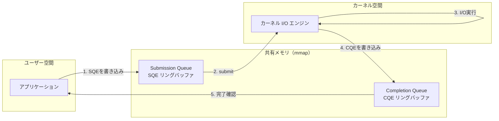

**Submission Queue Entry（SQE）**：アプリケーションがI/Oリクエストを記述する構造体。操作の種類（read, write, accept, connect, etc.）、ファイルディスクリプタ、バッファのアドレス、オフセットなどを格納する。

**Completion Queue Entry（CQE）**：カーネルがI/O操作の結果を記述する構造体。対応するSQEのユーザーデータと、操作の結果（成功時はバイト数、失敗時はエラーコード）を含む。

リングバッファは `mmap()` で共有メモリとしてマッピングされるため、SQEの書き込みとCQEの読み取りにシステムコールは不要である。実際の発行には `io_uring_enter()` システムコールを使うが、**SQPOLL モード**を使えばこれすら不要にできる。

### 6.4 io_uringの基本的な使い方

liburing ライブラリを使った基本的な例を示す。

```c
#include <liburing.h>

struct io_uring ring;
// Initialize io_uring with 256 SQ entries
io_uring_queue_init(256, &ring, 0);

// Prepare a read operation
struct io_uring_sqe *sqe = io_uring_get_sqe(&ring);
io_uring_prep_read(sqe, fd, buf, buf_size, offset);
io_uring_sqe_set_data(sqe, user_data);  // Attach user context

// Submit the request
io_uring_submit(&ring);

// Wait for completion
struct io_uring_cqe *cqe;
io_uring_wait_cqe(&ring, &cqe);

// Process result
if (cqe->res >= 0) {
    // Success: cqe->res contains bytes read
    void *data = io_uring_cqe_get_data(cqe);
} else {
    // Error: cqe->res contains negative errno
}

// Mark CQE as consumed
io_uring_cqe_seen(&ring, cqe);

// Cleanup
io_uring_queue_exit(&ring);
```

### 6.5 高度な機能

io_uring はバージョンを重ねるごとに強力な機能が追加されている。

**SQPOLL モード**：カーネルスレッドがSubmission Queueを常時ポーリングするモードである。アプリケーションはSQEを書き込むだけで自動的にI/Oが発行されるため、`io_uring_enter()` システムコールすら呼ぶ必要がない。超低レイテンシが求められるアプリケーション（高頻度取引システムなど）で有用。

```c
struct io_uring_params params = {0};
params.flags = IORING_SETUP_SQPOLL;
params.sq_thread_idle = 2000;  // Thread sleeps after 2 seconds of inactivity
io_uring_queue_init_params(256, &ring, &params);
```

**固定バッファ / 固定ファイル**：`io_uring_register_buffers()` と `io_uring_register_files()` を使い、バッファやファイルディスクリプタを事前にカーネルに登録できる。これにより、操作ごとのバッファマッピングやfdの参照カウント操作を省略でき、性能が向上する。

**リンク操作（Linked SQEs）**：複数のSQEを依存チェーンとして連結できる。前のSQEが完了してから次のSQEが実行される。例えば「read → process → write」のパイプラインを1回のsubmitで表現できる。

```c
// Read from source, then write to destination
struct io_uring_sqe *sqe1 = io_uring_get_sqe(&ring);
io_uring_prep_read(sqe1, src_fd, buf, len, 0);
sqe1->flags |= IOSQE_IO_LINK;  // Link to next SQE

struct io_uring_sqe *sqe2 = io_uring_get_sqe(&ring);
io_uring_prep_write(sqe2, dst_fd, buf, len, 0);

io_uring_submit(&ring);
```

**マルチショット操作**（Linux 5.19以降）：`accept()` や `recv()` などの操作で、1つのSQEで複数の完了イベントを生成できる。高トラフィックサーバーで、新しい接続を受け入れるたびにSQEを再発行する必要がなくなる。

### 6.6 io_uringのネットワーキング対応

io_uring は当初ファイルI/Oに焦点を当てていたが、バージョンを重ねるごとにネットワーキングのサポートが拡充された。

| 操作 | 対応カーネルバージョン |
|------|---------------------|
| `readv` / `writev` | 5.1 |
| `accept` | 5.5 |
| `connect` | 5.5 |
| `send` / `recv` | 5.6 |
| `sendmsg` / `recvmsg` | 5.6 |
| multishot `accept` | 5.19 |
| multishot `recv` | 6.0 |
| zero-copy `send` | 6.0 |

現在では io_uring は単なるファイルI/Oの高速化ツールではなく、**epoll の代替としてネットワーキングにも使える統合I/Oフレームワーク**へと進化している。

### 6.7 セキュリティ上の考慮

io_uring はカーネルの複雑な機能であり、セキュリティ上の脆弱性が複数報告されている。Google は2023年に Chrome OS および Google プロダクションサーバーで io_uring を無効化した。Docker もデフォルトの seccomp プロファイルで io_uring のシステムコールをブロックしている。

これらの制約は io_uring の設計の問題というよりも、新しく複雑なカーネルインターフェースが安定するまでの過渡的な問題と見るべきである。攻撃面を最小化するためのセキュリティプラクティスと、io_uring の性能上の利点のバランスを考慮する必要がある。

## 7. Reactor パターンとProactor パターン

I/O多重化メカニズムの上に構築されるソフトウェアアーキテクチャパターンとして、**Reactor** と **Proactor** の2つが存在する。これらはI/Oイベントの処理方法の違いを抽象化したものである。

### 7.1 Reactor パターン

Reactor パターンは、I/O多重化（epoll, kqueue, select/poll）の上に構築される**同期的なイベント駆動パターン**である。

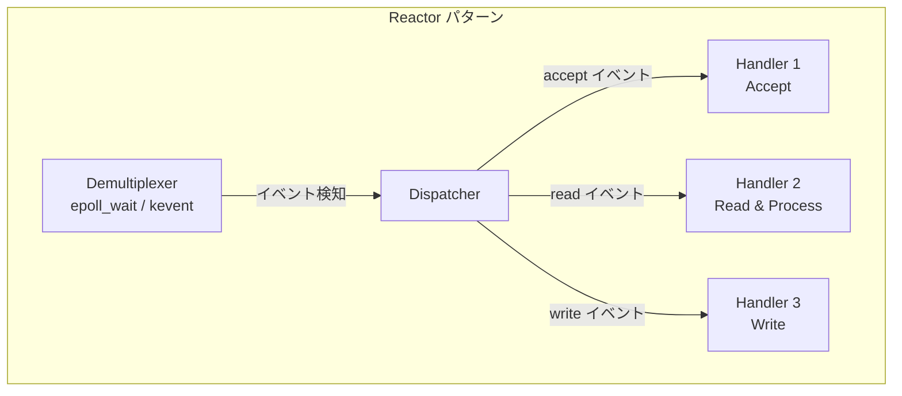

Reactor パターンの動作は以下の通りである。

1. **Demultiplexer**（epoll_wait 等）がI/Oイベントを待つ
2. イベントが発生すると、**Dispatcher** が適切な **Handler** を呼び出す
3. Handler が**同期的に**I/O操作（read/write）と業務ロジックを実行する

Reactor パターンの実装バリエーションには以下がある。

**Single-Threaded Reactor**：1つのスレッドがすべてのイベント処理を行う。Redis や Node.js はこのモデルに近い。実装が単純で競合条件が発生しないが、CPU負荷の高い処理がイベントループをブロックする危険がある。

**Multi-Threaded Reactor**：イベントの検知は1つのスレッド（Reactor スレッド）が行い、実際のI/O処理とビジネスロジックはワーカースレッドプールに委譲する。

**Multi-Reactor（Master-Worker）**：メインの Reactor がaccept を担当し、確立した接続を複数のサブ Reactor に分配する。Nginx のワーカープロセスモデルや Netty の EventLoopGroup がこの設計である。

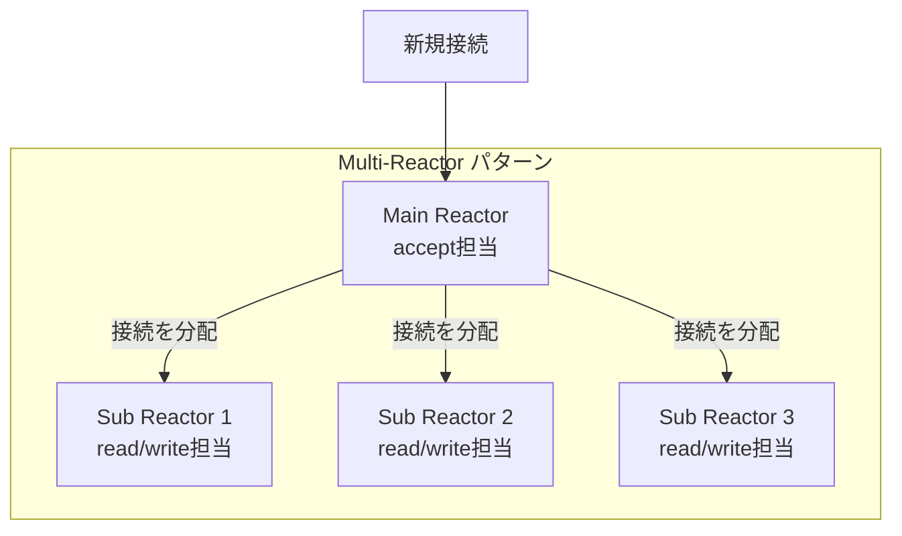

### 7.2 Proactor パターン

Proactor パターンは、真の非同期I/O（io_uring, Windows IOCP）の上に構築される**非同期的なイベント駆動パターン**である。

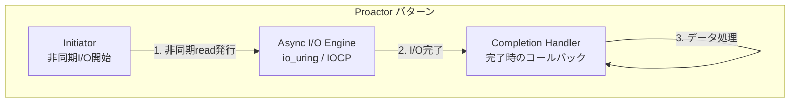

Reactor パターンとの根本的な違いは以下の点である。

| 側面 | Reactor | Proactor |
|------|---------|----------|
| I/Oの実行者 | アプリケーション（Handler） | カーネル（OS） |
| 通知のタイミング | I/O**準備完了**時 | I/O**完了**時 |
| Handler が受け取るもの | 「読み取り可能」という通知 | 完了したデータそのもの |
| 典型的な実装 | epoll + read() | io_uring / IOCP |

Proactor パターンでは、Handler がI/O操作を行う必要がない。カーネルがデータの読み取り（カーネルバッファ→ユーザーバッファのコピー）まで完了させた後に、Handler が呼ばれる。このため、Handler 内でのブロッキングが原理的に発生しない。

### 7.3 実用上のパターン選択

実世界のほとんどのネットワークサーバーは Reactor パターンを採用している。理由は以下の通りである。

1. epoll/kqueue は十分に高効率であり、ネットワークI/Oにおいては Proactor との性能差は小さい
2. Reactor パターンは概念がシンプルで、デバッグが容易
3. Proactor パターンを完全にサポートする非同期I/OはOSによって実装が異なる（io_uring は Linux のみ、IOCP は Windows のみ）

ただし、ファイルI/Oが主体のアプリケーション（データベースエンジン等）では、io_uring を使った Proactor パターンが性能上の大きな利点を持つ。

## 8. 実世界のアーキテクチャ

### 8.1 Nginx

Nginx は **Multi-Reactor**（Master-Worker）アーキテクチャの代表例である。

```
┌─────────────────────────────────────────────────┐
│                  Master Process                  │
│  ・設定ファイルの読み込み                           │
│  ・Worker プロセスの管理（fork）                    │
│  ・シグナルハンドリング                             │
└─────────────────────┬───────────────────────────┘
                      │ fork
    ┌─────────────────┼─────────────────┐
    ▼                 ▼                 ▼
┌─────────┐    ┌─────────┐    ┌─────────┐
│ Worker 1 │    │ Worker 2 │    │ Worker N │
│ epoll    │    │ epoll    │    │ epoll    │
│ event    │    │ event    │    │ event    │
│ loop     │    │ loop     │    │ loop     │
└─────────┘    └─────────┘    └─────────┘
  各ワーカーが独立した epoll インスタンスを持つ
  （CPUコア数 = ワーカー数が推奨）
```

各ワーカープロセスは独立したイベントループを持ち、`epoll_wait()` （Linuxの場合）で数千〜数万の同時接続を処理する。ワーカー間でメモリを共有しないため、ロックが不要で、CPUキャッシュの効率も高い。

Nginx は `accept_mutex`（現在はデフォルトで無効）や `EPOLLEXCLUSIVE`、`SO_REUSEPORT` を使ってリスニングソケットを複数ワーカーで共有し、thundering herd 問題に対処している。

### 8.2 Node.js (libuv)

Node.js はシングルスレッドのイベントループモデルを採用しているが、その実装は **libuv** というクロスプラットフォームの非同期I/Oライブラリに依存している。

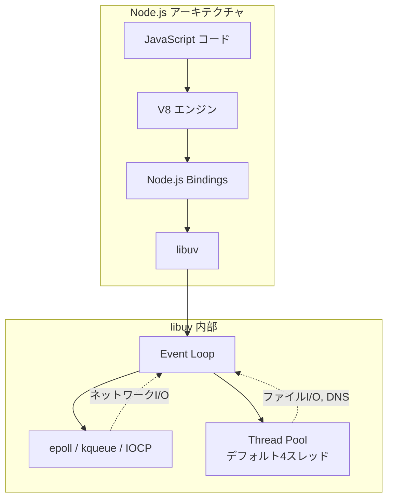

libuv のイベントループは以下のフェーズで構成される。

1. **timers** — `setTimeout()`, `setInterval()` のコールバック実行
2. **pending callbacks** — 延期されたI/Oコールバック
3. **idle, prepare** — 内部使用
4. **poll** — epoll/kqueue/IOCPでI/Oイベントを取得
5. **check** — `setImmediate()` のコールバック実行
6. **close callbacks** — `close` イベントのコールバック

注目すべきは、ファイルI/Oはイベントループのポーリング機構（epoll等）ではなく**スレッドプール**で処理される点である。前述の通り、epoll は通常のファイルに対しては機能しないため、libuv はファイルI/Oをバックグラウンドのスレッドプールにオフロードしている。

### 8.3 Redis

Redis は**シングルスレッドのイベントループ**で有名だが、正確にはI/O処理がシングルスレッドということである（Redis 6.0以降、I/Oスレッドが追加された）。

Redis の独自イベントライブラリ **ae**（A simple Event library）は、各OS に応じて epoll / kqueue / select を自動的に選択する薄い抽象化レイヤーである。

Redis がシングルスレッドでも高性能を達成できる理由は以下の通りである。

1. **インメモリ操作**：すべてのデータはメモリ上にあるため、ディスクI/O待ちが（通常の操作では）発生しない
2. **操作の軽量さ**：典型的なRedisコマンド（GET, SET）の処理は数マイクロ秒で完了する
3. **I/O多重化**：epoll/kqueue により、1つのスレッドで数万の接続を効率的に管理
4. **パイプライニング**：クライアントが複数のコマンドをまとめて送信でき、ラウンドトリップを削減

Redis 6.0で導入された**I/Oスレッド**は、ネットワークI/O（ソケットからの読み取りとレスポンスの書き込み）を複数のスレッドで並列処理する。ただし、コマンドの実行（データ構造の操作）は依然としてメインスレッドでシリアルに行われるため、ロック不要の設計が維持されている。

### 8.4 Tokio (Rust)

Tokio は Rust エコシステムにおける非同期ランタイムであり、**マルチスレッドのワークスティーリングスケジューラ**と **mio**（Metal I/O）ライブラリを基盤としている。

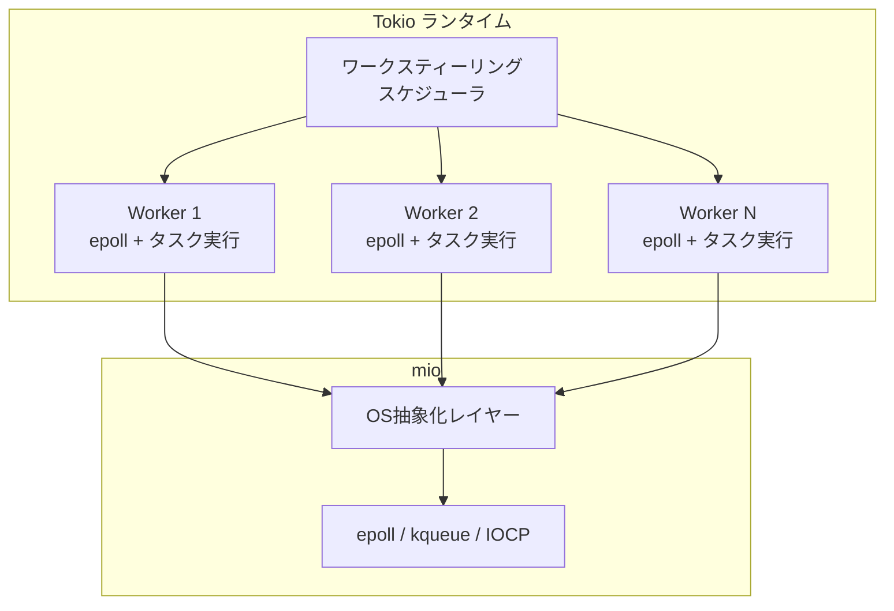

Tokio の特筆すべき点は以下である。

- **mio** が epoll/kqueue/IOCP を統一的に抽象化し、クロスプラットフォームを実現
- 各ワーカースレッドが自身の epoll インスタンスとタスクキューを持つ
- タスクの偏りが生じると、暇なワーカーが忙しいワーカーからタスクをスティール（盗む）
- Rust の `async/await` と `Future` トレイトにより、ゼロコスト抽象化が実現される
- **io_uring サポート**は `tokio-uring` クレートとして実験的に提供されている

### 8.5 その他の実装例

| ソフトウェア | I/O多重化 | アーキテクチャ |
|-------------|----------|--------------|
| HAProxy | epoll/kqueue | Multi-threaded event loop |
| Envoy Proxy | libevent (epoll/kqueue) | Multi-threaded, per-thread event loop |
| PostgreSQL | select/poll → epoll (v17以降) | process-per-connection + I/O多重化 |
| Go runtime | netpoller (epoll/kqueue) | M:N スケジューラ + goroutine |
| Java NIO | epoll/kqueue (Selector) | Reactor パターン (Netty) |

## 9. パフォーマンス比較と選択基準

### 9.1 スケーラビリティ特性

各メカニズムの計算量を整理する。

| 操作 | select | poll | epoll (LT) | epoll (ET) | kqueue | io_uring |
|------|--------|------|-----------|-----------|--------|----------|
| fd の追加 | O(1) | O(1) | O(log N) | O(log N) | O(log N) | O(1) |
| イベント待ち | O(N) | O(N) | O(1) | O(1) | O(1) | O(1) |
| 結果の取得 | O(N) | O(N) | O(ready) | O(ready) | O(ready) | O(ready) |
| fd 上限 | 1024 | なし | なし | なし | なし | なし |

### 9.2 パフォーマンスに影響する要因

実際のパフォーマンスは単純な計算量だけでは決まらない。以下の要因が重要である。

**アクティブ接続の割合**：1万のfdを監視しているが、常に100個程度しかアクティブでない場合、epoll は `select`/`poll` に対して圧倒的に有利である。しかし、監視しているfdのほとんどが常にアクティブな場合（例えばパイプラインで繋がれたプロセス群）、差は小さくなる。

**システムコールのオーバーヘッド**：Spectre/Meltdown 対策後、システムコールのコストは増加した。io_uring の「システムコールなし」モード（SQPOLL）は、この文脈で特に重要である。

**カーネル↔ユーザー空間のデータコピー**：`select`/`poll` は呼び出しごとに全fd情報をコピーする。epoll はカーネル内部にfd情報を保持する。io_uring は共有メモリを使う。この差は高スループットの環境で顕在化する。

**バッチ処理**：io_uring は複数のI/O操作を1回のsubmitでバッチ発行できるため、操作あたりのオーバーヘッドが小さい。

### 9.3 選択の指針

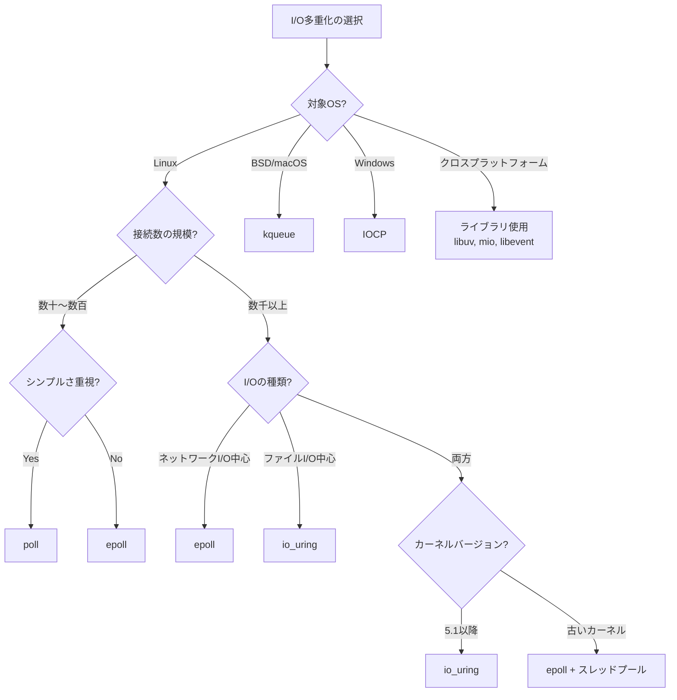

実務上の推奨事項をまとめる。

1. **ポータビリティが必要**なら、libuv/mio/libevent 等の抽象化ライブラリを使う。直接 epoll/kqueue を呼ぶべきではない
2. **Linux でネットワークサーバー**を書くなら、epoll で十分である。Edge-Triggered + EPOLLONESHOT の組み合わせが高性能
3. **ファイルI/Oの高速化**が必要なら、io_uring が最適解である（カーネル 5.1以降）
4. **超低レイテンシ**が要求される場合（高頻度取引等）、io_uring の SQPOLL モードを検討する
5. **数十接続程度の小規模アプリ**では、poll で十分であり、複雑さを持ち込む必要はない

## 10. Windows IOCP との比較

### 10.1 IOCPの設計

Windows の **I/O Completion Port（IOCP）** は、epoll/kqueue とは根本的に異なるアプローチを採る。IOCP は Proactor パターンの実装であり、I/O操作の**完了**を通知する。

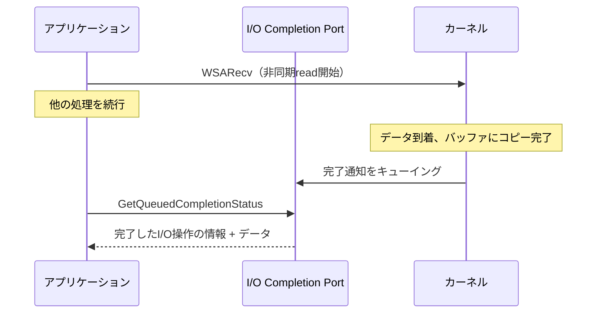

IOCP の特筆すべき設計は、**スレッドプールの自動管理**機能である。IOCP はCompletionPortに関連付けられたスレッドの数を追跡し、I/O完了の通知を受け取るスレッドの数を**同時実行数の上限**に基づいて自動的に制御する。

```c
// Create IOCP with concurrency hint (usually = CPU core count)
HANDLE iocp = CreateIoCompletionPort(
    INVALID_HANDLE_VALUE, NULL, 0,
    num_cpu_cores  // Max concurrent threads
);

// Associate a socket with IOCP
CreateIoCompletionPort((HANDLE)socket, iocp, (ULONG_PTR)context, 0);

// Worker thread: wait for completion
DWORD bytes;
ULONG_PTR key;
OVERLAPPED *ovl;
GetQueuedCompletionStatus(iocp, &bytes, &key, &ovl, INFINITE);
// I/O is already complete; data is in the buffer
```

### 10.2 epoll/kqueue vs IOCP の設計哲学の違い

| 側面 | epoll / kqueue | IOCP |
|------|---------------|------|
| 通知モデル | **Readiness**（準備完了通知） | **Completion**（完了通知） |
| パターン | Reactor | Proactor |
| I/Oの実行者 | アプリケーション | カーネル |
| 通知時点 | read() 可能になった時 | read() が完了した時 |
| バッファ管理 | アプリが制御 | カーネルがバッファにデータをコピー |
| スレッドモデル | アプリが管理 | IOCP が部分的に管理 |

**Readiness モデル**（epoll/kqueue）：「このfdはread可能です」と通知される。アプリケーションが `read()` を呼んでデータを取得する。データがまだカーネルバッファにあり、`read()` 呼び出し時にユーザー空間にコピーされる。

**Completion モデル**（IOCP）：「このread操作が完了し、データはバッファに入っています」と通知される。アプリケーションは通知を受けた時点でデータを即座に使える。

この設計の違いにより、IOCP ではアプリケーションがバッファを事前に提供し（`OVERLAPPED` 構造体経由）、カーネルがそのバッファにデータをコピーする。バッファの寿命管理がアプリケーションの責任になるため、プログラミングモデルはやや複雑になる。

### 10.3 io_uring — Unix世界のCompletionモデル

io_uring の登場により、Linux でも Completion ベースの非同期I/Oが実用的になった。io_uring と IOCP の共通点と相違点を整理する。

| 側面 | io_uring | IOCP |
|------|----------|------|
| 通知モデル | Completion | Completion |
| 通信方式 | 共有リングバッファ（mmap） | カーネルオブジェクト |
| バッチ処理 | ネイティブ対応 | 一部対応（GetQueuedCompletionStatusEx） |
| syscall 回避 | SQPOLL で可能 | 不可 |
| スレッド管理 | アプリが管理 | IOCP が部分的に管理 |
| 対応I/O種別 | ファイル + ネットワーク + その他 | 主にファイルとネットワーク |

io_uring の共有リングバッファによるゼロコピー通信と SQPOLL モードは、IOCP にはない革新的な設計であり、理論上は IOCP よりも低いオーバーヘッドを達成できる。

## 11. まとめ

I/O多重化は、現代の高性能ネットワークプログラミングの基盤技術である。ブロッキングI/O + thread-per-connection モデルから出発し、C10K問題を契機として select/poll が登場し、さらにスケーラブルな epoll/kqueue が現在の主流となった。

そして io_uring の登場は、単なる「次世代の epoll」ではなく、I/Oプログラミングモデル自体のパラダイムシフトを示唆している。Readiness ベース（Reactor）から Completion ベース（Proactor）への移行は、より高い性能とプログラミングモデルの統一をもたらす可能性がある。

```
            進化の流れ

select/poll ──→ epoll/kqueue ──→ io_uring
 (1983)         (2000-2002)      (2019)

 O(N)            O(ready)        O(ready)
 fd上限あり       fd上限なし       fd上限なし
 Readiness       Readiness       Completion
 同期I/O         同期I/O          真の非同期I/O
```

実務においては、使用するプログラミング言語やフレームワークのランタイム（Go のnetpoller、Rust のTokio、Node.js のlibuv）がI/O多重化を抽象化しているため、これらのメカニズムを直接呼び出す場面は多くない。しかし、**なぜ**そのランタイムが高効率なのか、**どこで**ボトルネックが発生しうるのかを理解するためには、I/O多重化の原理を深く知ることが不可欠である。
