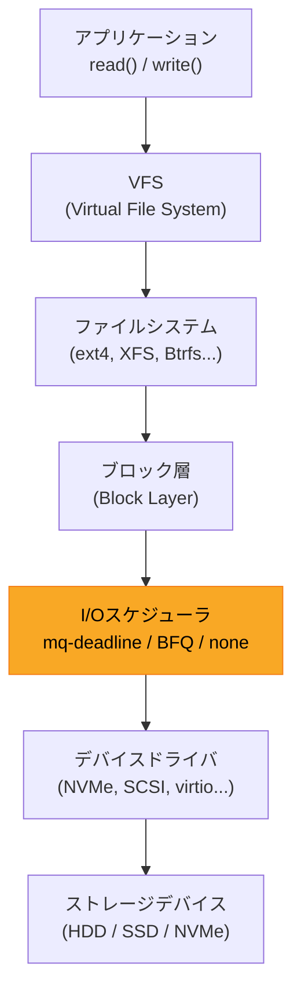
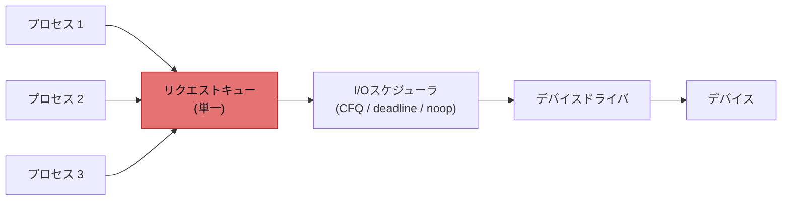
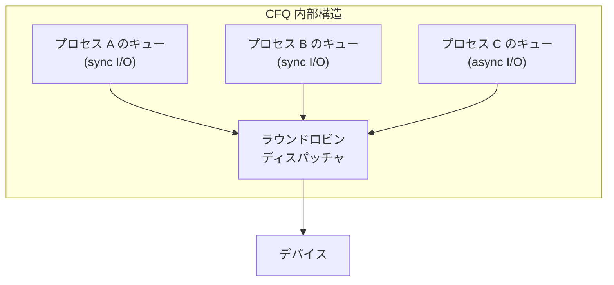
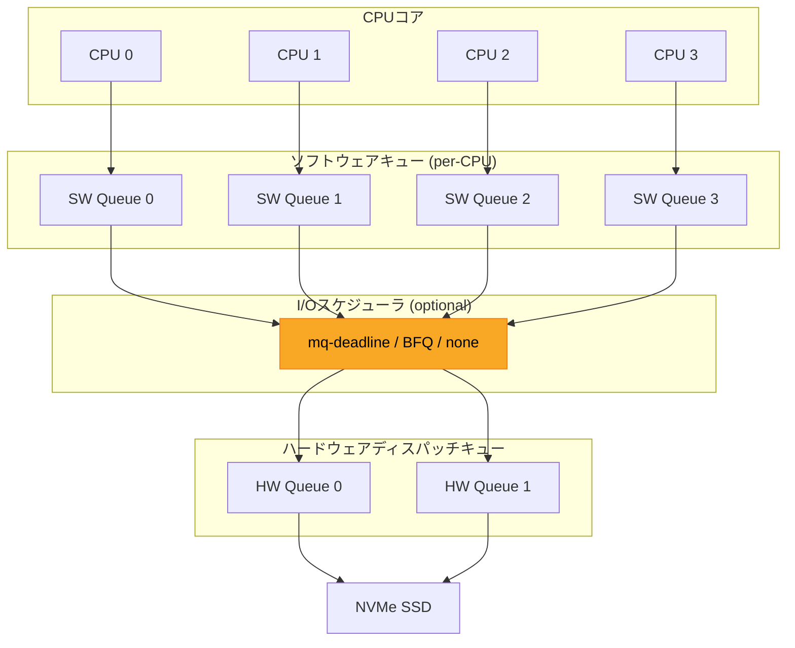
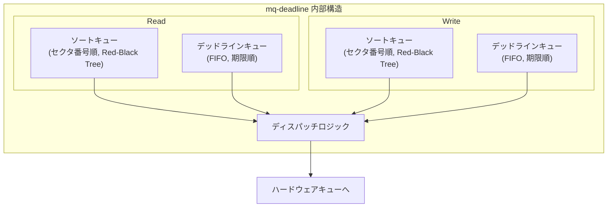
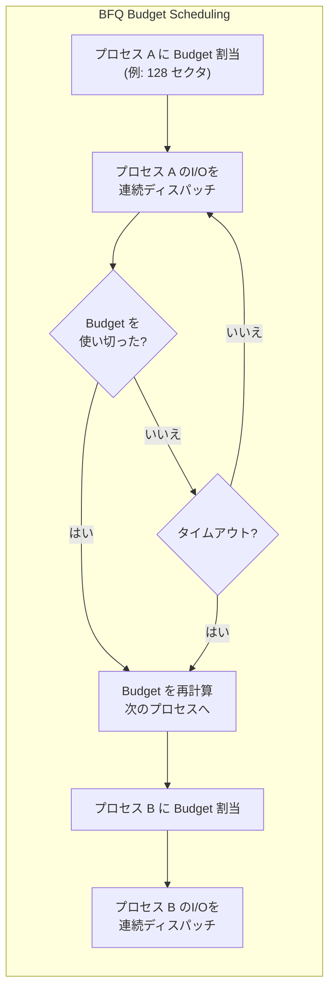
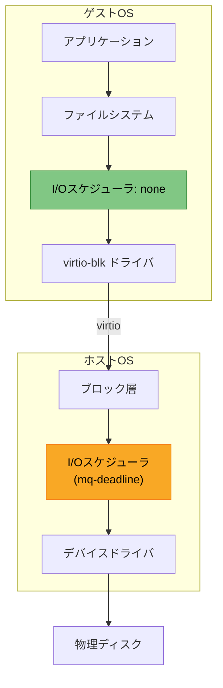
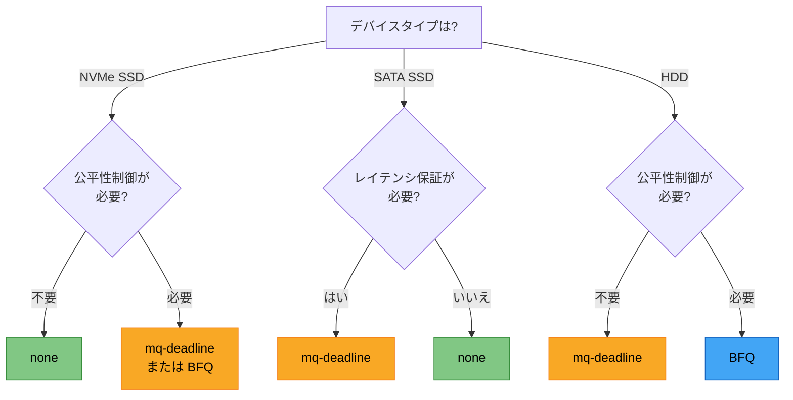
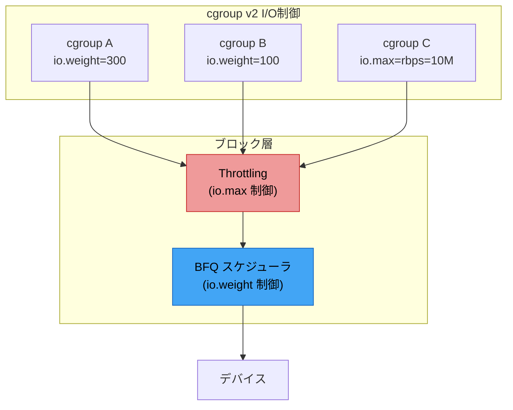
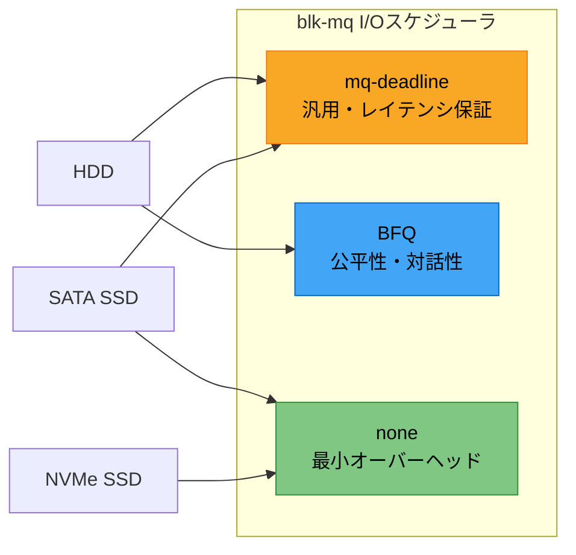

# I/Oスケジューラ — mq-deadline, BFQ, none の設計と選択指針

## 1. I/Oスケジューリングの目的

### 1.1 なぜI/Oスケジューリングが必要なのか

コンピュータシステムにおいて、CPU やメモリと比較してストレージデバイスへのアクセスは桁違いに遅い。DDR5 メモリのランダムアクセスレイテンシが数十ナノ秒であるのに対し、HDD のランダムアクセスは数ミリ秒、NVMe SSD でさえ数十マイクロ秒を要する。この速度差は3桁から5桁にも及ぶ。

アプリケーションが発行するI/Oリクエストは、ファイルシステムやブロック層を経由してデバイスドライバに届けられる。この過程でリクエストが到着順にそのまま処理されると、次のような問題が生じる。

**HDD におけるシーク時間の爆発**

HDD はディスクヘッドを物理的に移動させてデータにアクセスする。ランダムなセクタへのアクセス要求がバラバラの順序で届くと、ヘッドが頻繁に往復し、シーク時間が支配的になる。例えば、セクタ 100, 50000, 200, 49000 という順序の要求があった場合、ヘッドは大きく振れる。しかし 100, 200, 49000, 50000 と並べ替えれば、ヘッドの総移動距離は劇的に減少する。

```
到着順に処理した場合のヘッド移動:
セクタ 100 --> 50000 --> 200 --> 49000
         [+49900]  [-49800] [+48800]  合計: 148,500 セクタ分の移動

並べ替えて処理した場合のヘッド移動:
セクタ 100 --> 200 --> 49000 --> 50000
         [+100]   [+48800]  [+1000]   合計: 49,900 セクタ分の移動
```

この例では、単純な並べ替えだけで移動距離が約3分の1になる。

**公平性の欠如**

複数のプロセスが同時にI/Oを発行する環境では、大量のI/Oを発行するプロセスがデバイスの帯域を独占してしまい、他のプロセスが極端に遅延する「I/Oスタベーション」が発生しうる。デスクトップ環境では、バックグラウンドの大規模ファイルコピーによってフォアグラウンドのアプリケーションが応答不能になるケースが典型的である。

**レイテンシの悪化**

スループット最適化のためにリクエストを溜め込みすぎると、個々のリクエストの待ち時間（レイテンシ）が増大する。リアルタイム性が求められるワークロードでは、これは深刻な問題となる。

### 1.2 I/Oスケジューラの役割

I/Oスケジューラは、アプリケーションから発行されたI/Oリクエストを一旦バッファリングし、以下の目標を達成するために順序や優先度を制御する。

1. **スループットの最大化** — デバイスの物理特性に合わせてリクエストを並べ替え、単位時間あたりの処理量を最大化する
2. **レイテンシの制御** — 個々のリクエストが過度に待たされないようにデッドラインを設ける
3. **公平性の確保** — 複数のプロセスやcgroup間でI/O帯域を公平に分配する
4. **マージの実施** — 隣接するセクタへのリクエストを1つの大きなリクエストに統合し、オーバーヘッドを削減する



上図に示すとおり、I/Oスケジューラはブロック層の中でファイルシステムとデバイスドライバの間に位置する。カーネルのI/Oスタック全体の中では比較的薄いレイヤーだが、I/O性能に対する影響は極めて大きい。

### 1.3 スケジューリングの基本アルゴリズム

I/Oスケジューリングの歴史は、ディスクスケジューリングアルゴリズムの研究に遡る。代表的なアルゴリズムを整理する。

| アルゴリズム | 方式 | 長所 | 短所 |
|---|---|---|---|
| FCFS (First Come First Served) | 到着順 | 実装が単純、公平 | シーク最適化なし |
| SSTF (Shortest Seek Time First) | 最短シーク | スループット良好 | スタベーション発生 |
| SCAN (エレベータ) | 端から端へ往復 | スタベーション回避 | 端のセクタに不公平 |
| C-SCAN (Circular SCAN) | 一方向のみ | 均一な待ち時間 | 復帰時の無駄 |
| LOOK / C-LOOK | SCAN の改良版 | 実用的 | 依然として近似 |

Linux のI/Oスケジューラは、これらの古典的アルゴリズムを基盤としつつ、レイテンシ保証や公平性制御などの実用的な要件を統合した設計となっている。

## 2. シングルキュー時代 — CFQ, deadline, noop

### 2.1 Linux ブロック層の初期設計

Linux 2.6 系列（2003年〜）のブロック層は、**シングルキューアーキテクチャ**を採用していた。すべてのI/Oリクエストは単一のリクエストキューに投入され、I/Oスケジューラがそのキューからリクエストを取り出してデバイスドライバに渡す構造である。



このアーキテクチャは HDD が主流だった時代にはうまく機能した。HDD のI/O処理速度がボトルネックであり、単一キューのロック競合はI/O処理時間に比べれば無視できるほど小さかったためである。

### 2.2 CFQ（Completely Fair Queuing）

CFQ は Linux 2.6.18（2006年）からデフォルトのI/Oスケジューラとなり、長らくその地位を維持した。名前のとおり「完全に公平なキューイング」を目指した設計である。

**基本原理**

CFQ はプロセスごとに独立したI/Oキューを作成し、ラウンドロビン方式で各キューにタイムスライスを割り当てる。各プロセスは割り当てられたタイムスライスの間だけI/Oをディスパッチでき、タイムスライスが切れると次のプロセスのキューに切り替わる。



**I/O優先度クラス**

CFQ は `ionice` コマンドで設定可能な3つの優先度クラスをサポートしていた。

- **Real-time (RT)** — 最優先。常に他のクラスより先にディスパッチされる
- **Best-effort (BE)** — 通常のクラス。0〜7の8段階の優先度レベルを持つ
- **Idle** — 他に保留中のI/Oがない場合のみディスパッチされる

**CFQ の長所と短所**

CFQ はデスクトップ用途において優れた対話性を実現した。大量のI/Oを発行するバックグラウンドプロセスがあっても、フォアグラウンドのプロセスは比較的安定した応答時間を得られた。

しかし、SSD が普及し始めると CFQ の問題が顕在化する。SSD にはシークがないため、セクタ順の並べ替えは不要であり、むしろ CFQ のスケジューリングオーバーヘッド自体がボトルネックとなった。さらに、CFQ はシングルキューアーキテクチャに深く依存していたため、マルチキューへの移行が困難であった。

### 2.3 deadline

deadline スケジューラは、各I/Oリクエストにデッドライン（期限）を設定し、それを超えないようにディスパッチする設計である。

**2つのキューの併用**

deadline スケジューラは内部に4つのキューを持つ（read/write それぞれにセクタ順キューとデッドライン順キューの2つ）。

- **ソートキュー** — セクタ番号の昇順でリクエストを保持。スループット最適化に使用
- **デッドラインキュー** — 期限の早い順にリクエストを保持。レイテンシ保証に使用

通常はソートキューからリクエストを取り出してシーケンシャルなアクセスパターンを維持するが、デッドラインキューの先頭リクエストの期限が迫るとそちらを優先する。

```
デフォルトのデッドライン:
  Read  : 500 ミリ秒
  Write : 5000 ミリ秒（5秒）
```

read に短いデッドラインが設定されているのは、read がプロセスの実行をブロックする同期操作であることが多いためである。write はページキャッシュを介して非同期に行われるため、多少の遅延が許容される。

**deadline の特徴**

- 予測可能なレイテンシ — デッドラインにより最悪ケースのレイテンシが制限される
- シンプルな実装 — CFQ と比較して内部状態が少なく、オーバーヘッドが低い
- データベースワークロードに適する — ランダムread が支配的なワークロードで良好な性能を示す

### 2.4 noop

noop（No Operation）スケジューラは、最小限の処理のみを行う。リクエストの並べ替えは行わず、隣接するリクエストのマージのみを実施する。FIFO キューとして振る舞う。

noop が有効な場面は以下のとおりである。

- **SSD / NVMe** — シークが存在しないため、ソフトウェアによる並べ替えが不要
- **仮想化環境** — ホスト側で既にI/Oスケジューリングが行われているため、ゲスト側での二重スケジューリングは無駄
- **ハードウェアRAIDコントローラ** — コントローラ自身が最適化を行うため、OS側のスケジューリングは邪魔になりうる

## 3. blk-mq への移行 — マルチキューブロック層

### 3.1 シングルキューの限界

2010年代に入り、高速なストレージデバイスが普及すると、シングルキューアーキテクチャの問題が深刻化した。

**ロック競合**

シングルキューでは、すべてのCPUコアが1つのリクエストキューにアクセスするため、キューのロックがボトルネックとなる。CPUコアが4つ程度であれば大きな問題にならなかったが、数十コアのサーバーでは深刻なスケーラビリティ問題を引き起こした。

**NUMA非対応**

NUMA（Non-Uniform Memory Access）アーキテクチャでは、リモートノードのメモリアクセスにペナルティが生じる。シングルキューのデータ構造が特定のNUMAノードに配置されると、他のノードからのアクセスがすべてリモートアクセスとなる。

**デバイス性能の未活用**

NVMe SSD は内部的に数十のハードウェアキューを持ち、数十万IOPSの処理能力がある。しかし、シングルキューアーキテクチャではこの並列性を活用できず、数万IOPSが上限となっていた。

### 3.2 blk-mq の設計

blk-mq（Multi-Queue Block Layer）は、Jens Axboe らによって設計され、Linux 3.13（2014年1月）でマージされた。シングルキューの問題を根本的に解決するために、2層のキューアーキテクチャを導入した。



**ソフトウェアステージングキュー（Software Staging Queue）**

CPUコアごとに独立したキューが用意される。各コアは自分専用のキューにリクエストを投入するため、ロックが不要（あるいは最小限のロックで済む）になる。これにより、多コア環境でのスケーラビリティが劇的に向上する。

**ハードウェアディスパッチキュー（Hardware Dispatch Queue）**

デバイスのハードウェアキューに1対1で対応するキュー。NVMe デバイスが64個のハードウェアキューを持てば、64個のハードウェアディスパッチキューが作成される。

**I/Oスケジューラの位置づけ**

blk-mq アーキテクチャでは、I/Oスケジューラはオプショナルなコンポーネントとなった。ソフトウェアステージングキューとハードウェアディスパッチキューの間に挟まる形で動作する。デバイスが十分に高速で、ソフトウェアスケジューリングが不要な場合は「none」を選択してスケジューラをバイパスできる。

### 3.3 シングルキューから blk-mq への移行の歴史

| バージョン | 年 | 出来事 |
|---|---|---|
| Linux 3.13 | 2014 | blk-mq 初期実装がマージ |
| Linux 3.16 | 2014 | blk-mq 対応の NVMe ドライバ |
| Linux 4.12 | 2017 | blk-mq のデフォルト化に向けた準備 |
| Linux 4.15 | 2018 | SCSI が blk-mq に対応（scsi-mq） |
| Linux 5.0 | 2019 | シングルキューI/Oスケジューラ（CFQ, deadline, noop）を削除 |
| Linux 5.0以降 | 2019〜 | blk-mq がブロック層の唯一のアーキテクチャに |

Linux 5.0 でシングルキューのコードが完全に削除されたことは、ストレージ技術の世代交代を象徴する出来事であった。CFQ という長年のデフォルトスケジューラが廃止されたことは、HDD 中心のI/Oスタック設計が SSD/NVMe 時代にそぐわなくなったことの証左である。

### 3.4 blk-mq によるパフォーマンスの変化

blk-mq の導入により、NVMe デバイスの性能を引き出せるようになった。シングルキュー時代には 数万IOPS が限界だった 4K ランダムread が、blk-mq では NVMe SSD の公称値に近い数十万IOPSを達成できる。

これはロック競合の排除と、ハードウェアの並列性を直接活用できるアーキテクチャによるものである。

## 4. mq-deadline — マルチキュー時代の deadline

### 4.1 設計思想

mq-deadline は、シングルキュー時代の deadline スケジューラを blk-mq アーキテクチャに移植・適応させたものである。基本的な設計思想は同じだが、マルチキュー環境での動作に最適化されている。

mq-deadline の中核的な設計目標は以下のとおりである。

1. **各リクエストのレイテンシに上限を設ける** — デッドラインの概念を維持
2. **可能な限りシーケンシャルなアクセスパターンを生成する** — HDD でのシーク最適化
3. **軽量であること** — スケジューリングのオーバーヘッドを最小限に抑える

### 4.2 内部データ構造

mq-deadline は、read と write それぞれについて2種類の順序でリクエストを管理する。



**ソートキュー**はRed-Blackツリーで実装されており、セクタ番号をキーとしてリクエストを保持する。連続するセクタへのリクエストを順番にディスパッチすることで、HDD のシーク回数を削減する。

**デッドラインキュー**はFIFOキューであり、リクエストの到着順（つまりデッドラインの期限順）でリクエストを保持する。

### 4.3 ディスパッチアルゴリズム

mq-deadline のディスパッチは以下のロジックに従う。

```
1. デッドラインが過ぎたリクエストがあるか?
   → あれば、デッドラインキューから取り出してディスパッチ（飢餓回避）

2. Read と Write のどちらを処理するか?
   → Read を優先する（read_expire が短いため）
   → ただし、Write が write_starved 回連続でスキップされた場合は Write を処理

3. ソートキューから次のリクエストを取り出す
   → 前回ディスパッチしたセクタの近傍から順方向にスキャン
   → ソートキューの末端に達したら先頭に戻る
```

### 4.4 チューニングパラメータ

mq-deadline は sysfs を介して以下のパラメータを調整できる。

```bash
# /sys/block/<device>/queue/scheduler で確認・変更
cat /sys/block/sda/queue/scheduler
# [mq-deadline] bfq none

# Parameters are under /sys/block/<device>/queue/iosched/
ls /sys/block/sda/queue/iosched/
```

| パラメータ | デフォルト値 | 説明 |
|---|---|---|
| `read_expire` | 500 ms | Read リクエストのデッドライン |
| `write_expire` | 5000 ms | Write リクエストのデッドライン |
| `writes_starved` | 2 | Write がスキップされる最大回数。この回数分 Read が優先された後、Write が処理される |
| `front_merges` | 1 | 前方マージの有効/無効（1=有効） |
| `fifo_batch` | 16 | デッドライン処理に切り替えた際に一度にディスパッチするリクエスト数 |

**read_expire と write_expire の非対称性**

read のデッドラインが write の10分の1に設定されている理由は、典型的なワークロードにおけるI/Oの特性に基づく。

- **Read** — プロセスは多くの場合、read の完了を待ってからでないと次の処理に進めない（同期的）。read のレイテンシはアプリケーションの応答性に直結する
- **Write** — ページキャッシュに書き込めば write() システムコールは即座に返る（非同期的）。実際のディスク書き込みは後から行われるため、デッドラインに余裕を持たせても問題ない

### 4.5 mq-deadline が適するユースケース

mq-deadline は以下のシナリオで適切な選択となる。

- **HDD を搭載したサーバー** — シーク最適化の恩恵が大きい
- **データベースサーバー** — ランダム read が多く、予測可能なレイテンシが重要
- **混在ワークロード** — read と write が混在する環境で、read のレイテンシを優先的に保護したい場合
- **シンプルさを求める場合** — BFQ よりもオーバーヘッドが小さく、チューニングが容易

> [!TIP]
> Linux の多くのディストリビューションでは、HDD に対して mq-deadline がデフォルトで選択される。SATA SSD に対しても mq-deadline が使われることが多い。

## 5. BFQ（Budget Fair Queueing）

### 5.1 設計の背景と動機

BFQ（Budget Fair Queueing）は、Paolo Valente らによって開発され、Linux 4.12（2017年）でメインラインにマージされた。BFQ の主要な目標は、I/O帯域の**公平な分配**と、対話的ワークロードにおける**低レイテンシの実現**である。

CFQ が廃止されたことで、プロセス間のI/O公平性を保証するスケジューラが blk-mq の世界には存在しなかった。BFQ はこの空白を埋める存在として位置づけられる。

### 5.2 Budget ベースのスケジューリング

BFQ の名前にある「Budget」は、その独自のスケジューリングメカニズムを表している。各プロセス（正確にはbfq_queue）にはI/Oの「予算（budget）」がセクタ数単位で割り当てられ、予算を使い切るか、タイムアウトするまでそのプロセスのI/Oが継続的にディスパッチされる。



**Budget の動的調整**

BFQ は各プロセスのI/Oパターンを監視し、Budget のサイズを動的に調整する。

- **シーケンシャルI/O** — 大きな Budget を割り当てる。同一プロセスのシーケンシャルI/Oをまとめてディスパッチすることで、スループットを最大化
- **ランダムI/O** — 小さな Budget を割り当てる。ランダムI/Oでは長くディスパッチを占有しても効率が良くならないため、素早く他のプロセスに切り替える

この動的調整により、シーケンシャルI/Oの効率を維持しつつ、ランダムI/Oの公平性も確保できる。

### 5.3 B-WF2Q+ スケジューリング

BFQ はプロセスキュー間のスケジューリングに **B-WF2Q+**（Budget Worst-case Fair Weighted Fair Queueing Plus）という公平キューイングアルゴリズムを使用する。これは、ネットワークパケットスケジューリングで使用される WF2Q+ をディスクI/O向けに適応させたものである。

B-WF2Q+ は各キューに **weight（重み）** を割り当て、重みに比例したI/O帯域を保証する。あるプロセスの weight が他の2倍であれば、そのプロセスは2倍のI/O帯域を得られる。

```
例：3つのプロセスの weight と帯域配分

プロセス A: weight = 200  →  200 / (200+100+100) = 50% の帯域
プロセス B: weight = 100  →  100 / (200+100+100) = 25% の帯域
プロセス C: weight = 100  →  100 / (200+100+100) = 25% の帯域
```

### 5.4 低レイテンシ保証のためのヒューリスティクス

BFQ は単純な公平スケジューリングに加え、対話的プロセスのレイテンシを改善するための複数のヒューリスティクスを備えている。

**対話的プロセスの検出**

BFQ はI/Oの発行パターンを監視し、「短いバーストで少量のI/Oを発行し、間隔を空けて再び発行する」というパターンを示すプロセスを対話的（interactive）と判定する。テキストエディタ、Webブラウザ、デスクトップシェルなどがこのパターンに合致する。

対話的と判定されたプロセスには以下の優遇措置が適用される。

- weight のブースト（一時的に高い weight を付与）
- アイドリング（他のプロセスのI/Oがあっても、対話的プロセスが次のI/Oを発行するまで短時間待機）

**soft real-time ヒューリスティクス**

動画再生やオーディオ再生などの soft real-time ワークロードも検出する。これらのプロセスは一定の周期で少量のI/Oを発行するパターンを持つ。BFQ はこのパターンを認識し、次のI/O発行タイミングを予測して、そのプロセスのI/Oを優先的にディスパッチする。

### 5.5 BFQ のチューニングパラメータ

```bash
# BFQ のパラメータ
ls /sys/block/sda/queue/iosched/
```

| パラメータ | デフォルト値 | 説明 |
|---|---|---|
| `slice_idle` | 8 ms | キューが空になった後、次のリクエストを待つ時間 |
| `slice_idle_us` | 8000 us | slice_idle のマイクロ秒指定 |
| `back_seek_max` | 16384 KB | 後方シークを許容する最大距離 |
| `back_seek_penalty` | 2 | 後方シークのペナルティ係数 |
| `low_latency` | 1 | 低レイテンシモード（1=有効） |
| `timeout_sync` | 124 ms | 同期キューのタイムアウト |
| `max_budget` | 0 (自動) | 最大 Budget。0の場合は自動計算 |
| `strict_guarantees` | 0 | 厳密な帯域保証モード |

**low_latency パラメータ**

`low_latency=1`（デフォルト）の場合、BFQ は前述の対話的プロセス検出やsoft real-timeヒューリスティクスを有効にする。これによりデスクトップ環境の応答性が改善されるが、スループット重視のサーバーワークロードでは `low_latency=0` に設定することでスループットを向上できる場合がある。

### 5.6 BFQ が適するユースケース

- **デスクトップ・ノートPC** — 対話性と公平性のバランスが優れている
- **組み込みシステム** — 低速なストレージ（eMMC, SD カード）での公平性確保
- **マルチテナント環境** — weight に基づく帯域配分で、テナント間の公平性を保証
- **HDD + 混在ワークロード** — バックグラウンドの大量I/Oからフォアグラウンドを保護

> [!WARNING]
> BFQ は mq-deadline や none と比較してCPUオーバーヘッドが大きい。高速な NVMe デバイスで数十万IOPSを処理する場合、BFQ のスケジューリングコスト自体がボトルネックとなりうる。NVMe デバイスには none または mq-deadline を推奨する。

### 5.7 BFQ と CFQ の比較

BFQ は CFQ の後継と見なされがちだが、設計は大きく異なる。

| 項目 | CFQ | BFQ |
|---|---|---|
| アーキテクチャ | シングルキュー | マルチキュー (blk-mq) |
| スケジューリング | タイムスライスベース | Budget (セクタ数) ベース |
| 公平性アルゴリズム | 独自のラウンドロビン | B-WF2Q+ |
| weight ベースの帯域制御 | 限定的 | 完全サポート |
| 対話性ヒューリスティクス | あり | より高度 |
| SSD 対応 | 不十分 | 改善されている |

## 6. none（No-op） — スケジューラなし

### 6.1 none の動作

blk-mq における「none」は、I/Oスケジューラを使用しないことを意味する。リクエストはソフトウェアステージングキューからハードウェアディスパッチキューに直接渡される。並べ替えもBudget管理も行われない。


ただし、none を選択した場合でもブロック層による基本的なリクエストマージは依然として行われる。隣接するセクタへの複数のリクエストが1つの大きなリクエストに統合される処理は、スケジューラとは独立したブロック層の機能であるためである。

### 6.2 none が最適な場面

**NVMe SSD**

NVMe SSD は以下の特性を持つため、I/Oスケジューリングの恩恵が極めて小さい。

- **シークがない** — フラッシュメモリはランダムアクセスのコストがシーケンシャルアクセスとほぼ同じ。ソートによるシーク最適化は不要
- **高い内部並列性** — SSD コントローラが内部で複数のフラッシュチップにI/Oを分散。ソフトウェアによるスケジューリングよりも効率的
- **高IOPS** — 数十万IOPSの処理が可能なデバイスでは、スケジューリングのCPUオーバーヘッドがボトルネックになりうる

**仮想化環境のゲストOS**

ホストOSが既にI/Oスケジューリングを行っている場合、ゲストOSで再度スケジューリングを行うのは無駄である（二重スケジューリング問題）。ゲストOSでは none を使用し、ホストOSのスケジューラに任せるのが合理的である。



**高速ストレージアレイに接続されたサーバー**

エンタープライズ環境では、サーバーはSAN（Storage Area Network）を介して高速ストレージアレイに接続されることがある。ストレージアレイ側で高度なI/O最適化が行われるため、OS側のスケジューリングは不要である。

### 6.3 none の注意点

none を使用すると、I/Oの公平性やレイテンシ制御はデバイス自身とドライバの実装に完全に依存する。HDD に対して none を使用すると、シーク最適化が行われないため、ランダムI/Oワークロードで深刻な性能劣化が生じる可能性がある。

## 7. デバイス特性に応じたスケジューラ選択

### 7.1 選択の判断基準

I/Oスケジューラの選択は、デバイスの物理特性、ワークロードの種類、システムの要件に基づいて行う。



### 7.2 デバイス別の推奨スケジューラ

| デバイス | 推奨スケジューラ | 理由 |
|---|---|---|
| NVMe SSD | none | シーク不要、高IOPS、低レイテンシ。スケジューラのオーバーヘッドを排除 |
| SATA/SAS SSD | mq-deadline または none | シーク不要だが、NCQ の深さが限られるためスケジューラが有効な場合がある |
| HDD（サーバー） | mq-deadline | シーク最適化とレイテンシ保証のバランスが良い |
| HDD（デスクトップ） | BFQ | 対話性を重視。バックグラウンドI/Oからフォアグラウンドを保護 |
| eMMC / SD カード | BFQ | 低速デバイスでの公平性確保 |
| 仮想ディスク（ゲスト） | none | ホスト側でスケジューリング済み |
| ハードウェアRAID | mq-deadline または none | コントローラが最適化を行う |

### 7.3 スケジューラの動的変更

Linux ではスケジューラを動的に変更できる。再起動は不要であり、即座に反映される。

```bash
# Show current scheduler (active one is in brackets)
cat /sys/block/sda/queue/scheduler
# [mq-deadline] bfq none

# Change scheduler
echo "bfq" > /sys/block/sda/queue/scheduler

# Verify
cat /sys/block/sda/queue/scheduler
# mq-deadline [bfq] none
```

**永続的な設定**

再起動後もスケジューラを維持するには、udev ルールを使用する。

```bash
# /etc/udev/rules.d/60-io-scheduler.rules

# Set mq-deadline for HDD (rotational)
ACTION=="add|change", KERNEL=="sd[a-z]", ATTR{queue/rotational}=="1", \
  ATTR{queue/scheduler}="mq-deadline"

# Set none for SSD (non-rotational)
ACTION=="add|change", KERNEL=="sd[a-z]", ATTR{queue/rotational}=="0", \
  ATTR{queue/scheduler}="none"

# Set none for NVMe
ACTION=="add|change", KERNEL=="nvme[0-9]*", ATTR{queue/scheduler}="none"
```

`rotational` 属性はデバイスが回転型メディア（HDD）かどうかを示す。`1` は HDD、`0` は SSD を意味する。ただし、仮想環境では正しく報告されない場合がある点に注意が必要である。

### 7.4 ディストリビューションのデフォルト設定

主要な Linux ディストリビューションのデフォルトI/Oスケジューラは以下のとおりである（2025年時点）。

| ディストリビューション | HDD | SSD/NVMe |
|---|---|---|
| Ubuntu (24.04 LTS) | mq-deadline | none |
| Fedora 41 | BFQ | none |
| RHEL 9 / CentOS Stream 9 | mq-deadline | none |
| Arch Linux | mq-deadline | none |
| openSUSE Tumbleweed | BFQ (HDD), none (SSD) | none |

Fedora は BFQ をデフォルトに採用している点が特徴的であり、デスクトップ用途での対話性を重視していることが窺える。

## 8. cgroup I/O制御（blkio）

### 8.1 cgroup とI/O制御

Linux の **cgroup（Control Group）** は、プロセスのグループに対してリソースの利用を制限・管理する機構である。I/Oに関しては **blkio**（cgroup v1）または **io**（cgroup v2）コントローラが提供される。

コンテナ化されたワークロードやマルチテナント環境では、特定のコンテナやサービスがストレージI/Oを独占しないように制御することが不可欠である。cgroup のI/O制御は、この要件を満たす仕組みである。

### 8.2 cgroup v1 の blkio コントローラ

cgroup v1 の blkio コントローラは以下の制御を提供する。

**weight ベースの帯域制御**

```bash
# Set I/O weight for a cgroup (range: 100-1000, default: 500)
echo 200 > /sys/fs/cgroup/blkio/mygroup/blkio.weight

# Set device-specific weight
echo "8:0 200" > /sys/fs/cgroup/blkio/mygroup/blkio.weight_device
```

weight ベースの制御は、BFQ スケジューラと連携して動作する。BFQ は cgroup の weight を認識し、weight に比例したI/O帯域を各 cgroup に割り当てる。

**帯域制限（throttling）**

```bash
# Limit read bandwidth to 10MB/s for device 8:0
echo "8:0 10485760" > /sys/fs/cgroup/blkio/mygroup/blkio.throttle.read_bps_device

# Limit write IOPS to 1000 for device 8:0
echo "8:0 1000" > /sys/fs/cgroup/blkio/mygroup/blkio.throttle.write_iops_device
```

throttling はスケジューラに依存せず、ブロック層で直接実行される。したがって none スケジューラでも機能する。

### 8.3 cgroup v2 の io コントローラ

cgroup v2 では、I/O制御は `io` コントローラに統合された。cgroup v2 の io コントローラは cgroup v1 の blkio を改善したもので、以下の特徴がある。

**weight ベースの制御**

```bash
# Enable io controller
echo "+io" > /sys/fs/cgroup/cgroup.subtree_control

# Set weight (range: 1-10000, default: 100)
echo "8:0 weight=200" > /sys/fs/cgroup/mygroup/io.weight
```

**帯域・IOPS制限**

```bash
# Set bandwidth and IOPS limits
echo "8:0 rbps=10485760 wbps=10485760 riops=1000 wiops=1000" \
  > /sys/fs/cgroup/mygroup/io.max
```

**レイテンシ制御**

cgroup v2 では `io.latency` によるレイテンシターゲットの設定が可能である。

```bash
# Set target latency to 50ms for device 8:0
echo "8:0 target=50000" > /sys/fs/cgroup/mygroup/io.latency
```

`io.latency` は、指定したレイテンシターゲットを超えた cgroup の子グループのI/O帯域を動的に制限することで、親グループのレイテンシ要件を満たそうとする。

### 8.4 スケジューラと cgroup の連携

I/Oスケジューラと cgroup I/O制御の関係は以下のとおりである。

| 機能 | none | mq-deadline | BFQ |
|---|---|---|---|
| throttling (io.max) | 対応 | 対応 | 対応 |
| weight制御 (io.weight) | 非対応 | 非対応 | **対応** |
| io.latency | 対応 | 対応 | 対応 |

**weight ベースのI/O帯域制御を実現するには BFQ が必須**である。mq-deadline と none はweight を認識しない。throttling（帯域の絶対値制限）はスケジューラに依存しないが、weight（比例配分）はスケジューラのサポートが必要である。



### 8.5 systemd との統合

systemd は cgroup v2 のI/O制御を簡単に設定できるインターフェースを提供する。

```ini
# /etc/systemd/system/myservice.service
[Service]
ExecStart=/usr/bin/myservice

# I/O weight (1-10000)
IOWeight=200

# Bandwidth limits
IOReadBandwidthMax=/dev/sda 10M
IOWriteBandwidthMax=/dev/sda 5M

# IOPS limits
IOReadIOPSMax=/dev/sda 1000
IOWriteIOPSMax=/dev/sda 500
```

systemd のサービスユニットに `IOWeight` を設定すると、そのサービスが所属する cgroup の `io.weight` が自動的に設定される。

```bash
# Check I/O statistics per cgroup
systemd-cgtop -d 1
```

`systemd-cgtop` コマンドで各 cgroup のI/O使用量をリアルタイムに監視できる。

### 8.6 コンテナ環境でのI/O制御

Docker や Kubernetes では、cgroup v2 のI/O制御がコンテナのリソース管理に活用される。

**Docker の場合**

```bash
# Run container with I/O weight
docker run --blkio-weight 200 myimage

# Run container with bandwidth limit
docker run --device-read-bps /dev/sda:10mb \
           --device-write-bps /dev/sda:5mb myimage
```

**Kubernetes の場合**

Kubernetes では、Pod のI/O制御は現時点ではネイティブにサポートされていないが、cgroup v2 のI/Oコントローラを直接操作するか、サードパーティのツールを使用することで実現可能である。

> [!NOTE]
> cgroup v2 のI/O制御は「direct I/O」に対して最も正確に動作する。バッファードI/O（ページキャッシュ経由のI/O）では、実際のディスクI/Oは `writeback` カーネルスレッドによって実行されるため、発行元のcgroupとの対応付けが不正確になる場合がある。cgroup v2 では `writeback` の cgroup 追跡が改善されているが、完全ではない。

## 9. 性能測定と最適化

### 9.1 fio によるI/Oベンチマーク

**fio**（Flexible I/O Tester）は、Linux におけるI/Oベンチマークの標準ツールである。I/Oスケジューラの性能評価に不可欠である。

**基本的なベンチマーク例**

```bash
# Sequential read throughput
fio --name=seq-read \
    --ioengine=libaio \
    --direct=1 \
    --bs=128k \
    --numjobs=1 \
    --size=1G \
    --runtime=30 \
    --rw=read \
    --filename=/dev/sda

# Random read IOPS
fio --name=rand-read \
    --ioengine=libaio \
    --direct=1 \
    --bs=4k \
    --numjobs=4 \
    --iodepth=32 \
    --size=1G \
    --runtime=30 \
    --rw=randread \
    --filename=/dev/sda

# Mixed random read/write (70/30)
fio --name=mixed-rw \
    --ioengine=libaio \
    --direct=1 \
    --bs=4k \
    --numjobs=4 \
    --iodepth=16 \
    --size=1G \
    --runtime=30 \
    --rw=randrw \
    --rwmixread=70 \
    --filename=/dev/sda
```

**スケジューラ比較テスト**

スケジューラの比較には、同一条件で各スケジューラを切り替えてテストするスクリプトが有効である。

```bash
#!/bin/bash
# Benchmark script for comparing I/O schedulers

DEVICE="sda"
SCHEDULERS="mq-deadline bfq none"
RESULTS_DIR="/tmp/io-sched-bench"

mkdir -p "$RESULTS_DIR"

for SCHED in $SCHEDULERS; do
    echo "Testing scheduler: $SCHED"
    echo "$SCHED" > /sys/block/$DEVICE/queue/scheduler

    # Wait for scheduler to settle
    sleep 2

    # Run fio benchmark
    fio --name="${SCHED}-4k-randread" \
        --ioengine=libaio \
        --direct=1 \
        --bs=4k \
        --numjobs=4 \
        --iodepth=32 \
        --size=1G \
        --runtime=60 \
        --rw=randread \
        --group_reporting \
        --output="${RESULTS_DIR}/${SCHED}-randread.json" \
        --output-format=json \
        --filename=/dev/$DEVICE
done
```

### 9.2 iostat によるリアルタイム監視

**iostat** はデバイスごとのI/O統計を表示する。

```bash
# Show extended stats every 1 second
iostat -x 1

# Example output:
# Device  r/s     w/s     rkB/s   wkB/s   rrqm/s  wrqm/s  %util  await  r_await  w_await
# sda     1250.00 350.00  5000.00 1400.00  12.00   45.00   85.2   2.50   1.80     5.00
# nvme0n1 45000   12000   180000  48000    0.00    0.00    72.1   0.08   0.05     0.15
```

重要なメトリクスは以下のとおりである。

| メトリクス | 説明 | 注目ポイント |
|---|---|---|
| `r/s`, `w/s` | 秒間のread/write回数（IOPS） | デバイスの限界に近いか |
| `rrqm/s`, `wrqm/s` | 秒間のリクエストマージ回数 | スケジューラのマージ効率 |
| `await` | I/O完了までの平均待ち時間 (ms) | レイテンシの指標 |
| `r_await`, `w_await` | read/write 個別の平均待ち時間 | read が write に圧迫されていないか |
| `%util` | デバイスの稼働率 | 100% に近いとサチュレーション |
| `aqu-sz` | 平均キュー長 | 高い値は輻輳を示唆 |

### 9.3 blktrace / blkparse による詳細分析

より詳細なI/Oスケジューリングの挙動を分析するには、**blktrace** を使用する。

```bash
# Trace I/O for 10 seconds on sda
blktrace -d /dev/sda -w 10 -o trace

# Parse trace data
blkparse -i trace -o trace.txt

# Visualize with btt (blktrace timeline)
btt -i trace.blktrace.0 -o analysis
```

blktrace は各I/Oリクエストのライフサイクルを記録する。リクエストがキューに入った時刻、マージされた時刻、ディスパッチされた時刻、完了した時刻などを追跡できる。

```
# blkparse output example
# Fields: device CPU sequence timestamp PID action RWBS sector + count
  8,0    0    1  0.000000000  1234  Q   R  1000 + 8    # Queue
  8,0    0    2  0.000001200  1234  G   R  1000 + 8    # Get request
  8,0    0    3  0.000002500  1234  M   R  1000 + 16   # Merge (back)
  8,0    0    4  0.000050000  1234  D   R  1000 + 16   # Dispatch
  8,0    0    5  0.000850000  1234  C   R  1000 + 16   # Complete
```

各アクションの意味は以下のとおりである。

- **Q (Queue)** — リクエストがブロック層に到着
- **G (Get request)** — リクエスト構造体を取得
- **M (Merge)** — 既存のリクエストにマージ
- **D (Dispatch)** — デバイスドライバにディスパッチ
- **C (Complete)** — I/O完了

Q から C までの時間がそのリクエストの総レイテンシであり、Q から D までがスケジューラでの待ち時間、D から C までがデバイスでの処理時間に対応する。

### 9.4 BPF ツールによるI/O分析

近年は BPF（Berkeley Packet Filter）を活用したI/O分析ツールが主流になりつつある。**bcc** および **bpftrace** が代表的である。

```bash
# I/O latency histogram (bcc tools)
biolatency -D 10

# I/O snoop - trace individual I/O requests
biosnoop

# Example output:
# TIME(s)  COMM         PID    DISK    T  SECTOR    BYTES  LAT(ms)
# 0.000    postgres     1234   sda     R  12345678  4096   0.85
# 0.001    postgres     1234   sda     R  12345686  4096   0.72
# 0.005    dd           5678   sda     W  98765432  131072 2.30
```

```bash
# bpftrace script to trace I/O scheduler latency
bpftrace -e '
tracepoint:block:block_rq_issue {
    @start[args->dev, args->sector] = nsecs;
}
tracepoint:block:block_rq_complete {
    $lat = nsecs - @start[args->dev, args->sector];
    @latency_us = hist($lat / 1000);
    delete(@start[args->dev, args->sector]);
}
END {
    clear(@start);
}'
```

### 9.5 最適化のベストプラクティス

I/Oスケジューラの最適化は、以下のステップで系統的に行うべきである。

**ステップ 1: ワークロードの特性把握**

```bash
# Analyze I/O patterns
iostat -x 1 60 > /tmp/iostat-baseline.log

# Check read/write ratio
iotop -b -d 5 -n 12 > /tmp/iotop-baseline.log
```

- シーケンシャル vs ランダム の比率
- Read vs Write の比率
- I/Oサイズの分布
- I/Oの発行元プロセスの特定

**ステップ 2: デバイス特性の確認**

```bash
# Check device type
cat /sys/block/sda/queue/rotational
# 1 = HDD, 0 = SSD

# Check hardware queue depth
cat /sys/block/sda/queue/nr_requests

# Check number of hardware queues (NVMe)
ls /sys/block/nvme0n1/mq/

# Check current scheduler
cat /sys/block/sda/queue/scheduler
```

**ステップ 3: ベンチマーク実施**

各スケジューラで代表的なワークロードパターンをテストし、以下の指標を比較する。

- スループット（MB/s, IOPS）
- レイテンシ（平均、p50, p95, p99, p99.9）
- CPU使用率（スケジューラのオーバーヘッド）
- テールレイテンシ（p99.9 が重要）

**ステップ 4: パラメータチューニング**

スケジューラを選定した後、パラメータを調整して微調整を行う。

```bash
# mq-deadline: Adjust for database workload (lower read deadline)
echo 250 > /sys/block/sda/queue/iosched/read_expire
echo 2500 > /sys/block/sda/queue/iosched/write_expire

# BFQ: Disable low_latency for throughput-oriented server
echo 0 > /sys/block/sda/queue/iosched/low_latency

# Adjust queue depth
echo 256 > /sys/block/sda/queue/nr_requests
```

**ステップ 5: ブロック層パラメータの調整**

スケジューラとは独立した、ブロック層のパラメータも性能に影響する。

```bash
# Read-ahead size (KB) - for sequential workloads
echo 1024 > /sys/block/sda/queue/read_ahead_kb

# Maximum sectors per request
cat /sys/block/sda/queue/max_sectors_kb

# Enable/disable write-back cache
cat /sys/block/sda/queue/write_cache
```

### 9.6 典型的なワークロードに対する推奨設定

| ワークロード | 推奨スケジューラ | キーパラメータ |
|---|---|---|
| データベース (OLTP) | mq-deadline (SSD), none (NVMe) | `read_expire=250`, `nr_requests=256` |
| データベース (OLAP) | none (NVMe), mq-deadline (HDD) | `read_ahead_kb=2048` |
| ファイルサーバー | mq-deadline (HDD), BFQ (公平性重視) | デフォルト設定で十分な場合が多い |
| Web サーバー | none (NVMe/SSD), mq-deadline (HDD) | `read_expire=500` |
| デスクトップ | BFQ | `low_latency=1` |
| CI/CDビルドサーバー | mq-deadline | `write_expire=3000` |
| ストリーミング配信 | mq-deadline | `read_ahead_kb=4096` |

## 10. まとめ — I/Oスケジューラの現在と今後

### 10.1 現在の状況

Linux のI/Oスケジューラは、blk-mq アーキテクチャの上で3つの選択肢を提供する。



- **mq-deadline** — HDD での汎用的な選択。シーク最適化とデッドラインベースのレイテンシ保証を提供。実装が軽量でオーバーヘッドが小さい
- **BFQ** — 公平性と対話性を重視する場面での選択。cgroup の weight ベースI/O制御を唯一サポート。デスクトップや低速デバイスに適する
- **none** — NVMe SSD や仮想化ゲストでの標準的な選択。スケジューリングオーバーヘッドをゼロにし、デバイスの性能を最大限引き出す

### 10.2 今後の展望

**NVMe の普及とスケジューラの役割縮小**

NVMe SSD がサーバーストレージの主流となるにつれ、I/Oスケジューラの重要性は相対的に低下している。NVMe デバイスではほとんどの場合 none が最適であり、ソフトウェアスケジューリングの出番は減りつつある。

**cgroup v2 とI/O制御の高度化**

一方で、コンテナ化されたマルチテナント環境では、I/O帯域の制御がますます重要になっている。cgroup v2 のI/Oコントローラは継続的に改善されており、BFQ と連携した weight ベースの帯域制御は依然として重要な機能である。

**io_uring の影響**

io_uring（Linux 5.1 以降）は、ユーザー空間とカーネル空間の間のI/Oインターフェースを根本的に改善するフレームワークである。従来の read/write システムコールを介さない非同期I/Oにより、コンテキストスイッチやシステムコールのオーバーヘッドが排除される。io_uring 自体はI/Oスケジューラとは独立した機構だが、I/Oの発行パスが変わることで、スケジューラとの相互作用にも変化が生じている。

**Zoned Storage と新しいスケジューリング課題**

SMR（Shingled Magnetic Recording）HDD や ZNS（Zoned Namespace）SSD のような Zoned Storage デバイスは、書き込みをゾーン単位でシーケンシャルに行う制約を持つ。この制約に対応するための新しいスケジューリング手法の研究が進んでいる。

I/Oスケジューラは一見地味なカーネルコンポーネントであるが、ストレージ性能の最後の一滴を絞り出す際に重要な役割を果たす。デバイスの物理特性を理解し、ワークロードに合ったスケジューラを選択・チューニングすることは、システム管理者やインフラエンジニアにとって依然として重要なスキルである。
