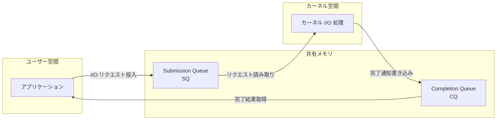
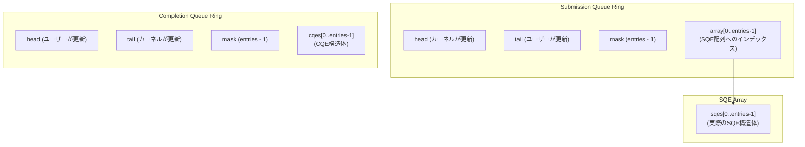
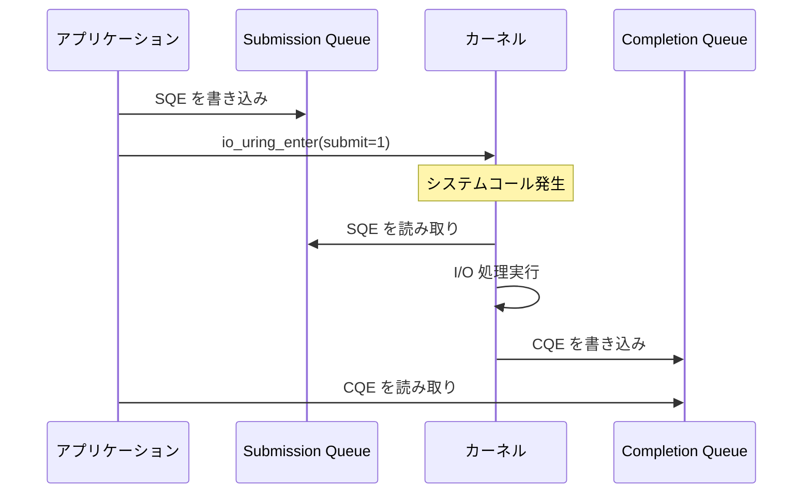
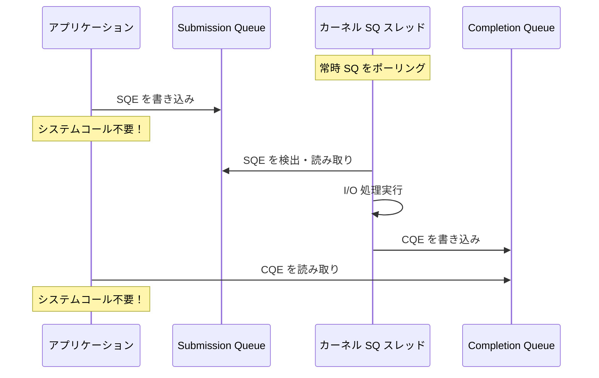
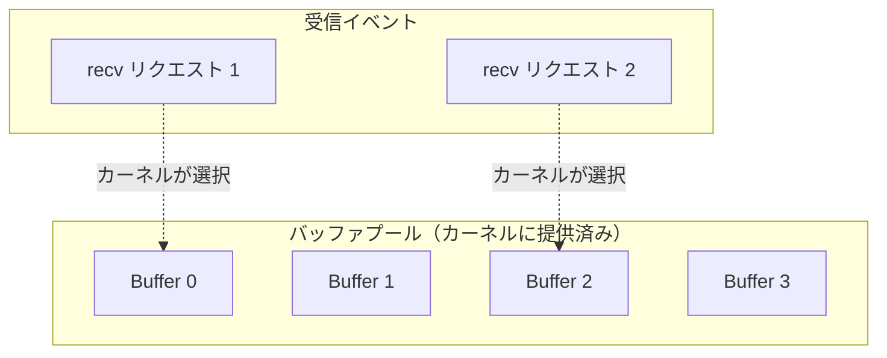
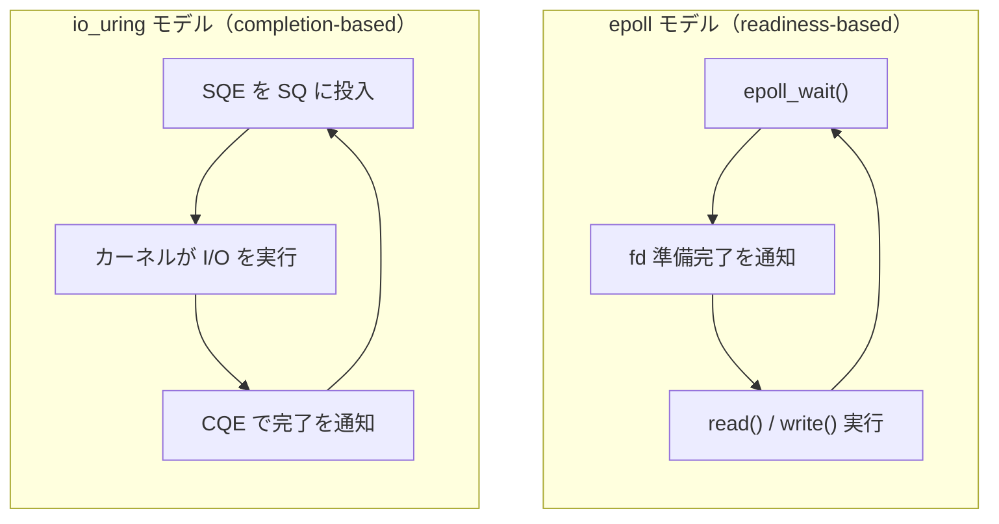
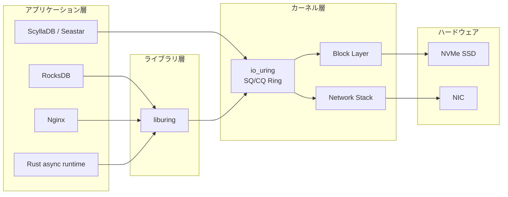
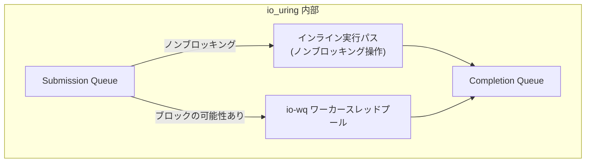
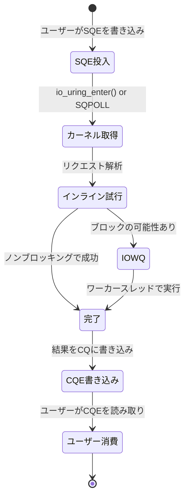

# io_uring — 次世代の非同期I/O

## はじめに

高性能なサーバーアプリケーションやストレージエンジンにとって、I/O の効率はシステム全体のスループットとレイテンシを左右する最重要要素である。Linux カーネルは長年にわたり様々な非同期 I/O メカニズムを提供してきたが、いずれも設計上の制約やオーバーヘッドに悩まされてきた。2019 年、Linux 5.1 で導入された **io_uring** は、これらの問題を根本から解決するために設計された新世代の非同期 I/O インターフェースである。

本記事では、Linux における非同期 I/O の歴史的背景から出発し、io_uring の設計思想、内部構造、最適化手法、実際の採用事例、そしてセキュリティ上の考慮事項までを包括的に解説する。

## 1. Linux 非同期 I/O の歴史

io_uring の設計意図を理解するには、それ以前に存在した非同期 I/O メカニズムの限界を知る必要がある。

### 1.1 同期 I/O とブロッキングの問題

最も基本的な I/O モデルは同期（ブロッキング）I/O である。`read()` や `write()` を呼び出すと、カーネルがデータの転送を完了するまでプロセスはブロックされる。シングルスレッドのアプリケーションでは、I/O 待ちの間 CPU が遊んでしまい、スループットが大幅に低下する。

この問題に対する古典的な解決策は以下の 3 つである：

1. **マルチスレッド化** — スレッドごとにブロッキング I/O を行う。コンテキストスイッチのコストが大きく、数万の同時接続には不向き。
2. **ノンブロッキング I/O + イベント多重化** — `select()`, `poll()`, `epoll` を使い、準備ができたファイルディスクリプタだけを処理する。ネットワーク I/O には有効だが、ディスク I/O には適用しにくい（通常のファイルは常に「準備完了」と報告される）。
3. **非同期 I/O** — I/O 操作を発行し、完了を後で確認する。真の非同期性を提供するが、Linux では長い間満足な実装がなかった。

### 1.2 POSIX AIO（aio_read / aio_write）

POSIX 標準は `aio_read()`, `aio_write()`, `aio_error()`, `aio_return()` などの非同期 I/O API を定義している。しかし、Linux における glibc の POSIX AIO 実装（`librt`）には根本的な問題がある：

- **ユーザー空間スレッドプールによるエミュレーション**: glibc は内部的にスレッドを生成し、そのスレッド上で同期 I/O を実行することで非同期性を「偽装」する。真のカーネルレベル非同期 I/O ではない。
- **スレッド管理のオーバーヘッド**: スレッドの生成・破棄、コンテキストスイッチのコストが発生する。
- **シグナルベースの通知**: 完了通知にシグナルを使用するため、シグナルハンドラの制約を受け、プログラミングモデルが複雑になる。

```c
// POSIX AIO example (glibc implementation)
struct aiocb cb;
memset(&cb, 0, sizeof(cb));
cb.aio_fildes = fd;
cb.aio_buf = buffer;
cb.aio_nbytes = size;
cb.aio_offset = offset;

aio_read(&cb);  // Internally spawns a thread

// Poll for completion
while (aio_error(&cb) == EINPROGRESS) {
    // Busy waiting or sleep
}
int ret = aio_return(&cb);
```

このため、高性能を求めるアプリケーションでは POSIX AIO はほぼ使われていない。

### 1.3 Linux Native AIO（libaio）

Linux カーネルは独自の非同期 I/O インターフェースとして `io_setup()`, `io_submit()`, `io_getevents()` などのシステムコールを提供している。これらは `libaio` ライブラリを通じて利用され、一般に「Linux Native AIO」と呼ばれる。

POSIX AIO とは異なり、Linux Native AIO は真のカーネルレベル非同期 I/O を提供する。しかし、重大な制約がある：

- **O_DIRECT 必須**: バッファード I/O（ページキャッシュ経由）では動作せず、`O_DIRECT` フラグでオープンしたファイルに対してのみ非同期に動作する。バッファード I/O では内部的にブロッキングにフォールバックしてしまう。
- **対象が限定的**: ファイル I/O のみをサポートし、ネットワーク I/O（ソケット）には対応していない。
- **アライメント制約**: バッファのアドレスとサイズ、ファイルオフセットがセクタサイズにアラインされている必要がある。
- **API の使いにくさ**: イベント取得時にタイムアウトの精度が低い、`io_submit()` がブロックする場合がある等、予測しにくい動作がある。

```c
// Linux Native AIO example
io_context_t ctx = 0;
io_setup(128, &ctx);  // Create AIO context with 128 entries

struct iocb cb;
io_prep_pread(&cb, fd, buffer, size, offset);  // O_DIRECT required

struct iocb *cbs[1] = {&cb};
io_submit(ctx, 1, cbs);  // Submit I/O request

struct io_event events[1];
io_getevents(ctx, 1, 1, events, NULL);  // Wait for completion
```

データベースエンジン（MySQL InnoDB、PostgreSQL など）はこの制約を受け入れた上で libaio を使用してきたが、汎用的な非同期 I/O フレームワークとしては不十分であった。

### 1.4 epoll の限界

ネットワークサーバーにおいては `epoll` が事実上の標準である。`epoll` は「ファイルディスクリプタが I/O 可能になった」ことを通知するメカニズムであり、I/O 操作そのものを非同期に実行するわけではない。

```
epoll のモデル:
  1. epoll_wait() で準備完了の fd を取得
  2. read() / write() を同期的に実行
  3. 1 に戻る
```

このモデルの限界は以下の通りである：

- **I/O 発行ごとにシステムコール**: 1 回の I/O につき少なくとも 1 回のシステムコールが必要。
- **ディスク I/O に不向き**: 通常ファイルの fd は常に「準備完了」と報告されるため、実質的にブロッキング I/O になる。
- **システムコールオーバーヘッド**: Spectre/Meltdown 緩和策（KPTI 等）の導入以降、システムコールのコストが大幅に増加した。

### 1.5 非同期 I/O に求められるもの

以上の歴史を踏まえ、理想的な非同期 I/O メカニズムには以下の要件が求められていた：

| 要件 | POSIX AIO | libaio | epoll |
|------|-----------|--------|-------|
| 真のカーネルレベル非同期 | --- | 部分的 | --- |
| バッファード I/O 対応 | --- | --- | --- |
| ネットワーク I/O 対応 | --- | --- | あり |
| システムコール削減 | --- | --- | --- |
| バッチ処理 | --- | 部分的 | --- |
| ゼロコピー対応 | --- | --- | --- |

io_uring は、これらの要件をすべて満たすことを目指して設計された。

## 2. io_uring の設計思想

io_uring は Linux カーネル開発者の Jens Axboe によって開発され、2019 年 3 月に Linux 5.1 でマージされた。Axboe はブロックレイヤーのメンテナーであり、I/O スタック全体に対する深い知見を持つ人物である。

### 2.1 基本的な設計目標

io_uring の設計は以下の原則に基づいている：

1. **システムコールの最小化**: I/O リクエストの発行と完了確認を、可能な限りシステムコールなしで行えるようにする。
2. **共有メモリによる通信**: カーネル空間とユーザー空間の間でリングバッファを共有し、データのコピーを排除する。
3. **バッチ処理**: 複数の I/O 操作を一度にまとめて発行・完了処理できるようにする。
4. **汎用性**: ファイル I/O、ネットワーク I/O、タイマー、その他あらゆる操作を統一的に扱える。
5. **ゼロコピーの追求**: データパスにおけるメモリコピーを最小限に抑える。

### 2.2 リングバッファアーキテクチャ

io_uring の中核的なアイデアは、**サブミッションキュー（SQ）** と **コンプリーションキュー（CQ）** という 2 つのリングバッファをカーネルとユーザー空間で共有することである。



この設計により、以下の利点が得られる：

- **ロックフリーな通信**: プロデューサー/コンシューマーモデルにより、SQ はユーザー空間が書き込み・カーネルが読み取り、CQ はカーネルが書き込み・ユーザー空間が読み取りという一方向のアクセスパターンが実現される。メモリバリア（memory barrier）のみで同期が可能であり、ロックは不要。
- **システムコール不要の発行**: カーネル側ポーリング（SQPOLL）モードでは、ユーザー空間がリングに書き込むだけで I/O が発行される。
- **バッチ完了処理**: 複数の完了イベントを一度の CQ スキャンで処理できる。

### 2.3 統一的な操作モデル

io_uring は単なるファイル I/O フレームワークではない。以下のような多様な操作をサポートする：

- **ファイル I/O**: `read`, `write`, `readv`, `writev`, `fsync`, `fdatasync`, `fallocate`
- **ネットワーク I/O**: `accept`, `connect`, `send`, `recv`, `sendmsg`, `recvmsg`
- **ファイル操作**: `openat`, `close`, `statx`, `renameat`, `unlinkat`, `mkdirat`
- **タイマー**: `timeout`, `timeout_remove`, `link_timeout`
- **その他**: `poll_add`, `poll_remove`, `cancel`, `madvise`, `fadvise`

これにより、アプリケーションは `epoll` + `read/write` + `libaio` といった複数のメカニズムを組み合わせる必要がなくなり、すべてのI/O を io_uring という単一のインターフェースで統一できる。

## 3. SQ/CQ リング構造

io_uring の内部構造を詳しく見ていこう。

### 3.1 セットアップ

io_uring インスタンスは `io_uring_setup()` システムコールで作成される。

```c
// io_uring setup
struct io_uring_params params;
memset(&params, 0, sizeof(params));

// Create io_uring instance
int ring_fd = io_uring_setup(entries, &params);

// mmap the SQ and CQ rings
void *sq_ptr = mmap(0, params.sq_off.array + params.sq_entries * sizeof(__u32),
                    PROT_READ | PROT_WRITE, MAP_SHARED | MAP_POPULATE,
                    ring_fd, IORING_OFF_SQ_RING);

void *cq_ptr = mmap(0, params.cq_off.cqes + params.cq_entries * sizeof(struct io_uring_cqe),
                    PROT_READ | PROT_WRITE, MAP_SHARED | MAP_POPULATE,
                    ring_fd, IORING_OFF_CQ_RING);

// mmap the SQE array
void *sqe_ptr = mmap(0, params.sq_entries * sizeof(struct io_uring_sqe),
                     PROT_READ | PROT_WRITE, MAP_SHARED | MAP_POPULATE,
                     ring_fd, IORING_OFF_SQES);
```

`io_uring_setup()` は以下を行う：

1. 指定された `entries` 数（2 の累乗に切り上げ）でリングバッファを確保
2. SQ リング、CQ リング、SQE 配列の 3 つの領域をカーネル内に確保
3. `io_uring_params` 構造体を通じて、各領域のオフセット情報を返す
4. ユーザー空間は返されたオフセットを使い `mmap()` で共有メモリをマッピング

### 3.2 Submission Queue Entry（SQE）

SQE は I/O リクエスト 1 件を表す構造体で、64 バイト固定長である。

```c
struct io_uring_sqe {
    __u8    opcode;     // Operation code (IORING_OP_READ, etc.)
    __u8    flags;      // Flags (IOSQE_FIXED_FILE, IOSQE_IO_LINK, etc.)
    __u16   ioprio;     // I/O priority
    __s32   fd;         // File descriptor
    union {
        __u64   off;    // Offset
        __u64   addr2;
    };
    union {
        __u64   addr;   // Buffer address
        __u64   splice_off_in;
    };
    __u32   len;        // Length
    union {
        /* ... various operation-specific fields ... */
    };
    __u64   user_data;  // User data (passed through to CQE)
    /* ... padding and extra fields ... */
};
```

重要なフィールドは以下の通りである：

- **opcode**: 実行する操作の種類（`IORING_OP_READ`, `IORING_OP_WRITE`, `IORING_OP_ACCEPT` 等）
- **fd**: 対象のファイルディスクリプタ
- **addr / len / off**: バッファアドレス、長さ、ファイルオフセット
- **user_data**: 任意の 64 ビット値。完了時に CQE にそのまま引き渡されるため、アプリケーションはどのリクエストが完了したか識別できる
- **flags**: リクエストの動作を制御するフラグ

### 3.3 Completion Queue Entry（CQE）

CQE は I/O 完了を表す構造体で、16 バイト固定長である。

```c
struct io_uring_cqe {
    __u64   user_data;  // Copied from corresponding SQE
    __s32   res;        // Result (bytes transferred, or negative errno)
    __u32   flags;      // Flags
};
```

- **user_data**: 対応する SQE から引き継がれた値
- **res**: 操作の結果。成功時は転送バイト数、失敗時は負のエラーコード（`-errno`）
- **flags**: 追加情報（バッファ選択結果等）

### 3.4 リングバッファの詳細構造

SQ と CQ は古典的なリングバッファ（循環バッファ）として実装されている。



**SQ リングの動作**:

1. ユーザー空間が SQE 配列の空きスロットに SQE を書き込む
2. SQ リングの array にそのスロットのインデックスを追加
3. SQ リングの tail をインクリメント（メモリバリア付き）
4. `io_uring_enter()` システムコール（または SQPOLL カーネルスレッド）がカーネルに通知
5. カーネルが head から tail まで読み取り、head を更新

**CQ リングの動作**:

1. カーネルが I/O 完了時に CQE を CQ リングに書き込む
2. CQ リングの tail をインクリメント
3. ユーザー空間が head から tail まで読み取り、head を更新

SQ リングと SQE 配列が分離している理由は、SQE を任意の順序で再利用可能にするためである。SQ リングの array はインデックスの配列であり、SQE 配列の物理的な順序に依存しない。

### 3.5 メモリオーダリングとバリア

リングバッファの正確な動作には、適切なメモリオーダリングが不可欠である。io_uring は以下のバリアを使用する：

- **ユーザー空間が SQE を書き込んだ後、tail を更新する前**: `write barrier`（`smp_store_release`）を実行し、SQE の内容が tail の更新よりも先にメモリに反映されることを保証する。
- **ユーザー空間が CQ の head を読み取る前**: `read barrier`（`smp_load_acquire`）を実行し、CQE の内容を読み取る前に最新の tail が見えることを保証する。

これはロックフリーの Single-Producer Single-Consumer（SPSC）リングバッファの標準的なパターンである。

```c
// User-space: Submit an SQE
struct io_uring_sqe *sqe = &sqes[sq_tail & sq_mask];
// Fill in sqe fields...
sqe->opcode = IORING_OP_READ;
sqe->fd = fd;
sqe->addr = (unsigned long)buffer;
sqe->len = size;
sqe->off = offset;
sqe->user_data = my_request_id;

// Write barrier: ensure SQE is visible before tail update
smp_store_release(sq_tail_ptr, sq_tail + 1);

// User-space: Reap a CQE
unsigned head = *cq_head_ptr;
// Read barrier: ensure we see latest tail and CQE contents
if (head != smp_load_acquire(cq_tail_ptr)) {
    struct io_uring_cqe *cqe = &cqes[head & cq_mask];
    // Process cqe->res, cqe->user_data
    smp_store_release(cq_head_ptr, head + 1);
}
```

## 4. カーネル側ポーリング（SQPOLL）

### 4.1 通常モードの動作

通常モードでは、ユーザー空間が SQ にリクエストを投入した後、`io_uring_enter()` システムコールを呼び出してカーネルに「新しいリクエストがある」ことを通知する必要がある。



この場合でも、1 回の `io_uring_enter()` で複数のリクエストをまとめて発行できるため、libaio や個別の `read()`/`write()` よりも効率的である。

### 4.2 SQPOLL モード

SQPOLL モードは io_uring の最も先進的な機能の一つである。`io_uring_setup()` 時に `IORING_SETUP_SQPOLL` フラグを指定すると、カーネル内に専用のポーリングスレッド（sq_thread）が起動される。



**SQPOLL モードの特徴**:

- **システムコールゼロ**: ユーザー空間は SQ への書き込みと CQ の読み取りだけで I/O を完結できる。`io_uring_enter()` の呼び出しが不要。
- **超低レイテンシ**: システムコールのオーバーヘッド（ユーザー/カーネルモード遷移、KPTI のコスト等）が完全に排除される。
- **CPU 消費**: カーネルスレッドが常時ポーリングするため、アイドル時でも CPU を消費する。ただし、一定時間（`sq_thread_idle` で設定可能）アイドルが続くとスレッドはスリープに入る。
- **権限要件**: 以前は `CAP_SYS_ADMIN` または `CAP_SYS_NICE` が必要だったが、Linux 5.13 以降では `IORING_SETUP_SQ_AFF` との組み合わせで一般ユーザーでも利用可能になった（ただし fixed files の登録が推奨される）。

```c
// SQPOLL mode setup
struct io_uring_params params;
memset(&params, 0, sizeof(params));
params.flags = IORING_SETUP_SQPOLL;
params.sq_thread_idle = 2000;  // Sleep after 2 seconds of inactivity

int ring_fd = io_uring_setup(256, &params);
```

### 4.3 SQPOLL スレッドのスリープと再起動

SQPOLL スレッドがスリープに入ると、SQ リングの flags フィールドに `IORING_SQ_NEED_WAKEUP` が設定される。ユーザー空間はこのフラグを確認し、設定されていれば `io_uring_enter()` で起こす必要がある。

```c
// Check if SQPOLL thread needs wakeup
if (IO_URING_READ_ONCE(*sq_flags) & IORING_SQ_NEED_WAKEUP) {
    io_uring_enter(ring_fd, 0, 0, IORING_ENTER_SQ_WAKEUP, NULL);
}
```

このメカニズムにより、高負荷時はシステムコールゼロの恩恵を受けつつ、低負荷時は CPU の浪費を抑えるという両立が図られている。

## 5. Fixed Buffers / Registered Files

### 5.1 I/O バッファの固定（Fixed Buffers）

通常の I/O 操作では、カーネルは毎回ユーザー空間のバッファアドレスを検証し、ページテーブルをウォークしてカーネル内のアドレスにマッピングする必要がある。高頻度な I/O ではこのオーバーヘッドが無視できなくなる。

`io_uring_register()` に `IORING_REGISTER_BUFFERS` を指定すると、バッファを事前にカーネルに登録（固定）できる。

```c
// Register fixed buffers
struct iovec iovecs[NUM_BUFFERS];
for (int i = 0; i < NUM_BUFFERS; i++) {
    iovecs[i].iov_base = aligned_alloc(4096, BUFFER_SIZE);
    iovecs[i].iov_len = BUFFER_SIZE;
}

io_uring_register(ring_fd, IORING_REGISTER_BUFFERS, iovecs, NUM_BUFFERS);

// Use fixed buffer in SQE
struct io_uring_sqe *sqe = get_sqe();
sqe->opcode = IORING_OP_READ_FIXED;  // Use FIXED variant
sqe->buf_index = 0;  // Index into registered buffer array
```

**固定バッファの利点**:

- **ページピンニング**: 登録されたバッファのページはカーネルにピン留めされ、毎回のページテーブルウォークが不要になる。
- **DMA マッピングの再利用**: デバイスへの DMA マッピングも事前に行えるため、I/O パスがさらに短縮される。
- **高スループット環境での効果**: NVMe SSD のような高速デバイスでは、1 回あたり数百ナノ秒の削減が大きな差になる。

### 5.2 ファイルディスクリプタの登録（Registered Files）

同様に、ファイルディスクリプタも事前に登録することで、毎回の `fget()` / `fput()`（ファイル構造体の参照カウント操作）を省略できる。

```c
// Register file descriptors
int fds[NUM_FILES];
for (int i = 0; i < NUM_FILES; i++) {
    fds[i] = open(filenames[i], O_RDWR | O_DIRECT);
}

io_uring_register(ring_fd, IORING_REGISTER_FILES, fds, NUM_FILES);

// Use registered file in SQE
struct io_uring_sqe *sqe = get_sqe();
sqe->opcode = IORING_OP_READ;
sqe->fd = 0;  // Index into registered file array (not actual fd)
sqe->flags |= IOSQE_FIXED_FILE;  // Tell kernel to use registered file
```

参照カウントのアトミック操作は、マルチコア環境ではキャッシュラインのバウンシングを引き起こし得るため、特に高並行性の環境で固定ファイルの効果が顕著になる。

### 5.3 バッファリング戦略：Provided Buffers

Linux 5.7 以降では、**Provided Buffers** という仕組みが導入された。これは、あらかじめバッファプールをカーネルに提供しておき、I/O 完了時にカーネルがプールからバッファを選択するというモデルである。



これは特にネットワークサーバーで有用である。従来は `recv()` の前にバッファを確保する必要があったが、Provided Buffers ではリクエスト発行時にバッファを指定する必要がない。カーネルがデータ到着時にプールからバッファを割り当てるため、メモリの無駄遣いを減らせる。

## 6. io_uring と epoll の比較

### 6.1 アーキテクチャの違い

`epoll` と io_uring は根本的にモデルが異なる。



| 比較項目 | epoll | io_uring |
|---------|-------|----------|
| モデル | Readiness-based（準備通知） | Completion-based（完了通知） |
| I/O の実行主体 | ユーザー空間（read/write） | カーネル |
| システムコール | epoll_wait + read/write（最低2回） | io_uring_enter（1回、SQPOLL なら 0回） |
| ディスク I/O | 非対応（常に ready） | 完全対応 |
| バッチ処理 | epoll_wait で複数 fd 取得可能 | SQ に複数リクエスト投入可能 |
| カーネルバージョン | 2.6 以降 | 5.1 以降 |
| エコシステムの成熟度 | 非常に高い | 成長中 |

### 6.2 パフォーマンス比較

典型的なベンチマーク結果として、以下のような傾向が報告されている：

**ネットワーク I/O（echo サーバー等）**:
- 低〜中負荷: epoll と io_uring はほぼ同等のパフォーマンス
- 高負荷（数万接続、高 RPS）: io_uring がシステムコール削減の恩恵で優位
- SQPOLL モード: さらにレイテンシが低下するが、CPU 使用率とのトレードオフ

**ストレージ I/O（NVMe SSD 等）**:
- io_uring は libaio と比較して 10〜20% のスループット向上が観測される場合がある
- SQPOLL + Fixed Buffers + Registered Files の組み合わせで、デバイスの理論上の IOPS に迫るパフォーマンスを発揮

### 6.3 epoll から io_uring への移行判断

io_uring が常に epoll より優れているわけではない。移行を検討すべき状況：

- **ディスク I/O とネットワーク I/O を統一的に扱いたい場合**: io_uring の最大の強みの一つ
- **超低レイテンシが求められる場合**: SQPOLL モードでシステムコールを排除
- **NVMe デバイスの性能を最大限引き出したい場合**: Fixed Buffers と Registered Files の組み合わせ
- **Spectre/Meltdown 緩和策の影響が大きい環境**: システムコール削減の効果が特に顕著

一方、以下の場合は epoll のままでも十分である：

- **既存のアプリケーションが安定稼働している場合**: 移行コストに見合わないことが多い
- **低〜中程度の負荷**: パフォーマンス差が小さい
- **古いカーネルのサポートが必要**: io_uring は Linux 5.1 以降、多くの機能は 5.6 以降

## 7. liburing

### 7.1 なぜ liburing が必要か

io_uring の生のシステムコールインターフェースは強力だが、直接使うにはかなり面倒である。`mmap()` のセットアップ、メモリバリアの管理、リングバッファのインデックス操作など、低レベルの処理を正しく実装する必要がある。

**liburing** は Jens Axboe 自身が開発した、io_uring の公式ヘルパーライブラリである。低レベルの詳細を抽象化しつつ、io_uring のパフォーマンスを損なわない薄いラッパーを提供する。

### 7.2 liburing の基本的な使い方

```c
#include <liburing.h>

int main() {
    struct io_uring ring;

    // Initialize io_uring with 256 entries
    io_uring_queue_init(256, &ring, 0);

    // Get an SQE
    struct io_uring_sqe *sqe = io_uring_get_sqe(&ring);
    if (!sqe) {
        // SQ is full
        return -1;
    }

    // Prepare a read operation
    char buffer[4096];
    int fd = open("data.bin", O_RDONLY);
    io_uring_prep_read(sqe, fd, buffer, sizeof(buffer), 0);

    // Set user_data for identification
    io_uring_sqe_set_data(sqe, (void *)42);

    // Submit
    io_uring_submit(&ring);

    // Wait for completion
    struct io_uring_cqe *cqe;
    io_uring_wait_cqe(&ring, &cqe);

    // Process result
    if (cqe->res < 0) {
        fprintf(stderr, "I/O error: %s\n", strerror(-cqe->res));
    } else {
        printf("Read %d bytes\n", cqe->res);
    }

    // Mark CQE as consumed
    io_uring_cqe_seen(&ring, cqe);

    // Cleanup
    close(fd);
    io_uring_queue_exit(&ring);
    return 0;
}
```

### 7.3 liburing の主要 API

| 関数 | 説明 |
|------|------|
| `io_uring_queue_init()` | io_uring インスタンスの初期化 |
| `io_uring_queue_init_params()` | パラメータ付き初期化（SQPOLL 等） |
| `io_uring_get_sqe()` | 空き SQE の取得 |
| `io_uring_prep_read()` | 読み取り操作の準備 |
| `io_uring_prep_write()` | 書き込み操作の準備 |
| `io_uring_prep_accept()` | accept 操作の準備 |
| `io_uring_prep_connect()` | connect 操作の準備 |
| `io_uring_prep_send()` | send 操作の準備 |
| `io_uring_prep_recv()` | recv 操作の準備 |
| `io_uring_sqe_set_data()` | SQE に user_data を設定 |
| `io_uring_submit()` | SQ のリクエストをカーネルに送信 |
| `io_uring_submit_and_wait()` | 送信後、指定数の完了を待機 |
| `io_uring_wait_cqe()` | CQE を 1 つ待機 |
| `io_uring_peek_cqe()` | CQE をノンブロッキングで確認 |
| `io_uring_cqe_seen()` | CQE の消費を通知（head を進める） |
| `io_uring_queue_exit()` | io_uring インスタンスの破棄 |

### 7.4 高度な使用パターン

#### リンクされたリクエスト（Linked SQEs）

複数の SQE をチェーンとしてリンクし、前のリクエストが成功した場合にのみ次を実行する。

```c
// Linked request: read -> write (copy operation)
struct io_uring_sqe *sqe1 = io_uring_get_sqe(&ring);
io_uring_prep_read(sqe1, src_fd, buffer, size, 0);
sqe1->flags |= IOSQE_IO_LINK;  // Link to next SQE

struct io_uring_sqe *sqe2 = io_uring_get_sqe(&ring);
io_uring_prep_write(sqe2, dst_fd, buffer, size, 0);

io_uring_submit(&ring);
// sqe2 executes only if sqe1 succeeds
```

#### タイムアウト付きリクエスト

```c
// Request with timeout
struct io_uring_sqe *sqe = io_uring_get_sqe(&ring);
io_uring_prep_read(sqe, fd, buffer, size, 0);
sqe->flags |= IOSQE_IO_LINK;

struct io_uring_sqe *timeout_sqe = io_uring_get_sqe(&ring);
struct __kernel_timespec ts = { .tv_sec = 5, .tv_nsec = 0 };
io_uring_prep_link_timeout(timeout_sqe, &ts, 0);

io_uring_submit(&ring);
// Read will be cancelled if it doesn't complete within 5 seconds
```

#### マルチショット accept

Linux 5.19 以降では、1 つの SQE で複数の `accept()` を処理するマルチショットモードが利用可能である。

```c
// Multi-shot accept
struct io_uring_sqe *sqe = io_uring_get_sqe(&ring);
io_uring_prep_multishot_accept(sqe, listen_fd, NULL, NULL, 0);
io_uring_submit(&ring);

// Each new connection generates a CQE
// The SQE remains active until explicitly cancelled
```

従来は接続を受け付けるたびに新しい accept リクエストを投入する必要があったが、マルチショットモードでは 1 回のリクエスト投入で継続的に接続を受け付けられる。

## 8. データベース・Web サーバーでの採用

### 8.1 データベースでの採用

io_uring はストレージ I/O の性能が直接スループットに影響するデータベースで特に注目されている。

#### RocksDB

Facebook（現 Meta）が開発する LSM-Tree ベースのキーバリューストアである RocksDB は、io_uring のサポートを早期に導入した。RocksDB では、コンパクション処理やフラッシュ処理で大量のファイル I/O が発生するが、io_uring により以下の改善が報告されている：

- **MultiGet 操作の並列化**: 複数のキーを一括取得する `MultiGet` で、SST ファイルへの読み取りを io_uring でバッチ発行
- **レイテンシの改善**: 特に P99 レイテンシが改善

#### TiKV / TiDB

分散データベース TiDB のストレージエンジンである TiKV は、io_uring を使用した非同期 I/O バックエンドをサポートしている。Rust の非同期ランタイムと組み合わせ、効率的な I/O パイプラインを構築している。

#### PostgreSQL

PostgreSQL はバージョン 16 以降で io_uring の実験的サポートを開始した。WAL（Write-Ahead Log）の書き込みやデータファイルの読み取りでの活用が検討されている。

#### ScyllaDB

C++ で書かれた高性能 NoSQL データベースである ScyllaDB は、独自の非同期フレームワーク Seastar を通じて io_uring を活用している。シャードごとのイベントループで io_uring を使い、ほぼロックフリーのアーキテクチャを実現している。

### 8.2 Web サーバー / プロキシ

#### Nginx

Nginx は 2021 年に io_uring のサポートを追加した。ファイル配信時の `sendfile()` 代替として io_uring を使うことで、静的ファイル配信のパフォーマンス改善が可能である。

#### Cloudflare (Pingora)

Cloudflare が Rust で開発したプロキシフレームワーク Pingora は、io_uring をサポートするバックエンドを持ち、高スループットなリバースプロキシ処理を実現している。

### 8.3 プログラミング言語ランタイム

#### Rust エコシステム

Rust では io_uring を活用した非同期ランタイムが積極的に開発されている：

- **tokio-uring**: tokio プロジェクトによる io_uring ベースのランタイム
- **glommio**: Datadog が開発したスレッドパーコアモデルの非同期ランタイム。io_uring をネイティブに使用
- **monoio**: ByteDance が開発した io_uring ベースの非同期ランタイム

これらのランタイムは、io_uring の completion-based モデルに合わせた設計を採用しており、従来の epoll ベースのランタイム（tokio のデフォルト等）とはアーキテクチャが異なる。

#### Java

Java の Project Loom（仮想スレッド）と io_uring の組み合わせについても議論が進んでいる。Netty は io_uring transport を提供しており、高負荷なネットワークアプリケーションでの利用が可能である。



## 9. セキュリティ上の考慮事項

### 9.1 攻撃面の拡大

io_uring はカーネル内に大量の新しいコードパスを導入したため、セキュリティ上の懸念が指摘されている。

**主要な問題点**:

- **カーネル攻撃面の増大**: io_uring は 60 以上の操作コード（opcode）をサポートし、それぞれが独自の処理パスを持つ。これは潜在的なバグの温床となる。
- **共有メモリの複雑さ**: カーネルとユーザー空間のメモリ共有は、use-after-free や二重解放などのメモリ安全性の問題を引き起こし得る。
- **権限昇格の脆弱性**: 実際に、io_uring に関連する複数の CVE（脆弱性）が報告されている。

### 9.2 実際の脆弱性事例

io_uring に関連して報告された主要な脆弱性の例：

- **CVE-2021-41073**: io_uring の `IORING_OP_PROVIDE_BUFFERS` における型混同脆弱性。ローカル権限昇格が可能。
- **CVE-2022-29582**: io_uring のタイムアウト処理における use-after-free 脆弱性。
- **CVE-2023-2598**: io_uring の Fixed Buffers における境界チェック不備。カーネルメモリの読み書きが可能。

これらの脆弱性は、io_uring のコードの複雑さと、カーネル内での非同期処理の難しさを反映している。

### 9.3 Google の対応

Google は 2023 年に、Android および Chrome OS、さらに Google のプロダクションサーバーの一部で **io_uring を無効化** するという判断を下した。Google のセキュリティチームの分析によると：

- io_uring は「カーネルの攻撃面を大幅に拡大する」
- 脆弱性の発見頻度が他のサブシステムと比較して高い
- サンドボックス内のプロセスが io_uring を使ってサンドボックスを回避する可能性

Google は seccomp フィルタを使って io_uring 関連のシステムコール（`io_uring_setup`, `io_uring_enter`, `io_uring_register`）をブロックすることを推奨した。

### 9.4 緩和策とベストプラクティス

io_uring を安全に使用するためのベストプラクティス：

1. **カーネルの最新化**: io_uring 関連の修正が頻繁にリリースされるため、最新のカーネルを使用する。
2. **seccomp による制限**: 信頼できないプロセスに対しては seccomp で io_uring のシステムコールをブロックする。
3. **権限の最小化**: SQPOLL モードの使用は本当に必要な場合に限定する。
4. **Registered Files / Buffers の慎重な管理**: 登録リソースの解放タイミングに注意する。
5. **SELinux / AppArmor との併用**: MAC（Mandatory Access Control）で io_uring の使用を制限する。

```c
// seccomp filter example: block io_uring
#include <seccomp.h>

scmp_filter_ctx ctx = seccomp_init(SCMP_ACT_ALLOW);
seccomp_rule_add(ctx, SCMP_ACT_ERRNO(ENOSYS), SCMP_SYS(io_uring_setup), 0);
seccomp_rule_add(ctx, SCMP_ACT_ERRNO(ENOSYS), SCMP_SYS(io_uring_enter), 0);
seccomp_rule_add(ctx, SCMP_ACT_ERRNO(ENOSYS), SCMP_SYS(io_uring_register), 0);
seccomp_load(ctx);
```

### 9.5 セキュリティと性能のトレードオフ

io_uring のセキュリティ問題は、高性能と安全性のトレードオフを象徴している。

- **共有メモリ**: システムコールを排除する代わりに、カーネル・ユーザー空間の境界が曖昧になる。
- **カーネル内ポーリング**: ユーザーモード遷移を排除する代わりに、カーネルスレッドが常時動作する。
- **豊富な opcode**: 汎用性を高める代わりに、攻撃面が拡大する。

組織のセキュリティ要件と性能要件を慎重に評価した上で、io_uring の採用を判断する必要がある。

## 10. io_uring の内部実装詳細

### 10.1 I/O ワーカースレッドプール

io_uring は、ブロックする可能性のある操作（バッファード I/O 等）のために、カーネル内にワーカースレッドプール（`io-wq`）を管理している。



操作の種類に応じて、io_uring は以下のように処理パスを選択する：

- **インライン実行**: 操作がブロックしないことが確実な場合（例: すでにページキャッシュにあるデータの読み取り）、リクエストを発行したコンテキスト（`io_uring_enter()` の呼び出しスレッド、または SQPOLL スレッド）でそのまま実行する。
- **io-wq へのオフロード**: 操作がブロックする可能性がある場合（例: ページキャッシュにないデータの読み取り、ネットワーク接続の待機）、io-wq のワーカースレッドにオフロードする。

この仕組みにより、バッファード I/O でも真の非同期動作が実現される。これは libaio にはなかった大きな進歩である。

### 10.2 リクエストのライフサイクル

1 つの I/O リクエストは以下のライフサイクルを辿る：



### 10.3 SQE フラグと制御

SQE の `flags` フィールドは、リクエストの動作を細かく制御する：

| フラグ | 説明 |
|--------|------|
| `IOSQE_FIXED_FILE` | 登録済みファイルディスクリプタを使用 |
| `IOSQE_IO_DRAIN` | このリクエスト以前のすべてのリクエストが完了するまで待機 |
| `IOSQE_IO_LINK` | 次の SQE とリンク（チェーン実行） |
| `IOSQE_IO_HARDLINK` | ハードリンク（前のリクエストの成否に関わらず実行） |
| `IOSQE_ASYNC` | 常に非同期実行を強制（インライン実行しない） |
| `IOSQE_BUFFER_SELECT` | Provided Buffers からバッファを選択 |
| `IOSQE_CQE_SKIP_SUCCESS` | 成功時に CQE を生成しない（CQ の圧迫を軽減） |

特に `IOSQE_CQE_SKIP_SUCCESS` は、大量のリクエストを発行するアプリケーションで CQ のオーバーフローを防ぐために重要である。

## 11. io_uring の将来展望

### 11.1 io_uring_cmd：デバイス固有コマンド

Linux 5.19 で導入された `IORING_OP_URING_CMD` は、io_uring を通じてデバイス固有のコマンドを発行するための汎用メカニズムである。これにより、NVMe の passthrough コマンド（admin コマンドや I/O コマンド）を io_uring 経由で非同期に発行できる。

従来、NVMe passthrough は `ioctl()` を使う必要があり、同期的かつ非効率であった。`io_uring_cmd` により、NVMe の高度な機能（ゾーン管理、コピーコマンド等）を io_uring の非同期パイプラインに統合できる。

### 11.2 ゼロコピーネットワーキング

Linux 6.0 以降では、io_uring でのゼロコピー送信（`IORING_OP_SEND_ZC`）がサポートされている。これはカーネルがユーザー空間のバッファを直接 NIC に DMA 転送するもので、大きなデータ転送のスループットを大幅に改善する。

```c
// Zero-copy send
struct io_uring_sqe *sqe = io_uring_get_sqe(&ring);
io_uring_prep_send_zc(sqe, socket_fd, buffer, size, 0, 0);
io_uring_submit(&ring);

// Note: buffer must remain valid until CQE with IORING_CQE_F_NOTIF is received
```

ゼロコピー送信では、バッファの解放タイミングに注意が必要である。送信完了（CQE）の後、NIC が DMA を完了したことを示す追加の通知（`IORING_CQE_F_NOTIF` フラグ付きの CQE）が届くまでバッファを解放してはならない。

### 11.3 カーネル BPF との統合

io_uring と eBPF の統合も議論されている。eBPF プログラムが io_uring のリクエストをフィルタリング・変換したり、完了ハンドラとして動作したりすることで、カーネルからユーザー空間への遷移をさらに減らし、データパスのカスタマイズ性を向上させる可能性がある。

### 11.4 ファイルシステムとの最適化

io_uring はファイルシステムとの協調も進んでいる。例えば XFS では io_uring に最適化されたパスが追加されており、メタデータ操作の非同期化が進められている。ext4 やBtrfs でも同様の最適化が検討されている。

## まとめ

io_uring は、Linux における非同期 I/O の長い歴史の中で、最も包括的かつ高性能なソリューションである。

**io_uring の核心的な貢献**:

1. **共有リングバッファ**: カーネルとユーザー空間の間にロックフリーのリングバッファを設け、システムコールのオーバーヘッドを劇的に削減した。
2. **統一的な I/O モデル**: ファイル I/O、ネットワーク I/O、その他あらゆる操作を単一のインターフェースで扱えるようにした。
3. **真の非同期性**: バッファード I/O を含むあらゆる I/O 操作で、真のカーネルレベル非同期処理を実現した。
4. **ゼロコピーの追求**: Fixed Buffers、ゼロコピー送信など、データパスのコピーを徹底的に排除する仕組みを提供した。

一方で、セキュリティリスクの増大という代償も伴っている。io_uring がカーネルに導入した複雑さは、脆弱性の温床となり得る。Google が io_uring を無効化した事例は、この問題の深刻さを示している。

io_uring の採用にあたっては、パフォーマンス要件とセキュリティ要件の双方を慎重に評価し、適切な緩和策（カーネルの最新化、seccomp による制限、MAC の活用等）を講じることが不可欠である。

NVMe SSD の高速化、ネットワーク帯域の拡大、そして CPU のシステムコールコストの相対的な増大という環境変化を考えると、io_uring の重要性は今後ますます高まるだろう。Linux の I/O スタックにおける最も重要なイノベーションの一つとして、io_uring はエコシステム全体に広がり続けている。
