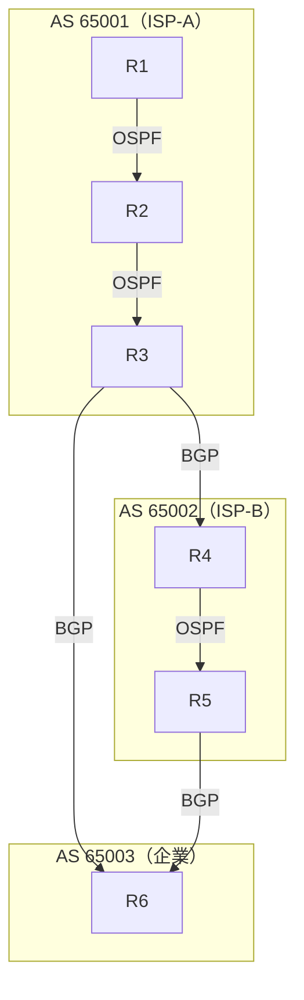
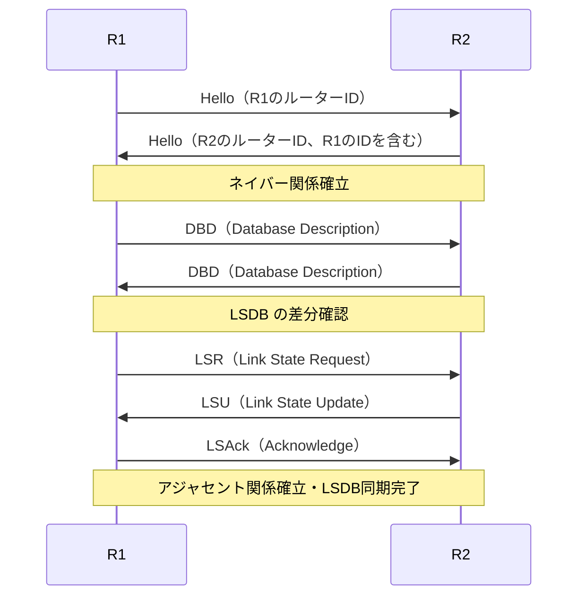
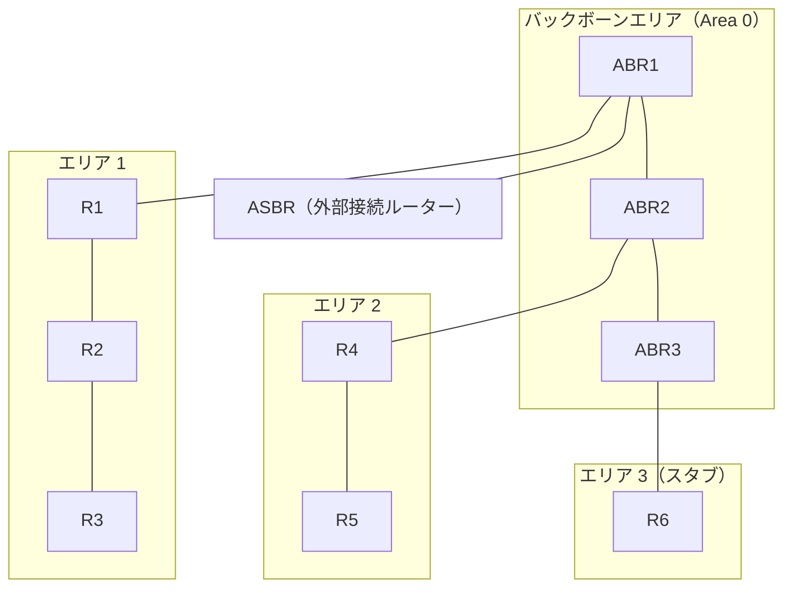
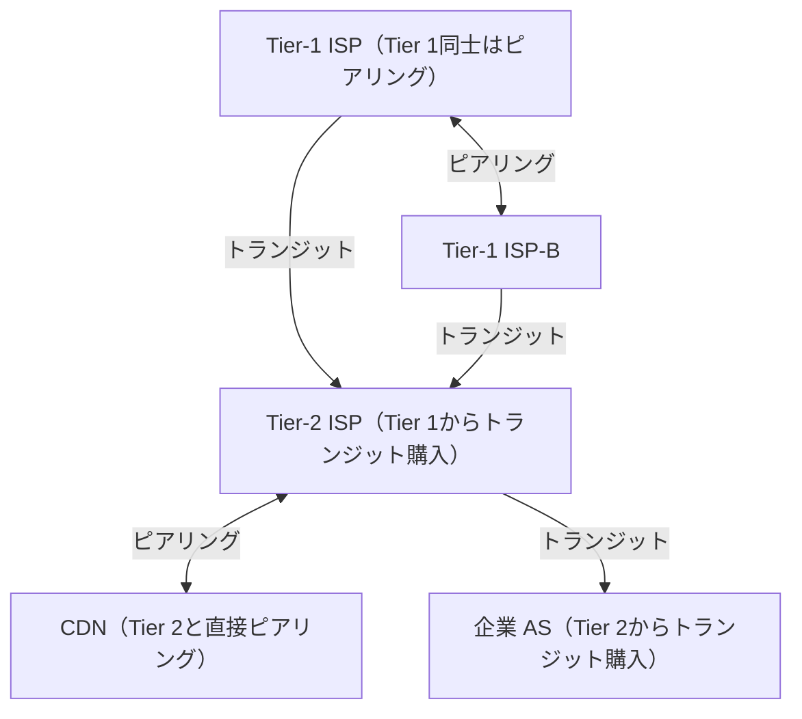
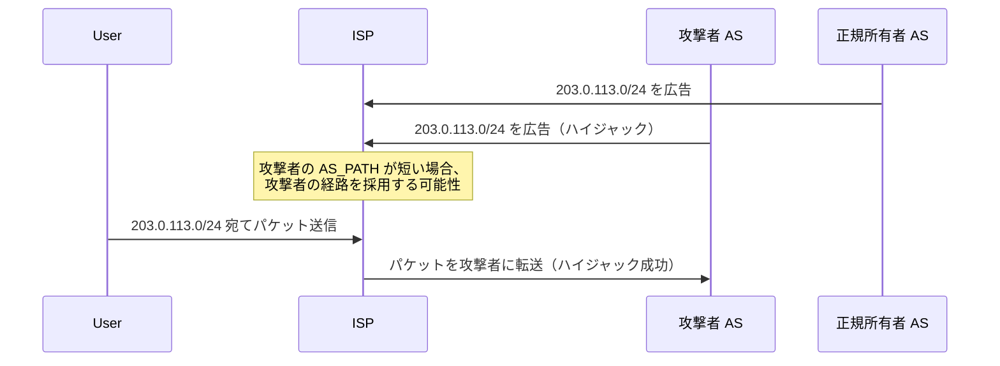
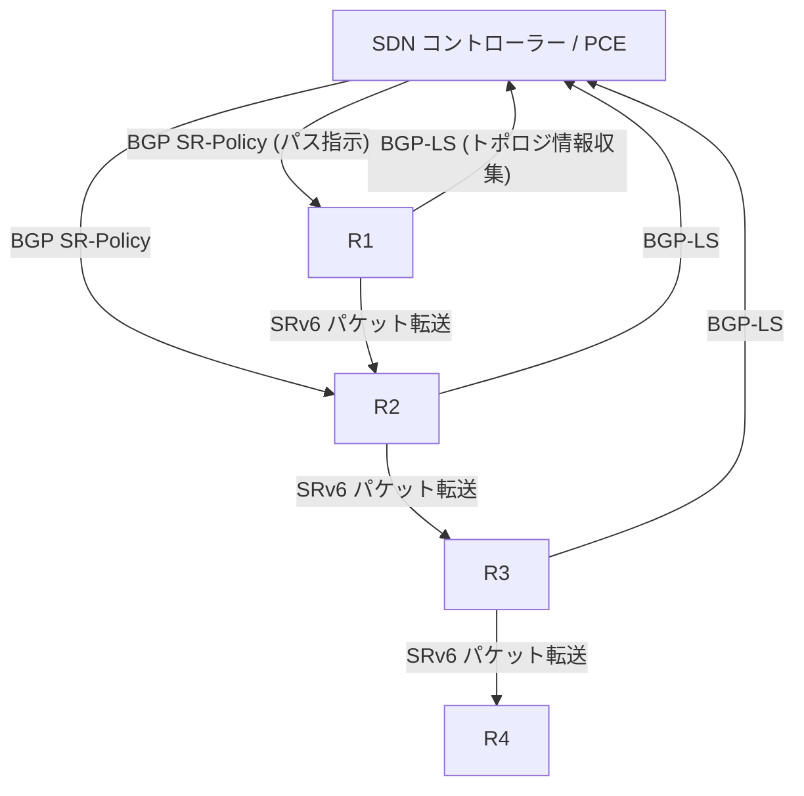

# IPとルーティング（BGP, OSPF）

## 1. 歴史的背景：パケット交換ネットワークの誕生

現代のインターネットを支えるIPプロトコルは、1960年代から1970年代にかけての研究によって生まれた。その誕生には、冷戦下の核攻撃に対して耐性を持つ通信網を構築するという、きわめて現実的な動機があった。

### 1.1 回線交換からパケット交換へ

1960年代以前の電話網は**回線交換（Circuit Switching）**に基づいていた。通信を始める際に送信元と宛先の間に専用の回線を確保し、その回線を通話の間中占有し続ける仕組みだ。この方式では、電話局（スイッチング設備）が爆撃で破壊されれば、その設備を経由するすべての通信が途絶する。中央集権的な構造が、軍事的な単一障害点（Single Point of Failure）になるという問題があった。

この問題を解決するために提案されたのが**パケット交換（Packet Switching）**の概念だ。1960年代、RAND研究所のポール・バランは「分散型通信ネットワーク」という論文を発表し、データをパケットと呼ばれる小さな単位に分割して、それぞれが独立してネットワーク内を経路選択しながら宛先に届くアーキテクチャを提唱した。同時期にイギリスのドナルド・デービスも同様の概念を独立して提案し、「パケット」という言葉を作った。

パケット交換の核心的な思想は「**ストア・アンド・フォワード（Store and Forward）**」だ。各ルーターはパケットを受信し、次のホップに転送する前に一時的に蓄える。ネットワークのある部分が障害を起こしても、パケットは別の経路を自動的に選択して宛先へ向かう。

```
回線交換（Circuit Switching）
A ─── Switch1 ─── Switch2 ─── B
        専用回線を確保（途中が壊れると通信断）

パケット交換（Packet Switching）
A ─── R1 ─── R2 ─── B
      │              │
      R3 ─── R4 ────┘
（R2が故障しても R3→R4 経由で到達可能）
```

### 1.2 ARPANETからインターネットへ

1969年、米国防省高等研究計画局（ARPA）が世界初のパケット交換ネットワーク**ARPANET**を稼働させた。最初は4ノード（UCLA、スタンフォード研究所、UCSB、ユタ大学）だった。

ARPANETで使われたプロトコルは、今日のIPとは異なるNCP（Network Control Protocol）だった。NCPには重大な制約があった。接続される異なるネットワーク間（例えばパケット無線ネットワークや衛星ネットワーク）を透過的に接続できないという問題だ。

この問題を解決するために、1974年にヴィント・サーフとボブ・カーンが論文「A Protocol for Packet Network Intercommunication」を発表した。この論文が提案したのが**TCP/IP**の原型だ。彼らの核心的なアイデアは「**ネットワークのネットワーク（Network of Networks）**」という概念、すなわちインター・ネットワーク（Internet）だ。

個々のネットワークの実装の詳細を隠蔽し、それらを相互接続するための共通の薄い層（IP）を置く。IPは「**ベストエフォート（Best Effort）**」サービスだ。パケットの到達を保証しない代わりに、実装を単純に保ち、あらゆる物理ネットワーク上で動作できる汎用性を実現した。信頼性の確保はエンドツーエンドでTCPが担うという役割分担は、「**エンドツーエンド原則（End-to-End Principle）**」として知られ、インターネット設計の根本哲学となった。

1983年1月1日、ARPANETはNCPからTCP/IPに移行した。この日がインターネットの「誕生日」とも呼ばれる。

## 2. IPの基本：アドレッシング、サブネット、CIDR

### 2.1 IPv4アドレス

**IPv4**は1981年にRFC 791として標準化された。32ビットのアドレス空間を持ち、最大約43億個のアドレスを表現できる。通常はドット区切りの十進数（**ドット付き十進表記**）で表す。

```
IPアドレスの構造（例：192.168.1.100）

2進数表記:
11000000.10101000.00000001.01100100

各オクテット（8ビット）を十進数に変換:
192      168      1        100
```

IPアドレスは**ネットワーク部**と**ホスト部**に分かれる。どこで分割するかを示すのが**サブネットマスク（Subnet Mask）**だ。

```
アドレス:    192.168.1.100
サブネットマスク: 255.255.255.0

ネットワーク部: 192.168.1   （上位24ビット）
ホスト部:      100          （下位8ビット）
```

### 2.2 クラスフルアドレッシングの限界

初期のIPは**クラスフル（Classful）**アドレッシングを採用していた。

| クラス | 先頭ビット | ネットワーク部 | ホスト部 | ホスト数 |
|--------|-----------|---------------|---------|---------|
| A | 0 | 8ビット | 24ビット | 約1,677万 |
| B | 10 | 16ビット | 16ビット | 約6万5千 |
| C | 110 | 24ビット | 8ビット | 254 |

この固定分割には深刻な問題があった。クラスBは6万5千ホストを収容できるが、実際には数千台のホスト数の組織に割り当てられることが多く、大量のアドレスが無駄になった。逆にクラスCの254ホストでは足りない中規模の組織が多く、複数のクラスCアドレスを取得せざるを得なかった。これは1990年代にルーティングテーブルの爆発的な肥大化を引き起こした。

### 2.3 CIDR（Classless Inter-Domain Routing）

1993年、この問題を解決するために**CIDR（RFC 1518、RFC 1519）**が導入された。CIDRはクラスの概念を廃止し、任意の長さのプレフィックスでネットワークを表現する。

```
CIDR表記の例:
192.168.1.0/24  → 上位24ビットがネットワーク部（254ホスト）
10.0.0.0/8      → 上位8ビットがネットワーク部（約1,677万ホスト）
172.16.0.0/12   → 上位12ビットがネットワーク部（約100万ホスト）
```

CIDRの重要な恩恵は**経路集約（Route Aggregation / Supernetting）**だ。例えば、ISPが以下のアドレスブロックを持っているとする。

```
203.0.113.0/24
203.0.114.0/24
203.0.115.0/24
203.0.116.0/24
...（256個のクラスCネットワーク）

これを1つのプレフィックスに集約：
203.0.0.0/16
```

こうして隣接するネットワークを上位ルーターに対して1つのエントリとして広告できる。これがインターネットのルーティングテーブルが実用的な規模に保たれている大きな理由だ。

### 2.4 プライベートアドレスとNAT

インターネット上で直接ルーティングされない**プライベートアドレス（RFC 1918）**が定義されている。

| アドレス範囲 | CIDRブロック | クラス相当 |
|------------|------------|----------|
| 10.0.0.0 ～ 10.255.255.255 | 10.0.0.0/8 | クラスA相当 |
| 172.16.0.0 ～ 172.31.255.255 | 172.16.0.0/12 | クラスB相当 |
| 192.168.0.0 ～ 192.168.255.255 | 192.168.0.0/16 | クラスC相当 |

これらのアドレスを持つパケットはインターネットのコアルーターで破棄される。家庭やオフィスのLANでは内部的にプライベートアドレスを使い、インターネットへのアクセスには**NAT（Network Address Translation）**でグローバルアドレスに変換する仕組みが広く使われている。NATはIPv4アドレス枯渇問題の「応急処置」として機能してきた。

### 2.5 IPv6

32ビットのIPv4では約43億個のアドレスが上限だが、IoTデバイスの爆発的増加を見越して、1998年にRFC 2460で**IPv6**が標準化された。

IPv6の主な特徴：
- **128ビットアドレス空間**：約3.4×10³⁸個のアドレス（事実上無尽蔵）
- **コロン区切りの16進表記**：`2001:0db8:85a3:0000:0000:8a2e:0370:7334`
- **ゼロ省略表記**：連続するゼロのグループは `::` で省略可能
  - `2001:db8::1` は `2001:0db8:0000:0000:0000:0000:0000:0001`
- **ヘッダーの簡素化**：IPv4の12フィールドからIPv6は8フィールドへ削減
- **NATが不要**：すべてのデバイスがグローバルアドレスを持てる
- **IPsecの標準組み込み**（必須ではなくなったが、設計上の考慮がある）
- **ステートレスアドレス自動設定（SLAAC）**

```
IPv4ヘッダー（20バイト以上）  vs  IPv6ヘッダー（固定40バイト）

IPv4:
+--------+--------+--...--+--------+--------+
| Ver(4) | IHL(4) | DSCP+ECN(8)| Total Length(16)|
| Identification(16) | Flags(3)|Fragment Offset(13)|
| TTL(8) | Protocol(8) | Header Checksum(16)|
| Source Address (32bits)                    |
| Destination Address (32bits)               |
| Options (variable) + Padding               |

IPv6:
+--------+--------+--...--+--------+--------+
| Ver(4) | Traffic Class(8)| Flow Label(20) |
| Payload Length(16) | Next Header(8)| Hop Limit(8)|
| Source Address (128bits)                   |
| Destination Address (128bits)              |
```

IPv4のチェックサムフィールドがIPv6では廃止された（L2やL4で行うため）。フラグメントもルーター上では行わず、エンドポイントがPath MTU Discoveryで適切なサイズを決定する。

## 3. ルーティングの基礎

### 3.1 ルーティングの本質

ルーターが行うことは本質的にシンプルだ。受信したパケットの宛先IPアドレスを見て、「次にどのインターフェース（ネクストホップ）へ転送するか」を**ルーティングテーブル（転送テーブル）**に基づいて決定する。

```
ルーティングテーブルの例（Linuxシステム）:
$ ip route show

192.168.1.0/24 dev eth0 proto kernel scope link src 192.168.1.1
10.0.0.0/8     via 192.168.1.254 dev eth0 proto static
0.0.0.0/0      via 192.168.1.1 dev eth0 proto dhcp
```

| 宛先ネットワーク | ネクストホップ | 出力インターフェース | メトリック |
|-----------------|--------------|-------------------|---------|
| 192.168.1.0/24 | 直接接続 | eth0 | 0 |
| 10.0.0.0/8 | 192.168.1.254 | eth0 | 10 |
| 0.0.0.0/0 | 192.168.1.1 | eth0 | 100 |

**最長プレフィックスマッチ（Longest Prefix Match）**がルーティングの核心的なルールだ。宛先アドレスが複数のエントリに一致する場合、最もプレフィックス長が長い（最も具体的な）エントリが優先される。

例えば宛先が `10.0.1.100` の場合：
- `0.0.0.0/0`（デフォルトルート）にもマッチ
- `10.0.0.0/8` にもマッチ
- `10.0.1.0/24` があればそれにもマッチ

この場合、`/24` が最も長いのでそれを使用する。

### 3.2 静的ルーティングと動的ルーティング

**静的ルーティング（Static Routing）**は管理者が手動でルーティングテーブルを設定する方式だ。構成が小さくシンプルなネットワークや、特定の経路を強制したい場合に使われる。障害時の自動切り替えが行われないため、大規模ネットワークでは現実的でない。

**動的ルーティング（Dynamic Routing）**はルーティングプロトコルを使い、ルーター同士が情報を交換して自動的にルーティングテーブルを構築・更新する。ネットワークトポロジの変化（リンク障害、新しいルーターの追加）に自動対応できる。

動的ルーティングプロトコルは大きく2つの方式に分類できる。

#### ディスタンスベクター型（Distance Vector）

各ルーターは「宛先ネットワークへのコスト（距離）と方向（ベクトル）」の情報を隣接ルーターに広告する。代表プロトコルは**RIP（Routing Information Protocol）**。

```
ディスタンスベクター型のルーター視点:
「192.168.2.0/24 へは 3ホップ、東方向（隣のR2経由）」
→ 隣のルーターに「これを伝える」

問題点：ルーティングループが発生しやすく（カウント・トゥ・インフィニティ問題）、
収束が遅い。
```

#### リンクステート型（Link State）

各ルーターはネットワーク全体のトポロジ情報（どのルーターがどのリンクで接続されているか）を収集し、最短経路を自分で計算する。代表プロトコルが**OSPF**。

```
リンクステート型のルーター視点:
「ネットワーク全体の地図（トポロジ情報）を持っていて、
 自分でダイクストラ法を使って最短経路を計算する」
```

### 3.3 IGPとEGP

ルーティングプロトコルは使用される範囲によっても分類される。

- **IGP（Interior Gateway Protocol）**：単一の管理組織（AS）内部で使われるプロトコル。OSPF、IS-IS、RIPなど
- **EGP（Exterior Gateway Protocol）**：異なる管理組織（AS）間で使われるプロトコル。現在はBGPが事実上の標準

**AS（Autonomous System：自律システム）**とは、単一の管理ポリシーの下で運営されるネットワークの集合体だ。ISP、大学、企業の基幹ネットワークなどがそれぞれASを構成する。各ASには**ASN（AS番号）**が割り当てられる（例：ASN 2497 はIIJ、ASN 7004 はNTT Communicationsなど）。



## 4. OSPF：リンクステート型ルーティングプロトコル

### 4.1 OSPFの概要と歴史

**OSPF（Open Shortest Path First）**は1989年にRFC 1131として最初の仕様が公開され、現在はOSPFv2（RFC 2328）がIPv4で、OSPFv3（RFC 5340）がIPv6で使われている。名前の「Open」は、当時のCISCOのIGRP（プロプライエタリ）に対して、オープンスタンダードであることを強調したものだ。

OSPFはリンクステート型プロトコルであり、その動作は大きく3つのフェーズに分けられる。

1. **隣接関係（Adjacency）の形成**
2. **LSA（Link State Advertisement）の交換**
3. **SPF（Shortest Path First）アルゴリズムによる最短経路計算**

### 4.2 Hello パケットと隣接関係

OSPFルーターはIPマルチキャストアドレス `224.0.0.5`（AllSPFRouters）宛てに**Helloパケット**を定期的に送信し、隣接ルーターを発見する。

Helloパケットに含まれる主な情報：
- ルーターID（32ビットのユニークな識別子、通常はIPアドレス形式）
- エリアID
- Helloインターバル（デフォルト10秒）
- Deadインターバル（これを超えると隣接が切断とみなされる、デフォルト40秒）
- 優先度（DR選出に使用）
- 認証情報

Helloパラメータが一致した2つのルーター間で**ネイバー（Neighbor）関係**が確立し、その後LSDBの同期を経て**アジャセント（Adjacent）関係**が確立する。



### 4.3 DR と BDR：ブロードキャストネットワークの最適化

Ethernetのような**マルチアクセスネットワーク**（複数のルーターが同一セグメントに接続される環境）では、フルメッシュでアジャセント関係を張ると通信量が爆発する（N台のルーターで N×(N-1)/2 本の関係）。

この問題を解決するために、OSPFはマルチアクセスネットワーク上で**DR（Designated Router：指定ルーター）**と**BDR（Backup Designated Router：バックアップ指定ルーター）**を選出する。

```
マルチアクセスネットワーク上の DR/BDR

      R2
      |
R1 ──DR── R4
      |
      R3
      |
     BDR

各ルーターは DR と BDR にのみアジャセントを張る。
DR は受信した LSA を全ルーターにフラッディングする。
224.0.0.6 (AllDRRouters) は DR/BDR 宛てのマルチキャストアドレス。
```

DRの選出はHelloパケット内の優先度フィールドで行われる（最も高い優先度のルーターが選出、同点の場合はルーターIDが大きい方）。一度選出されたDRはルーターがダウンするまで維持される（非先取り型）。

### 4.4 LSA と LSDB

**LSA（Link State Advertisement）**はOSPFが交換するトポロジ情報の単位だ。各ルーターは自分が持つリンク情報をLSAとして生成し、エリア全体にフラッディングする。主要なLSAタイプを示す。

| LSAタイプ | 名称 | 生成元 | 内容 |
|----------|------|--------|------|
| Type 1 | Router LSA | すべてのルーター | 自分のリンクとコスト |
| Type 2 | Network LSA | DR | マルチアクセスネットワーク上のルーター一覧 |
| Type 3 | Summary LSA | ABR | 他エリアのネットワーク情報 |
| Type 4 | ASBR Summary LSA | ABR | ASBR（外部ルーター）への到達情報 |
| Type 5 | External LSA | ASBR | 外部（非OSPF）ネットワークの情報 |

すべてのルーターはエリア内の全LSAを同期した**LSDB（Link State Database）**を保持する。LSDBはネットワーク全体の「地図」だ。

### 4.5 SPFアルゴリズム（ダイクストラ法）

LSDBを元に、各ルーターは自分を根（ルート）とした最短経路木（Shortest Path Tree）を**ダイクストラ法**で計算する。

```
ネットワーク例（コストはリンクの重み）:

R1 ─(1)─ R2 ─(1)─ R4
│                  │
(2)               (1)
│                  │
R3 ─(3)─────────── R4

R1 からの最短経路計算:
初期: {R1: 0, R2: ∞, R3: ∞, R4: ∞}
R1 を確定:
  R2 を 0+1=1 で更新
  R3 を 0+2=2 で更新
R2 を確定（コスト1）:
  R4 を 1+1=2 で更新
R3 を確定（コスト2）:
  R4 は 2+3=5 > 2 なので更新しない
R4 を確定（コスト2）

最短経路木:
R1 → R2 (コスト1)
R1 → R3 (コスト2)
R1 → R2 → R4 (コスト2)
```

OSPFのコストは `コスト = 参照帯域幅 / インターフェース帯域幅` で計算される（デフォルトの参照帯域幅は100Mbps）。

| インターフェース | 帯域幅 | OSPFコスト |
|---------------|--------|----------|
| シリアル（T1） | 1.544 Mbps | 64 |
| FastEthernet | 100 Mbps | 1 |
| GigabitEthernet | 1 Gbps | 1（調整が必要） |
| 10GbE | 10 Gbps | 1（調整が必要） |

GbE以上では参照帯域幅の調整（`auto-cost reference-bandwidth 10000` など）が推奨される。

### 4.6 エリア設計

大規模なネットワークをOSPFで管理する際、全ルーターが同一のLSDBを持つと、計算コストとフラッディングのオーバーヘッドが増大する。これを解決するのが**エリア（Area）**の概念だ。



OSPFのエリアの種類：

| エリアタイプ | 特徴 |
|------------|------|
| **バックボーンエリア（Area 0）** | すべてのエリアはArea 0に直接接続される必要がある |
| **スタンダードエリア** | Type 1-5のLSAをすべて受け入れる通常エリア |
| **スタブエリア（Stub Area）** | Type 5（External LSA）を受け入れない。代わりにABRがデフォルトルートを配布 |
| **トータリースタブエリア（Totally Stub）** | Type 3/4/5のLSAを受け入れない。さらにLSDBを縮小 |
| **NSSA（Not-So-Stubby Area）** | スタブだが、ASBRを持てる。Type 7 LSAを使用 |

**ABR（Area Border Router）**はArea 0と他のエリアに接続されるルーターで、エリア間のルーティング情報を集約（Summary LSAを生成）して交換する。**ASBR（Autonomous System Boundary Router）**は外部のルーティングドメイン（BGP経路など）をOSPFに再配布する。

エリア設計のベストプラクティス：
- 1エリアあたり最大50～100台のルーターが目安
- ABRの負荷を考慮し、接続エリア数は3～4以下が推奨
- スタブエリアを積極的に活用してLSDBのサイズを削減する

## 5. BGP：インターネットのルーティングプロトコル

### 5.1 BGPの役割と設計思想

**BGP（Border Gateway Protocol）**は現在のインターネットを支える唯一のEGPだ。RFC 1771（BGP-4）が1995年に標準化され、現在はRFC 4271が主要な仕様となっている。

OSPFが「最短コスト経路を自動的に計算する技術的プロトコル」であるのに対し、BGPは「ポリシーに基づいて経路を選択する政治的プロトコル」と表現されることがある。インターネットは数万のASによって構成されており、それぞれが独自のビジネス関係と経路ポリシーを持つ。BGPはその複雑な現実に対応するよう設計されている。

BGPはTCP（ポート179番）上で動作する。TCPを使うことで信頼性のある転送を保証し、UDP上でのシーケンス番号管理や再送制御をBGP自身が実装する必要がなくなる。

### 5.2 iBGPとeBGP

| 種別 | フルネーム | 使用場面 |
|------|----------|---------|
| **eBGP（external BGP）** | 外部BGP | 異なるAS間での経路交換 |
| **iBGP（internal BGP）** | 内部BGP | 同一AS内でのBGP経路伝搬 |

```
eBGP vs iBGP の関係

AS 65001                  AS 65002
┌─────────────────────┐   ┌──────────────────┐
│  R1 ──iBGP── R2     │   │  R4 ──iBGP── R5  │
│  │           │      │   │                  │
│  └───iBGP───R3      │   │                  │
│              │      │   │                  │
└──────────────┼──────┘   └──────────────────┘
               │ eBGP
               └──────────── R4
```

**iBGPのルールとフルメッシュ問題**：iBGPで学習した経路は、他のiBGPピアには再広告しない（iBGPからiBGPへは伝搬しない）。これはルーティングループを防ぐための原則だ。しかし、この制約のためにAS内のすべてのiBGPルーターが相互にピアリングする**フルメッシュ（Full Mesh）**が必要となり、N台で N×(N-1)/2 本のセッションが必要になる問題がある。

この問題を解決する2つのアプローチがある：

1. **ルートリフレクター（Route Reflector, RR）**：特定のルーターをRRに指定し、クライアントから受けた経路を他クライアントに反射する。フルメッシュ不要。
2. **コンフェデレーション（Confederation）**：大きなASを複数のサブASに分割し、サブAS間はeBGPで接続する。

### 5.3 BGPの経路情報とNLRI

BGPが交換する経路情報は**NLRI（Network Layer Reachability Information）**と**パスアトリビュート（Path Attribute）**からなる。

主なBGPメッセージタイプ：

| メッセージ | 内容 |
|-----------|------|
| OPEN | BGPセッション確立。ASN、Hold Time、Router IDを交換 |
| UPDATE | 経路情報の追加・削除 |
| NOTIFICATION | エラー通知（エラー後セッションを閉じる） |
| KEEPALIVE | セッション維持用のハートビート |

UPDATEメッセージの構造：

```
BGP UPDATE メッセージ:
- 削除するプレフィックス（Withdrawn Routes）のリスト
- パスアトリビュートのリスト
- 追加するプレフィックス（NLRI）のリスト
```

### 5.4 パスアトリビュート

BGPの経路選択の根幹をなすのが**パスアトリビュート**だ。

**ORIGIN**: 経路の起源を示す（IGP=0、EGP=1、Incomplete=2）

**AS_PATH**: 経路がたどってきたASのリスト。eBGPで伝搬されるたびに自分のASNが先頭に追加される。

```
AS_PATH の例:
AS 65003 が 203.0.113.0/24 を広告
→ AS 65002 に届く際: [65003]
→ AS 65001 に届く際: [65002, 65003]
→ AS 65000 に届く際: [65001, 65002, 65003]

ループ検出: 自分のASNが AS_PATH に含まれていれば、その経路を破棄する。
```

**NEXT_HOP**: パケットを次に転送すべきIPアドレス。eBGPでは自分のIPアドレスに更新されるが、iBGPでは変更されない（iBGPルーターがネクストホップへの到達性をIGPで解決する必要がある）。

**MED（Multi-Exit Discriminator）**: 同一ASへ複数のeBGPリンクが存在する場合に、相手ASに「どちらの入口を好む」を示すアドリビュート（小さい値が優先）。

**LOCAL_PREF**: AS内での経路優先度。値が大きいほど優先される。IGPには伝搬されないAS内部のみの属性。

**COMMUNITY**: 経路にタグを付けるための属性。ISPはこれを利用して顧客からの広告に対するポリシーを柔軟に制御する。

### 5.5 BGPの経路選択アルゴリズム

BGPは複数の経路が存在する場合、以下の順序で最良経路を選択する（Cisco実装を基準）。

```
BGP ベストパス選択の順序:

1. WEIGHT（Cisco独自）        → 大きいほど優先
2. LOCAL_PREF                → 大きいほど優先
3. 自分で生成した経路         → 自ローカル生成を優先
4. AS_PATH 長                → 短いほど優先
5. ORIGIN                   → IGP < EGP < Incomplete
6. MED                      → 小さいほど優先
7. eBGP > iBGP              → eBGP 学習経路を優先
8. IGP メトリック（NEXT_HOP）→ ネクストホップへの距離が小さいほど優先
9. 最も古い eBGP 経路        → 安定性を重視
10. BGP Router ID           → 小さいほど優先
11. ネイバーのIPアドレス      → 小さいほど優先
```

### 5.6 AS間の経路制御とビジネス関係

インターネットにおけるASの関係は、一般的に以下の2種類に分類される。

**トランジット（Transit）関係**：顧客ASはプロバイダーASにお金を払い、インターネット全体への到達性を購入する。プロバイダーは顧客の経路を他の全ピアに広告する。

**ピアリング（Peering）関係**：2つのASが相互に通信量を交換し合う（通常は無償）。顧客の経路は広告するが、他のピアやプロバイダーへ経路を転送しない（トランジットしない）。



このビジネス関係をBGPポリシーで実現する典型的な例：

```
# eBGP ピアリング設定例（Cisco IOS スタイルの擬似コード）

# 顧客から受信した経路には LOCAL_PREF 200 を設定（最優先）
route-map CUSTOMER-IN permit 10
  set local-preference 200

# ピアから受信した経路には LOCAL_PREF 100 を設定（標準）
route-map PEER-IN permit 10
  set local-preference 100

# プロバイダーから受信した経路には LOCAL_PREF 50 を設定（最低優先）
route-map PROVIDER-IN permit 10
  set local-preference 50
```

## 6. ルーティングの実運用

### 6.1 トラブルシューティングの基本ツール

ネットワーク障害の診断には以下のツールが基本となる。

```bash
# Ping: ICMP Echo で疎通確認
ping 8.8.8.8

# Traceroute: 経路上の各ホップを表示（TTL を 1 から順に増やす）
traceroute 8.8.8.8
tracert 8.8.8.8  # Windows版

# IP route: ルーティングテーブルの確認
ip route show           # Linux
show ip route           # Cisco IOS
show route              # Juniper Junos

# BGP テーブルの確認
show bgp summary        # BGP ピアの状態一覧
show bgp 203.0.113.0/24 # 特定プレフィックスのパス情報

# OSPF の確認
show ip ospf neighbor    # ネイバー一覧
show ip ospf database    # LSDB の内容
show ip ospf interface   # インターフェースのOSPF設定
```

**Tracerouteの仕組み**：TTL（Time To Live）を1から順に増やしてパケットを送信し、各ルーターが TTL=0 になったときに返すICMP Time Exceeded メッセージを利用して経路を可視化する。

```
traceroute 8.8.8.8 の出力例:
 1  192.168.1.1    1.2 ms   （デフォルトゲートウェイ）
 2  10.0.0.1       8.5 ms   （ISP のエッジルーター）
 3  203.0.113.1    15.2 ms  （ISP のコアルーター）
 4  8.8.8.8        20.1 ms  （Google の DNS）
```

### 6.2 BGPルーティングの問題事例

**BGPハイジャック（BGP Hijacking）**は、悪意ある（または誤設定の）ASが他者のIPプレフィックスを無断で広告することで発生する。被害例として有名なのは次のようなものだ。

2008年、パキスタンのISP（Pakistan Telecom）がYouTubeの所有するプレフィックス `208.65.153.0/24` を、パキスタン政府の要請でブロックしようとした際に、誤ってインターネット全体にそのプレフィックスを広告してしまった。これにより約2時間、世界中からYouTubeへのアクセスが不能になった。

2010年、中国Telecomが約15分間にわたり約50,000のIPプレフィックスをハイジャックした事例も知られている。



### 6.3 ROAとROV：BGPハイジャック対策

BGPハイジャックに対抗するための仕組みが**RPKI（Resource Public Key Infrastructure）**だ。IPアドレスブロックとASNを証明書で紐づけ、経路の正当性を検証できるようにする。

**ROA（Route Origin Authorization）**：IPプレフィックスの正規所有者が「このプレフィックスはAS XXXが広告してよい」と宣言する署名済み文書。

**ROV（Route Origin Validation）**：ルーターがROAを参照して受信経路を検証する機能。

```
ROA の内容:
- プレフィックス: 203.0.113.0/24
- Origin ASN: 65001
- 最大プレフィックス長: /24
- 有効期限: 2027-01-01

ROV による経路検証:
- 受信経路が ROA に合致 → Valid（採用）
- ROA が存在するが合致しない → Invalid（拒否推奨）
- ROA が存在しない → Not Found（Unknown：現状は採用するケースが多い）
```

2023年現在、インターネットのルーティングテーブルに存在するプレフィックスの約40～50%がROAで保護されているが、ROVを実装してInvalidな経路を実際に拒否するAS（**Filtering**）の普及はまだ途上だ。

**BGPsec**はAS_PATH全体を署名で保護する仕組みだが、実装の複雑さとパフォーマンスへの影響から普及が遅れている。

### 6.4 インターネットのルーティングテーブルの現状

2024年時点で、インターネットのグローバルルーティングテーブル（BGPフルルート）は約**90万エントリ**を超えている。このルーティングテーブルは「**DFZ（Default-Free Zone）**」と呼ばれるティア1 ISPのルーターが保持し、専用のFIB（Forwarding Information Base）用のハードウェア（TCAMなど）が必要だ。

```
ルーティングテーブルの種類:
- RIB（Routing Information Base）: 制御プレーンが管理するルーティングデータベース
  BGP RIB-In → BGP Decision Process → BGP RIB-Out
              ↓
- FIB（Forwarding Information Base）: データプレーンが使う転送テーブル
  （ハードウェアのTCAMに実装）
```

DFZルーターは実際にはBGPのすべての経路情報（3－5テーブル分）を保持する：
- **Adj-RIB-In**：各ピアから受信した経路（処理前）
- **Loc-RIB**：ベストパス選択後の経路（ローカルRIB）
- **Adj-RIB-Out**：各ピアへ広告する経路（処理後）

### 6.5 ECMP（等コスト多経路）

同一コストの複数経路が存在する場合、**ECMP（Equal-Cost Multi-Path）**を使ってロードバランシングが行える。

```
ECMP の例:
宛先: 10.0.0.0/8
経路1: via 192.168.1.1 (コスト 10)
経路2: via 192.168.2.1 (コスト 10)

→ パケットハッシュ（送信元IP, 宛先IP, プロトコル, ポート番号）で振り分け
```

OSPFでは自然にECMPをサポートする。BGPでは追加の設定（`maximum-paths`）が必要だ。

## 7. 将来の展望：セグメントルーティングとSRv6

### 7.1 セグメントルーティング（SR）の概念

従来のIPネットワークでは、パケットの転送パスはホップバイホップのルーティングテーブルで決定される。すなわち、各ルーターが独立してネクストホップを決定する。これは分散型で堅牢だが、**トラフィックエンジニアリング（TE）**（特定のトラフィックを特定のパスへ誘導する制御）が困難だ。

**セグメントルーティング（SR）**は、送信元がパケットのヘッダーに経由すべきノードやリンクを順序リストとして埋め込むことで、ソースルーティング的な転送を実現する技術だ。RFCの経緯はIETFの**SPRING（Source Packet Routing In Networking）**ワーキンググループが主導している。

```
セグメントルーティングの概念:

通常のIP転送:
[Src: A, Dst: Z] → 各ルーターが個別にルーティング決定

SR with IPv6 (SRv6):
[Src: A, Dst: Z, SRH: (Z, D, C, B)] → ヘッダーにパス全体を埋め込む
                                        ルーターBはB宛て→処理後、次ノードCへ
                                        ルーターCはC宛て→処理後、次ノードDへ
                                        ルーターDはD宛て→処理後、最終宛先Zへ
```

### 7.2 SRv6（Segment Routing over IPv6）

**SRv6（Segment Routing over IPv6）**はIPv6の拡張ヘッダーである**SRH（Segment Routing Header）**を使ってセグメントルーティングを実現する。

SRv6の各**セグメント**は128ビットのIPv6アドレス形式で表され、これを**SID（Segment Identifier）**と呼ぶ。SIDは単なるアドレスではなく「命令」を表し、以下のような動作を定義できる。

| SIDタイプ | 説明 |
|-----------|------|
| End | 単純なノード上の中継点（ウェイポイント） |
| End.X | 特定のリンクからのパケット転送 |
| End.DT4 | IPv4テーブルへのVPN的なデカプセル |
| End.DT6 | IPv6テーブルへのデカプセル |
| End.DX2 | Layer 2（Ethernet）への転送 |

```
SRv6 パケットの構造:

[ IPv6ヘッダー        ]
  Src: 2001:db8:A::1
  Dst: 2001:db8:B::1  ← 現在のアクティブセグメント
[ Segment Routing Header（SRH） ]
  Segments Left: 2
  Segment List: [
    2001:db8:D::1,     ← 最終宛先（インデックス 0）
    2001:db8:C::1,     ← 次のセグメント（インデックス 1）
    2001:db8:B::1,     ← 現在のセグメント（インデックス 2）
  ]
[ ペイロード（TCPセグメントなど） ]
```

### 7.3 SRv6の利点とユースケース

**トラフィックエンジニアリング**：通常の最短経路ではなく、帯域やレイテンシを考慮した特定パスへトラフィックを誘導できる。

**VPN（Virtual Private Network）**：MPLSを使わずにIPv6のみでL3 VPNやL2 VPNを実現できる。

**NFV/サービスチェイニング**：パケットがファイアウォール → IDS → ロードバランサーといったネットワーク機能を順番に通過するよう経路を制御できる。

**MPLS置き換え**：通信キャリアのバックボーンでMPLSの代替として採用が進んでいる。ソフトバンク、NTT、中国電信など大手キャリアが本番導入を進めている。

### 7.4 SD-WAN との関係

**SD-WAN（Software-Defined WAN）**は、広域ネットワーク（WAN）のルーティングをソフトウェアで集中制御する技術だ。セグメントルーティングとSD-WANは補完的な関係にある。

- SD-WANコントローラーがネットワーク全体のトポロジを把握
- セグメントルーティングのSIDリストを動的に計算・設定
- ポリシー（遅延・帯域・コスト）に基づいて最適なパスをプログラマブルに制御

### 7.5 BGPの進化：BGP-LS と BGP SR-Policy

**BGP-LS（BGP Link State）**は、OSPFやIS-ISのLSDBをBGPを通じてSDNコントローラーに転送するための拡張だ。これにより、コントローラーがネットワーク全体のトポロジを収集し、集中型でパス計算ができるようになる。

**BGP SR-Policy**は、計算したセグメントルーティングのポリシー（SIDリスト）をPCE（Path Computation Element）からルーターに配布するためのBGP拡張だ。



## まとめ

本記事では、IPとルーティングを歴史的背景から最新技術まで包括的に解説した。

パケット交換の思想から生まれたIPは、「シンプルで普遍的な転送層」という設計哲学で現代インターネットの土台となった。CIDRとプレフィックス集約によってアドレス空間の効率的な利用とルーティングテーブルの管理が可能になり、IPv6はアドレス枯渇問題への根本的解決を提供する。

OSPFはリンクステート型プロトコルとして、エリア設計とSPFアルゴリズムによって大規模なAS内部ルーティングを効率化する。一方BGPは、パスアトリビュートとポリシーベースの選択によって、数万のASが形成するインターネットの複雑な経路制御を実現する「インターネットのグルー（接着剤）」だ。

BGPハイジャックに代表される脅威に対しては、RPKIとROVによる経路起源検証が進みつつある。そしてSRv6とセグメントルーティングは、プログラマブルでポリシードリブンなネットワーク転送の新しいパラダイムを提供し、キャリアネットワークの次世代アーキテクチャとして採用が拡大している。

ルーティングは単なる技術的な経路探索の問題ではなく、インターネットというグローバルなインフラを支える経済的・政治的・技術的な複雑系の反映でもある。その理解は、ネットワークエンジニアにとってだけでなく、現代のシステムエンジニア全体にとって重要な基盤知識だ。

## 参考文献・参考資料

- RFC 791 — Internet Protocol（IPv4の原典）
- RFC 2328 — OSPF Version 2
- RFC 4271 — A Border Gateway Protocol 4 (BGP-4)
- RFC 4632 — Classless Inter-domain Routing (CIDR)
- RFC 6811 — BGP Prefix Origin Validation（ROV）
- RFC 8402 — Segment Routing Architecture
- RFC 8986 — Segment Routing over IPv6 (SRv6) Network Programming
- BGP: Building Reliable Networks with the Border Gateway Protocol — Iljitsch van Beijnum
- OSPF: Anatomy of an Internet Routing Protocol — John T. Moy
- RIPE NCC — Routing Information Service（インターネットルーティングテーブルの統計）
