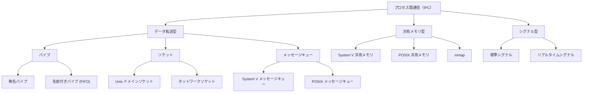
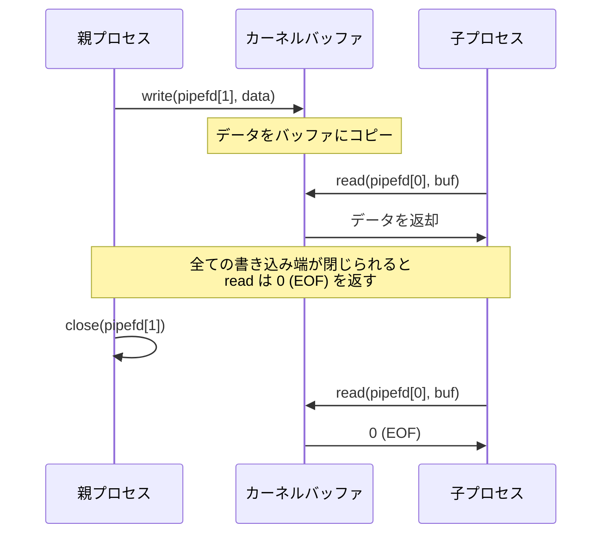
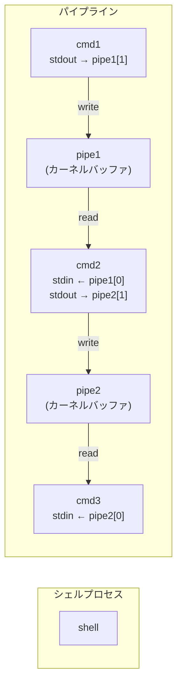
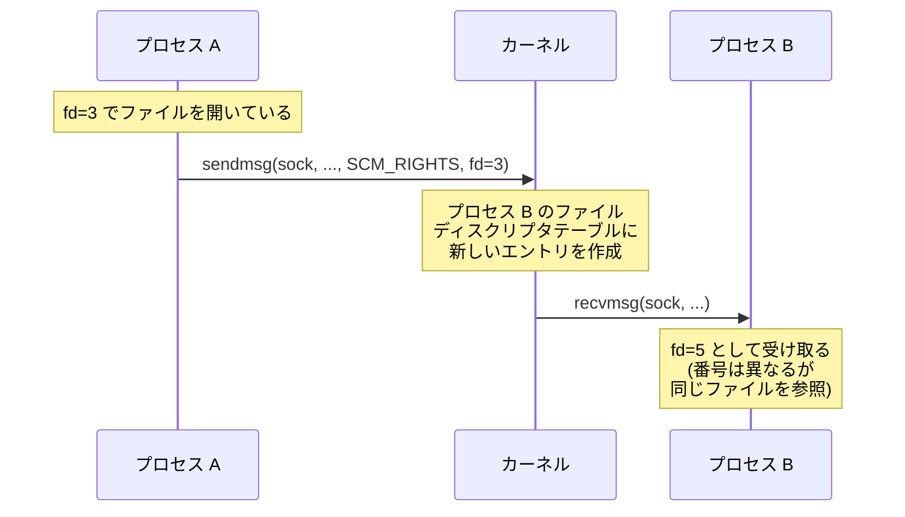
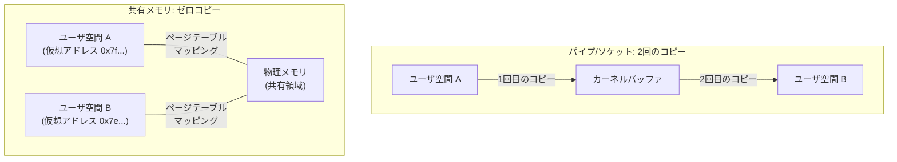
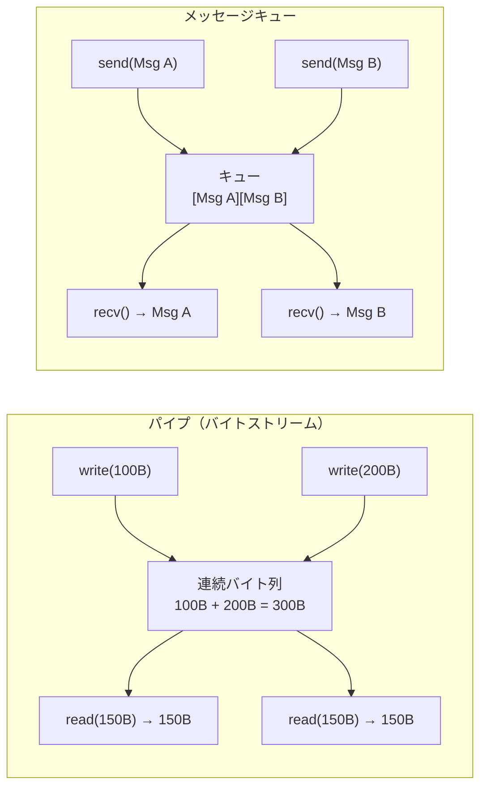
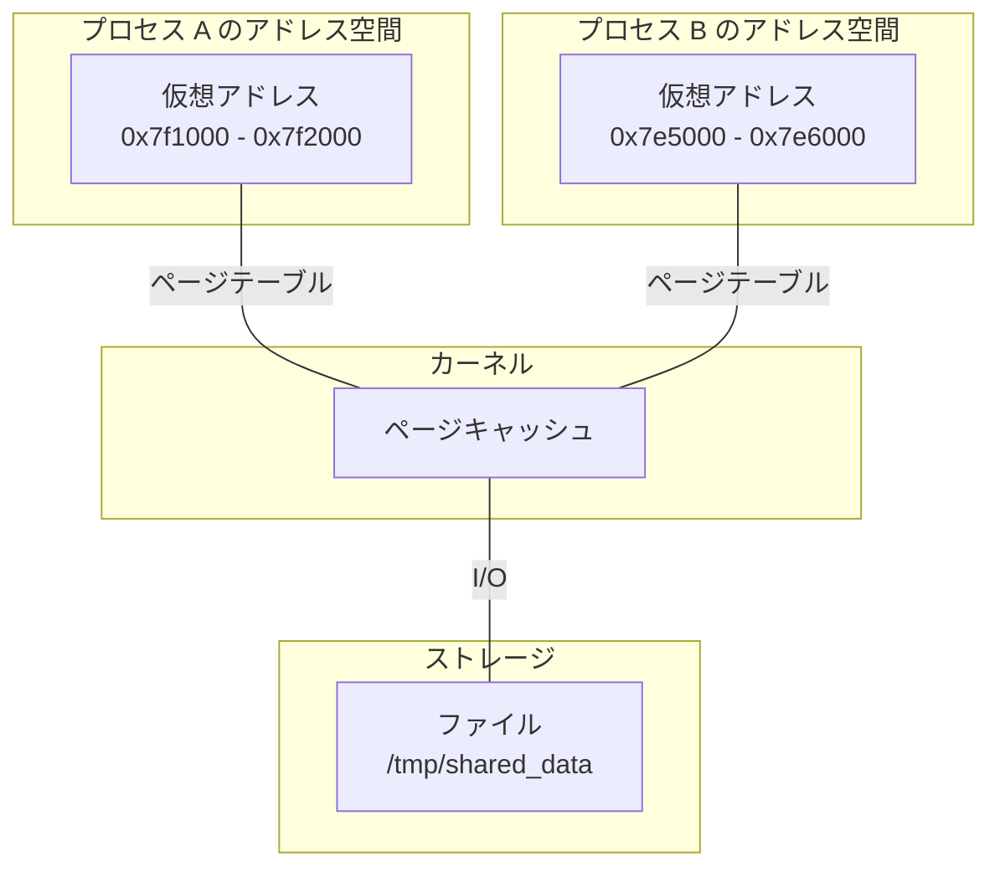
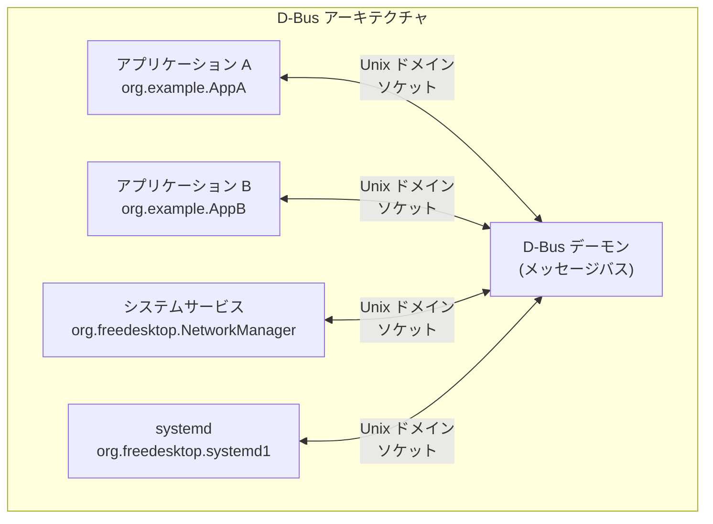
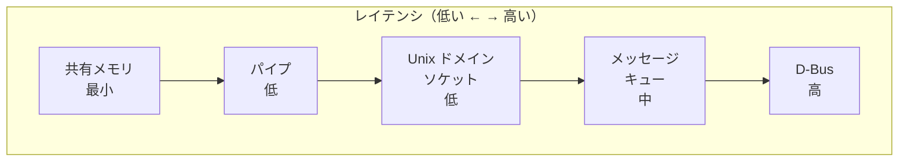
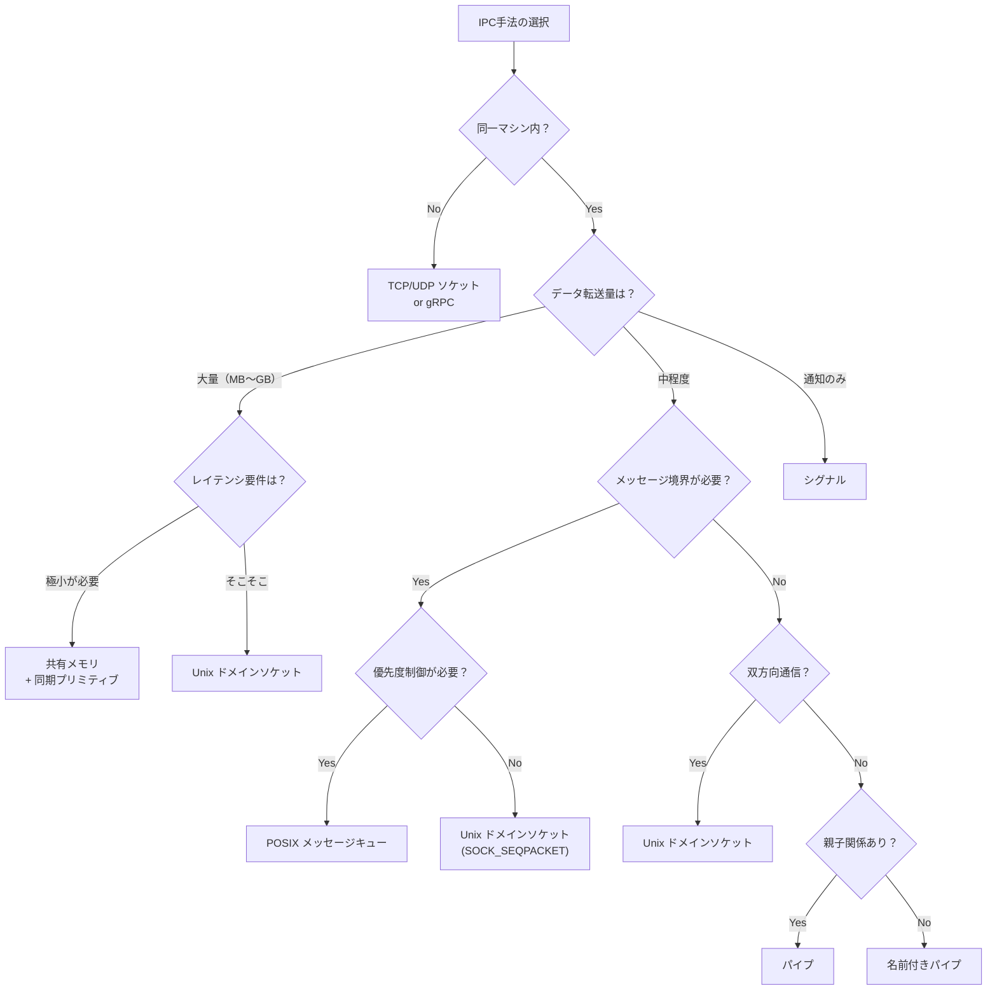

# プロセス間通信（IPC）

## 1. IPCの必要性 — なぜプロセスは互いに通信しなければならないのか

### 1.1 プロセス分離の原則とその代償

現代のオペレーティングシステムは、各プロセスに**独立した仮想アドレス空間**を与えることで、プロセス同士の干渉を防いでいる。あるプロセスのバグや暴走が他のプロセスやカーネルを巻き込んでシステム全体をクラッシュさせることを防ぐ、この「プロセス分離」はOSの最も重要な設計原則の一つである。

しかし、この分離は同時に、プロセス同士がデータをやりとりすることを困難にする。あるプロセスが別のプロセスのメモリに直接アクセスすることはできない。これは意図的な設計だが、実際のシステムでは複数のプロセスが協調して動作する必要がある場面が多い。

```
プロセス A                        プロセス B
+---------------------+          +---------------------+
| 仮想アドレス空間     |          | 仮想アドレス空間     |
|                     |   ???    |                     |
| データを送りたい ----+----------+--> データを受けたい  |
|                     |          |                     |
+---------------------+          +---------------------+
        |                                |
        v                                v
   ページテーブル A                ページテーブル B
        |                                |
        v                                v
+--------------------------------------------------+
|              物理メモリ                           |
|  (各プロセスは異なる物理ページにマッピング)        |
+--------------------------------------------------+
```

### 1.2 協調が必要な典型的シナリオ

プロセス間通信が必要になる場面は多岐にわたる。

**パイプライン処理**: Unixの哲学「一つのことをうまくやるプログラムを組み合わせる」を実現するためには、あるプログラムの出力を別のプログラムの入力に接続する仕組みが必要である。`cat file.txt | grep "error" | wc -l` というコマンドでは、3つのプロセスがパイプで連結されている。

**クライアント・サーバモデル**: Webサーバがデータベースサーバにクエリを送信する、GUIアプリケーションがバックエンドのデーモンにリクエストを送る、といったパターンは現代のシステムのいたるところに存在する。

**並列処理**: 大規模な計算を複数のプロセスに分散する場合、部分結果の集約や進捗の同期にIPCが不可欠である。

**システム管理**: `systemd` がサービスの起動・停止を管理する、ウィンドウマネージャがアプリケーションにフォーカス変更を通知する、といったOS内部の制御にもIPCが使われる。

### 1.3 IPCメカニズムの分類

IPCメカニズムは、大きく以下のように分類できる。



データ転送型のIPCでは、送信側がデータをカーネルバッファにコピーし、受信側がそこからデータを読み出す。データはカーネルを経由して**2回のコピー**が発生する（送信側ユーザ空間 → カーネル空間 → 受信側ユーザ空間）。一方、共有メモリ型では、複数のプロセスが同じ物理メモリ領域をマッピングすることで、カーネルを介さない直接的なデータ共有が可能になる。シグナルは非同期的なイベント通知に特化した軽量な仕組みである。

## 2. パイプと名前付きパイプ — 最もシンプルなデータストリーム

### 2.1 無名パイプ（Anonymous Pipe）

パイプはUnixで最初に実装されたIPCメカニズムの一つであり、1973年にKen ThompsonがDoug McIlroyの提案を受けてVersion 3 Unixに実装した。シェルの `|` 演算子として広く知られているが、その内部構造を正確に理解しているプログラマは意外と少ない。

無名パイプは `pipe()` システムコールで作成される。このシステムコールは2つのファイルディスクリプタを返す。一方が読み出し端（read end）、もう一方が書き込み端（write end）である。

```c
#include <unistd.h>
#include <stdio.h>
#include <string.h>
#include <sys/wait.h>

int main(void) {
    int pipefd[2];
    pid_t pid;
    char buf[256];

    // Create a pipe: pipefd[0] = read end, pipefd[1] = write end
    if (pipe(pipefd) == -1) {
        perror("pipe");
        return 1;
    }

    pid = fork();
    if (pid == 0) {
        // Child process: read from pipe
        close(pipefd[1]); // Close unused write end
        ssize_t n = read(pipefd[0], buf, sizeof(buf) - 1);
        if (n > 0) {
            buf[n] = '\0';
            printf("Child received: %s\n", buf);
        }
        close(pipefd[0]);
    } else {
        // Parent process: write to pipe
        close(pipefd[0]); // Close unused read end
        const char *msg = "Hello from parent";
        write(pipefd[1], msg, strlen(msg));
        close(pipefd[1]);
        wait(NULL);
    }
    return 0;
}
```

パイプの内部では、カーネルがリングバッファ（Linuxでは通常16ページ、64KB）を管理している。書き込み側がバッファに書き込み、読み出し側がバッファから読み出す。バッファが満杯になると書き込み側はブロックされ、バッファが空になると読み出し側がブロックされる。この仕組みにより、**生産者・消費者パターン**の同期が自然に実現される。



### 2.2 無名パイプの制約

無名パイプにはいくつかの重要な制約がある。

**単方向性**: パイプは一方向のデータフローのみをサポートする。双方向通信が必要な場合は2本のパイプを使うか、他のIPC手段を選択する必要がある。

**親子関係の必要性**: 無名パイプのファイルディスクリプタは `fork()` によって子プロセスに継承される形でしか共有できない。血縁関係のないプロセス間では無名パイプは使えない。

**バイトストリーム**: パイプはメッセージ境界を持たないバイトストリームである。送信側が100バイトと200バイトの2回の `write` を行った場合、受信側は300バイトを1回の `read` で読み取る可能性がある。メッセージ単位の区切りが必要な場合は、アプリケーション層でプロトコルを定義する必要がある。

**ネットワーク非対応**: パイプは同一マシン上のプロセス間でのみ使用できる。

### 2.3 名前付きパイプ（FIFO）

名前付きパイプ（FIFO）は、ファイルシステム上に名前を持つパイプである。`mkfifo` コマンドまたは `mkfifo()` システムコールで作成される。

```c
#include <sys/stat.h>
#include <fcntl.h>
#include <unistd.h>
#include <stdio.h>
#include <string.h>

// Writer process
int main(void) {
    const char *fifo_path = "/tmp/myfifo";

    // Create FIFO with read/write permissions for the owner
    mkfifo(fifo_path, 0666);

    // Open blocks until a reader opens the other end
    int fd = open(fifo_path, O_WRONLY);
    const char *msg = "Hello via FIFO";
    write(fd, msg, strlen(msg));
    close(fd);

    // Optionally remove the FIFO
    unlink(fifo_path);
    return 0;
}
```

名前付きパイプの最大の利点は、**親子関係のないプロセス間でも使える**ことである。ファイルパスさえ知っていれば、どのプロセスでもFIFOを開いて通信できる。ただし、単方向性やバイトストリームという特性は無名パイプと同じである。

名前付きパイプの `open()` はデフォルトで**ブロッキング**動作をする。書き込み側は読み出し側が接続するまでブロックされ、読み出し側も書き込み側が接続するまでブロックされる。`O_NONBLOCK` フラグで非ブロッキングにできるが、この場合のセマンティクスには注意が必要である（読み出し側は `O_NONBLOCK` で即座に開けるが、書き込み側は読み出し側がいなければ `ENXIO` エラーになる）。

### 2.4 シェルにおけるパイプラインの実装

シェルが `cmd1 | cmd2 | cmd3` を実行する際の内部動作を理解すると、パイプの設計がいかに洗練されているかがわかる。



シェルはまず必要な数のパイプを作成し、次に各コマンドに対して `fork` を実行する。各子プロセスでは `dup2()` を使ってパイプの端をstdin/stdoutにリダイレクトした後、`exec` で対象コマンドを起動する。パイプのバッファリングにより、各コマンドは独立した速度でデータを処理でき、遅いステージがあればパイプのバッファが満杯になることで自然にバックプレッシャーがかかる。

## 3. Unixドメインソケット — ローカル通信の万能選手

### 3.1 ネットワークソケットとの対比

ソケットAPIは元来ネットワーク通信のために設計されたが、同一マシン上のプロセス間通信にも極めて有用である。Unixドメインソケット（`AF_UNIX` / `AF_LOCAL`）は、TCP/IPスタックを経由せずカーネル内部で直接データを転送するため、ネットワークソケットよりも大幅に高速である。


Linuxにおけるベンチマークでは、Unixドメインソケットはループバック上のTCPソケットと比較して、レイテンシが約30〜50%低く、スループットが20〜40%高い結果が報告されている。これは、チェックサム計算、パケット分割/再構成、ルーティングテーブル参照といったTCP/IPスタックのオーバーヘッドが一切ないためである。

### 3.2 ストリーム型とデータグラム型

Unixドメインソケットは、ネットワークソケットと同様に `SOCK_STREAM`（ストリーム型）と `SOCK_DGRAM`（データグラム型）をサポートする。

**`SOCK_STREAM`（ストリーム型）**: TCPに相当する。接続指向で、信頼性のある順序付きバイトストリームを提供する。サーバは `bind` → `listen` → `accept` の手順でクライアントからの接続を待ち受ける。

**`SOCK_DGRAM`（データグラム型）**: UDPに相当するが、Unixドメインでは**信頼性が保証される**。メッセージ境界が保持され、データの損失や順序の入れ替わりは発生しない。ネットワークUDPとは異なり、カーネル内部のバッファ転送であるため信頼性の問題がない。

さらに、Linux固有の `SOCK_SEQPACKET` 型もある。これは接続指向でかつメッセージ境界を保持する型で、ストリーム型とデータグラム型のいいとこ取りである。

```c
#include <sys/socket.h>
#include <sys/un.h>
#include <stdio.h>
#include <string.h>
#include <unistd.h>

// Server side of a Unix domain socket
int main(void) {
    int server_fd, client_fd;
    struct sockaddr_un addr;
    char buf[256];
    const char *socket_path = "/tmp/my_unix_socket";

    server_fd = socket(AF_UNIX, SOCK_STREAM, 0);

    memset(&addr, 0, sizeof(addr));
    addr.sun_family = AF_UNIX;
    strncpy(addr.sun_path, socket_path, sizeof(addr.sun_path) - 1);

    // Remove existing socket file
    unlink(socket_path);
    bind(server_fd, (struct sockaddr *)&addr, sizeof(addr));
    listen(server_fd, 5);

    printf("Waiting for connection...\n");
    client_fd = accept(server_fd, NULL, NULL);

    ssize_t n = read(client_fd, buf, sizeof(buf) - 1);
    if (n > 0) {
        buf[n] = '\0';
        printf("Received: %s\n", buf);
    }

    close(client_fd);
    close(server_fd);
    unlink(socket_path);
    return 0;
}
```

### 3.3 抽象ソケットとファイルディスクリプタの受け渡し

Linuxでは、ソケットパスの先頭にヌル文字 `\0` を置くことで**抽象ソケット（abstract socket）** を作成できる。抽象ソケットはファイルシステム上にパスを持たないため、ファイルの権限管理やクリーンアップの問題を回避できる。

Unixドメインソケットの最も強力な機能の一つが、**ファイルディスクリプタの受け渡し**（fd passing）である。`sendmsg()` / `recvmsg()` と補助データ（`SCM_RIGHTS`）を使って、あるプロセスが保有するファイルディスクリプタを別のプロセスに渡すことができる。これは単にファイルディスクリプタの番号を渡すのではなく、カーネルが受信側プロセスのファイルディスクリプタテーブルに新しいエントリを作成し、同じファイルオブジェクトを参照させる操作である。



この機能は、特権プロセスが開いたファイルやソケットを非特権プロセスに渡す場合に非常に有用である。例えば、Webサーバが特権ポート（80番）でリッスンしたソケットをワーカープロセスに渡すケースや、`systemd` のソケットアクティベーションで使われている。

### 3.4 Unixドメインソケットの実用例

Unixドメインソケットは、現代のLinuxシステムにおいて最も広く使われているIPCメカニズムの一つである。

- **D-Bus**: デスクトップ環境のメッセージバスとしてUnixドメインソケット上に構築
- **Docker**: デーモンとCLIの間の通信に `/var/run/docker.sock` を使用
- **X Window System / Wayland**: ディスプレイサーバとクライアント間の通信
- **MySQL / PostgreSQL**: ローカル接続のデフォルトプロトコル
- **systemd**: ジャーナルログの転送やサービス間の通知

## 4. 共有メモリ — ゼロコピーの高速通信

### 4.1 なぜ共有メモリが必要か

パイプやソケットを使ったIPCでは、データがユーザ空間からカーネル空間へ、そしてカーネル空間から別のユーザ空間へと**2回のメモリコピー**が発生する。小さなデータの交換ではこのオーバーヘッドは無視できるが、大量のデータ（画像、動画フレーム、大規模な配列など）を頻繁にやりとりする場合には深刻なボトルネックになる。

共有メモリは、複数のプロセスが**同一の物理メモリ領域を自分のアドレス空間にマッピング**することで、カーネルを介さない直接的なデータ共有を実現する。データのコピーが不要なため、大容量データの共有において最も高速なIPCメカニズムである。



### 4.2 System V 共有メモリ

System V IPC（SysV IPC）は1983年のSystem V Unixで導入されたIPCの仕組みであり、共有メモリ、セマフォ、メッセージキューの3つのメカニズムをセットで提供する。歴史的な理由から今でも広く使われているが、APIの設計は古めかしく、現代の基準からは使いにくい部分がある。

System V 共有メモリの基本的な使用手順は以下の通りである。

1. `ftok()` でIPCキーを生成
2. `shmget()` で共有メモリセグメントを作成または取得
3. `shmat()` でプロセスのアドレス空間にアタッチ
4. 共有メモリに対して読み書き
5. `shmdt()` でデタッチ
6. `shmctl(IPC_RMID)` で削除

```c
#include <sys/ipc.h>
#include <sys/shm.h>
#include <stdio.h>
#include <string.h>

int main(void) {
    // Generate a unique IPC key from a file path and project ID
    key_t key = ftok("/tmp", 65);

    // Create a shared memory segment of 1024 bytes
    int shmid = shmget(key, 1024, 0666 | IPC_CREAT);

    // Attach the shared memory segment to the process address space
    char *str = (char *)shmat(shmid, NULL, 0);

    // Write data to shared memory
    strcpy(str, "Hello from shared memory");
    printf("Data written: %s\n", str);

    // Detach from shared memory (does not destroy it)
    shmdt(str);

    return 0;
}
```

System V 共有メモリの問題点として、`ftok()` によるキー生成が衝突する可能性があること、リソースがプロセスの終了後も残存すること（`ipcrm` コマンドで手動削除が必要）、名前空間がシステム全体で共有されることなどが挙げられる。

### 4.3 POSIX 共有メモリ

POSIX 共有メモリはSystem V 共有メモリの改良版として設計された。ファイルシステムライクな名前付けとファイルディスクリプタベースのAPIを採用し、既存のファイル操作関数との一貫性が保たれている。

```c
#include <sys/mman.h>
#include <sys/stat.h>
#include <fcntl.h>
#include <unistd.h>
#include <stdio.h>
#include <string.h>

int main(void) {
    const char *name = "/my_shm";
    const size_t SIZE = 4096;

    // Create a shared memory object (returns a file descriptor)
    int fd = shm_open(name, O_CREAT | O_RDWR, 0666);

    // Set the size of the shared memory region
    ftruncate(fd, SIZE);

    // Map the shared memory into the process address space
    char *ptr = mmap(NULL, SIZE, PROT_READ | PROT_WRITE, MAP_SHARED, fd, 0);

    // Write data
    sprintf(ptr, "Hello from POSIX shared memory");
    printf("Written: %s\n", ptr);

    // Unmap and close
    munmap(ptr, SIZE);
    close(fd);

    // Remove the shared memory object (when no longer needed)
    // shm_unlink(name);

    return 0;
}
```

POSIX 共有メモリの利点は以下の通りである。

- **名前がパスライク**: `/my_shm` のようなスラッシュ始まりの名前を使い、衝突しにくい
- **ファイルディスクリプタベース**: `select()` / `poll()` / `epoll()` との統合が容易
- **参照カウント式のライフタイム**: `shm_unlink()` 後も、開いているプロセスがある限り有効
- **`mmap` との自然な統合**: ファイルディスクリプタを `mmap` に渡すだけ

Linuxでは、POSIX 共有メモリオブジェクトは `/dev/shm` ディレクトリ下にtmpfsとして実装されている。`ls /dev/shm` で現在の共有メモリオブジェクトを確認でき、通常のファイル操作（`rm` を含む）で管理できる。

### 4.4 共有メモリの同期問題

共有メモリの最大の課題は**同期**である。複数のプロセスが同じメモリ領域に同時にアクセスすると、データ競合が発生する。この問題を解決するために、通常は以下の同期プリミティブと組み合わせて使用する。

- **POSIX セマフォ**（`sem_open` / `sem_wait` / `sem_post`）: プロセス間で使える名前付きセマフォ
- **pthread mutex**（`PTHREAD_PROCESS_SHARED` 属性付き）: 共有メモリ上に配置したmutex
- **futex**（Linuxカーネルのプリミティブ）: 高性能な同期に使われるカーネルサポート付きのユーザ空間ロック

```c
#include <semaphore.h>
#include <sys/mman.h>
#include <fcntl.h>
#include <stdio.h>
#include <unistd.h>

int main(void) {
    // Create a named semaphore for inter-process synchronization
    sem_t *sem = sem_open("/my_sem", O_CREAT, 0666, 1);

    // Critical section: access shared memory safely
    sem_wait(sem);  // Acquire the semaphore (decrement)
    // ... read/write shared memory ...
    printf("Inside critical section\n");
    sem_post(sem);  // Release the semaphore (increment)

    sem_close(sem);
    // sem_unlink("/my_sem");  // Remove when done
    return 0;
}
```

::: warning 同期の落とし穴
共有メモリにおける同期は、マルチスレッドプログラミングの同期よりもさらに困難である。プロセスが共有メモリにロックを保持したまま異常終了した場合、他のプロセスは永久にデッドロックする可能性がある。**ロバストmutex**（`PTHREAD_MUTEX_ROBUST` 属性）を使えば、ロック保持者の死亡を検知してロックを回復できるが、データの整合性を保証するのはアプリケーションの責務である。
:::

## 5. メッセージキュー — 構造化されたメッセージの交換

### 5.1 メッセージキューの概念

パイプがバイトストリームであるのに対し、メッセージキューは**メッセージ境界を保持する**IPCメカニズムである。送信側がメッセージ単位でデータを送信し、受信側もメッセージ単位でデータを受信する。メッセージが途中で分割されたり、複数のメッセージが結合されたりすることはない。



### 5.2 System V メッセージキュー

System V メッセージキューは `msgget()` で作成し、`msgsnd()` / `msgrcv()` でメッセージの送受信を行う。各メッセージにはタイプ（正の整数）を付与でき、受信側は特定のタイプのメッセージだけを選択的に受信できる。

```c
#include <sys/ipc.h>
#include <sys/msg.h>
#include <stdio.h>
#include <string.h>

// Message structure must start with a long type field
struct message {
    long mtype;       // Message type (must be > 0)
    char mtext[256];  // Message body
};

int main(void) {
    key_t key = ftok("/tmp", 66);
    int msgid = msgget(key, 0666 | IPC_CREAT);

    // Send a message with type 1
    struct message msg;
    msg.mtype = 1;
    strcpy(msg.mtext, "Priority message");
    msgsnd(msgid, &msg, sizeof(msg.mtext), 0);

    // Send a message with type 2
    msg.mtype = 2;
    strcpy(msg.mtext, "Normal message");
    msgsnd(msgid, &msg, sizeof(msg.mtext), 0);

    // Receive only type-2 messages
    struct message received;
    msgrcv(msgid, &received, sizeof(received.mtext), 2, 0);
    printf("Received (type %ld): %s\n", received.mtype, received.mtext);

    // Cleanup
    msgctl(msgid, IPC_RMID, NULL);
    return 0;
}
```

メッセージタイプによる選択的受信は、単一のキューで複数の優先度レベルを扱ったり、複数のクライアントがそれぞれのタイプ番号でメッセージを受け取ったりするパターンに有用である。

### 5.3 POSIX メッセージキュー

POSIX メッセージキューは、System V メッセージキューの後継として設計された、より使いやすいAPIを提供する。

```c
#include <mqueue.h>
#include <stdio.h>
#include <string.h>
#include <fcntl.h>

int main(void) {
    struct mq_attr attr;
    attr.mq_flags = 0;
    attr.mq_maxmsg = 10;     // Maximum number of messages in queue
    attr.mq_msgsize = 256;   // Maximum message size in bytes
    attr.mq_curmsgs = 0;

    // Create or open a POSIX message queue
    mqd_t mq = mq_open("/my_queue", O_CREAT | O_RDWR, 0666, &attr);

    // Send a message with priority 0
    const char *msg = "Hello via POSIX MQ";
    mq_send(mq, msg, strlen(msg) + 1, 0);

    // Receive a message
    char buf[256];
    unsigned int prio;
    ssize_t n = mq_receive(mq, buf, sizeof(buf), &prio);
    if (n >= 0) {
        printf("Received (priority %u): %s\n", prio, buf);
    }

    mq_close(mq);
    // mq_unlink("/my_queue");
    return 0;
}
```

POSIX メッセージキューのSystem V版に対する主な改善点は以下の通りである。

| 特性 | System V | POSIX |
|------|----------|-------|
| 名前付け | `ftok()` による数値キー | `/name` 形式のパス |
| API | 独自のシステムコール | ファイルディスクリプタベース |
| 通知 | ポーリングのみ | `mq_notify()` で非同期通知 |
| 優先度 | タイプ番号による選択 | 優先度付き（高い順に取り出し） |
| タイムアウト | なし | `mq_timedsend` / `mq_timedreceive` |

特に `mq_notify()` によるシグナル通知やスレッド起動の機能は、イベント駆動型のプログラムに適している。

## 6. シグナル — 非同期イベント通知

### 6.1 シグナルの本質

シグナルはUnixシステムにおける**ソフトウェア割り込み**である。プロセスに対して非同期的にイベントを通知する仕組みであり、データの転送ではなくイベントの発生そのものを伝えることが目的である。

シグナルはカーネルからプロセスへ、またはプロセスからプロセスへ送信できる。代表的なシグナルを以下に示す。

| シグナル | 番号 | デフォルト動作 | 用途 |
|----------|------|----------------|------|
| `SIGHUP` | 1 | 終了 | 端末切断、設定再読み込み |
| `SIGINT` | 2 | 終了 | Ctrl+C による割り込み |
| `SIGKILL` | 9 | 終了（補足不可） | 強制終了 |
| `SIGSEGV` | 11 | コアダンプ | 不正なメモリアクセス |
| `SIGTERM` | 15 | 終了 | 正常終了要求 |
| `SIGCHLD` | 17 | 無視 | 子プロセスの状態変化 |
| `SIGUSR1` | 10 | 終了 | ユーザ定義シグナル1 |
| `SIGUSR2` | 12 | 終了 | ユーザ定義シグナル2 |
| `SIGSTOP` | 19 | 停止（補足不可） | プロセス一時停止 |
| `SIGCONT` | 18 | 継続 | 停止プロセスの再開 |

### 6.2 シグナルハンドラの設計上の注意

シグナルハンドラは、プロセスの通常の実行フローを中断して呼び出される。このため、ハンドラ内で実行できる操作には厳しい制約がある。

```c
#include <signal.h>
#include <stdio.h>
#include <unistd.h>

// Global flag — must be volatile sig_atomic_t for signal safety
volatile sig_atomic_t got_signal = 0;

// Signal handler — keep it minimal
void handler(int signo) {
    // Only async-signal-safe functions allowed here
    got_signal = 1;
    // Do NOT call printf, malloc, or other non-reentrant functions
}

int main(void) {
    struct sigaction sa;
    sa.sa_handler = handler;
    sigemptyset(&sa.sa_mask);
    sa.sa_flags = 0;

    sigaction(SIGUSR1, &sa, NULL);

    printf("PID: %d, waiting for SIGUSR1...\n", getpid());

    // Main loop checks the flag
    while (!got_signal) {
        pause();  // Suspend until a signal is received
    }

    printf("Received SIGUSR1, exiting.\n");
    return 0;
}
```

::: danger シグナルハンドラの安全性
シグナルハンドラ内で呼び出せるのは「非同期シグナル安全（async-signal-safe）」な関数のみである。`printf()`、`malloc()`、`free()`、`pthread_mutex_lock()` などはシグナルハンドラ内で呼んではならない。POSIX標準で非同期シグナル安全と定められている関数のリストは限られており、`write()`、`_exit()`、`signal()` などが含まれる。安全なパターンは、ハンドラ内では `volatile sig_atomic_t` フラグの設定や `write()` によるパイプへの1バイト書き込みに留め、実際の処理はメインループで行うことである。
:::

### 6.3 シグナルの限界

シグナルはIPCとしてはかなり限定的である。以下の理由から、データの転送には不向きである。

1. **運べるデータ量がほぼゼロ**: 標準シグナルはシグナル番号しか伝えない。`sigqueue()` を使えば `sigval` 共用体で1つの整数またはポインタを付加できるが、それが上限である。
2. **信頼性の問題**: 同じシグナルが複数回送信されても、保留中のシグナルは1つにマージされる可能性がある（標準シグナルの場合）。リアルタイムシグナル（`SIGRTMIN` 〜 `SIGRTMAX`）はキューイングされるが、キューの深さには制限がある。
3. **競合条件**: シグナルの処理には多くの競合条件の罠がある。`sigprocmask()` を使ったシグナルのブロックや `pselect()` / `signalfd()` の使用など、安全に扱うには深い知識が必要である。

Linuxでは `signalfd()` を使って、シグナルをファイルディスクリプタとして扱い `read()` で読み取ることができる。これにより、シグナルをイベントループに統合しやすくなる。

## 7. メモリマップドファイル — ファイルとメモリの融合

### 7.1 mmapの仕組み

`mmap()` はファイルの内容をプロセスのアドレス空間に直接マッピングするシステムコールである。マッピングされた領域に対するメモリアクセスは、カーネルによって自動的にファイルI/Oに変換される。

```c
#include <sys/mman.h>
#include <sys/stat.h>
#include <fcntl.h>
#include <stdio.h>
#include <unistd.h>

int main(void) {
    int fd = open("/tmp/shared_data", O_RDWR | O_CREAT, 0666);

    // Extend the file to 4096 bytes
    ftruncate(fd, 4096);

    // Map the file into memory
    char *map = mmap(NULL, 4096, PROT_READ | PROT_WRITE, MAP_SHARED, fd, 0);
    close(fd);  // fd can be closed after mmap

    // Write to the mapped region (automatically synced to file)
    sprintf(map, "Data written via mmap");
    printf("Read from mmap: %s\n", map);

    // Force sync to disk (optional, happens automatically on munmap)
    msync(map, 4096, MS_SYNC);

    munmap(map, 4096);
    return 0;
}
```

`MAP_SHARED` フラグで作成されたマッピングは、複数のプロセスから同じファイルをマッピングすることでIPCとして機能する。一方のプロセスがマッピング領域に書き込んだデータは、他のプロセスのマッピングにも反映される。



### 7.2 mmapによるIPCの特徴

mmapを使ったIPCは共有メモリの一形態であるが、POSIX共有メモリやSystem V共有メモリとは異なる特性を持つ。

**ファイルバックドのマッピング**: 通常のファイルをバッキングストアとして使うため、システム再起動後もデータが永続化される。これはデータベースのバッファプールやメモリマップドI/Oに適している。

**匿名マッピング**: `MAP_ANONYMOUS | MAP_SHARED` で作成するマッピングはファイルを必要としない。`fork()` 後の親子プロセス間でデータを共有する簡便な方法として使える。

```c
#include <sys/mman.h>
#include <stdio.h>
#include <unistd.h>
#include <sys/wait.h>

int main(void) {
    // Create an anonymous shared mapping (no backing file)
    int *shared_counter = mmap(NULL, sizeof(int),
                                PROT_READ | PROT_WRITE,
                                MAP_SHARED | MAP_ANONYMOUS,
                                -1, 0);
    *shared_counter = 0;

    pid_t pid = fork();
    if (pid == 0) {
        // Child increments the counter
        (*shared_counter)++;
        printf("Child: counter = %d\n", *shared_counter);
    } else {
        wait(NULL);
        // Parent sees the child's modification
        printf("Parent: counter = %d\n", *shared_counter);
        munmap(shared_counter, sizeof(int));
    }
    return 0;
}
```

### 7.3 mmapの注意事項

**ページ境界**: `mmap` はページ単位で動作する。マッピングのサイズは自動的にページサイズの倍数に切り上げられる。オフセットもページ境界に揃っている必要がある。

**コヒーレンシ**: `MAP_SHARED` マッピングでは、一方のプロセスの書き込みが他方に反映されるタイミングについて、POSIXは「すぐに見える（coherent）」と規定している。ただし、CPUキャッシュやメモリオーダリングの影響を受けるため、マルチプロセッサシステムでは適切なメモリバリアや同期プリミティブの使用が推奨される。

**SIGBUS**: マッピング範囲外のアクセス（例えば、ファイルが縮小された場合）は `SIGBUS` シグナルを引き起こす。堅牢なプログラムでは `SIGBUS` ハンドラの設置が必要である。

## 8. D-Busとモダンなデスクトップ/システムIPC

### 8.1 高水準IPCの必要性

ここまで見てきたIPCメカニズム（パイプ、ソケット、共有メモリ、メッセージキュー、シグナル）はすべてカーネルが提供するプリミティブである。これらは汎用的で高性能だが、実際のアプリケーション間通信に使うにはいくつかの課題がある。

- **サービスの発見**: 通信相手のプロセスをどうやって見つけるか
- **メッセージのシリアライズ**: 構造化されたデータをどうやってバイト列に変換するか
- **型安全性**: 送信側と受信側でメッセージの型をどうやって整合させるか
- **セキュリティ**: どのプロセスがどのメソッドを呼び出せるかをどうやって制御するか
- **ライフタイム管理**: サービスの起動・停止をどうやって管理するか

これらの課題に対処するために、カーネルIPCプリミティブの上に構築された高水準IPCフレームワークがいくつか存在する。

### 8.2 D-Bus

D-Busは、Linuxデスクトップ環境で最も広く使われている高水準IPCフレームワークである。freedesktop.orgプロジェクトの一部として開発され、GNOMEやKDEなどの主要なデスクトップ環境で標準的に使用されている。

D-Busの基本アーキテクチャは**メッセージバス**パターンに基づいている。個々のプロセスはバスデーモン（`dbus-daemon`）に接続し、バスを通じてメッセージを交換する。



D-Busは2種類のバスを提供する。

- **システムバス**: システム全体で1つ。ハードウェアイベント通知、ネットワーク設定変更、電源管理などシステムレベルのサービス間通信に使用される。
- **セッションバス**: ユーザセッションごとに1つ。デスクトップアプリケーション間の通信に使用される。

D-Busのメッセージには以下の4種類がある。

1. **メソッド呼び出し（Method Call）**: 特定のオブジェクトのメソッドを呼び出す（RPC的な使い方）
2. **メソッド返答（Method Return）**: メソッド呼び出しへの応答
3. **エラー（Error）**: メソッド呼び出しの失敗通知
4. **シグナル（Signal）**: ブロードキャスト通知（購読者全員に配信）

### 8.3 kdbus から io_uring へ — カーネル内IPCの進化

D-Busの性能上のボトルネックは、バスデーモンプロセスを経由することによるコンテキストスイッチのオーバーヘッドである。メッセージの送信には、送信者 → バスデーモン → 受信者 という2回のプロセス間コンテキストスイッチが発生する。

この問題を解決するために、かつてLinuxカーネルに `kdbus` というカーネル内D-Bus実装が提案されたが、複雑さやセキュリティの懸念から採用には至らなかった。代わりに `dbus-broker` という、より効率的なユーザ空間実装が開発され、FedoraやRHELなどで `dbus-daemon` の代替として採用されている。

近年では、`io_uring` の拡張としてプロセス間通信をサポートする議論も進んでいる。`io_uring` は非同期I/Oフレームワークとして設計されたが、その共有メモリリングバッファのアーキテクチャはIPCにも自然に適用可能である。

### 8.4 その他のモダンIPCフレームワーク

**Binder（Android）**: Androidの中核的なIPCメカニズム。カーネルドライバとして実装され、プロセス間のRPC呼び出しを高速に実現する。共有メモリを使った「ワンコピー」方式で、データは送信側のユーザ空間から受信側のユーザ空間に1回のコピーで転送される。

**XPC（macOS/iOS）**: Appleのプラットフォームで使われるIPCフレームワーク。Machポートの上に構築され、Grand Central Dispatch（GCD）と統合されている。launchdによるサービスのオンデマンド起動をサポートする。

**gRPC / Cap'n Proto**: ネットワーク越しのRPCフレームワークだが、Unixドメインソケット上で使用することでローカルIPCとしても利用できる。スキーマ定義に基づく型安全なメッセージングを提供する。

**Varlink**: systemdエコシステムで採用されている軽量なIPCプロトコル。JSON形式のインターフェース定義を使い、Unixドメインソケット上で動作する。

## 9. 各手法の比較と選定指針

### 9.1 性能特性の比較

各IPCメカニズムの性能特性を理解することは、適切な手法の選択に不可欠である。



| メカニズム | レイテンシ | スループット | データコピー回数 | メッセージ境界 |
|-----------|-----------|-------------|-----------------|---------------|
| 共有メモリ | 極小 | 極大 | 0 | なし（自前で管理） |
| パイプ | 小 | 中〜大 | 2 | なし |
| Unix ドメインソケット | 小 | 中〜大 | 2 | 型による |
| POSIX メッセージキュー | 中 | 中 | 2 | あり |
| シグナル | 小 | 極小 | — | — |
| D-Bus | 中〜大 | 小〜中 | 複数 | あり |

> [!NOTE]
> 実際の性能は、メッセージサイズ、通信パターン（1対1 vs 1対多）、同期方式、ハードウェア構成などによって大きく変わる。上記はあくまで一般的な傾向である。

### 9.2 機能特性の比較

| 特性 | パイプ | 名前付きパイプ | Unix ソケット | 共有メモリ | メッセージキュー | シグナル |
|------|--------|---------------|-------------|-----------|----------------|---------|
| 方向 | 単方向 | 単方向 | 双方向 | 双方向 | 双方向 | 単方向 |
| 血縁関係の必要性 | 必要 | 不要 | 不要 | 不要 | 不要 | 不要 |
| ネットワーク透過性 | なし | なし | なし | なし | なし | なし |
| データ型 | バイト列 | バイト列 | バイト列 | 任意 | 構造化 | シグナル番号 |
| 同期 | 組み込み | 組み込み | 組み込み | 自前 | 組み込み | 非同期 |
| 永続性 | プロセスと同寿命 | ファイルシステム | ファイルシステム | 明示的削除まで | 明示的削除まで | なし |
| fd受け渡し | 不可 | 不可 | 可能 | 不可 | 不可 | 不可 |

### 9.3 選定のフローチャート



### 9.4 実践的な選定ガイドライン

**パイプを選ぶべき場面**:
- シェルスクリプトでのコマンドの連結
- 親子プロセス間の単純なデータフロー
- 単方向のストリーミングデータ処理

**Unix ドメインソケットを選ぶべき場面**:
- クライアント・サーバモデルの通信
- 双方向通信が必要な場合
- ファイルディスクリプタの受け渡しが必要な場合
- 将来的にネットワーク対応に拡張する可能性がある場合（APIがネットワークソケットと互換）

**共有メモリを選ぶべき場面**:
- 大容量データ（画像、動画フレーム、大規模配列）の共有
- 極低レイテンシが求められるリアルタイムシステム
- 複数のプロセスが同じデータ構造を参照・更新する場合
- ただし同期の複雑さを受け入れる覚悟が必要

**メッセージキューを選ぶべき場面**:
- メッセージ単位の通信が自然なアプリケーション
- 送信側と受信側が独立したライフタイムを持つ場合（疎結合）
- 優先度付きメッセージ処理が必要な場合

**D-Busを選ぶべき場面**:
- デスクトップアプリケーション間の統合
- システムイベントの購読（ネットワーク変更、電源イベントなど）
- サービスディスカバリが必要な場合
- セキュリティポリシーに基づくアクセス制御が必要な場合

### 9.5 セキュリティに関する考慮事項

IPCメカニズムの選択において、セキュリティは重要な判断基準である。

**パイプ**: 親子関係でのみ共有されるため、比較的安全。第三者がファイルディスクリプタにアクセスすることは困難である。

**名前付きパイプ / Unixドメインソケット**: ファイルシステム上のパスとして存在するため、ファイルパーミッション（`chmod`）やSELinux / AppArmorのポリシーで保護できる。Unixドメインソケットでは `SO_PEERCRED` オプションで接続相手のPID/UID/GIDを確認できる。

**共有メモリ**: 適切なパーミッション設定が不可欠。共有メモリセグメントのパーミッションが緩い場合、任意のプロセスがデータを読み書きできてしまう。

**メッセージキュー**: パーミッションモデルはファイルと同様。System V の場合は `ipc` パーミッション、POSIX の場合はファイルパーミッションで保護される。

**D-Bus**: 最も細かなアクセス制御が可能。XMLベースのポリシーファイルで、バス名、インターフェース、メソッド単位でのアクセス制御を定義できる。

### 9.6 現代のLinuxにおけるIPCの動向

現代のLinuxシステムでは、IPCの利用パターンにいくつかの傾向が見られる。

**コンテナ環境**: DockerやKubernetesの普及により、同一マシン上のプロセス間通信であっても、ネットワークソケット（localhost通信）が使われることが多い。コンテナのネットワーク名前空間分離により、Unixドメインソケットや共有メモリの使用にはボリュームマウントなどの追加設定が必要になる。

**io_uring**: Linuxカーネルの非同期I/Oフレームワークである `io_uring` は、カーネルとユーザ空間の間の共有メモリリングバッファを用いており、それ自体がIPCの一形態と見なせる。将来的には、プロセス間通信への応用も期待されている。

**eBPF**: eBPFのマップ（`BPF_MAP_TYPE_HASH` など）は、カーネル空間とユーザ空間、あるいは異なるeBPFプログラム間でデータを共有する手段を提供する。これは伝統的なIPCとは異なるアプローチだが、監視やネットワーキングの文脈で重要性を増している。

**memfd**: `memfd_create()` はファイルシステムに影響しない匿名のファイルディスクリプタを作成する。`shm_open` の代替として、よりセキュアで使いやすい共有メモリの作成方法として注目されている。`memfd_secret()` はさらに進んで、カーネル自身からも読めない秘密メモリ領域を作成する。

## まとめ

プロセス間通信は、プロセス分離という基本原則を維持しつつ、プロセス間の協調を可能にするための不可欠な仕組みである。各IPCメカニズムにはそれぞれの設計思想と適用領域があり、「最良のIPC」は存在しない。

パイプの単純さ、ソケットの汎用性、共有メモリの高速性、メッセージキューの構造化、シグナルの非同期性、D-Busの高機能性。これらの特性を理解し、要件に応じて適切な手法を選択する能力が、システムプログラマに求められる重要なスキルである。

歴史的に見ると、Unixの初期からIPCは進化を続けてきた。System V IPCからPOSIX IPCへの移行、D-Busの登場、io_uringやeBPFといった新しいカーネルインターフェースの出現は、IPCの設計空間が今なお拡大し続けていることを示している。根底にある原則 ― プロセス分離を守りつつ、安全かつ効率的にデータを共有する ― は変わらないが、その実現方法は今後も進化し続けるだろう。
