# トランザクション分離レベル — 並行性と一貫性のトレードオフ

## 1. 背景と動機 — なぜ分離レベルが必要なのか

### 1.1 Isolation の本質的な問題

[ACID特性](/acid-transactions)の「I」である **Isolation（分離性）** は、複数のトランザクションが同時に実行されても、それぞれがあたかも単独で実行されたかのように振る舞うことを保証する性質である。理想的には、すべてのトランザクションが**直列化可能（Serializable）**であれば、並行性による異常は一切発生しない。

しかし、Serializable を厳密に保証するにはコストがかかる。ロックベースの実装では、読み取りと書き込みが互いにブロックし、スループットが著しく低下する。楽観的な実装でも、競合が多い環境ではアボート率が高まり、実質的な処理能力が落ちる。

ここに **トレードオフ** が存在する。一貫性を緩めれば並行性が向上し、並行性を高めれば一貫性が犠牲になる。このトレードオフを開発者が明示的に選択できるようにした仕組みが **トランザクション分離レベル（Isolation Level）** である。

```
厳密な一貫性 ◄──────────────────────────────────► 高い並行性
Serializable                                    Read Uncommitted
  ↑ 異常なし                                      ↑ 最多の異常を許容
  ↑ スループット低下                                ↑ スループット最大
```

### 1.2 歴史的経緯

分離レベルの概念は、Jim Gray による1976年の論文「Granularity of Locks and Degrees of Consistency in a Shared Data Base」で初めて体系化された。Gray は一貫性の度合い（Degree 0〜3）を定義し、ロックの保持期間と種類によって異なる一貫性レベルを実現できることを示した。

| Gray の一貫性度合い | 対応する分離レベル |
|---|---|
| Degree 0 | （dirty write を防ぐ最低限）|
| Degree 1 | Read Uncommitted |
| Degree 2 | Read Committed |
| Degree 3 | Serializable |

1992年、ANSI/ISO SQL-92 標準は4つの分離レベルを定義した。しかし、この標準の定義にはいくつかの曖昧さがあり、1995年に Hal Berenson らが発表した論文「A Critique of ANSI SQL Isolation Levels」が、SQL標準の分離レベル定義の不十分さを指摘し、**Snapshot Isolation** などの新しい分離レベルを提案した。この論文は、分離レベルの理解における決定的な文献となっている。

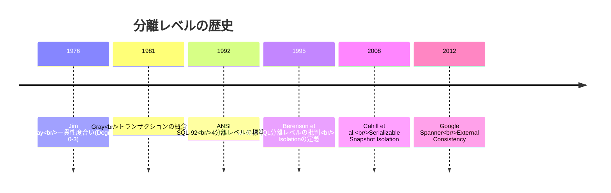

### 1.3 分離レベルを理解するためのアプローチ

分離レベルを理解するには、まず「何が問題になるか」を理解する必要がある。つまり、分離レベルとは「どのアノマリー（異常現象）を許容するか」の定義にほかならない。本記事では以下の順序で解説を進める。

1. アノマリーの分類 — どのような異常が起こりうるか
2. SQL標準の分離レベル — アノマリーの許容によるレベル分け
3. Snapshot Isolation — SQL標準に収まらない重要な分離レベル
4. 各データベースの実装 — 理論と実践のギャップ
5. 選択指針 — どの分離レベルを選ぶべきか

## 2. アノマリー（異常現象）の分類

並行トランザクションが適切に制御されない場合、さまざまなアノマリーが発生する。ここでは、代表的なアノマリーを深く掘り下げる。

### 2.1 Dirty Read（ダーティリード）

**Dirty Read** は、あるトランザクションがまだコミットしていないデータを、別のトランザクションが読み取ってしまう現象である。

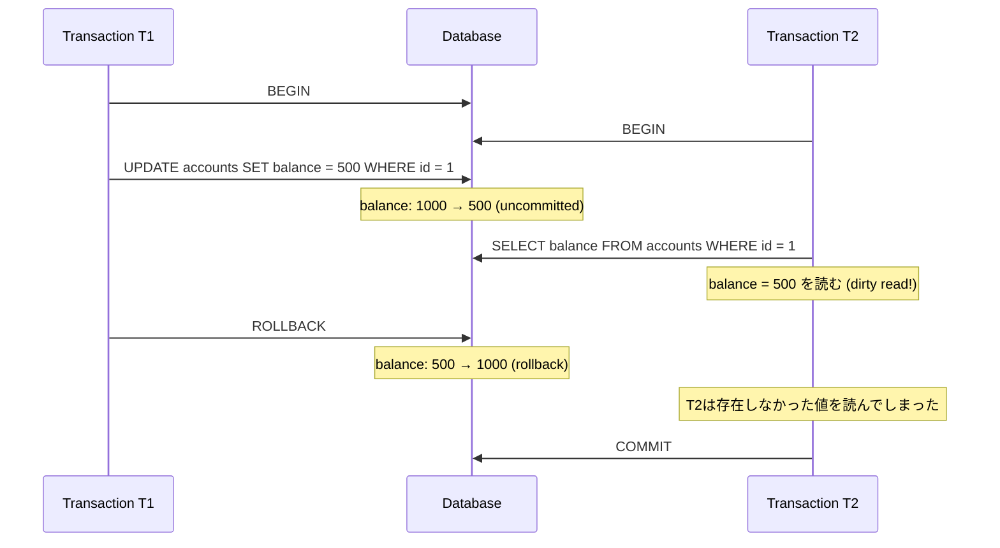

Dirty Read が危険な理由は明白である。ロールバックされる可能性のあるデータに基づいて別のトランザクションが処理を行うと、**存在しなかった状態** に基づく判断が確定してしまう。例えば、残高500円と読み取ったことに基づいて別の処理を行った場合、実際の残高は1000円なので、データの整合性が破壊される。

### 2.2 Non-Repeatable Read（ファジーリード）

**Non-Repeatable Read**（Fuzzy Read とも呼ばれる）は、同一トランザクション内で同じ行を2回読み取ったとき、別の値が返ってくる現象である。

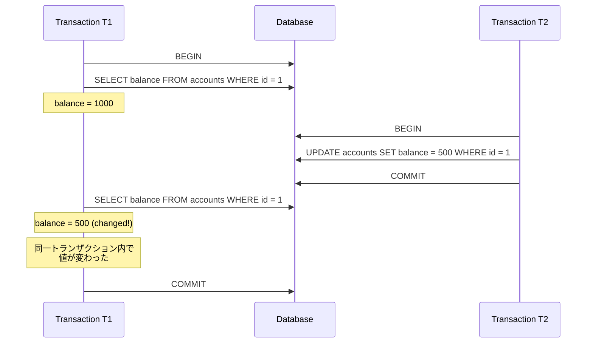

T1 は最初の読み取りで 1000、2回目の読み取りで 500 を得る。「同じクエリを同じトランザクション内で再実行したら異なる結果が返った」という状態は、トランザクションの分離性が不完全であることを意味する。

Non-Repeatable Read が問題になる典型的な例は、**検証してから操作する** パターンである。残高を確認し、十分な残高があることを確認してから引き落としを実行する場合、確認と引き落としの間に残高が変わってしまうと、残高不足の引き落としが発生しうる。

### 2.3 Phantom Read（ファントムリード）

**Phantom Read** は、同一トランザクション内で範囲クエリを2回実行したとき、1回目には存在しなかった行が2回目に出現する（またはその逆の）現象である。Non-Repeatable Read が「既存の行の値の変化」であるのに対し、Phantom Read は「行の存在/非存在の変化」である。

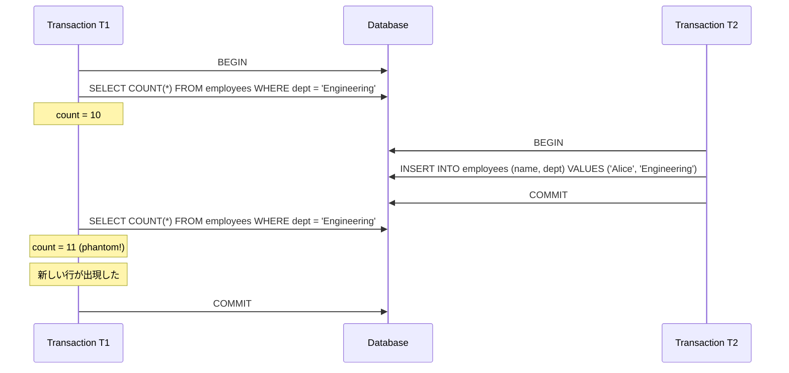

Phantom Read は Non-Repeatable Read よりも防ぐことが難しい。Non-Repeatable Read は個々の行にロックをかければ防げるが、Phantom Read では **まだ存在しない行** をロックする必要がある。これには、インデックスレンジロック（next-key lock）や述語ロック（predicate lock）といった特殊な技術が必要になる。

### 2.4 Lost Update（更新の消失）

**Lost Update** は、2つのトランザクションが同じデータを読み取り、それぞれが読み取った値に基づいて更新を行うと、一方の更新がもう一方の更新で上書きされてしまう現象である。

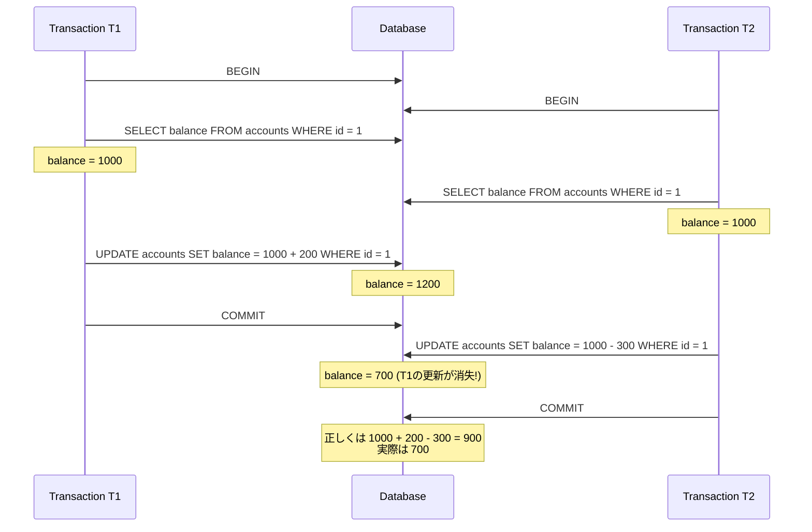

T1 が +200、T2 が -300 を加算しているので、正しい結果は 900 であるべきだが、実際には 700 になる。T1 の +200 の更新が完全に消失している。

Lost Update は **Read-Modify-Write** パターン（読み取って、加工して、書き戻す）で発生する。SQL標準の分離レベルでは、Repeatable Read 以上で Lost Update は防止される。

### 2.5 Write Skew（書き込みスキュー）

**Write Skew** は、2つのトランザクションがそれぞれ異なるデータを読み取り、それに基づいてそれぞれが異なるデータを更新するが、結果として制約違反が発生する現象である。Lost Update と似ているが、Lost Update は「同じデータへの更新の衝突」であるのに対し、Write Skew は「異なるデータへの更新が暗黙の制約を破る」という点で異なる。

典型的な例は、病院の当直医のシフト管理である。「少なくとも1人は当直に入っていなければならない」という制約がある場合を考える。

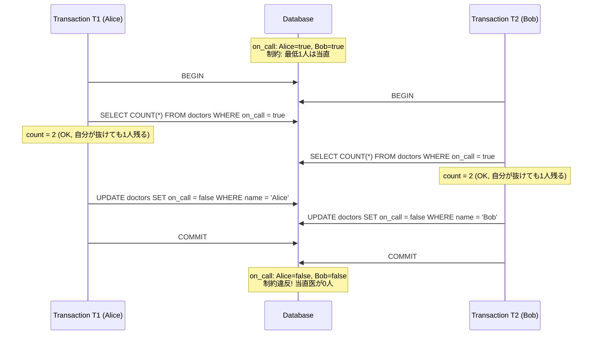

Alice と Bob はそれぞれ「相手がいるから自分は抜けても大丈夫」と判断したが、両方が同時に抜けてしまい、当直医が0人になるという制約違反が発生した。

Write Skew は Snapshot Isolation で防ぐことができない。これが Snapshot Isolation の最大の弱点であり、後述する Serializable Snapshot Isolation（SSI）の動機となる。

### 2.6 Read Skew（読み取りスキュー）

**Read Skew** は、一貫性のないデータを読み取ってしまう現象である。あるトランザクションが2つの関連するデータを読み取る際に、片方は更新前の値、もう片方は更新後の値を読み取ってしまう。

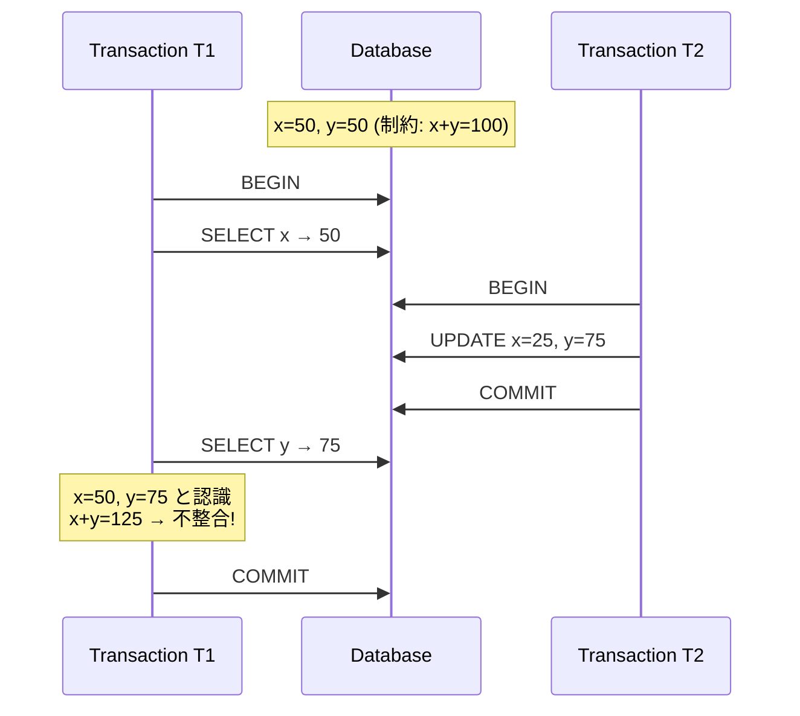

Read Skew は Read Committed では発生しうるが、Repeatable Read 以上や Snapshot Isolation では防止される。

### 2.7 アノマリーの関係と階層

各アノマリーは独立しているわけではなく、相互に関連している。一般に、より厳しい分離レベルはより多くのアノマリーを防止する。

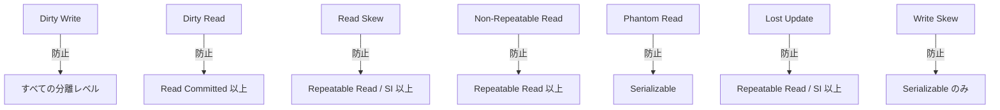

## 3. SQL標準の4分離レベル

### 3.1 概要

ANSI SQL-92 標準は、許容するアノマリーに基づいて4つの分離レベルを定義した。以下の表は、各分離レベルで発生しうるアノマリーを示している。

| 分離レベル | Dirty Read | Non-Repeatable Read | Phantom Read |
|---|---|---|---|
| Read Uncommitted | 発生する | 発生する | 発生する |
| Read Committed | **防止** | 発生する | 発生する |
| Repeatable Read | **防止** | **防止** | 発生する |
| Serializable | **防止** | **防止** | **防止** |

SQL標準はこの3つのアノマリーだけで分離レベルを定義しているが、前述の「A Critique of ANSI SQL Isolation Levels」論文が指摘したように、この定義は不十分である。Lost Update や Write Skew といったアノマリーがこの分類に含まれておらず、Snapshot Isolation のような重要な分離レベルも定義に含まれていない。

### 3.2 Read Uncommitted — 最低限の分離

Read Uncommitted は最も緩い分離レベルである。他のトランザクションがコミットしていないデータ（dirty data）を読み取ることが許される。保証されるのは **Dirty Write の防止** だけである。

```sql
-- Set transaction isolation level
SET TRANSACTION ISOLATION LEVEL READ UNCOMMITTED;

BEGIN;
-- This read may see uncommitted data from other transactions
SELECT balance FROM accounts WHERE id = 1;
COMMIT;
```

**使用場面**: 実用上、Read Uncommitted を意図的に使う場面はほぼない。唯一の例外は、大量データに対する概算的な集計（データの正確さよりも処理速度が重要な場合）である。例えば、テーブルのおおよその行数を取得する場合などが考えられるが、多くのデータベースでは統計情報（pg_stat_user_tables など）から推定行数を取得する方が適切である。

### 3.3 Read Committed — 最も広く使われる分離レベル

Read Committed は、コミット済みのデータのみを読み取ることを保証する分離レベルである。Dirty Read は防止されるが、同一トランザクション内で同じクエリを再実行すると異なる結果が返る可能性がある（Non-Repeatable Read、Phantom Read）。

```sql
SET TRANSACTION ISOLATION LEVEL READ COMMITTED;

BEGIN;
-- Only committed data is visible
SELECT balance FROM accounts WHERE id = 1; -- balance = 1000

-- Another transaction commits an update: balance = 500

SELECT balance FROM accounts WHERE id = 1; -- balance = 500 (non-repeatable read)
COMMIT;
```

**実装方式**: Read Committed の実装は主に2つある。

1. **ロックベース**: 読み取りで取得した共有ロックを即座に解放する（ステートメントの終了時に解放する）。書き込みの排他ロックはトランザクション終了まで保持する
2. **MVCCベース**: 各ステートメントの実行開始時点でのスナップショットを使用する。つまり、ステートメントごとに新しいスナップショットを取得する

[MVCC](/mvcc) を使用するデータベースでは、後者の方式が一般的である。ステートメントの開始時点でコミット済みの最新バージョンを参照するため、実行中に他のトランザクションがコミットした変更は次のステートメントから見えるようになる。

**Read Committed がデフォルトのデータベース**: PostgreSQL、Oracle、SQL Server はいずれも Read Committed をデフォルトの分離レベルとしている。これは、Read Committed が「実用上十分な一貫性」と「良好な並行性」のバランスを提供するためである。

### 3.4 Repeatable Read — 行レベルの一貫性保証

Repeatable Read は、トランザクションの開始時点で読み取った行の値が、トランザクション終了まで変わらないことを保証する分離レベルである。Dirty Read と Non-Repeatable Read は防止されるが、Phantom Read は発生しうる（SQL標準の定義上）。

```sql
SET TRANSACTION ISOLATION LEVEL REPEATABLE READ;

BEGIN;
SELECT balance FROM accounts WHERE id = 1; -- balance = 1000

-- Another transaction commits: UPDATE accounts SET balance = 500 WHERE id = 1

SELECT balance FROM accounts WHERE id = 1; -- balance = 1000 (repeatable!)
COMMIT;
```

**ロックベース実装**: 読み取りで取得した共有ロックをトランザクション終了まで保持する。これにより、読み取った行が他のトランザクションによって更新されることを防ぐ。ただし、新しい行の挿入は共有ロックでは防げないため、Phantom Read が発生しうる。

**MVCCベース実装**: トランザクションの開始時点でスナップショットを取得し、そのスナップショットをトランザクション全体で使い続ける。これにより、Non-Repeatable Read だけでなく Phantom Read も防止される場合がある（実装依存）。

::: warning 注意: MySQL/InnoDB の Repeatable Read
MySQL/InnoDB の REPEATABLE READ は、SQL標準の定義を超えた保証を提供する。MVCC による一貫したスナップショットを使用するため、通常の SELECT（一貫性読み取り）では Phantom Read も発生しない。ただし、`SELECT ... FOR UPDATE` や `SELECT ... FOR SHARE`（ロック読み取り）、および INSERT/UPDATE/DELETE では、**最新のコミット済みデータ** に対して操作が行われるため、ファントムが見える可能性がある。
:::

### 3.5 Serializable — 最も厳密な分離

Serializable は最も強い分離レベルであり、すべてのトランザクションがある直列的な順序で実行された場合と等価な結果を保証する。Dirty Read、Non-Repeatable Read、Phantom Read、Lost Update、Write Skew を含むすべてのアノマリーが防止される。

```sql
SET TRANSACTION ISOLATION LEVEL SERIALIZABLE;

BEGIN;
-- All reads see a consistent snapshot
-- Any conflicting concurrent transactions will be detected and aborted
SELECT COUNT(*) FROM doctors WHERE on_call = true; -- count = 2

UPDATE doctors SET on_call = false WHERE name = 'Alice';
COMMIT;
-- If another transaction committed a conflicting update,
-- this COMMIT will fail with a serialization error
```

**実装方式**: Serializable の実装には主に3つのアプローチがある。

1. **2-Phase Locking（2PL）+ 述語ロック**: 読み取り・書き込みすべてにロックを取得し、トランザクション終了まで保持する。Phantom Read を防ぐために述語ロック（predicate lock）またはインデックスレンジロック（next-key lock）を使用する
2. **Strict Serialization（実際の直列実行）**: トランザクションを文字通り1つずつ順番に実行する。VoltDB や Redis の単一スレッド実行がこのアプローチ。極めてシンプルだが、マルチコアの活用が制限される
3. **Serializable Snapshot Isolation（SSI）**: スナップショットに基づく楽観的な並行実行と、競合検出を組み合わせたアプローチ。PostgreSQL 9.1 以降の Serializable が採用

## 4. Snapshot Isolation（SI）

### 4.1 Snapshot Isolation とは何か

**Snapshot Isolation（SI）** は、SQL標準の4分離レベルには含まれない、しかし実用上極めて重要な分離レベルである。多くの主要データベースが「Repeatable Read」と呼んでいるものの実体は、実際にはこの Snapshot Isolation である。

Snapshot Isolation の定義は以下の2つの規則に集約される。

1. **スナップショット読み取り**: トランザクション開始時のスナップショットを使い、トランザクション全体でそのスナップショットからデータを読む。他のトランザクションがコミットした変更は見えない
2. **First-Committer-Wins ルール**: 2つのトランザクションが同じデータを更新しようとした場合、先にコミットした方が勝ち、後からコミットしようとした方はアボートされる

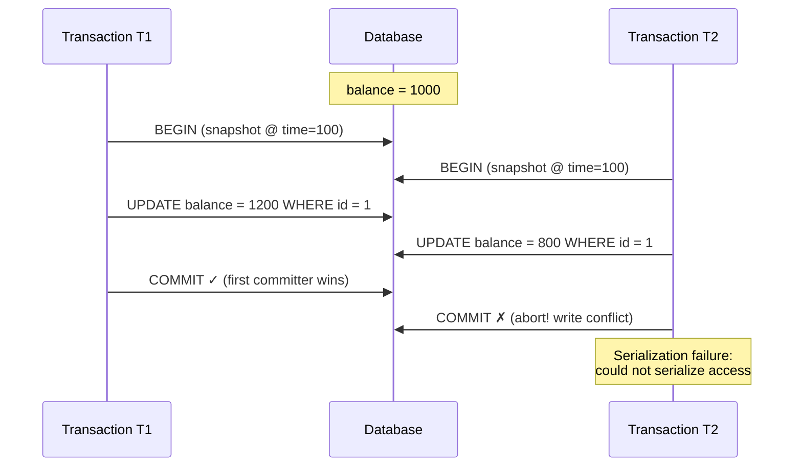

### 4.2 Snapshot Isolation が防ぐアノマリー

Snapshot Isolation は以下のアノマリーを防止する。

- **Dirty Read**: スナップショットにはコミット済みデータのみが含まれる
- **Non-Repeatable Read**: トランザクション全体で同一のスナップショットを使用する
- **Phantom Read**: スナップショットは固定されているため、新しい行の挿入も見えない
- **Lost Update**: First-Committer-Wins ルールにより、同じデータへの同時更新は後からのコミットをアボートする
- **Read Skew**: 一貫したスナップショットにより防止される

### 4.3 Snapshot Isolation で防げないアノマリー — Write Skew

Snapshot Isolation の最大の弱点は **Write Skew** を防止できないことである。前述の当直医の例を Snapshot Isolation の文脈で詳しく見てみよう。

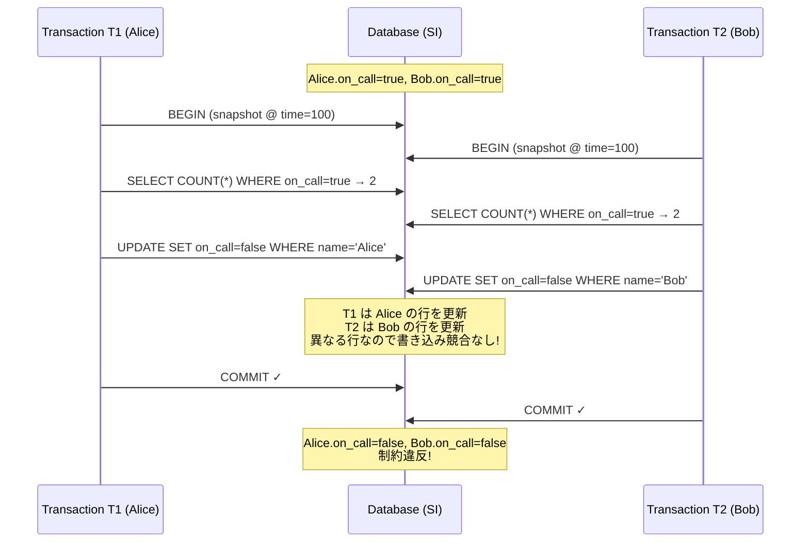

Write Skew が Snapshot Isolation で防げない根本的な理由は、**First-Committer-Wins ルールが同じデータへの書き込み競合のみを検出する**からである。Write Skew では、T1 と T2 が更新する行は異なる（Alice の行と Bob の行）。そのため、書き込み競合は検出されず、両方のトランザクションが成功してしまう。

Write Skew が実務で問題になるパターンはいくつかある。

- **座席予約**: 残り1席のイベントに2つのトランザクションが同時に予約を試みる
- **在庫管理**: 残り1個の商品に2つの注文が同時に入る
- **ユーザー名の一意性**: アプリケーションレベルで一意性チェックを行う場合

### 4.4 Write Skew への対策（SI環境下）

Snapshot Isolation 環境で Write Skew を防ぐには、アプリケーション側でいくつかの対策が必要になる。

**1. SELECT FOR UPDATE による明示的なロック取得**:

```sql
BEGIN;
-- Acquire row-level locks explicitly
SELECT * FROM doctors WHERE on_call = true FOR UPDATE;
-- Now other transactions trying to update these rows will block
UPDATE doctors SET on_call = false WHERE name = 'Alice';
COMMIT;
```

`SELECT ... FOR UPDATE` は、読み取った行に対して排他ロックを取得するため、もう一方のトランザクションは同じ行を `FOR UPDATE` で読み取ろうとした時点でブロックされる。ただし、この方法は適切なロック対象が存在する場合にのみ有効であり、「存在しない行」に対するロックは取得できない。

**2. マテリアライズドコンフリクト（衝突の具体化）**:

Write Skew の問題は「ロックすべき具体的な行が存在しない」場合に生じることが多い。この場合、**衝突を検出するための専用テーブル** を用意するという手法がある。

```sql
-- Create a materialized conflict table
CREATE TABLE shift_slots (
    date DATE PRIMARY KEY,
    -- dummy row to serve as a lock target
    version INT DEFAULT 0
);

BEGIN;
-- Lock the conflict row
SELECT * FROM shift_slots WHERE date = '2026-03-01' FOR UPDATE;
-- Proceed with the actual check and update
SELECT COUNT(*) FROM doctors WHERE on_call = true AND date = '2026-03-01';
UPDATE doctors SET on_call = false WHERE name = 'Alice' AND date = '2026-03-01';
COMMIT;
```

**3. Serializable 分離レベルの使用**:

最も確実な対策は、Serializable 分離レベルを使用することである。特に、PostgreSQL の SSI（後述）を使えば、Write Skew はデータベースが自動的に検出してくれる。

## 5. Serializable Snapshot Isolation（SSI）

### 5.1 SSI の動機

Serializable の従来の実装（2PL）は、読み取りと書き込みが互いにブロックし合うため、並行性能が大きく低下する。一方、Snapshot Isolation は高い並行性能を持つが、Write Skew を防げない。

**Serializable Snapshot Isolation（SSI）** は、この2つの問題を解決するために提案されたアプローチである。2008年に Michael Cahill、Uwe Rohm、Alan Fekete の論文「Serializable Isolation for Snapshot Databases」で提案され、PostgreSQL 9.1（2011年）で世界初の主要データベースへの実装が行われた。

SSI の基本的なアイデアは以下のとおりである。

1. Snapshot Isolation をベースとして、楽観的にトランザクションを実行する（読み取りはブロックしない）
2. 実行中の読み取りと書き込みの依存関係を追跡する
3. 直列化可能性を破壊する可能性のある依存パターンを検出したら、トランザクションをアボートする

### 5.2 SSI の理論的背景 — 危険な構造

SSI が検出する「危険なパターン」は、直列化可能性の理論に基づいている。

**直列化グラフ（Serialization Graph）** とは、トランザクション間の依存関係を有向グラフで表現したものである。ノードはトランザクション、エッジは依存関係（wr: write-read、rw: read-write、ww: write-write）を表す。このグラフに **循環（cycle）** が存在する場合、そのスケジュールは直列化可能ではない。

Snapshot Isolation では、ww 依存と wr 依存による循環は発生しない（First-Committer-Wins ルールとスナップショット読み取りにより）。したがって、Snapshot Isolation で発生しうる循環には必ず **rw-anti-dependency（読み取り-書き込み反依存）** が含まれる。

さらに研究により、Snapshot Isolation 上での直列化不可能なスケジュールには、必ず **連続する2つの rw-anti-dependency** が含まれることが証明された。これを **dangerous structure（危険な構造）** と呼ぶ。

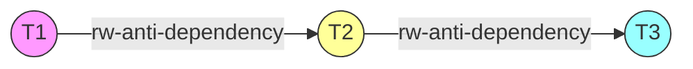

ここで T2 が「ピボット」と呼ばれ、T2 は T1 に対する rw-anti-dependency の対象であると同時に、T3 に対する rw-anti-dependency の起点でもある。SSI は、このパターンを検出したとき、関与するトランザクションの1つをアボートする。

### 5.3 SSI の動作例

当直医の Write Skew の例を SSI で見てみよう。

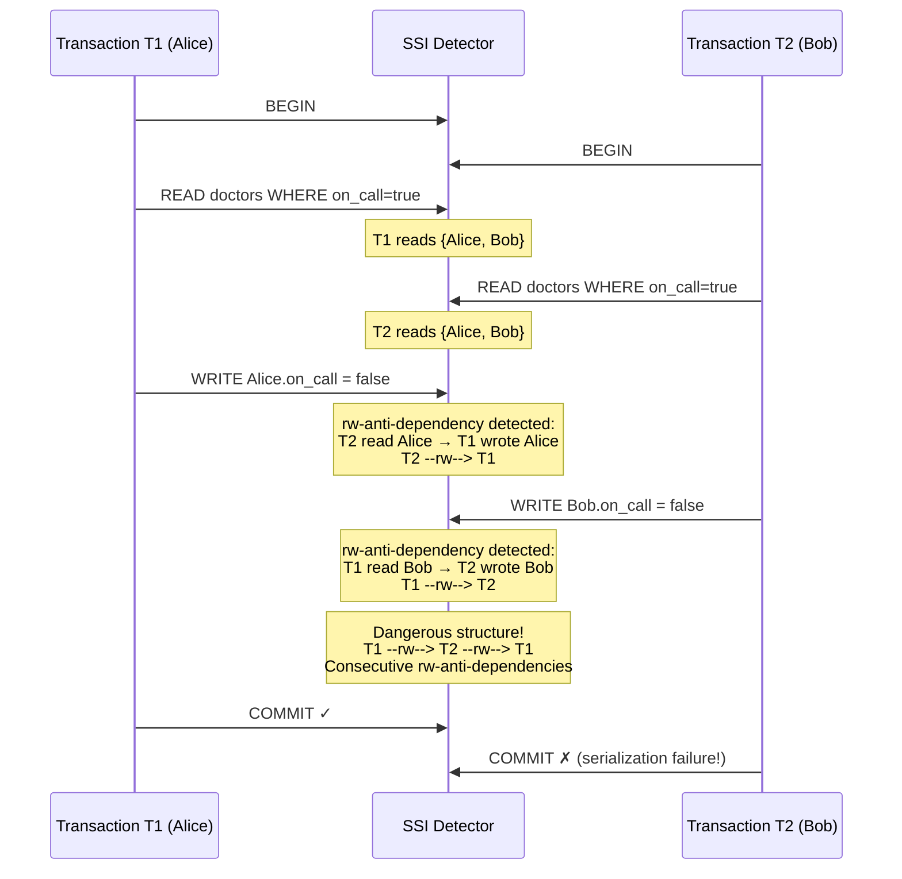

SSI は以下の依存関係を検出する。

- T2 が読み取った Alice の行を T1 が更新 → T2 → T1 の rw-anti-dependency
- T1 が読み取った Bob の行を T2 が更新 → T1 → T2 の rw-anti-dependency

これは連続する rw-anti-dependency であり、危険な構造が形成される。SSI はこれを検出し、後からコミットしようとする T2 をアボートする。

### 5.4 SSI の性能特性

SSI の大きな利点は以下のとおりである。

1. **読み取りはブロックしない**: Snapshot Isolation と同様に、読み取りトランザクションは書き込みトランザクションをブロックしない
2. **楽観的な実行**: 競合がない場合のオーバーヘッドは小さい
3. **偽陽性はあるが偽陰性はない**: SSI は危険な構造を検出すると「念のため」アボートする。実際にはアノマリーが発生しなかった場合でもアボートする可能性がある（偽陽性）が、アノマリーを見逃すこと（偽陰性）はない

欠点としては、以下がある。

1. **アボート率**: 競合が多い環境では、偽陽性を含むアボートが増え、パフォーマンスが低下する可能性がある
2. **追跡のオーバーヘッド**: 読み取りの追跡（SIREAD ロック）にメモリと CPU のコストがかかる
3. **長時間トランザクション**: 長時間実行されるトランザクションは多くの rw-anti-dependency を生み出し、アボート率が高くなる傾向がある

## 6. 各データベースの実装

### 6.1 PostgreSQL

PostgreSQL は分離レベルの実装において最も「正直」なデータベースの1つである。

| 指定する分離レベル | 実際の動作 |
|---|---|
| Read Uncommitted | Read Committed として動作（PostgreSQL は Dirty Read を許容しない）|
| Read Committed | ステートメントごとのスナップショット |
| Repeatable Read | Snapshot Isolation（トランザクション全体で同一スナップショット）|
| Serializable | Serializable Snapshot Isolation（SSI）|

PostgreSQL の特筆すべき点は以下である。

- **Read Uncommitted を指定しても Read Committed として動作する**: MVCC ベースの実装では、コミット前のデータを見せる方がかえって実装が複雑になるため、あえて Dirty Read を許容しない設計となっている
- **Repeatable Read は Snapshot Isolation**: SQL標準の Repeatable Read よりも強い保証を提供する。Phantom Read も通常は発生しない
- **Serializable は SSI**: 2PL ではなく SSI を使用するため、読み取りがブロックしない。ただし、直列化不可能なパターンが検出されると `serialization_failure`（SQLSTATE 40001）が発生する

```sql
-- PostgreSQL: SSI in action
SET TRANSACTION ISOLATION LEVEL SERIALIZABLE;

BEGIN;
SELECT * FROM doctors WHERE on_call = true;
-- If a concurrent transaction creates a write skew,
-- PostgreSQL will detect it and raise:
-- ERROR: could not serialize access due to read/write dependencies
-- among transactions
-- HINT: The transaction might succeed if retried.
COMMIT;
```

::: tip PostgreSQL の Serializable を使う際の注意点
PostgreSQL の Serializable は楽観的な方式であるため、`serialization_failure` が発生した場合にトランザクションをリトライするロジックをアプリケーション側に実装する必要がある。リトライは新しいトランザクションとして実行し、データの再読み取りから行う必要がある。
:::

### 6.2 MySQL/InnoDB

MySQL の InnoDB ストレージエンジンは、MVCC とロックの組み合わせにより分離レベルを実装する。

| 指定する分離レベル | 実際の動作 |
|---|---|
| Read Uncommitted | Dirty Read を許容（MVCC の最新未コミットバージョンを読む）|
| Read Committed | ステートメントごとのスナップショット |
| Repeatable Read | トランザクション全体で同一スナップショット + next-key lock |
| Serializable | すべての読み取りが暗黙的に `SELECT ... FOR SHARE` になる |

MySQL/InnoDB の特徴的な点は以下である。

- **デフォルトが Repeatable Read**: PostgreSQL や Oracle と異なり、MySQL は Repeatable Read をデフォルトとしている
- **Repeatable Read で next-key lock を使用**: ロック読み取り（`SELECT ... FOR UPDATE/FOR SHARE`）および UPDATE/DELETE では、**next-key lock**（レコードロック + ギャップロック）を使用して Phantom Read を防止する。ただし、通常の SELECT（一貫性読み取り/consistent read）はスナップショットを使用するためロックを取得しない
- **Serializable はロックベース**: PostgreSQL の SSI とは異なり、MySQL の Serializable はすべての SELECT を自動的にロック読み取りに変換する。これは実質的に厳密な2PL に近い動作であり、並行性能は大きく低下する

```sql
-- MySQL/InnoDB: next-key lock behavior at REPEATABLE READ
SET TRANSACTION ISOLATION LEVEL REPEATABLE READ;

BEGIN;
-- Consistent read (no lock): sees snapshot
SELECT * FROM accounts WHERE balance > 500;

-- Locking read: acquires next-key locks
SELECT * FROM accounts WHERE balance > 500 FOR UPDATE;
-- This prevents other transactions from inserting rows
-- with balance > 500 (gap lock prevents phantom inserts)
COMMIT;
```

::: warning MySQL Repeatable Read と Write Skew
MySQL の Repeatable Read は Snapshot Isolation に近い動作をするため、Write Skew が発生しうる。MySQL には PostgreSQL のような SSI がないため、Write Skew を防ぐには `SELECT ... FOR UPDATE` による明示的なロックか、Serializable 分離レベルの使用が必要になる。ただし、MySQL の Serializable はロックベースであるため、並行性能のペナルティが大きい。
:::

### 6.3 Oracle Database

Oracle の分離レベルは、その歴史的経緯もあって独特な特徴を持つ。

| 指定する分離レベル | 実際の動作 |
|---|---|
| Read Committed | ステートメントごとのスナップショット |
| Serializable | Snapshot Isolation |

Oracle の注目すべき点は以下である。

- **Read Uncommitted と Repeatable Read をサポートしない**: Oracle は2つの分離レベルのみを提供する
- **Serializable と呼んでいるものの実体は Snapshot Isolation**: Oracle の「Serializable」は Write Skew を防止しない。これは長年にわたる議論の対象であった。Oracle は First-Committer-Wins ルールにより Lost Update は防止するが、Write Skew は検出しない
- **Undo セグメント方式**: Oracle は MVCC をundo セグメント（ロールバックセグメント）を使って実装する。旧バージョンのデータはundo領域に保持され、一貫性読み取りが必要なトランザクションはundo領域から旧バージョンを再構築する

```
Oracle の分離レベルマッピング:

SQL標準          Oracle の実装
─────────────────────────────────────
Read Uncommitted   → (未サポート)
Read Committed     → ステートメントレベルSI
Repeatable Read    → (未サポート)
Serializable       → Snapshot Isolation
                     (真の Serializable ではない)
```

::: danger Oracle の「Serializable」は真の Serializable ではない
Oracle が「SERIALIZABLE」と呼んでいるものは実際には Snapshot Isolation であり、Write Skew を防止しない。Write Skew が問題になるアプリケーションでは、`SELECT ... FOR UPDATE` を使って明示的にロックを取得する必要がある。
:::

### 6.4 SQL Server

SQL Server は、ロックベースとスナップショットベースの両方の分離レベルを提供する点で独特である。

| 指定する分離レベル | 実際の動作 |
|---|---|
| Read Uncommitted | Dirty Read を許容 / `NOLOCK` ヒント |
| Read Committed | ロックベース（デフォルト）またはスナップショットベース（RCSI）|
| Repeatable Read | ロックベース（共有ロックをトランザクション終了まで保持）|
| Snapshot | Snapshot Isolation（SQL標準にない追加レベル）|
| Serializable | ロックベース（キーレンジロックを使用）|

SQL Server の特徴的な点は以下である。

- **Read Committed Snapshot Isolation（RCSI）**: データベースオプション `READ_COMMITTED_SNAPSHOT ON` を設定すると、Read Committed がスナップショットベースの実装に切り替わる。ロックベースの場合は読み取りがブロックされるが、RCSI ではブロックされない
- **Snapshot 分離レベル**: SQL標準の4分離レベルに加えて、明示的な Snapshot 分離レベルを提供する
- **Serializable はロックベース**: MySQL と同様に、Serializable はロックベースの実装である。キーレンジロックを使用して Phantom Read を防止する

```sql
-- SQL Server: Enable Read Committed Snapshot Isolation
ALTER DATABASE MyDatabase SET READ_COMMITTED_SNAPSHOT ON;

-- SQL Server: Use Snapshot isolation
ALTER DATABASE MyDatabase SET ALLOW_SNAPSHOT_ISOLATION ON;
SET TRANSACTION ISOLATION LEVEL SNAPSHOT;
BEGIN TRANSACTION;
SELECT * FROM accounts WHERE id = 1;
COMMIT;
```

### 6.5 各データベースの比較表

| 特性 | PostgreSQL | MySQL/InnoDB | Oracle | SQL Server |
|---|---|---|---|---|
| デフォルト分離レベル | Read Committed | Repeatable Read | Read Committed | Read Committed |
| MVCC方式 | Heap内マルチバージョン | Undo Log | Undo Segment | tempdb版ストア |
| Serializable実装 | SSI（楽観的）| ロックベース | SI（不完全）| ロックベース |
| Write Skew防止 | Serializable | FOR UPDATE必要 | FOR UPDATE必要 | ロック必要 |
| Phantom防止（RR）| あり（SI） | 部分的（next-key lock）| N/A | なし（ロック） |

## 7. 分離レベルの選択指針

### 7.1 選択のフレームワーク

分離レベルの選択は、以下の3つの軸で考えるとよい。

**1. データの一貫性要件**

- **金融取引、在庫管理**: 高い一貫性が必要 → Serializable または Repeatable Read + 明示的ロック
- **レポート生成、分析クエリ**: 一貫したスナップショットがあればよい → Repeatable Read / Snapshot Isolation
- **一般的な Web アプリケーション**: Read Committed で十分な場合が多い

**2. ワークロードの特性**

- **読み取り主体**: 分離レベルの影響は比較的小さい。MVCC ベースの実装では、読み取りはどの分離レベルでもブロックされない
- **書き込み競合が多い**: 高い分離レベルでは、アボートやロック待ちが増加する。アプリケーション側のリトライロジックが必要
- **長時間トランザクション**: 高い分離レベルではリソース保持期間が長くなり、競合が増える

**3. データベースの実装特性**

各データベースの「同じ名前の分離レベル」が異なる動作をすることを理解した上で選択する必要がある。

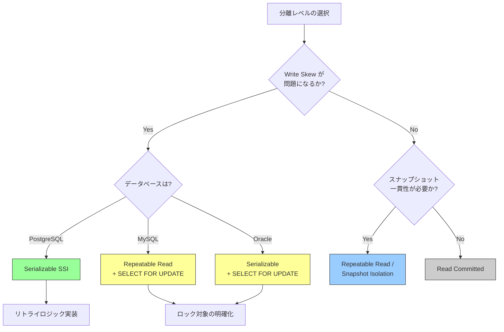

### 7.2 一般的な推奨事項

**Read Committed を使う場合（多くのアプリケーション）**:

- 個々の SQL ステートメントが一貫したデータを読み取れれば十分な場合
- 同一トランザクション内で読み取りの一貫性が不要な場合
- PostgreSQL、Oracle、SQL Server のデフォルトであり、最もテストされた分離レベル

**Repeatable Read / Snapshot Isolation を使う場合**:

- トランザクション内で一貫したスナップショットが必要な場合（例: レポート生成）
- Lost Update を防ぎたい場合
- MySQL のデフォルトであり、MySQL ではこの分離レベルが最もよくテストされている

**Serializable を使う場合**:

- Write Skew が問題になるドメインロジックがある場合
- データの正確性が性能よりも重要な場合
- PostgreSQL の SSI を使用する場合は、リトライロジックの実装が必須

### 7.3 実務上のベストプラクティス

**1. デフォルトの分離レベルを安易に変更しない**:

各データベースのデフォルト分離レベルは、そのデータベースの実装に最適化されている。グローバルに分離レベルを変更するよりも、特に高い一貫性が必要なトランザクションだけを個別に昇格させるアプローチが望ましい。

```sql
-- Only elevate isolation level for critical transactions
BEGIN;
SET TRANSACTION ISOLATION LEVEL SERIALIZABLE;
-- critical business logic here
COMMIT;
```

**2. `SELECT ... FOR UPDATE` を適切に使う**:

Read-Modify-Write パターンでは、読み取り時点で排他ロックを取得することで、Lost Update と Write Skew の両方を防止できる。ただし、ロック取得範囲を最小限にすることが重要である。

**3. リトライロジックを実装する**:

楽観的な分離レベル（Snapshot Isolation や SSI）を使用する場合、直列化エラーによるアボートが発生しうる。アプリケーションは以下のようなリトライロジックを実装する必要がある。

```python
# Retry logic for serialization failures
import psycopg2
import time

MAX_RETRIES = 3
RETRY_DELAY = 0.1  # seconds

def execute_with_retry(conn, operation):
    for attempt in range(MAX_RETRIES):
        try:
            with conn.cursor() as cur:
                cur.execute("SET TRANSACTION ISOLATION LEVEL SERIALIZABLE")
                cur.execute("BEGIN")
                operation(cur)
                cur.execute("COMMIT")
                return  # success
        except psycopg2.errors.SerializationFailure:
            conn.rollback()
            if attempt < MAX_RETRIES - 1:
                # Exponential backoff with jitter
                delay = RETRY_DELAY * (2 ** attempt)
                time.sleep(delay)
            else:
                raise  # all retries exhausted
```

**4. トランザクションを短く保つ**:

どの分離レベルを使用する場合でも、トランザクションの持続時間を短くすることが重要である。長時間トランザクションは以下の問題を引き起こす。

- ロックベース: 他のトランザクションの待ち時間が長くなる
- MVCC: 古いバージョンの保持が必要になり、vacuum 効率が低下する（PostgreSQL）
- SSI: rw-anti-dependency の追跡に必要なメモリが増大する

## 8. ベンチマークと性能影響

### 8.1 分離レベルと性能の関係

分離レベルによる性能への影響は、ワークロードの特性に大きく依存する。以下に一般的な傾向を示す。

**読み取り主体のワークロード（OLTP読み取り比率 90%以上）**:

MVCC ベースのデータベースでは、Read Committed と Repeatable Read の性能差はほぼない。いずれもスナップショットベースの読み取りを使用し、ロックを取得しないためである。Serializable（SSI）でも追加のオーバーヘッドは小さい（SIREAD ロックの管理コスト程度）。

```
ワークロード: 95% SELECT, 5% UPDATE
トランザクション/秒 (概算的な相対値):

Read Committed:    ████████████████████████ 100%
Repeatable Read:   ███████████████████████  97%
Serializable(SSI): ██████████████████████   93%
Serializable(2PL): ████████████████         68%
```

**書き込み競合が多いワークロード**:

書き込み競合が多い場合、分離レベルの影響が顕著になる。SSI ではアボート率が上昇し、2PL ではロック待ちによるスループット低下が発生する。

```
ワークロード: 50% SELECT, 50% UPDATE（高競合）
トランザクション/秒 (概算的な相対値):

Read Committed:    ████████████████████████ 100%
Repeatable Read:   ██████████████████████   90%
Serializable(SSI): ██████████████           58% (abort + retry含む)
Serializable(2PL): ████████████             50%
```

### 8.2 性能影響の要因分析

分離レベルが性能に影響を与える主な要因は以下のとおりである。

**1. ロック保持時間**:

| 分離レベル | 共有ロック保持 | 排他ロック保持 |
|---|---|---|
| Read Committed | ステートメント終了まで | トランザクション終了まで |
| Repeatable Read | トランザクション終了まで | トランザクション終了まで |
| Serializable (2PL) | トランザクション終了まで + 述語ロック | トランザクション終了まで |

ロック保持時間が長いほど、他のトランザクションの待ち時間が増加する。

**2. アボート率とリトライコスト**:

SSI や Snapshot Isolation では、競合が検出された場合にトランザクションがアボートされる。アボートされたトランザクションは最初からやり直す必要があるため、実効的なスループットが低下する。

アボート率はワークロードに強く依存する。

- **競合がほとんどない場合**: アボート率 < 1% → SSI のオーバーヘッドは無視できる
- **中程度の競合**: アボート率 5-15% → リトライの影響が顕著になり始める
- **高い競合**: アボート率 30%以上 → SSI よりもロックベースの Serializable やアプリケーションレベルのロックが適切な場合がある

**3. MVCC のガベージコレクション（Vacuum）コスト**:

高い分離レベル（特に長時間の Repeatable Read や Serializable トランザクション）は、古いバージョンのデータの保持を長引かせる。PostgreSQL では vacuum が遅延し、テーブルの肥大化（bloat）が発生しうる。

### 8.3 ベンチマーク手法

分離レベルの性能を測定するには、以下のようなベンチマークツールが利用できる。

**pgbench（PostgreSQL 標準ベンチマークツール）**:

```bash
# Initialize the benchmark database
pgbench -i -s 10 testdb

# Run benchmark at Read Committed
pgbench -c 16 -j 4 -T 60 testdb

# Run benchmark at Serializable
pgbench -c 16 -j 4 -T 60 -f script_serializable.sql testdb
```

**sysbench（汎用ベンチマーク）**:

```bash
# OLTP read-write benchmark at different isolation levels
sysbench oltp_read_write \
  --mysql-db=testdb \
  --tables=10 \
  --table-size=100000 \
  --threads=16 \
  --time=60 \
  --mysql-isolation-level=REPEATABLE-READ \
  run
```

### 8.4 測定時の注意点

ベンチマークを行う際には、以下の点に注意する必要がある。

1. **ワークロードの代表性**: 実際のアプリケーションのワークロードに近い条件で測定する。均一な読み書きパターンではなく、ホットスポット（競合が集中するデータ）を含めた現実的なパターンを使用する

2. **リトライの影響**: SSI や SI でのベンチマークでは、アボートされたトランザクションのリトライを含めた全体の処理時間を測定する必要がある。リトライを除外した数値は実際の性能を反映しない

3. **定常状態での測定**: ウォームアップ期間を設け、キャッシュやバッファプールが定常状態に達してから測定を開始する

4. **テイルレイテンシの確認**: 平均値だけでなく、p95 や p99 のレイテンシを確認する。高い分離レベルでは、テイルレイテンシが大幅に増加する可能性がある

## 9. まとめ — 分離レベルの正しい理解

### 9.1 重要なポイントの整理

本記事で述べた内容を整理する。

**1. 分離レベルは「何を許容するか」の定義**: 分離レベルとは、並行性と一貫性のトレードオフにおいて「どのアノマリーを許容するか」を明示的に選択する仕組みである。

**2. SQL標準の定義は不完全**: SQL-92 が定義した3つのアノマリー（Dirty Read、Non-Repeatable Read、Phantom Read）だけでは、Snapshot Isolation や Write Skew のような重要な概念を捉えきれない。

**3. 「同じ名前でも異なる動作」が常態**: データベースごとに同じ分離レベル名でも実装が異なる。特に以下の違いは重要である。

- PostgreSQL の Repeatable Read は Snapshot Isolation
- Oracle の Serializable は Snapshot Isolation（真の Serializable ではない）
- MySQL の Serializable はロックベース、PostgreSQL の Serializable は SSI

**4. Snapshot Isolation は強力だが万能ではない**: SI は Read Committed よりも強い保証を提供し、読み取りをブロックしないという優れた性能特性を持つ。しかし、Write Skew を防止できないという根本的な限界がある。

**5. SSI は理論と実践を橋渡しする**: PostgreSQL の SSI は、高い並行性能と真の Serializable を両立する画期的な実装である。ただし、リトライロジックの実装が必要であり、高競合環境ではアボート率の増加に注意が必要である。

### 9.2 さらなる学習のために

分離レベルをより深く理解するためには、以下の文献が参考になる。

- **「A Critique of ANSI SQL Isolation Levels」（Berenson et al., 1995）**: SQL標準の分離レベル定義の問題点を指摘し、Snapshot Isolation を含む拡張された分類を提案した決定的な論文
- **「Serializable Isolation for Snapshot Databases」（Cahill et al., 2008）**: SSI の理論的基礎と実装を示した論文
- **「Designing Data-Intensive Applications」（Martin Kleppmann, 2017）**: 分離レベルを含む分散データシステムの包括的な解説書。第7章「Transactions」が特に関連が深い
- **PostgreSQL のドキュメント「13.2. Transaction Isolation」**: 実装の詳細が丁寧に説明されている

分離レベルは、データベースアプリケーションの正確性を保証するための基本的な知識であり、使用するデータベースの実装の詳細まで理解した上で適切に選択することが重要である。
