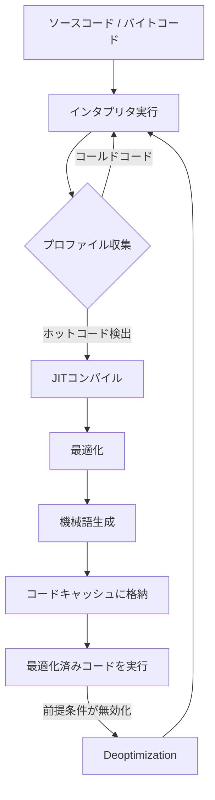
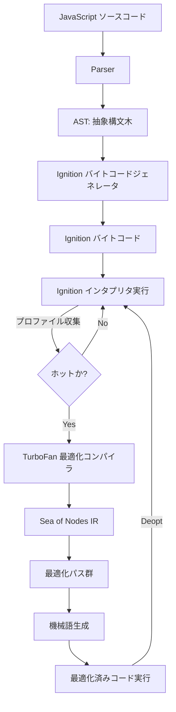
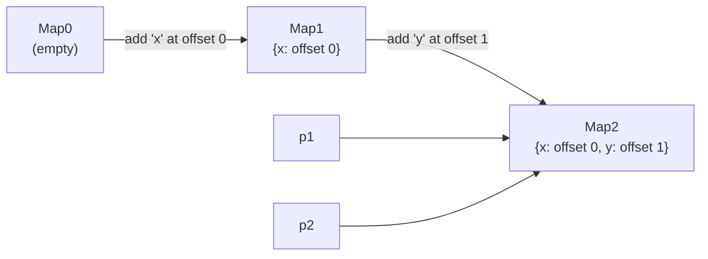
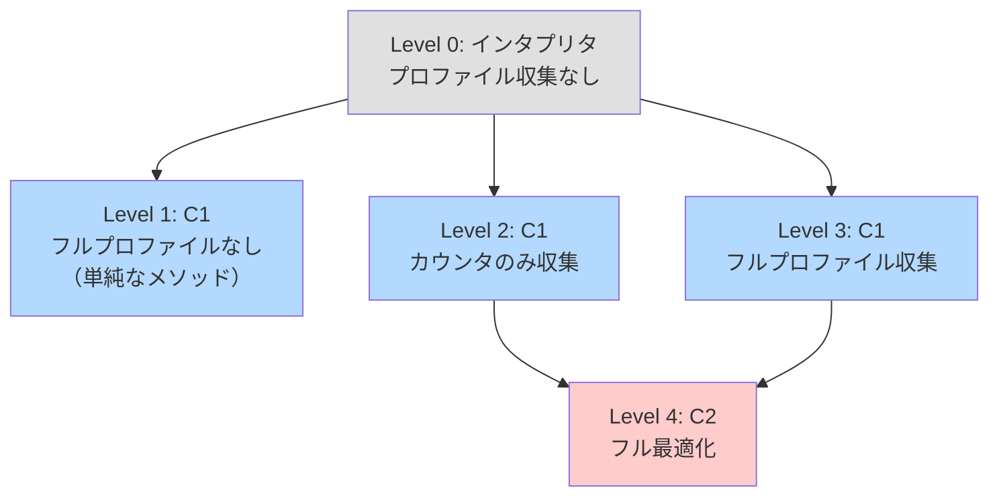
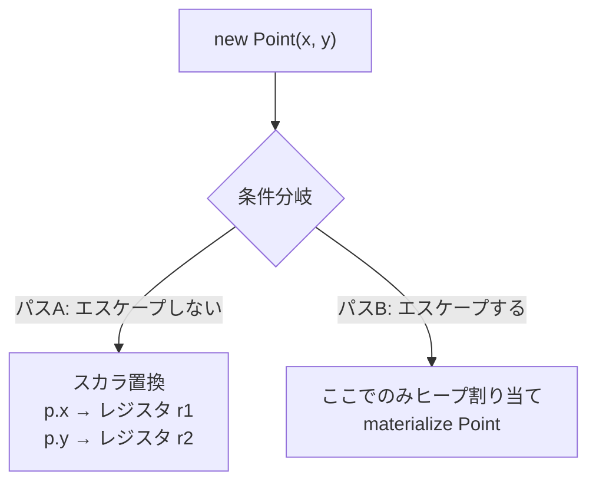
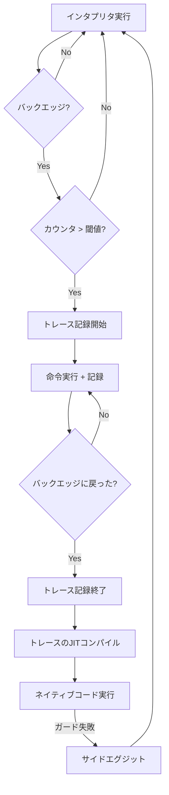
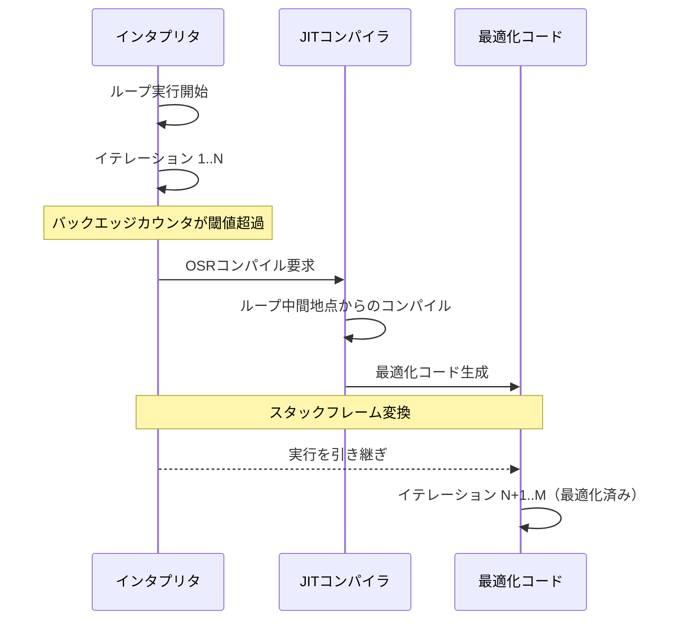
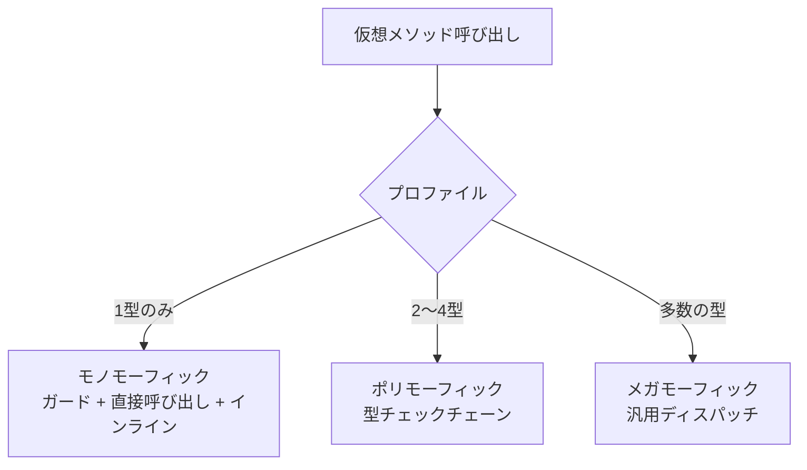
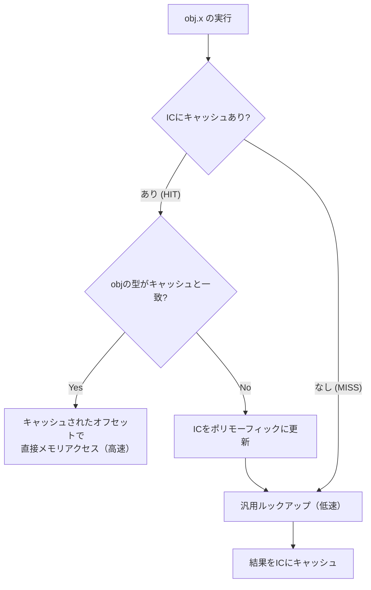
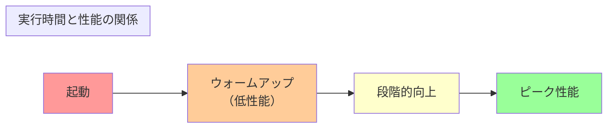

# JITコンパイル

## 1. JITコンパイルとは — 実行時に最適化するという発想

### 1.1 コンパイルの二つのタイミング

プログラミング言語の実装において、ソースコードを機械語に変換するタイミングは大きく二つに分けられる。一つは**事前コンパイル（Ahead-of-Time Compilation, AOT）** で、プログラムを実行する前にすべてのコードを機械語に変換する方式である。C、C++、Rust、Goなどがこの方式を採用している。もう一つが**実行時コンパイル（Just-In-Time Compilation, JIT）** で、プログラムの実行中に必要なコードを動的に機械語へ変換する方式である。

JITコンパイルの核心的なアイデアは、「実行時にしか得られない情報を活用して、より高度な最適化を行う」ということにある。AOTコンパイラは、プログラムが実際にどのようなデータを処理するか、どの分岐が頻繁に通るか、どの関数が何回呼ばれるかを知らない。JITコンパイラはこれらの情報を実行プロファイルとして収集し、「ホットな」コードに対して積極的な最適化を適用できる。

### 1.2 歴史的背景

JITコンパイルの概念は決して新しいものではない。1960年代、John McCarthyのLisp実装において既に実行時コンパイルに近い技法が用いられていた。1984年には、Peter DeutschらがsmalltalK-80の実装でJITコンパイルの基礎となる動的変換技法を実用化した。

しかし、JITコンパイルが本格的に注目されるようになったのは1990年代後半のJavaの登場以降である。Javaの「Write Once, Run Anywhere」という理念は、中間表現（バイトコード）を各プラットフォーム上のJVM（Java Virtual Machine）が実行するというモデルに基づいていた。当初、バイトコードインタプリタの性能は低く、「Javaは遅い」という評判が定着したが、JITコンパイラの成熟とともにその性能はネイティブコードに迫るまでに向上した。

1999年にSun Microsystemsがリリースした**HotSpot VM**は、プロファイリング駆動のJITコンパイルを本格的に実装し、Javaの性能を劇的に改善した。2008年にはGoogleが**V8**エンジンをリリースし、JavaScriptの性能を桁違いに向上させた。さらにMike Pallの**LuaJIT**は、小規模なコードベースながら驚異的な性能を達成し、トレーシングJITの威力を世に知らしめた。

### 1.3 JITコンパイルの基本メカニズム

JITコンパイラの一般的な動作フローは以下のようになる。



1. プログラムはまずインタプリタ（またはベースラインコンパイラ）によって実行される
2. 実行中にプロファイル情報（関数の呼び出し回数、型情報、分岐頻度など）が収集される
3. 「ホットスポット」— 頻繁に実行されるコード — が検出されると、JITコンパイラが起動する
4. 収集したプロファイル情報を基に、積極的な最適化を施した機械語が生成される
5. 以後、そのコードはコンパイル済みの機械語として高速に実行される
6. 最適化の前提が崩れた場合は、deoptimizationによりインタプリタ実行に戻る

## 2. AOTコンパイルとの比較

JITコンパイルとAOTコンパイルは対立する概念ではなく、それぞれ異なるトレードオフを持つ技法である。両者の特性を正しく理解することが、言語実装やシステム設計における適切な選択につながる。

### 2.1 比較表

| 観点 | AOTコンパイル | JITコンパイル |
|------|-------------|-------------|
| コンパイルタイミング | 実行前（ビルド時） | 実行中 |
| 起動速度 | 高速（即座に実行可能） | 低速（warmupが必要） |
| ピーク性能 | 静的に推論可能な範囲で最適化 | プロファイル情報による高度な最適化が可能 |
| メモリ使用量 | コンパイラをメモリに保持しない | コンパイラ + コードキャッシュ分が追加 |
| 配布物サイズ | プラットフォーム固有のバイナリ | バイトコード（プラットフォーム非依存） |
| 動的言語への適性 | 低い（型が静的に決まらない） | 高い（実行時の型情報を活用可能） |
| コード保護 | 機械語のみ配布可能 | バイトコードのリバースエンジニアリングが容易 |

### 2.2 AOTの強み

AOTコンパイルの最大の利点は**起動速度**と**予測可能な性能**である。コンパイルは事前に完了しているため、プログラムは即座に最適な速度で動作を開始する。これは、コマンドラインツール、組み込みシステム、リアルタイムシステムなど、起動時間やレイテンシの予測可能性が重要な場面で大きな強みとなる。

また、AOTコンパイラは時間制約なくプログラム全体を分析できるため、**プログラム全体最適化（Whole Program Optimization, WPO）** やリンク時最適化（Link-Time Optimization, LTO）といった大域的な最適化を適用しやすい。GCCの `-flto` やLLVMの ThinLTO はその代表例である。

### 2.3 JITの強み

一方、JITコンパイルが真に威力を発揮するのは、以下のようなケースである。

**動的言語の最適化**：JavaScriptやPythonのような動的型付け言語では、変数の型が実行時まで確定しない。AOTコンパイラはあらゆる型の組み合わせに対応するジェネリックなコードを生成せざるを得ないが、JITコンパイラは「この関数は実際には常に整数を受け取っている」といった実行時の情報を基に、特殊化（specialization）されたコードを生成できる。

**プロファイル駆動の最適化**：どの分岐が頻繁に取られるか、どの仮想メソッドが実際に呼ばれるかは、実行時にしかわからない。JITコンパイラはこの情報を直接活用して、分岐予測の最適化、インライン展開の判断、ループの最適化などを行える。

**適応的最適化**：プログラムの振る舞いは時間とともに変化することがある。JITコンパイラは新しいプロファイル情報に基づいてコードを再コンパイルし、常に最適な状態を維持できる。

### 2.4 ハイブリッドアプローチ

近年は、AOTとJITを組み合わせたハイブリッドアプローチも増えている。GraalVMの`native-image`はJavaプログラムをAOTコンパイルして起動速度を改善する。.NETのReadyToRun（R2R）は事前コンパイル済みコードを用意しつつ、実行時にJITで再最適化する。AndroidのARTランタイムは、インストール時にAOTコンパイルを行いつつ、プロファイル情報を収集して後続の再コンパイルに活用するProfile-Guided Optimization（PGO）を実装している。

## 3. V8のパイプライン — Ignition + TurboFan

### 3.1 V8の概要

V8はGoogleが開発したJavaScriptエンジンであり、Chrome（およびChromium系ブラウザ）とNode.jsの心臓部を成している。2008年の初リリース以来、V8はJavaScriptの性能を飛躍的に向上させ、ブラウザ上でリッチなアプリケーションを動作させることを現実的にした。

V8の現在のアーキテクチャは、**Ignition**（バイトコードインタプリタ）と**TurboFan**（最適化コンパイラ）の二層構成である。かつてはFull-codegen（ベースラインコンパイラ）とCrankshaft（最適化コンパイラ）という構成だったが、2017年にIgnition + TurboFanに全面移行した。

### 3.2 パイプラインの全体像



### 3.3 Ignition — バイトコードインタプリタ

Ignitionは、JavaScriptのASTからV8独自の**バイトコード**を生成し、それをレジスタベースのインタプリタで実行する。Ignitionが導入された背景には、いくつかの重要な技術的動機がある。

**メモリ効率**：ASTを直接機械語にコンパイルするFull-codegenは、すべての関数に対して機械語を生成するため、メモリ消費が大きかった。バイトコードはASTや機械語よりもコンパクトであり、モバイルデバイスのような制約の厳しい環境で特に有利である。

**プロファイル収集の統一**：Ignitionは実行中にインラインキャッシュ（後述）を通じて型フィードバック情報を収集する。この情報はTurboFanの最適化判断に直接利用される。

Ignitionのバイトコードはレジスタマシンモデルを採用している。各バイトコード命令は、蓄積レジスタ（accumulator）と明示的なレジスタオペランドを操作する。

```javascript
// JavaScript source
function add(a, b) {
  return a + b;
}
```

上記の関数に対して、Ignitionはおおよそ以下のようなバイトコードを生成する。

```
Ldar a1        // Load argument 'b' into accumulator
Add a0, [0]    // Add argument 'a' to accumulator, feedback slot [0]
Return         // Return accumulator value
```

`Add` 命令の `[0]` はフィードバックベクタのスロット番号であり、ここに実行時の型情報が記録される。例えば、`add` 関数が常に整数同士の加算に使われていれば、フィードバックスロットには「Smi（Small Integer）+ Smi」という情報が蓄積される。

### 3.4 TurboFan — 最適化コンパイラ

関数が十分に「ホット」— すなわち、呼び出し回数や実行されたバイトコード数が閾値を超えた — と判断されると、TurboFanによる最適化コンパイルがトリガーされる。

TurboFanの中間表現は**Sea of Nodes**と呼ばれるグラフベースのIRである。Sea of Nodesは、従来の基本ブロック＋命令列という表現とは異なり、各演算をグラフのノードとして表現し、データ依存関係とコントロールフロー依存関係をエッジで明示する。この表現は、命令のスケジューリングやコード移動などの最適化を柔軟に行えるという利点がある。

TurboFanが適用する主な最適化パスを以下に列挙する。

**投機的型特殊化（Speculative Type Specialization）**：Ignitionが収集した型フィードバックに基づき、演算の型を特定のプリミティブ型に特殊化する。例えば、`a + b` がこれまで常に整数の加算であったなら、浮動小数点や文字列連結のチェックを省略し、整数加算のみの高速パスを生成する。ただし、前提が崩れた場合に備えてガード（型チェック）が挿入される。

**インライン展開（Inlining）**：頻繁に呼ばれる小さな関数の本体を呼び出し元に埋め込む。関数呼び出しのオーバーヘッドが排除されるだけでなく、呼び出し元と合わせたさらなる最適化の機会が生まれる。

**エスケープ解析（Escape Analysis）**：オブジェクトがその生成元の関数からエスケープしない（外部に参照が漏れない）場合、ヒープ割り当てを省略し、オブジェクトのフィールドをレジスタやスタックに直接配置する。

**ループ最適化**：ループ不変コードの巻き上げ（Loop Invariant Code Motion, LICM）、ループアンローリング、配列の境界チェックの巻き上げなどが行われる。

**冗長性除去**：共通部分式除去（Common Subexpression Elimination, CSE）、デッドコード除去（Dead Code Elimination, DCE）などの古典的な最適化も適用される。

### 3.5 V8における隠れクラス（Hidden Classes）

JavaScriptのオブジェクトは動的にプロパティを追加・削除できるため、C++のような固定レイアウトのオブジェクトとは根本的に異なる。しかし、多くのJavaScriptプログラムでは、同じコンストラクタから生成されたオブジェクトは同じ形状（shape）を持つ傾向がある。

V8はこの観察を利用して、**隠れクラス（Hidden Class）**（V8内部では**Map**と呼ばれる）という概念を導入した。隠れクラスは、オブジェクトのプロパティ名とその格納位置のマッピングを表す構造体である。同じ形状を持つオブジェクトは同じ隠れクラスを共有する。

```javascript
function Point(x, y) {
  this.x = x;  // transition: Map0 -> Map1 (add property "x")
  this.y = y;  // transition: Map1 -> Map2 (add property "x", "y")
}

const p1 = new Point(1, 2);
const p2 = new Point(3, 4);
// p1 and p2 share the same hidden class (Map2)
```



隠れクラスのおかげで、プロパティアクセスは「オブジェクトの隠れクラスが期待通りであるか確認し、固定オフセットでメモリを読む」という高速なパスに変換できる。このメカニズムはインラインキャッシュと密接に連携する。

## 4. HotSpot JVM — C1, C2, Graal

### 4.1 HotSpotの設計思想

HotSpot VMの名称は、プログラムの中の「ホットスポット」— 実行時間の大部分を占める少数のコード領域 — を検出し、そこに集中的に最適化を適用するという設計思想に由来する。パレートの法則を体現したアプローチといえる。

HotSpotは1999年のリリース以来、20年以上にわたってJavaエコシステムの基盤を支えてきた。サーバーサイドの大規模アプリケーションからAndroidアプリ（ART以前）まで、多種多様なワークロードに対応し、JITコンパイル技術の最先端を走り続けてきた。

### 4.2 階層化コンパイル（Tiered Compilation）

HotSpot JVMは、Java 7以降、**階層化コンパイル（Tiered Compilation）** をデフォルトで有効化している。これは、コンパイルの速度と最適化の深さのトレードオフを5つのレベルで段階的に管理する仕組みである。



- **Level 0（インタプリタ）**：JVMバイトコードをインタプリタで実行する。起動直後の段階であり、まだプロファイルは収集しない（あるいは基本的な呼び出しカウンタのみ）。
- **Level 1（C1、プロファイルなし）**：C1コンパイラ（クライアントコンパイラ）が基本的な最適化を施した機械語を生成する。小さく単純なメソッドで、これ以上の最適化の利益が見込めないと判断された場合に使われる。
- **Level 2（C1、カウンタのみ）**：C1が呼び出しカウンタとバックエッジカウンタを収集するコードを生成する。C2のコンパイルキューが混雑している場合の中間段階として利用される。
- **Level 3（C1、フルプロファイル）**：C1が分岐確率、受信者型プロファイル、仮想メソッドの呼び出し先統計などのフルプロファイル情報を収集するコードを生成する。最も一般的な中間段階。
- **Level 4（C2、フル最適化）**：C2コンパイラ（サーバコンパイラ）がLevel 3で収集されたプロファイル情報を活用して、高度に最適化された機械語を生成する。

### 4.3 C1コンパイラ（Client Compiler）

C1コンパイラは、短いコンパイル時間でそれなりの品質のコードを生成することを目標とする。C1は以下のようなパイプラインで動作する。

1. **HIR（High-level Intermediate Representation）の構築**：バイトコードからSSA形式の高レベルIRを構築する
2. **基本的な最適化**：定数畳み込み、局所的な値番号付け、ヌルチェック除去などの軽量な最適化を適用する
3. **LIR（Low-level Intermediate Representation）への変換**：ターゲットアーキテクチャに近い低レベルIRに変換する
4. **レジスタ割り当て**：線形走査（Linear Scan）レジスタ割り当てアルゴリズムを用いる
5. **機械語出力**

C1はコンパイル速度を重視するため、インライン展開やループ最適化は限定的にしか行わない。その代わり、プロファイル収集用の計装コードを効率的に挿入し、C2への移行のための情報基盤を整える。

### 4.4 C2コンパイラ（Server Compiler）

C2コンパイラはHotSpotの最適化の要であり、ピーク性能を追求する。C2はCliff Clickが設計した**Sea of Nodes**（V8のTurboFanと同じ発想のIR）を中間表現として用い、以下のような積極的な最適化を行う。

**ループ最適化**：ループアンローリング、ループピーリング、ループ入れ子変換、レンジチェック除去など、ループに対する広範な最適化群を適用する。

**エスケープ解析とスカラ置換**：ヒープ上に割り当てられたオブジェクトがメソッドからエスケープしない場合、そのオブジェクトを解体してフィールドをスカラ値としてレジスタに配置する。これによりGC圧力が軽減される。

```java
public int sumPoint() {
    // Escape analysis can eliminate this allocation
    Point p = new Point(3, 4);
    return p.x + p.y;
}
// After scalar replacement, equivalent to:
// return 3 + 4; → return 7;
```

**投機的最適化**：仮想メソッド呼び出しにおいて、プロファイル情報から受信者の型が単一（monomorphic）であると判断できる場合、型ガード付きの直接呼び出しに変換し、さらにインライン展開する。

**SIMD（ベクトル化）**：ループ内の演算パターンがSIMD命令に変換可能な場合、自動ベクトル化を適用する。

### 4.5 GraalVM — 新世代のJITコンパイラ

GraalVMはOracle Labsが開発した新世代の仮想マシンプラットフォームであり、その中核を成すのが**Graalコンパイラ**である。GraalはC2の後継として位置づけられ、いくつかの重要な特徴を持つ。

**Javaで実装されたJITコンパイラ**：C2はC++で実装されているが、GraalはJava自身で記述されている。これにより、JITコンパイラの開発・デバッグ・拡張が格段に容易になった。また、Graal自身もJITコンパイルの恩恵を受ける（ブートストラップ最適化）。

**JVM Compiler Interface（JVMCI）**：Java 9で導入されたJVMCIを通じて、GraalはHotSpot VMのC2を差し替える形で動作する。既存のHotSpotインフラ（インタプリタ、GC、デバッグサポートなど）をそのまま利用できる。

**Partial Escape Analysis**：Graalは従来のエスケープ解析をさらに発展させた**部分エスケープ解析（Partial Escape Analysis, PEA）** を実装している。オブジェクトが一部のパスでのみエスケープする場合、エスケープしないパスではスカラ置換を適用し、エスケープするパスでのみオブジェクトの割り当てを行う。



**多言語対応（Truffle）**：Graalは、Truffleフレームワークと組み合わせることで、JavaScript、Ruby、Python、R、LLVMビットコードなど多様な言語をJVM上で高速に実行できる。TruffleはAST（抽象構文木）インタプリタを記述するフレームワークであり、Graalの部分評価（Partial Evaluation）機能によって自動的にJITコンパイルされる。

## 5. LuaJITのトレーシングJIT

### 5.1 トレーシングJITとは

V8やHotSpotが採用する**メソッドベースJIT**は、関数（メソッド）全体をコンパイルの単位とする。一方、LuaJITが採用する**トレーシングJIT**は、実行時に通った命令の軌跡（trace）をコンパイルの単位とする。

トレーシングJITの基本的なアイデアは以下の通りである。

1. インタプリタがプログラムを実行する
2. ループのバックエッジ（ループの先頭に戻る分岐）の実行回数がホットネスの閾値を超えると、トレース記録を開始する
3. インタプリタは命令を実行しながら、通ったパスの命令列を逐次記録する
4. ループが1周してバックエッジに戻ると、トレース記録を終了する
5. 記録されたトレース（線形の命令列）をJITコンパイルする



### 5.2 トレーシングJITの利点

**コンパイル単位の効率性**：トレースは実際に実行されたパスのみを含むため、ホットパスに特化した極めてコンパクトなコードが生成される。取られなかった分岐のコードは一切含まれない。

**自然なインライン展開**：トレース記録は関数境界を越えて行われるため、関数呼び出しは自動的にインライン展開される。メソッドベースJITのようにインライン展開のヒューリスティクスに悩む必要がない。

**単純な最適化パイプライン**：トレースは本質的に線形（分岐のない命令列 + ガード）であるため、最適化アルゴリズムが大幅に単純化される。制御フロー解析のような複雑な処理が不要となる。

### 5.3 トレーシングJITの課題

**トレース爆発（Trace Explosion）**：多くの分岐を持つコードでは、異なるパスを通るたびに新しいトレースが生成され、トレース数が爆発的に増加する可能性がある。

**サイドエグジットのコスト**：トレース実行中にガードが失敗すると、サイドエグジットが発生してインタプリタに戻る。頻繁にサイドエグジットが発生するワークロードでは性能が劣化する。

**外側ループの問題**：内側ループのトレースは効率的に生成されるが、外側ループの最適化はトレーシングJITにとって本質的に困難な問題となる。

### 5.4 LuaJITの実装

LuaJITはMike Pallが開発した高性能なLua処理系であり、そのコードベースの小ささ（約6万行）に対して驚異的な性能を達成している。いくつかの重要な実装上の特徴を紹介する。

**DynASM**：LuaJITは機械語の生成に**DynASM**という独自のアセンブラツールを使用する。DynASMは、Cのソースコード中にアセンブリ命令をインラインで記述できるプリプロセッサであり、JITコンパイラのコード生成部分を効率的かつ可読性高く記述できる。

**NaN boxing**：LuaJITは値の表現に**NaN boxing**（NaNタグ付け）を採用している。IEEE 754のdouble型において、NaN（Not a Number）には多数の表現パターンが存在し、その余剰ビットにポインタや整数を埋め込むことで、64ビットの単一表現であらゆるLua値を表現する。これにより、型チェックやボクシング/アンボクシングのコストが最小化される。

```
// NaN boxing layout (simplified)
// Double:    standard IEEE 754 double
// Integer:   0xfff80000 | 32-bit integer value
// Pointer:   0xfffc0000 | 47-bit pointer (x64)
// Boolean:   0xfff90000 | 0 or 1
// Nil:       0xfff00000 | 0
```

**Snap-shot based register allocation**：LuaJITのレジスタ割り当てはトレースの特性を活かした独自のアルゴリズムを使用している。トレースの各ガード地点で「スナップショット」を記録し、サイドエグジット時にインタプリタの状態を正確に復元するための情報を保持する。

**トレースの連結（Trace Linking）**：あるトレースのサイドエグジットが頻繁に発生する場合、そのサイドエグジットから新しいトレースを記録し、元のトレースに直接リンクする。これにより、インタプリタを経由せずにトレース間を直接遷移できる。

## 6. Tiered Compilation — 段階的コンパイルの設計

### 6.1 なぜ段階的にコンパイルするのか

JITコンパイルにおける根本的なジレンマは、**コンパイル時間**と**コード品質**のトレードオフである。高度な最適化を適用すれば実行速度は向上するが、コンパイル自体に時間がかかる。プログラムの実行中にコンパイルが行われるため、コンパイル時間はそのまま実行時間のロスとなる。

段階的コンパイル（Tiered Compilation）は、このジレンマに対する実用的な解答である。


基本的な考え方は単純である。最初は高速だが品質の低いコードを生成して素早く実行を開始し、実行中にプロファイル情報を収集する。十分なプロファイルが蓄積されたら、時間をかけて高品質なコードを生成する。このアプローチにより、起動速度とピーク性能の両立が可能となる。

### 6.2 各システムにおける階層化の実装

各JITコンパイラは、それぞれ異なる戦略で段階的コンパイルを実装している。

**V8（2層）**：
- Tier 1: Ignition（バイトコードインタプリタ）
- Tier 2: TurboFan（最適化コンパイラ）

V8はかつてSparkplug（ベースラインコンパイラ）やMaglev（中間層コンパイラ）も導入し、より多段階の構成を実験している。Sparkplugはバイトコードから最適化なしの機械語を極めて高速に生成するコンパイラであり、インタプリタと最適化コンパイラの間のギャップを埋める役割を果たす。Maglevは、TurboFanほど積極的ではないがSparkplugよりは高品質なコードを生成する中間層である。

**HotSpot（5層）**：
- Level 0: インタプリタ
- Level 1-3: C1（コンパイル速度と計装レベルの組み合わせ）
- Level 4: C2（フル最適化）

**LuaJIT（2層）**：
- Tier 1: バイトコードインタプリタ
- Tier 2: トレーシングJIT

### 6.3 On-Stack Replacement（OSR）

段階的コンパイルの実装において重要な技法が**On-Stack Replacement（OSR）** である。OSRは、関数の実行途中で、その関数のコードをより最適化されたバージョンに切り替える技術である。

OSRが特に重要になるのは、長時間実行されるループを含む関数においてである。通常のティアアップは関数の次回呼び出し時に行われるが、1回の呼び出しで数百万回ループする関数では、次の呼び出しを待っていては最適化の恩恵を受けられない。OSRを使えば、ループの実行中にコンパイル済みコードに切り替えることができる。



OSRの実装上の難しさは、インタプリタのスタックフレームから最適化コードのスタックフレームへの変換にある。変数のレイアウト、レジスタ割り当て、スタック上の値の表現がインタプリタと最適化コードで異なるため、正確な状態の移行が必要となる。

## 7. 投機的最適化とDeoptimization

### 7.1 投機的最適化の原理

JITコンパイルの性能上の優位性の多くは、**投機的最適化（Speculative Optimization）** に起因する。投機的最適化とは、「プロファイル情報から高い確率で成り立つと推測される仮定」に基づいてコードを最適化し、万一その仮定が破られた場合にはフォールバックするという手法である。

重要なのは、投機的最適化は「推測」に基づいているため、正確性を保証するためにガード（guard）が必要であるという点だ。ガードとは、仮定が成り立っていることを実行時に検証するチェックであり、仮定が破られた場合はdeoptimizationをトリガーする。

```javascript
function calculate(obj) {
  return obj.x + obj.y;
}

// After speculative optimization (pseudo-code):
function calculate_optimized(obj) {
  // Guard: check that obj has the expected hidden class
  if (obj.map !== expected_map) {
    deoptimize(); // bail out to interpreter
  }
  // Fast path: direct memory access with known offsets
  return load(obj, offset_x) + load(obj, offset_y);
}
```

### 7.2 主要な投機的最適化の種類

**型の投機（Type Speculation）**：「この変数は常に整数（Smi）である」「この演算の結果はオーバーフローしない」といった型に関する仮定を置く。V8では、フィードバックベクタに記録された型情報を基にTurboFanが型特殊化を行う。

**受信者型の投機（Receiver Type Speculation）**：仮想メソッド呼び出しにおいて、「この呼び出しサイトでは常に特定のクラスのメソッドが呼ばれる」という仮定を置く。これにより仮想ディスパッチを除去し、直接呼び出し + インライン展開が可能になる。

- **モノモーフィック（Monomorphic）**：単一の型のみが観測された場合。最も積極的な最適化が可能。
- **ポリモーフィック（Polymorphic）**：少数（2〜4種類程度）の型が観測された場合。型チェックの連鎖で処理。
- **メガモーフィック（Megamorphic）**：多数の型が観測された場合。投機的最適化を諦め、汎用的なディスパッチを使用。



**分岐確率の投機（Branch Probability Speculation）**：「この条件分岐は99%の確率でtrue側を通る」といった情報に基づき、ホットパスのコードレイアウトを最適化する。コールドパスを分離してメモリ局所性を改善する。

**定数の投機（Constant Speculation）**：「このグローバル変数は初期化以降変更されていない」「この設定値は実質的に定数である」といった仮定を置き、定数伝播や畳み込みの対象とする。

### 7.3 Deoptimization

投機的最適化の前提が実行時に破られた場合、**deoptimization（脱最適化）** が発生する。Deoptimizationは、最適化されたコードの実行を中断し、インタプリタ（またはベースラインコード）での実行に戻すプロセスである。

Deoptimizationの実装には、以下の情報が必要となる。

1. **フレームステート（Frame State）**：最適化コード中の各deoptimizationポイントにおいて、対応するインタプリタの状態（ローカル変数、スタック上の値、プログラムカウンタ）を復元するための情報
2. **メタデータ（Metadata）**：最適化によって消去された値（エスケープ解析で除去されたオブジェクトのフィールドなど）を再構築するための情報

V8でのdeoptimizationの種類には以下のようなものがある。

- **Eager deoptimization**：ガードの失敗時に即座に発生する。型チェックの失敗、マップの不一致など。
- **Lazy deoptimization**：コードの無効化（コードの依存するマップが変更されたなど）が検出された場合に、次にそのコードが実行されるタイミングで発生する。
- **Soft deoptimization**：不十分なフィードバック情報に基づいてコンパイルされたコードが、追加情報の収集のためにインタプリタに戻る場合。

Deoptimizationは性能上のペナルティを伴うが、最適化の正確性を保証するために不可欠なメカニズムである。適切に設計されたJITコンパイラでは、deoptimizationは稀にしか発生しない。頻繁にdeoptimizationが発生する場合は、JITコンパイラは同じ誤った仮定を繰り返さないようにフィードバック情報を更新し、次回のコンパイルでは異なる戦略を選択する。

### 7.4 Deoptimizationループの回避

最悪のケースでは、「最適化 → deoptimization → 再最適化 → deoptimization」のループに陥る可能性がある。このような事態を避けるため、各JIT処理系は様々な対策を講じている。

- **再最適化の抑制**：一定回数以上deoptimizationが発生した関数に対して、再最適化を禁止または遅延させる
- **フィードバックの更新**：deoptimizationの原因となった情報をフィードバックベクタに反映し、次回のコンパイルでより保守的な最適化を選択する
- **ポリモーフィック対応**：単一型の仮定が破られた場合、次回のコンパイルでは複数型に対応するコードを生成する

## 8. インラインキャッシュ（Inline Caching）

### 8.1 動的ディスパッチの問題

動的型付け言語における最大の性能ボトルネックの一つが、プロパティアクセスやメソッド呼び出しの**動的ディスパッチ**である。例えば、JavaScriptの `obj.x` というプロパティアクセスは、以下のような処理を必要とする。

1. `obj` の型（隠れクラス / Map）を確認する
2. その型のプロパティテーブルから `x` を検索する
3. `x` が見つかった場合、そのオフセットでメモリを読む
4. `x` がプロトタイプチェーン上にある場合、チェーンを辿る
5. `x` がアクセサプロパティの場合、getter を呼び出す

毎回この処理を行うと、単純なプロパティアクセスでも大きなオーバーヘッドが発生する。**インラインキャッシュ（Inline Cache, IC）** は、この問題に対する極めて効果的な解決策である。

### 8.2 インラインキャッシュの仕組み

インラインキャッシュの基本的なアイデアは、「プロパティアクセスの結果を呼び出しサイトにキャッシュし、次回以降は同じ型のオブジェクトに対してキャッシュから高速にアクセスする」というものである。



インラインキャッシュには複数の状態がある。

**未初期化（Uninitialized）**：まだ一度も実行されていない状態。汎用のルックアップルーチンを呼び出す。

**モノモーフィック（Monomorphic）**：一つの型に対するキャッシュが格納されている。型チェック1回 + 固定オフセットアクセスで処理できる最も高速な状態。

```
// Monomorphic IC (pseudo-code)
if (obj.map === cached_map) {
  return load(obj, cached_offset);  // fast path
} else {
  return generic_lookup(obj, "x");  // slow path, update IC
}
```

**ポリモーフィック（Polymorphic）**：2〜4種類の型に対するキャッシュが格納されている。キャッシュエントリを順に走査して一致する型を探す。

**メガモーフィック（Megamorphic）**：多数の型が観測され、個別のキャッシュが効率的でなくなった状態。ハッシュテーブルによる汎用ルックアップにフォールバックする。

### 8.3 インラインキャッシュとJITコンパイラの連携

インラインキャッシュは、単なるキャッシュメカニズムにとどまらず、JITコンパイラへの**型フィードバック（Type Feedback）** の供給源として重要な役割を果たす。

V8の場合、各バイトコード命令に関連付けられたフィードバックベクタスロットがインラインキャッシュとして機能する。TurboFanはコンパイル時にこのフィードバック情報を読み取り、投機的最適化の基礎データとして活用する。

例えば、フィードバックベクタが「この `obj.x` アクセスは常に `Map2` 型のオブジェクトに対して行われている」と示していれば、TurboFanは以下のような最適化されたコードを生成できる。

1. `obj` のMapが `Map2` であることを確認するガードを挿入
2. `x` プロパティの固定オフセットで直接メモリアクセスを行うコードを生成
3. ガード失敗時にdeoptimizationをトリガーするコードを付加

### 8.4 Smalltalkからの系譜

インラインキャッシュは、1984年のSmalltalk-80の実装にその起源を持つ。Deutsch & Schiffmanによるこの論文は、動的言語の実行高速化において画期的なものであった。彼らのアイデアは、メソッドの呼び出しサイトに直接キャッシュを埋め込むことで、動的ディスパッチのコストを最小化するというものであった。

その後、Self言語の研究（Chambers, Ungar, 1989）においてインラインキャッシュはさらに発展し、**ポリモーフィックインラインキャッシュ（Polymorphic Inline Cache, PIC）** が提案された。PICは複数の型に対するキャッシュエントリを保持し、ポリモーフィックな呼び出しサイトを効率的に処理する。

Selfでの研究成果は、その後のJavaのHotSpot VM、JavaScriptのV8、RubyのYJITなど、現代の多くの言語処理系に直接的な影響を与えている。

## 9. JITコンパイルの課題

### 9.1 ウォームアップ問題

JITコンパイルの最も顕著な課題が**ウォームアップ問題（Warmup Problem）** である。JITコンパイラが十分な性能を発揮するには、以下の段階を経る必要がある。

1. **プログラムの読み込みと初期化**
2. **インタプリタでの実行**（ベースライン性能）
3. **プロファイル情報の蓄積**
4. **JITコンパイル**（バックグラウンドで並行実行されることが多い）
5. **最適化コードへの切り替え**
6. **ピーク性能の達成**

この一連のプロセスに要する時間が「ウォームアップ時間」であり、数秒から数十秒、場合によっては数分に及ぶことがある。



ウォームアップ問題が特に深刻なのは以下のようなケースである。

- **短命なプロセス**：コマンドラインツールやスクリプトなど、実行時間が数秒のプログラムでは、ウォームアップが完了する前に処理が終了してしまう
- **サーバーレス環境**：AWS LambdaやCloud Functionsなどのサーバーレス環境では、関数のコールドスタートが頻繁に発生する。JVMベースの言語はこの文脈で不利になりがちである
- **マイクロベンチマーク**：JIT言語のベンチマークでは、ウォームアップを考慮しないと誤った結果を得る可能性がある

### 9.2 ウォームアップ問題への対策

この問題に対して、各処理系は様々な対策を講じている。

**プロファイルの永続化**：実行時に収集したプロファイル情報をファイルに保存し、次回の起動時に再利用する。JVMでは、JEP（JDK Enhancement Proposal）として議論されてきた機能であり、商用JVM（Azul Zing）では既に実装されている。

**AOTコンパイルとのハイブリッド**：前述のGraalVMの`native-image`は、Javaプログラムをネイティブバイナリにコンパイルすることでウォームアップ問題を根本的に解決する。ただし、リフレクションや動的クラスロードへの制限という代償がある。

**ベースラインコンパイラの導入**：V8のSparkplugやFirefoxのSpiderMonkeyにおけるBaselineコンパイラは、最小限の最適化で高速に機械語を生成し、インタプリタとフル最適化コンパイラの間のギャップを埋める。

**CDS（Class Data Sharing）**：HotSpot JVMのCDS機能は、クラスのメタデータをあらかじめアーカイブ化し、複数のJVMプロセスで共有することで起動時間を短縮する。

### 9.3 メモリオーバーヘッド

JITコンパイルは、AOTコンパイルに比べて追加のメモリを必要とする。

**コンパイラ自体のメモリ**：JITコンパイラは実行時にメモリ上に存在する必要がある。HotSpotのC2コンパイラは、コンパイル中にIRグラフやその他のデータ構造のために相当量のメモリを使用する。

**コードキャッシュ**：コンパイル済みの機械語を格納する領域（コードキャッシュ）が必要である。HotSpot JVMでは、デフォルトのコードキャッシュサイズは240MBに設定されている（`-XX:ReservedCodeCacheSize`で調整可能）。

**プロファイルデータ**：フィードバックベクタ、型プロファイル、分岐統計などのプロファイル情報もメモリを消費する。

**二重コードの保持**：deoptimizationのために、最適化前のバイトコード（またはベースラインコード）と最適化後の機械語の両方をメモリに保持する必要がある場合がある。

組み込みシステムやIoTデバイスのようなメモリが制約された環境では、このオーバーヘッドは無視できない問題となる。V8がIgnition（バイトコードインタプリタ）を導入した動機の一つは、まさにこのメモリ問題への対処であった。

### 9.4 セキュリティ上の懸念

JITコンパイラは、実行時に機械語を生成してメモリ上に配置し、それを実行する。これは、メモリ領域を書き込み可能（W）かつ実行可能（X）にする必要があることを意味し、**W^X（Write XOR Execute）** ポリシーに違反する可能性がある。

攻撃者がJITコンパイラの入力を制御できる場合、意図した機械語列を生成させる**JITスプレー攻撃（JIT Spray Attack）** が可能となる。例えば、JavaScriptの定数値を巧みに選ぶことで、V8のJITコンパイラに攻撃者の意図するシェルコードを含む機械語を生成させることができる。

対策としては以下のようなものがある。

- **定数のブラインディング**：コード中の即値をランダム値でXORマスクし、実行時にアンマスクする
- **コードページのランダム化**：コードキャッシュの配置アドレスをASLRで保護する
- **W^Xの厳格な適用**：コード生成中は書き込み可能だが実行不可、コンパイル完了後は実行可能だが書き込み不可に権限を切り替える
- **iOSにおける制限**：AppleのiOSでは、サードパーティアプリによるJITコンパイルは原則として禁止されている（Safari/WebKitのみ例外）。これはセキュリティ上の理由による

### 9.5 デバッグとプロファイリングの困難さ

JITコンパイルされたコードのデバッグは、AOTコンパイルされたコードのそれと比べて著しく困難である。

**コードの動的生成**：デバッガは、プログラムの開始時点では存在しないコードをトレースする必要がある。ブレークポイントの設定やステップ実行が複雑になる。

**最適化によるコードの変形**：インライン展開、定数畳み込み、デッドコード除去などの最適化により、実行されるコードとソースコードの対応関係が崩れる。変数が最適化で消去された場合、デバッガでその値を確認できなくなる。

**Deoptimizationとの相互作用**：デバッグモードでは、最適化コードからインタプリタへのdeoptimizationを強制することで、ソースコードとの正確な対応を回復する手法が用いられることがある。

**性能プロファイリング**：JIT言語のプロファイリングでは、ウォームアップフェーズを適切に除外し、定常状態の性能を測定する必要がある。また、コンパイラの最適化がプロファイリングに影響を与える場合がある（observer effect）。

### 9.6 決定性の欠如

JITコンパイルの性質上、プログラムの実行は**非決定的（non-deterministic）** になる可能性がある。同じプログラムを同じ入力で実行しても、JITコンパイルのタイミング、プロファイル情報の蓄積状況、コンパイラスレッドのスケジューリングなどの要因により、性能特性が異なることがある。

これは、性能の再現性が要求されるベンチマークや、レイテンシが厳密に管理される低遅延システムにおいて問題となる。金融取引システムなどでは、JITコンパイルに伴う性能の揺らぎを避けるため、ウォームアップ後に本番トラフィックを処理する、あるいはAOTコンパイルを選択するといった工夫が行われる。

## 10. JITコンパイルの未来

### 10.1 WebAssemblyとJIT

WebAssembly（Wasm）は、ブラウザ上で動作する低レベルのバイナリフォーマットである。Wasmは静的に型付けされ、構造化された制御フローを持つため、AOTコンパイルとJITコンパイルの双方に適している。

V8のWasm実装であるLiftoffは、ベースラインコンパイラとして高速にネイティブコードを生成し、TurboFanが後からフル最適化を適用する。Wasmの静的型付けにより、JavaScript用のJITコンパイラでは必要な投機的最適化やdeoptimizationの多くが不要となり、より予測可能な性能特性が得られる。

### 10.2 機械学習によるコンパイラ最適化

近年、機械学習をJITコンパイラの意思決定に活用する研究が進んでいる。インライン展開の判断、最適化レベルの選択、ループ変換の適用可否などを、収集した特徴量に基づいて学習モデルで判断するアプローチが提案されている。Google Research（MLGO）やMeta（Bolt）の取り組みがこの分野の先駆例である。

### 10.3 ハードウェアとの協調

ARMのPointer Authentication（PAC）やIntelのControl-flow Enforcement Technology（CET）のようなハードウェアセキュリティ機能は、JITコンパイラのコード生成に新たな制約と機会をもたらしている。また、ヘテロジニアスコンピューティング（CPU + GPU + NPU）の普及に伴い、JITコンパイラが実行時に最適なコンピュートユニットにコードをディスパッチする可能性も研究されている。

## まとめ

JITコンパイルは、「実行時情報を活用してコードを最適化する」という一見単純なアイデアの上に、数十年にわたる研究と工学的努力が積み重ねられてきた技術である。V8のIgnition + TurboFan、HotSpotのC1/C2/Graal、LuaJITのトレーシングJITは、それぞれ異なるアプローチでJITコンパイルを実装しているが、共通して「プロファイル駆動の投機的最適化」「段階的コンパイル」「deoptimizationによる安全ネット」という三つの柱に支えられている。

JITコンパイルには、ウォームアップ時間、メモリオーバーヘッド、セキュリティリスク、デバッグの困難さといった本質的な課題がある。しかし、動的言語の高速実行、プラットフォーム非依存性、適応的な最適化といった、AOTコンパイルでは実現困難な利点もまた大きい。

AOTとJITのハイブリッド化、WebAssemblyの普及、機械学習の導入など、コンパイラ技術の進化は続いている。プログラミング言語と実行環境の設計において、JITコンパイルの理解は今後も不可欠な知識であり続けるだろう。
