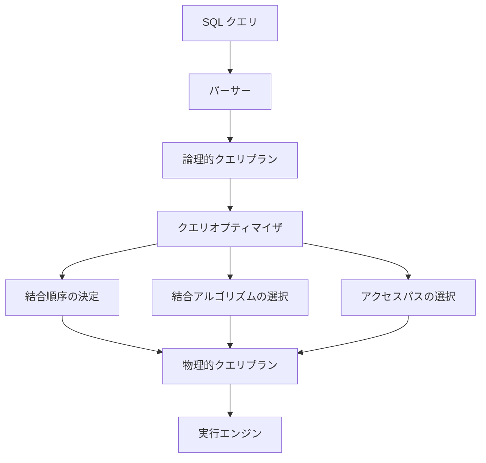
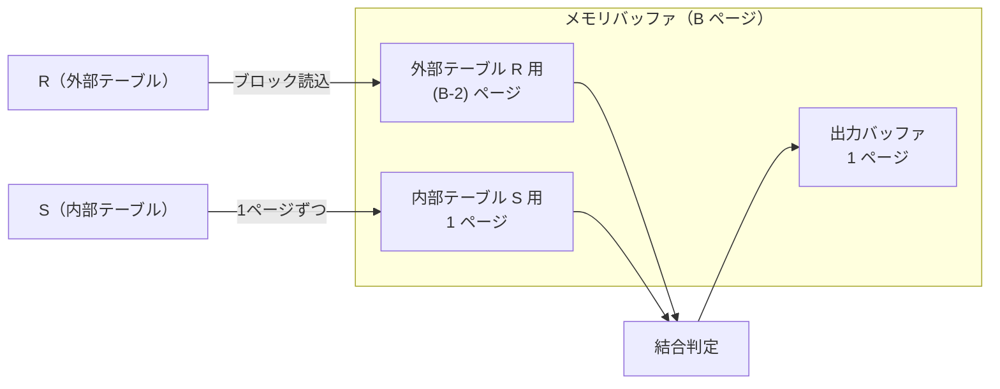
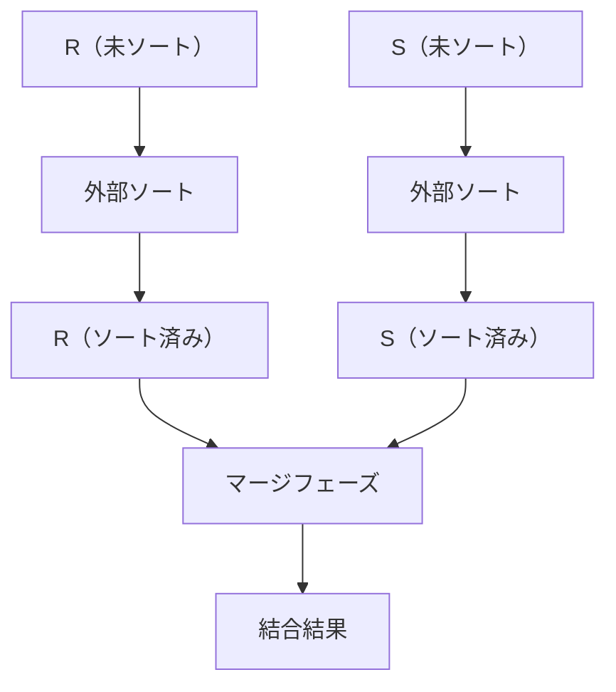
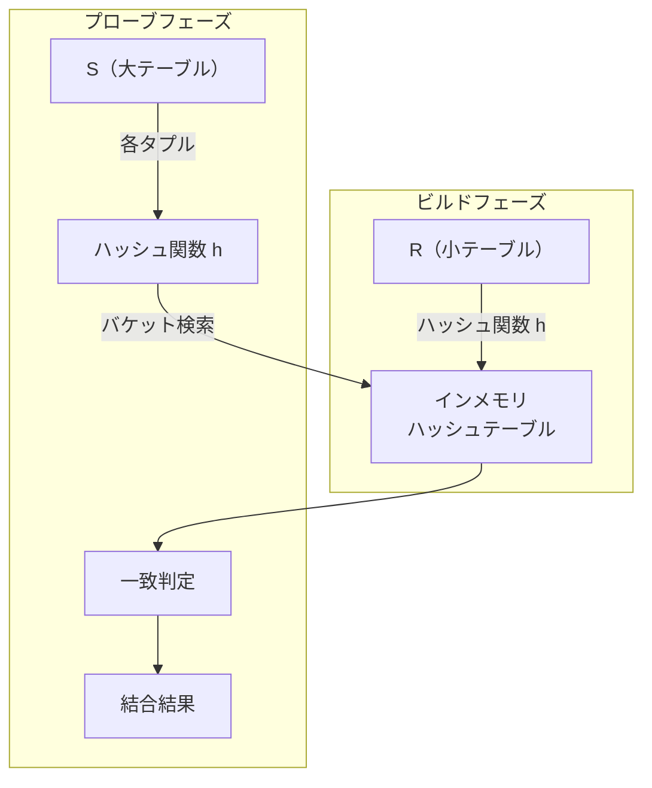
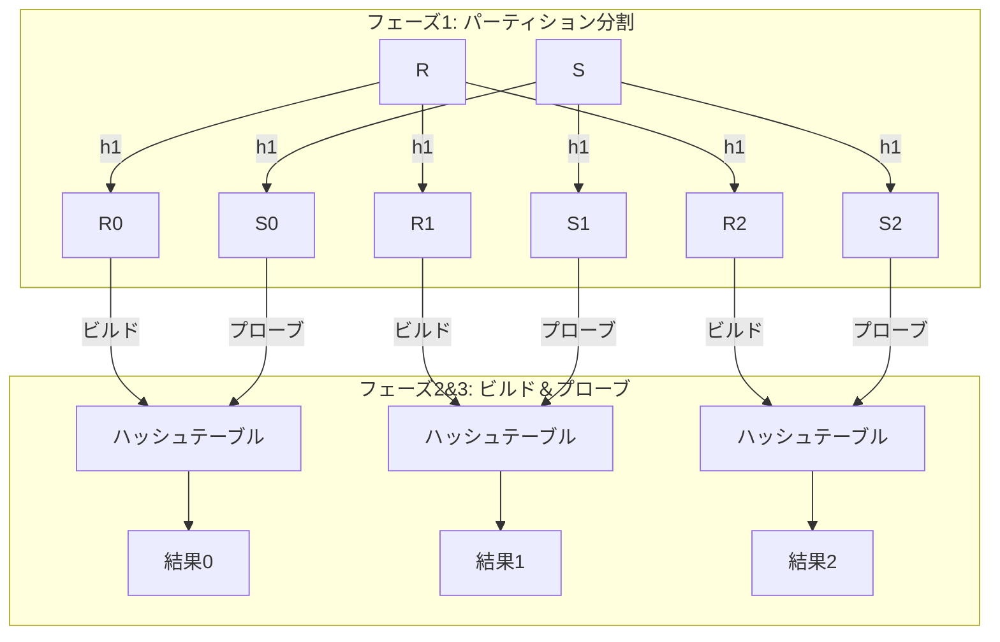
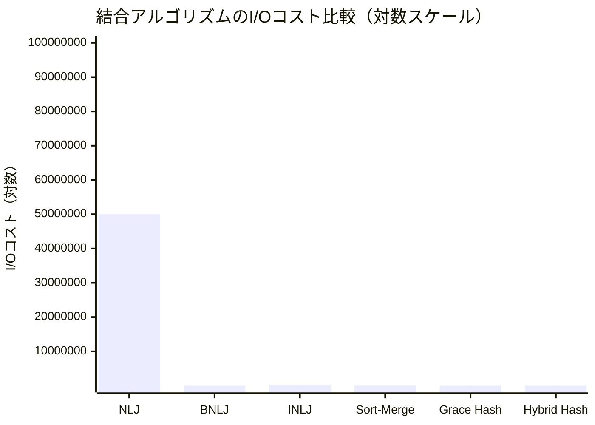
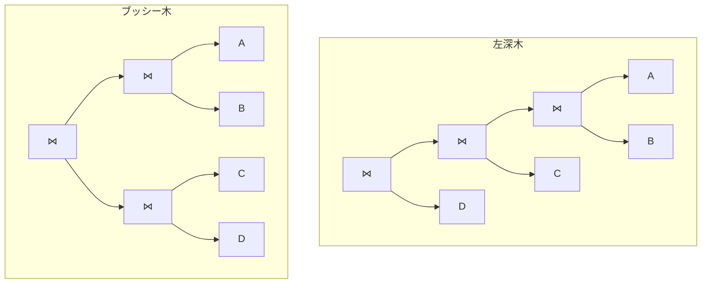
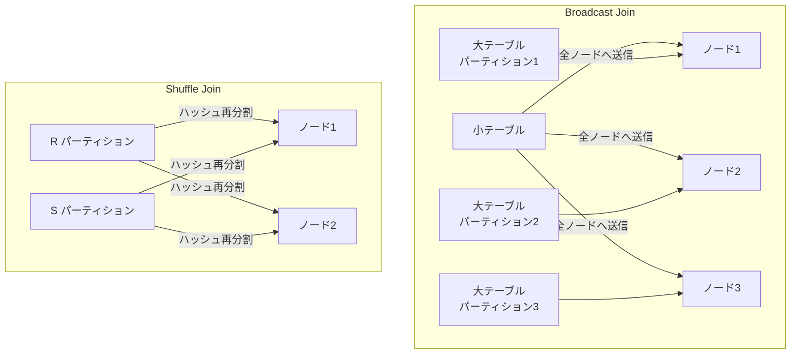

# 結合アルゴリズム — Nested Loop, Hash Join, Sort-Merge Joinの原理と選択戦略

## 1. 結合操作の重要性

リレーショナルデータベースの最も強力な特徴は、正規化されたテーブル間の**結合（JOIN）**によって、分散した情報を自在に組み合わせられることである。E.F. Coddが1970年に提唱したリレーショナルモデルにおいて、結合は関係代数の中核的な演算として位置づけられている。

しかし、結合操作はデータベースクエリの中で最もコストの高い操作の一つでもある。2つのテーブルの結合を素朴に実行すれば、その計算量はテーブルサイズの積に比例する。100万行のテーブル同士を結合するなら、最悪の場合1兆回の比較が必要になる。この膨大なコストをいかに削減するかが、クエリ処理エンジンの設計における中心的な課題である。

### 1.1 結合の種類と前提

本記事では、等値結合（Equi-Join）を中心に解説する。等値結合とは、結合条件が等号（`=`）で表される結合であり、実務上のクエリの大半を占める。

```sql
-- Equi-Join example
SELECT o.order_id, c.name
FROM orders o
JOIN customers c ON o.customer_id = c.customer_id;
```

以降の議論では、以下の記号を用いる。

| 記号 | 意味 |
|---|---|
| $R$ | 外部テーブル（Outer Relation） |
| $S$ | 内部テーブル（Inner Relation） |
| $b_R$ | $R$ のページ数（ブロック数） |
| $b_S$ | $S$ のページ数 |
| $\|R\|$ | $R$ のタプル数 |
| $\|S\|$ | $S$ のタプル数 |
| $B$ | 利用可能なバッファページ数 |

コストの指標としては**ディスクI/O回数**を用いる。CPU処理コストも無視できないが、従来のデータベースではI/Oがボトルネックとなるケースが支配的であるため、この指標が広く採用されている。

### 1.2 結合処理の全体像

クエリオプティマイザは結合を実行する際、以下の3つを決定する必要がある。

1. **結合アルゴリズム**の選択（本記事の主題）
2. **結合順序**の決定（どのテーブルから先に結合するか）
3. **アクセスパス**の選択（テーブルスキャン or インデックススキャン）



これら3つの決定が組み合わさることで、同じSQLでも実行性能に数桁の差が生じ得る。本記事では、まず個々の結合アルゴリズムの原理とコストを詳細に解説し、最後にオプティマイザがどのようにこれらを組み合わせて最適な実行計画を導出するかを論じる。

## 2. Nested Loop Join（単純ネステッドループ結合）

### 2.1 基本原理

Nested Loop Join（NLJ）は、最も直感的な結合アルゴリズムである。外部テーブル $R$ の各タプルについて、内部テーブル $S$ の全タプルを走査し、結合条件を満たすペアを出力する。

```python
def nested_loop_join(R, S, predicate):
    result = []
    for r in R:          # outer loop
        for s in S:      # inner loop
            if predicate(r, s):
                result.append((r, s))
    return result
```

### 2.2 I/Oコスト分析

ディスクベースのデータベースでは、タプル単位ではなくページ（ブロック）単位でI/Oが発生する。単純なNLJでは、$R$ の各タプルに対して $S$ の全ページを読み込む必要がある。

$$
\text{I/Oコスト} = b_R + |R| \times b_S
$$

$R$ のページを読む $b_R$ 回に加え、$R$ の各タプル（$|R|$ 個）ごとに $S$ の全ページ（$b_S$）を読むためである。

具体例で考えてみよう。$R$ が1,000ページ・100,000タプル、$S$ が500ページとする。

$$
\text{I/Oコスト} = 1{,}000 + 100{,}000 \times 500 = 50{,}001{,}000 \text{ 回}
$$

1回のI/Oに10msかかるとすれば、約50万秒（約139時間）を要する。これは明らかに実用的ではない。

### 2.3 外部テーブルの選択

NLJにおいて、どちらのテーブルを外部テーブルとするかは性能に大きく影響する。コスト式から明らかなように、**タプル数の少ないテーブルを外部テーブルとする**のが有利である。

$R$ と $S$ を入れ替えた場合のコストは $b_S + |S| \times b_R$ となる。先の例で $S$ が50,000タプルだとすると：

$$
\text{入れ替え後} = 500 + 50{,}000 \times 1{,}000 = 50{,}000{,}500 \text{ 回}
$$

この例では大差がないが、テーブルサイズの非対称性が大きい場合、外部テーブルの選択は決定的な差をもたらす。

## 3. Block Nested Loop Join（ブロックネステッドループ結合）

### 3.1 基本原理

単純NLJの非効率さは、内部テーブルを「タプルごと」に何度も再読込する点にある。Block Nested Loop Join（BNLJ）は、この問題を**ページ（ブロック）単位のイテレーション**に改善する。

```python
def block_nested_loop_join(R, S, predicate, buffer_size):
    result = []
    # Read R in chunks of (buffer_size - 2) pages
    for r_block in read_blocks(R, buffer_size - 2):
        for s_page in read_pages(S):     # scan S page by page
            for r in r_block:
                for s in s_page:
                    if predicate(r, s):
                        result.append((r, s))
    return result
```

バッファの使い方がポイントである。利用可能な $B$ ページのバッファのうち、$(B - 2)$ ページを外部テーブル $R$ のブロック読み込みに使い、1ページを内部テーブル $S$ の読み込みに、残り1ページを出力バッファに使用する。



### 3.2 I/Oコスト分析

$R$ は $\lceil b_R / (B - 2) \rceil$ 回のブロックに分割される。各ブロックに対して $S$ を1回走査するため：

$$
\text{I/Oコスト} = b_R + \left\lceil \frac{b_R}{B - 2} \right\rceil \times b_S
$$

先の例で $B = 102$ とすると：

$$
\text{I/Oコスト} = 1{,}000 + \left\lceil \frac{1{,}000}{100} \right\rceil \times 500 = 1{,}000 + 10 \times 500 = 6{,}000 \text{ 回}
$$

単純NLJの50,001,000回から6,000回へ、約8,300倍の改善である。I/O時間は60秒にまで短縮される。

### 3.3 バッファサイズの影響

BNLJのコストはバッファサイズ $B$ に大きく依存する。特に、$B \geq b_R + 2$ であれば $R$ 全体がメモリに収まるため、$S$ の走査は1回で済む。

$$
B \geq b_R + 2 \implies \text{I/Oコスト} = b_R + b_S
$$

これは理論上の最小コストである。逆に $B = 3$（最小構成）の場合は：

$$
\text{I/Oコスト} = b_R + b_R \times b_S
$$

となり、ページ単位のNLJと等価になる。以下の表にバッファサイズとI/Oコストの関係を示す。

| バッファサイズ $B$ | 外部ブロック数 | I/Oコスト | 実行時間（10ms/IO） |
|---|---|---|---|
| 3 | 1,000 | 501,000 | 約84分 |
| 12 | 100 | 51,000 | 約8.5分 |
| 102 | 10 | 6,000 | 約1分 |
| 502 | 2 | 2,000 | 約20秒 |
| 1,002 | 1 | 1,500 | 約15秒 |

### 3.4 外部テーブルの選択

BNLJでも外部テーブルの選択は重要である。コスト式を見ると、$b_R$ と $b_S$ を入れ替えた場合：

$$
b_S + \left\lceil \frac{b_S}{B - 2} \right\rceil \times b_R
$$

一般に、**ページ数が少ない方のテーブルを外部テーブルとする**のが有利である。これは、外部テーブルのブロック数が少ないほど内部テーブルの走査回数が減るためである。

## 4. Index Nested Loop Join（インデックスネステッドループ結合）

### 4.1 基本原理

内部テーブル $S$ の結合属性にインデックスが存在する場合、内部テーブルの全走査を回避できる。外部テーブル $R$ の各タプルについて、インデックスを用いて $S$ の対応するタプルを直接探索する。

```python
def index_nested_loop_join(R, S_index, predicate_key):
    result = []
    for r in R:
        # Use index to find matching tuples in S
        matching_tuples = S_index.lookup(r[predicate_key])
        for s in matching_tuples:
            result.append((r, s))
    return result
```


### 4.2 I/Oコスト分析

B+Treeインデックスを使用する場合、1回のインデックスルックアップのコストは木の高さ $h$（通常2〜4）プラスデータページアクセス1回で、合計 $h + 1$ 回のI/Oとなる。ただし、インデックスの上位ノードはキャッシュされている可能性が高いため、実効的なコストはこれより小さくなることが多い。

$$
\text{I/Oコスト} = b_R + |R| \times c
$$

ここで $c$ は1回のインデックスルックアップのコストである。B+Treeの場合 $c$ はおよそ2〜4であることが多い。ハッシュインデックスの場合は $c \approx 1.2$（平均的なオーバーフローを含む）程度となる。

先の例で $c = 3$ とすると：

$$
\text{I/Oコスト} = 1{,}000 + 100{,}000 \times 3 = 301{,}000 \text{ 回}
$$

BNLJの6,000回と比較すると劣るが、これはバッファサイズが十分大きい場合の話である。バッファが極端に小さい場合、Index NLJはBNLJを大きく上回る性能を発揮する。

### 4.3 適用条件と注意点

Index NLJが効果的な条件は以下の通りである。

- **内部テーブルの結合属性にインデックスが存在する**こと
- **外部テーブルのサイズが比較的小さい**こと（ルックアップ回数に直結するため）
- **結合の選択性が高い**こと（1回のルックアップで少数のタプルのみが返る）

逆に、内部テーブルの大部分にアクセスする場合（選択性が低い場合）は、テーブルスキャン＋BNLJの方が効率的になり得る。ランダムI/Oのコストがシーケンシャルスキャンのコストを大きく上回るためである。

::: tip
PostgreSQLでは、Index NLJに相当する操作は`EXPLAIN`出力で`Nested Loop`の内側に`Index Scan`や`Index Only Scan`として現れる。MySQLでは`EXPLAIN`の`type`列に`ref`や`eq_ref`として表示される。
:::

## 5. Sort-Merge Join（ソートマージ結合）

### 5.1 基本原理

Sort-Merge Joinは、両方のテーブルを結合属性でソートし、ソート済みのデータをマージするアルゴリズムである。ソート済みのリストのマージはリニアタイムで完了するため、ソートのコストが許容できれば極めて効率的である。

アルゴリズムは2つのフェーズに分かれる。

**フェーズ1: ソート**
両テーブルを結合キーでソートする。外部ソート（External Sort）を用いる。

**フェーズ2: マージ**
ソート済みの2つのテーブルを同時に走査し、結合条件を満たすペアを出力する。

```python
def sort_merge_join(R, S, join_key):
    # Phase 1: Sort
    R_sorted = external_sort(R, join_key)
    S_sorted = external_sort(S, join_key)

    # Phase 2: Merge
    result = []
    r_ptr, s_ptr = 0, 0
    while r_ptr < len(R_sorted) and s_ptr < len(S_sorted):
        if R_sorted[r_ptr][join_key] < S_sorted[s_ptr][join_key]:
            r_ptr += 1
        elif R_sorted[r_ptr][join_key] > S_sorted[s_ptr][join_key]:
            s_ptr += 1
        else:
            # Match found - output all matching pairs
            s_start = s_ptr
            while (s_ptr < len(S_sorted) and
                   R_sorted[r_ptr][join_key] == S_sorted[s_ptr][join_key]):
                result.append((R_sorted[r_ptr], S_sorted[s_ptr]))
                s_ptr += 1
            # Handle duplicates in R
            r_ptr += 1
            if (r_ptr < len(R_sorted) and
                R_sorted[r_ptr][join_key] == R_sorted[r_ptr - 1][join_key]):
                s_ptr = s_start  # backtrack S pointer for duplicate
    return result
```



### 5.2 外部ソートの概要

メモリに収まらない大規模データをソートするには、**外部ソート**（External Merge Sort）を用いる。

1. **ラン生成フェーズ**: 入力を $B$ ページずつ読み込み、メモリ内でソートしてディスクに書き出す。これにより、各 $B$ ページのソート済み区間（**ラン**）が生成される。
2. **マージフェーズ**: $(B - 1)$ 個のランを同時にマージし、より長いランを生成する。必要に応じてこのマージを複数パス繰り返す。

$b$ ページのテーブルに対する外部ソートのI/Oコストは：

$$
\text{ソートI/O} = 2b \times \left(1 + \left\lceil \log_{B-1} \left\lceil \frac{b}{B} \right\rceil \right\rceil \right)
$$

各パスでデータ全体を1回読み書きするため $2b$ のI/Oが発生し、パス数は初回のラン生成1回とマージの $\lceil \log_{B-1} \lceil b/B \rceil \rceil$ 回を合わせたものとなる。

### 5.3 Sort-Merge JoinのI/Oコスト

Sort-Merge Joinの総コストは、ソートコストとマージコストの合計である。

$$
\text{I/Oコスト} = \text{Sort}(R) + \text{Sort}(S) + (b_R + b_S)
$$

マージフェーズは両テーブルを1回ずつ走査するだけなので $b_R + b_S$ で済む。ただし、結合キーに大量の重複がある場合、$S$ のポインタのバックトラックが発生し、最悪ケースではマージコストが $b_R \times b_S$ に膨れ上がる可能性がある。

先の例（$b_R = 1{,}000$, $b_S = 500$, $B = 102$）でのソートコストを計算してみよう。

$R$ のソート：
- ラン数: $\lceil 1{,}000 / 102 \rceil = 10$
- マージパス数: $\lceil \log_{101} 10 \rceil = 1$
- 総パス数: $1 + 1 = 2$
- ソートI/O: $2 \times 1{,}000 \times 2 = 4{,}000$

$S$ のソート：
- ラン数: $\lceil 500 / 102 \rceil = 5$
- マージパス数: $\lceil \log_{101} 5 \rceil = 1$
- 総パス数: $1 + 1 = 2$
- ソートI/O: $2 \times 500 \times 2 = 2{,}000$

マージ：$1{,}000 + 500 = 1{,}500$

$$
\text{総I/Oコスト} = 4{,}000 + 2{,}000 + 1{,}500 = 7{,}500 \text{ 回}
$$

### 5.4 最適化: ソートとマージの融合

外部ソートの最終マージパスと結合のマージフェーズを融合させることで、追加のI/Oを削減できる。具体的には、ソートの最終マージパスで生成されるソート済みストリームを直接結合マージに入力する。この最適化により、最終パスの書き出しと再読み込み（$b_R + b_S$ のI/O）が不要になる。

融合が可能な条件は、$R$ のラン数と $S$ のラン数の合計が $B - 1$ 以下であること、すなわち：

$$
\left\lceil \frac{b_R}{B} \right\rceil + \left\lceil \frac{b_S}{B} \right\rceil \leq B - 1
$$

### 5.5 Sort-Merge Joinの利点と適用場面

Sort-Merge Joinには以下の利点がある。

1. **ソート済みデータの再利用**: 結合結果がソート済みで出力されるため、`ORDER BY`句やその後の結合処理に有利。
2. **大規模データへの対応**: バッファサイズが小さくても、外部ソートにより任意のサイズのデータを処理できる。
3. **等値結合以外への対応**: 不等号条件（`<`, `>`, `BETWEEN`など）の結合にも適用可能。

逆に、ソートのオーバーヘッドが大きいため、小規模なテーブル同士の結合では他のアルゴリズムに劣ることがある。また、既にソート済みのデータ（インデックス経由の走査など）に対してはソートフェーズが不要になるため、特に有利になる。

## 6. Hash Join（ハッシュ結合）

### 6.1 基本原理

Hash Joinは、ハッシュ関数を用いてテーブルを分割し、一致する可能性のあるタプルを同じバケットに集約することで、比較回数を大幅に削減するアルゴリズムである。等値結合に特化した手法であり、等値条件を持つ結合において最も効率的なアルゴリズムの一つである。

基本的なHash Joinは**ビルドフェーズ**と**プローブフェーズ**の2段階で動作する。

**ビルドフェーズ**: 小さい方のテーブル（ビルド側、通常 $R$）を結合キーでハッシュし、インメモリのハッシュテーブルを構築する。

**プローブフェーズ**: 大きい方のテーブル（プローブ側、通常 $S$）の各タプルについて、同じハッシュ関数を適用し、ハッシュテーブルを検索して一致するタプルを見つける。

```python
def simple_hash_join(R, S, join_key):
    # Build phase: build hash table from smaller relation R
    hash_table = {}
    for r in R:
        key = hash(r[join_key])
        if key not in hash_table:
            hash_table[key] = []
        hash_table[key].append(r)

    # Probe phase: probe with larger relation S
    result = []
    for s in S:
        key = hash(s[join_key])
        if key in hash_table:
            for r in hash_table[key]:
                if r[join_key] == s[join_key]:  # resolve hash collisions
                    result.append((r, s))
    return result
```



### 6.2 Simple Hash JoinのI/Oコスト

ビルド側テーブル $R$ がメモリに収まる場合（$b_R \leq B - 2$）、Simple Hash Joinのコストは極めて小さい。

$$
\text{I/Oコスト} = b_R + b_S
$$

$R$ を1回読み込んでハッシュテーブルを構築し、$S$ を1回走査するだけである。これは理論上の最小コストであり、いかなる結合アルゴリズムもこれ以下のコストにはなり得ない（両テーブルを最低1回は読む必要があるため）。

先の例：$b_R = 1{,}000$, $b_S = 500$ で $B \geq 1{,}002$ の場合：

$$
\text{I/Oコスト} = 1{,}000 + 500 = 1{,}500 \text{ 回}
$$

しかし、実際にはビルド側テーブルがメモリに収まらないことも多い。その場合は次に説明するGrace Hash Joinを用いる。

### 6.3 ハッシュテーブルの設計

インメモリハッシュテーブルの設計は性能に大きく影響する。主な実装方式には以下がある。

**チェイニング方式**: 各バケットにリンクリストを持つ。実装が容易で挿入が高速だが、ポインタの追跡によるキャッシュミスが多い。

**オープンアドレッシング方式**: 衝突時に別のスロットを探索する。メモリの局所性が良くキャッシュ効率が高いが、ロードファクターが高くなると性能が急激に劣化する。

**リニアハッシング**: バケットを動的に分割し、ハッシュテーブルを段階的に拡張する。テーブルサイズが事前にわからない場合に有効。

現代のデータベースでは、キャッシュ効率を重視してオープンアドレッシングの変種（ロビンフッドハッシング、クーックーハッシングなど）を採用することが多い。

## 7. Grace Hash Join（パーティション型ハッシュ結合）

### 7.1 基本原理

ビルド側テーブルがメモリに収まらない場合、**Grace Hash Join**を用いる。このアルゴリズムは1984年に日本の東京大学と富士通の共同研究（GRACEデータベースマシンプロジェクト）で提案された。

Grace Hash Joinは3つのフェーズで構成される。

**フェーズ1: パーティション分割**
ハッシュ関数 $h_1$ を用いて、$R$ と $S$ の両方を $n$ 個のパーティションに分割する。同じハッシュ値を持つタプルは同じパーティション番号に割り当てられるため、$R_i$ と $S_i$（同じパーティション番号 $i$）の間でのみ結合が発生する。異なるパーティション間で結合が起こることはあり得ない。

**フェーズ2: ビルド**
各パーティション $R_i$ をメモリに読み込み、別のハッシュ関数 $h_2$ でインメモリハッシュテーブルを構築する。

**フェーズ3: プローブ**
対応するパーティション $S_i$ を読み込み、ハッシュテーブルをプローブして結合結果を出力する。

```python
def grace_hash_join(R, S, join_key, num_partitions):
    # Phase 1: Partition both relations
    R_partitions = [[] for _ in range(num_partitions)]
    S_partitions = [[] for _ in range(num_partitions)]

    for r in R:
        p = hash1(r[join_key]) % num_partitions
        R_partitions[p].append(r)

    for s in S:
        p = hash1(s[join_key]) % num_partitions
        S_partitions[p].append(s)

    # Phase 2 & 3: Build and probe for each partition pair
    result = []
    for i in range(num_partitions):
        # Build hash table from R_i
        ht = build_hash_table(R_partitions[i], join_key, hash2)
        # Probe with S_i
        for s in S_partitions[i]:
            key = hash2(s[join_key])
            for r in ht.lookup(key):
                if r[join_key] == s[join_key]:
                    result.append((r, s))
    return result
```



### 7.2 パーティション数の決定

各パーティション $R_i$ がメモリに収まる必要がある。データが均等に分散されると仮定すると、各パーティションのサイズは $b_R / n$ ページである。これがバッファに収まるには：

$$
\frac{b_R}{n} \leq B - 2 \implies n \geq \left\lceil \frac{b_R}{B - 2} \right\rceil
$$

また、パーティション分割時に $n$ 個の出力バッファが必要なため：

$$
n \leq B - 1
$$

これらを組み合わせると、Grace Hash Joinが1レベルのパーティション分割で処理可能な条件は：

$$
b_R \leq (B - 2)(B - 1) \approx B^2
$$

つまり、小さい方のテーブルのページ数が $B^2$ 以下であれば、Grace Hash Joinで処理できる。

### 7.3 I/Oコスト分析

**パーティション分割フェーズ**: $R$ と $S$ の全ページを読み込み、パーティションに分けて書き出す。

$$
\text{パーティションI/O} = 2(b_R + b_S)
$$

**ビルド＆プローブフェーズ**: 全パーティションを読み込む。

$$
\text{ビルド＆プローブI/O} = b_R + b_S
$$

$$
\text{総I/Oコスト} = 3(b_R + b_S)
$$

先の例：

$$
\text{I/Oコスト} = 3(1{,}000 + 500) = 4{,}500 \text{ 回}
$$

BNLJの6,000回やSort-Merge Joinの7,500回と比較しても優れている。

### 7.4 Recursive Partitioning（再帰的パーティション分割）

パーティションが1レベルの分割ではメモリに収まらない場合（$b_R > B^2$）、**再帰的パーティション分割**を行う。大きすぎるパーティションに対して、別のハッシュ関数 $h_3$ を用いて再度分割する。

再帰の深さ $d$ は $\lceil \log_{B-1}(b_R / B) \rceil$ で、この場合の総I/Oコストは：

$$
\text{I/Oコスト} = 2(b_R + b_S) \times d + (b_R + b_S)
$$

ただし、再帰的パーティション分割が必要になるケースは、バッファが極端に小さいか、テーブルが巨大な場合に限られる。

### 7.5 スキュー問題

Grace Hash Joinの実用上の最大の課題は、**データスキュー**（偏り）である。特定のハッシュ値に多くのタプルが集中すると、そのパーティションがメモリに収まらなくなる。

例えば、`country`列で結合する場合、特定の国（アメリカ、中国など）に大量のレコードが偏ることは十分にあり得る。このような場合、偏ったパーティションに対して再帰的パーティション分割が必要になる。

スキューへの対策としては以下がある。

1. **ヒストグラムによる事前分析**: テーブルの統計情報から偏りを検出し、パーティション数を調整する。
2. **ビットマップフィルタ（Bloom Filter）**: ビルドフェーズで作成したBloom Filterをプローブフェーズで適用し、明らかに不一致のタプルを早期に除外する。
3. **Hybrid Hash Join**: 次節で解説する改良版アルゴリズム。

### 7.6 Hybrid Hash Join

Hybrid Hash Joinは、Grace Hash Joinの改良版であり、メモリに余裕がある場合にパーティション分割とビルド＆プローブを融合する。

具体的には、パーティション分割時に最初のパーティション $R_0$ をディスクに書き出さず、そのままメモリ内にハッシュテーブルとして保持する。プローブ時にも $S_0$ に属するタプルは即座にハッシュテーブルをプローブし、ディスクへの書き出しを省く。

この最適化により、1つのパーティション分のI/Oが節約される。パーティション数が $n$ の場合、0番目のパーティションのI/Oが不要になるため：

$$
\text{I/Oコスト} = 3(b_R + b_S) - 2 \times \frac{b_R + b_S}{n} = (b_R + b_S)\left(3 - \frac{2}{n}\right)
$$

$n$ が小さい（メモリが比較的大きい）ほど節約効果が高く、極端な場合（$n = 1$、すなわち全データがメモリに収まる）ではSimple Hash Joinと同等の $b_R + b_S$ になる。

::: warning
Hybrid Hash Joinの効果は、各パーティションが均等なサイズであることを前提としている。データスキューがある場合、0番目のパーティションが他より大きくなり、期待した効果が得られないことがある。
:::

## 8. 各アルゴリズムのコスト比較

### 8.1 理論的コストの一覧

以下の表に、各結合アルゴリズムのI/Oコストをまとめる。

| アルゴリズム | I/Oコスト | 前提条件 |
|---|---|---|
| Nested Loop Join | $b_R + \|R\| \times b_S$ | なし |
| Block Nested Loop Join | $b_R + \lceil b_R / (B-2) \rceil \times b_S$ | なし |
| Index Nested Loop Join | $b_R + \|R\| \times c$ | $S$ にインデックスが必要 |
| Sort-Merge Join | $\text{Sort}(R) + \text{Sort}(S) + b_R + b_S$ | なし（不等号結合も可） |
| Simple Hash Join | $b_R + b_S$ | $b_R \leq B - 2$ |
| Grace Hash Join | $3(b_R + b_S)$ | $b_R \leq B^2$ |
| Hybrid Hash Join | $(b_R + b_S)(3 - 2/n)$ | $b_R \leq B^2$ |

### 8.2 具体的な数値比較

$b_R = 1{,}000$, $b_S = 500$, $|R| = 100{,}000$, $|S| = 50{,}000$, $B = 102$ の条件で比較する。

| アルゴリズム | I/Oコスト | 実行時間（10ms/IO） |
|---|---|---|
| Nested Loop Join | 50,001,000 | 約139時間 |
| Block NL Join | 6,000 | 約1分 |
| Index NL Join ($c=3$) | 301,000 | 約50分 |
| Sort-Merge Join | 7,500 | 約1.3分 |
| Grace Hash Join | 4,500 | 約45秒 |
| Hybrid Hash Join ($n=10$) | 4,200 | 約42秒 |



### 8.3 バッファサイズによる変動

バッファサイズの変化が各アルゴリズムに与える影響は大きく異なる。

| バッファ $B$ | BNLJ | Sort-Merge | Grace Hash |
|---|---|---|---|
| 5 | 167,500 | 10,500 | 4,500 |
| 22 | 26,000 | 7,500 | 4,500 |
| 52 | 11,000 | 7,500 | 4,500 |
| 102 | 6,000 | 7,500 | 4,500 |
| 202 | 3,500 | 7,500 | 4,500 |
| 502 | 2,000 | 4,500 | 4,500 |
| 1,002 | 1,500 | 4,500 | 1,500 |

注目すべきポイント：

- **BNLJ** はバッファサイズに対して最も敏感。バッファが大きくなるほど劇的にコストが下がる。
- **Grace Hash Join** はバッファサイズの影響を受けにくい（$B^2 \geq b_R$ を満たす限り）。ただし、$B$ が十分大きくSimple Hash Joinに切り替わる場合は最小コストに達する。
- **Sort-Merge Join** は中間的な特性を示す。外部ソートのパス数が減ればコストも下がるが、Grace Hash Joinほど劇的ではない。

### 8.4 データ特性による選択指針

アルゴリズムの選択は、テーブルサイズやバッファだけでなく、データの特性にも依存する。

**Hash Joinが有利なケース：**
- 等値結合
- 一方のテーブルが他方より大幅に小さい
- 結合キーの値分布が均一（スキューが少ない）
- 結合後にソート順序が不要

**Sort-Merge Joinが有利なケース：**
- 入力データが既にソート済み（インデックス経由など）
- 結合結果をソート順で必要とする（`ORDER BY`あり）
- 不等号結合（`<`, `>`, `BETWEEN`）
- 結合キーに大量の重複がない

**Index Nested Loop Joinが有利なケース：**
- 外部テーブルが非常に小さい
- 内部テーブルに適切なインデックスが存在する
- 結合の選択性が極めて高い（少数のタプルのみがマッチする）

**Block Nested Loop Joinが有利なケース：**
- バッファサイズが極めて大きい（小さい方のテーブルが丸ごとメモリに乗る）
- テーブルが極めて小さい
- 等値結合以外の複雑な結合条件

## 9. オプティマイザの結合順序選択

### 9.1 問題の本質

複数テーブルの結合において、結合の順序は実行コストに甚大な影響を与える。$n$ 個のテーブルを結合する場合、可能な結合順序の数はカタラン数 $C_n$ で表され、$n$ に対して指数的に増大する。

$$
C_n = \frac{(2n)!}{(n+1)! \cdot n!}
$$

| テーブル数 $n$ | 結合順序数 $C_n$ |
|---|---|
| 2 | 2 |
| 3 | 12 |
| 4 | 120 |
| 5 | 1,680 |
| 6 | 30,240 |
| 10 | 約1.76億 |
| 15 | 約$2.7 \times 10^{14}$ |

テーブル数が10を超えると、全探索は非現実的になる。このため、効率的な探索アルゴリズムが必要となる。

### 9.2 結合木の形状

結合順序の問題は、二分木の列挙問題と等価である。結合木には主に2つの形状がある。

**左深木（Left-Deep Tree）**: すべての結合の右入力がベーステーブルである。パイプライン実行と相性が良く、中間結果をマテリアライズせずに次の結合に渡せる。

**ブッシー木（Bushy Tree）**: 結合の入力自体が結合結果であることを許す。探索空間は大きくなるが、並列実行に有利であり、より良い実行計画が見つかる可能性がある。



### 9.3 動的計画法（System R方式）

IBM System R（1979年）で提案された動的計画法ベースのアルゴリズムは、今日でも多くのRDBMSのオプティマイザの基盤となっている。

基本的な考え方は以下の通りである。

1. 個々のテーブルのアクセスコストを計算する。
2. 2テーブルの結合すべてについて、最適なアクセスプランを計算する。
3. 3テーブルの結合を、「最適な2テーブル結合 + 1テーブル」の組み合わせで計算する。
4. これを $n$ テーブルまで繰り返す。

各ステップで、同じテーブル集合に対する最適な部分計画のみを保持し、それ以外は枝刈りする。

```python
def system_r_optimizer(tables, join_predicates):
    # dp[S] = best plan for joining the set of tables S
    dp = {}

    # Base case: single table access plans
    for t in tables:
        dp[frozenset([t])] = best_access_plan(t)

    # Build up plans for larger sets
    for size in range(2, len(tables) + 1):
        for S in subsets_of_size(tables, size):
            best = None
            # Try all ways to split S into two non-empty subsets
            for S1, S2 in split_pairs(S):
                if not has_join_predicate(S1, S2, join_predicates):
                    continue
                # Try all join algorithms
                for algo in [nested_loop, hash_join, sort_merge]:
                    cost = dp[S1].cost + dp[S2].cost + \
                           join_cost(algo, dp[S1], dp[S2])
                    if best is None or cost < best.cost:
                        best = Plan(dp[S1], dp[S2], algo, cost)
            dp[S] = best

    return dp[frozenset(tables)]
```

この動的計画法の時間計算量は $O(3^n)$（部分集合の列挙）であり、$n \leq 10$ 程度であれば実用的な時間で最適解を求められる。

### 9.4 Interesting Orders

System Rの重要な洞察の一つに、**interesting orders**（有用なソート順序）の概念がある。ある部分計画のコストが最小でなくても、その出力がソート済みであることが後続の結合（Sort-Merge Join）や`ORDER BY`句に利用できる場合、そのプランは保持する価値がある。

例えば、テーブル $A$ と $B$ の結合において、Hash Joinのコストが100、Sort-Merge Joinのコストが120だとする。単純にはHash Joinを選択するが、その結合結果が次にテーブル $C$ とSort-Merge Joinで結合される場合、既にソート済みの出力を再利用できるSort-Merge Joinの方が総コストでは有利になる可能性がある。

このため、System R方式のオプティマイザは、各テーブル集合に対して「最小コストの計画」だけでなく「各interesting orderに対する最小コストの計画」も保持する。

### 9.5 ヒューリスティクスと近似アルゴリズム

テーブル数が多い場合、動的計画法でも探索空間が大きすぎることがある。このような場合、以下の手法が用いられる。

**貪欲法（Greedy Algorithm）**: 各ステップで最もコストの低い結合を選択する。$O(n^2)$ で動作するが、最適解が保証されない。

**遺伝的アルゴリズム（Genetic Algorithm）**: PostgreSQLは、テーブル数が12以上（デフォルトの`geqo_threshold`）の場合、GEQO（GEnetic Query Optimizer）に切り替える。結合順序を遺伝子として表現し、交叉・突然変異・選択を繰り返して準最適な解を探索する。

**ランダム化アルゴリズム**: ランダムな結合順序から出発し、局所的な変換（2つの結合の入れ替えなど）を繰り返して改善する。シミュレーテッドアニーリングや反復局所探索が用いられる。

**適応型最適化**: テーブル数に応じて戦略を切り替える。少数テーブルでは動的計画法で最適解を求め、多数テーブルではヒューリスティクスに切り替える。

### 9.6 実データベースにおける戦略

主要なRDBMSがどのような最適化戦略を採用しているかを概観する。

**PostgreSQL:**
- 動的計画法をベースに、テーブル数が`geqo_threshold`（デフォルト12）を超えるとGEQOに切り替え
- コストモデルはI/OコストとCPUコストの両方を考慮
- `random_page_cost`と`seq_page_cost`のパラメータでI/Oコストを調整可能

**MySQL (InnoDB):**
- 貪欲な深さ優先探索をベースとした最適化
- `optimizer_search_depth`パラメータで探索の深さを制御
- Hash Joinのサポートは MySQL 8.0.18 から追加（それ以前はNested Loop系のみ）

**Oracle:**
- コストベースオプティマイザ（CBO）で動的計画法を採用
- 適応型実行計画により、実行時の統計情報に基づいてアルゴリズムを動的に変更可能
- ヒント句でアルゴリズムの強制指定が可能（`/*+ USE_HASH(t1 t2) */`）

**SQL Server:**
- 動的計画法に加え、メモ化とブランチ＆バウンドを組み合わせたCascadesフレームワーク
- 適応型結合（Adaptive Join）により、実行時に行数の実測値に基づいてHash JoinとNested Loop Joinを切り替え

::: details PostgreSQLでの結合アルゴリズム確認例
```sql
-- Enable detailed query plan output
EXPLAIN (ANALYZE, BUFFERS, FORMAT TEXT)
SELECT o.order_id, c.name
FROM orders o
JOIN customers c ON o.customer_id = c.customer_id
WHERE o.order_date > '2025-01-01';

-- Force specific join strategies (for testing)
SET enable_hashjoin = off;    -- disable hash join
SET enable_mergejoin = off;   -- disable merge join
SET enable_nestloop = off;    -- disable nested loop
```
:::

## 10. 現代的な発展

### 10.1 並列ハッシュ結合

現代のデータベースでは、複数のCPUコアを活用した並列結合処理が標準的である。Hash Joinは並列化との親和性が極めて高い。

**パーティション並列**: パーティション分割後、各パーティションのビルド＆プローブを独立したスレッドで実行する。パーティション間に依存関係がないため、理想的な並列性が得られる。

**共有ハッシュテーブル**: 複数スレッドが協調してハッシュテーブルを構築し、プローブする。ロック競合を最小化するためにロックフリーのハッシュテーブルが用いられることが多い。

### 10.2 インメモリデータベースにおける考慮

インメモリデータベース（SAP HANA、MemSQL/SingleStore、VoltDBなど）では、ディスクI/Oではなく**CPUキャッシュ効率**が性能の支配的要因となる。

この文脈では、従来のI/Oコストモデルは意味をなさず、以下のような要素が重要になる。

- **キャッシュライン効率**: ハッシュテーブルの各エントリがキャッシュラインに収まるよう設計する
- **SIMD演算**: 結合キーの比較を SIMD（Single Instruction, Multiple Data）命令で並列化する
- **ハードウェアプリフェッチ**: 次にアクセスするハッシュバケットを先読みしてキャッシュミスのレイテンシを隠蔽する
- **NUMA認識**: メモリアクセスのローカリティを最大化するパーティション戦略

研究レベルでは、radix hash joinやmassively parallel sort-merge joinなど、ハードウェアの特性を極限まで活用するアルゴリズムが提案されている。

### 10.3 分散環境における結合

分散データベースやデータウェアハウス（BigQuery、Snowflake、Redshiftなど）では、データがネットワーク越しに複数ノードに分散しているため、**データの再配置（Shuffle / Repartition）**コストが結合の支配的なコストとなる。

主な分散結合戦略は以下の通りである。

**Broadcast Join**: 小さい方のテーブルを全ノードにブロードキャストし、各ノードでローカルに結合する。一方のテーブルが十分小さい場合に有効。

**Shuffle Join（Repartition Join）**: 両テーブルを結合キーで同じハッシュ関数を用いて再分割し、同じキー値を持つタプルが同じノードに集まるようにする。その後、各ノードでローカルに結合する。

**Co-located Join**: 両テーブルが同じキーであらかじめ分割されている場合、データの再配置なしにローカルで結合できる。テーブル設計段階での考慮が必要。



### 10.4 Semi-JoinとAnti-Join

ここまで等値結合（Inner Join）を中心に解説してきたが、実際のクエリでは`EXISTS`、`IN`、`NOT EXISTS`、`NOT IN`といった半結合（Semi-Join）や反結合（Anti-Join）もよく使われる。

Semi-Joinは、外部テーブルの各タプルについて、内部テーブルに一致するタプルが**存在するかどうか**だけを判定する。一致が見つかった時点で内部テーブルの走査を打ち切れるため、通常のInner Joinよりも効率的に実行できる。

Hash Joinの文脈では、Semi-Joinのプローブフェーズで最初の一致を見つけた時点でそのタプルの処理を完了できる。また、ビルドフェーズでも同一キーのタプルを1つだけ保持すれば十分であるため、ハッシュテーブルのメモリ使用量を削減できる。

## 11. まとめ

結合アルゴリズムは、リレーショナルデータベースの性能を決定する最も重要な要素の一つである。本記事で解説した各アルゴリズムの本質を振り返る。

**Nested Loop Join**: 最も単純だが最も非効率。ブロック単位の改良（BNLJ）やインデックスの活用（INLJ）により実用的な性能を達成できる。特にINLJは、選択性が高く適切なインデックスが存在する場合に最も効率的なアルゴリズムとなり得る。

**Sort-Merge Join**: ソートのコストがかかるが、入力が既にソート済みの場合やソート済み出力が必要な場合に有利。不等号結合にも対応できる汎用性の高さが特徴。

**Hash Join**: 等値結合において最も効率的なアルゴリズムの一つ。Simple Hash Joinは理論上の最小I/Oコストを達成し、Grace Hash Joinにより大規模データにも対応できる。データスキューへの注意が必要。

オプティマイザは、テーブルの統計情報（行数、ページ数、値の分布など）とシステムのパラメータ（バッファサイズ、I/Oコストなど）に基づいて、これらのアルゴリズムと結合順序の最適な組み合わせを選択する。動的計画法による厳密な最適化から遺伝的アルゴリズムによる近似解まで、問題のスケールに応じた手法が使い分けられている。

現代のデータベースでは、CPUの並列性やメモリ階層、分散環境への対応など、古典的なI/Oコストモデルでは捉えきれない要素も重要になっている。しかし、本記事で解説した基本的なアルゴリズムの原理とコスト特性を理解していることは、クエリチューニングやデータベース設計において依然として不可欠な素養である。
