# ジャーナリング — ファイルシステムのクラッシュ耐性を支える技術

## ファイルシステムの一貫性問題

### クラッシュが引き起こす破壊

ファイルシステムは、ディスク上のデータ構造を操作してファイルの作成・変更・削除を行う。しかし、1つのファイル操作であっても、内部的には複数のディスクブロックへの書き込みを伴うことがほとんどである。たとえば、新しいファイルを作成する場合、以下のような複数の更新が必要になる。

1. **inode の割り当て**: inode ビットマップを更新し、新しい inode を確保する
2. **inode の初期化**: 新しい inode にファイルのメタデータ（サイズ、パーミッション、タイムスタンプなど）を書き込む
3. **データブロックの割り当て**: データブロックビットマップを更新し、データ用のブロックを確保する
4. **データの書き込み**: 実際のファイルデータをデータブロックに書き込む
5. **ディレクトリエントリの追加**: 親ディレクトリのデータブロックに新しいエントリ（ファイル名と inode 番号の対応）を追加する

これら5つの書き込みは、ディスク上の異なる位置にあるブロックに対して行われる。問題は、これらの書き込みが**原子的（atomic）ではない**ことだ。ディスクは1ブロック（通常512バイトまたは4KB）単位でしか原子的な書き込みを保証しない。複数ブロックにまたがる操作の途中でシステムがクラッシュ（電源断、カーネルパニックなど）すると、一部の書き込みだけが完了し、残りが反映されていない**不整合な状態**が残る。

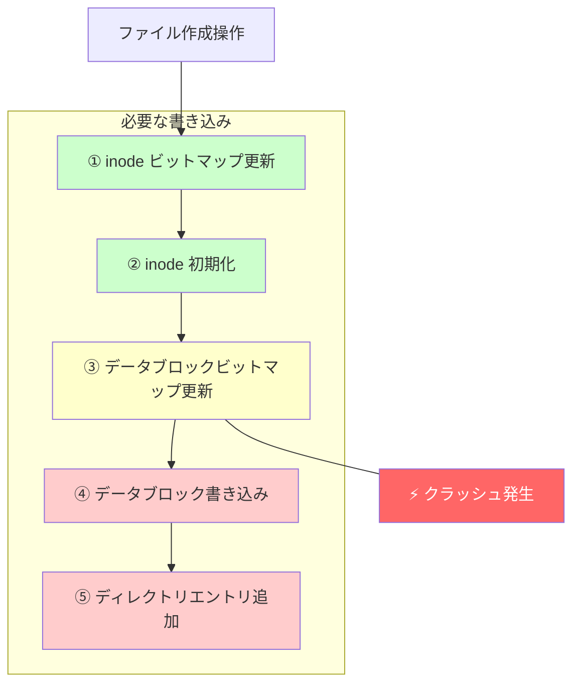

### 不整合の具体例

クラッシュのタイミングによって、さまざまな種類の不整合が発生しうる。

**ケース1: inode ビットマップだけ更新された場合**
inode ビットマップは「使用中」と記録されているが、inode の中身は初期化されておらず、ディレクトリエントリも存在しない。結果として、どのファイルからも参照されない「孤立した inode」が生まれ、ストレージ領域が永久にリークする。

**ケース2: データブロックビットマップが更新されず、ディレクトリエントリだけ追加された場合**
ディレクトリにはファイルが見えるが、データブロックは「未使用」と記録されている。このブロックが別のファイルに割り当てられると、2つのファイルが同じデータブロックを共有してしまい、データの破壊が発生する。

**ケース3: ディレクトリエントリとデータは書かれたが、inode が更新されていない場合**
ファイルにアクセスしようとすると、inode が不正な状態（ゴミデータや古いデータ）を指しており、予期しない動作やデータ破壊を引き起こす。

### 従来の解決策: fsck

ジャーナリングが普及する以前、ファイルシステムの一貫性を回復する主な手段は **fsck（File System Check）** であった。fsck は、ファイルシステム全体を走査し、データ構造間の整合性を検証・修復するユーティリティである。

fsck は以下のようなチェックを行う。

- スーパーブロックの整合性確認
- inode ビットマップとデータブロックビットマップの検証
- inode のリンクカウントの整合性確認
- ディレクトリ構造の整合性検証
- 孤立した inode の検出と回収

しかし、fsck には致命的な欠点がある。**ファイルシステム全体を走査する必要があるため、大容量のディスクでは数時間から数十時間もかかる**ことがある。現代のストレージでは数テラバイトから数ペタバイトの容量が一般的であり、fsck による復旧は実用的でなくなっている。さらに、fsck は「おそらくこう修復すべきだ」というヒューリスティクスに基づいて動作するため、修復によって逆にデータが失われることもある。

この問題を解決するために登場したのが**ジャーナリング**である。

## ジャーナリングの基本概念

### Write-Ahead Logging の原理

ジャーナリングの基本的なアイデアは、データベースの世界で長い歴史を持つ **Write-Ahead Logging（WAL, 先行書き込みログ）** から借用したものである。その原理は驚くほどシンプルだ。

> **ファイルシステムのデータ構造を直接変更する前に、これから行う変更の内容をログ（ジャーナル）領域に先に書き込む。**

この原則を守ることで、クラッシュが発生した場合でも以下のことが保証される。

1. **ログが完全に書かれている場合**: ログの内容を再生（replay）することで、中断された操作を完了できる
2. **ログが不完全な場合**: その操作はまだ開始されていないものとして扱い、ログを破棄する

つまり、ジャーナリングは複数ブロックにまたがる操作を**トランザクション**として扱い、「全部完了するか、全く行われないか」という**原子性（atomicity）**を提供する。

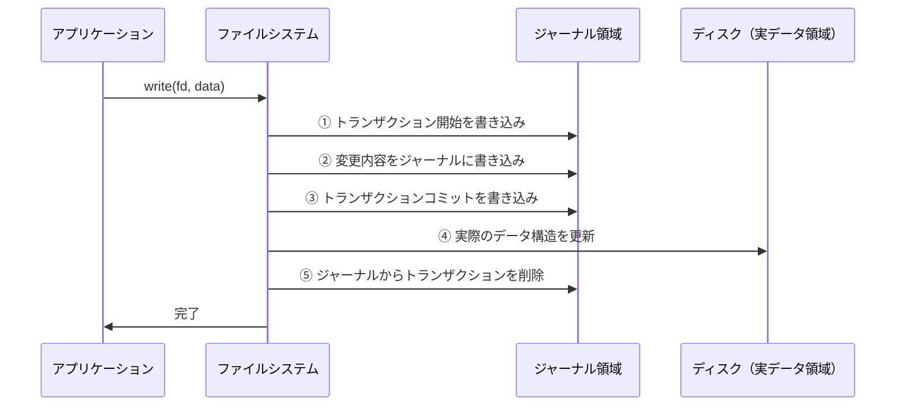

### トランザクションの構造

ジャーナル内のトランザクションは、一般的に以下の構造を持つ。

```
+--------------------+
| Transaction Begin  |  ← トランザクション ID、開始マーカー
+--------------------+
| Log Record 1       |  ← 変更されるブロックの情報（ブロック番号 + 新しい内容）
+--------------------+
| Log Record 2       |  ← 変更されるブロックの情報
+--------------------+
| ...                |
+--------------------+
| Log Record N       |
+--------------------+
| Transaction Commit |  ← コミットマーカー（チェックサムを含む場合もある）
+--------------------+
```

**Transaction Begin** にはトランザクションの識別子やタイムスタンプが含まれる。**Log Record** には、変更対象のブロック番号と変更後の内容（場合によっては変更前の内容も）が記録される。**Transaction Commit** はトランザクションの完了を示すマーカーであり、このマーカーが書き込まれるまでトランザクションは有効とみなされない。

コミットマーカーの書き込みが**原子的なポイント**となる。コミットマーカーが存在すれば、そのトランザクション内のすべての変更はリカバリ時に適用される。コミットマーカーが存在しなければ、トランザクション全体が破棄される。この仕組みにより、多数のブロック更新からなる操作が原子的に扱われる。

### ジャーナル領域の配置

ジャーナルは、ファイルシステム内の専用領域に配置されるのが一般的である。ext3/ext4 では、ファイルシステム作成時にジャーナル用の特別な inode（inode 番号 8）が確保され、通常はファイルシステムの先頭付近に連続したブロック群として配置される。

ジャーナルは**リングバッファ（循環バッファ）**として動作する。新しいトランザクションがジャーナルの末尾に追記され、チェックポイント（後述）が完了した古いトランザクションは先頭から順に解放される。ジャーナルのサイズは有限であるため、ジャーナルが満杯になると新しいトランザクションはジャーナルの空きができるまでブロックされる。

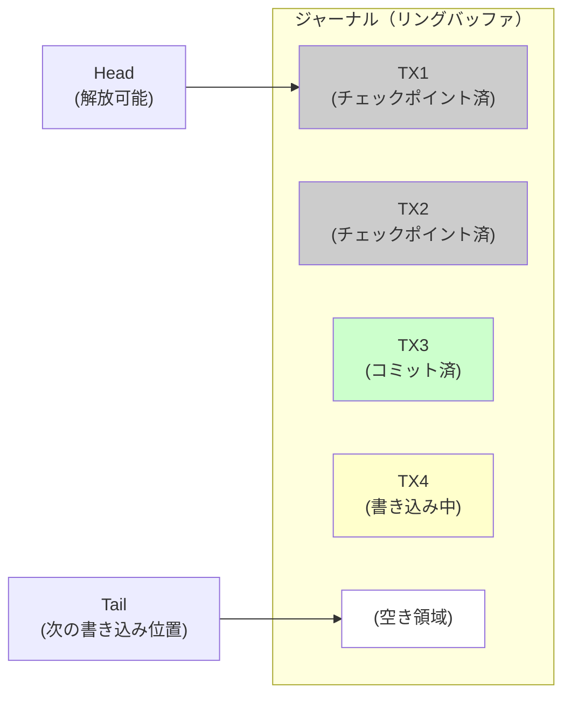

## ジャーナリングの種類

ジャーナリングには、何をジャーナルに記録するかによって複数のモードがある。記録する情報が多いほど安全性は高まるが、パフォーマンスへの影響も大きくなる。主要な3つのモードを見ていこう。

### Data Journaling（データジャーナリング）

Data Journaling は、**メタデータだけでなくファイルの実データもジャーナルに書き込む**モードである。これが最も安全なモードであり、以下の手順で動作する。

1. **Journal Write**: 変更されるメタデータとデータの両方をジャーナルに書き込む
2. **Journal Commit**: コミットブロックをジャーナルに書き込む（ここまででトランザクションが確定）
3. **Checkpoint**: ジャーナルの内容を実際のディスク上の位置に書き込む（チェックポイント）
4. **Free**: ジャーナル内のトランザクションを解放する

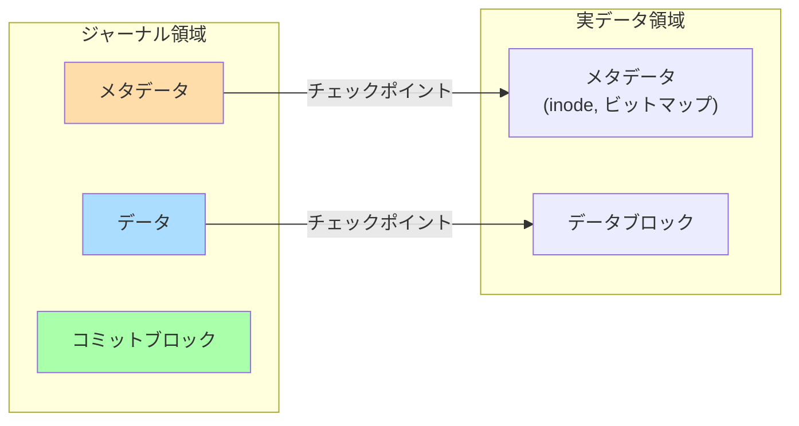

**利点**: データとメタデータの両方が保護されるため、クラッシュ後にファイルの内容が不整合になることがない。

**欠点**: すべてのデータが二重に書き込まれる（ジャーナルに1回、最終的な位置に1回）ため、書き込みスループットが最大で半分になる。特に大きなファイルの書き込みではオーバーヘッドが顕著になる。

ext3/ext4 では `journal` モードとして利用可能であり、マウントオプション `data=journal` で有効化できる。

### Ordered Journaling（順序付きジャーナリング）

Ordered Journaling は、**メタデータのみをジャーナルに書き込み**、ファイルのデータは直接ディスクに書き込むモードである。ただし、重要な制約として、**データの書き込みがメタデータのジャーナルコミットよりも先に完了する**ことを保証する。

手順は以下の通りである。

1. **Data Write**: ファイルデータを直接ディスクの最終位置に書き込む
2. **Journal Write**: メタデータの変更をジャーナルに書き込む
3. **Journal Commit**: コミットブロックをジャーナルに書き込む
4. **Checkpoint**: ジャーナルのメタデータを実際の位置に書き込む
5. **Free**: ジャーナル内のトランザクションを解放する

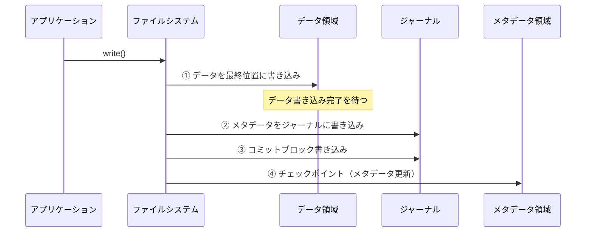

この「順序保証」がなぜ重要かを理解するために、順序が守られない場合に何が起こるかを考えてみよう。メタデータが先にコミットされ、データの書き込みが完了する前にクラッシュすると、新しいメタデータが古い（あるいはゴミ）データを指してしまう。たとえば、ファイルのサイズが拡張された新しい inode がコミットされたが、追加されたデータブロックにはまだ以前のファイルの内容（あるいはゼロでない値のゴミデータ）が残っているかもしれない。これはセキュリティ上の問題にもなりうる（他のユーザーの削除されたデータが見えてしまう可能性がある）。

**利点**: データの二重書き込みがないため、Data Journaling よりも大幅に高速である。順序保証により、実用上十分な安全性が確保される。

**欠点**: クラッシュ後、メタデータは一貫しているが、最後に書き込まれていたファイルのデータは部分的にしか書き込まれていない可能性がある（ファイルの末尾がゼロ埋めされるなど）。ただし、ファイルシステムのメタデータ構造自体は常に一貫した状態にある。

ext3/ext4 のデフォルトモードであり、マウントオプション `data=ordered` で明示的に指定することもできる。

### Writeback Journaling（ライトバックジャーナリング）

Writeback Journaling は、**メタデータのみをジャーナルに書き込み、データの書き込み順序を一切保証しない**モードである。

1. **Journal Write**: メタデータの変更をジャーナルに書き込む
2. **Journal Commit**: コミットブロックをジャーナルに書き込む
3. **Data Write**: ファイルデータをディスクに書き込む（順序は保証されない）
4. **Checkpoint**: ジャーナルのメタデータを実際の位置に書き込む
5. **Free**: ジャーナル内のトランザクションを解放する

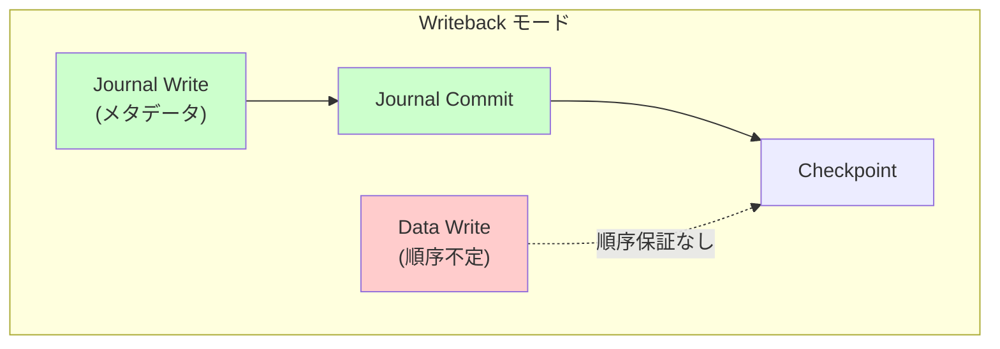

**利点**: 書き込み順序の制約がないため、I/Oスケジューラが最も効率的な順序で書き込みを行える。3つのモードの中で最も高速。

**欠点**: クラッシュ後に、古いデータや無関係なデータがファイルの中に見えてしまう可能性がある。メタデータの一貫性は保証されるが、ファイルの内容は保証されない。

ext3/ext4 では、マウントオプション `data=writeback` で有効化できる。

### 3つのモードの比較

| 特性 | Data Journaling | Ordered Journaling | Writeback Journaling |
|---|---|---|---|
| ジャーナル対象 | メタデータ + データ | メタデータのみ | メタデータのみ |
| データ書き込み順序 | ジャーナル経由 | メタデータより先 | 保証なし |
| メタデータ一貫性 | 保証 | 保証 | 保証 |
| データ一貫性 | 保証 | 部分的に保証 | 保証なし |
| 書き込み性能 | 最も遅い | 中程度 | 最も速い |
| リカバリ時間 | ジャーナル再生のみ | ジャーナル再生のみ | ジャーナル再生のみ |
| 用途 | データの整合性が最重要 | 汎用（デフォルト） | 性能最重視 |

## ext3/ext4 のジャーナリング実装（JBD2）

### JBD2 の概要

ext3 で導入されたジャーナリング機構は、ファイルシステム本体とは独立したレイヤーとして設計されている。このレイヤーが **JBD（Journaling Block Device）** であり、ext4 向けに拡張された **JBD2** が現在使われている。

JBD2 がファイルシステムから独立している設計は重要である。これにより、ジャーナリングのロジックがファイルシステムのコードと分離され、理論的には他のファイルシステムでも JBD2 を利用できる。ext3 では JBD を、ext4 では JBD2 を使用している。両者の主な違いは、JBD2 が 64bit ブロック番号をサポートし、チェックサム機能を備えている点である。

### トランザクションのライフサイクル

JBD2 では、トランザクションは以下の状態を遷移する。

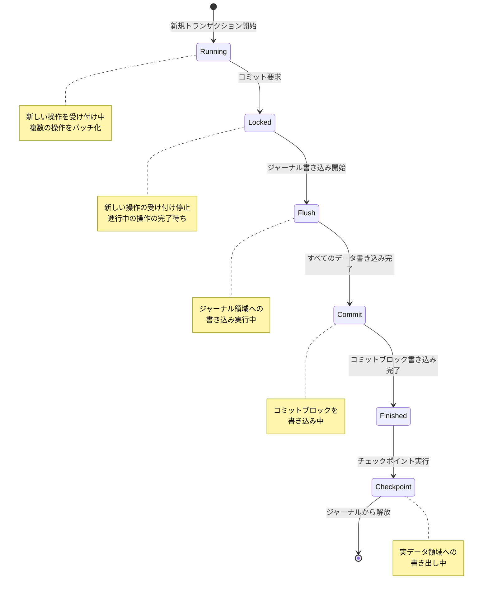

**Running 状態**: トランザクションは新しい操作を受け付けている状態である。ファイルの作成、削除、メタデータの変更など、複数の操作が1つのトランザクションにバッチ化される。JBD2 はデフォルトで5秒間隔（`commit` マウントオプションで変更可能）でコミットを行う。

**Locked 状態**: コミットが開始されると、トランザクションはロックされ、新しい操作の受け付けを停止する。ただし、このトランザクション内で既に開始されていた操作は完了するまで待機する。

**Flush 状態**: トランザクション内のすべてのダーティバッファ（変更されたブロック）がジャーナル領域に書き出される。

**Commit 状態**: すべてのデータの書き込みが完了した後、コミットブロックが書き込まれる。このコミットブロックにはトランザクション全体のチェックサムが含まれ（ext4 の場合）、データの整合性を検証できる。

**Finished 状態**: コミットブロックの書き込みが完了し、トランザクションは永続化された状態である。

**Checkpoint 状態**: ジャーナルに記録された変更が、実際のディスク上の位置に書き出される。チェックポイントが完了すると、ジャーナル内のそのトランザクションは不要になり、解放される。

### コミットブロックのチェックサム

ext4 では、コミットブロックにトランザクション全体のチェックサム（CRC32 または CRC32C）が含まれる。このチェックサムは重要な最適化を可能にする。

従来の ext3 では、ジャーナルへの書き込みとコミットブロックの書き込みの間にディスクバリア（flush）を挿入する必要があった。これは、ディスクの書き込みキャッシュが書き込み順序を入れ替える可能性があるためである。もしコミットブロックがデータよりも先にディスクに書かれてしまうと、リカバリ時に不完全なデータがコミット済みと誤認されてしまう。

チェックサムの導入により、コミットブロックとデータの書き込み順序を保証する必要がなくなった。リカバリ時にチェックサムが一致しなければ、そのトランザクションは不完全であると判定して破棄すればよい。これにより、ディスクバリアの回数を削減し、パフォーマンスが向上する。

```c
// Simplified structure of JBD2 commit block
struct commit_header {
    __be32 h_magic;           // Magic number: JBD2_MAGIC_NUMBER
    __be32 h_blocktype;       // JBD2_COMMIT_BLOCK
    __be32 h_sequence;        // Transaction sequence number
    unsigned char h_chksum_type;   // Checksum algorithm type
    unsigned char h_chksum_size;   // Checksum size
    unsigned char h_padding[2];
    __be32 h_chksum[JBD2_CHECKSUM_BYTES]; // Transaction checksum
    __be64 h_commit_sec;      // Commit timestamp (seconds)
    __be32 h_commit_nsec;     // Commit timestamp (nanoseconds)
};
```

### Revoke レコード

JBD2 には **Revoke（取り消し）レコード** という仕組みがある。これは、あるブロックがジャーナルに書き込まれた後、そのブロックが別の目的で再利用された場合に必要になる。

たとえば、以下のシナリオを考える。

1. トランザクション T1 がブロック B にデータを書き込み、ジャーナルにも記録される
2. T1 がチェックポイントされる前に、トランザクション T2 がブロック B を解放して別の用途に割り当てる
3. T2 がコミットされた後、T1 のチェックポイント前にクラッシュが発生する

リカバリ時、もし T1 のジャーナルレコードが再生されると、T2 で解放・再割り当てされたブロック B が T1 の古い内容で上書きされてしまう。Revoke レコードは「このブロックへの以前のジャーナルエントリを無視せよ」という指示であり、この問題を防止する。

### 複合トランザクション

JBD2 の重要な最適化の一つに**複合トランザクション（compound transaction）**がある。個々のファイルシステム操作（ファイルの作成、書き込み、削除など）ごとに独立したトランザクションを作るのではなく、一定時間内（デフォルト5秒）に行われた複数の操作を1つのトランザクションにまとめる。

この仕組みには以下の利点がある。

- **ジャーナルの書き込み回数削減**: 同じブロックが複数回変更された場合、最終的な状態だけをジャーナルに書き込めばよい
- **ディスクバリアの回数削減**: コミットごとにバリアが必要なため、トランザクション数を減らすことでバリアのオーバーヘッドも減る
- **I/O のバッチ処理**: 複数の小さな書き込みを1つの大きな書き込みにまとめることで、ディスクI/O の効率が向上する

ただし、この方式にはトレードオフがある。コミット間隔が長いほど効率は上がるが、クラッシュ時に失われる可能性のあるデータも増える。

## XFS のログ設計

### XFS の概要とジャーナリングの位置づけ

XFS は 1993 年に Silicon Graphics（SGI）で開発された高性能ファイルシステムであり、2001 年に Linux カーネルに移植された。XFS はジャーナリングを採用しているが、その設計は ext3/ext4 とはいくつかの重要な点で異なる。

XFS のジャーナリングは**メタデータのみ**を対象とし、Data Journaling モードは提供していない。XFS はそもそも高い書き込みスループットを重視する設計であり、データの二重書き込みは設計目標に合致しないためである。

### ログの構造

XFS のログ（ジャーナル）は、ファイルシステムの内部に配置する**内部ログ**と、別のデバイスに配置する**外部ログ**の2つの選択肢がある。外部ログは、高速な SSD やバッテリーバックアップ付き NVRAM にジャーナルを配置することで、パフォーマンスを大幅に向上させる手法として活用される。

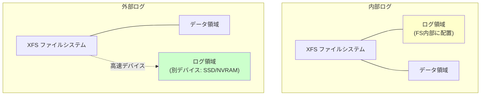

XFS のログは **Log Record** の列として構造化されており、各 Log Record は**ヘッダ**と**データ領域**で構成される。ヘッダにはレコードの長さ、LSN（Log Sequence Number）、チェックサムなどが含まれる。

### 遅延ログ（Delayed Logging）

XFS の大きな特徴の一つが **遅延ログ（Delayed Logging）** 機構である。Linux カーネル 2.6.39（2011年）で導入されたこの機構は、ジャーナリングのパフォーマンスを大幅に改善した。

従来の XFS では、メタデータの変更が発生するたびにログレコードが生成され、ジャーナルに書き込まれていた。しかし、多くの場合、同じメタデータブロックが短期間に何度も変更される。たとえば、ディレクトリに大量のファイルを作成する場合、ディレクトリの inode や割り当てビットマップは連続して更新される。

遅延ログでは、変更されたメタデータを**メモリ上のバッファ（Common Item Log, CIL）** にまず蓄積し、一定の条件が満たされた時点でまとめてジャーナルに書き込む。同じアイテムが複数回変更された場合、最終的な状態だけがジャーナルに書き込まれるため、ジャーナルの書き込み量が大幅に削減される。

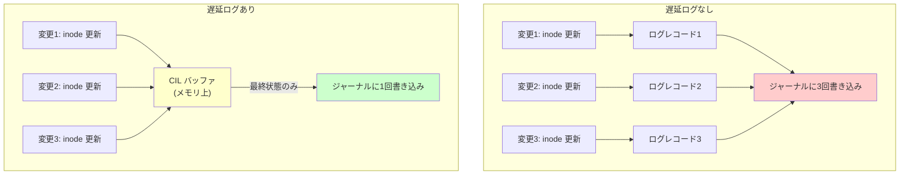

この最適化は、メタデータ集約型のワークロード（大量のファイル作成・削除、ディレクトリ操作など）で特に効果が大きい。

### インテントログ

XFS は**インテントログ（Intent Logging）**と呼ばれる仕組みを使って、複数ステップにまたがる操作（たとえばファイルのリネーム、エクステントの移動など）を安全に行う。

インテントログの基本的なアイデアは、「これから行う操作」の意図（intent）をまずジャーナルに記録し、操作が完了したら「完了」を記録するというものである。クラッシュからのリカバリ時に、意図は記録されているが完了が記録されていない操作が見つかれば、その操作を再実行する。

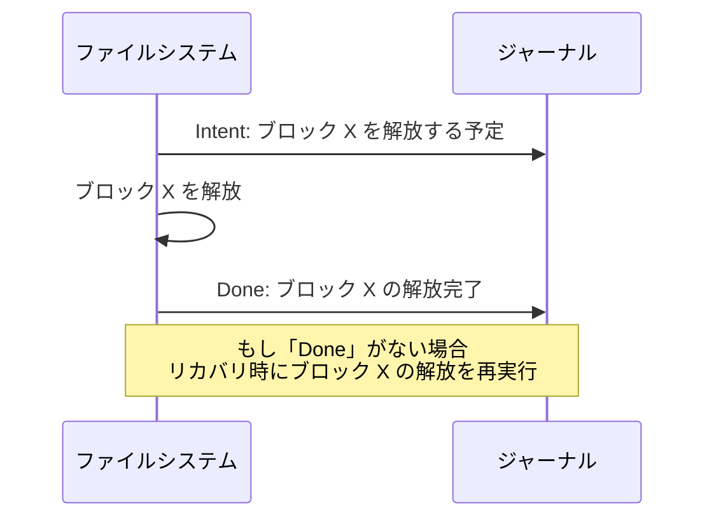

## NTFS のトランザクションログ

### NTFS のジャーナリングアーキテクチャ

Windows の標準ファイルシステムである NTFS も、ジャーナリングを採用している。NTFS のジャーナリングは **$LogFile** という特殊なメタデータファイルにトランザクションログを記録する方式で実装されている。

NTFS のジャーナリングは**メタデータのみ**を対象とし、ファイルデータのジャーナリングは行わない（ext3/ext4 の ordered モードに近い動作だが、厳密にはデータとメタデータの書き込み順序の保証レベルは異なる）。

### ログの構造と操作

NTFS のログは、以下の2種類のレコードで構成される。

- **Update Record（更新レコード）**: 実際のメタデータ変更を記録する。各 Update Record には **Redo 情報**（変更を再適用するためのデータ）と **Undo 情報**（変更を取り消すためのデータ）の両方が含まれる
- **Checkpoint Record（チェックポイントレコード）**: 現在のファイルシステムの状態を記録し、リカバリの開始点を示す

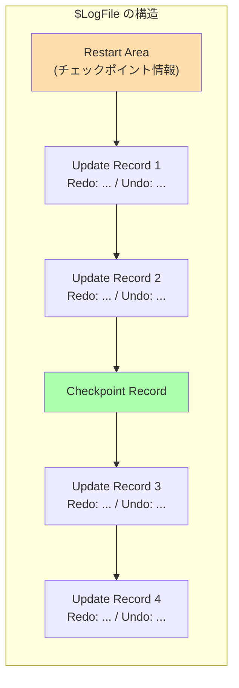

### リカバリプロセス

NTFS のリカバリは、データベースの **ARIES（Algorithm for Recovery and Isolation Exploiting Semantics）** プロトコルに影響を受けた3段階のプロセスで行われる。

1. **Analysis Pass（分析パス）**: 最後のチェックポイントから順にログを走査し、クラッシュ時に進行中だったトランザクションと、ディスクに書き出されていないダーティページを特定する
2. **Redo Pass（再実行パス）**: チェックポイント以降のすべてのコミット済みトランザクションの更新を再適用する。これにより、クラッシュ前にコミットされたがディスクに書き出されていなかった変更が復元される
3. **Undo Pass（取り消しパス）**: クラッシュ時に未コミットだったトランザクションの変更を取り消す。各 Update Record の Undo 情報を使って変更を逆順に適用する

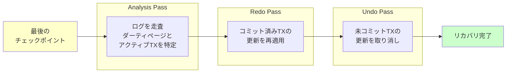

### USN ジャーナル（変更ジャーナル）

NTFS には、ファイルシステムのクラッシュ耐性を目的とした $LogFile とは別に、**USN ジャーナル（Update Sequence Number Journal）**と呼ばれる仕組みがある。$UsnJrnl というメタデータファイルに格納される USN ジャーナルは、ファイルやディレクトリに対するすべての変更の履歴を記録する。

USN ジャーナルはクラッシュリカバリのためではなく、**アプリケーションがファイルシステムの変更を効率的に追跡する**ために使用される。ウイルス対策ソフト、バックアップソフト、検索インデクサーなどが USN ジャーナルを活用して、変更されたファイルだけを効率的に処理する。

## チェックポイントとリカバリ

### チェックポイントの役割

ジャーナリングにおけるチェックポイントとは、ジャーナルに記録された変更を実際のディスク上の最終位置に反映する処理のことである。チェックポイントには以下の2つの重要な目的がある。

1. **ジャーナル領域の解放**: ジャーナルは有限のサイズを持つリングバッファである。チェックポイントが完了したトランザクションのジャーナルエントリは不要になり、そのスペースを新しいトランザクションに再利用できる
2. **リカバリ時間の短縮**: チェックポイント以前の変更はすでにディスクに反映されているため、リカバリ時にはチェックポイント以降のジャーナルエントリだけを再生すればよい

### チェックポイントのタイミング

チェックポイントは以下のような条件で実行される。

- **定期的な間隔**: バックグラウンドでの定期的なチェックポイント処理
- **ジャーナル領域の逼迫**: ジャーナルの空き容量が閾値を下回った場合
- **明示的な同期要求**: `sync` コマンドやファイルシステムのアンマウント時
- **メモリ圧力**: カーネルのメモリ回収機構がダーティバッファの書き出しを要求した場合

### リカバリプロセス

ジャーナルベースのリカバリは、fsck と比較して圧倒的に高速である。リカバリは以下の手順で行われる。

1. **ジャーナルの走査**: ジャーナル領域を読み取り、有効なトランザクション（コミットブロックが存在し、チェックサムが正しいもの）を特定する
2. **チェックポイント済みトランザクションのスキップ**: すでにディスクに反映されているトランザクションは無視する
3. **未チェックポイントのトランザクションを再生**: コミット済みだがチェックポイントが完了していないトランザクションの変更を、ジャーナルからディスクに書き出す
4. **不完全なトランザクションの破棄**: コミットブロックが存在しないトランザクションは破棄する

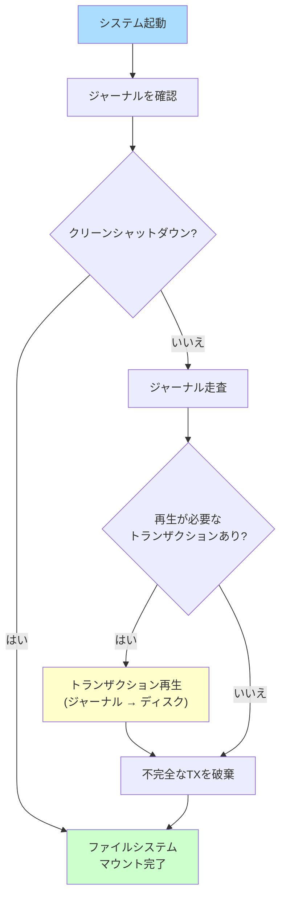

このプロセスは、ジャーナルのサイズ（通常数十MBから数百MB）に比例する時間で完了するため、テラバイト級のファイルシステムでも数秒以内にリカバリが完了する。fsck が数時間かかるのと比べると、劇的な改善である。

### リカバリの冪等性

ジャーナルの再生は**冪等（idempotent）**でなければならない。つまり、同じジャーナルエントリを何度再生しても結果が同じになる必要がある。これは、リカバリ中にさらにクラッシュが発生した場合に重要となる。再起動後に同じリカバリプロセスを再度実行しても、正しい結果が得られなければならない。

この冪等性は、ジャーナルの再生が「ブロック全体の書き込み」という形で行われることにより自然に達成される。同じブロックの内容を同じ位置に何度書き込んでも、最終的な状態は同じだからである。

## パフォーマンスへの影響

### 書き込みアンプリフィケーション

ジャーナリングの最も直接的なパフォーマンスコストは**書き込みアンプリフィケーション（Write Amplification）**である。すべてのメタデータ変更（Data Journaling モードの場合はデータも）がジャーナルと最終位置の2か所に書き込まれるため、物理的な書き込み量が増加する。

Data Journaling モードでは、理論上最大で2倍の書き込み量が発生する。Ordered/Writeback モードでは、メタデータのみが二重に書き込まれるため、オーバーヘッドは大幅に小さくなる。ただし、メタデータ集約型のワークロード（小さなファイルの大量作成・削除）では、Ordered/Writeback モードでもオーバーヘッドが目立つ場合がある。

### ディスクバリアのオーバーヘッド

ジャーナリングの正確性を保証するためには、書き込みの順序を制御する必要がある。特に、ジャーナルへの書き込みが確実にコミットブロックよりも先にディスクに到達しなければならない。現代のディスクは書き込みキャッシュを持っており、書き込み順序を保証するために**ディスクバリア（Flush/FUA コマンド）**が必要になる。

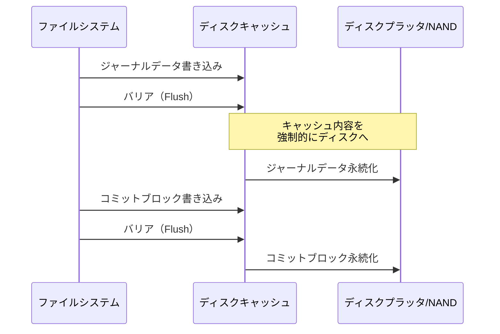

ディスクバリアはキャッシュの全内容をディスクに強制的に書き出すため、高コストな操作である。ext4 のマウントオプション `barrier=0` でバリアを無効化することができるが、これはクラッシュ時のデータ整合性を犠牲にするため、バッテリーバックアップ付き RAID コントローラのように不揮発性のライトキャッシュを持つ環境でのみ推奨される。

### ジャーナリングモード別のベンチマーク傾向

一般的なベンチマークでは、以下のような傾向が見られる（ワークロードに大きく依存するため、具体的な数値は環境によって異なる）。

**シーケンシャル大量書き込み**: Data Journaling は二重書き込みのため顕著に遅い。Ordered と Writeback の差は小さい。

**ランダム小サイズ書き込み**: 3モードの差は比較的小さい。ジャーナルへの書き込みはシーケンシャルであるため、ランダムI/Oの負荷が支配的になる。

**メタデータ操作（ファイル作成・削除）**: Writeback が最も高速だが、Ordered との差は通常小さい。Data Journaling はメタデータもジャーナルに書くため若干遅い。

**SSD 環境**: ランダムI/O のペナルティが小さいため、3モードの差はHDD環境よりも小さくなる。ただし、書き込みアンプリフィケーションによるSSDの寿命への影響は考慮が必要。

### パフォーマンス改善の手法

ジャーナリングのパフォーマンスを改善するために、いくつかの手法が使われている。

**外部ジャーナルデバイス**: ジャーナルを高速な別デバイス（SSD, NVRAM）に配置することで、ジャーナルの書き込みがデータ領域のI/Oと競合しなくなる。XFS では `logdev` オプション、ext4 では `mkfs.ext4 -J device=` で外部ジャーナルを指定できる。

**FUA（Force Unit Access）の活用**: バリア（キャッシュ全体のフラッシュ）の代わりに、特定のブロックだけを直接ディスクに書き込む FUA コマンドを使用する。コミットブロックの書き込みに FUA を使うことで、不要なキャッシュフラッシュを回避できる。

**複合トランザクション**: 前述の通り、複数の操作を1つのトランザクションにまとめることで、コミットの回数（とそれに伴うバリアの回数）を削減する。

## ソフトアップデートとの比較

### ソフトアップデートの概要

ジャーナリングの代替として、**ソフトアップデート（Soft Updates）**と呼ばれる手法がある。ソフトアップデートは 1999 年に Marshall Kirk McKusick と Gregory Ganger によって FreeBSD の FFS（Fast File System）に実装された。

ソフトアップデートの基本的なアイデアは、ジャーナルを使わずに、**メタデータの更新順序を慎重に制御する**ことで一貫性を保証するというものである。具体的には、メタデータ間の依存関係を追跡し、依存関係に違反しない順序でのみ書き込みを行う。

たとえば、新しいファイルを作成する場合、以下の依存関係がある。

1. inode が初期化されてからでなければ、ディレクトリエントリに inode 番号を書き込んではならない
2. データブロックが割り当てられてからでなければ、inode にブロックポインタを書き込んではならない
3. inode が割り当てられてからでなければ、inode を初期化してはならない

これらの依存関係を守ることで、どの時点でクラッシュしても、ファイルシステムは「リソースがリークする（割り当てられているが参照されない）」状態にはなるが、「参照はあるが割り当てられていない」という危険な状態にはならない。リークしたリソースは、バックグラウンドの fsck で回収できる。

### ジャーナリング vs ソフトアップデート

| 観点 | ジャーナリング | ソフトアップデート |
|---|---|---|
| 実装の複雑さ | 比較的単純 | 非常に複雑 |
| 書き込みオーバーヘッド | ジャーナルへの二重書き込み | なし（順序制御のみ） |
| リカバリ速度 | 非常に高速（ジャーナル再生のみ） | バックグラウンド fsck が必要 |
| メタデータの一貫性 | 常に保証 | 依存関係ベースで保証 |
| データの一貫性 | モードによる | 保証なし |
| メモリ使用量 | ジャーナルバッファ | 依存関係追跡のメタデータ |
| 採用状況 | Linux（ext3/ext4, XFS）、Windows（NTFS） | FreeBSD（UFS/FFS） |

ソフトアップデートは理論的には美しい手法であるが、実装の複雑さが大きな障壁となっている。メタデータ間のあらゆる依存関係を正確に追跡し、書き込み順序を制御するコードは極めて複雑で、バグが入りやすい。現在では、FreeBSD でもジャーナリング付きのソフトアップデート（SUJ: Soft Updates Journaling）が導入されており、純粋なソフトアップデートの限界を補っている。

### 他のアプローチとの対比

ジャーナリングとソフトアップデート以外にも、ファイルシステムの一貫性を確保するアプローチがある。

**コピーオンライト（Copy-on-Write, CoW）**: ZFS や Btrfs が採用する手法で、データを変更する際に既存のブロックを上書きせず、新しい場所に書き込んでからポインタを原子的に切り替える。ジャーナリングが「変更を二重に記録する」のに対し、CoW は「そもそも上書きしない」というアプローチである。CoW はスナップショットやチェックサムとの親和性が高いが、フラグメンテーションが起こりやすいという欠点がある。

**ログ構造化ファイルシステム（Log-Structured File System, LFS）**: すべてのデータとメタデータをログとしてシーケンシャルに書き込む手法である。書き込み性能は非常に高いが、読み込み性能の低下やガベージコレクションのオーバーヘッドが課題となる。F2FS（Flash-Friendly File System）はこのアプローチを現代の SSD 向けに改良したものである。

## 実装の詳細: トランザクションのライフサイクル

### ext4 における具体的な実装

以下の擬似コードは、ext4/JBD2 におけるファイル作成時のトランザクション処理の流れを簡略化して示したものである。

```c
// Pseudocode: File creation in ext4 with JBD2 journaling

int ext4_create_file(struct inode *dir, const char *name) {
    handle_t *handle;
    struct inode *inode;
    int err;

    // Start a JBD2 transaction
    // The "credits" parameter specifies the maximum number of
    // blocks this transaction may modify
    handle = jbd2_journal_start(journal, EXT4_DATA_TRANS_BLOCKS);
    if (IS_ERR(handle))
        return PTR_ERR(handle);

    // Allocate a new inode
    inode = ext4_new_inode(handle, dir, mode);
    if (IS_ERR(inode)) {
        jbd2_journal_stop(handle);
        return PTR_ERR(inode);
    }

    // Get write access to the directory block
    // This tells JBD2 to track changes to this buffer
    err = ext4_journal_get_write_access(handle, dir_bh);

    // Add directory entry (modifies directory data block)
    err = ext4_add_entry(handle, dentry, inode);

    // Mark the directory block as dirty in the journal
    err = ext4_handle_dirty_metadata(handle, dir, dir_bh);

    // Stop the transaction handle
    // The transaction remains open for batching with other operations
    jbd2_journal_stop(handle);

    return 0;
}
```

`jbd2_journal_start()` でトランザクションハンドルを取得し、`jbd2_journal_stop()` でハンドルを解放する。重要なのは、`jbd2_journal_stop()` はトランザクションを即座にコミットするわけではないということだ。トランザクションは引き続き `Running` 状態であり、他の操作が同じトランザクションに追加される可能性がある。実際のコミットは、コミットインターバルの到来や明示的な `fsync()` の呼び出しにより行われる。

### fsync とジャーナルの関係

アプリケーションが `fsync()` を呼び出すと、そのファイルに関連するデータとメタデータがディスクに永続化されることが保証される。JBD2 の文脈では、`fsync()` は以下の処理を行う。

1. 現在の Running トランザクションを強制的にコミットする
2. ジャーナルへの書き込みとコミットブロックの書き込みが完了するまで待機する
3. Ordered モードの場合、ファイルデータのディスクへの書き込みも完了するまで待機する

`fsync()` はアプリケーションのデータ永続性を保証するために不可欠であるが、コミットを強制するため、パフォーマンスへの影響が大きい。データベースシステムやメールサーバーなど、データの永続性が重要なアプリケーションは頻繁に `fsync()` を呼び出すため、ジャーナリングのパフォーマンス特性がシステム全体の性能に大きく影響する。

```c
// Pseudocode: fsync implementation in ext4

int ext4_fsync(struct file *file) {
    struct inode *inode = file->f_inode;
    journal_t *journal = EXT4_SB(inode->i_sb)->s_journal;
    tid_t commit_tid;

    // Get the transaction ID that last modified this inode
    commit_tid = inode->i_datasync_tid;

    // Flush file data to disk (for ordered mode)
    filemap_write_and_wait(inode->i_mapping);

    // Force the journal to commit up to (and including) commit_tid
    jbd2_log_start_commit(journal, commit_tid);
    jbd2_log_wait_commit(journal, commit_tid);

    return 0;
}
```

## 最新の動向と課題

### NVMe と永続メモリの影響

NVMe SSD の普及により、ストレージの I/O レイテンシが大幅に低下した。従来のHDD（シーク時間: 5-10ms）に対し、NVMe SSD のレイテンシは 10-100 マイクロ秒のオーダーである。この変化は、ジャーナリングのオーバーヘッドの相対的な重要性を高めている。

HDD の時代には、ジャーナリングのオーバーヘッド（数回の追加書き込みとバリア）はデータI/O のレイテンシに比べて小さかった。しかし、NVMe SSD では I/O のレイテンシが非常に低いため、ジャーナリングのオーバーヘッド（特にバリアによるキャッシュフラッシュ）がボトルネックになるケースが増えている。

さらに、Intel Optane に代表される**永続メモリ（Persistent Memory, PMEM）**の登場は、ジャーナリングの前提を根本から変えうる。永続メモリはバイト単位でアクセス可能であり、書き込みの原子性の単位もより柔軟に制御できる。NOVA（NOn-Volatile memory Accelerated file system）のような永続メモリ向けファイルシステムでは、従来のブロックベースのジャーナリングとは異なるアプローチが採用されている。

### ジャーナリングの信頼性に関する研究

2014 年に Pillai らが発表した論文「All File Systems Are Not Created Equal: On the Complexity of Crafting Crash-Consistent Applications」は、ジャーナリングファイルシステム上でのアプリケーションレベルのクラッシュ耐性について重要な知見を提供した。この研究では、ext3/ext4、Btrfs、XFS などの実際のファイルシステムにおいて、`rename()` の原子性や `fsync()` の振る舞いがファイルシステムやジャーナリングモードによって異なることを示し、アプリケーション開発者が「ファイルシステムが何を保証するか」を正確に理解することの重要性を訴えた。

### ext4 の Fast Commit

ext4 では Linux カーネル 5.10（2020年）で **Fast Commit** と呼ばれる機能が導入された。従来のジャーナリングでは、`fsync()` が呼ばれると現在のトランザクション全体（そのトランザクションに含まれるすべての操作）をコミットする必要があった。Fast Commit は、`fsync()` で要求された特定のファイルの変更だけを軽量に記録することで、`fsync()` のレイテンシを改善する。

Fast Commit は従来のジャーナリングと併用される。通常のコミットインターバル（5秒）ではフルコミットが行われるが、その間に `fsync()` が呼ばれた場合は Fast Commit が使用される。

## まとめ

ジャーナリングは、ファイルシステムのクラッシュ耐性を確保するための基本技術であり、データベースの Write-Ahead Logging からファイルシステム領域に応用されたものである。その本質は、複数ブロックにまたがるファイルシステム操作にトランザクションの原子性を提供することにある。

ジャーナリングが解決する根本的な問題は、**ファイルシステムの更新操作がディスク上の複数のデータ構造に対する変更を伴い、それらの変更が原子的に行われない**ことである。ジャーナリングは「これから行う変更を先にログに記録する」というシンプルな原則により、「すべて完了するか、まったく行われないか」という原子性を実現する。

ジャーナリングの種類（Data, Ordered, Writeback）は、安全性とパフォーマンスのトレードオフを体現している。多くの実用的なシステムでは、メタデータの一貫性を保証しつつデータの書き込み順序を制御する Ordered モードがデフォルトとして選択されている。

実装面では、ext3/ext4 の JBD2、XFS の遅延ログ、NTFS の $LogFile など、各ファイルシステムが独自の最適化を施している。特に、複合トランザクションによるバッチ処理、チェックサムによるバリア削減、遅延ログによる書き込み量削減は、ジャーナリングのパフォーマンスを実用レベルに引き上げた重要な技術である。

ジャーナリングは現代のほぼすべての汎用ファイルシステムで採用されており、その重要性はストレージ技術が進化しても変わらない。NVMe SSD や永続メモリの登場は、ジャーナリングの実装方法に変化をもたらすかもしれないが、「複数の更新を原子的に行う」という要求自体は不変であり、ジャーナリング（あるいはそれに代わるCoWなどの手法）は今後もファイルシステムの信頼性の基盤であり続けるだろう。
