# JavaScriptの非同期モデル深掘り — イベントループ, マイクロタスク, async/await内部実装

## 1. シングルスレッドモデル — なぜJavaScriptは1つのスレッドで動くのか

### 1.1 歴史的背景

JavaScriptは1995年、Netscape NavigatorのブラウザスクリプティングのためにBrendan Eichによって設計された。当時のWebページは静的なHTMLドキュメントに少しの動きを加える程度のものであり、複雑な並行処理を想定する必要はなかった。

より重要な設計上の理由は **DOM（Document Object Model）の一貫性保証** にある。DOMはブラウザが保持するWebページの内部表現であり、JavaScriptはこのDOMを操作してページの内容を動的に変更する。もし複数のスレッドが同時にDOMを操作できるとしたら、ある要素の削除と同時にその子要素への書き込みが行われるといった、データ競合の問題が頻発する。

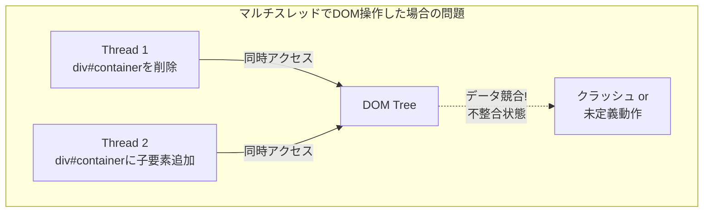

DOMにロック機構を導入すれば理論的には解決可能だが、デッドロックやパフォーマンス低下のリスクを考えると、Web開発者にスレッドセーフなコードを書くことを求めるのは現実的ではない。そこでJavaScriptは **シングルスレッドモデル** を採用し、常に1つのスレッドだけがJavaScriptコードを実行するという制約を設けた。

### 1.2 シングルスレッドの意味

シングルスレッドとは、**JavaScriptのコードが一度に1つの処理しか実行しない** ということを意味する。これは非常に重要な特性であり、以下のような保証を開発者に与える。

- **関数の実行は中断されない**（Run-to-Completion）: ある関数が実行を開始したら、その関数が完了するまで他のJavaScriptコードは実行されない
- **共有状態へのロックは不要**: DOMの操作やグローバル変数の読み書きにおいて、競合を心配する必要がない
- **実行順序が予測可能**: 同期的なコードの実行順序は記述順に確定する

```javascript
let counter = 0;

function increment() {
  // No race condition: single-threaded guarantee
  const current = counter;
  counter = current + 1;
}

// Even if called rapidly, each call runs to completion
increment();
increment();
console.log(counter); // Always 2, never 1
```

しかし、シングルスレッドモデルには本質的な問題がある。**ブロッキング操作がすべてを停止させる** という点だ。ネットワークリクエストの応答を待つ間、ファイルの読み込みが完了するまでの間、すべてのUI操作が止まり、ページは応答不能になる。

この問題を解決するのが **非同期処理** であり、その中核メカニズムが **イベントループ** である。

### 1.3 ブラウザの実態 — シングルスレッドではない

誤解されがちだが、**ブラウザ自体はマルチスレッド** である。シングルスレッドなのはあくまでJavaScriptの実行エンジン（メインスレッド）だけであり、ブラウザは多くの処理を別スレッドで並行に実行している。

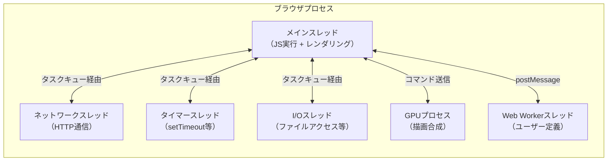

ネットワーク通信、タイマーの管理、ファイルI/Oなどは別スレッドで実行され、完了したらメインスレッドのタスクキューにコールバックが投入される。メインスレッドはイベントループを通じてこれらのタスクを1つずつ取り出し、実行する。これが「シングルスレッドでありながら非同期処理が可能」な仕組みの核心である。

## 2. コールスタックとヒープ

### 2.1 メモリ構造の概要

JavaScriptエンジン（V8, SpiderMonkey, JavaScriptCore等）の実行時メモリは、大きく分けて **コールスタック（Call Stack）** と **ヒープ（Heap）** の2つの領域で構成される。

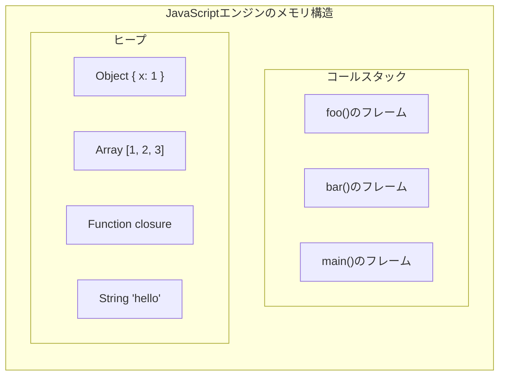

**コールスタック** は、現在実行中の関数呼び出しの連鎖を管理するLIFO（Last In, First Out）データ構造である。各関数呼び出しは **スタックフレーム** としてスタックに積まれ、関数が返ると取り除かれる。スタックフレームには、関数のローカル変数、引数、戻りアドレスなどが格納される。

**ヒープ** は、オブジェクト、配列、クロージャなどの動的に確保されるデータが格納される広大なメモリ領域である。ガベージコレクタ（GC）によって自動的に管理される。

### 2.2 コールスタックの動作

具体的なコード例でコールスタックの動作を追ってみよう。

```javascript
function multiply(a, b) {
  return a * b;
}

function square(n) {
  return multiply(n, n);
}

function printSquare(n) {
  const result = square(n);
  console.log(result);
}

printSquare(5);
```

この実行におけるコールスタックの遷移は以下のようになる。

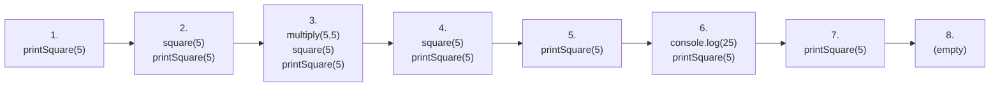

各ステップの説明は以下の通りである。

1. `printSquare(5)` が呼ばれ、スタックに積まれる
2. `printSquare` 内で `square(5)` が呼ばれ、スタックに積まれる
3. `square` 内で `multiply(5, 5)` が呼ばれ、スタックに積まれる
4. `multiply` が `25` を返し、スタックから取り除かれる
5. `square` が `25` を返し、スタックから取り除かれる
6. `console.log(25)` が呼ばれ、スタックに積まれる
7. `console.log` が完了し、スタックから取り除かれる
8. `printSquare` が完了し、スタックが空になる

### 2.3 スタックオーバーフロー

コールスタックには有限のサイズがある（ブラウザやNode.jsの実装により異なるが、おおよそ10,000〜25,000フレーム程度）。再帰呼び出しが終了条件なく続くと、スタックが溢れて **RangeError: Maximum call stack size exceeded** が発生する。

```javascript
function recurse() {
  // No base case: infinite recursion
  return recurse();
}

recurse(); // RangeError: Maximum call stack size exceeded
```

### 2.4 コールスタックとイベントループの関係

イベントループにとって、コールスタックが空になるタイミングは極めて重要である。**コールスタックが空になったときだけ、イベントループは次のタスクをキューから取り出して実行できる**。つまり、長時間コールスタックを占有する重い同期処理は、他のすべてのタスク（UIの更新、イベント処理、タイマーコールバック等）をブロックしてしまう。

```javascript
// BAD: blocks the event loop for ~5 seconds
function heavyComputation() {
  const start = Date.now();
  while (Date.now() - start < 5000) {
    // Busy loop: call stack is never empty
  }
}

heavyComputation();
// During these 5 seconds, no click events, no rendering, no timers
```

## 3. イベントループ

### 3.1 イベントループとは何か

**イベントループ（Event Loop）** は、JavaScriptランタイムの中核メカニズムであり、シングルスレッドのJavaScriptが非同期処理を実現するための仕組みである。HTML仕様（HTML Living Standard）で正式に定義されており、ブラウザの実装はこの仕様に準拠する。

イベントループの基本的な役割は、**コールスタックとタスクキューを監視し、コールスタックが空になったらキューからタスクを取り出して実行する** というものだ。

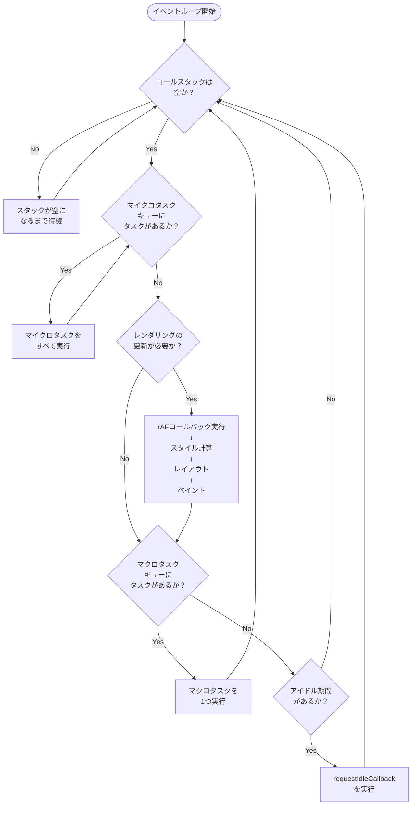

### 3.2 イベントループの1サイクル

HTML仕様に基づくイベントループの1サイクルを、より詳細に記述すると以下のようになる。

1. **マクロタスクを1つ取り出して実行する**: タスクキュー（マクロタスクキュー）から最も古いタスクを1つ取り出し、実行する。このタスクの実行中に新たなマイクロタスクやマクロタスクがキューに追加されることがある
2. **マイクロタスクキューを空にする**: マイクロタスクキューにタスクが存在する限り、すべてのマイクロタスクを順次実行する。マイクロタスクの実行中に新たなマイクロタスクが追加された場合も、そのサイクル内で処理される
3. **レンダリングの更新**（ブラウザ環境の場合）: 必要に応じて、`requestAnimationFrame` コールバックの実行、スタイルの再計算、レイアウト、ペイントを行う。レンダリングは通常60fps（約16.67ms間隔）で行われるが、ブラウザの判断で省略されることもある
4. **1に戻る**: 以上を無限に繰り返す

::: tip イベントループは「ループ」である
イベントループという名前の通り、これは文字通り無限ループである。ブラウザのタブが開いている限り（あるいはNode.jsプロセスが稼働している限り）、このループは回り続ける。タスクがない場合はスリープ状態に入り、新たなタスクが到着すると起き上がる。
:::

### 3.3 タスクキューの実体

仕様上、イベントループは複数のタスクキューを持つことができる。ブラウザは各タスクソース（ネットワーク応答、ユーザー操作、タイマー等）ごとにキューを分け、タスクの種類に応じて優先度を付けることが許されている。

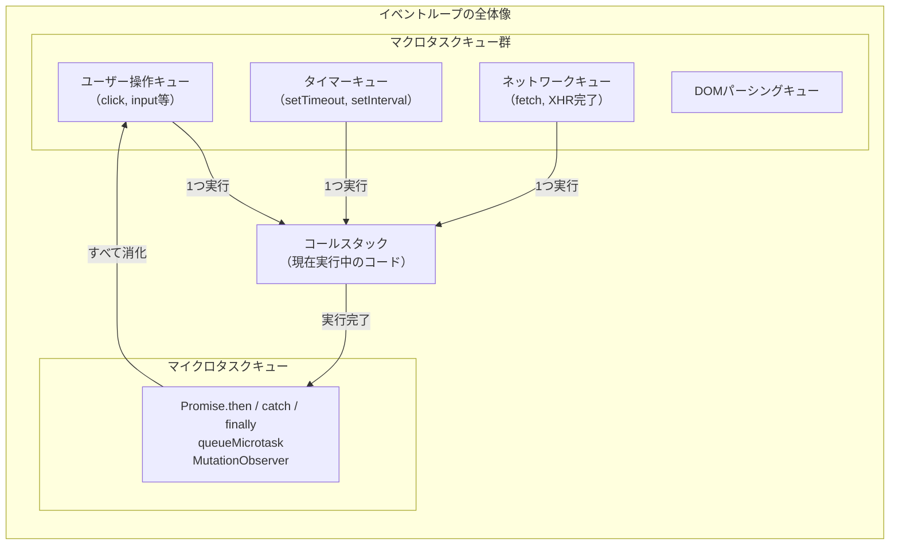

重要な点は、**マイクロタスクキューは1つだけ** であり、**マクロタスクキューは複数存在しうる** ということだ。また、マイクロタスクキューはマクロタスクキューよりも **常に優先的に** 処理される。

## 4. マクロタスクとマイクロタスク

### 4.1 マクロタスク（Macrotask / Task）

マクロタスクとは、イベントループの各サイクルで **1つずつ** 処理されるタスクのことである。以下のAPIがマクロタスクを生成する。

| API | 説明 |
|-----|------|
| `setTimeout` / `setInterval` | 指定時間後にコールバックをキューに追加 |
| `setImmediate` | Node.js固有。現在のI/Oサイクル後に実行 |
| I/O操作の完了コールバック | ネットワーク応答、ファイル読み書き完了 |
| UIイベントハンドラ | click, scroll, keydown等のイベント |
| `MessageChannel` | postMessageによるメッセージ |
| `requestAnimationFrame` | 次の描画フレーム前に実行（※分類については後述） |

### 4.2 マイクロタスク（Microtask）

マイクロタスクとは、現在のタスクが完了した直後に、**次のマクロタスクの前に** 実行されるタスクのことである。以下のAPIがマイクロタスクを生成する。

| API | 説明 |
|-----|------|
| `Promise.then` / `catch` / `finally` | Promise の解決・拒否時のコールバック |
| `queueMicrotask` | 明示的にマイクロタスクをキューに追加 |
| `MutationObserver` | DOM変更の監視コールバック |
| `process.nextTick` | Node.js固有。マイクロタスクよりもさらに優先 |

### 4.3 実行順序の実例

マクロタスクとマイクロタスクの実行順序を理解するために、以下のコードを見てみよう。

```javascript
console.log("1: script start");

setTimeout(() => {
  console.log("2: setTimeout");
}, 0);

Promise.resolve()
  .then(() => {
    console.log("3: promise 1");
  })
  .then(() => {
    console.log("4: promise 2");
  });

queueMicrotask(() => {
  console.log("5: queueMicrotask");
});

console.log("6: script end");
```

出力結果は以下のようになる。

```
1: script start
6: script end
3: promise 1
5: queueMicrotask
4: promise 2
2: setTimeout
```

この実行順序を段階的に追ってみよう。

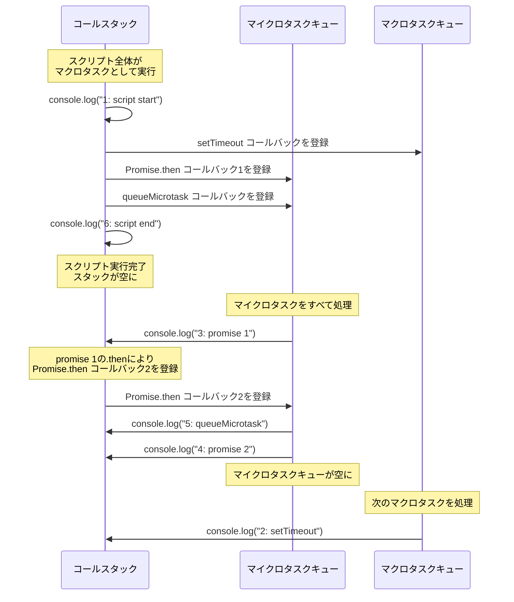

**ステップ1: スクリプトの同期実行**

スクリプト自体が最初のマクロタスクとして実行される。`console.log("1: script start")` と `console.log("6: script end")` は同期的に実行され、即座に出力される。`setTimeout` のコールバックはマクロタスクキューに、`Promise.then` と `queueMicrotask` のコールバックはマイクロタスクキューに登録される。

**ステップ2: マイクロタスクの消化**

スクリプトの実行が完了してコールスタックが空になると、イベントループはマイクロタスクキューを確認する。キューには `promise 1` と `queueMicrotask` のコールバックがある。まず `promise 1` が実行され、その結果 `promise 2` のコールバックが新たにマイクロタスクキューに追加される。次に `queueMicrotask` のコールバックが実行される。さらに `promise 2` のコールバックが実行される。マイクロタスクキューが空になるまで処理が続く。

**ステップ3: マクロタスクの実行**

マイクロタスクキューが空になって初めて、イベントループは次のマクロタスクである `setTimeout` のコールバックを取り出して実行する。

### 4.4 マイクロタスクの「飢餓」問題

マイクロタスクキューは空になるまですべて処理されるという性質から、マイクロタスクが連鎖的に新しいマイクロタスクを生成し続けると、**マクロタスクが永遠に実行されない**（＝UIが応答しなくなる）という問題が発生しうる。

```javascript
// WARNING: This will freeze the browser!
function infiniteMicrotask() {
  queueMicrotask(() => {
    // Each microtask spawns another microtask
    infiniteMicrotask();
  });
}

infiniteMicrotask();
// Macrotasks (rendering, user events) will NEVER execute
```

これは `while(true)` による無限ループと同様の効果を持つが、コールスタックは各マイクロタスクの実行ごとに空になるため、スタックオーバーフローは発生しない。代わりに、ブラウザのレンダリングとユーザーイベントの処理が完全にブロックされる。

### 4.5 より複雑な実行順序の例

入れ子になったタイマーとPromiseの組み合わせを見てみよう。

```javascript
console.log("1");

setTimeout(() => {
  console.log("2");
  Promise.resolve().then(() => {
    console.log("3");
  });
}, 0);

Promise.resolve().then(() => {
  console.log("4");
  setTimeout(() => {
    console.log("5");
  }, 0);
});

console.log("6");
```

出力結果は以下の通りである。

```
1
6
4
2
3
5
```

解説:

1. 同期コードの `1` と `6` が先に出力される
2. マイクロタスクの `4` が実行される。この中で `setTimeout` が登録される
3. マクロタスクキューから `setTimeout`（`2` を出力するもの）が取り出され実行される。この中で `Promise.then`（`3` を出力するもの）が登録される
4. マイクロタスクの `3` が実行される
5. 次のマクロタスクとして `setTimeout`（`5` を出力するもの）が実行される

## 5. Promiseの内部実装

### 5.1 Promiseとは何か

**Promise** は、非同期処理の最終的な完了（または失敗）を表現するオブジェクトである。ES2015（ES6）で言語仕様に追加された。

Promiseは以下の3つの状態のいずれかを取る。

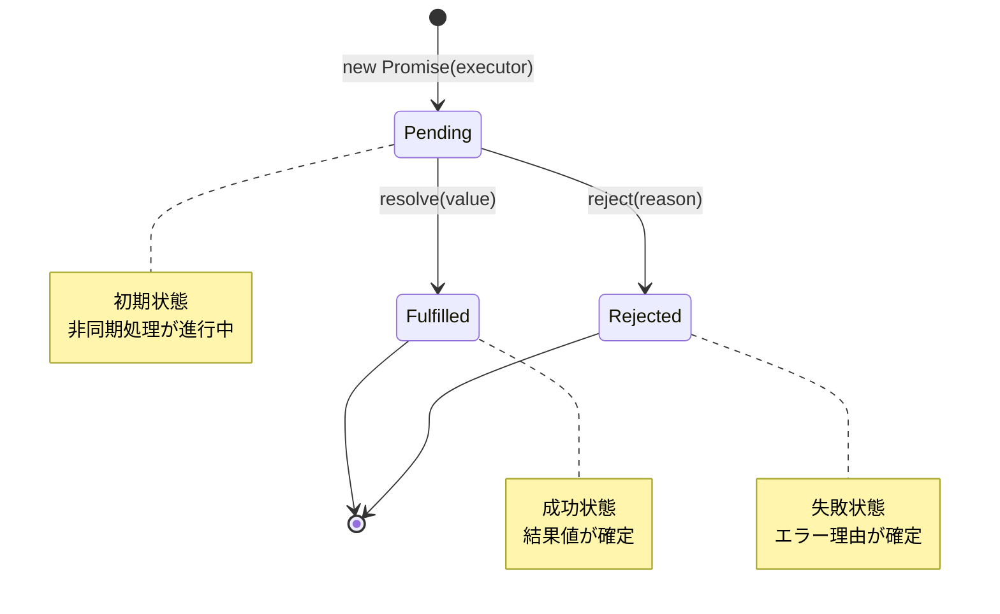

- **Pending（保留中）**: 初期状態。まだ結果が確定していない
- **Fulfilled（履行済み）**: 非同期処理が成功し、結果値が確定した状態
- **Rejected（拒否済み）**: 非同期処理が失敗し、エラー理由が確定した状態

一度FulfilledまたはRejectedに遷移したPromiseは、二度と状態が変わらない（**不変（immutable）な遷移**）。

### 5.2 Promise/A+ 仕様の核心

Promiseの動作は [Promises/A+](https://promisesaplus.com/) 仕様で厳密に定義されている。この仕様の最も重要なルールは、**`.then()` のコールバックは常に非同期的に呼び出される** という点である。

```javascript
const p = Promise.resolve(42);

p.then((value) => {
  // This callback is ALWAYS asynchronous, even though p is already resolved
  console.log("then:", value);
});

console.log("sync");

// Output:
// sync
// then: 42
```

`p` は既に解決済みであるにもかかわらず、`.then()` のコールバックは同期的には実行されず、現在の同期コードの実行がすべて完了した後にマイクロタスクとして実行される。この仕様上の保証により、Promiseのコールバックが同期的に呼ばれるか非同期的に呼ばれるかで動作が変わるという、いわゆる **Zalgo問題** を回避できる。

### 5.3 簡易的なPromise実装

Promiseの内部動作を理解するために、簡易的な実装を見てみよう。これは実際のECMAScript仕様に基づく完全な実装ではないが、核心的なメカニズムを示している。

```javascript
class SimplePromise {
  #state = "pending";
  #value = undefined;
  #handlers = [];

  constructor(executor) {
    const resolve = (value) => {
      if (this.#state !== "pending") return; // Ignore if already settled
      this.#state = "fulfilled";
      this.#value = value;
      this.#executeHandlers();
    };

    const reject = (reason) => {
      if (this.#state !== "pending") return; // Ignore if already settled
      this.#state = "rejected";
      this.#value = reason;
      this.#executeHandlers();
    };

    try {
      executor(resolve, reject);
    } catch (err) {
      reject(err);
    }
  }

  then(onFulfilled, onRejected) {
    return new SimplePromise((resolve, reject) => {
      this.#handlers.push({
        onFulfilled,
        onRejected,
        resolve,
        reject,
      });

      if (this.#state !== "pending") {
        this.#executeHandlers();
      }
    });
  }

  #executeHandlers() {
    if (this.#state === "pending") return;

    // CRITICAL: handlers must be called asynchronously (as microtasks)
    queueMicrotask(() => {
      while (this.#handlers.length > 0) {
        const handler = this.#handlers.shift();
        const callback =
          this.#state === "fulfilled"
            ? handler.onFulfilled
            : handler.onRejected;

        if (typeof callback !== "function") {
          // Pass through the value/reason if no handler
          (this.#state === "fulfilled" ? handler.resolve : handler.reject)(
            this.#value
          );
          continue;
        }

        try {
          const result = callback(this.#value);
          handler.resolve(result);
        } catch (err) {
          handler.reject(err);
        }
      }
    });
  }
}
```

この実装のポイントは以下の通りである。

1. **状態の不変性**: `resolve` / `reject` は、状態が `pending` のときだけ動作する。一度遷移した状態は変わらない
2. **非同期コールバック**: `#executeHandlers` 内で `queueMicrotask` を使い、コールバックの実行を必ずマイクロタスクとして遅延させている
3. **チェーン**: `.then()` は新しい `SimplePromise` を返す。前のPromiseの結果が次のPromiseの解決値になる
4. **エラー伝播**: コールバックが存在しない場合、値やエラーは次のPromiseにそのまま伝播する

### 5.4 Promise Resolution Procedure

Promiseの解決処理には、**thenable** と呼ばれる概念が深く関わる。thenableとは、`.then` メソッドを持つ任意のオブジェクトである。Promiseの `resolve` に別のPromise（またはthenable）が渡された場合、そのPromiseの結果を待ってから自身の状態を遷移させる。

```javascript
const p1 = new Promise((resolve) => {
  // resolve with another Promise
  resolve(
    new Promise((innerResolve) => {
      setTimeout(() => innerResolve(42), 1000);
    })
  );
});

// p1 will be fulfilled with 42 after 1 second
p1.then((value) => console.log(value)); // 42
```

この仕組みにより、Promiseチェーンの途中で別の非同期処理を挟むことが自然にできる。ECMAScript仕様ではこの処理を **Promise Resolution Procedure** と呼び、再帰的にthenableを解決する手順が定められている。

## 6. async/awaitのトランスパイル — 構文糖衣の裏側

### 6.1 async/awaitとは何か

`async/await` はES2017で導入された構文であり、Promiseベースの非同期コードを同期的な見た目で書けるようにする **構文糖衣（Syntactic Sugar）** である。

```javascript
// Promise chain style
function fetchUserData(userId) {
  return fetch(`/api/users/${userId}`)
    .then((response) => response.json())
    .then((user) => fetch(`/api/posts?userId=${user.id}`))
    .then((response) => response.json())
    .then((posts) => ({ user, posts }));
}

// async/await style (equivalent)
async function fetchUserData(userId) {
  const response = await fetch(`/api/users/${userId}`);
  const user = await response.json();
  const postsResponse = await fetch(`/api/posts?userId=${user.id}`);
  const posts = await postsResponse.json();
  return { user, posts };
}
```

`async` 関数は常にPromiseを返す。`await` 式はPromiseの解決を「待つ」ように見えるが、実際にはスレッドをブロックしているわけではない。では、内部ではどのような変換が行われているのか。

### 6.2 ジェネレータベースの変換

`async/await` が登場する以前、同様のパターンはジェネレータ（Generator）と `yield` を使って実現されていた。実際、Babelなどのトランスパイラは `async/await` をジェネレータベースのコードに変換していた。

元のasync関数を見てみよう。

```javascript
async function example() {
  console.log("start");
  const a = await fetchA();
  console.log("a:", a);
  const b = await fetchB(a);
  console.log("b:", b);
  return b;
}
```

これをジェネレータベースに変換すると、概念的には以下のようになる。

```javascript
function example() {
  return spawn(function* () {
    console.log("start");
    const a = yield fetchA();
    console.log("a:", a);
    const b = yield fetchB(a);
    console.log("b:", b);
    return b;
  });
}

function spawn(generatorFunc) {
  return new Promise((resolve, reject) => {
    const generator = generatorFunc();

    function step(nextFunc) {
      let result;
      try {
        result = nextFunc();
      } catch (err) {
        return reject(err);
      }

      if (result.done) {
        return resolve(result.value);
      }

      // Wrap the yielded value in a Promise and recurse
      Promise.resolve(result.value).then(
        (value) => step(() => generator.next(value)),
        (err) => step(() => generator.throw(err))
      );
    }

    step(() => generator.next());
  });
}
```

### 6.3 変換の仕組みを詳しく見る

この変換の核心は、**ジェネレータの中断・再開メカニズムをPromiseの解決と連動させる** という点にある。

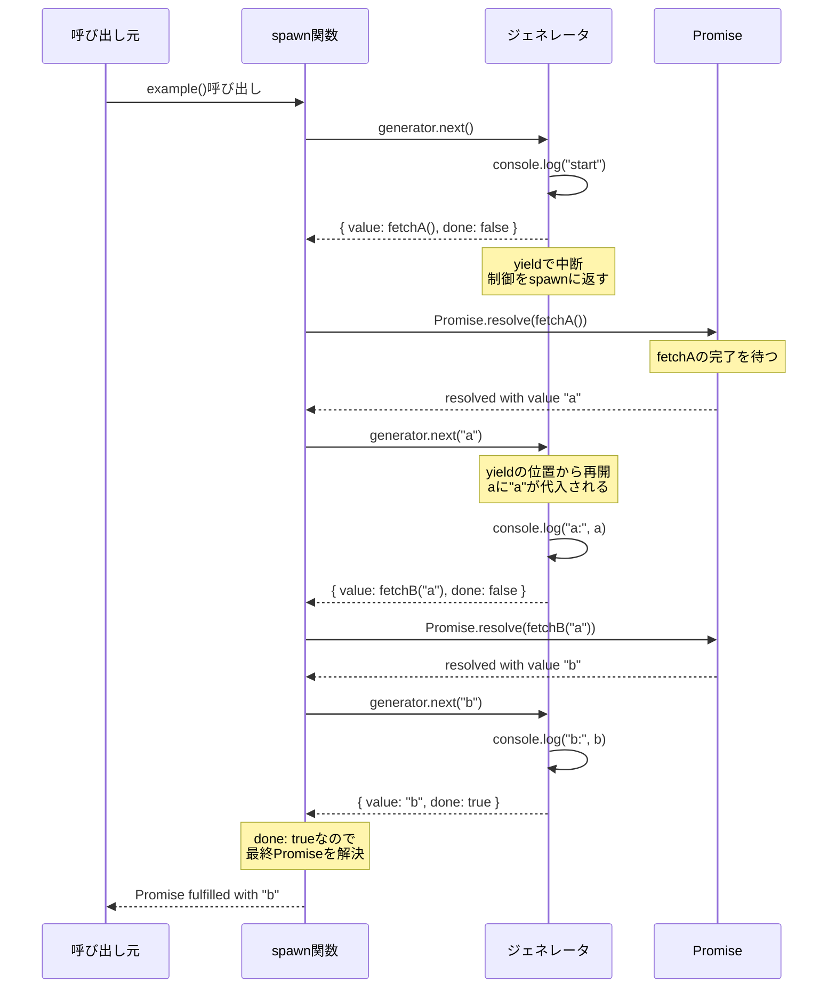

重要なのは以下の点である。

1. `yield`（= `await`）のたびにジェネレータは **中断** し、制御をイベントループに返す
2. Promiseが解決されると、マイクロタスクとして `generator.next(value)` が呼ばれ、ジェネレータが **再開** する
3. エラーの場合は `generator.throw(err)` が呼ばれ、ジェネレータ内で `try/catch` が効く
4. `done: true` になったら、戻り値で最終的なPromiseを解決する

### 6.4 ECMAScript仕様上の実装

現代のJavaScriptエンジンは実際にはジェネレータへの変換を行わず、`async/await` をネイティブにサポートしている。V8エンジンの内部では、`async` 関数の実行コンテキストは **暗黙のPromise（implicit Promise）** と結びつけられ、`await` に到達すると実行コンテキストが一時停止される。

ECMAScript仕様では、`await` は以下のように定義されている（概略）。

1. `await expr` を評価する
2. `expr` の結果を `Promise.resolve()` でラップする（既にPromiseの場合でも）
3. 現在の `async` 関数の実行を中断する
4. ラップしたPromiseに `.then()` ハンドラを設定し、Promiseが解決されたら `async` 関数を再開する
5. 再開時、`await` 式の評価結果はPromiseの解決値になる

::: warning await のコスト
`await` は実行のたびにマイクロタスクを1つ以上生成する。V8エンジンはES2020以降の仕様変更に合わせて最適化を行い、既にネイティブPromiseである場合の余分なマイクロタスク生成を削減した。しかし、`await` をループ内で大量に使う場合、マイクロタスクのオーバーヘッドが蓄積する可能性があることに留意すべきである。
:::

### 6.5 async/awaitのエラーハンドリング

`async/await` の大きな利点の1つは、同期コードと同じ `try/catch` 構文でエラーハンドリングができることである。

```javascript
async function riskyOperation() {
  try {
    const response = await fetch("/api/data");
    if (!response.ok) {
      throw new Error(`HTTP error: ${response.status}`);
    }
    const data = await response.json();
    return data;
  } catch (err) {
    // Catches both network errors and HTTP errors
    console.error("Operation failed:", err.message);
    throw err; // Re-throw to propagate
  } finally {
    // Always runs, even after throw
    console.log("Cleanup complete");
  }
}
```

これはPromiseチェーンの `.catch()` に相当するが、複数の `await` にまたがるエラーハンドリングが格段に読みやすくなる。ジェネレータベースの変換では、`generator.throw(err)` によってジェネレータ内の `try/catch` にエラーが投げ込まれるため、この自然なエラーハンドリングが実現する。

## 7. queueMicrotask

### 7.1 queueMicrotaskの背景

`queueMicrotask` は、マイクロタスクキューに直接タスクを追加するためのAPIである。HTML仕様で定義されており、ブラウザとNode.js（v11以降）の両方で利用できる。

`queueMicrotask` が追加される以前、マイクロタスクをキューに追加する唯一の方法は `Promise.resolve().then(callback)` というイディオムであった。

```javascript
// Old pattern: using Promise to queue a microtask
Promise.resolve().then(() => {
  console.log("microtask via Promise");
});

// Modern pattern: explicit microtask queuing
queueMicrotask(() => {
  console.log("microtask via queueMicrotask");
});
```

両者は機能的にはほぼ等価であるが、`queueMicrotask` には以下の利点がある。

1. **意図の明確さ**: Promiseのセマンティクスを借りずに、「マイクロタスクとして実行したい」という意図を直接表現できる
2. **軽量性**: Promiseオブジェクトの生成を回避できるため、わずかにオーバーヘッドが小さい
3. **エラーハンドリングの違い**: `queueMicrotask` 内でのエラーはグローバルエラーハンドラ（`window.onerror` や `unhandledrejection`）に伝播するのではなく、通常の例外として処理される

### 7.2 ユースケース

`queueMicrotask` の典型的なユースケースは、**現在の同期コードの実行完了後、次のマクロタスクの前に** 何かを実行したい場合である。

**バッチ処理**: 複数の状態変更をバッチ処理し、一度にまとめて反映する。

```javascript
class StateManager {
  #pendingUpdates = [];
  #flushScheduled = false;

  update(key, value) {
    this.#pendingUpdates.push({ key, value });

    if (!this.#flushScheduled) {
      this.#flushScheduled = true;
      queueMicrotask(() => {
        // Flush all pending updates at once
        this.#flush();
        this.#flushScheduled = false;
      });
    }
  }

  #flush() {
    const updates = this.#pendingUpdates.splice(0);
    // Apply all updates in a single batch
    console.log("Flushing", updates.length, "updates");
    for (const { key, value } of updates) {
      this.state[key] = value;
    }
    this.notify();
  }
}
```

この方法を使えば、同一の同期実行コンテキスト内で `update()` が何回呼ばれても、実際のDOM更新（`#flush`）は一度だけ行われる。Reactのバッチ更新の仕組みも、概念的にはこれと同様のアイデアに基づいている。

### 7.3 queueMicrotaskとsetTimeout(fn, 0)の違い

`setTimeout(fn, 0)` もよく使われる非同期遅延パターンだが、これはマクロタスクを生成する。したがって、実行タイミングが大きく異なる。

```javascript
console.log("1: sync");

setTimeout(() => console.log("2: setTimeout"), 0);

queueMicrotask(() => console.log("3: microtask"));

Promise.resolve().then(() => console.log("4: promise"));

console.log("5: sync");

// Output:
// 1: sync
// 5: sync
// 3: microtask
// 4: promise
// 2: setTimeout
```

`setTimeout(fn, 0)` は「できるだけ早く」を意図しているように見えるが、実際にはマクロタスクキューに積まれるため、すべてのマイクロタスクが処理された後にしか実行されない。さらに、HTML仕様ではネストされた `setTimeout` に最低4msの遅延が規定されている（5回以上のネスト時）。

## 8. requestAnimationFrameとrequestIdleCallback

### 8.1 requestAnimationFrame（rAF）

`requestAnimationFrame`（以下rAF）は、次のブラウザ描画フレームの直前にコールバックを実行するためのAPIである。アニメーションやビジュアル更新に最適化されている。

```javascript
function animate(timestamp) {
  // Update animation state based on timestamp
  element.style.transform = `translateX(${Math.sin(timestamp / 1000) * 100}px)`;

  // Request next frame
  requestAnimationFrame(animate);
}

requestAnimationFrame(animate);
```

#### rAFのイベントループ上の位置づけ

rAFはマクロタスクでもマイクロタスクでもない、独自のカテゴリに属するコールバックである。イベントループの1サイクルにおいて、rAFのコールバックはレンダリングステップの一部として実行される。

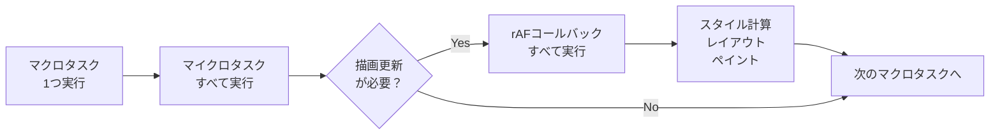

重要な特性は以下の通りである。

- **呼び出し頻度**: ディスプレイのリフレッシュレートに合わせて呼ばれる（通常60Hz = 約16.67ms間隔）
- **ブラウザの最適化**: タブが非表示の場合、ブラウザはrAFの呼び出しを停止または大幅に減速させる。これによりバッテリー消費を抑える
- **フレーム内での一括実行**: あるフレームのrAFコールバックはすべて同じフレーム内で実行される。rAFコールバック内で新たに `requestAnimationFrame` を呼んだ場合、その新しいコールバックは**次のフレーム**で実行される

#### setTimeoutとrAFのアニメーション比較

```javascript
// BAD: setTimeout-based animation
function animateWithTimeout() {
  element.style.left = parseInt(element.style.left) + 1 + "px";
  setTimeout(animateWithTimeout, 16); // Approximately 60fps
}

// GOOD: rAF-based animation
function animateWithRAF() {
  element.style.left = parseInt(element.style.left) + 1 + "px";
  requestAnimationFrame(animateWithRAF);
}
```

`setTimeout` によるアニメーションには以下の問題がある。

- タイマーの精度が保証されない（最低4msの遅延、他のタスクによるズレ）
- ディスプレイのリフレッシュレートと同期しないため、**画面のちらつき（ジャンク）** が発生しうる
- バックグラウンドタブでも実行され続け、リソースを無駄に消費する

rAFはこれらの問題をすべて解決する。ブラウザの描画パイプラインに統合されているため、確実にフレーム間の適切なタイミングで実行される。

### 8.2 requestIdleCallback（rIC）

`requestIdleCallback`（以下rIC）は、ブラウザのアイドル期間にコールバックを実行するためのAPIである。優先度の低いバックグラウンド処理に適している。

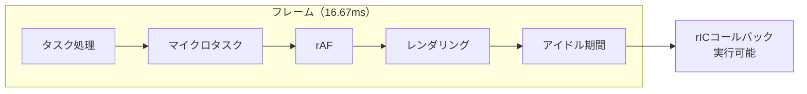

各フレームの中で、タスク処理・レンダリングが完了してもまだ時間が余っている場合、その「アイドル期間」にrICのコールバックが実行される。

```javascript
function processLargeDataSet(data) {
  let index = 0;

  function processChunk(deadline) {
    // Process items while there's idle time remaining
    while (index < data.length && deadline.timeRemaining() > 1) {
      processItem(data[index]);
      index++;
    }

    if (index < data.length) {
      // More work to do: request another idle callback
      requestIdleCallback(processChunk);
    } else {
      console.log("Processing complete");
    }
  }

  requestIdleCallback(processChunk, { timeout: 5000 });
}
```

#### rICの特性

- **deadline.timeRemaining()**: コールバックには `IdleDeadline` オブジェクトが渡され、残りのアイドル時間をミリ秒で取得できる。通常は最大50msである
- **timeout オプション**: 指定時間内にアイドル期間が訪れなかった場合、強制的にコールバックを実行する
- **実行保証なし**: 高負荷時にはアイドル期間がほとんど発生しない可能性がある。`timeout` を指定しない場合、コールバックが長期間実行されないこともある

::: warning rICの互換性と代替手段
`requestIdleCallback` はFirefoxとChromiumベースのブラウザで利用可能だが、Safariでは長らくサポートされていなかった（Safari 16.4でようやくサポートされた）。Reactはこれに依存せず、独自のスケジューラ（`scheduler` パッケージ）を実装して、`MessageChannel` ベースの擬似アイドルコールバックを実現している。
:::

### 8.3 rAFとrICの使い分け

| 用途 | 適切なAPI | 理由 |
|------|----------|------|
| アニメーション更新 | `requestAnimationFrame` | 描画と同期し、安定したフレームレートを保証 |
| レイアウト読み取り | `requestAnimationFrame` | 最新のレイアウト情報にアクセスできる |
| 分析データ送信 | `requestIdleCallback` | ユーザー体験を阻害しない |
| 遅延初期化 | `requestIdleCallback` | ページ表示直後の処理負荷を軽減 |
| DOM更新のバッチ処理 | `queueMicrotask` | 次の描画前に確実に反映 |
| 即座のUI応答 | `queueMicrotask` | 最速のスケジューリング |

## 9. Node.jsとの違い

### 9.1 Node.jsのイベントループ

Node.jsのイベントループはブラウザとは異なり、**libuv** ライブラリによって実装されている。libuvはクロスプラットフォームの非同期I/Oライブラリであり、Node.jsの非同期処理の基盤である。

Node.jsのイベントループは、ブラウザのように「レンダリングステップ」を持たない代わりに、**明確に定義された複数のフェーズ** を順番に実行する。

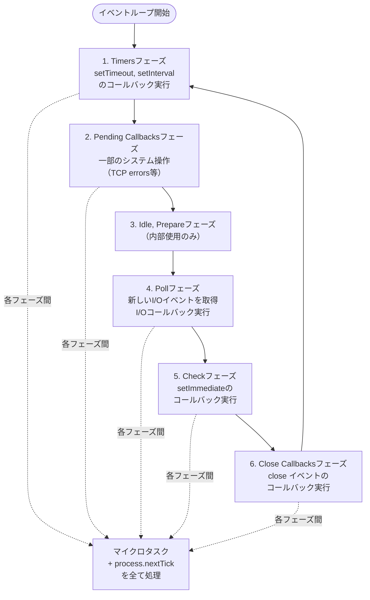

### 9.2 各フェーズの詳細

**1. Timersフェーズ**: `setTimeout` と `setInterval` で登録されたコールバックのうち、指定時間が経過したものを実行する。ブラウザと同様に、タイマーの精度は保証されない。Pollフェーズの処理がタイマーの実行を遅らせることがある。

**2. Pending Callbacksフェーズ**: 前回のループイテレーションで遅延された一部のシステム操作のコールバックを実行する。例えば、TCPソケットで `ECONNREFUSED` エラーが発生した場合のコールバックがここで処理される。

**3. Idle, Prepareフェーズ**: Node.jsの内部でのみ使用されるフェーズであり、アプリケーションコードには直接関係しない。

**4. Pollフェーズ**: このフェーズはイベントループの中で最も重要である。新しいI/Oイベントを取得し、I/O関連のコールバック（タイマーとsetImmediate、closeコールバックを除くほぼすべて）を実行する。Pollキューが空で、`setImmediate` がスケジュールされていない場合、イベントループはここで新しいI/Oイベントの到着を待つ。

**5. Checkフェーズ**: `setImmediate` のコールバックを実行する。`setImmediate` はPollフェーズの完了直後に実行されることが保証されている。

**6. Close Callbacksフェーズ**: `socket.on('close', ...)` のようなcloseイベントのコールバックを実行する。

### 9.3 process.nextTickとsetImmediate

Node.js固有のAPIとして、`process.nextTick` と `setImmediate` がある。これらの命名は歴史的な経緯から直感に反している。

```javascript
setImmediate(() => {
  console.log("1: setImmediate");
});

process.nextTick(() => {
  console.log("2: process.nextTick");
});

Promise.resolve().then(() => {
  console.log("3: Promise.then");
});

// Output:
// 2: process.nextTick
// 3: Promise.then
// 1: setImmediate
```

`process.nextTick` は名前に反して「次のティック」ではなく、**現在の操作の直後、他のどんなI/Oやタイマーよりも先に** 実行される。実際には、Node.jsのマイクロタスクキューよりもさらに優先度が高い。

実行優先度は以下の順序になる。

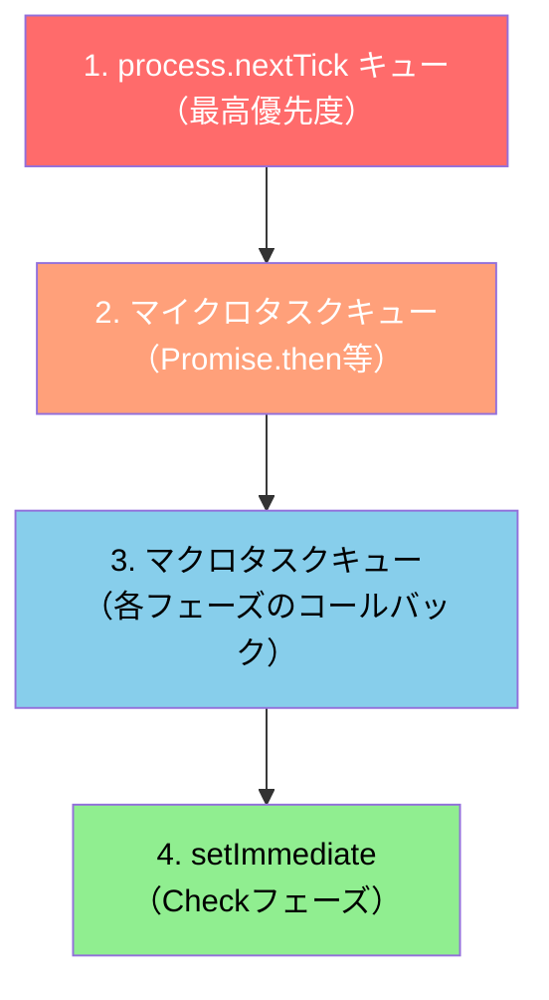

::: danger process.nextTickの再帰的使用
`process.nextTick` はマイクロタスクよりも優先されるため、再帰的に使用すると **I/O飢餓（I/O starvation）** を引き起こす可能性がある。Node.jsの公式ドキュメントでも、多くの場合 `setImmediate` の使用が推奨されている。
:::

```javascript
// DANGEROUS: I/O starvation with process.nextTick
function recursiveNextTick() {
  process.nextTick(() => {
    // This will starve the event loop
    recursiveNextTick();
  });
}

// SAFER: setImmediate allows I/O between calls
function recursiveImmediate() {
  setImmediate(() => {
    // I/O callbacks can run between setImmediate calls
    recursiveImmediate();
  });
}
```

### 9.4 setTimeoutとsetImmediateの実行順序

`setTimeout(fn, 0)` と `setImmediate(fn)` の実行順序は、呼び出しコンテキストによって変わるという有名な落とし穴がある。

```javascript
// Context 1: Main module (non-deterministic order)
setTimeout(() => console.log("timeout"), 0);
setImmediate(() => console.log("immediate"));
// Output: could be either order!

// Context 2: Inside I/O callback (deterministic order)
const fs = require("fs");
fs.readFile(__filename, () => {
  setTimeout(() => console.log("timeout"), 0);
  setImmediate(() => console.log("immediate"));
  // Output: always "immediate" then "timeout"
});
```

メインモジュールで呼ばれた場合、`setTimeout(fn, 0)` の実際の遅延はシステムのクロック精度に依存する。イベントループがTimersフェーズに到達した時点でタイマーが期限切れになっていれば先に実行され、そうでなければ `setImmediate` が先になる。この非決定性はプロセスの負荷状況にも左右される。

一方、I/Oコールバック内で呼ばれた場合、実行はPollフェーズの中にある。Pollフェーズの次はCheckフェーズ（`setImmediate`）であるため、`setImmediate` が常に先に実行される。

### 9.5 ブラウザとNode.jsの主な違いまとめ

| 特性 | ブラウザ | Node.js |
|------|---------|---------|
| イベントループ実装 | HTML仕様準拠（各ブラウザが独自実装） | libuv |
| フェーズ構造 | マクロタスク → マイクロタスク → レンダリング | 6フェーズの明確なサイクル |
| レンダリング | あり（rAF, スタイル計算, レイアウト, ペイント） | なし |
| `setImmediate` | なし（非標準、IEのみ） | あり（Checkフェーズで実行） |
| `process.nextTick` | なし | あり（マイクロタスクより高優先度） |
| `requestAnimationFrame` | あり | なし |
| `requestIdleCallback` | あり | なし |
| マイクロタスクの処理タイミング | マクロタスクの後 | 各フェーズの間 |
| `setTimeout` の最小遅延 | 4ms（ネスト5回以上） | 1ms |
| Web Worker | あり | Worker Threads（v10.5+） |

### 9.6 Denoとの比較

Deno（Ryan DahlがNode.jsの反省を踏まえて開発したランタイム）は、イベントループの実装にRustの非同期ランタイムである **Tokio** を使用している。API面では、Node.jsの `process.nextTick` や `setImmediate` は提供せず、Web標準のAPIに準拠することを方針としている。`queueMicrotask`、`setTimeout`、`requestAnimationFrame`（Deno Deployでは無効）などが利用可能であり、ブラウザのAPIとの互換性を重視した設計となっている。

## 10. 実践的なまとめ — 非同期処理のメンタルモデル

### 10.1 全体像の整理

JavaScriptの非同期モデルを正しく理解するためのメンタルモデルを整理する。

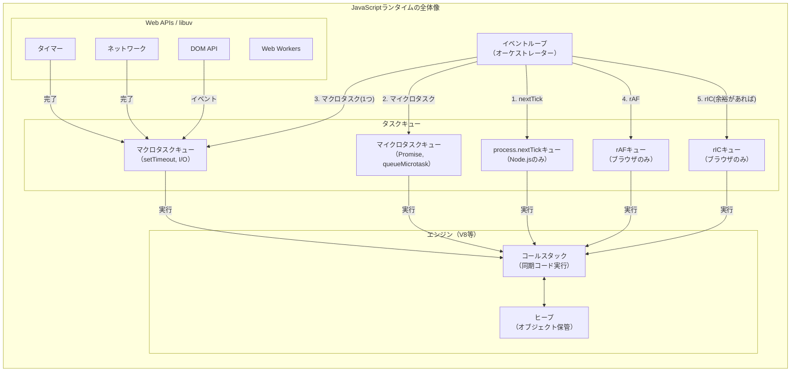

### 10.2 実行順序の判断フローチャート

あるコードの実行順序を予測するための判断基準は以下の通りである。

1. **同期コードは即座に実行される**: コールスタックに直接積まれ、上から順に実行される
2. **`process.nextTick`（Node.jsのみ）が最優先**: マイクロタスクよりも先に処理される
3. **マイクロタスクが次に処理される**: `Promise.then`、`queueMicrotask`、`MutationObserver`
4. **レンダリング関連の処理**（ブラウザのみ）: `requestAnimationFrame` → スタイル計算 → レイアウト → ペイント
5. **マクロタスクが1つ実行される**: `setTimeout`、`setInterval`、I/Oコールバック
6. **アイドル時間があれば**: `requestIdleCallback` が実行される

### 10.3 よくある落とし穴

**落とし穴1: `async` 関数は常にPromiseを返す**

```javascript
async function getValue() {
  return 42; // Implicitly wrapped in Promise.resolve(42)
}

const result = getValue();
console.log(result); // Promise { <fulfilled>: 42 }, NOT 42
console.log(result instanceof Promise); // true
```

**落とし穴2: `await` は次のマイクロタスクまで制御を譲る**

```javascript
async function foo() {
  console.log("foo start");
  await undefined; // Yields control, resumes as microtask
  console.log("foo end");
}

console.log("script start");
foo();
console.log("script end");

// Output:
// script start
// foo start
// script end
// foo end
```

`await undefined` は一見何もしないように見えるが、実際には制御をイベントループに返し、残りのコードはマイクロタスクとして実行される。

**落とし穴3: `for await...of` と並列実行**

```javascript
// SEQUENTIAL: each fetch waits for the previous one
async function fetchSequential(urls) {
  const results = [];
  for (const url of urls) {
    const response = await fetch(url); // Waits one by one
    results.push(await response.json());
  }
  return results;
}

// PARALLEL: all fetches start simultaneously
async function fetchParallel(urls) {
  const promises = urls.map((url) => fetch(url).then((r) => r.json()));
  return Promise.all(promises); // Waits for all at once
}
```

`await` をループ内で逐次的に使うと、各リクエストが前のリクエストの完了を待つため、合計時間は各リクエスト時間の **和** になる。`Promise.all` を使えば並列に実行され、合計時間は最も遅いリクエストの時間程度になる。

**落とし穴4: エラーの未処理**

```javascript
// DANGER: unhandled rejection
async function riskyFetch() {
  const response = await fetch("/api/data"); // May throw
  return response.json();
}

// Calling without catch: unhandled promise rejection
riskyFetch(); // No .catch() and no try/catch around it

// SAFE: always handle errors
riskyFetch().catch((err) => console.error("Failed:", err));
```

`async` 関数の呼び出し元でPromiseの拒否をハンドリングしないと、`unhandledrejection` イベントが発生する。Node.jsではこれがプロセスのクラッシュにつながることがある。

### 10.4 パフォーマンスのためのガイドライン

1. **メインスレッドを長時間ブロックしない**: 重い計算処理は Web Worker に移すか、`requestIdleCallback` で分割実行する
2. **マイクロタスクの連鎖に注意する**: マイクロタスクが大量に生成されると、レンダリングがブロックされる
3. **アニメーションには常に `requestAnimationFrame` を使う**: `setTimeout` / `setInterval` によるアニメーションはジャンクの原因になる
4. **不要な `await` を避ける**: `return await promise` は通常 `return promise` で十分である（try/catch内を除く）
5. **並列化できる `await` は `Promise.all` でまとめる**: 独立した非同期処理を逐次的に `await` するのは無駄である

JavaScriptの非同期モデルは、シングルスレッドという制約の中で最大限の効率を引き出すために設計された精巧な仕組みである。イベントループ、マイクロタスクとマクロタスクの優先度、async/awaitの内部変換を正しく理解することで、パフォーマンスの良い、予測可能な非同期コードを書くことが可能になる。
