# JavaScriptバンドラーの進化（webpack → Vite → Turbopack）

## はじめに

現代のWeb開発において、JavaScriptバンドラーはフロントエンド開発のインフラとも呼べる存在である。ブラウザが直接理解できるのはHTML、CSS、JavaScriptの3つだが、実際の開発ではTypeScript、JSX、CSS Modules、画像アセットなど多種多様なリソースを扱う。これらを最終的にブラウザが実行可能な形にまとめ上げるのがバンドラーの役割だ。

しかし、なぜバンドラーが必要になったのか。そしてなぜ次々と新しいバンドラーが生まれ続けるのか。本記事では、JavaScriptのモジュールシステムの歴史から出発し、webpack、Rollup、esbuild、Vite、Turbopackに至るまでの進化を体系的に解説する。単なるツールの使い方ではなく、それぞれが**どのような問題を解こうとし、どのようなアーキテクチャ上の判断を行ったか**に焦点を当てる。

## 1. 歴史的背景 ― モジュールシステムの進化

バンドラーを理解するには、まずJavaScriptにおけるモジュールシステムの進化を知る必要がある。

### 1.1 グローバルスコープの時代

初期のJavaScript開発では、すべてのコードがグローバルスコープに配置されていた。HTMLの `<script>` タグで複数のファイルを読み込む方式が標準であり、変数名の衝突や読み込み順序の管理が深刻な問題だった。

```html
<!-- Order matters: utils.js must load before app.js -->
<script src="utils.js"></script>
<script src="app.js"></script>
```

### 1.2 IIFE（即時実行関数式）によるスコープの隔離

グローバル汚染を避けるために、IIFE（Immediately Invoked Function Expression）パターンが広まった。関数スコープを利用してモジュールを擬似的に実現する手法である。

```javascript
// IIFE pattern for module isolation
var MyModule = (function () {
  var privateVar = "internal";

  return {
    publicMethod: function () {
      return privateVar;
    },
  };
})();
```

このパターンはjQueryをはじめとする多くのライブラリで採用されたが、依存関係の管理は依然として手動だった。

### 1.3 CommonJS ― サーバーサイドでの標準化

2009年にNode.jsが登場すると、CommonJSモジュールシステムが事実上の標準となった。`require()` と `module.exports` によるシンプルな構文が特徴である。

```javascript
// math.js — CommonJS module
const PI = 3.14159;

function circleArea(r) {
  return PI * r * r;
}

module.exports = { circleArea };
```

```javascript
// app.js — CommonJS consumer
const { circleArea } = require("./math");
console.log(circleArea(5));
```

CommonJSの重要な特徴は**同期的なモジュール読み込み**である。ファイルシステムから直接読み込むNode.jsでは問題にならないが、ネットワーク越しにリソースを取得するブラウザ環境では大きな制約となる。

### 1.4 AMD と RequireJS ― ブラウザ向けの非同期モジュール

ブラウザ向けの非同期モジュール読み込みを解決するために、AMD（Asynchronous Module Definition）が提案された。RequireJSがその代表的な実装である。

```javascript
// AMD style module definition
define(["./dep1", "./dep2"], function (dep1, dep2) {
  return {
    doSomething: function () {
      return dep1.process(dep2.data);
    },
  };
});
```

AMDはブラウザでの動的モジュール読み込みを実現したが、冗長な構文と設定の複雑さから開発者体験には課題があった。

### 1.5 ES Modules（ESM）― 言語仕様としての標準化

2015年にES2015（ES6）で導入されたES Modules（ESM）は、JavaScript言語仕様レベルでのモジュールシステムである。`import` と `export` による静的な構文が最大の特徴だ。

```javascript
// math.js — ES Module
export const PI = 3.14159;

export function circleArea(r) {
  return PI * r * r;
}
```

```javascript
// app.js — ES Module consumer
import { circleArea } from "./math.js";
console.log(circleArea(5));
```

ESMが**静的**であることの意味は非常に大きい。`import` 文はモジュールのトップレベルにしか記述できず、条件分岐の中で動的にモジュールを読み込むことはできない（動的インポート `import()` は別途用意されている）。この静的な性質こそが、Tree Shakingをはじめとする最適化を可能にする基盤となっている。

### 1.6 モジュールシステムの進化とバンドラーの関係

以下の図は、モジュールシステムの進化とバンドラーの登場時期の関係を示している。

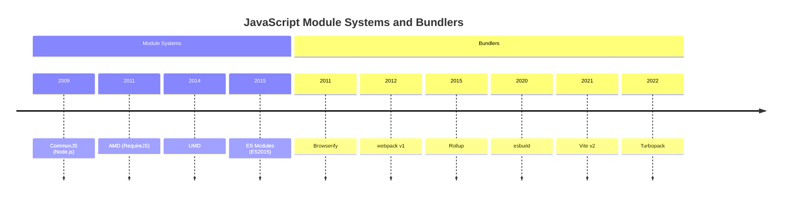

バンドラーの歴史は、これらのモジュールシステム間の非互換性を吸収し、最終的にブラウザが実行可能な形式に変換するという課題の歴史でもある。

## 2. webpack ― 設定可能なバンドラーの王者

### 2.1 webpackの登場と背景

webpackは2012年にTobias Koppersによって開発された。当時はBrowserify（CommonJSモジュールをブラウザ向けにバンドルするツール）が先行していたが、webpackはCSSや画像などJavaScript以外のリソースも統一的に扱える点で差別化を図った。

webpackが解決しようとした根本的な問題は以下の通りである。

1. **モジュールの解決**: CommonJS、AMD、ESMなど複数のモジュール形式を統一的に扱う
2. **アセットの統合**: JavaScript以外のリソース（CSS、画像、フォントなど）もモジュールグラフの一部として管理する
3. **コード分割**: アプリケーションを適切なチャンクに分割し、必要なときに必要な分だけ読み込む
4. **開発体験**: ファイル変更時にブラウザを自動更新するHot Module Replacement（HMR）

### 2.2 コアアーキテクチャ

webpackのアーキテクチャは、**依存グラフの構築**と**バンドル生成**の2つのフェーズで構成される。


#### エントリーポイントと依存グラフ

webpackはエントリーポイントから出発し、`import` や `require()` を再帰的に辿ってすべての依存関係を解決する。この結果として構築されるのが**依存グラフ（Dependency Graph）**である。

```javascript
// webpack.config.js — basic configuration
const path = require("path");

module.exports = {
  entry: "./src/index.js",
  output: {
    filename: "bundle.js",
    path: path.resolve(__dirname, "dist"),
  },
};
```

### 2.3 ローダー ― 変換パイプライン

ローダーはwebpackの最も特徴的な概念の一つである。JavaScript以外のファイルをモジュールとして扱えるように変換する仕組みだ。

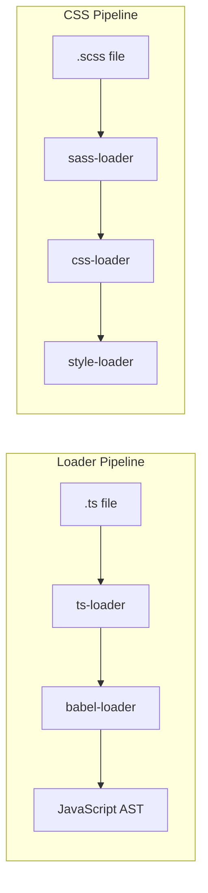

ローダーはチェーン状に構成でき、各ローダーが前のローダーの出力を入力として受け取る。この設計により、任意の変換パイプラインを柔軟に構築できる。

```javascript
// webpack.config.js — loader configuration
module.exports = {
  module: {
    rules: [
      {
        test: /\.tsx?$/,
        use: [
          "babel-loader", // Transform modern JS to compatible JS
          "ts-loader", // Transform TypeScript to JavaScript
        ],
        exclude: /node_modules/,
      },
      {
        test: /\.scss$/,
        use: [
          "style-loader", // Inject CSS into DOM
          "css-loader", // Resolve CSS imports
          "sass-loader", // Compile SCSS to CSS
        ],
      },
    ],
  },
};
```

ここで注意すべき点は、ローダーの実行順序が**配列の末尾から先頭**へ向かうことである。たとえばTypeScriptファイルの場合、まず `ts-loader` がTypeScriptをJavaScriptに変換し、次に `babel-loader` がそのJavaScriptをターゲット環境に合わせて変換する。

### 2.4 プラグインシステム ― Tapableアーキテクチャ

webpackのプラグインシステムは、コンパイルプロセスのあらゆる段階にフック可能な**Tapable**というイベントシステムの上に構築されている。

```javascript
// Simplified plugin example
class MyPlugin {
  apply(compiler) {
    // Hook into the compilation process
    compiler.hooks.emit.tapAsync("MyPlugin", (compilation, callback) => {
      // Modify assets before they are emitted
      const assets = compilation.assets;
      console.log(`Emitting ${Object.keys(assets).length} assets`);
      callback();
    });
  }
}
```

代表的なプラグインとその役割を以下に示す。

| プラグイン | 役割 |
|---|---|
| `HtmlWebpackPlugin` | HTMLファイルの自動生成とアセット注入 |
| `MiniCssExtractPlugin` | CSSを別ファイルとして抽出 |
| `DefinePlugin` | コンパイル時の環境変数定義 |
| `TerserPlugin` | JavaScriptの圧縮（minify） |
| `BundleAnalyzerPlugin` | バンドルサイズの可視化 |

### 2.5 コード分割（Code Splitting）

webpackのコード分割は、大規模アプリケーションの初期読み込み時間を最適化するための重要な機能である。主に3つの方法がある。

**1. エントリーポイントの分割**

複数のエントリーポイントを定義して、別々のバンドルを生成する。

```javascript
// Multiple entry points
module.exports = {
  entry: {
    main: "./src/index.js",
    admin: "./src/admin.js",
  },
};
```

**2. 動的インポート（Dynamic Import）**

`import()` 構文を使用して、実行時に必要なモジュールを遅延読み込みする。

```javascript
// Dynamic import for lazy loading
button.addEventListener("click", async () => {
  const { Chart } = await import("./chart-module");
  const chart = new Chart(data);
  chart.render();
});
```

**3. SplitChunksPlugin による共通モジュールの分離**

複数のエントリーポイント間で共有されるモジュールを自動的に別チャンクに分離する。

```javascript
// SplitChunks optimization
module.exports = {
  optimization: {
    splitChunks: {
      chunks: "all",
      cacheGroups: {
        vendor: {
          test: /[\\/]node_modules[\\/]/,
          name: "vendors",
          chunks: "all",
        },
      },
    },
  },
};
```

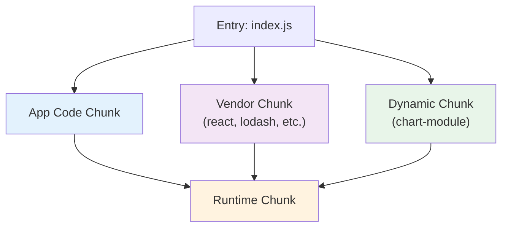

### 2.6 webpackの課題

webpackは長年にわたりフロントエンドビルドのデファクトスタンダードだったが、プロジェクトの大規模化に伴い、いくつかの構造的な課題が浮き彫りになった。

1. **ビルド速度の低下**: すべてのモジュールをバンドルするアプローチは、プロジェクトが大きくなるほどビルド時間が増大する。数千モジュール規模のプロジェクトでは、初回ビルドに数十秒から数分かかることがある
2. **設定の複雑さ**: ローダーとプラグインの組み合わせは柔軟だが、設定ファイルが肥大化しやすい。TypeScript + React + CSS Modules + SVGなど一般的な構成でも、webpack.config.jsは100行を超えることが珍しくない
3. **HMRの遅延**: モジュール変更時にHMRが反映されるまでの時間が、依存グラフの規模に比例して増加する
4. **JavaScript実装の限界**: webpack自体がJavaScriptで実装されているため、CPUバウンドなコード変換やバンドル処理において、ネイティブ言語実装と比較してパフォーマンス上の不利がある

## 3. Rollup と esbuild ― パラダイムシフトの先駆者

### 3.1 Rollup ― ESMネイティブのバンドラー

Rollupは2015年にRich Harris（Svelteの作者）によって開発された。webpackがCommonJSとESMの両方をサポートする汎用バンドラーであったのに対し、RollupはESMを前提とした設計を採った。

#### ESMファーストの設計思想

Rollupの核心的なアイデアは、**ESMの静的構造を最大限に活用する**ことである。ESMの `import` / `export` は静的解析が可能であるため、使われていないエクスポートを確実に検出し除去できる。これが**Tree Shaking**の概念であり、Rollupはこれを最初に実用化したバンドラーとして知られている。

```javascript
// utils.js
export function used() {
  return "I am used";
}

export function unused() {
  return "I will be removed by tree shaking";
}
```

```javascript
// app.js — only imports 'used'
import { used } from "./utils.js";
console.log(used());
```

上記の場合、Rollupは `unused` 関数がどこからも参照されていないことを静的解析で検出し、最終バンドルから除去する。webpackも後にTree Shakingをサポートしたが、CommonJSモジュールとの互換性維持のため、Rollupほど効率的な除去は難しかった。

#### ライブラリ向けのバンドラー

Rollupのもう一つの重要な貢献は、**ライブラリのバンドル**に最適化されていることである。複数の出力形式（ESM、CommonJS、UMD）を同時に生成でき、npmに公開するライブラリの構築に適している。

```javascript
// rollup.config.js
export default {
  input: "src/index.js",
  output: [
    { file: "dist/bundle.cjs.js", format: "cjs" },
    { file: "dist/bundle.esm.js", format: "es" },
    { file: "dist/bundle.umd.js", format: "umd", name: "MyLib" },
  ],
};
```

### 3.2 esbuild ― Go言語による高速化

esbuildは2020年にEvan Wallace（Figmaの共同創業者）によって開発された。esbuildの登場は、JavaScriptバンドラーのパフォーマンスに対する認識を根本的に変えた。

#### なぜ速いのか

esbuildがwebpackやRollupの10〜100倍の速度を達成できる理由は、以下の技術的選択にある。

1. **Go言語による実装**: JavaScriptのシングルスレッド制約から解放され、ネイティブコードへのコンパイルによるCPU効率の向上
2. **並列処理の徹底**: 解析、変換、コード生成を可能な限り並列化。Go言語のgoroutineにより軽量な並行処理を実現
3. **メモリ効率**: ASTを使い回す設計により、不要なメモリ割り当てとGCの圧力を最小化
4. **パスの最小化**: ほとんどの処理をAST上の1回のパスで完了する設計

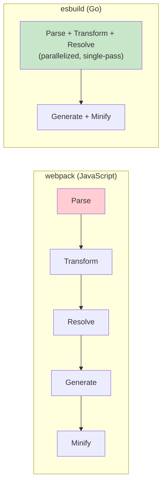

#### esbuildの限界

esbuildは驚異的な速度を実現したが、いくつかの制約がある。

- **HMRの非サポート**: 開発サーバーとしてのHMR機能は提供していない
- **プラグインAPIの制限**: webpackほど柔軟なプラグインシステムを持たない
- **CSSバンドルの制約**: CSS Modulesやpostcssの完全なサポートがない（2026年現在、改善が進行中）
- **コード分割の制約**: webpackの`SplitChunksPlugin`ほど高度なチャンク分割戦略は提供しない

これらの制約から、esbuildは単体でプロダクションビルドを完結させるのではなく、他のツールの内部エンジンとして活用されるケースが多い。Viteがまさにその代表例である。

## 4. Vite ― 開発サーバーとESMの活用

### 4.1 Viteの設計思想

Viteは2020年にEvan You（Vue.jsの作者）によって開発された。名前はフランス語で「速い」を意味する。Viteの設計は、**開発時と本番ビルド時で異なるアプローチを使い分ける**という明確な二重戦略に基づいている。

- **開発時**: ブラウザのネイティブESMを活用し、バンドルせずにモジュールを配信
- **本番ビルド**: Rollupをベースとした最適化バンドルを生成

この二重戦略は、開発体験の速度と本番環境の最適化という、一見矛盾する要求を同時に満たすための設計判断である。

### 4.2 開発サーバーのアーキテクチャ

従来のバンドラーベースの開発サーバーは、ファイルの変更があるたびにモジュールグラフ全体を再構築していた。Viteはこのアプローチを根本的に変更した。

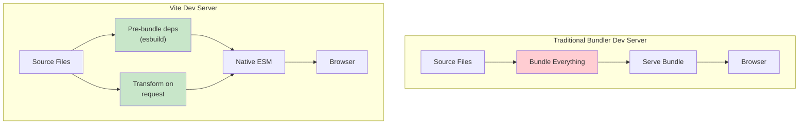

#### 依存関係のプリバンドル

Viteは `node_modules` 内の依存関係を、esbuildを使って事前にバンドルする。これには2つの理由がある。

1. **CommonJSからESMへの変換**: 多くのnpmパッケージはCommonJS形式で配布されているため、ブラウザのネイティブESMで読み込めるように変換する必要がある
2. **リクエスト数の削減**: `lodash-es` のように内部モジュールが数百ファイルに分かれているパッケージをそのまま読み込むと、数百のHTTPリクエストが発生する。プリバンドルにより1つのリクエストに集約される

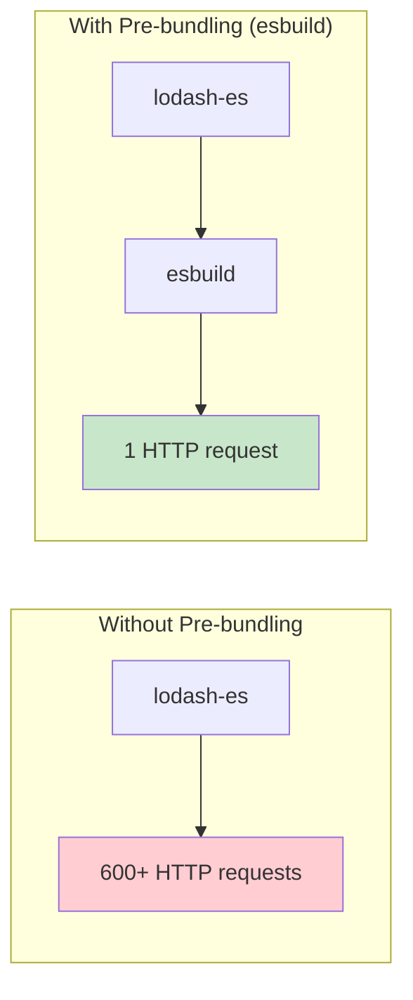

#### オンデマンド変換

アプリケーションのソースコードについては、Viteはバンドルを行わない。ブラウザからのリクエストに応じて、個々のモジュールをオンデマンドで変換する。

```
Browser requests: /src/App.tsx

Vite Dev Server:
  1. Read src/App.tsx
  2. Transform TSX → JS (via esbuild)
  3. Rewrite import paths
  4. Serve as ES Module
```

この仕組みにより、プロジェクトの規模に関わらず、開発サーバーの起動時間はほぼ一定となる。モジュールは実際にリクエストされた時点で初めて変換されるため、起動時にすべてのファイルを処理する必要がない。

### 4.3 HMR（Hot Module Replacement）

ViteのHMRは、ESMのモジュールグラフ上で変更されたモジュールの境界を正確に特定し、そのモジュールだけを差し替える。

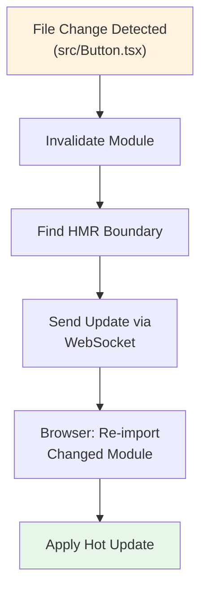

webpackのHMRと比較したViteのHMRの優位性は、**変更の伝播範囲がモジュールグラフのサイズに依存しない**点にある。バンドル全体を再構築する必要がないため、プロジェクトが成長しても更新速度は一定に保たれる。

ViteのHMR APIは以下のような形式をとる。

```javascript
// HMR API usage in Vite
if (import.meta.hot) {
  import.meta.hot.accept("./module.js", (newModule) => {
    // Handle the updated module
    newModule.setup();
  });

  import.meta.hot.dispose(() => {
    // Cleanup before module is replaced
    timer.stop();
  });
}
```

### 4.4 本番ビルド

開発時にはネイティブESMで高速なフィードバックを提供するViteだが、本番ビルドではRollupを使用して最適化されたバンドルを生成する。

開発時と本番時でアプローチが異なる理由は以下の通りである。

1. **ネットワーク効率**: 本番環境ではHTTPリクエスト数を最小化することが重要。バンドルしないESMアプローチでは、モジュール数に応じたリクエストが発生する
2. **Tree Shaking**: 未使用コードの除去はバンドル時に行う方が効率的
3. **コード分割の最適化**: ルートベースのコード分割やベンダーチャンクの分離は、バンドラーレベルの最適化が必要
4. **ブラウザ互換性**: 一部のブラウザではESMのサポートが不完全な場合があり、バンドルで互換性を担保する

```javascript
// vite.config.ts — build configuration
import { defineConfig } from "vite";
import react from "@vitejs/plugin-react";

export default defineConfig({
  plugins: [react()],
  build: {
    rollupOptions: {
      output: {
        manualChunks: {
          vendor: ["react", "react-dom"],
          router: ["react-router-dom"],
        },
      },
    },
    minify: "terser",
    sourcemap: true,
  },
});
```

> [!NOTE]
> Vite 6以降では、Rolldownと呼ばれるRollup互換のRust製バンドラーへの移行が進んでいる。Rolldownはesbuildの速度とRollupの柔軟性を両立させることを目標としている。

### 4.5 プラグインシステム

ViteのプラグインシステムはRollupのプラグインインターフェースを拡張したものであり、Rollupプラグインとの高い互換性を持つ。加えて、Vite固有のフックも提供している。

```javascript
// Custom Vite plugin
export default function myPlugin() {
  return {
    name: "my-plugin",

    // Rollup-compatible hook
    resolveId(source) {
      if (source === "virtual:my-module") {
        return source;
      }
    },

    // Rollup-compatible hook
    load(id) {
      if (id === "virtual:my-module") {
        return 'export const msg = "from virtual module"';
      }
    },

    // Vite-specific hook
    configureServer(server) {
      server.middlewares.use((req, res, next) => {
        // Custom middleware logic
        next();
      });
    },

    // Vite-specific hook
    transformIndexHtml(html) {
      return html.replace(
        "</head>",
        '<script>console.log("injected")</script></head>'
      );
    },
  };
}
```

## 5. Turbopack ― Rust製のインクリメンタルバンドラー

### 5.1 Turbopackの登場

Turbopackは2022年にVercel社によって発表された。Next.jsの開発者であるVercelが、大規模アプリケーションの開発体験を根本的に改善するために開発したバンドラーである。Rust言語で実装されており、**インクリメンタル計算**をコアアーキテクチャに据えている。

### 5.2 なぜRustなのか

バンドラーをRust言語で実装する動機は、esbuild（Go）の成功から明確に示されている。しかしTurbopackがGoではなくRustを選択した理由には、さらに踏み込んだ技術的判断がある。

1. **ゼロコストの抽象化**: Rustのジェネリクスとトレイトシステムにより、抽象化のオーバーヘッドなく高度なデータ構造を構築できる
2. **メモリ安全性のコンパイル時保証**: GCに依存しないメモリ管理により、予測可能なパフォーマンスを実現。Go言語のGCによるストップ・ザ・ワールド停止が発生しない
3. **並行処理の安全性**: Rustの所有権システムにより、データ競合のないマルチスレッド処理をコンパイル時に保証
4. **WASMターゲット**: 将来的にWebAssemblyにコンパイルしてブラウザ内で実行する可能性への布石

### 5.3 Turbo Engine ― インクリメンタル計算の仕組み

Turbopackの核心技術は**Turbo Engine**と呼ばれるインクリメンタル計算エンジンである。これは関数レベルのメモ化とキャッシュにより、変更があった部分のみを再計算する仕組みだ。

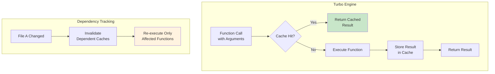

従来のバンドラーは、ファイルが変更されると依存グラフの影響を受けるすべてのモジュールを再処理していた。Turbo Engineは処理を細粒度の関数単位でキャッシュし、入力が変化した関数のみを再実行する。

この考え方は、ビルドシステムの文脈では**増分コンパイル（Incremental Compilation）**と呼ばれ、BazelやGradleなどのビルドツールでも採用されている概念である。Turbopackの特筆すべき点は、これをバンドラーのすべての処理段階に適用している点だ。

### 5.4 アーキテクチャの詳細

Turbopackは以下の処理フローを持つ。

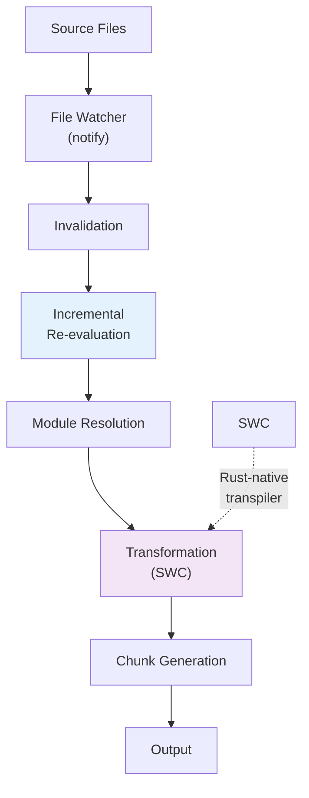

TypeScriptやJSXの変換には**SWC**（Speedy Web Compiler）が使用されている。SWCはRust製のJavaScript/TypeScriptコンパイラであり、Babelの代替として設計された。TurbopackとSWCが同じRust言語で実装されているため、プロセス間通信のオーバーヘッドなく統合されている。

### 5.5 Next.jsとの統合

Turbopackは現在（2026年3月時点）、Next.jsの開発サーバー（`next dev --turbopack`）として利用可能である。Next.jsのApp Routerと緊密に統合されており、React Server Components（RSC）のバンドリングもサポートしている。

```bash
# Start Next.js dev server with Turbopack
npx next dev --turbopack
```

Turbopackの位置づけは、Next.jsエコシステム内の開発体験を最大化することに重点が置かれている。webpackやViteが汎用バンドラーとして設計されているのに対し、Turbopackは特定のフレームワーク（Next.js）との統合を深めることで、より高度な最適化を実現する戦略をとっている。

### 5.6 現状と課題

Turbopackは急速に発展しているが、2026年3月時点でいくつかの制約が存在する。

1. **Next.js以外でのサポート**: スタンドアロンのバンドラーとしての利用は実験的な段階にある
2. **プラグインエコシステム**: webpackやViteと比較してプラグインエコシステムが発展途上である
3. **本番ビルド**: `next build --turbopack` は安定版となったが、すべてのwebpack設定との互換性が保証されているわけではない
4. **学習リソース**: 比較的新しいツールであり、ドキュメントやコミュニティの知見が蓄積途上にある

## 6. 比較と選定基準

### 6.1 パフォーマンス比較

バンドラーのパフォーマンスは、プロジェクトの規模と使用パターンによって大きく異なる。以下は一般的な傾向を示すものであり、具体的な数値はプロジェクトの構成によって変動する。

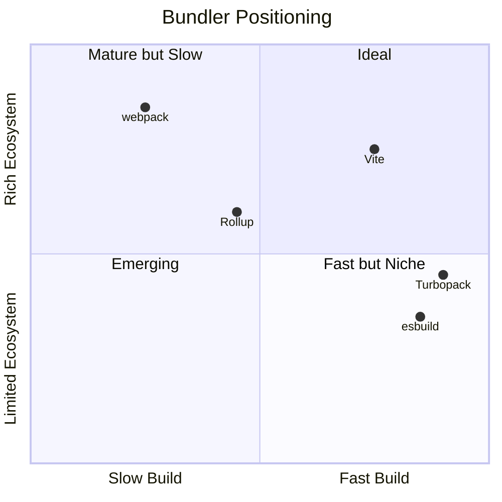

| 観点 | webpack | Rollup | esbuild | Vite | Turbopack |
|---|---|---|---|---|---|
| 開発サーバー起動 | 遅い（全モジュールバンドル） | - | - | 非常に速い（オンデマンド） | 非常に速い（インクリメンタル） |
| HMR速度 | モジュール数に比例 | - | - | 一定（ESMベース） | 一定（インクリメンタル） |
| 本番ビルド速度 | 遅い | 中程度 | 非常に速い | 速い（Rollup利用） | 速い（Rust製） |
| 実装言語 | JavaScript | JavaScript | Go | JavaScript + Go | Rust |

### 6.2 エコシステムと設定の複雑さ

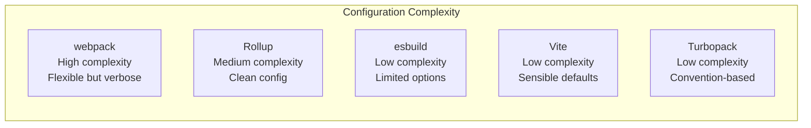

| 観点 | webpack | Rollup | esbuild | Vite | Turbopack |
|---|---|---|---|---|---|
| 設定の複雑さ | 高い | 中程度 | 低い | 低い | 低い |
| プラグイン数 | 非常に多い | 多い | 少ない | 多い（Rollup互換） | 発展途上 |
| TypeScript | ローダー設定要 | プラグイン要 | 組み込み | 組み込み | 組み込み |
| CSS Modules | ローダー設定要 | プラグイン要 | 限定的 | 組み込み | 組み込み |
| フレームワーク統合 | 各フレームワークが独自対応 | ライブラリ向け | トランスパイラとして | 公式プラグインあり | Next.js統合 |

### 6.3 選定の指針

バンドラーの選定は、プロジェクトの性質と要件に基づいて行うべきである。以下にユースケース別の推奨を示す。

**ライブラリ開発**

ライブラリの配布にはRollupが依然として強い選択肢である。ESM/CJS/UMDの複数フォーマット出力、効率的なTree Shakingが特徴だ。ただしViteもライブラリモードを提供しており、設定の容易さを重視するならViteを選択する手もある。

**Webアプリケーション（新規プロジェクト）**

新規のWebアプリケーション開発では、Viteが最もバランスの取れた選択肢である。高速な開発サーバー、豊富なプラグインエコシステム、フレームワークとの良好な統合を提供する。

**Next.jsプロジェクト**

Next.jsを使用するプロジェクトでは、Turbopackの利用を検討する価値がある。特に大規模プロジェクトにおいて、開発サーバーの起動速度とHMR速度の改善が期待できる。

**既存のwebpackプロジェクト**

既にwebpackで構築された大規模プロジェクトの場合、段階的な移行を検討する。Viteへの移行はwebpack設定の複雑さによっては工数がかかるが、開発体験の大幅な改善が見込める。

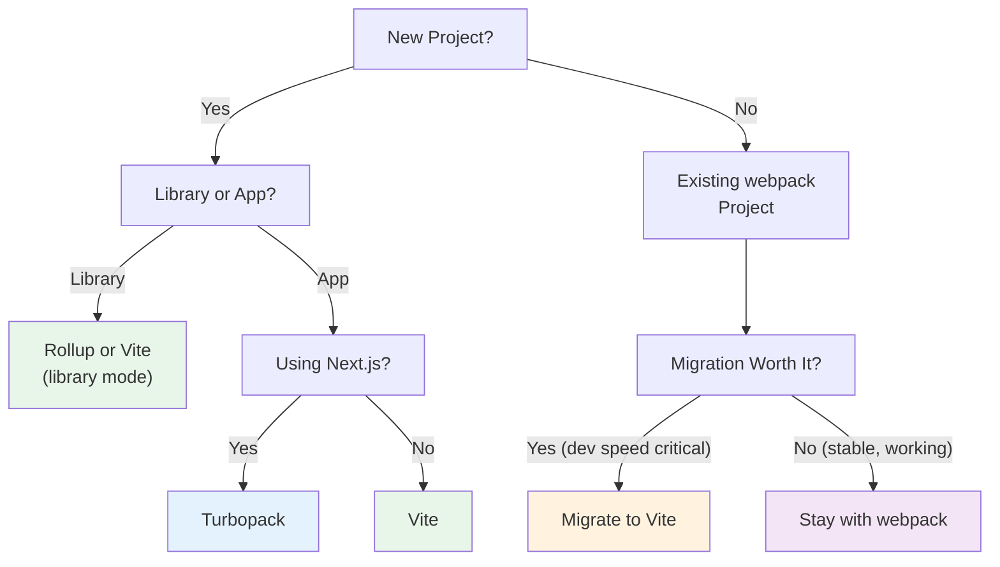

## 7. 今後の展望

### 7.1 ネイティブ言語実装への移行

JavaScriptバンドラーの世界で最も明確なトレンドは、コア処理のネイティブ言語（Rust、Go）への移行である。esbuild（Go）、SWC（Rust）、Turbopack（Rust）、Rolldown（Rust）など、パフォーマンスクリティカルな処理を低レベル言語で実装する流れは今後も加速するだろう。

この流れの背景には、Webアプリケーションの規模拡大がある。数万モジュールを含むモノレポでは、JavaScript実装のバンドラーではビルド時間が許容範囲を超えることがある。ネイティブ実装への移行は、開発者の生産性に直結する問題への回答である。

### 7.2 Rolldown ― Viteの次の段階

Rolldownは、VoidZero社（Evan Youが設立）が開発しているRust製バンドラーである。Rollupとの互換性を保ちながら、esbuildに匹敵する速度を目指している。ViteのビルドエンジンをRolldownに置き換えることで、開発時と本番ビルド時の一貫性を高めつつ、パフォーマンスを大幅に向上させる計画だ。

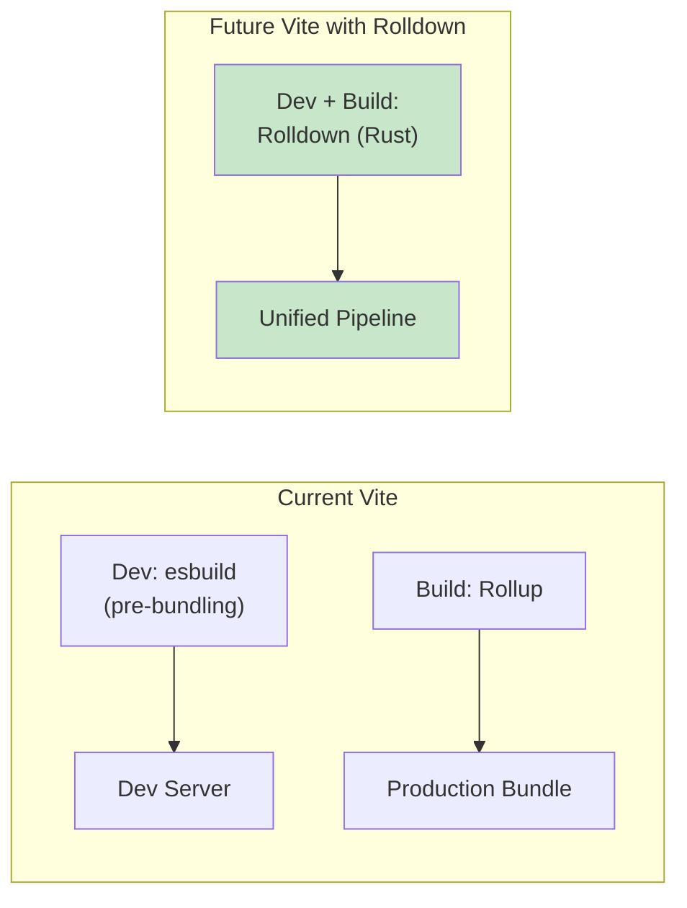

### 7.3 ブラウザのネイティブESMサポートの進化

ブラウザのESMサポートは年々向上しており、Import Mapsの仕様策定も進んでいる。Import Mapsにより、ベアスペシファイア（`import React from "react"` のようなパッケージ名によるimport）をブラウザが直接解決できるようになる。

```html
<script type="importmap">
{
  "imports": {
    "react": "https://esm.sh/react@19",
    "react-dom": "https://esm.sh/react-dom@19"
  }
}
</script>
<script type="module">
import React from "react";
// Browser resolves this directly via import map
</script>
```

これにより、開発時のバンドル不要化がさらに進む可能性がある。ただし、本番環境での最適化（Tree Shaking、コード分割、圧縮）の必要性は残るため、バンドラーが完全に不要になるわけではない。

### 7.4 React Server Components とバンドラー

React Server Components（RSC）の登場は、バンドラーに新たな要求を突きつけている。サーバーコンポーネントとクライアントコンポーネントの境界を正しく認識し、それぞれ適切にバンドルする必要がある。

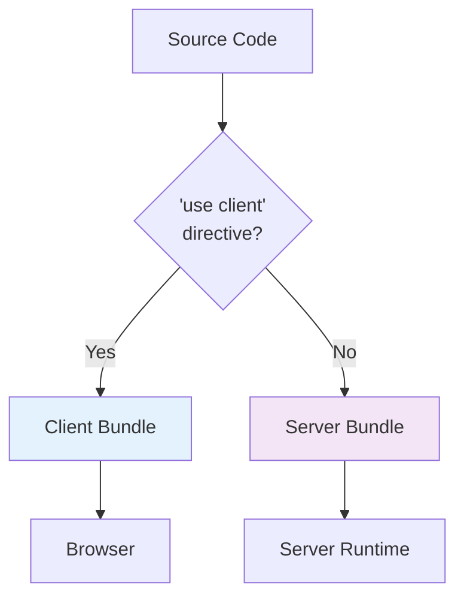

この「サーバーとクライアントのハイブリッドバンドリング」は、従来のバンドラーが想定していなかったユースケースであり、Turbopackが先行してサポートしている領域である。

### 7.5 統合ツールチェーンへの収束

個別のツール（トランスパイラ、バンドラー、ミニファイヤ、テストランナー）を組み合わせるアプローチから、統合ツールチェーンへの収束が進んでいる。

- **Vite**: 開発サーバー + ビルド + テスト（Vitest）の統合
- **Turbopack**: Next.jsのビルドパイプライン全体の統合
- **Bun**: ランタイム + バンドラー + テストランナー + パッケージマネージャの統合

この収束の動機は、ツール間のインテグレーションコストの削減と、一貫した開発体験の提供にある。

## まとめ

JavaScriptバンドラーの進化は、Web開発が直面してきた課題の歴史そのものである。

| 時代 | 課題 | 解決策 |
|---|---|---|
| 2012年 | モジュールの不在とアセット管理 | webpack（ローダー/プラグインによる統合） |
| 2015年 | ESMの最適活用とTree Shaking | Rollup（ESMネイティブ設計） |
| 2020年 | JavaScript実装の速度限界 | esbuild（Go言語によるネイティブ実装） |
| 2021年 | 開発サーバーの起動速度 | Vite（ネイティブESM + オンデマンド変換） |
| 2022年 | 大規模アプリのインクリメンタルビルド | Turbopack（Rust + インクリメンタル計算） |

各バンドラーは前世代の課題を解決しつつ、新たな設計思想を提示してきた。webpackの汎用性、Rollupの純粋さ、esbuildの速度、Viteの実用性、Turbopackのインクリメンタル性 ― それぞれが異なるトレードオフの上に成り立っている。

重要なのは、これらのツールを「どれが最良か」という単一の基準で評価するのではなく、**プロジェクトの要件、チームの技術力、エコシステムの成熟度**を総合的に考慮して選定することである。そして、バンドラーの内部で何が行われているかを理解することは、パフォーマンス問題のデバッグやビルド設定の最適化において、開発者にとって大きな武器となる。
