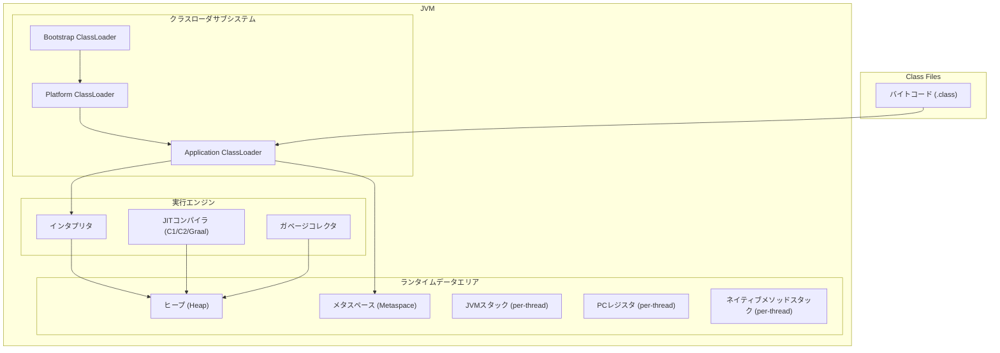
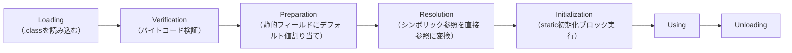
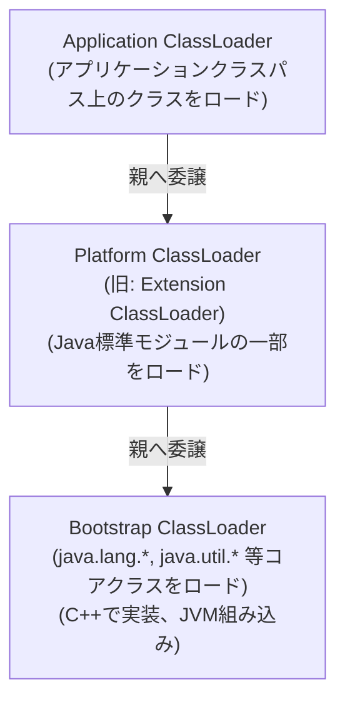
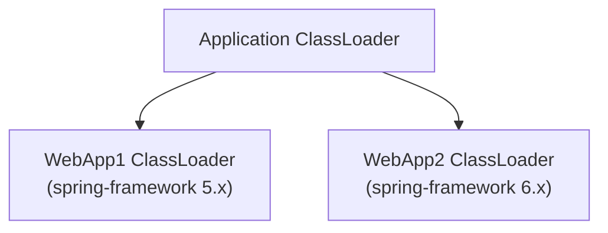
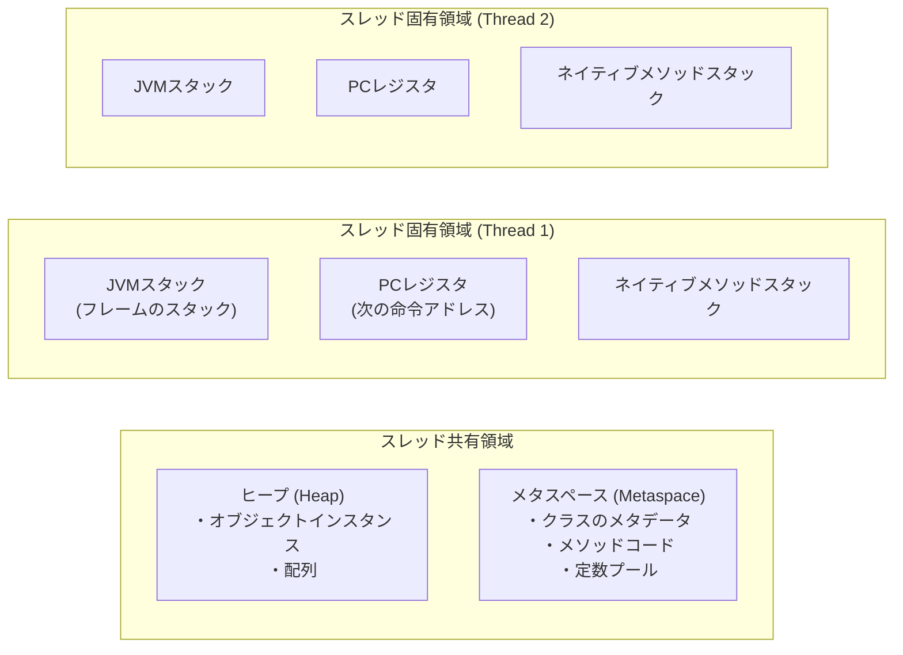
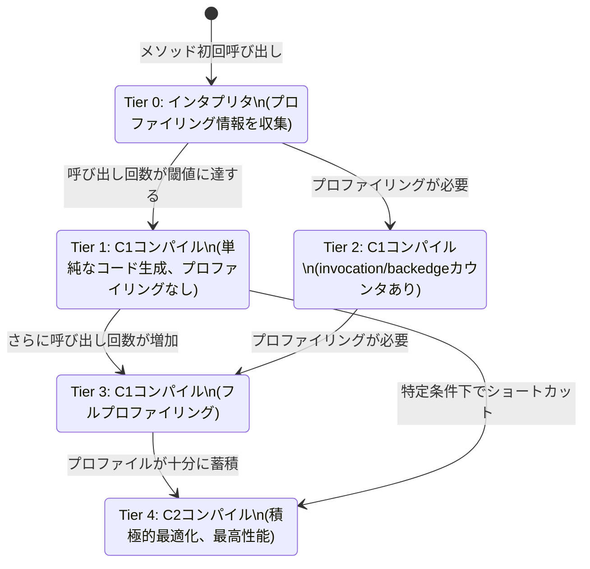
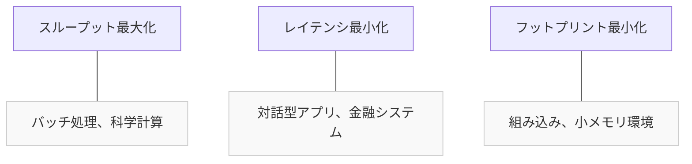
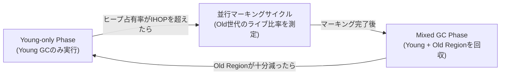

# JVMの内部構造（クラスローダ、JIT階層コンパイル、GCチューニング）

## 1. JVMとは何か — 「一度書けばどこでも動く」を支える基盤

### 1.1 誕生の背景

1990年代前半、ソフトウェアの世界は深刻な分断に直面していた。同じCプログラムをWindowsで動かすためにはVisual C++でコンパイルし、SolarisではSunのコンパイラを使い、Linux向けにはgccでビルドし直す必要があった。ハードウェアアーキテクチャの違い（x86、SPARC、MIPS）とOS APIの差異が組み合わさり、ソフトウェアの移植コストは膨大であった。

1991年、Sun MicrosystemsのJames Goslingらは「Green Project」においてこの問題に取り組み始めた。当初はインタラクティブな家電向け言語として設計されたが、WWWの普及とともに方向転換し、1995年に**Java**として公開された。Javaのスローガン「Write Once, Run Anywhere（WORA）」は、この移植問題への回答として生まれた。

WORAを実現したのが**Java Virtual Machine（JVM）**である。JVMはソフトウェアで実装された仮想的なCPUであり、Javaコンパイラが生成した**バイトコード（bytecode）**を解釈・実行する。バイトコードはプラットフォーム非依存な中間表現であり、JVMさえあればWindowsでもLinuxでもmacOSでも同じバイトコードが動作する。

```
Javaソースコード (.java)
        │
        │ javac (Javaコンパイラ)
        ▼
   バイトコード (.class)
        │
        │ JVM が解釈・実行
        ▼
  プラットフォーム固有のマシンコード
  (Windows / Linux / macOS / ...)
```

### 1.2 JVMのアーキテクチャ全体像

JVMは大きく3つのサブシステムで構成される。



- **クラスローダサブシステム**：`.class`ファイルを読み込み、JVMのメモリにロードする。
- **ランタイムデータエリア**：JVMが管理するメモリ領域群。スレッド間で共有される領域とスレッド固有の領域がある。
- **実行エンジン**：バイトコードを解釈または機械語にコンパイルして実行し、不要になったオブジェクトをGCで回収する。

---

## 2. クラスローダサブシステム

### 2.1 クラスローダとは何か

JVMはプログラム起動時にすべてのクラスをメモリにロードするわけではない。クラスローダは必要なクラスを**動的に**メモリへロードするコンポーネントである。この遅延ロード（lazy loading）の仕組みにより、使われないクラスはメモリに載らず、起動時間とメモリ使用量が抑えられる。

クラスのライフサイクルは以下の段階を経る。



**Verification（検証）**の段階は特に重要である。JVMはバイトコードが仕様に準拠しているか、スタックオーバーフローを引き起こさないか、型安全性を満たしているかを検証する。これにより、悪意あるバイトコードや壊れたクラスファイルから保護される。

### 2.2 委譲モデル（Parent Delegation Model）

JVMのクラスローダは**親委譲モデル（parent delegation model）**と呼ばれる階層構造に従って動作する。



クラスのロード要求が届くと、クラスローダは次の手順で処理する。

1. **自身のキャッシュを確認**：既にロード済みであればキャッシュから返す。
2. **親クラスローダへ委譲**：親が先にロードを試みる。
3. **自身がロードを試みる**：親がロードできなかった場合のみ、自分のクラスパスからロードする。

この仕組みの重要性を理解するには「なぜこうなっているのか」を考える必要がある。委譲モデルがなければ、アプリケーションが独自に `java.lang.String` という名前のクラスを作成してロードさせることができてしまう。Bootstrap ClassLoaderが常に先にコアクラスをロードすることで、**Javaのコアライブラリが必ず本物であることが保証される**。

```java
// Example: custom ClassLoader
public class CustomClassLoader extends ClassLoader {

    @Override
    protected Class<?> findClass(String name) throws ClassNotFoundException {
        // Load class bytes from a custom source (e.g., network, database)
        byte[] classBytes = loadClassBytesFromCustomSource(name);
        if (classBytes != null) {
            // defineClass converts raw bytes into a Class object
            return defineClass(name, classBytes, 0, classBytes.length);
        }
        throw new ClassNotFoundException(name);
    }
}
```

### 2.3 クラスローダの実践的な側面

**クラスローダの分離とクラスの同一性**

JVMにおいて、2つのクラスが「同じ」と見なされるためには、完全修飾クラス名（FQCN）だけでなく、**ロードしたクラスローダが同一**でなければならない。これを理解していないと、異なるクラスローダでロードした同名クラスのインスタンスをキャスト（`ClassCastException`）した際に混乱が生じる。

アプリケーションサーバー（TomcatやJBoss等）では、デプロイされた各Webアプリケーションに対して独立したクラスローダを割り当てる。これにより異なるWebアプリが異なるバージョンのライブラリを共存して使用できる。



---

## 3. ランタイムデータエリア

JVMが管理するメモリ領域は、スレッド間で共有されるものとスレッドごとに独立するものとに分かれる。



### 3.1 ヒープ（Heap）

ヒープはJVMの中で最も大きなメモリ領域であり、`new`演算子で生成されたすべてのオブジェクトと配列がここに配置される。GCの主な対象領域でもある。

現代のJVMではヒープを世代に分割する**世代別GC（generational GC）**が基本戦略である（G1GCやZGCでは若干異なるが原理は同じ）。

```
ヒープ構造（HotSpot JVM, Serial/Parallel/G1 GC の場合）:
┌─────────────────────────────────────────────────────┐
│                    ヒープ全体                          │
│  ┌─────────────────────────┐  ┌────────────────────┐ │
│  │       Young Generation   │  │   Old Generation    │ │
│  │  ┌────┐ ┌────┐ ┌──────┐ │  │  (Tenured Space)   │ │
│  │  │Eden│ │ S0 │ │  S1  │ │  │                    │ │
│  │  └────┘ └────┘ └──────┘ │  │                    │ │
│  └─────────────────────────┘  └────────────────────┘ │
└─────────────────────────────────────────────────────┘
  S0, S1: Survivor Space (生存者領域)
```

**なぜ世代に分けるのか**：ほとんどのオブジェクトは短命（「弱い世代別仮説」）であるという観察に基づく。新しく生成されたオブジェクトの大半はすぐにゴミになるため、小さなYoung世代を頻繁に回収する方が、大きなヒープ全体を回収するより効率がよい。

### 3.2 メタスペース（Metaspace）

Java 8以降、それまでの**PermGen（Permanent Generation）**に代わって**メタスペース**が導入された。クラスのメタデータ（クラス名、フィールド定義、メソッドのバイトコード、定数プール等）が格納される。

PermGenとの最大の違いは、メタスペースがJavaヒープではなく**ネイティブメモリ（OSのメモリ）**を使用する点である。PermGenではサイズが固定され（`-XX:MaxPermSize`）、クラスを多数動的ロードするアプリケーションでしばしば`OutOfMemoryError: PermGen space`が発生した。メタスペースはデフォルトで必要に応じて自動拡張し、この問題を解消した。

```
Java 7以前:                    Java 8以降:
┌───────────────┐              ┌───────────────┐
│  Java Heap     │              │  Java Heap     │
│  ┌──────────┐ │              │               │
│  │ PermGen  │ │              │               │
│  │ (固定上限)│ │              └───────────────┘
│  └──────────┘ │              ┌───────────────┐
└───────────────┘              │  Metaspace    │
                               │ (Native Memory│
                               │  自動拡張)     │
                               └───────────────┘
```

JVMオプション：
- `-XX:MetaspaceSize=256m`：メタスペースの初期サイズ（GCトリガー閾値）
- `-XX:MaxMetaspaceSize=512m`：メタスペースの最大サイズ（無制限にしない場合）

### 3.3 JVMスタックとフレーム

各スレッドはJVMスタックを1つ持つ。メソッド呼び出しのたびに**スタックフレーム（stack frame）**がプッシュされ、メソッドが返るとポップされる。

スタックフレームは以下の3つの構造を持つ。

- **ローカル変数配列（Local Variable Array）**：メソッドの引数と局所変数。`int`、`long`、`float`、`double`、参照型などが格納される。
- **オペランドスタック（Operand Stack）**：バイトコード命令の計算に使う作業領域。
- **フレームデータ（Frame Data）**：定数プールへの参照、例外テーブルへの参照など。

```
呼び出し例: main → methodA → methodB

スレッドのJVMスタック:
┌────────────────────────┐  ← スタックトップ
│  Frame: methodB        │
│  ローカル変数: [this, x]│
│  オペランドスタック: []  │
├────────────────────────┤
│  Frame: methodA        │
│  ローカル変数: [this, y]│
│  オペランドスタック: []  │
├────────────────────────┤
│  Frame: main           │
│  ローカル変数: [args]   │
│  オペランドスタック: []  │
└────────────────────────┘
```

スタックの深さが`-Xss`で指定した上限を超えると`StackOverflowError`が発生する。無限再帰の典型的な症状である。

### 3.4 PCレジスタとネイティブメソッドスタック

**PCレジスタ（Program Counter Register）**：スレッドが現在実行中のJVM命令のアドレスを保持する。ネイティブメソッド実行中は未定義（undefined）となる。

**ネイティブメソッドスタック**：JNI（Java Native Interface）を通じて呼び出されるネイティブ（C/C++）メソッドの実行に使われるスタック。JVMスタックと対になって存在し、ネイティブコードの呼び出しチェーンを管理する。

---

## 4. JITコンパイル — バイトコードを高速化する適応的コンパイル

### 4.1 インタプリタとJITの役割分担

JVMはバイトコードを最初インタプリタで解釈実行する。インタプリタは柔軟だが、ネイティブコードと比較すると1命令あたりのオーバーヘッドが大きい。

**JIT（Just-In-Time）コンパイラ**は、実行時にホットなコード（頻繁に実行されるメソッドやループ）を検出し、バイトコードをネイティブマシンコードに動的コンパイルすることでこの問題を解決する。

重要な点は、JITコンパイルが**インタプリタ実行中に収集したプロファイリング情報を利用**できることである。静的コンパイラ（javacなど）が知り得ない実行時情報（実際に呼ばれたサブクラスの種類、分岐の偏り、ループ反復回数）に基づいて最適化が行われるため、場合によってはC++コンパイラより積極的な最適化が可能である。

### 4.2 HotSpot VMの階層コンパイル（Tiered Compilation）

Java 8からデフォルトで有効になった**階層コンパイル（Tiered Compilation）**は、コンパイラを段階的に使い分けることでウォームアップ時間と最大性能を両立する戦略である。



| ティア | コンパイラ | 特徴 |
|--------|-----------|------|
| 0 | インタプリタ | 逐次解釈、プロファイリング情報を収集 |
| 1 | C1（クライアントコンパイラ） | 高速コンパイル、軽量な最適化、プロファイリングなし |
| 2 | C1 | invocation/backedge カウンタつき |
| 3 | C1 | フルプロファイリング（型情報・分岐統計を収集） |
| 4 | C2（サーバーコンパイラ） | Tier 3のプロファイル情報を活用した積極的最適化 |

### 4.3 C1コンパイラ（クライアントコンパイラ）

C1はコンパイル速度を重視した軽量コンパイラである。主な最適化としては以下がある。

- **インライン展開（inlining）**：メソッド呼び出しを呼び出し元のコードに展開。メソッド呼び出しオーバーヘッドの削減と、インライン後に可能になる追加最適化のため重要。
- **定数畳み込み（constant folding）**：コンパイル時に計算可能な式を定数に置換。
- **デッドコード除去（dead code elimination）**：実行されないコードパスを削除。

コンパイルは速いが生成されるコードのピーク性能はC2より低い。アプリケーション起動直後に頻繁に呼ばれるメソッドに適している。

### 4.4 C2コンパイラ（サーバーコンパイラ）

C2はピーク性能を追求したコンパイラである。Tier3で収集したプロファイリング情報を最大限活用し、以下のような高度な最適化を行う。

**投機的最適化（Speculative Optimization）**：プロファイリングで観測した「仮定」に基づいて積極的に最適化する。仮定が崩れた場合（deoptimization）はインタプリタに戻る仕組みを備えている。

```
例: 仮想メソッド呼び出しの投機的インライン展開

クラス Animal { void speak() {...} }
クラス Dog extends Animal { void speak() {...} }
クラス Cat extends Animal { void speak() {...} }

プロファイリング: speak() の呼び出し先は 99% Dog であった
  → C2は Dog::speak() をインライン展開
  → 稀に Cat が来た場合は deoptimize してインタプリタに切り替え
```

**エスケープ解析（Escape Analysis）**：オブジェクトの生存範囲を解析する。

- **スタック割り当て（Stack Allocation）**：メソッドをまたいで参照されないオブジェクトをヒープではなくスタックに割り当て、GCの負担を軽減する。
- **同期除去（Lock Elision）**：他スレッドに見えないオブジェクトへの`synchronized`を除去する。
- **スカラー置換（Scalar Replacement）**：オブジェクトをフィールドごとの独立変数に分解し、ヒープ割り当てを避ける。

**ループ最適化**：

```java
// Source code
for (int i = 0; i < arr.length; i++) {
    arr[i] *= 2;
}

// After C2 optimization: loop unrolling + SIMD vectorization
// Process 4 elements at once using CPU vector instructions (AVX, etc.)
```

**Null/範囲チェック除去**：ループ不変な境界チェックをループ外に移動し、1回だけ検査する。

### 4.5 OSR（On-Stack Replacement）

通常のJITコンパイルはメソッド全体を最適化するが、長時間実行中のループが含まれるメソッドでは、メソッドの呼び出しを待たずにループ途中でコンパイル済みコードに切り替える必要がある。この仕組みを**OSR（On-Stack Replacement）**という。

OSRは既存のスタックフレームを「その場で」コンパイル済みフレームに置き換えることを意味する。実装上は非常に複雑であり、インタプリタフレームとコンパイル済みフレーム間でレジスタ・スタックの状態を変換する必要がある。

### 4.6 GraalVMとGraalコンパイラ

**Graal**はJavaで書かれたJITコンパイラであり、Java 9以降でJEP 295（AOT）やJEP 317（実験的JIT）として取り込まれた。Oracle GraalVMではデフォルトのJITコンパイラとして機能する。

C2との主な違いは：

1. **Javaで書かれている**：C++で書かれたC2と異なり、デバッグとメンテナンスが容易。
2. **Partial Escape Analysis**：C2のエスケープ解析を拡張し、一部のパスでしかエスケープしないオブジェクトを最適化できる。
3. **AOT（Ahead-of-Time）コンパイル**：GraalVM Native Imageでは、Graalを使ってJavaプログラムをネイティブ実行ファイルに事前コンパイルし、起動時間を劇的に短縮できる。

```bash
# GraalVM Native Image でネイティブ実行ファイルを生成する例
native-image -jar myapp.jar myapp
# 起動時間が JVM 起動比 10〜100倍高速になることがある
```

---

## 5. GCの種類と進化

### 5.1 GCが解決する問題とトレードオフ

GCの設計は常に以下のトレードオフと格闘している。

- **スループット（throughput）**：単位時間あたりにGCに費やす時間の割合を最小化する（アプリケーション実行時間を最大化）。
- **レイテンシ（latency）**：GCによる停止時間（Stop-The-World, STW）を最小化する。
- **フットプリント（footprint）**：GCが使用するメモリ量を最小化する。

この3つを同時に最大化することは不可能であり、用途に合わせてどれを優先するかが設計の根幹となる。



### 5.2 Serial GC

**対象**：シングルコアCPU、小規模ヒープ、組み込み環境。

すべてのGC処理をシングルスレッドで実行する最もシンプルなGCである。Young世代はCopy GC（Eden→Survivor→Survivor）、Old世代はMark-Compact（マーク後に連続した領域に詰める）を用いる。

GC発生時にはアプリケーションスレッドをすべて停止する（Stop-The-World）。処理はシンプルだがマルチコア環境では非効率的。

```bash
# Enable Serial GC
java -XX:+UseSerialGC -jar myapp.jar
```

### 5.3 Parallel GC（旧Throughput Collector）

**対象**：バッチ処理、スループット重視のアプリケーション（Java 8以前のデフォルト）。

Serial GCの並列版。複数のGCスレッドが並列動作してYoung/Old世代のGCを行う。STW中は複数CPUをフル活用するためGCの実際の停止時間を短縮できるが、アプリケーションの停止は発生する。

```bash
java -XX:+UseParallelGC -XX:ParallelGCThreads=8 -jar myapp.jar
```

### 5.4 CMS（Concurrent Mark Sweep）GC

CMSは「並行マーク（concurrent marking）」を導入したGCであり、Old世代のGCをアプリケーションと並行して行うことでSTW時間を削減した先駆けである。

CMSの処理フェーズ：

```
┌─────────────────────────────────────────────────────────────────────┐
│ アプリ: ───────────────────────────────────────────────────────── │
│ CMS:         [初期マーク][─────並行マーク─────][再マーク][─並行掃引─]│
│              STW!              並行              STW!    並行       │
└─────────────────────────────────────────────────────────────────────┘
```

CMSの問題点：
1. **断片化**：Sweep（掃引）フェーズで空き領域を結合しない（compaction不実施）ため、Old世代に断片化が蓄積する。大きなオブジェクトが割り当てられない「promotion failure」が起きると、フォールバックとしてシングルスレッドのフルGCが走る。
2. **Concurrent Mode Failure**：GC実行中にOld世代が満杯になるとフォールバックが発生する。
3. **高いCPU使用率**：並行フェーズでアプリと競合してCPUを使う。

Java 9でDeprecated、Java 14で削除された。

### 5.5 G1 GC（Garbage-First GC）

Java 7で導入され、Java 9からデフォルトとなったG1 GCは、CMSの断片化問題を解決しながらレイテンシ予測可能性を高めた次世代GCである。詳細は次節で解説する。

### 5.6 ZGC（Z Garbage Collector）

Java 11（実験的）、Java 15（製品向け）で導入されたZGCは、**サブミリ秒（1ms以下）のSTW停止時間**を目標に設計されている。詳細は後述する。

### 5.7 Shenandoah GC

Red Hatが開発しOpenJDKに貢献したShenandoahは、ZGCと同様に並行コンパクションを特徴とする低レイテンシGCである。ZGCとの主な違いは：

- ZGCはカラーポインタ（Load Barrier）を使う；Shenandoahはブルックスポインタ（転送ポインタ）を使う。
- Shenandoahはより早いバージョンのJavaからバックポートされている（JDK 8や11へのバックポートがある）。
- ZGCはRegionサイズを動的調整；ShenandoahはRegionサイズが固定。

```bash
java -XX:+UseShenandoahGC -jar myapp.jar
```

---

## 6. G1 GCの詳細

### 6.1 リージョンベースのヒープ

G1 GCの最大の革新はヒープを**リージョン（Region）**と呼ばれる等サイズのブロックに分割したことである。

```
G1 GCのヒープ（例: 2GBヒープ, 2MBリージョン = 1024リージョン）:

┌───┬───┬───┬───┬───┬───┬───┬───┐
│ E │ S │ O │ O │ E │ H │ E │ S │
├───┼───┼───┼───┼───┼───┼───┼───┤
│ O │ O │ F │ E │ S │ O │ F │ H │
├───┼───┼───┼───┼───┼───┼───┼───┤
│ F │ E │ O │ S │ E │ O │ O │ E │
└───┴───┴───┴───┴───┴───┴───┴───┘

E: Eden  S: Survivor  O: Old  H: Humongous  F: Free（空き）
```

リージョンは物理的に連続している必要がなく、Eden・Survivor・Old・Humongousの役割を動的に割り当てられる。この柔軟性により、ヒープのコンパクションを全体ではなく**一部のリージョンを選択的に回収**することが可能になった。

### 6.2 G1 GCのフェーズ

G1 GCの動作は以下のサイクルで進む。



**Young GC（Minor GC）**：Eden が満杯になると発生する。Eden・Survivor リージョンに対してStop-The-Worldで並列コピーGCを実行し、生存オブジェクトを新しい Survivor または Old にコピーする。

**並行マーキング（Concurrent Marking）**：Old世代のリージョンがどれだけライブオブジェクトを含むかを調べる。これはアプリと並行して実行される。フェーズ構成は以下。

1. **Initial Mark**（STW）：GC Rootsから直接参照されるオブジェクトをマーク（Young GCに相乗り）。
2. **Root Region Scanning**：Survivorリージョンから参照されるOldリージョン内オブジェクトをスキャン（並行）。
3. **Concurrent Mark**：ヒープ全体をSATB（Snapshot-At-The-Beginning）アルゴリズムで並行マーク。
4. **Remark**（STW）：SATB書き込みバリアで記録された変更を処理し、マークを完了。
5. **Cleanup**（STW + 並行）：リージョンごとのライブバイト数を集計。完全に空のリージョンを即座に回収。

**Mixed GC**：並行マーキングで収集したデータをもとに、回収効率の高いOldリージョンをYoung世代と一緒に回収する。一度のGCでOld世代全体を回収するのではなく、数回のMixed GCサイクルに分けて処理することでSTW時間を制御する。

### 6.3 停止時間予測とリージョン選択

G1の「Garbage-First」という名前は、最もゴミの割合が高いリージョン（回収効率が最も高いリージョン）を優先的に回収するという戦略に由来する。

G1は各リージョンの回収コスト（コピーに要する時間）を実績データから機械学習的に予測し、ユーザーが指定した**停止時間目標（`-XX:MaxGCPauseMillis`、デフォルト200ms）**を守れるリージョン集合を選択する。

```bash
# Tune G1 GC with a 100ms pause target
java -XX:+UseG1GC \
     -Xms4g -Xmx8g \
     -XX:MaxGCPauseMillis=100 \
     -XX:InitiatingHeapOccupancyPercent=45 \
     -jar myapp.jar
```

重要なパラメータ：

| パラメータ | デフォルト値 | 意味 |
|-----------|------------|------|
| `-XX:MaxGCPauseMillis` | 200 | 目標停止時間（ms）。厳密な保証ではなくベストエフォート |
| `-XX:InitiatingHeapOccupancyPercent` (IHOP) | 45 | 並行マーキングを開始するヒープ占有率（%） |
| `-XX:G1HeapRegionSize` | 自動（1〜32MB） | リージョンサイズ。ヒープサイズから自動計算 |
| `-XX:G1ReservePercent` | 10 | コピー先として予約するヒープ割合（%） |
| `-XX:G1MixedGCCountTarget` | 8 | Mixed GCを何回に分けて実行するか |

### 6.4 Humongous Object（巨大オブジェクト）

リージョンサイズの半分を超えるオブジェクトは**Humongous Object**として特別扱いされる。Humongousオブジェクトは連続した複数のリージョン（Humongous Region）に直接Old世代として割り当てられる。

```
2MBリージョン、3.5MBの配列を割り当てる場合:
┌──────────┬──────────┬──────────────────┐
│   H (2MB)│   H (2MB)│  H (0.5MB使用)   │
│ [配列の  │ [配列の  │ [配列の          │
│  前半]   │ 中盤]    │  末尾]           │
└──────────┴──────────┴──────────────────┘
計4MB確保（3.5MBは実際に使用）
```

Humongousオブジェクトの問題点：
- YCGではなく、並行マーキングかFull GCでしか回収されない（Java 8u60以降は一部改善）。
- 大量のHumongousオブジェクトはG1の効率を大きく損なう。

対策：`-XX:G1HeapRegionSize` を大きくしてHumongous扱いになるオブジェクトを減らす、またはアプリ側でオブジェクトサイズを調整する。

---

## 7. ZGCの設計

### 7.1 ZGCの目標

ZGCはJava 11（JEP 333）で実験的に導入され、Java 15（JEP 377）で製品向けとなったGCである。その設計目標は野心的である。

- STW停止時間が**常に10ms未満**（さらにはサブミリ秒）
- テラバイト規模のヒープにスケール
- アプリのスループット低下を15%以内に抑える

G1 GCはリージョン選択とMixed GCによってSTWを削減したが、コンパクション（オブジェクトの移動）自体はSTWで行っていた。ZGCはコンパクションも**アプリと並行して**実行することでこの制約を突破した。

### 7.2 カラーポインタ（Colored Pointers）

ZGCの中核技術は**カラーポインタ（colored pointers）**である。64ビットアドレス空間の一部をGCのメタデータ格納に使うという発想だ。

```
ZGC のカラーポインタ（64ビット）:

 ビット 63   47 46   42 41 40 39   0
 ┌────────────┬──────┬──┬──┬────────┐
 │  未使用     │アドレス│ビット│    │
 │            │      │  │  │        │
 └────────────┴──────┴──┴──┴────────┘
                      │  │
                      │  └── Remapped: オブジェクトが移動先を指しているか
                      └───── Marked0/Marked1: マークフェーズで使用
```

実際には4つのビットがGCメタデータとして使用される（Marked0、Marked1、Remapped、Finalizable）。これにより、ポインタを読むだけでそのオブジェクトのGC状態が即座にわかる。

> [!NOTE]
> カラーポインタのアプローチは64ビットアドレス空間が十分広いことを前提としている。32ビット環境ではZGCは動作しない。また、ポインタのビットをメタデータに使用するため、仮想アドレス空間のマッピングにも工夫が必要となる。

### 7.3 ロードバリア（Load Barrier）

カラーポインタを活用するにはポインタを読み取るたびに色を検査する仕組みが必要である。これが**ロードバリア（Load Barrier）**だ。

```java
// In Java source code:
Object obj = someField;

// What ZGC inserts at the JIT level (conceptually):
Object obj = someField;
if (obj.colorBits != GOOD) {
    obj = slowpath_heal(obj); // Remap or re-mark as needed
}
```

JITコンパイラがすべてのオブジェクト参照読み込みの前後に数命令のバリアコードを挿入する。このバリアが以下の役割を果たす。

1. **ポインタのリマッピング（Remapping）**：移動済みオブジェクトへの古いポインタを新しい場所のポインタに更新する。
2. **マーキング（Marking）**：参照を読み取ったタイミングでオブジェクトをマーク対象に追加する。

ロードバリアのコストは命令数にして数命令程度であり、CMSのライトバリアよりも高速である。

### 7.4 ZGCの並行処理フェーズ

```
アプリケーション: ─────────────────────────────────────────────────
ZGC:              [Pause Mark Start][─並行マーク─][Pause Mark End]
                  (1ms 以下の STW)                (1ms 以下の STW)

                  [──並行参照処理─][Pause Relocate Start][─並行Relocate─]
                                   (1ms 以下の STW)
```

STWフェーズが3回あるが、いずれも**GC Rootのスキャンのみ**（ヒープ全体のスキャンはしない）であるため、非常に短い停止時間が実現される。

**並行リロケーション（Concurrent Relocation）**：オブジェクトを新しい場所にコピーしながらアプリケーションも並行して実行する。アプリが移動中のオブジェクトにアクセスした場合は、ロードバリアが古いポインタを新しい場所に即座に修正する（self-healing）。

### 7.5 ZGCのチューニング

ZGCはチューニングパラメータが少なく設計されており、基本的にはヒープサイズの指定だけで動作する。

```bash
# Basic ZGC configuration
java -XX:+UseZGC \
     -Xms8g -Xmx8g \
     -jar myapp.jar

# With GC logging
java -XX:+UseZGC \
     -Xms8g -Xmx8g \
     -Xlog:gc*:file=gc.log:time,uptime,level,tags \
     -jar myapp.jar
```

ZGCで問題が起きやすい状況は**アロケーションレートが非常に高い**場合である。並行GCはGCよりも速くオブジェクトが生成されるとヒープが枯渇する（Allocation Stall）。この場合は次のアプローチを試みる。

1. ヒープを大きくする（`-Xmx`の増加）
2. ZGC のスレッド数を増やす（`-XX:ConcGCThreads`）
3. アプリのアロケーションレートを下げる（オブジェクトのプーリング等）

---

## 8. GCチューニングの実践

### 8.1 GCチューニングの基本原則

> [!IMPORTANT]
> GCチューニングの大原則：**まず計測し、ボトルネックを確認してから変更する**。根拠のないチューニングは症状を悪化させることがある。

GCに起因するパフォーマンス問題の典型は：

1. **高頻度のYoung GC**：アロケーションレートが高すぎるか、Eden が小さすぎる。
2. **長いFull GC停止**：Old世代が断片化している、またはプロモーションレートが高すぎる。
3. **OutOfMemoryError**：ヒープが小さすぎるか、メモリリークがある。
4. **スループット低下**：GCに費やす時間が多すぎる。

### 8.2 ヒープサイズの設定

ヒープサイズは最も基本的かつ重要なパラメータである。

```bash
# Set initial and maximum heap size equally to avoid heap resizing overhead
java -Xms4g -Xmx4g -jar myapp.jar

# Young generation size (G1 manages this automatically, but for other GCs)
# Typically set Young:Old = 1:2 or 1:3
java -XX:NewRatio=2 -jar myapp.jar    # Young:Old = 1:2
java -Xmn1g -jar myapp.jar           # Explicit Young generation size
```

経験則：

- **`-Xms` と `-Xmx` は同じ値に設定する**：ヒープの動的リサイズはSTWを伴うことがある。本番環境では不要な変動を避けるため初期値と最大値を揃えることが多い。
- **ヒープサイズは物理メモリの50〜75%を目安とする**：OS・JVM自体・メタスペース・ネイティブバッファのためにメモリを残す必要がある。
- **Kubernetes/コンテナ環境では`-XX:MaxRAMPercentage`を活用する**。

```bash
# Container-friendly heap sizing (Java 11+)
java -XX:MaxRAMPercentage=75.0 -jar myapp.jar
```

### 8.3 GCログの有効化と読み方

GCの問題を診断するにはGCログが不可欠である。

```bash
# Java 11+ GC logging (Unified Logging)
java -Xlog:gc*:file=gc.log:time,uptime,level,tags:filecount=5,filesize=20m \
     -XX:+UseG1GC \
     -Xms4g -Xmx4g \
     -jar myapp.jar
```

GCログの読み方（G1 GCの例）：

```
[2026-03-02T10:00:00.100+0000][1.234s][info][gc] GC(0) Pause Young (Normal) (G1 Evacuation Pause) 512M->128M(4096M) 12.345ms
```

| フィールド | 意味 |
|-----------|------|
| `GC(0)` | GC ID（通番） |
| `Pause Young (Normal)` | GCの種類（Young GC、通常） |
| `(G1 Evacuation Pause)` | GCの理由 |
| `512M->128M(4096M)` | GC前ヒープ使用量→GC後使用量（最大ヒープ） |
| `12.345ms` | 停止時間 |

**GCログ解析ツール**：

- **GCViewer**（オープンソース）：GCログを視覚化し、スループット・停止時間の統計を表示。
- **GCEasy**（Webサービス）：GCログをアップロードして自動分析。
- **JDK Mission Control (JMC)**：JFR（Java Flight Recorder）と組み合わせてより詳細なプロファイリング。

### 8.4 GCのメトリクス監視

本番環境では以下のメトリクスを継続的に監視することが重要である。

```
主要GCメトリクス:
- GC停止時間の最大値・平均値・パーセンタイル（p99, p99.9）
- GCの頻度（Young GC / Mixed GC / Full GC それぞれ）
- GCが占めるCPU時間の割合（スループットへの影響）
- ヒープ使用量の推移（Old世代の増加トレンドはリークのシグナル）
- プロモーションレート（Young→Old へのオブジェクト移動量）
- アロケーションレート（単位時間あたりの新規オブジェクト生成量）
```

Prometheusを使う場合はJMX Exporterや Micrometer で上記メトリクスを取得できる。

```java
// Micrometer (Spring Boot Actuator) automatically exposes GC metrics
// Access via: /actuator/metrics/jvm.gc.pause
@SpringBootApplication
public class MyApp {
    public static void main(String[] args) {
        SpringApplication.run(MyApp.class, args);
    }
}
```

### 8.5 よくあるGC問題とその対処法

**問題1：Full GCが頻繁に発生する**

```
原因の特定:
1. GCログで Full GC の前後のヒープ使用量を確認
2. GC後もヒープ使用量が高ければメモリリーク疑い
3. GC後にヒープが回収されているなら Old 世代の容量不足

対処:
- ヒープサイズを増やす (-Xmx)
- IHOP を下げて早期に並行マーキングを開始する (-XX:InitiatingHeapOccupancyPercent=30)
- メモリリークの調査 (ヒープダンプ取得 → MAT/VisualVM で解析)
```

```bash
# Take a heap dump for memory leak analysis
jmap -dump:format=b,file=heapdump.hprof <pid>
# Or trigger on OOM
java -XX:+HeapDumpOnOutOfMemoryError -XX:HeapDumpPath=/tmp/oom.hprof -jar myapp.jar
```

**問題2：Young GCの停止時間が長い**

```
原因: Eden が大きすぎて、Young GCでコピーするオブジェクトが多い
対処: -XX:NewRatio を調整して Young 世代を小さくする（GCの頻度と停止時間はトレードオフ）
     または G1GC の -XX:MaxGCPauseMillis を小さくする
```

**問題3：Allocation Stall（ZGC）**

```
原因: GCがオブジェクト生成に追いつかない
対処:
- ヒープを大きくする
- ConcGCThreads を増やす: -XX:ConcGCThreads=4
- アロケーションレートを下げる（オブジェクトプーリング等）
```

### 8.6 GC選択ガイド

どのGCを選ぶかはアプリケーションの特性によって変わる。

| ユースケース | 推奨GC | 理由 |
|-------------|--------|------|
| バッチ処理、スループット最優先 | Parallel GC | STWが長くても構わない。CPUをフル活用 |
| 一般的なサーバーアプリ | G1 GC（デフォルト） | バランスがよい。停止時間予測可能 |
| 低レイテンシ（p99 10ms以下） | ZGC / Shenandoah | 並行コンパクション。大ヒープにも対応 |
| マイクロサービス・コンテナ | G1 / ZGC + GraalVM Native Image | 起動時間・フットプリントの最小化 |
| リアルタイム金融システム | ZGC | サブミリ秒STW保証 |

---

## 9. JVMの監視・診断ツール

### 9.1 標準付属ツール

JDKには診断に使えるツールが豊富に含まれている。

```bash
# List running JVM processes
jps -l

# Print JVM heap/thread information
jstat -gcutil <pid> 1000   # GC statistics every 1 second
jstack <pid>               # Thread dump
jmap -heap <pid>           # Heap summary

# Java Flight Recorder (JFR) - low-overhead profiling
java -XX:StartFlightRecording=filename=recording.jfr,duration=60s -jar myapp.jar
jfr print --events GarbageCollection recording.jfr
```

### 9.2 JIT コンパイルの可視化

```bash
# Print JIT compilation log
java -XX:+PrintCompilation -jar myapp.jar

# Output:
#     70    1    3    java.lang.String::hashCode (55 bytes)
#     71    2    4    java.lang.String::charAt (29 bytes)
# Format: timestamp  compile_id  tier  method_name (size)
```

```bash
# Visualize JIT compiled code with PrintAssembly (requires hsdis plugin)
java -XX:+UnlockDiagnosticVMOptions \
     -XX:+PrintAssembly \
     -XX:CompileCommand=print,*MyClass.hotMethod \
     -jar myapp.jar
```

### 9.3 ヒープ解析

```bash
# Analyze heap dump with Eclipse Memory Analyzer (MAT)
# 1. Take heap dump
jcmd <pid> GC.heap_dump /tmp/heapdump.hprof

# 2. Open in MAT and check "Leak Suspects" report
# MAT identifies objects with suspiciously large retained heap
```

---

## 10. まとめと今後の展望

JVMはJava誕生から30年近くを経て、当初の「移植性」という目的を超えた高度な実行基盤へと進化した。

**クラスローダ**は委譲モデルによって安全かつ柔軟なクラスの動的ロードを実現し、アプリケーションサーバーのマルチテナント分離を支える。**ランタイムデータエリア**はヒープ・メタスペース・スレッド固有領域に分かれ、スレッド安全性とメモリ効率を両立する。**階層JITコンパイル**はC1による高速な初期コンパイルとC2による積極的最適化を組み合わせ、起動速度と最終性能の両立を実現している。そして**GC**はSerial→Parallel→CMS→G1→ZGCという進化の中で、スループット・レイテンシ・スケーラビリティの課題を一つずつ克服してきた。

今後の展望としては、以下の方向性が注目される。

- **Project Loom**（Java 21でGA）：仮想スレッド（Virtual Thread）の導入により、スレッドモデルが根本的に変わる。JVMがスケジューリングするM:Nスレッドにより、数百万の同時処理が可能になる。
- **Project Valhalla**：値オブジェクト（Value Types）の導入により、プリミティブ型のようにスタックやインラインに割り当て可能なオブジェクトが実現し、ヒープ圧力が大幅に低減する。
- **GraalVM Native Image の成熟**：クラウドネイティブ・サーバーレス環境向けに、JVMを使わずネイティブ実行ファイルとして動かすユースケースが拡大している。
- **ZGC・Shenandoahの継続的進化**：世代別ZGC（Generational ZGC, Java 21で実験的導入）がさらにスループットを向上させる。

JVMはもはやJavaだけの実行基盤ではない。Kotlin、Scala、Clojure、Groovy、さらにはPython（Jython）やRuby（JRuby）まで多様な言語がJVM上で動作し、JVMのエコシステムを共有している。JVM内部の理解は、これらの言語・フレームワークの性能特性を把握し、適切なチューニングを行うための不可欠な知識である。
