# Kafka の内部設計（ログセグメント, ISR, Consumer Group リバランシング）

## 1. はじめに：Kafka を「中身から」理解する意義

Apache Kafka は、LinkedIn で 2011 年に開発され、現在では分散ストリーミングプラットフォームのデファクトスタンダードとなっている。1 日あたり数兆件のメッセージを処理する企業も珍しくなく、その採用範囲はログ収集、イベントソーシング、ストリーム処理、データパイプライン、マイクロサービス間通信と多岐にわたる。

しかし、Kafka を「ただのメッセージキュー」として捉えると、その設計の本質を見誤る。Kafka の核心は**分散コミットログ（Distributed Commit Log）** である。メッセージキューが「消費されたらメッセージを削除する」のに対し、Kafka は「追記専用のログに書き込み、保持期間が過ぎるまで削除しない」という根本的に異なるアプローチを取る。この設計思想が、Kafka の高スループット、耐障害性、そして柔軟なコンシューマモデルの基盤となっている。

本記事では、Kafka の内部設計を以下の観点から深く掘り下げる。

1. **ストレージ設計** — ログセグメント、インデックス、ゼロコピー転送
2. **レプリケーション** — ISR（In-Sync Replicas）、High Watermark、Leader Epoch
3. **プロデューサーの仕組み** — バッチング、パーティショニング、acks
4. **コンシューマグループとリバランシング** — Eager リバランスと Cooperative リバランス
5. **Exactly-Once Semantics** — 冪等プロデューサーとトランザクション
6. **パフォーマンスチューニング** — 実運用で重要な設定項目とその根拠

これらの知識は、単に Kafka を使うだけでなく、障害時のトラブルシューティングやパフォーマンス最適化において不可欠である。

## 2. ストレージ設計：ログセグメントとインデックス

### 2.1 パーティションとログの基本構造

Kafka のトピックは 1 つ以上の**パーティション**に分割される。各パーティションは、順序付けられた追記専用のメッセージシーケンスであり、各メッセージには単調増加する**オフセット（Offset）** が割り当てられる。

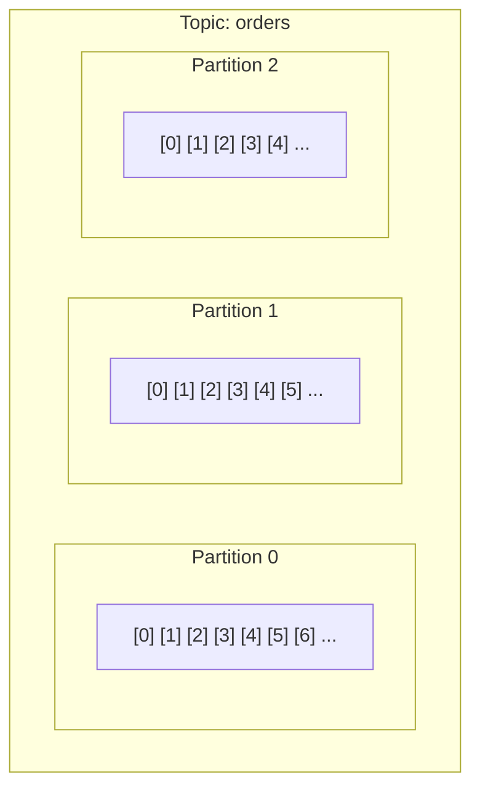
```mermaid
graph TB
    subgraph "Topic: orders"
        subgraph "Partition 0"
            P0["[0] [1] [2] [3] [4] [5] [6] ..."]
        end
        subgraph "Partition 1"
            P1["[0] [1] [2] [3] [4] [5] ..."]
        end
        subgraph "Partition 2"
            P2["[0] [1] [2] [3] [4] ..."]
        end
    end
```

パーティションはスケーラビリティの基本単位である。1 つのパーティションは 1 つのブローカー上に物理的に配置され、1 つのコンシューマグループ内では 1 つのコンシューマのみが担当する。パーティション数を増やすことで、書き込みスループットとコンシューマの並列度を線形にスケールできる。

### 2.2 ログセグメントの構造

パーティションのデータは、ディスク上では**ログセグメント**と呼ばれる固定サイズのファイル群として管理される。1 つのパーティションは複数のログセグメントから構成され、最新のセグメントのみが書き込み対象（**アクティブセグメント**）となる。

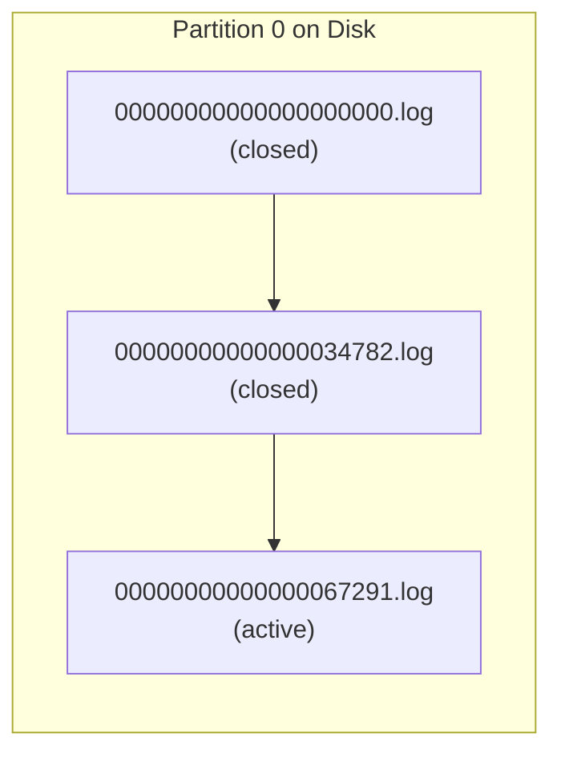
```mermaid
graph LR
    subgraph "Partition 0 on Disk"
        S1["00000000000000000000.log<br/>(closed)"]
        S2["00000000000000034782.log<br/>(closed)"]
        S3["00000000000000067291.log<br/>(active)"]
    end
    S1 --> S2 --> S3
```

各セグメントのファイル名は、そのセグメントに含まれる最初のメッセージのオフセットを示す。上の例では、最初のセグメントはオフセット 0 から始まり、2 番目のセグメントはオフセット 34782 から始まる。

セグメントの分割は `log.segment.bytes`（デフォルト 1 GB）または `log.segment.ms` で制御される。アクティブセグメントが閾値に達すると、新しいセグメントファイルが作成される。

::: tip セグメント分割の意義
セグメント分割は、古いデータの削除を効率的にする。Kafka はメッセージを個別に削除するのではなく、セグメント単位で丸ごと削除する。これにより、ランダム I/O を一切発生させずにディスク容量を回収できる。
:::

### 2.3 セグメントを構成するファイル群

各ログセグメントには、`.log` ファイルの他に複数の補助ファイルが存在する。

| ファイル | 拡張子 | 役割 |
|---------|--------|------|
| ログファイル | `.log` | メッセージ本体（RecordBatch の連続） |
| オフセットインデックス | `.index` | オフセットからログファイル内の物理位置へのマッピング |
| タイムスタンプインデックス | `.timeindex` | タイムスタンプからオフセットへのマッピング |
| トランザクションインデックス | `.txnindex` | 中断されたトランザクションの一覧 |
| リーダーエポックチェックポイント | `leader-epoch-checkpoint` | Leader Epoch とオフセットの対応 |

### 2.4 オフセットインデックスの仕組み

オフセットインデックスは、**すべての**メッセージの位置を記録するのではなく、一定間隔（`log.index.interval.bytes`、デフォルト 4 KB）ごとにエントリを作成する**疎インデックス（Sparse Index）** である。

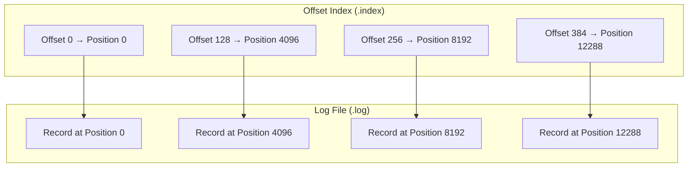
```mermaid
graph TB
    subgraph "Offset Index (.index)"
        I1["Offset 0 → Position 0"]
        I2["Offset 128 → Position 4096"]
        I3["Offset 256 → Position 8192"]
        I4["Offset 384 → Position 12288"]
    end

    subgraph "Log File (.log)"
        L1["Record at Position 0"]
        L2["Record at Position 4096"]
        L3["Record at Position 8192"]
        L4["Record at Position 12288"]
    end

    I1 --> L1
    I2 --> L2
    I3 --> L3
    I4 --> L4
```

特定のオフセットを検索する際、Kafka は以下の手順を踏む。

1. セグメントファイル名（先頭オフセット）をバイナリサーチし、対象セグメントを特定する
2. `.index` ファイルを mmap で読み込み、バイナリサーチで目的のオフセット以下の最大エントリを見つける
3. `.log` ファイルの該当位置から順次スキャンし、目的のオフセットに到達する

疎インデックスを採用する理由は、インデックスファイルのサイズを小さく保ち、全体をメモリに載せやすくするためである。仮に全メッセージをインデックスすると、メッセージ数に比例してインデックスが肥大化し、メモリ圧迫やキャッシュ効率の低下を招く。

::: details タイムスタンプインデックスの用途
タイムスタンプインデックス（`.timeindex`）は、「この時刻以降のメッセージから読み始めたい」というユースケースに対応する。`consumer.offsetsForTimes()` API がこのインデックスを利用する。障害復旧時に「1 時間前の状態からリプレイしたい」という要件で頻繁に使われる。
:::

### 2.5 RecordBatch のバイナリフォーマット

Kafka 0.11 以降、メッセージは**RecordBatch**というコンテナに格納される。これは単一メッセージではなく、複数のレコードをまとめたバッチである。

```
RecordBatch 構造:
┌─────────────────────────────────────────────────────┐
│ Base Offset (8 bytes)                               │
│ Batch Length (4 bytes)                               │
│ Partition Leader Epoch (4 bytes)                     │
│ Magic (1 byte) = 2                                  │
│ CRC (4 bytes)                                       │
│ Attributes (2 bytes)                                │
│   - Compression (bits 0-2): none/gzip/snappy/lz4/zstd │
│   - Timestamp Type (bit 3): create/log-append       │
│   - Is Transactional (bit 4)                        │
│   - Is Control (bit 5)                              │
│ Last Offset Delta (4 bytes)                         │
│ Base Timestamp (8 bytes)                            │
│ Max Timestamp (8 bytes)                             │
│ Producer ID (8 bytes)                               │
│ Producer Epoch (2 bytes)                            │
│ Base Sequence (4 bytes)                             │
│ Records Count (4 bytes)                             │
│ Records... (variable)                               │
└─────────────────────────────────────────────────────┘
```

この設計には重要な最適化が含まれている。

**デルタエンコーディング**: 各レコードのオフセットとタイムスタンプは、Base Offset / Base Timestamp からの差分として記録される。これにより、可変長整数（varint）エンコーディングと組み合わせて、レコードあたりのオーバーヘッドを大幅に削減できる。

**バッチ単位の圧縮**: 圧縮はレコード個別ではなくバッチ単位で行われる。同じトピックの連続メッセージには類似したキーやスキーマが含まれることが多く、バッチ圧縮によって高い圧縮率が得られる。

**CRC によるデータ整合性**: バッチ全体の CRC32C が計算され、ディスク破損やネットワークエラーによるデータ化けを検出できる。

### 2.6 ゼロコピー転送と PageCache の活用

Kafka の高スループットを支える重要な技術が**ゼロコピー転送**である。通常のデータ転送では、以下のようにカーネル空間とユーザー空間の間で複数回のコピーが発生する。

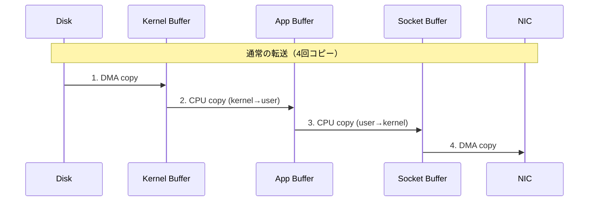
```mermaid
sequenceDiagram
    participant Disk
    participant KernelBuffer as Kernel Buffer
    participant AppBuffer as App Buffer
    participant SocketBuffer as Socket Buffer
    participant NIC

    Note over Disk,NIC: 通常の転送（4回コピー）
    Disk->>KernelBuffer: 1. DMA copy
    KernelBuffer->>AppBuffer: 2. CPU copy (kernel→user)
    AppBuffer->>SocketBuffer: 3. CPU copy (user→kernel)
    SocketBuffer->>NIC: 4. DMA copy
```

Kafka は Linux の `sendfile()` システムコールを利用し、ユーザー空間を一切経由せずにデータを転送する。

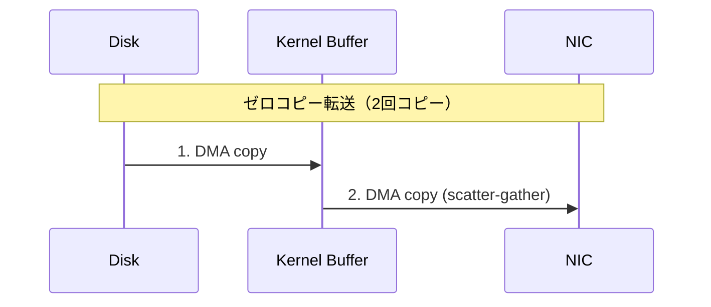
```mermaid
sequenceDiagram
    participant Disk
    participant KernelBuffer as Kernel Buffer
    participant NIC

    Note over Disk,NIC: ゼロコピー転送（2回コピー）
    Disk->>KernelBuffer: 1. DMA copy
    KernelBuffer->>NIC: 2. DMA copy (scatter-gather)
```

これにより、CPU 使用率が大幅に削減され、コンテキストスイッチの回数も半減する。さらに、Kafka はデータのシリアライゼーション/デシリアライゼーションをブローカー側では行わない。プロデューサーが送信したバイト列をそのままディスクに書き、そのままコンシューマに転送する。この「ブローカーはバイト列の管道に徹する」という設計が、Kafka のスループット効率の根幹である。

もう一つの重要な要素が、OS の**PageCache**への全面的な依存である。Kafka は独自のキャッシュ機構を持たず、OS の PageCache にキャッシュ管理を委ねる。この設計には以下の利点がある。

- JVM のヒープを GC 対象のキャッシュで消費しないため、GC の停止時間が予測しやすくなる
- ブローカーの再起動後も、OS が PageCache を保持していればキャッシュがウォームな状態のまま復帰できる
- 書き込みは PageCache への書き込みとなり、OS が非同期にディスクへフラッシュするため、プロデューサーから見た書き込みレイテンシが低い

::: warning PageCache への依存のリスク
PageCache に依存するということは、OS のメモリ管理ポリシーに Kafka のパフォーマンスが左右されることを意味する。メモリが逼迫すると PageCache が追い出され、I/O レイテンシが急増する。Kafka ブローカーには、実データ量に応じた十分な物理メモリを確保することが重要である。
:::

## 3. レプリケーション：ISR と High Watermark

### 3.1 レプリケーションの基本モデル

Kafka はパーティション単位でレプリケーションを行う。各パーティションには 1 つの **Leader** と 0 個以上の **Follower** が存在し、プロデューサーとコンシューマはすべて Leader とのみ通信する（KIP-392 以降、Follower からの読み取りも可能になったが、基本モデルは Leader 中心である）。

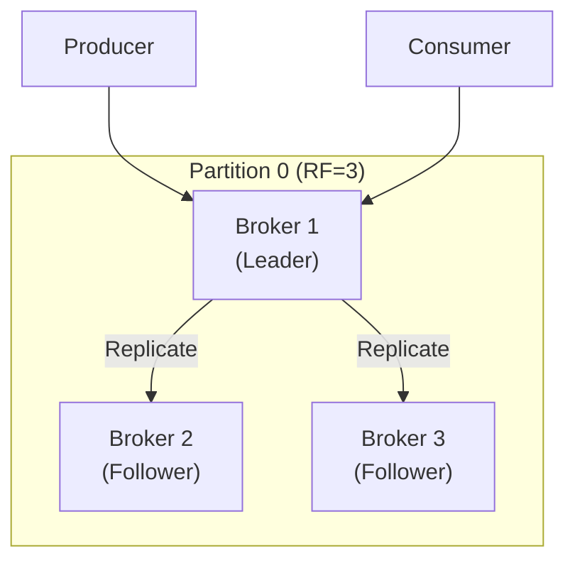
```mermaid
graph TB
    Producer --> Leader
    Consumer --> Leader

    Leader -->|"Replicate"| Follower1
    Leader -->|"Replicate"| Follower2

    subgraph "Partition 0 (RF=3)"
        Leader["Broker 1<br/>(Leader)"]
        Follower1["Broker 2<br/>(Follower)"]
        Follower2["Broker 3<br/>(Follower)"]
    end
```

Follower は Leader に対して Fetch リクエストを送信し、新しいメッセージを継続的に取得する。これはコンシューマの Fetch と同じプロトコルであり、Follower は「特殊なコンシューマ」として振る舞う。

### 3.2 ISR（In-Sync Replicas）

**ISR** は、Leader と「十分に同期している」とみなされるレプリカの集合である。ISR に含まれるための条件は以下である。

1. `replica.lag.time.max.ms`（デフォルト 30 秒）以内に Leader に Fetch リクエストを送信していること
2. 直近の Fetch リクエストで、Leader のログ末尾（Log End Offset）までのデータを取得済みであること

ISR から脱落したレプリカは**OSR（Out-of-Sync Replicas）** に分類される。ISR のメンバーシップは動的に変化し、Leader がこの管理を行う。

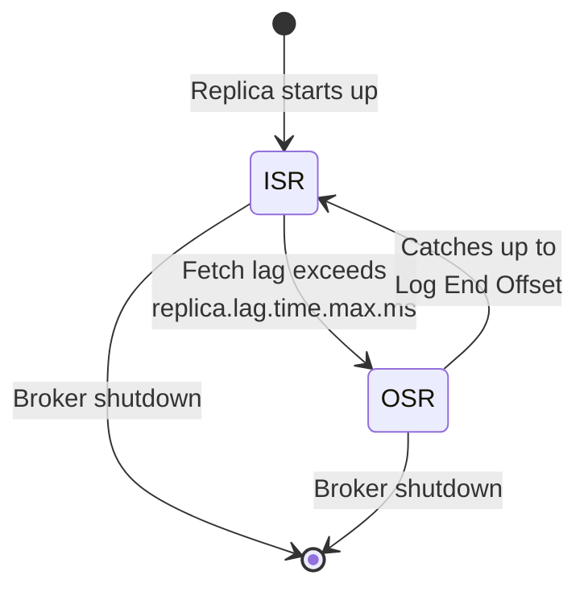
```mermaid
stateDiagram-v2
    [*] --> ISR: Replica starts up
    ISR --> OSR: Fetch lag exceeds<br/>replica.lag.time.max.ms
    OSR --> ISR: Catches up to<br/>Log End Offset
    ISR --> [*]: Broker shutdown
    OSR --> [*]: Broker shutdown
```

::: tip ISR のサイズと可用性のトレードオフ
ISR が縮小すると、書き込みは継続できるが耐障害性が低下する。`min.insync.replicas`（デフォルト 1）を設定することで、ISR のサイズが閾値を下回った場合にプロデューサーへ `NotEnoughReplicasException` を返し、データロスのリスクを低減できる。本番環境では `min.insync.replicas=2` と `acks=all` の組み合わせが推奨される。
:::

### 3.3 High Watermark と Log End Offset

Kafka のレプリケーションにおいて最も重要な 2 つの概念が、**Log End Offset（LEO）** と **High Watermark（HW）** である。

- **LEO**: 各レプリカが保持するログの末尾オフセット（次に書き込まれるオフセット）
- **HW**: ISR 内のすべてのレプリカが複製完了したことが確認されたオフセット

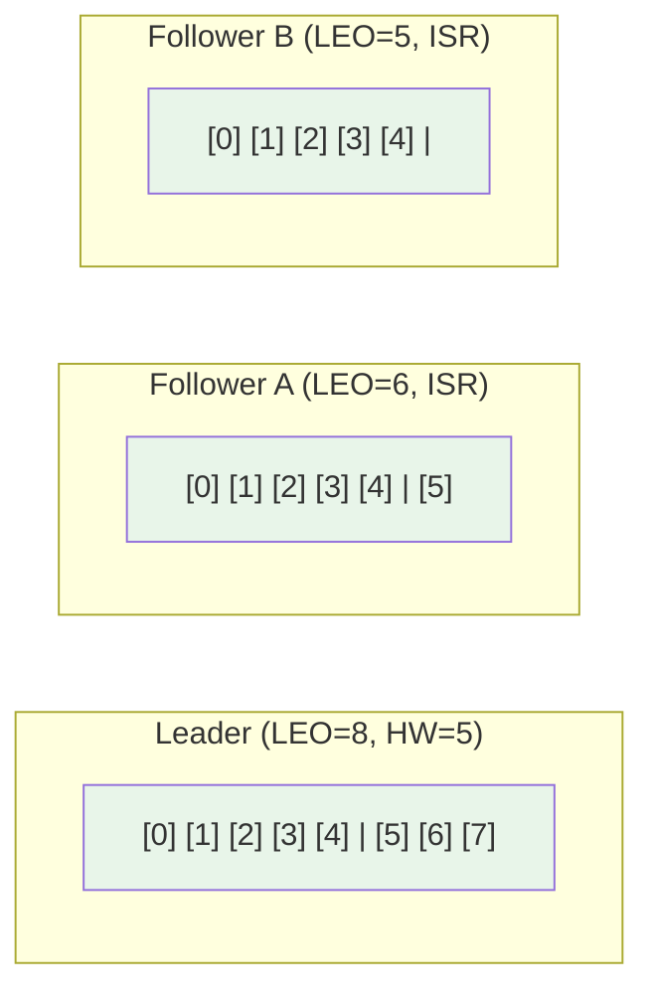
```mermaid
graph LR
    subgraph "Leader (LEO=8, HW=5)"
        L["[0] [1] [2] [3] [4] | [5] [6] [7]"]
    end

    subgraph "Follower A (LEO=6, ISR)"
        FA["[0] [1] [2] [3] [4] | [5]"]
    end

    subgraph "Follower B (LEO=5, ISR)"
        FB["[0] [1] [2] [3] [4] |"]
    end

    style L fill:#e8f5e9
    style FA fill:#e8f5e9
    style FB fill:#e8f5e9
```

上図で `|` は High Watermark の位置を示す。HW=5 は、オフセット 0 から 4 までのメッセージが ISR 内の全レプリカに複製されたことを意味する。

**コンシューマは HW までのメッセージのみを読み取れる。** HW を超えるメッセージはまだ「コミット」されておらず、Leader 障害時にロストする可能性があるためだ。

HW の更新プロセスは以下の通りである。

1. Follower が Leader に Fetch リクエストを送信する際、自身の LEO を含める
2. Leader は全 ISR メンバーの LEO を追跡し、その最小値を HW として更新する
3. Leader は Fetch レスポンスに最新の HW を含めて返す
4. Follower は受け取った HW で自身の HW を更新する

### 3.4 Leader Epoch による一貫性保証

Kafka の初期バージョンでは、HW のみでレプリケーションの一貫性を保証していたが、特定の障害シナリオでデータロスやログの不整合が発生する問題があった。この問題を解決するために導入されたのが **Leader Epoch** である。

Leader Epoch は、各 Leader の「任期」を表す単調増加の整数である。Leader が交代するたびにエポックが増加し、各レコードにはそのレコードが書き込まれた時点のエポックが記録される。

以下に、Leader Epoch がない場合に発生しうる問題を示す。

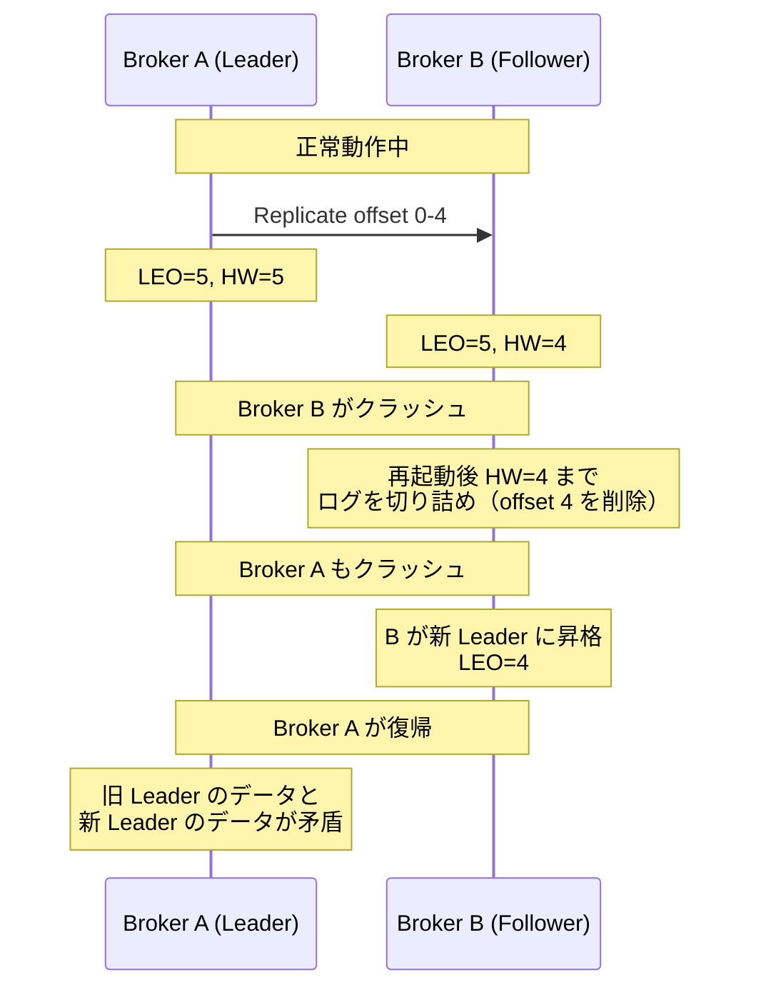
```mermaid
sequenceDiagram
    participant A as Broker A (Leader)
    participant B as Broker B (Follower)

    Note over A,B: 正常動作中
    A->>B: Replicate offset 0-4
    Note over A: LEO=5, HW=5
    Note over B: LEO=5, HW=4

    Note over A,B: Broker B がクラッシュ
    Note over B: 再起動後 HW=4 まで<br/>ログを切り詰め（offset 4 を削除）

    Note over A,B: Broker A もクラッシュ
    Note over B: B が新 Leader に昇格<br/>LEO=4

    Note over A,B: Broker A が復帰
    Note over A: 旧 Leader のデータと<br/>新 Leader のデータが矛盾
```

Leader Epoch を用いると、Follower は再起動時に HW ではなく Leader Epoch の境界を基準にログを切り詰める。具体的には、Follower は Leader に対して `OffsetsForLeaderEpoch` リクエストを送信し、自身が保持する最新の Leader Epoch に対応する正しい末尾オフセットを取得する。これにより、不要なログの切り詰めを防ぎ、データの整合性を維持できる。

### 3.5 Unclean Leader Election

ISR 内のすべてのレプリカが利用不可になった場合、Kafka はデータの整合性と可用性のどちらを優先するかの選択を迫られる。

- `unclean.leader.election.enable=false`（デフォルト、推奨）: ISR 内のレプリカが復帰するまでパーティションは利用不可になる。データの整合性が保証される。
- `unclean.leader.election.enable=true`: OSR のレプリカを Leader に昇格させる。可用性は確保されるが、同期されていないメッセージは失われる。

この設定は CAP 定理における CP（整合性優先）と AP（可用性優先）の選択そのものである。金融系のシステムでは `false`、ログ収集のような多少のデータロスを許容できるワークロードでは `true` が選択されることがある。

## 4. プロデューサーの仕組み

### 4.1 プロデューサーの内部アーキテクチャ

Kafka プロデューサーは、単にメッセージを送信するだけでなく、内部で複雑なパイプライン処理を行っている。

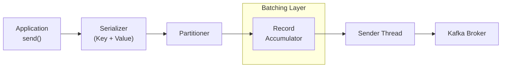
```mermaid
graph LR
    App["Application<br/>send()"] --> Serializer["Serializer<br/>(Key + Value)"]
    Serializer --> Partitioner["Partitioner"]
    Partitioner --> RecordAccumulator["Record<br/>Accumulator"]
    RecordAccumulator --> Sender["Sender Thread"]
    Sender --> Broker["Kafka Broker"]

    subgraph "Batching Layer"
        RecordAccumulator
    end
```

1. **シリアライゼーション**: キーと値をバイト列に変換する。スキーマレジストリと Avro/Protobuf を使う場合、ここでスキーマの検証とエンコーディングが行われる。
2. **パーティショニング**: メッセージをどのパーティションに送るかを決定する。
3. **Record Accumulator**: メッセージをパーティションごとのバッチに蓄積する。
4. **Sender スレッド**: バッチ化されたメッセージを非同期でブローカーに送信する。

### 4.2 パーティショニング戦略

パーティショニングは、Kafka のスケーラビリティと順序保証の要となる。

| 戦略 | 条件 | 動作 |
|------|------|------|
| キーベース | キーが指定されている | `murmur2(key) % numPartitions` でパーティションを決定。同じキーは常に同じパーティションに送られるため、キー単位の順序が保証される |
| Sticky Partitioner | キーが null | バッチが満杯になるまで同じパーティションに送り続け、満杯になったら次のパーティションに切り替える（Kafka 2.4 以降のデフォルト） |
| Round Robin | キーが null（旧方式） | メッセージごとにラウンドロビンでパーティションを選択。バッチ効率が悪い |

::: warning Sticky Partitioner の導入背景
Kafka 2.4 より前のデフォルトでは、キーが null のメッセージはラウンドロビンで各パーティションに分散された。しかし、これはバッチサイズが小さくなりがちで、ネットワーク効率が低下する原因となっていた。Sticky Partitioner は、1 つのバッチが完成するまで同じパーティションに送り続けることで、バッチの充填率を高め、スループットを向上させる。
:::

### 4.3 バッチングとリンガー

Record Accumulator は、パーティションごとにメッセージをバッチに蓄積する。バッチの送信は以下の条件のいずれかが満たされた時にトリガーされる。

- `batch.size`（デフォルト 16 KB）に達した
- `linger.ms`（デフォルト 0 ms）の待ち時間が経過した

`linger.ms=0` の場合、Sender スレッドが次のポーリングサイクルで即座にバッチを送信する。レイテンシを犠牲にしてスループットを向上させたい場合は、`linger.ms` を 5〜100 ms 程度に設定する。

```java
Properties props = new Properties();
props.put("bootstrap.servers", "broker1:9092,broker2:9092");
props.put("key.serializer", "org.apache.kafka.common.serialization.StringSerializer");
props.put("value.serializer", "org.apache.kafka.common.serialization.StringSerializer");

// Tuning batch behavior
props.put("batch.size", 32768);       // 32 KB batch size
props.put("linger.ms", 20);           // Wait up to 20ms to fill batch
props.put("compression.type", "lz4"); // Compress at batch level
props.put("buffer.memory", 67108864); // 64 MB total buffer

KafkaProducer<String, String> producer = new KafkaProducer<>(props);
```

### 4.4 acks と耐久性保証

`acks` パラメータは、プロデューサーがブローカーからの確認応答をどのレベルで要求するかを制御する。

| acks | 動作 | 耐久性 | レイテンシ |
|------|------|--------|-----------|
| `0` | 確認応答を待たない | 最低（メッセージロスの可能性あり） | 最小 |
| `1` | Leader への書き込み完了を待つ | 中程度（Leader 障害時にロスの可能性） | 中 |
| `all` (`-1`) | ISR 全体への複製完了を待つ | 最高 | 最大 |

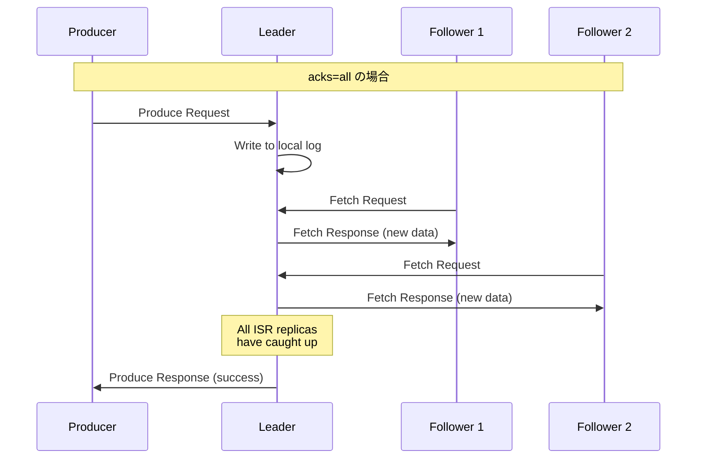
```mermaid
sequenceDiagram
    participant P as Producer
    participant L as Leader
    participant F1 as Follower 1
    participant F2 as Follower 2

    Note over P,F2: acks=all の場合
    P->>L: Produce Request
    L->>L: Write to local log
    F1->>L: Fetch Request
    L->>F1: Fetch Response (new data)
    F2->>L: Fetch Request
    L->>F2: Fetch Response (new data)
    Note over L: All ISR replicas<br/>have caught up
    L->>P: Produce Response (success)
```

`acks=all` と `min.insync.replicas=2` の組み合わせが本番環境のゴールドスタンダードである。この設定では、最低 2 つの ISR レプリカ（Leader を含む）にメッセージが書き込まれるまでプロデューサーは確認応答を受け取らない。レプリケーションファクター 3 の場合、1 台のブローカーが障害を起こしてもデータが失われないことが保証される。

### 4.5 リトライとメッセージ順序

プロデューサーは、一時的なエラー（ネットワークタイムアウト、Leader 不在など）に対して自動リトライを行う。しかし、リトライは順序の逆転を引き起こす可能性がある。

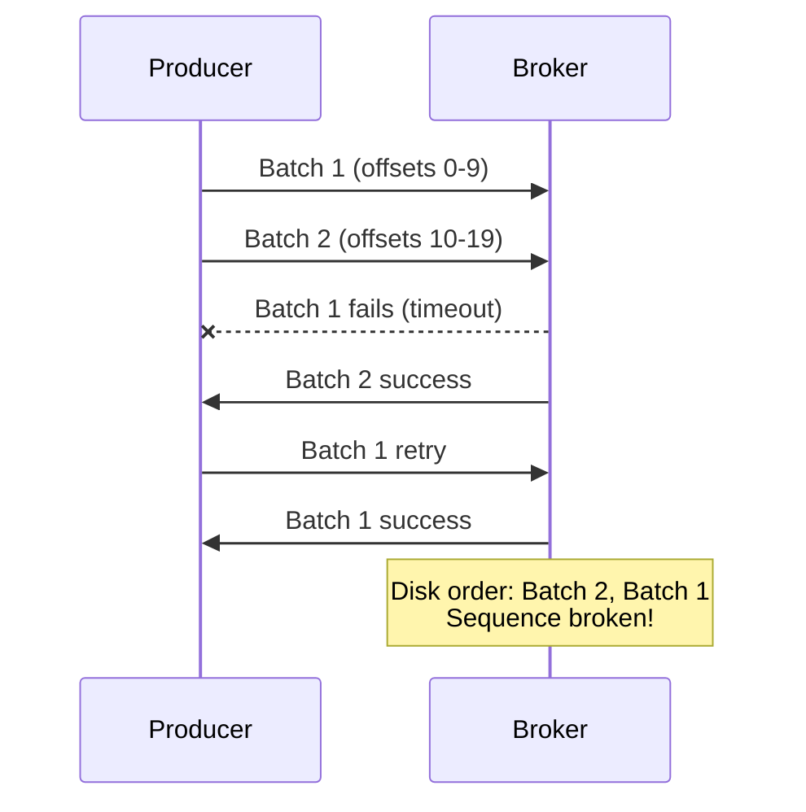
```mermaid
sequenceDiagram
    participant P as Producer
    participant B as Broker

    P->>B: Batch 1 (offsets 0-9)
    P->>B: Batch 2 (offsets 10-19)
    B--xP: Batch 1 fails (timeout)
    B->>P: Batch 2 success
    P->>B: Batch 1 retry
    B->>P: Batch 1 success
    Note over B: Disk order: Batch 2, Batch 1<br/>Sequence broken!
```

この問題を防ぐのが `max.in.flight.requests.per.connection` パラメータである。この値を 1 に設定すると、1 つのリクエストの応答を受け取るまで次のリクエストを送信しない。ただし、スループットが低下する。

Kafka 0.11 以降では、冪等プロデューサー（後述）を有効にすることで、`max.in.flight.requests.per.connection=5` でも順序保証を維持できるようになった。

## 5. コンシューマグループとリバランシング

### 5.1 コンシューマグループの概念

コンシューマグループは、Kafka が Pub/Sub と Point-to-Point の両方のメッセージングパターンを実現するための中核概念である。

- **グループ間**: 各グループはトピックの全メッセージのコピーを受け取る（Pub/Sub）
- **グループ内**: パーティションはグループ内のコンシューマに排他的に割り当てられる（Point-to-Point）

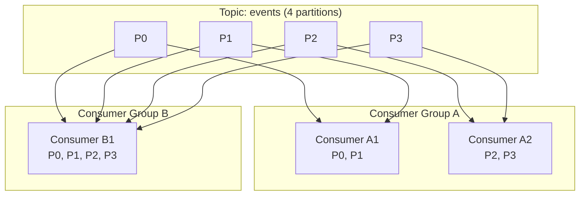
```mermaid
graph TB
    subgraph "Topic: events (4 partitions)"
        P0[P0]
        P1[P1]
        P2[P2]
        P3[P3]
    end

    subgraph "Consumer Group A"
        CA1["Consumer A1<br/>P0, P1"]
        CA2["Consumer A2<br/>P2, P3"]
    end

    subgraph "Consumer Group B"
        CB1["Consumer B1<br/>P0, P1, P2, P3"]
    end

    P0 --> CA1
    P1 --> CA1
    P2 --> CA2
    P3 --> CA2

    P0 --> CB1
    P1 --> CB1
    P2 --> CB1
    P3 --> CB1
```

1 つのパーティションは、同一グループ内では最大 1 つのコンシューマにしか割り当てられない。したがって、コンシューマ数がパーティション数を超えると、一部のコンシューマはアイドル状態になる。

### 5.2 Group Coordinator とリバランシングの概要

コンシューマグループの管理は、**Group Coordinator** と呼ばれるブローカーが担当する。Group Coordinator は `__consumer_offsets` 内部トピックの特定パーティションの Leader ブローカーが務める。どのブローカーが Coordinator になるかは、`hash(group.id) % __consumer_offsets のパーティション数` で決まる。

リバランシングは以下のイベントで発生する。

- コンシューマがグループに参加した
- コンシューマがグループから離脱した（明示的な離脱またはハートビートタイムアウト）
- トピックのパーティション数が変更された
- コンシューマがサブスクライブするトピックパターンにマッチする新しいトピックが作成された

### 5.3 Eager リバランス（Stop-the-World）

Kafka の初期のリバランスプロトコルは**Eager リバランス**と呼ばれ、以下の手順で実行される。

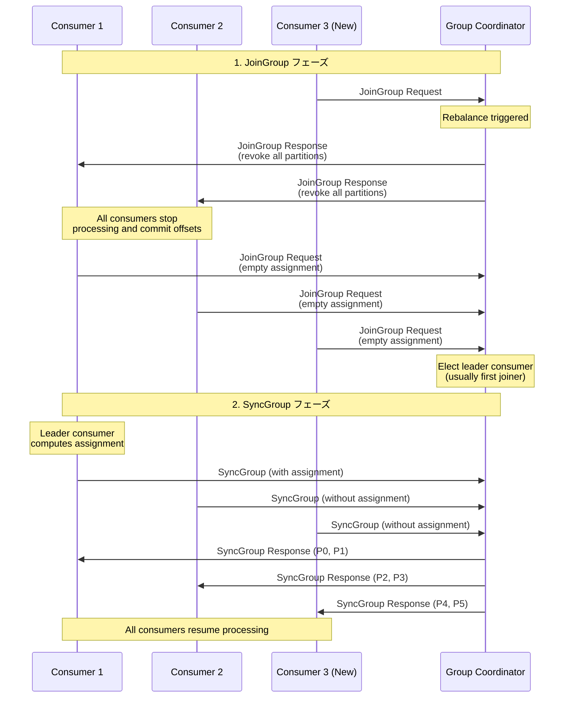
```mermaid
sequenceDiagram
    participant C1 as Consumer 1
    participant C2 as Consumer 2
    participant C3 as Consumer 3 (New)
    participant GC as Group Coordinator

    Note over C1,GC: 1. JoinGroup フェーズ
    C3->>GC: JoinGroup Request
    Note over GC: Rebalance triggered
    GC->>C1: JoinGroup Response<br/>(revoke all partitions)
    GC->>C2: JoinGroup Response<br/>(revoke all partitions)

    Note over C1,C2: All consumers stop<br/>processing and commit offsets

    C1->>GC: JoinGroup Request<br/>(empty assignment)
    C2->>GC: JoinGroup Request<br/>(empty assignment)
    C3->>GC: JoinGroup Request<br/>(empty assignment)

    Note over GC: Elect leader consumer<br/>(usually first joiner)

    Note over C1,GC: 2. SyncGroup フェーズ
    Note over C1: Leader consumer<br/>computes assignment
    C1->>GC: SyncGroup (with assignment)
    C2->>GC: SyncGroup (without assignment)
    C3->>GC: SyncGroup (without assignment)

    GC->>C1: SyncGroup Response (P0, P1)
    GC->>C2: SyncGroup Response (P2, P3)
    GC->>C3: SyncGroup Response (P4, P5)

    Note over C1,C3: All consumers resume processing
```

Eager リバランスの最大の問題は、**全コンシューマが一斉にパーティションの割り当てを失う**点である。リバランス中はすべてのコンシューマがメッセージの処理を停止するため、大規模なコンシューマグループでは数秒から数分のダウンタイムが発生しうる。

### 5.4 Cooperative リバランス（Incremental）

Kafka 2.4 で導入された **Cooperative リバランス**（Incremental Cooperative Rebalancing）は、Eager リバランスの問題を解決する。

```mermaid
sequenceDiagram
    participant C1 as Consumer 1
    participant C2 as Consumer 2
    participant C3 as Consumer 3 (New)
    participant GC as Group Coordinator

    Note over C1,GC: 第1ラウンド: 再割り当て計画
    C3->>GC: JoinGroup Request
    Note over GC: Rebalance triggered
    C1->>GC: JoinGroup (owns P0,P1,P2)
    C2->>GC: JoinGroup (owns P3,P4,P5)
    C3->>GC: JoinGroup (owns nothing)

    Note over C1: Leader computes diff:<br/>C1 should lose P2<br/>C2 should lose P5

    GC->>C1: SyncGroup (keep P0,P1; revoke P2)
    GC->>C2: SyncGroup (keep P3,P4; revoke P5)
    GC->>C3: SyncGroup (nothing yet)

    Note over C1: C1 revokes only P2<br/>continues processing P0,P1
    Note over C2: C2 revokes only P5<br/>continues processing P3,P4

    Note over C1,GC: 第2ラウンド: 解放されたパーティションを再割り当て
    C1->>GC: JoinGroup (owns P0,P1)
    C2->>GC: JoinGroup (owns P3,P4)
    C3->>GC: JoinGroup (owns nothing)

    GC->>C1: SyncGroup (P0,P1)
    GC->>C2: SyncGroup (P3,P4)
    GC->>C3: SyncGroup (P2,P5)

    Note over C1,C3: C3 starts processing P2,P5<br/>C1 and C2 never stopped
```

Cooperative リバランスの核心は以下の 2 点である。

1. **部分的な取り消し**: 移動が必要なパーティションのみを取り消し、残りのパーティションは処理を継続する
2. **2 ラウンドプロトコル**: 第 1 ラウンドで移動対象のパーティションを特定・取り消しし、第 2 ラウンドで新しいコンシューマに割り当てる

これにより、リバランス中のダウンタイムが大幅に削減される。移動対象のパーティションのみが一時的に処理を停止し、その他のパーティションは影響を受けない。

::: tip パーティションアサイメント戦略の選択
Kafka は複数のアサイメント戦略を提供している。

- **RangeAssignor**: パーティションをソートし、コンシューマに連続範囲で割り当てる。トピック数が多いと偏りが生じやすい。
- **RoundRobinAssignor**: 全トピックのパーティションをラウンドロビンで割り当てる。均等だが、リバランス時の移動量が大きい。
- **StickyAssignor**: 均等割り当てを目指しつつ、既存の割り当てをできるだけ維持する。Eager プロトコル上で動作。
- **CooperativeStickyAssignor**: StickyAssignor の Cooperative 版。Kafka 3.x 以降のデフォルト推奨。
:::

### 5.5 Static Group Membership

Kafka 2.3 で導入された **Static Group Membership** は、コンシューマの再起動時の不要なリバランスを防ぐ機能である。

通常、コンシューマが再起動すると、離脱→参加という 2 回のリバランスが発生する。Static Group Membership では、各コンシューマに `group.instance.id` を設定する。この ID を持つコンシューマがグループから離脱しても、`session.timeout.ms` の間はその ID に割り当てられたパーティションが保持される。同じ ID で再接続すれば、リバランスなしで即座にパーティションの処理を再開できる。

```java
Properties props = new Properties();
// ... other configs ...
props.put("group.instance.id", "consumer-host-1"); // Static membership
props.put("session.timeout.ms", 300000);            // 5 minutes grace period
```

これは Kubernetes 環境でのローリングデプロイにおいて特に有効である。Pod の再起動時にリバランスが発生しないため、デプロイ中のスループット低下を防げる。

### 5.6 オフセット管理

コンシューマグループの各メンバーは、処理済みのオフセットを `__consumer_offsets` 内部トピックにコミットする。オフセットのコミット方法には以下のバリエーションがある。

| 方式 | 説明 | リスク |
|------|------|--------|
| 自動コミット（`enable.auto.commit=true`） | `auto.commit.interval.ms` ごとに自動的にコミット | クラッシュ時にメッセージの重複処理またはロスが発生 |
| 同期コミット（`commitSync()`） | コミット完了まで呼び出し元をブロック | レイテンシが増加するが確実 |
| 非同期コミット（`commitAsync()`） | コミットをバックグラウンドで実行 | コミット失敗時のリトライが順序の問題を招く |
| コミットオフセット指定 | 特定のオフセットまでをコミット | 最も細かい制御が可能だが、実装が複雑 |

実務では、通常処理中は `commitAsync()` を使用し、コンシューマのシャットダウン時にのみ `commitSync()` を使うパターンが一般的である。

```java
try {
    while (true) {
        ConsumerRecords<String, String> records = consumer.poll(Duration.ofMillis(100));
        for (ConsumerRecord<String, String> record : records) {
            // Process record
            processRecord(record);
        }
        // Async commit during normal processing
        consumer.commitAsync((offsets, exception) -> {
            if (exception != null) {
                log.warn("Async commit failed", exception);
            }
        });
    }
} finally {
    try {
        // Sync commit on shutdown for reliability
        consumer.commitSync();
    } finally {
        consumer.close();
    }
}
```

## 6. Exactly-Once Semantics（EOS）

### 6.1 メッセージ配信保証のスペクトラム

分散メッセージングにおける配信保証は、以下の 3 段階に分類される。

- **At-most-once**: メッセージは最大 1 回配信される。ロスはありうるが重複はない。
- **At-least-once**: メッセージは最低 1 回配信される。重複はありうるがロスはない。
- **Exactly-once**: メッセージは正確に 1 回配信される。ロスも重複もない。

Kafka 0.11 以前は At-least-once が最大の保証であったが、0.11 で冪等プロデューサーとトランザクションが導入され、Exactly-Once Semantics（EOS）が実現された。

### 6.2 冪等プロデューサー（Idempotent Producer）

冪等プロデューサーは、プロデューサーからブローカーへの送信における重複を排除する。

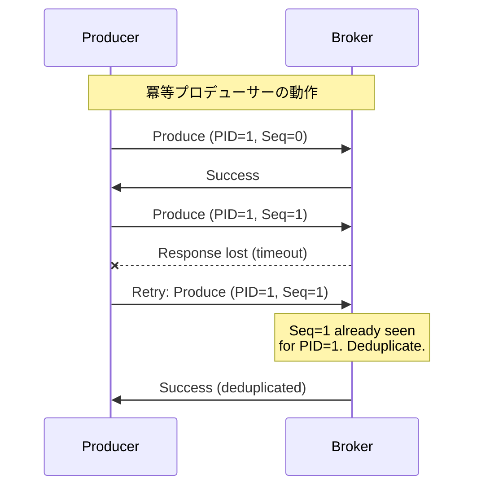
```mermaid
sequenceDiagram
    participant P as Producer
    participant B as Broker

    Note over P,B: 冪等プロデューサーの動作
    P->>B: Produce (PID=1, Seq=0)
    B->>P: Success
    P->>B: Produce (PID=1, Seq=1)
    B--xP: Response lost (timeout)
    P->>B: Retry: Produce (PID=1, Seq=1)
    Note over B: Seq=1 already seen<br/>for PID=1. Deduplicate.
    B->>P: Success (deduplicated)
```

冪等性は以下のメカニズムで実現される。

1. **Producer ID（PID）**: プロデューサーの初期化時にブローカーから一意の ID が割り当てられる
2. **Sequence Number**: 各パーティションに対するメッセージごとに単調増加するシーケンス番号が付与される
3. **ブローカー側の重複検出**: ブローカーは各 PID・パーティションの組み合わせについて、最後に受け入れたシーケンス番号を記録する。同じシーケンス番号のメッセージが再送された場合、重複として無視する

冪等プロデューサーは `enable.idempotence=true`（Kafka 3.0 以降はデフォルトで有効）で有効化される。これに伴い、以下の設定が自動的に強制される。

- `acks=all`
- `retries=Integer.MAX_VALUE`
- `max.in.flight.requests.per.connection <= 5`

::: warning 冪等プロデューサーの制約
冪等性は**単一のプロデューサーセッション**内でのみ保証される。プロデューサーが再起動すると新しい PID が割り当てられるため、再起動前後での重複は検出できない。プロデューサーの再起動を跨いだ Exactly-Once が必要な場合は、トランザクションを使用する必要がある。
:::

### 6.3 トランザクション

Kafka のトランザクションは、**複数のパーティションへの書き込みとオフセットのコミットをアトミックに行う**ための機能である。これは「consume-transform-produce」パターンにおいて特に重要である。

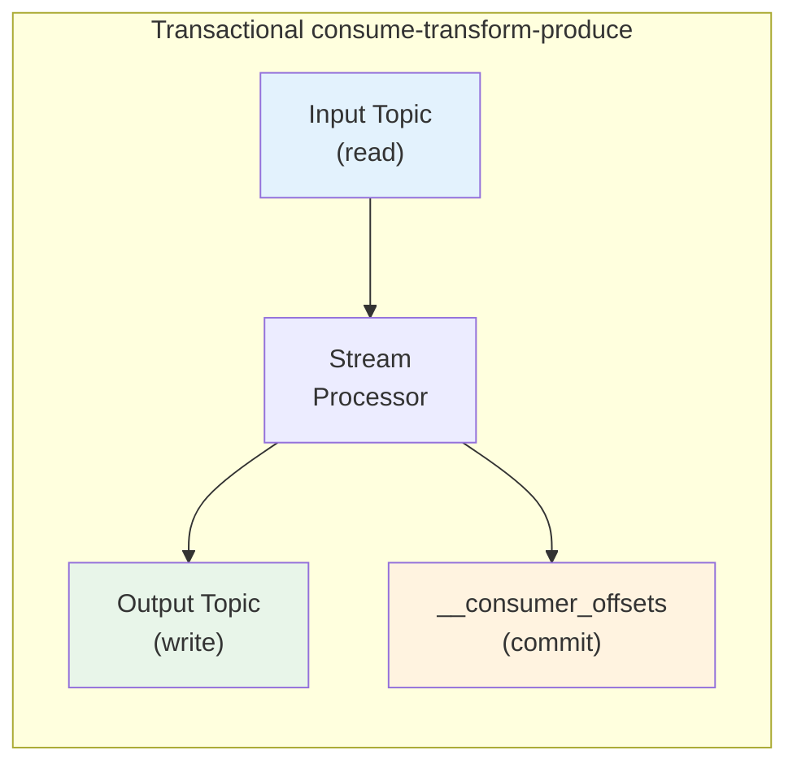
```mermaid
graph LR
    subgraph "Transactional consume-transform-produce"
        InputTopic["Input Topic<br/>(read)"] --> App["Stream<br/>Processor"]
        App --> OutputTopic["Output Topic<br/>(write)"]
        App --> OffsetCommit["__consumer_offsets<br/>(commit)"]
    end

    style InputTopic fill:#e3f2fd
    style OutputTopic fill:#e8f5e9
    style OffsetCommit fill:#fff3e0
```

入力トピックからメッセージを読み、加工して出力トピックに書き込み、入力のオフセットをコミットする。これら 3 つの操作がアトミックでなければ、障害時にメッセージの重複処理やロスが発生する。

#### トランザクションの実装メカニズム

Kafka のトランザクションは **Transaction Coordinator** と **`__transaction_state`** 内部トピックを中心に動作する。

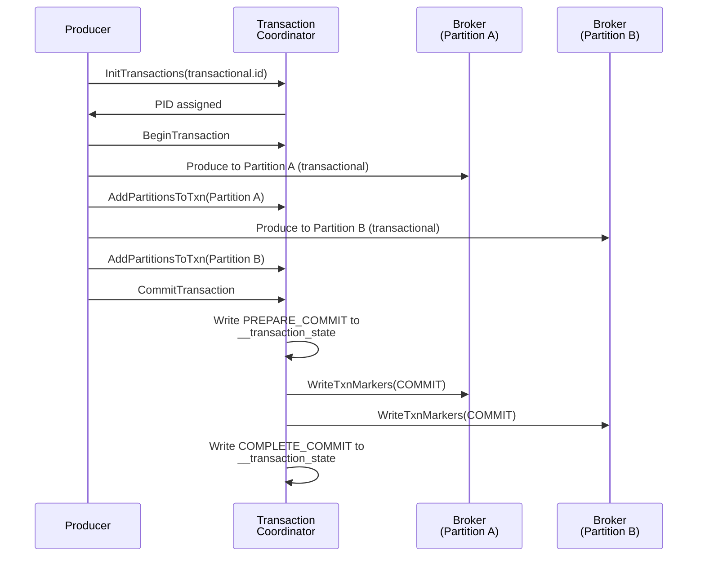
```mermaid
sequenceDiagram
    participant P as Producer
    participant TC as Transaction<br/>Coordinator
    participant B1 as Broker<br/>(Partition A)
    participant B2 as Broker<br/>(Partition B)

    P->>TC: InitTransactions(transactional.id)
    TC->>P: PID assigned

    P->>TC: BeginTransaction
    P->>B1: Produce to Partition A (transactional)
    P->>TC: AddPartitionsToTxn(Partition A)
    P->>B2: Produce to Partition B (transactional)
    P->>TC: AddPartitionsToTxn(Partition B)

    P->>TC: CommitTransaction
    TC->>TC: Write PREPARE_COMMIT to<br/>__transaction_state
    TC->>B1: WriteTxnMarkers(COMMIT)
    TC->>B2: WriteTxnMarkers(COMMIT)
    TC->>TC: Write COMPLETE_COMMIT to<br/>__transaction_state
```

トランザクションの流れは以下の通りである。

1. **InitTransactions**: `transactional.id` を使って Transaction Coordinator に登録し、PID を取得する。前回のトランザクションが未完了であれば、アボートまたはコミットで完了させる。
2. **BeginTransaction**: トランザクションを開始する。
3. **Produce**: 通常通りメッセージを送信する。各メッセージにはトランザクショナルフラグが付与される。
4. **AddPartitionsToTxn**: 書き込み先のパーティションを Transaction Coordinator に登録する。
5. **CommitTransaction** / **AbortTransaction**: トランザクションを完了する。

コミット時、Transaction Coordinator は各パーティションに**コントロールレコード（Transaction Marker）** を書き込む。コンシューマ側が `isolation.level=read_committed` で動作している場合、コミットされたトランザクションのメッセージのみを読み取り、アボートされたトランザクションや進行中のトランザクションのメッセージはスキップする。

```java
Properties props = new Properties();
props.put("transactional.id", "order-processor-1"); // Stable across restarts
props.put("enable.idempotence", true);
// ... other configs ...

KafkaProducer<String, String> producer = new KafkaProducer<>(props);
producer.initTransactions();

KafkaConsumer<String, String> consumer = new KafkaConsumer<>(consumerProps);
consumer.subscribe(Collections.singleton("input-topic"));

while (true) {
    ConsumerRecords<String, String> records = consumer.poll(Duration.ofMillis(100));

    producer.beginTransaction();
    try {
        for (ConsumerRecord<String, String> record : records) {
            // Transform and produce to output topic
            String transformed = transform(record.value());
            producer.send(new ProducerRecord<>("output-topic", record.key(), transformed));
        }

        // Commit offsets within the transaction
        Map<TopicPartition, OffsetAndMetadata> offsets = computeOffsets(records);
        producer.sendOffsetsToTransaction(offsets, consumer.groupMetadata());

        producer.commitTransaction();
    } catch (Exception e) {
        producer.abortTransaction();
    }
}
```

### 6.4 EOS の性能コスト

Exactly-Once Semantics は無料ではない。以下のオーバーヘッドが発生する。

| コスト要因 | 影響 |
|-----------|------|
| Transaction Coordinator との通信 | トランザクションの開始・コミットごとに追加の RPC が発生 |
| コントロールレコードの書き込み | 各パーティションにトランザクションマーカーが書き込まれる |
| `read_committed` のバッファリング | コンシューマはトランザクションの完了を待つ必要があるため、末尾遅延（tail latency）が増加 |
| `__transaction_state` の書き込み | トランザクション状態の永続化コスト |

実測値としては、スループットの低下は 3〜20% 程度、レイテンシの増加は数十ミリ秒程度とされている。金融取引やデータパイプラインの整合性が要求される場面では、このコストは十分に正当化される。

## 7. パフォーマンスチューニング

### 7.1 ブローカーの設計とスレッドモデル

パフォーマンスチューニングを効果的に行うには、ブローカーの内部アーキテクチャを理解する必要がある。

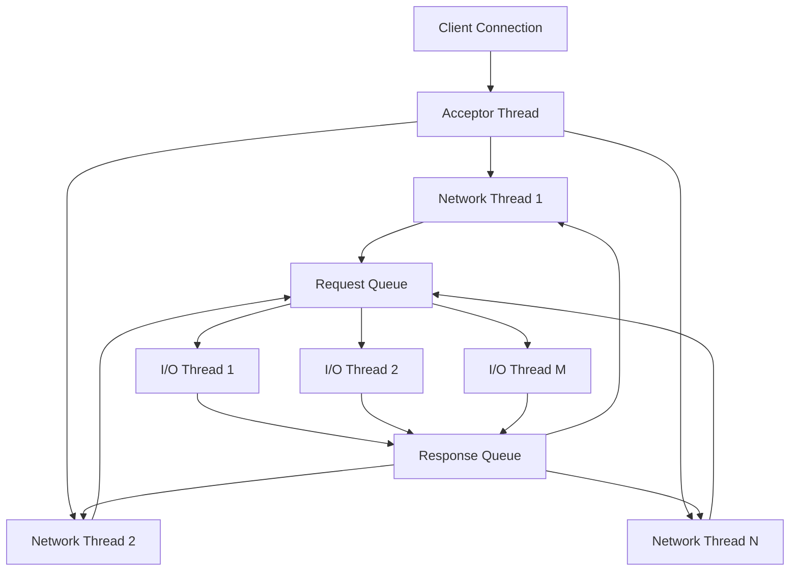
```mermaid
graph TB
    Client["Client Connection"] --> Acceptor["Acceptor Thread"]
    Acceptor --> NP1["Network Thread 1"]
    Acceptor --> NP2["Network Thread 2"]
    Acceptor --> NPN["Network Thread N"]

    NP1 --> RQ["Request Queue"]
    NP2 --> RQ
    NPN --> RQ

    RQ --> IO1["I/O Thread 1"]
    RQ --> IO2["I/O Thread 2"]
    RQ --> IOM["I/O Thread M"]

    IO1 --> ResQ["Response Queue"]
    IO2 --> ResQ
    IOM --> ResQ

    ResQ --> NP1
    ResQ --> NP2
    ResQ --> NPN
```

ブローカーのリクエスト処理パイプラインは以下の 3 層で構成される。

1. **Acceptor Thread**: 新しいクライアント接続を受け付け、Network Thread にラウンドロビンで割り当てる
2. **Network Threads**（`num.network.threads`、デフォルト 3）: ソケットからリクエストを読み取り、Request Queue に投入する。レスポンスを Response Queue から取り出し、クライアントに返す。
3. **I/O Threads**（`num.io.threads`、デフォルト 8）: Request Queue からリクエストを取り出し、実際の I/O 処理（ディスク読み書き、インデックス操作など）を行う。

### 7.2 ブローカー側の主要パラメータ

| パラメータ | デフォルト | 説明 | チューニング指針 |
|-----------|-----------|------|----------------|
| `num.network.threads` | 3 | ネットワークスレッド数 | SSL/TLS 利用時は増加を検討。CPU のコア数の半分程度まで。 |
| `num.io.threads` | 8 | I/O スレッド数 | ディスク数以上に設定。ディスクの並列性を活かす。 |
| `log.flush.interval.messages` | Long.MAX | ディスクへの強制フラッシュまでのメッセージ数 | デフォルト（OS 任せ）を推奨。手動フラッシュはスループットを大幅に低下させる。 |
| `log.retention.hours` | 168（7日） | ログの保持期間 | ストレージ容量とリプレイ要件のバランスで決定 |
| `log.segment.bytes` | 1 GB | セグメントサイズ | 小さすぎるとファイル数が増えファイルディスクリプタを圧迫。大きすぎるとコンパクション効率が低下。 |
| `replica.fetch.max.bytes` | 1 MB | フォロワーの Fetch サイズ上限 | 大きなメッセージを扱う場合は増加 |
| `message.max.bytes` | 1 MB | 単一メッセージの最大サイズ | コンシューマの `max.partition.fetch.bytes` と合わせて調整 |

::: danger ディスクフラッシュの設定に関する注意
`log.flush.interval.messages` や `log.flush.interval.ms` を小さい値に設定すると、OS の PageCache を bypass して頻繁にディスクに同期書き込みを行うため、スループットが桁違いに低下する。Kafka の設計思想は「耐久性はレプリケーションで保証し、ディスクフラッシュは OS に任せる」であり、この設定を手動で変更すべきユースケースはほとんどない。
:::

### 7.3 プロデューサー側のチューニング

プロデューサーのスループットに最も影響するパラメータは以下である。

```
スループット = batch.size × (1 / linger.ms) × num_partitions × compression_ratio
```

| パラメータ | チューニング指針 |
|-----------|----------------|
| `batch.size` | 16 KB（デフォルト）→ 32〜128 KB に増加。大きすぎるとメモリを浪費。 |
| `linger.ms` | 0（デフォルト）→ 5〜100 ms に増加。バッチの充填率を高める。 |
| `compression.type` | `lz4` が速度と圧縮率のバランスに優れる。`zstd` は圧縮率が最も高い。 |
| `buffer.memory` | 32 MB（デフォルト）。高スループットでは 64〜128 MB に増加。 |
| `acks` | `all` が推奨。`1` はレイテンシ面で有利だが耐久性が低下。 |

### 7.4 コンシューマ側のチューニング

| パラメータ | デフォルト | チューニング指針 |
|-----------|-----------|----------------|
| `fetch.min.bytes` | 1 | 増加させるとフェッチ頻度が下がりスループットが向上するが、レイテンシが増加 |
| `fetch.max.wait.ms` | 500 | `fetch.min.bytes` と組み合わせ。データ量が少ない時の最大待ち時間 |
| `max.poll.records` | 500 | 1 回の `poll()` で返すレコード数上限。処理時間が長い場合は減少 |
| `max.poll.interval.ms` | 300000 | `poll()` 間の最大間隔。超過するとリバランスが発生 |
| `session.timeout.ms` | 45000 | ハートビートのタイムアウト。短すぎると誤検知、長すぎると障害検出が遅延 |
| `heartbeat.interval.ms` | 3000 | ハートビート送信間隔。`session.timeout.ms` の 1/3 以下が推奨 |

::: warning max.poll.interval.ms とリバランスの関係
コンシューマが `max.poll.interval.ms` 以内に `poll()` を呼ばないと、Group Coordinator はそのコンシューマが死んだとみなしてリバランスを発動する。重い処理を行うコンシューマでは、この値を十分に大きく設定するか、処理ループの中で定期的に `poll()` を呼ぶ設計にする必要がある。
:::

### 7.5 OS レベルのチューニング

Kafka のパフォーマンスは OS の設定にも大きく依存する。

**ファイルディスクリプタ**: Kafka は大量のファイルを同時に開く。パーティション数 × セグメント関連ファイル数 + ネットワーク接続数を考慮し、`ulimit -n` を 100,000 以上に設定する。

**仮想メモリ**: `vm.swappiness` を 1 に設定し、スワップの発生を最小限に抑える。Kafka のパフォーマンスはメモリに大きく依存するため、スワップが発生すると劇的にパフォーマンスが低下する。

**ネットワーク**: `net.core.rmem_max`、`net.core.wmem_max` を増加させ、ソケットバッファを拡大する。高スループット環境では、これらを 2 MB 以上に設定する。

**ファイルシステム**: XFS が推奨される。ext4 も利用可能だが、大量のファイルを扱う場合に XFS の方が安定したパフォーマンスを示す。`noatime` マウントオプションにより、ファイルアクセス時刻の更新を抑制し、不要な書き込みを減らす。

### 7.6 パーティション数の設計

パーティション数の設計は、Kafka クラスタ全体のパフォーマンスに直結する重要な決定である。

**パーティション数を増やすメリット**:
- プロデューサーとコンシューマの並列度が向上
- 単一パーティションあたりの負荷が分散

**パーティション数を増やすデメリット**:
- Leader 選出やメタデータの更新に時間がかかる
- ブローカーあたりのファイルディスクリプタ消費が増加
- コントローラのフェイルオーバー時間が増加
- エンドツーエンドのレイテンシが増加する可能性（ISR の同期待ち）

経験則として、以下の計算式が目安になる。

```
パーティション数 ≧ max(目標スループット / 単一パーティションのスループット,
                       コンシューマグループの最大並列度)
```

単一パーティションのスループットは、一般的にプロデューサー側で 10 MB/s、コンシューマ側で 15〜25 MB/s 程度である。目標スループットが 100 MB/s であれば、最低 10 パーティションが必要となる。

## 8. KRaft：ZooKeeper からの脱却

### 8.1 ZooKeeper 依存の問題

Kafka は長らく Apache ZooKeeper に依存してきた。ZooKeeper はブローカーの登録、コントローラの選出、トピック/パーティションのメタデータ管理、ACL の保存などに使用されていた。しかし、この依存には以下の問題があった。

- **運用の複雑さ**: Kafka クラスタの他に ZooKeeper クラスタ（通常 3〜5 台）の運用が必要
- **スケーラビリティの制約**: メタデータが ZooKeeper の ZNode に格納されるため、パーティション数のスケーラビリティに上限がある
- **コントローラのフェイルオーバー**: ZooKeeper からメタデータを全読み込みする必要があり、パーティション数が多いと数分を要する

### 8.2 KRaft モードの設計

KRaft（Kafka Raft）は、ZooKeeper を完全に排除し、Kafka 自身の内部に Raft ベースの合意メカニズムを組み込むアーキテクチャである。Kafka 3.3 で本番利用可能（Production Ready）となり、Kafka 4.0 で ZooKeeper モードは完全に廃止された。

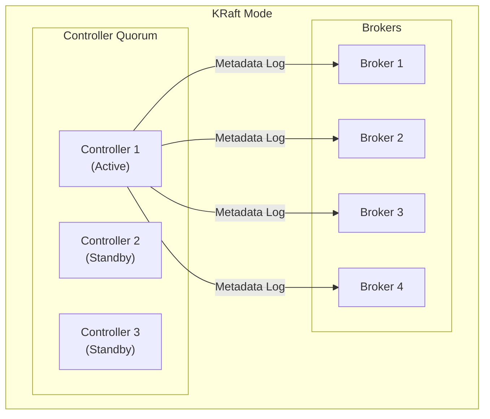
```mermaid
graph TB
    subgraph "KRaft Mode"
        subgraph "Controller Quorum"
            C1["Controller 1<br/>(Active)"]
            C2["Controller 2<br/>(Standby)"]
            C3["Controller 3<br/>(Standby)"]
        end

        subgraph "Brokers"
            B1["Broker 1"]
            B2["Broker 2"]
            B3["Broker 3"]
            B4["Broker 4"]
        end

        C1 -->|"Metadata Log"| B1
        C1 -->|"Metadata Log"| B2
        C1 -->|"Metadata Log"| B3
        C1 -->|"Metadata Log"| B4
    end
```

KRaft の核心は、クラスタのメタデータを **`__cluster_metadata`** という内部トピックのイベントログとして管理する点である。従来の ZooKeeper モデルでは、メタデータは ZooKeeper の ZNode に「状態」として格納されていたが、KRaft では「状態の変化」がログとして記録される。これにより以下の利点が得られる。

- **フェイルオーバーの高速化**: Standby コントローラはメタデータログをリアルタイムで複製しているため、Active コントローラの障害時に即座に引き継げる
- **メタデータの一貫性**: Raft プロトコルにより、メタデータの一貫性が強く保証される
- **スケーラビリティ**: ZooKeeper のボトルネックが解消され、数百万パーティションのサポートが現実的になる

## 9. まとめ：Kafka の設計原則

本記事で見てきた Kafka の内部設計には、いくつかの一貫した設計原則が貫かれている。

**シーケンシャル I/O への最適化**: 追記専用のログ構造、セグメント単位の削除、ゼロコピー転送など、すべてがディスクのシーケンシャル I/O を最大化する方向に設計されている。ランダム I/O を極力排除することで、安価な HDD でも高いスループットを実現できる。

**OS の機能への委譲**: PageCache の利用、`sendfile()` の活用など、Kafka はアプリケーションレベルでの最適化よりも OS の機構を最大限に活用する。これにより、実装の複雑さを抑えつつ高いパフォーマンスを得ている。

**バッチ処理の徹底**: プロデューサーのバッチング、RecordBatch 単位のディスク書き込みと圧縮、コンシューマの Fetch まで、あらゆる層でバッチ処理が行われている。ネットワークとディスクのラウンドトリップを削減し、オーバーヘッドを分散することがスループット向上の鍵である。

**レプリケーションによる耐久性**: ディスクへの同期書き込みに依存するのではなく、複数ブローカーへのレプリケーションでデータの耐久性を確保する。ISR と High Watermark のメカニズムにより、パフォーマンスと耐久性のバランスを運用者が制御できる。

**柔軟なコンシューマモデル**: コンシューマグループ、オフセットの外部管理、Cooperative リバランスなど、多様なワークロードに対応できるコンシューマモデルを提供している。ログの保持と再読み込みが可能な設計は、従来のメッセージキューにはなかった Kafka 独自の強みである。

これらの設計原則を理解した上で Kafka を運用することで、適切なパラメータチューニング、障害時の迅速なトラブルシューティング、そしてアーキテクチャ設計における正しいトレードオフ判断が可能になる。
