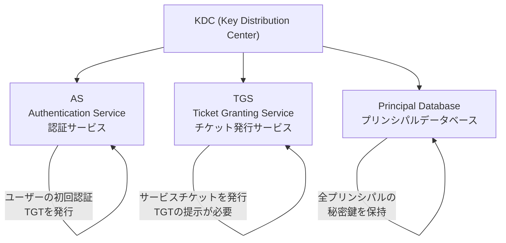
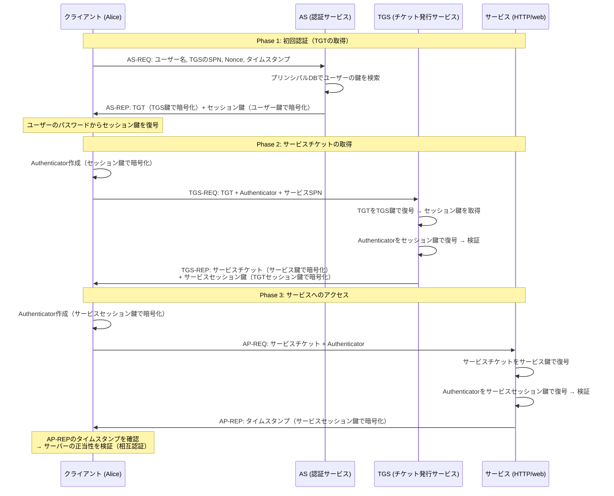
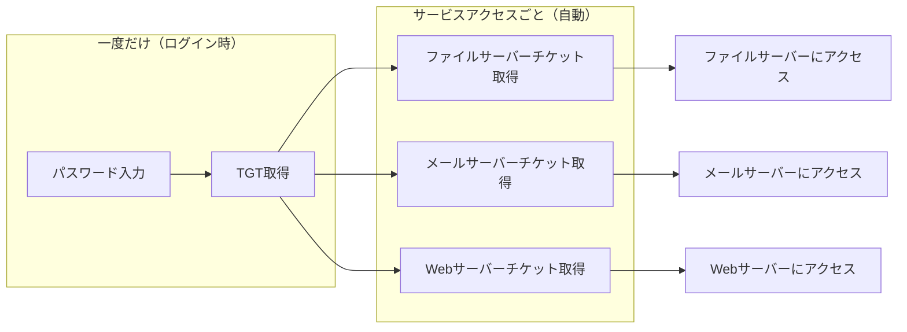
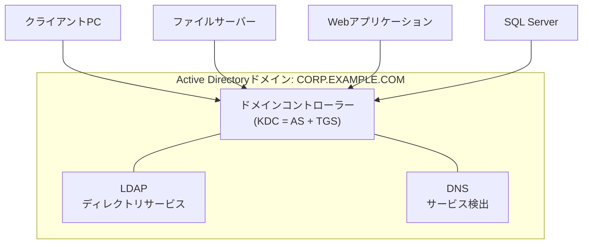
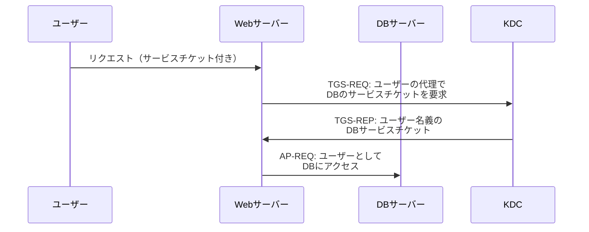
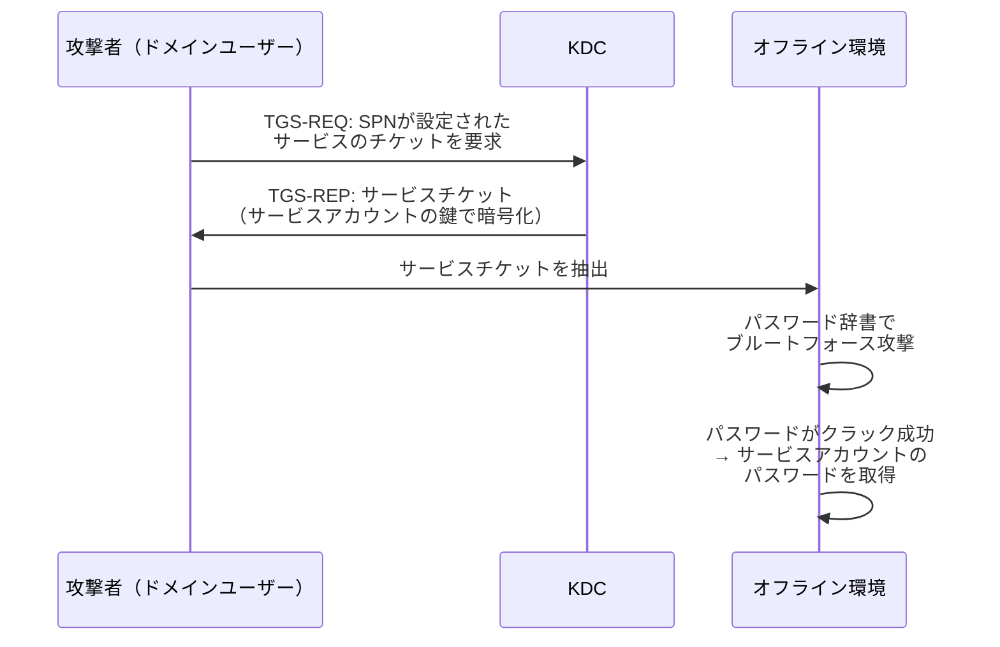

# Kerberos認証 — チケットベースの相互認証プロトコルとActive Directoryへの統合

## 1. 背景と動機

### 1.1 ネットワーク認証の根本的課題

コンピュータネットワークにおいて「認証」は最も基本的でありながら、最も困難な課題の一つである。ネットワーク上でサービスにアクセスする際、「このリクエストを送っているのは本当にAliceなのか？」という問いに答えなければならない。しかし、ネットワーク通信には以下の本質的な脅威が存在する。

- **盗聴（Eavesdropping）**: 通信経路上の第三者がパケットを傍受し、パスワードなどの認証情報を読み取る
- **リプレイ攻撃（Replay Attack）**: 傍受した認証メッセージをそのまま再送信し、正規ユーザーになりすます
- **なりすまし（Impersonation）**: 攻撃者が正規のサーバーやクライアントを装う
- **中間者攻撃（Man-in-the-Middle）**: 通信を中継し、両者に気づかれずにメッセージを改ざんする

1980年代のMITでは、大学キャンパス内に数千台のワークステーションが接続されたネットワーク環境「Project Athena」が構築されていた。このような大規模ネットワーク環境では、ユーザーがファイルサーバー、メールサーバー、プリンタなど様々なサービスに安全にアクセスするための仕組みが不可欠であった。

### 1.2 単純なパスワード認証の限界

最も素朴なアプローチは、各サービスにアクセスするたびにユーザー名とパスワードを送信する方式である。しかし、この方式には致命的な問題がある。

```
+--------+                         +---------+
| Client |  -- ID/Password -->     | Service |
|        |  <-- Access Granted --  |         |
+--------+                         +---------+
           ↑
     Attacker can intercept
     password in transit
```

**パスワードの平文送信**: ネットワーク上をパスワードが流れるたびに、盗聴のリスクにさらされる。暗号化されていない通信路では、パスワードを容易に傍受できる。

**パスワードの繰り返し入力**: ユーザーは複数のサービスにアクセスするたびにパスワードを入力しなければならない。利便性が著しく低下し、結果としてユーザーは弱いパスワードを使い回す傾向が生まれる。

**各サービスでのパスワード管理**: すべてのサービスがユーザーのパスワードを知っている（または検証できる）必要がある。サービスの数が増えるほど、パスワード漏洩のリスクが増大する。

### 1.3 Project AthenaとKerberosの誕生

1983年、MITはDEC（Digital Equipment Corporation）とIBMの支援を受けて**Project Athena**を開始した。このプロジェクトの目的は、大学の教育・研究環境に分散コンピューティング基盤を提供することであった。

Project Athenaでは、ネットワーク認証の課題を解決するために**Kerberos**プロトコルが開発された。名前はギリシャ神話に登場する冥界の番犬ケルベロス（Cerberus）に由来する。三つの頭を持つこの番犬は、クライアント・サーバー・KDC（Key Distribution Center）の三者を象徴するとも言われている。

Kerberosの設計思想は以下の原則に基づいている。

1. **パスワードをネットワーク上に流さない**: 認証情報そのものではなく、暗号学的に検証可能な「チケット」を使用する
2. **信頼できる第三者機関**: 認証の仲介役として中央のKDC（Key Distribution Center）を設置する
3. **シングルサインオン（SSO）**: ユーザーは一度だけパスワードを入力すれば、その後は複数のサービスに透過的にアクセスできる
4. **相互認証**: クライアントだけでなく、サーバーもクライアントに対して自身の正当性を証明する

Kerberosはバージョン4（1989年公開）で広く知られるようになり、バージョン5（1993年、RFC 1510。後にRFC 4120で更新）が現在の標準仕様となっている。

## 2. Kerberosの基本構成要素

### 2.1 レルム（Realm）

Kerberosの管理ドメインを**レルム（Realm）**と呼ぶ。レルムは通常、大文字のDNSドメイン名で表現される（例: `EXAMPLE.COM`）。一つのレルム内のすべてのプリンシパル（ユーザーやサービス）は、同一のKDCによって管理される。異なるレルム間での認証は**クロスレルム認証**によって実現され、レルム間で信頼関係を構築することで可能となる。

### 2.2 プリンシパル（Principal）

Kerberosにおいて認証の対象となるエンティティを**プリンシパル**と呼ぶ。プリンシパルは以下の形式で表現される。

```
component1/component2@REALM
```

- **ユーザープリンシパル**: `alice@EXAMPLE.COM`
- **サービスプリンシパル（SPN）**: `HTTP/webserver.example.com@EXAMPLE.COM`
- **ホストプリンシパル**: `host/workstation1.example.com@EXAMPLE.COM`

サービスプリンシパルは「サービス種別/ホスト名@レルム」の形式であり、どのホスト上のどのサービスにアクセスするかを一意に識別する。

### 2.3 KDC（Key Distribution Center）

KDCはKerberosシステムの中核であり、以下の二つのサービスから構成される。



**AS（Authentication Service、認証サービス）**: ユーザーの初回認証を担当する。ユーザーが正しい資格情報を提示すると、**TGT（Ticket Granting Ticket）**を発行する。

**TGS（Ticket Granting Service、チケット発行サービス）**: TGTを提示したユーザーに対して、特定のサービスにアクセスするための**サービスチケット**を発行する。

**プリンシパルデータベース**: すべてのプリンシパル（ユーザーおよびサービス）の秘密鍵（パスワードから導出された鍵）を保持する。Kerberosのセキュリティはこのデータベースの機密性に完全に依存しているため、厳重に保護されなければならない。

### 2.4 チケットの種類

Kerberosで使用されるチケットは二種類である。

**TGT（Ticket Granting Ticket）**: 「チケットを取得するためのチケット」であり、ユーザーが初回認証に成功した証拠である。TGTを持っていれば、パスワードを再入力することなく、各種サービスチケットを取得できる。TGTはTGSの秘密鍵（`krbtgt`アカウントの鍵）で暗号化されている。

**サービスチケット（Service Ticket / ST）**: 特定のサービスにアクセスするためのチケットである。対象サービスの秘密鍵で暗号化されており、そのサービスだけが復号できる。

### 2.5 セッション鍵とAuthenticator

**セッション鍵（Session Key）**: KDCがチケット発行時に生成する一時的な暗号鍵である。クライアントとサービス間の通信を暗号化するために使用される。チケットの有効期間中のみ有効であり、長期鍵（パスワードから導出された鍵）を直接使用するリスクを軽減する。

**Authenticator**: クライアントがセッション鍵で暗号化して作成する認証データである。タイムスタンプを含んでおり、リプレイ攻撃を防止する。Authenticatorはチケットとともにサービスに提示される。

## 3. 認証フロー

Kerberosの認証は三つのフェーズで構成される。以下に全体のフローを示す。

### 3.1 全体フロー



### 3.2 Phase 1: AS Exchange（初回認証）

ユーザーがKerberosシステムにログインする最初のステップである。

#### AS-REQ（Authentication Service Request）

クライアントはASに対して以下の情報を送信する。

| フィールド | 内容 | 目的 |
|-----------|------|------|
| クライアントプリンシパル | `alice@EXAMPLE.COM` | 認証対象のユーザーを識別 |
| サービスプリンシパル | `krbtgt/EXAMPLE.COM@EXAMPLE.COM` | TGTの発行を要求 |
| Nonce | ランダムな値 | リプレイ攻撃の防止 |
| 事前認証データ | タイムスタンプ（ユーザー鍵で暗号化） | ユーザーの身元確認 |

**事前認証（Pre-Authentication）** は、Kerberos V5のRFC 4120で強く推奨されている仕組みである。クライアントは自身のパスワードから導出した鍵で現在のタイムスタンプを暗号化し、AS-REQに含める。ASはこのタイムスタンプを復号して検証することで、リクエストが正規のユーザーから来たものであることを確認する。

事前認証がない場合、攻撃者はAS-REQを任意のユーザー名で送信し、AS-REPに含まれる暗号化されたデータに対してオフラインでパスワードのブルートフォース攻撃を実行できてしまう（AS-REP Roasting攻撃）。

事前認証データに含まれるタイムスタンプを $t_C$ とすると、ASは以下を検証する。

$$|t_{C} - t_{AS}| < \Delta t_{\max}$$

ここで $t_{AS}$ はASの現在時刻、$\Delta t_{\max}$ は許容される時刻のずれ（一般に5分）である。

#### AS-REP（Authentication Service Reply）

ASはリクエストを検証した後、以下の二つの要素を含む応答を返す。

**要素1: TGT（Ticket Granting Ticket）**

TGTは `krbtgt` アカウントの秘密鍵（$K_{TGS}$）で暗号化されており、クライアントは復号できない。TGTの内部構造は以下の通りである。

```
TGT = Enc(K_TGS, {
    client_principal: "alice@EXAMPLE.COM",
    session_key: SK_TGS,    // Client-TGS session key
    auth_time: timestamp,
    end_time: timestamp,     // Ticket expiration
    realm: "EXAMPLE.COM",
    flags: [FORWARDABLE, RENEWABLE, ...]
})
```

**要素2: 暗号化されたセッション情報**

クライアントの秘密鍵（$K_C$、パスワードから導出）で暗号化されたデータであり、TGSとの通信に使用するセッション鍵 $SK_{TGS}$ やチケットの有効期限などが含まれる。

```
Enc(K_C, {
    session_key: SK_TGS,
    end_time: timestamp,
    nonce: <AS-REQのNonce>,
    server_realm: "EXAMPLE.COM"
})
```

クライアントはパスワードから鍵 $K_C$ を導出し、このデータを復号してセッション鍵 $SK_{TGS}$ を取得する。正しいパスワードを持っていなければセッション鍵を取得できず、以降の通信は不可能である。この仕組みにより、**パスワードそのものをネットワーク上に送信することなく認証が成立する**。

### 3.3 Phase 2: TGS Exchange（サービスチケットの取得）

TGTを取得したクライアントは、特定のサービスにアクセスするためのサービスチケットを要求する。

#### TGS-REQ（Ticket Granting Service Request）

クライアントはTGSに対して以下を送信する。

| フィールド | 内容 | 目的 |
|-----------|------|------|
| TGT | ASから受け取ったTGT | クライアントの認証済み証明 |
| Authenticator | $Enc(SK_{TGS}, \{client, t_C, \ldots\})$ | 現在のリクエストが正当であることの証明 |
| サービスSPN | `HTTP/webserver.example.com@EXAMPLE.COM` | アクセス先のサービスを指定 |
| Nonce | ランダムな値 | リプレイ攻撃の防止 |

**Authenticator**はリプレイ攻撃を防ぐための重要な要素である。Authenticatorはセッション鍵 $SK_{TGS}$ で暗号化されたクライアントのプリンシパル名とタイムスタンプを含む。TGSはTGTを復号してセッション鍵を取得し、そのセッション鍵でAuthenticatorを復号・検証する。

Authenticatorのタイムスタンプの検証では以下を確認する。

$$|t_{C} - t_{TGS}| < \Delta t_{\max}$$

さらに、TGSは一定期間内に受信したAuthenticatorのキャッシュを保持し、同一のAuthenticatorが再利用されていないことを確認する。これにより、盗聴されたAuthenticatorが再送されてもリプレイ攻撃は成功しない。

#### TGS-REP（Ticket Granting Service Reply）

TGSはリクエストを検証した後、以下の応答を返す。

**要素1: サービスチケット**

対象サービスの秘密鍵（$K_S$）で暗号化されたチケットである。

```
Service Ticket = Enc(K_S, {
    client_principal: "alice@EXAMPLE.COM",
    session_key: SK_S,       // Client-Service session key
    auth_time: timestamp,
    end_time: timestamp,
    flags: [...]
})
```

**要素2: 暗号化されたセッション情報**

TGTセッション鍵 $SK_{TGS}$ で暗号化されたデータであり、サービスとの通信に使用する新しいセッション鍵 $SK_S$ が含まれる。

### 3.4 Phase 3: AP Exchange（サービスへのアクセス）

サービスチケットを取得したクライアントは、実際にサービスにアクセスする。

#### AP-REQ（Application Request）

クライアントはサービスに対して以下を送信する。

- サービスチケット（サービスの秘密鍵で暗号化済み）
- Authenticator（$Enc(SK_S, \{client, t_C, \ldots\})$）

サービスは自身の秘密鍵 $K_S$ でサービスチケットを復号し、セッション鍵 $SK_S$ を取得する。その鍵でAuthenticatorを復号・検証し、タイムスタンプの有効性とAuthenticatorの一意性を確認する。

#### AP-REP（Application Reply）と相互認証

Kerberosの重要な機能の一つが**相互認証（Mutual Authentication）**である。クライアントがサービスに対して自身を証明するだけでなく、サービスもクライアントに対して自身の正当性を証明する。

相互認証が要求された場合、サービスはクライアントのAuthenticatorに含まれていたタイムスタンプ $t_C$ を取り出し、それをサービスセッション鍵 $SK_S$ で暗号化してAP-REPとして返す。

$$AP\text{-}REP = Enc(SK_S, \{t_C\})$$

クライアントはこれを復号し、自分が送ったタイムスタンプと一致することを確認する。正規のサービスだけがサービスチケットを復号してセッション鍵を取得でき、このタイムスタンプを返せるため、サービスの正当性が確認される。これにより、攻撃者が正規のサービスを装うことを防止できる。

### 3.5 シングルサインオンの実現

Kerberosのフロー全体を俯瞰すると、シングルサインオンが自然に実現されていることがわかる。



ユーザーがパスワードを入力するのはTGT取得時の一度だけである。以降、各サービスへのアクセスにはTGTを提示してサービスチケットを自動的に取得する。このプロセスはクライアントソフトウェアが透過的に処理するため、ユーザーはパスワードの再入力を意識する必要がない。TGTの有効期限（一般に8〜10時間）内は、この仕組みが機能し続ける。

## 4. Kerberosの暗号技術

### 4.1 鍵導出

ユーザーのパスワードから暗号鍵を導出する方法は、Kerberosのバージョンによって異なる。

- **Kerberos V4**: DESを使用。パスワードから直接DES鍵を生成
- **Kerberos V5 初期**: DES-CBC-MD5、DES-CBC-CRC
- **Kerberos V5 現代**: AES-256-CTS-HMAC-SHA1-96（RFC 3962）、AES-256-CTS-HMAC-SHA384-192（RFC 8009）

現在の標準的な暗号タイプ（enctype）は `aes256-cts-hmac-sha1-96` である。鍵導出には PBKDF2（Password-Based Key Derivation Function 2）が使用され、ソルト（通常はプリンシパル名）を組み合わせることで、同一パスワードでも異なるプリンシパルに対して異なる鍵が生成される。

$$K = PBKDF2(password, salt, iterations, keylen)$$

ここで $salt$ は通常 `EXAMPLE.COMalice`（レルム名 + ユーザー名）の形式であり、$iterations$ はブルートフォース攻撃への耐性を高めるために十分大きな値（4096以上）が設定される。

### 4.2 暗号化とチェックサム

Kerberos V5ではメッセージの暗号化と完全性検証が分離されている。各 enctype は以下の要素を定義する。

| 要素 | 説明 | 例（aes256-cts） |
|------|------|------------------|
| 暗号化アルゴリズム | データの機密性を保護 | AES-256-CTS |
| チェックサムアルゴリズム | データの完全性を検証 | HMAC-SHA1-96 |
| 鍵導出関数 | パスワードから鍵を導出 | PBKDF2-HMAC-SHA1 |

CTS（Cipher Text Stealing）モードは、ブロック暗号の出力サイズを入力サイズと同じに保つ方式であり、パディングによるデータサイズの増加を回避する。

### 4.3 タイムスタンプの重要性

Kerberosはタイムスタンプに大きく依存するプロトコルである。事前認証、Authenticator、チケットの有効期限——いずれもタイムスタンプに基づいている。このため、**Kerberosレルム内のすべてのホストの時刻が同期されていること**が運用上の必須条件となる。

許容されるクロックスキュー（時刻のずれ）はデフォルトで5分（300秒）である。これを超える時刻のずれがあると認証が失敗する。実運用においてはNTP（Network Time Protocol）による時刻同期が不可欠であり、NTPサーバーの障害がKerberos認証の全面的な障害につながり得る。

## 5. Active DirectoryとKerberos

### 5.1 Windows環境におけるKerberosの採用

Microsoft Windows 2000以降、**Active Directory（AD）**の既定の認証プロトコルとしてKerberos V5が採用された。それ以前のWindowsドメイン認証はNTLM（NT LAN Manager）に基づいていたが、NTLMにはパスワードハッシュのリレー攻撃への脆弱性やパフォーマンスの問題があった。

Active DirectoryにおいてはドメインコントローラーがKDCの役割を担う。Active Directoryのドメイン名がKerberosのレルム名に対応し、ADに登録されたすべてのユーザーおよびコンピュータアカウントがKerberosプリンシパルとして管理される。



### 5.2 SPNとサービス登録

Active Directoryでは、Kerberosで保護されるすべてのサービスに**SPN（Service Principal Name）**が登録されなければならない。SPNはADオブジェクトの `servicePrincipalName` 属性に格納される。

代表的なSPNの例を以下に示す。

| サービス | SPN形式 | 例 |
|---------|---------|-----|
| HTTP | `HTTP/hostname` | `HTTP/web01.corp.example.com` |
| SQL Server | `MSSQLSvc/hostname:port` | `MSSQLSvc/sql01.corp.example.com:1433` |
| LDAP | `ldap/hostname` | `ldap/dc01.corp.example.com` |
| CIFS（ファイル共有） | `cifs/hostname` | `cifs/fs01.corp.example.com` |

SPNが正しく登録されていない場合、クライアントはサービスチケットを取得できず、NTLMにフォールバックするか認証に失敗する。SPNの重複登録も認証エラーの原因となるため、運用上の注意が必要である。

### 5.3 委任（Delegation）

Active Directory環境ではしばしば、フロントエンドのWebサーバーがバックエンドのデータベースにユーザーの代理としてアクセスする必要がある。Kerberosはこのような**委任（Delegation）**のシナリオをサポートしている。



**制約なし委任（Unconstrained Delegation）**: サービスがユーザーのTGTを受け取り、任意のサービスに対してユーザーの代理でアクセスできる。非常に強力だがセキュリティリスクが高い。

**制約付き委任（Constrained Delegation）**: サービスが代理でアクセスできるサービスを事前に制限する。AD上で明示的に許可されたサービスに対してのみ委任が可能である。

**リソースベースの制約付き委任（Resource-Based Constrained Delegation）**: Windows Server 2012で導入。委任の許可をサービスの所有者ではなく、アクセスされるリソース側で制御する。ドメイン管理者の介入なしに委任を構成できるため、運用の柔軟性が高い。

### 5.4 PAC（Privilege Attribute Certificate）

MicrosoftのKerberos実装では、チケットに**PAC（Privilege Attribute Certificate）**と呼ばれる拡張データが含まれる。PACにはユーザーのSID（Security Identifier）、所属グループのSID、その他の認可情報が格納されている。

PACにより、サービスはチケットだけでユーザーの権限情報を取得でき、別途LDAPでグループメンバーシップを問い合わせる必要がない。ただし、PACの情報はチケット発行時のものであり、グループメンバーシップが変更されてもチケットが有効な間は反映されないという制約がある。

## 6. Kerberosに対する攻撃手法

Kerberosは堅牢な設計であるが、実装や運用の脆弱性を突く様々な攻撃手法が知られている。これらの攻撃を理解することは、防御策を講じる上で不可欠である。

### 6.1 Golden Ticket攻撃

**攻撃概要**: `krbtgt` アカウントの秘密鍵（パスワードハッシュ）を入手した攻撃者が、任意のTGTを偽造する攻撃である。

**メカニズム**: TGTは `krbtgt` の秘密鍵で暗号化されている。この鍵を入手すれば、攻撃者は任意のユーザー名、任意の有効期限、任意のグループメンバーシップを持つTGTを自由に作成できる。KDCはTGTを復号して内容を信頼するため、偽造されたTGTであっても正規のものとして扱われる。

```
Golden Ticket = Enc(K_krbtgt, {
    client: "任意のユーザー名（存在しなくても可）",
    session_key: 攻撃者が生成,
    end_time: 任意の期限（10年後など）,
    groups: [Domain Admins, Enterprise Admins, ...]
})
```

**影響範囲**: ドメイン全体の完全な制御。ドメイン管理者を含む任意のユーザーになりすますことが可能である。

**前提条件**: `krbtgt` アカウントのパスワードハッシュの取得。これは通常、ドメインコントローラーへの管理者アクセスを必要とする（DCSync攻撃やntds.ditファイルの抽出など）。

**対策**:
- `krbtgt` アカウントのパスワードを定期的に二回変更する（一回目で新しい鍵を設定、二回目で古い鍵を無効化）
- ドメインコントローラーへのアクセスを厳格に制御する
- 特権アクセス管理（PAM）を導入する
- チケットの有効期間に異常がないか監視する

### 6.2 Silver Ticket攻撃

**攻撃概要**: 特定のサービスアカウントの秘密鍵（パスワードハッシュ）を入手した攻撃者が、そのサービスへのサービスチケットを偽造する攻撃である。

**メカニズム**: サービスチケットはサービスの秘密鍵で暗号化されている。サービスアカウントの鍵を入手すれば、任意のユーザー名のサービスチケットを偽造できる。Golden Ticketと異なり、KDCとの通信が不要であるため、KDC側のログに痕跡を残さない。

```
Silver Ticket = Enc(K_Service, {
    client: "任意のユーザー名",
    session_key: 攻撃者が生成,
    end_time: 任意の期限,
    groups: [任意のグループ]
})
```

**Golden TicketとSilver Ticketの比較**:

| 特性 | Golden Ticket | Silver Ticket |
|------|--------------|---------------|
| 必要な鍵 | `krbtgt` の鍵 | サービスアカウントの鍵 |
| 影響範囲 | ドメイン全体 | 特定のサービスのみ |
| KDCログ | TGS-REQが記録される | 記録されない |
| 検出難易度 | やや容易 | 困難 |
| 前提条件の難易度 | 高い（DC侵害が必要） | 比較的低い |

**対策**:
- サービスアカウントに長く複雑なパスワードを設定する
- gMSA（Group Managed Service Account）を使用してパスワードを自動ローテーションする
- PAC検証を有効化し、KDCにPACの正当性を確認させる

### 6.3 Kerberoasting攻撃

**攻撃概要**: SPNが設定されたサービスアカウントのサービスチケットを取得し、オフラインでサービスアカウントのパスワードをクラッキングする攻撃である。

**メカニズム**: ドメイン内の任意の認証済みユーザーは、SPNが登録された任意のサービスに対するサービスチケットを要求できる。サービスチケットはサービスアカウントのパスワードから導出された鍵で暗号化されているため、オフラインでブルートフォース攻撃（辞書攻撃）を実行して鍵（＝パスワード）を特定できる。



**対策**:
- サービスアカウントに25文字以上のランダムなパスワードを設定する
- gMSA を使用して120文字のランダムパスワードを自動生成・ローテーションする
- AES暗号タイプのみを許可する（RC4より解析が困難）
- サービスチケットの異常な大量要求を監視する

### 6.4 AS-REP Roasting攻撃

**攻撃概要**: 事前認証が無効化されたアカウントに対してAS-REQを送信し、AS-REPに含まれる暗号化データをオフラインでクラッキングする攻撃である。

**メカニズム**: 事前認証（Pre-Authentication）が無効化されたアカウントに対しては、パスワードを知らなくてもAS-REPを取得できる。AS-REPにはユーザーの鍵で暗号化されたデータが含まれるため、オフラインでパスワードのブルートフォース攻撃が可能である。

**対策**:
- すべてのアカウントで事前認証を有効にする（Active Directoryでは「Kerberosの事前認証を必要としない」フラグを無効化）
- 事前認証が無効なアカウントがないか定期的に監査する

### 6.5 Pass-the-Ticket攻撃

**攻撃概要**: 侵害されたホストのメモリからKerberosチケット（TGTやサービスチケット）を抽出し、別のホストから使用する攻撃である。

**メカニズム**: Kerberosチケットはクライアントのメモリ（Windowsでは `lsass.exe` プロセスのメモリ空間）にキャッシュされている。管理者権限を持つ攻撃者はMimikatzなどのツールを使用してチケットを抽出し、別のマシンにインジェクトして使用できる。チケットにはパスワードが含まれていないため、パスワードを知らなくてもサービスにアクセスできる。

**対策**:
- Credential Guardを有効化し、チケットをハードウェア分離された環境に保護する
- 最小権限の原則を適用し、不要な管理者権限を排除する
- Protected Usersグループを活用してチケットのキャッシュを制限する
- エンドポイントの検知・対応（EDR）ソリューションを導入する

### 6.6 Kerberos Delegation攻撃

**攻撃概要**: 制約なし委任が設定されたサーバーを侵害し、そのサーバーに接続してきたユーザーのTGTを窃取する攻撃である。

**メカニズム**: 制約なし委任が有効なサーバーには、接続してきたクライアントのTGTが転送される。攻撃者がこのサーバーを侵害すると、メモリ内のTGTを窃取し、それを使って任意のサービスにそのユーザーとしてアクセスできる。特に、管理者がこのサーバーに接続した場合、管理者のTGTが窃取される。

**対策**:
- 制約なし委任の使用を最小限にし、可能な限り制約付き委任またはリソースベースの制約付き委任を使用する
- 特権アカウントを「Account is sensitive and cannot be delegated」フラグで保護する
- Protected Usersグループに特権アカウントを含める

## 7. セキュリティ上の考慮事項

### 7.1 KDCの単一障害点

KDCはKerberosシステム全体の信頼の根幹であると同時に、単一障害点（Single Point of Failure）でもある。KDCが利用不能になると、新しいチケットの発行が不可能となり、既存のチケットが期限切れになった時点でサービスへのアクセスが全面的に停止する。

Active Directory環境では、複数のドメインコントローラーを配置して冗長性を確保する。各ドメインコントローラーはKDCとして機能し、プリンシパルデータベースはレプリケーションによって同期される。

### 7.2 時刻同期の重要性

前述の通り、Kerberosはタイムスタンプに大きく依存する。時刻同期の問題は、認証障害の最も一般的な原因の一つである。

運用上の推奨事項を以下に示す。

- ドメイン内のすべてのホストでNTPを適切に構成する
- Active Directory環境ではPDCエミュレーターを信頼できる時刻ソースとして構成する
- クロックスキューの許容値を不必要に広げない（広げるとリプレイ攻撃のウィンドウが拡大する）
- NTPサーバーの可用性を監視する

### 7.3 鍵の管理

Kerberosのセキュリティは長期鍵（パスワードから導出された鍵）の機密性に依存している。

- **`krbtgt` アカウント**: ドメイン全体のセキュリティの根幹。定期的なパスワード変更が必要。侵害された場合はGolden Ticket攻撃が可能になる
- **サービスアカウント**: 弱いパスワードはKerberoasting攻撃の標的となる。gMSAの使用が強く推奨される
- **ユーザーアカウント**: パスワードポリシーの適用、多要素認証との統合

### 7.4 暗号アルゴリズムの選択

Kerberos V5はプラグイン可能な暗号フレームワークを持つため、使用するアルゴリズムを選択できる。レガシーなアルゴリズムは無効化すべきである。

| アルゴリズム | 状態 | 推奨 |
|------------|------|------|
| DES-CBC-MD5 | 廃止（RFC 6649） | 使用禁止 |
| DES-CBC-CRC | 廃止 | 使用禁止 |
| RC4-HMAC | 非推奨 | 可能な限り無効化 |
| AES128-CTS-HMAC-SHA1 | 推奨 | 使用可 |
| AES256-CTS-HMAC-SHA1 | 推奨 | 推奨 |
| AES256-CTS-HMAC-SHA384 | 最新（RFC 8009） | 最推奨 |

RC4-HMAC（`arcfour-hmac-md5`）はKerberoasting攻撃においてAESより高速にクラッキングできるため、可能な限りAESのみを使用するよう暗号タイプを制限すべきである。

### 7.5 監視とログ

Kerberos関連の攻撃を検出するために、以下のイベントを監視すべきである。

| Windowsイベントログ | イベントID | 監視内容 |
|-------------------|----------|---------|
| Security | 4768 | TGTの要求（AS-REQ）。異常なアカウントからのTGT要求を監視 |
| Security | 4769 | サービスチケットの要求（TGS-REQ）。大量のサービスチケット要求はKerberoastingの兆候 |
| Security | 4770 | チケットの更新。異常な更新パターンを監視 |
| Security | 4771 | 事前認証の失敗。ブルートフォース攻撃の兆候 |
| Security | 4776 | NTLMフォールバック。Kerberos認証の失敗を示唆 |

## 8. 他の認証プロトコルとの比較

### 8.1 NTLM（NT LAN Manager）

NTLMはKerberos以前のWindows認証プロトコルであり、チャレンジ・レスポンス方式に基づいている。

| 特性 | Kerberos | NTLM |
|------|----------|------|
| 認証方式 | チケットベース（第三者仲介） | チャレンジ・レスポンス |
| 相互認証 | あり | なし（サーバーはクライアントを認証しない） |
| 委任 | あり（制約付き委任など） | 限定的 |
| パフォーマンス | チケットキャッシュにより効率的 | 毎回DCとの通信が必要 |
| 攻撃耐性 | 高い（ただし実装に依存） | リレー攻撃に脆弱 |
| クロスドメイン | クロスレルム認証をサポート | 信頼関係の伝播が限定的 |

NTLMは下位互換性のためにいまだ多くの環境で有効になっているが、セキュリティ上の理由から可能な限り無効化し、Kerberosに統一すべきである。Microsoftは2024年にNTLMの段階的廃止を発表しており、将来的にはKerberosが唯一のWindows認証プロトコルとなる見通しである。

### 8.2 SAML（Security Assertion Markup Language）

SAMLはXMLベースのフェデレーション認証プロトコルであり、主にWebアプリケーションのSSO（シングルサインオン）に使用される。

| 特性 | Kerberos | SAML |
|------|----------|------|
| プロトコル層 | ネットワーク/アプリケーション層 | Webアプリケーション層 |
| データ形式 | バイナリ（ASN.1） | XML |
| 主な用途 | 企業内ネットワーク | Webベースのフェデレーション |
| シングルサインオン | ネイティブ対応 | リダイレクトベース |
| トークン有効期間 | 短い（通常8〜10時間） | 設定依存（分〜時間） |

### 8.3 OAuth 2.0 / OpenID Connect

OAuth 2.0は認可フレームワーク、OpenID Connectはその上に構築された認証レイヤーである。

| 特性 | Kerberos | OAuth 2.0 / OIDC |
|------|----------|-------------------|
| 設計時代 | 1980年代 | 2010年代 |
| 対象環境 | 企業内ネットワーク | インターネット/Web |
| トークン形式 | バイナリチケット | JSON（JWT） |
| プロトコル | UDP/TCP | HTTPS |
| 信頼モデル | 中央集権（KDC） | フェデレーション |
| モバイル対応 | 限定的 | ネイティブ対応 |

Kerberosは企業内ネットワークにおいて依然として最も堅牢な認証プロトコルであるが、クラウドやモバイル環境が主流となった現在、OAuth 2.0 / OIDCとの統合が重要になっている。多くの組織では、Active DirectoryのKerberos認証を基盤としつつ、クラウドサービスへのアクセスにはAzure AD（Entra ID）やADFS（Active Directory Federation Services）を通じてSAMLやOIDCトークンを発行するハイブリッド構成を採用している。

### 8.4 FIDO2 / WebAuthn

FIDO2はパスワードレス認証の標準であり、公開鍵暗号を用いてフィッシング耐性のある認証を実現する。

| 特性 | Kerberos | FIDO2 / WebAuthn |
|------|----------|------------------|
| 認証要素 | パスワード（知識） | 所持 + 生体/PIN |
| フィッシング耐性 | 限定的 | 高い |
| パスワードレス | 非対応 | 対応 |
| オフライン認証 | 可能（キャッシュ） | 可能（デバイス内） |

Windows Hello for BusinessはFIDO2の考え方をActive Directory環境に統合したものであり、パスワードの代わりにPINや生体認証を使用してKerberosチケットを取得する。これにより、Kerberosの基盤を維持しつつパスワードレス認証を実現できる。

## 9. Kerberosの現在と将来

### 9.1 クラウド時代における位置づけ

クラウドサービスの普及により、認証の中心がオンプレミスのActive DirectoryからクラウドベースのIdP（Identity Provider）に移行しつつある。しかし、Kerberosが完全に置き換えられるわけではない。

**ハイブリッド環境**: 多くの企業は依然としてオンプレミスのActive Directoryを運用しており、ファイルサーバー、イントラネットアプリケーション、データベースなどのリソースへのアクセスにKerberos認証を使用している。Azure ADとの同期により、クラウドとオンプレミスの認証を統合するハイブリッド構成が一般的である。

**Kerberos + クラウド連携**: Azure AD（Entra ID）は、オンプレミスのKerberos認証をクラウドに拡張する仕組みを提供している。Azure AD Kerberos を使用すると、クラウド上のリソースに対してもKerberosチケットベースの認証が可能となる。

### 9.2 プロトコルの進化

Kerberos自体も進化を続けている。

**PKINIT（Public Key Cryptography for Initial Authentication）**: パスワードの代わりにX.509証明書やスマートカードを使用してAS Exchangeを行う拡張（RFC 4556）。パスワードベースの攻撃（Kerberoasting、AS-REP Roasting）の根本的な対策となる。

**FAST（Flexible Authentication Secure Tunneling）**: 事前認証データの保護を強化する仕組み（RFC 6113）。AS Exchangeの通信を暗号化されたトンネル内で行うことで、オフラインのパスワード攻撃を困難にする。

**Token Binding**: チケットを特定のTLS接続に紐づけることで、チケットの窃取・転用を防止する研究が進められている。

### 9.3 UNIX/Linux環境でのKerberos

KerberosはWindows/Active Directory環境に限定されたプロトコルではない。MIT KerberosやHeimdal Kerberosは、UNIX/Linux環境で広く利用されている実装である。

- **Hadoop/HDFSの認証**: Apache Hadoopはクラスタ内の認証基盤としてKerberosを採用している
- **SSH認証**: GSSAPI（Generic Security Services API）を通じてKerberosチケットによるSSH認証が可能
- **NFS v4**: ネットワークファイルシステムの認証にKerberosを使用できる
- **FreeIPA**: Red Hatが開発する統合認証基盤であり、MIT Kerberosを中核コンポーネントとして使用

## 10. まとめ

Kerberosは、1980年代にMIT Project Athenaで生まれた認証プロトコルでありながら、40年以上経った現在も企業ネットワークの認証基盤として不可欠な存在であり続けている。その成功の理由は、以下の設計原則にある。

**パスワードをネットワーク上に流さない**: パスワードは鍵導出にのみ使用され、ネットワーク上を直接流れることがない。暗号学的に検証可能なチケットを介して認証が行われる。

**シングルサインオン**: ユーザーは一度だけパスワードを入力すれば、TGTの有効期間中は複数のサービスに透過的にアクセスできる。利便性とセキュリティのバランスが優れている。

**相互認証**: クライアントだけでなくサーバーも自身の正当性を証明する。これにより、なりすましサーバーへの接続を防止できる。

**信頼できる第三者機関**: KDCという中央集権的な信頼の根を設けることで、各サービスが個別にパスワードを管理する必要をなくした。ただし、これはKDCへの依存という運用上の課題も生んでいる。

一方で、Kerberosには実運用上の課題も多い。時刻同期への厳格な依存、KDCの単一障害点リスク、Golden TicketやKerberoastingに代表される攻撃への対処、そしてクラウド・モバイル環境との統合の難しさがある。

現代の認証アーキテクチャにおいて、Kerberosは「企業内ネットワークの認証基盤」としての役割に特化しつつ、SAML、OAuth 2.0、OpenID Connect、FIDO2といった新しいプロトコルと連携するハイブリッドモデルへと進化している。Kerberosの根本的な設計思想——「チケットベースの認証による安全なシングルサインオン」——は、形を変えながらも現代の認証アーキテクチャの基盤であり続けている。
