# カーネルアーキテクチャ

## 1. カーネルの役割 — OS の心臓部

### 1.1 カーネルとは何か

カーネル（kernel）とは、オペレーティングシステム（OS）の中核を構成するソフトウェアであり、ハードウェアとユーザー空間のアプリケーションの間を仲介する役割を持つ。コンピュータの電源が入り、ブートローダーがメモリにカーネルをロードした瞬間から、カーネルはシステムの全てのリソースを管理し続ける。

カーネルが担う主要な責務は以下の通りである。

| 責務 | 内容 |
|------|------|
| **プロセス管理** | プロセスの生成・終了・スケジューリング、コンテキストスイッチ |
| **メモリ管理** | 仮想メモリ、ページング、メモリ割り当てと解放 |
| **デバイス管理** | デバイスドライバを通じたハードウェア制御 |
| **ファイルシステム** | ファイルの読み書き、ディレクトリ構造、権限管理 |
| **ネットワーク** | TCP/IP スタック、ソケット通信 |
| **セキュリティ** | アクセス制御、特権分離、名前空間の隔離 |
| **プロセス間通信（IPC）** | パイプ、共有メモリ、メッセージキュー、シグナル |

### 1.2 特権レベルとカーネル空間

現代の CPU は**リングプロテクション**（Ring Protection）と呼ばれる特権レベルの仕組みを持つ。x86 アーキテクチャでは Ring 0 から Ring 3 までの4段階が定義されているが、実際にほとんどの OS が使用するのは Ring 0（カーネルモード）と Ring 3（ユーザーモード）の2段階である。

```
特権レベル（x86）:

  ┌─────────────────────┐
  │   Ring 0（カーネル） │  ← 全てのハードウェアにアクセス可能
  │   - メモリ管理       │     特権命令の実行が可能
  │   - デバイス制御     │
  │   - 割り込み処理     │
  ├─────────────────────┤
  │   Ring 1, 2         │  ← ほとんどの OS では未使用
  │   (デバイスドライバ) │
  ├─────────────────────┤
  │   Ring 3（ユーザー） │  ← アプリケーションが動作
  │   - ブラウザ         │     直接ハードウェアにアクセスできない
  │   - エディタ         │     カーネルへの要求はシステムコール経由
  │   - データベース     │
  └─────────────────────┘
```

ユーザー空間のプログラムがカーネルの機能を利用するには、**システムコール**（system call）というインターフェースを通じてカーネルに処理を依頼する。システムコールが発行されると、CPU はユーザーモードからカーネルモードに切り替わり（モード遷移）、カーネル内の対応するハンドラが実行される。この切り替えにはコンテキストの保存・復元が伴い、一定のオーバーヘッドが発生する。

### 1.3 カーネル設計の根本的な問い

カーネルアーキテクチャの設計において、最も根本的な問いは「**カーネル空間にどこまでの機能を置くか**」である。この問いに対する答えの違いが、モノリシックカーネル、マイクロカーネル、ハイブリッドカーネルといったアーキテクチャの違いを生み出す。


機能をカーネル空間に置けば**性能が向上**する（関数呼び出しで済み、モード遷移が不要）が、**バグの影響範囲が拡大**する（カーネル空間のバグはシステム全体をクラッシュさせる）。逆に、機能をユーザー空間に移せば**信頼性と保守性が向上**するが、**IPC のオーバーヘッド**が発生する。この本質的なトレードオフが、半世紀以上にわたるカーネル設計の議論を支配してきた。

## 2. モノリシックカーネル — 全てをひとつの空間に

### 2.1 設計思想

モノリシックカーネル（monolithic kernel）は、OS の主要な機能を**すべてカーネル空間（Ring 0）に配置**するアーキテクチャである。プロセス管理、メモリ管理、ファイルシステム、デバイスドライバ、ネットワークスタックなどが単一のアドレス空間を共有し、互いに関数呼び出しで直接連携できる。

```mermaid
graph TB
    subgraph UserSpace["ユーザー空間（Ring 3）"]
        App1["アプリケーション A"]
        App2["アプリケーション B"]
        App3["アプリケーション C"]
    end

    subgraph KernelSpace["カーネル空間（Ring 0）"]
        SC["システムコールインターフェース"]
        PM["プロセス管理"]
        MM["メモリ管理"]
        FS["ファイルシステム<br/>ext4 / XFS / Btrfs ..."]
        NET["ネットワークスタック<br/>TCP/IP"]
        DD["デバイスドライバ<br/>GPU / NIC / USB ..."]
        IPC["IPC"]
    end

    App1 --> SC
    App2 --> SC
    App3 --> SC
    SC --> PM
    SC --> MM
    SC --> FS
    SC --> NET
    SC --> DD
    SC --> IPC
    PM <--> MM
    FS <--> DD
    NET <--> DD
```

### 2.2 利点

**高いパフォーマンス**が最大の利点である。カーネル内のコンポーネント間の通信は単なる関数呼び出しであり、ユーザー空間・カーネル空間間のモード遷移や IPC のオーバーヘッドが発生しない。例えば、ファイルシステムがディスクドライバにデータを要求する場合、マイクロカーネルではメッセージの構築・送信・受信・デコードという一連の処理が必要になるが、モノリシックカーネルでは直接関数を呼び出すだけで済む。

また、カーネル内部のデータ構造を共有できるため、**設計が直観的**であり、最適化の余地が大きい。メモリ管理サブシステムがファイルシステムのページキャッシュと密接に連携するような高度な最適化は、モノリシックカーネルでは自然に実現できる。

### 2.3 欠点

一方で、**信頼性の問題**が深刻である。カーネル空間のいずれかのコンポーネントにバグがあれば、カーネル全体がクラッシュする可能性がある。特にデバイスドライバはカーネルコードの中で最もバグが多い部分であり、Linux カーネルのバグの約 70% がデバイスドライバに起因するとされる。モノリシックカーネルでは、これらのドライバがカーネル空間で動作するため、ドライバのバグがシステム全体の安定性に直結する。

**保守性の低下**も問題である。カーネル内部のコンポーネントが密に結合しているため、ある部分の変更が他の部分に予期しない影響を与える可能性がある。コードベースが巨大化するにつれて、この問題は深刻になる。

### 2.4 代表例: Linux

Linux はモノリシックカーネルの代表例であり、Linus Torvalds が 1991 年に開発を開始した。初期の Linux は文字通り全てが一枚岩のモノリシックカーネルであったが、現在はローダブルカーネルモジュール（LKM）によって動的にコンポーネントを追加・削除できる柔軟性を持つ。この点については後のセクションで詳述する。

他の代表的なモノリシックカーネルとしては、FreeBSD、OpenBSD、NetBSD などの BSD 系カーネルがある。

### 2.5 Tanenbaum-Torvalds 論争

カーネルアーキテクチャの歴史を語る上で欠かせないのが、1992 年に Usenet 上で繰り広げられた **Tanenbaum-Torvalds 論争**（Tanenbaum–Torvalds debate）である。MINIX の作者であるアムステルダム自由大学の Andrew S. Tanenbaum 教授は、Linux のモノリシック設計を「1970年代への回帰」と批判し、マイクロカーネルこそが将来の正しい方向だと主張した。これに対して Linus Torvalds は、マイクロカーネルの理論的な優位性は認めつつも、実用上はモノリシックカーネルの方がシンプルで高性能であると反論した。

> "Linux is obsolete" — Andrew S. Tanenbaum (1992)

この論争から 30 年以上が経過した現在、Linux は世界中のサーバー、スマートフォン（Android）、組込み機器、スーパーコンピュータで動作しており、モノリシックカーネルの実用性を証明している。一方で、Tanenbaum の指摘した信頼性の問題は依然として有効であり、後述する seL4 のような形式検証済みマイクロカーネルの研究開発は活発に続いている。

## 3. マイクロカーネル — 最小限の核

### 3.1 設計思想

マイクロカーネル（microkernel）は、カーネル空間に配置する機能を**必要最小限**に絞り、残りの OS サービスをユーザー空間のプロセス（**サーバー**と呼ばれる）として実行するアーキテクチャである。カーネル空間に残る機能は一般的に以下の3つに限定される。

1. **プロセス間通信（IPC）** — サーバー間のメッセージパッシング
2. **基本的なスケジューリング** — CPU 時間の割り当て
3. **低レベルメモリ管理** — アドレス空間の管理

ファイルシステム、デバイスドライバ、ネットワークスタックなどは全てユーザー空間のサーバープロセスとして実行される。

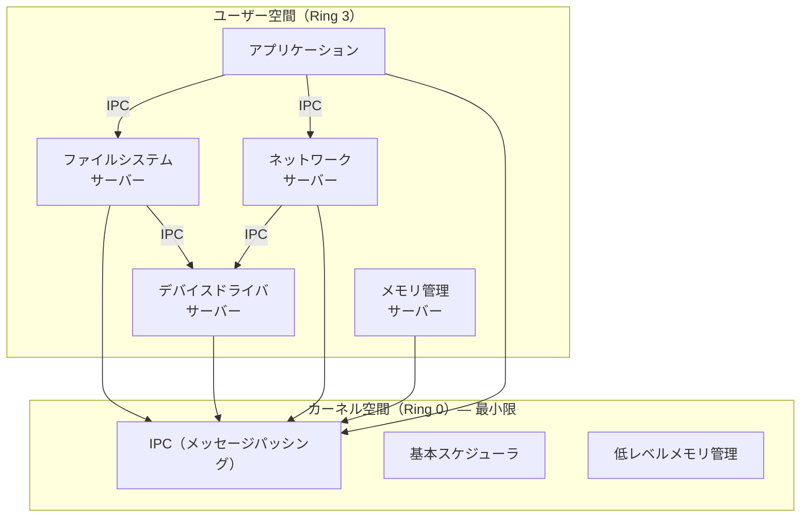

### 3.2 利点

**信頼性の向上**がマイクロカーネルの最大の利点である。デバイスドライバやファイルシステムがユーザー空間で動作するため、これらのコンポーネントにバグがあってもカーネル全体がクラッシュすることはない。障害を起こしたサーバーを再起動するだけでシステムを回復できる。

```
障害からの回復（マイクロカーネル）:

1. デバイスドライバサーバーがクラッシュ
   ┌──────────┐  ┌──────────┐  ┌──────────┐
   │ FS サーバ │  │ ドライバ ✗│  │ NET サーバ│
   └──────────┘  └──────────┘  └──────────┘
        ↕              ↕             ↕
   ┌─────────────── マイクロカーネル ──────────────┐
   │  IPC  |  スケジューラ  |  メモリ管理          │  ← 影響なし
   └───────────────────────────────────────────────┘

2. カーネルがドライバサーバーを自動再起動
   ┌──────────┐  ┌──────────┐  ┌──────────┐
   │ FS サーバ │  │ ドライバ ✓│  │ NET サーバ│
   └──────────┘  └──────────┘  └──────────┘
        ↕              ↕             ↕
   ┌─────────────── マイクロカーネル ──────────────┐
   │  IPC  |  スケジューラ  |  メモリ管理          │
   └───────────────────────────────────────────────┘
```

**セキュリティの強化**も大きな利点である。各サーバーは独立したアドレス空間で動作するため、最小権限の原則（principle of least privilege）を自然に適用できる。ファイルシステムサーバーがネットワークスタックのメモリを直接参照することはできず、攻撃対象領域（attack surface）が縮小される。

**形式検証の容易さ**も重要な利点である。カーネルのコード量が小さいため、数学的にバグがないことを証明する形式検証（formal verification）が現実的になる。

### 3.3 欠点

**IPC のオーバーヘッド**が最大の課題である。モノリシックカーネルでは関数呼び出しで済む処理が、マイクロカーネルではメッセージの構築、アドレス空間の切り替え、メッセージのコピー、スケジューリングといった一連の処理を必要とする。

単純なファイル読み出しを例にとると、オーバーヘッドの差は明確である。

```
モノリシックカーネルでのファイル読み出し:
  アプリ → [システムコール] → カーネル内 VFS → カーネル内 FS → カーネル内ドライバ → 完了
  （モード遷移: 2回 — ユーザー→カーネル、カーネル→ユーザー）

マイクロカーネルでのファイル読み出し:
  アプリ → [IPC] → VFS サーバー → [IPC] → FS サーバー → [IPC] → ドライバサーバー → ...
  （モード遷移: 各 IPC ごとに複数回）
```

初期のマイクロカーネル（第1世代）では、この IPC オーバーヘッドによりモノリシックカーネルに比べて大幅な性能低下が見られた。しかし、後述する L4 ファミリーに代表される第2世代のマイクロカーネルでは、IPC の最適化により大幅にオーバーヘッドが削減されている。

### 3.4 Mach — 先駆者としてのマイクロカーネル

**Mach**（マーク）は、1985 年にカーネギーメロン大学で開発が始まった第1世代のマイクロカーネルである。Richard Rashid と Avie Tevanian が中心となって開発した。Mach は BSD UNIX の機能をマイクロカーネルアーキテクチャで再実装することを目指したプロジェクトであり、以下の先進的な概念を導入した。

- **ポートベースの IPC** — プロセス間通信をポート（メッセージキュー）を介したメッセージパッシングで実現
- **外部ページャ** — ページフォルト処理をユーザー空間のプロセスに委譲
- **タスクとスレッド** — プロセスの概念をタスク（リソースの集合）とスレッド（実行の単位）に分離

しかし、Mach の IPC は1回の送受信あたり数百マイクロ秒を要し、深刻な性能問題を引き起こした。この性能問題が「マイクロカーネルは遅い」という認識を広める要因となった。

Mach の設計は後に Apple の macOS / iOS に間接的に影響を与えている（XNU カーネルのベースとなった Mach 3.0）。

### 3.5 L4 — 第2世代マイクロカーネルの革新

Mach の性能問題を受けて、ドイツの Jochen Liedtke は **L4 マイクロカーネル**を設計した（1993年）。Liedtke は Mach の IPC が遅い根本原因を分析し、以下の設計原則に基づいて L4 を一から実装した。

**最小性の原則（minimality principle）**: カーネルに含める機能は、カーネル外に置くとシステムに必要な機能が実現できないもの**のみ**に限定する。

L4 の IPC は Mach と比較して劇的に高速化された。

| マイクロカーネル | IPC レイテンシ（目安） | 備考 |
|------------------|----------------------|------|
| Mach 3.0 | 数百 μs | ポートベース、複雑な権限チェック |
| L4 (初期) | 約 5 μs | レジスタベース、最小限のカーネル関与 |
| seL4 (現代) | 約 0.5 μs | 形式検証済み、ARM 最適化 |

この高速化は、以下の技術的な工夫によって実現された。

1. **レジスタベースの短いメッセージ** — 短いメッセージはメモリコピーを介さず CPU レジスタ経由で直接転送
2. **直接プロセス切り替え** — 送信側から受信側へスケジューラを介さず直接コンテキストスイッチ
3. **遅延評価（lazy evaluation）** — アドレス空間の切り替え処理を実際にアクセスが発生するまで遅延

L4 ファミリーは現在も活発に開発が続いており、**seL4**（Secure Embedded L4）は世界初の**機能的正確性が形式検証された汎用 OS カーネル**として知られる。seL4 はオーストラリアの NICTA（現 CSIRO Data61）で開発され、2009 年にカーネルの C 実装が仕様を正しく実装していることの機械的証明が完成した。この形式検証により、seL4 にはバッファオーバーフロー、NULL ポインタ参照、メモリリークなどのバグが**一切存在しない**ことが数学的に保証されている。

### 3.6 MINIX 3 — 高信頼性マイクロカーネル

**MINIX 3** は Andrew S. Tanenbaum が設計したマイクロカーネル OS であり、高信頼性を最優先目標として設計されている。MINIX 3 のカーネルは約 12,000 行の C コードで構成され、Linux カーネル（約 3,000 万行）と比較して桁違いに小さい。

MINIX 3 の特徴的な設計要素は以下の通りである。

- **再起動可能なドライバ** — デバイスドライバがクラッシュした場合、自動的に再起動される
- **リインカーネーションサーバー** — ドライバの死活監視と自動復旧を行うサーバープロセス
- **最小権限の徹底** — 各サーバーに必要最小限の権限のみを付与するグラント機構

MINIX 3 は実は意外な場所で広く使われている。2017 年に判明したことだが、Intel のプロセッサに搭載されている **Intel Management Engine（ME）** のファームウェアは MINIX 3 をベースとしており、事実上、世界で最も多くのデバイスで動作しているカーネルの一つとなっている。

## 4. ハイブリッドカーネル — 現実的な折衷

### 4.1 設計思想

ハイブリッドカーネル（hybrid kernel）は、マイクロカーネルの設計理念（モジュール性、信頼性）とモノリシックカーネルの実用性（性能）を組み合わせたアーキテクチャである。マイクロカーネルとしての構造を持ちつつ、性能上のクリティカルなコンポーネントをカーネル空間に配置することで、実用的な性能を確保する。

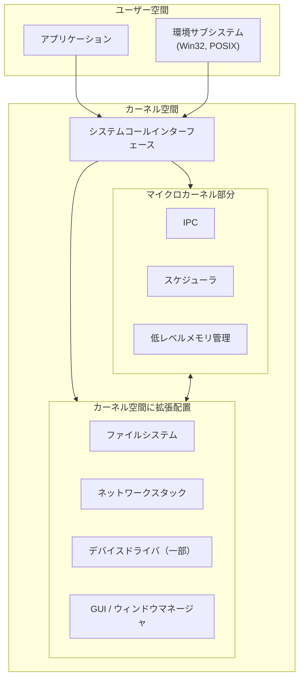

純粋なマイクロカーネルとの違いは、「本来ユーザー空間に置くべきコンポーネントを、性能上の理由でカーネル空間に引き入れている」点にある。これにより IPC のオーバーヘッドを回避するが、カーネル空間のバグがシステム全体に影響するリスクはモノリシックカーネルと同様に存在する。

### 4.2 Windows NT カーネル

**Windows NT**（New Technology）カーネルは、David Cutler が DEC での VMS 開発経験を基に設計したハイブリッドカーネルである。1993 年の Windows NT 3.1 から現在の Windows 11 に至るまで、その基本アーキテクチャは一貫している。

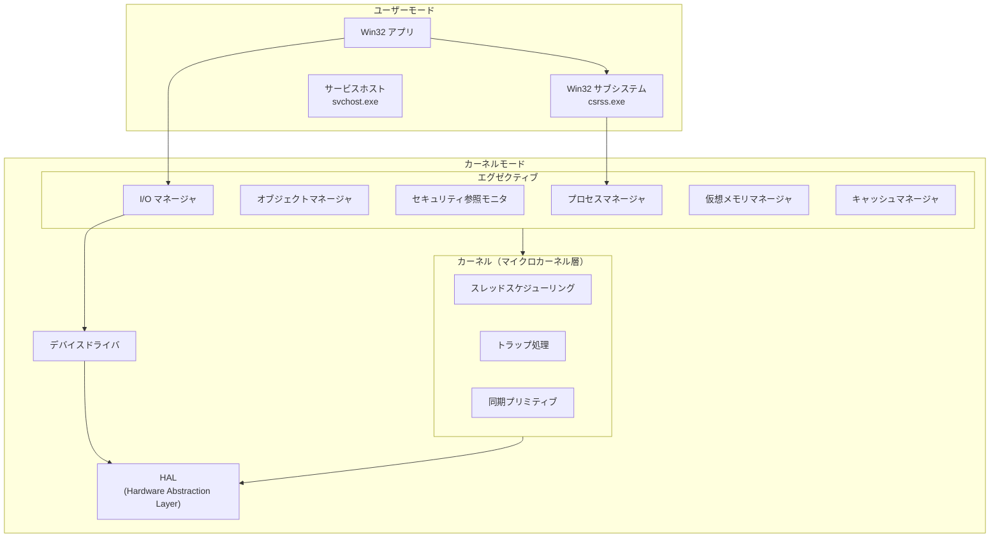

NT カーネルの特徴的な設計は以下の通りである。

- **オブジェクトモデル** — ファイル、プロセス、スレッド、レジストリキーなど全てのリソースをオブジェクトとして統一的に管理
- **HAL（Hardware Abstraction Layer）** — ハードウェアの差異を吸収する薄いレイヤー。異なるハードウェアプラットフォームへの移植を容易にする
- **環境サブシステム** — Win32、POSIX（後に WSL として刷新）など、異なる API セットをサポートするサブシステム機構
- **I/O マネージャ** — 全ての I/O 操作を IRP（I/O Request Packet）として統一的に処理するフレームワーク

Windows NT は当初、ファイルシステムやグラフィックスサブシステムをユーザー空間のサーバーとして実行するより純粋なマイクロカーネル的設計を目指していた。しかし、Windows NT 4.0（1996年）の時点で、性能上の理由から GDI（グラフィックスデバイスインターフェース）やウィンドウマネージャがカーネル空間に移された。この変更は性能を大幅に向上させたが、カーネルのクラッシュリスクも増大させた。いわゆる「ブルースクリーン」（BSOD）の多くは、カーネル空間で動作するデバイスドライバのバグに起因する。

### 4.3 macOS XNU カーネル

**XNU**（X is Not Unix）は Apple の macOS、iOS、iPadOS、watchOS、tvOS の基盤となるカーネルであり、ハイブリッドカーネルの代表例である。XNU は3つの主要コンポーネントで構成される。

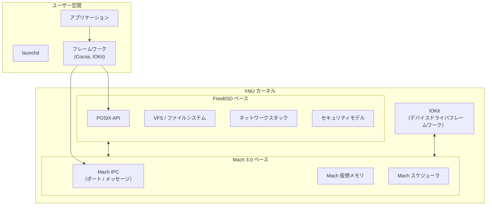

1. **Mach 3.0 由来のマイクロカーネル層** — IPC（Mach ポートとメッセージ）、仮想メモリ管理、スレッドスケジューリングの基盤
2. **FreeBSD 由来の BSD 層** — POSIX 準拠の API、ファイルシステム（VFS）、ネットワークスタック（TCP/IP）、ユーザー・グループベースのセキュリティモデル
3. **IOKit** — C++ で書かれたオブジェクト指向のデバイスドライバフレームワーク

XNU はマイクロカーネルである Mach をベースとしながらも、BSD 層のコードがカーネル空間で Mach の上に直接統合されている。つまり、BSD のファイルシステムやネットワークスタックはユーザー空間のサーバーではなく、カーネル空間で動作する。この設計により、Mach の IPC オーバーヘッドを回避しつつ、Mach のメッセージパッシング機構を活用できるようになっている。

macOS の興味深い点は、ユーザー空間のプロセス間通信に **Mach ポート**が広く活用されていることである。launchd によるサービス管理、XPC（Cross-Process Communication）フレームワーク、さらには App Sandbox の実装まで、Mach IPC は macOS のアーキテクチャ全体に深く組み込まれている。

## 5. エクソカーネルとユニカーネル — 非伝統的アプローチ

### 5.1 エクソカーネル

**エクソカーネル**（exokernel）は、MIT の Dawson Engler らが 1995 年に提唱したアーキテクチャである。従来のカーネルが提供する**抽象化を可能な限り排除**し、ハードウェアリソースへの直接アクセスをアプリケーションに許可するという急進的な設計思想を持つ。

従来のカーネルは、プロセスに対してファイル、仮想メモリ、ソケットといった抽象化を提供する。しかし、これらの抽象化はアプリケーション固有の最適化を妨げることがある。例えば、データベースエンジンは OS のファイルシステムが提供するバッファキャッシュよりも、自身の専用バッファプールを使った方が効率的にデータを管理できる場合がある。

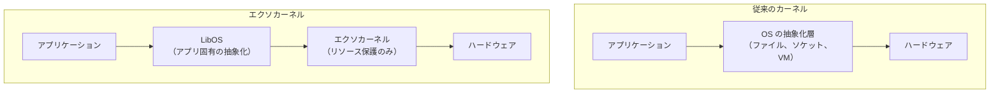

エクソカーネルの責務は**リソースの保護と多重化**のみであり、それ以外の抽象化は **LibOS**（ライブラリ OS）としてアプリケーションにリンクされるライブラリが提供する。異なるアプリケーションは異なる LibOS を使用でき、それぞれに最適化されたリソース管理を実現できる。

エクソカーネルは研究段階にとどまっており、汎用 OS として広く採用されるには至っていないが、その設計思想は後述するユニカーネルに強い影響を与えている。

### 5.2 ユニカーネル

**ユニカーネル**（unikernel）は、アプリケーションと必要最小限の OS 機能を単一のアドレス空間にリンクし、**ハイパーバイザ上で直接動作する特化型の VM イメージ**として構築するアプローチである。

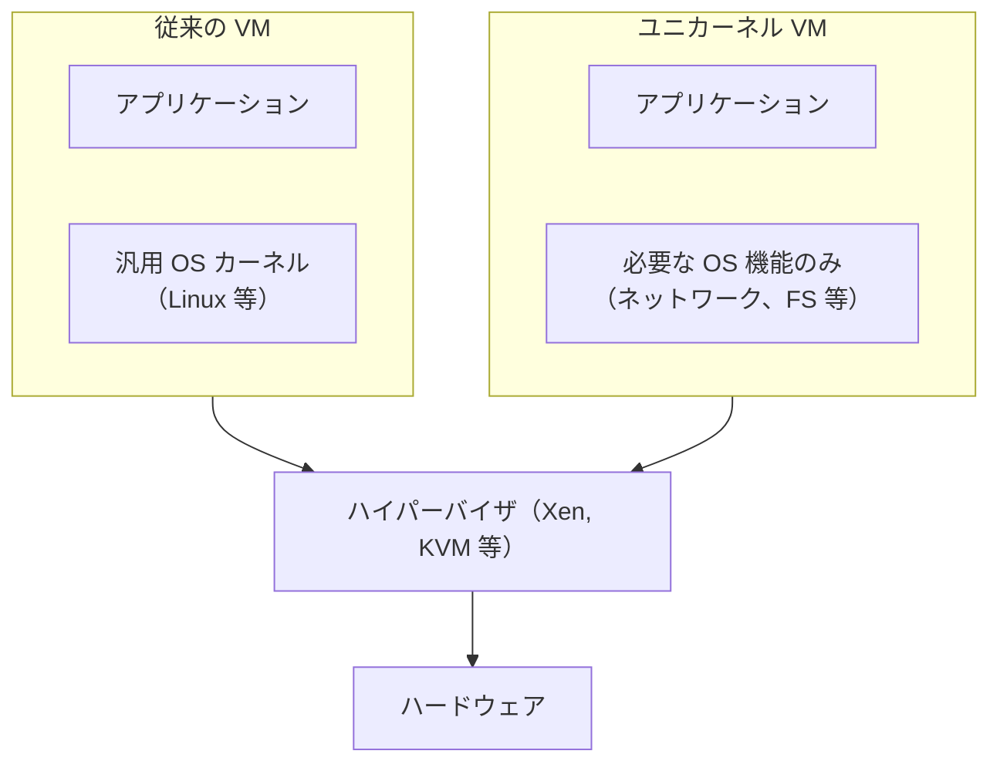

ユニカーネルの特徴は以下の通りである。

- **極小のイメージサイズ** — 汎用 OS を含まないため、イメージサイズが数 MB 程度に収まる
- **高速な起動** — ミリ秒単位での起動が可能
- **小さな攻撃対象領域** — 不要なシステムコール、シェル、ユーティリティが存在しないため、セキュリティリスクが低い
- **単一アドレス空間** — ユーザー/カーネルの区別がないため、モード遷移のオーバーヘッドがゼロ

代表的なユニカーネルプロジェクトには以下がある。

| プロジェクト | 言語 | 特徴 |
|-------------|------|------|
| **MirageOS** | OCaml | Xen 上で動作、型安全性を活用 |
| **IncludeOS** | C++ | KVM/VirtualBox 対応 |
| **Unikraft** | C | Linux 互換 API、高いカスタマイズ性 |
| **Nanos** | C | Linux バイナリをそのまま実行可能 |

ユニカーネルは「単一目的のサーバー」というクラウドネイティブな用途に適しており、マイクロサービスアーキテクチャとの親和性が高い。一方で、デバッグの難しさ、開発ツールチェーンの未成熟さ、汎用性の欠如といった課題がある。

## 6. 各アーキテクチャの比較

### 6.1 総合比較表

| 特性 | モノリシック | マイクロカーネル | ハイブリッド | エクソカーネル | ユニカーネル |
|------|-------------|----------------|-------------|--------------|-------------|
| **カーネルサイズ** | 大 | 極小 | 中〜大 | 極小 | 用途依存 |
| **性能** | 高 | 中（IPC コスト） | 高 | 非常に高 | 非常に高 |
| **信頼性** | 低〜中 | 高 | 中 | 中 | 用途限定 |
| **セキュリティ** | 中 | 高 | 中 | 高 | 高 |
| **形式検証** | 困難 | 可能（seL4） | 困難 | 理論的に可能 | 用途限定 |
| **開発難易度** | 中 | 高 | 高 | 非常に高 | 高 |
| **代表例** | Linux, BSD | seL4, MINIX 3 | Windows NT, XNU | Aegis (MIT) | MirageOS |
| **主な用途** | 汎用 | 組込み、高信頼 | デスクトップ | 研究 | クラウド |

### 6.2 IPC コストの影響

マイクロカーネルの性能に関する議論の中心は IPC のコストである。以下の図は、ファイル読み出し操作における各アーキテクチャの制御フローの違いを示す。

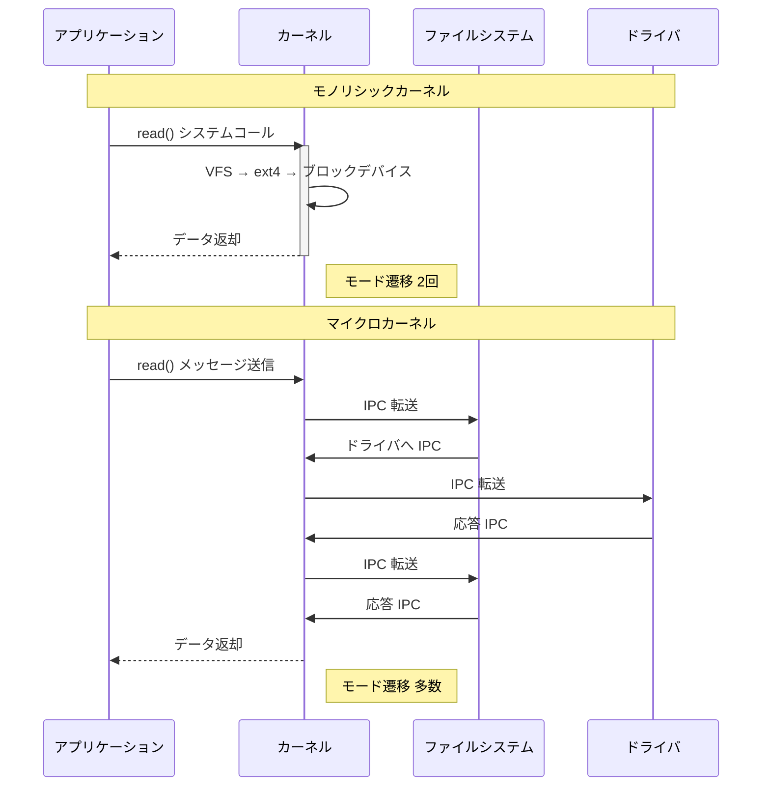

モノリシックカーネルでは `read()` システムコールでユーザー→カーネル→ユーザーの2回のモード遷移のみで完了するのに対し、マイクロカーネルでは各 IPC ごとにモード遷移が発生する。ただし、L4 系マイクロカーネルでは直接プロセス切り替え（送信側のタイムスライスで受信側が実行される）により、実効的なオーバーヘッドは大幅に削減されている。

### 6.3 コードベースサイズの比較

カーネルのコードベースサイズは信頼性と保守性に直結する。一般に、コード行数が増えるほどバグの密度も増加する。

```
コード行数の目安（おおよその規模）:

seL4 マイクロカーネル:         ~10,000 行
MINIX 3 カーネル:              ~12,000 行
L4 (初期):                     ~10,000 行
────────────────────────────────────
Windows NT カーネル（推定）:   数百万行
XNU カーネル:                  数百万行
────────────────────────────────────
Linux カーネル (6.x):       ~35,000,000 行
```

Linux カーネルの規模がマイクロカーネルの数千倍に達している点は注目に値する。ただし、Linux のコード行数の大部分はデバイスドライバであり、コアカーネル（`kernel/`, `mm/`, `fs/` の基盤部分）は比較的コンパクトである。

## 7. Linux カーネルの構造

### 7.1 全体アーキテクチャ

Linux はモノリシックカーネルでありながら、内部的には明確なサブシステムに分割されている。以下は Linux カーネルの主要サブシステムとその関係を示す。

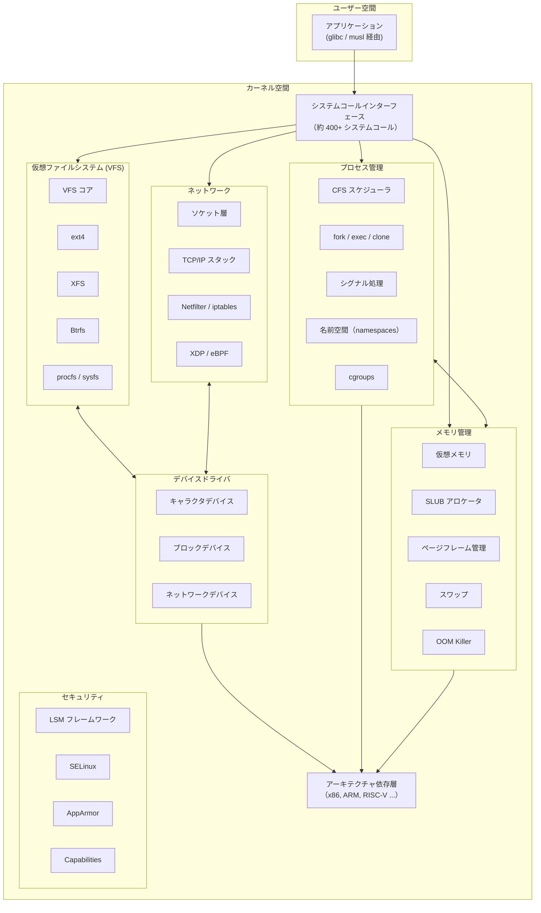

### 7.2 主要サブシステムの概要

**プロセス管理**: Linux のプロセススケジューラは歴史的に何度か大きな変革を経ている。現在のデフォルトスケジューラは **EEVDF**（Earliest Eligible Virtual Deadline First、Linux 6.6 以降）であり、それ以前は **CFS**（Completely Fair Scheduler）が使用されていた。CFS は赤黒木を用いて各プロセスの仮想実行時間を管理し、最も実行時間の少ないプロセスを次に実行するという公平性を実現していた。EEVDF はこれをさらに改良し、仮想デッドラインに基づくスケジューリングでレイテンシの公平性を向上させている。

**メモリ管理**: Linux のメモリ管理サブシステムは、ページフレームアロケータ（Buddy System）、SLUB アロケータ（カーネル内の小さなオブジェクト用）、仮想メモリマネージャ（ページテーブル管理、デマンドページング）、OOM Killer（メモリ不足時のプロセス強制終了）などから構成される。

**VFS（Virtual File System）**: VFS は Linux のファイルシステム抽象化層であり、ext4、XFS、Btrfs などの異なるファイルシステム実装に対して統一的なインターフェースを提供する。VFS は inode、dentry、superblock、file といったオブジェクトを定義し、各ファイルシステムはこれらのオブジェクトに対する操作を実装する。

**ネットワークスタック**: Linux のネットワークスタックは BSD ソケット API を提供し、TCP/IP プロトコルスタックの完全な実装を含む。Netfilter フレームワークによるパケットフィルタリング、近年では **eBPF**（extended Berkeley Packet Filter）によるプログラマブルなパケット処理が可能となっている。

### 7.3 Linux カーネルのソースツリー構成

Linux カーネルのソースコードは、機能ごとにディレクトリが分かれている。

```
linux/
├── arch/          # アーキテクチャ依存コード（x86, arm, riscv...）
├── block/         # ブロック I/O サブシステム
├── crypto/        # 暗号化 API
├── drivers/       # デバイスドライバ（コード量の大部分を占める）
│   ├── gpu/       # GPU ドライバ
│   ├── net/       # ネットワークドライバ
│   ├── usb/       # USB ドライバ
│   └── ...        # 数百のサブディレクトリ
├── fs/            # ファイルシステム
│   ├── ext4/
│   ├── xfs/
│   ├── btrfs/
│   └── ...
├── include/       # ヘッダファイル
├── init/          # カーネル初期化コード
├── ipc/           # プロセス間通信
├── kernel/        # コアカーネル（スケジューラ、シグナル等）
├── lib/           # カーネル内ユーティリティライブラリ
├── mm/            # メモリ管理
├── net/           # ネットワークプロトコル
│   ├── ipv4/
│   ├── ipv6/
│   └── ...
├── security/      # セキュリティフレームワーク（LSM, SELinux）
├── sound/         # サウンドサブシステム（ALSA）
└── tools/         # カーネル関連ツール（perf 等）
```

`drivers/` ディレクトリが全体のコード量の約 60〜70% を占めるという事実は、モノリシックカーネルの信頼性に関する議論において重要な意味を持つ。

## 8. カーネルモジュール

### 8.1 ローダブルカーネルモジュール（LKM）

Linux のモノリシックカーネルの「一枚岩」という性質を緩和する重要な仕組みが、**ローダブルカーネルモジュール**（Loadable Kernel Module, LKM）である。LKM を使うことで、カーネルのコードを再コンパイルやシステム再起動なしに動的に追加・削除できる。

```
LKM のロード/アンロード:

                      insmod / modprobe
                          ↓
  ┌────────────────────────────────────────┐
  │           Linux カーネル               │
  │                                        │
  │  ┌──────┐  ┌──────┐  ┌──────┐         │
  │  │ext4  │  │e1000 │  │ USB  │  ← LKM  │
  │  │モジュ │  │ドライ│  │モジュ│         │
  │  │ール  │  │バ    │  │ール  │         │
  │  └──────┘  └──────┘  └──────┘         │
  │                                        │
  │  コアカーネル（常駐）                  │
  │  - プロセス管理                        │
  │  - メモリ管理                          │
  │  - VFS コア                            │
  └────────────────────────────────────────┘
                          ↑
                      rmmod
```

LKM の主な用途は以下の通りである。

- **デバイスドライバ** — 最も一般的な用途。ハードウェアの追加/取り外しに応じてドライバをロード/アンロードする
- **ファイルシステム** — ext4、XFS、Btrfs などのファイルシステム実装
- **ネットワークプロトコル** — 新しいプロトコルやフィルタリングモジュール
- **セキュリティモジュール** — LSM（Linux Security Module）フレームワークを通じたセキュリティポリシーの実装

### 8.2 LKM の基本構造

簡単なカーネルモジュールの基本構造を示す。

```c
#include <linux/module.h>
#include <linux/kernel.h>
#include <linux/init.h>

MODULE_LICENSE("GPL");
MODULE_AUTHOR("Example Author");
MODULE_DESCRIPTION("A minimal kernel module");

/* Called when the module is loaded */
static int __init hello_init(void)
{
    printk(KERN_INFO "Hello, kernel module loaded\n");
    return 0;
}

/* Called when the module is unloaded */
static void __exit hello_exit(void)
{
    printk(KERN_INFO "Goodbye, kernel module unloaded\n");
}

module_init(hello_init);
module_exit(hello_exit);
```

モジュールのビルドとロードは以下のコマンドで行う。

```bash
# Build the module
make -C /lib/modules/$(uname -r)/build M=$(pwd) modules

# Load the module
sudo insmod hello.ko

# Verify the module is loaded
lsmod | grep hello

# View kernel log
dmesg | tail

# Unload the module
sudo rmmod hello
```

### 8.3 LKM とマイクロカーネルの比較

LKM はモノリシックカーネルに柔軟性を与えるが、マイクロカーネルのユーザー空間サーバーとは本質的に異なる。

| 特性 | LKM | マイクロカーネルのサーバー |
|------|-----|--------------------------|
| **実行空間** | カーネル空間（Ring 0） | ユーザー空間（Ring 3） |
| **障害隔離** | なし（カーネル全体に影響） | あり（サーバー単位で隔離） |
| **通信方式** | 関数呼び出し | IPC（メッセージパッシング） |
| **動的ロード** | 可能 | 可能 |
| **性能** | 高い | IPC オーバーヘッドあり |
| **セキュリティ** | カーネル権限で動作 | 最小権限で動作可能 |

LKM は柔軟性を提供するが、**ロードされたモジュールはカーネルの一部として Ring 0 で動作**するため、モジュールのバグはカーネルパニックを引き起こす可能性がある。この点で、マイクロカーネルのサーバーとは根本的に異なる。

### 8.4 eBPF — カーネル内プログラマブル仮想マシン

近年、Linux カーネルにおいて注目すべき進化として **eBPF**（extended Berkeley Packet Filter）がある。eBPF は、カーネル内部にサンドボックス化された仮想マシンを組み込み、ユーザーが定義したプログラムを安全にカーネル空間で実行する仕組みである。

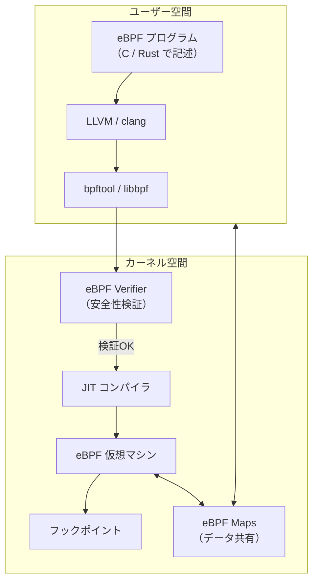

eBPF プログラムはロード時に **Verifier** によって安全性が検証される。無限ループの禁止、メモリ境界チェック、スタックサイズ制限など、厳格なルールに適合するプログラムのみが実行を許可される。これにより、カーネルモジュールのように任意のコードをカーネル空間で実行するリスクなしに、カーネルの動作をカスタマイズできる。

eBPF の応用範囲は広い。

- **ネットワーク** — XDP（eXpress Data Path）による高速パケット処理、TC（Traffic Control）によるトラフィック制御
- **オブザーバビリティ** — kprobe / uprobe によるカーネル/ユーザー空間の動的トレーシング
- **セキュリティ** — seccomp-BPF によるシステムコールフィルタリング、LSM BPF によるセキュリティポリシー
- **スケジューリング** — sched_ext（Linux 6.12 以降）による BPF ベースのカスタムスケジューラ

eBPF はモノリシックカーネルとマイクロカーネルの間を橋渡しする技術とも言える。カーネル空間でのプログラム実行を許可しつつ、Verifier による安全性保証を提供するという点で、カーネルの拡張性と安全性を両立させる新しいアプローチである。

## 9. 現代のカーネル設計の動向

### 9.1 Rust for Linux — メモリ安全なカーネル開発

Linux カーネルの開発における最大の課題の一つは、C 言語によるメモリ安全性の問題である。バッファオーバーフロー、use-after-free、データ競合などのメモリ安全性に関するバグは、カーネルの脆弱性の主要な原因となっている。Microsoft の調査によれば、同社製品のセキュリティ脆弱性の約 70% がメモリ安全性に関する問題である。

この課題に対するアプローチとして、**Rust 言語による Linux カーネル開発**が進められている。Rust は所有権システムとライフタイムチェックにより、コンパイル時にメモリ安全性を保証する言語である。

Linux 6.1（2022年12月）で Rust がカーネルの公式サポート言語として追加され、以降、Rust で記述されたドライバやサブシステムの開発が進んでいる。

```c
/* C: potential use-after-free (not caught at compile time) */
struct device *dev = get_device();
release_device(dev);
dev->ops->read(dev, buf, len);  /* BUG: use after free */
```

```rust
// Rust: ownership system prevents use-after-free at compile time
let dev = get_device();
release_device(dev);  // dev is moved here
// dev.ops.read(buf);  // Compile error: value used after move
```

Rust for Linux は、既存の C コードとの共存を前提としており、新規コンポーネントから段階的に Rust 化を進める戦略をとっている。

### 9.2 形式検証の進展 — seL4 とその後

seL4 の形式検証の成功は、カーネル設計における重要なマイルストーンであった。seL4 で証明された性質は以下の通りである。

1. **機能的正確性** — C 実装が抽象仕様を正しく実装していること
2. **整合性の証明** — バイナリが C ソースコードと一致すること（コンパイラの正しさも含む）
3. **最悪実行時間の保証** — リアルタイムシステムでの利用に必要な時間的保証
4. **情報フロー制御** — 異なるセキュリティドメイン間での情報漏洩がないこと

seL4 の形式検証は約 200,000 行の Isabelle/HOL 証明で構成されており、約 10 人年の作業を要した。カーネルの C コード（約 10,000 行）に対して、証明コードはその約 20 倍の規模である。

形式検証の技術は seL4 以降も発展を続けており、**CertiKOS**（イェール大学）は並行性を含むカーネルの検証を実現し、**Komodo**（Microsoft Research）は ARM TrustZone のモニタコードの検証を行っている。

### 9.3 仮想化とカーネルの境界の変容

ハイパーバイザの普及により、カーネルの役割と境界は変容しつつある。

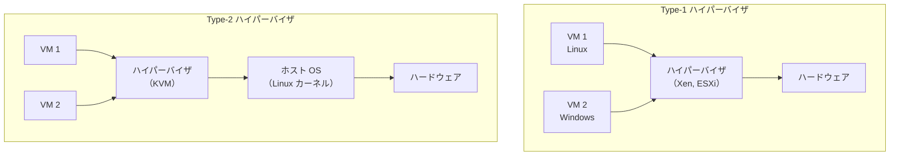

**KVM**（Kernel-based Virtual Machine）は Linux カーネルそのものをハイパーバイザに変換するモジュールであり、Linux カーネルが「ゲスト OS を管理するホスト OS」と「ハイパーバイザ」の二重の役割を担う。この設計は、カーネルアーキテクチャの分類を曖昧にするものでもある。

さらに、**AWS Firecracker** のような microVM 技術は、軽量な仮想化とコンテナの利点を組み合わせ、ミリ秒レベルの VM 起動を実現している。Firecracker は最小限のデバイスモデルのみを実装した VMM（Virtual Machine Monitor）であり、ユニカーネルの思想とも共通する「必要最小限」のアプローチをハイパーバイザレベルで実現している。

### 9.4 コンテナ技術とカーネルの名前空間

Docker に代表されるコンテナ技術は、カーネルの**名前空間**（namespace）と **cgroups** という機能に基づいている。これらはカーネルレベルのリソース隔離機構であり、仮想化技術のようにカーネルを複数実行するのではなく、単一のカーネル上でプロセスの見える範囲を制限する。

Linux カーネルが提供する名前空間は以下の通りである。

| 名前空間 | 隔離対象 | 導入バージョン |
|----------|---------|---------------|
| Mount (mnt) | ファイルシステムのマウントポイント | Linux 2.4.19 |
| UTS | ホスト名、ドメイン名 | Linux 2.6.19 |
| IPC | System V IPC、POSIX メッセージキュー | Linux 2.6.19 |
| PID | プロセス ID | Linux 2.6.24 |
| Network (net) | ネットワークスタック | Linux 2.6.29 |
| User | ユーザー ID、グループ ID | Linux 3.8 |
| Cgroup | cgroup ルートディレクトリ | Linux 4.6 |
| Time | システムクロック | Linux 5.6 |

コンテナ技術の普及は、カーネルに対する要求を変化させている。単一のカーネルが数千のコンテナを同時に管理する場合、スケジューラの公平性、メモリ管理の効率性、ネットワークスタックのスケーラビリティといった要件がより厳しくなる。

### 9.5 リアルタイム Linux（PREEMPT_RT）

Linux カーネルの重要な進展の一つが、**PREEMPT_RT パッチセット**のメインラインへの統合である。PREEMPT_RT は Linux カーネルにハードリアルタイム性を付与するパッチセットであり、20 年近い開発期間を経て、主要部分が Linux 6.x 系列でメインラインに統合されつつある。

PREEMPT_RT の主な変更点は以下の通りである。

- **強制プリエンプション** — カーネル内のほぼ全てのコードパスをプリエンプト可能にする
- **スピンロックの mutex 化** — カーネル内のスピンロックを RT-mutex（優先度継承付き mutex）に置き換え
- **割り込みのスレッド化** — ハードウェア割り込みハンドラをカーネルスレッドとして実行し、スケジューリング対象にする
- **高精度タイマー** — マイクロ秒単位の精度を持つタイマー

これらの変更により、Linux カーネルはロボット制御、音声処理、産業オートメーションなどのリアルタイム用途でも利用可能になった。従来これらの領域では VxWorks や QNX（マイクロカーネル）のような専用 RTOS が使われてきたが、PREEMPT_RT により Linux でもリアルタイム要件を満たせるケースが増えている。

### 9.6 今後の展望

カーネルアーキテクチャの未来を展望すると、いくつかの重要なトレンドが見える。

**メモリ安全性の追求**: Rust for Linux に代表されるように、メモリ安全な言語によるカーネル開発は今後も拡大するだろう。Google の Android チームは、新規カーネルドライバの Rust 化を積極的に推進している。

**eBPF によるカーネルのプログラマビリティ**: eBPF はネットワーキング、オブザーバビリティ、セキュリティの領域でカーネルの拡張方法を根本的に変えつつある。sched_ext のようなスケジューラの BPF 化は、ユーザー空間からカーネルの振る舞いをカスタマイズするという、マイクロカーネル的な柔軟性をモノリシックカーネル上で実現するものである。

**形式検証の普及**: seL4 に始まった形式検証の取り組みは、より大規模なカーネルへの適用が模索されている。AI を活用した自動証明の進展により、形式検証のコストが下がれば、より広範なカーネルコンポーネントの検証が現実的になる可能性がある。

**ハードウェアとの協調設計**: CXL（Compute Express Link）のような新しいインターコネクト技術、RISC-V のようなオープンな ISA の普及は、カーネルの設計にも影響を与える。特に RISC-V は、カーネルのアーキテクチャ依存層の設計を簡素化し、教育目的での利用も容易にする。

**セキュリティの多層防御**: Spectre / Meltdown に代表される CPU の脆弱性は、カーネルとハードウェアの境界におけるセキュリティの重要性を改めて示した。KPTI（Kernel Page Table Isolation）のような緩和策は性能コストを伴うが、カーネル設計においてセキュリティがパフォーマンスと同等以上に重視される傾向は今後も続くだろう。

## まとめ

カーネルアーキテクチャの設計は、**性能と信頼性のトレードオフ**という根本的な問いを軸に展開されてきた。モノリシックカーネルは性能と実用性で優れ、Linux に代表される成功を収めた。マイクロカーネルは理論的な優位性と高い信頼性を持ち、seL4 のような形式検証済みカーネルの形で結実した。ハイブリッドカーネルは両者の折衷として Windows NT や macOS XNU で広く使われている。

現代のカーネル設計では、これらの伝統的な分類を超えた進化が進んでいる。Rust による メモリ安全性の保証、eBPF によるカーネル内プログラマビリティ、形式検証による数学的な正しさの保証、そして仮想化・コンテナ技術によるカーネルの役割の変容。これらの技術は、モノリシックとマイクロカーネルの間の境界線を曖昧にし、それぞれの長所を取り込む新しいカーネル設計の方向性を示している。

半世紀以上にわたる Tanenbaum-Torvalds 論争の答えは、どちらか一方が正しいというものではなく、用途と制約に応じた最適解が存在するということだろう。そして、その最適解の選択肢は、技術の進歩とともに今も広がり続けている。
