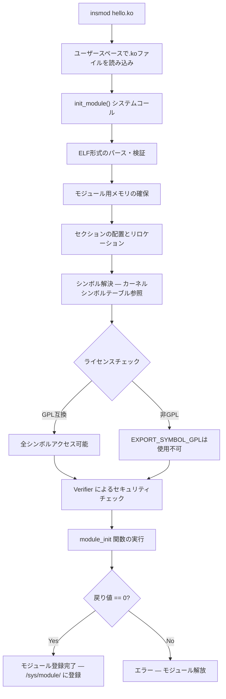
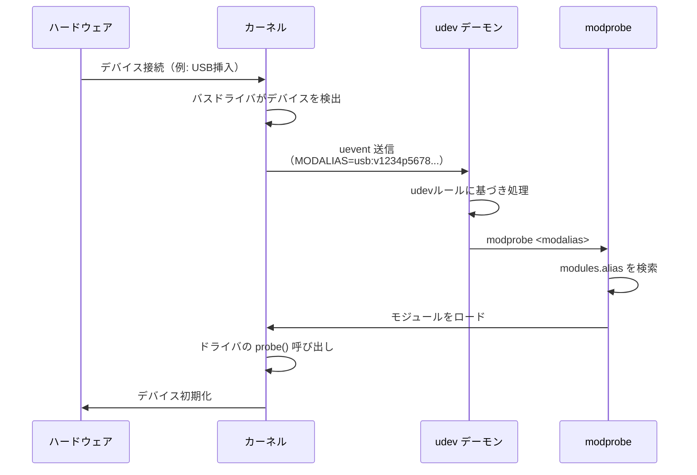
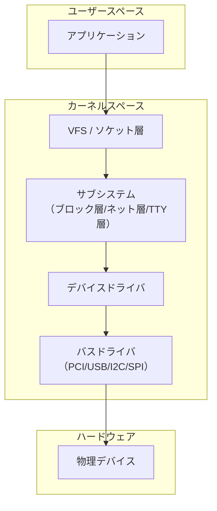
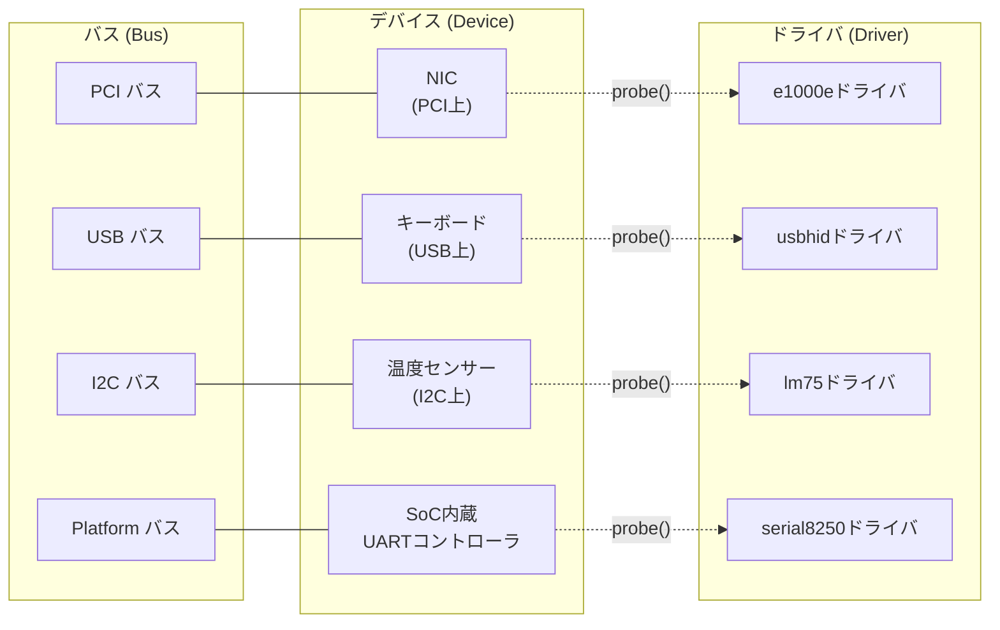
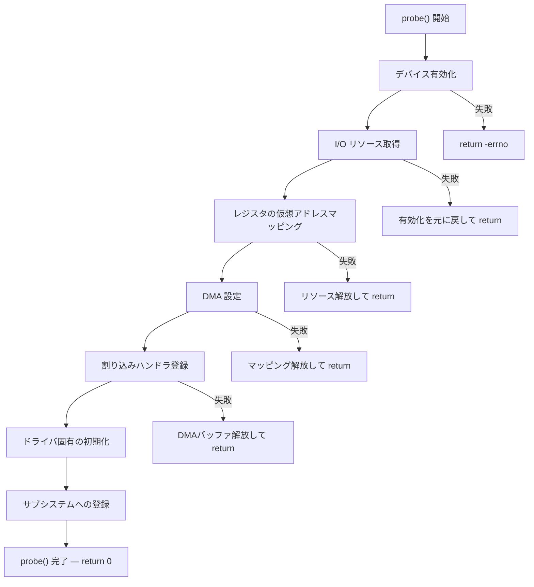
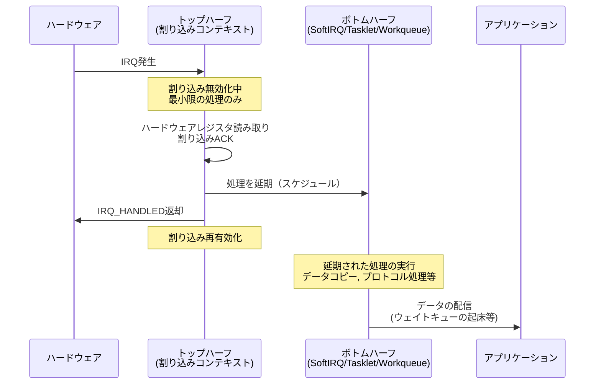
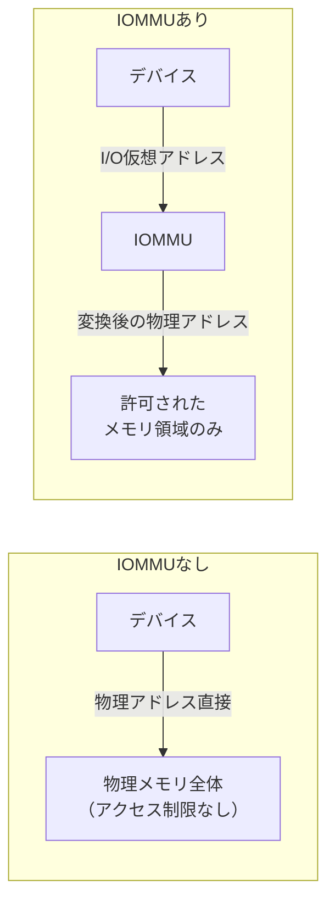
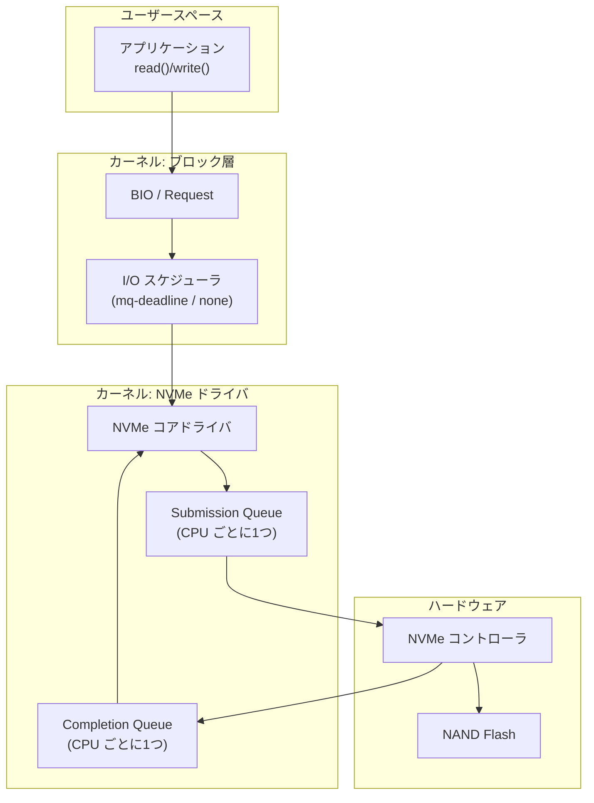
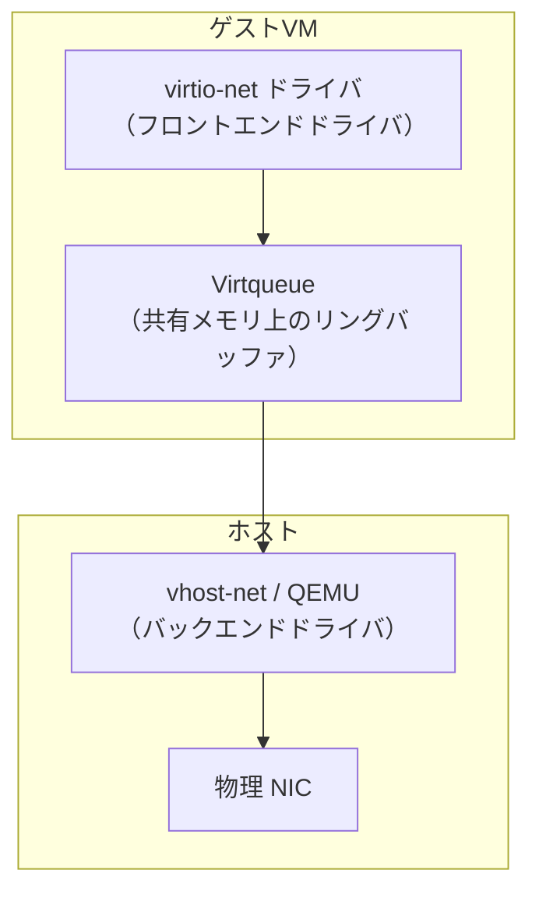

# カーネルモジュールとデバイスドライバ

## 1. 背景と動機

### 1.1 なぜカーネルを拡張する必要があるのか

オペレーティングシステム（OS）のカーネルは、ハードウェアとユーザースペースのアプリケーションとの間に立ち、ハードウェア資源へのアクセスを抽象化・管理する中核ソフトウェアである。しかし、現実のコンピュータシステムでは、使用されるハードウェアは多種多様であり、すべてのハードウェアに対するサポートをカーネル本体に静的に組み込むことは、いくつかの理由で現実的でない。

- **ハードウェアの多様性**: PCIeネットワークカード、USBデバイス、GPU、ストレージコントローラ、センサー類など、数千種類のデバイスが存在する。すべてのドライバをカーネルに静的にリンクすると、カーネルバイナリは巨大化し、大部分が実際には使用されないコードとなる
- **リリースサイクルの不一致**: 新しいハードウェアはカーネルのリリースサイクルとは無関係に市場に投入される。ドライバの追加のためにカーネル全体を再ビルド・再デプロイすることは、本番環境では容認しがたいダウンタイムを生む
- **カスタマイズの需要**: ファイルシステム、ネットワークプロトコル、セキュリティモジュールなど、カーネル機能そのものを用途に応じて差し替えたいという要求がある
- **デバッグと開発の効率性**: カーネル全体を再コンパイルして再起動するよりも、変更した部分だけをロード・アンロードできるほうが開発サイクルは桁違いに速い

これらの問題を解決する仕組みが**カーネルモジュール（Loadable Kernel Module: LKM）**である。カーネルモジュールにより、システム稼働中にカーネルの機能を動的に追加・削除できるようになる。

### 1.2 歴史的経緯

カーネル拡張の歴史は、OSの設計思想と密接に関わっている。

初期のUNIXカーネルは**モノリシックカーネル**として設計されており、すべての機能（プロセス管理、メモリ管理、ファイルシステム、デバイスドライバ）が単一のアドレス空間で動作していた。新しいデバイスをサポートするには、カーネルソースコードを修正し、再コンパイルして再起動する必要があった。

1980年代、マイクロカーネルの研究（Mach、MINIX）では、カーネルの機能を最小限に抑え、デバイスドライバやファイルシステムをユーザースペースのプロセスとして実行する設計が提案された。これにより拡張性と安全性は向上するが、IPC（プロセス間通信）のオーバーヘッドが性能上の大きな問題となった。

Linuxは1995年のカーネル1.2からLoadable Kernel Module（LKM）の仕組みを本格的に導入した。これはモノリシックカーネルの性能を維持しつつ、モジュールの動的ロード・アンロードにより拡張性を確保するという、実用的な妥協点であった。Linus Torvaldsはこのアプローチを「モジュール対応のモノリシックカーネル」と表現している。

```
┌────────────────────────────────────────────────────────────┐
│                    カーネル設計の系譜                         │
├────────────────────────────────────────────────────────────┤
│                                                            │
│  [静的モノリシック]     [マイクロカーネル]    [モジュラー     │
│                                             モノリシック]   │
│  初期UNIX (1970s)      Mach (1985)          Linux (1995-)  │
│  ↓                     ↓                    ↓              │
│  全機能を単一バイナリ   最小カーネル+         モノリシック    │
│  に静的リンク           ユーザースペース       +動的モジュール │
│                        サービス                             │
│                                                            │
│  利点: 高速             利点: 安全・隔離     利点: 高速      │
│  欠点: 拡張困難         欠点: IPC遅延        +動的拡張可能   │
│                                                            │
│  ─ ─ ─ ─ ─ ─ ─ ─ ─ ─ ─ ─ ─ ─ ─ ─ ─ ─ ─ ─ ─ ─ ─ ─ ─   │
│  現代のLinuxは「モノリシック+LKM」で実用性と性能を両立       │
└────────────────────────────────────────────────────────────┘
```

### 1.3 「すべてはファイル」というUNIXの思想

UNIXの設計原則の一つに「**すべてはファイル（everything is a file）**」という考え方がある。デバイスへのアクセスもファイル操作（`open()`, `read()`, `write()`, `close()`, `ioctl()`）として統一されており、デバイスドライバはこのインタフェースの実装を担当する。

```
ユーザースペース        カーネルスペース
┌──────────────┐       ┌───────────────────────────────────┐
│ アプリケーション │ ──→ │ VFS (Virtual File System)          │
│ open("/dev/sda")│     │   ↓                               │
│ read(fd, ...)  │     │ デバイスファイル → デバイスドライバ   │
│ write(fd, ...) │     │                   ↓                │
│ ioctl(fd, ...) │     │               ハードウェア制御       │
└──────────────┘       └───────────────────────────────────┘
```

`/dev/sda`（ブロックデバイス）に対して `read()` を呼ぶと、VFS層を経由してSCSI/SATAドライバに到達し、最終的にディスクコントローラにコマンドが発行される。アプリケーションはハードウェアの詳細を知る必要がなく、統一されたファイルインタフェースだけを使えばよい。このUNIXの抽象化がデバイスドライバの設計を大きく方向づけている。

## 2. Linuxカーネルモジュールの基本構造

### 2.1 モジュールの最小構成

Linuxカーネルモジュールは、ELF（Executable and Linkable Format）形式のオブジェクトファイル（`.ko` ファイル）であり、カーネルの実行中に動的にリンク・ロードされる。最小限のカーネルモジュールは以下のような構造を持つ。

```c
#include <linux/init.h>
#include <linux/module.h>

MODULE_LICENSE("GPL");
MODULE_AUTHOR("Example Author");
MODULE_DESCRIPTION("A minimal kernel module");

// Called when the module is loaded
static int __init hello_init(void)
{
    pr_info("hello: module loaded\n");
    return 0;  // 0 means success, negative value means failure
}

// Called when the module is unloaded
static void __exit hello_exit(void)
{
    pr_info("hello: module unloaded\n");
}

module_init(hello_init);
module_exit(hello_exit);
```

この短いコードの中に、カーネルモジュールの本質的な要素がすべて含まれている。

- **`module_init()` マクロ**: モジュールがカーネルにロードされたときに呼ばれる初期化関数を指定する。この関数は、リソースの確保、デバイスの登録、データ構造の初期化などを行う。`__init` アノテーションは、初期化完了後にこの関数のメモリを解放してよいことをカーネルに伝える
- **`module_exit()` マクロ**: モジュールがアンロードされるときに呼ばれるクリーンアップ関数を指定する。`__exit` アノテーションは、モジュールが静的にカーネルに組み込まれている場合にこの関数を省略できることを示す
- **`MODULE_LICENSE()`**: カーネルはGPLライセンスを採用しており、モジュールのライセンスがGPL互換でない場合、一部のカーネルシンボル（`EXPORT_SYMBOL_GPL` でエクスポートされたもの）にアクセスできない。また、プロプライエタリモジュールがロードされるとカーネルは「tainted（汚染された）」状態としてマークされ、カーネル開発者からのバグ報告のサポートが受けられなくなる

### 2.2 ビルドシステム — Kbuild

カーネルモジュールのビルドには、Linuxカーネルのビルドシステムである**Kbuild**を使用する。ユーザースペースのプログラムのビルドとは異なり、カーネルのヘッダファイル、コンパイラフラグ、リンクオプションがカーネルのビルド環境と一致している必要がある。

```makefile
# Makefile for an out-of-tree kernel module
obj-m += hello.o

KDIR := /lib/modules/$(shell uname -r)/build

all:
	$(MAKE) -C $(KDIR) M=$(PWD) modules

clean:
	$(MAKE) -C $(KDIR) M=$(PWD) clean
```

`obj-m` はモジュールとしてビルドするオブジェクトファイルを指定する。`-C $(KDIR)` はカーネルビルドディレクトリに移動し、`M=$(PWD)` は外部モジュールのソースがあるディレクトリを示す。カーネルのビルドシステムが適切なコンパイラフラグ（`-D__KERNEL__`, `-DMODULE` など）を自動的に付与する。

### 2.3 モジュールのロードとアンロード

モジュールの操作は以下のコマンドで行う。

```bash
# Load the module
sudo insmod hello.ko

# Load the module with dependency resolution
sudo modprobe hello

# List loaded modules
lsmod

# Show module information
modinfo hello.ko

# Unload the module
sudo rmmod hello

# Unload with dependency resolution
sudo modprobe -r hello
```

`insmod` と `modprobe` の違いは重要である。`insmod` は指定された `.ko` ファイルをそのままロードし、依存関係は解決しない。一方、`modprobe` は `/lib/modules/<version>/modules.dep` ファイルを参照して依存するモジュールを自動的に先にロードする。本番環境では `modprobe` が一般的に使用される。

### 2.4 モジュールパラメータ

カーネルモジュールは、ロード時にパラメータを受け取ることができる。これにより、同じモジュールを異なる設定で使い分けることが可能になる。

```c
#include <linux/init.h>
#include <linux/module.h>
#include <linux/moduleparam.h>

MODULE_LICENSE("GPL");

static int buffer_size = 1024;
static char *device_name = "mydevice";

// Declare module parameters
module_param(buffer_size, int, 0644);
MODULE_PARM_DESC(buffer_size, "Size of the internal buffer (default: 1024)");

module_param(device_name, charp, 0644);
MODULE_PARM_DESC(device_name, "Name of the device (default: mydevice)");

static int __init mymod_init(void)
{
    pr_info("mymod: buffer_size=%d, device_name=%s\n",
            buffer_size, device_name);
    return 0;
}

static void __exit mymod_exit(void)
{
    pr_info("mymod: unloaded\n");
}

module_init(mymod_init);
module_exit(mymod_exit);
```

ロード時にパラメータを指定する。

```bash
sudo insmod mymod.ko buffer_size=4096 device_name="custom_dev"
```

`module_param()` の第3引数はパーミッションであり、`0644` を指定すると `/sys/module/<name>/parameters/` ディレクトリ下にファイルが作成され、実行時にパラメータの値を読み書きできる。`0` を指定するとsysfsに公開されない。

## 3. モジュールロードの内部メカニズム

### 3.1 init_module システムコール

ユーザースペースの `insmod` コマンドは、内部的に `init_module()` または `finit_module()` システムコールを呼び出す。カーネル側での処理の流れは以下のとおりである。



### 3.2 シンボルのエクスポートと解決

カーネルモジュールは独立したELFオブジェクトファイルであるが、ロード後はカーネルの一部として実行される。モジュール間やモジュールとカーネルコアの間でシンボル（関数やグローバル変数）を共有するために、**シンボルエクスポート**の仕組みが必要である。

```c
// In module A: export a function for other modules to use
void my_shared_function(int arg)
{
    // ...
}
EXPORT_SYMBOL(my_shared_function);      // Available to all modules
EXPORT_SYMBOL_GPL(my_gpl_function);     // Available only to GPL modules
```

カーネル内部のシンボルテーブルは `/proc/kallsyms` で確認でき、`T` は text（コード）セクションのシンボル、`D` は data セクションのシンボルを意味する。

```bash
# View kernel symbols (requires root or kernel.kptr_restrict=0)
sudo cat /proc/kallsyms | grep -i "printk"
```

### 3.3 モジュール間の依存関係

モジュールAがモジュールBのエクスポートしたシンボルを使用する場合、モジュールBが先にロードされている必要がある。この依存関係は `depmod` コマンドで解析され、`modules.dep` ファイルに記録される。

```bash
# Regenerate module dependency file
sudo depmod -a

# Check dependencies
modprobe --show-depends <module_name>
```

`modprobe` はこの依存情報を利用して、必要なモジュールを正しい順序で自動的にロードする。

### 3.4 モジュールの自動ロード — udev と modalias

現代のLinuxシステムでは、デバイスが接続されると**udev**デーモンが自動的に適切なカーネルモジュールをロードする。この仕組みは以下のように動作する。



**modalias** は、デバイスの識別情報（ベンダーID、デバイスID、クラスなど）をエンコードした文字列である。各カーネルモジュールは、対応するデバイスの modalias パターンを `MODULE_DEVICE_TABLE()` マクロで宣言しておく。`depmod` がこの情報を `modules.alias` ファイルに集約し、`modprobe` がデバイスの modalias と照合してロードすべきモジュールを特定する。

```c
// In a USB driver: declare which devices this driver supports
static const struct usb_device_id my_usb_ids[] = {
    { USB_DEVICE(0x1234, 0x5678) },  // vendor_id, product_id
    { USB_DEVICE(0x1234, 0x9abc) },
    { }  // terminating entry
};
MODULE_DEVICE_TABLE(usb, my_usb_ids);
```

## 4. デバイスドライバの基本概念

### 4.1 デバイスの分類

Linuxにおけるデバイスは、伝統的に3つのカテゴリに分類される。

| カテゴリ | 説明 | アクセス方式 | 例 |
|---|---|---|---|
| **キャラクタデバイス** | バイトストリームとして順次アクセスされるデバイス | `/dev/ttyS0`, `/dev/random` | シリアルポート、端末、乱数生成器 |
| **ブロックデバイス** | 固定サイズブロック単位でランダムアクセスされるデバイス | `/dev/sda`, `/dev/nvme0n1` | HDD、SSD、USBメモリ |
| **ネットワークデバイス** | パケットの送受信を行うデバイス | `eth0`, `wlan0`（ファイルではない） | Ethernetアダプタ、WiFi |

キャラクタデバイスとブロックデバイスは `/dev/` 以下にデバイスファイル（スペシャルファイル）として現れ、ファイル操作を通じてアクセスされる。ネットワークデバイスは `/dev/` ファイルを持たず、ソケットAPIを通じて間接的にアクセスされる。

```
$ ls -la /dev/sda /dev/ttyS0 /dev/null
brw-rw---- 1 root disk 8, 0 ... /dev/sda      # b = block device (major=8, minor=0)
crw-rw---- 1 root tty  4, 64 ... /dev/ttyS0   # c = character device
crw-rw-rw- 1 root root 1, 3 ... /dev/null     # c = character device
```

**メジャー番号**はデバイスの種類（どのドライバが管理するか）を示し、**マイナー番号**は同一ドライバが管理する個々のデバイスを識別する。例えば、メジャー番号8はSCSIディスクドライバに対応し、マイナー番号でディスクとパーティションを区別する。

### 4.2 デバイスドライバの役割

デバイスドライバは、ハードウェアの具体的な制御手順を抽象化し、カーネルの他の部分やユーザースペースに統一的なインタフェースを提供するソフトウェアである。ドライバの主な責務は以下のとおりである。

1. **デバイスの検出と初期化**: バスの列挙（PCI enumeration, USB enumeration）によりデバイスを発見し、レジスタのマッピングやDMAバッファの確保などの初期化を行う
2. **データ転送**: ユーザースペースとデバイス間のデータの読み書きを仲介する。PIO（Programmed I/O）またはDMA（Direct Memory Access）を使用する
3. **割り込み処理**: デバイスからの割り込み（IRQ）を受け取り、適切に処理する
4. **電源管理**: デバイスのサスペンド・レジュームを処理し、省電力状態への移行を管理する
5. **エラー処理**: ハードウェアエラーの検出と回復を行う



この階層構造により、各層は自分の責務だけに集中できる。例えばブロック層はI/Oスケジューリングやキャッシングを担当し、個々のディスクドライバはハードウェア固有のコマンド発行に専念する。

### 4.3 メジャー番号とマイナー番号の管理

伝統的にメジャー番号は静的に割り当てられていた（`Documentation/admin-guide/devices.txt` に一覧がある）。しかしデバイスの種類が増加するにつれ、静的割り当てでは番号が枯渇する問題が生じた。現代のLinuxでは**動的割り当て**が推奨される。

```c
#include <linux/fs.h>
#include <linux/cdev.h>

static dev_t dev_num;       // device number (major + minor)
static struct cdev my_cdev; // character device structure

static int __init mydev_init(void)
{
    int ret;

    // Dynamically allocate a major number
    ret = alloc_chrdev_region(&dev_num, 0, 1, "mydevice");
    if (ret < 0) {
        pr_err("mydevice: failed to allocate device number\n");
        return ret;
    }

    pr_info("mydevice: major=%d, minor=%d\n",
            MAJOR(dev_num), MINOR(dev_num));

    // Initialize and add the character device
    cdev_init(&my_cdev, &my_fops);
    my_cdev.owner = THIS_MODULE;
    ret = cdev_add(&my_cdev, dev_num, 1);
    if (ret < 0) {
        unregister_chrdev_region(dev_num, 1);
        return ret;
    }

    return 0;
}

static void __exit mydev_exit(void)
{
    cdev_del(&my_cdev);
    unregister_chrdev_region(dev_num, 1);
}
```

`alloc_chrdev_region()` はカーネルに未使用のメジャー番号を割り当ててもらう。割り当てられた番号は `MAJOR()` マクロで取得でき、この番号を使って `/dev/` 以下にデバイスノードを作成する。

## 5. キャラクタデバイスドライバの実装

### 5.1 file_operations 構造体

キャラクタデバイスドライバの中核は `struct file_operations` である。この構造体は、ユーザースペースからのファイル操作（`open`, `read`, `write`, `ioctl`, `close` など）をドライバの具体的な関数にマッピングする。

```c
#include <linux/fs.h>
#include <linux/uaccess.h>

#define BUFFER_SIZE 4096

static char device_buffer[BUFFER_SIZE];
static int buffer_len = 0;
static DEFINE_MUTEX(dev_mutex);

static int my_open(struct inode *inode, struct file *filp)
{
    pr_info("mydevice: opened by pid %d\n", current->pid);
    return 0;
}

static int my_release(struct inode *inode, struct file *filp)
{
    pr_info("mydevice: closed\n");
    return 0;
}

static ssize_t my_read(struct file *filp, char __user *buf,
                       size_t count, loff_t *f_pos)
{
    int bytes_to_read;

    mutex_lock(&dev_mutex);

    bytes_to_read = min((int)count, buffer_len - (int)*f_pos);
    if (bytes_to_read <= 0) {
        mutex_unlock(&dev_mutex);
        return 0;  // EOF
    }

    // Copy data from kernel space to user space
    if (copy_to_user(buf, device_buffer + *f_pos, bytes_to_read)) {
        mutex_unlock(&dev_mutex);
        return -EFAULT;
    }

    *f_pos += bytes_to_read;
    mutex_unlock(&dev_mutex);
    return bytes_to_read;
}

static ssize_t my_write(struct file *filp, const char __user *buf,
                        size_t count, loff_t *f_pos)
{
    int bytes_to_write;

    mutex_lock(&dev_mutex);

    bytes_to_write = min((int)count, BUFFER_SIZE - (int)*f_pos);
    if (bytes_to_write <= 0) {
        mutex_unlock(&dev_mutex);
        return -ENOSPC;
    }

    // Copy data from user space to kernel space
    if (copy_from_user(device_buffer + *f_pos, buf, bytes_to_write)) {
        mutex_unlock(&dev_mutex);
        return -EFAULT;
    }

    *f_pos += bytes_to_write;
    if (*f_pos > buffer_len)
        buffer_len = *f_pos;

    mutex_unlock(&dev_mutex);
    return bytes_to_write;
}

// Map file operations to driver functions
static const struct file_operations my_fops = {
    .owner   = THIS_MODULE,
    .open    = my_open,
    .release = my_release,
    .read    = my_read,
    .write   = my_write,
};
```

::: warning copy_to_user / copy_from_user が必要な理由
カーネルスペースとユーザースペースは異なるメモリ空間にマッピングされている。カーネルコードがユーザースペースのポインタに直接アクセスすると、以下のリスクがある。

1. **無効なポインタ**: ユーザーが不正なアドレスを渡した場合、カーネルパニックが発生する可能性がある
2. **セキュリティ違反**: ユーザーがカーネルメモリの任意のアドレスを読み書きできてしまう
3. **ページフォルト**: ユーザーメモリがスワップアウトされている場合、適切なページフォルト処理が必要

`copy_to_user()` と `copy_from_user()` はこれらの問題を適切に処理し、安全なデータ転送を保証する。
:::

### 5.2 ioctl — デバイス固有の制御

`read()` と `write()` はバイトストリームの転送に適しているが、デバイス固有の設定変更やステータス照会には向いていない。そのような操作には **`ioctl()`**（input/output control）を使用する。

```c
#include <linux/ioctl.h>

// Define ioctl command numbers
// _IO: no data transfer
// _IOR: read data from driver
// _IOW: write data to driver
// _IOWR: both read and write
#define MYDEV_MAGIC 'M'
#define MYDEV_RESET        _IO(MYDEV_MAGIC, 0)
#define MYDEV_GET_STATUS   _IOR(MYDEV_MAGIC, 1, int)
#define MYDEV_SET_CONFIG   _IOW(MYDEV_MAGIC, 2, struct mydev_config)

struct mydev_config {
    int mode;
    int speed;
};

static long my_ioctl(struct file *filp, unsigned int cmd,
                     unsigned long arg)
{
    struct mydev_config config;
    int status;

    switch (cmd) {
    case MYDEV_RESET:
        // Reset the device
        mutex_lock(&dev_mutex);
        buffer_len = 0;
        memset(device_buffer, 0, BUFFER_SIZE);
        mutex_unlock(&dev_mutex);
        return 0;

    case MYDEV_GET_STATUS:
        status = buffer_len;
        if (copy_to_user((int __user *)arg, &status, sizeof(status)))
            return -EFAULT;
        return 0;

    case MYDEV_SET_CONFIG:
        if (copy_from_user(&config, (struct mydev_config __user *)arg,
                           sizeof(config)))
            return -EFAULT;
        // Apply configuration...
        pr_info("mydevice: set mode=%d, speed=%d\n",
                config.mode, config.speed);
        return 0;

    default:
        return -ENOTTY;  // Inappropriate ioctl for device
    }
}
```

ioctl コマンド番号は `_IO`, `_IOR`, `_IOW`, `_IOWR` マクロを使って定義する。これらのマクロはコマンド番号にデータの方向とサイズの情報をエンコードし、カーネルのioctlディスパッチャが型チェックを支援できるようにする。

### 5.3 デバイスファイルの自動作成

伝統的には `mknod` コマンドで手動的にデバイスファイルを作成していたが、現代のLinuxでは **`class_create()`** と **`device_create()`** を使い、udev/devtmpfs と連携して自動的にデバイスファイルを作成する。

```c
#include <linux/device.h>

static struct class *my_class;
static struct device *my_device;

static int __init mydev_init(void)
{
    // ... (alloc_chrdev_region, cdev_init, cdev_add)

    // Create device class (appears in /sys/class/)
    my_class = class_create("mydevice");
    if (IS_ERR(my_class)) {
        cdev_del(&my_cdev);
        unregister_chrdev_region(dev_num, 1);
        return PTR_ERR(my_class);
    }

    // Create device (triggers udev to create /dev/mydevice)
    my_device = device_create(my_class, NULL, dev_num, NULL, "mydevice");
    if (IS_ERR(my_device)) {
        class_destroy(my_class);
        cdev_del(&my_cdev);
        unregister_chrdev_region(dev_num, 1);
        return PTR_ERR(my_device);
    }

    return 0;
}

static void __exit mydev_exit(void)
{
    device_destroy(my_class, dev_num);
    class_destroy(my_class);
    cdev_del(&my_cdev);
    unregister_chrdev_region(dev_num, 1);
}
```

`device_create()` が呼ばれると、カーネルの sysfs に新しいデバイスエントリが追加され、uevents が発行される。devtmpfs（または udev）がこのイベントを受けて `/dev/mydevice` を自動的に作成する。

## 6. Linuxデバイスモデルとバスアーキテクチャ

### 6.1 バス・デバイス・ドライバの3要素

現代のLinuxカーネルは、**統一デバイスモデル（Unified Device Model）**と呼ばれるフレームワークでハードウェアを管理している。このモデルは、Linux 2.6で導入され、sysfs と密接に連携して動作する。デバイスモデルの3つの中心概念は以下のとおりである。



- **バス（Bus）**: デバイスとCPUを接続する通信経路。PCI、USB、I2C、SPI、Platform など。バスは配下のデバイスの列挙と、デバイスとドライバのマッチングを担当する
- **デバイス（Device）**: バス上に存在する物理的または論理的な装置。各デバイスはベンダーID、デバイスID、クラスコードなどの識別情報を持つ
- **ドライバ（Driver）**: 特定のデバイスを制御するソフトウェア。各ドライバは対応するデバイスのID一覧を持ち、バスのマッチング機構を通じてデバイスと結合される

### 6.2 バスのマッチングと probe()

デバイスとドライバのマッチングは、バスの `match()` コールバックが担当する。マッチングが成功すると、ドライバの **`probe()`** 関数が呼ばれ、デバイスの初期化が行われる。

```c
// PCI driver example
#include <linux/pci.h>

// Device ID table: which PCI devices this driver supports
static const struct pci_device_id my_pci_ids[] = {
    { PCI_DEVICE(0x8086, 0x100e) },  // Intel 82540EM (e1000)
    { PCI_DEVICE(0x8086, 0x10d3) },  // Intel 82574L
    { 0 }
};
MODULE_DEVICE_TABLE(pci, my_pci_ids);

// Called when a matching device is found
static int my_pci_probe(struct pci_dev *pdev,
                        const struct pci_device_id *id)
{
    int ret;

    // Enable the PCI device
    ret = pci_enable_device(pdev);
    if (ret)
        return ret;

    // Request I/O memory regions
    ret = pci_request_regions(pdev, "my_pci_driver");
    if (ret) {
        pci_disable_device(pdev);
        return ret;
    }

    // Map BAR0 (Base Address Register 0) into kernel virtual address space
    void __iomem *hw_base = pci_iomap(pdev, 0, 0);
    if (!hw_base) {
        pci_release_regions(pdev);
        pci_disable_device(pdev);
        return -ENOMEM;
    }

    // Enable bus mastering for DMA
    pci_set_master(pdev);

    // Store driver-private data
    pci_set_drvdata(pdev, hw_base);

    pr_info("my_pci: device probed at %s\n", pci_name(pdev));
    return 0;
}

// Called when the device is removed
static void my_pci_remove(struct pci_dev *pdev)
{
    void __iomem *hw_base = pci_get_drvdata(pdev);

    pci_iounmap(pdev, hw_base);
    pci_release_regions(pdev);
    pci_disable_device(pdev);

    pr_info("my_pci: device removed\n");
}

static struct pci_driver my_pci_driver = {
    .name     = "my_pci_driver",
    .id_table = my_pci_ids,
    .probe    = my_pci_probe,
    .remove   = my_pci_remove,
};
module_pci_driver(my_pci_driver);
```

`module_pci_driver()` マクロは、`module_init()` と `module_exit()` を内部で定義し、PCI バスへのドライバ登録と解除を自動化する。

### 6.3 probe() の中で行われること

`probe()` は、デバイスとドライバが結合されるときに呼ばれる最も重要な関数である。一般的に以下の処理を行う。

1. **デバイスの有効化**: `pci_enable_device()` でデバイスを起動
2. **リソースの取得**: I/Oポートやメモリマップドレジスタの領域を予約
3. **レジスタのマッピング**: `ioremap()` や `pci_iomap()` で物理アドレスをカーネル仮想アドレスにマッピング
4. **DMAの設定**: DMAマスクの設定とDMAバッファの確保
5. **割り込みの登録**: `request_irq()` でIRQハンドラを登録
6. **サブシステムへの登録**: ネットワークデバイスなら `register_netdev()`、ブロックデバイスなら `blk_mq_alloc_disk()` など



::: tip エラー処理のパターン — goto チェーン
Linuxカーネルのドライバコードでは、エラー処理に `goto` を使うパターンが一般的である。これは C 言語に例外処理がないことへの実践的な対処であり、リソースの確保と解放が逆順に確実に行われることを保証する。

```c
static int my_probe(struct pci_dev *pdev, const struct pci_device_id *id)
{
    int ret;

    ret = pci_enable_device(pdev);
    if (ret)
        return ret;

    ret = pci_request_regions(pdev, "my_driver");
    if (ret)
        goto err_disable;

    hw_base = pci_iomap(pdev, 0, 0);
    if (!hw_base) {
        ret = -ENOMEM;
        goto err_release;
    }

    ret = request_irq(pdev->irq, my_irq_handler, IRQF_SHARED,
                      "my_driver", pdev);
    if (ret)
        goto err_unmap;

    return 0;

err_unmap:
    pci_iounmap(pdev, hw_base);
err_release:
    pci_release_regions(pdev);
err_disable:
    pci_disable_device(pdev);
    return ret;
}
```
:::

### 6.4 sysfs — カーネルオブジェクトの公開

Linux のデバイスモデルは **sysfs**（通常 `/sys` にマウント）と密接に連携している。sysfs は、カーネル内のデバイス階層をユーザースペースにディレクトリツリーとして公開する仮想ファイルシステムである。

```
/sys/
├── bus/
│   ├── pci/
│   │   ├── devices/
│   │   │   └── 0000:00:03.0 -> ../../../devices/pci0000:00/0000:00:03.0
│   │   └── drivers/
│   │       └── e1000/
│   │           ├── 0000:00:03.0 -> ../../../../devices/pci0000:00/0000:00:03.0
│   │           ├── bind
│   │           └── unbind
│   └── usb/
├── class/
│   ├── net/
│   │   └── eth0 -> ../../devices/pci0000:00/0000:00:03.0/net/eth0
│   └── block/
├── devices/
│   └── pci0000:00/
│       └── 0000:00:03.0/
│           ├── vendor    (0x8086)
│           ├── device    (0x100e)
│           ├── driver -> ../../../bus/pci/drivers/e1000
│           └── net/
│               └── eth0/
│                   ├── address
│                   ├── mtu
│                   └── statistics/
└── module/
    └── e1000/
        ├── parameters/
        └── refcnt
```

sysfs の重要な役割は以下のとおりである。

- **デバイス情報の公開**: ベンダーID、デバイスID、MACアドレスなどをテキストファイルとして読み取れる
- **ドライバのバインド/アンバインド**: `bind` / `unbind` ファイルに書き込むことで、デバイスとドライバの結合を動的に変更できる
- **パラメータの動的変更**: `/sys/module/<name>/parameters/` でモジュールパラメータを実行時に変更できる

## 7. 割り込みとDMA

### 7.1 割り込み処理の設計

デバイスドライバにおいて、ハードウェアからの割り込み（IRQ）の処理は最も注意を要する部分である。割り込みハンドラは以下の制約の下で実行される。

- 他の割り込みを一定時間ブロックするため、**実行時間を最小限にする**必要がある
- **スリープ（sleep）してはならない** — mutex のロック取得やメモリの動的確保（`GFP_KERNEL`フラグ）はできない
- **プロセスコンテキストではない** — `current` ポインタにアクセスしてもプロセス情報は得られない

これらの制約に対処するため、Linuxでは割り込み処理を**トップハーフ**と**ボトムハーフ**に分割する設計を採用している。



#### トップハーフ（ハードウェアIRQハンドラ）

```c
// Top-half: runs in interrupt context, must be fast
static irqreturn_t my_irq_handler(int irq, void *dev_id)
{
    struct my_device *mydev = dev_id;
    u32 status;

    // Read interrupt status register
    status = ioread32(mydev->hw_base + IRQ_STATUS_REG);

    // Check if this interrupt is for our device (shared IRQ)
    if (!(status & MY_IRQ_FLAG))
        return IRQ_NONE;

    // Acknowledge the interrupt in hardware
    iowrite32(status, mydev->hw_base + IRQ_ACK_REG);

    // Save minimal state for bottom-half processing
    mydev->pending_status = status;

    // Schedule bottom-half processing
    tasklet_schedule(&mydev->tasklet);

    return IRQ_HANDLED;
}
```

#### ボトムハーフの選択肢

| メカニズム | コンテキスト | スリープ可能 | 用途 |
|---|---|---|---|
| **SoftIRQ** | ソフト割り込み | No | ネットワーク（NET_RX）、ブロックI/O |
| **Tasklet** | ソフト割り込み | No | デバイス固有の延期処理（非推奨化傾向） |
| **Workqueue** | プロセスコンテキスト | Yes | 長時間処理、メモリ確保が必要な処理 |
| **Threaded IRQ** | カーネルスレッド | Yes | 現代的なドライバの推奨手法 |

現代のLinuxカーネルでは、**Threaded IRQ（スレッド化割り込み）**が推奨されている。`request_threaded_irq()` を使うことで、トップハーフとボトムハーフの分割をフレームワーク側が管理する。

```c
// Register a threaded IRQ handler
ret = request_threaded_irq(
    pdev->irq,
    my_hard_irq,     // Top-half: quick acknowledgment
    my_thread_fn,    // Bottom-half: runs in kernel thread (sleepable)
    IRQF_SHARED,
    "my_driver",
    mydev
);
```

### 7.2 DMA（Direct Memory Access）

DMAは、CPUを介さずにデバイスとメインメモリの間で直接データを転送する仕組みである。高速なデバイス（NIC、ストレージコントローラ、GPUなど）では、CPUがバイト単位でデータを転送するPIO（Programmed I/O）ではスループットが全く不足するため、DMAは必須の技術である。

```
PIO (Programmed I/O):
  CPU → [1バイト読み取り] → [1バイト書き込み] → ... (CPUがボトルネック)

DMA (Direct Memory Access):
  CPU → [DMAコントローラに転送指示] → CPU は他の処理へ
  DMAコントローラ → [デバイス ⇔ メモリ 直接転送] → 完了割り込み
```

#### DMAマッピングの種類

Linuxカーネルは、物理メモリとデバイスのバスアドレスの変換を**DMA APIの層**で抽象化している。IOMMU（Input-Output Memory Management Unit）が存在する場合、物理アドレスとデバイスから見えるバスアドレスは異なる可能性がある。

```c
#include <linux/dma-mapping.h>

// Coherent DMA mapping: CPU and device see the same data without explicit sync
// Used for long-lived shared buffers (e.g., descriptor rings)
void *virt_addr;
dma_addr_t dma_handle;
virt_addr = dma_alloc_coherent(&pdev->dev, size, &dma_handle, GFP_KERNEL);

// Streaming DMA mapping: requires explicit sync operations
// Used for single-transfer buffers (e.g., network packet buffers)
dma_addr_t dma_addr;
dma_addr = dma_map_single(&pdev->dev, buffer, size, DMA_TO_DEVICE);

// After device completes the transfer:
dma_unmap_single(&pdev->dev, dma_addr, size, DMA_TO_DEVICE);
```

| マッピング種別 | 説明 | 用途 |
|---|---|---|
| **Coherent（一貫性あり）** | CPU とデバイスが常に同じデータを参照。キャッシュ整合性を自動保証 | DMA ディスクリプタリング、コマンドキュー |
| **Streaming（ストリーミング）** | 転送前後に明示的な同期が必要。性能上の理由で好ましい場合がある | ネットワークパケットバッファ、ディスクI/Oバッファ |

### 7.3 IOMMU — デバイスのメモリアクセス制御

**IOMMU（Input-Output Memory Management Unit）**は、デバイスからのメモリアクセスをCPU側のMMU（Memory Management Unit）と同様に仮想化する。IOMMUの主な役割は以下のとおりである。



- **アドレス変換**: デバイスが使用するバスアドレスを物理アドレスに変換する。これにより、不連続な物理メモリをデバイスから見て連続したアドレス空間に見せることができる（scatter-gather DMA の簡素化）
- **アクセス保護**: バグのあるデバイスやドライバが、割り当てられていないメモリ領域にアクセスすることを防ぐ
- **仮想化支援**: 仮想マシンのデバイスパススルー（VT-d / AMD-Vi）で、ゲストOSの物理アドレスをホストの物理アドレスに変換する

## 8. Platform デバイスとDevice Tree

### 8.1 発見不可能なデバイス

PCIやUSBのデバイスは、バスプロトコルに組み込まれた**列挙（enumeration）**の仕組みにより自動的に検出される。しかし、SoC（System on Chip）に統合されたペリフェラル（UART、GPIO、I2Cコントローラなど）は、そのようなバスに接続されていない。これらの**発見不可能なデバイス（non-discoverable devices）**を表現するために、Linuxは**Platform バス**という仮想的なバスを用意している。

```c
// Platform driver registration
#include <linux/platform_device.h>
#include <linux/of.h>

static int my_platform_probe(struct platform_device *pdev)
{
    struct resource *res;
    void __iomem *base;

    // Get memory resource from platform device
    res = platform_get_resource(pdev, IORESOURCE_MEM, 0);
    base = devm_ioremap_resource(&pdev->dev, res);
    if (IS_ERR(base))
        return PTR_ERR(base);

    // Get IRQ resource
    int irq = platform_get_irq(pdev, 0);
    if (irq < 0)
        return irq;

    pr_info("my_platform: base=%p, irq=%d\n", base, irq);
    return 0;
}

static int my_platform_remove(struct platform_device *pdev)
{
    return 0;
}

// Match against Device Tree compatible string
static const struct of_device_id my_of_match[] = {
    { .compatible = "vendor,my-device" },
    { }
};
MODULE_DEVICE_TABLE(of, my_of_match);

static struct platform_driver my_platform_driver = {
    .probe  = my_platform_probe,
    .remove = my_platform_remove,
    .driver = {
        .name = "my-platform-device",
        .of_match_table = my_of_match,
    },
};
module_platform_driver(my_platform_driver);
```

### 8.2 Device Tree

**Device Tree**は、ハードウェアの構成を記述するデータ構造（ツリー形式）であり、カーネルソースコードからハードウェア固有の情報を分離するために使用される。もともとはOpen Firmware（IEEE 1275）で使われていた仕様で、ARM Linuxで2011年頃から広く採用された。

```dts
// Device Tree Source (.dts) example
/ {
    compatible = "vendor,my-board";

    soc {
        #address-cells = <1>;
        #size-cells = <1>;
        compatible = "simple-bus";
        ranges;

        uart0: serial@10000000 {
            compatible = "vendor,my-uart";
            reg = <0x10000000 0x1000>;      /* base address, size */
            interrupts = <0 33 4>;           /* GIC SPI 33, level */
            clocks = <&clk_uart>;
            clock-frequency = <115200>;
            status = "okay";
        };

        gpio0: gpio@10001000 {
            compatible = "vendor,my-gpio";
            reg = <0x10001000 0x100>;
            #gpio-cells = <2>;
            gpio-controller;
            interrupts = <0 34 4>;
        };
    };
};
```

Device Tree は以下の利点をもたらす。

- **カーネルの汎用化**: 同じカーネルバイナリを異なるハードウェア構成で使用できる。ボードごとの違いはDevice Treeに記述される
- **メンテナンスの分離**: ハードウェアの記述とドライバのロジックが明確に分離される
- **動的なハードウェア記述**: Device Tree Overlay により、実行時にハードウェア記述を追加・変更できる（例: Raspberry PiのHATボード対応）

::: details Device Tree Overlay の例
```dts
// Overlay to enable an SPI device at runtime
/dts-v1/;
/plugin/;

/ {
    fragment@0 {
        target = <&spi0>;
        __overlay__ {
            #address-cells = <1>;
            #size-cells = <0>;
            status = "okay";

            my_spi_device: spidev@0 {
                compatible = "vendor,my-spi-device";
                reg = <0>;
                spi-max-frequency = <1000000>;
            };
        };
    };
};
```
:::

## 9. リソース管理 — devm API

### 9.1 リソースリークの問題

デバイスドライバは多くのリソース（メモリ、I/O領域、IRQ、DMAバッファなど）を管理する必要があり、すべてのエラーパスでこれらを正しく解放しなければならない。手動でのリソース管理は、特にエラーハンドリングの複雑なパスでリークの温床となる。

### 9.2 Managed Device Resource（devm）

Linuxカーネルは、**devm（device-managed）API** を提供している。devm API で確保されたリソースは、デバイスのライフサイクル（具体的にはドライバのアンバインド時）に自動的に解放される。

```c
// Without devm: manual cleanup required on every error path
static int old_style_probe(struct platform_device *pdev)
{
    void *buf = kmalloc(4096, GFP_KERNEL);
    if (!buf)
        return -ENOMEM;

    struct resource *res = platform_get_resource(pdev, IORESOURCE_MEM, 0);
    void __iomem *base = ioremap(res->start, resource_size(res));
    if (!base) {
        kfree(buf);           // Must free buf
        return -ENOMEM;
    }

    int irq = platform_get_irq(pdev, 0);
    int ret = request_irq(irq, handler, 0, "old", pdev);
    if (ret) {
        iounmap(base);        // Must unmap
        kfree(buf);           // Must free buf
        return ret;
    }

    return 0;
}

// With devm: automatic cleanup on driver detach or probe failure
static int modern_probe(struct platform_device *pdev)
{
    void *buf = devm_kmalloc(&pdev->dev, 4096, GFP_KERNEL);
    if (!buf)
        return -ENOMEM;
    // No need to free — automatically freed on device removal

    void __iomem *base = devm_platform_ioremap_resource(pdev, 0);
    if (IS_ERR(base))
        return PTR_ERR(base);
    // No need to iounmap — automatically unmapped

    int irq = platform_get_irq(pdev, 0);
    int ret = devm_request_irq(&pdev->dev, irq, handler, 0, "modern", pdev);
    if (ret)
        return ret;
    // No need to free_irq — automatically freed

    return 0;
    // No explicit cleanup needed anywhere!
}
```

主な devm API は以下のとおりである。

| 通常の API | devm 版 | 用途 |
|---|---|---|
| `kmalloc()` | `devm_kmalloc()` | メモリ確保 |
| `kzalloc()` | `devm_kzalloc()` | ゼロ初期化メモリ確保 |
| `ioremap()` | `devm_ioremap()` | I/O メモリマッピング |
| `request_irq()` | `devm_request_irq()` | 割り込みハンドラ登録 |
| `dma_alloc_coherent()` | `dmam_alloc_coherent()` | DMA バッファ確保 |
| `clk_get()` | `devm_clk_get()` | クロック取得 |
| `regulator_get()` | `devm_regulator_get()` | レギュレータ取得 |

devm API により、ドライバコードは大幅に簡潔になり、リソースリークのリスクが激減する。特に `probe()` 関数のエラーパスが簡潔になることは、コードの可読性と正確性の両面で大きな改善である。

## 10. カーネルモジュールのセキュリティ

### 10.1 モジュール署名

本番環境では、不正なカーネルモジュールのロードを防ぐために**モジュール署名（Module Signing）**が使用される。カーネルのビルド時に秘密鍵で各モジュールに署名し、ロード時に対応する公開鍵で検証する。

```
カーネルビルド設定:
  CONFIG_MODULE_SIG=y          # Enable module signature verification
  CONFIG_MODULE_SIG_FORCE=y    # Reject unsigned modules
  CONFIG_MODULE_SIG_SHA256=y   # Use SHA-256 for signatures
```

Secure Boot が有効な環境では、UEFIファームウェアがブートローダーを検証し、ブートローダーがカーネルを検証し、カーネルがモジュールを検証するという**信頼の連鎖（Chain of Trust）**が形成される。

```
UEFI Secure Boot → ブートローダー → カーネル → モジュール署名検証
    ↑                    ↑              ↑              ↑
  ファームウェアの     ブートローダーの  カーネルの     モジュールの
  証明書DB            証明書DB        組み込み鍵     署名
```

### 10.2 lockdown モード

Linux 5.4以降で導入された**Lockdown LSM（Linux Security Module）**は、root権限を持つユーザーでもカーネルの完全性を損なう操作を制限する。2つのレベルがある。

- **integrity（整合性）モード**: 署名されていないモジュールのロード、`/dev/mem` への書き込み、kexec による署名なしカーネルの起動などを禁止
- **confidentiality（機密性）モード**: integrityモードの制限に加え、`/proc/kcore` の読み取り、BPFを使ったカーネルメモリの読み取りなども禁止

### 10.3 tainted カーネル

カーネルモジュールのライセンスやロード方法に応じて、カーネルは自身を**tainted（汚染された）**状態としてマークすることがある。tainted状態の情報は `/proc/sys/kernel/tainted` に記録される。

```bash
# Check taint status
cat /proc/sys/kernel/tainted
```

主な taint フラグは以下のとおりである。

| ビット | フラグ | 意味 |
|---|---|---|
| 0 | P | プロプライエタリモジュール（non-GPL）がロードされた |
| 1 | F | モジュールが強制ロード（`insmod -f`）された |
| 2 | S | カーネルがSMPに対応していないハードウェアで動作 |
| 12 | O | 外部ビルドの（ツリー外の）モジュールがロードされた |
| 13 | E | 署名なしモジュールがロードされた |

tainted 状態のカーネルでバグを報告しても、カーネル開発者はプロプライエタリモジュールが原因である可能性を排除できないため、対応の優先度が下がることが多い。

## 11. 実世界のデバイスドライバ事例

### 11.1 NVMe ドライバの概観

NVMe（Non-Volatile Memory Express）は、SSDなどの高速ストレージデバイスのために設計されたプロトコルである。NVMeドライバは現代のブロックデバイスドライバの好例であり、以下の特徴を持つ。



NVMe ドライバの設計上のポイントは以下のとおりである。

- **マルチキューアーキテクチャ**: CPUコアごとにSubmission Queue と Completion Queue のペアを持ち、ロックの競合なしに並行してI/Oを発行できる
- **ポーリングモード**: 超低遅延が求められる場合、割り込みの代わりにCPUが能動的にCompletion Queueをポーリングする（io_poll）
- **DMA転送**: コマンドとデータはDMAで直接メモリとNVMeコントローラ間を転送される

### 11.2 virtio — 仮想化環境のドライバ

**virtio**は、仮想化環境（KVM/QEMU）におけるデバイスドライバのための標準化されたフレームワークである。物理ハードウェアをエミュレートする代わりに、仮想マシンとハイパーバイザが効率的に通信するための**準仮想化（paravirtualized）**インタフェースを提供する。



virtio の設計上の特徴は以下のとおりである。

- **Virtqueue**: ゲストとホストの間の非同期データ転送に使われるリングバッファ。scatter-gather リストをサポートし、効率的なバッチ処理が可能
- **デバイスの種類**: virtio-net（ネットワーク）、virtio-blk（ブロックストレージ）、virtio-scsi、virtio-gpu など多数
- **vhost**: パフォーマンスを最大化するために、バックエンド処理をカーネルスレッド（vhost-net）やユーザースペースプロセス（vhost-user）で行う

virtio は OASIS 標準として仕様が策定されており、KVM に限らず複数のハイパーバイザでサポートされている。

### 11.3 VFIO — ユーザースペースドライバ

**VFIO（Virtual Function I/O）**は、デバイスをユーザースペースのプロセスに直接パススルーするためのフレームワークである。以下のユースケースで使用される。

- **仮想マシンへのデバイスパススルー**: GPU や NIC を仮想マシンに直接割り当て、ネイティブに近い性能を実現する
- **DPDK（Data Plane Development Kit）**: NICをカーネルのネットワークスタックをバイパスしてユーザースペースから直接操作し、パケット処理のスループットを最大化する
- **SPDK（Storage Performance Development Kit）**: NVMeデバイスをユーザースペースから直接操作し、ストレージI/Oの遅延を最小化する

```
VFIO によるユーザースペースドライバ:

┌─────────────────────────────────┐
│        ユーザースペース           │
│  ┌─────────────────────────┐   │
│  │  DPDK / SPDK / QEMU     │   │
│  │  (ユーザースペースドライバ) │   │
│  └─────────┬───────────────┘   │
│            │ mmap / ioctl       │
│  ┌─────────┴───────────────┐   │
│  │  /dev/vfio/N             │   │
│  └─────────┬───────────────┘   │
├────────────┼───────────────────┤
│  カーネル  │                    │
│  ┌─────────┴───────────────┐   │
│  │  VFIO ドライバ           │   │
│  │  (IOMMU管理, 割り込み中継)│   │
│  └─────────┬───────────────┘   │
├────────────┼───────────────────┤
│            │                    │
│     ┌──────┴──────┐             │
│     │  物理デバイス │             │
│     └─────────────┘             │
└─────────────────────────────────┘
```

VFIOはIOMMUを使用してデバイスのメモリアクセスを安全に制御するため、ユーザースペースドライバでありながらセキュリティが確保される。

## 12. ドライバ開発の実践的な課題

### 12.1 並行性とロック

カーネルドライバは、複数のCPUコアから同時にアクセスされる可能性がある。割り込みハンドラ、システムコール、ワークキューなど、異なるコンテキストからの同時アクセスに対して適切な同期が必要である。

| ロックの種類 | スリープ可能 | 割り込みコンテキスト | 用途 |
|---|---|---|---|
| `spin_lock()` | No | Yes（`spin_lock_irqsave` 使用時） | 短時間の排他制御 |
| `mutex_lock()` | Yes | No | プロセスコンテキストでの排他制御 |
| `rw_lock` | No | Yes | 読み取り多数・書き込み少数のデータ |
| `RCU` | N/A（ロックフリー） | Yes | 読み取り頻度が極めて高いデータ |
| `atomic_t` | N/A | Yes | 単純なカウンタ |

::: warning デッドロックの典型パターン
カーネルドライバでのデッドロックは、システム全体のハングアップを引き起こす。典型的なパターンは以下のとおりである。

1. **ロック順序の逆転**: スレッドAがロックX→Yの順で取得し、スレッドBがY→Xの順で取得しようとする
2. **割り込みコンテキストでのミスマッチ**: プロセスコンテキストで `spin_lock()` を取得中に割り込みが発生し、割り込みハンドラ内で同じロックを取得しようとする（`spin_lock_irqsave()` を使うべき）
3. **mutex のネスト**: 同じmutexを再帰的にロックしようとする（Linuxの `mutex` は再帰ロックをサポートしない）

Linuxカーネルの `CONFIG_PROVE_LOCKING`（lockdep）は、実行時にロック依存関係グラフを構築し、潜在的なデッドロックを検出する強力なデバッグツールである。
:::

### 12.2 デバッグ手法

カーネルモジュールのデバッグは、ユーザースペースプログラムのデバッグとは異なる独特の手法が必要である。

- **printk / pr_info / dev_info**: 最も基本的なデバッグ手法。`dmesg` コマンドでカーネルログバッファを確認する。`pr_debug()` は動的デバッグ（`/sys/kernel/debug/dynamic_debug/control`）で有効化できる
- **ftrace**: カーネル内蔵のトレーシングフレームワーク。関数呼び出しのトレース、遅延の測定、イベントの記録が可能
- **perf**: ハードウェアパフォーマンスカウンタを使った性能分析。ドライバのボトルネック特定に有効
- **kgdb / kdb**: カーネルのソースレベルデバッガ。シリアルポート経由で接続し、ブレークポイントの設定やメモリの検査が可能
- **eBPF**: ドライバの関数にアタッチして引数や戻り値をトレースする。本番環境でも安全に使用できる
- **KASAN / KMSAN / UBSAN**: メモリアクセスエラー、未初期化メモリの使用、未定義動作を実行時に検出するサニタイザ群

```bash
# Enable dynamic debug for a specific module
echo 'module my_driver +p' > /sys/kernel/debug/dynamic_debug/control

# Trace function calls in a driver
echo 'my_driver:*' > /sys/kernel/debug/tracing/set_ftrace_filter
echo function > /sys/kernel/debug/tracing/current_tracer
echo 1 > /sys/kernel/debug/tracing/tracing_on

# View trace output
cat /sys/kernel/debug/tracing/trace
```

### 12.3 安定したABIの不在

Linuxカーネルは、カーネル内部のAPIやABIの安定性を**保証しない**という方針を取っている。これは Linus Torvalds が「[Stable API Nonsense](https://www.kernel.org/doc/html/latest/process/stable-api-nonsense.html)」というタイトルの文書で明確にした方針であり、以下の理由に基づく。

- カーネル内部のインタフェースを凍結すると、設計の改善や最適化が阻害される
- 古いインタフェースの維持は、コードの複雑化とセキュリティリスクにつながる
- カーネルに含まれるドライバ（in-tree）はカーネルと同時に更新されるため、API変更の影響を受けない

この方針の実際的な影響は以下のとおりである。

- **In-tree ドライバ**: カーネルソースツリーに含まれるドライバは、API変更時にカーネル開発者が責任を持って更新する。このため、ドライバをメインラインに取り込むことが強く推奨される
- **Out-of-tree ドライバ**: カーネルのバージョンアップのたびにコンパイルエラーが発生する可能性があり、維持のコストが高い。NVIDIA の GPU ドライバや VMware の vmmon など、プロプライエタリなout-of-treeモジュールはこの問題に常に直面している
- **DKMS**: Dynamic Kernel Module Support は、カーネル更新時にout-of-treeモジュールを自動的に再コンパイルする仕組みを提供するが、APIの互換性問題を解決するものではない

::: tip ユーザースペースAPIは安定
カーネル内部のAPIとは対照的に、ユーザースペースに公開される**システムコール**のインタフェースは安定性が保証されている。「We don't break userspace」はLinuxカーネル開発における最も重要な原則の一つであり、一度導入されたシステムコールの振る舞いは変更されない。
:::

## 13. カーネルモジュールとeBPFの比較

eBPFの登場により、カーネルモジュールが担っていた一部のユースケースはeBPFで代替可能になった。両者の使い分けを整理する。

| 特性 | カーネルモジュール（LKM） | eBPF |
|---|---|---|
| **安全性** | カーネルパニックのリスクあり | Verifier により安全性を保証 |
| **権限** | カーネルの全機能にアクセス可能 | 限定されたヘルパー関数のみ |
| **用途** | デバイスドライバ、ファイルシステム、プロトコルスタック | トレーシング、ネットワークフィルタリング、セキュリティ |
| **プログラミングの制約** | C言語全般、制限なし | ループ制限、スタックサイズ制限、検証可能なコードのみ |
| **開発サイクル** | コンパイル→ロード→テスト→アンロード | CO-RE により再コンパイル不要（BTFベース） |
| **パフォーマンス** | ネイティブコード実行 | JITコンパイルでほぼ同等 |
| **カーネルバージョン依存** | APIが不安定、再コンパイル必要 | CO-RE/BTFで一定の互換性あり |

::: tip 使い分けの指針
- **デバイスドライバ**: カーネルモジュール一択。eBPFはハードウェアの直接制御には向いていない
- **パケットフィルタリング・負荷分散**: eBPF（XDP, TC）が推奨。Cilium や Katran が代表例
- **トレーシング・モニタリング**: eBPF が推奨。bcc, bpftrace, Pixie などのツール群がある
- **セキュリティポリシー**: eBPF（LSM フック）が注目されている。Tetragon などが代表例
- **ファイルシステム・新プロトコル**: カーネルモジュール、またはメインラインへの統合
:::

## 14. まとめと今後の方向

### 14.1 要点の整理

本記事では、Linuxカーネルモジュールとデバイスドライバの仕組みを包括的に解説した。重要なポイントを整理する。

1. **カーネルモジュール**は、モノリシックカーネルの性能と動的拡張性を両立させる仕組みであり、現代のLinuxの柔軟性の根幹を成している
2. **デバイスドライバ**は、バス・デバイス・ドライバの3層モデルの中で、probe/remove のライフサイクルに従って設計される
3. **割り込み処理**はトップハーフとボトムハーフに分割し、現代では Threaded IRQ が推奨される
4. **DMA** はCPU負荷を下げつつ高スループットを実現するための必須技術であり、IOMMU と連携してセキュリティも確保する
5. **Device Tree** はハードウェア記述をカーネルコードから分離し、同一カーネルバイナリの汎用性を高める
6. **devm API** はリソース管理を大幅に簡素化し、ドライバのコード品質を向上させる
7. **モジュール署名**と**lockdown**は、カーネルの完全性を保護するためのセキュリティ機構である

### 14.2 今後の方向性

カーネルモジュールとデバイスドライバの分野は、以下の方向で進化を続けている。

- **Rust によるドライバ開発**: Linux 6.1以降、カーネルに Rust のサポートが段階的に導入されている。Rustの所有権モデルとライフタイム管理により、use-after-free やデータ競合といったメモリ安全性の問題を言語レベルで防止できる可能性がある。2024年には初のRust製ドライバ（Apple M1 GPU ドライバ）がメインラインに向けて開発が進んでいる
- **eBPF の領域拡大**: eBPFのプログラムモデルはますます強力になっており、一部の単純なドライバ機能（ネットワーク処理など）をeBPFで置き換える動きがある。HID（Human Interface Device）サブシステムではeBPFベースのドライバがすでに導入されている
- **ユーザースペースドライバの拡大**: VFIO、DPDK、SPDKに代表されるユーザースペースドライバのアプローチは、カーネルのオーバーヘッドを排除して極限のパフォーマンスを追求する領域で広がり続けている
- **CXL（Compute Express Link）**: 新しいメモリ・I/Oインターコネクトプロトコルのサポートが進められており、関連する新しいドライバサブシステムが開発されている

カーネルモジュールとデバイスドライバは、OSとハードウェアの境界に位置する最も基盤的なソフトウェアレイヤーである。この領域の理解は、システムプログラミング全般の基礎力を大きく高める。
