# キーバリューストア（Redis, DynamoDB）

## 1. はじめに：最もシンプルなデータモデル

データベースの世界には、リレーショナルモデル、ドキュメントモデル、グラフモデルなど様々なデータモデルが存在する。その中で最もシンプルかつ根源的なモデルが、**キーバリューストア（Key-Value Store）**である。

キーバリューストアの概念は極めて明快だ。一意のキーに対して値を関連付け、キーを指定して値を取得する——プログラミングにおける連想配列（ハッシュマップ）をそのままデータベースに昇格させたものと捉えることができる。提供する基本操作はわずか3つである：

- **PUT(key, value)**：キーに値を格納する
- **GET(key)**：キーに対応する値を取得する
- **DELETE(key)**：キーと値のペアを削除する

この極端なシンプルさこそが、キーバリューストアの最大の強みである。データモデルを最小限に絞ることで、リレーショナルデータベースでは達成困難な**低レイテンシ**、**高スループット**、**容易な水平スケーリング**を実現できる。リレーショナルデータベースが複雑な結合（JOIN）やトランザクション制御のために払うオーバーヘッドが、キーバリューストアにはそもそも存在しないのだ。

しかし、このシンプルさは万能ではない。複数のキーにまたがるトランザクション、複雑な条件による検索、データ間のリレーション表現——これらはキーバリューストアが本質的に苦手とする領域である。したがって、キーバリューストアを正しく活用するためには、その強みと制約の両方を深く理解する必要がある。

本記事では、キーバリューストアの設計原理を掘り下げたうえで、2つの代表的な実装——インメモリ型の**Redis**と、分散型の**Amazon DynamoDB**——を詳しく解説する。両者はキーバリューストアという同じカテゴリに属しながら、根本的に異なる設計哲学を持っている。この対比を通じて、用途に応じた適切な選択ができるようになることを目指す。

## 2. キーバリューストアの設計原理

### 2.1 データモデルの本質

キーバリューストアのデータモデルは、数学的には**部分関数（partial function）**として定義できる。

$$
f: K \rightharpoonup V
$$

ここで $K$ はキーの集合、$V$ は値の集合である。任意のキー $k \in K$ に対して、値が存在する場合は $f(k) = v$ を返し、存在しない場合は未定義（not found）となる。

この定義から、いくつかの重要な性質が導かれる：

1. **キーの一意性**：同一のキーに対して複数の値は存在しない。同じキーに再度PUTすると、値は上書きされる
2. **値の不透明性（opacity）**：ストアにとって値は不透明なバイト列であり、内部構造を解釈しない。インデックスやクエリの対象となるのはキーのみである
3. **直接アクセス**：値の取得にはキーの完全一致が必要であり、値の内容に基づく検索は（基本的に）サポートされない

この性質により、キーバリューストアはハッシュテーブルに類似した $O(1)$ のルックアップ性能を実現できる。

### 2.2 なぜキーバリューストアが必要なのか

リレーショナルデータベースが汎用的なデータ管理手段として広く普及している中で、なぜ敢えてキーバリューストアを選択するのか。その理由は主に3つある。

**第一に、レイテンシの要求**。Webアプリケーションにおけるセッション情報の取得、ショッピングカートの参照、レート制限のカウンター確認——これらの操作は数ミリ秒以内に完了する必要がある。リレーショナルデータベースでは、SQLの解析、クエリプランの生成、トランザクション管理、ロック取得といったオーバーヘッドにより、単純なキー検索でも数ミリ秒〜数十ミリ秒のレイテンシが生じ得る。キーバリューストアは、これらのオーバーヘッドを排除することで、サブミリ秒のレイテンシを達成する。

**第二に、スケーラビリティの要求**。リレーショナルデータベースの水平スケーリングは、外部キー制約や結合操作との兼ね合いから本質的に困難である。一方、キーバリューストアでは、キーのハッシュ値に基づいてデータをノードに分散配置できる。データ間の関係性をストアが管理しないため、シャーディングが極めて自然に行える。

**第三に、スキーマの柔軟性**。キーバリューストアでは値の構造が固定されないため、スキーマ変更に伴うマイグレーション作業が不要である。アプリケーションの進化に応じて、異なる構造の値を同一のストアに混在させることができる。

### 2.3 アーキテクチャの分類

キーバリューストアは、データの保存場所と分散方式によって大きく分類できる。

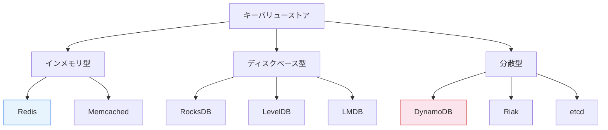

- **インメモリ型**：全データをメモリ上に保持し、極めて低いレイテンシを実現する。永続性はオプションで提供される。Redisが代表例
- **ディスクベース型**：データをディスクに保存し、大容量データに対応する。LSM-TreeやB-Treeをストレージエンジンとして使用。RocksDBが代表例
- **分散型**：複数ノードにデータを分散配置し、高可用性とスケーラビリティを提供する。DynamoDBが代表例

これらは排他的な分類ではない。Redisはインメモリでありながらクラスタモードで分散構成を取れるし、DynamoDBは内部でSSD上のストレージエンジンを使用している。

## 3. Redis：インメモリデータストアの王者

### 3.1 歴史と設計哲学

Redis（**Re**mote **Di**ctionary **S**erver）は、2009年にSalvatore Sanfilippo（antirez）によって開発されたインメモリデータストアである。当初はイタリアのスタートアップにおけるリアルタイム統計処理のために開発されたが、そのシンプルさと高性能が評価され、瞬く間に世界中で採用されるようになった。

Redisの設計哲学は以下の原則に集約される：

1. **メモリファースト**：すべてのデータをメモリに保持する。ディスクはあくまで永続化の手段
2. **シングルスレッドイベントループ**：単一スレッドでコマンドを順次処理する。これによりロックが不要になり、実装が簡潔になる
3. **豊富なデータ構造**：単なるバイト列だけでなく、リスト、セット、ソート済みセット、ハッシュなど、多様なデータ構造をネイティブにサポートする
4. **プログラマビリティ**：Luaスクリプトによるアトミックな操作の定義が可能

### 3.2 データ構造

Redisが「ただのキャッシュ」ではなく「データ構造サーバー」と呼ばれる所以は、豊富な組み込みデータ構造にある。

| データ構造 | 用途例 | 主要コマンド |
|---|---|---|
| String | セッション、カウンター、キャッシュ | `GET`, `SET`, `INCR`, `DECR` |
| List | タイムライン、キュー | `LPUSH`, `RPUSH`, `LPOP`, `LRANGE` |
| Set | タグ、ユニークユーザー | `SADD`, `SMEMBERS`, `SINTER` |
| Sorted Set | ランキング、スコアボード | `ZADD`, `ZRANGE`, `ZRANGEBYSCORE` |
| Hash | オブジェクト表現 | `HSET`, `HGET`, `HGETALL` |
| Stream | イベントログ、メッセージング | `XADD`, `XREAD`, `XREADGROUP` |
| HyperLogLog | ユニークカウント（近似） | `PFADD`, `PFCOUNT` |
| Bitmap | フラグ、ブルームフィルタ | `SETBIT`, `GETBIT`, `BITCOUNT` |

各データ構造は、格納される要素数に応じて内部エンコーディングが自動的に最適化される。たとえば、要素数が少ないHashは**ziplist**（メモリ効率の高い連続バイト列）として格納され、要素数が閾値を超えると通常の**hashtable**に変換される。

### 3.3 アーキテクチャ

#### シングルスレッドモデル

Redisの最も特徴的な設計判断は、**メインのコマンド処理をシングルスレッドで行う**ことである。この設計は直感に反するように思えるが、合理的な理由がある。

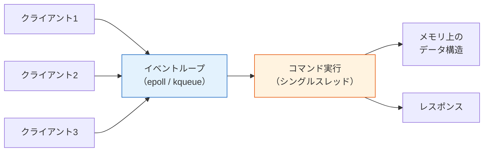

Redisのボトルネックはほとんどの場合**ネットワークI/O**であり、CPU処理ではない。インメモリ操作は通常100ナノ秒未満で完了するため、シングルスレッドでも毎秒数十万のコマンドを処理できる。マルチスレッドにすることで得られるCPU並列化の恩恵よりも、ロック管理やコンテキストスイッチのオーバーヘッドを排除する方が、結果的に高い性能をもたらす。

> [!NOTE]
> Redis 6.0以降では、ネットワークI/O処理にマルチスレッドが導入された（I/O threading）。ただし、コマンド実行自体は依然としてシングルスレッドで行われるため、データアクセスの原子性は保たれている。

#### メモリ管理

Redisはデフォルトで**jemalloc**をメモリアロケータとして使用する。jemallocは内部フラグメンテーションを最小化するよう設計されており、Redisのような多数の小さなオブジェクトを扱うワークロードに適している。

メモリが上限（`maxmemory`）に達した場合、Redisは**エビクションポリシー（eviction policy）**に従って既存のキーを削除する。主要なポリシーは以下の通り：

- **noeviction**：新規書き込みをエラーで拒否する
- **allkeys-lru**：全キーの中からLRU（Least Recently Used）に基づいて削除する
- **volatile-lru**：TTL（有効期限）が設定されたキーの中からLRUに基づいて削除する
- **allkeys-lfu**：全キーの中からLFU（Least Frequently Used）に基づいて削除する
- **volatile-ttl**：TTLが近いキーから優先的に削除する
- **allkeys-random**：全キーからランダムに削除する

::: tip LRU実装の工夫
Redisは厳密なLRUを実装していない。全キーをLRUリストで管理するとメモリオーバーヘッドが大きくなるため、**近似LRU**を採用している。ランダムに数個のキー（デフォルトで5個）をサンプリングし、その中で最もアクセスが古いものを削除する。Redis 4.0以降ではLFU（Least Frequently Used）もサポートされ、アクセス頻度に基づくより精度の高いエビクションが可能になった。
:::

### 3.4 永続化

インメモリストアとしてのRedisにとって、永続化は本質的なジレンマを伴う。メモリの高速性を最大限に活かしながら、プロセスの再起動やサーバー障害に対してデータを保全しなければならない。Redisはこの課題に対して2つの相補的な手法を提供する。

#### RDB（Redis Database）スナップショット

RDBは、ある時点のデータセット全体をバイナリ形式でディスクにダンプする方式である。

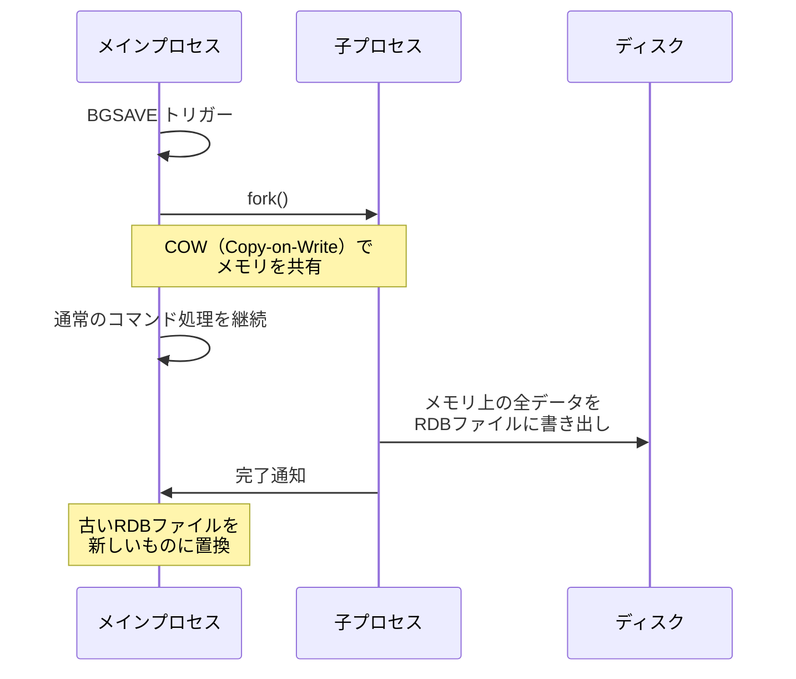

RDBの利点は、コンパクトなバイナリ形式であるため**バックアップと復旧が高速**であること、そして`fork()`のCopy-on-Write機構を利用して**メインプロセスをブロックしない**ことである。

一方、欠点は**データ損失のリスク**がある点だ。RDBは定期的なスナップショットであるため、最後のスナップショット以降の変更は障害時に失われる。一般的な設定では5分間隔でスナップショットを取るため、最大5分間のデータが消失し得る。

#### AOF（Append-Only File）

AOFは、Redisに対する書き込みコマンドをそのままファイルに追記していく方式である。

```
*3
$3
SET
$4
user
$5
Alice
*3
$3
SET
$7
counter
$1
1
*2
$4
INCR
$7
counter
```

AOFでは、`fsync`のタイミングによって耐久性と性能のトレードオフを制御する：

- **always**：すべてのコマンドの後に`fsync`する。最も安全だが最も遅い
- **everysec**：1秒ごとに`fsync`する。デフォルト設定。最大1秒のデータ損失
- **no**：OSに任せる。最も高速だが、OS障害時のデータ損失が大きい

AOFファイルはコマンドの蓄積によって肥大化するため、**AOFリライト（rewrite）**機能が用意されている。リライトでは、現在のデータセットを再現する最小限のコマンド列を新たなAOFファイルとして生成する。たとえば、同一のキーに100回の`INCR`操作が記録されていた場合、リライト後は1回の`SET`コマンドに集約される。

> [!TIP]
> Redis 7.0以降では、RDBとAOFを組み合わせた**Mixed AOF persistence**がデフォルトで有効になっている。RDBスナップショットをベースとし、差分のみをAOF形式で記録することで、復旧速度とデータ安全性のバランスを改善している。

### 3.5 レプリケーション

Redisのレプリケーションは、**非同期のマスター・レプリカ方式**を採用している。

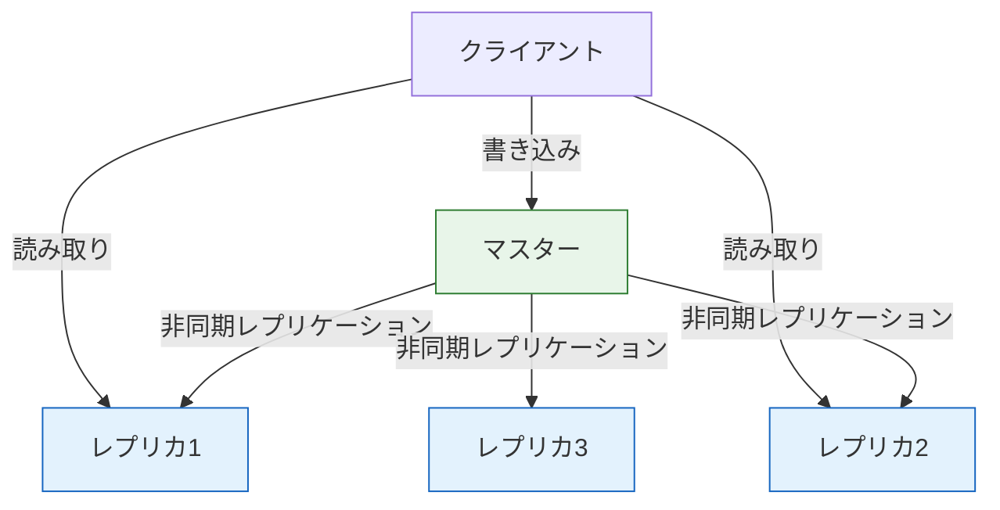

レプリケーションの流れは以下の通りである：

1. レプリカがマスターに接続すると、マスターは**BGSAVE**を実行してRDBスナップショットを生成する
2. RDBスナップショットをレプリカに転送し、レプリカはそれをロードする
3. 以降、マスターで発生した書き込みコマンドは**レプリケーションバッファ**を通じてレプリカにストリーミングされる

非同期レプリケーションであるため、マスターがダウンした際にレプリカに伝搬されていない書き込みは失われる可能性がある。これはRedisが**可用性（Availability）を一貫性（Consistency）よりも優先する**設計判断によるものである。

### 3.6 Redis Cluster

Redis Clusterは、複数のノードにデータを自動分散し、高可用性を提供するRedisの分散モードである。

#### ハッシュスロット

Redis Clusterは**16,384個のハッシュスロット**を使ってキースペースを分割する。各キーは`CRC16(key) mod 16384`の計算結果に基づいてスロットに割り当てられ、各ノードがスロットの一部を担当する。

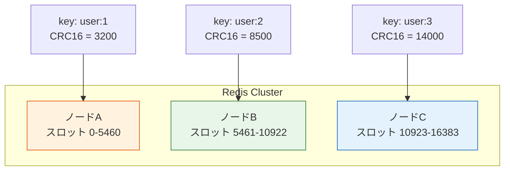

クライアントが誤ったノードにリクエストを送信した場合、そのノードは`MOVED`リダイレクションを返し、正しいノードを通知する。スマートクライアントはスロットとノードのマッピングテーブルをキャッシュし、ほとんどのリクエストを最初から正しいノードに送信する。

#### フェイルオーバー

各マスターノードには1つ以上のレプリカが割り当てられる。マスターがダウンした場合、クラスタ内のノード群が**Gossipプロトコル**を用いて障害を検出し、レプリカの中から新しいマスターを選出する（**自動フェイルオーバー**）。

::: warning Redis Clusterの制約
Redis Clusterでは、**複数のキーにまたがるコマンド**（`MGET`、`MSET`、トランザクション）は、対象キーがすべて同一のハッシュスロットに存在する場合のみ実行可能である。異なるスロットに分散したキーに対する操作はエラーとなる。これを回避するために**ハッシュタグ**（`{user:1}:profile`のように波括弧内のテキストのみをハッシュ計算に使用する機構）が提供されている。
:::

### 3.7 Redisの典型的ユースケース

#### キャッシュ

最も一般的なユースケースである。データベースクエリの結果やAPIレスポンスをRedisにキャッシュし、TTLを設定して自動的に期限切れにする。

```python
def get_user(user_id: str) -> dict:
    # Check cache first
    cached = redis.get(f"user:{user_id}")
    if cached:
        return json.loads(cached)

    # Cache miss: query database
    user = db.query("SELECT * FROM users WHERE id = %s", user_id)

    # Store in cache with 5-minute TTL
    redis.setex(f"user:{user_id}", 300, json.dumps(user))
    return user
```

#### セッションストア

HTTPセッション情報の保存にRedisは広く使われている。ステートレスなアプリケーションサーバーを複数台並べ、セッション情報は共有のRedisに保持する構成は、水平スケーリングの定番パターンである。

#### レート制限

APIのレート制限は、Redisのアトミックな`INCR`操作とTTLを組み合わせることで簡潔に実装できる。

```python
def is_rate_limited(client_ip: str, limit: int = 100, window: int = 60) -> bool:
    key = f"rate:{client_ip}:{int(time.time()) // window}"

    count = redis.incr(key)
    if count == 1:
        redis.expire(key, window)

    return count > limit
```

#### リアルタイムランキング

Sorted Setを使ったランキングは、Redisの最も洗練されたユースケースの一つである。スコアの更新と順位の取得がともに $O(\log N)$ で行える。

```python
# Update score
redis.zadd("leaderboard", {"player:alice": 1500, "player:bob": 1200})

# Get top 10 players (descending order)
top10 = redis.zrevrange("leaderboard", 0, 9, withscores=True)

# Get rank of a specific player
rank = redis.zrevrank("leaderboard", "player:alice")
```

#### Pub/Sub とメッセージング

Redisはシンプルなパブリッシュ・サブスクライブ機能を内蔵しており、リアルタイム通知やイベント配信に利用できる。Redis 5.0で導入された**Streams**は、Apache Kafkaのようなコンシューマーグループ機能を持つ、より本格的なメッセージングメカニズムを提供する。

## 4. Amazon DynamoDB：フルマネージド分散キーバリューストア

### 4.1 歴史と設計哲学

DynamoDBの起源は、2007年にAmazonが発表した論文 **"Dynamo: Amazon's Highly Available Key-value Store"** に遡る。この論文は、AmazonのEコマースプラットフォームが経験した年末商戦の深刻な障害を教訓として書かれた。ショッピングカートの情報が失われ、顧客は注文をやり直さなければならなかった。この経験からAmazonは、**可用性は何よりも優先されるべき**という教訓を得た。

> [!NOTE]
> 2007年のDynamo論文と、2012年にAWSサービスとして公開されたDynamoDBは、名前こそ似ているが別のシステムである。DynamoDBはDynamo論文のアイデア（Consistent Hashing、結果整合性など）を取り入れつつ、SSD上のストレージエンジン（B-Tree）を採用し、自動管理や強い整合性の読み取りオプションなどを追加した、全く新しい設計のサービスである。

DynamoDBの設計哲学は以下に要約される：

1. **可用性と耐久性の最優先**：データは3つのアベイラビリティゾーン（AZ）に自動複製される
2. **完全マネージド**：パッチ適用、スケーリング、バックアップなどの運用タスクはすべてAWSが管理する
3. **予測可能なパフォーマンス**：データサイズやリクエスト量の増加に対しても、一桁ミリ秒のレイテンシを維持する
4. **キャパシティのプロビジョニング**：読み込み・書き込みのスループットを明示的に指定でき、課金もそれに基づく

### 4.2 データモデル

DynamoDBのデータモデルは、純粋なキーバリューストアよりもやや豊富である。

#### テーブルとアイテム

DynamoDBの基本的な構成要素は以下の通り：

- **テーブル（Table）**：アイテムの集合。リレーショナルデータベースのテーブルに相当するが、スキーマは固定されない
- **アイテム（Item）**：属性の集合。リレーショナルデータベースの行に相当する
- **属性（Attribute）**：名前と値のペア。リレーショナルデータベースの列に相当するが、アイテムごとに異なる属性を持てる

#### プライマリキー

DynamoDBのプライマリキーには2種類ある：

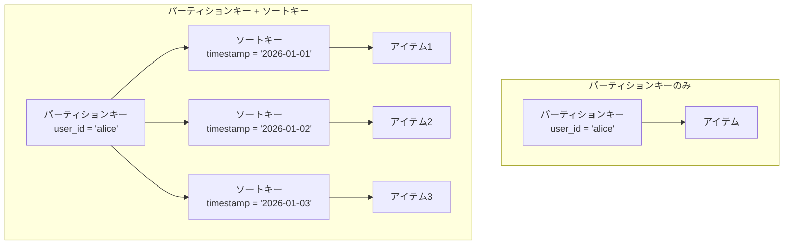

1. **パーティションキー（Partition Key）のみ**：シンプルなキーバリューモデル。パーティションキーはテーブル内で一意でなければならない
2. **パーティションキー + ソートキー（Sort Key）**：複合主キー。同一のパーティションキーに対して複数のアイテムを格納でき、ソートキーによって順序付けられる

複合主キーモデルは、キーバリューストアの範囲を超えた柔軟なクエリパターンを可能にする。たとえば、ユーザーIDをパーティションキー、タイムスタンプをソートキーとすることで、「あるユーザーの最新N件の活動履歴」を効率的に取得できる。

#### セカンダリインデックス

DynamoDBでは、プライマリキー以外の属性でもクエリを行えるよう、**セカンダリインデックス**を作成できる：

- **Global Secondary Index（GSI）**：元のテーブルとは異なるパーティションキーとソートキーを持つインデックス。テーブルの全データが対象
- **Local Secondary Index（LSI）**：パーティションキーは元のテーブルと同じだが、異なるソートキーを持つインデックス。テーブル作成時のみ定義可能

### 4.3 パーティショニングとストレージアーキテクチャ

DynamoDBは内部的に、データを**パーティション**と呼ばれる単位に分割してSSD上に格納する。

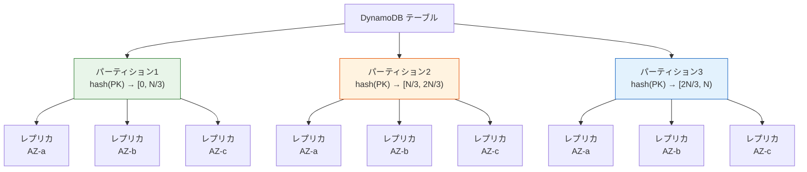

各パーティションは以下の特性を持つ：

- **自動分割**：パーティションのサイズまたはスループットが閾値を超えると、自動的に分割される
- **3重レプリケーション**：各パーティションは3つのAZに複製される
- **リーダー選出**：パーティションごとにPaxosベースのプロトコルでリーダーが選出される。強い整合性が要求される読み取りはリーダーノードが処理する

### 4.4 整合性モデル

DynamoDBは2種類の読み取り整合性を提供する：

- **結果整合性のある読み取り（Eventually Consistent Read）**：3つのレプリカのいずれかから読み取る。書き込み直後に別のレプリカから読み取ると、古いデータが返される可能性がある（通常1秒以内に全レプリカに伝搬する）。コストが低い（消費するRCUが半分）
- **強い整合性のある読み取り（Strongly Consistent Read）**：リーダーノードから読み取る。最新の書き込み結果が必ず反映される。コストが高い

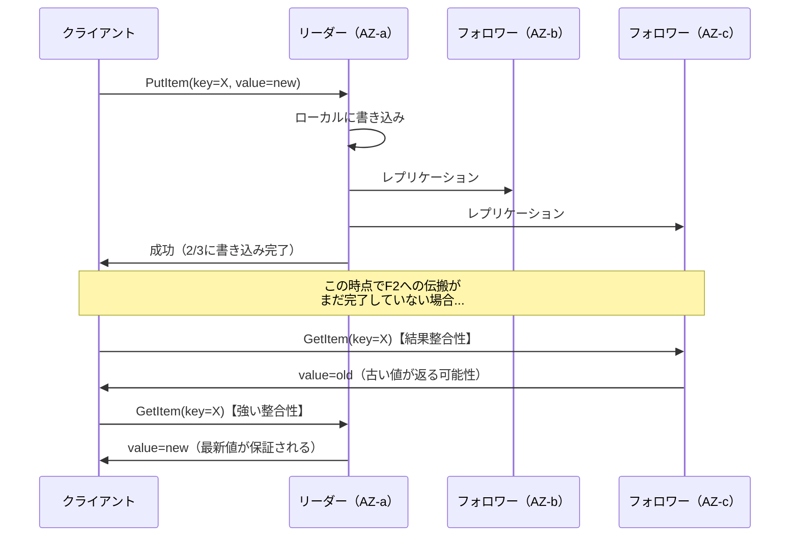

### 4.5 キャパシティとスループット

DynamoDBのスループットは、**Read Capacity Unit（RCU）**と**Write Capacity Unit（WCU）**で管理される。

- **1 RCU**：最大4KBのアイテムに対する、毎秒1回の強い整合性のある読み取り（結果整合性の場合は毎秒2回）
- **1 WCU**：最大1KBのアイテムに対する、毎秒1回の書き込み

キャパシティモードは2種類ある：

- **プロビジョンドモード**：RCUとWCUを事前に指定する。Auto Scalingとの組み合わせで、利用状況に応じた自動調整が可能
- **オンデマンドモード**：キャパシティの事前指定が不要。リクエスト量に応じて自動的にスケーリングされる。トラフィックパターンが予測困難な場合に適する

::: warning ホットパーティション問題
特定のパーティションキーにリクエストが集中すると、そのパーティションのキャパシティが枯渇し、スロットリング（リクエストの拒否）が発生する。これを**ホットパーティション問題**と呼ぶ。DynamoDBは**Adaptive Capacity**機能によってパーティション間のキャパシティを動的に再配分するが、根本的な解決にはキー設計の見直しが必要である。たとえば、ランダムなサフィックスをキーに付加する（Write Sharding）パターンがある。
:::

### 4.6 DynamoDB Streams

DynamoDB Streamsは、テーブルに対する変更（挿入、更新、削除）をキャプチャし、順序付きのストリームとして公開する機能である。

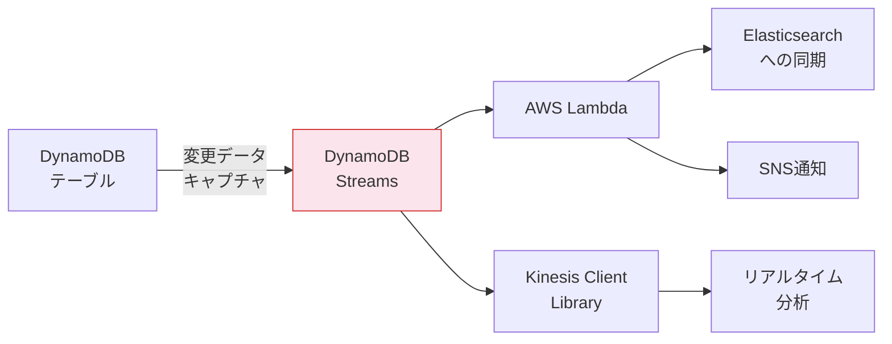

Streamsは以下のユースケースで活用される：

- **クロスリージョンレプリケーション**：Global Tablesの基盤技術
- **マテリアライズドビュー**：データの非正規化ビューを自動更新
- **イベント駆動処理**：Lambda関数をトリガーして後続処理を実行
- **監査ログ**：すべてのデータ変更を記録

### 4.7 DynamoDB Accelerator（DAX）

DAXは、DynamoDB専用のインメモリキャッシュサービスである。DynamoDBの前段にDAXクラスタを配置することで、読み取りレイテンシをミリ秒単位からマイクロ秒単位に削減できる。

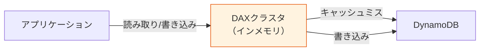

DAXはDynamoDB APIと互換性のあるAPIを提供するため、アプリケーションコードの変更は最小限で済む（SDKのエンドポイント変更のみ）。

### 4.8 Single-Table Design

DynamoDBの設計においてよく議論されるトピックが、**Single-Table Design**パターンである。これは、リレーショナルデータベースにおける複数のテーブルを、DynamoDBでは1つのテーブルに統合するアプローチである。

リレーショナルデータベースでは、`users`テーブルと`orders`テーブルをJOINして「あるユーザーの注文一覧」を取得する。DynamoDBにはJOINが存在しないため、同等のアクセスパターンを実現するには以下のようにデータを構造化する：

| PK | SK | 属性 |
|---|---|---|
| `USER#alice` | `PROFILE` | name="Alice", email="alice@example.com" |
| `USER#alice` | `ORDER#2026-01-01#001` | total=5000, status="shipped" |
| `USER#alice` | `ORDER#2026-01-15#002` | total=3200, status="pending" |
| `USER#bob` | `PROFILE` | name="Bob", email="bob@example.com" |
| `USER#bob` | `ORDER#2026-02-01#001` | total=8000, status="delivered" |

この設計により、`PK = "USER#alice"` かつ `SK begins_with "ORDER#"` というクエリで、Aliceの全注文を1回のリクエストで取得できる。

::: details Single-Table Designの是非
Single-Table Designは、DynamoDBの性能を最大限に引き出すベストプラクティスとして紹介されることが多いが、万能ではない。利点と欠点を正直に整理すると：

**利点**：
- 単一リクエストで関連データを取得でき、レイテンシが最小化される
- テーブル数の管理が不要（DynamoDBではテーブル数にもコストがかかり得る）

**欠点**：
- データモデルが直感的でなく、可読性が低い
- アクセスパターンの事前定義が必須であり、新しいクエリパターンへの対応が困難
- GSIのオーバーフェッチ（不要なデータの読み取り）が発生しやすい

実際には、中規模程度のアプリケーションでは、複数テーブルに分割する方が保守性に優れるケースも多い。アクセスパターンが明確に定まっており、レイテンシ要件が極めて厳しい場合にのみSingle-Table Designの恩恵が大きい。
:::

## 5. RedisとDynamoDBの比較

### 5.1 設計思想の違い

RedisとDynamoDBは、キーバリューストアという共通のカテゴリに属しながら、根本的に異なる設計思想に基づいている。

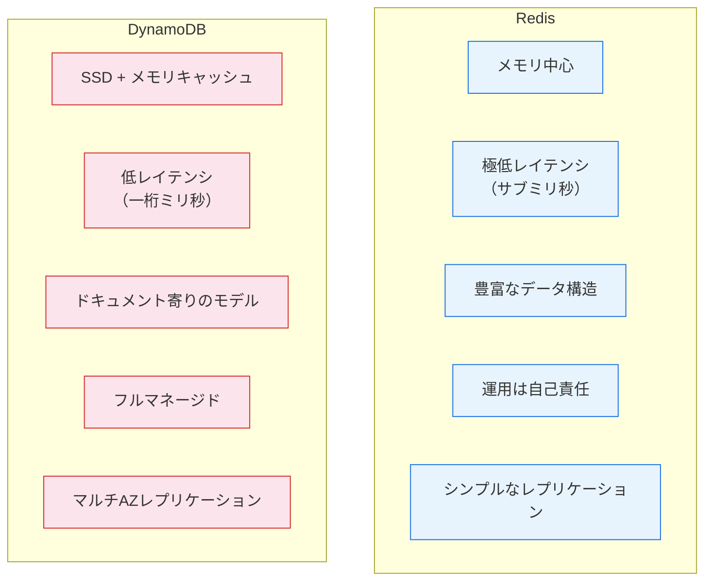

### 5.2 詳細比較

| 特性 | Redis | DynamoDB |
|---|---|---|
| **ストレージ** | インメモリ（永続化はオプション） | SSD（3AZに自動複製） |
| **レイテンシ** | サブミリ秒（< 1ms） | 一桁ミリ秒（1-10ms） |
| **データ容量** | メモリサイズに制約される | 実質的に無制限 |
| **スケーリング** | Redis Cluster（手動設定） | 自動スケーリング |
| **整合性** | 結果整合性（非同期レプリケーション） | 結果整合性 / 強い整合性（選択可能） |
| **トランザクション** | MULTI/EXEC（同一ノード内） | TransactWriteItems / TransactGetItems |
| **データモデル** | 多様なデータ構造 | ドキュメント型（JSON風） |
| **TTL** | キー単位で設定可能 | アイテム単位で設定可能 |
| **バックアップ** | RDB / AOF（手動管理） | 自動バックアップ、PITR |
| **運用コスト** | インフラ管理が必要 | フルマネージド |
| **課金モデル** | インスタンスベース | リクエストベース or キャパシティベース |
| **セカンダリインデックス** | なし | GSI / LSI |
| **オープンソース** | はい（BSD License） | いいえ（AWSプロプライエタリ） |

### 5.3 使い分けの指針

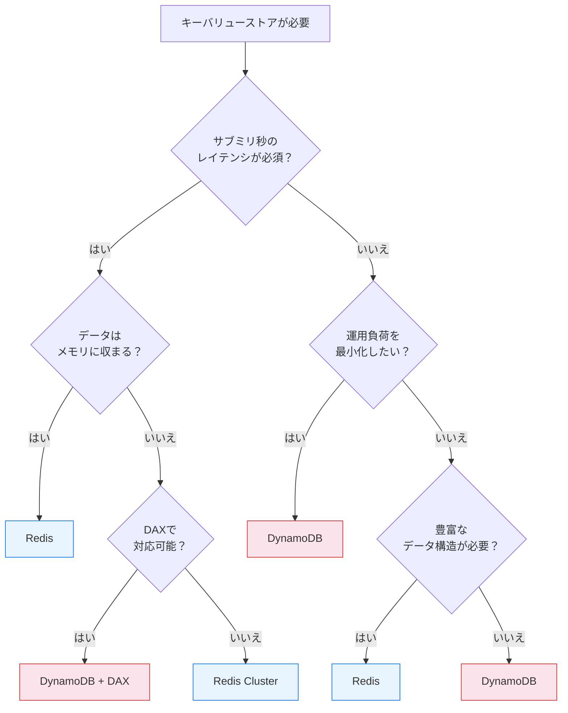

**Redisを選ぶべき場面**：
- キャッシュレイヤーとして、サブミリ秒のレイテンシが求められる
- Sorted Set、HyperLogLog、Streamなど、Redisのデータ構造がユースケースに直接適合する
- Pub/Subやリアルタイム通知が必要
- 一時的なデータ（セッション、レート制限カウンター）を扱う

**DynamoDBを選ぶべき場面**：
- 永続的なデータの主たるストアとして使用する
- 運用負荷を最小限にしたい
- データ量がメモリに収まらないほど大規模
- マルチリージョンのグローバル展開が必要（Global Tables）
- 強い整合性の読み取りが必要な場面がある

## 6. キーバリューストアの内部実装技術

### 6.1 ハッシュテーブル

キーバリューストアの中核をなすデータ構造は**ハッシュテーブル**である。キーからハッシュ値を計算し、配列のインデックスとして使用することで、$O(1)$の平均ルックアップ時間を実現する。

Redisは内部で**チェーン法（Separate Chaining）**によるハッシュテーブルを使用している。衝突したキーはリンクリストで管理される。ハッシュテーブルのロードファクターが閾値を超えると、**インクリメンタルリハッシュ**が開始される。Redisのリハッシュは、新旧2つのハッシュテーブルを同時に保持し、通常のコマンド処理の合間に少しずつエントリを移動する方式を採用している。これにより、大規模なリハッシュであっても処理のブロックが回避される。

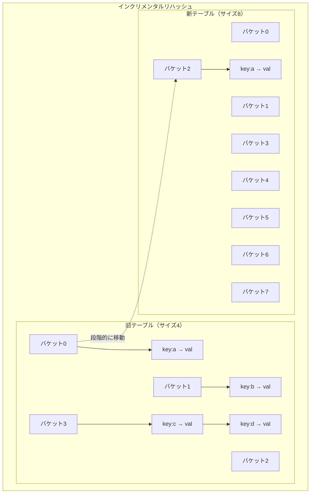

### 6.2 ストレージエンジンの選択

ディスクベースのキーバリューストアでは、ストレージエンジンの選択が性能特性を決定的に左右する。

| ストレージエンジン | 読み取り | 書き込み | 空間効率 | 代表的な利用 |
|---|---|---|---|---|
| **B-Tree** | 優秀 | 中程度 | 中程度 | DynamoDB, LMDB |
| **LSM-Tree** | 中程度 | 優秀 | 優秀 | RocksDB, LevelDB |
| **ハッシュインデックス** | 最速 | 最速 | 低い | Bitcask |

DynamoDBは内部的にB-Treeベースのストレージエンジンを使用している。B-Treeは読み取り性能に優れ、ソートキーによる範囲クエリを効率的にサポートできるため、DynamoDBのデータモデル（パーティションキー + ソートキー）と親和性が高い。

一方、RocksDB（LevelDBの後継）はLSM-Treeを採用しており、書き込みヘビーなワークロードに最適化されている。RocksDBはMySQLのMyRocksストレージエンジンやCockroachDBのバックエンドとしても使われている。

### 6.3 分散キーバリューストアにおけるConsistent Hashing

分散キーバリューストアでは、キーをどのノードに配置するかを決定するために**Consistent Hashing**が広く用いられる。

通常のハッシュ分割（`hash(key) mod N`）では、ノード数 $N$ が変化するとほぼすべてのキーの再配置が必要になる。Consistent Hashingでは、ハッシュ空間を論理的なリング上に配置し、各ノードもリング上の位置を持つ。キーはリング上で時計回りに最も近いノードに割り当てられるため、ノードの追加・削除時に再配置されるキーは全体の $1/N$ 程度に抑えられる。

DynamoDB（Dynamo論文）は、ノードの負荷分散を改善するために**仮想ノード（Virtual Node）**を導入した。物理ノードごとに複数の仮想ノードをリング上に配置することで、キーの分布をより均等にする。

### 6.4 クォーラムとレプリケーション

分散キーバリューストアにおいて、一貫性と可用性のトレードオフを制御する中心的な概念が**クォーラム**である。

データを $N$ 個のレプリカに複製するシステムにおいて：

- **W（Write Quorum）**：書き込みが成功と見なされるために必要なレプリカ数
- **R（Read Quorum）**：読み取り時に問い合わせるレプリカ数

$W + R > N$ が成り立つ場合、読み取りと書き込みの少なくとも1つのレプリカが重複するため、**強い整合性**が保証される。

DynamoDBでは $N = 3$ に対して $W = 2$（2つのAZへの書き込みが完了すれば成功）が標準であり、強い整合性のある読み取りではリーダーノードに直接問い合わせることで最新データを保証する。

## 7. キーバリューストアの実践的な設計パターン

### 7.1 キー設計のベストプラクティス

キーバリューストアの性能は、キー設計に大きく依存する。以下に主要なパターンを示す。

**階層的キー構造**：コロンやスラッシュで名前空間を区切り、キーに構造を持たせる。

```
user:{user_id}:profile
user:{user_id}:settings
order:{order_id}:details
session:{session_id}
```

**Write Sharding**：特定のキーにアクセスが集中する場合、ランダムなサフィックスを付加してリクエストを分散させる。

```
counter:page_views#0
counter:page_views#1
counter:page_views#2
...
counter:page_views#9
```

読み取り時は全サフィックスの値を合算する。書き込みの分散と引き換えに読み取りの複雑さが増す。

**複合キー**：複数の属性を組み合わせてキーを構成する。

```
leaderboard:{game_id}:{season}
rate_limit:{api_key}:{window_timestamp}
```

### 7.2 キャッシュパターン

キーバリューストアをキャッシュとして使用する場合、いくつかの古典的なパターンがある。

**Cache-Aside（Lazy Loading）**：

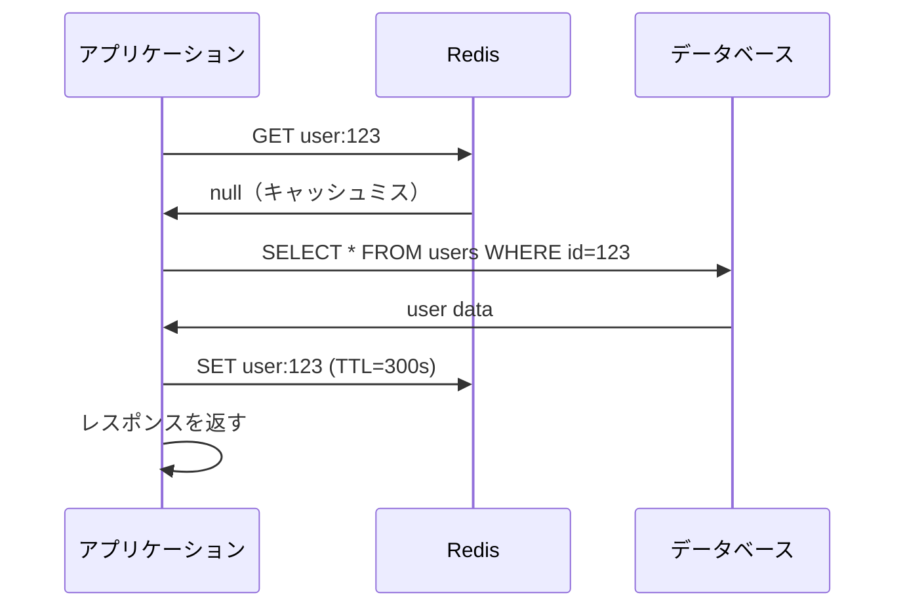

**Write-Through**：書き込み時にキャッシュとデータベースを同時に更新する。読み取り時は常にキャッシュヒットが期待できるが、書き込みレイテンシが増加する。

**キャッシュスタンピード対策**：人気のあるキーのTTLが切れた瞬間に、大量のリクエストが同時にデータベースへ殺到する現象（cache stampede / thundering herd）への対策として、以下のテクニックが使われる：

- **確率的早期再計算**：TTLの切れる少し前に、確率的にキャッシュを更新する
- **ロックによる排他制御**：キャッシュミス時にロックを取得し、1つのリクエストだけがデータベースへアクセスする
- **ステイルデータの許容**：古いキャッシュデータを一時的に返しつつ、バックグラウンドで更新する

### 7.3 分散ロック

Redisは分散ロックの実装にもよく使われる。最も基本的なパターンは`SET key value NX EX timeout`コマンドを使うものである。

```python
def acquire_lock(lock_name: str, timeout: int = 10) -> str | None:
    token = str(uuid.uuid4())
    # SET NX: only set if key does not exist
    # EX: set expiration to avoid deadlocks
    if redis.set(f"lock:{lock_name}", token, nx=True, ex=timeout):
        return token
    return None

def release_lock(lock_name: str, token: str) -> bool:
    # Lua script for atomic check-and-delete
    script = """
    if redis.call("GET", KEYS[1]) == ARGV[1] then
        return redis.call("DEL", KEYS[1])
    else
        return 0
    end
    """
    return redis.eval(script, 1, f"lock:{lock_name}", token)
```

::: danger 分散ロックの注意点
Redisによる分散ロックは、ネットワーク分断やRedisのフェイルオーバー時に**安全性が保証されない**。たとえば、マスターがロックを書き込んだ直後、レプリカへの伝搬前にクラッシュした場合、新たなマスターにはロック情報がなく、別のプロセスが同じロックを取得できてしまう。この問題に対処するために、Redis作者のantirezは**Redlock**アルゴリズムを提案したが、分散システムの研究者Martin Kleppmannがその安全性に疑問を呈し、大きな議論を巻き起こした。厳密な排他制御が必要な場合は、ZooKeeperやetcdなどのコンセンサスベースのシステムを検討すべきである。
:::

## 8. CAP定理とキーバリューストア

キーバリューストアの設計を理解するうえで、CAP定理の文脈を押さえておくことは重要である。

CAP定理によれば、ネットワーク分断（Partition）が発生した場合、一貫性（Consistency）と可用性（Availability）のどちらかを犠牲にせざるを得ない。

- **Redis**：AP寄りの設計。非同期レプリケーションにより、ネットワーク分断時もマスターが書き込みを受け付けるが、一貫性が犠牲になり得る。Redis Clusterでは、分断時にマイノリティ側のマスターが書き込みを拒否する設定も可能（`cluster-require-full-coverage`）
- **DynamoDB**：可用性と耐久性を最優先する設計。結果整合性の読み取りでは高い可用性を、強い整合性の読み取りではリーダーノードの可用性に依存する

実際のシステム設計においては、CAP定理の二者択一ではなく、操作ごとに整合性レベルを選択する**PACELC**の枠組みがより実用的である。DynamoDBが読み取りごとに整合性レベルを選択できるのは、まさにこのアプローチを体現している。

## 9. キーバリューストアの限界と代替手段

### 9.1 キーバリューストアが不向きなケース

キーバリューストアは万能ではない。以下のケースでは別のデータベースを検討すべきである：

- **複雑なクエリ**：複数の属性に基づくフィルタリング、集約（GROUP BY）、結合（JOIN）が必要な場合、リレーショナルデータベースが適切である
- **強いトランザクション保証**：複数のキーにまたがるACIDトランザクションが必要な場合、キーバリューストアの提供する保証は不十分なことが多い
- **データの関係性**：エンティティ間の複雑な関係を表現・クエリする必要がある場合、グラフデータベースの方が自然である
- **全文検索**：値の内容に基づく検索が主要なアクセスパターンである場合、ElasticsearchやMeilisearchなどの検索エンジンが適切である

### 9.2 他のNoSQLとの比較

| カテゴリ | 代表例 | 強み | キーバリューとの違い |
|---|---|---|---|
| **ドキュメントDB** | MongoDB, Firestore | 構造化されたドキュメントのクエリ | 値の内部構造をDBが理解し、フィールドレベルのクエリが可能 |
| **ワイドカラムストア** | Cassandra, HBase | 大規模データの分散書き込み | 行キーと列ファミリーによる二次元的なデータモデル |
| **グラフDB** | Neo4j, Amazon Neptune | 関係性のトラバーサル | エンティティ間のリレーションを第一級の概念として扱う |
| **時系列DB** | InfluxDB, TimescaleDB | 時系列データの効率的な格納・クエリ | 時間軸に最適化された圧縮とダウンサンプリング |

DynamoDBは、セカンダリインデックスやQueryの`FilterExpression`を通じて、純粋なキーバリューストアよりもドキュメントDBに近い柔軟性を持っている。AWS自身もDynamoDBを「キーバリューおよびドキュメントデータベース」と位置づけている。

## 10. 最新動向と将来の展望

### 10.1 Redisの進化

Redisは単なるキャッシュから、多機能なデータプラットフォームへと進化を続けている：

- **Redis Stack**：検索（RediSearch）、JSON（RedisJSON）、時系列（RedisTimeSeries）、グラフ（RedisGraph、ただし2024年に非推奨化）など、モジュールによる機能拡張
- **Redis 7.x**：Shared Pub/Sub、Function（サーバーサイドのスクリプト）、ACLの改善
- **Valkey**：2024年にLinux Foundationの下でフォークされたRedis互換のオープンソースプロジェクト。Redisのライセンス変更（BSD → SSPL/RSAL）に対する反発から生まれた

> [!WARNING]
> 2024年3月、RedisはライセンスをBSDからSSPL（Server Side Public License）とRSAL（Redis Source Available License）のデュアルライセンスに変更した。これにより、クラウドプロバイダーがRedisをマネージドサービスとして提供することが制限された。この変更を受けて、AWS、Google Cloud、Oracleなどの主要クラウドプロバイダーは**Valkey**への移行を表明している。

### 10.2 DynamoDBの進化

DynamoDBも継続的に機能強化が行われている：

- **DynamoDB Zero-ETL Integration**：DynamoDBのデータをAmazon OpenSearchやAmazon Redshiftに自動的に同期し、分析クエリを可能にする
- **DynamoDB Standard-IAテーブルクラス**：アクセス頻度の低いデータに対する低コストのストレージクラス
- **Global Tables v2**：マルチリージョンでのアクティブ-アクティブレプリケーションの改善

### 10.3 新しい潮流

キーバリューストアの領域では、以下のような新しい動きが注目に値する：

- **NATS KV / JetStream**：メッセージングシステムNATS上に構築されたキーバリューストア。メッセージングとストレージの統合
- **FoundationDB**：Appleが開発・運用する分散キーバリューストア。厳密なシリアライザビリティを保証しつつ、高い性能を実現
- **TiKV**：PingCAPが開発するRust実装の分散キーバリューストア。Raftコンセンサスに基づく強い一貫性を持つ

## 11. まとめ

キーバリューストアは、データベースの世界において最もシンプルでありながら、最も広く利用されるカテゴリの一つである。そのシンプルさゆえに、低レイテンシ、高スループット、容易なスケーリングという卓越した運用特性を持つ。

Redisは、インメモリの高速性と豊富なデータ構造を武器に、キャッシュ、セッション管理、リアルタイム処理など幅広い用途で事実上の標準となっている。シングルスレッドモデルというシンプルな設計により、予測可能な低レイテンシを実現する。一方で、メモリ容量による制約と、非同期レプリケーションに伴うデータ損失リスクを理解しておく必要がある。

DynamoDBは、フルマネージドの分散キーバリューストアとして、運用負荷の最小化と無限のスケーラビリティを提供する。3つのAZにまたがるレプリケーション、自動バックアップ、柔軟なキャパシティ管理により、ミッションクリティカルなワークロードにも対応できる。一方で、データモデルの設計（特にパーティションキーの選択）がシステムの性能を決定的に左右するため、事前のアクセスパターン分析が不可欠である。

どちらのシステムを選択するかは、レイテンシ要件、データの永続性要件、運用体制、スケーラビリティの必要性といった要因によって決まる。そして多くの現実のシステムでは、RedisとDynamoDBは競合するものではなく、**異なるレイヤーで補完的に使われる**——DynamoDBを永続的なデータストアとして、Redisをその前段のキャッシュレイヤーとして組み合わせるアーキテクチャは、極めて一般的なパターンである。

キーバリューストアの本質を理解することは、「どのデータベースを使うか」という技術選定の問いだけでなく、「データをどう構造化し、どうアクセスするか」というより根本的な設計の問いに答える力を養うことでもある。
