# Kubernetesアーキテクチャ — コンテナオーケストレーションの設計思想

## 1. 背景と動機 — Borgからの進化

### 1.1 大規模クラスタ管理の歴史

コンテナオーケストレーションの歴史を語る上で、Googleの社内システム **Borg** の存在は避けて通れない。Googleは2003年頃からBorgを運用し、数万台のマシン上で検索エンジン、Gmail、YouTube、MapReduceなどの多種多様なワークロードを統一的に管理してきた。2015年に発表された論文「Large-scale cluster management at Google with Borg」は、10年以上にわたる大規模運用の知見を公開し、業界に大きな衝撃を与えた。

Borgの中核的な設計判断は以下の通りである。

- **セル（Cell）**: クラスタを「セル」という単位で区切り、1つのBorgmasterが1セルを管理する
- **ジョブとタスク**: 長時間稼働するサービス（prod）とバッチ処理（non-prod）を優先度で区別し、同一クラスタ上で混在させる
- **リソースの予約とオーバーコミット**: ユーザーの申告リソース（reservation）と実際の消費量の差を利用して、クラスタ利用率を60〜80%に維持する
- **Borglet**: 各マシン上で動作するエージェントが、タスクの起動・監視・再起動を担う

BorgのアーキテクチャはKubernetesに多大な影響を与えたが、そのままではなく、意図的に改善された点がある。

### 1.2 Borgの課題とKubernetesでの解決

Borgは極めて成功したシステムだが、10年以上の運用で蓄積された課題もあった。

**ジョブとタスクの概念が窮屈**: Borgでは「ジョブ」は同一バイナリの「タスク」のコレクションだった。しかし、現実のアプリケーションはサイドカープロキシやログ収集エージェントなど、異なるバイナリを密結合で動かしたい場合が多い。Kubernetesはこれを **Pod** という概念で解決した。Podは1つ以上のコンテナをまとめる最小のデプロイ単位であり、同一Pod内のコンテナはネットワーク名前空間とストレージボリュームを共有する。

**IPアドレスの管理**: Borgではタスクがホストマシンのポートを共有し、ポートの衝突を回避するためにBorgがポート番号を動的に割り当てていた。これによりサービスディスカバリが複雑化した。Kubernetesでは **Pod単位でIPアドレスを割り当てる** フラットなネットワークモデルを採用し、ポート衝突の問題を根本的に排除した。

**宣言的管理の一貫性**: Borgの設定は命令的な操作の蓄積になりがちだった。Kubernetesは **宣言的（Declarative）** なAPIを全面的に採用し、「あるべき状態」をYAMLで記述すれば、システムが自律的にその状態を実現・維持する設計とした。

### 1.3 Omegaの影響

Borgの後継として2013年に発表された **Omega** は、スケジューラのスケーラビリティに焦点を当てたシステムである。Borgのモノリシックなスケジューラに対し、Omegaは **共有ステートアーキテクチャ** を採用した。クラスタの全状態をトランザクション対応のストアに保持し、複数のスケジューラが楽観的並行制御で同時にスケジューリング判断を行う。

Kubernetesはこの知見を取り入れつつ、異なるアプローチを選んだ。単一のデフォルトスケジューラを持ちつつも、**Scheduling Framework** によるプラグインアーキテクチャで拡張性を確保し、必要に応じて複数のスケジューラを並行稼働させることも可能にした。

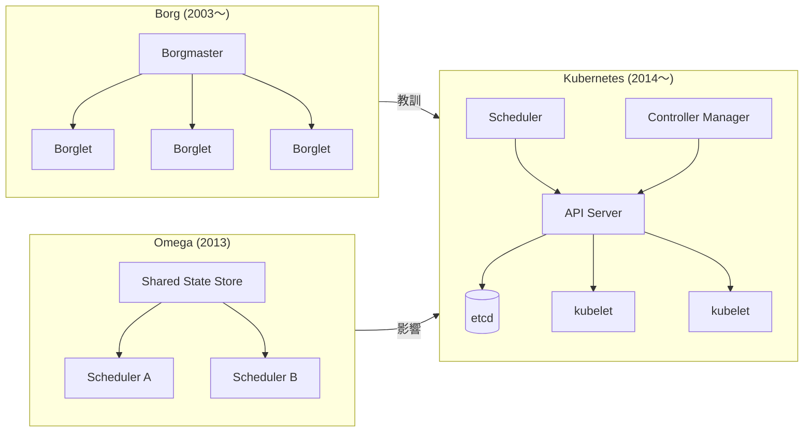

---

## 2. 宣言的モデルとReconciliation Loop

### 2.1 命令的 vs 宣言的

Kubernetesを理解する上で最も重要な概念が、**宣言的モデル（Declarative Model）** である。従来のシステム管理は命令的（Imperative）なアプローチが主流だった。「サーバーにSSH接続し、パッケージをインストールし、設定ファイルを編集し、サービスを起動する」という一連の手順を記述して実行する。この方式では、途中で失敗した場合の状態が不確定になり、再試行しても冪等性が保証されない。

宣言的モデルでは、ユーザーは「あるべき状態（Desired State）」を記述するだけである。

```yaml
# Desired state declaration
apiVersion: apps/v1
kind: Deployment
metadata:
  name: web-app
spec:
  replicas: 3
  selector:
    matchLabels:
      app: web
  template:
    metadata:
      labels:
        app: web
    spec:
      containers:
      - name: web
        image: nginx:1.27
        ports:
        - containerPort: 80
        resources:
          requests:
            cpu: "100m"
            memory: "128Mi"
          limits:
            cpu: "500m"
            memory: "256Mi"
```

この宣言を受け取ったKubernetesは、現在の状態（Current State）と比較し、差分を埋めるために必要なアクションを自律的に実行する。レプリカが2つしかなければ1つ追加し、4つあれば1つ削除する。コンテナがクラッシュすれば再起動する。ノードがダウンすれば別のノードにPodを再配置する。

### 2.2 Reconciliation Loop — 自己修復の心臓部

宣言的モデルを実現する中核メカニズムが **Reconciliation Loop（調整ループ）** である。これは制御工学における **フィードバック制御** と同じ原理に基づいている。

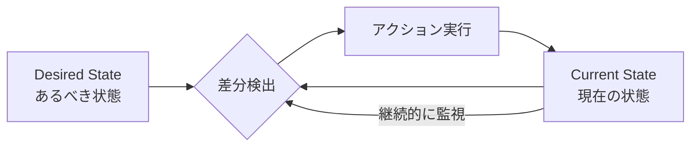

Reconciliation Loopは以下のステップを無限に繰り返す。

1. **Observe（観察）**: 現在の状態をAPIサーバー経由で取得する
2. **Diff（差分検出）**: あるべき状態と現在の状態を比較する
3. **Act（行動）**: 差分を解消するためのアクションを実行する

この設計には深い意味がある。

**レベルトリガー vs エッジトリガー**: Kubernetesのコントローラーは **レベルトリガー** で動作する。つまり、「状態が変化したイベント」に反応するのではなく、「現在の状態が望ましい状態と異なる」という事実に反応する。イベントを見逃しても、次のループで差分が検出されるため、最終的に正しい状態に収束する。これは分散システムにおいて極めて重要な特性である。イベントの欠落やメッセージの重複が発生しても、システムは自己修復できる。

**冪等性**: 各アクションは冪等に設計される。同じReconciliation Loopを何度実行しても、副作用が重複しない。

**最終的整合性**: Kubernetesは即座に望ましい状態を実現するわけではない。Reconciliation Loopが繰り返されることで、**最終的に（Eventually）** 状態が収束する。この設計により、一時的な障害やネットワーク分断に対して頑健なシステムが実現される。

### 2.3 Controller パターン

Kubernetesにおいてすべてのリソースを管理するコンポーネントは「コントローラー」と呼ばれ、Reconciliation Loopを実装する。各コントローラーは特定のリソースタイプ（Deployment, ReplicaSet, Service など）を担当し、それぞれが独立してReconciliation Loopを回す。

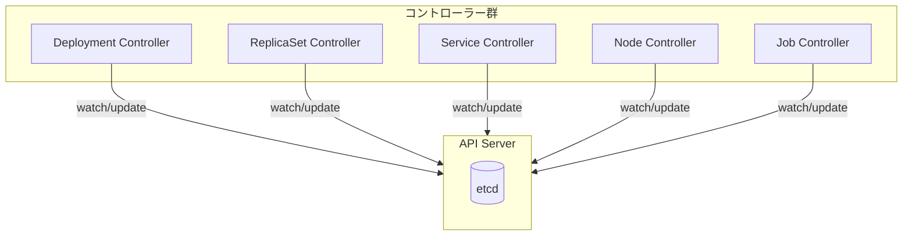

例えば、Deploymentの更新がどのように伝播するかを見てみよう。

1. ユーザーがDeploymentのイメージバージョンを更新する
2. **Deployment Controller** が差分を検出し、新しいReplicaSetを作成する
3. **ReplicaSet Controller** が新しいReplicaSetのPod数が足りないことを検出し、Pod を作成する
4. **Scheduler** が未割り当てのPodを検出し、適切なノードにバインドする
5. **kubelet** がバインドされたPodを検出し、コンテナを起動する

各コンポーネントは自分の担当領域だけを気にすればよく、全体の協調は etcd に保存された状態を介して間接的に行われる。この **疎結合** な設計が、Kubernetesの拡張性と信頼性の源泉である。

---

## 3. Control Plane — クラスタの頭脳

Kubernetesのアーキテクチャは大きく **Control Plane（コントロールプレーン）** と **Data Plane（データプレーン）** に分かれる。Control Planeはクラスタ全体の管理・制御を担い、通常はマスターノード（あるいは専用のControl Planeノード）上で動作する。

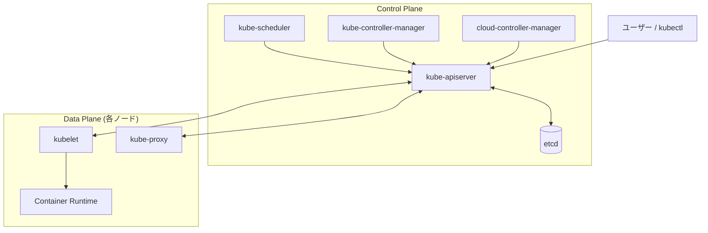

### 3.1 kube-apiserver — すべての中心

kube-apiserver は Kubernetes の **唯一の入口** である。kubectl、他のControl Planeコンポーネント、kubelet、外部システム、すべてがAPI Serverを介して通信する。コンポーネント間の直接通信は設計上存在しない。

API Serverの主な責務は以下の通りである。

**RESTful API の提供**: すべてのKubernetesリソース（Pod, Service, Deployment など）はHTTP/RESTful APIとして公開される。リソースの作成・取得・更新・削除（CRUD）は標準的なHTTPメソッドにマッピングされる。

```
# Pod list
GET /api/v1/namespaces/default/pods

# Pod creation
POST /api/v1/namespaces/default/pods

# Specific Pod
GET /api/v1/namespaces/default/pods/my-pod

# Pod update
PUT /api/v1/namespaces/default/pods/my-pod

# Pod deletion
DELETE /api/v1/namespaces/default/pods/my-pod
```

**認証・認可・アドミッション制御**: APIリクエストは3段階のチェックを通過する必要がある。

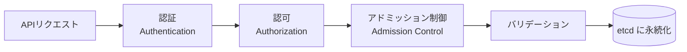

1. **認証（Authentication）**: リクエストの送信者を特定する。X.509クライアント証明書、Bearer Token、OpenID Connect（OIDC）、Webhook Token Authenticationなどが利用可能
2. **認可（Authorization）**: 特定されたユーザーがリクエストされた操作を実行できるか判断する。RBAC（Role-Based Access Control）が標準
3. **アドミッション制御（Admission Control）**: リクエストの内容を検証（Validating）し、必要に応じて変更（Mutating）する。後述のAdmission Webhookにより拡張可能

**Watchメカニズム**: API Serverは **Watch** と呼ばれるストリーミングAPIを提供する。クライアントはリソースの変更をリアルタイムに受信でき、ポーリングの必要がない。コントローラーやkubeletはこのWatchメカニズムを利用して、状態変化に迅速に対応する。内部的にはHTTP/2のストリームまたはWebSocket上でイベントが配信される。

**楽観的並行制御**: すべてのKubernetesリソースは `resourceVersion` フィールドを持つ。更新リクエストには現在の `resourceVersion` を含める必要があり、保存時にバージョンが一致しなければ `409 Conflict` が返される。これにより、etcdのトランザクションを利用した楽観的ロックが実現される。

### 3.2 etcd — クラスタの真実の源

**etcd** は、Kubernetesのすべての状態を永続的に保存する分散キーバリューストアである。etcdは **Raft** コンセンサスアルゴリズムを採用しており、奇数台（通常3台または5台）のクラスタで動作する。

etcdの役割は極めて重要である。

- クラスタのすべてのリソース定義、Pod の状態、Service のエンドポイント、Secret、ConfigMapなど、あらゆるデータがetcdに保存される
- API Server以外のコンポーネントはetcdに直接アクセスしない。API Serverがetcdの唯一のクライアントである
- etcdの障害はクラスタ全体の障害を意味する。新しいリソースの作成やスケジューリングが停止する（ただし、既に稼働中のPodは影響を受けない）

etcdのデータモデルはフラットなキーバリュー構造である。

```
/registry/pods/default/my-pod          → Pod のJSON/Protobuf
/registry/services/default/my-service  → Service のJSON/Protobuf
/registry/deployments/default/my-app   → Deployment のJSON/Protobuf
```

etcdは **Watch** 機能を備えており、特定のキーまたはキープレフィックスの変更をストリームで通知できる。API Serverはこの機能を利用して、リソースの変更を検知し、Watchしているクライアントに伝播する。

::: warning etcd の運用上の注意
etcdはI/Oレイテンシに敏感であり、SSDの使用が強く推奨される。また、etcdに保存されるデータ量が大きくなりすぎると性能が劣化するため、Kubernetes 1.22以降ではetcdのデフラグメンテーションが自動的に行われるようになった。大規模クラスタでは、イベントを専用のetcdクラスタに分離することも一般的な手法である。
:::

### 3.3 kube-scheduler — 最適な配置の決定

kube-schedulerは、まだノードに割り当てられていないPodを検出し、最適なノードを選択してバインドする。スケジューリングは **フィルタリング（Filtering）** と **スコアリング（Scoring）** の2段階で行われる。

**フィルタリング**: Podの要件を満たさないノードを除外する。CPUやメモリのリソースが不足しているノード、Node Selectorに一致しないノード、Taintが設定されているがTolerationを持たないノードなどが除外される。

**スコアリング**: フィルタリングを通過したノードに対してスコアを付け、最高スコアのノードを選択する。リソースの均等分配（LeastRequestedPriority）、同一サービスのPodを複数ノードに分散（SelectorSpreadPriority）、データの局所性（NodeAffinityPriority）などが考慮される。

スケジューラの詳細なアーキテクチャについては、本リポジトリの別記事「Kubernetes スケジューリング」で深く解説している。

### 3.4 kube-controller-manager — コントローラーの集合体

kube-controller-managerは、複数のコントローラーを単一のバイナリにまとめたプロセスである。各コントローラーは論理的には独立しているが、運用の簡素化のために1つのプロセスとして動作する。

主要なコントローラーには以下がある。

| コントローラー | 責務 |
|---|---|
| Deployment Controller | Deploymentのローリングアップデートとロールバックを管理 |
| ReplicaSet Controller | 指定されたレプリカ数のPodが常に稼働していることを保証 |
| StatefulSet Controller | ステートフルなアプリケーションの順序付きデプロイと永続ストレージを管理 |
| DaemonSet Controller | 全ノード（またはサブセット）に1つずつPodを配置 |
| Job/CronJob Controller | バッチ処理と定期実行ジョブを管理 |
| Node Controller | ノードの死活監視と、応答しないノード上のPodのEviction |
| Service Account Controller | Namespaceごとのデフォルトサービスアカウントを作成 |
| Endpoint Controller | ServiceとPodのマッピング（Endpoints）を管理 |
| Namespace Controller | 削除されたNamespace内のリソースをクリーンアップ |

これらすべてがReconciliation Loopパターンに従っている。各コントローラーは **Leader Election** により、複数レプリカの中から1台がアクティブになり、残りはスタンバイとして待機する。アクティブなインスタンスが障害を起こすと、別のインスタンスがリーダーに昇格して処理を引き継ぐ。

---

## 4. Data Plane — ワークロードの実行基盤

Data Planeは各ワーカーノード上で動作するコンポーネント群であり、実際にコンテナを起動・監視・ネットワーク接続する責務を担う。

### 4.1 kubelet — ノードのエージェント

**kubelet** は各ノード上で動作するエージェントプロセスであり、そのノードにおけるPodのライフサイクル管理を担当する。kubeletはAPI ServerからPodSpecを受け取り、その仕様に従ってコンテナを起動・監視する。

kubeletの主な責務は以下の通りである。

- **Podの起動と停止**: PodSpecに基づいてContainer Runtimeにコンテナの作成を指示する
- **ヘルスチェック**: Liveness Probe、Readiness Probe、Startup Probeを実行し、コンテナの健全性を監視する
- **リソース管理**: cgroups を通じてCPU・メモリの制限を適用する
- **ボリュームのマウント**: PodSpecで指定されたボリューム（ConfigMap、Secret、PersistentVolumeClaim など）をコンテナにマウントする
- **ステータスの報告**: Podの状態をAPI Serverに定期的に報告する
- **静的Pod**: API Serverに依存せず、ローカルのマニフェストファイルからPodを起動する機能。Control Planeコンポーネント自体を管理するために使われる

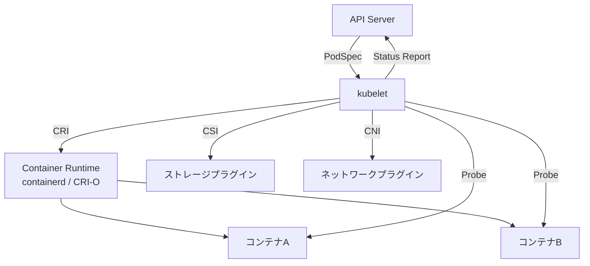

kubeletとContainer Runtimeの間は **CRI（Container Runtime Interface）** という標準インターフェースで接続される。これにより、kubelet自体を変更することなく、containerd、CRI-O、あるいは将来の新しいランタイムに差し替えることができる。

### 4.2 kube-proxy — サービスネットワーキング

**kube-proxy** は各ノード上で動作し、Kubernetes Serviceの抽象化を実現するネットワークプロキシである。Serviceに向けられたトラフィックを、バックエンドのPod群に分散する。

kube-proxyには3つの動作モードがある。

**iptablesモード（デフォルト）**: Linuxカーネルの iptables ルールを設定し、パケットレベルでDNATによるロードバランシングを行う。ユーザースペースを経由しないため高速だが、Service数が多くなるとルール数が増大し、ルールの更新に時間がかかる。

**IPVSモード**: Linux Virtual Server（IPVS）を利用する。IPVSはカーネル内のL4ロードバランサーであり、ハッシュテーブルベースのルックアップにより、大量のServiceでも一定のパフォーマンスを維持する。ラウンドロビン、最小接続、ソースハッシュなど多様なバランシングアルゴリズムを選択できる。

**nftablesモード**: Kubernetes 1.29で導入された新しいモード。iptablesの後継であるnftablesを利用する。iptablesモードよりも効率的なルール管理が可能であり、長期的にはデフォルトモードの置き換えが目指されている。

::: tip kube-proxyレス構成
近年では、CNIプラグイン（Ciliumなど）がkube-proxyの機能を完全に代替する **kube-proxyレス** 構成も普及している。CiliumはeBPFを利用してカーネル内で直接パケット処理を行い、iptablesのオーバーヘッドを完全に排除する。
:::

### 4.3 Container Runtime — コンテナの実行エンジン

Container Runtimeは実際にコンテナを作成・実行するソフトウェアである。Kubernetesの初期にはDockerが唯一のランタイムだったが、**CRI** の導入により、複数のランタイムが選択可能になった。Kubernetes 1.24でDockershimが正式に削除され、CRI準拠のランタイムの使用が必須となった。

主要なContainer Runtimeは以下の通りである。

| ランタイム | 特徴 |
|---|---|
| **containerd** | Docker社が開発し、CNCFに寄贈。Dockerから分離された軽量ランタイム。現在のデファクトスタンダード |
| **CRI-O** | Red Hat主導で開発。KubernetesのCRIに特化した軽量ランタイム。OpenShiftで標準採用 |

いずれのランタイムも、最終的にはOCI（Open Container Initiative）準拠の低レベルランタイム（runcなど）を呼び出してコンテナを作成する。

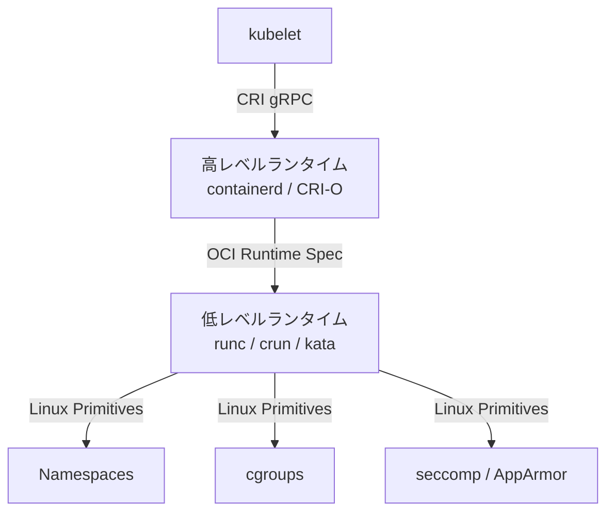

---

## 5. Podの設計 — 最小デプロイ単位の深い意味

### 5.1 なぜコンテナではなくPodなのか

Kubernetesがコンテナを直接管理するのではなく、**Pod** という抽象化を導入したのには明確な理由がある。

現実のアプリケーションは、しばしば複数のプロセスが密に連携して動作する。Webサーバーとログ収集エージェント、アプリケーションとリバースプロキシ、メインプロセスとモニタリングエクスポーターなどである。これらのプロセスは以下を共有する必要がある。

- **ネットワーク名前空間**: localhost で通信できる
- **ストレージボリューム**: 同じファイルシステム領域を読み書きできる
- **IPC名前空間**: System V IPCやPOSIXメッセージキューを共有できる

Pod内のコンテナは、Linux Namespaceの一部を共有することでこの密結合を実現する。ネットワーク名前空間は共有されるが、PID名前空間やファイルシステムは（デフォルトでは）分離される。

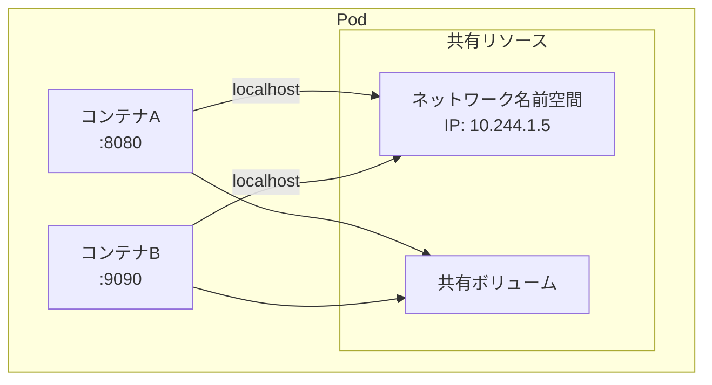

### 5.2 サイドカーパターン

**サイドカー（Sidecar）** は、メインコンテナの機能を補助するコンテナをPod内に配置するパターンである。メインのアプリケーションコードを変更することなく、横断的な関心事（ロギング、モニタリング、ネットワーキングなど）を追加できる。

代表的なサイドカーの用途は以下の通りである。

| 用途 | 例 |
|---|---|
| サービスメッシュプロキシ | Envoy（Istioのデータプレーン） |
| ログ収集 | Fluentd / Fluent Bit |
| メトリクスエクスポート | Prometheus Exporter |
| シークレット管理 | Vault Agent |
| 設定ファイルの動的更新 | ConfigMap Reloader |

Kubernetes 1.28からは **ネイティブサイドカーコンテナ** が正式にサポートされた。従来のサイドカーは通常のコンテナと同じライフサイクルで管理されていたが、ネイティブサイドカーは `initContainers` に `restartPolicy: Always` を指定することで、Init Containerとして起動しつつPodのライフサイクル全体にわたって稼働し続ける。

```yaml
apiVersion: v1
kind: Pod
metadata:
  name: app-with-sidecar
spec:
  initContainers:
  - name: log-agent
    image: fluent/fluent-bit:latest
    restartPolicy: Always  # native sidecar
    volumeMounts:
    - name: logs
      mountPath: /var/log/app
  containers:
  - name: app
    image: my-app:v1
    volumeMounts:
    - name: logs
      mountPath: /var/log/app
  volumes:
  - name: logs
    emptyDir: {}
```

この改善により、ジョブ型のPodにおいてサイドカーがメインコンテナの終了後も残り続ける問題が解消された。

### 5.3 Init Container

**Init Container** は、メインのアプリケーションコンテナが起動する前に実行される特殊なコンテナである。Init Containerはすべて成功裏に完了してから、アプリケーションコンテナが起動する。

Init Containerの典型的な用途には以下がある。

- **依存サービスの待機**: データベースやキャッシュが利用可能になるまで待つ
- **設定ファイルの生成**: テンプレートから環境固有の設定を生成する
- **スキーマのマイグレーション**: データベーススキーマを最新にアップデートする
- **セキュリティトークンの取得**: Vault などから一時的な認証情報を取得する

```yaml
apiVersion: v1
kind: Pod
spec:
  initContainers:
  - name: wait-for-db
    image: busybox:1.36
    command: ['sh', '-c', 'until nc -z postgres 5432; do sleep 2; done']
  - name: migrate
    image: my-app:v1
    command: ['./migrate', '--up']
  containers:
  - name: app
    image: my-app:v1
```

Init Containerは順番に実行され、前のInit Containerが正常に完了しなければ次は開始されない。この逐次実行の保証により、複雑な初期化手順を安全に記述できる。

---

## 6. Service, Ingress, NetworkPolicy

### 6.1 Service — 安定したネットワーク抽象

Podは一時的な存在であり、再起動やスケーリングのたびにIPアドレスが変わる。**Service** は、Pod群への安定したアクセスポイントを提供する抽象化である。Serviceは **ラベルセレクター** によってバックエンドのPodを動的に選択し、仮想IPアドレス（ClusterIP）やDNS名を通じてアクセスを可能にする。

Serviceには4つのタイプがある。

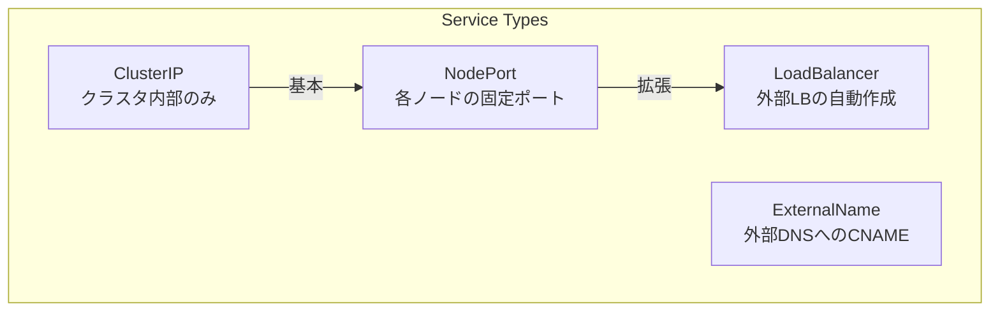

**ClusterIP（デフォルト）**: クラスタ内部でのみアクセス可能な仮想IPが割り当てられる。マイクロサービス間の通信に使用する。

```yaml
apiVersion: v1
kind: Service
metadata:
  name: backend
spec:
  type: ClusterIP
  selector:
    app: backend
  ports:
  - port: 80
    targetPort: 8080
```

**NodePort**: ClusterIPに加えて、すべてのノードの特定のポート（30000〜32767）でServiceを公開する。

**LoadBalancer**: クラウドプロバイダーの外部ロードバランサー（AWS ALB/NLB, GCP Cloud Load Balancerなど）を自動的にプロビジョニングする。

**ExternalName**: クラスタ外のサービスへのDNS CNAMEエイリアスを作成する。プロキシは行わず、DNS解決のみを提供する。

### 6.2 ServiceのDNS

Kubernetesクラスタ内では **CoreDNS** がDNSサーバーとして動作し、すべてのServiceに自動的にDNS名を割り当てる。

```
<service-name>.<namespace>.svc.cluster.local
```

同一Namespace内のPodからは、単にService名だけでアクセスできる。

```
# Same namespace
curl http://backend

# Cross namespace
curl http://backend.production.svc.cluster.local
```

**Headless Service** は `clusterIP: None` を指定したServiceであり、仮想IPを割り当てない。DNS問い合わせに対して個々のPodのIPアドレスが返される。StatefulSetと組み合わせて、各Podに安定したDNS名（`pod-0.headless-svc.ns.svc.cluster.local`）を提供するために使われる。

### 6.3 Ingress — L7トラフィック管理

**Ingress** は、クラスタ外部からのHTTP/HTTPSトラフィックをクラスタ内のServiceにルーティングする仕組みである。Ingressリソース自体はルーティングルールの宣言であり、実際のトラフィック処理は **Ingress Controller** が担う。

```yaml
apiVersion: networking.k8s.io/v1
kind: Ingress
metadata:
  name: app-ingress
  annotations:
    nginx.ingress.kubernetes.io/rewrite-target: /
spec:
  ingressClassName: nginx
  tls:
  - hosts:
    - app.example.com
    secretName: tls-secret
  rules:
  - host: app.example.com
    http:
      paths:
      - path: /api
        pathType: Prefix
        backend:
          service:
            name: api-service
            port:
              number: 80
      - path: /
        pathType: Prefix
        backend:
          service:
            name: frontend-service
            port:
              number: 80
```

主要なIngress Controllerには以下がある。

- **NGINX Ingress Controller**: 最も広く使われているIngress Controller。NGINX をリバースプロキシとして使用
- **Traefik**: 自動的なLet's Encrypt証明書管理を備えた軽量Controller
- **AWS ALB Ingress Controller**: AWS Application Load Balancerを直接利用
- **Istio Gateway**: Istioサービスメッシュと統合されたゲートウェイ

::: tip Gateway API
Kubernetes 1.26以降、Ingressの後継として **Gateway API** が成熟しつつある。Gateway APIはIngressよりも表現力が高く、ロールベースのルート管理、ヘッダーベースルーティング、トラフィック分割などをネイティブにサポートする。新規のプロジェクトではGateway APIの採用を検討する価値がある。
:::

### 6.4 NetworkPolicy — ネットワークレベルのアクセス制御

**NetworkPolicy** は、Pod間のネットワーク通信をファイアウォールのように制御するリソースである。デフォルトでは、Kubernetesクラスタ内のすべてのPodは互いに通信できる。NetworkPolicyを適用することで、特定のPodからの通信のみを許可する **ホワイトリスト型** の制御が可能になる。

```yaml
apiVersion: networking.k8s.io/v1
kind: NetworkPolicy
metadata:
  name: api-network-policy
  namespace: production
spec:
  podSelector:
    matchLabels:
      app: api-server
  policyTypes:
  - Ingress
  - Egress
  ingress:
  - from:
    - namespaceSelector:
        matchLabels:
          env: production
    - podSelector:
        matchLabels:
          role: frontend
    ports:
    - protocol: TCP
      port: 8080
  egress:
  - to:
    - podSelector:
        matchLabels:
          app: database
    ports:
    - protocol: TCP
      port: 5432
```

NetworkPolicyの実装はCNIプラグインに依存する。Calico、Cilium、Weave Netなどが対応しているが、Flannel単体ではNetworkPolicyをサポートしない点に注意が必要である。

---

## 7. ストレージ — PV/PVC, CSI

### 7.1 なぜストレージの抽象化が必要か

コンテナのファイルシステムはエフェメラル（一時的）である。コンテナが再起動されるとファイルシステムの変更は失われる。データベース、ファイルストレージ、キャッシュなど、永続的なデータを扱うワークロードでは、コンテナのライフサイクルから独立したストレージが必要になる。

Kubernetesは **PersistentVolume（PV）** と **PersistentVolumeClaim（PVC）** の2層構造でストレージを抽象化する。

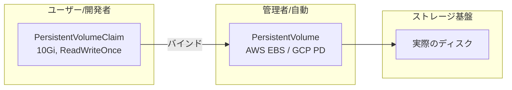

**PersistentVolume（PV）**: クラスタレベルのリソースであり、実際のストレージ（AWS EBS、GCP Persistent Disk、NFS、Ceph RBDなど）を表現する。管理者が手動で作成するか、StorageClassによって動的にプロビジョニングされる。

**PersistentVolumeClaim（PVC）**: ユーザーが必要とするストレージの「要求」を表現する。容量、アクセスモード（ReadWriteOnce, ReadOnlyMany, ReadWriteMany）、StorageClassを指定する。KubernetesはPVCに一致するPVを自動的にバインドする。

### 7.2 StorageClass と動的プロビジョニング

**StorageClass** は、PVを動的に作成するためのテンプレートである。PVCが作成されると、指定されたStorageClassに基づいてストレージプロバイダーが自動的にPVを作成する。

```yaml
apiVersion: storage.k8s.io/v1
kind: StorageClass
metadata:
  name: fast-ssd
provisioner: ebs.csi.aws.com
parameters:
  type: gp3
  iops: "5000"
  throughput: "250"
reclaimPolicy: Delete
volumeBindingMode: WaitForFirstConsumer
allowVolumeExpansion: true
```

`volumeBindingMode: WaitForFirstConsumer` は重要な設定である。これにより、PVのプロビジョニングがPodのスケジューリングまで遅延される。トポロジー制約（アベイラビリティゾーンなど）を考慮して、Podが実際にスケジュールされるノードと同じゾーンにボリュームが作成される。

### 7.3 CSI（Container Storage Interface）

**CSI** は、Kubernetesとストレージプロバイダーをつなぐプラグインインターフェースの標準仕様である。CSI以前は、ストレージドライバーがKubernetes本体のコードツリーに含まれており（in-tree plugin）、新しいストレージの追加にはKubernetesのリリースサイクルに合わせる必要があった。

CSIの導入により、ストレージベンダーは独立してプラグインを開発・リリースできるようになった。CSIドライバーは通常、以下の2つのコンポーネントで構成される。

- **Controller Plugin**: PVの作成・削除・スナップショットなどをストレージバックエンドに指示する。DaemonSetまたはDeploymentとしてデプロイされる
- **Node Plugin**: 各ノード上でボリュームのアタッチ・マウントを行う。DaemonSetとしてデプロイされる

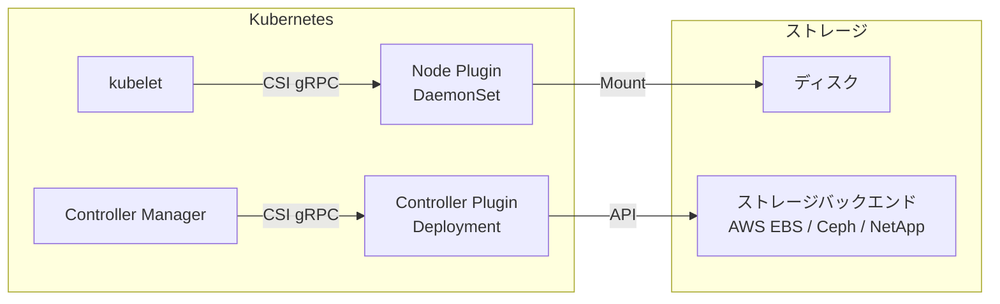

### 7.4 StatefulSet とステートフルワークロード

**StatefulSet** は、ステートフルなアプリケーション（データベース、メッセージキューなど）のために設計されたWorkloadリソースである。通常のDeployment/ReplicaSetとは異なり、以下の保証を提供する。

- **安定したネットワーク識別子**: 各Podに `<name>-0`, `<name>-1`, ... という予測可能な名前が付与される
- **安定した永続ストレージ**: `volumeClaimTemplates` により、各PodにPVCが自動的に作成・紐付けされる。Podが削除されてもPVCは保持される
- **順序付きデプロイと削除**: Podは0番から順に作成され、逆順に削除される

```yaml
apiVersion: apps/v1
kind: StatefulSet
metadata:
  name: postgres
spec:
  serviceName: postgres-headless
  replicas: 3
  selector:
    matchLabels:
      app: postgres
  template:
    metadata:
      labels:
        app: postgres
    spec:
      containers:
      - name: postgres
        image: postgres:16
        ports:
        - containerPort: 5432
        volumeMounts:
        - name: data
          mountPath: /var/lib/postgresql/data
  volumeClaimTemplates:
  - metadata:
      name: data
    spec:
      accessModes: ["ReadWriteOnce"]
      storageClassName: fast-ssd
      resources:
        requests:
          storage: 100Gi
```

---

## 8. RBAC, ServiceAccount, SecurityContext

### 8.1 RBAC — 誰が何をできるかの制御

**RBAC（Role-Based Access Control）** は、Kubernetesにおける標準的な認可メカニズムである。RBACは4つのリソースで構成される。

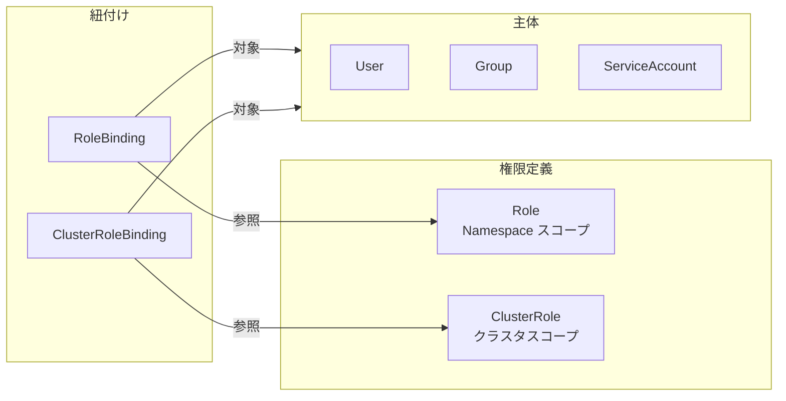

**Role / ClusterRole**: 許可される操作（verb）と対象リソースの組み合わせを定義する。Roleは特定のNamespace内でのみ有効、ClusterRoleはクラスタ全体で有効である。

```yaml
apiVersion: rbac.authorization.k8s.io/v1
kind: Role
metadata:
  namespace: production
  name: pod-reader
rules:
- apiGroups: [""]
  resources: ["pods"]
  verbs: ["get", "watch", "list"]
- apiGroups: [""]
  resources: ["pods/log"]
  verbs: ["get"]
```

**RoleBinding / ClusterRoleBinding**: RoleまたはClusterRoleをUser、Group、ServiceAccountに紐付ける。

```yaml
apiVersion: rbac.authorization.k8s.io/v1
kind: RoleBinding
metadata:
  name: read-pods
  namespace: production
subjects:
- kind: ServiceAccount
  name: monitoring-agent
  namespace: monitoring
roleRef:
  kind: Role
  name: pod-reader
  apiGroup: rbac.authorization.k8s.io
```

RBACの設計原則は **最小権限（Least Privilege）** である。必要最小限の権限のみを付与し、ワイルドカード（`*`）の使用を避けることが推奨される。

### 8.2 ServiceAccount — Podのアイデンティティ

**ServiceAccount** は、Pod内で動作するプロセスにKubernetes APIへのアクセスを許可するためのアイデンティティである。各Namespaceに `default` ServiceAccountが自動作成され、明示的に指定しない限りPodはこのdefault ServiceAccountで動作する。

Kubernetes 1.24以降、ServiceAccountに自動的にマウントされるトークンは **Bound Service Account Token** となった。これは有効期限付き（デフォルト1時間）のJWTであり、特定のPodとServiceAccountにバインドされる。以前の自動マウントされる永続的なSecret-basedトークンは廃止された。

```yaml
apiVersion: v1
kind: ServiceAccount
metadata:
  name: app-sa
  namespace: production
  annotations:
    # AWS IAM Roles for Service Accounts (IRSA)
    eks.amazonaws.com/role-arn: arn:aws:iam::123456789012:role/app-role
automountServiceAccountToken: false  # explicit opt-in
```

### 8.3 SecurityContext — コンテナレベルのセキュリティ

**SecurityContext** は、PodおよびコンテナレベルでLinuxのセキュリティ機能を制御する。

```yaml
apiVersion: v1
kind: Pod
metadata:
  name: secure-pod
spec:
  securityContext:
    runAsNonRoot: true
    runAsUser: 1000
    runAsGroup: 1000
    fsGroup: 2000
    seccompProfile:
      type: RuntimeDefault
  containers:
  - name: app
    image: my-app:v1
    securityContext:
      allowPrivilegeEscalation: false
      readOnlyRootFilesystem: true
      capabilities:
        drop:
          - ALL
        add:
          - NET_BIND_SERVICE
```

主要な設定項目は以下の通りである。

| 設定 | 説明 |
|---|---|
| `runAsNonRoot` | rootユーザーでの実行を禁止する |
| `readOnlyRootFilesystem` | ルートファイルシステムを読み取り専用にする |
| `allowPrivilegeEscalation` | setuid/setgidによる権限昇格を禁止する |
| `capabilities` | Linuxケーパビリティの追加・削除を制御する |
| `seccompProfile` | システムコールのフィルタリングプロファイルを指定する |
| `seLinuxOptions` | SELinuxのコンテキストを設定する |

::: warning Pod Security Standards
Kubernetes 1.25からは **Pod Security Admission** が標準で有効化されている。これはNamespaceレベルで `privileged`、`baseline`、`restricted` の3段階のセキュリティポリシーを適用する仕組みであり、非推奨となったPodSecurityPolicy（PSP）の後継である。本番環境では `restricted` プロファイルの適用が推奨される。
:::

---

## 9. カスタムリソースとOperatorパターン

### 9.1 CRD — KubernetesのAPIを拡張する

Kubernetesの最も強力な特徴の一つが、**Custom Resource Definition（CRD）** によるAPI拡張である。CRDを使うと、Kubernetes API Serverに新しいリソースタイプを追加できる。Pod、Service、Deploymentと同じように、kubectl で操作でき、etcdに永続化され、RBACで権限を管理できる。

```yaml
apiVersion: apiextensions.k8s.io/v1
kind: CustomResourceDefinition
metadata:
  name: databases.example.com
spec:
  group: example.com
  versions:
  - name: v1
    served: true
    storage: true
    schema:
      openAPIV3Schema:
        type: object
        properties:
          spec:
            type: object
            properties:
              engine:
                type: string
                enum: ["postgres", "mysql"]
              version:
                type: string
              replicas:
                type: integer
                minimum: 1
                maximum: 5
              storage:
                type: string
    additionalPrinterColumns:
    - name: Engine
      type: string
      jsonPath: .spec.engine
    - name: Version
      type: string
      jsonPath: .spec.version
    - name: Replicas
      type: integer
      jsonPath: .spec.replicas
  scope: Namespaced
  names:
    plural: databases
    singular: database
    kind: Database
    shortNames:
    - db
```

CRDを適用すると、以下のように利用できるようになる。

```yaml
apiVersion: example.com/v1
kind: Database
metadata:
  name: production-db
spec:
  engine: postgres
  version: "16"
  replicas: 3
  storage: "500Gi"
```

### 9.2 Operatorパターン — ドメイン知識の自動化

**Operator** は、CRDとカスタムコントローラーを組み合わせて、複雑なアプリケーションのライフサイクル管理を自動化するパターンである。Operatorの核心は、**人間のオペレーターの運用知識をソフトウェアとしてエンコードする** ことにある。

例えば、PostgreSQLクラスタのOperatorは以下のような運用知識を実装する。

- 新しいレプリカを追加する際のストリーミングレプリケーションの設定
- プライマリが障害を起こした場合の自動フェイルオーバー
- バックアップの定期実行とリストア
- マイナーバージョンのローリングアップグレード
- コネクションプーリング（PgBouncer）の自動設定

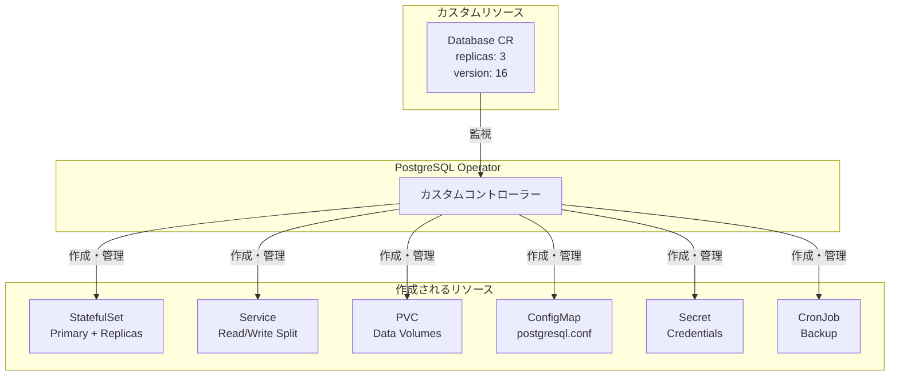

代表的なOperatorには以下がある。

| Operator | 管理対象 |
|---|---|
| **CloudNativePG** | PostgreSQL |
| **Strimzi** | Apache Kafka |
| **Prometheus Operator** | Prometheus / Alertmanager |
| **cert-manager** | TLS証明書（Let's Encrypt等） |
| **Crossplane** | クラウドインフラリソース |
| **ArgoCD** | GitOps CD パイプライン |

### 9.3 Operatorの実装フレームワーク

Operatorの開発を支援するフレームワークがいくつか存在する。

**Operator SDK / Kubebuilder**: Go言語でOperatorを開発するための公式ツール。controller-runtime ライブラリを基盤とし、Reconciliation Loopのボイラープレートを自動生成する。Kubebuilderが低レベルのフレームワーク、Operator SDKはKubebuilderの上に構築された高レベルのツールキットである。

**Metacontroller**: コントローラーのロジックをWebhook（任意の言語で実装可能）として定義する。Goが書けないチームでもOperatorを実装できる。

Operatorの実装において最も重要な原則は、**Reconciliation Loopを冪等にする** ことである。同じ入力に対して同じ結果を返し、途中で失敗しても再実行可能な設計にしなければならない。

---

## 10. 拡張性 — Admission Webhook, CRI, CNI, CSI

Kubernetesの設計思想において、**拡張性（Extensibility）** は中核的な原則である。Kubernetesは「プラットフォームのためのプラットフォーム」を自認しており、多くの機能が標準化されたインターフェースを通じてプラグイン可能になっている。

### 10.1 Admission Webhook

**Admission Webhook** は、API ServerのAdmission Control段階にカスタムロジックを挿入する仕組みである。2種類のWebhookが用意されている。

**MutatingAdmissionWebhook**: リクエストの内容を変更できる。例えば、すべてのPodにサイドカーコンテナを自動注入したり、デフォルトのリソースリミットを設定したり、特定のラベルを追加したりする。Istioのサイドカー自動注入はこの仕組みを利用している。

**ValidatingAdmissionWebhook**: リクエストの内容を検証し、ポリシーに違反するリクエストを拒否する。例えば、特定のコンテナレジストリからのイメージのみを許可したり、リソースリミットの設定を強制したりする。

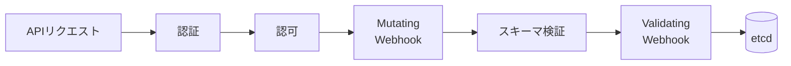

```yaml
apiVersion: admissionregistration.k8s.io/v1
kind: MutatingWebhookConfiguration
metadata:
  name: inject-sidecar
webhooks:
- name: sidecar.example.com
  admissionReviewVersions: ["v1"]
  clientConfig:
    service:
      name: sidecar-injector
      namespace: system
      path: /inject
  rules:
  - operations: ["CREATE"]
    apiGroups: [""]
    apiVersions: ["v1"]
    resources: ["pods"]
  namespaceSelector:
    matchLabels:
      sidecar-injection: enabled
  sideEffects: None
  failurePolicy: Fail
```

::: tip Validating Admission Policy
Kubernetes 1.30で **Validating Admission Policy** がGAとなった。これはWebhookサーバーを必要とせず、**CEL（Common Expression Language）** を使ってインラインでバリデーションルールを記述できる仕組みである。Webhook方式よりもレイテンシが低く、運用が簡素化される。

```yaml
apiVersion: admissionregistration.k8s.io/v1
kind: ValidatingAdmissionPolicy
metadata:
  name: require-resource-limits
spec:
  matchConstraints:
    resourceRules:
    - apiGroups: [""]
      apiVersions: ["v1"]
      operations: ["CREATE", "UPDATE"]
      resources: ["pods"]
  validations:
  - expression: >-
      object.spec.containers.all(c,
        has(c.resources) && has(c.resources.limits) &&
        has(c.resources.limits.cpu) && has(c.resources.limits.memory))
    message: "All containers must have CPU and memory limits"
```
:::

### 10.2 CRI（Container Runtime Interface）

**CRI** は kubelet と Container Runtime の間のgRPCインターフェースである。CRIは2つのサービスを定義する。

- **RuntimeService**: コンテナとPodサンドボックスのライフサイクル管理（作成、開始、停止、削除、ステータス取得）
- **ImageService**: コンテナイメージのプル、一覧取得、削除

CRIの導入により、Docker以外のランタイム（containerd、CRI-O）が対等にサポートされるようになった。さらに、kata-containersやgVisorのようなセキュリティ強化型ランタイムも、CRIを通じて透過的に利用できる。**RuntimeClass** リソースを使うことで、Pod単位で使用するランタイムを切り替えることも可能である。

```yaml
apiVersion: node.k8s.io/v1
kind: RuntimeClass
metadata:
  name: kata
handler: kata
---
apiVersion: v1
kind: Pod
metadata:
  name: secure-workload
spec:
  runtimeClassName: kata
  containers:
  - name: app
    image: my-app:v1
```

### 10.3 CNI（Container Network Interface）

**CNI** は、コンテナのネットワーク接続を管理するプラグインインターフェースである。kubeletがPodを作成する際、CNIプラグインが呼び出されてネットワーク名前空間の設定、IPアドレスの割り当て、ルーティングルールの設定が行われる。

主要なCNIプラグインは以下の通りである。

| プラグイン | 特徴 |
|---|---|
| **Calico** | BGPベースのルーティング。NetworkPolicy対応。大規模環境で実績豊富 |
| **Cilium** | eBPFベース。L3/L4/L7のネットワークポリシー。Observability機能が充実 |
| **Flannel** | VXLANベースのオーバーレイ。シンプルだがNetworkPolicy非対応 |
| **Weave Net** | メッシュ型オーバーレイ。暗号化通信をサポート |
| **AWS VPC CNI** | AWS VPCのENIを直接利用。VPCネイティブなIPアドレス割り当て |

CNIプラグインの選択はクラスタの設計に大きな影響を与える。パフォーマンス要件、NetworkPolicyの必要性、クラウドプロバイダーとの統合、Observabilityの要件などを総合的に判断する必要がある。

### 10.4 CSI（Container Storage Interface）

CSIについてはセクション7.3で詳述した。CSIはストレージプロバイダーがKubernetesと連携するための標準インターフェースであり、ボリュームのプロビジョニング、アタッチ、マウント、スナップショット、リサイズなどの操作を定義する。

### 10.5 拡張ポイントの全体像

Kubernetesの拡張ポイントを整理すると、以下のような階層構造になる。

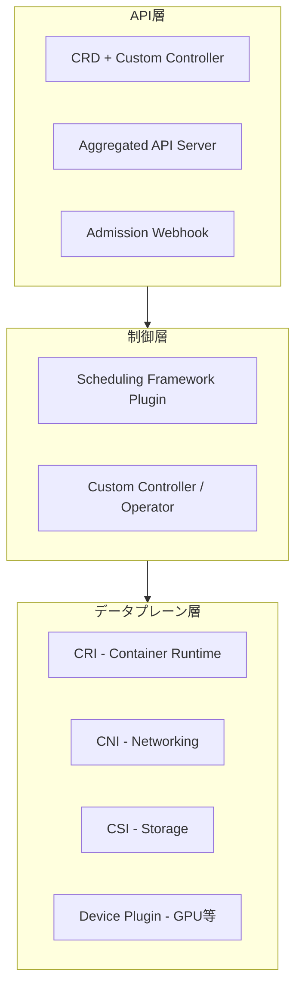

| 拡張ポイント | 何を拡張するか | 例 |
|---|---|---|
| CRD + Controller | 新しいリソースタイプの追加 | Database, Certificate |
| Admission Webhook | APIリクエストの検証・変更 | サイドカー注入, ポリシー適用 |
| Scheduling Framework | スケジューリングアルゴリズム | GPU-awareスケジューリング |
| CRI | コンテナランタイム | containerd, CRI-O, kata |
| CNI | ネットワーク | Calico, Cilium, Flannel |
| CSI | ストレージ | EBS CSI, Ceph CSI |
| Device Plugin | ハードウェアデバイス | NVIDIA GPU, FPGA, SR-IOV |

この多層的な拡張性こそが、Kubernetesが単なるコンテナオーケストレーターを超えて、**クラウドネイティブアプリケーションのプラットフォーム** として広く採用されている理由である。

---

## まとめ — Kubernetesの設計思想を振り返る

Kubernetesのアーキテクチャは、いくつかの根本的な設計原則に基づいている。

**宣言的API**: ユーザーは「あるべき状態」を宣言し、システムがそれを実現する。命令的な手順の記述は不要であり、一時的な障害からの自動復旧が組み込まれている。

**Reconciliation Loop**: すべてのコントローラーは「観察→差分検出→行動」のループを繰り返す。レベルトリガー方式により、イベントの欠落に対しても頑健である。

**疎結合な設計**: コンポーネント間の通信はすべてAPI Serverを介して行われ、各コンポーネントは自分の責務だけを気にすればよい。この設計により、個々のコンポーネントを独立して開発・テスト・デプロイできる。

**プラグインアーキテクチャ**: CRI、CNI、CSI、Admission Webhook、Scheduling Frameworkなど、多くの機能がプラグインとして差し替え可能である。Kubernetes本体はコアの抽象化に集中し、具体的な実装はプラグインに委ねる。

**Borgの教訓の継承と進化**: Pod、宣言的API、ラベルとセレクターによるサービスディスカバリなど、Borgの実運用から得られた教訓を継承しつつ、その限界を克服する設計が随所に見られる。

これらの設計原則が組み合わさることで、Kubernetesは小規模な開発環境から数千ノードの大規模本番環境まで、幅広いスケールで動作するプラットフォームとなっている。その複雑さゆえに学習曲線は決して緩やかではないが、各コンポーネントの役割と設計思想を理解すれば、Kubernetesの振る舞いは論理的に予測可能なものとなる。
