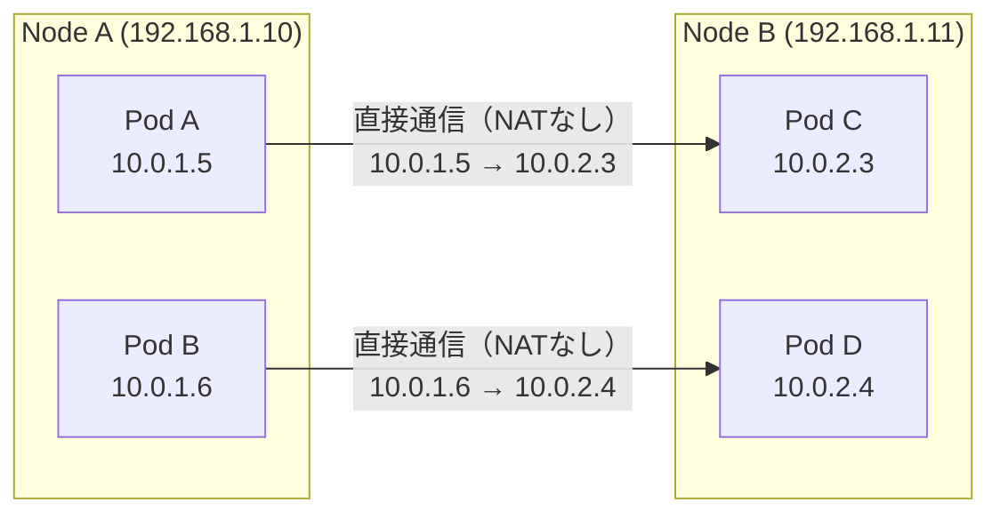
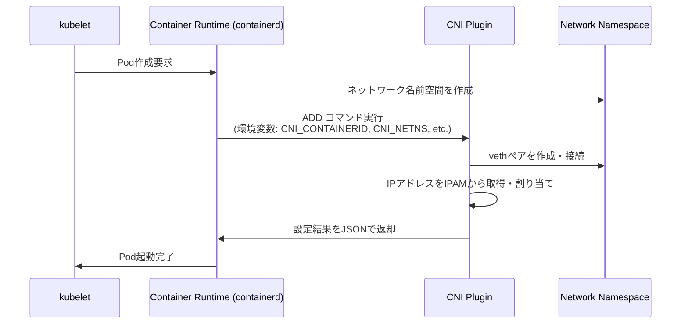
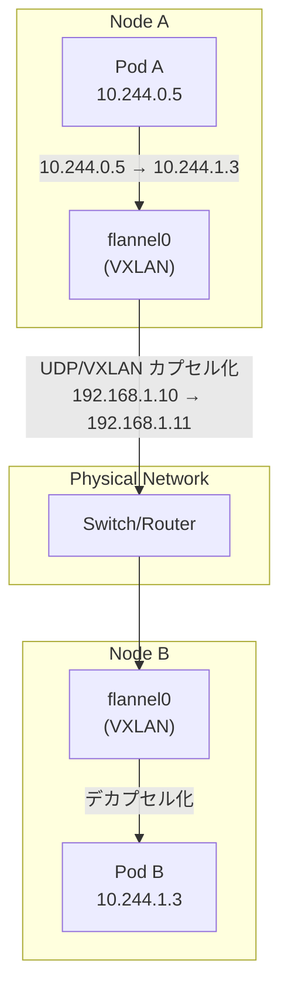
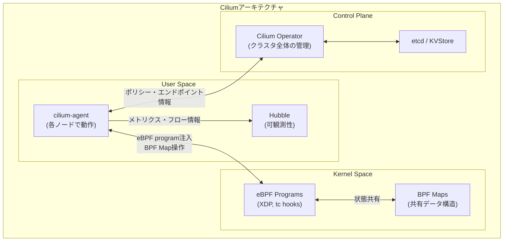
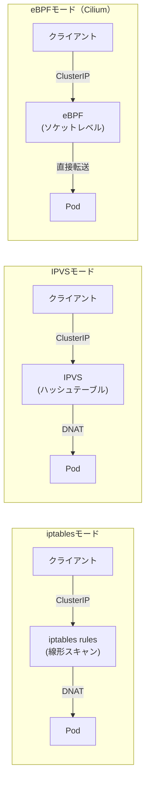
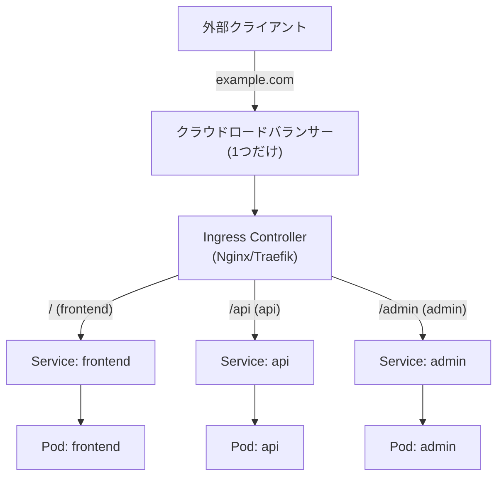
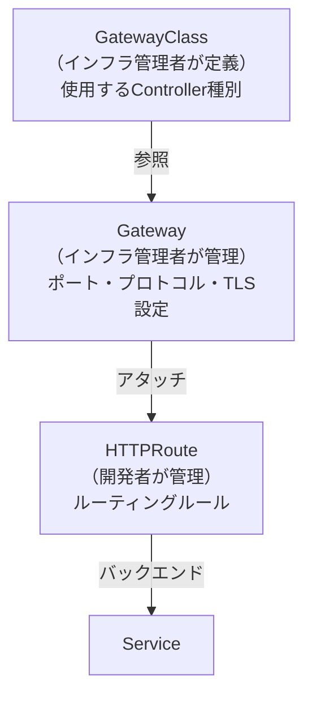
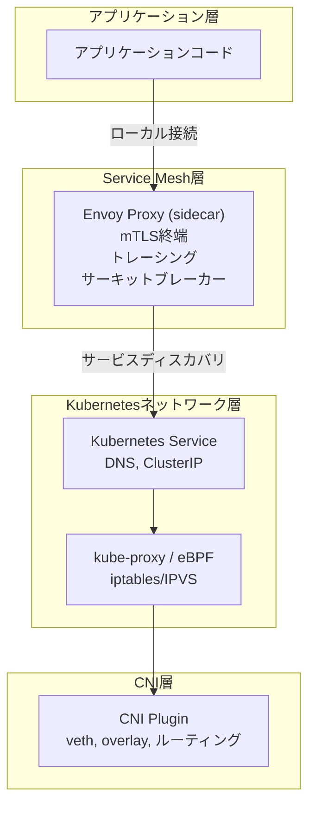
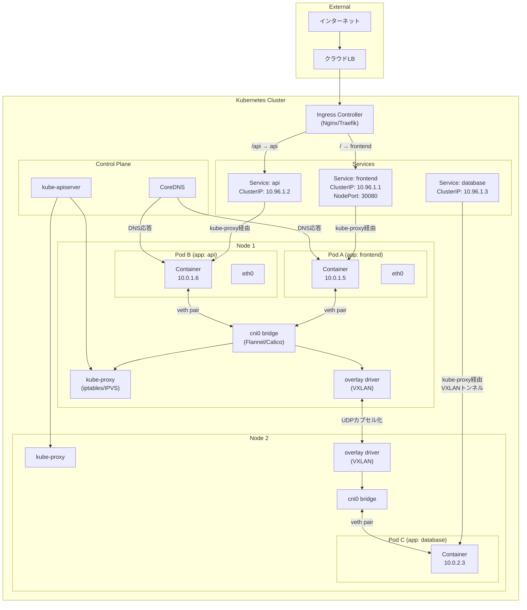

# Kubernetes Networking（CNI, Service, Ingress）

## 1. Kubernetesネットワークモデルの基本原則

### 1.1 なぜ専用のネットワークモデルが必要なのか

Kubernetesはコンテナオーケストレーターとして、数十から数千のコンテナを複数のホストマシンにまたがって実行する。このとき、単純にDockerのデフォルトネットワーク（172.17.0.0/16 のブリッジネットワーク）を使うと深刻な問題が生じる。

異なるホスト上の2つのコンテナが、偶然同じIPアドレス（例：172.17.0.5）を持ってしまう。コンテナ同士が通信しようとしても、相手を一意に特定できない。ホストのポートをマッピングする方式ならIPの衝突は回避できるが、どのコンテナがどのホストのどのポートを使っているかを管理する仕組みが別途必要になり、運用が複雑化する。

Kubernetesはこの問題を解決するために、明確なネットワークモデルを定義した。

### 1.2 Kubernetesネットワークモデルの4つの要件

Kubernetesのネットワークモデルは以下の4つの基本原則から構成される。

**原則1: Podは一意のIPアドレスを持つ**
クラスタ内のすべてのPodは、クラスタ全体でユニークなIPアドレスを持つ。ホストのIPとは独立した、Podだけのアドレス空間が存在する。

**原則2: Pod間はNATなしに通信できる**
あるPodから別のPodへ通信するとき、送信元IPアドレスが変換（NAT）されてはならない。PodAが自分のIPアドレス 10.0.1.5 を持ち、PodBへパケットを送るとき、PodBから見た送信元IPは 10.0.1.5 でなければならない。

**原則3: ノードからPodへNATなしに通信できる**
クラスタのノード（ホストマシン）から任意のPodへ、IPアドレス変換なしに到達できる必要がある。

**原則4: Podが自分自身を認識するIPは、他のPodから見るIPと同じである**
Podが `hostname -i` などで自身のIPを調べると、他のPodが通信に使うIPと一致する。NATが存在しないことをPod自身も確認できる。



このモデルは**フラットネットワーク**と呼ばれる。すべてのPodが単一の大きなL3ネットワーク上に存在するかのように動作する。物理的には複数のノードに分散しているが、ネットワークの観点からは同一セグメント上にいるように見える。

### 1.3 フラットネットワークがもたらす利点

フラットネットワークモデルは設計をシンプルにする。アプリケーション開発者は通信先のPod IPを直接指定できる。ポートマッピングの衝突を考慮する必要がない。分散トレーシングやサービスメッシュがソースIPを正確に把握できる。

ただし、このモデルはKubernetesが「要件として定義」しているだけで、その実現方法は指定していない。具体的な実装はCNIプラグインに委ねられている。

---

## 2. CNI（Container Network Interface）

### 2.1 CNIとは何か

CNI（Container Network Interface）は、Linuxコンテナにネットワーク接続を提供するための**仕様とライブラリのセット**だ。2016年にCNCF（Cloud Native Computing Foundation）プロジェクトとなり、Kubernetesだけでなくrkt、OpenShiftなど多くのコンテナランタイムで採用されている。

CNIの中心的な思想は**責務の分離**だ。コンテナランタイム（kubeletがcriを通じて呼び出す containerd など）はコンテナのライフサイクル管理に専念し、ネットワーク設定はCNIプラグインという外部プログラムに任せる。

### 2.2 CNIプラグインの動作原理

Podが作成されるとき、以下の流れでネットワークが設定される。



CNIプラグインは単純な実行ファイルだ。kubeletから標準入力でJSONの設定を受け取り、環境変数でコンテナIDやネットワーク名前空間のパスを受け取る。実行が成功すると、割り当てたIPアドレスなどの情報をJSON形式で標準出力に返す。

CNIには主要な2つの操作がある。
- `ADD`: コンテナをネットワークに接続する
- `DEL`: コンテナをネットワークから切り離す

### 2.3 Pod ネットワーキングの実装詳細

Podのネットワーク設定の核心は**veth（virtual Ethernet）ペア**だ。vethはLinuxカーネルが提供する仮想ネットワークデバイスで、常にペアで作成される。片方に入ったパケットはもう片方から出てくる、仮想的なイーサネットケーブルのようなものだ。

```
Pod内部                          ホスト側
┌─────────────────┐             ┌──────────────────────────┐
│  eth0           │             │  vethXXXXXX              │
│  10.0.1.5/24    │◄───────────►│  (no IP / bridge接続)    │
│                 │  vethペア   │                          │
└─────────────────┘             └────────────┬─────────────┘
                                             │
                                ┌────────────▼─────────────┐
                                │  cni0 (bridge)           │
                                │  10.0.1.1/24             │
                                └────────────┬─────────────┘
                                             │
                                         ルーティング
```

具体的な手順は以下のとおりだ。

1. **ネットワーク名前空間の作成**: コンテナランタイムがPod用の独立したネットワーク名前空間を作成する
2. **vethペアの作成**: CNIプラグインがvethペアを作成し、一方をPodのネットワーク名前空間内に移動して `eth0` として設定する
3. **IPアドレスの割り当て**: IPAM（IP Address Management）サブプラグインがIPアドレスを割り当て、Podのeth0に設定する
4. **ブリッジへの接続**: ホスト側のvethをブリッジ（cni0など）に接続する
5. **ルーティングの設定**: 他のノードのPodへのルートを設定する

同一ノード内のPod間通信は、このブリッジを経由して行われる。異なるノード間の通信には、さらにオーバーレイネットワークやルーティングプロトコルが必要になる。

### 2.4 主要CNIプラグインの比較

#### Flannel

Flannelは最もシンプルなCNIプラグインの一つだ。Meta（旧CoreOS）が開発し、学習コストの低さと安定性で知られる。

Flannelの仕組みはシンプルだ。各ノードにサブネット（例: 10.244.0.0/24, 10.244.1.0/24）を割り当て、ノード間通信を**VXLANカプセル化**でトンネリングする。VXLANはUDPパケット内にL2フレームをカプセル化するオーバーレイネットワーク技術で、物理ネットワークの構成を問わずL2的な通信を実現する。



Flannelの長所は設定が簡単で、小〜中規模クラスタで安定して動作すること。短所は高度なセキュリティ機能（NetworkPolicy）をネイティブサポートしていないこと（NetworkPolicyには別途プラグインが必要）、VXLANのオーバーヘッドがあること。

#### Calico

CalicoはProjectCalico（Tigera）が開発するCNIプラグインで、**ネットワークポリシー**のサポートと高いパフォーマンスが特徴だ。大規模本番環境での採用実績も豊富。

Calicoのデフォルトモードは**BGP（Border Gateway Protocol）ルーティング**だ。各ノードでBGPを動作させ、ノード間のルート情報を交換する。VXLANのようなカプセル化を使わず、ネイティブのIPルーティングでPod間通信を実現するため、パフォーマンスのオーバーヘッドが小さい。

ただしBGPを使うには、物理ネットワーク機器がBGPに対応しているか、BGPルートリフレクターを設置する必要がある。L3ネットワークが必要で、同じL2セグメントにすべてのノードがいる必要はない。BGPが使えない環境ではIPIP（IP-in-IP）やVXLANモードも選択できる。

NetworkPolicyのサポートが充実しており、Kubernetes標準のNetworkPolicyに加えて、Calicoは独自の拡張ポリシー（GlobalNetworkPolicyなど）も提供する。

#### Cilium

CiliumはIsovalent（現Cisco傘下）が開発するCNIプラグインで、**eBPF（extended Berkeley Packet Filter）**を活用した次世代のアーキテクチャが特徴だ。2022年以降、KubernetesのGoogle KubernetesEngine（GKE）のデフォルトCNIとなるなど、急速に採用が拡大している。

eBPFとは、Linuxカーネル内で安全にプログラムを実行できる仕組みだ。ネットワーク処理、セキュリティポリシーの適用、可観測性の収集など、本来カーネルモジュールで行っていた処理をユーザー空間から動的にカーネルに注入できる。

Ciliumはiptablesを一切使わずにeBPFだけでパケット処理を行う。これにより以下の利点を得る。

- **高いパフォーマンス**: iptablesのルール数に比例してスキャンコストが増大する問題がない。数万のServiceが存在しても処理速度が低下しない
- **L7ポリシー**: HTTPメソッド、URLパス、gRPCメソッドなどL7レベルのポリシーを適用できる
- **透明な暗号化**: WireGuardを使ったmTLSをアプリケーションに透過的に提供できる
- **Hubble**: eBPFを活用したネットワーク可観測性プラットフォームが統合されている



| 比較項目 | Flannel | Calico | Cilium |
|---|---|---|---|
| データプレーン | VXLAN | BGP / IPIP | eBPF |
| NetworkPolicy | 非対応 | 対応（拡張あり） | 対応（L7も可） |
| パフォーマンス | 中 | 高 | 最高 |
| 設定の複雑さ | 低 | 中 | 中〜高 |
| 可観測性 | 低 | 中 | 高（Hubble） |
| 主なユースケース | 学習・小規模 | 大規模本番 | 高性能・セキュリティ重視 |

---

## 3. Service の仕組みと種類

### 3.1 なぜ Service が必要か

Podは一時的な存在だ。スケールアウト・インやローリングアップデート、障害による再起動など、Podは頻繁に作成・削除される。そのたびにPodのIPアドレスは変わる。

クライアントがPodのIPを直接知っていると、Pod再起動のたびに接続先を更新しなければならない。また、複数のPodレプリカに対してロードバランシングを行いたい場合も、クライアントが全レプリカのIPを管理する必要が生じる。

**Service**はこの問題を解決する抽象レイヤーだ。Serviceは安定したIPアドレス（ClusterIP）とDNS名を提供し、背後のPodが変わっても同じエンドポイントでアクセスできる。

### 3.2 kube-proxyの動作モード

ServiceはKubernetesのコントロールプレーンが管理する抽象概念だが、実際のトラフィック転送はノード上で動作する**kube-proxy**が担う。

kube-proxyはDaemonSet（全ノードで動作するPod）として動作し、Kubernetes APIを監視してServiceとEndpointの変更を検知する。変更を検知すると、ノードのネットワーク設定を更新してトラフィックルーティングを実現する。

#### iptablesモード（デフォルト）

最も一般的なモードで、Linuxのiptablesルールを使ってパケットをリダイレクトする。

```
クライアントPod → Service ClusterIP:Port
                    ↓ iptables PREROUTING チェーン
                    ↓ KUBE-SERVICES チェーン
                    ↓ KUBE-SVC-XXXXXXXX チェーン（Serviceに対応）
                    ↓ ランダムに選択（確率的マッチング）
                    ↓ KUBE-SEP-XXXXXXXX チェーン（特定のEndpoint）
                    ↓ DNAT（宛先IPをPod IPに変換）
                → Pod IP:TargetPort
```

kube-proxyはServiceとEndpointの変更があるたびに、対応するiptablesルールを追加・削除する。シンプルで広く使われているが、ルール数がServiceやEndpointの数に比例して増大するという問題がある。数千のServiceが存在すると、パケットごとに数万のiptablesルールを線形にスキャンする必要が生じ、パフォーマンスが劣化する。

#### IPVSモード

IPVS（IP Virtual Server）はLinuxカーネル組み込みの高性能な負荷分散機能だ。iptablesとは異なりハッシュテーブルを使ってルールを管理するため、**O(1)の時間複雑度**でルックアップができる。

IPVSモードではiptablesより多様なロードバランシングアルゴリズムを選択できる（ラウンドロビン、最小コネクション数、送信元IPハッシュなど）。大規模クラスタ（数万のService）では顕著なパフォーマンス差が出る。

IPVSを使うにはホストOSにIPVSカーネルモジュールが必要であり、すべての環境でデフォルトで利用可能ではない。

#### eBPFモード（Cilium独自）

CiliumのeBPFモードではkube-proxyを完全に置き換える。eBPFプログラムがソケットレベルでパケットをインターセプトし、カーネル内で直接宛先PodへのリダイレクトやDNATを処理する。iptablesを経由しないため、さらに低レイテンシで動作する。



### 3.3 Serviceの種類

#### ClusterIP

最も基本的なServiceタイプ。クラスタ内部でのみ使用できる仮想IPアドレスを提供する。デフォルトのタイプであり、マイクロサービス間の内部通信に使用する。

```yaml
apiVersion: v1
kind: Service
metadata:
  name: my-service
spec:
  type: ClusterIP  # デフォルト値
  selector:
    app: my-app   # このラベルを持つPodを選択
  ports:
    - protocol: TCP
      port: 80        # Serviceのポート
      targetPort: 8080  # PodのContainerポート
```

ClusterIPは`10.96.0.0/12`（デフォルト）の範囲から割り当てられる（PodのIPとは別のアドレス帯）。このIPはどのノードのどのNetworkインターフェースにも存在しない仮想的なIPで、kube-proxyのiptables/IPVSルールによってのみ機能する。

**Headless Service**: `clusterIP: None`と設定すると、仮想IPを持たないHeadless Serviceになる。DNSクエリに対して、背後のPod IPのリストを直接返す。StatefulSetと組み合わせてPodを個別に識別したい場合や、クライアントサイドの負荷分散が必要な場合に使用する。

#### NodePort

ClusterIPの機能に加えて、**各ノードの特定のポート**をServiceに割り当てる。外部から`<NodeIP>:<NodePort>`でアクセスできる。デフォルトで30000〜32767の範囲のポートが使用される。

```yaml
spec:
  type: NodePort
  ports:
    - port: 80
      targetPort: 8080
      nodePort: 30080  # 省略すると自動割り当て
```

NodePortは外部からアクセスする最もシンプルな方法だが、クライアントがどのノードにアクセスするかを決める必要があり、高可用性の確保が難しい。本番環境ではLoadBalancerやIngressを使うことが多い。

#### LoadBalancer

クラウドプロバイダーの**外部ロードバランサー**をプロビジョニングする。AWS ELB、GCP Cloud Load Balancing、Azure Load Balancerなどが対応している。

```yaml
spec:
  type: LoadBalancer
  ports:
    - port: 80
      targetPort: 8080
```

外部ロードバランサーが作成されると、Serviceに`status.loadBalancer.ingress`フィールドで外部IPが設定される。このIPはクラスタ外のクライアントが直接アクセスできる。

クラウド環境でServiceごとにLoadBalancerを作成すると、コストが増大する問題がある（LoadBalancerの数だけクラウドのロードバランサーリソースが消費される）。多数のServiceを外部公開する場合はIngressが経済的だ。

#### ExternalName

クラスタ内のServiceが**外部DNS名**を参照するためのマッピング。ServiceのClusterIPは割り当てられず、CNAMEレコードとして機能する。

```yaml
spec:
  type: ExternalName
  externalName: my-database.example.com
```

クラスタ内からこのServiceにアクセスすると、`my-database.example.com`へのCNAMEとして解決される。外部データベースやAPIをクラスタ内のService名でアクセスするパターンで使用する。環境ごとに接続先を切り替えたい場合（開発環境では内部DBを使い、本番では外部マネージドDBを使う）に有用。

### 3.4 EndpointSlice とエンドポイント管理

Serviceの背後にあるPodのIPとポートのセットは**Endpoint**（またはより新しいEndpointSlice）リソースとして管理される。kube-proxyはEndpointSliceを監視し、Podが追加・削除されるたびにルーティングルールを更新する。

Kubernetes 1.17以降で導入されたEndpointSliceは、1つのEndpointリソースに大量のPod IPを格納することによるetcdやkube-proxyの負荷増大問題を解決する。最大1000エントリをEndpointSliceごとに分散して管理することで、差分更新の効率を向上させる。

---

## 4. Ingress と Ingress Controller

### 4.1 Ingressが解決する問題

複数のWebサービスを外部公開したいとき、Serviceタイプ「LoadBalancer」を使うと、Serviceごとに個別のロードバランサーが作成される。AWSなら1つのALB/NLBが消費されるため、100個のServiceがあれば100個のロードバランサーが必要になり、コストが大きくなる。

また、ドメイン名によるルーティング（example.com/api → api-service、example.com/web → web-service）やTLS終端などのL7機能は、ClusterIPやNodePortでは対応できない。

**Ingress**はこれらの問題を解決するKubernetesリソースだ。1つのエントリポイントから複数のServiceへのルーティングを定義できる。

### 4.2 IngressリソースとIngress Controller

Ingressにはリソースとコントローラーの2つの概念がある。

**Ingressリソース**: ルーティングルールを定義するKubernetesオブジェクト。「このホスト名・パスへのリクエストは、このServiceの何番ポートに転送する」という設定を宣言的に記述する。

**Ingress Controller**: Ingressリソースを読み取り、実際のトラフィック制御を行うコンポーネント。KubernetesにはIngress Controllerが組み込まれておらず、別途インストールが必要だ。



Ingressリソースの例：

```yaml
apiVersion: networking.k8s.io/v1
kind: Ingress
metadata:
  name: my-ingress
  annotations:
    nginx.ingress.kubernetes.io/rewrite-target: /
spec:
  tls:
    - hosts:
        - example.com
      secretName: tls-secret  # TLS証明書を含むSecret
  rules:
    - host: example.com
      http:
        paths:
          - path: /api
            pathType: Prefix
            backend:
              service:
                name: api-service
                port:
                  number: 80
          - path: /
            pathType: Prefix
            backend:
              service:
                name: frontend-service
                port:
                  number: 80
```

### 4.3 主要なIngress Controller

#### Nginx Ingress Controller

最も広く使われているIngress Controllerで、KubernetesコミュニティがメンテナンスするKubernetes公式のもの（ingress-nginx）と、Nginx社がメンテナンスするもの（nginx-ingress）の2種類がある。

Nginx Ingress ControllerはIngressリソースの変更を監視し、Nginx設定ファイル（nginx.conf）を自動生成・再読み込みする。annotationsを使って細かい動作をカスタマイズできる（タイムアウト、レート制限、CORS設定など）。

#### Traefik

Go製の動的なリバースプロキシで、設定の自動検出と更新が得意だ。KubernetesのIngressやカスタムリソース（IngressRoute）を監視し、リアルタイムで設定を更新する。Nginxのような設定ファイルの再読み込みが不要で、ゼロダウンタイムで設定変更できる。

Let's Encrypt との統合が組み込みで提供されており、TLS証明書の自動発行・更新が容易だ。

#### HAProxy Ingress

HAProxyをベースとしたIngress Controllerで、高いパフォーマンスとTCPプロキシのサポートが特徴。L4（TCP）とL7（HTTP）の両方のルーティングが可能。

### 4.4 Gateway API — Ingressの次世代仕様

IngressリソースはシンプルなL7ルーティングには十分だが、高度なトラフィック管理（ヘッダーベースルーティング、トラフィック分割、TCPルーティング）には不十分だった。annotationsを使った拡張は実装ごとに異なり、移植性がなかった。

これらの問題を解決するために設計されたのが**Gateway API**だ（2023年にGA）。Gateway APIはIngressの後継として位置づけられ、より表現力豊かで移植性の高いAPIを提供する。

Gateway APIの主要リソースは以下の通り。



- **GatewayClass**: どのIngress Controllerを使うかの定義（インフラチームが管理）
- **Gateway**: リスナーポート、プロトコル、TLS設定（インフラチームが管理）
- **HTTPRoute / TCPRoute / GRPCRoute**: 具体的なルーティングルール（開発チームが管理）

役割に基づいてリソースを分離できるため、大規模組織での権限管理が容易になる。

```yaml
apiVersion: gateway.networking.k8s.io/v1
kind: HTTPRoute
metadata:
  name: api-route
spec:
  parentRefs:
    - name: main-gateway
  hostnames:
    - "example.com"
  rules:
    - matches:
        - path:
            type: PathPrefix
            value: /api
      # トラフィック分割（カナリアリリース）
      backendRefs:
        - name: api-service-v2
          port: 80
          weight: 10   # 10%のトラフィック
        - name: api-service-v1
          port: 80
          weight: 90   # 90%のトラフィック
```

---

## 5. DNS とサービスディスカバリ

### 5.1 CoreDNS の役割

Kubernetesはクラスタ内のDNS解決を**CoreDNS**が担う。CoreDNSはGo製のプラグイン可能なDNSサーバーで、2018年にKubeNetworkのデフォルトDNSとなった（それ以前はkube-dns）。

CoreDNSは通常、`kube-system`名前空間にDeploymentとServiceとしてデプロイされる。kubeletは各Podのresolv.confにCoreDNSのServiceのClusterIPをDNSサーバーとして設定する。

```
# /etc/resolv.conf (Podの中)
nameserver 10.96.0.10       # CoreDNSのClusterIP
search default.svc.cluster.local svc.cluster.local cluster.local
options ndots:5
```

### 5.2 Kubernetes DNSの命名規則

KubernetesのDNS名は以下の規則に従う。

**Serviceのフルドメイン名**:
```
<service-name>.<namespace>.svc.cluster.local
```

例えば`default`名前空間の`my-service`というServiceには以下でアクセスできる：
- 同じ名前空間から: `my-service`（search domainにより補完）
- 別の名前空間から: `my-service.default`
- クラスタ全体: `my-service.default.svc.cluster.local`

**PodのDNS名**（Headless Service使用時）:
```
<pod-ip-with-dashes>.<namespace>.pod.cluster.local
```

StatefulSetのPodは読みやすい名前が付く：
```
<statefulset-name>-<ordinal>.<service-name>.<namespace>.svc.cluster.local
```

例: `mysql-0.mysql-headless.default.svc.cluster.local`

### 5.3 CoreDNSの設定

CoreDNSはCorefile（設定ファイル）でプラグインチェーンを設定する。

```
# Corefile（ConfigMapとして管理）
.:53 {
    errors           # エラーログを標準エラーに出力
    health {         # ヘルスチェックエンドポイント
       lameduck 5s
    }
    ready            # readinessチェック用エンドポイント
    kubernetes cluster.local in-addr.arpa ip6.arpa {  # k8s DNS解決
       pods insecure
       fallthrough in-addr.arpa ip6.arpa
       ttl 30
    }
    prometheus :9153  # Prometheusメトリクスエクスポート
    forward . /etc/resolv.conf {  # 外部DNSへのフォワード
       max_concurrent 1000
    }
    cache 30          # TTL 30秒のキャッシュ
    loop              # ループ検出
    reload            # Corefileの自動リロード
    loadbalance       # A/AAAAレコードのランダム順序化
}
```

### 5.4 DNS TTLとパフォーマンスチューニング

KubernetesのServiceのDNSのTTLはデフォルト30秒だ。Podが新しいServiceを参照するとき、最初のルックアップはCoreDNSに到達するが、その後30秒間はPodのローカルキャッシュに保存される。

大規模クラスタではDNSルックアップが頻繁に行われるため、CoreDNSが負荷のボトルネックになる場合がある。解決策として以下が有効だ。

**NodeLocal DNSCache**: 各ノードでDNSキャッシュエージェントを動作させ、CoreDNSへのクエリ数を削減する。CoreDNSの負荷を減らし、DNS解決のレイテンシを改善する。

**ndots設定の最適化**: デフォルトの`ndots:5`はDNSルックアップ数を増やす原因になる。外部ドメインへのアクセス時にFQDN（末尾の`.`あり）を使用することで不要なsearch domainの試行を減らせる。

---

## 6. Network Policy とセキュリティ

### 6.1 デフォルトのセキュリティ状況

Kubernetesのデフォルトでは、**すべてのPodが相互に通信できる**。クラスタ内に存在するすべてのPodは、IPアドレスが分かれば無制限に通信できてしまう。これはマイクロサービスの観点から見ると、フロントエンドPodが直接データベースPodに接続できてしまうことを意味し、セキュリティ上の問題がある。

**NetworkPolicy**はこのデフォルトの挙動を制限し、Pod間の通信を細かく制御するためのKubernetesリソースだ。

### 6.2 NetworkPolicyの仕組み

NetworkPolicyはFirewallルールのようなものだ。どのPodが（`podSelector`）、どのPodから/への通信を（`ingress`/`egress`）、どのポートで許可するかを定義する。

```yaml
apiVersion: networking.k8s.io/v1
kind: NetworkPolicy
metadata:
  name: api-network-policy
  namespace: production
spec:
  podSelector:
    matchLabels:
      app: api  # このポリシーを適用するPod
  policyTypes:
    - Ingress
    - Egress
  ingress:
    - from:
        # frontendからのアクセスのみ許可
        - podSelector:
            matchLabels:
              app: frontend
      ports:
        - protocol: TCP
          port: 8080
  egress:
    - to:
        # databaseへのアクセスのみ許可
        - podSelector:
            matchLabels:
              app: database
      ports:
        - protocol: TCP
          port: 5432
    - to:
        # DNS解決のためkube-system名前空間のCoreDNSへのアクセスを許可
        - namespaceSelector:
            matchLabels:
              kubernetes.io/metadata.name: kube-system
      ports:
        - protocol: UDP
          port: 53
```

NetworkPolicyは**ホワイトリスト方式**だ。あるPodにNetworkPolicyが適用されると、そのPolicyで許可されていない通信はすべてブロックされる。複数のNetworkPolicyが適用される場合は、それらのOR（和集合）が有効なルールとなる。

> [!WARNING]
> NetworkPolicyはCNIプラグインがサポートしている場合のみ機能する。FlannelはNetworkPolicyをサポートしない。CalicoやCiliumを使用する必要がある。

### 6.3 デフォルト拒否ポリシーの実装

セキュリティのベストプラクティスとして、まず「すべての通信を拒否」するデフォルトポリシーを適用し、必要な通信のみを許可するアプローチが推奨される。

```yaml
# すべてのIngressをデフォルト拒否
apiVersion: networking.k8s.io/v1
kind: NetworkPolicy
metadata:
  name: default-deny-ingress
spec:
  podSelector: {}  # すべてのPodに適用
  policyTypes:
    - Ingress
---
# すべてのEgressをデフォルト拒否
apiVersion: networking.k8s.io/v1
kind: NetworkPolicy
metadata:
  name: default-deny-egress
spec:
  podSelector: {}
  policyTypes:
    - Egress
```

### 6.4 CiliumによるL7ポリシー

標準のNetworkPolicyはL3/L4レベルのフィルタリングのみ対応する。Ciliumはこれを拡張し、HTTPメソッド、URLパス、gRPCメソッドレベルでのポリシーを提供する。

```yaml
apiVersion: "cilium.io/v2"
kind: CiliumNetworkPolicy
metadata:
  name: l7-policy
spec:
  endpointSelector:
    matchLabels:
      app: api
  ingress:
    - fromEndpoints:
        - matchLabels:
            app: frontend
      toPorts:
        - ports:
            - port: "8080"
              protocol: TCP
          rules:
            http:
              # GETメソッドのみ許可
              - method: "GET"
                path: "/api/.*"
```

---

## 7. Service Mesh との関係

### 7.1 Kubernetesネットワークの限界

Kubernetesのネットワーク機能（Service, NetworkPolicy）は基本的なサービスディスカバリと粗いネットワーク制御を提供する。しかし本番運用で必要とされる以下の機能は提供しない。

- **mTLS（相互TLS）**: Pod間通信の暗号化とサービス認証
- **サーキットブレーカー**: 障害の伝播を防ぐ
- **リトライと タイムアウト**: 設定可能な再試行戦略
- **分散トレーシング**: リクエストの追跡
- **カナリアリリース**: 細かいトラフィック分割（Gateway APIの普及前）

### 7.2 Service Meshの補完関係

Service Mesh（IstioやLinkerdなど）はKubernetesのネットワーク機能の上位レイヤーとして動作する。Service MeshはKubernetesのServiceを置き換えるのではなく、その上に追加機能を重ねる。



Istioの場合、Pod内にEnvoyプロキシがsidecarとして注入される。アプリケーションのすべてのトラフィックはEnvoyを経由し、Envoyがmの暗号化、トレーシング、ポリシー適用を担う。アプリケーションコードは通信相手を通常のKubernetes Service名（`http://api-service`）で参照し続ける。

### 7.3 Ciliumのアプローチ

CiliumはService MeshとCNIの境界を曖昧にする方向に進んでいる。Cilium Service Meshは、従来のsidecarプロキシを使わずにeBPFとEnvoyをホストレベルで動作させることで、sidecarのオーバーヘッドなしにService Mesh機能を提供する。

このアプローチを**sidecarless Service Mesh**と呼ぶ。従来のService Meshではすべてのコンテナにsidecarが注入されるため、Podあたりのメモリオーバーヘッドが増加し、レイテンシも増加する。eBPFベースのアプローチではカーネルレベルで処理するため、このオーバーヘッドを大幅に削減できる。

---

## 8. 実践的なネットワークトラブルシューティング

### 8.1 Pod間通信の確認

Kubernetes Networkingのトラブルシューティングでは、どのレイヤーに問題があるかを段階的に切り分けることが重要だ。

```bash
# 対象Podに一時的なデバッグコンテナを起動
kubectl debug -it <pod-name> --image=nicolaka/netshoot --target=<container-name>

# Pod内からの疎通確認
ping <target-pod-ip>
curl http://<service-name>.<namespace>.svc.cluster.local:<port>

# DNSの確認
nslookup <service-name>
dig <service-name>.default.svc.cluster.local

# ルーティングテーブルの確認
ip route show
ip neigh show
```

### 8.2 kube-proxyのデバッグ

```bash
# kube-proxyのIPVSテーブルを確認（IPVSモードの場合）
kubectl exec -n kube-system -it $(kubectl get pod -n kube-system -l k8s-app=kube-proxy -o name | head -1) -- ipvsadm -Ln

# iptablesルールの確認（iptablesモードの場合）
kubectl exec -n kube-system -it $(kubectl get pod -n kube-system -l k8s-app=kube-proxy -o name | head -1) -- iptables -t nat -L KUBE-SERVICES -n --line-numbers

# EndpointSliceの確認
kubectl get endpointslices -n <namespace>
kubectl describe endpointslice <name> -n <namespace>
```

### 8.3 CNIの確認

```bash
# ノード上のvethペアを確認
ip link show type veth

# ブリッジの状態確認
bridge link show

# Ciliumの場合、エンドポイントの状態確認
kubectl exec -n kube-system cilium-<pod-id> -- cilium endpoint list
kubectl exec -n kube-system cilium-<pod-id> -- cilium monitor
```

### 8.4 NetworkPolicyのデバッグ

NetworkPolicyの問題は原因が分かりにくいことが多い。まず問題の切り分けを行う。

```bash
# NetworkPolicyを一時的に無効化して疎通確認（本番環境では注意）
# 問題のあるPodのNamespaceのNetworkPolicyを確認
kubectl get networkpolicies -n <namespace>
kubectl describe networkpolicy <name> -n <namespace>

# Ciliumの場合、ポリシーの確認
kubectl exec -n kube-system cilium-<pod-id> -- cilium policy get
# フローログでブロックされたパケットを確認
kubectl exec -n kube-system cilium-<pod-id> -- cilium monitor --type drop
```

> [!TIP]
> NetworkPolicyのデバッグには`networkpolicy.io`のビジュアライザーやCilium HubbleのUIが有効だ。HubbleはCiliumに統合された可観測性ツールで、どのフローが許可・拒否されたかをリアルタイムでグラフィカルに確認できる。

---

## 9. クラスタネットワーク全体のアーキテクチャ

### 9.1 全体像

ここまでの内容を統合して、Kubernetesクラスタのネットワーク全体像を整理する。



### 9.2 パケットの旅 — フロントエンドからデータベースへ

異なるノードのPod間通信のパケット経路を具体的に追ってみる。

1. **Pod A（frontend, Node1）からPod C（database, Node2）への通信開始**
   - Pod AがDNS解決: `database.default.svc.cluster.local` → CoreDNSが10.96.1.3を返却
   - Pod Aがパケット送信: src=10.0.1.5, dst=10.96.1.3

2. **kube-proxyのルールが機能（Node1上）**
   - iptables/IPVSがdst=10.96.1.3のパケットを捕捉
   - 対応するEndpointを選択（10.0.2.3）
   - DNAT: dst=10.96.1.3 → dst=10.0.2.3

3. **CNIオーバーレイネットワーク**
   - Node1のルーティングテーブル: 10.0.2.0/24 via Node2（192.168.1.11）
   - VXLANカプセル化: 内部パケット（src=10.0.1.5, dst=10.0.2.3）をUDPでカプセル化
   - 外部パケット: src=192.168.1.10, dst=192.168.1.11, UDP port 8472

4. **Node2でのデカプセル化**
   - Node2のVXLANドライバがパケットを受信・デカプセル化
   - 元のパケット（dst=10.0.2.3）を復元
   - ブリッジ経由でPod C（eth0: 10.0.2.3）へ配信

5. **Pod Cからの応答**
   - 応答パケット: src=10.0.2.3, dst=10.0.1.5
   - Node2でカプセル化、Node1でデカプセル化
   - Pod A（10.0.1.5）が応答受信

### 9.3 まとめと設計指針

Kubernetesネットワーキングは複数の抽象化レイヤーで構成される複雑なシステムだ。各レイヤーの責務を理解することが、設計・運用・トラブルシューティングの鍵となる。

::: details レイヤー別の責務まとめ

| レイヤー | コンポーネント | 責務 |
|---|---|---|
| L2/L3 | CNIプラグイン（Flannel/Calico/Cilium） | Pod間の物理的な通信経路確保 |
| サービスディスカバリ | CoreDNS | Service名からIPへの解決 |
| 負荷分散 | kube-proxy（iptables/IPVS/eBPF） | ServiceのClusterIPからPod IPへのNAT |
| L7ルーティング | Ingress Controller / Gateway API | ホスト名・パスベースのルーティング |
| セキュリティ | NetworkPolicy / CiliumNetworkPolicy | Pod間通信のアクセス制御 |
| 高度な機能 | Service Mesh（Istio/Linkerd/Cilium SM） | mTLS、トレーシング、サーキットブレーカー |

:::

設計指針として以下を意識することが重要だ。

**CNI選定**: 小〜中規模でシンプルさを優先するならFlannel、NetworkPolicyと本番安定性を重視するならCalico、高性能・可観測性・将来性を重視するならCiliumを選択する。

**Serviceの使い分け**: クラスタ内通信はClusterIP、外部公開にはIngressまたはLoadBalancer（1つのエントリポイントに集約）を使用する。StatefulSetにはHeadless Serviceを活用する。

**セキュリティ**: デフォルト拒否のNetworkPolicyを基本とし、必要な通信のみを許可するゼロトラストアプローチを採用する。

**スケーラビリティ**: 大規模クラスタではIPVSまたはCiliumのeBPFモードを検討する。DNS負荷軽減にはNodeLocal DNSCacheを導入する。

Kubernetesのネットワークスタックは、Linux OSのネットワーク機能（veth、iptables、IPVS、eBPF、VXLAN）を巧妙に組み合わせた精巧なシステムだ。各コンポーネントの仕組みを理解することが、信頼性の高いクラスタの構築と運用の基盤となる。
