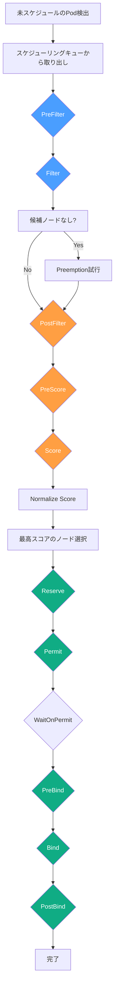
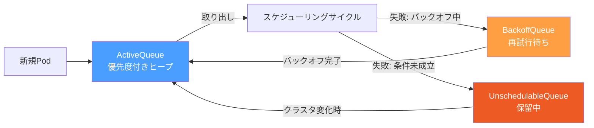
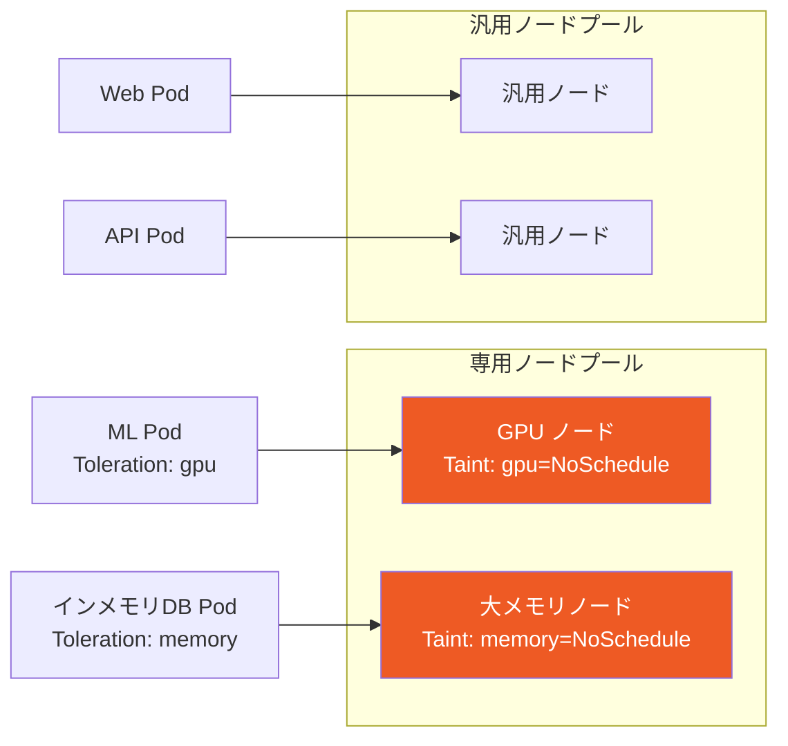
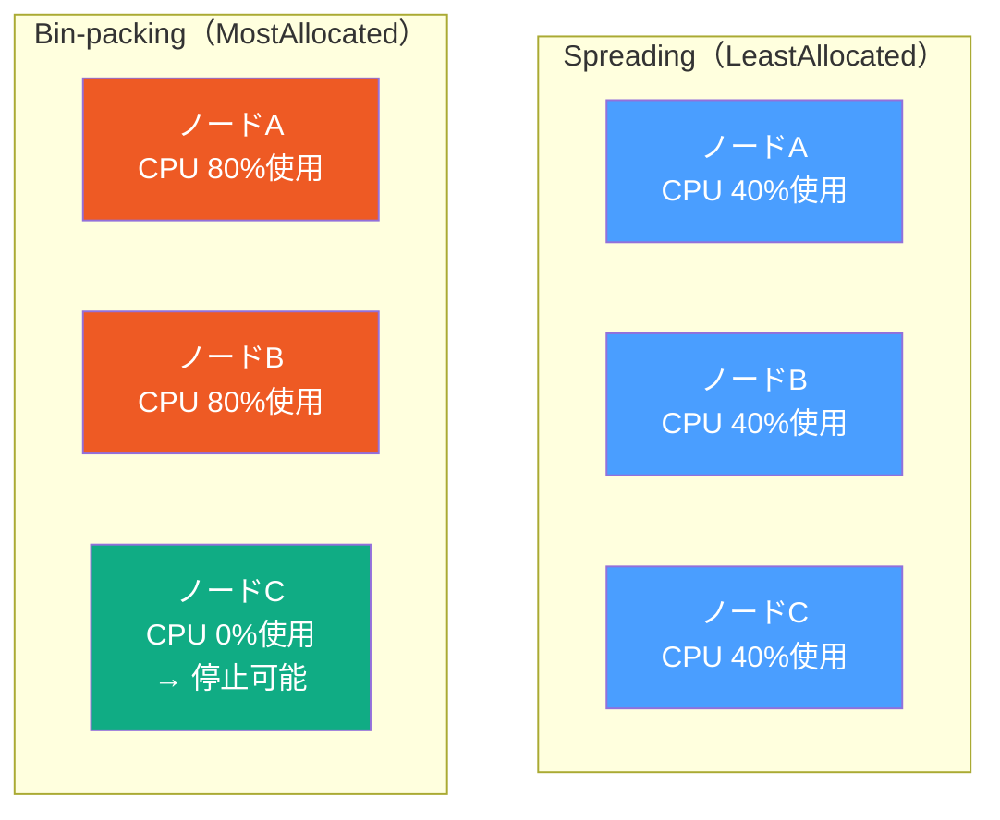
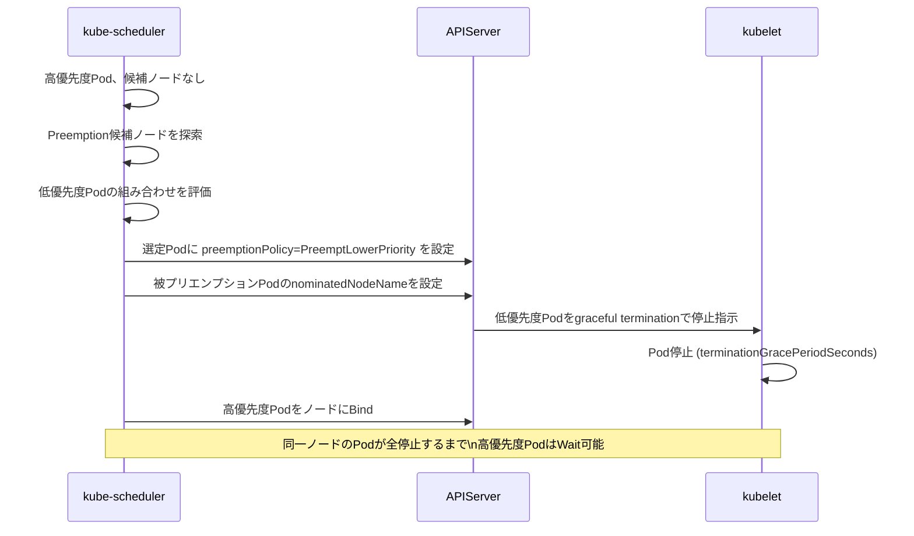
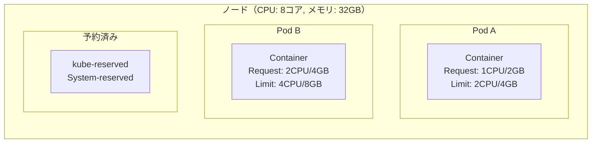
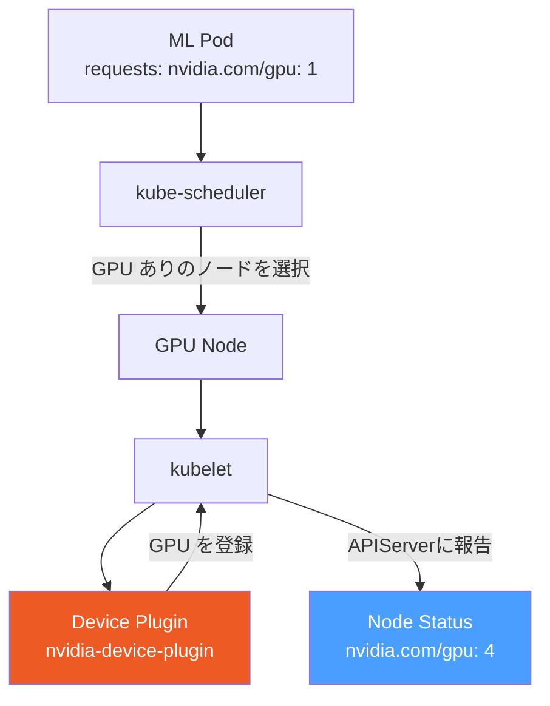
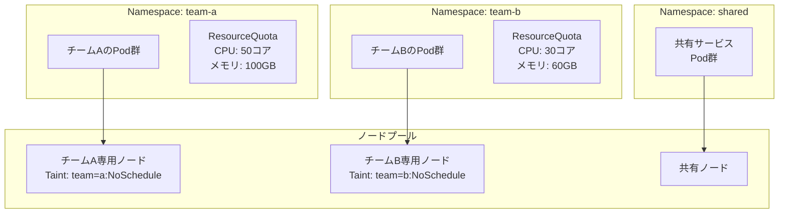

# Kubernetes スケジューリング

## 1. 歴史的背景 — リソーススケジューリング問題の本質

コンピューターサイエンスにおけるリソーススケジューリングは、数十年にわたる難題だ。ジョブをどのマシンに割り当てるか、という問題は一見シンプルに見えるが、実際には **NP困難な最適化問題** である。クラスタのサイズが数百台を超え、ジョブの種類が多様化するにつれ、スケジューリングの複雑さは指数的に増大する。

### 1.1 Borg から学んだ教訓

Googleは2003年頃から **Borg** と呼ばれる大規模クラスタ管理システムを運用してきた。Borgは数万台のマシンを管理し、Google検索やGmail、YouTubeといったサービスの実行基盤となっていた。2015年に発表された論文「Large-scale cluster management at Google with Borg」は、大規模クラスタスケジューリングの実践的な知見を余すことなく公開し、業界全体に大きな影響を与えた。

Borgから得られた主な教訓は次のとおりだ。

**セルと優先度クラス**: Borgはクラスタを「セル」という単位で管理し、ジョブに優先度を設定できる。高優先度のジョブは低優先度のジョブを **プリエンプション（横取り）** できる。本番ワークロードと開発・バッチワークロードを同一クラスタで混在させることで、リソース使用効率を大幅に向上させた。

**リソースの推定**: ユーザーが要求するリソース量（Requests）と実際の使用量（Limits）の差を利用した **オーバーコミット** により、クラスタ全体の利用率を60〜80%に維持できた。Borgなしでは同じ計算能力を持つクラスタには数倍のマシンが必要になる。

**フィジビリティチェックとスコアリング**: スケジューリングを「候補ノードを絞り込むフェーズ」と「最適なノードを選ぶフェーズ」に分けるアーキテクチャは、Borgが確立し、後にKubernetesのkube-schedulerに引き継がれた。

### 1.2 Omega の貢献 — 楽観的並行制御

2013年に発表されたBorgの後継システム **Omega** は、スケジューラの並行性という新たな課題に取り組んだ。Borgのスケジューラは単一のモノリシックなプロセスであり、クラスタが大規模化するにつれてスケジューリングのレイテンシが問題となっていた。

Omegaは **共有ステートアーキテクチャ** を採用した。クラスタの状態を共有ステートストアに保持し、複数のスケジューラが並行してノードに対してジョブを配置しようとする。競合が発生した場合はロールバックして再試行するという **楽観的並行制御** の考え方を取り入れた。

この知見はKubernetesのスケーラビリティ設計にも影響を与えており、後に導入された **Scheduling Framework** のプラグインアーキテクチャはOmegaの「スケジューラを複数持てる」という思想を単一スケジューラ内で実現したものといえる。

### 1.3 Kubernetes スケジューラの誕生

Kubernetesは2014年にGoogleがオープンソースとして公開した。BorgとOmegaの知見をもとに設計されたが、汎用性と拡張性を重視した設計が採られた。当初のkube-schedulerは比較的シンプルな実装だったが、バージョンを重ねるごとに洗練されていった。

特に大きな転換点は **Kubernetes 1.15（2019年）** で導入された **Scheduling Framework** だ。それ以前のスケジューラは内部実装が密結合していてカスタマイズが難しく、スケジューラExtenderという外部プロセスによる拡張機構が提供されていたが、レイテンシや複雑さの観点から限界があった。Scheduling Frameworkにより、スケジューラの各フェーズをプラグインとして実装できるようになり、大幅な拡張性が実現した。

---

## 2. kube-scheduler のアーキテクチャ

kube-schedulerは、Kubernetesコントロールプレーンのコンポーネントの一つで、**Podを適切なノードに割り当てる責務** を担う。スケジューラはPodを「作る」わけではなく、「どのノードで動かすか」という **spec.nodeName** フィールドを設定する役割を持つ。

### 2.1 スケジューリングサイクルの全体像



スケジューリングは大きく **スケジューリングサイクル** と **バインディングサイクル** の2フェーズに分かれる。

**スケジューリングサイクル**（同期・直列）:
- PreFilter → Filter → PostFilter → PreScore → Score → Reserve → Permit の順に実行
- このサイクルはシリアル（直列）に処理される。競合状態を避けるため、一度に一つのPodのみ処理する

**バインディングサイクル**（非同期・並行可能）:
- WaitOnPermit → PreBind → Bind → PostBind の順に実行
- APIサーバーへの書き込みが発生するため、複数Podのバインディングを並行して処理できる

### 2.2 スケジューリングキュー

スケジューリングキューは、kube-schedulerが管理する3種類のキューから構成される。



- **ActiveQueue（アクティブキュー）**: スケジューリング待ちのPodを優先度順に保持する優先度付きヒープ
- **BackoffQueue（バックオフキュー）**: スケジューリングに失敗したPodを指数バックオフ後に再試行させるキュー
- **UnschedulableQueue（非スケジュールキュー）**: 現時点ではスケジュール不可能なPodを保持する。クラスタの状態が変化した際に再度ActiveQueueに戻される

### 2.3 スケジューラの情報源

kube-schedulerは **Informer** を通じてAPIサーバーからクラスタの状態を取得し、ローカルにキャッシュする。ノード情報、Pod情報、各種リソース情報をリアルタイムに把握することで、APIサーバーへの問い合わせを最小化している。

このキャッシュベースのアーキテクチャにより、数千ノードのクラスタでも高いスループットを実現している。ただし、キャッシュとAPIサーバーの状態が一時的に乖離する可能性があるため、Bindの際に楽観的ロック（resourceVersion）で競合を検出する仕組みを持つ。

---

## 3. フィルタリングプラグイン — 候補ノードの絞り込み

FilterフェーズではPodを配置できないノードを除外する。各プラグインは「このノードにPodを配置できるか否か」を判定する。一つでも `Unschedulable` を返すと、そのノードは候補から外れる。

### 3.1 NodeSelector と NodeAffinity

最もシンプルなスケジューリング制約が **NodeSelector** だ。Podのspec.nodeSelectorにラベルのKey-Valueペアを指定すると、そのラベルを持つノードにのみ配置される。

```yaml
# NodeSelector の例
spec:
  nodeSelector:
    kubernetes.io/os: linux
    disktype: ssd
```

より表現力豊かな制約として **NodeAffinity** がある。NodeAffinityには2種類ある。

- **requiredDuringSchedulingIgnoredDuringExecution**: スケジューリング時に必須の条件。満たさないノードには配置されない
- **preferredDuringSchedulingIgnoredDuringExecution**: スケジューリング時に優先する条件。満たした場合にスコアが加算されるが、必須ではない

```yaml
spec:
  affinity:
    nodeAffinity:
      requiredDuringSchedulingIgnoredDuringExecution:
        nodeSelectorTerms:
        - matchExpressions:
          - key: topology.kubernetes.io/zone
            operator: In
            values:
            - ap-northeast-1a
            - ap-northeast-1c
      preferredDuringSchedulingIgnoredDuringExecution:
      - weight: 1
        preference:
          matchExpressions:
          - key: node-type
            operator: In
            values:
            - high-memory
```

`IgnoredDuringExecution` という名前は将来の拡張性を見越した命名で、将来的には `RequiredDuringExecution`（実行中もノードが条件を満たすことを要求する）が実装される予定だが、2026年時点では未実装だ。

### 3.2 PodAffinity と PodAnti-Affinity

**PodAffinity** は「特定のPodと同じノード/ゾーンに配置したい」という制約を表現する。例えばキャッシュサーバーとアプリケーションサーバーを同じノードに配置してレイテンシを削減したい場合に使用する。

**PodAnti-Affinity** はその逆で、「特定のPodと異なるノード/ゾーンに配置したい」という制約だ。同じアプリケーションのレプリカを異なるノードやゾーンに分散させて高可用性を確保するユースケースが典型的だ。

```yaml
spec:
  affinity:
    podAntiAffinity:
      requiredDuringSchedulingIgnoredDuringExecution:
      - labelSelector:
          matchExpressions:
          - key: app
            operator: In
            values:
            - web-frontend
        topologyKey: kubernetes.io/hostname
```

`topologyKey` は重要な概念だ。`kubernetes.io/hostname` を指定すると「同一ノード」単位での制約となり、`topology.kubernetes.io/zone` を指定すると「同一アベイラビリティゾーン」単位での制約となる。

::: warning PodAffinity のパフォーマンス影響
PodAffinityは計算コストが高い。各候補ノード上の全Podをチェックする必要があるため、Pod数が多いクラスタでは顕著なスケジューリングレイテンシが生じる。大規模クラスタではPodAnti-AffinityよりもPodTopologySpreadConstraintの使用を検討すること。
:::

### 3.3 Taint と Toleration

**Taint（汚染）** はノード側に設定する「このノードには特定の条件を持つPodしか配置できない」というマーカーだ。**Toleration（許容）** はPod側に設定する「このTaintを無視できる」という宣言だ。

Taintには3つのエフェクトがある。

| エフェクト | 動作 |
|-----------|------|
| `NoSchedule` | Tolerationのないすべての新規Podはスケジュールされない |
| `PreferNoSchedule` | Tolerationのない新規Podはなるべくスケジュールされないが、リソース不足時は許容される |
| `NoExecute` | Tolerationのない既存Podは退去（Evict）される |

```yaml
# GPU ノードへの Taint 設定
# kubectl taint nodes gpu-node-1 nvidia.com/gpu=:NoSchedule

# GPU を使用する Pod の Toleration
spec:
  tolerations:
  - key: "nvidia.com/gpu"
    operator: "Exists"
    effect: "NoSchedule"
```

Taint/Tolerationの典型的なユースケースを以下に示す。



**システム管理用Taint**: Kubernetesはシステムの状態を自動的にTaintとして表現する。例えばノードがNotReadyになると `node.kubernetes.io/not-ready:NoExecute` というTaintが自動付与され、デフォルトでは300秒後にPodがEvictされる。この動作はPodのTolerationの `tolerationSeconds` で制御できる。

### 3.4 PodTopologySpreadConstraints

**PodTopologySpreadConstraints** は「クラスタのトポロジーに沿ってPodを均等に分散させる」ための機能で、Kubernetes 1.19でGAとなった。PodAnti-AffinityよりもFlexibleで、かつパフォーマンスも優れている。

```yaml
spec:
  topologySpreadConstraints:
  - maxSkew: 1
    topologyKey: topology.kubernetes.io/zone
    whenUnsatisfiable: DoNotSchedule
    labelSelector:
      matchLabels:
        app: web-frontend
  - maxSkew: 1
    topologyKey: kubernetes.io/hostname
    whenUnsatisfiable: ScheduleAnyway
    labelSelector:
      matchLabels:
        app: web-frontend
```

- **maxSkew**: 最もPodが多いドメインと最もPodが少ないドメインの差の最大値
- **whenUnsatisfiable**: 制約を満たせない場合の動作。`DoNotSchedule`（スケジュール拒否）または `ScheduleAnyway`（スコアに影響するが配置は行う）
- **topologyKey**: どのトポロジー単位で分散するか

---

## 4. スコアリングプラグイン — 最適ノードの選択

Filterフェーズを通過した候補ノードに対し、Scoreフェーズで0〜100点のスコアを付与する。スコアが最も高いノードが選択される（同点の場合はランダム選択）。

### 4.1 リソースバランシング

**LeastAllocated**: リソース（CPU/メモリ）の割り当て量が少ないノードを優先する。クラスタ全体でリソースを均等に使用する **spreading** 戦略を実現する。

$$\text{score} = \frac{(CPU_{capacity} - CPU_{requested}) \times 100}{CPU_{capacity}} \times w_{CPU} + \frac{(Mem_{capacity} - Mem_{requested}) \times 100}{Mem_{capacity}} \times w_{Mem}$$

**MostAllocated**: リソースの割り当て量が多いノードを優先する。より少数のノードにPodを集約する **bin-packing** 戦略だ。コスト最適化において、空きノードをシャットダウンすることで節約効果が生まれる。



::: tip Spreading vs Bin-packing のトレードオフ
**Spreading（LeastAllocated）**: 各ノードのリソースを均等に使用するため、障害時の影響を分散できる。ただし、多くのノードが中程度の使用率で稼働するため、コスト効率が低下する可能性がある。

**Bin-packing（MostAllocated）**: 少数のノードにPodを集約するため、空きノードをシャットダウンできコスト効率が高い。ただし、ノード障害時の影響が集中するリスクがある。Kubernetes + Cluster Autoscaler環境ではこちらを採用するケースが多い。
:::

### 4.2 NodeAffinity スコアリング

`preferredDuringSchedulingIgnoredDuringExecution` で指定した条件を満たすノードに `weight` × 一致率に応じたスコアが加算される。複数のPreferred条件の組み合わせで細かい優先度制御が可能だ。

### 4.3 InterPodAffinity スコアリング

PodAffinityの `preferredDuringSchedulingIgnoredDuringExecution` を評価し、既存Podとの親和性が高いノードにスコアを加算する。

### 4.4 ImageLocality スコアリング

Podが使用するコンテナイメージをすでに保持しているノードを優先する。イメージのプルコスト（時間・帯域）を削減できるため、特に大きなイメージを使用するワークロードで効果的だ。

### 4.5 スコアの正規化と集計

各スコアリングプラグインはプラグイン固有のスコア（整数値）を返した後、**Normalize Score** フェーズで0〜100の範囲に正規化される。最終スコアは全プラグインのスコアに重みを掛けて合算したものとなる。

---

## 5. 高度なスケジューリング機能

### 5.1 Priority と Preemption

クラスタのリソースが枯渇した場合、高優先度のPodが低優先度のPodをEvictしてノードを確保する **Preemption（プリエンプション）** が動作する。

**PriorityClass** の定義:

```yaml
apiVersion: scheduling.k8s.io/v1
kind: PriorityClass
metadata:
  name: high-priority-production
value: 1000000
globalDefault: false
description: "本番ワークロード用の高優先度クラス"
---
apiVersion: scheduling.k8s.io/v1
kind: PriorityClass
metadata:
  name: low-priority-batch
value: 100
globalDefault: false
description: "バッチジョブ用の低優先度クラス"
```

システムが予約している優先度域も存在する。

| PriorityClass | 値 | 用途 |
|--------------|---|------|
| `system-cluster-critical` | 2,000,001,000 | kube-dns, metrics-server 等 |
| `system-node-critical` | 2,000,000,000 | kube-proxy, kubelet 等（静的Pod） |

Preemptionのフローを示す。



**Non-Preempting PriorityClass**: `preemptionPolicy: Never` を指定すると、優先度は持つがプリエンプションは行わないPriorityClassを作成できる。キューの順番に影響するが、他Podを排除しない用途に使用する。

### 5.2 Gang Scheduling

機械学習の分散学習のように、**複数のPodが同時にスケジュールされなければ処理を開始できない** ワークロードには Gang Scheduling が必要だ。

標準のKubernetesスケジューラは Gang Scheduling をネイティブにはサポートしないが、以下のアプローチで実現できる。

**Coscheduling / PodGroup（Kubernetes SIG Scheduling）**: SIG Scheduling が開発する scheduler-plugins の Coscheduling プラグインは、`PodGroup` CRDを使ってGang Schedulingを実現する。

```yaml
apiVersion: scheduling.sigs.k8s.io/v1alpha1
kind: PodGroup
metadata:
  name: distributed-training-job
spec:
  minMember: 8    # 最低8つのPodが同時スケジュールされなければ処理しない
  scheduleTimeoutSeconds: 300
```

**Volcano**: ByteDanceが開発しCNCFに寄贈されたバッチスケジューリングシステム。Gang SchedulingとJob管理を統合的に提供し、機械学習・大規模バッチ処理に最適化されている。

### 5.3 Descheduler — 継続的最適化

kube-schedulerはPodの配置を決定する時点での最適解を求めるが、**クラスタの状態は時々刻々と変化する**。ノードが追加/削除されたり、ワークロードパターンが変化したりすると、過去の配置決定が最適でなくなることがある。

**Descheduler** はこの問題を解決するためのツールで、既存Podを定期的に評価し、必要に応じて別のノードに移動（Evict & 再スケジュール）させる。

Deschedulerが提供するポリシー:

| ポリシー | 効果 |
|---------|------|
| `RemoveDuplicates` | 同一コントローラのPodが同一ノードに集中している場合に分散させる |
| `LowNodeUtilization` | 使用率の低いノードからPodをEvictし、リソースを解放する |
| `HighNodeUtilization` | bin-packing用。使用率の低いノードのPodをEvictしてさらに集約する |
| `RemovePodsViolatingNodeAffinity` | ノードのラベルが変更されてAffinityを満たさなくなったPodをEvict |
| `RemovePodsViolatingTopologySpreadConstraint` | TopologySpreadConstraintを違反するPodをEvict |

---

## 6. Scheduling Framework — プラグインアーキテクチャ

### 6.1 拡張ポイントの全体像

Kubernetes 1.15で導入された **Scheduling Framework** は、スケジューラの各フェーズをプラグインとして実装するための標準インターフェースを提供する。

```mermaid
flowchart LR
    subgraph "スケジューリングサイクル"
        direction TB
        A[PreEnqueue] --> B[QueueSort]
        B --> C[PreFilter]
        C --> D[Filter]
        D --> E[PostFilter]
        E --> F[PreScore]
        F --> G[Score]
        G --> H[NormalizeScore]
        H --> I[Reserve]
        I --> J[Permit]
    end
    subgraph "バインディングサイクル"
        direction TB
        K[PreBind] --> L[Bind]
        L --> M[PostBind]
    end
    J --> K

    style A fill:#8395a7,color:#fff
    style B fill:#8395a7,color:#fff
    style C fill:#4a9eff,color:#fff
    style D fill:#4a9eff,color:#fff
    style E fill:#4a9eff,color:#fff
    style F fill:#ff9f43,color:#fff
    style G fill:#ff9f43,color:#fff
    style H fill:#ff9f43,color:#fff
    style I fill:#10ac84,color:#fff
    style J fill:#10ac84,color:#fff
    style K fill:#6c5ce7,color:#fff
    style L fill:#6c5ce7,color:#fff
    style M fill:#6c5ce7,color:#fff
```



各拡張ポイントの役割を以下にまとめる。

| 拡張ポイント | フェーズ | 役割 |
|------------|---------|------|
| `PreEnqueue` | キュー | Podがアクティブキューに入る前の検証 |
| `QueueSort` | キュー | キュー内のPodのソート順を決定 |
| `PreFilter` | フィルタ | フィルタリング前の状態チェック・データ準備 |
| `Filter` | フィルタ | ノードの実行可否を判定 |
| `PostFilter` | フィルタ | Filter後の処理（全ノード拒否時のPreemption等） |
| `PreScore` | スコアリング | スコアリング前のデータ準備・並列実行のための前処理 |
| `Score` | スコアリング | ノードにスコアを付与 |
| `NormalizeScore` | スコアリング | スコアを0〜100に正規化 |
| `Reserve` | バインド準備 | リソース予約（楽観的確保）。失敗時は`Unreserve`で巻き戻し |
| `Permit` | バインド準備 | バインドの許可/拒否/待機を決定（Gang Schedulingに利用） |
| `PreBind` | バインド | バインド前処理（PersistentVolumeのマウント等） |
| `Bind` | バインド | Pod.Spec.NodeNameを設定してAPIサーバーに書き込む |
| `PostBind` | バインド | バインド後処理（通知・ログ等） |

### 6.2 カスタムスケジューラの実装

Scheduling Frameworkを使ってカスタムプラグインを実装する場合、スケジューラのバイナリをフォークして独自プラグインを組み込む形が標準的だ。

```go
// Filter プラグインの実装例（概念）
type MyCustomFilter struct{}

func (f *MyCustomFilter) Name() string {
    return "MyCustomFilter"
}

// Filter returns Unschedulable if the node doesn't meet custom requirements
func (f *MyCustomFilter) Filter(ctx context.Context, state *framework.CycleState, pod *v1.Pod, nodeInfo *framework.NodeInfo) *framework.Status {
    // Custom filtering logic
    if !meetsCustomRequirement(pod, nodeInfo.Node()) {
        return framework.NewStatus(framework.Unschedulable, "node does not meet custom requirement")
    }
    return nil
}
```

カスタムスケジューラは **複数スケジューラ** として並行動作させることもできる。PodのSpec.schedulerNameに独自のスケジューラ名を指定すれば、デフォルトスケジューラとは独立して動作する。

```yaml
spec:
  schedulerName: my-custom-scheduler   # カスタムスケジューラを指定
  containers:
  - name: app
    image: myapp:latest
```

### 6.3 スケジューラExtender（レガシー）

Scheduling Framework以前に提供されていた拡張方式が **スケジューラExtender** だ。kube-schedulerが外部HTTPサーバーにフィルタリング/スコアリング要求を委譲する仕組みで、言語を問わず実装できる利点がある一方、HTTPのオーバーヘッドによるレイテンシと、クラスタ情報が二重管理になるという問題がある。

新規実装はScheduling Frameworkプラグインを推奨するが、既存のExtenderとの互換性は維持されている。

---

## 7. リソース管理 — Requests/Limits と QoS

### 7.1 Requests と Limits の仕組み

Kubernetesのリソース管理はコンテナ単位で指定する2種類の値を中心とする。

- **Requests**: スケジューリング時に使用される **保証リソース量**。kube-schedulerはRequestsの合計値がノードの容量を超えないようにPodを配置する
- **Limits**: コンテナが使用できる **リソースの上限**。Limitsを超えた場合、CPUはスロットリング、メモリはOOM Killerにより強制終了される



**ノードの実際のリソース割り当て**:

実際にPodに割り当て可能なリソース（Allocatable）は以下の計算で求まる。

$$Allocatable = Capacity - kube\text{-}reserved - system\text{-}reserved - eviction\text{-}threshold$$

### 7.2 QoS クラス

Requestsと Limitsの設定に応じて、PodはQoS（Quality of Service）クラスに自動的に分類される。OOM発生時には低いQoSクラスのコンテナから優先的にKillされる。

| QoS クラス | 条件 | 特徴 |
|-----------|------|------|
| **Guaranteed** | 全コンテナでRequests = Limits | 最高優先度。最後にKillされる |
| **Burstable** | RequestsまたはLimitsが設定（不一致可） | 中間優先度 |
| **BestEffort** | Request/Limits未設定 | 最低優先度。最初にKillされる |

```yaml
# Guaranteed QoS の例
spec:
  containers:
  - name: app
    resources:
      requests:
        cpu: "500m"
        memory: "512Mi"
      limits:
        cpu: "500m"        # requests と同値
        memory: "512Mi"    # requests と同値
```

### 7.3 ResourceQuota と LimitRange

**ResourceQuota**: Namespace単位でリソースの合計使用量に上限を設定する。

```yaml
apiVersion: v1
kind: ResourceQuota
metadata:
  name: production-quota
  namespace: production
spec:
  hard:
    requests.cpu: "100"
    requests.memory: 200Gi
    limits.cpu: "200"
    limits.memory: 400Gi
    pods: "500"
    services: "50"
    persistentvolumeclaims: "100"
```

**LimitRange**: Namespace内のPodやコンテナのデフォルト値および上下限を設定する。ResourceQuotaが合計値の制限であるのに対し、LimitRangeは個別リソースの最小/最大値を制限する。

```yaml
apiVersion: v1
kind: LimitRange
metadata:
  name: default-limits
  namespace: production
spec:
  limits:
  - type: Container
    default:
      cpu: "500m"
      memory: "512Mi"
    defaultRequest:
      cpu: "100m"
      memory: "128Mi"
    max:
      cpu: "8"
      memory: "16Gi"
    min:
      cpu: "50m"
      memory: "64Mi"
```

### 7.4 拡張リソース — GPU と特殊ハードウェア

KubernetesはCPU/メモリ以外の **拡張リソース（Extended Resources）** をサポートする。GPUやFPGAなどの特殊ハードウェアは Device Plugin API を通じて管理される。

```yaml
# GPU を要求するPodの例
spec:
  containers:
  - name: ml-training
    resources:
      requests:
        nvidia.com/gpu: "2"   # NVIDIA GPU 2枚を要求
      limits:
        nvidia.com/gpu: "2"   # 拡張リソースはrequests = limitsが必須
```

拡張リソースの特性として、**整数値のみ** サポートされ、分数は指定できない（CPUと異なりミリコア表記不可）。また、**requests = limits** が必須となる。これはGPUを共有できないことを前提とした設計だ。

拡張リソースに対応するためには **Device Plugin** をDaemonSetとしてデプロイする必要がある。NVIDIA GPU用には `nvidia-device-plugin`、AMD GPU用には `k8s-device-plugin` が提供されている。



---

## 8. 運用の実際 — スケジューリング問題のデバッグとチューニング

### 8.1 スケジューリング問題のデバッグ

PodがPending状態にとどまっている場合、まず `kubectl describe pod` でEventsを確認する。

```
Events:
  Type     Reason            Age               From               Message
  ----     ------            ----              ----               -------
  Warning  FailedScheduling  45s (x3 over 2m)  default-scheduler  0/10 nodes are available:
           3 node(s) had taint {node.kubernetes.io/disk-pressure: }, that the pod didn't tolerate,
           5 Insufficient cpu,
           2 node(s) didn't match Pod's node affinity/selector.
```

このエラーメッセージは、フィルタリング結果の内訳を示す。各フィルタリングプラグインが何台のノードを除外したかが分かる。

**よくある原因と対処法**:

| 症状 | 原因 | 対処 |
|-----|------|------|
| `Insufficient cpu/memory` | ノードのリソース不足 | スケールアップ/リソース要求を見直し |
| `didn't match node selector` | NodeSelectorのラベル不一致 | ノードラベルを確認 |
| `had taint that pod didn't tolerate` | Taintに対応するTolerationなし | Tolerationを追加またはTaintを削除 |
| `didn't match pod affinity/anti-affinity rules` | AffinityルールによりノードNG | Affinityルールを見直し |
| `topology constraint not satisfiable` | TopologySpreadConstraint未達 | レプリカ数またはmaxSkewを調整 |

**スケジューラのログ確認**:

```bash
kubectl logs -n kube-system -l component=kube-scheduler --tail=100
```

スケジューラは詳細なログを出力する。`--v=5` 以上のverbosityでスコアリング結果を確認できる。

### 8.2 スケジューリングパフォーマンスのチューニング

大規模クラスタ（数千ノード）では、スケジューリングレイテンシが問題となることがある。kube-schedulerにはいくつかのパフォーマンスチューニングオプションが用意されている。

**percentageOfNodesToScore**: Filterを通過した候補ノードのうち、何%についてスコアリングを行うかを指定する。デフォルトは0（自動設定）で、ノード数に応じて5〜50%の範囲で動的に調整される。小さな値にするほどスコアリングが速くなるが、最適なノードを選べない可能性が高まる。

```yaml
apiVersion: kubescheduler.config.k8s.io/v1
kind: KubeSchedulerConfiguration
percentageOfNodesToScore: 10   # 候補の10%のみスコアリング
profiles:
- schedulerName: default-scheduler
  plugins:
    score:
      disabled:
      - name: ImageLocality   # 使用しないプラグインを無効化
```

**並列スケジューリング**: kube-schedulerは複数のPodのバインディングサイクルを並行して処理できる。`parallelism` パラメータで同時処理数を制御できる（デフォルト16）。

**ノードのチャンク処理**: Filterフェーズは全ノードを並列に評価するが、実際にはノードをチャンク単位でバッチ処理する。十分な候補が見つかれば早期終了する最適化も含む。

### 8.3 大規模クラスタの考慮事項

**スケジューラのスループット**: 標準的なkube-schedulerは、理論上は1秒あたり数百〜数千Podをスケジュール可能だが、実際にはAPIサーバーとetcdのI/Oがボトルネックになることが多い。

**ノード数とリソース計算**: ノード数が増えると、PodAffinityのチェックにかかる時間がO(N)で増加する。5,000ノード以上の環境では、PodAffinityの使用を最小限に抑えるか、代わりにTopologySpreadConstraintを使用することを推奨する。

**NodeUnderPressure の影響**: ディスクプレッシャー、メモリプレッシャー等が発生したノードにはkubeletが自動的にTaintを付与する。多数のノードがプレッシャー状態になるとスケジュール可能なノードが急減し、Pendingが連鎖する可能性がある。

### 8.4 VerticalPodAutoscaler (VPA) との連携

**VPA（Vertical Pod Autoscaler）** はPodのResourceRequestsを自動的に調整するコンポーネントで、スケジューリングと密接に連携する。VPAが推奨値を計算し、必要に応じてPodを再起動してRequestsを更新する。

```yaml
apiVersion: autoscaling.k8s.io/v1
kind: VerticalPodAutoscaler
metadata:
  name: my-app-vpa
spec:
  targetRef:
    apiVersion: apps/v1
    kind: Deployment
    name: my-app
  updatePolicy:
    updateMode: "Auto"   # 自動更新（再起動あり）
  resourcePolicy:
    containerPolicies:
    - containerName: app
      minAllowed:
        cpu: 100m
        memory: 128Mi
      maxAllowed:
        cpu: 4
        memory: 8Gi
```

::: warning VPA と HPA の併用
VPA（垂直スケール）とHPA（水平スケール）を同時に使用する場合、両方がCPU/メモリを制御対象にすると競合が発生する。HPA が CPU metrics を使用する場合、VPA は CPU を対象外にするか、VPA を Recommendation モードのみにして手動でRequestsを調整する運用が推奨される。
:::

---

## 9. 実運用のパターンとベストプラクティス

### 9.1 Taint/Toleration の運用パターン

実際の大規模クラスタ運用では、いくつかのTaint/Tolerationパターンが確立されている。

**専用ノードプール（Dedicated Node Pool）**:

```yaml
# 本番専用ノードにTaintを設定
# kubectl taint node prod-node-1 dedicated=production:NoSchedule

# 本番ワークロードにTolerationを設定
spec:
  tolerations:
  - key: dedicated
    value: production
    effect: NoSchedule
  affinity:
    nodeAffinity:
      requiredDuringSchedulingIgnoredDuringExecution:
        nodeSelectorTerms:
        - matchExpressions:
          - key: node-type
            operator: In
            values:
            - production
```

**メンテナンス時のTaint**: `kubectl cordon` コマンドはノードに `node.kubernetes.io/unschedulable:NoSchedule` Taintを付与し、新規Podのスケジュールを停止する。`kubectl drain` はさらに既存Podを安全に退去させる。

### 9.2 マルチテナントクラスタのスケジューリング設計

複数チームが同一クラスタを共有するマルチテナント環境では、以下の組み合わせで分離を実現する。



### 9.3 スケジューリングのモニタリング

スケジューラの健全性を監視するための主要メトリクス:

| メトリクス | 説明 | アラート閾値例 |
|-----------|------|--------------|
| `scheduler_pending_pods` | Pendingキュー内のPod数 | > 100 (5分継続) |
| `scheduler_scheduling_attempt_duration_seconds` | スケジューリング試行の所要時間 | p99 > 1秒 |
| `scheduler_schedule_attempts_total` (error) | スケジューリング失敗数 | エラー率 > 5% |
| `scheduler_preemption_attempts_total` | プリエンプション試行回数 | 急増した場合 |
| `scheduler_framework_extension_point_duration_seconds` | 各プラグインの所要時間 | カスタムプラグインの遅延検出 |

---

## 10. 今後の展望

### 10.1 Dynamic Resource Allocation (DRA)

Kubernetes 1.26でアルファ導入された **Dynamic Resource Allocation (DRA)** は、GPUや特殊ハードウェアのより柔軟な管理を実現する次世代リソース管理フレームワークだ。従来のDevice Pluginは整数単位のリソース割り当てしかサポートしなかったが、DRAでは構造化されたパラメータでリソースを細かく制御できる。

DRAの主要コンセプト:

- **ResourceClaim**: Podが必要とするリソースの要件を宣言するオブジェクト
- **ResourceClass**: 利用可能なリソースの種類とプロバイダを定義
- **ResourceClaimParameters/DeviceClass**: デバイスの選択条件を詳細に指定

これにより、GPUのフラクショナル（部分）割り当てや、特定のGPUモデルの指定、NVLink接続などトポロジーを考慮した割り当てが標準化された方法で可能になる。

### 10.2 スケジューラのシミュレーションとテスト

**Scheduler Simulator** はkube-schedulerの動作を実クラスタなしでシミュレートするツールで、スケジューリングポリシーの事前検証やベンチマークに使用される。

**kwok（Kubernetes Without Kubelet）** は軽量な偽のノードを大量に作成できるツールで、数千ノードのクラスタを単一マシン上でシミュレートし、スケジューラのパフォーマンス特性を検証できる。

### 10.3 AI/ML ベースのスケジューリング

研究段階ではあるが、機械学習を利用してスケジューリング決定を最適化する取り組みが進んでいる。歴史的なワークロードパターンを学習し、将来のリソース需要を予測してプロアクティブにスケジューリングを行う「予測的スケジューリング」や、強化学習によるスケジューリングポリシーの自動最適化なども研究されている。

### 10.4 マルチクラスタスケジューリング

単一クラスタを超えたマルチクラスタ環境でのスケジューリングは、次世代の課題だ。**Kueue** はKubernetesのワークロードを複数クラスタにまたがってキューイング・スケジュールする仕組みを提供しており、HPC的なジョブ管理をKubernetes上で実現する方向で開発が進んでいる。

**Liqo** や **Admiralty** などのプロジェクトは、複数のKubernetesクラスタをまたいでPodを「オフロード」する仕組みを提供し、クラウド間・エッジ間の統合的なスケジューリングを目指している。

---

## まとめ

Kubernetesのスケジューリングは、BorgとOmegaから引き継いだ「フィルタリングとスコアリング」の基本アーキテクチャをベースに、Scheduling Frameworkという強力なプラグイン機構を中心に進化を続けている。

スケジューリングの本質は **制約充足問題と最適化問題の組み合わせ** であり、クラスタの規模が大きくなるほど、正確な最適解を求めることは諦め、「十分良い解を素早く求める」ヒューリスティックなアプローチが不可欠になる。

実運用においては、NodeAffinity・Taint/Toleration・TopologySpreadConstraintsの組み合わせで大半のユースケースに対応できる。また、Requests/Limitsの適切な設定はスケジューリングの品質と安定性に直結するため、VPAを活用した継続的な最適化が重要だ。

スケジューラのパフォーマンスはクラスタ規模とともに急速に重要性が増す。大規模クラスタでは、スケジューリングレイテンシのモニタリングと、PodAffinityなどコスト高なフィーチャーの使用制限が運用安定性に大きく貢献する。

::: details 参考資料
- [Kubernetes Scheduler Documentation](https://kubernetes.io/docs/concepts/scheduling-eviction/kube-scheduler/)
- [Scheduling Framework KEP](https://github.com/kubernetes/enhancements/tree/master/keps/sig-scheduling/624-scheduling-framework)
- [Large-scale cluster management at Google with Borg (2015)](https://research.google/pubs/pub43438/)
- [Omega: flexible, scalable schedulers for large compute clusters (2013)](https://research.google/pubs/pub41684/)
- [scheduler-plugins repository](https://github.com/kubernetes-sigs/scheduler-plugins)
- [Volcano batch system](https://volcano.sh/en/)
- [Descheduler](https://github.com/kubernetes-sigs/descheduler)
:::
