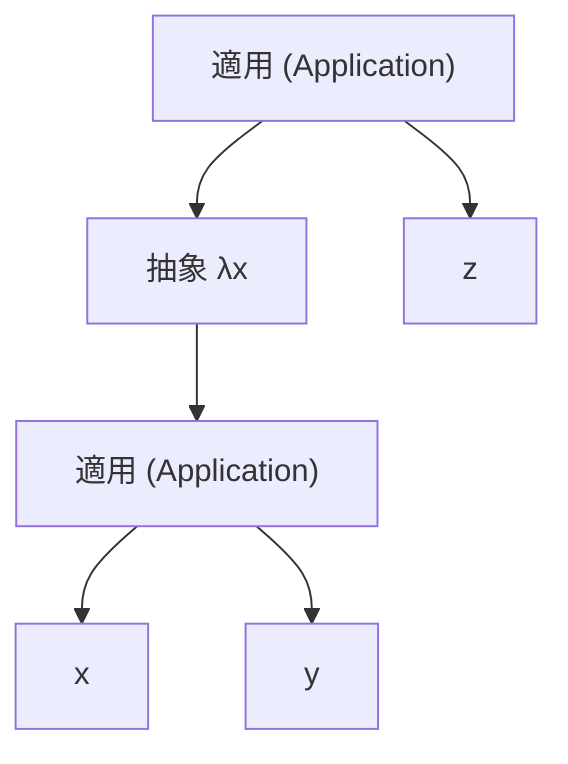
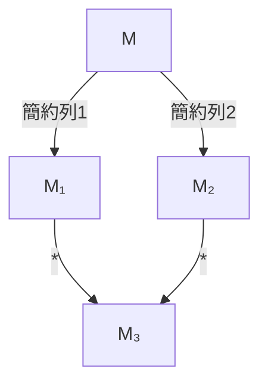

# ラムダ計算 — 計算の本質を捉える形式体系

## 1. 背景と動機：計算とは何か

1920年代から1930年代にかけて、数学の基礎論において根本的な問いが浮上した。**「計算可能であるとはどういうことか？」**——この問いに対して、複数の数学者が独立に回答を与えた。その中でも最も影響力のある2つのアプローチが、**Alonzo Church のラムダ計算（lambda calculus）**と **Alan Turing のチューリングマシン（Turing machine）**である。

### 1.1 Hilbert の決定問題（Entscheidungsproblem）

物語は David Hilbert にさかのぼる。1928年、Hilbert と Wilhelm Ackermann は**決定問題（Entscheidungsproblem）**を提起した。これは「一階述語論理の任意の文が妥当であるかを判定する一般的なアルゴリズムは存在するか？」という問題である。

この問題に答えるためには、まず「アルゴリズム」あるいは「計算可能」という概念自体を厳密に定義する必要があった。1930年代半ば、Church と Turing はそれぞれ異なるアプローチでこの概念を形式化し、いずれも決定問題に対して否定的な回答を与えた。

### 1.2 Church のアプローチ

Alonzo Church はプリンストン大学の数学者であり、1932年から1933年にかけてラムダ計算の原型を発表し、1936年の論文 *"An Unsolvable Problem of Elementary Number Theory"* で決定問題の解決不可能性を示した。Church のアプローチは、**関数の抽象化と適用**という2つの操作だけを基本とする、きわめてミニマルな形式体系を構築することだった。

Church の着眼点は深い。数学の多くの領域——算術、論理、集合——は突き詰めれば**関数**の概念に還元できる。ラムダ計算はこの洞察を極限まで推し進め、関数そのものを計算の唯一の基本要素とする。変数も、数値も、ブーリアンも、データ構造も、制御フローも、すべて関数として表現される。

### 1.3 Turing のアプローチとの関係

一方、Alan Turing（当時 Church の博士課程の学生）は1936年に、無限のテープとヘッドを持つ抽象機械——チューリングマシン——を用いて計算可能性を定義した。Turing のアプローチはより機械的・操作的であり、「状態」と「テープ上のシンボル操作」を基本とする。

驚くべきことに、Church と Turing は互いに独立に同じ結論に到達した。しかも、ラムダ計算で計算可能な関数のクラスと、チューリングマシンで計算可能な関数のクラスは完全に一致することが証明された。この等価性は**Church-Turing のテーゼ（Church-Turing thesis）**の基盤の一つとなっている。

::: tip ラムダ計算の本質
ラムダ計算とは、**関数の定義と適用**という2つの操作のみで、あらゆる計算を表現できることを示す形式体系である。変数、数値、ブーリアン、データ構造、条件分岐、再帰——すべてが関数の組み合わせとして符号化される。この驚くべきミニマリズムこそが、ラムダ計算の理論的な力であり美しさである。
:::

## 2. 構文：ラムダ項の定義

ラムダ計算の構文は驚くほど単純である。わずか3種類の構文要素しか存在しない。

### 2.1 ラムダ項（Lambda Terms）

ラムダ項（lambda term）、あるいは単に**項（term）**は、以下の3つの規則によって帰納的に定義される。変数の集合を $V = \{x, y, z, \ldots\}$ とする。

$$
\begin{aligned}
M, N ::= \quad & x & \text{（変数: variable）} \\
\mid \quad & \lambda x.\, M & \text{（抽象: abstraction）} \\
\mid \quad & M\, N & \text{（適用: application）}
\end{aligned}
$$

これら3つの構文要素を一つずつ説明する。

**変数（Variable）**：$x, y, z$ などの名前。値の「入れ物」あるいは「参照先」を表す。

**抽象（Abstraction）**：$\lambda x.\, M$ は「引数 $x$ を受け取り、本体 $M$ を返す無名関数」を表す。ここで $x$ は**束縛変数（bound variable）**と呼ばれ、$M$ は関数の**本体（body）**である。たとえば $\lambda x.\, x$ は恒等関数（identity function）であり、受け取った引数をそのまま返す。

**適用（Application）**：$M\, N$ は「関数 $M$ を引数 $N$ に適用する」ことを表す。たとえば $(\lambda x.\, x)\, y$ は恒等関数に $y$ を適用することを意味する。

### 2.2 構文の慣例

ラムダ計算の式を読み書きしやすくするために、いくつかの慣例が用いられる。

**適用は左結合**：$M\, N\, P$ は $(M\, N)\, P$ と解釈する。つまり、まず $M$ を $N$ に適用し、その結果を $P$ に適用する。

**抽象は右に最大限延びる**：$\lambda x.\, M\, N$ は $\lambda x.\, (M\, N)$ と解釈する。$(\lambda x.\, M)\, N$ ではない。

**連続する抽象の省略記法**：$\lambda x.\, \lambda y.\, \lambda z.\, M$ は $\lambda xyz.\, M$ と省略できる。

### 2.3 具体例

いくつかのラムダ項の例を示す。

| ラムダ項 | 直感的な意味 |
|---|---|
| $\lambda x.\, x$ | 恒等関数：$x$ をそのまま返す |
| $\lambda x.\, \lambda y.\, x$ | 最初の引数を返す関数 |
| $\lambda x.\, \lambda y.\, y$ | 2番目の引数を返す関数 |
| $\lambda f.\, \lambda x.\, f\, x$ | 関数 $f$ を $x$ に適用する |
| $\lambda f.\, \lambda x.\, f\, (f\, x)$ | 関数 $f$ を2回適用する |
| $(\lambda x.\, x)\, (\lambda y.\, y)$ | 恒等関数に恒等関数を適用 |

### 2.4 抽象構文木

ラムダ項は木構造として捉えることができる。たとえば $(\lambda x.\, x\, y)\, z$ の抽象構文木は以下のようになる。

## 3. 束縛変数と自由変数

ラムダ計算を正しく理解するために不可欠な概念が、**束縛変数（bound variable）**と**自由変数（free variable）**の区別である。

### 3.1 定義

抽象 $\lambda x.\, M$ において、変数 $x$ は本体 $M$ の中で**束縛されている（bound）**という。$M$ の中に出現する変数のうち、いかなるラムダ抽象にも束縛されていないものを**自由変数（free variable）**と呼ぶ。

ラムダ項 $M$ の自由変数の集合 $\text{FV}(M)$ は以下のように再帰的に定義される。

$$
\begin{aligned}
\text{FV}(x) &= \{x\} \\
\text{FV}(\lambda x.\, M) &= \text{FV}(M) \setminus \{x\} \\
\text{FV}(M\, N) &= \text{FV}(M) \cup \text{FV}(N)
\end{aligned}
$$

自由変数を持たないラムダ項は**閉じた項（closed term）**あるいは**コンビネータ（combinator）**と呼ばれる。

### 3.2 具体例

| ラムダ項 | 自由変数 | 束縛変数 |
|---|---|---|
| $x$ | $\{x\}$ | — |
| $\lambda x.\, x$ | $\emptyset$ | $x$ |
| $\lambda x.\, y$ | $\{y\}$ | $x$ |
| $\lambda x.\, x\, y$ | $\{y\}$ | $x$ |
| $(\lambda x.\, x)\, y$ | $\{y\}$ | $x$ |
| $\lambda x.\, \lambda y.\, x\, y\, z$ | $\{z\}$ | $x, y$ |

### 3.3 束縛のスコープ

同じ変数名が異なるスコープで束縛されることがある。たとえば：

$$(\lambda x.\, x)\, (\lambda x.\, x)$$

ここでは2つの $\lambda x$ がそれぞれ独立したスコープを持つ。左側の $\lambda x$ が束縛する $x$ と、右側の $\lambda x$ が束縛する $x$ は別物である。この状況は、プログラミング言語におけるローカル変数のスコープと同じである。

::: warning 変数の名前と意味の区別
ラムダ計算において重要なのは、**変数の名前ではなく構造**である。$\lambda x.\, x$ と $\lambda y.\, y$ はまったく同じ関数（恒等関数）を表す。この直感を形式化するのが次節の α 変換である。
:::

## 4. α 変換（α-conversion）

### 4.1 α 等価性

**α 変換（alpha-conversion）**とは、束縛変数の名前を別の名前に一貫して変更する操作である。この操作によってラムダ項の「意味」は変わらない。

$$\lambda x.\, x \equiv_\alpha \lambda y.\, y \equiv_\alpha \lambda z.\, z$$

これらはすべて恒等関数を表しており、α 等価（alpha-equivalent）であるという。

形式的には、$\lambda x.\, M$ において $x$ を $y$ に α 変換するとは、$M$ 中の $x$ のすべての束縛された出現を $y$ に置き換えて $\lambda y.\, M[x := y]$ とすることである。ただし、$y$ は $M$ の中で自由に出現していてはならない（**変数捕獲（variable capture）**を避けるため）。

### 4.2 変数捕獲の問題

α 変換の際に注意すべきなのが変数捕獲である。以下の例を見てみよう。

$$\lambda x.\, \lambda y.\, x$$

この項において、外側の $x$ を $y$ に α 変換しようとすると：

$$\lambda y.\, \lambda y.\, y \quad \text{（不正！）}$$

元の項では外側の $\lambda$ が束縛する $x$ が本体の最内部で自由に出現していたが、変換後は内側の $\lambda y$ が本来外側の束縛を参照すべき $y$ を「横取り」してしまう。これが変数捕獲であり、α 変換の条件に違反している。正しくは、衝突しない名前（たとえば $z$）を選ぶ必要がある。

$$\lambda z.\, \lambda y.\, z \quad \text{（正しい α 変換）}$$

### 4.3 α 等価性のもとでの取り扱い

実際のラムダ計算の理論では、α 等価な項は同一視するのが一般的である。つまり、$\lambda x.\, x$ と $\lambda y.\, y$ は「同じ項」として扱う。これにより、変数名の選び方に依存しない議論が可能になる。

この取り扱いを実装レベルで実現する手法として、**de Bruijn インデックス（de Bruijn index）**がある。de Bruijn インデックスでは、変数名の代わりに「何段階外側のラムダに束縛されているか」を表す自然数を用いる。

$$\lambda x.\, \lambda y.\, x \quad \Longrightarrow \quad \lambda.\, \lambda.\, 1$$

ここでインデックス $1$ は「1つ外側のラムダ」を指す（$0$ が最も内側）。de Bruijn インデックスを用いると、α 等価な項は文字通り同一の表現を持つ。

## 5. β 簡約（β-reduction）と計算

ラムダ計算における「計算」の本質が **β 簡約（beta-reduction）**である。

### 5.1 β 簡約の定義

β 簡約は、関数適用を「実行」する操作である。抽象（関数）に引数が適用されたとき、その引数を関数本体に代入する。

$$(\lambda x.\, M)\, N \longrightarrow_\beta M[x := N]$$

ここで $M[x := N]$ は、$M$ 中の $x$ の自由な出現をすべて $N$ で置き換えた項を意味する。左辺の $(\lambda x.\, M)\, N$ の形をした式を **β 基（beta-redex, reducible expression）**と呼ぶ。

### 5.2 代入の厳密な定義

代入 $M[x := N]$ は以下のように再帰的に定義される。

$$
\begin{aligned}
x[x := N] &= N \\
y[x := N] &= y \quad (y \neq x) \\
(M_1\, M_2)[x := N] &= M_1[x := N]\, M_2[x := N] \\
(\lambda x.\, M)[x := N] &= \lambda x.\, M \\
(\lambda y.\, M)[x := N] &= \lambda y.\, M[x := N] \quad (y \neq x,\; y \notin \text{FV}(N))
\end{aligned}
$$

最後の規則で $y \notin \text{FV}(N)$ という条件が付いているのは、変数捕獲を防ぐためである。もしこの条件が満たされない場合は、先に α 変換を行って衝突を回避する。

### 5.3 具体的な β 簡約のステップ

β 簡約の感覚をつかむために、いくつかの例を丁寧に追ってみよう。

**例1：恒等関数の適用**

$$(\lambda x.\, x)\, y \longrightarrow_\beta x[x := y] = y$$

恒等関数に $y$ を適用すると、$y$ がそのまま返される。

**例2：定数関数の適用**

$$(\lambda x.\, \lambda y.\, x)\, a\, b$$

まず最初の適用：

$$(\lambda x.\, \lambda y.\, x)\, a \longrightarrow_\beta (\lambda y.\, x)[x := a] = \lambda y.\, a$$

次の適用：

$$(\lambda y.\, a)\, b \longrightarrow_\beta a[y := b] = a$$

つまり、$(\lambda x.\, \lambda y.\, x)\, a\, b \longrightarrow_\beta^* a$ となる。最初の引数 $a$ が返される。

**例3：関数合成**

$$(\lambda f.\, \lambda g.\, \lambda x.\, f\, (g\, x))\, (\lambda y.\, y)\, (\lambda z.\, z)\, a$$

ステップ1——$f$ に恒等関数を代入：

$$(\lambda g.\, \lambda x.\, (\lambda y.\, y)\, (g\, x))\, (\lambda z.\, z)\, a$$

ステップ2——$g$ に恒等関数を代入：

$$(\lambda x.\, (\lambda y.\, y)\, ((\lambda z.\, z)\, x))\, a$$

ステップ3——$x$ に $a$ を代入：

$$(\lambda y.\, y)\, ((\lambda z.\, z)\, a)$$

ステップ4——内側の簡約：

$$(\lambda y.\, y)\, a$$

ステップ5——最後の簡約：

$$a$$

**例4：変数捕獲の回避が必要なケース**

$$(\lambda x.\, \lambda y.\, x\, y)\, y$$

ここで $x$ に $y$（自由変数）を代入しようとすると、$(\lambda y.\, x\, y)[x := y] = \lambda y.\, y\, y$ となり、外側の自由変数 $y$ が内側の $\lambda y$ に捕獲されてしまう。これを避けるため、先に α 変換する。

$$(\lambda x.\, \lambda z.\, x\, z)\, y \longrightarrow_\beta \lambda z.\, y\, z$$

### 5.4 η 変換（η-conversion）

β 簡約に加えて、もう一つの重要な等価性の概念として **η 変換（eta-conversion）**がある。

$$\lambda x.\, M\, x \equiv_\eta M \quad (x \notin \text{FV}(M))$$

直感的には、「$x$ を受け取って $M$ に $x$ を渡す関数」は、$M$ 自身と同じ関数であるということを述べている。これは**外延性の原理（extensionality principle）**に対応する——2つの関数がすべての入力に対して同じ出力を返すなら、それらは等しい。

## 6. 正規形と Church-Rosser 定理

### 6.1 正規形（Normal Form）

ラムダ項 $M$ が**正規形（normal form）**にあるとは、$M$ の中に β 基が一つも存在しない状態をいう。つまり、これ以上 β 簡約できない項が正規形である。

| ラムダ項 | 正規形か？ |
|---|---|
| $x$ | はい |
| $\lambda x.\, x$ | はい |
| $\lambda x.\, \lambda y.\, x$ | はい |
| $(\lambda x.\, x)\, y$ | いいえ（β 基がある） |
| $\lambda x.\, (\lambda y.\, y)\, x$ | いいえ（β 基がある） |

### 6.2 正規形を持たない項

すべてのラムダ項が正規形に簡約できるわけではない。最も有名な例が **Ω コンビネータ**である。

$$\Omega = (\lambda x.\, x\, x)\, (\lambda x.\, x\, x)$$

これを β 簡約すると：

$$(\lambda x.\, x\, x)\, (\lambda x.\, x\, x) \longrightarrow_\beta (\lambda x.\, x\, x)\, (\lambda x.\, x\, x) = \Omega$$

簡約しても元の項に戻るため、永遠に簡約が終わらない。$\Omega$ は正規形を持たず、このような簡約列は**発散する（diverge）**という。

これはプログラミングにおける無限ループに対応する。計算が停止しない場合があるという事実は、ラムダ計算の表現力と深く結びついている（停止問題の決定不能性）。

### 6.3 Church-Rosser 定理（合流性）

ラムダ項の中に複数の β 基が存在する場合、どれを先に簡約するかによって異なる簡約列が生じる。このとき自然な疑問が生じる——異なる簡約順序で異なる結果に到達してしまうことはないのか？

**Church-Rosser 定理（合流性定理、confluence theorem）**は、この疑問に明確な回答を与える。

> **定理（Church-Rosser）**：ラムダ項 $M$ から2つの異なる簡約列によって $M_1$ と $M_2$ にそれぞれ到達できるならば、ある項 $M_3$ が存在して、$M_1$ からも $M_2$ からも $M_3$ に到達できる。

$$
\begin{array}{ccc}
& M & \\
\swarrow & & \searrow \\
M_1 & & M_2 \\
\searrow & & \swarrow \\
& M_3 &
\end{array}
$$

この定理から直ちに導かれる重要な系がある。

> **系（正規形の一意性）**：ラムダ項 $M$ が正規形を持つならば、その正規形は（α 等価性のもとで）一意である。

つまり、簡約の順序によって計算結果が変わることはない。これは計算の**決定性（determinism of result）**を保証する重要な性質である。ただし、すべての簡約戦略が正規形に到達するわけではないことには注意が必要である（次節参照）。

## 7. 簡約戦略

一つのラムダ項に複数の β 基が含まれる場合、どの β 基を先に簡約するかを決める規則を**簡約戦略（reduction strategy）**と呼ぶ。

### 7.1 正規順序（Normal Order Reduction）

**正規順序簡約（normal order reduction）**は、常に**最も左の最も外側の β 基（leftmost outermost redex）**を先に簡約する戦略である。

$$(\lambda x.\, \lambda y.\, y)\, ((\lambda z.\, z\, z)\, (\lambda z.\, z\, z))$$

この項には2つの β 基がある。

1. 全体 $(\lambda x.\, \lambda y.\, y)\, (\ldots)$（最外のβ基）
2. 引数部分 $(\lambda z.\, z\, z)\, (\lambda z.\, z\, z)$（内側のβ基、$\Omega$）

正規順序では最外の β 基を先に簡約する。

$$(\lambda x.\, \lambda y.\, y)\, \Omega \longrightarrow_\beta \lambda y.\, y$$

引数 $\Omega$ は使われないので捨てられ、正規形 $\lambda y.\, y$ に到達する。

### 7.2 適用順序（Applicative Order Reduction）

**適用順序簡約（applicative order reduction）**は、常に**最も左の最も内側の β 基（leftmost innermost redex）**を先に簡約する戦略である。つまり、関数適用の前に引数を先に評価する。

上の例で適用順序を用いると：

$$(\lambda x.\, \lambda y.\, y)\, \Omega$$

引数の $\Omega$ を先に簡約しようとするが、$\Omega \longrightarrow_\beta \Omega$ と無限にループする。適用順序では**正規形に到達できない**。

### 7.3 正規化定理

正規順序が重要なのは、以下の定理による。

> **正規化定理（Normalization theorem）**：ラムダ項 $M$ が正規形を持つならば、正規順序簡約は必ず有限ステップで正規形に到達する。

つまり、正規順序は**最も安全な簡約戦略**であり、正規形が存在する限り必ずそれを見つける。これは、正規順序が引数を必要になるまで評価しない**遅延評価（lazy evaluation）**に対応していることと深く関係している。

### 7.4 プログラミング言語との対応

| 簡約戦略 | 評価戦略 | 対応する言語 |
|---|---|---|
| 正規順序（leftmost outermost） | 遅延評価（lazy evaluation） | Haskell |
| 適用順序（leftmost innermost） | 先行評価（eager evaluation） | ML, Scheme, Python, Java |
| 名前呼び（call by name） | 遅延評価の基礎 | Algol 60 |
| 必要呼び（call by need） | メモ化付き遅延評価 | Haskell（実際の実装） |

Haskell が遅延評価を採用しているのは、正規順序の理論的な優位性——正規形が存在するなら必ず見つける——に根ざしている。一方、多くの主流言語は適用順序（先行評価）を採用しているが、これは実装の効率性と予測可能性が理由である。

## 8. Church 数：自然数の符号化

ラムダ計算には数値という概念が組み込まれていない。しかし Church は、自然数を純粋なラムダ項として表現する巧みな方法を考案した。

### 8.1 Church 数の定義

自然数 $n$ を表す Church 数 $\overline{n}$ は、「関数 $f$ を $n$ 回適用する」という操作として符号化される。

$$
\begin{aligned}
\overline{0} &= \lambda f.\, \lambda x.\, x \\
\overline{1} &= \lambda f.\, \lambda x.\, f\, x \\
\overline{2} &= \lambda f.\, \lambda x.\, f\, (f\, x) \\
\overline{3} &= \lambda f.\, \lambda x.\, f\, (f\, (f\, x)) \\
&\;\;\vdots \\
\overline{n} &= \lambda f.\, \lambda x.\, \underbrace{f\, (f\, (\cdots(f}_{n \text{ 回}}\, x)\cdots))
\end{aligned}
$$

一般に $\overline{n} = \lambda f.\, \lambda x.\, f^n\, x$ と書ける。ここで $f^n$ は $f$ の $n$ 回合成を意味する。

この符号化の本質は、自然数を「反復（iteration）」として捉えていることにある。$\overline{n}$ は「ある操作を $n$ 回繰り返す」という高階関数である。

### 8.2 算術演算の符号化

Church 数に対して、算術演算をラムダ項として定義できる。

**後者関数（Successor）**：

$$\text{SUCC} = \lambda n.\, \lambda f.\, \lambda x.\, f\, (n\, f\, x)$$

$\overline{n}$ が $f$ を $n$ 回適用するのに対し、$\text{SUCC}\, \overline{n}$ は $f$ を $n+1$ 回適用する。

検証してみよう：

$$
\begin{aligned}
\text{SUCC}\, \overline{2} &= (\lambda n.\, \lambda f.\, \lambda x.\, f\, (n\, f\, x))\, (\lambda f.\, \lambda x.\, f\, (f\, x)) \\
&\longrightarrow_\beta \lambda f.\, \lambda x.\, f\, ((\lambda f.\, \lambda x.\, f\, (f\, x))\, f\, x) \\
&\longrightarrow_\beta \lambda f.\, \lambda x.\, f\, ((\lambda x.\, f\, (f\, x))\, x) \\
&\longrightarrow_\beta \lambda f.\, \lambda x.\, f\, (f\, (f\, x)) \\
&= \overline{3}
\end{aligned}
$$

**加法（Addition）**：

$$\text{ADD} = \lambda m.\, \lambda n.\, \lambda f.\, \lambda x.\, m\, f\, (n\, f\, x)$$

$m$ 回の $f$ の適用に続けて $n$ 回の $f$ の適用を行う。つまり $f$ を合計 $m + n$ 回適用する。

あるいは、後者関数を用いて次のように書くこともできる。

$$\text{ADD} = \lambda m.\, \lambda n.\, m\, \text{SUCC}\, n$$

$n$ に対して後者関数を $m$ 回適用すれば $m + n$ が得られる。

**乗法（Multiplication）**：

$$\text{MUL} = \lambda m.\, \lambda n.\, \lambda f.\, m\, (n\, f)$$

$n\, f$ は「$f$ を $n$ 回適用する関数」であり、$m\, (n\, f)$ は「$f$ を $n$ 回適用する操作を $m$ 回繰り返す」ことを意味する。結果として $f$ は $m \times n$ 回適用される。

**冪乗（Exponentiation）**：

$$\text{EXP} = \lambda m.\, \lambda n.\, n\, m$$

驚くべきことに、冪乗は Church 数を逆順に適用するだけで実現できる。$n\, m$ は「$m$ を $n$ 回適用する」ことを意味し、$m$ が「$f$ を $m$ 回適用する」関数なので、結果として $f$ は $m^n$ 回適用される。

### 8.3 先行者関数（Predecessor）とゼロ判定

加法や乗法に比べ、**先行者関数（predecessor）**の符号化はかなり難しい。Church が見つけた方法はペアを用いるもので、以下のようになる。

まずペア（2つ組）を定義する。

$$
\begin{aligned}
\text{PAIR} &= \lambda a.\, \lambda b.\, \lambda f.\, f\, a\, b \\
\text{FST} &= \lambda p.\, p\, (\lambda a.\, \lambda b.\, a) \\
\text{SND} &= \lambda p.\, p\, (\lambda a.\, \lambda b.\, b)
\end{aligned}
$$

これを用いて、先行者関数は次のように定義される。

$$\text{PRED} = \lambda n.\, \text{FST}\, (n\, (\lambda p.\, \text{PAIR}\, (\text{SND}\, p)\, (\text{SUCC}\, (\text{SND}\, p)))\, (\text{PAIR}\, \overline{0}\, \overline{0}))$$

基本的なアイデアは、ペア $(0, 0)$ から出発して $n$ 回の反復で $(n-1, n)$ に至るというものである。各ステップで $(a, b)$ を $(b, b+1)$ に更新する。$n$ 回の反復後にペアの第一要素を取り出せば $n-1$ が得られる。

**ゼロ判定**：

$$\text{ISZERO} = \lambda n.\, n\, (\lambda x.\, \text{FALSE})\, \text{TRUE}$$

$\overline{0}$ は $f$ を0回適用する（何もしない）ので $\text{TRUE}$ が返り、$\overline{n}$（$n \geq 1$）は $(\lambda x.\, \text{FALSE})$ を少なくとも1回適用するので $\text{FALSE}$ が返る。ここで $\text{TRUE}$ と $\text{FALSE}$ は次節で定義する Church ブーリアンである。

## 9. Church ブーリアンと条件分岐

### 9.1 Church ブーリアンの定義

ブーリアン値もラムダ項で表現できる。Church ブーリアンは次のように定義される。

$$
\begin{aligned}
\text{TRUE} &= \lambda t.\, \lambda f.\, t \\
\text{FALSE} &= \lambda t.\, \lambda f.\, f
\end{aligned}
$$

$\text{TRUE}$ は2つの引数のうち最初の引数を返し、$\text{FALSE}$ は2番目の引数を返す。

### 9.2 条件分岐

この定義の巧みさは、**条件分岐がブーリアン値への関数適用として自然に表現される**ことにある。

$$\text{IF} = \lambda b.\, \lambda t.\, \lambda e.\, b\, t\, e$$

$b$ が $\text{TRUE}$ なら $t$（then 節）が選ばれ、$\text{FALSE}$ なら $e$（else 節）が選ばれる。実際には $\text{IF}$ は不要で、ブーリアン値を直接適用するだけで条件分岐が実現される。

$$
\begin{aligned}
\text{TRUE}\, a\, b &\longrightarrow_\beta^* a \\
\text{FALSE}\, a\, b &\longrightarrow_\beta^* b
\end{aligned}
$$

### 9.3 論理演算

論理演算もラムダ項で定義できる。

$$
\begin{aligned}
\text{AND} &= \lambda p.\, \lambda q.\, p\, q\, p \\
\text{OR} &= \lambda p.\, \lambda q.\, p\, p\, q \\
\text{NOT} &= \lambda p.\, p\, \text{FALSE}\, \text{TRUE}
\end{aligned}
$$

それぞれを検証してみよう。

**AND の検証**：

$$
\begin{aligned}
\text{AND}\, \text{TRUE}\, \text{TRUE} &= \text{TRUE}\, \text{TRUE}\, \text{TRUE} \longrightarrow_\beta^* \text{TRUE} \\
\text{AND}\, \text{TRUE}\, \text{FALSE} &= \text{TRUE}\, \text{FALSE}\, \text{TRUE} \longrightarrow_\beta^* \text{FALSE} \\
\text{AND}\, \text{FALSE}\, \text{TRUE} &= \text{FALSE}\, \text{TRUE}\, \text{FALSE} \longrightarrow_\beta^* \text{FALSE} \\
\text{AND}\, \text{FALSE}\, \text{FALSE} &= \text{FALSE}\, \text{FALSE}\, \text{FALSE} \longrightarrow_\beta^* \text{FALSE}
\end{aligned}
$$

**NOT の検証**：

$$
\begin{aligned}
\text{NOT}\, \text{TRUE} &= \text{TRUE}\, \text{FALSE}\, \text{TRUE} \longrightarrow_\beta^* \text{FALSE} \\
\text{NOT}\, \text{FALSE} &= \text{FALSE}\, \text{FALSE}\, \text{TRUE} \longrightarrow_\beta^* \text{TRUE}
\end{aligned}
$$

::: tip Church 符号化の統一原理
Church 数とChurch ブーリアンに共通する設計原理は、**データを「振る舞い」として符号化する**ことである。自然数 $n$ は「$n$ 回の反復」として、ブーリアンは「2択からの選択」として定義される。データとそれに対する操作が一体化しているこの方式は、オブジェクト指向プログラミングの核心的な発想と通じるものがある。
:::

## 10. 再帰と Y コンビネータ

### 10.1 再帰の問題

ラムダ計算では関数に名前がないため、一見すると再帰的な関数を定義できないように思える。たとえば階乗関数を定義しようとすると：

$$\text{FACT} = \lambda n.\, \text{IF}\, (\text{ISZERO}\, n)\, \overline{1}\, (\text{MUL}\, n\, (\text{FACT}\, (\text{PRED}\, n)))$$

しかし右辺に $\text{FACT}$ が出現しており、これは自分自身を参照する名前である。ラムダ計算には名前付き定義の仕組みがないため、この定義はそのままでは成立しない。

### 10.2 不動点コンビネータ

この問題を解決するのが**不動点コンビネータ（fixed-point combinator）**である。

関数 $f$ の**不動点（fixed point）**とは、$f\, x = x$ を満たす $x$ のことである。不動点コンビネータ $Y$ は、任意の関数 $f$ の不動点を与えるラムダ項であり、次の性質を満たす。

$$Y\, f = f\, (Y\, f)$$

### 10.3 Y コンビネータの定義

最も有名な不動点コンビネータが、Haskell Curry が発見した **Y コンビネータ**である。

$$Y = \lambda f.\, (\lambda x.\, f\, (x\, x))\, (\lambda x.\, f\, (x\, x))$$

これが不動点コンビネータであることを確認しよう。

$$
\begin{aligned}
Y\, g &= (\lambda f.\, (\lambda x.\, f\, (x\, x))\, (\lambda x.\, f\, (x\, x)))\, g \\
&\longrightarrow_\beta (\lambda x.\, g\, (x\, x))\, (\lambda x.\, g\, (x\, x)) \\
&\longrightarrow_\beta g\, ((\lambda x.\, g\, (x\, x))\, (\lambda x.\, g\, (x\, x))) \\
&= g\, (Y\, g)
\end{aligned}
$$

最後の等号は、2行目が $Y\, g$ の展開形そのものであることから成り立つ。

### 10.4 Y コンビネータを用いた階乗の定義

Y コンビネータを用いて、階乗関数を再帰なしで定義できる。

まず、階乗の「雛形」となる関数を用意する。

$$F = \lambda \text{fact}.\, \lambda n.\, \text{IF}\, (\text{ISZERO}\, n)\, \overline{1}\, (\text{MUL}\, n\, (\text{fact}\, (\text{PRED}\, n)))$$

$F$ は「再帰呼び出し先を引数 $\text{fact}$ として受け取る」関数である。ここで $Y\, F$ を計算すると：

$$Y\, F = F\, (Y\, F)$$

つまり $Y\, F$ は $F$ の不動点であり、$F$ の引数 $\text{fact}$ として $Y\, F$ 自身が渡される。これにより再帰が実現される。

$\text{FACT} = Y\, F$ として、$\text{FACT}\, \overline{3}$ の簡約を追ってみよう（概略）。

$$
\begin{aligned}
\text{FACT}\, \overline{3} &= (Y\, F)\, \overline{3} \\
&= F\, (Y\, F)\, \overline{3} \\
&= \text{IF}\, (\text{ISZERO}\, \overline{3})\, \overline{1}\, (\text{MUL}\, \overline{3}\, ((Y\, F)\, (\text{PRED}\, \overline{3}))) \\
&\longrightarrow_\beta^* \text{MUL}\, \overline{3}\, (\text{FACT}\, \overline{2}) \\
&\longrightarrow_\beta^* \text{MUL}\, \overline{3}\, (\text{MUL}\, \overline{2}\, (\text{FACT}\, \overline{1})) \\
&\longrightarrow_\beta^* \text{MUL}\, \overline{3}\, (\text{MUL}\, \overline{2}\, (\text{MUL}\, \overline{1}\, (\text{FACT}\, \overline{0}))) \\
&\longrightarrow_\beta^* \text{MUL}\, \overline{3}\, (\text{MUL}\, \overline{2}\, (\text{MUL}\, \overline{1}\, \overline{1})) \\
&\longrightarrow_\beta^* \overline{6}
\end{aligned}
$$

### 10.5 Θ コンビネータと Z コンビネータ

Y コンビネータ以外にも不動点コンビネータは存在する。

**Turing の Θ コンビネータ**（Alan Turing が発見）：

$$\Theta = (\lambda x.\, \lambda y.\, y\, (x\, x\, y))\, (\lambda x.\, \lambda y.\, y\, (x\, x\, y))$$

$\Theta$ は $Y$ と異なり、$\Theta\, f \longrightarrow_\beta^* f\, (\Theta\, f)$ が β 簡約（等式ではなく）として成立するという特徴がある。

**Z コンビネータ**（適用順序の言語で使える）：

$$Z = \lambda f.\, (\lambda x.\, f\, (\lambda v.\, x\, x\, v))\, (\lambda x.\, f\, (\lambda v.\, x\, x\, v))$$

Y コンビネータは正規順序（遅延評価）でのみ正しく動作する。適用順序（先行評価）の言語では $Y\, f$ の計算が無限ループに陥る。Z コンビネータは η 展開を用いて引数の評価を遅延させることで、この問題を解決している。

::: tip 不動点コンビネータの深い意味
Y コンビネータの存在は、ラムダ計算の表現力を示す重要な結果である。名前付き定義なしに、純粋な関数の抽象と適用だけで再帰を実現できるということは、ラムダ計算がチューリング完全であることの核心的な要素の一つである。
:::

## 11. 型付きラムダ計算

ここまで扱ってきたのは**型なしラムダ計算（untyped lambda calculus）**であり、任意のラムダ項を任意のラムダ項に適用できる。しかし $\Omega = (\lambda x.\, x\, x)\, (\lambda x.\, x\, x)$ のように停止しない計算も許容される。型付きラムダ計算は、型を導入することで特定の「病的な」項を排除する。

### 11.1 単純型付きラムダ計算（Simply Typed Lambda Calculus, $\lambda_\to$）

単純型付きラムダ計算では、型が以下のように定義される。

$$\tau ::= \alpha \mid \tau_1 \to \tau_2$$

ここで $\alpha$ は型変数（基底型）、$\to$ は関数型である。

型付け規則は以下の3つである。型環境 $\Gamma$ は変数と型の対応 $x : \tau$ の集合である。

$$
\frac{x : \tau \in \Gamma}{\Gamma \vdash x : \tau} \quad \text{(Var)}
$$

$$
\frac{\Gamma, x : \tau_1 \vdash M : \tau_2}{\Gamma \vdash \lambda x.\, M : \tau_1 \to \tau_2} \quad \text{(Abs)}
$$

$$
\frac{\Gamma \vdash M : \tau_1 \to \tau_2 \quad \Gamma \vdash N : \tau_1}{\Gamma \vdash M\, N : \tau_2} \quad \text{(App)}
$$

**型安全性**：単純型付きラムダ計算は**強正規化性（strong normalization）**を持つ。つまり、型の付くすべての項は必ず正規形に到達する。$\Omega$ のような発散する項は型が付かないため排除される。

しかし、この性質はラムダ計算の表現力を制限する。強正規化性は、すべての計算が停止することを意味するが、停止問題が決定不能であることと合わせると、**型付きラムダ計算はチューリング完全ではない**ことが分かる。特に、Y コンビネータは $\lambda_\to$ では型が付かない。

### 11.2 System F（多相ラムダ計算）

**System F**（Jean-Yves Girard, 1972; John C. Reynolds, 1974 が独立に発見）は、型の抽象化と適用を導入した体系である。

$$
\begin{aligned}
\tau &::= \alpha \mid \tau_1 \to \tau_2 \mid \forall \alpha.\, \tau \\
M &::= x \mid \lambda x:\tau.\, M \mid M\, N \mid \Lambda \alpha.\, M \mid M\, [\tau]
\end{aligned}
$$

$\Lambda \alpha.\, M$ は型の抽象（型パラメータ $\alpha$ を受け取る項）、$M\, [\tau]$ は型の適用（具体的な型 $\tau$ を渡す）である。

恒等関数は System F では次のように書ける。

$$\text{id} = \Lambda \alpha.\, \lambda x:\alpha.\, x \quad : \quad \forall \alpha.\, \alpha \to \alpha$$

これは「任意の型 $\alpha$ に対して、$\alpha$ 型の値を受け取り $\alpha$ 型の値を返す」関数であり、パラメトリック多相（ジェネリクス）の形式化である。

System F でも強正規化性が成立し、チューリング完全ではない。しかし、System F の中で自然数やリストなどのデータ型を型安全に符号化できる。

**System F での自然数**：

$$\text{Nat} = \forall \alpha.\, (\alpha \to \alpha) \to \alpha \to \alpha$$

$$
\begin{aligned}
\overline{0} &= \Lambda \alpha.\, \lambda f:\alpha \to \alpha.\, \lambda x:\alpha.\, x \\
\overline{1} &= \Lambda \alpha.\, \lambda f:\alpha \to \alpha.\, \lambda x:\alpha.\, f\, x \\
\overline{n} &= \Lambda \alpha.\, \lambda f:\alpha \to \alpha.\, \lambda x:\alpha.\, f^n\, x
\end{aligned}
$$

### 11.3 型付きラムダ計算の階層

ラムダキューブ（Lambda Cube）は、型付きラムダ計算の各種拡張を3次元の立方体の頂点として整理したものである（Henk Barendregt, 1991）。

3つの拡張軸は以下のとおりである。

1. **項が型に依存する**（パラメトリック多相、System F）
2. **型が型に依存する**（型演算子、高カインド型）
3. **型が項に依存する**（依存型）

これら3つの拡張をすべて備えた最も豊かな体系が **Calculus of Constructions（CoC）**であり、Coq や Lean の理論的基盤となっている。

## 12. チューリングマシンとの等価性

### 12.1 計算可能性の複数の定式化

1930年代に、「計算可能な関数」の概念を形式化する複数の試みが独立に行われた。

| 形式化 | 提唱者 | 年 | 基本的な発想 |
|---|---|---|---|
| 帰納的関数 | Kurt Gödel, Jacques Herbrand | 1931-1934 | 基本関数からの帰納的構成 |
| ラムダ計算 | Alonzo Church | 1936 | 関数の抽象と適用 |
| チューリングマシン | Alan Turing | 1936 | テープ上の記号操作 |
| Post 生成系 | Emil Post | 1936 | 文字列の書き換え規則 |
| μ 再帰関数 | Stephen Kleene | 1936 | 原始再帰+最小化演算子 |

驚くべきことに、これらの形式化はすべて**同じ関数のクラス**を計算可能とする。

### 12.2 Church-Turing のテーゼ

これらの等価性は証明可能な数学的定理である。しかし「これらの形式化が『直感的に計算可能な関数』のすべてを捉えている」という主張は証明できない（「直感的に計算可能」の厳密な定義がないため）。この主張を **Church-Turing のテーゼ（Church-Turing thesis）**と呼ぶ。

> **Church-Turing のテーゼ**：直感的に計算可能な関数は、ラムダ計算（あるいはチューリングマシン、あるいは他の等価な形式化）で計算可能な関数と一致する。

### 12.3 ラムダ計算からチューリングマシンへの変換

ラムダ計算とチューリングマシンの等価性は、相互にシミュレーションできることで証明される。

**ラムダ計算 → チューリングマシン**：ラムダ項の β 簡約を機械的に実行するチューリングマシンを構成できる。テープにラムダ項を符号化し、β 基を探して代入を実行するアルゴリズムを状態遷移として表現する。

**チューリングマシン → ラムダ計算**：チューリングマシンの構成要素——状態、テープの内容、ヘッド位置——をすべてラムダ項として符号化し、一ステップの遷移をラムダ項の操作として表現する。不動点コンビネータ（Y コンビネータ）を用いることで、チューリングマシンの反復的な実行をラムダ計算の中でシミュレートできる。

### 12.4 ラムダ計算の計算モデルとしての特徴

チューリングマシンとラムダ計算は計算能力としては等価であるが、その性格は大きく異なる。

| 特徴 | チューリングマシン | ラムダ計算 |
|---|---|---|
| 基本的な発想 | 機械的操作（テープ・ヘッド） | 関数の抽象と適用 |
| 状態 | 明示的な状態遷移 | 状態を持たない（純粋関数的） |
| データ表現 | テープ上のシンボル列 | すべてがラムダ項 |
| 制御フロー | 状態遷移規則 | β 簡約 |
| 空間の概念 | テープという空間的表現 | なし |
| 実装との距離 | 実際のコンピュータに近い | 抽象的・数学的 |
| 影響を与えた分野 | 命令型プログラミング | 関数型プログラミング |

チューリングマシンが「機械はどう動くか」という操作的な視点に立つのに対し、ラムダ計算は「何を計算するか」という宣言的な視点に立つ。この二つの視点は、プログラミングの世界において命令型と関数型というパラダイムの対立として今日まで続いている。

## 13. 現代プログラミング言語への影響

ラムダ計算は、理論的な研究対象にとどまらず、現代のプログラミング言語の設計に直接的な影響を与え続けている。

### 13.1 Lisp とラムダ計算

1958年に John McCarthy が設計した **Lisp** は、ラムダ計算の概念を直接的に取り入れた最初の実用的なプログラミング言語である。Lisp の名前自体が "List Processing" の略であるが、その計算モデルの核心はラムダ計算に基づいている。

Lisp は `lambda` キーワードで無名関数を定義し、関数をファーストクラスの値として扱う。McCarthy の原論文では、ラムダ計算の抽象と適用がそのまま言語の基本構文として採用されている。

### 13.2 ML 系言語と型推論

1973年に Robin Milner が設計した **ML（Meta Language）**は、型付きラムダ計算の知見を活かし、**型推論（type inference）**を備えた最初の実用的言語である。ML の型推論は、Hindley-Milner 型システムに基づいており、プログラマが型注釈を書かなくても、コンパイラが自動的に最も一般的な型を推論する。

ML の影響は OCaml、Standard ML、F# などの直系の子孫に加え、Haskell、Rust、Swift、Kotlin など多くの現代言語に及んでいる。

### 13.3 Haskell と純粋関数型プログラミング

**Haskell**（1990年〜）は、ラムダ計算の理論をもっとも忠実にプログラミング言語として実現した言語である。

- **純粋性（purity）**：すべての関数は副作用を持たず、ラムダ計算の関数と同じく入力から出力への写像である
- **遅延評価（lazy evaluation）**：正規順序簡約に対応する評価戦略
- **型クラス（type classes）**：アドホック多相のための仕組み
- **モナド（monads）**：副作用を純粋な計算の中で扱う仕組み（圏論に由来）

Haskell はラムダ計算の理論的な特性——参照透過性、合流性、遅延評価の安全性——を直接的にプログラミング言語の設計原理として反映している。

### 13.4 主流言語へのラムダ式の浸透

ラムダ計算の概念は、かつては関数型プログラミング言語の専売特許であったが、現在では主流の言語にも広く浸透している。

| 言語 | ラムダ式の構文 | 導入時期 |
|---|---|---|
| Lisp | `(lambda (x) (* x x))` | 1958 |
| ML / OCaml | `fun x -> x * x` | 1973 |
| Haskell | `\x -> x * x` | 1990 |
| Python | `lambda x: x * x` | 1994 |
| C# | `x => x * x` | 2007 (C# 3.0) |
| Java | `x -> x * x` | 2014 (Java 8) |
| C++ | ` { return x * x; }` | 2011 (C++11) |
| Rust | `\|x\| x * x` | 2015 |
| Go | `func(x int) int { return x * x }` | 2009 |
| Swift | `{ x in x * x }` | 2014 |
| Kotlin | `{ x -> x * x }` | 2016 |
| TypeScript | `(x: number) => x * x` | 2012 |

### 13.5 関数型プログラミングの核心概念

ラムダ計算から直接派生したプログラミングの概念を整理する。

**ファーストクラス関数（First-Class Functions）**：関数を他の値と同じように扱える——変数に代入、引数として渡す、戻り値として返す。これはラムダ計算における抽象と適用そのものである。

**高階関数（Higher-Order Functions）**：関数を引数に取ったり、関数を返したりする関数。`map`、`filter`、`reduce` などは高階関数の典型例であり、ラムダ計算では自然に表現される。

**クロージャ（Closures）**：自由変数を含むラムダ項を関数値として返す際、自由変数の束縛を保持する仕組み。これはラムダ計算の自由変数と束縛変数の区別に直接対応する。

**カリー化（Currying）**：複数引数の関数を、引数を一つずつ取る関数の連鎖として表現すること。ラムダ計算では関数は本来一引数であり、複数引数は自然にカリー化によって表現される。この名前は Haskell Curry に由来する（ただし概念自体は Moses Schönfinkel が先に発見した）。

**不変性（Immutability）**：ラムダ計算には「代入」や「状態の変更」という操作が存在しない。計算はすべて新しい値の生成として表現される。この考え方は関数型プログラミングにおける不変データ構造の設計原理の基盤となっている。

## 14. Curry-Howard の対応（命題論理との同型）

ラムダ計算の最も深遠な帰結の一つが、**Curry-Howard の対応（Curry-Howard correspondence）**、あるいは **propositions-as-types（命題 = 型）** の原理である。

### 14.1 対応の発見

この対応は、Haskell Curry が1934年に組合せ論理と含意論理の間の関係を観察したことに始まり、1969年に William Alvin Howard が型付きラムダ計算と自然演繹の間の精密な同型を確立したことで完成した。

### 14.2 基本的な対応関係

Curry-Howard の対応は、**型付きラムダ計算のプログラム**と**論理学の証明**の間に一対一の対応があることを述べる。

| 型付きラムダ計算 | 直観主義命題論理 |
|---|---|
| 型 $\tau$ | 命題 $P$ |
| 項 $M : \tau$ | 命題 $P$ の証明 |
| 関数型 $\alpha \to \beta$ | 含意 $A \Rightarrow B$ |
| 直積型 $\alpha \times \beta$ | 連言 $A \land B$ |
| 直和型 $\alpha + \beta$ | 選言 $A \lor B$ |
| 空の型 $\bot$ | 偽（矛盾） |
| 型の棲人 | 定理の証明可能性 |
| β 簡約 | 証明の簡略化（cut elimination） |
| 正規形 | 正規化された証明 |

### 14.3 含意の証明 = 関数の定義

最も基本的な対応を具体的に見てみよう。

**命題**：$A \Rightarrow A$（任意の命題はそれ自身を含意する）

**証明**：仮定 $A$ をそのまま結論 $A$ として用いる。

**対応するプログラム**：

$$\lambda x : A.\, x \quad : \quad A \to A$$

これは恒等関数に他ならない。

**命題**：$A \Rightarrow B \Rightarrow A$（$A$ が成り立つなら、$B$ に関わらず $A$ が成り立つ）

**証明**：仮定 $A$ を結論として使い、仮定 $B$ は捨てる。

**対応するプログラム**：

$$\lambda x : A.\, \lambda y : B.\, x \quad : \quad A \to B \to A$$

### 14.4 三段論法と関数合成

論理学の三段論法（modus ponens）は、Curry-Howard 対応のもとで**関数適用**に対応する。

$$\frac{A \Rightarrow B \quad A}{B} \quad \longleftrightarrow \quad \frac{f : A \to B \quad x : A}{f\, x : B}$$

また、推移律（$A \Rightarrow B$ かつ $B \Rightarrow C$ ならば $A \Rightarrow C$）は**関数合成**に対応する。

$$\lambda f : B \to C.\, \lambda g : A \to B.\, \lambda x : A.\, f\, (g\, x) \quad : \quad (B \to C) \to (A \to B) \to A \to C$$

### 14.5 依存型への拡張

Curry-Howard の対応は、より豊かな型システムと論理体系の間にも拡張される。

| 型の概念 | 論理の概念 |
|---|---|
| 依存関数型 $\Pi_{x:A} B(x)$ | 全称量化 $\forall x \in A.\, B(x)$ |
| 依存ペア型 $\Sigma_{x:A} B(x)$ | 存在量化 $\exists x \in A.\, B(x)$ |
| 帰納的型 | 帰納法の原理 |

依存型を持つ言語——Coq、Agda、Lean、Idris——では、Curry-Howard 対応を用いて数学の定理を「プログラム」として証明し、型検査器が証明の正しさを機械的に検証する。これが**定理証明支援系（proof assistant）**の基本原理である。

### 14.6 Curry-Howard 対応の意義

Curry-Howard の対応は、数学・論理学・計算機科学をつなぐ深い橋渡しである。

- **論理学**にとって：計算の概念が証明の構造を照らし出す。証明の正規化（cut elimination）が β 簡約として理解される
- **計算機科学**にとって：型システムの設計が論理体系の設計と同一視され、型安全性が論理的健全性を意味する
- **数学の基礎**にとって：Calculus of Constructions をはじめとする型理論が集合論に代わる数学の基礎として研究されている（Homotopy Type Theory / Univalent Foundations）

::: tip Curry-Howard の射程
Curry-Howard の対応は単なるアナロジーではなく、形式的に証明された同型（isomorphism）である。この対応の発見は、「プログラムを書くことと証明を書くことは本質的に同じ活動である」という深い洞察をもたらした。
:::

## 15. まとめ：ラムダ計算はなぜ重要か

ラムダ計算は1930年代に Church が創始した形式体系だが、その重要性は90年を経た現在もなお増し続けている。最後に、ラムダ計算が重要である理由を整理する。

**計算の基礎理論として**：ラムダ計算はチューリングマシンと並ぶ計算の基礎モデルであり、「計算可能性」とは何かを定義する。Church-Turing のテーゼの一方の柱である。

**プログラミング言語の理論的基盤として**：関数型プログラミング言語の設計はラムダ計算に直接基づいている。型推論、パラメトリック多相、パターンマッチ、遅延評価など、現代のプログラミング言語の重要な概念の多くはラムダ計算の理論から派生した。

**ミニマリズムの力**：わずか3つの構文要素——変数、抽象、適用——だけで、自然数、ブーリアン、データ構造、条件分岐、再帰——あらゆる計算を表現できる。このミニマリズムは、計算の本質がいかに単純な原理に還元できるかを示している。

**論理学との深い結びつき**：Curry-Howard の対応を通じて、プログラムと証明、型と命題の同一性が明らかになり、コンピュータサイエンスと数学の基礎論をつなぐ橋となっている。

**実用的な影響**：ラムダ計算の概念は、もはや関数型言語に限定されない。Java、Python、C++、Go、Rust をはじめとするほとんどの主流言語がラムダ式（無名関数）をサポートしており、`map`、`filter`、`reduce` などの高階関数は日常的なプログラミングの語彙となっている。

ラムダ計算は「計算とは何か」という根本的な問いに対する、簡潔にして深遠な回答である。その美しさは、ごく少数の原理から驚くべき豊かさが生まれることにある。
