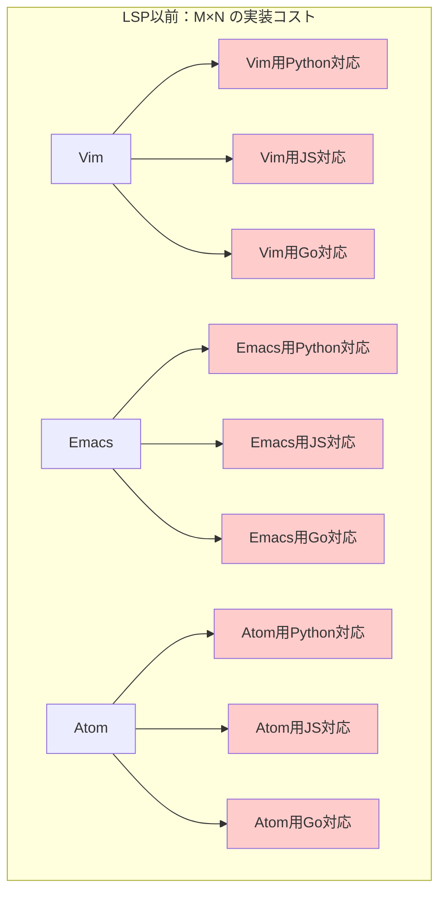
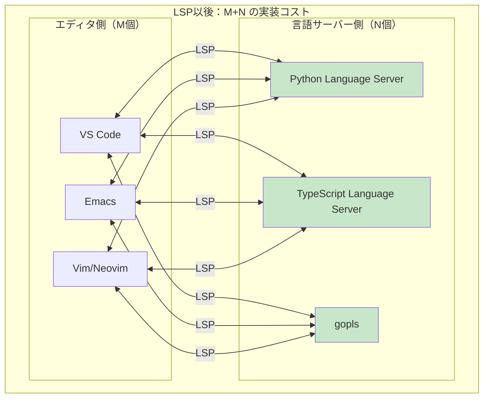
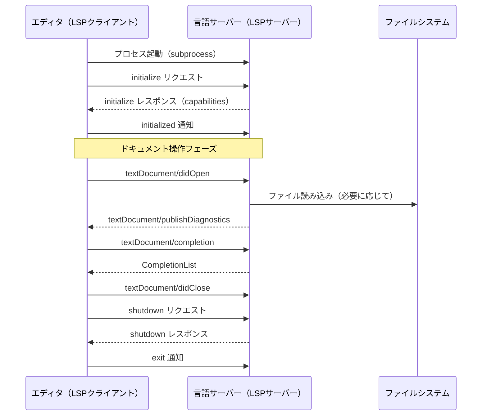
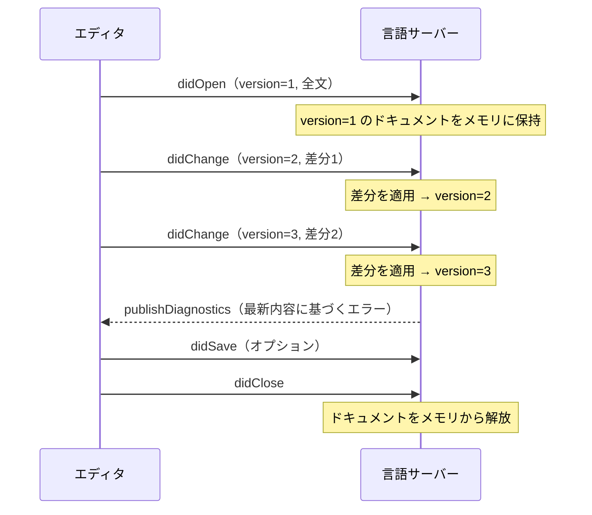
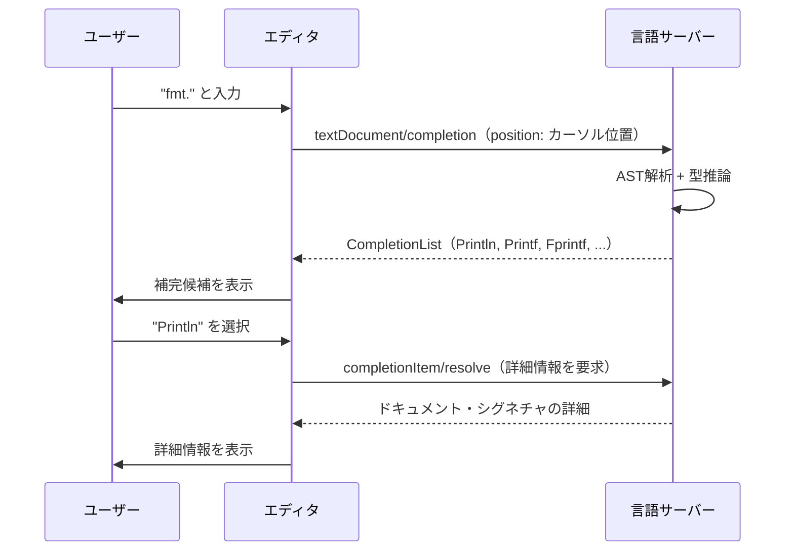
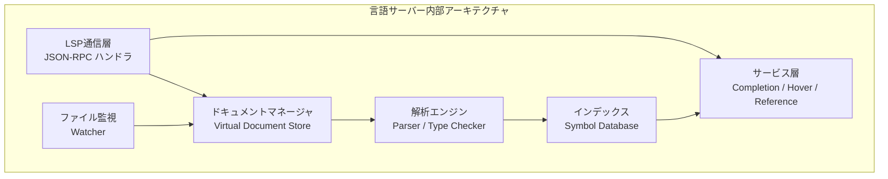
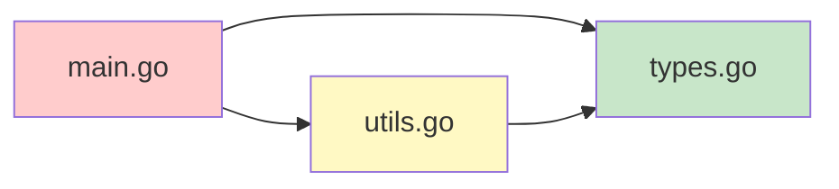
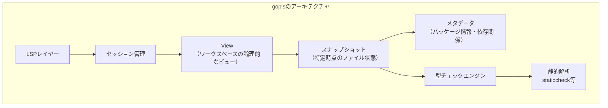
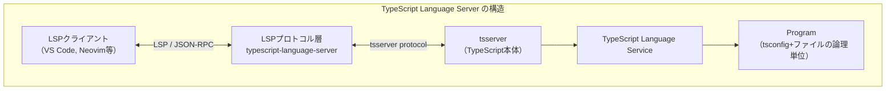
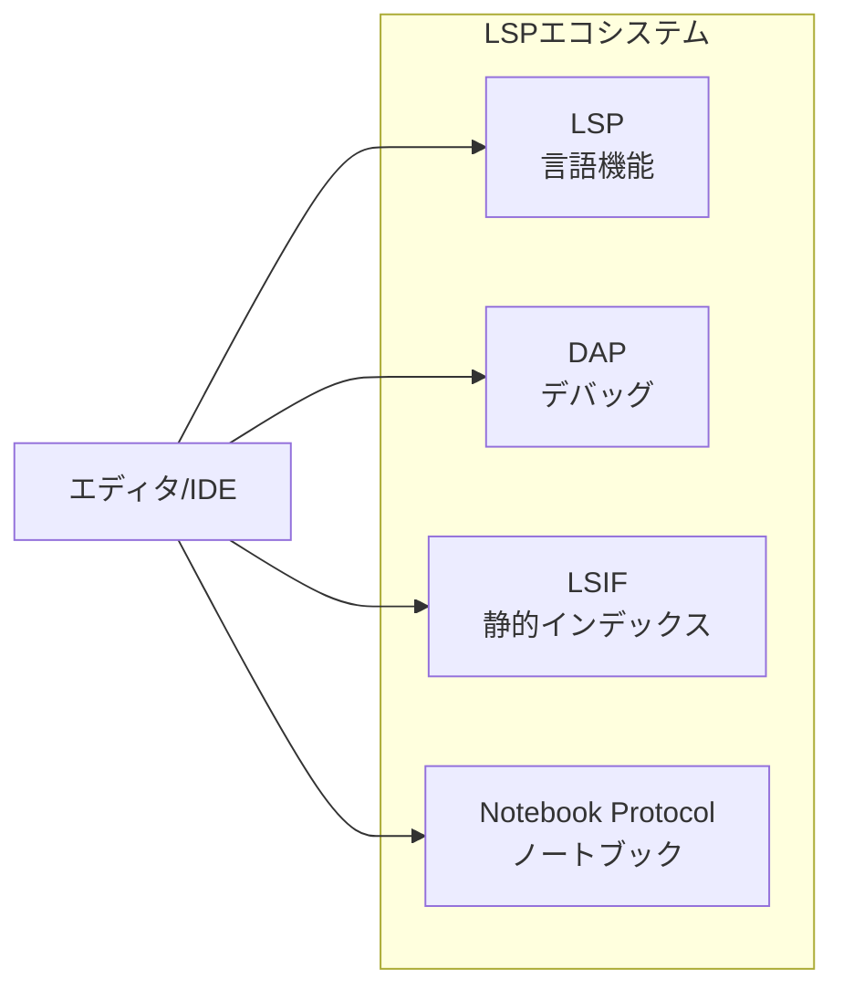

# Language Server Protocol（LSP）の仕組み

## 1. LSP登場以前の世界：M×N問題

### 1.1 エディタと言語の組み合わせ爆発

現代のソフトウェア開発において、コード補完、定義ジャンプ、エラー表示といった機能はIDEやエディタに欠かせない存在となっている。しかしこれらの機能を提供するには、各プログラミング言語の構文解析・型解析・シンボル解決を深く理解したツールが必要であり、2010年代前半まではその実装はエディタやIDEごとに個別に行われていた。

その結果として生まれた問題が「**M×N問題**」である。M個のエディタ（Vim, Emacs, Sublime Text, Atom, Visual Studio Code, ...）とN個のプログラミング言語（Python, JavaScript, Go, Rust, Java, C++, ...）が存在するとき、理想的なIDE機能を全組み合わせで提供するには、M×N個の実装が必要になる。



### 1.2 重複実装がもたらした歪み

M×N問題の深刻さは単なる実装コストにとどまらなかった。それぞれのエディタプラグインは独立した実装であるため：

- **品質のばらつき**：VimのPythonプラグインが高品質でも、AtomのPythonプラグインが低品質、という状況が当たり前だった
- **タイムラグ**：言語仕様が更新されても、全エディタの対応が揃うまでに何年もかかることがあった
- **メンテナンス負荷**：言語プラグインの開発者は自分が使うエディタの実装しかメンテナンスしないため、他のエディタへの移植は放置されがちだった
- **シンボル解決の不完全さ**：型情報やクロスファイル参照などの高度な機能は実装が困難で、多くのプラグインが限定的な対応しかしていなかった

### 1.3 LSPによる解決：M+N へ

2016年、Microsoftは**Language Server Protocol（LSP）**をオープン標準として公開した。LSPの中心的なアイデアはシンプルである。言語の解析ロジックを「言語サーバー」として独立したプロセスに切り出し、エディタとはプロトコルを介して通信させる。



エディタはLSPクライアントとしての実装（M個）を持ち、言語サーバーはLSPサーバーとしての実装（N個）を持つ。組み合わせは共通のプロトコルが吸収するため、実装コストはM×NからM+Nに削減される。

## 2. LSPのアーキテクチャ

### 2.1 クライアント-サーバーモデル

LSPは**クライアント-サーバーモデル**を採用している。エディタ（クライアント）が言語サーバー（サーバー）を起動し、プロセス間通信（IPC）または標準入出力（stdin/stdout）を介してメッセージを交換する。



言語サーバーは通常、エディタが管理するサブプロセスとして動作する。エディタが終了すれば言語サーバーも終了する。ただし一部の実装では、常駐デーモンとして動作し複数エディタインスタンスからの接続を受け付けるものもある。

### 2.2 JSON-RPCプロトコル

LSPの通信プロトコルの基盤は**JSON-RPC 2.0**である。JSON-RPCは、JSONを使ったリモートプロシージャコールのプロトコルであり、リクエスト・レスポンス・通知の3種類のメッセージタイプを定義している。

LSPではJSON-RPCに**HTTPライクなヘッダー**を付加した形式を使用する：

```
Content-Length: <バイト数>\r\n
\r\n
<JSONペイロード>
```

#### リクエストメッセージ

リクエストはサーバーからのレスポンスを期待するメッセージであり、一意な `id` を持つ：

```json
{
  "jsonrpc": "2.0",
  "id": 1,
  "method": "textDocument/completion",
  "params": {
    "textDocument": {
      "uri": "file:///path/to/main.go"
    },
    "position": {
      "line": 10,
      "character": 5
    }
  }
}
```

#### レスポンスメッセージ

レスポンスはリクエストの `id` に対応し、`result` または `error` のいずれかを含む：

```json
{
  "jsonrpc": "2.0",
  "id": 1,
  "result": {
    "isIncomplete": false,
    "items": [
      {
        "label": "Println",
        "kind": 3,
        "detail": "func(a ...any) (n int, err error)",
        "documentation": "Println formats..."
      }
    ]
  }
}
```

#### 通知メッセージ

通知はレスポンスを期待しない一方向メッセージであり、`id` を持たない。`textDocument/didChange` のようなドキュメント変更の通知や、サーバーからクライアントへの `textDocument/publishDiagnostics` はすべて通知として実装される：

```json
{
  "jsonrpc": "2.0",
  "method": "textDocument/publishDiagnostics",
  "params": {
    "uri": "file:///path/to/main.go",
    "diagnostics": [
      {
        "range": {
          "start": { "line": 5, "character": 0 },
          "end": { "line": 5, "character": 10 }
        },
        "severity": 1,
        "message": "undefined: fmt.Printlnn"
      }
    ]
  }
}
```

## 3. Capability Negotiation（機能交渉）

### 3.1 なぜ機能交渉が必要か

LSPは仕様としては多くの機能を定義しているが、すべての言語サーバーがすべての機能を実装しているわけではない。シェルスクリプト用の言語サーバーは型推論ベースのコード補完を提供できないかもしれないし、最小限のサーバーは診断（エラー表示）しか提供しないかもしれない。

また、エディタ側でも対応状況は異なる。古いバージョンのエディタはセマンティックトークン等の新機能をサポートしていないかもしれない。

このような現実に対応するため、LSPでは**Capability Negotiation**（機能交渉）という仕組みを採用している。

### 3.2 initializeハンドシェイク

セッション開始時に行われる `initialize` リクエストにおいて、クライアントとサーバーは互いの対応機能を宣言し合う。

クライアントからのリクエスト例：

```json
{
  "jsonrpc": "2.0",
  "id": 0,
  "method": "initialize",
  "params": {
    "processId": 12345,
    "rootUri": "file:///workspace/myproject",
    "capabilities": {
      "textDocument": {
        "completion": {
          "completionItem": {
            "snippetSupport": true,
            "documentationFormat": ["markdown", "plaintext"]
          }
        },
        "hover": {
          "contentFormat": ["markdown", "plaintext"]
        },
        "semanticTokens": {
          "requests": {
            "full": { "delta": true },
            "range": true
          },
          "tokenTypes": ["namespace", "class", "function", "variable"],
          "tokenModifiers": ["declaration", "readonly"]
        }
      },
      "workspace": {
        "workspaceFolders": true,
        "didChangeWatchedFiles": {
          "dynamicRegistration": true
        }
      }
    }
  }
}
```

サーバーからのレスポンス例（`ServerCapabilities`）：

```json
{
  "jsonrpc": "2.0",
  "id": 0,
  "result": {
    "capabilities": {
      "textDocumentSync": {
        "openClose": true,
        "change": 2
      },
      "completionProvider": {
        "triggerCharacters": [".", ":"],
        "resolveProvider": true
      },
      "hoverProvider": true,
      "definitionProvider": true,
      "referencesProvider": true,
      "documentFormattingProvider": true,
      "renameProvider": {
        "prepareProvider": true
      },
      "semanticTokensProvider": {
        "legend": {
          "tokenTypes": ["namespace", "class", "function", "variable", "parameter"],
          "tokenModifiers": ["declaration", "definition", "readonly", "static"]
        },
        "full": { "delta": true },
        "range": false
      }
    },
    "serverInfo": {
      "name": "gopls",
      "version": "0.15.0"
    }
  }
}
```

`textDocumentSync` の `change` フィールドは `1`（Full sync）または `2`（Incremental sync）を取り、ドキュメント同期の方式を示す。

::: tip 動的な機能登録
一部の機能はセッション開始後に動的に登録・解除することもできる。`client/registerCapability` リクエストを使うと、サーバーはクライアントに対して特定の機能の有効化を要求できる。これにより、プロジェクトの種類に応じて必要な機能だけを有効にするといった最適化が可能になる。
:::

## 4. ドキュメント同期の仕組み

### 4.1 Virtual Document Model

LSPでは、開いているファイルの内容は**サーバー側でメモリ上に管理されるバーチャルドキュメント**として扱われる。エディタが `textDocument/didOpen` を送信した瞬間から、サーバーはそのファイルの「正規の内容」を自分のメモリ上に保持し、ディスク上のファイルではなくメモリ上のバーチャルドキュメントを解析の対象とする。

これにより、ユーザーがファイルを保存する前のタイミング——つまり編集途中の未保存状態——でも正確な補完やエラー表示が提供できる。

### 4.2 Full Sync vs Incremental Sync

ドキュメントの変更通知には2つのモードがある。

**Full Sync（`TextDocumentSyncKind.Full`, 値: 1）**

変更のたびにドキュメント全体のテキストを送信する。実装は単純だが、大きなファイルでは通信コストが高い。

```json
{
  "method": "textDocument/didChange",
  "params": {
    "textDocument": {
      "uri": "file:///path/to/main.go",
      "version": 3
    },
    "contentChanges": [
      {
        "text": "package main\n\nimport \"fmt\"\n\nfunc main() {\n\tfmt.Println(\"hello\")\n}\n"
      }
    ]
  }
}
```

**Incremental Sync（`TextDocumentSyncKind.Incremental`, 値: 2）**

変更された範囲（range）と新しいテキストのみを送信する。通信効率が高く、パフォーマンスが重要なケースで有効。

```json
{
  "method": "textDocument/didChange",
  "params": {
    "textDocument": {
      "uri": "file:///path/to/main.go",
      "version": 4
    },
    "contentChanges": [
      {
        "range": {
          "start": { "line": 5, "character": 13 },
          "end": { "line": 5, "character": 18 }
        },
        "text": "\"world\""
      }
    ]
  }
}
```

`version` フィールドはドキュメントの変更回数を追跡するカウンターであり、変更のたびにインクリメントされる。サーバーはこれを使って変更の順序が正しいことを検証できる。



::: warning バージョン不整合
version のカウントが不整合になると、サーバーはドキュメントを正しく追跡できなくなる。このような場合、実装によってはサーバーが `didClose` + `didOpen` をトリガーして再同期を行う。
:::

## 5. 主要なリクエストと通知

### 5.1 Completion（コード補完）

コード補完は `textDocument/completion` リクエストで行われる。エディタはカーソル位置を送り、サーバーは `CompletionList` を返す。



補完アイテムには様々な種類（`CompletionItemKind`）がある：

| 値 | 種類 | 説明 |
|---|---|---|
| 1 | Text | 単純なテキスト |
| 2 | Method | メソッド |
| 3 | Function | 関数 |
| 6 | Variable | 変数 |
| 7 | Class | クラス |
| 9 | Module | モジュール/パッケージ |
| 15 | Snippet | スニペット展開 |

スニペット補完では、展開後にカーソルを特定の位置に配置したり、タブストップを複数設定したりできる：

```json
{
  "label": "for loop",
  "kind": 15,
  "insertTextFormat": 2,
  "insertText": "for ${1:i} := 0; ${1:i} < ${2:n}; ${1:i}++ {\n\t$0\n}"
}
```

### 5.2 Hover（ホバー情報）

`textDocument/hover` はカーソル下のシンボルに関する情報を返す。型情報やドキュメントコメントが表示される。

```json
// Request
{
  "method": "textDocument/hover",
  "params": {
    "textDocument": { "uri": "file:///main.go" },
    "position": { "line": 5, "character": 5 }
  }
}

// Response
{
  "result": {
    "contents": {
      "kind": "markdown",
      "value": "```go\nfunc fmt.Println(a ...any) (n int, err error)\n```\n\nPrintln formats using the default formats for its operands..."
    },
    "range": {
      "start": { "line": 5, "character": 4 },
      "end": { "line": 5, "character": 11 }
    }
  }
}
```

### 5.3 Go to Definition（定義ジャンプ）

`textDocument/definition` はシンボルの定義箇所を返す。複数の定義が存在する場合は配列で返す。

```json
// Response
{
  "result": [
    {
      "uri": "file:///usr/local/go/src/fmt/print.go",
      "range": {
        "start": { "line": 272, "character": 5 },
        "end": { "line": 272, "character": 12 }
      }
    }
  ]
}
```

関連するリクエストとして `textDocument/declaration`（宣言）、`textDocument/typeDefinition`（型定義）、`textDocument/implementation`（インターフェース実装）がある。

### 5.4 Find References（参照検索）

`textDocument/references` は指定されたシンボルが参照されているすべての箇所を返す。`includeDeclaration` パラメータで定義箇所を結果に含めるかを制御できる。

```json
{
  "method": "textDocument/references",
  "params": {
    "textDocument": { "uri": "file:///main.go" },
    "position": { "line": 3, "character": 5 },
    "context": {
      "includeDeclaration": true
    }
  }
}
```

### 5.5 Rename（リネーム）

シンボルのリネームは2段階で行われる。まず `textDocument/prepareRename` でリネームが可能かを確認し、次に `textDocument/rename` で実際の変更を要求する。

サーバーは `WorkspaceEdit` を返す。これはファイルパスとテキスト変更のマップであり、エディタはこれに従って複数ファイルにまたがる変更を一括で適用する：

```json
{
  "result": {
    "changes": {
      "file:///main.go": [
        {
          "range": {
            "start": { "line": 3, "character": 0 },
            "end": { "line": 3, "character": 8 }
          },
          "newText": "newName"
        }
      ],
      "file:///utils.go": [
        {
          "range": {
            "start": { "line": 15, "character": 4 },
            "end": { "line": 15, "character": 12 }
          },
          "newText": "newName"
        }
      ]
    }
  }
}
```

### 5.6 Code Actions（コードアクション）

`textDocument/codeAction` はカーソル位置または選択範囲に適用できるアクションの一覧を返す。クイックフィックス、リファクタリング、自動インポートなどが該当する。

アクションには種類（`CodeActionKind`）がある：

- `quickfix`：診断に基づく自動修正
- `refactor`：リファクタリング（変数抽出、メソッド抽出など）
- `refactor.rewrite`：コードの書き換え
- `source.organizeImports`：import文の整理
- `source.fixAll`：全修正の一括適用

### 5.7 Diagnostics（診断情報）

診断情報はサーバーからクライアントへの**通知**として送信される（`textDocument/publishDiagnostics`）。これはプッシュモデルであり、エディタがリクエストするのではなく、サーバーが必要なタイミングで能動的に送信する。

各 `Diagnostic` は以下のフィールドを持つ：

```json
{
  "range": { /* エラーの位置 */ },
  "severity": 1,        // 1=Error, 2=Warning, 3=Information, 4=Hint
  "code": "E0308",      // 言語固有のエラーコード
  "source": "rustc",    // 診断を生成したツール名
  "message": "型が一致しません",
  "relatedInformation": [
    {
      "location": { "uri": "...", "range": { /* */ } },
      "message": "ここで宣言された型は..."
    }
  ],
  "tags": [1]           // 1=Unnecessary, 2=Deprecated
}
```

::: details LSP 3.17 以降のプル型診断
LSP 3.17では、サーバーからのプッシュではなくクライアントがリクエストする「プル型診断」（`textDocument/diagnostic`）も追加された。これにより、エディタが必要なタイミングで診断を取得するオンデマンドモデルが可能になる。
:::

## 6. Semantic Tokens（セマンティックトークン）

### 6.1 構文強調表示の進化

従来のシンタックスハイライトは、正規表現やTextMate文法ベースのルールによって行われていた。これは処理が軽量だが、言語の意味（セマンティクス）を理解しているわけではないため、例えば変数と関数を区別したり、ローカル変数と型パラメータを区別したりすることが難しかった。

**Semantic Tokens**（LSP 3.16で追加）は、言語サーバーがプログラムの意味的な理解に基づいてトークンの分類情報を提供する機能である。これにより、型推論を経た正確なハイライトが実現できる。

### 6.2 エンコーディング形式

セマンティックトークンは効率のためにエンコードされた整数配列として返される。各トークンは5つの整数で表現される：

```
[ deltaLine, deltaStartChar, length, tokenType, tokenModifiers ]
```

- `deltaLine`：前のトークンからの行の差分
- `deltaStartChar`：同じ行の場合は前のトークンからの文字位置差分、異なる行の場合は行の先頭からの文字位置
- `length`：トークンの長さ
- `tokenType`：トークン種別のインデックス（`legend.tokenTypes` の配列インデックス）
- `tokenModifiers`：修飾子のビットマスク（`legend.tokenModifiers` の各要素に対応するビット）

```json
{
  "result": {
    "resultId": "token-v1",
    "data": [
      0, 0, 7, 0, 0,   // line 0, char 0, len=7, type=namespace, no modifiers
      0, 8, 4, 2, 1,   // line 0, char 8, len=4, type=function, modifier=declaration
      1, 4, 3, 5, 0    // line 1, char 4, len=3, type=variable, no modifiers
    ]
  }
}
```

### 6.3 デルタ更新

ファイルが変更された場合、全トークンを再送するのは非効率である。LSPはデルタ更新をサポートしており、`textDocument/semanticTokens/full/delta` を使うと前回の結果からの差分だけを取得できる。サーバーは `resultId` を返し、クライアントはこれを次のリクエストで提示して差分取得を行う。

## 7. ワークスペース管理とファイル監視

### 7.1 ワークスペースフォルダー

LSPはモノレポや複数プロジェクトを横断する開発に対応するため、**ワークスペースフォルダー**の概念を持つ。`initialize` 時に複数のルートフォルダーを指定でき、サーバーはそれらすべてにまたがる参照解決を行える。

```json
{
  "workspaceFolders": [
    { "uri": "file:///workspace/frontend", "name": "frontend" },
    { "uri": "file:///workspace/backend", "name": "backend" },
    { "uri": "file:///workspace/shared", "name": "shared" }
  ]
}
```

### 7.2 ファイル変更の監視

エディタの外部（ターミナルでのファイル操作やgit操作）でファイルが変更された場合、言語サーバーはそれを知る必要がある。`workspace/didChangeWatchedFiles` 通知により、クライアントはファイルシステムの変更をサーバーに伝達する。

監視パターンは `workspace/watchedFiles` の動的登録で設定できる：

```json
{
  "method": "client/registerCapability",
  "params": {
    "registrations": [
      {
        "id": "watch-go-files",
        "method": "workspace/didChangeWatchedFiles",
        "registerOptions": {
          "watchers": [
            { "globPattern": "**/*.go" },
            { "globPattern": "go.mod" },
            { "globPattern": "go.sum" }
          ]
        }
      }
    ]
  }
}
```

### 7.3 ワークスペースシンボル

`workspace/symbol` リクエストはプロジェクト全体のシンボル（クラス、関数、変数など）を検索するために使用する。エディタの「シンボル検索」機能（VS Codeの `Ctrl+T`）に対応する。

## 8. LSPの実装パターン

### 8.1 言語サーバーの基本構造

言語サーバーの実装は、大まかに以下の層から構成される：



### 8.2 Tree-sitter連携

**Tree-sitter**は、インクリメンタル構文解析のためのパーサーライブラリであり、多くの言語サーバーがASTの構築に活用している。Tree-sitterの主要な特徴は：

- **インクリメンタル解析**：ファイルの変更部分だけを再解析する。大きなファイルでも高速。
- **エラー耐性**：構文エラーがあっても部分的なASTを生成し続ける。入力中の不完全なコードでも補完が機能する。
- **多言語サポート**：Go, Rust, TypeScript, Python など多数の言語の文法定義がある。

```
// Example: Incremental parse with Tree-sitter
// Only the changed subtree is reparsed
tree.edit({
  startIndex: 50,
  oldEndIndex: 65,
  newEndIndex: 70,
  startPosition: { row: 3, column: 4 },
  oldEndPosition: { row: 3, column: 19 },
  newEndPosition: { row: 3, column: 24 }
});
const newTree = parser.parse(newSource, tree); // reuse unchanged nodes
```

### 8.3 型情報とインクリメンタル解析

高品質な補完・リファクタリングには型情報が不可欠である。型推論は計算コストが高いため、多くの言語サーバーは**インクリメンタルな型チェック**を実装している。

典型的なアプローチ：

1. **ファイルグラフの構築**：ファイル間の依存関係をグラフとして管理する
2. **変更の影響範囲の計算**：変更されたファイルとその依存ファイルだけを再解析する
3. **キャッシュ**：変更のないファイルの解析結果をキャッシュする



この例で `utils.go` が変更された場合、再解析が必要なのは `utils.go` と `main.go` だけであり、`types.go` のキャッシュは再利用できる。

## 9. 代表的な言語サーバーの実装

### 9.1 gopls（Go Language Server）

**gopls**（発音: "go please"）はGoチームが開発・メンテナンスする公式の言語サーバーである。

主な特徴：

- **モジュール対応**：Go Modulesを完全にサポートし、`go.mod` に基づく依存関係解決を行う
- **ワークスペース解析**：モノレポにおける複数モジュールの横断的な解析
- **静的解析統合**：`staticcheck` や各種アナライザーが組み込まれており、高度な診断を提供する
- **インクリメンタル型チェック**：変更されたパッケージとその依存パッケージのみを再型チェックする



goplsの設計上の興味深い点として、**スナップショットモデル**がある。ファイルの各バージョンを不変のスナップショットとして管理するため、並行した解析処理が安全に行える。

### 9.2 rust-analyzer

**rust-analyzer**はRustの言語サーバーであり、Rustコンパイラ（rustc）とは独立した実装を持つ。その設計思想は「**問い合わせベースのコンパイル（Query-based compilation）**」にある。

中心にあるのは**Salsa**というインクリメンタル計算フレームワークである。Salsaはデータベースのようなクエリシステムであり：

- 全ての解析結果（ASTの構築、名前解決、型推論など）がクエリとして定義される
- 各クエリの結果はキャッシュされる
- クエリの入力（ファイル内容）が変更された場合、その結果に依存するクエリのみが無効化（invalidate）され再計算される

このアーキテクチャにより、rust-analyzerは大規模なRustプロジェクトでも高いパフォーマンスを発揮する。

::: details rust-analyzerのエラー耐性
rust-analyzerは構文エラーがあるファイルでも可能な限り解析を続けるよう設計されている。エラー耐性のある構文解析により、入力途中のコードでも補完・ホバーが機能する。これはIDEとして使われることを前提とした設計の結果である。
:::

### 9.3 TypeScript Language Server

**tsserver**（TypeScript Language Server）はMicrosoftがTypeScript/JavaScriptのために開発した言語サーバーであり、LSPに先行して存在していた。VS CodeはLSPクライアントとして `vscode-languageclient` ライブラリを通じて tsserver と通信する。

tsserverの特徴：

- **JavaScriptにも対応**：JSDocコメントや `@ts-check` を通じてJavaScriptプロジェクトにも型情報を提供する
- **高速なインクリメンタル更新**：ファイル変更時の再コンパイルを最小限に抑える専用の「language service」を持つ
- **プロジェクト参照**：`tsconfig.json` の `references` 機能を通じてモノレポ構成に対応



::: warning LSPとtsserverプロトコルの関係
tsserverは独自のプロトコル（tsserverプロトコル）を持つ。`typescript-language-server` というラッパーが、外部向けにLSPインターフェースを提供しつつ内部でtsserverとやり取りするという2層構造になっている。
:::

## 10. LSPの制約と発展

### 10.1 LSPの現実的な制約

LSPが解決した問題は大きいが、すべての課題が解決されたわけではない：

**プロトコルのバージョン管理**
LSPのバージョンアップに伴い、新機能がどのバージョンから使えるかを管理する必要がある。エディタと言語サーバーのバージョンの組み合わせによっては、一部の機能が使えない場合がある。

**言語固有の機能の欠如**
LSPは汎用プロトコルであるため、特定の言語に特化した機能を表現できないことがある。例えばRustのライフタイム可視化やElixirのパイプ演算子のリファクタリングなど、LSPに定義がない機能はプロトコル外の拡張として実装されることになる。

**大規模プロジェクトでの起動時間**
言語サーバーの初期化には、プロジェクト全体のインデックス構築が必要な場合がある。数万ファイルを持つ大規模プロジェクトでは、起動直後しばらくの間は機能が制限されることがある。

### 10.2 LSPを超えた拡張

LSPのエコシステムは、プロトコル仕様を補完するさまざまな取り組みを生んでいる：

**Debug Adapter Protocol（DAP）**
デバッグ機能をLSP同様のM+Nモデルで提供するMicrosoftのプロトコル。言語サーバーとは別プロセスとして動作するデバッグアダプターを定義する。

**Language Server Index Format（LSIF）**
コードを実行せずにLSP的なナビゲーション機能を提供するためのインデックス形式。GitHubのコードナビゲーション機能はこれを利用している。

**Notebook Document Protocol**
Jupyter Notebookのようなノートブック形式のドキュメントに対応するLSPの拡張。



### 10.3 LSPが変えた開発ツールの生態系

LSPの登場は、エディタと言語ツールの関係を根本的に変えた。かつてはEclipseやIntelliJ IDEAのような大型IDEのみが高品質な言語サポートを提供できた。LSPにより、Vim/Neovim、Emacs、Helix、Zeledといる軽量エディタでも同等の機能が利用可能になった。

さらに、言語サーバーの実装者にとっても恩恵は大きい。新しいプログラミング言語を作った際、LSPに準拠した言語サーバーを一つ実装すれば、主要なすべてのエディタで高品質なIDE機能が利用可能になる。これは言語のエコシステム形成において無視できない優位性をもたらしている。

## 11. まとめ

Language Server Protocolは、M×N問題という実践的な課題に対する、エレガントなアーキテクチャ的解決策である。JSON-RPCというシンプルな通信プロトコルの上に、ドキュメント同期・補完・診断・リファクタリングといった豊富な機能セットを定義し、エディタと言語ツールの分離を実現した。

LSPの設計から学べる教訓として、**プロトコルによる分離**の威力がある。複雑な問題をクライアントとサーバーの役割に分け、その間を標準化されたプロトコルでつなぐことで、実装の多様性を保ちながら相互運用性を確保できる。この考え方はLSPに限らず、ソフトウェアアーキテクチャの広い場面で応用できる原則である。

gopls, rust-analyzer, TypeScript Language Serverに見られるように、優れた言語サーバーの実装はその言語の設計と深く結びついており、インクリメンタル解析・クエリベースのキャッシュ・スナップショットモデルといった高度な技術を駆使している。LSPというプロトコルの理解は、これらの言語ツールの設計を深く理解する入口ともなる。
