# リーダーボード設計 — Redis Sorted Set, ランキング, リアルタイム更新

## 1. リーダーボードとは何か — 要件の整理

### 1.1 ランキングの普遍性

リーダーボード（Leaderboard）とは、ユーザーやエンティティをスコアに基づいて順序付けし、その順位を表示する仕組みである。ゲームのハイスコアランキング、SNS のフォロワー数ランキング、EC サイトの売上ランキング、社内の営業成績ダッシュボードなど、その用途は非常に幅広い。

一見すると「スコアでソートするだけ」の単純な機能に見えるが、実際にはリアルタイム性、大規模データへの対応、タイブレーク（同点処理）、時間ウィンドウ付きランキング、ページネーションなど、多くの設計上の課題が潜んでいる。特にユーザー数が数百万〜数億に達するサービスでは、これらの課題を適切に解決しなければ、ユーザー体験の劣化やインフラコストの増大を招く。

### 1.2 典型的な機能要件

リーダーボードシステムに求められる機能要件は、概ね以下のように分類できる。

| 機能 | 説明 | 例 |
|------|------|-----|
| スコア更新 | ユーザーのスコアを追加・更新する | ゲームでステージクリア時にスコアを加算 |
| Top-N 取得 | 上位 N 件のユーザーとスコアを取得する | トップ 100 ランキング表示 |
| 順位取得 | 特定ユーザーの現在の順位を取得する | 「あなたは 12,345 位です」 |
| 周辺順位取得 | 特定ユーザーの前後 M 件を取得する | 自分の前後 5 人のプレイヤーを表示 |
| 時間ウィンドウ | 日次・週次・月次など期間限定のランキング | 今週のランキング |
| ページネーション | ランキングを分割して表示する | 1 ページ 50 件ずつ閲覧 |
| タイブレーク | 同点の場合の順序決定 | 同スコアなら先に達成した方が上位 |

### 1.3 非機能要件

非機能要件はシステムの規模やユースケースによって大きく変わるが、共通して考慮すべき項目がある。

**リアルタイム性**: ゲームのリーダーボードでは、スコアの更新が数秒以内にランキングに反映されることが期待される。一方、日次売上ランキングであれば数分〜数十分の遅延が許容されることもある。

**スケーラビリティ**: ユーザー数の増加に対して、クエリのレイテンシが線形に増加しないこと。100 万ユーザーでも 1 億ユーザーでも、Top-N の取得や順位の問い合わせが一定時間内に完了することが求められる。

**可用性**: ランキングシステムが停止してもメインのサービスには影響しないよう、適切な分離と冗長化が必要である。

**一貫性**: 厳密な一貫性（全ユーザーが常に最新のランキングを見る）が必要なのか、結果整合性で十分なのかは、ユースケースに依存する。多くの場合、数秒程度の遅延は許容される。

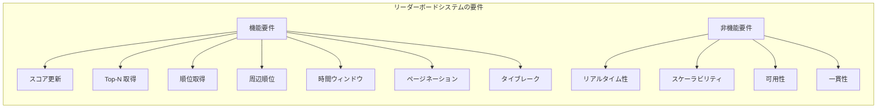

---

## 2. Redis Sorted Set の活用

### 2.1 Sorted Set の基本構造

Redis の Sorted Set（ZSET）は、リーダーボードの実装に最も適したデータ構造の一つである。Sorted Set は、各メンバーにスコア（浮動小数点数）を関連付けて管理するコレクションであり、以下の特性を持つ。

- メンバーは一意（同一メンバーの重複は許可されない）
- スコアによる自動ソート
- スコアが同じメンバーはメンバー名の辞書順でソート
- O(log N) でのスコア更新・順位取得

内部的には、Redis の Sorted Set は**スキップリスト（Skip List）**と**ハッシュテーブル**の2つのデータ構造を併用している。スキップリストは範囲検索と順位計算に、ハッシュテーブルはメンバーからスコアへの O(1) ルックアップに使われる。

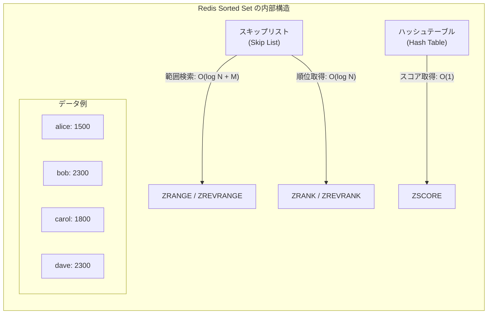

::: tip スキップリストの選択理由
Redis の作者 Salvatore Sanfilippo（antirez）は、バランス木（赤黒木や AVL 木）ではなくスキップリストを採用した理由として、実装のシンプルさ、範囲操作の効率性、そしてロックフリーな並行制御の容易さを挙げている。バランス木と比較して理論的な計算量は同等だが、実装と保守のコストが大幅に低い。
:::

### 2.2 基本コマンドとリーダーボード操作

Redis の Sorted Set コマンドは、リーダーボードの操作にほぼ1対1で対応する。

#### スコアの追加・更新

```redis
# Add or update a user's score
ZADD leaderboard 1500 alice
ZADD leaderboard 2300 bob
ZADD leaderboard 1800 carol

# Increment score (e.g., adding 200 points)
ZINCRBY leaderboard 200 alice
```

`ZADD` はメンバーが存在しなければ追加、存在すれば更新する。`ZINCRBY` はアトミックにスコアをインクリメントする。いずれも O(log N) で完了する。

#### Top-N ランキング取得

```redis
# Get top 10 (descending order with scores)
ZREVRANGE leaderboard 0 9 WITHSCORES
```

`ZREVRANGE` はスコアの降順でメンバーを取得する。O(log N + M) で、M は取得件数。Top 10 を取得する場合、N が 1,000 万でも M=10 なので極めて高速である。

#### 特定ユーザーの順位取得

```redis
# Get rank of a specific user (0-based, descending)
ZREVRANK leaderboard alice
```

`ZREVRANK` はスコアの降順での順位を O(log N) で返す。0-based なので、表示用には +1 する。

#### ユーザーのスコア取得

```redis
# Get score of a specific user
ZSCORE leaderboard alice
```

`ZSCORE` はハッシュテーブルを使って O(1) でスコアを取得する。

### 2.3 計算量のまとめ

| 操作 | コマンド | 計算量 |
|------|---------|--------|
| スコア追加/更新 | `ZADD` | O(log N) |
| スコアインクリメント | `ZINCRBY` | O(log N) |
| Top-N 取得 | `ZREVRANGE` | O(log N + M) |
| 順位取得 | `ZREVRANK` | O(log N) |
| スコア取得 | `ZSCORE` | O(1) |
| メンバー削除 | `ZREM` | O(log N) |
| メンバー数取得 | `ZCARD` | O(1) |
| スコア範囲のメンバー数 | `ZCOUNT` | O(log N) |

N = Sorted Set のメンバー数、M = 取得件数

### 2.4 実装例: 基本的なリーダーボード API

以下は Python と Redis を用いた基本的なリーダーボード API の実装例である。

```python
import redis
from typing import Optional

class Leaderboard:
    def __init__(self, name: str, redis_client: redis.Redis):
        self.name = name
        self.r = redis_client

    def update_score(self, user_id: str, score: float) -> None:
        """Set a user's score (overwrite)."""
        self.r.zadd(self.name, {user_id: score})

    def increment_score(self, user_id: str, delta: float) -> float:
        """Atomically increment a user's score and return new value."""
        return self.r.zincrby(self.name, delta, user_id)

    def get_top_n(self, n: int) -> list[tuple[str, float]]:
        """Get top N users with scores (descending)."""
        return self.r.zrevrange(self.name, 0, n - 1, withscores=True)

    def get_rank(self, user_id: str) -> Optional[int]:
        """Get 1-based rank of a user (descending order)."""
        rank = self.r.zrevrank(self.name, user_id)
        return rank + 1 if rank is not None else None

    def get_score(self, user_id: str) -> Optional[float]:
        """Get a user's current score."""
        return self.r.zscore(self.name, user_id)

    def get_total_members(self) -> int:
        """Get total number of members in the leaderboard."""
        return self.r.zcard(self.name)
```

---

## 3. 時間ウィンドウ付きランキング

### 3.1 なぜ時間ウィンドウが必要か

多くの実用的なリーダーボードでは、「全期間のランキング」だけでなく、「今日のランキング」「今週のランキング」「今月のランキング」のように、特定の時間範囲に限定したランキングが必要になる。これには以下のような理由がある。

- **新規ユーザーの参加意欲**: 全期間のランキングでは古参ユーザーが圧倒的に有利であり、新規ユーザーはモチベーションを維持しにくい
- **公平性の確保**: 期間を区切ることで、すべてのユーザーが同じ条件で競争できる
- **季節性のあるビジネス**: 月次売上ランキングなど、ビジネスの期間に合わせたランキングが必要

### 3.2 キー命名による時間ウィンドウの管理

最もシンプルなアプローチは、時間ウィンドウごとに別々の Sorted Set を作成することである。

```redis
# Daily leaderboard
ZADD leaderboard:daily:2026-03-02 1500 alice
ZADD leaderboard:daily:2026-03-02 2300 bob

# Weekly leaderboard
ZADD leaderboard:weekly:2026-W10 1500 alice
ZADD leaderboard:weekly:2026-W10 2300 bob

# Monthly leaderboard
ZADD leaderboard:monthly:2026-03 1500 alice
ZADD leaderboard:monthly:2026-03 2300 bob
```

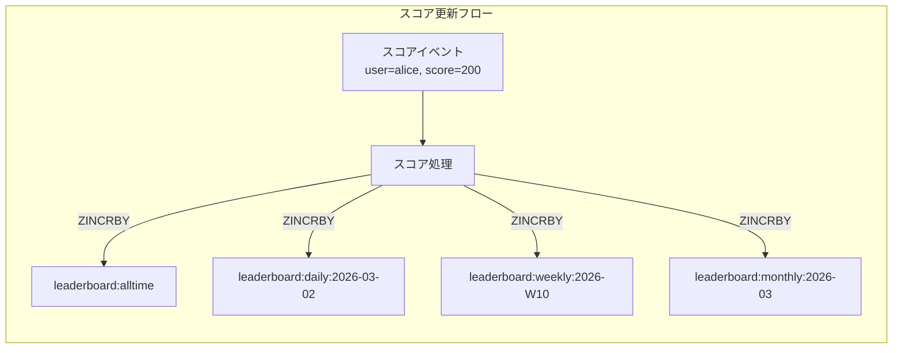

この方式では、スコアの更新時に該当するすべての Sorted Set を更新する。更新は Redis パイプラインでバッチ化できるため、ネットワークラウンドトリップのオーバーヘッドは最小限に抑えられる。

```python
class TimeWindowLeaderboard:
    def __init__(self, redis_client: redis.Redis):
        self.r = redis_client

    def _get_keys(self, base_name: str) -> list[str]:
        """Generate keys for all active time windows."""
        from datetime import datetime
        now = datetime.utcnow()
        return [
            f"{base_name}:alltime",
            f"{base_name}:daily:{now.strftime('%Y-%m-%d')}",
            f"{base_name}:weekly:{now.strftime('%Y-W%V')}",
            f"{base_name}:monthly:{now.strftime('%Y-%m')}",
        ]

    def increment_score(self, base_name: str, user_id: str, delta: float) -> None:
        """Increment score across all time-window leaderboards atomically."""
        keys = self._get_keys(base_name)
        pipe = self.r.pipeline()
        for key in keys:
            pipe.zincrby(key, delta, user_id)
        pipe.execute()
```

### 3.3 古いキーの TTL 管理

時間ウィンドウが過ぎた Sorted Set は不要になるため、TTL（Time To Live）を設定して自動削除する。

```python
def _set_expiry(self, key: str, window_type: str) -> None:
    """Set TTL based on window type to auto-cleanup old leaderboards."""
    ttl_map = {
        "daily": 86400 * 2,    # 2 days
        "weekly": 86400 * 14,  # 2 weeks
        "monthly": 86400 * 62, # ~2 months
    }
    ttl = ttl_map.get(window_type)
    if ttl:
        self.r.expire(key, ttl)
```

::: warning TTL 設定のタイミング
`EXPIRE` は `ZINCRBY` の後に設定する必要がある。また、すでに TTL が設定されているキーに対して `ZINCRBY` を実行しても TTL はリセットされないため、最初の `ZINCRBY` 時にのみ `EXPIRE` を設定すれば十分である。`ZADD` の `NX`（メンバーが存在しない場合のみ追加）フラグの戻り値を見て判定するか、Lua スクリプトでアトミックに処理するとよい。
:::

### 3.4 ZUNIONSTORE による集約

複数日にまたがるカスタム期間のランキングが必要な場合は、`ZUNIONSTORE` で複数の Sorted Set を合算できる。

```redis
# Aggregate last 7 daily leaderboards into a custom weekly view
ZUNIONSTORE leaderboard:custom_week 7
    leaderboard:daily:2026-02-24
    leaderboard:daily:2026-02-25
    leaderboard:daily:2026-02-26
    leaderboard:daily:2026-02-27
    leaderboard:daily:2026-02-28
    leaderboard:daily:2026-03-01
    leaderboard:daily:2026-03-02
    AGGREGATE SUM
```

ただし `ZUNIONSTORE` は計算量が O(N * K + M * log M)（N = 各 Sorted Set の合計メンバー数、K = Sorted Set の数、M = 結果のメンバー数）であり、大規模なデータセットでは計算コストが高い。リアルタイムに呼ばれるリクエストパスで実行するのではなく、バッチ処理で事前に計算しておくのが望ましい。

---

## 4. 相対ランキング — 周辺順位の取得

### 4.1 なぜ周辺順位が重要か

ユーザーが最も関心を持つのは、自分の順位とその前後にいるプレイヤーの情報である。トップ 10 を表示するだけでなく、「あなたは 12,345 位で、12,344 位の bob まであと 50 ポイントです」のような情報を提供することで、ユーザーの競争意欲を刺激できる。

### 4.2 ZREVRANGE による周辺順位取得

Redis では `ZREVRANK` で自分の順位を取得し、その前後を `ZREVRANGE` で取得する。

```python
def get_around_me(self, user_id: str, count: int = 5) -> dict:
    """
    Get the user's rank and surrounding players.
    Returns count players above and below the target user.
    """
    rank = self.r.zrevrank(self.name, user_id)
    if rank is None:
        return {"error": "User not found"}

    start = max(0, rank - count)
    end = rank + count

    entries = self.r.zrevrange(self.name, start, end, withscores=True)

    result = []
    for i, (member, score) in enumerate(entries):
        result.append({
            "rank": start + i + 1,  # 1-based rank
            "user_id": member,
            "score": score,
            "is_self": member == user_id,
        })

    return {
        "my_rank": rank + 1,
        "my_score": self.r.zscore(self.name, user_id),
        "neighbors": result,
    }
```

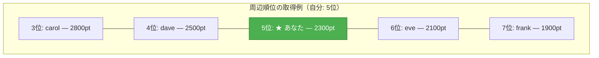

この操作は2回のコマンド呼び出し（`ZREVRANK` + `ZREVRANGE`）で完了し、いずれも O(log N) のため、非常に高速に実行できる。パイプラインを使えばネットワークラウンドトリップも1回で済む。

### 4.3 フレンドランキング

ソーシャルゲームでは、全体ランキングに加えて「フレンド内ランキング」も需要が高い。この場合、フレンド全体のリーダーボードを別途管理するか、全体のリーダーボードからフレンドのスコアのみを取得してアプリケーション側でソートする方法がある。

```python
def get_friend_leaderboard(self, user_id: str, friend_ids: list[str]) -> list[dict]:
    """Get leaderboard among friends using pipeline for efficiency."""
    pipe = self.r.pipeline()
    all_ids = [user_id] + friend_ids

    for fid in all_ids:
        pipe.zscore(self.name, fid)

    scores = pipe.execute()

    entries = []
    for fid, score in zip(all_ids, scores):
        if score is not None:
            entries.append({"user_id": fid, "score": score})

    # Sort by score descending
    entries.sort(key=lambda x: x["score"], reverse=True)

    for i, entry in enumerate(entries):
        entry["rank"] = i + 1
        entry["is_self"] = entry["user_id"] == user_id

    return entries
```

フレンド数が数百人程度であれば、パイプラインで各フレンドのスコアを一括取得し、アプリケーション側でソートするアプローチが現実的である。フレンド数が数千〜数万に達する場合は、フレンドグループごとに専用の Sorted Set を管理するか、後述する RDBMS ベースのアプローチを検討する。

---

## 5. RDBMS での実装パターン

### 5.1 なぜ RDBMS で実装するのか

Redis の Sorted Set はリーダーボードに極めて適しているが、すべてのシステムが Redis を導入しているわけではない。また、トランザクション保証が必要な場合や、ランキングデータと他のビジネスデータを結合して分析する必要がある場合には、RDBMS の方が適している。

### 5.2 基本テーブル設計

```sql
-- Core leaderboard table
CREATE TABLE leaderboard_scores (
    user_id     BIGINT NOT NULL,
    score       BIGINT NOT NULL DEFAULT 0,
    updated_at  TIMESTAMP NOT NULL DEFAULT CURRENT_TIMESTAMP,
    PRIMARY KEY (user_id)
);

-- Index for score-based queries
CREATE INDEX idx_score_desc ON leaderboard_scores (score DESC, updated_at ASC);
```

### 5.3 Top-N クエリ

```sql
-- Get top 10
SELECT user_id, score,
       ROW_NUMBER() OVER (ORDER BY score DESC, updated_at ASC) AS rank
FROM leaderboard_scores
ORDER BY score DESC, updated_at ASC
LIMIT 10;
```

### 5.4 特定ユーザーの順位取得

RDBMS で特定ユーザーの順位を取得するには、主に2つのアプローチがある。

#### 方法 1: COUNT ベース

```sql
-- Get rank by counting users with higher scores
SELECT COUNT(*) + 1 AS rank
FROM leaderboard_scores
WHERE score > (SELECT score FROM leaderboard_scores WHERE user_id = 12345);
```

このクエリは O(N) の走査が必要であり、データ量が多いと遅くなる。ただし、適切なインデックスがあればインデックススキャンで済むため、実用的な性能は確保できることが多い。

#### 方法 2: ウィンドウ関数

```sql
-- Get rank using window function (requires scanning all rows)
SELECT rank FROM (
    SELECT user_id,
           ROW_NUMBER() OVER (ORDER BY score DESC, updated_at ASC) AS rank
    FROM leaderboard_scores
) ranked
WHERE user_id = 12345;
```

ウィンドウ関数を使う方法は全行の走査が必要であり、大規模データではさらに非効率となる。

### 5.5 RDBMS vs Redis の比較

| 観点 | Redis Sorted Set | RDBMS |
|------|------------------|-------|
| Top-N 取得 | O(log N + M) | O(M)（インデックス利用時）|
| 順位取得 | O(log N) | O(N)（COUNT ベース）|
| スコア更新 | O(log N) | O(log N)（インデックス更新）|
| 永続性 | AOF/RDB（制約あり） | ACID 保証 |
| 結合クエリ | 不可 | 自由に結合可能 |
| メモリ効率 | 全データがメモリ上 | ディスクベース |
| 水平スケーリング | Cluster モード | リードレプリカ / シャーディング |
| トランザクション | 限定的（MULTI/EXEC） | 完全な ACID サポート |

::: tip 実務での選択基準
多くのシステムでは、**Redis をリアルタイムのリーダーボードに**、**RDBMS を永続的なスコア記録に**使うハイブリッドアプローチが採用されている。スコアの更新イベントを両方に書き込み、Redis が障害で失われた場合は RDBMS から再構築する。
:::

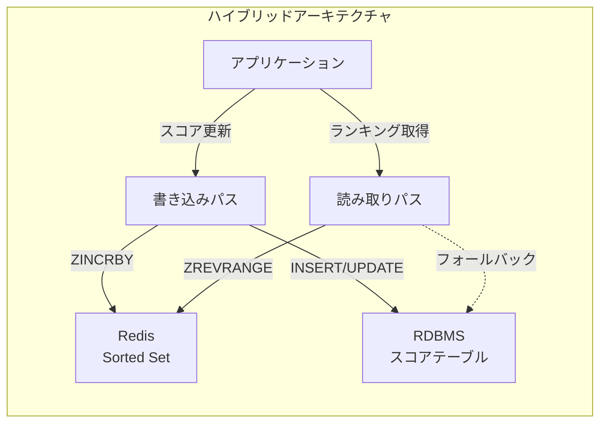

---

## 6. 大規模データでのスケーリング

### 6.1 単一 Redis インスタンスの限界

Redis の Sorted Set は単一インスタンスで数千万メンバーまで対応できるが、それを超えるスケールや、複数のリーダーボードを同時に運用する場合にはスケーリング戦略が必要になる。

単一インスタンスにおけるメモリ使用量の目安として、1,000 万メンバー（各メンバー名が 20 バイト程度）の Sorted Set は約 1 GB のメモリを消費する。メンバー数が 1 億に達すると 10 GB 以上になり、さらに時間ウィンドウ別のキーも合わせると、必要メモリ量は急速に増大する。

### 6.2 Redis Cluster によるシャーディング

Redis Cluster を使えば、複数のノードにデータを分散できる。ただし、Sorted Set はキー単位でシャードされるため、1つの Sorted Set を複数ノードに分割することはできない。つまり、1つのリーダーボード（1つのキー）はかならず単一ノードに配置される。

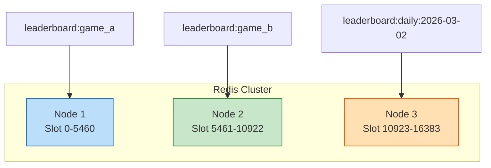

複数のリーダーボード（ゲームごと、地域ごとなど）がある場合、それぞれが異なるノードに配置されるためクラスター全体の負荷が分散される。しかし、単一の巨大なリーダーボードのスケーリングには別のアプローチが必要になる。

### 6.3 アプリケーションレベルのシャーディング

単一のリーダーボードが巨大すぎる場合、アプリケーション側でシャーディングする方法がある。

```python
import hashlib

class ShardedLeaderboard:
    def __init__(self, name: str, shard_count: int, redis_client: redis.Redis):
        self.name = name
        self.shard_count = shard_count
        self.r = redis_client

    def _shard_key(self, user_id: str) -> str:
        """Determine shard key by consistent hashing on user_id."""
        shard = int(hashlib.md5(user_id.encode()).hexdigest(), 16) % self.shard_count
        return f"{self.name}:shard:{shard}"

    def update_score(self, user_id: str, score: float) -> None:
        """Update score in the appropriate shard."""
        self.r.zadd(self._shard_key(user_id), {user_id: score})

    def get_top_n(self, n: int) -> list[tuple[str, float]]:
        """
        Get global top N by merging results from all shards.
        Each shard returns its local top N, then merge-sort.
        """
        pipe = self.r.pipeline()
        for i in range(self.shard_count):
            pipe.zrevrange(f"{self.name}:shard:{i}", 0, n - 1, withscores=True)
        shard_results = pipe.execute()

        # Merge all shard results
        merged = []
        for result in shard_results:
            merged.extend(result)

        # Sort by score descending, take top N
        merged.sort(key=lambda x: x[1], reverse=True)
        return merged[:n]
```

::: warning シャーディングの制約
アプリケーションレベルのシャーディングでは、`ZREVRANK`（特定ユーザーの全体順位取得）が正確に行えない。各シャードでのローカル順位は分かるが、全体での順位を計算するには、すべてのシャードに対して「このスコア以上のメンバー数」を問い合わせ、合算する必要がある。
:::

```python
def get_global_rank(self, user_id: str) -> Optional[int]:
    """
    Get approximate global rank.
    Sum up counts of members with higher scores across all shards.
    """
    score = self.r.zscore(self._shard_key(user_id), user_id)
    if score is None:
        return None

    pipe = self.r.pipeline()
    for i in range(self.shard_count):
        # Count members with score strictly greater than this user's score
        pipe.zcount(f"{self.name}:shard:{i}", f"({score}", "+inf")
    counts = pipe.execute()

    return sum(counts) + 1  # 1-based rank
```

### 6.4 階層型リーダーボード

大規模システムでは、全ユーザーを単一のリーダーボードに入れるのではなく、地域やリーグなどで階層化する設計も有効である。

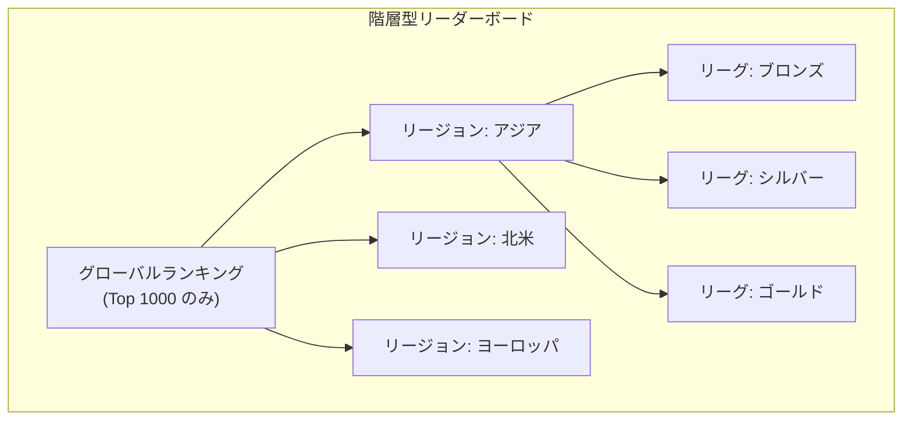

この設計では、各リーグのリーダーボードのサイズを管理可能な範囲に抑えつつ、上位プレイヤーのみをグローバルランキングに反映させる。ユーザーは自分のリーグ内での順位を即座に確認でき、グローバルランキングは定期的なバッチ処理で更新される。

---

## 7. タイブレーク処理

### 7.1 同点問題の本質

スコアが同じユーザーが複数いる場合、順位をどのように決定するかは、ユーザー体験に直結する重要な設計判断である。Redis の Sorted Set では、同一スコアのメンバーはメンバー名（バイト列）の辞書順でソートされるが、これは多くの場合、望ましい挙動ではない。

一般的なタイブレークのルールには以下のようなものがある。

| タイブレークルール | 説明 | ユースケース |
|---|---|---|
| 先着優先 | 同点なら先にそのスコアに達した方が上位 | 多くのゲームランキング |
| 最終更新順 | 最新のスコア更新が上位 | アクティビティベースのランキング |
| 同順位 | 同点は全員同じ順位 | 学術的ランキング |
| 補助スコア | 2次スコア（プレイ時間など）で比較 | 競技ゲーム |

### 7.2 Redis でのタイブレーク実装

Redis の Sorted Set のスコアは 64 ビットの浮動小数点数（IEEE 754 double）であるため、この数値空間を工夫して活用する方法が実用的である。

#### 方法 1: タイムスタンプの埋め込み

スコアの整数部に実際のスコアを、小数部にタイムスタンプ情報を埋め込む。先着優先の場合、タイムスタンプが小さいほど（＝早い時刻ほど）上位になるよう、タイムスタンプを反転させる。

```python
import time

class TieBreakLeaderboard:
    def __init__(self, name: str, redis_client: redis.Redis):
        self.name = name
        self.r = redis_client
        # Max timestamp for inversion (far future: 2100-01-01)
        self.max_ts = 4102444800

    def _composite_score(self, score: int, timestamp: float = None) -> float:
        """
        Create composite score: integer part = actual score,
        fractional part = inverted timestamp for tie-breaking.
        Earlier timestamp => higher fractional part => ranks higher.
        """
        if timestamp is None:
            timestamp = time.time()
        # Invert timestamp so earlier times produce larger fractions
        inverted = (self.max_ts - timestamp) / self.max_ts
        return score + inverted

    def _extract_score(self, composite: float) -> int:
        """Extract the actual score from a composite score."""
        return int(composite)

    def update_score(self, user_id: str, score: int) -> None:
        """Update score with current timestamp for tie-breaking."""
        composite = self._composite_score(score)
        self.r.zadd(self.name, {user_id: composite})

    def get_top_n(self, n: int) -> list[dict]:
        """Get top N with actual scores extracted."""
        entries = self.r.zrevrange(self.name, 0, n - 1, withscores=True)
        return [
            {
                "rank": i + 1,
                "user_id": member,
                "score": self._extract_score(score),
            }
            for i, (member, score) in enumerate(entries)
        ]
```

::: warning 浮動小数点数の精度
IEEE 754 double は仮数部が 52 ビットであり、整数としては $2^{53}$ = 9,007,199,254,740,992 まで正確に表現できる。スコアが十分に小さい範囲であれば、整数部にスコア、小数部にタイムスタンプ情報を格納する方式は精度上の問題を起こさない。ただし、スコアが非常に大きくなる場合や、高精度のタイムスタンプが必要な場合は、次に紹介する方法を検討すべきである。
:::

#### 方法 2: ビットパッキング

スコアとタイムスタンプをビット単位で結合し、64 ビット整数に収める方法もある。

```python
def _packed_score(self, score: int, timestamp: int) -> int:
    """
    Pack score and timestamp into a single 64-bit integer.
    Upper 32 bits: score (up to ~4 billion)
    Lower 32 bits: inverted timestamp (seconds, for tie-break)
    """
    max_ts = 0xFFFFFFFF
    inverted_ts = max_ts - (timestamp & max_ts)
    return (score << 32) | inverted_ts
```

この方法はスコアの範囲が 32 ビット以内に収まる場合に有効である。Redis の Sorted Set は浮動小数点数をスコアとして扱うため、結合した整数値を double にキャストして格納する。$2^{53}$ 以下であれば精度の問題はない。

#### 方法 3: 補助 Sorted Set

スコアとタイブレーク用の情報を別々の Sorted Set で管理する方法もある。

```redis
# Primary leaderboard
ZADD leaderboard:score 2300 alice
ZADD leaderboard:score 2300 bob

# Tie-break leaderboard (timestamp as score, lower = earlier = better)
ZADD leaderboard:tiebreak 1709251200 alice
ZADD leaderboard:tiebreak 1709254800 bob
```

ただしこの方法では、ランキング取得時にアプリケーション側で2つの Sorted Set の結果をマージする必要があり、複雑性が増す。実務的には方法 1（コンポジットスコア）が最も広く採用されている。

---

## 8. ページネーション

### 8.1 オフセットベースのページネーション

最もシンプルなページネーション方式。ページ番号とページサイズからオフセットを計算し、`ZREVRANGE` で取得する。

```python
def get_page(self, page: int, page_size: int = 50) -> dict:
    """
    Get a specific page of the leaderboard.
    page is 1-based.
    """
    start = (page - 1) * page_size
    end = start + page_size - 1

    entries = self.r.zrevrange(self.name, start, end, withscores=True)
    total = self.r.zcard(self.name)
    total_pages = (total + page_size - 1) // page_size

    return {
        "page": page,
        "page_size": page_size,
        "total_members": total,
        "total_pages": total_pages,
        "entries": [
            {
                "rank": start + i + 1,
                "user_id": member,
                "score": score,
            }
            for i, (member, score) in enumerate(entries)
        ],
    }
```

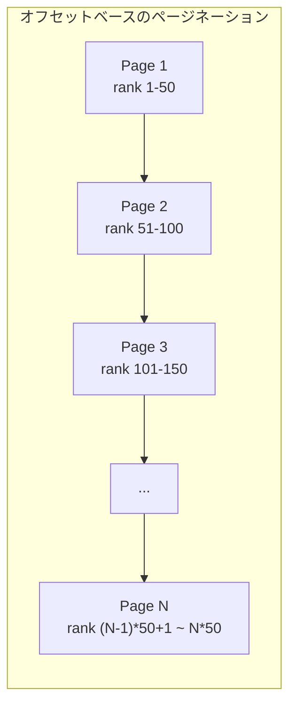

Redis の `ZREVRANGE` はオフセットベースのアクセスに対応しており、スキップリストの性質上 O(log N + M) で任意のページを取得できる。RDBMS の `OFFSET` / `LIMIT` のようにオフセットが大きくなるほど遅くなる問題は発生しない。

### 8.2 カーソルベースのページネーション

スコアをカーソルとして使う方式。前回のページの最後のエントリのスコアを次のリクエストに渡す。

```python
def get_page_by_cursor(
    self, cursor_score: float = "+inf", cursor_member: str = "",
    page_size: int = 50
) -> dict:
    """
    Cursor-based pagination using ZREVRANGEBYSCORE.
    cursor_score: start from scores less than this value.
    """
    # Use ZREVRANGEBYSCORE with LIMIT
    entries = self.r.zrevrangebyscore(
        self.name,
        f"({cursor_score}" if cursor_member else cursor_score,
        "-inf",
        start=0,
        num=page_size,
        withscores=True,
    )

    next_cursor = None
    if len(entries) == page_size:
        last_member, last_score = entries[-1]
        next_cursor = {"score": last_score, "member": last_member}

    return {
        "entries": [
            {"user_id": member, "score": score}
            for member, score in entries
        ],
        "next_cursor": next_cursor,
    }
```

::: tip オフセット vs カーソル
リーダーボードのページネーションでは、オフセットベースが一般的である。理由は以下の通り。

- ユーザーは「100 位から 150 位を見たい」のようにランクで指定することが多い
- Redis の `ZREVRANGE` はオフセットによる性能劣化がない
- カーソルベースはスコアが頻繁に変動する環境でアイテムの重複・欠落が起きにくいメリットがあるが、リーダーボードでは許容されることが多い
:::

### 8.3 RDBMS でのページネーション

RDBMS では、オフセットが大きくなるほどクエリが遅くなる問題（深いページング問題）がある。

```sql
-- Offset-based (slow for large offsets)
SELECT user_id, score,
       ROW_NUMBER() OVER (ORDER BY score DESC, updated_at ASC) AS rank
FROM leaderboard_scores
ORDER BY score DESC, updated_at ASC
LIMIT 50 OFFSET 10000;  -- Must scan 10,050 rows

-- Keyset pagination (faster for large offsets)
SELECT user_id, score
FROM leaderboard_scores
WHERE (score, updated_at) < (2300, '2026-03-01 12:00:00')
ORDER BY score DESC, updated_at ASC
LIMIT 50;
```

Keyset ページネーション（シーク法）はインデックスを効率的に利用できるため、深いオフセットでも性能が安定する。ただし、任意のページへの直接ジャンプはできない。

---

## 9. アーキテクチャパターンと実務考慮事項

### 9.1 Write-Through パターン

最もシンプルなアーキテクチャ。スコア更新時に Redis と RDBMS の両方を同期的に書き込む。

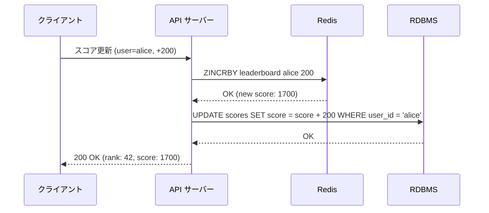

**利点**: 実装がシンプルで、Redis と RDBMS の一貫性が保たれやすい。

**欠点**: 書き込みレイテンシが増加する。Redis と RDBMS のいずれかが失敗した場合の整合性維持が課題。

### 9.2 Write-Behind パターン

Redis への書き込みを先に行い、RDBMS への永続化は非同期で行う。

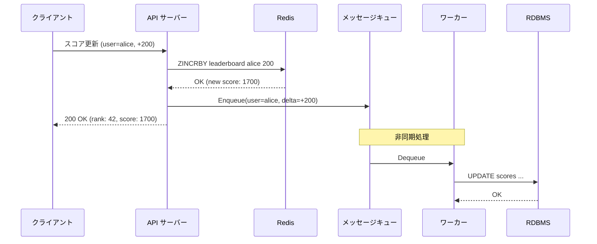

**利点**: 書き込みレイテンシが低い。RDBMS の負荷を平滑化できる。

**欠点**: Redis と RDBMS の間に一時的な不整合が生じる。メッセージキューの信頼性管理が必要。

### 9.3 Event Sourcing パターン

スコア更新イベントをイベントストアに永続化し、リーダーボードはイベントから構築されるマテリアライズドビューとして扱う。

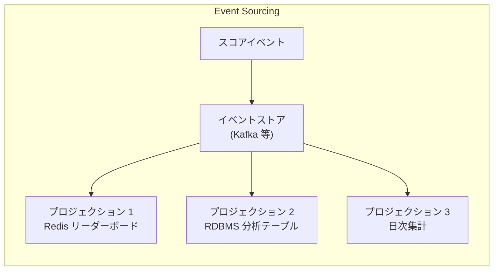

**利点**: イベント履歴から任意の時点のリーダーボードを再構築できる。複数のビュー（全期間、日次、週次）を同じイベントストリームから生成できる。

**欠点**: アーキテクチャの複雑性が大幅に増す。結果整合性が前提となる。

### 9.4 リアルタイム更新の配信

ランキングの変動をクライアントにリアルタイムで配信するには、WebSocket や Server-Sent Events（SSE）を使う。

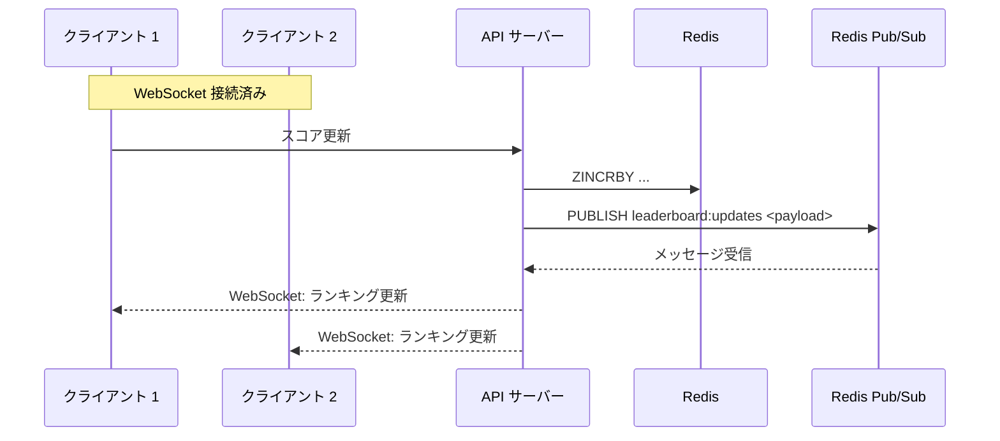

ただし、全ランキングの変動をリアルタイムで配信するのは、更新頻度が高いシステムでは非現実的である。実務的には以下の工夫が行われる。

- **スロットリング**: 一定間隔（例えば5秒ごと）で最新のランキングを配信する
- **差分配信**: 変動があったエントリのみを配信する
- **関心範囲の制限**: ユーザーが閲覧している範囲（Top 10 や自分の周辺順位）に変動があった場合のみ配信する

```python
class LeaderboardNotifier:
    def __init__(self, redis_client: redis.Redis, throttle_seconds: int = 5):
        self.r = redis_client
        self.throttle = throttle_seconds
        self._last_broadcast = 0

    def on_score_update(self, leaderboard_name: str, user_id: str, new_rank: int):
        """Throttled broadcast of leaderboard changes."""
        now = time.time()
        if now - self._last_broadcast < self.throttle:
            return  # Skip: too soon since last broadcast

        # Fetch current top N for broadcast
        top_entries = self.r.zrevrange(leaderboard_name, 0, 9, withscores=True)

        payload = {
            "type": "leaderboard_update",
            "top_10": [
                {"rank": i + 1, "user_id": m, "score": s}
                for i, (m, s) in enumerate(top_entries)
            ],
        }

        self.r.publish(
            f"{leaderboard_name}:updates",
            json.dumps(payload),
        )
        self._last_broadcast = now
```

### 9.5 障害対応とリカバリ

Redis は In-Memory データストアであるため、ノード障害時のデータ損失リスクがある。リーダーボードシステムでは以下の対策が重要である。

#### Redis 永続化設定

```
# redis.conf
# AOF (Append Only File) for durability
appendonly yes
appendfsync everysec

# RDB snapshots as backup
save 900 1
save 300 10
save 60 10000
```

#### RDBMS からの再構築

```python
def rebuild_from_db(self, db_conn, leaderboard_name: str) -> int:
    """Rebuild Redis leaderboard from RDBMS after failure."""
    cursor = db_conn.cursor()
    cursor.execute(
        "SELECT user_id, score FROM leaderboard_scores ORDER BY score DESC"
    )

    pipe = self.r.pipeline()
    count = 0

    for user_id, score in cursor:
        pipe.zadd(leaderboard_name, {str(user_id): score})
        count += 1

        # Execute pipeline in batches to avoid memory issues
        if count % 10000 == 0:
            pipe.execute()
            pipe = self.r.pipeline()

    pipe.execute()
    return count
```

#### Redis Sentinel / Cluster による高可用性

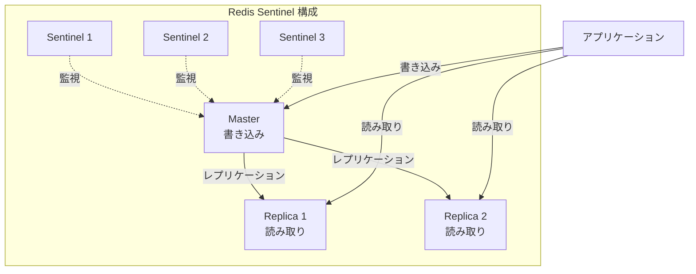

Sentinel はマスターの障害を検知して自動フェイルオーバーを行う。読み取りが多いリーダーボードでは、レプリカからの読み取りで負荷を分散できる。ただし、レプリケーション遅延により、レプリカから取得したランキングが最新でない可能性がある点には注意が必要である。

### 9.6 セキュリティと不正対策

リーダーボードは不正行為の標的になりやすい。以下の対策が一般的である。

**サーバーサイドでのスコア計算**: クライアントからスコアを直接受け取るのではなく、ゲームロジックの結果としてサーバー側でスコアを計算する。

**レートリミット**: 単位時間あたりのスコア更新回数を制限し、異常な頻度の更新を検知する。

**スコアの妥当性検証**: ゲームの仕組み上到達不可能なスコアを弾く。例えば、1分間のプレイで理論上の最大スコアを超えるスコアは不正とみなす。

**監査ログ**: すべてのスコア更新をログに記録し、不正が疑われる場合に遡って調査できるようにする。

```python
class SecureLeaderboard:
    MAX_SCORE_PER_GAME = 10000
    MAX_UPDATES_PER_MINUTE = 10

    def update_score_secure(self, user_id: str, score: int, game_id: str) -> bool:
        """Validate and update score with anti-cheat checks."""
        # Rate limit check
        rate_key = f"rate:{user_id}"
        current = self.r.incr(rate_key)
        if current == 1:
            self.r.expire(rate_key, 60)
        if current > self.MAX_UPDATES_PER_MINUTE:
            logger.warning(f"Rate limit exceeded: {user_id}")
            return False

        # Score validation
        if score < 0 or score > self.MAX_SCORE_PER_GAME:
            logger.warning(f"Invalid score: {user_id}, score={score}")
            return False

        # Idempotency check (prevent duplicate submissions)
        if self.r.sismember(f"processed_games:{user_id}", game_id):
            logger.warning(f"Duplicate game submission: {user_id}, game={game_id}")
            return False

        # Record game as processed
        self.r.sadd(f"processed_games:{user_id}", game_id)
        self.r.expire(f"processed_games:{user_id}", 86400)

        # Update leaderboard
        self.r.zincrby(self.name, score, user_id)

        # Audit log
        logger.info(f"Score updated: user={user_id}, game={game_id}, delta={score}")
        return True
```

### 9.7 パフォーマンス最適化のまとめ

実運用で効果的な最適化手法をまとめる。

| 最適化手法 | 説明 | 効果 |
|---|---|---|
| パイプライン | 複数の Redis コマンドをバッチ送信 | ネットワーク RTT を削減 |
| Lua スクリプト | サーバーサイドでアトミックに複数操作 | RTT 削減＋原子性保証 |
| 読み取りレプリカ | ランキング取得をレプリカに分散 | 読み取りスループット向上 |
| ローカルキャッシュ | Top-N をアプリケーション側でキャッシュ | Redis 負荷削減 |
| 非同期更新 | スコア更新をキュー経由で処理 | 書き込みレイテンシ削減 |
| TTL 管理 | 不要な時間ウィンドウキーを自動削除 | メモリ使用量削減 |

#### Lua スクリプトの活用例

```lua
-- Atomic score update with rank retrieval
-- KEYS[1]: leaderboard key
-- ARGV[1]: user_id
-- ARGV[2]: score delta
local new_score = redis.call('ZINCRBY', KEYS[1], ARGV[2], ARGV[1])
local rank = redis.call('ZREVRANK', KEYS[1], ARGV[1])
return {new_score, rank}
```

```python
# Using Lua script for atomic update + rank retrieval
update_and_rank_script = """
local new_score = redis.call('ZINCRBY', KEYS[1], ARGV[2], ARGV[1])
local rank = redis.call('ZREVRANK', KEYS[1], ARGV[1])
return {new_score, rank}
"""

def update_and_get_rank(self, user_id: str, delta: float) -> tuple[float, int]:
    """Atomically update score and get new rank in a single round trip."""
    script = self.r.register_script(update_and_rank_script)
    result = script(keys=[self.name], args=[user_id, delta])
    return float(result[0]), int(result[1]) + 1  # 1-based rank
```

---

## 10. 設計判断のフローチャート

ここまで紹介したさまざまなパターンを、ユースケースに応じてどのように選択すべきかをフローチャートとして整理する。

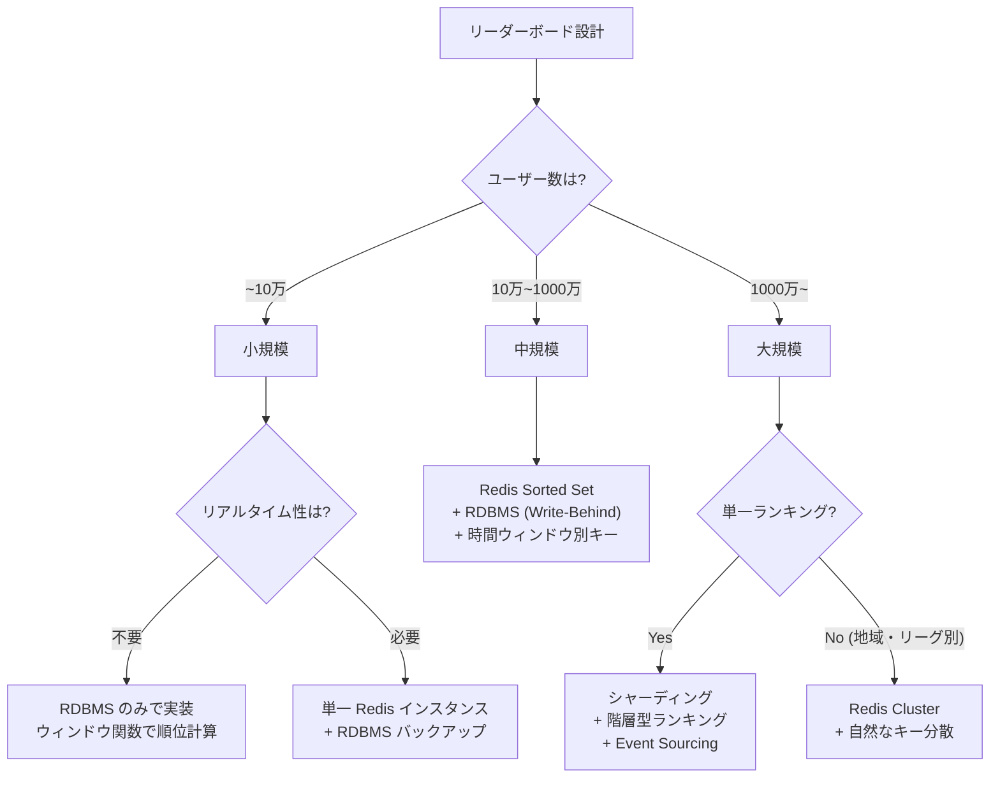

---

## 11. まとめ

リーダーボードは一見シンプルな機能であるが、スケール、リアルタイム性、正確性、公平性の要件を満たすためには、多層的な設計判断が必要である。本記事で解説した主要なポイントを振り返る。

**Redis Sorted Set は最も実践的な選択肢である**: O(log N) でのスコア更新・順位取得は、他のデータ構造では実現しにくい。スキップリストとハッシュテーブルの組み合わせにより、リーダーボードに必要なすべての操作を高速に実行できる。

**時間ウィンドウはキー命名で管理する**: 日次・週次・月次のランキングを別々の Sorted Set として管理し、TTL で自動クリーンアップする。スコア更新時にパイプラインで複数キーを一括更新することで、オーバーヘッドを最小化できる。

**タイブレークはコンポジットスコアで解決する**: スコアの小数部にタイムスタンプ情報を埋め込むことで、追加のデータ構造なしにタイブレークを実現できる。IEEE 754 double の精度範囲内であれば、この方法は実用上十分に正確である。

**RDBMS はバックアップと分析に使う**: Redis はリアルタイムのランキング表示に、RDBMS はスコアの永続化、トランザクション保証、分析クエリに使うハイブリッドアーキテクチャが、多くの実務で採用されている。

**大規模データにはシャーディングと階層化を組み合わせる**: 数千万〜数億ユーザーのリーダーボードでは、アプリケーションレベルのシャーディング、階層型ランキング（リーグ制）、Event Sourcing パターンなどを組み合わせて対応する。

**不正対策は設計の初期段階から組み込む**: サーバーサイドでのスコア計算、レートリミット、スコアの妥当性検証、監査ログは、後から追加するよりも最初から設計に含めるべきである。

リーダーボードの設計は、選択するデータストア、一貫性モデル、スケーリング戦略のすべてにおいてトレードオフが存在する。重要なのは、自社のユースケース（ユーザー数、更新頻度、許容レイテンシ、一貫性要件）を正確に把握した上で、最もシンプルに要件を満たすアーキテクチャを選択することである。過度に複雑な設計は運用コストを増大させ、障害の原因にもなりうる。まずは Redis Sorted Set による単純な実装から始め、ボトルネックが顕在化した時点でスケーリング戦略を追加していくアプローチが、実務上は最も合理的である。
