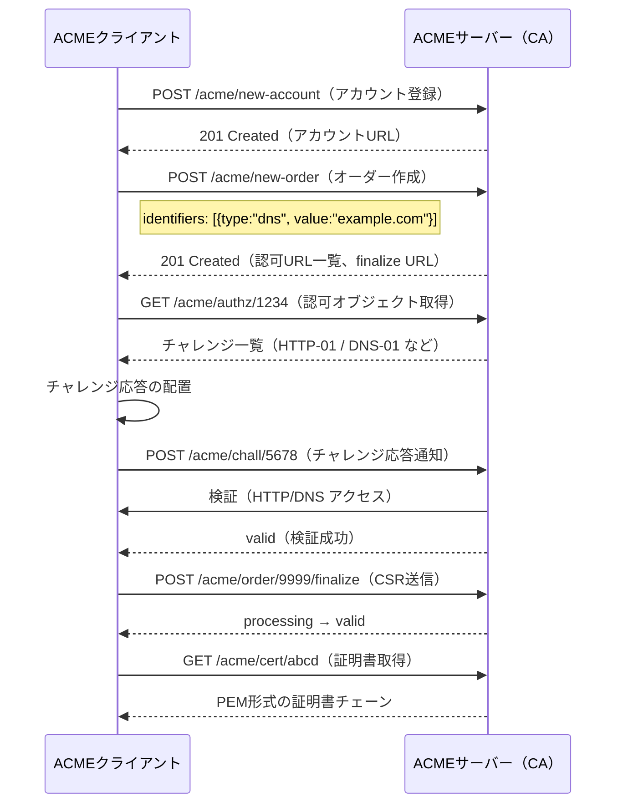
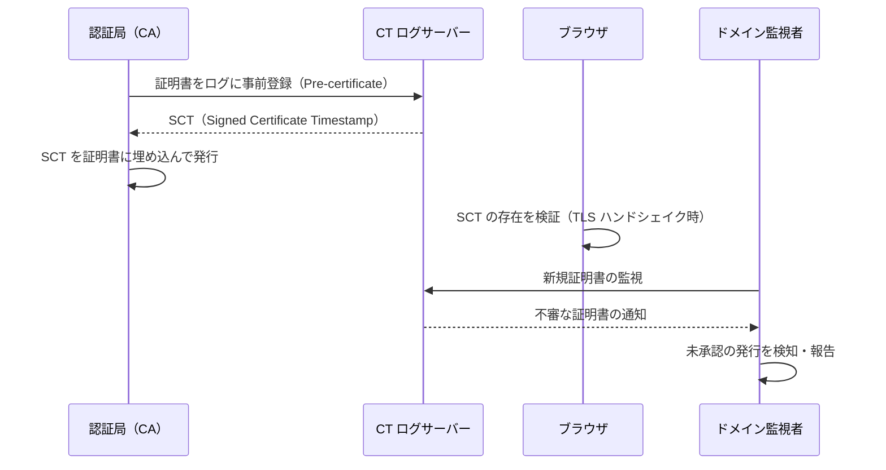
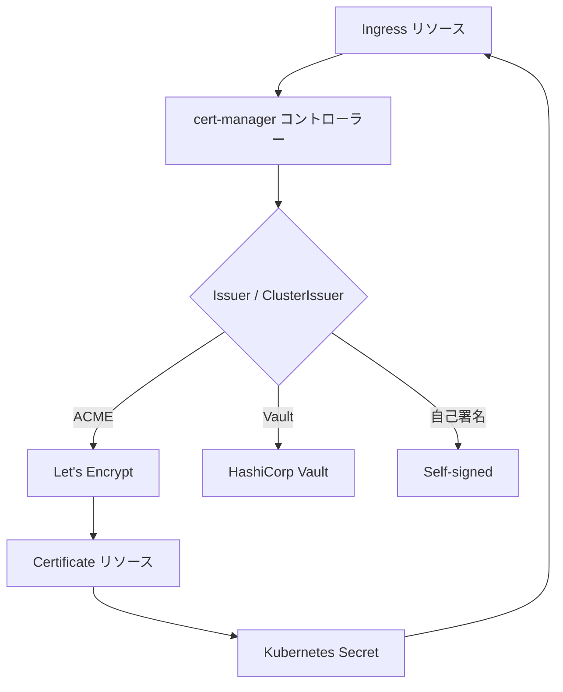
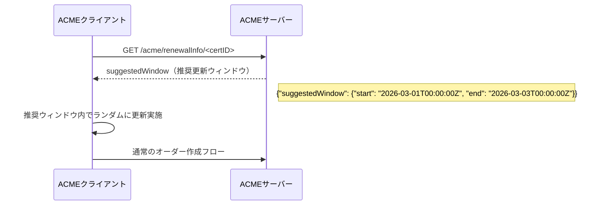
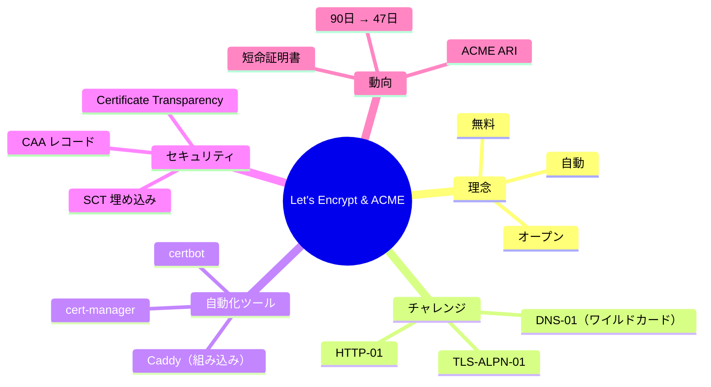

# Let's Encrypt と ACMEプロトコル

## 1. はじめに：HTTPS の民主化

2010年代初頭、HTTPSを有効にするためには証明書を購入する必要があった。商用認証局が年間数千円から数万円を徴収し、手動での検証手続き・証明書のインストール・定期的な更新が運用者の負担となっていた。その結果、個人サイトや小規模事業者の多くがHTTPのままであり、ウェブ全体の暗号化率は低迷していた。

**Let's Encrypt**は、この状況を根本から変えることを目的として2014年に設立され、2015年11月に一般公開された無料の認証局（CA: Certificate Authority）である。Internet Security Research Group（ISRG）が運営し、EFF・Mozilla・シスコ・Akamai・Googleなどが支援する非営利団体として、「無料・自動・オープン」という3つの理念を掲げた。

- **無料（Free）**：ドメイン検証型（DV）証明書を無料で発行する
- **自動（Automatic）**：証明書の取得・更新を完全に自動化できる
- **オープン（Open）**：証明書発行プロトコル（ACME）をオープン標準として公開する

2026年現在、Let's Encryptは世界中で3億以上のドメインに証明書を発行しており、ウェブのHTTPS化を劇的に加速させた最大の要因の一つとして評価されている。

## 2. ACMEプロトコルの概要

### 2.1 ACME とは

**ACME（Automatic Certificate Management Environment）**は、認証局と証明書管理クライアントの間でドメイン所有権の検証と証明書の発行・管理を自動化するためのプロトコルである。Let's Encryptがプロトコルを開発し、2019年にRFC 8555として標準化された。

ACMEは純粋にRESTful JSONプロトコルであり、HTTPSを通じて動作する。Let's Encrypt以外にも複数の認証局がACMEをサポートしており、クライアント実装を共通化できるという大きなメリットがある。

### 2.2 主要な構成要素

| 用語 | 説明 |
|---|---|
| **ACME サーバー** | 認証局側のエンドポイント（Let's Encryptの場合 `acme-v02.api.letsencrypt.org`） |
| **ACME クライアント** | certbot などの証明書管理ツール |
| **アカウント** | クライアントが持つ公開鍵ペアによって識別されるエンティティ |
| **オーダー（Order）** | 特定のドメインに対する証明書発行要求 |
| **認可（Authorization）** | ドメイン所有権を証明する手続き |
| **チャレンジ（Challenge）** | 所有権を実証する具体的な方法（HTTP-01、DNS-01 等） |
| **CSR（Certificate Signing Request）** | 証明書署名要求 |
| **Nonce** | リプレイ攻撃防止用の一時値 |

### 2.3 JWS によるリクエスト署名

ACMEのすべてのリクエストは**JWS（JSON Web Signature）**で署名される。クライアントはアカウント登録時に公開鍵ペアを生成し、その秘密鍵でリクエストを署名することでサーバーはリクエストの正当性を確認できる。

```json
{
  "protected": "base64url({\"alg\":\"ES256\",\"kid\":\"https://acme.example.com/acme/acct/1\",\"nonce\":\"oFvnlFP1wIhRlYS2jTaXrA\",\"url\":\"https://acme.example.com/acme/new-order\"})",
  "payload": "base64url({\"identifiers\":[{\"type\":\"dns\",\"value\":\"example.com\"}]})",
  "signature": "..."
}
```

サーバーはレスポンスヘッダに次のNonceを含めて返し、クライアントは次のリクエストでそれを使う。これによってリプレイ攻撃を防ぐ。

## 3. 証明書発行フロー

ACMEによる証明書発行の全体フローは以下の通りである。



### 3.1 アカウント登録

クライアントはまず鍵ペアを生成し、ACMEサーバーの `newAccount` エンドポイントに公開鍵を登録する。一度登録したアカウントキーは複数ドメインの証明書管理に再利用できる。

```http
POST /acme/new-account HTTP/1.1
Host: acme-v02.api.letsencrypt.org
Content-Type: application/jose+json

{
  "protected": "...",
  "payload": "{\"termsOfServiceAgreed\": true, \"contact\": [\"mailto:admin@example.com\"]}",
  "signature": "..."
}
```

レスポンスの `Location` ヘッダにアカウントURLが返り、以後はそれを `kid` として使用する。

### 3.2 オーダーの作成

証明書を取得したいドメイン名のリストを指定してオーダーを作成する。

```json
// Request body
{
  "identifiers": [
    { "type": "dns", "value": "example.com" },
    { "type": "dns", "value": "www.example.com" }
  ]
}
```

```json
// Response
{
  "status": "pending",
  "identifiers": [
    { "type": "dns", "value": "example.com" },
    { "type": "dns", "value": "www.example.com" }
  ],
  "authorizations": [
    "https://acme.example.com/acme/authz/PAniVnsZcis",
    "https://acme.example.com/acme/authz/r4HqLzrSrpI"
  ],
  "finalize": "https://acme.example.com/acme/order/TOlocE8rfgo/finalize"
}
```

オーダーはドメインごとに認可（Authorization）オブジェクトを持つ。

### 3.3 チャレンジの実施と検証

認可オブジェクトを取得すると、サーバーが提示するチャレンジ一覧が得られる。クライアントはそのうち1つを選び、所有権を証明する。

```json
// Authorization object
{
  "status": "pending",
  "identifier": { "type": "dns", "value": "example.com" },
  "challenges": [
    {
      "type": "http-01",
      "url": "https://acme.example.com/acme/chall/prV_B7yEyA4",
      "token": "DgyRejmCefe7v4NfDGDKfA"
    },
    {
      "type": "dns-01",
      "url": "https://acme.example.com/acme/chall/Rg5dX14Smxl",
      "token": "DgyRejmCefe7v4NfDGDKfA"
    },
    {
      "type": "tls-alpn-01",
      "url": "https://acme.example.com/acme/chall/Rg5dX14Sm9k",
      "token": "DgyRejmCefe7v4NfDGDKfA"
    }
  ]
}
```

クライアントはチャレンジ応答を配置した後、そのURLにPOSTリクエストを送ってサーバーに検証を促す。サーバーは非同期で検証を行い、認可のステータスが `valid` になれば次のステップへ進める。

### 3.4 CSR の提出と証明書の取得

すべての認可が `valid` になったら、クライアントはCSR（Certificate Signing Request）を生成して `finalize` エンドポイントに送信する。

```json
{
  "csr": "base64url(DER形式のCSR)"
}
```

サーバーがオーダーを処理すると、オーダーのステータスが `valid` になり、証明書URLが `certificate` フィールドに現れる。クライアントはそこからPEM形式の証明書チェーンをダウンロードする。

## 4. チャレンジ方式の詳細

### 4.1 HTTP-01 チャレンジ

最もよく使われる方式。クライアントは以下のURLにファイルを配置する。

```
http://<domain>/.well-known/acme-challenge/<token>
```

ファイルの内容は**Key Authorization**と呼ばれ、トークンとアカウント公開鍵のサムプリントを連結したものである：

```
<token>.<thumbprint-of-account-key>
```

ACMEサーバーはHTTP（ポート80）でこのURLにアクセスし、Key Authorizationが正しく返れば検証成功とみなす。

> [!NOTE]
> HTTP-01 チャレンジはリダイレクトをたどるが、最終的にHTTPSへのリダイレクトは許可されない。ポート80でHTTPによりアクセス可能であることが必要条件である。

**メリット**：
- 設定が簡単で、ほとんどのWebサーバーで対応可能
- certbot の `--webroot` モードや `--standalone` モードで自動化できる

**デメリット**：
- ポート80が開いている必要がある
- ワイルドカード証明書には使用できない
- CDN/プロキシ経由のドメインでは設定が複雑になることがある

### 4.2 DNS-01 チャレンジ

DNSのTXTレコードを用いてドメイン所有権を証明する。クライアントは次のTXTレコードを設定する：

```
_acme-challenge.<domain>.  IN  TXT  "<key-authorization-digest>"
```

`<key-authorization-digest>` はKey AuthorizationのSHA-256ハッシュをbase64urlエンコードしたものである。

```bash
# Example of computing the TXT record value
echo -n "<token>.<thumbprint>" | openssl dgst -sha256 -binary | base64 | tr '+/' '-_' | tr -d '='
```

ACMEサーバーはDNSリゾルバを通じてこのTXTレコードを照会し、値が正しければ検証成功とする。

> [!TIP]
> DNS-01 は唯一**ワイルドカード証明書（`*.example.com`）の取得に使用できる**チャレンジ方式である。また、Webサーバーへの接続が不要なため、ファイアウォール内部のサーバーにも使用できる。

**メリット**：
- ワイルドカード証明書に対応
- ポート80/443が不要
- オフライン環境やクローズドネットワーク内でも使用可能

**デメリット**：
- DNSプロバイダのAPI連携が必要（自動更新のため）
- DNSの伝播遅延により検証に時間がかかることがある
- 誤った設定で一時的にDNS解決に影響が出るリスクがある

### 4.3 TLS-ALPN-01 チャレンジ

TLS の ALPN（Application-Layer Protocol Negotiation）拡張を用いる方式。ポート443でTLS接続を受け付け、`acme-tls/1` というプロトコルを返すことで所有権を証明する。

チャレンジ応答は専用の自己署名証明書として提示され、その `subjectAltName` 拡張に検証値が埋め込まれる。

> [!NOTE]
> TLS-ALPN-01 は主にTLSターミネーションを自前で行うロードバランサや高性能Webサーバー向けに設計されており、ポート80が使えないがポート443は使用可能な環境で有用である。

**メリット**：
- ポート443のみで完結する
- DNSの変更が不要

**デメリット**：
- ワイルドカード証明書には使用できない
- TLSターミネーションを完全にコントロールできる環境が必要
- サポートするクライアントライブラリが限られる

### 4.4 チャレンジ方式の比較

| 項目 | HTTP-01 | DNS-01 | TLS-ALPN-01 |
|---|---|---|---|
| ポート要件 | 80番 | なし | 443番 |
| ワイルドカード | 不可 | **可能** | 不可 |
| 自動更新の容易さ | 容易 | DNS API 依存 | 容易 |
| CDN 環境 | やや複雑 | 問題なし | 環境依存 |
| クローズドネットワーク | 不可 | 可能 | 不可 |
| RFC | RFC 8555 | RFC 8555 | RFC 8737 |

## 5. certbot の使い方と自動更新

**certbot**はElectronic Frontier Foundation（EFF）が開発するACMEクライアントの事実上の標準実装であり、Let's Encryptが公式に推奨している。

### 5.1 インストール

```bash
# Ubuntu/Debian
sudo apt update && sudo apt install certbot python3-certbot-nginx

# CentOS/RHEL（snapd 経由）
sudo snap install --classic certbot
sudo ln -s /snap/bin/certbot /usr/bin/certbot
```

### 5.2 証明書の取得

**Nginx プラグインを使った自動取得（推奨）**：

```bash
# Automatically obtain and configure certificate for Nginx
sudo certbot --nginx -d example.com -d www.example.com
```

certbot は Nginx の設定を自動的に変更し、HTTP→HTTPS リダイレクトの設定まで行う。

**Webroot モード（手動設定の場合）**：

```bash
# Place challenge files in the webroot directory
sudo certbot certonly --webroot -w /var/www/html -d example.com -d www.example.com
```

**スタンドアロンモード（Webサーバーを一時停止する場合）**：

```bash
# Temporarily bind port 80 for challenge verification
sudo certbot certonly --standalone -d example.com
```

**DNS-01 チャレンジ（ワイルドカード証明書）**：

```bash
# Use DNS plugin for wildcard certificate
sudo certbot certonly --manual --preferred-challenges dns -d "*.example.com" -d example.com
```

手動の場合、TXTレコードを設定してからEnterを押す対話式プロンプトが出る。

### 5.3 証明書ファイルの配置

certbot は証明書を `/etc/letsencrypt/` 以下に配置する：

```
/etc/letsencrypt/
├── live/
│   └── example.com/
│       ├── cert.pem        # End-entity certificate
│       ├── chain.pem       # Intermediate CA certificate
│       ├── fullchain.pem   # cert.pem + chain.pem (use this for Nginx/Apache)
│       └── privkey.pem     # Private key
├── archive/
│   └── example.com/        # Historical versions
└── renewal/
    └── example.com.conf    # Renewal configuration
```

`live/` 内のファイルはシンボリックリンクであり、更新時には `archive/` の新しいファイルへのリンクが自動的に更新される。

### 5.4 自動更新の設定

Let's Encryptの証明書の有効期間は**90日**であり、60日を超えた時点から更新が可能になる（30日前から更新を推奨）。

```bash
# Test renewal (dry run)
sudo certbot renew --dry-run

# Actual renewal (usually run via cron/systemd timer)
sudo certbot renew
```

certbot のインストール時に通常は systemd タイマーまたは cron ジョブが自動設定される：

```bash
# Check systemd timer
systemctl status certbot.timer

# Timer configuration (typically runs twice daily)
# /lib/systemd/system/certbot.timer
[Timer]
OnCalendar=*-*-* 00,12:00:00
RandomizedDelaySec=43200
Persistent=true
```

Nginx の場合、更新後のリロードフックを設定する：

```ini
# /etc/letsencrypt/renewal/example.com.conf
[renewalparams]
deploy_hook = systemctl reload nginx
```

または certbot の `--deploy-hook` オプションを使う：

```bash
sudo certbot renew --deploy-hook "systemctl reload nginx"
```

> [!WARNING]
> 証明書の有効期間が切れると HTTPS 接続が完全に失敗する。自動更新の設定後は `--dry-run` でテストし、certbot が正常に動作することを必ず確認すること。

## 6. ワイルドカード証明書

### 6.1 概要

ワイルドカード証明書は `*.example.com` のような形式で、すべてのサブドメインに対して有効な証明書である。Let's Encryptは2018年3月からワイルドカード証明書の発行をサポートしており、**DNS-01 チャレンジのみ**で取得できる。

```bash
# Obtain wildcard certificate using DNS-01 challenge
sudo certbot certonly \
  --dns-cloudflare \
  --dns-cloudflare-credentials ~/.secrets/cloudflare.ini \
  -d "*.example.com" \
  -d "example.com"
```

ワイルドカード証明書で注意すべき点：

- `*.example.com` はサブドメイン1階層のみに有効（`sub.example.com` はOKだが `a.b.example.com` はNG）
- ルートドメイン（`example.com`）は別途指定が必要
- ワイルドカード証明書はサブドメイン全体で同じ証明書・秘密鍵を使うため、鍵の管理に注意が必要

### 6.2 DNS プラグインによる自動化

主要なDNSプロバイダ向けのcertbot DNSプラグインが提供されており、自動更新が可能である：

| プラグイン | 対応プロバイダ |
|---|---|
| `certbot-dns-cloudflare` | Cloudflare |
| `certbot-dns-route53` | AWS Route 53 |
| `certbot-dns-google` | Google Cloud DNS |
| `certbot-dns-digitalocean` | DigitalOcean |
| `certbot-dns-linode` | Linode |
| `certbot-dns-ovh` | OVH |

```ini
# ~/.secrets/cloudflare.ini
# Cloudflare API credentials
dns_cloudflare_api_token = <your-api-token>
```

```bash
# Wildcard certificate with auto-renewal via Cloudflare plugin
sudo certbot certonly \
  --dns-cloudflare \
  --dns-cloudflare-credentials ~/.secrets/cloudflare.ini \
  --dns-cloudflare-propagation-seconds 60 \
  -d "*.example.com" \
  -d "example.com"
```

## 7. Rate Limits

Let's Encryptには過負荷防止とシステム保護のため、複数のRate Limit（制限）が設けられている。

### 7.1 主なRate Limit

| 制限の種類 | 制限値 | 説明 |
|---|---|---|
| **Certificates per Registered Domain** | 50件/週 | 同一登録ドメイン配下への証明書発行数 |
| **Duplicate Certificate** | 5件/週 | まったく同一のドメインセットへの証明書 |
| **Failed Validations** | 5回/時間/アカウント/ホスト名 | 検証失敗回数 |
| **New Orders** | 300件/3時間 | アカウントあたりのオーダー数 |
| **New Accounts per IP** | 10件/3時間 | 同一IPからのアカウント登録数 |
| **Accounts per IP Range** | 500件/3時間 | CIDRレンジあたりのアカウント登録数 |

> [!CAUTION]
> Rate Limit に達すると、解除されるまで新規発行ができない。テスト環境では必ずステージング環境を使用すること。

### 7.2 ステージング環境

本番環境でRate Limitに抵触しないよう、テストにはステージング環境を使う。ステージング環境のディレクトリURLは以下の通りである：

```
https://acme-staging-v02.api.letsencrypt.org/directory
```

certbot でのステージング環境使用：

```bash
# Use staging environment for testing
sudo certbot certonly --staging --nginx -d example.com
```

ステージング環境で発行された証明書はブラウザから信頼されないため、本番デプロイには使えないが、フローの検証には十分である。

### 7.3 Rate Limit 回避策

- 複数サブドメインをまとめてSAN（Subject Alternative Name）に含めた1枚の証明書として発行する
- 不要なテスト実行を避け、常に `--dry-run` で事前テストする
- ワイルドカード証明書で大量のサブドメインをまとめる

## 8. Certificate Transparency

### 8.1 Certificate Transparency とは

**Certificate Transparency（CT）**は、すべてのTLS証明書の発行をパブリックな追跡可能なログに記録することを義務づける仕組みであり、不正発行の検出と抑止を目的としている（RFC 6962、RFC 9162）。

2018年4月以降、ChromeはすべてのTLS証明書に対してCTログへの記録を義務づけており、記録されていない証明書はChromeで警告が表示される。

### 8.2 仕組み



**SCT（Signed Certificate Timestamp）**はCTログサーバーが発行するタイムスタンプ付き署名であり、「この証明書はログに記録した」という証拠である。SCTは以下の3通りの方法で証明書に埋め込める：

1. X.509 拡張として証明書本体に埋め込む
2. TLS拡張（`signed_certificate_timestamp`）としてハンドシェイク時に提示する
3. OCSPレスポンスに含める

### 8.3 Let's Encrypt と CT

Let's Encrypt は証明書を発行する際に自動的に複数のCTログ（Google の Argon/Xenon、Cloudflare の Nimbus など）に記録し、SCTを証明書に埋め込む。証明書利用者はこれを意識せずに済む。

CTログの公開性により、ドメイン所有者は `crt.sh` などのサービスで自分のドメインに対して発行されたすべての証明書を確認できる：

```bash
# Check certificates issued for your domain using crt.sh API
curl "https://crt.sh/?q=example.com&output=json" | jq '.[].name_value' | sort -u
```

これにより、不正発行（フィッシングサイト向けの証明書など）の早期発見が可能になる。

## 9. cert-manager による Kubernetes 統合

### 9.1 cert-manager とは

**cert-manager**はKubernetes向けのX.509証明書管理コントローラーであり、ACMEを含む複数のプロトコルに対応している。Kubernetes の Custom Resource Definition（CRD）として動作し、証明書のライフサイクル管理を宣言的に行える。

### 9.2 アーキテクチャ



### 9.3 インストールと設定

```bash
# Install cert-manager via Helm
helm repo add jetstack https://charts.jetstack.io
helm repo update

helm install cert-manager jetstack/cert-manager \
  --namespace cert-manager \
  --create-namespace \
  --set crds.enabled=true
```

**ClusterIssuer の設定（HTTP-01 チャレンジ）**：

```yaml
# cluster-issuer-letsencrypt.yaml
apiVersion: cert-manager.io/v1
kind: ClusterIssuer
metadata:
  name: letsencrypt-prod
spec:
  acme:
    # ACME server URL for Let's Encrypt production
    server: https://acme-v02.api.letsencrypt.org/directory
    email: admin@example.com
    privateKeySecretRef:
      name: letsencrypt-prod-account-key
    solvers:
    - http01:
        ingress:
          class: nginx
```

**ClusterIssuer の設定（DNS-01 チャレンジ、Cloudflare）**：

```yaml
# cluster-issuer-dns.yaml
apiVersion: cert-manager.io/v1
kind: ClusterIssuer
metadata:
  name: letsencrypt-dns
spec:
  acme:
    server: https://acme-v02.api.letsencrypt.org/directory
    email: admin@example.com
    privateKeySecretRef:
      name: letsencrypt-dns-account-key
    solvers:
    - dns01:
        cloudflare:
          email: admin@example.com
          apiTokenSecretRef:
            name: cloudflare-api-token
            key: api-token
```

### 9.4 Ingress アノテーションによる自動化

cert-managerの最大の利便性は、Ingress リソースへのアノテーション一行で証明書の自動取得・更新が動作することである：

```yaml
# ingress.yaml
apiVersion: networking.k8s.io/v1
kind: Ingress
metadata:
  name: example-ingress
  annotations:
    # Automatically provision certificate using cert-manager
    cert-manager.io/cluster-issuer: "letsencrypt-prod"
spec:
  tls:
  - hosts:
    - example.com
    - www.example.com
    secretName: example-tls
  rules:
  - host: example.com
    http:
      paths:
      - path: /
        pathType: Prefix
        backend:
          service:
            name: example-service
            port:
              number: 80
```

cert-manager がこのリソースを検知すると、自動的に `Certificate` リソースを作成し、ACMEフローを実行して証明書を `example-tls` という名前の Secret に格納する。

### 9.5 Certificate リソースの直接管理

より細かい制御が必要な場合は `Certificate` リソースを直接定義できる：

```yaml
# certificate.yaml
apiVersion: cert-manager.io/v1
kind: Certificate
metadata:
  name: example-cert
  namespace: default
spec:
  secretName: example-tls
  issuerRef:
    name: letsencrypt-prod
    kind: ClusterIssuer
  commonName: example.com
  dnsNames:
  - example.com
  - www.example.com
  # Renew when 30 days before expiry (default is 2/3 of validity period)
  renewBefore: 720h
```

```bash
# Check certificate status
kubectl get certificate example-cert
kubectl describe certificate example-cert
kubectl get certificaterequest
kubectl get order
kubectl get challenge
```

## 10. 短命証明書（Short-lived Certificates）の動向

### 10.1 背景：失効の限界

従来のTLS証明書には**失効（Revocation）**の仕組みとしてCRL（Certificate Revocation List）とOCSP（Online Certificate Status Protocol）がある。しかし実際の運用では以下の問題がある：

- **CRL**：ファイルサイズが肥大化し、有効期間（数日〜数週間）のキャッシュで最新状態を反映しない
- **OCSP**：ブラウザがOCSPレスポンダに問い合わせる際にプライバシーリスク（どのサイトを閲覧したかがCAに判明する）
- **ソフトフェイル**：OCSPサーバーに到達できない場合、多くのブラウザは証明書を有効として扱う

これらの問題に対する根本的な解決策として、証明書の有効期間を短くする方向性が強まっている。

### 10.2 Let's Encrypt の 90 日方針

Let's Encryptが90日という短い有効期間を採用した理由は以下の通りである：

- **鍵の危殆化リスクの最小化**：秘密鍵が漏洩しても90日で証明書が失効する
- **自動更新の促進**：短い期間は自動更新の文化を育てる
- **誤設定の早期修正**：証明書を更新するたびに設定を見直す機会が生まれる

### 10.3 47日証明書への移行（2026年以降）

CA/Browser Forum（CAB Forum）は2024年に、TLS証明書の有効期間を段階的に短縮する投票を可決した。ロードマップは以下の通りである：

| 時期 | 最大有効期間 | ドメイン検証の再利用期間 |
|---|---|---|
| 2026年3月以前 | 398日 | 398日 |
| 2026年3月 | 200日 | 200日 |
| 2027年3月 | 100日 | 100日 |
| 2029年3月 | **47日** | **10日** |

この変更により、2029年には**47日**が最大有効期間となり、実質的に証明書の更新を完全自動化せざるを得なくなる。

> [!NOTE]
> Let's Encryptは将来的に**6日間の短命証明書**の実験的サポートを検討している（ACME `renewalInfo` 拡張 - RFC 9782）。これは実質的にOCSPを不要にする設計思想であり、証明書が失効した場合でも6日以内に新しい証明書で置き換わるため、失効チェックの意義が薄れる。

### 10.4 ACME Renewal Information（ARI）

**ACME Renewal Information（ARI）**はRFC 9782で標準化された拡張であり、サーバーが各証明書の推奨更新時期をクライアントに通知できる仕組みである。



ARIにより以下が可能になる：
- CA側での大規模失効イベント発生時に、クライアントに早期更新を促せる
- 更新タイミングを分散させてCAへの負荷集中を防げる（バースト防止）
- 短命証明書における更新スケジュールの最適化

## 11. セキュリティ上の考慮事項

### 11.1 秘密鍵の管理

証明書の安全性は秘密鍵の保護に依存する。certbot は秘密鍵を `/etc/letsencrypt/live/<domain>/privkey.pem` に保存するが、アクセス権限に注意が必要である：

```bash
# Check private key permissions (should be 600, owned by root)
ls -la /etc/letsencrypt/live/example.com/privkey.pem
# -rw------- 1 root root 1704 Mar  2 00:00 /etc/letsencrypt/live/example.com/privkey.pem
```

### 11.2 CAA レコードによる発行制限

**CAA（Certification Authority Authorization）**DNSレコードを使うと、ドメインへの証明書発行を許可するCAを制限できる：

```dns
; Allow only Let's Encrypt to issue certificates for example.com
example.com.  IN  CAA  0 issue "letsencrypt.org"
example.com.  IN  CAA  0 issuewild "letsencrypt.org"
example.com.  IN  CAA  0 iodef "mailto:security@example.com"
```

このレコードが設定されていると、Let's Encrypt以外のCAがACMEフローの中でCAA検証に失敗し、証明書を発行できなくなる。フィッシング目的の不正発行を防ぐ有効な手段である。

### 11.3 チャレンジ応答のセキュリティ

HTTP-01 チャレンジのファイルは公開されるが、含まれる情報はKey Authorization（トークン + 公開鍵サムプリント）のみであり、秘密情報は含まれない。ただし以下の点に注意：

- チャレンジファイルはHTTPでのアクセスが必要なため、HTTPS-onlyポリシーと矛盾する場合がある（`.well-known/acme-challenge/` パスのみHTTPを許可する設定が必要）
- DNS-01 チャレンジ用のDNS APIキーは最小権限の原則に従い、TXTレコードの操作のみに限定するべきである

## 12. まとめ

Let's Encrypt と ACMEプロトコルは、ウェブのHTTPS化を推進した最も重要なインフラの一つである。



**設計上の重要な洞察**として、ACMEが目指したのは「証明書管理を人間の手作業から解放する」ことであった。HTTP-01・DNS-01・TLS-ALPN-01という多様なチャレンジ方式は、さまざまなインフラ環境に対応するための柔軟性を与えており、cert-manager のようなツールはそれをKubernetesという宣言型の世界に持ち込んだ。

証明書有効期間の短縮傾向は「失効の難しさ」という根本的な問題への回答であり、将来的には証明書の更新が完全に透明化され、インターネットインフラの基盤として意識されなくなることが期待される。その実現のためにも、ACMEプロトコルの理解と正しい自動更新の設定は、現代のWebエンジニアにとって不可欠なスキルとなっている。

## 参考

- [RFC 8555 – Automatic Certificate Management Environment (ACME)](https://www.rfc-editor.org/rfc/rfc8555)
- [RFC 8737 – ACME TLS-ALPN-01 Challenge](https://www.rfc-editor.org/rfc/rfc8737)
- [RFC 9162 – Certificate Transparency Version 2.0](https://www.rfc-editor.org/rfc/rfc9162)
- [RFC 9782 – ACME Renewal Information (ARI)](https://www.rfc-editor.org/rfc/rfc9782)
- [Let's Encrypt – Documentation](https://letsencrypt.org/docs/)
- [Let's Encrypt – Rate Limits](https://letsencrypt.org/docs/rate-limits/)
- [cert-manager – Documentation](https://cert-manager.io/docs/)
- [Certificate Transparency – crt.sh](https://crt.sh/)
- [CAB Forum – Ballot SC-081: Introduce ACME for S/MIME](https://cabforum.org/)
