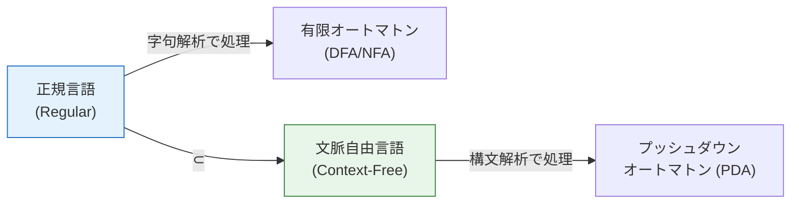
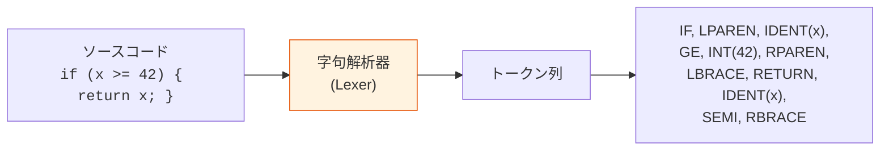
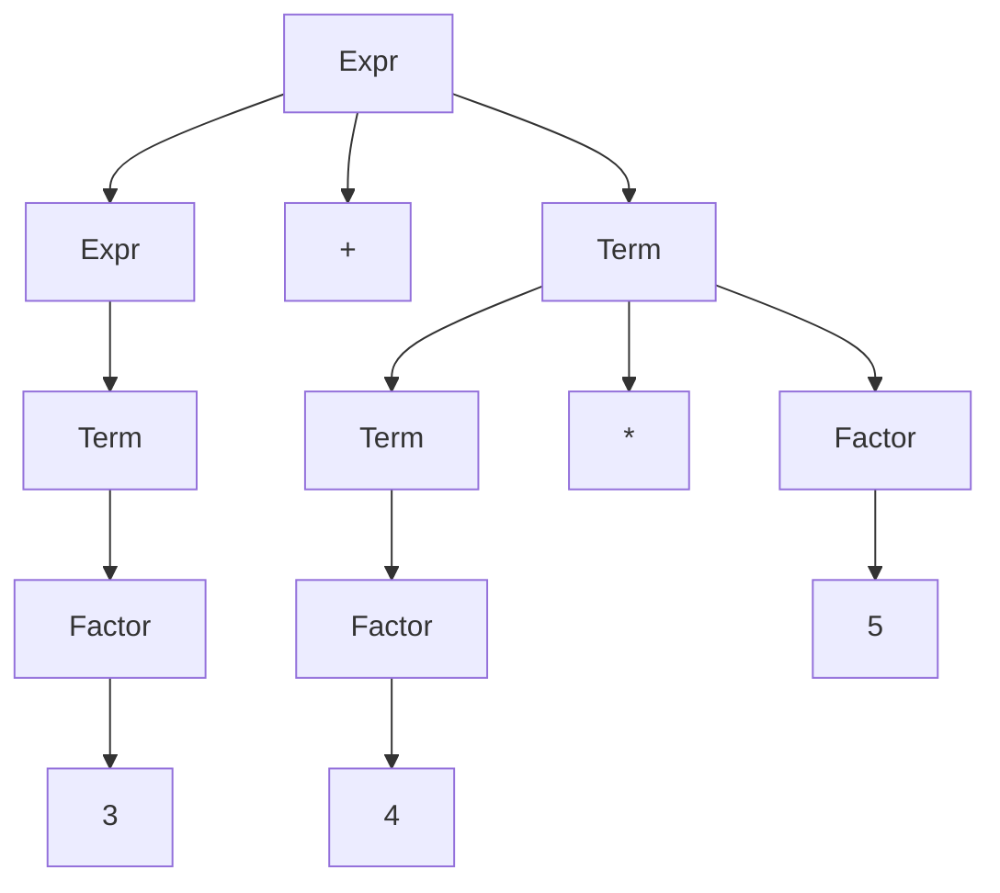
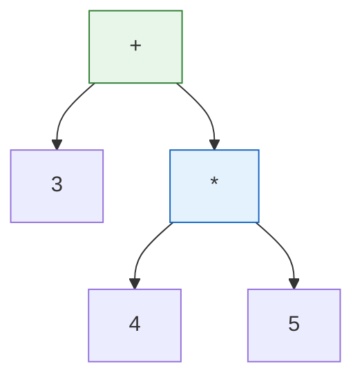
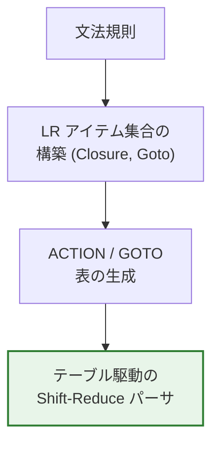
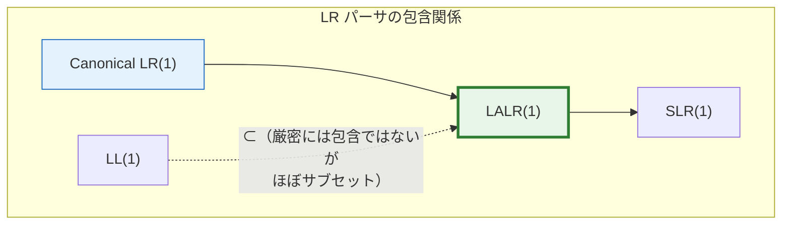
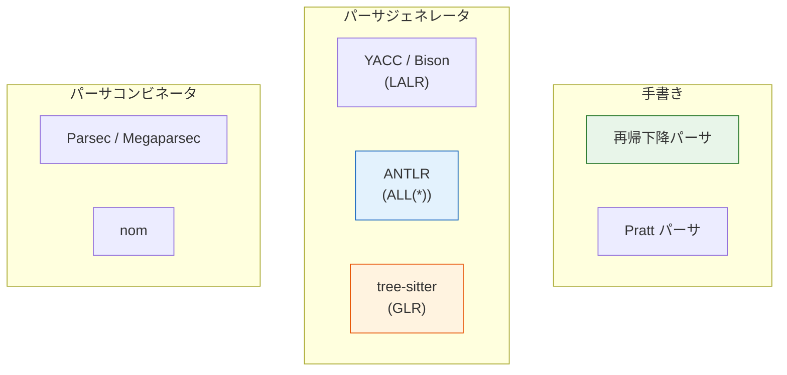
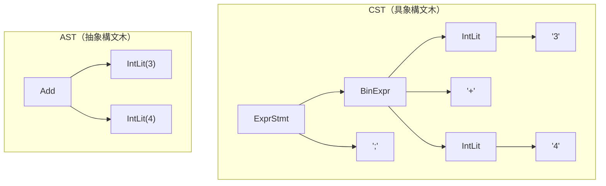

# 字句解析と構文解析 — コンパイラフロントエンドの基盤技術

## 1. 背景と動機

プログラミング言語の処理系——コンパイラやインタプリタ——を構築する際、最初に解決しなければならない問題は「人間が書いたソースコードという単なるテキストを、計算機が操作可能な構造化された表現に変換する」ことである。この変換を担うのが**コンパイラフロントエンド**であり、その中核を成すのが**字句解析（lexical analysis / lexing）**と**構文解析（syntactic analysis / parsing）**の2つのフェーズである。

```
ソースコード (文字列)
    ↓ 字句解析 (lexing)
トークン列
    ↓ 構文解析 (parsing)
構文木 (parse tree / AST)
    ↓ 意味解析 (semantic analysis)
型付き AST / 注釈付き AST
    ↓ 中間表現生成 / 最適化 / コード生成
実行可能コード
```

### 1.1 なぜ2段階に分けるのか

字句解析と構文解析を分離する設計は、1960年代にコンパイラ構築の理論が整備されて以来の標準的なアプローチである。この分離には、以下の本質的な理由がある。

**理論的な理由：Chomsky 階層との対応**

字句解析が扱うのは**正規言語（regular language）**——識別子、数値リテラル、キーワードといった「単語」レベルの構造——であり、有限オートマトンで認識できる。一方、構文解析が扱うのは**文脈自由言語（context-free language）**——入れ子の括弧、再帰的な式の構造——であり、プッシュダウンオートマトン（スタックを持つ計算モデル）を必要とする。



この対応関係に基づき、各フェーズに最適なアルゴリズムを適用できる。字句解析には高速な有限オートマトンを、構文解析にはより表現力の高いアルゴリズムを使い分けることで、効率性と表現力を両立させている。

**実用的な理由**

- **関心の分離**：空白文字の処理、コメントの除去、文字エンコーディングの正規化といった「テキストレベルの雑事」を字句解析に押し込めることで、構文解析の文法記述を簡潔に保てる
- **性能の向上**：文字単位の処理からトークン単位の処理に移行することで、構文解析器の入力サイズが大幅に削減される
- **エラー報告の改善**：トークンにソース位置情報を付与することで、構文エラーの報告が正確になる
- **移植性**：字句解析器のみを変更することで、異なる文字エンコーディングやプリプロセッサ指令に対応できる

### 1.2 歴史的文脈

字句解析と構文解析の理論は、1950年代から1960年代にかけて急速に発展した。

- **1956年**: Noam Chomsky が形式言語の階層を定式化（Chomsky 階層）
- **1960年**: ALGOL 60 の仕様が BNF（Backus-Naur Form）で記述される——プログラミング言語に文脈自由文法を適用した最初の重要な事例
- **1965年**: Donald Knuth が LR パーサの理論を発表
- **1968年**: Jay Earley が任意の CFG を解析できる Earley パーサを提案
- **1969年**: Stephen C. Johnson と Alfred V. Aho によるパーサジェネレータの研究が進展
- **1975年**: Lex（字句解析器生成系）が開発される
- **1975年**: Stephen C. Johnson が YACC（Yet Another Compiler-Compiler）を開発
- **1985年**: LALR パーサを使った GNU Bison が公開される
- **2004年**: Bryan Ford が PEG（Parsing Expression Grammar）を形式化

::: tip 本記事の位置づけ
本記事では、字句解析と構文解析の理論的基盤から実装技法、そして現代の実用ツールまでを一貫して解説する。関連記事として、[有限オートマトンと正規言語](/finite-automata)では正規言語の理論を、[文脈自由文法とパーサ](/parsing-techniques)では構文解析アルゴリズムの詳細を、[抽象構文木（AST）の設計と応用](/abstract-syntax-tree)では構文解析の出力であるASTの設計をそれぞれ深掘りしている。本記事は、字句解析から構文解析までの**フロントエンド全体の流れ**を俯瞰することに主眼を置く。
:::

## 2. 字句解析（Lexical Analysis）

### 2.1 字句解析の役割

字句解析器（lexer、scanner、tokenizer とも呼ぶ）は、ソースコードの文字列を**トークン（token）**の列に変換する。トークンは、プログラムを構成する最小の意味単位である。



トークンは通常、以下の情報を持つ。

| 属性 | 説明 | 例 |
|------|------|-----|
| トークン種別（token type / kind） | トークンのカテゴリ | `IDENT`, `INT_LITERAL`, `IF` |
| 字句（lexeme） | ソースコード上の実際の文字列 | `"x"`, `"42"`, `"if"` |
| 位置情報 | ファイル名、行番号、列番号 | `main.c:3:5` |

典型的なプログラミング言語では、トークンは以下のカテゴリに分類される。

- **キーワード**: `if`, `else`, `while`, `return`, `class` など
- **識別子（identifier）**: 変数名、関数名、型名
- **リテラル**: 整数リテラル、浮動小数点リテラル、文字列リテラル
- **演算子**: `+`, `-`, `*`, `/`, `==`, `!=`, `>=` など
- **区切り記号**: `(`, `)`, `{`, `}`, `;`, `,` など
- **コメント**: 通常は字句解析段階で除去される（ただしドキュメントコメントは保持する場合もある）

### 2.2 正規表現によるトークン定義

各トークン種別は、**正規表現（regular expression）**によって定義できる。正規表現は正規言語を記述するための表記法であり、有限オートマトンと等価な表現力を持つ。

以下に、典型的なプログラミング言語のトークン定義例を示す。

```
// Token definitions as regular expressions
IDENT       = [a-zA-Z_][a-zA-Z0-9_]*
INT_LIT     = [0-9]+
FLOAT_LIT   = [0-9]+ '.' [0-9]+ ([eE] [+-]? [0-9]+)?
STRING_LIT  = '"' [^"\\]* ( '\\' . [^"\\]* )* '"'
WHITESPACE  = [ \t\r\n]+
LINE_COMMENT = '//' [^\n]*
BLOCK_COMMENT = '/*' ( [^*] | '*'+ [^*/] )* '*'+ '/'
```

::: warning キーワードと識別子の曖昧性
`if` や `while` といったキーワードは、識別子の正規表現パターンにもマッチする。この曖昧性は通常、**最長一致（longest match / maximal munch）**ルールと**優先度ルール**によって解決される。同じ長さにマッチする場合、キーワードのパターンが識別子よりも優先される。
:::

### 2.3 有限オートマトンによる実装

正規表現で定義されたトークンパターンは、**有限オートマトン（finite automaton）**によって効率的に認識できる。字句解析器の構築には、以下の2つのアプローチがある。

**NFA（非決定性有限オートマトン）経由のアプローチ**

1. 各トークンの正規表現を NFA に変換する（Thompson の構成法）
2. すべての NFA を ε 遷移で結合して1つの NFA にする
3. 部分集合構成法（subset construction）で NFA を DFA に変換する
4. DFA の状態を最小化する（Hopcroft のアルゴリズム）


**直接DFAを構成するアプローチ**

正規表現の構文木から直接 DFA を構成する方法もある。各リーフ（文字クラス）について `firstpos`, `lastpos`, `followpos` を計算し、DFA の状態遷移表を構築する。

**最長一致と優先度**

字句解析器は以下の2つの規則に従って動作する。

1. **最長一致（longest match）**: 可能な限り長くマッチするトークンを選択する。例えば `>=` は `>` と `=` の2つのトークンではなく、1つの `GE` トークンとして認識される
2. **優先度（priority）**: 同じ長さのマッチが複数ある場合、定義順が早い（優先度が高い）パターンを選択する。キーワード `if` は識別子 `IDENT` よりも優先される

この動作は、DFA の各受理状態に対応するトークン種別を記録し、入力の末尾まで読み進んだ後に最後の受理状態まで巻き戻すことで実現される。

### 2.4 手書き字句解析器の実装パターン

パーサジェネレータを使わず手書きする場合、字句解析器は典型的に以下のような構造を取る。

```rust
// Token type definition
#[derive(Debug, Clone, PartialEq)]
enum TokenKind {
    // Keywords
    If, Else, While, Return, Fn, Let,
    // Literals
    IntLit(i64),
    FloatLit(f64),
    StringLit(String),
    Ident(String),
    // Operators
    Plus, Minus, Star, Slash,
    Eq, Ne, Lt, Gt, Le, Ge,
    Assign,
    // Delimiters
    LParen, RParen, LBrace, RBrace,
    Semicolon, Comma,
    // Special
    Eof,
}

#[derive(Debug, Clone)]
struct Token {
    kind: TokenKind,
    span: Span, // source location
}

struct Lexer<'a> {
    input: &'a [u8],
    pos: usize,
    line: usize,
    col: usize,
}

impl<'a> Lexer<'a> {
    fn next_token(&mut self) -> Result<Token, LexError> {
        self.skip_whitespace_and_comments();

        if self.pos >= self.input.len() {
            return Ok(self.make_token(TokenKind::Eof));
        }

        let start = self.pos;
        let ch = self.input[self.pos];

        match ch {
            b'(' => { self.advance(); Ok(self.make_token(TokenKind::LParen)) }
            b')' => { self.advance(); Ok(self.make_token(TokenKind::RParen)) }
            b'+' => { self.advance(); Ok(self.make_token(TokenKind::Plus)) }
            b'>' => {
                self.advance();
                if self.peek() == Some(b'=') {
                    self.advance();
                    Ok(self.make_token(TokenKind::Ge))
                } else {
                    Ok(self.make_token(TokenKind::Gt))
                }
            }
            b'0'..=b'9' => self.lex_number(),
            b'a'..=b'z' | b'A'..=b'Z' | b'_' => self.lex_identifier_or_keyword(),
            b'"' => self.lex_string(),
            _ => Err(LexError::UnexpectedChar(ch as char)),
        }
    }

    fn lex_identifier_or_keyword(&mut self) -> Result<Token, LexError> {
        let start = self.pos;
        // Consume alphanumeric characters and underscores
        while self.pos < self.input.len()
            && (self.input[self.pos].is_ascii_alphanumeric()
                || self.input[self.pos] == b'_')
        {
            self.advance();
        }
        let lexeme = &self.input[start..self.pos];
        let kind = match lexeme {
            b"if"     => TokenKind::If,
            b"else"   => TokenKind::Else,
            b"while"  => TokenKind::While,
            b"return" => TokenKind::Return,
            b"fn"     => TokenKind::Fn,
            b"let"    => TokenKind::Let,
            _         => TokenKind::Ident(
                String::from_utf8_lossy(lexeme).into_owned()
            ),
        };
        Ok(self.make_token(kind))
    }
}
```

この「先頭1文字（ときに2文字）を見て分岐し、対応するトークンを読み取る」というパターンは、実質的に手書きの DFA と等価である。GCC、Clang、Go、Rust、V8（JavaScript）など、多くの主要な処理系の字句解析器が手書きで実装されている。その理由は以下のとおりである。

- 自動生成よりもエラーメッセージを精密に制御できる
- 特殊なトークン（テンプレートリテラル、ヒアドキュメントなど）の処理が容易
- 性能を最大限に引き出せる
- 字句解析は構文解析に比べてアルゴリズムが単純であり、手書きのコストが低い

### 2.5 字句解析の困難な事例

一見単純に見える字句解析にも、実際のプログラミング言語では厄介なケースが存在する。

**文脈依存トークン化**

C++ の `>>` 問題が典型例である。`vector<vector<int>>` の末尾の `>>` は2つの `>` トークン（テンプレートの閉じ括弧）だが、右シフト演算子 `>>` と字句的に区別できない。C++11 以降では、この問題をパーサ側でコンテキストに応じて解決する（字句解析器は `>>` を1つのトークンとして生成し、パーサがテンプレート文脈で分割する）。

**ネストされたコメント**

通常のブロックコメント `/* ... */` はネストしない（正規言語で認識可能）が、一部の言語（Haskell、Swift、Rust など）ではネストされたブロックコメント `/* outer /* inner */ still comment */` を許容する。ネストされたコメントは正規言語ではないため、字句解析器にカウンタを持たせるか、構文解析で処理する必要がある。

**文字列補間**

`"Hello, ${name}!"` のような文字列補間は、文字列リテラルの内部に式が埋め込まれるため、字句解析器と構文解析器が協調して処理しなければならない。典型的には、字句解析器が `STRING_START`, `EXPR_START`, `EXPR_END`, `STRING_END` といった複数のトークンに分割して出力する。

**インデント感応構文**

Python や Haskell のようにインデントで構造を表現する言語では、字句解析器が行頭のインデントレベルを追跡し、`INDENT` と `DEDENT` という仮想的なトークンを挿入する。この処理にはスタックが必要であり、厳密には正規言語の範囲を超えている。

## 3. 構文解析（Parsing）の基礎

### 3.1 文脈自由文法（CFG）

構文解析の理論的基盤は**文脈自由文法（Context-Free Grammar, CFG）**である。CFG は4つ組 $G = (V, \Sigma, P, S)$ として定義される。

- $V$：**非終端記号（nonterminal）**の有限集合——構文的カテゴリを表す
- $\Sigma$：**終端記号（terminal）**の有限集合——トークンに対応する
- $P$：**生成規則（production rule）**の有限集合——$A \to \alpha$ の形（$A \in V$, $\alpha \in (V \cup \Sigma)^*$）
- $S$：**開始記号（start symbol）**——$S \in V$

以下に、四則演算を含む簡単な式の文法を示す。

```
// Grammar for arithmetic expressions
Expr   → Expr '+' Term
       | Expr '-' Term
       | Term

Term   → Term '*' Factor
       | Term '/' Factor
       | Factor

Factor → '(' Expr ')'
       | NUMBER
       | IDENT
```

この文法は、演算子の優先順位（`*`, `/` が `+`, `-` より高い）と結合性（左結合）を文法構造によって明示的に表現している。

### 3.2 導出と構文木

文法から具体的なトークン列を生成する過程を**導出（derivation）**と呼ぶ。例えば、式 `3 + 4 * 5` は以下のように導出される。

```
Expr
  → Expr '+' Term          (Expr → Expr '+' Term)
  → Term '+' Term          (Expr → Term)
  → Factor '+' Term        (Term → Factor)
  → 3 '+' Term             (Factor → NUMBER)
  → 3 '+' Term '*' Factor  (Term → Term '*' Factor)
  → 3 '+' Factor '*' Factor (Term → Factor)
  → 3 '+' 4 '*' Factor    (Factor → NUMBER)
  → 3 '+' 4 '*' 5         (Factor → NUMBER)
```

この導出過程を木構造として表現したものが**構文木（parse tree）**である。



構文木は文法の構造を忠実に反映するが、冗長な情報を含む。実用的には、不要な中間ノードを省略した**抽象構文木（Abstract Syntax Tree, AST）**に変換される。



### 3.3 曖昧な文法

1つの入力文字列に対して複数の異なる構文木を生成できる文法を**曖昧な文法（ambiguous grammar）**と呼ぶ。

古典的な例は **dangling else** 問題である。

```
Stmt → 'if' Expr 'then' Stmt
     | 'if' Expr 'then' Stmt 'else' Stmt
     | OTHER
```

入力 `if E1 then if E2 then S1 else S2` に対して、`else S2` が外側の `if` と内側の `if` のどちらに属するかが曖昧になる。多くの言語では「最も近い `if` にマッチさせる」規則を採用するが、これは文法だけでは表現できず、パーサの動作規則として組み込む必要がある。

曖昧性の解決方法にはいくつかのアプローチがある。

1. **文法の書き換え**：曖昧性のない等価な文法に変換する
2. **優先度・結合性の宣言**：パーサジェネレータに演算子の優先度と結合性を指示する
3. **パーサの動作規則**：shift/reduce 衝突をデフォルトルール（「shift を優先」）で解決する

## 4. トップダウン構文解析

トップダウン構文解析は、開始記号から出発して入力トークン列を生成する導出を探索する手法である。直感的に理解しやすく、手書き実装に適している。

### 4.1 再帰下降パーサ（Recursive Descent Parser）

**再帰下降パーサ**は、文法の各非終端記号に対して1つの関数を定義し、相互再帰呼び出しによって構文解析を行う手法である。最も直感的かつ広く使われている構文解析手法であり、GCC、Clang、Go、Rust、TypeScript、V8 など多くの主要な処理系で採用されている。

```rust
struct Parser {
    tokens: Vec<Token>,
    pos: usize,
}

impl Parser {
    // Expr → Term (('+' | '-') Term)*
    fn parse_expr(&mut self) -> Result<Ast, ParseError> {
        let mut left = self.parse_term()?;
        while self.check(TokenKind::Plus) || self.check(TokenKind::Minus) {
            let op = self.advance(); // consume operator
            let right = self.parse_term()?;
            left = Ast::BinOp {
                op: op.kind,
                left: Box::new(left),
                right: Box::new(right),
            };
        }
        Ok(left)
    }

    // Term → Factor (('*' | '/') Factor)*
    fn parse_term(&mut self) -> Result<Ast, ParseError> {
        let mut left = self.parse_factor()?;
        while self.check(TokenKind::Star) || self.check(TokenKind::Slash) {
            let op = self.advance();
            let right = self.parse_factor()?;
            left = Ast::BinOp {
                op: op.kind,
                left: Box::new(left),
                right: Box::new(right),
            };
        }
        Ok(left)
    }

    // Factor → '(' Expr ')' | NUMBER | IDENT
    fn parse_factor(&mut self) -> Result<Ast, ParseError> {
        if self.check(TokenKind::LParen) {
            self.advance(); // consume '('
            let expr = self.parse_expr()?;
            self.expect(TokenKind::RParen)?; // consume ')'
            Ok(expr)
        } else if let Some(n) = self.try_consume_int() {
            Ok(Ast::IntLit(n))
        } else if let Some(name) = self.try_consume_ident() {
            Ok(Ast::Ident(name))
        } else {
            Err(ParseError::Unexpected(self.current_token()))
        }
    }
}
```

ここで注目すべき点は、元の文法を**左再帰を除去した形**に変換していることである。元の文法 `Expr → Expr '+' Term | Term` は左再帰を含んでおり、再帰下降パーサで直接実装すると無限再帰に陥る。これを `Expr → Term (('+' | '-') Term)*` という繰り返し形式に変換（EBNF 記法）することで、ループとして実装できる。

### 4.2 LL(k) パーサ

**LL(k) パーサ**は、入力を**左から右に**（Left-to-right）読み、**最左導出**（Leftmost derivation）を行い、先読み **k トークン**で生成規則を決定するパーサである。

LL(1) パーサの動作を決定するために、以下の2つの集合を計算する。

**FIRST 集合**: 非終端記号 $A$ から導出可能な文字列の先頭終端記号の集合

$$
\text{FIRST}(\alpha) = \{ a \in \Sigma \mid \alpha \Rightarrow^* a\beta \} \cup \begin{cases} \{\epsilon\} & \text{if } \alpha \Rightarrow^* \epsilon \end{cases}
$$

**FOLLOW 集合**: 非終端記号 $A$ の直後に出現しうる終端記号の集合

$$
\text{FOLLOW}(A) = \{ a \in \Sigma \mid S \Rightarrow^* \alpha A a \beta \}
$$

これらを用いて**予測構文解析表（predictive parsing table）**を構築する。生成規則 $A \to \alpha$ に対して、FIRST($\alpha$) に含まれる各終端記号 $a$ について $M[A, a] = A \to \alpha$ とエントリを設定する。$\epsilon \in \text{FIRST}(\alpha)$ の場合は、FOLLOW($A$) に含まれる各終端記号 $b$ について $M[A, b] = A \to \alpha$ も設定する。

表のいずれかのセルに複数のエントリが入る場合、その文法は LL(1) 文法ではない。

**LL(1) 文法の制約**

LL(1) 文法にはいくつかの制約がある。

- **左再帰の禁止**：直接的・間接的な左再帰を持つ文法は LL(1) にならない
- **左因子分解の必要性**：`A → αβ | αγ` のように共通接頭辞を持つ生成規則は、`A → αA'`, `A' → β | γ` のように分解する必要がある
- **曖昧性の禁止**：曖昧な文法は LL(k) にならない

### 4.3 Pratt パーサ（Pratt Parsing / Top-Down Operator Precedence）

**Pratt パーサ**は、Vaughan Pratt が1973年に発表した演算子優先順位に基づくトップダウン構文解析手法である。再帰下降パーサの一種でありながら、演算子の優先順位と結合性を表として宣言的に扱えるため、式の構文解析に極めて適している。

Pratt パーサの核心は、各トークンに2つの解析関数を関連付ける点にある。

- **nud（null denotation）**：前置位置のトークン処理（リテラル、前置演算子、括弧など）
- **led（left denotation）**：中置位置のトークン処理（二項演算子、後置演算子など）

そして、各中置演算子に**束縛力（binding power）**を割り当てる。

```python
# Pratt parser implementation
def parse_expr(self, min_bp=0):
    # Parse prefix (nud)
    tok = self.advance()
    left = self.nud(tok)

    # Parse infix/postfix (led) while binding power is high enough
    while self.peek_bp() > min_bp:
        tok = self.advance()
        left = self.led(tok, left)

    return left

def nud(self, tok):
    if tok.kind == INT_LIT:
        return AstIntLit(tok.value)
    elif tok.kind == MINUS:
        # Prefix minus (unary)
        operand = self.parse_expr(PREFIX_BP)
        return AstUnary(MINUS, operand)
    elif tok.kind == LPAREN:
        expr = self.parse_expr(0)
        self.expect(RPAREN)
        return expr

def led(self, tok, left):
    if tok.kind in (PLUS, MINUS, STAR, SLASH):
        # Left-associative: use bp for right side
        # Right-associative: use bp - 1 for right side
        bp = self.infix_bp(tok.kind)
        right = self.parse_expr(bp)  # left-assoc
        return AstBinOp(tok.kind, left, right)
```

Pratt パーサの利点は以下のとおりである。

- 演算子の追加が容易（束縛力を設定するだけ）
- 右結合演算子、前置・後置演算子、三項演算子を統一的に扱える
- コードが簡潔で、再帰の深さが制御しやすい
- 多くの現代の処理系（rustc、RustのRA（rust-analyzer）、Presto/Trino のSQLパーサなど）で採用されている

### 4.4 PEG（Parsing Expression Grammar）

**PEG（Parsing Expression Grammar）**は、Bryan Ford が2004年に形式化した構文解析のための形式体系である。CFG と表面的には似ているが、本質的に異なる性質を持つ。

PEG の最大の特徴は、選択演算子 `/`（ordered choice）が**順序付き**である点だ。CFG の `|`（非順序的選択）とは異なり、PEG では最初にマッチした選択肢が採用される。このため、PEG には曖昧性が存在しない。

```
// PEG for arithmetic expressions
Expr    ← Term ('+' Term / '-' Term)*
Term    ← Factor ('*' Factor / '/' Factor)*
Factor  ← '(' Expr ')' / Number / Ident
Number  ← [0-9]+
Ident   ← [a-zA-Z_] [a-zA-Z0-9_]*
```

PEG の演算子は以下のとおりである。

| 演算子 | 意味 |
|--------|------|
| `e1 e2` | 連接（sequence） |
| `e1 / e2` | 順序付き選択（ordered choice） |
| `e*` | 0回以上の繰り返し（zero-or-more） |
| `e+` | 1回以上の繰り返し（one-or-more） |
| `e?` | オプション（optional） |
| `&e` | 肯定先読み（and-predicate） |
| `!e` | 否定先読み（not-predicate） |

**Packrat パーサ**

PEG を効率的に実装する手法が**Packrat パーサ**である。素朴にバックトラッキングを行うと最悪指数時間になりうるが、Packrat パーサはメモ化（memoization）により、一度試した位置と非終端記号の組み合わせの結果をキャッシュする。これにより、入力長に対して線形時間 $O(n)$ での解析を保証する。代償として、メモ化テーブルのために $O(n \times |V|)$（$|V|$ は非終端記号の数）のメモリを消費する。

**PEG と CFG の関係**

PEG は CFG のスーパーセットでもサブセットでもなく、別の形式体系である。

- PEG で表現できるが CFG で表現できない言語が存在する（先読みの活用）
- CFG で生成される言語で PEG では認識できないものが存在するかは未解決問題
- PEG は本質的に「認識器（recognizer）」であり、生成的な意味論を持たない
- PEG の順序付き選択は、意図しない言語を認識してしまう場合がある（順序の誤りによるバグ）

## 5. ボトムアップ構文解析

ボトムアップ構文解析は、入力トークン列から出発して、生成規則を逆に適用（**還元 / reduce**）しながら開始記号に到達する手法である。トップダウン手法よりも広いクラスの文法を扱える。

### 5.1 Shift-Reduce パーサの基本動作

ボトムアップ構文解析の基本は**シフト・還元（shift-reduce）**操作である。パーサはスタックと入力バッファを持ち、以下の4つの操作を繰り返す。

| 操作 | 説明 |
|------|------|
| **Shift** | 入力の先頭トークンをスタックに積む |
| **Reduce** | スタックの先頭が文法規則の右辺にマッチするとき、左辺の非終端記号に置き換える |
| **Accept** | スタックに開始記号のみが残り、入力が空になったとき、解析成功 |
| **Error** | 上記のどの操作も適用できないとき、構文エラー |

例として、式 `3 + 4 * 5` の解析過程を追跡する（文法: `E → E+T | T`, `T → T*F | F`, `F → num`）。

```
Stack                 Input           Action
                      3 + 4 * 5 $
3                     + 4 * 5 $       Shift
F                     + 4 * 5 $       Reduce F → num
T                     + 4 * 5 $       Reduce T → F
E                     + 4 * 5 $       Reduce E → T
E +                   4 * 5 $         Shift
E + 4                 * 5 $           Shift
E + F                 * 5 $           Reduce F → num
E + T                 * 5 $           Reduce T → F
E + T *               5 $             Shift
E + T * 5             $               Shift
E + T * F             $               Reduce F → num
E + T                 $               Reduce T → T * F
E                     $               Reduce E → E + T
                      $               Accept
```

注目すべき点は、`E + T` の状態で次の入力が `*` のとき、Reduce（`E → E + T`）ではなく Shift を選択している点である。`*` は `+` よりも優先順位が高いためだ。この判断をいかに自動化するかが、LR パーサ群の理論の核心である。

### 5.2 LR パーサ

**LR(k) パーサ**は、入力を**左から右に**（Left-to-right）読み、**最右導出の逆**（Rightmost derivation in reverse）を構成し、先読み **k トークン**で操作を決定するパーサである。

LR パーサはDFA を使って「パーサ状態」を管理する。各状態は**LR アイテム（LR item）**の集合である。LR(0) アイテムは、生成規則中の現在の解析位置を示す。

```
// LR(0) items for E → E + T
E → . E + T    (dot at the beginning)
E → E . + T    (dot after E)
E → E + . T    (dot after +)
E → E + T .    (dot at the end — ready to reduce)
```

ドット `.` が右辺の末尾に達したアイテムは、還元が可能であることを示す。

LR パーサの構築は、以下のステップで行われる。

1. 文法に拡張規則 $S' \to S$ を追加する
2. LR アイテムの集合（**正準 LR アイテム集合**）を計算する
3. アイテム集合間の遷移関係から **ACTION 表**と **GOTO 表**を構築する



### 5.3 SLR, LALR, Canonical LR の比較

LR パーサには、表の構築方法によっていくつかの変種がある。表現力と表サイズのトレードオフが存在する。

| 手法 | 状態数 | 表現力 | 実用性 |
|------|--------|--------|--------|
| **SLR(1)** | 少ない | 最も制限的 | 学習用 |
| **LALR(1)** | SLR と同じ | SLR より広い | 実用的（yacc/bison） |
| **Canonical LR(1)** | 最も多い | 最も広い | 表が巨大 |

**SLR(1)** は、還元の判断に FOLLOW 集合を使用する。単純だが、FOLLOW 集合が粗い近似であるため、偽の衝突（実際には衝突しない場合に衝突を検出してしまうこと）が起こりうる。

**LALR(1)**（Look-Ahead LR）は、各 LR(1) アイテムに固有の先読み集合（lookahead set）を計算する。SLR よりも正確な還元判断が可能で、かつ Canonical LR(1) と同じ状態数（SLR と等しい）に抑えられる。YACC や Bison が採用している手法であり、実用上最も広く使われている。

**Canonical LR(1)** は、先読み記号をアイテムに含めた完全な LR(1) アイテム集合を構築する。最も広いクラスの文法を扱えるが、状態数が爆発的に増加する。実用的には LALR(1) で十分なケースがほとんどであるため、あまり使われない。



### 5.4 GLR パーサ（Generalized LR）

**GLR パーサ**は、Masaru Tomita が1984年に提案した手法で、**任意の文脈自由文法**（曖昧な文法を含む）を解析できる。LR パーサで shift/reduce 衝突や reduce/reduce 衝突が発生した場合、GLR パーサは**すべての可能な操作を並行して追跡する**。これは、パーサスタックを分岐させることで実現する（Graph-Structured Stack, GSS）。

GLR パーサは以下の場面で有用である。

- **自然言語処理**：自然言語の文法は本質的に曖昧であり、すべての解析候補を列挙する必要がある
- **C/C++ の構文解析**：`T * x;` がポインタ宣言か乗算文かは型情報がないと判断できない。GLR パーサで両方の解析を保持し、意味解析で曖昧性を解決する
- **tree-sitter**: エディタ向けの構文解析ライブラリである tree-sitter は GLR パーサを採用している

曖昧でない文法に対しては GLR パーサの時間計算量は $O(n)$ であり、最悪の場合（最大限に曖昧な文法）でも $O(n^3)$ に収まる。

## 6. パーサジェネレータと実用ツール

### 6.1 YACC / Bison

**YACC（Yet Another Compiler-Compiler）**は、1975年に Stephen C. Johnson が AT&T Bell Labs で開発した、歴史上最も影響力のあるパーサジェネレータである。**GNU Bison** はその GNU 互換実装であり、現在も広く使用されている。

YACC/Bison は LALR(1) パーサを生成する。入力は、文法規則とセマンティックアクション（還元時に実行されるコード）を記述した `.y` ファイルである。

```yacc
/* Bison grammar for arithmetic expressions */
%{
#include <stdio.h>
int yylex(void);
void yyerror(const char *s);
%}

%token NUMBER IDENT
%left '+' '-'
%left '*' '/'

%%

expr: expr '+' expr   { $$ = $1 + $3; }
    | expr '-' expr   { $$ = $1 - $3; }
    | expr '*' expr   { $$ = $1 * $3; }
    | expr '/' expr   { $$ = $1 / $3; }
    | '(' expr ')'    { $$ = $2; }
    | NUMBER           { $$ = $1; }
    ;

%%
```

`%left` と `%right` 宣言により、演算子の結合性と優先順位を指定できる。これにより、本来は曖昧な文法（`expr: expr '+' expr` のような左再帰的かつ曖昧な規則）でも、衝突を自動的に解決できる。

**YACC/Bison の特徴と限界**

- LALR(1) の表現力の範囲に限定される
- セマンティックアクション中に任意のC言語コードを記述できるため、強力だが保守が難しい
- エラーメッセージのカスタマイズが難しい
- 生成されるパーサは高速だが、テーブルサイズが大きくなることがある

### 6.2 ANTLR

**ANTLR（Another Tool for Language Recognition）**は、Terence Parr が開発した LL(*) / ALL(*) ベースのパーサジェネレータである。ANTLR 4（2013年〜）は、**ALL(*)**（Adaptive LL(*)）アルゴリズムを採用しており、任意の先読み長で生成規則を決定できる。

```antlr
// ANTLR4 grammar for arithmetic expressions
grammar Expr;

expr: expr ('*' | '/') expr   # MulDiv
    | expr ('+' | '-') expr   # AddSub
    | '(' expr ')'            # Parens
    | INT                     # Int
    | ID                      # Id
    ;

INT: [0-9]+;
ID:  [a-zA-Z_] [a-zA-Z0-9_]*;
WS:  [ \t\r\n]+ -> skip;
```

ANTLR の特筆すべき特徴は以下のとおりである。

- **左再帰のサポート**：ANTLR 4 は直接左再帰（`expr: expr '+' expr`）を自動的に書き換えて処理できる。これは LL ベースのパーサとしては画期的
- **Visitor / Listener パターン**：パース木を走査するための Visitor パターンと Listener パターンを自動生成する。セマンティックアクションを文法ファイルから分離できるため、保守性が高い
- **マルチ言語サポート**：Java, C#, Python, Go, JavaScript, TypeScript, C++ など多数の言語向けにコードを生成できる
- **IDE サポート**：文法のシンタックスハイライト、自動補完、デバッグ支援ツールが充実している

### 6.3 tree-sitter

**tree-sitter**は、Max Brunsfeld が GitHub 向けに開発した構文解析ライブラリで、エディタやIDEにおける構文ハイライト、コードナビゲーション、構造的な編集のために設計されている。以下の特筆すべき特性を持つ。

**GLR ベースの解析**

tree-sitter は GLR パーサを採用しており、LR の表現力を超えた曖昧な文法も処理できる。言語文法は JavaScript/JSON ベースの DSL で記述し、C言語のパーサコードを生成する。

**増分パーシング（Incremental Parsing）**

tree-sitter の最も革新的な特徴は**増分パーシング**のサポートである。ソースコードの一部が変更されたとき、構文木全体を再構築するのではなく、変更の影響を受ける部分のみを再解析する。これにより、キーストロークごとの即座の構文解析更新が可能になる。


**エラー耐性（Error Recovery）**

エディタでの使用では、編集中のソースコードは常に構文的に不完全である。tree-sitter は不完全なコードに対しても「最善」の構文木を生成し、エラーノードを挿入することで解析を継続する。

**広範な言語サポート**

tree-sitter には、主要なプログラミング言語（C, C++, Rust, Python, JavaScript, TypeScript, Go, Java, Ruby, Haskell など）の文法定義が用意されており、エディタ（Neovim, Helix, Zed, Emacs）やコード解析ツール（GitHub Linguist, ast-grep）で広く使用されている。

### 6.4 パーサコンビネータ

**パーサコンビネータ**は、パーサを「値」として扱い、小さなパーサを組み合わせ（combine）て大きなパーサを構築する関数型プログラミングのアプローチである。外部ツールに依存せず、ホスト言語の表現力をそのまま活用できる。

```haskell
-- Haskell parser combinator example (simplified Parsec-style)
-- Parser for arithmetic expressions
expr :: Parser Expr
expr = term `chainl1` addOp

term :: Parser Expr
term = factor `chainl1` mulOp

factor :: Parser Expr
factor = parens expr
     <|> intLiteral
     <|> identifier

addOp :: Parser (Expr -> Expr -> Expr)
addOp = (char '+' >> return Add)
    <|> (char '-' >> return Sub)

mulOp :: Parser (Expr -> Expr -> Expr)
mulOp = (char '*' >> return Mul)
    <|> (char '/' >> return Div)
```

代表的なパーサコンビネータライブラリには以下がある。

| ライブラリ | 言語 | 特徴 |
|-----------|------|------|
| **Parsec** | Haskell | パーサコンビネータの先駆け。モナディックインタフェース |
| **Megaparsec** | Haskell | Parsec の後継。エラーメッセージが改善 |
| **nom** | Rust | ゼロコピー、ストリーミング対応 |
| **combine** | Rust | 型安全、エラー報告が優秀 |
| **FParsec** | F# | 高性能、豊富なプリミティブ |

パーサコンビネータの利点は、ホスト言語の型チェック、IDE 支援、テストフレームワークをそのまま活用できることである。一方、バックトラッキングの制御やエラー報告の品質において、パーサジェネレータに劣る場合がある。

### 6.5 各ツールの比較



| 観点 | 手書き再帰下降 | YACC/Bison | ANTLR | tree-sitter | パーサコンビネータ |
|------|---------------|------------|-------|------------|------------------|
| 文法クラス | LL(k)相当 | LALR(1) | ALL(*) | GLR | LL(k)相当 |
| 学習コスト | 低い | 中程度 | 中程度 | 中程度 | 低〜中 |
| エラー報告 | 優秀 | 不十分 | 良好 | 良好 | 中程度 |
| 性能 | 最高 | 高い | 中程度 | 高い | 中程度 |
| 増分解析 | 困難 | 非対応 | 非対応 | ネイティブ | 非対応 |
| 採用例 | GCC, Clang, Go, Rust | PostgreSQL, Ruby (CRuby) | Kotlin, Groovy | Neovim, Helix, Zed | 学術, DSL |

## 7. 実装考慮事項

### 7.1 エラー回復（Error Recovery）

構文エラーが検出された際、パーサが単に停止するのではなく、可能な限り解析を続行して追加のエラーを報告する機能は、実用的なコンパイラにおいて極めて重要である。

**パニックモード（Panic Mode）**

最も単純かつ広く使われるエラー回復手法である。エラーを検出したら、**同期トークン（synchronization token）**——セミコロン `;`、閉じ括弧 `}`、キーワードなど——に到達するまでトークンを読み飛ばし、そこから解析を再開する。

```rust
fn parse_statement(&mut self) -> Result<Stmt, ParseError> {
    match self.parse_statement_inner() {
        Ok(stmt) => Ok(stmt),
        Err(e) => {
            self.report_error(e);
            // Panic mode: skip tokens until synchronization point
            while !self.at_end() && !self.check(TokenKind::Semicolon)
                && !self.check(TokenKind::RBrace)
            {
                self.advance();
            }
            if self.check(TokenKind::Semicolon) {
                self.advance(); // consume the semicolon
            }
            // Return an error node to continue parsing
            Ok(Stmt::Error)
        }
    }
}
```

**フレーズレベル回復（Phrase-Level Recovery）**

パーサの特定の箇所で、欠落しているトークンを「挿入」したり、余分なトークンを「削除」したりして回復を試みる。例えば、`if (x > 0 { ... }` に対して閉じ括弧 `)` の欠落を検出し、暗黙的に挿入する。

**エラーメッセージの品質**

近年のコンパイラでは、エラーメッセージの品質が重視されている。Rust コンパイラ（rustc）は特にエラー報告の品質で知られており、以下のような工夫をしている。

- エラーの正確なソース位置の表示（アンダーライン付き）
- 想定されるトークンの列挙
- 修正提案（fix suggestion）の自動生成
- 関連するエラーのグループ化

### 7.2 増分パーシング（Incremental Parsing）

エディタやIDEでは、ユーザーがキーを押すたびにソースコード全体を再解析するのは非効率である。**増分パーシング**は、前回の構文木と今回の編集内容から、変更の影響を受ける部分のみを再解析する手法である。

増分パーシングの実現には、以下のアプローチがある。

**tree-sitter のアプローチ**

1. 前回の構文木と、編集操作（挿入位置、削除範囲、新しいテキスト）を入力として受け取る
2. 編集の影響を受けるノード（変更点を含むノードとその祖先）を「無効化」する
3. 無効化されたノードの範囲に対してのみ、パーサを再実行する
4. 再利用可能なサブツリーは前回の構文木からそのまま流用する

この手法により、典型的な編集操作（1文字の挿入・削除）に対しては、ソースファイルのサイズに関わらず一定時間で構文木を更新できる。

**Concrete Syntax Tree（CST）の活用**

増分パーシングを効果的に行うためには、空白やコメントを含む完全な構文木（CST / lossless syntax tree）を保持する必要がある。Rust の rust-analyzer が採用している **Rowan ライブラリ**は、以下の特性を持つCST実装である。

- **イミュータブルなツリー構造**：ノードの変更時に新しいノードを作成し、変更されていないサブツリーを共有する（永続データ構造）
- **子ノードのインデックスアクセス**: $O(1)$ で子ノードにアクセスできる
- **メモリ効率**：ツリー中のノードは16バイト程度の薄いハンドルであり、実際のデータは参照カウントされるバッキングストアに格納される

### 7.3 具象構文木と抽象構文木

構文解析の出力形式として、**具象構文木（Concrete Syntax Tree, CST）**と**抽象構文木（Abstract Syntax Tree, AST）**の2つのアプローチがある。



| 特性 | CST | AST |
|------|-----|-----|
| 空白・コメント | 保持 | 除去 |
| 括弧・区切り文字 | 保持 | 除去 |
| ソースの復元 | 可能 | 不可能 |
| 用途 | フォーマッタ, IDE, リファクタリング | コンパイラ, インタプリタ |
| メモリ使用量 | 大きい | 小さい |

近年では、CST を基盤として AST ビューを提供する「二層アーキテクチャ」が増えている。rust-analyzer の Rowan、TypeScript の AST、Roslyn（C#）コンパイラなどがこのアプローチを採用している。

### 7.4 レキサーハック

一部のプログラミング言語では、字句解析と構文解析の間にフィードバックが必要な場合がある。最も有名な例が C 言語の**レキサーハック（lexer hack / lexer feedback）**である。

C 言語では、`T * x;` という文が2つの意味を持ちうる。

1. `T` が型名の場合：「型 `T` へのポインタ変数 `x` の宣言」
2. `T` が変数名の場合：「`T` と `x` の乗算」

字句解析器は `T` が型名か変数名かを知らなければ、正しいトークン種別（`TYPE_NAME` vs `IDENT`）を割り当てられない。この情報は構文解析中（`typedef` の処理時）に判明するため、パーサから字句解析器にシンボルテーブルをフィードバックする必要がある。


このフィードバックの必要性は、字句解析と構文解析の「きれいな分離」を汚す設計上の妥協であり、多くの新しい言語ではこのような曖昧性を文法設計で避けるようにしている（例：Go では型名が大文字で始まる、Rust ではキーワード `let` で変数宣言を開始する）。

## 8. 実世界での評価

### 8.1 主要な処理系の設計選択

実際のプログラミング言語処理系が、字句解析と構文解析にどのような設計選択をしているかを概観する。

**GCC（GNU Compiler Collection）**

GCC は長い歴史の中で構文解析手法を変遷させてきた。初期の GCC は YACC/Bison で生成した LALR パーサを使用していたが、2004年に C フロントエンドが、2006年に C++ フロントエンドが手書きの再帰下降パーサに移行した。その理由は、C/C++ の複雑な構文（特にテンプレートや宣言の曖昧性）に対する精密なエラー回復と、エラーメッセージの品質向上のためである。

**Clang / LLVM**

Clang は最初から手書きの再帰下降パーサを採用している。C/C++/Objective-C の統一的なフロントエンドとして設計されており、以下の特長を持つ。

- 優秀なエラー診断（具体的な修正提案を含む）
- プリコンパイル済みヘッダ（PCH）による高速化
- モジュラーな設計（字句解析器、プリプロセッサ、パーサが明確に分離）

**Go コンパイラ**

Go は言語設計の時点で構文解析の容易さを考慮している。Go の文法は LALR(1) で解析可能なように設計されており、セミコロン自動挿入ルールも字句解析器で処理される。現在のコンパイラは手書きの再帰下降パーサを使用している。

**Rust コンパイラ（rustc）**

rustc は手書きの再帰下降パーサを使用している。Rust の文法には、マクロ呼び出し `!`、ジェネリクスの `<>`、ライフタイムの `'a` など、文脈依存的なトークン化が必要な要素があり、字句解析器とパーサの協調が重要である。

**TypeScript コンパイラ**

TypeScript コンパイラも手書きの再帰下降パーサであり、JavaScript の完全なスーパーセットを解析する。型注釈やジェネリクスの構文拡張を処理しつつ、高速な解析を維持している。増分コンパイルのサポートも特筆すべき点である。

### 8.2 性能特性

構文解析の性能は、コンパイル時間全体に占める割合としては通常小さい（10-20%程度）が、IDE やエディタでのリアルタイム解析では重要な要素となる。

| 処理系 | 構文解析手法 | 典型的な処理速度 |
|--------|-------------|----------------|
| Clang | 手書き再帰下降 | 〜500 MB/s |
| tree-sitter | GLR（増分） | 初回: 〜100 MB/s, 増分: < 1ms |
| ANTLR 4 | ALL(*) | 〜50-100 MB/s |
| Python (CPython) | 手書き再帰下降 (PEG) | 〜10-30 MB/s |

> [!NOTE]
> 上記の数値は目安であり、文法の複雑さ、入力の特性、ハードウェアによって大きく変動する。構文解析の速度は通常、コンパイル全体のボトルネックにはならない（意味解析、最適化、コード生成の方が時間がかかる）。

### 8.3 最近の動向

**PEGベースのパーサの普及**

CPython は3.9で PEG ベースの新しいパーサに移行した（従来は LL(1) パーサを使用していた）。PEG パーサへの移行により、文法の表現力が向上し、左再帰の自然な記述や、より柔軟な構文拡張が可能になった。

**Language Server Protocol（LSP）と増分解析**

LSP の普及により、構文解析器にはリアルタイムの増分解析能力が求められるようになっている。エディタ上での構文ハイライト、自動補完、リファクタリングなどの機能は、高速で耐障害性のある構文解析器に依存している。

**Error-Resilient Parsing**

不完全なソースコードに対しても有用な構文木を生成する「エラー耐性パーシング」の研究が進んでいる。tree-sitter や rust-analyzer の Rowan が代表的な実装であり、編集中の「壊れた」コードに対しても可能な限り意味のある構文構造を提供する。

**Wasm ベースのパーサの配布**

tree-sitter の文法定義から生成されたパーサを WebAssembly にコンパイルし、ブラウザやエディタ上で実行する手法が普及している。これにより、ネイティブ性能に近い構文解析をプラットフォーム非依存で実現できる。

### 8.4 字句解析・構文解析の設計を選択する際の指針

最後に、実際のプロジェクトで字句解析・構文解析の手法を選択する際の指針をまとめる。

- **プロダクション品質のコンパイラ**を構築する場合：手書きの再帰下降パーサが最有力。エラー報告の品質と性能の両立が可能
- **プロトタイプや学習目的**：ANTLR が最も生産性が高い。文法の記述から動作するパーサまでが短時間で得られる
- **エディタ向けの構文解析**：tree-sitter が標準的な選択肢。増分解析とエラー耐性がネイティブにサポートされる
- **DSL（ドメイン固有言語）の実装**：パーサコンビネータが適している。ホスト言語の型安全性を活用でき、外部ツールの依存がない
- **既存の YACC/Bison 文法がある場合**：そのまま Bison を使い続けるのが合理的。成熟したツールチェーンと豊富な知見がある

字句解析と構文解析は、コンパイラの理論と実践が最も密接に結びついた分野である。1960年代に確立された基礎理論は今日でもそのまま有効であり、同時に、増分パーシングやエラー耐性といった実用上の課題に対する新しいアプローチが絶えず開発されている。この分野の学習は、プログラミング言語の設計を深く理解するための基盤となるだけでなく、データフォーマットのパーサ、設定ファイルの読み込み、テキスト処理ツールの実装といった日常的なプログラミングタスクにも直接応用できる。
